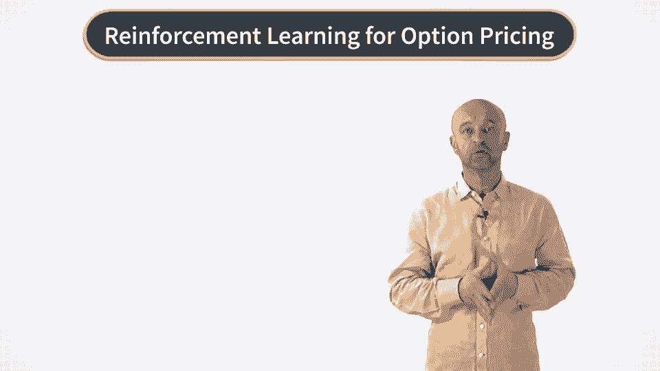

# P22：RL 方法 - 周次介绍 - 兰心飞侠 - BV14P4y1u7TB

欢迎来到我们强化学习与金融课程的第三周。

本周将非常有趣。因为我们将离开基于模型的动态规划方法，转向数据驱动和与模型无关的方式来解决最优期权定价和对冲问题。现在我需要说明一下这里所说的“与模型无关”的意思，尽管我们仍然会讨论一个模型，即马尔可夫决策过程。

在这个语境下，“与模型无关”意味着在数据驱动的环境中，我们只保留模型的一般结构，但不假设转移概率和奖励函数是已知的。传统的定量金融范式认为，为了最优定价和对冲金融资产，我们首先需要构建并估算一个世界模型。

但强化学习范式是不同的，它使我们能够直接关注我们的主要目标——最优控制。根据我们使用的具体算法，任务可能涉及也可能不涉及先构建世界模型的问题。本周我们讨论的方法实际上让我们能够以“与模型无关”的方式进行操作。

我们将从批量模式强化学习开始，然后介绍Q学习，这是强化学习中最著名的算法之一。在介绍了算法的基本版本后，我们将讨论它的更实用版本，称为适应性-优化算法（fit-of-cute-ration）。所有这些内容将不仅以抽象的方式呈现，而是直接在我们的MGP模型中展开。

期权定价方面，我们将立即看到它们在金融环境中的应用。在你本周的作业中，你将实现这些解决方案，并看到它们在实践中的表现。

那么，让我们开始吧。[BLANK_AUDIO]。
