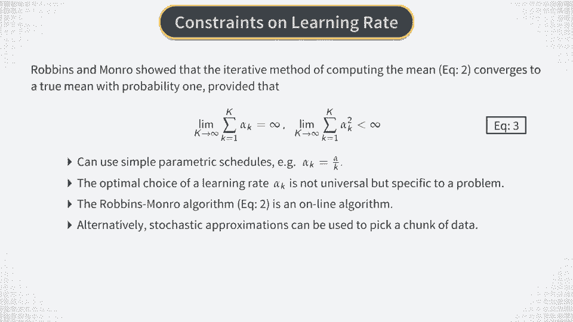

# P24：RL Approach - Stochastic Approximations - 兰心飞侠 - BV14P4y1u7TB

 So in the last video we talked about the setting of batch reinforcement learning and what sort of data it works with。

 Now let's talk about how reinforcement learning works。 When the model is unknown。

 we still deal with the same Bauleman-Optimality equation that we had before。

 To remind you this equation， it says that the time t optimal q function is equal to the expected optimal reward。

 plus the discounted expected value of the next step optimal q function。

 Now let's pay attention to this expectation sign entering the right hand side of this equation。

 This is a one-step expectation involving the next step qualities。

 which is conditional on the information ft available at time t。 If we know the model。

 this conditional one-step expectation can be calculated exactly in least in theory。 For example。

 for a discrete state model and given a current state to compute the right hand side of the Bauleman-Optimality equation。

 we would simply sum up over all possible next states with the corresponding transition probabilities as weights in this sum。

 On the other hand， if we deal with a continuous state model then the calculation of expectations should involve integrals instead of sums。

 But again， if the model is known， such integrals can be computed in a straightforward way at least in theory。

 But what about the case when we do not know the model？ Well。

 in this case we can rely on the most common trick of statistics and machine learning。

 which amounts to a place in theoretical expectations with empirical means。

 So if we have samples that can be expressed as values of a term center in this sum here。

 then an estimate of the optimal q function can be obtained as an empirical mean of such values。

 Please note that this is in fact what Monte Carlo simulation does。

 In our previous approach based on dynamic programming we first simulated four paths of the underlying stock as t from known dynamics。

 and after that treated these generated samples as data to numerically compute or estimate the option price and hedge。

 Now instead of generated data for the history of stock prices。

 in the setting of reinforcement learning we have actual price histories。

 as a part of our information set FT for reinforcement learning that we discussed in the previous video。

 So if you absorb stock prices and rewards you might be able to rely on empirical means to estimate the right-hand side of the Bellman-Eptimality equation。

 and hence to estimate the optimal q function at time t。

 But now what about situations where we do not have a fixed historical data set to compute empirical means？

 For example for online reinforcement learning an agent interacts with the environment in real time。

 so that amount of available data increases with time。

 Now the question is can we just sample based estimation of expectations to handle such settings？

 And the answer to this question is yes this is indeed possible and this is achieved using the so-called stochastic approximations。

 The most well-known stochastic approximation is called the Robins Monroe algorithm。

 The Robins Monroe algorithm estimates the mean without directly some any samples but instead adding data points one by one。

 Each time where the data point the algorithm iterates to the next step so we can introduce the index k as both the iteration number and the number of data points in the data set。

 If we have the total of k points in the data set the algorithm can continue for all values of k between one and capital K。

 In each step iterative updates the Ryan Castimation of the mean denoted here as hat x of k as shown in this equation。

 Now let's see what is what in this equation x k here stands for the kth data point and x k was a hat is the estimation of the mean at the k step。

 Now parameter alpha k which should be between 0 and 1 is called the learning rate and it describes how much the estimation of the mean should be updated after absorbing the single additional point x k。

 Please note that the upper script k in alpha k this means that the learning rate depends on the iteration number。

 So if the learning rate is small the running estimate of the mean changes only a bit with each new observation while the changes larger if we take a larger learning rate。

 Now the most interesting and useful fact about such simple update rule for the running mean is that it converges to a true mean with probability one under certain conditions。

 These conditions were found by Robinson Munro and are shown here。

 What they mean is that parameters alpha k should decrease sufficiently fast with the iteration number k so that the infinite sum of alpha k squared would be finite。

 So one can take some simple parameterization also sometimes called scheduling for the learning rate alpha k。

 For example we can make it fall as a fractional function of k parameterized by some hyper parameters。

 The original choice of Munro and Robbins is shown here it's given by a constant alpha between 0 and 1 and divided by k。

 In other situations depending on the actual data generating algorithm other schedule and schemes for alpha k can work better。

 In general this means that learning rate alpha k is not universal but specific to a problem and it may require some experimentation when you want to apply it for your particular domain。

 Finally I want to emphasize that the Robbins Munro algorithm is an online algorithm that is best suitable for a reinforcement learning agent that interacts with its environment in real time。

 However upon a proper generalization we can extend it to an offline setting as well。

 If we work offline instead of a single data point we could pick a chunk of data to update model parameters。

 We discussed advantages of using such chunks of data also called mini batches in our previous course when we discussed the Kesti Gradient descent。

 If you remember that we said that adding mini batches instead of single points makes updates less volatile。

 While back there we discussed stability of gradients in optimization。

 Here we discussed writing average updates but the effect of adding mini batches instead of single point is the same。

 It's smoothed our variability of updates and hence it's a good thing if applied in moderation。

 Thank you。

 you。

