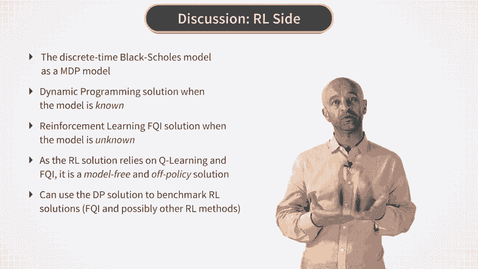
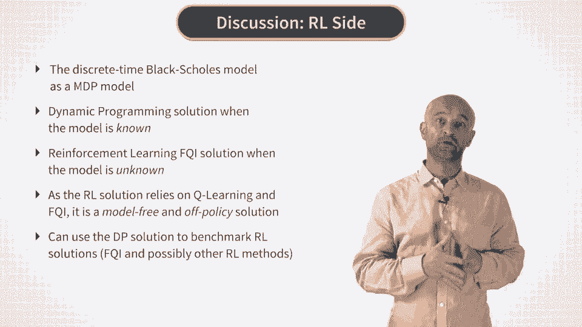
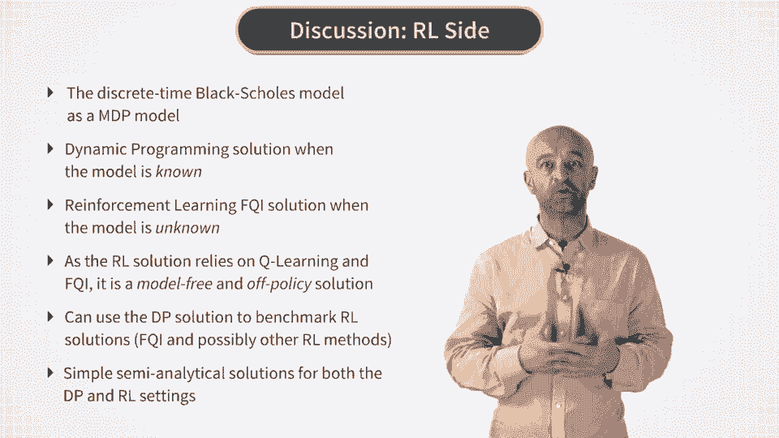
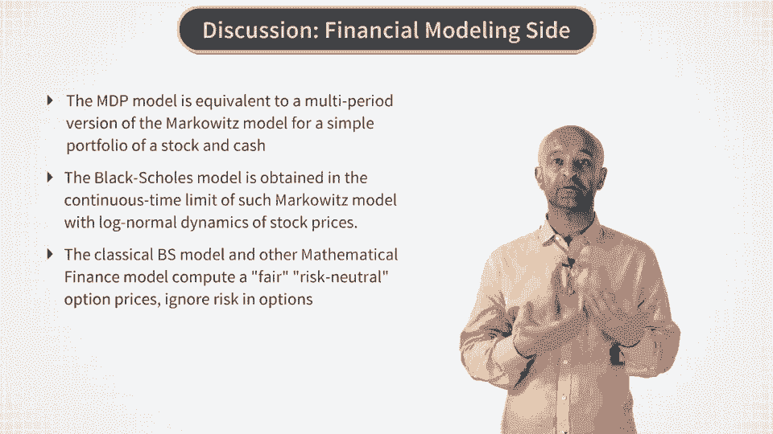
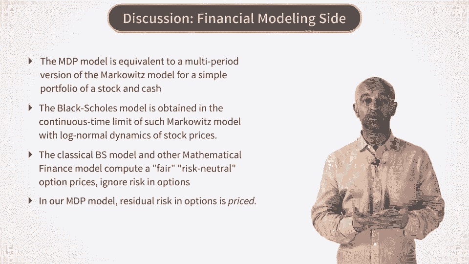
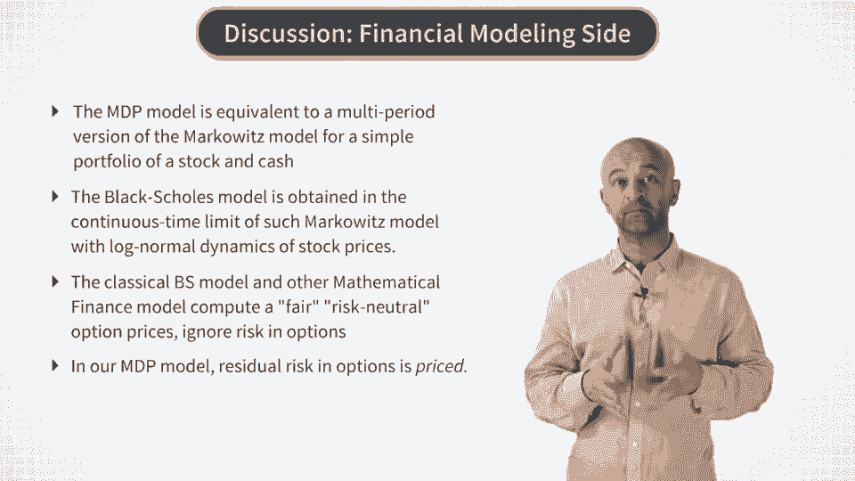
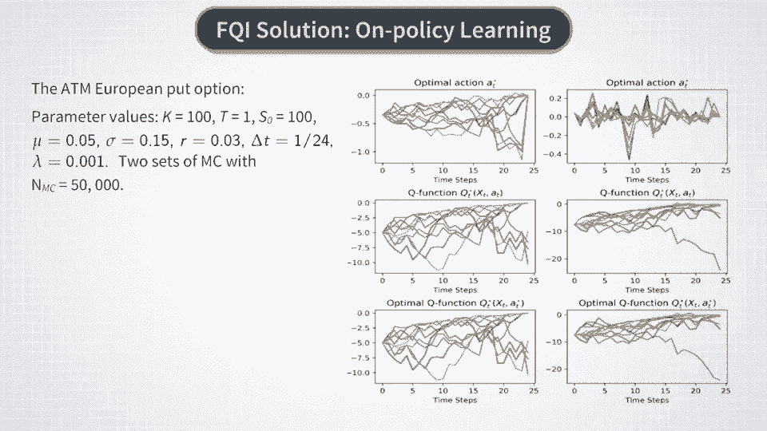
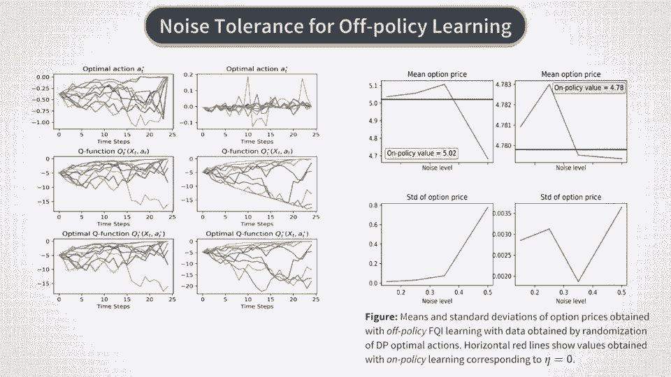
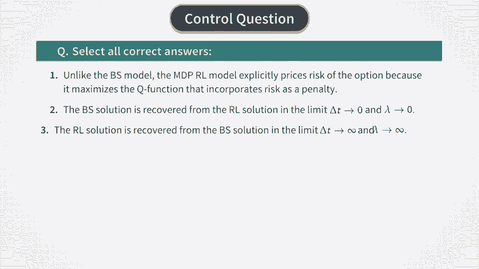

# P29：RL Approach - RL Solution- Discussion and Examples - 兰心飞侠 - BV14P4y1u7TB

 Now it's time to summarize what we have obtained so far without reinforcement learning solution。

 to the MGP model for option pricing and hedging。

 We can summarize it on two counts。 First by considering it as an reinforcement learning problem and second by considering。

 the financial aspects of the model that we developed here。

 Let's start with the reinforcement learning and machine learning side。

 On the side of machine learning we formulated the discrete time black shows model as a Markov。

 decision process model。 Then we produced two solutions for this model。

 The first one is a dynamic programming solution that can be applied when the model is known。

 We implemented this solution in a Monte Carlo setting where we first simulate paths of the。

 stock and then solve the optimal control problem by doing backward recursion。

 Using expansions in basis functions for function approximation for the optimal action and optimal。

 Q function。 This gives us a benchmark solution for the Bell-Monetimality equation。

 We can also check that the solution obtained by such dynamic programming method reproduces。

 the classical results of the black shows model when time steps are very small and the risk。

 aversion lambda goes to zero。 Then we turned to a completely data driven model independent way of solving the same。

 MGP model。 Because our model can be solved using Q learning and it's more practical version for batch。

 in force modernity called fitted-tutoration such data driven solution of the model is actually。

 feasible。 This means that the model can be used with the actual stock price data and data obtained。

 from an option trading desk。 Because Q learning and fitted-tutoration are off-policy methods it means that the recorded。

 detection and reward data should not necessarily correspond to optimal actions。

 The algorithm can learn from sub-optimal actions as well。

 But now a very nice property of our MGP model is that it can be solved by both the dynamic。

 programming and reinforcement learning methods。 Therefore。

 the dynamic programming solution can be used as a benchmark which we can use。

 for testing of any reinforcement learning methods and not only the fitted-tutoration method。

 More to this， while so far we consider it the model only with a single stock and hence a。

 single risk factor we can extend this framework to include more complex dynamics。

 Then in such setting the dynamic programming solution can be used as a benchmark to test。

 various reinforcement learning algorithms。

 The other nice thing about the reinforcement learning and DP solutions to the model is that。

 both of them are very simple and involve only simple linear algebra。

 Because the model is very simple optimization is performed analytically in both solutions。

 which makes the model reasonably fast。 Now after we discussed these machine learning aspects let's talk about financial modeling。

 aspects of our MGP model。

 On the financial side we found that the famous Blacksholes option pricing model can be understood。

 as a continuous time limit of another famous financial model namely the Markovitz portfolio。

 model albeit applied in a very special setting。 This is because in our MGP problem the problem of optimal hedging and pricing of an option。

 amounts to a multi-period version of the Markovitz theory where the investment portfolio is very。

 simple and consists of only one stock and cash。

 The dynamics of the world is assumed in this model to be log normal as in a Blacksholes， model。

 Now what we found is that if this investment portfolio matches the option payoff at maturity。

 capital T then the option price and hedge can be computed from this portfolio by doing。

 a dynamic optimization of risky just returns exactly as in the classical Markovitz portfolio。

 theory。 By making the replication portfolio for the option Markovitz optimal we reproduce the。

 Blacksholes model in the limit of vanishing time steps and risk aversion lambda。

 So the classical Blacksholes model is matched in this limit which is good but the present。

 model does much more than the Blacksholes model or for this sake than other more complex。

 models of mathematical finance do。 Our MGP model produces both the price and the optimal hedge for an option that incorporate。

 actual risk in options which always persists in options because they are never re-haged。

 continuously。 Models of mathematical finance such as Blacksholes model or various local or stochastic volatility。

 models focus on the so-called fair or risk neutral option price。

 Given that hedge errors are second order effects relative to the expected cost of hedge which。

 is just equal to the fair option price in this model。

 But the reality is that in many cases such second order effects are as large as the first。

 order effects and risk in option becomes a first class citizen in such models。

 The MGP model that represented here captures this risk in the model independent and data。

 driven way。 More to this in this formulation pricing and hedging are consistent as they are both obtained。

 from maximization of the same objective function。 Such consistency is important especially given the fact that many previous models of discrete。

 time risk option pricing did not provide explicit link between the option price and the option。

 hedge。 So the different option prices could correspond to the same hedging method。

 But in the framework that we presented risk option prices fully consistent with the risk。

 minimization of option hedge。 Also because our approach is model independent it frees us from the need to construct and。

 calibrate some complex model of stock dynamics which is actually one of the main objectives。

 of models in traditional and mathematical finance。 Alright。

 now after this summary of the MGP option pricing model let's take a look at some， examples。

 In the first set of experiments we test the performance of fitted curation for on policy， setting。

 In this case we simply use the optimal hedge and the words obtained with the dynamic programming。

 solution as data for fitted curation。

 And the results are shown on these graphs for two sets of Monte Carlo simulations shown respectively。

 in the left and right columns。 Because we deal here with on policy learning the resulting optimal Q function and its optimal。

 value QT star at A star which are shown in the second and third rows respectively are。

 virtually identical in the graph。 The option price for these parameter values used in this example is 490 plus or minus。

 point 12 which is identical to the option value obtained with the dynamic programming， method。

 And the block shoals option price for this case is 4。53 and this number can be recovered。

 if we take a smaller value of risk aversion lambda。

 We can also test the performance of fitted Q iteration for off policy learning。

 To make off policy data we multiply optimal hedges computed by the DP solution of the。

 model by a random uniform number in the interval from 1 minus eta to 1 plus eta where eta would。

 be parameter between 0 and 1 that controls the noise level in the data。

 In our experiment we consider it develop eta equal 0。15， 0。25， 0。35 and 0。15 to test the。

 noise tolerance of our algorithms。 In this figure you can see the results obtained for off policy learning for eta equal to 50。

 percent with 5 different scenarios of suboptimal actions。

 We observe some non-monotonicity in these graphs but this is due to a low number of， scenarios。

 But please note that the impact of suboptimality of actions in the recorded data is rather。

 mild at least for a moderate level of noise in actions。

 And this is expected as long as fitted Q iteration is an off policy algorithm。

 This means that when data set is large enough our MDP model can learn even from data with。

 purely random actions。 And in particular it can even learn the black show model itself if the world is block normal。

 because Q learning is a model free method。 So this concludes our third week of this course and in your homework you will implement the。

 fitted Q iteration and also evaluate the performance of the algorithm in both on policy and off。

 policy setting。

 Good luck with this work and see you next week。 [ Silence ]。

