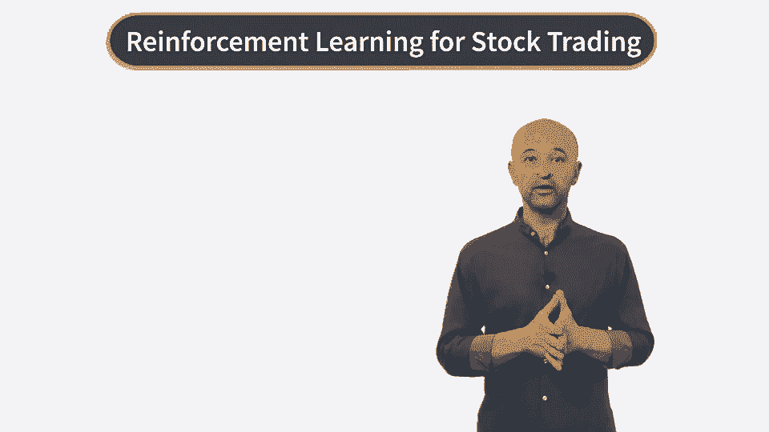

# P30：RL for Stock Trading - Week Welcome Video - 兰心飞侠 - BV14P4y1u7TB

 Welcome to the fourth and the last week of our course on reinforcement learning and finance。

 In the last week we saw how the problem of option pricing and hedging can be formulated。 as a reinforcement learning model。 In this week we will talk about applications of reinforcement learning for stock trading。 We will discuss various problems in quantitative trading that amounts to reinforcement learning。 tasks。 We will talk about such problems as optimal portfolio execution。

 dynamic portfolio management and， index tracking。 Then we will develop a simple portfolio model that allows us to address all these problems。 in the same modeling framework。 We will then introduce reinforcement learning approach to such problems that learns optimal。

 trading or execution policy directly from data made of states， actions and rewards。 Then we will discuss an inverse reinforcement learning setting for these problems where we。 do not observe rewards and we will see why it may be more useful than direct reinforcement。 learning setting in many problems of practical interest。

 We will then see how inverse reinforcement learning works in this setting and how it can。 be applied to learn a reward function， also called a utility function of an investor or。 even of a market。 And finally we will look at the same model but apply it this time to all investors simultaneously。 and show how we can use inverse reinforcement learning to learn market optimal trading strategies。

 So I hope it's going to be an interesting week。 Also please keep in mind that as we already did a few times in this specialization。 this， week will simultaneously serve as an introduction to the last course in this specialization where。 we will talk about more involved applications of reinforcement learning to problems of finance。

 So let's start。 [BLANK_AUDIO]。