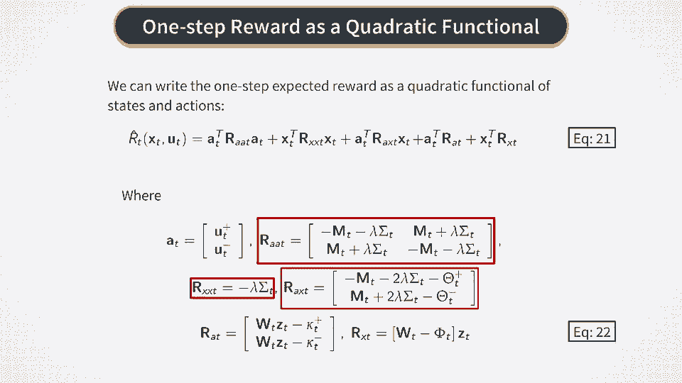

# P33：股票交易的强化学习 - 一期奖励 - 兰心飞侠 - BV14P4y1u7TB

接下来，我们想在模型中指定一期奖励或负成本。通过将其自己的公式代入我们之前推导出的投资组合变化公式中，可以得到采取该行动后获得的瞬时随机奖励，如此处的第一个公式所示。这就得出了采取行动后获得的瞬时随机奖励。

由公式13给出。请注意，由于市场影响项与度量Mt成正比，因此该公式是二次方程，而不是你之前看到的线性方程。我们从这个公式中还可以看到奖励是有风险的，因为它们依赖于噪声项`epsilon t`。因此。

我们将增加一定的风险惩罚来补偿这种风险。风险惩罚只是因承担交易风险而获得的负奖励。我们将为这种风险惩罚使用一个非常简单的规格，并且我们将其假设为与瞬时奖励`R0`的方差成比例。

条件于给定的`Xt`和`ut`值，如本页公式14所示。这里，lambda是一个风险厌恶参数。这个方差可以很容易地计算出来，这就得出了最后的表达式。我们可以看到这是`Xt`加`ut`的二次函数。因为噪声的协方差矩阵是非负定的。

整个表达式是非正定二次型。我们在一步奖励中需要包含的下一个元素是费用惩罚或交易成本。现在，交易成本取决于`ut`的符号，因为交易者以买入价格买入，以卖出价格卖出。

这可以通过对正负`ut`值使用不同的比例交易成本来考虑。为此，我们将每个`ut`分解为两个非负值的差值，即`ut plus`和`ut minus`。然后`ut`变为这两个值的差，而`ut`的绝对值则是它们的和。换句话说，当`ut`为正时，`ut`等于`ut plus`。

当`ut`为负时，`ut`等于负的`ut minus`。现在通过这些定义，我们可以指定如本页公式17所示的公式，其中`kappa plus`和`kappa minus`是买卖订单的不同交易成本参数。最后，我们还需要考虑股票交易中的市场输入缺陷。

这里我们将假设市场输入与所有股票的总头寸成比例。它有几个项。两个项与订单大小成正比，我们通常可以有不同的系数`theta plus`和`theta minus`，它们描述了`u`的正负值对应的市场输入。

此外，市场输入可能依赖于信号，因此我们在这里增加了第三项，权重由某个矩阵fee给出。最后，我们将所有这些贡献汇总，并定义总的一步奖励为它们的和，如方程18所示。请注意，这是一个随机奖励，因为这里的第一项依赖于噪声绝对值t。对于给定的x、t和ut值，剩余项是非随机的。

现在，当我们给定下一个ut时，它等于ut加和ut减之差。我们可以定义并期望它的一步奖励，作为方程18给出的表达式的期望值。这就产生了期望奖励r hat t的方程19。在这里，我们的零帽是对瞬时奖励r zero的期望，条件是给定的状态和动作。

如方程20所示。我们现在可以简化这个表达式，并将其转换为更简洁的形式，接下来会展示。所以这里我们使用向量表示法来降维，并引入一个大小为2m的向量at， 它是通过将ut加和ut减的分量堆叠在一起来构造的。然后，一步奖励的整个表达式可以表示为x t和at的二次泛函。

这在方程21中有展示。我们在这里有三个二阶项和两个一阶项，分别与x t和at成正比。这里没有常数项，因为如果没有采取行动at或没有位置x t，就没有奖励。请注意，矩阵a t、a x x t和a x t都依赖于风险厌恶系数lambda。它们还依赖于市场输入矩阵m和phi系数theta。如果它们都为零。

然后，一步奖励变成了线性泛函，而不是二次泛函。例如，我们有一个二次泛函，而我们也有一个二次泛函。

我们有一个二次泛函。

