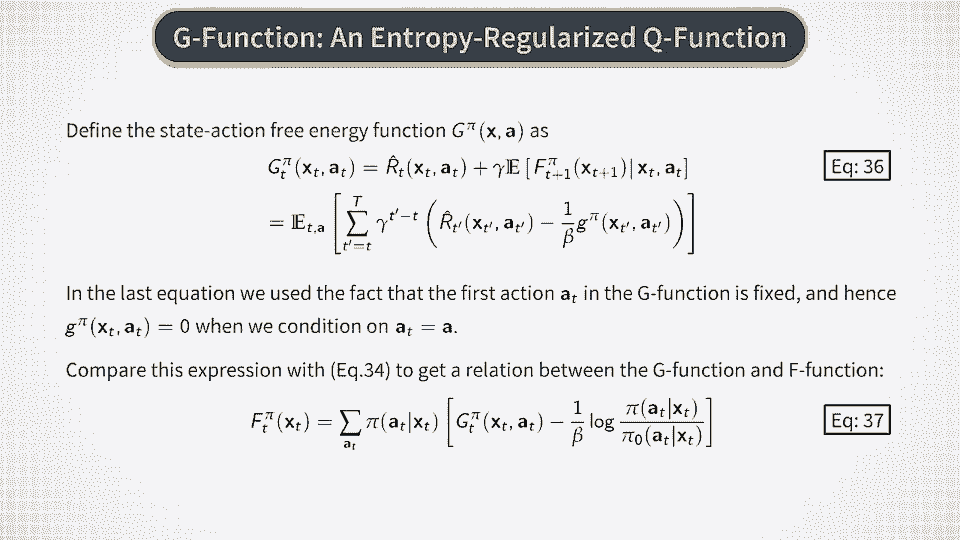

# P36：股票交易的强化学习 - 熵正则化强化学习 - 兰心飞侠 - BV14P4y1u7TB

好的，现在我们要做一些比之前更多的数学计算了。所以请耐心一点，因为接下来的几分钟我们将深入讨论一堆新公式。还有下一段视频。如果你发现自己在中间迷失了方向，可以随时停下来倒回去看，或者查阅原始资料以获取更多细节。

然后也许可以再看一下这个视频。但希望你不需要这么做，或者至少不需要做太多次。所以我们开始吧。让我首先提醒你关于价值函数的标准贝尔曼方程。我们定义一个最优价值函数D*，如方程27所示，它是对所有策略π的期望折现未来奖励的最大值。正如我们在之前的课程中讨论过的，当我们处理价值函数的贝尔曼方程时。

我们通常处理两个方程。第一个是关于V*的贝尔曼最优性方程，如方程28所示。这个方程右侧的第二项是对给定当前状态和动作下未来价值函数的期望。

在时间t，最优价值函数V*是该方程右侧关于所有动作at的最大值。现在，策略π在这个方程中并没有显式出现。如果你已经知道最优价值函数V*，那么计算最优策略就需要解决方程29中的另一个优化问题。我们在之前的课程中称这个步骤为策略改进步骤。

现在我们重新构造贝尔曼最优性方程，使得策略π显式出现在其中。这里展示的技巧有时被称为“费恩索尔表示”。在这个公式中，其他部分与之前相同，只是现在我们是关于策略π进行最大化，而不是关于动作at。策略π可以是我们在这里称为P的有效分布集合中的任何一个策略。

那么，为什么这个公式等同于之前的公式呢？

这是因为这个幻灯片底部展示了一个简单的恒等式。如果我们有一组数字x1到xn，那么它们的最大值将与一组权重的最大值相同，我们在这里称这些权重为π，它们是这些权重与值向量xi的点积的最大值。这仅仅是通过构造得来的，因为最优的权重集会给最大值xi赋予1的权重。

并且将对其他x值的权重设为零。所以这个技巧非常简单，但非常有用，因为现在策略π显式地进入了问题，而不是隐式地存在。现在我们迈出了一个非常重要的下一步。我们引入了从参考策略π0更新到给定策略π的信息成本的概念。这个成本由方程30给出，表示为策略π与策略π0的比值的对数。

我建议你参考Tissue Bee及其合作者的论文，深入解释为什么这个量被称为信息成本。但我们可以立即注意到的一点是，如果我们对这个表达式用分布π取期望，我们将得到所谓的公共KL散度或KL散度，衡量两个分布π和π零的相似性，如方程 32 所示。我们在这个专题中已经多次提到KL散度，并讨论了它如何作为衡量两个分布相似度的标准。

KL 散度始终是非负的，只有当π等于π零时才严格等于零。现在我们可以对所有时间步的这种信息成本求一个折扣期望和的总和。这就产生了在方程 33 中展示的轨迹的总折扣信息成本。

如果我们在这里对两个项给出明确的表达式，我们就得到了这个方程的第二种形式。请注意，我们可以将这里括号中的整个表达式看作是通过信息成本项修正或正则化的奖励。参数β控制着这种正则化的强度。如果我们将β设为无穷大，那么正则化项将消失。在β非常大的对立极限下，对不起。

如果奖励非常低且修改后的单步奖励将完全由第二项决定。参数β被称为逆温度参数，因为它在下面的公式中以与物理学中逆温度在统计力学公式中相似的方式出现。

那么，最终什么是自由能函数？正如你从这个方程中看到的，自由能函数只是一个熵正则化的值函数。正如Tichbi的论文中所解释的那样，当环境噪声较大时，这种熵正则化非常有帮助。在这种情况下，正则化项提供了一种帮助，假设优先级合理，可以找到一个良好且对噪声具有容忍度的最优策略和最优值函数。

正如在金融和环境问题中通常会有噪声或非常大的噪声一样，这种熵正则化对金融问题非常有用。我们现在可以直接推导出自由能函数的鲍曼方程。它在方程 35 中展示，并且可以从前面的公式中按标准方式推导出来。

这个方程可以视为对原始鲍曼方程的一个解的概率放松，其中β作为正则化参数。如果β在这里被设为无穷大，它将重现原始鲍曼方程，正如你自己可以轻松验证的那样。

现在，类似于我们如何使用KL散度来正则化值函数，我们也可以正则化一个动作值函数，Q函数。我们将根据Tichbi及其合作者的命名，称这个函数为G函数。G函数的鲍曼方程与Q函数的方程相同。

除了我们在右侧使用F函数代替值函数，如方程36所示。我们现在可以重新组合此关系中的项，得到这里显示的第二种形式。因此，G函数是与F函数中的修改奖励相同的期望，但这次是以当前状态和动作为条件的，像Q函数一样。换句话说。

G函数与F函数之间的关系与V函数之间的关系相同。我们还可以将结果表达式与F函数的公式进行比较。这为我们提供了G函数与F函数之间的明确关系，如方程37所示。

[BLANK_AUDIO]。

