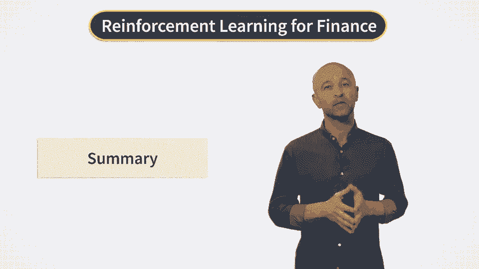
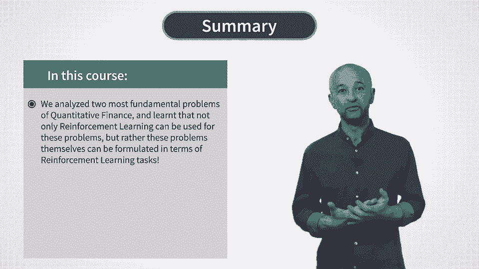
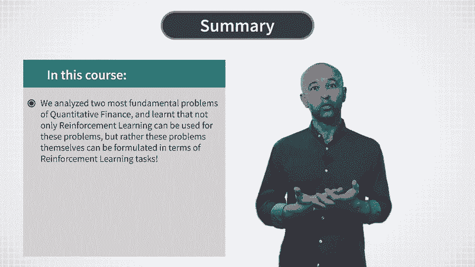
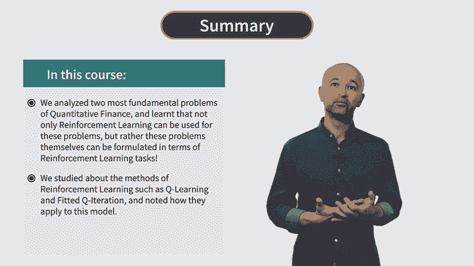
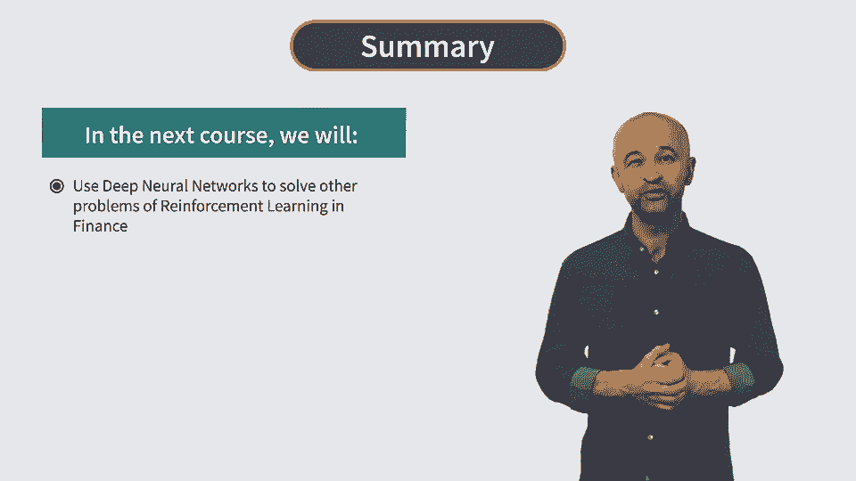

# P39：Course Summary - 兰心飞侠 - BV14P4y1u7TB

 Now let's make a summary of what we have learned in the four weeks of this course。

 What we did in this course is we took two most fundamental problems of quantitative。

 finance and then showed that not only reinforcement learning can be used for these problems， but。

 rather these problems themselves can be formulated in terms of reinforcement learning tasks。

 We started with the problem of option pricing and hedging and showed how this problem can。

 be reformulated as a discrete time mark of decision process。

 Then we learned about methods of reinforcement learning such as Q learning and fitted Q iteration。

 and so how they apply to this model。 We found that the whole scheme in the case of a single option is rather simple computationally。

 To compute the optimal price and hedge of an option we only need a bunch of linear regressions。

 and nothing else。 The model learns directly from trading data from a replication portfolio for such option。

 because it's a reinforcement learning model。 We used model based reinforcement learning where the reward function is a quadratic function。

 of its argument and this is what made the model very tractable。

 In particular we did not need fancy functional approximation methods such as neural networks。

 for such simple settings。 Then in this week of the course we look at the different and very large class of portfolio。

 optimization problems。 Here again the first built a simple portfolio model that can be applied to all such tasks。

 including optimal portfolio liquidation， optimal investment portfolio and index tracking。

 And using this model we learned new topics in reinforcement learning itself including stochastic。

 policies and entropy regularized reinforcement learning。

 Such entropy regularized reinforcement learning is very useful for learning and noise environment。

 which is almost always the case in finance。 And finally we saw how we can do inverse reinforcement learning with the same dynamic。

 portfolio model and how we can use it to inform market views and values of private signals。

 much in the spirit of the famous Black-Lieterman model。

 Because the model is quite simple we again managed to proceed in this model without invoking。

 sophisticated functional approximation methods such as neural networks。

 As we will see in our next course other problems of reinforcement learning in finance do use。

 neural networks and in particular deep neural networks producing deep reinforcement learning。

 We will talk more about deep reinforcement learning in the next course of this specialization。

 And for now I wish you good luck with your course project and see you in the next course。

