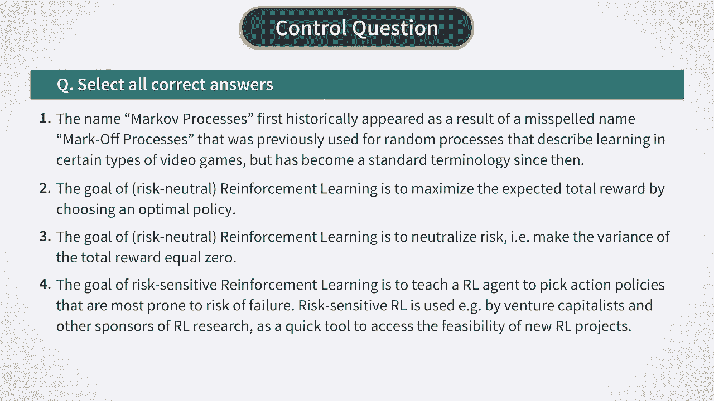

# P4：MDP - Introduction to Markov Decision Processes and Reinforcement Learning - 兰心飞侠 - BV14P4y1u7TB

好的。让我们从我们停下来的地方开始。

最后一门课程，快速回顾一下市场决策过程，贝尔曼方程及其与强化学习的关系。在我们在本课中回顾这些主题以刷新我们的记忆之后，在下一课中，我们将花一些时间来转换最著名的经典金融问题之一。

进入一个马尔可夫决策过程问题，我们，将用于测试不同的强化学习算法。所以，回顾一下，强化学习处理，在环境中与环境交互的代理，通过选择的顺序决策，在此过程的每个步骤中，许多可能的行动中的最优行动。

在我们的第一门课程中，我们将此类机器学习任务称为动作任务。代理通过以下方式感知环境，有关环境状态 St 的信息。因此，环境可能具有一些复杂的动态，强化学习任务应该涉及对未来的一些规划和预测。除此之外。

代理应该选择的动作 AT，在每一步优化其长期目标，本身可能会影响环境状况。这创建了一个反馈循环，其中，当前智能体的动作 AT 可能会改变下一个状态，历史上可能影响的制度。

代理在下一个时间步需要选择什么动作。这种反馈循环的存在对于强化学习来说是独一无二的。在有监督或无监督学习中不会出现反馈循环。这是因为在这些设置中不存在优化操作的问题，因为这些任务中的动作总是相同的。

例如，在无监督学习中，我们的任务可能是对数据进行聚类。显然，在这种情况下，数据不关心我们或代理人如何看待它。所以，没有反馈回路。我们还讨论了强化学习的两种可能设置。在线强化学习实时进行。在这种情况下。

代理直接与，环境并在每个时间步选择它的动作，一旦它获得有关环境新状态的信息。真空清洁机器人将是在线强化学习的一个很好的例子。另一种可能的设置称为批处理模式或离线强化学习。在这种情况下。

代理不能按需访问环境。相反，它只能访问一些存储的数据，其他代理或人类与该环境的交互历史。该数据应包含环境状态的记录，采取的行动，以及历史中每个时间步所获得的奖励。现在，在这两种环境中。

我们讨论了两种可能的方法。如果环境是完全可观察的，它的动力学可以建模为马尔可夫过程。马尔可夫过程的特点是记忆时间短。这些模型的未来并不取决于整个历史，但仅限于当前状态。第二种可能性是部分吸收的环境。

其中一些对动力学很重要的变量是不可观察的。正如我们在上一门课程中讨论的那样，可以使用动态潜变量模型进行建模。例如，隐马尔可夫模型。在本课程中，我们将主要关注完全可观察的系统。因此。

我们将暂时使用马尔可夫过程。现在，正如我们在上一课中概述的那样，适当的数学形式，将代理人的行动纳入，一些环境的马尔可夫动力学被称为，马尔可夫决策过程或简称 MDP。让我们再次回顾一下这个框架。在这里。

您会看到一个描述马尔可夫决策过程的图表。蓝色圆圈表示系统 ST 的演化状态，离散时间步长。这些状态由箭头连接，它们代表因果关系。我们只有一个箭头进入每个蓝色圆圈，来自之前强调动态马尔可夫属性的蓝色圆圈。

这意味着每个下一个状态仅取决于，以前的状态，但不是以前状态的整个历史。绿色圆圈表示代理采取的行动 AT。向上的箭头表示奖励，代理在采取行动 AT 时收到的 RT。现在，用数学术语来说。

马尔可夫决策过程具有以下要素。首先，我们有状态空间 S，使得每个观察到的状态 ST 都属于该空间。空间 S 可以是离散的或连续的。其次，存在属于称为 A 的动作空间的动作 AT。

下一个 MDP 需要知道定义概率的转换概率速度，下一个状态 S sub T 加一给定，先前的状态 ST 和在该状态下采取的动作 AT。此外，我们需要一个奖励函数 R，它给出。

采取给定行动后在给定状态下获得的奖励。因此，它将空间 S 和 A 的叉积映射到现实世界的数字上。最后，MDP 需要指定一个折扣因子 gamma，这是一个介于零和一之间的数字。

我们需要折扣因子 gamma，计算由整个单步奖励之和给出的总累积奖励，其中每个下一项在总和中获得额外的 gamma 幂。这意味着 MDP 的折扣因子扮演着与，财务中的贴现因子。

因为它反映了奖励的时间价值。这意味着现在获得较大的奖励，以后获得较小的奖励是，宁愿现在获得较小的奖励，以后获得较大的奖励。折扣因子仅由如何控制，第一种情况比第二种情况更可取。现在。

马尔可夫决策过程问题或强化学习的目标，是最大化期望的总累积奖励。这是通过正确选择决策策略来实现的，这应该规定代理应如何在世界的每种可能状态下采取行动。但请注意，这个任务现在应该解决。

因为我们现在需要知道价值函数。我们只能知道系统的当前状态，而不能知道它的未来。这意味着我们现在必须决定我们将如何在未来采取行动，环境的所有可能的未来情景，以便，每当预期的累积奖励最大化时。

但是请知道我们设置了平均。我们的决策政策平均而言可能是好的，但风险很高，偶尔会产生非常低的价值函数的大故障。这就是为什么强化学习的标准方法侧重于，预期的累积回报有时被称为风险中性强化学习。

它是风险中性的，因为它不考虑给定政策的风险。其他版本的强化学习称为风险敏感强化学习，查看累积奖励分配的一些更高时刻，除了只看，它的平均值就像在传统的风险中性强化学习中所做的那样。

这在某些情况下可能会有所帮助。因此，我鼓励您注意这些方法的可用性。但在本课程的其余部分，我们将处理标准制定，强化学习的重点是最大化，平均累积回报或。

