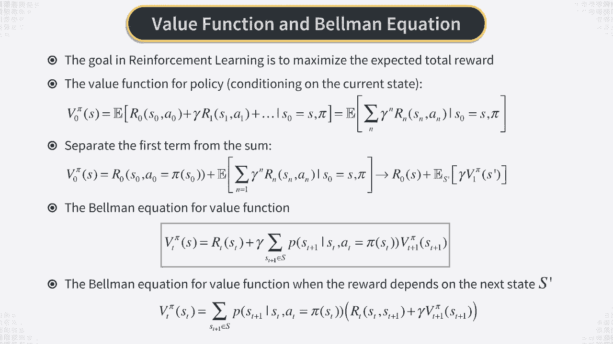
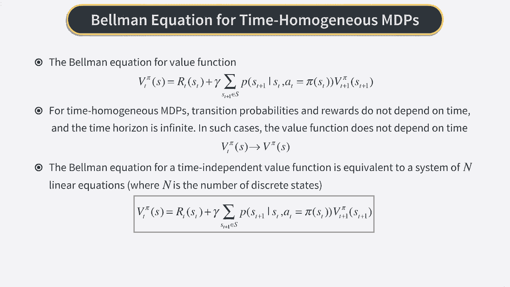
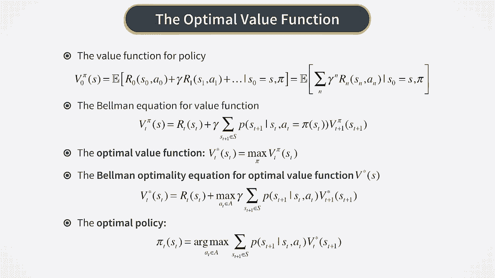
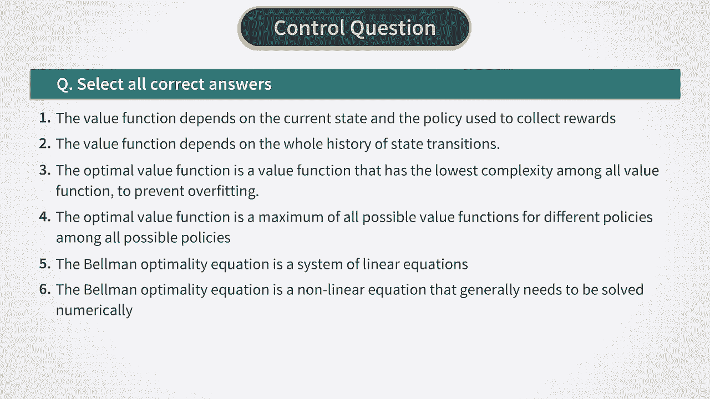

# P6：MDP与RL - 价值函数与贝尔曼方程 - 兰心飞侠 - BV14P4y1u7TB

我们说过，目标是。

马尔可夫决策过程模型的目标是最大化预期的总奖励。因为这个问题必须现在解决，但奖励将在未来获得。因此，这个问题是通过策略来解决的，策略给出了在任何可能的世界状态下应该采取的行动规则。那么，我们如何做到呢？

如何定量地比较同一个MDP问题的不同可能策略？

我们只是计算预期的总奖励，即我们想要最大化的同一数量，但有一个重要的补充。

即在这个计算中，我们对当前系统状态ST进行条件化处理。这是因为我们认识到，如果我们从系统的不同初始状态开始，我们会得到不同的总奖励。这种条件期望的总累积框架称为价值函数。

对于每一个可能的状态ST，价值函数给出了该状态的值，以实现我们通过策略pi最大化总奖励的最终任务。因此，这个数据也就成了价值函数的一个参数。此外，价值函数V有一个上标pi，用来强调它对所选策略（用于累积奖励）的依赖。

最后，它有一个下标，指定系统的时间点，状态向量S。我们使用离散符号来表示时间，因为我们在离散时间下处理马尔可夫决策过程。因此，在这个公式中，我们通过使用下标零来展示在时间零时定义的价值函数。接下来。

让我们看看如何评估这个表达式。我们将第一个项从和式中分离出来，并写成第一个项加上一个类似的和式，但从原始和式中的第二项开始。接下来，我们将期望的和式替换为期望的和。现在，第一个项仅仅是来自当前步骤的奖励。但第二个项是。

在下一个时间点的相同价值函数中，当这两个项有另一个状态作为参数时，乘以折扣因子Gamma。现在，我们可以将这个项中的期望符号替换为一个明确的和式，涉及从当前状态到所有可能下一个状态的转移概率。

这就产生了一个递归关系，用于价值函数，这个递归关系被称为贝尔曼方程。它是在1950年代由理查德·贝尔曼提出的，作为他在动态规划领域开创性工作的一个部分。稍后我们还会遇到其他几种也叫贝尔曼的方程，因此了解它们之间的区别将非常重要。现在。

我刚刚展示的贝尔曼方程的稍微更一般的版本，指的是奖励R依赖于下一个状态的情况。对于这种情况，只需要将奖励放入期望中，这样贝尔曼方程就变成了这里显示的形式。

现在，出现了一个特殊情况，当马尔可夫决策过程（MDP）中，时间不作为独立变量出现。也就是说，对于这样的MDP，转移概率和奖励不能显式地依赖于时间。而且，最终时间T在问题中是无限的。因此，在值函数的定义中存在一个无限和。

在这种情况下，值函数也将不依赖于时间，因此我们可以在这些情况下将时间索引从中去除。对于这种情况，贝尔曼方程变成了一个更简单的线性方程组，每个可能的状态T对应一个方程。因此，如果我们的离散状态集有N个状态，我们将有N个这样的线性方程。

如果已知转移概率，我们可以使用线性代数的方法轻松求解这个线性系统。

接下来，我们引入一个称为V-star的最优值函数。一个状态的最优值函数简单来说，就是在所有可能的策略中，该状态的函数值的最大值。因此，最优值函数是通过一个最优策略来得到的，这个最优策略我们称为V-star。这里的重要点是，最优策略V-star对于系统的所有状态都是最优的。

这意味着V-star应该大于或等于任何其他策略，并且对于任何状态S。现在，我们可以用它自身来表示最优值函数，类似于我们如何推导给定固定策略pi的值函数的贝尔曼方程。形式上，可以通过简单地将max运算符应用于贝尔曼方程的两边来做到这一点。

然后在左边，我们将按照定义得到V-star。而在右边，我们将得到在稍后时间的相同最优值函数。但除了将右边的“by”替换为V-star，我们还必须确保当前时间T的动作也是最优的。

这表达了著名的贝尔曼最优性原理，该原理指出，最优的累积奖励应该通过现在采取最优行动并随后遵循最优策略来获得。因此，按照这一原理，我们得出了此幻灯片中展示的V-star的贝尔曼最优性方程。

由于右边有一个max运算符，这现在变成了一个通常需要通过数值方法求解的非线性方程。在下一个视频中，我们将讨论可以用于下降的简单数值算法。但在此之前，让我们先讨论，如果我们已经知道最优值函数，如何找到最优策略。

这一部分很简单。贝尔曼最优性方程中的第二项涉及在时间T的所有可能动作选择中取最大值。但这种分离正是最优策略本身应该描述的内容。这为我们提供了一个方法，来找到在给定状态和时间下的最优策略，作为它的选择。

这个状态下的动作在时间上给予贝尔曼最优方程中第二项的最大值。

所以，让我们快速看一下这个视频的问题，然后继续。

