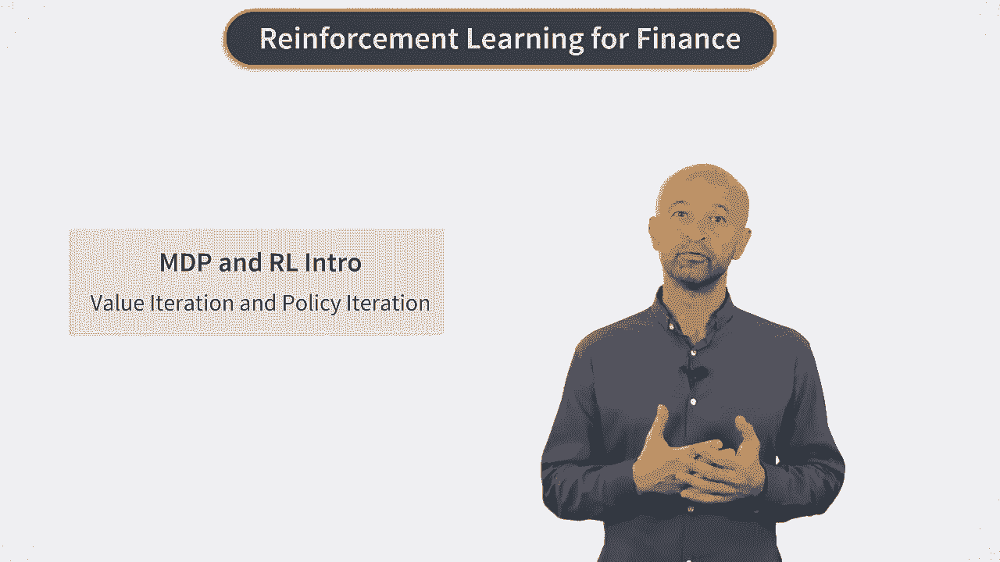
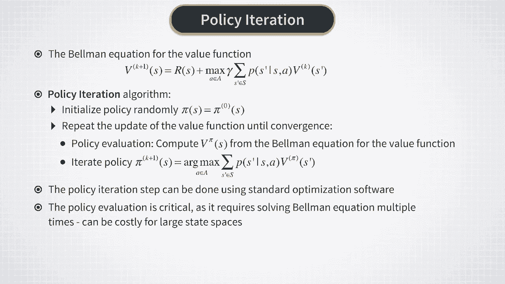
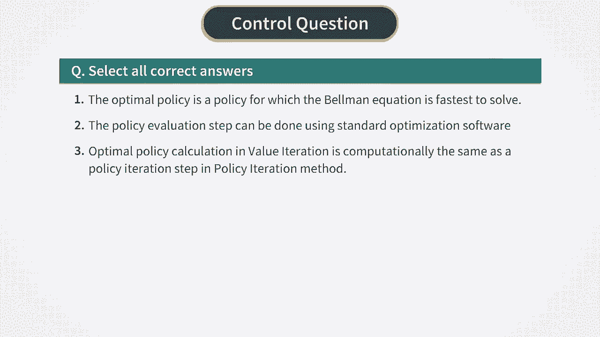

# P7：MDP & RL- Value Iteration and Policy Iteration - 兰心飞侠 - BV14P4y1u7TB

现在，让我们回顾一下我们在上一课中所说的内容。

关于求解贝尔曼最优方程的两种经典方法。我们可以将这些方法应用于时间均匀的市场决策过程。正如我们在上一个视频中看到的，对于这样的过程，然后价值函数变得独立于时间。所以，在这种情况下。贝尔曼最优方程变成了单个函数的非线性方程，可以用简单的数值方法解决。一种这样的方法称为值迭代。只要状态-动作空间是离散且小的，值迭代为问题提供了简单快速的解决方案。

它的工作原理如下，我们从初始化开始，所有状态的一些初始值的价值函数。通常，所有状态的初始化为零都可以正常工作。然后我们不断迭代计算，使用贝尔曼方程本身的价值函数。对于每次迭代。我们使用上一次迭代的结果来，计算这个等式的右边。现在，有几种方法可以在这种值迭代中更新值函数。一种方法是完成计算价值函数，我们状态空间中的所有状态，然后立即更新所有状态中的开发功能。这称为同步更新和。另一种方法是即时更新价值函数。假设在当前迭代中计算，这将被称为异步更新。现在，对于这两种迭代方式中的任何一种都可以，证明算法收敛到最优值函数，我们将再次重新启动。并且发现重启后。可以使用与以前相同的公式找到最优策略。所以基本算法非常简单，正如我们所说，只要你的状态动作空间是，离散且具有少量状态。现在还有另一种经典方法，我们也在，上一个过程称为策略迭代。在这个方法中。

我们从一些初始策略饼 0 开始，通常是随机选择的。在那之后，我们重复，以下循环与，在这个循环的每一步进行两次计算，直到收敛。第一个计算称为策略验证。在这个计算中，我们为这个迭代计算给定策略的价值函数。我们可以使用 V 的贝尔曼方程来做到这一点，而不是这颗恒星的贝尔曼最优方程。因为 V 的贝尔曼方程只是，这一步的线性方程是直截了当的。循环同一步骤的第二次计算称为策略更新。这通过应用再次完成。arg max 运算符位于贝尔曼方程的右侧。现在，请注意这些计算必须完成，在策略迭代法内重复，他们有完全不同的计算负担。政策更新直截了当，可以使用标准优化软件来完成。但政策评估步骤涉及求解贝尔曼方程。因此，当状态空间的维数很大时，在政策评估过程中重复这样做可能代价高昂。

另一方面，最优控制的许多实际问题，大的离散状态-动作空间甚至连续的状态-动作空间。在这些设置中，动态规划和算法的方法，像值迭代或策略迭代不再起作用。强化学习在这里得到了拯救。

我们将在下周看到它是如何工作的。

