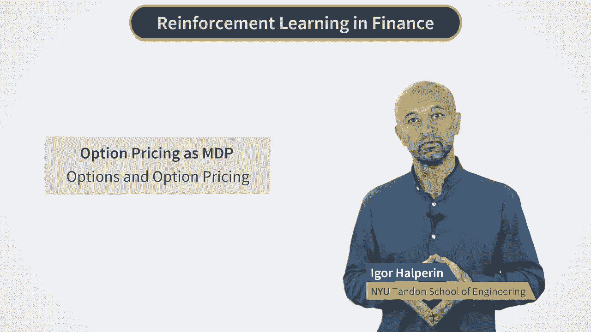
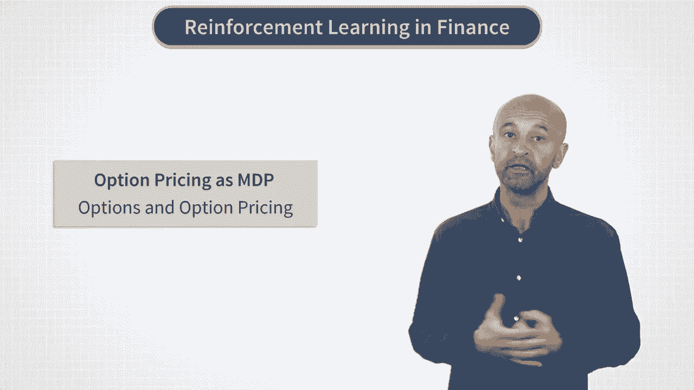
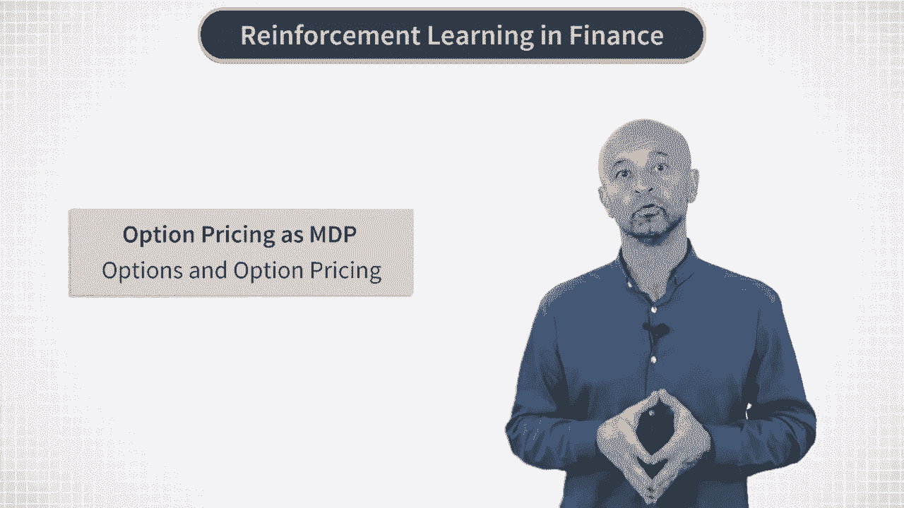
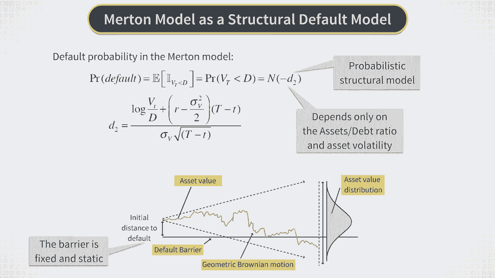
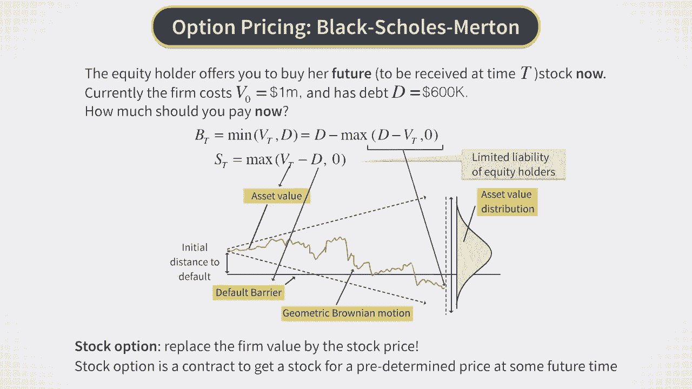
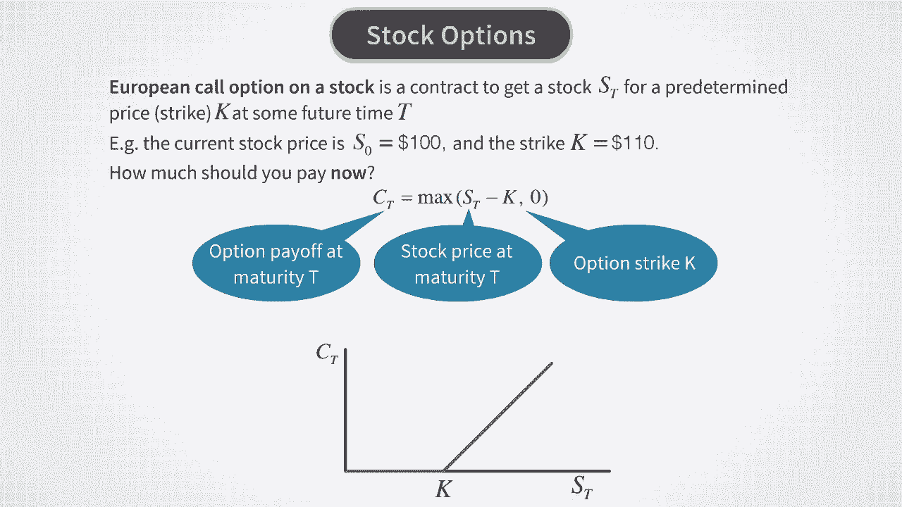

# P9：BSM - 期权与期权定价 - 兰心飞侠 - BV14P4y1u7TB

在上一课中，我们讨论了市场决策过程以及如何使用强化学习来找到MDP的最优策略。

我们还将杆平衡问题视为强化学习算法的经典测试用例之一。这类测试用例非常有用，因为它们不仅能让我们看到特定的强化学习算法在已知预期的情况下如何在这种环境中工作。

但也可以比较不同算法在性能上的表现。

尽管卡片杆系统的物理学处理的是位置和速度等连续变量，这些变量是可以离散化的。通过离散化，系统被映射到一个决策过程问题上，具有离散的状态和动作空间。在这种设置下，我们之前概述的所有方法以及许多其他强化学习方法都可以尝试。

因此，这个测试用例通常被用来说明和基准测试不同的强化学习算法。但因为在这门课程中我们涉及的是金融，拥有一个像杆平衡问题一样简单的金融场景会更好。

这样一个最简单的但并非过于简化的设置，可能会对强化学习在金融领域的应用产生有益影响，作为探索和基准测试不同金融应用RL算法的测试实验室。在本节课中，我们将为强化学习与金融构建这样的测试环境。

正如我们稍后将看到的，它非常灵活且可扩展。

特别是，它将帮助我们对离散动作和连续动作的强化学习算法进行基准测试。在金融领域，它提供了对对冲、交易和金融市场定价问题的洞察。

许多金融任务的主要元素都存在于一个可控且易于理解的环境中。而且，最后但同样重要的是，它有可能通过适当的推广扩展成实际有用的方法。

为此，我们建议使用著名的布莱克-舒尔茨-默顿（Black-Scholes-Merton，简称BSM）模型，这是现代量化金融的基石。我在我们第一节关于监督学习的课程中提到过这个模型，当时我们讨论了默顿的公司违约模型。所以让我们从快速回顾默顿违约模型开始。

梅尔顿模型提供了对公司的一种简化视图，该公司只有一个被称为公司价值的资产，其被建模为几何布朗运动。如果公司价值低于债务水平，在到期时 t，股东将违约，未能向为公司融资的债券持有人支付。

在这种情况下，她将公司资产交给债券持有人，股票变得一文不值。否则，股票在时间 t 的价值等于公司价值 t 减去债务水平 k 的差值。我们讨论了梅尔顿模型对预测公司违约的影响，并指出，在该模型中得到的关于违约概率的特定表达式可以视为一种结构。基于违约模型的模型对应于关于系统动态的非常特定的假设。

现在，梅尔顿模型用于公司违约，给出了违约概率，并计算了公司债务和公司股票当前的估值。但是，如果股票持有人提议让你现在支付她，以便以后能够从她那里以约定时间的价格购买她的股票，该怎么办？

她一拿到它，就会按照现在固定的价格 k 来操作。这样的金融合同被称为期权或金融衍生品。两个名称都说明了这一工具的性质。首先，它是一个期权，而不是一种义务，这意味着如果到时你发现股票表现不好，你不需要在 t 时支付价格 k 来获得股票。它也被称为衍生品，因为它的价值来源于股票的价值。

我刚才描述的是一种最简单的股票期权类型，称为欧洲看涨期权。再重复一遍，这种金融合同的运作方式如下：期权买方有权在未来的某个时刻 t 以一个指定的金额 k（也称为期权行使价）购买股票。行使价 k 在期权开始时合同约定。

现在，期权在到期时 t 的价值由这里显示的公式给出。它是最终股价 S 与行使价格 k 和零之间差值的最大值。其含义很简单。如果最终股价 S 在 t 时刻高于行使价格 k，那么对于期权的买方来说，购买该股票是非常有意义的。股票可以立即以市场价格出售。

在这种情况下，期权买方的利润将是 S 在 t 时的差值减去 k。但如果终端股价低于 k，那么行使该期权对买方来说将没有意义。所以在这种情况下，期权的支付为零。这个期权到期时 t 的支付如图所示。对于任何低于 k 的终端股价 ST，支付为零；而当 ST 高于 k 时，支付呈线性增长。

好的，这就是期权在最终时间 t 时的运作方式。但是当我们不知道最终股价时，它现在的价格如何呢？

著名的布莱克-肖尔斯-梅顿模型，也被称为布莱克-肖尔斯模型，是为了解答这个问题而开发的。它与梅顿公司违约模型在1973年左右由费舍尔·布莱克、迈伦·肖尔斯和罗伯特·梅顿共同开发，并在1997年获得了诺贝尔经济学奖，授予肖尔斯和梅顿。三年后，费舍尔·布莱克因癌症去世，享年1994年。

该模型通常被称为布莱克-肖尔斯模型，有时也称为布莱克-肖尔斯-梅顿模型或BSM模型。我们将交替使用这两种名称。

那么，BSM模型是什么，它是做什么的？

让我们在下一个视频中讨论这个模型。[安静]

