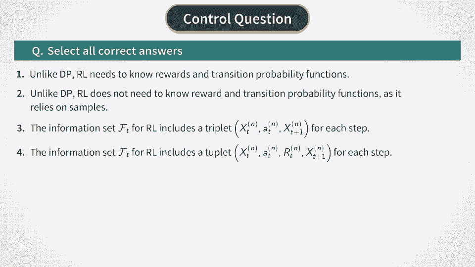

# Reinforcement Learning in Finance - New York University 金融强化学习 - 纽约大学 - P23：RL Approach - Batch Reinforcement Learning - 兰心飞侠 - BV14P4y1u7TB

 In the last lesson we constructed the Markov Decision Process or MDP model for option pricing。

 and hedging and then solved it using a Monte Carlo-based dynamic programming approach。

 To remind you this Monte Carlo setting we simulated forward paths for the underlying stock and。

 then computed optimal policy and hence optimal actions。

 The optimal option price was obtained as a negative of the time zero optimal Q function。

 when the second argument is taken to be the optimal action。 Now we move to reinforcement learning。

 As we said several times before reinforcement learning solves the same problem as dynamic。

 programming that is it finds the optimal policy。 But unlike dynamic programming reinforcement learning does not assume that transition probabilities。

 and reward function are known。 Instead it relies on samples to find an optimal policy。

 Now why this approach is interesting。 It's interesting because it tries to go to the heart of the problem but without solving。

 first another problem namely the problem of building a model of the world。

 The conventional approach to option pricing requires that we build a model of a stock。

 dynamics first by designing some stochastic process and then calibrating it to option。

 and stock pricing data。 But let's note that building a model of the world is not our objective。

 Our purpose is rather to find an optimal option price and hedge。

 In other words our task is to find an optimal policy from data。

 But this is clearly very different task from the task of building the model of the world。

 And more to this in some cases the world might have very complex dynamics。

 Yet an optimal policy can be a very simple function。

 Vladimir Vopnik the father of support vector machines once formulated a principle that one。

 should not one should avoid solving more difficult intermediate problems when solving a target。

 problem。 Both vector machines that we discussed in the previous course actually implement Vopnik's。

 principle。 Now in our case to price and hedge an option we do not have to explain the world but rather。

 just need to learn to act optimally in this world。 This is our target task in Vopnik's principle。

 The intermediate task would be to explain the world that is to build a model of the world。

 Then to the classical approach of quantitative finance we always first have to build a model。

 of the world that is to formulate the law of dynamics and estimate model parameters。

 This is called model calibration and it amounts to minimization of some loss function between。

 observables and model outputs。 Now depending on the model this might be a very resource dominion procedure。

 But even after it's completed this is not the end yet as we still did not solve our main。

 problem of option hedging and pricing。 This takes another calculation though normally much less consuming much less time consuming。

 than the first one because it doesn't involve optimization。

 So let's look at this traditional approach from the point of view of the original problem。

 of option hedging which we will now view as a problem of optimal control in reinforcement。

 learning setting。 If we build a model of the world first we can apply dynamic programming to solve the problem。

 of optimal control but any model introduces model mis-specifications therefore they can。

 propagate into the quantities we actually care about most。 That is the optimal price and hedge。

 So what reinforcement learning approach does it focuses on this original task while relying。

 on data samples instead of a model of the world。 Therefore this approach implements the WAPNIC rule。

 Now once we agree that the general approach of reinforcement learning takes us straight。

 to the ultimate goal at least conceptually we can discuss different particular specifications。

 of this approach。 For example we can still have a model of the world or maybe know some important model parameters。

 in the setting of reinforcement learning。 Such approach would correspond to what is called model based reinforcement learning as。

 opposed to a model free reinforcement learning。 Furthermore there are different types of reinforcement learning。

 Some of them focus on direct policy search while some other maximize the value function。

 as well outlined in the previous course。 We will concentrate for now on value based reinforcement learning which condenses information。

 it needs from the world to optimize policy into a value function。

 Now we will consider offline reinforcement learning also known as batch mode or simply。

 batch reinforcement learning。 In this setting we only have access to some historically collected data。

 There is no access to real time environment and we also assume that no simulator of such。

 environment is available。 Now how our data looks like in the setting of batch reinforcement learning。

 Data are given by a set of N trajectories and information set FT at time T is given by。

 information set FTN available from all separate N trajectories。

 Each set F and T includes the historical values up to time T of the following top of values。

 What is in this top？ We record the underlying stock price ST which we express as a function of X T the state。

 variable H position AT instantaneous reward RT and the next time value X sub T plus 1。

 So F and T is a collection of all such tuples as shown in this equation。

 In fact as long as the dynamic submark of a collection of N trajectories of length T。

 each is equivalent to a data set of N times T single step transitions。

 We assume that such data set is available either as a simulated data or as a real historical。

 stock price data combined with some artificial data that would track the performance of a。

 hypothetical stock and cash replicating portfolio for a given option。

 Now neither the dynamics nor the true reward distribution are assumed known in this reinforcement。

 learning approach。 All that is given is a set of one step transitions。

 Now we can compare this data for reinforcement learning with data we had for dynamic programming。

 solution to the model。 In a dynamic programming setting our only data was samples of stock prices simulated。

 using Monte Carlo。 In the course of backward recursion we computed instantaneous rewards and then computed optimal。

 actions that one should take to hedge the option。 Now let's compare this with the setting of batch reinforcement learning。

 We have stock prices and the next step stock price which is the same data as in the dynamic。

 programming setting。 But instead of rewards and actions being computed from the model using the knowledge of model。

 dynamics in batch reinforcement learning we are given sampled values of rewards and actions。

 In the next video we will see how we can work with this data。

 [ Silence ]。