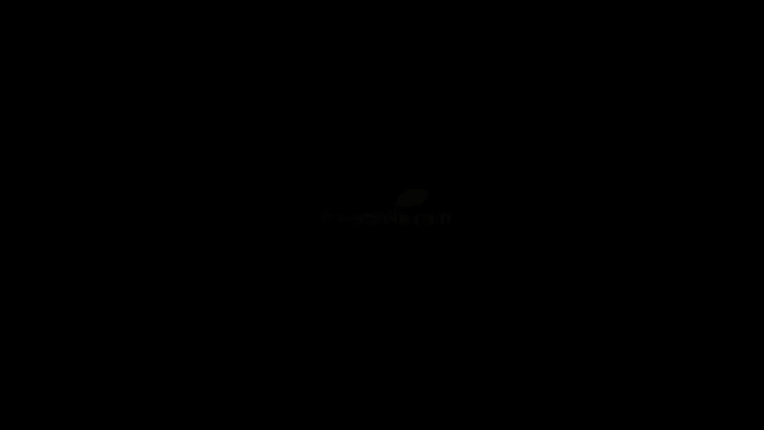

# Reinforcement Learning in Finance - New York University 金融强化学习 - 纽约大学 - P25：RL Approach - Q-Learning - 兰心飞侠 - BV14P4y1u7TB

 Now， after we talked about stochastic approximation。

 it's time to talk about the celebrated Q-learning。

 one of the most famous algorithms of reinforcement learning。

 This algorithm was suggested in 1989 in a PhD thesis of Watkins。

 and since then his paper was cited more than a thousand times。 Q-learning， at its extensions。

 are used in many interesting applications of reinforcement learning。 In particular。

 Google's DeepMind became very famous before they became a part of Google。

 when they published a paper where they showed how to use Q-learning at scale。

 to teach reinforcement learning agents to play Atari video games。 Now， in its original form。

 as suggested by Watkins， Q-learning works only in the setting of discrete states and discrete actions。

 In this case， instead of a continuous value Q-function， it's represented as a discrete table。

 with one value of the Q-function per each combination of states and action。 In this case。

 we can say that the Q-function is given in a tabulated form。 Now。

 the main statement of Watkins Q-learning is that given enough data。

 the algorithm that takes all data point sequentially。

 like in the robins-mond-raw stochastic approximation。

 converges to the true Q-function asymptotically， when they have lots of data。 More specifically。

 the convergence proof assumes that each possible combination is encountered in data and infinite number of times。

 Of course， this is never true in practice， where all data are finite。 Therefore， in practice。

 the question of numerical convergence is always something that needs to be checked。 So。

 what does Q-learning do？ It simply takes the next observed transition and updates the value of a state action peer that was observed in this transition。

 Let me illustrate its working on some popular examples used for testing and teaching Q-learning。

 One such example could be an application of Q-learning to solve a maze problem。

 Here you can see an example of a simple maze with an obstacle， shown here as a black square。

 and an exit in the top right corner。 The problem of an agent is to learn an optimal policy that would prescribe the direction of the move given the cell location of the agent。

 In each cell， the agent can move up， down， left， and right。 So， we have four degrees of freedom。

 but some moves cannot be done。 For example， a left move is forbidden if there is a wall to the left。

 and so on。 So， in this problem， we have eleven possible cell locations and up to four possible actions that can be taken in each cell。

 And this gives us forty-four possible combinations of a cell and action。

 which is still quite manageable a number to keep an index column in a lookup table that stores the value of the Q function for all such possible combinations。

 The learning in such simple environment can be done using simulations。

 Each time a particular data point is absorbed as produced by such simulation。

 it's taken to update the value of the Q function at the node that corresponds to a particular combination of this data and action that were absorbed in this round of simulation。

 Now， after we spoke about what Q-learning does， let's talk about how it does it。 In essence。

 Q-learning is just the application of the Robins-Monroe stochastic approximation。

 but this time to estimate the unknown expectation that arises in the right-hand side of the Bellman-Optimality equation。

 Let's compare the Bellman-Optimality equation with the Robins-Monroe update。

 In the Bellman equation， the optimal Q function is given by the expectation of the right-hand side。

 On the other hand， the Robins-Monroe formula just shows how to update a running estimation of the mean。

 Therefore， we can take an individual sum of the current observed reward R_t and the marks of the next step optimal Q function as the current observation x_t in the Robins-Monroe formula。

 The current estimate of the mean x_t will be played by our current estimate of the optimal Q function。

 If we specify some scheduling scheme for the learning rate alpha_k。

 these substitutions will produce the famous Q update rule of Q-learning that is shown here at the bottom of the slide。

 In words， it says that the new update for the value of Q function at the node x_t and at is given by a previous estimation of its values scaled by the factor 1-alpha_k plus another term equal to alpha_k times the new observed value of the quantity that appears in the right-hand side of the Bellman-Optimality equation。

 Now， the Q iteration rule shows two very important things about Q-learning。

 namely that it's both a model-free and off-policy algorithm。

 This means that it does not make any assumptions on a true data-generating process that produces the current observation。

 It simply takes it as given and updates the action value function for a given state action node x_t and at。

 It's also an off-policy algorithm because the only thing that matters for Q-learning to work is that all action state pairs will be visited many times。

 But why they were visited does not matter。 In the limit when all state action pairs are encountered in infinite number of times and data。

 Q iteration is guaranteed to a syntotically converge to true optimal value function for all such pairs。

 You can read more on conversion properties of Q-learning algorithms in a weekly reading for this week。

 Now， given what we discussed in the previous lesson on dynamic programming solution to the model。

 it should be evident that even though the classical online Q-learning algorithm is guaranteed to a syntotically converge。

 it might just take it too long for practical purposes。

 And the reason for this is that optimal hedges are obtained using cross-sectional information across all Monte Carlo paths。

 But such cross-sectional information would be masked by any online method of updating Q-values and optimal hedge ratios。

 However， the way out in these cases is also clear。

 What we have to do is simply to update Q-values and a value of a star at all Monte Carlo paths simultaneously。

 As we did when we computed optimal hedges in the previous lesson。

 Because we are now in the setting of batch mode reinforcement learning， the data are already there。

 And there is no need actually to take data points one by one as is done in the classical Q-learning。

 In the next video， we will see how the classical Q-learning can be adjusted for such batch mode learning。

 [BLANK_AUDIO]。

