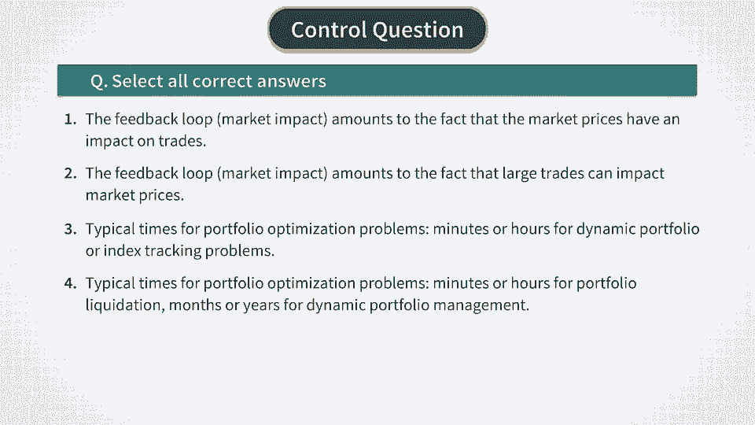

# Reinforcement Learning in Finance - New York University 金融强化学习 - 纽约大学 - P31：RL for Stock Trading -Introduction to RL for Trading - 兰心飞侠 - BV14P4y1u7TB

 And then last week we talked about using reinforcement learning for option pricing and。

 hedging。 We built a simple and analytically tractable reinforcement learning model that solves the。

 most fundamental problem of option pricing。 The problem of pricing and hedging of a single European option which was a put option in。

 our case on a single stock。 Now we want to see how reinforcement learning applies to stock trading。

 You may wonder at this point why did we first talk about options on stocks before talking。

 about stocks themselves。 The reason for this is that our first case is probably as simple as possible reinforcement。

 learning setting in finance that has practical interest on its own。 As we will see shortly。

 applications of reinforcement learning to stock trading are more technically。

 involved than this example for a number of reasons。

 And to see that it might be good to start talking about applications of reinforcement learning。

 for stock trading with a brief summary of what we did for options。

 So what we found was that by the classical option replication argument of Bloch-Black-Scholson-Nerten。

 pricing of an option on stock amounts to dynamic optimization of a very simple portfolio made。

 of a stock and cash。 The objective in such problem is the best dynamic replication of the option。

 We then found that if we consider a risk adjusted return of such portfolio as a one-step reward。

 function for reinforcement learning formulation， then we can apply the standard risk neutral。

 formulation of Q-learning， which only optimizes expected rewards but does not control variance。

 of these rewards。 But this is okay in our case because we already included risk penalty in our risk adjusted。

 expected rewards。 Another important observation was that rewards in our formulations and now formulation were。

 quadratic only for non-zero risk aversion parameter lambda。

 Also important was the fact that in this problem we took a view of a small investor whose traits。

 on in stock do not impact the market。 We also neglected transaction costs for simplicity。

 but in principle transaction costs can be introduced。

 in our reinforcement learning option pricing model by making the model only a little bit。

 more complex。 Yet in the simplest setting without transaction costs that we consider it the problem was。

 easy to solve because of two related reasons。 The first reason is that when there are no transaction costs we do not need to store the。

 number of stocks we currently hold as a state stable。

 In fact in our previous model it was an action stable instead。

 The second reason is that we assumed a small investor and therefore emitted market impact。

 effects which would make the whole problem non-linear。

 These two simplifications made it relatively easy to solve the problem of option pricing。

 and hedging using Q-learning and fitted Q-duration。

 Now let's see what changes when we start to look at related portfolio tasks for stock trading。

 In general most of practical problems in stock trading can be viewed as problems of optimization。

 of stock portfolios。 Let me first give you a list of such problems and then we will go in a little bit more details。

 over each one of them in this list。 The first example in this list would be the problem of optimal trade execution for a large。

 trade in a stock over a given company。 In this case we have a stock portfolio made of the stock of the same company。

 The second group of examples involves multi-acid portfolios made of different stocks。

 These different but related tasks include portfolio dynamic management。

 optimal portfolio liquidation， and index tracking。

 We will discuss shortly what is involved in each one of these tasks but from now let's。

 first outline what is common between all of them。 First as we will see later all of these problems can be formulated as problems with a one-step。

 reward made of an expected cost of trading plus risk penalties。

 Second unlike our option pricing case now we need to keep stock positions as state variables。

 Third in this class of problems we often have to take into account a feedback loop for an。

 impact of trading on stock prices。 Moreover many of these problems are high dimensional even for a single stock and many of them are。

 very high dimensional for both the state and action spaces。

 And finally often these problems have to do with big data in particular for large print。

 fellows or for high frequency trading。 We will talk more about problems involving big data。

 deep reinforcement learning and related， topics in our next course but here I just want you to take a mental note of this fact。

 It's important in particular because this way in fact rules out some traditional modeling。

 approaches such as dynamic programming right from the start。

 And the reason is that the classical dynamic programming is based on a discretization of。

 a state space and this only works when you have at most three or maybe four dimensional。

 state space。 But the dimensionality of a state space in nearly all problems that we are going to discuss。

 in this week is typically much higher in tens hundreds or even thousands。

 So for these cases a discrete state space is a no starter and hence we will not discuss。

 such formulation here。 Now let's go over each one of these print photo tasks in more details。

 First let's talk about optimal stock execution。 The problem in this case is formulated as follows。

 We have a large number n of stocks of a particular company for example Amazon and we want to。

 sell all these stocks within some time T。 In many practical cases the time T which we will。

 call the planning horizon is in minutes。 This is so-called agency problem which is solved thousands of times a day by brokers。

 on the stock market exchange following sell or buy orders by their clients typically hedge。

 funds or asset managers that we can collectively call traders。

 Sometimes traders may execute trades themselves if they have an appropriate infrastructure。

 What these brokers or traders do when they have to sell a large block of a stock is they。

 break it into smaller chunks and sell or buy these chunks sequentially so that to minimize。

 market impact from their trades。 Mathematically this amounts to dynamic optimization with a feedback loop which appears as a result。

 of market impact。 And additional complexity is brought to the problem by the fact that there are two sorts。

 of orders that a broker can receive from a client。 Market order and limit order。

 And market order is to sell or buy a certain number of stocks at a prevailing market price。

 A limit order is to sell or buy for a press specified price but without a guarantee that。

 the trade will be made for the price requested。 If we take into account both market and limit orders which would be the right thing to do。

 for high frequency trading the problem may quickly become high dimensional and pretty。

 complex even for a single stock。 We will talk more about such taking in our next course in this specialization。

 Now let's talk about the problem of optimal portfolio liquidation。

 The problem is nearly the same as the last problem except that now we start with a portfolio。

 made of different stocks rather than with a block of stock of the same company。

 Also because we now talk about a portfolio liquidation strategy it might work on a bit。

 longer planning horizon for example hours or days。

 The next problem is a dynamic portfolio optimization problem。

 This is essentially the previous problem with the minus sign where instead of liquidating。

 given starting portfolio we built an optimal investment portfolio。

 An objective function for such dynamic optimization is defined as a risk adjusted and cost adjusted。

 portfolio return and is mathematically identical to the objective function of the previous problem。

 The main difference is quantitative rather than qualitative。

 It has to do with the fact that a playing horizon for such tasks is longer and may extend， to weeks。

 months， or even years。 Therefore a different set of predictors is needed for such longer planning horizons。

 For example we have to include macroeconomic factors and other factors。

 Please note that the classical market's portfolio optimization problem is a special one-step。

 version of this segment。 These problems can also easily become high dimensional and big data problems depending。

 on specified investment universe。 Finally I want to talk about the problem of optimal index tracking。

 Here a task is typically to track a market index such as an S&P 500 portfolio using a。

 proxy portfolio made of a smaller number of N different stocks which can be viewed as。

 the main drivers of the index itself。 Such tasks can have playing horizons of week。

 months or can have an infant horizon。 The later scenario of infant horizon arises if you invest in the so-called exchange traded。

 funds or ETFs for short。 The idea of these instruments was exactly this to construct a very liquid exchange traded。

 portfolio of a reasonably small number of stocks that would closely match by design market indices。

 Because indices such as S&P 500 are just indices you cannot directly invest in them。

 But if you invest in an ETF called SPY you will get the best proxy portfolio for the。

 index for a reasonable price。 For other market indices or other given target client specific portfolios we can also formulate。

 a problem of optimal tracking。 And the mathematical formulation will be very similar to the previous one except for the。

 terminal condition that we have to use。 So here is a summary and a plan of what we will do next。

 First， all these problems are problems of optimal control and therefore we will consider reinforcement。

 learning methods for such problems。 Second， all these problems are high dimensional problems therefore we will not discretize state。

 or action space but we will work directly with a continuous formulation。 And third。

 we will present a simple but general mathematical formulation that works for all。

 the problems we outlined above。 This approach will be quite tractable analytically as long as it is based on context optimization。

 Let's see what questions we could ask ourselves after this introduction and then continue in。

 the next video。 Thank you。 for watching。

 Thank you。 Thank you。 Thank you。