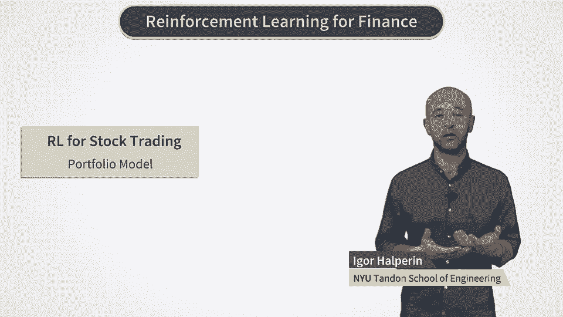
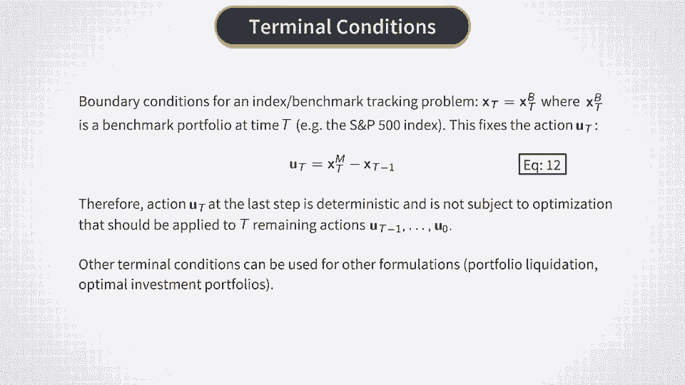
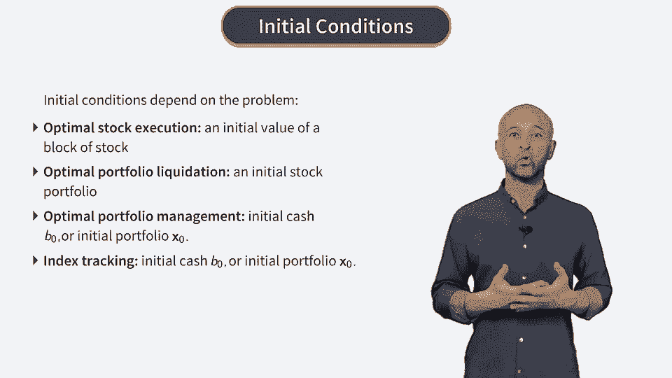
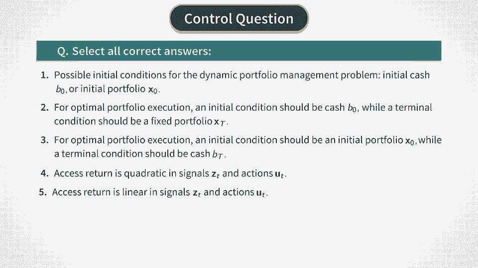

# Reinforcement Learning in Finance - New York University 金融强化学习 - 纽约大学 - P32：RL for Stock Trading -Portfolio Model - 兰心飞侠 - BV14P4y1u7TB

 Now we will develop a simple stock portfolio model that we will use in our reinforcement learning approach。

 We assume a universe of end stocks or possibly other assets such as ETFs。

 And denote the vector of prices at time T as P sub T。 So the vector P。

 T size N with all elements being positive。 An investor can invest in stocks and in addition can keep wealth in a risk-free bank account。

 cash account， that earns a risk-free interest rate RF。

 We will denote this amount in cash as B sub T。 Now a vector X sub T will describe dollar positions in all assets。

 so it also has size N。 The numbers of different stocks can be obtained now by dividing components of vector X T by market prices P T。

 and rounding to nearest integer value。 Negative components of vector X T describe short positions in stocks and positive components are long positions。

 Now a vector U sub T will describe traits made at the beginning of time step T。

 The values of positions X T right after traits are instantaneously deterministic。

 so that the new value X T with the upper script plus right after the trait is simply given by the sum of X T and U T。

 Traits in this model have costs and market inputs， which we will specify a bit later。

 Now the total portfolio value is just the sum of all components of vector X T plus the amount of cash。

 We will write the sum of all components as a dot product of a vector of 1's and vector X T。

 as shown in equation 2 here。 If we replace here values of X T and B T by their post-trait values X T plus and B T plus。

 we can compute the value of the portfolio right after the trait， as shown in equation 3。

 Now we assume that all changes in stock positions can only be financed from a cash position。

 This is known as a self-financing portfolio。 As trading has costs。

 we will have additional costs for trading that will be added later。

 But for now we use the self-financing condition as shown in equation 4。

 The meaning of this condition is that the portfolio value cannot instantaneously change simply by reshuffling the wealth between cash and stocks。

 It only changes as a result of random returns on stocks in a portfolio。

 Portfolio changes are described in this model as follows。

 After a rebalance of the portfolio at the beginning of time interval C。

 it's followed by an investment period till the end of the interval C。

 We define returns of assets over this period in a usual way， as shown in equation 6。

 The vector X T plus 1 for the beginning of the next period。

 which is the same as the end of the current period， is then given by equation 7。

 Please note that we use an element-wise multiplication here， also known as an other mark product。

 And it's denoted by an encircled dot in this equation。

 Next we need to specify an asset return model for vector R T。

 We will use a very simple parameterization shown in equation 8 on this slide。

 What this equation says is that the excess return， that is the difference of R T and R F。

 is equal to a linear combination of some vector of predictors that we call Z T。

 and vector U T of trades at time E T。 With certain weights。

 The weight W T will stand for a matrix of weights for predictors Z T and matrix M T is a matrix of market input for trades。

 And finally， epsilon T will be a vector of residuals with mean 0 and covariance sigma T。

 Now we can compute the new portfolio value at time T plus 1。

 This calculation is shown in equation 10。 We just multiply the vector X T by a vector of 1s。

 and using the expression for X T plus 1， this gives final expression in equation 10。

 Now we can compute the change of the portfolio in excess of a risk-free growth。

 And this is computed in equation 11。 Here we subtract the term 1 plus R F times VT from VT plus 1。

 and using the self-financing condition， this produces the final expression in equation 11。

 This relation can be applied at any time step except the very last one。

 For the last time step we have to impose terminal conditions that would be appropriate for a setting we want to address。

 For example， if we deal with the index tracking or a similar benchmark matching problem。

 then terminal values X T with capital T should match a given values X sub B of a benchmark portfolio。

 For example S and P 500 portfolio。 This can be used to fix the last action U T as shown in equation 12。

 So that the last action is deterministic and therefore it drops out from the problem of action optimization。

 which should be solved for the remaining actions U0 to U sub T minus 1。

 For other setings we can formulate different terminal conditions。 For example。

 for an optimal investment portfolio we can impose zero terminal conditions for X sub capital T。

 meaning that all stock positions will be traded for cash at time T。

 These that does not necessarily mean that we have to really close all positions at time T。

 but merely this condition serves as a way to express the value in stocks in terms of a cash value。

 For the optimal portfolio liquidation problem we also impose zero terminal conditions on X sub capital T。

 Finally we can discuss initial conditions for the problem。

 This will be specific to a particular setting on which we consider the general portfolio optimization problem。

 For example， if we deal with an optimal stock execution an initial condition will be an initial dollar value of a number of stocks that we need to sell。

 If we deal with a portfolio liquidation problem then an initial condition will be given by an initial portfolio。

 For the problem of optimal portfolio management an initial condition can be an all cash initial position B0 or it can start with some initial portfolio X0。

 And finally for the problem of index or a benchmark tracking initial conditions can also be formulated either as an all cash or as a given initial portfolio X0。

 [BLANK_AUDIO]。

