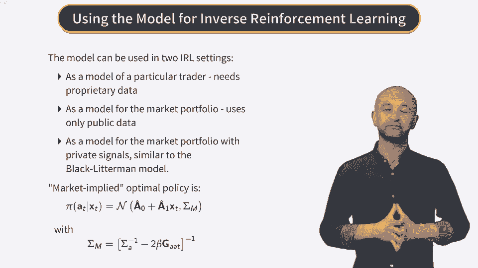

# Reinforcement Learning in Finance - New York University 金融强化学习 - 纽约大学 - P38：RL for Stock Trading -RL and Inverse Reinforcement Learning Solutions - 兰心飞侠 - BV14P4y1u7TB

 Now we are ready to put everything together in one backward-occursion scheme to compute。

 the optimal policy from data using reinforcement learning。

 The first thing we do is update the optimal policy。 We first do it in terms of the increments。

 increment delta A(t)。 The posterior probability of A(t) is shown in equation 50。

 Here pi0 of delta A(t) is a prior distribution pi0， which is re-expressed in terms of delta。

 A(t) instead of A(t)。 Now because pi0 of delta A(t) is Gaussian and the expression in the exponent is quadratic。

 the result is another Gaussian distribution， as shown in the second line of equation 50。

 The new mean and covariance of this distribution are shown in equations 51。

 We can view this equation as Bayesian updates of prior values for these quantities。

 Now we are almost there， but we need one more element here， namely a way to find the trajectory。

 that we used before in our scheme。 Such trajectory is found in the model self-consistently。

 iterating several times between a forward pass， and a backward pass。

 The method used in this calculation is called iterated quadratic Gaussian regulator， and。

 it was suggested in 2005 by Todorov and Li。 Here is how the method works。

 We start with an initial trajectory that is built using the mean of the prior policy distribution。

 At each step we take the current mean of the prior as a deterministic action and then compute。

 a new state using the original state equation without the noise term。

 Then we go backwards and compute the g function by recursion as we did above。

 And this is the backward pass of the algorithm。 This produces an update for the mean of the policy。

 And after that in a forward pass we make a new trajectory around this mean and the whole。

 thing begins again。 This is continued until convergence and produces a self-consistent solution for the dynamics。

 The end result can be expressed as an optimal data implied policy that has the same functional。

 form as our prior policy by zero but with updated parameters。

 You can find the explicit expression for coefficients A0 and A1 that are recomputed here。

 at each step of the trajectory optimization procedure in the original publications。

 The updated covariance matrix sigma m is shown here and the change is clearly seen。

 Sigma m is a regularized covariance matrix of the prior where a regularization term is。

 equal to beta times the matrix G aa t。 So now let's summarize and put the whole scheme together。

 This is an algorithm that applies for our model in the conventional reinforcement learning。

 setting when the words are observable。 The algorithm starts with an initial trajectory as a sequence of pairs x bar and u bar for。

 all values of t from zero to capital T。 And this is the first forward pass。

 Then we start iterating between the backward and forward passes until convergence。

 First we perform a backward pass that goes back in time from capital T minus 1 to zero。

 And in this pass for each value of t。 In step one we compute the expected value of the F function from the next period as。

 we showed above。 Next in step two we use this computed value and observed three words and compute the G function。

 at this step。 In step three we compute the F function at the same time step。

 And after that in step four we recomputed the policy for this time step by updating its。

 mean and variance。 We repeat step one to four for all time steps until we complete the backward pass。

 Then we do a forward pass by constructing a new trajectory using the new mean and variance。

 and the whole procedure repeats。 This summarizes the procedure for the regular reinforcement learning with our model when。

 the words are observable。 But it turns out that even more interesting problems can be addressed by this model in。

 this setting when the words are not observable。 I would like to remind you that this setting is called inverse reinforcement learning or。

 IRL。 In this setting we observe states and actions but not rewards。

 In general this setting is both very interesting and more difficult than a direct reinforcement。

 learning case。 We will talk more about the IRL in general in a little bit but first let's see how our。

 model can work in such setting。 It turns out that this case is easy for our model because inverse reinforcement learning。

 amounts in this model just to conventional maximum likelihood estimation。

 The reason for this is that a policy that we obtain in this model is a Gaussian policy。

 whose mean and variance depend on parameters of the word function。

 Therefore we can use the observed state action data and apply the regular maximum likelihood。

 method to such Gaussian distribution。 This gives us the negative log likelihood of data shown here in equation 54。

 Because parameters of this Gaussian likelihood depend on the original parameters of the reward。

 function we can use the characteristic gradient descent or gradient descent method to compute。

 these parameters by minimization of the negative log likelihood。

 This should be done at each iteration of the above forward backward scheme。

 So for each iteration K we have to substitute here values of A0 and A1 and sigma M computed。

 the this iteration。 This procedure replaces observed rewards of the reinforcement learning setting by estimated。

 rewards of inverse reinforcement learning setting。

 Now we bring this additional element for inverse reinforcement learning and present a full scheme。

 for the model for inverse reinforcement learning setting。

 The only new element comparing to the reinforcement learning case is a new step two where we use。

 maximum likelihood to estimate the reward parameters and other parameters that entered， the model。

 including in particular the inverse temperature parameter beta。

 The next step three uses this estimated rewards instead of observed rewards to compute the。

 G function and the rest of the steps is the same as for reinforcement learning setting。

 This shows that computationally inverse reinforcement learning in this model is not much harder than。

 directly enforcement learning。 Now how could we use this model to to interested in reinforcement learning things？

 Recall that when we introduced the model we said that it can be used either as a model。

 of a particular trader or as a model for the market portfolio such as S&P 500 portfolio。

 In the first case we need proprietary trading data from that particular trader to learn。

 the reward function and optimal policy for that trader。

 If we have such data we can for example compute implied risk aversion parameter lambda for。

 that trader。 But more often than not we do not have such proprietary data because only brokers or traders。

 have it and that's why it's called proprietary data。

 So what else we can do with the model is to use it with open data namely with market data。

 We can apply it to the market S&P 500 portfolio in a similar way to the black litremon model。

 that I mentioned earlier。 The whole scheme of the model can then be viewed as a dynamic probabilistic and data-driven。

 extension of the black litremon model and its inverse optimization interpretation by。

 Burt Smith and co-workers。 In this case the optimal policy that we computed before which I repeat in the formula here。

 would be a market implied optimal policy。 On a set of commonly used predictors ZT we can directly estimate this market implied optimal。

 policy using the method we just described。 On the other hand if we have some private signals ZT also called private views in the。

 black litremon model that are not available to the rest of the market we can use them。

 to try to beat the market by our improved optimal policy that takes those signals into， account。

 Such improved policy would be obtained by adding these signals to the list of common， predictors。

 You can find more details on this model in the original publications that you will need。

 to consult because you will be dealing with this model in your final course project for。

 this course。 And at this point we are ready to wrap up our week and our whole course on the reinforcement。

 learning。 We will summarize what we learned in our next video。 Thank you。

 and we will see you on the next video。 Bye。 [BLANK_AUDIO]。

