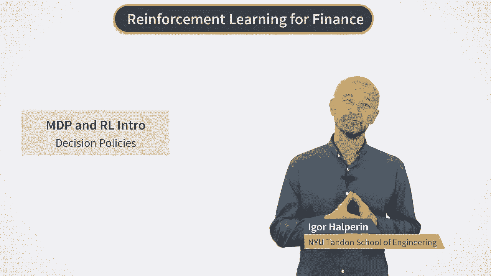
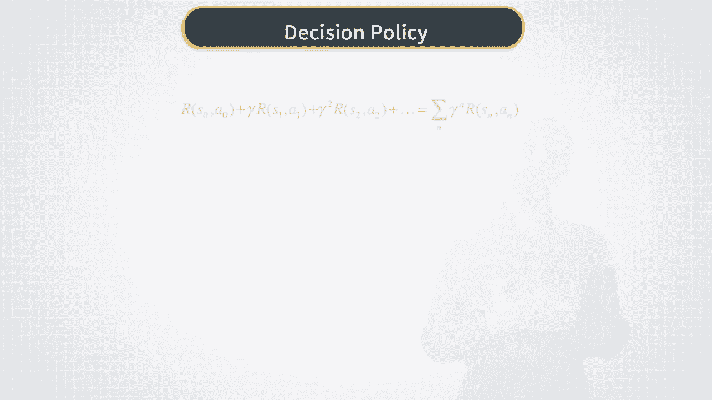
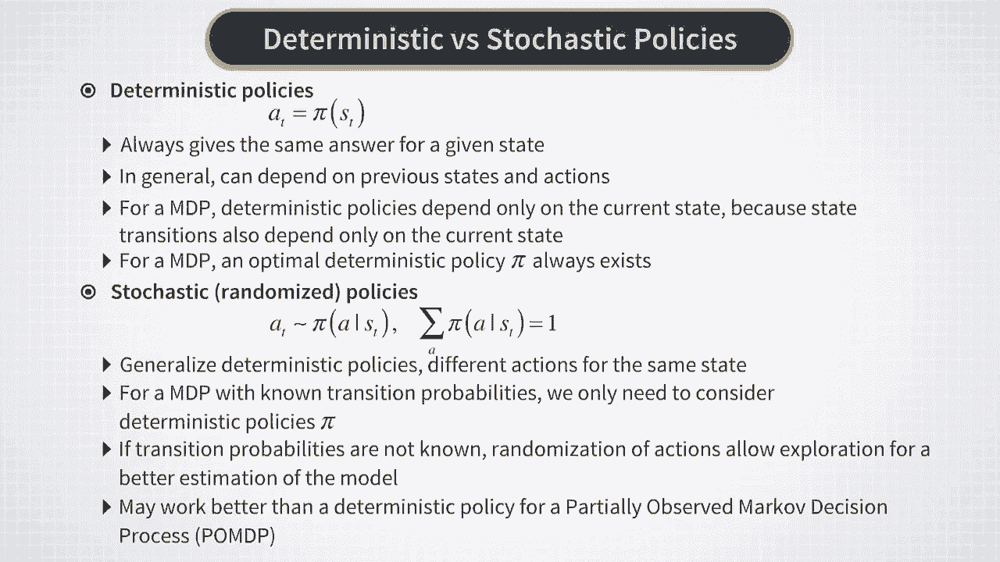
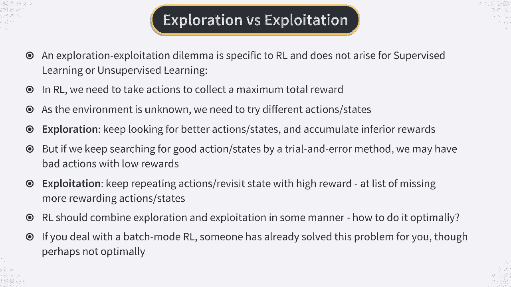
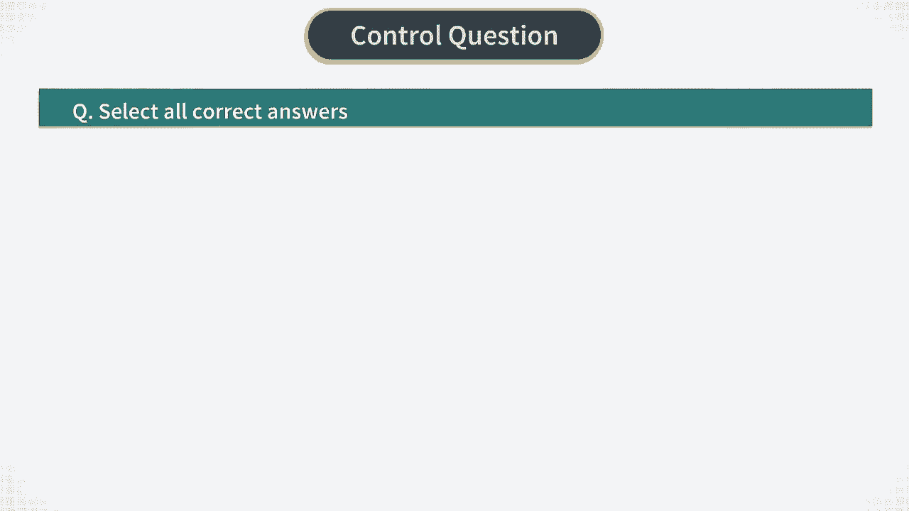

# Reinforcement Learning in Finance - New York University 金融强化学习 - 纽约大学 - P5：MDP and RL- Decision Policies - 兰心飞侠 - BV14P4y1u7TB

现在，让我们谈谈我们如何才能真正实现。

最大化马尔可夫决策过程的预期总回报的目标。

我们说过强化学习的目标是最大化。

未来执行的所有操作的预期总回报。因为这个问题现在必须解决，但是将来会执行操作，为了解决这个问题，我们必须定义所谓的策略。策略是一个函数，当前状态 S t 并将其转换为动作 A t。换一种说法。

此函数将状态空间映射到马尔可夫决策过程中的动作状态。如果一个系统当前处于因子 S t 所描述的状态，然后下一个动作 A t 由策略函数 pi 给出，S t 作为其参数。

如果策略函数是它的参数 S t 的常规函数​​，然后输出 A t，将是一个数字。例如，如果策略函数是线性的，比如 S 的 pi 等于 S 的二分之一，然后对于 S 的每个可能值，我们将采取一项行动。

这种策略规范称为确定性策略，但事实证明这不是我们唯一的方法，可以为马尔可夫决策过程定义策略。我们也可以考虑随机策略。在这种情况下，策略由，概率分布而不是函数。让我们更详细地看一下这两个规范之间的差异。

首先，让我们谈谈确定性政策。在这种情况下，要采取的行动 A t 由下式给出，应用于当前的策略函数 pi 的值，状态 S t。如果找到钢筋方向，自身处于系统同一状态 S t 不止一次。

每次它都会以完全相同的方式行事。现在，它将如何行动仅取决于当前状态 S t，但不是关于以前的国家历史。这个假设是为了确保一致性，以系统动力学特性为标志，其中看到特定未来状态的概率仅取决于当前状态。

但不是在任何以前的状态。实际上无法证明，对于马尔可夫决策过程，始终存在最优确定性策略 pi，所以我们的任务只是在所有可能的确定性策略中进行识别。所以，只要是这样，看起来确定性政策就是一切。

我们永远需要解决马尔可夫决策过程。但是，事实证明，第二类政策，即随机策略也常常对强化学习有用。对于随机策略，pi 变为概率分布，可能的行动 A t。这种分布可能取决于。

将 S t 的当前值作为这种分布的参数。因此，如果我们使用随机策略而不是确定性策略，代理再次访问相同的状态，它可能会采取与上次在相同状态下采取的行动不同的行动。现在，我们为什么要考虑这种随机策略？好吧。

如果我们知道马尔可夫决策过程中的转移概率，那么我们可以考虑，只有确定性策略才能找到最佳确定性策略。为此，我们只需要求解我们在，我们之前的课程，我们将在下一个视频中再次回顾。但是如果我们不知道转移概率。

我们必须从数据中估计它们并再次使用来解决，贝尔曼方程，否则我们必须，依赖于遵循强化学习方法的样本。在这种情况下，可能的动作随机化，遵循一些随机策略可能会提供一些探索空间，以便更好地估计模型。

我马上会回到探索的概念，但首先让我注意到还有第二种情况，当使用随机策略时可能是可取的。出现这种情况时，而不是完全可观察的马尔可夫环境，我们处理部分观察到的环境。

这种情况简称为部分可观察马尔可夫决策过程或 POMDP。在本课程中，我们不会处理 POMDP，但很高兴知道它们的存在，至少，特别是考虑到这样一个事实，金融中的许多问题可能是这种设置的好用例。但是。

这种情况在数学上比 MDP 设置复杂得多。因此，我们将首先研究字母大小写。好的。所以，现在，让我们回到什么是探索以及我们为什么需要它。

探索的概念出现在强化学习中，所谓的勘探开发困境，在采取行动时将不同的可能情景或策略概念化。这种困境特定于强化学习和，没有出现在有监督或无监督学习中。同样，原因是在监督或无监督学习中。

没有多种可能的行动需要考虑。动作总是固定在那里，但在强化学习中，在每一步，我们都需要在众多行动中采取一种可能的行动。我们的最终目标是最大化总回报。但在学习的任何特定阶段，如果环境未知。

我们可能不知道以后可能遇到的所有状态。或者，代理可能需要在它已经看到的状态下尝试不同的操作，可能是因为采取不同的行动可能会改变，环境的方式会在以后产生更高的回报。因此。

我们可能需要尝试不同的操作并探测不同的状态。这是通过探索完成的。我们搜索好的动作和状态，例如，通过不时采取纯粹随机的行动。但如果我们经常这样做，我们最终可能会得到一个较低的最终累积奖励，因为在。

试错法的探索，我们的代理访问了太多的低奖励状态。另一种方法是依赖开发。当我们的代理只是重复它的状态时，就会发生剥削，访问在之前访问这些州时提供良好奖励的相同操作。但这显然有选择好的行动的风险。

但不是最好的行动，仅仅因为它们可能是，可能有更好回报的行动和状态。但如果只是，利用已知的动作和状态。这就是为什么它被称为探索利用困境。在每个时间步，代理应该决定，在这种状态下是否应该探索或利用。

但它不能同时做这两件事。强化学习应该理想地结合探索和利用，例如，通过在不同的时间步长之间切换它们。具体如何做到这一点取决于具体情况，并且有，没有关于如何的通用答案，勘探开发困境应该。

在一般的强化学习环境中解决。但重要的是要注意，这种困境只与在线强化学习有关，当代理与环境实时交互时。另一方面，在批处理模式强化学习中，我们已经从另一个代理的操作中收集了一些数据。

这意味着这个其他代理已经解决了，在某种程度上，这个问题的探索利用困境。这可能不是最好的方法，甚至可能是一个坏方法。例如，数据可能是使用纯随机民意调查收集的。但是，无论如何，这样固定的数据集就是这样。

代理具有批量强化学习的设置。它无法访问实时环境，因此它甚至无法考虑任何探索。相反，它必须依赖固定的数据集并学习，仅来自该数据集的最优策略。

