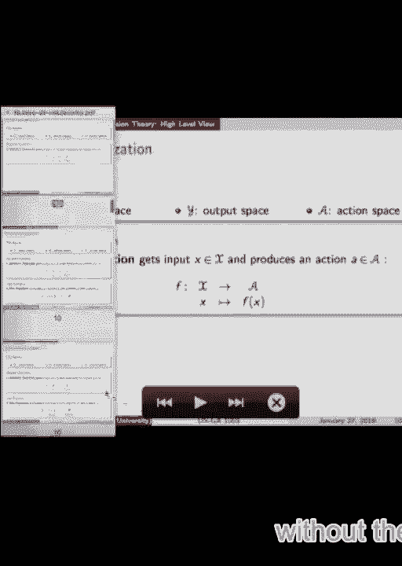
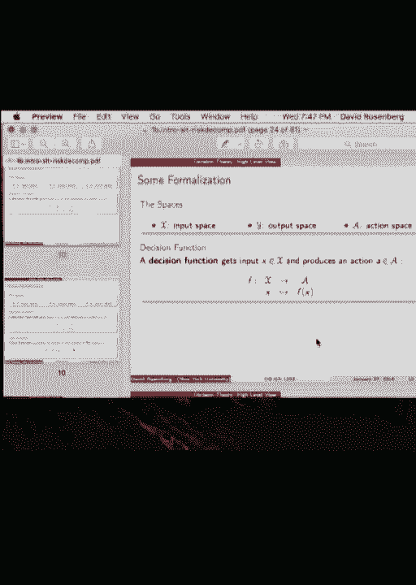
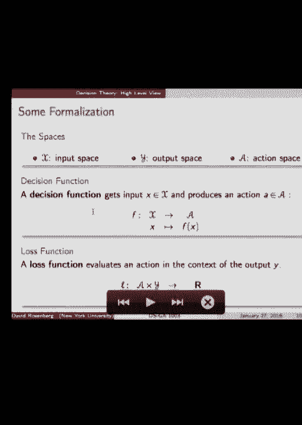
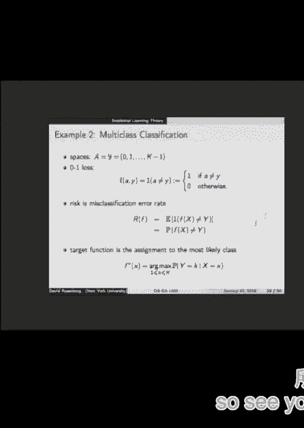
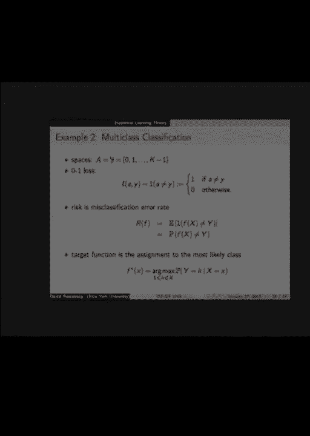
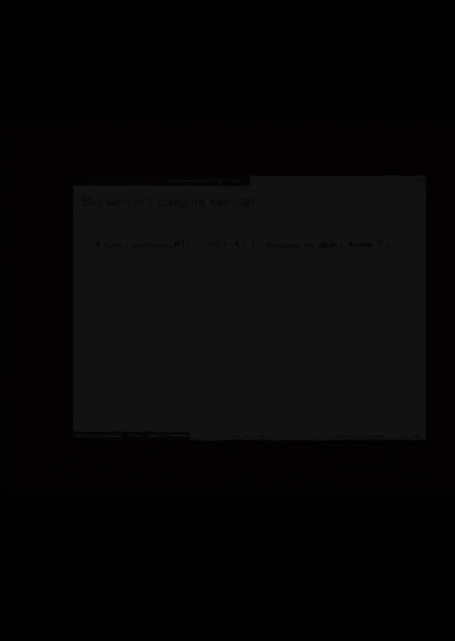
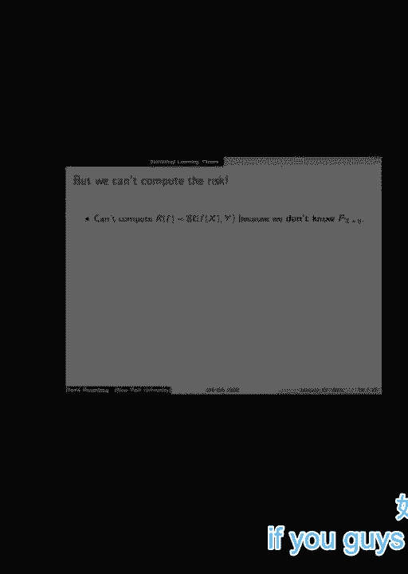
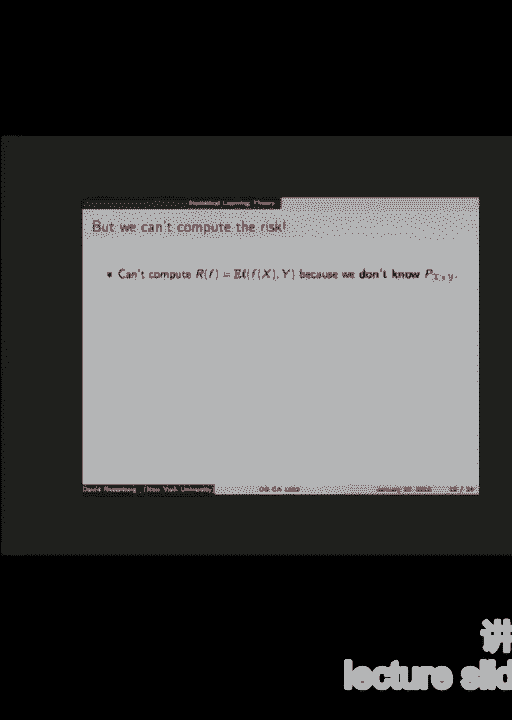
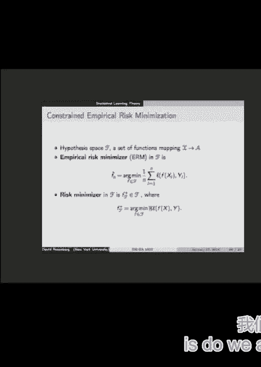

# P1：1.Machine_Learning_Jan_27th_Lec - Tesra-AI不错哟 - BV1aJ411y7p7

 Hey guys， welcome to machine learning， DSGA1003。

 I'm David Rosenberg。 I'll be your instructor this semester。

 So we'll start off with some slides on logistics， a little bit about the core structure， not。

 too much。 And then we'll get into some material。 We're going to do some pretty abstract stuff and some very concrete stuff。

 And maybe that's the tone for the course， in fact。 So just out of curiosity by a show of hands。

 how many people are in the master's program， center for data science？ Okay， what is it like？ 50？

 All right。 And how many people are just here auditing？ Or for a look？ Maybe you'll take it。

 And on the waiting list？ Okay， not so many。 Okay， good。 So the survey is over。 So first。

 the class webpage is posted on GitHub。 You should take your time to read it。

 I'm not going to cover all the information in these slides。

 There's a lot of details for the class that you can find on the website， particularly。

 the syllabus and some important dates， such as the tests。

 The semester we're going to be using Piazza。 I bet a lot of you guys have already used Piazza。

 It's a very nice website for posting questions， getting answers from your peers and from the。

 instructors， from the graders。 It worked very well last year。

 and it's a good way to get some help or get some discussion， going pretty quickly。

 And so that should be your go-to for asking questions。 You'll need to email the graders or myself。

 just post directly to Piazza and we monitor， that very， very well。 So schedule。

 Class times will start， usually things are ready to go， promptly at 7。10 by iPhone time。

 On Wednesday we go 7。10 to 9。 And Thursday， we call it a Thursday hour meeting a lab that's just more for historical reasons。

 It's really just an extra class。 And so both are required。 So on the lab sessions。

 some will be led by myself， some will be led by the TA， I'll introduce， in a second。

 And it'll mostly be lectures， often amplifying what was taught on the Wednesday class。

 Sometimes it'll be something supplementary， such as a math topic。

 Most topic will be some mathematical things， differentiation with respect to vectors， which。

 will be helpful in your calculus。 One of the tests is going to be during lab sessions and then we'll all see lab sessions。

 for meetings with the advisors。 So we have projects in this class and some of the advisor meetings happen during lab。

 So lab is kind of a mixed bag of types of meetings and Wednesday lectures are all standard。

 to our lectures。 Okay， so the course staff。 So first let me introduce our TA， Levant-Sagoon。

 He came highly recommended from one of the prerequisite classes， 1002。 Do you want to say a word？

 I have a percent in tomorrow。 We have four graders。 You'll see little pictures。

 small blurbs on the website。 And we have some project advisors for the project for the class and these are kind of。

 real experts in data science work and industry and they'll come in and advise usually about。

 eight groups each and that's usually a very rewarding experience。 So， how is the class graded？

 There's going to be about eight homeworks。 They'll be worth about 40%。 They'll be worth 40%。

 There will be two tests， a shorter one and a longer one for another 40% total and then。

 the project will be 20%。 And that will be primarily based on your final report。

 There's a poster session and that adds up to 100。 There's also some extra credit opportunities and how this shows up is as optional questions。

 on the homework primarily。 So what's kind of unique about this is that the extra credit on the homework does not。

 help your homework grade。 It's a totally different category。

 So you definitely to finish the regular problems on the homework first。

 The optional problems are you want to go kind of beyond， cover more material， you'll have。

 an extra time。 You just want to go really deep into data science。

 I want to give you all the opportunities to learn as much data science as you can。

 So that's kind of why there are these optional questions。 Even if you don't do the questions。

 it might be worth reading them because sometimes we。

 introduce some new topics that aren't required but may be of interest in any case。

 Also if you're a kind of power contributor to Piazza or class discussions that can help。

 boost your grade at the end。 But all told the extra credit can only increase your final grade by like half a letter grade。

 So B plus D minus， A minus to A， that sort of thing。

 Any questions on evaluation or anything else so far？ Okay。 All right。

 so the first homework assignment will be out tomorrow。 It'll be due in a week。

 For submitting homework we use NYU classes which I assume you guys are familiar with and if。

 you have any trouble post to Piazza we'll get back to you。

 Is there anyone who's registered for the class but is not on Piazza yet or hasn't received。

 the Piazza invite？ So you should be able to find the website。

 You should be able to register for this class on Piazza if you have an NYU email address。

 If you don't， just email me directly and we'll work that out。 So here's an important point。

 We want all the homework submitted as PDFs and it'll be clear on the homework what needs。

 to be included in those PDF files but make sure you know how to compile your PDF more。

 than five minutes before the homework is due because the late policy is pretty simple。

 We accept homework late at a 20% penalty。 So let's just try to avoid awkward situations like oh I was done but I couldn't put the PDF。

 together。 See look it's time stamped and it's just do it in advance so we don't have these awkward。

 situations。 Collaboration's fine just make sure when you write your solution you're doing it kind。

 of independently so you can discuss good ideas with other people that's fine but make。

 sure you write down your solution on your own and note who you worked with if it was。

 a serious collaboration。 So projects aren't for a couple months so I'm not going to say too much about them but。

 the projects are done in groups of three so you can go ahead and start thinking who you。

 might want to work with and what you might want to do。 It's not really early to start。

 Things really pick up around spring break。 There'll be a project proposal and meetings with advisors so that's kind of in March so。

 we can circle back to this later in the semester。 Alright so prerequisites for the class。

 So the designs prerequisites are this course 1001 and 1002。

 There's some data science there and there's a lot of math there。

 If you haven't taken those basically the types of things you need to know are multivariate。

 calculus mostly differential calculus like gradients。 Matrix algebra linear algebra。

 some out of probability theory， some out of statistics。

 maybe like a semester course in each of those at the undergraduate level would be sufficient。

 And then on the programming side we're all on Python and NumPy。

 So the support code for the homework comes in NumPy so hopefully that works for you guys。

 Okay so there's this general idea of learning things for mastery versus performance。

 And I just want to encourage you guys to keep this in mind as you're doing homework or reviewing。

 your lectures， lecture notes。 So you should ask yourself when you read something。

 do I really understand this or I just kind， of understand it well enough to get this question。

 And I want you to try to go that extra step and challenge yourself to understand it all， the way。

 So my math teacher in college， one of my first professor said that almost understanding with。

 the enemy of actual understanding。 And so it's like yeah I pretty much got it。

 that's a sign that you really don't get it， and you need to keep working until you completely got it。

 Alright so how many of you guys have heard of L1 and L2 regularization？ Hence okay。

 So about half maybe a little more from 1001？ So why do we ever want to use L1 regularization？

 What's the answer？ Sparsity， right， that's right。 So when you run linear regression with some L1 regularization。

 it's called Lasso， you， can get sparse coefficients。

 So if this were an interview question and someone is interviewing you and they're smart。

 person but just hasn't heard of this L1 regularization， they may say what's this L1 regularization。

 all about and you're like oh it's good because of sparsity。

 And then they may say well why do you care about sparsity？ It's a good question。 Any ideas on that？

 Yeah。 It's easier to solve minimally。 It's easier to solve minimally。

 So if you consider sparse solutions it's easier to。 It's easier to solve minimally。 Okay。

 so you say it's easier to solve minimization problems if you have sparse solutions。

 Okay and it's easier to solve the minimization problem in like a computational sense。 We'll see。

 So yeah another idea？ So sparsity reduces the variance of the prediction。 Interesting。

 Maybe some of that。 Yeah please。 Okay， so maybe the underlying model is sparse。

 The thing that actually proves that it is sparse and you want to impose this L1 regularization。

 to recover this sparsity。 Yeah， great， yeah。 Okay， some applications need a sparse solution。

 So just compress that sensing。 Okay， great。 So what if then the person says well I don't have any of these constraints。

 Should I be interested in L1 regularization？ I don't know what the model was。 I don't care。

 I just want it to perform well。 So does L1 do better than L2 in performance？ All right。

 we'll investigate that。 The next question would be can you explain how this L1 regularization gives sparse solutions？

 Did you guys recognize this picture？ It's a standard picture。

 So I was looking at this picture last night and I wanted to encourage you guys to all。

 know how to interpret this picture and every piece of it。

 So there's a circle what does that correspond to？ If there's a line what does that correspond to？

 And then I realized I didn't actually understand this picture because when I think of this picture。

 those lines should be ellipses and I realized well this is this k from a quora and so I don't。

 even know that this picture explains anything。 So when we cover L1 regularization next week I want to come back to this and we'll discuss。

 whether this picture makes any sense。 All right， so course topics。

 We're going to start with kind of the bulk of the course that's going to cover kind of。

 standard machine learning frequentist approaches。 We're going to start with empirical risk minimization today。

 We're going to talk about support vector machines in a couple weeks。

 We're going to do kernels and kernel methods， ensemble methods like boosting， random for， us。

 These are really state of the art methods。 Neural networks could fall into this category。

 Then we're going to move on to probabilistic models。

 So in this setting we could for instance not just predict a， if we're doing regression。

 you typically predict a number。 So in a probabilistic setting you could go beyond that。

 You could predict an entire probability distribution instead of just a number。

 Gause your mixture models as a method for being clustering。

 The EM algorithm is a way to kind of learn models when you have missing data。

 We're going to cover Bayesian approaches to machine learning and statistics which can。

 be very nice to use and practice if you have some notion about what your model should look。

 like before you begin。 And then finally some miscellaneous topics which we'll choose from perhaps dimensionality。

 reduction or collaborative filtering。 This could enter him。 All right。

 Let's have some brief overview。 You guys have any questions for me before we start with the machine learning itself？

 Okay。 Okay。 So we're going to talk about statistical learning theory today。

 This is kind of the core theoretical foundation for machine learning。 Oops。 All right。

 So in data science what types of problems are we solving？

 So many types of problems come into data science but the consistent core we usually have。

 to make a decision， take an action or produce some kind of output。

 That's pretty consistent across data science problems。

 And in addition to taking some kind of action or producing something we have a formal way。

 to evaluate what we've produced and that's crucial in machine learning and evaluation， criteria。

 So let's start with the action part。 We can define an action as whatever is produced by our system。

 So typical examples。 We can have a classification problem。

 In that case we produce a zero-one classification。 That can be called an action。

 Classical statistics we have hypothesis testing and the action is to either reject the null。

 hypothesis or fail to reject the null hypothesis。 Two possible actions we could take。

 How about speech recognition？ We get an audio signal and the action we produce， well。

 our action is to produce some written， text that corresponds to the audio signal。 It's the action。

 How about computer vision？ Question。 Does this picture have an animal in it yesterday？

 We can produce a probability。 We could say probability point eight that this picture contains an animal。

 That would be could be an action。 What else？ Suppose we're doing storm tracking and we have some data up to the current time period and。

 we want to predict where the storm will be in three hours。

 What might be an action we would want to produce to express where the storm will be？ Coordinates。

 It's like latitude， longitude， coordinates on the earth for where the storm will be。 Great。

 What if we wanted to fix this to one point？ I'm the storm and I'm moving around and all the winds and I could end up here in three。

 hours or maybe the wind can shift and I'll end up over here。

 Would there be a way to express those two possibilities？ A vector field。 A vector field。

 A vector field indicates where things would travel from each location and I want to know。

 where it's going to end up in three hours。 A density。 Great。

 So you produce a density function on the earth and that will express like a probability。

 distribution on where you think that the storm will be。 Sounds good。 Good。

 For storm tracking you can predict a probability distribution on the earth。

 Unusual support for distribution but that makes total sense。 How about automated driving？

 Will it be action for an automatic driving problem？ Yeah。 Apply the break。 Yes。

 Depressed the accelerator by one inch。 Yes。 Steer right 45 degrees。 Yes。

 These would all be actions in an automatic driving problem。 Great。

 I want you guys to think very broadly about what the action space could be。 Kind of profound。

 We're not really going to cover such a broad range but it all fits into this framework。

 of decision theory。 That's why I mention it。 So what is decision theory？

 And we're talking about decision theory first and we restricted the statistical learning theory。

 in a bit。 So decision theory is all about finding the optimal action under various definitions of。

 optimality。 Pretty generic。 So it of course depends on your evaluation criteria。

 So let's talk a little bit about the other piece of data science which is the evaluation。

 So if we're in classification evaluation can be quite clear。 Is the classification correct or not？

 Done。 That's the evaluation。 You get a point for correct and zero for not or something like that。

 For speech recognition does the text transcription of what was uttered exactly match what was。

 actually said according to a human listening or something。 So that could also be binary。

 Yes you succeeded。 No you didn't。 All right but should we give some partial credit to this problem？

 Are there degrees of errors on audio transcription？ Probably so。

 And so you might want to work somewhat on your evaluation criteria for speech transcription。

 It's not necessarily so straightforward how to score a text transcribed that doesn't。

 exactly match but there are various ways one can do that。 How about a probability？

 So we predicted that there's an animal in the picture with probability 80%。

 How do we evaluate how good that prediction is？ Let's take a specific example。

 So when it shows you a picture it has an animal in it。 I predict 80% that it has an animal。

 Well it does have an animal so 80% is kind of more right than wrong but is there a way to。

 assess that 80%。 So one interpretation is that 80% when I say 80% I want to be correct that there's an animal。

 in the picture 80% of the time。 That would be what's called a well calibrated probability。

 So there are various ways to assess that。 Okay。 So in a kind of a real life business setting there's some kind of problem that's presented。

 to you and the first step to formalizing it would be to define an action space。

 What is it that you're going to produce for action？ And the other piece is the evaluation criterion。

 And what you'll find in practice is a lot of times one of the most interesting parts。

 of the problem is to make this， is to do this formalization。

 And a lot of times it's iterative right？ So say we're doing the storm prediction problem and our first pass of the problem is to predict。

 a single point， a lot of too longitude。 Maybe we're predicting the one place we think the storm is most likely to be if forced to。

 predict one place。 And then we work with that for a while and we're like no this just doesn't capture the。

 information we have that sometimes it's really a coin flip and it's either going to end up。

 over there or it's going to end up over there。 Two different places separated and maybe with 50/50。

 So if we just produce a point for an action that doesn't capture the essence of the problem。

 we want to be able to produce something that's more structured for perhaps a probability， density。

 Similarly on the evaluation side， maybe if we predict the point the evaluation could， be clear。

 Where was the storm actually？ How far away is it from the point we predicted？

 That would be a very simple evaluation。 But then when we go to a probability distribution now it's not so obvious how you evaluate it。

 We have a probability density on the earth。 The storm actually shows up in a particular place。

 How do we say how good or bad our prediction was？ So evaluation can be an interesting problem。

 So the two most important parts are action space and evaluation。

 That's really what you need to get started。 Most of the problems we deal with have two more pieces。

 First is an input。 So they're called inputs and machine learning often in statistics。

 They go by the name Colverius。 In other settings they're called side information。

 We've already given some examples of inputs。 Pictures that like a historical location of a storm。

 a search query could be an input。 So all inputs。 These are also very common。

 And finally we often have an output or an outcome in the picture as well。

 So in the example of does this picture have an animal yes or no， the output is what we。

 call the output is whether there is an animal in that picture actually。 So like the truth。

 If it's the storms location the output will be where the storm actually ended up。

 In some sense the output is it's kind of like what we wish we could produce as an action。

 but at least in certain situations。 In a search situation if you presented some URLs in a search what the person actually。

 clicked that would be the output or the outcome。 Depending on the scenario sometimes outcomes sounds more appropriate。

 Sometimes output they are mathematically we're talking about the same thing。

 So here's a typical sequence of events in a machine learning or data science scenario。

 So we first observe an input X。 You could say sometimes people say things like nature gives you X。

 The world shows you X。 We take X we think about it and then we take an action A。

 World gives us X we respond with， A and action。 Then the world says okay here's the outcome Y。

 So there's input X we take an action A then there's an outcome Y。

 Then we have to assess how well was our action。 How good was our action in relation to the actual outcome Y。

 This is formalized it's something called a loss function which I've written here L A Y。

 where A would represent the action Y would represent the actual outcome and then through。

 some magic of our evaluation criterion we assess how good that action was。

 So here's an interesting thing to think about。 So the outcome Y is often independent of the action we take A。

 Where's the storm going to go？ I make a prediction that's my action。

 The storm doesn't care where I predicted the storm is going to go where it goes regardless。

 So in that scenario the outcome and the action are independent。 But when is this not the case？

 It's some of our examples。 We've had a few right？ Automatic driving。

 No when you press the brake the outcome is that the car slows down the state of the car， change。

 Do you have another idea？ Chest。 Chest gain。 Chest gain。 Chest gain。 Chest gain。 Sure。

 If the outcome is the responding move then yes your action will affect the responding move。

 Another idea？ Classification would be so a picture is presented。

 I say know that there's no animal in the picture and they may be animals either there。

 or it's not regardless of what I say。 So independent。 Alright。

 Alright so let's start to formalize these ideas。 So we capture the space of input that we can receive。

 The space of actions that we can take and the space of outcomes that can occur and we。

 write this script x script a and script y。 So let's do some concept check。

 Also to see what you guys remember from introductory data science。 So linear regression。

 What's the input space？ Features。 Great。 We might represent them as a D dimensional vector of reals。

 Okay that would be an input space。 R D could be an input space。 And the output space？

 The action space。 So again。 Walk the bodies。 Into your categories。 For linear regression。

 In linear regression we take some input features and we produce a number。

 So the action space would be。 A variety。 So again。 A variety。 Oh that's interesting。

 You're saying we produce parameters of a model。 That's actually the outcome of a learning algorithm。

 So we'll come back to that。 The action that's actually taken is to predict a number。

 So regression would be the input of someone's height and I predict someone's weight。

 So input is some real vector R D vector reals and we'll produce a real number。

 That's classic regression。 What regression means is that we predict a number。

 By definition when we talk about regression we really mean producing something from real。

 So action space is the real。 And once the outcome space or output space in regression。 Also real。

 Great。 Alright。 Next concept check。 Logistic regression。 Input space。 You can call it out。

 Same input space。 Yes。 Vector real。 Great。 Action space。 What？ Again？ Binary。 Binary。 Could be。

 We can certainly produce a binary。 Zero one。 Probability。 Probability。 Yeah。

 I think the more native output of logistic regression is a probability。

 Well probability is something it's already interpreted。 What is it as a value？

 What's its type in computer science？ This were like a computer program。 Say that？ It's a real。

 It's a real and it's bounded between zero and one。

 So I would say that the action space for logistic regression is the interval zero one。

 And yes we like to interpret it as a probability。 But maybe we messed up the training method and it's not really a good probability at all。

 but at least it's the number between zero and one。 The outcome space for logistic regression。 Okay。

 The actual value of zero or one output。 Yes。 Yes。 The actual zero。 That's right。 Right。

 So the output space for logistic regression is zero one。

 Logistic regression is about classification despite its name。

 And so the outcome space is a binary class。 So a two， an L， a set a class with two elements in it。

 So it could be zero one plus minus。 It has two elements。 Great。

 So there's already an elementary example where the action space and the output space are。

 different a little bit。 Support vector machines。 What do you guys remember？

 Have you seen support vector machines？ Okay。 So we have an SVM。 Same thing。 Great。 Output space。

 Okay。 Okay。 So let me ask you to get the forgot what I asked。 So we have an SVM。

 What's the actual space of an SVM？ What do we produce？ Okay。 So we either produce a class。

 a hard classification， you know， one or zero， or we predict a score。

 where a positive number is kind of plus and a negative number is the other class negative。

 and the size of the score indicates how confident we are。 That's the interpretation。

 So the action space for support vector machine is again all reels。

 And the outcome space is classification。 So it's again the two class set。 All right。

 Any questions on this？ Okay。 All right。 So we have our three spaces and now it's formalized evaluation and the prediction function。

 So it has something called a decision function。 A decision function is what formally gets the input X and returns the action A。

 So this is what crystallizes and encapsulates our strategy for producing an action given。

 in an input。 All right。 It's a function that maps the input space X to the action space A。

 I hope you guys have seen this notation。 So this arrow is out the line on the left side。

 Whoa。 Okay。 So this indicates we're mapping from capital X space to A space。

 And this is a way to indicate that any individual element X is mapped to F of X。 All right。

 So that's our decision function。 And then the other major piece is the loss function。

 Whoops。 Okay。 So we're。 So loss function is what takes an action A and the outcome Y and returns a real number。

 assessing how well we did。 So a good loss is a small loss。 A loss is a bad thing。

 We don't want to lose。 So a good loss is a small loss。 A bad loss is a big loss。

 Often loss functions are non-negative。 So when you really nail it， you got the exact right action。

 Loss would typically be zero。 And then the more wrong you are， the larger loss you get。

 I didn't restrict the loss to be non-negative here because sometimes you might want to deal。

 with losses that can be negative。 That's fine。 But typically losses are zero or positive。 Okay。

 All right。 So the back's a real life。 You have a job。 You're a data scientist。

 Someone presents you a problem。 First thing you do is you work out the action space and the evaluation you're doing。

 Great。 So， but someone has to present you the problem。 And this is， could often be a。

 they call it stakeholder sometimes， business owners。

 So it's often a business person who has a problem they want you to solve。

 And they have a rough idea of the problem they want you to solve。

 And usually they'll know something about the action space。

 They'll know what they want you to produce for a given input。 That's the action。

 They have a rough idea often on how to evaluate， but it's usually not formally formulated very。

 precisely。 Often the data scientist kind of has to figure out for his or herself what's a good way to。

 evaluate。 Sometimes they have it， but often not。 But the one thing that they definitely want you to produce is this decision function。

 The decision function is what will map the input to the action。

 So why do they want the decision function？ Why not just send you， you know。

 why not just have folks send you the inputs in this data， scientist send back the actions to take？

 It's because it's not very scalable。 But usually they want you to explain how this decision function works。

 And then they want you to give it to their engineers， their coders。

 And they'll program up this decision function and deploy it so it can run at high speed。

 up in the cloud or whatever it is。 This isn't always the case。

 A lot of places have data scientists are excellent coders and they write their own code。

 But some places there's a split between the data scientist who comes up with the decision。

 function and the engineers who actually deploy it， write it and make it production quality。

 It just depends on the place where you are。 So where have we gotten to？

 We've set up the structure and we've talked about how to evaluate a single action。

 We have a loss function。 There's an input。 I take an action。

 There's an output which can evaluate how good it was at the loss function。 That's nice。

 So how do we holistically evaluate a decision function？

 Because that's what's actually running in our system。 So we have a system that makes predictions。

 It's handling a million requests a minute。 How do we know how well it's doing？ How do we assess it？

 Kind of as a whole。 And this brings us into the statistical learning theory framework。

 So we're going to make a little bit one more assumption， simplifying assumption。

 And this brings back what we were talking about earlier about whether the action can。

 have an effect on the outcome。 And I want for now we'll restrict the situation that the action we take has no effect on the。

 outcome。 And this includes all the traditional machine learning problems， classification。

 prediction， ranking。 How about stock market prediction？

 Does this scenario include stock market prediction？ See some no。 I see some hands。 Yes？ I mean。

 your actual prediction shouldn't affect the outcome at all， but your action on。

 that prediction very well might affect what the rest of the market does。 All right。

 If you say I'm going to invest in Bank of America， like the market is going to listen。

 to you and probably follow those two。 Great。 So the answer was the actual prediction you make about a stock market probably has no effect。

 on the stock market at all。 Why would it？ The stock market doesn't know what you predicted。

 No one else does if you don't tell them。 But if you take some action on that prediction like maybe you invest or maybe you announce。

 your prediction， that could have an effect on the stock market。 Okay。

 So maybe a subtle distinction there。 All right。 So you may feel bad。 Like， all right。

 what about all the fancier problems that like automatic driving where。

 your action does affect the outcome？ Like are those off limits？

 And not really because when you read that literature， a lot of what they're doing is。

 reducing this more complicated problem where your actions affect the output and then reduce。

 it to a problem where it does not。 So if you want to check that out。

 that's like the contextual bandit literature。 Just as a quick idea rather than your action being the actual action you take。

 you may， for instance， try to predict what the outcome will be if you take a particular action。

 So this is kind of a meta prediction problem where you say if I take a particular action。

 what do I think the outcome will be？ And your training data would be historical situations where you took that action and you。

 observed what the outcome actually was。 Now it's somehow trying to incorporate the responses of other people and that sort of。

 thing。 Okay。 But by and large in this class， we are not going to worry about this situation。

 All right。 So the setup for statistical learning theory。

 we assume there's a data generating distribution。 We write Pxy。 All right。

 All the input output pairs that we observe， we assume are coming from this distribution。

 So what do we want？ We want to find a decision function that given an x from a pair generated from this distribution。

 produces an action f of x that does well in some sense with respect to the outcome y。

 So in other words， we want a decision function f for which the loss of the f of x of the， action。

 the loss of our action taken on x with respect to the output y is small in general， in some sense。

 So that's the general notion。 We want to have small loss in some typical sense。

 So now we need to formalize that idea。 So the formalization， we've kind of set it up for this。

 is it's called the risk。 The risk of a decision function is the expected loss of that decision function where the expectation。

 is over randomly chosen pair of inputs and outputs。

 So that's where we use our assumption that we have a data generating distribution， which。

 we don't know。 And if we were to choose a random pair of inputs and outputs。

 so a random picture and， whether or not it had an animal in it。

 and we ran our decision function on it that produced， an action。

 which in this case would be maybe a probability of an animal， that the loss that。

 resulted is small in expectation。 Any questions on that？

 So an expectation is it's something you do to a random variable。 So just to be clear。

 what's random in this expression？ EL f of x， y。 x is random and y is also random。

 They're both random。 Okay， good。 All right， just as a reminder， so this is kind of our。

 this is the dream way to evaluate， a decision function。 This is for now， this is our ultimate。

 But just a reminder， we don't assume we know this distribution， and so we can't actually。

 evaluate this directly。 Nevertheless， this is what we have in mind as the goal of standard。

 So when we're trying to find the best decision function for a particular problem， this is。

 what we're shooting for。 We're shooting for the decision function that has the smallest possible expected loss。

 So such a decision function has a name。 It's called the Bayes decision function。

 It has nothing to do with Bayesian or Bayes rule， women Bayes rule， but not Bayesian statistics。

 So a Bayesian decision， Bayes decision function， f star， is the function that achieves the。

 minimal risk over all possible decision functions。

 So the decision function has the minimum possible expected loss。

 Sometimes it's called the target function because in our machine learning， that's what。

 we're hoping to end up with。 That's what we're aiming to get。 That's our target。 All right。

 Let's hit a few examples， and then we'll take a break。

 So let's formulate some classic problems in this framework。

 So let's start with the simplest least squares regression。 So as we discussed earlier。

 the action space and the prediction space are both reels。 And we'll think as a loss function。

 the square loss。 So the difference between the action but we predict， the actual output line。

 1/2 the square。 So our risk for a given f， which is our expected loss。

 is just 1/2 the expected square distance。 Fine。 We would love to minimize。

 we would love to find an f that minimizes r of f。 And actually in your first homework。

 you'll have a problem to find with the minimizer of， this risk is。 And it comes out to f*。

 So the Bayes decision function is f* is just the conditional expectation of y given x。

 It's very intuitive， right？ So have you guys seen conditional expectations？

 I have a strong prerequisite concept。 So conceptually， conditional expectation says， well。

 one interpretation is exactly what's， right here。 So given an x。

 the conditional expectation is the best possible prediction in the sense。

 of mean square error for a life。 It's also the mean of the conditional distribution of y given x。

 So this is kind of one of the steps in the homework assignment。 So example two。

 multi-class classification。 So in this case， we're not going to do probabilities。

 we're just producing actual class。 We'll say there's k classes。

 we're going to choose a number and that's what we'll produce。 Loss function， what we'll just do。

 it's called zero and one loss。 We have no loss if we get it correct and a loss of one if we're wrong。

 So I guess to note this notation is one， okay。 It's called an indicator function。

 We'll use it a lot。 So it's defined actually right here on the slide。

 So when I write one parentheses a， not equal to y， that means is this expression evaluates。

 the number one if a is not equal to y and zero otherwise。 Indicator function is either one or zero。

 It's a one if the predicate， it's called a predicate inside the parentheses。

 If that predicate evaluates the truth then that expression is one otherwise zero。 All right。

 So the risk is the expected loss。 So we've run an expectation in front of that indicator function。

 What's the expectation of an indicator of an event？ Yeah。

 the expectation of the indicator function of an event is the probability of that event。

 That's easy to work out by hand。 So the risk of our decision function is exactly the probability that our prediction is not。

 the correct prediction。 That's a sensible risk for a decision function。

 And what would you say would be the decision function to minimize this risk？

 What's the obvious thing？ The decision function that predicts the most likely class for any x is the one that will。

 have the smallest probability of error。 So if we set f star x to be the arg max over all the classes of the conditional probability。

 of that class given the x。 So just choose the class that has the highest probability。

 condition on x。 So this is the Bayes decision function that we would love to achieve and a lot of machine。

 learning is how we get closer to that as we can。 All right。 So any questions before we take a break？

 Yeah， please。 I love philosophy。 So you call this statistical learning theory。

 Sometimes there's also a competition where you can take it out just not as far as it， can be。

 So the question is， I'm saying this is statistical learning theory， but there's this other thing。

 computational learning theory and how are they connected。

 And I don't think they are quite synonymous。 I think computational learning theory often gets into first of all some computability things。

 I think also complexity of the algorithms themselves， but I'm not an expert in that area。

 So I'm not exactly sure。 Any other questions？ All right。 Let's take a 10 minute break。

 So let's see back a little after a 10。

 If you guys haven't noticed already， the lecture slides will be posted online on the。

 website。 As I posted from--so the slides are pretty similar to last year so far。

 So those will be up if you want to read things in advance。

 And then as I get versions of the new versions， I'll post those as well。

 But generally I edit them until the last minute。 So if you are doing on a computer。

 make sure you refresh when the lecture starts。 Shall I？ So what we've talked about is the risk。

 which is our--yes please。 That's just arbitrary。 I didn't have to put that half。

 Sometimes people define the loss with the half in front and sometimes the ballot。

 The reason maybe people like it with the half is when you take the derivative， the two cancels。

 with the half and you don't have anything， maybe some people think that looks prettier。

 It's pretty arbitrary。 Okay。 So we've talked about the risk， which is the expected loss。

 which is our ultimate way， to evaluate a decision function。

 Of course we can't really do that because we can't compute the expectation because we。

 don't know the distribution generating the data。 What can we do？

 So the one thing that we can always assume we have in machine learning or statistics or。

 data science is some data。 And we'll assume we have sample data。

 This is what gives us traction in machine learning。 So we'll write this as dn。

 It's a sequence of samples from that data generating distribution， iid sequence。

 And to figure out how to come by this--so we want to compute--we want to come by this， expectation。

 We want to evaluate this expectation。 We know we can do it exactly。 We want to approximate it。

 How are we going to approximate it？ So let's take some inspiration from the famous strong law of large numbers that you guys。

 know from probability theory。 Let's review the form。 So suppose we have some random variables。

 z1 through zn， their iid， and they have some， expected value， easy。

 then if we take the average of all the z's of n of those z's--so。

 one of random sum them up--and we let n go to infinity， so let that sequence get longer， and longer。

 It converges to the expected value of the z。 Make sense？

 The long-term average of a bunch of identical distributed things converges to the expected， value。

 Great， with probability one。 This is the strong law of large numbers。

 So maybe this gives you some idea on how we can estimate this expected value。 Right？

 What we have is we have all this iid data。 This pair is f and y。

 And if we can write something as a sum over these individual draws from the distribution。

 and if they were iid， they would converge to their expected value。

 So if we could find something whose expected value is this risk， then we might be in business。

 by the law of large numbers。 So let's explore that。 This thing called the empirical risk functional。

 So the empirical risk of a decision function f is its average loss on the data in the data， set dn。

 All right？ So we take x1， y1。 We take the data points one at a time。 Let's consider the iid。

 We write the loss of the decision function f on the particular input and output pair。

 And that gives us a number。 We compute that loss for all n of our draws from the distribution。

 That gives us n losses。 And then this has us averaging them together。 So r and r hat n of f。

 this empirical risk of f， is the average loss of f on a random。

 draw of n data points from our distribution。 All right？ OK。

 So I think-- I don't know if we've used this before。 Notice there's a hat over the r。

 Whenever you see a hat， that means a function of the data。

 It also typically means that this hat-- the thing that the hat is over is intended as。

 an estimator of the thing without the hat。 So in this case。

 the hat over the r and f indicates that I want this to be estimating， r of f， which is our risk。

 That's-- indication is kind of less formal。 And the end says how big our sample is。

 So what do we know about this sum？ Are the sum a's？ Are they-- first of all。

 what kind of object is this loss？ Is it a probability？ Is it a number？ Is it a vector？

 It's a number。 Great。 Greater than or equal to 0， but it's generally a real number。 All right。

 Is it random or is it not random？ Not random。 Or random。 Or tricky。 All right。

 If we view xi and yi as random variables， not as actual numbers and data， but if we review。

 them as random variables， then is this thing in the sum and random or no？ Of course。

 it's a function of random variables。 It's random。 So we can do this whole average as a random variable itself。

 It's random。 And thereby， it has an expectation。 What's the expectation of this r hat？ And--。

 So again？ R。 R。 R f。 I agree。 Why would that be？ Well， it's an average of these losses。

 And each of these losses has an expectation that's r f。

 Because if you put an expectation in front of that loss， well， that's exactly the definition。

 of r of f。 See？ Exitation of a loss of of x， y。 The fact that x and y had subscripts of i。

 it doesn't matter。 Their iid draws。 So xi， yi is the same as x， y， the same as x1， y1。

 So the expectation of this sum and is exactly yes。 R of f。

 And when you're averaging a bunch of things that have expectation of r of f， the expectation。

 is still r of f。 So yes， the expectation of r hat n of f is r of f。 There's a term for this。

 Or the expectation of an estimator is equal to what it's trying to estimate。

 Do you guys know this term？ Unbiased。 Unbiased。 Great。

 So r hat n is an unbiased estimator of r of f。 Very good。 How about our law of large numbers？

 Does that apply here？ What do we need？ We need independent and identically distributed random variables to be averaged。

 So each of these loss expressions， you said this random。 Are they independent？

 They're independent because they depend on random variables that are themselves independent。

 And are they identically distributed？ Yeah， same reason。

 We have an average of independent and identically distributed random variables。

 So strong law of large numbers says they converge in the limit as n goes to infinity to the。

 expectation。 Great。 All right。 So strong law of large numbers applies。 That's great。

 So what does that tell us？ Let's regroup a bit。 So someone gives you a function， F。

 a decision function， and they say， can you evaluate this？ Can you tell me the risk？ No， I can't。

 I don't know the probability。 But if I take a big enough data sample， a big enough set D。

 I can get you as close as， you want to estimating the true risk with my empirical risk。

 So we can get with big enough data set as good estimates as we like of the risk。

 We can't get it exactly。 So that sounds good for evaluating a particular decision function。

 But that's still not really the machine learning。 That's still not the whole picture。

 Because we need to find the decision function that does well， not just evaluate a particular。

 decision function。 This is an extra step。 All right。 Well。

 how do we find the base decision function？ We minimize the risk。 So stance reason。

 maybe we should try minimizing the empirical risk overall functions F。 Let's see how that works。

 So definition， F hat is an empirical risk minimizer if it's the minimizer of the empirical risk。

 And in this case， I've written it over all possible functions F， all measurable functions， F。

 All right。 All right。 Let's take an example。 Because I don't think this method is going to work so well。

 So I've designed a data generating distribution， a completely degenerate and trivial one。

 But we have to consider it anyway。 So the distribution of X is uniform on zero one。

 And the distribution of Y is identically one。 Degenerate。

 So any point we sample will lie on this blue line。

 You can think of the blue line as we've sampled a whole bunch of points from this distribution。

 and they cover that whole line。 That is our data generating distribution。

 And we draw a sample from this distribution。 So there's three red points。

 And now let's propose a decision function for this data。 Here's a proposal。

 What about the function that's always zero except to the three data points？ And there it's one。

 All right。 So this is obviously terrible for this distribution。 Let's evaluate it。 What's the risk？

 Well， okay。 What's our loss first of all？ Let's do zero one loss。

 So we either get it exactly or not at all。 So every single X except three。

 we have loss of one because we're wrong。 And since X has uniform distribution。

 the probability of these three points is zero。 So the expected loss is one。

 Expected loss is kind of worst possible for this prediction。

 So even though F hat has perfect performance on the data， it has kind of worst possible。

 performance in the actual risk。 So good empirical risk。 Empirical risk is zero。

 fits it perfectly on the data。 Risk is one。 All right。 So what's the term for this？ Overfitting。

 This is called overfit。 So kind of what's gone wrong here？ I mean。

 so clearly F hat is some sense kind of memorized the data。

 It just seems like we don't expect functions to jump around like that necessarily。 And if they did。

 we'd have no hope to learn them is actually more the point。

 So a lot of machine learning is about figuring out how to spread information from the points。

 you observe to regions of the space that you haven't observed yet that are nearby。

 So a lot of machine learning modeling is different ways to spread information that you have about。

 this point X to nearby points。 Whether it's a constraint on the functions that you're fitting or ways to kind of bleed。

 out the fact that Y is one here and so maybe it should be one or near one nearby。

 These are the types of things that we're looking to put into our machine learning methods。

 So we need a way to smooth things out so we don't get this overfitting。 And one approach。

 in fact the main approach that we'll use is it's empirical risk minimization， with the constraints。

 That's a new piece。 It's a constraint now and rather than minimizing the empirical risk of all possible functions。

 we're going to minimize it over a restricted set of functions which is called the hypothesis， space。

 So the idea of the hypothesis space is that we build in our notions about what we think。

 the final function should look like into the hypothesis space itself。 So if we think， wow。

 the answer to this， the right decision function for this data should， never be jumpy like this。

 It should be a little bit smooth。 Let's make a hypothesis space that only includes functions that have the smoothness that we。

 expect。 So that's the notion of a hypothesis space。

 You kind of build into the space itself the constraint on the type of function that you。

 hope to end up with。 All right， so formally， a hypothesis space F。

 it's a set of functions mapping from input， space to actions。

 It's the same type of object as the decision function。

 What hypothesis spaces a set of possible decision functions？

 And usually it's much smaller than the space of all possible functions。

 So we're looking for hypothesis spaces that capture the smoothness we expect and also。

 somehow easy to work with because the very next step after specifying our hypothesis space。

 is we have to minimize overall hypothesis spaces。 We have to minimize our empirical risk over all decision functions in the hypothesis space。

 So we want it to be a space that's manageable and not too difficult to work with。 All right。

 so you guys have some machine learning background already。

 There are some example hypothesis spaces you guys have worked with。 Linear functions， straight。

 We have an input space， maybe a vector space， Rd， linear functions， set up all linear functions。

 would be hypothesis space。 Great。 How about something else？

 Most of the stuff we work with is linear， but there must be something else。 Say again？ Okay。

 polynomial functions of the input。 Great。 What else？ Something？ Okay， generalized linear models。

 Great。 So here the action space is different。 The action space in generalize linear model is a probability distribution and the input space。

 is real。 Great。 Good example。 So how about trees？ Those are pretty different。 The hypothesis space。

 a function in the tree space is kind of constant and then it's piece， wise constant。

 So it covers pieces of space and it's constant for region and another region。

 It's a different constant。 That's very different from any of the ones we've said so far。

 So a lot of the course will be exploring different types of hypothesis spaces and seeing the relative。

 merits。 All right。 So here we have the constrained empirical risk minimizer。

 The empirical risk minimizer in F， this hypothesis space is now everything looks exactly the same。

 but the minimum is over the set hypothesis space F。 That's our constraint。

 And correspondingly there's an actual risk minimizer and expected loss that is also constrained。

 to the set F。 So now we minimize， we have this other thing F star F which minimizes over the hypothesis。

 space the expected loss。 So it's the minimum risk in the hypothesis space。 So we have。

 within the hypothesis space F we have the minimum empirical risk minimizer。

 We have the empirical risk minimizer and we have the risk minimizer， constrained hypothesis。

 space F。 And the whole is that with enough constraint F we won't have this overfitting。 All right。

 I'm going to pause on this thread here。 I'll see if you have any questions。

 And I'm going to talk for a while about the practical side of things which you'll need for。

 your homework。 It's like gradient descent， stochastic gradient descent。

 And if there's any time left we'll come back to these slides and otherwise we'll turn to。

 these next week。 Okay。 Sure。 So earlier I said yeah let's consider the case where the action F of X does not affect。

 Y。 So what was the reason you did that because unless you used that， so you thought it was。

 a great time to work？ Oh， so the question is do we already see the reason for making that assumption？

 I think that the reason for making that assumption happens all the way at the beginning where。

 when I make the assumption that all pairs X， Y are generated from a distribution that's。

 where the assumption comes in and the action cannot affect the output because if， so I see。

 X and I produce an action A。 If that affects Y then the distribution that Y is generated。

 has to depend on X and the action。 So as soon as I say X。

 Y is generated in pairs that already precludes the action affecting， the output。 Yeah。

 good question。 Okay。 Alright， any other questions？ Okay。

 so you guys have seen gradient descent before。 How about stochastic gradient descent？ Okay。 So。

 whoops。 Okay。 Alright， let's start with this specific example。 Linear least squares regression。

 The most vanilla model that we have。 Input space RD， output space and action space are R。

 loss function， square difference between， prediction and actual hypothesis space。

 Here's our first concrete hypothesis space it was mentioned earlier。 This is linear functions of X。

 linear functions of our input。 See F of X is equal to W transpose X。

 So these functions are parameterized by a vector W in RD。

 So that's the way we can get a handle on these functions。

 What suppose we have data set of N samples from some distribution？

 Let's find the empirical risk minimizer F hat in these hypothesis space of linear functions。

 Alright？ What do you guys think the answer will be？ I think this will come out to you。

 the ordinary regression that you always use。 Probably so。 Okay。 So， objective function。

 the empirical risk。 This is the average squared， oh I left off at 1/2th or 9th。 Alright。

 So this is the average loss on the examples。 Here the loss function is the square loss。

 We like to minimize this over lipotz space F。 So this problem has a closed form solution and actually you'll work on different ways。

 to drive that tomorrow。 Great。 I'll also use this as an example for an iterative solution。

 You guys know what a closed form solution is？ Closed form means an explicit expression in terms of usual matrix and vector operations。

 that gives you the answer that you can just plug into programming language and write it。

 and press return and there's the answer。 Okay。 So。

 specific problem for this for linear regression is to minimize this function over W， overall， W。

 We're going to take a step back and generally review how gradient descent works as motivation。

 for stochastic gradient descent and then you'll be ready to go for optimizing your empirical， risks。

 So， setting。 Suppose we have an objective function F that's differentiable。

 We want to find the minimum over its domain in R。D。 And there's this object called the gradient。

 When you have a differentiable function， it's differentiable， say at a point x0。

 This object called the gradient is a special thing because it points in the direction that。

 the function will increase the most quickly。 Okay。 Now we're trying to minimize functions here。

 So imagine that this function maps from R2。 We could say the floor is the domain of the function and maybe the value of the function。

 is you imagine a height above the floor would be the value of the function。

 We want to find the minimum of this function。 So I'm doing an iterative descent algorithm and I'm starting at a randomly chosen initial。

 point and I take the gradient and the gradient is pointing this way。

 The gradient is a vector in the domain。 So the gradient is a vector in R2。

 The points somewhere in R2。 Suppose it points this way。

 So this is the direction of steepest increase。 I want to minimize。

 So if I go in the opposite direction， I'm in the direction of steepest decrease。

 So I'm gradient descent。 I take a step in the direction of a negative gradient。 How big a step？

 For now let's just call it eta。 Right？ Eta would be step size。

 So that's one step of gradient descent。 We go where things are decreasing the fastest。

 Here's the gradient descent algorithm。 Initialize point。 We find the gradient。

 We go in the negative direction of the gradient。 Time some step size。 Repeat until we're done。

 Right？ Very straightforward。 A few details are missing。 Question？ Whatever。

 So here would be four steps of gradient descent。 Each time straight， change direction straight。

 change direction straight。 So two things need to be resolved still。

 How big a step do we take and when do we stop？ So there's a few answers here。

 Empirically you can try a fixed step size。 So like for instance， multiply your gradient by 0。

1 every time。 A fixed step size。 That works decently。

 Better yet is something called-- is some kind of-- well， not fixed step size。

 So one way to find your step size is called backtracking line search。

 And this will be a problem in the homework actually。

 The idea of backtracking line search-- see if I can summarize it in a minute。

 So suppose this is my negative gradient direction。 The gradient isn't just a direction。

 It's an amount。 It tells you how much the function will decrease per unit step in that direction。

 Right？ So suppose my gradient， the magnitude of my gradient instruction， predicts that per unit。

 of my step， the function should decrease by 10 units， 10， whatever the function is in。

 So I take a step of a certain size and I find that my function only went down by 1。

 Like that's 1 per unit step。 And I'm like， well， that's funny。

 The gradient set should go down by 10 per unit。 So maybe that took too big a step because if I know that if I take an infinite。

 test， and a small step， the decrease should be 10 per unit of my step。

 So that was too big a step because it didn't decrease as much。 I'm going to backtrack a little bit。

 All right。 Now it's at 5。 All right。 Well， 5 is pretty close to 10。 Is that good enough？

 I don't know。 If I wanted to， I could take a smaller step and then eventually get closer and closer to。

 10， which is the amount predicted by the gradient。

 So there's a bit of a trade-off here between-- if you take a really small step， you'll get。

 a lot of decrease proportionally， but it's a very small step。 So usually what you do is you say。

 I want to find the step that gets， for instance， 50%， of the decrease predicted by the gradient。

 It's a tuning parameter and you could set。 And that's kind of the essence of backtracking line search。

 You can learn it in more detail on the homework。 I reference Wikipedia。 And a stopping rule。 Well。

 a bunch of ways to do it。 One way not totally joking is you can run it until you're bored because sometimes the。

 performance does continue to improve even after a long period。 But more seriously。

 you can look for when the function doesn't decrease more than some， value。

 You can set over a certain number of periods when the gradient is below a threshold， kind。

 of different ways that are fairly straightforward。 There's really no magic here。

 One thing you can do， which is different， is you can have some holdout data and assess。

 the performance of your model on some data that you're not using for training and you。

 can see when that stops decreasing。 Okay。 But these are a little bit beside the point。

 So for linear regression， we can do gradient descent。

 We take the gradient of this square objective and we find that it's some average of residuals。

 and we compute this at every iteration。 So we start at a point， we compute the gradient。

 we go in that direction for a while， we recompute， the gradient。

 which will point us in a little bit of a different direction， take another， step。

 and then we recompute and maybe it takes us in a little bit different direction and， another step。

 And it's important here on the point I'm making that the direction keeps changing and we're。

 not always going in a direct route towards the optimum。 All right。 And we'll come back to that。

 All right。 So first I want to ask， how does this method scale in terms of the size of our training。

 data？ So computing the gradient， here's an expression for the gradient。

 We have to touch every data point once because we're summing over the data points。

 So it's just fine for small data sets， but if we're running on a data set that's， you， know。

 100 million large， this is a big operation just to figure out the direction for one step。

 So this doesn't scale very well for huge data sets。

 And what I'll argue later is that it's probably overkill to use this method anyway。

 So the question is， how can we make progress with our stepping without looking at all the。

 data in every step？ That's the key question。 So to get there， let's back it up a step。

 So what we were doing was minimizing the empirical risk。

 That was our-- that's what we were satisfied with。 We're going to minimize empirical risk。

 Let's go back to the original goal problem。 Let's think about minimizing the risk itself。

 the expectation。 It seems a bit crazy。 We can evaluate this。 Let's work some mathematics。

 So suppose this function space is parameterized by w， so I can differentiate with respect to。

 w instead of f。 It's a little bit easier。 What can we do with the gradient of this expectation？ Oh。

 gradient of an expectation。 Well， there is this thing you might have heard of called differentiating under the integral。

 sign。 So that's when we swap the derivative and an integral。 Expectation is just an integral。

 Gradient is just a derivative。 Yes。 That's a thing。 That's justified。

 So we can swap the expectation and the gradient to get an expression for the gradient-- an。

 equivalent expression for the gradient of the risk。 All right。

 Now we have the expectation on the outside。 This is a trick we used earlier today。

 What can we do when we have an expectation that we don't know how to evaluate， but we'll。

 be happy with an approximation。 So again？ Yeah。 Yeah。

 so the law of large number argument we made earlier was， all right， we don't know。

 if it's an expectation， but we have this sample of data that's average that thing in。

 the expectation over the sample data。 And then that should converge with a large enough sample to the expectation。

 which is， what we want。 So let's work in that direction。

 So here's our average over the sample of this gradient of the loss。

 And I wrote a hat over this to show that it's what we're using as our estimator。

 And just as we argued before， you can check that this is an unbiased estimator。

 So the expected value of this is the gradient of the true risk。 That's nice。

 It's consistent by law of large numbers。 Oh， the term consistent means an estimator is consistent for what is trying to estimate。

 if as the sample grows to infinity， the estimator converges to what it's trying to estimate。

 That's consistency。 And well， here's interesting。 This expression is exactly the gradient of the empirical risk that we were talking about。

 before。 So two ways to end up with the idea of taking the gradient of the empirical risk。

 One is just do that。 The other is say， I want to really take the gradient of the risk。

 but I don't know that。 So I'm going to approximate it with this average of the gradients over the data set。

 OK。 So that's interesting。 That's interesting。 But here's what I want to ask。

 So now we're viewing this expression as just a way to estimate the expectation。

 So what would happen if we didn't use all the data points？

 Is it still an estimate of the expectation？ Yeah。 So if n is 100 million， I don't know。

 I think things would be so much worse if we used a， million or 100，000 or 100 or 10。

 But you get the idea。 Each of those， if we use a subset of data points。

 it's at least still unbiased for the， gradient that we actually want。 All right。

 So one of the trade-offs。 Bigger and a better estimate of the gradient。 On the other hand。

 bigger and it takes longer to compute because we're touching more data， points。 OK。

 How big end do we need？ There's another issue here though。

 So gradient descent takes a bunch of steps， no matter how good our direction is。

 So I can take the average-- I could take the gradient of the empirical risk over all。

 100 million points and get a very precise step direction and I could go there。

 And then I'm still going to go in this direction next with another long computation。

 And what I propose to you intuitively is that if the step direction is this way at 100 million。

 and it's a little bit off at a million and a little bit more off at 1，000 and a little， more at 10。

 maybe it doesn't matter that much because we're about to adjust again anyway， in the next step。

 Because we keep recomputing the gradient。 And I think this is the intuitive understanding for why this works。

 We get to correct after every step。 So it's almost like you want to get to the correction part as quickly as you can and not。

 waste time trying to fine tune an initial step which is going to be way off anyway。 OK。

 So here are possibilities。 Get the estimate of the gradient using all the data。

 Get the estimate using a small subset of data。 And then in the limit。

 get the estimate of the gradient using a single data point。 That's a real thing。 It really works。

 So here's the terminology。 If we use the full data set， that's called batch gradient descent。

 If we use a smaller data set， some size M， it's called mini batch gradient descent because。

 usually the subset that uses small。 One of the experts in the neural networks community。

 Yoshua Bengio， gives some particular， advice。 If he says something， you should trust it。

 First says M between 1 and a few hundred is the range that one considers。

 He says 32 is a good default value。 The advantage of making it a little bigger than 1， like 10。

 is that computationally you， can get some advantages。

 It's kind of analogous to vectorizing your code。 Things go faster when you do multiple things at once。

 So in the same vein， having a batch size that's not quite 1， maybe like 10 or 20 or， 20。

 you can get some speedups。 And finally， stochastic gradient descent is with mini batch size 1。

 And in that case， you literally use a single point and choose your step direction using， that。

 So these are all much more computationally efficient， especially in the situation of large data。

 And this is definitely the go-to method in the neural network community。 So I think in general。

 it's highly recommended stochastic gradient descent or mini batch gradient， descent。

 Here's the algorithm。 It's exactly what you'd expect。 Choose M points。

 You could do them it randomly。 You could break them up in chunks and iterate through chunks of batches of size M。

 You compute your average loss over those M points。 The average gradient of loss over those M points。

 You step in the negative gradient direction。 And finally， here too。

 we have this extra question of what should the step size be。 It's a little bit more complicated。

 a little bit more awkward， I'm going to say， for stochastic， gradient descent。

 And the mini batch or stochastic gradient descent。

 And the reason is because I think although on the practical side， people have recipes。

 that work very well。 So they have， you can see I have some links to Leon Bow 2 was another kind of king of neural。

 networks。 He has some nice recommendations on how to set your step size for stochastic gradient descent。

 Yoshua Benjio has his recommendations。 And why am I worried about this？

 Because it still feels very much like an art or a magic or there's these tricks to set。

 that step size。 And on the research side， the theory side， the theorem。

 what can we know conclusively about， various step sizes。 It's lagging behind the practice。

 It's a very current area of research。 So maybe we'll post some papers later this semester that have a nice theorem that gives。

 some guidance， some justification for how to set that step size over time。

 But just to give you something， here's some classical conditions called robins Monroe， conditions。

 which are necessary in sufficient conditions for convergence in certain situations。

 And it's that the step size at time t， right， 8th step t， should simultaneously satisfy。

 these two constraints。 One is that it be square summable and that it not be summable so that it's a virgin's。

 infinity。 And you might remember from your analysis that this basically includes things that decrease。

 like 1 over t， but it's got to be faster than 1 over square root of t。

 So this is a recipe for setting your step size over time。 It's got some justification to it。

 It's not quite what people actually do in practice， but it's something to go on。

 Here's another link to a paper that has some nice recipes called them for your step size。

 Any questions on this stuff？ On this stochastic gradient descent or the gradient descent？ Yeah。

 [INAUDIBLE]， OK。 So the question is basically， do we have some theorem that stochastic gradient descent works？

 OK。 So let's say we're in the convex case。 We haven't talked about that yet。

 but let's suppose our objective function is convex。 Then yes。

 if we have these conditions on step size。 Yes？ [INAUDIBLE]， I didn't hear it。 Mini batch。

 What's the difference between mini batch and？ [INAUDIBLE]， Oh， stochastic gradient descent。

 as I've defined it， is a special case of mini batch。 And the mini batch size is exactly one。 Yeah。

 Yes？ [INAUDIBLE]， How can we actually draw samples from all the data？ [INAUDIBLE]， OK。

 How do we actually draw the samples from the-- so you have a data set。 It's on your computer。

 [INAUDIBLE]， Oh， yeah。 So that's a good question。 So do we have to follow some distribution on how we pull the data？

 So a lot of the theory-- so the classical theory assumes that you choose one data point， at a time。

 uniformly at random from the entire data set。 OK。 In practice。

 what people sometimes do is shuffle the data once and then cycle through it。 Recent results。

 even some theory-- well， I don't know about the theory yet。

 It suggests that maybe it is a benefit to reshuffle after every pass， although I think in practice。

 people don't usually do that。 I think people-- again， people have different recipes there。

 Anything else？ Yeah？ [INAUDIBLE]， OK。 So the question is， can we apply this to a streaming setting？

 So in other words， you don't have a batch of data sitting on your computer that you'd。

 like to use to choose your function。 You have a constant stream of new data coming in。 OK。

 So if you're in the situation that your system is not changing， so the data generating distribution。

 is the same， then I think there's no nuances。 The stochastic gradient descent algorithm essentially is assuming that you're drawn-- you。

 could assume you're basically drawing from the data generating distribution。 So that's fine。 Yeah。

 It's when-- if there's drift to the distribution， that's when it brings in kind of other issues。

 Some more questions？ OK。 Let's-- let's see a time。 Now。

 let's end a few minutes earlier today and we'll pick up with risk decomposition on。

 the next Wednesday。 Thanks， Asim。 [INAUDIBLE]， Thanks， Asim。 [INAUDIBLE]， [BLANK_AUDIO]。

