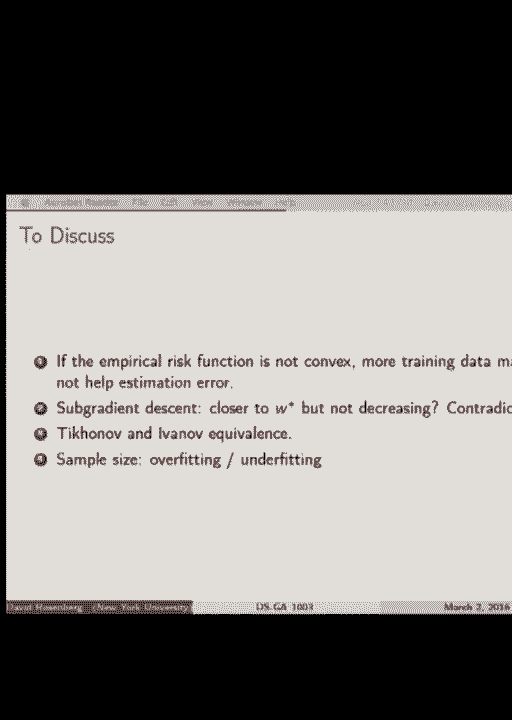
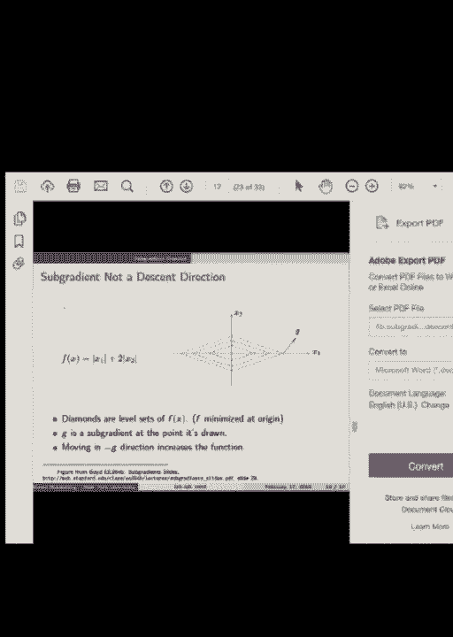
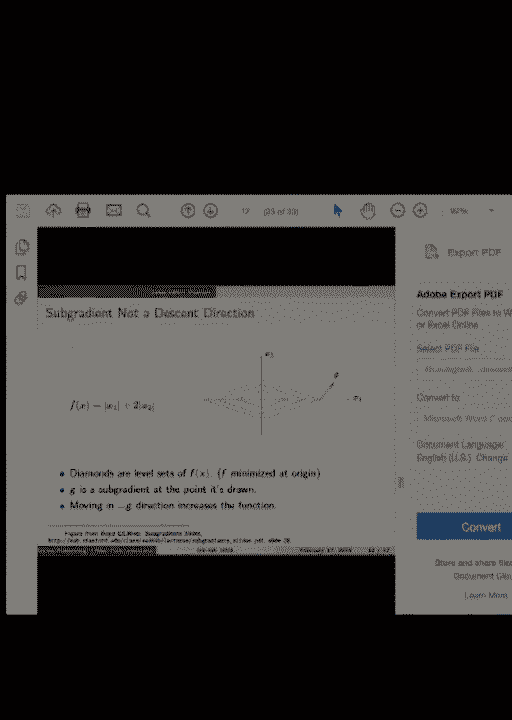
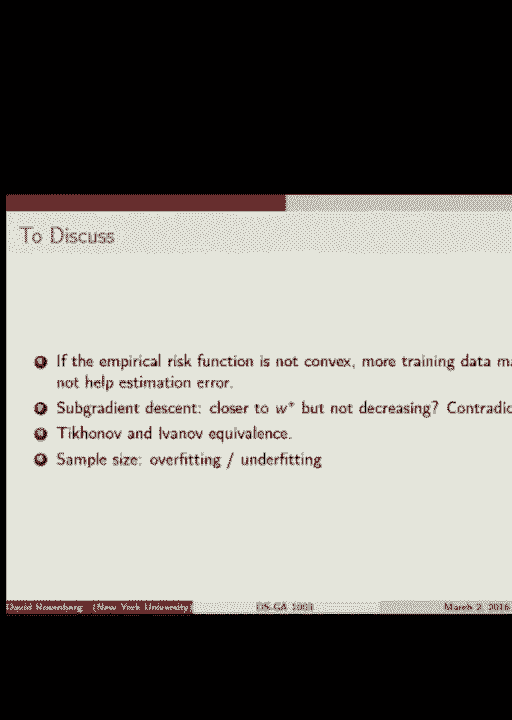
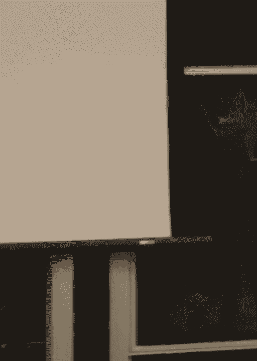
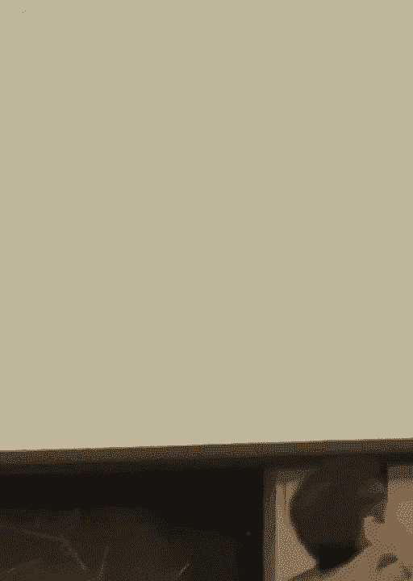
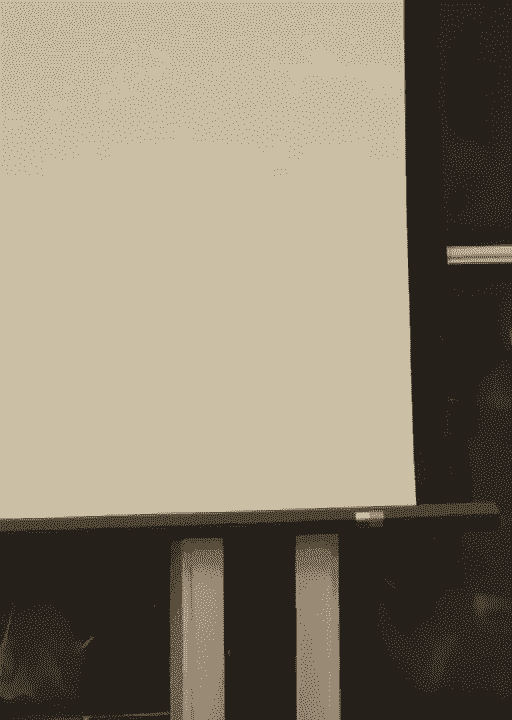
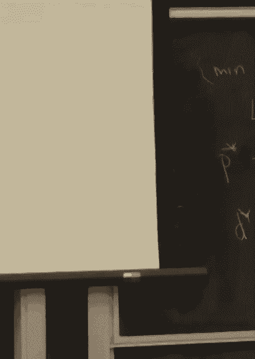
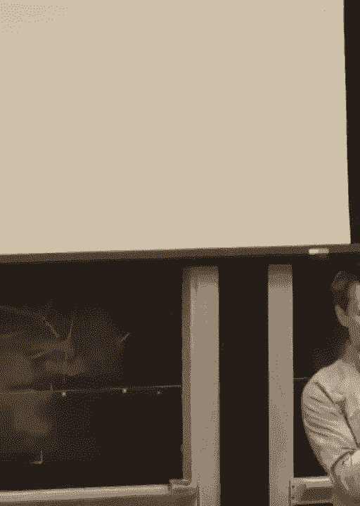

# P11：11.Mar_2_Lecture - Tesra-AI不错哟 - BV1aJ411y7p7

好的，让我们开始吧。

所以下周四，我猜大多数你们都在这里，我们开始讨论树，这是我们第一次真正处理非线性问题——有反馈吗，还是这样可以？有反馈。好的。无论如何，我们上周讨论了回归树。我想通过讨论分类树来完成树的单元。我认为这会花一些时间。

至多是前半部分，可能更少。然后我们可以讨论你们明天短测可能有的问题。有些人在Piazza上发了帖子，然后我们可以看看你们是否有问题想要提问。我认为在这个阶段，如果你们还没有复习过讲义，我可能会回去复习一下讲义，或许是这个时候。

作业问题的陈述只是为了提醒大家。如果你还没有做过，那可能是我在剩余时间不多时会做的事。好的，分类树。简单回顾一下树的结构。我们在处理的是二叉树，在每个节点我们选择一个特征。

我们现在处理的是连续特征或者有序特征，我们选择一个分割点，然后根据特征所在的分割方向从左到右分割。随着我们沿着树向下走，我们最终会到达叶节点，每个叶节点都对应于一个特定的矩形区域或类似矩形的更高维度的区域。

一个矩形区域会得到一个特定的预测。每个输入空间中的每个元素如果落入特定区域，管道和平行区域，那么对应的叶节点就会产生一个单一的预测，且该预测是相同的。然后对于回归问题，我们会计算叶节点中y值的平均值。

节点，然后是分类，对于分类问题，你觉得它应该是什么样的？祝你好运。所以在我们的训练集中，我们找到了所有落入，比如说，R5的标记数据点。这不是一个分类问题。因此，可能会有一些是类一，可能有一些是类二，可能有一些是类三，我们应该预测哪个类？

>> 大多数。 >> 是的，大多数。所以当我们想要对一个新的示例进行预测，而这个示例恰好也落入R5时，我们会预测在我们的训练集中，R5中出现最频繁的类别。非常自然，直接。对此有任何问题吗？设置好了吗？好的，几乎完成了。好的。所以一般的树构建过程是从根节点开始，我们查看我们的特征。

我们选择一个分裂变量，它是一个特定的特征，然后是分裂点，这样就把我们的输入空间分割成了两个区域，R1 和 R2。与我们上周做的回归树相比，我们需要修改一些内容。一个是如何分裂节点，另一个是如何修剪。但是我们不会讨论这个，哦，只是简要提一下我们将如何为分类树修剪。

本质上是一样的。好了。那么我们来看看如何做到这一点。考虑到 K 类与仅仅二元分类相比，并没有额外的成本。因此我们将做一个 K 类分类树，并且假设输入空间是 D 维的。那么我们的分裂变量就是选择这些 D 个变量中的一个进行分裂。

继续考虑实值特征。我们的分裂点也将是一个实值。然后是一些符号，我们有 R1 和 R2，表示输入空间中位于分裂点左侧和右侧的区域。好了，明白了。

所以，稍微多一点符号。当我说节点时，我指的是树的哪个节点？假设，我说它表示一个区域 Rm。我们目前主要关心的是叶节点，在那里我们实际上关心与该节点相关联的输入空间的区域。好了，明白了吗？

假设我们有区域 Rm。Rm 是落入第 m 区域或第 m 叶节点的点，在该区域中训练集有 n sub m 个点。然后我们定义类别 K 在训练集中所有项目中的比例。哦，还有一个小错误。你跟得上吗？这个应该是，应该是 m 而不是这个。如果你跟得上我说的。

这是计算在区域 Rm 中类别 K 的项目数量，然后我们除以某个值，因为我们想要得到相对比例。对，没错。应该是 n sub m 而不是 m。明白了吗？

所以我们将称其为 P hat mk，它是节点 m 中类别 K 的比例。清楚了吗？好的。那么我们的预测将是找出哪个类别的比例最高。对吧？很好。我们将它称为 m sub k max over k of P hat m sub k。所以 k 是类别，m 是区域。非常好。那么我们想要预测，我们将预测 k 的 m。我们还可以。

当我们想要预测一个单一类别时，我们也可以预测整个概率分布。为什么不呢？显然的做法是预测每个类别的相对比例。那么现在我们几乎是免费的，我们可以通过节点中的比例来预测我们类别的整个分布。好了，太棒了。

现在我们已经设置好了如何进行预测。让我们回到为一个节点预测单一类别的问题。我们如何计算一个特定节点的预期误分类率呢？假设，举个例子。我们预测km，因为它具有最高的P帽m子k，最高的比例。

基于这个训练集，我们会期望输入元素的误分类率是多少？假设该元素落入空间的第m区域，或树的第m节点。是的。我会说1减去P帽mk。对吧？如果在我们的叶节点中，30%的训练样本属于类别2，并且这已经比其他类别更多了，也许是5%属于类别1，8%属于类别2，还有很多散布。

30%恰好是最高值。一定会有很多类别。嗯。错误概率可能是70%。如果30%属于某个类别，而预测的70%不属于那个类别。那么这就是我们对该预测的估计错误概率。明白了吗？是的。1减去P帽mk。好的。所以一旦我们得到了划分，我们就知道如何进行预测。

空间的划分。所以剩下的就是我们如何划分空间？

我们如何找出划分变量，如何决定在哪里划分？

我们接下来要讲的是如何评估划分的好坏。好的。实际上有很多方法可以做到这一点。你们有什么想法吗？哇。好吧。你们真的很棒。熵，信息增益。是的。很好的发明。我自己可能不会想到这些。非常好。所以我想到的第一件事是误分类率。

对。所以如果有一个特定的划分，你可以根据那个划分来估算误分类预测的概率。好的。这是一种衡量方法。然后还有更复杂的东西，最终我们会更倾向于使用那些。没错。好的。所以我们称这些为衡量划分好坏的标准。这就是节点不纯度度量。

这接近我们想要的目标，我们确实希望尽可能让叶节点中大多数训练样本集中在一个类别上，这样当我们选择这个类别时，我们的预测就会正确。好的。所以，这就解释了叶节点。但误分类错误也会对此有帮助。

信息误差基本上就是我刚才说的，我们希望优化的内容。但是它还有一点更复杂的地方。我们想要引入节点不纯度的概念。所以我们会看几个图。好的。我们希望在一个节点中尽可能接近单一类别。然后问题就是，如何衡量这一点？好的。明白。

这是一个不同度量的图，情况是我们有二分类。两个类别。x轴是p，表示在训练数据中类别1的相对比例。我们想知道的，最坏的情况是什么？最坏的情况是，最佳类别的相对比例是多少？

是的。对于两个类别，0.5。这就像是完全的不确定性。你。这是两个类别中你能得到的最糟糕的错误，对吧？最好的情况是0或1。所以如果我们看这个，想象它们是损失或不纯度，是我们想要最小化的东西。那么最佳情况是在极限，0和1。所以我们想要，我们想要。

我们当然希望鼓励完全纯净的节点。而50/50是最糟糕的情况。然后，在这之间有不同的惩罚。好吧。好的。那么这些是。这些是实际的公式，用于绘制这里的二维曲线。它们已被推广到。对于两类，它们被推广到k类。

我认为你们有机会在作业中逐渐适应这些内容并获得感觉，在下一个作业中。第一个是简单的误分类错误。这个被称为基尼指数。看起来有点熟悉。它感觉有点像是一个二元变量的方差度量。

这有点像方差那种东西。另一方面，这有点像熵。嗯，这是熵。这是一个的熵，它们是交叉熵，出于各种原因。但我提到熵是因为这是由各类别的相对比例所表示的分布的熵。好吧。好的。那么这里有一张图。

所以在左侧，我们的数据来自四个类别。而右侧是四个类别的相对比例。均匀分配，对吧？

好吧。那么现在让我们测试一个特定的分割。我们从顶部开始。我们正好从左到右分割。我们有上半部分和下半部分。这个小的直方图是上半部分中红色、蓝色和黄色的相对比例。你看得见吗？上面没有绿色。

任何地方都没有绿色。好吧。我得改进一下我的颜色描述，因为绿色在投影仪上显示不出来。如果你在电脑上看的话，这些是绿色。但在屏幕上我们称它们为黄色，这些是橙色的。对吧？更深的黄色。更深的黄色。金色的。好吧。所以我们这里是芥末色，但没有黄色。

在这里我们有黄色，但没有芥末色。好吧。没问题。现在让我们与下面的那个进行比较。所以在下面我们只有两个类别。相对均匀分布。右侧是两个均匀分配的类别。直观地讲，底部的可能更好，因为我们有更少的类别。

我们至少已经从每个中去掉了两个类别。好吧，测量本身。这里我们写了信息增益，这实际上与熵直接相关。但是大信息增益代表小熵。有一个小公式。所以这个有更大的信息增益，所以熵较小。

所以根据熵的衡量，这个分割比那个更优。好吧。我可以给你一个更好的例子，说明为什么你可能更倾向于选择一个具有更高熵的分割。假设我们有四个类别，使用相同的类别数。假设我们有一个分割，给我们一个分割，我们只看这个分割的一半。

所以这两个类别几乎完全相等。也许这个类别稍微高一点。与另一个完全相同的类别对比。假设这个是0.51，这个是0.49，哦，天哪，0.48和0.52。然后这个也是0.52。然后假设这个分割的权重均匀分配给两个类别。每个类别都是0.24。好吧。那么，对于这些情况中的每一种，误分类的概率是多少？

所以再次强调，无论是这个还是那个，都是0.48。你认为你会更喜欢哪个？我认为是这个，因为我们已经完全去除了一个类别。好吧，这是直观的。然后，好的，从数学角度看，哪个分布具有更高的熵？是底下那个，为什么？好吧。

你首先必须知道，熵在有限元素集上的分布中是最大的。当它是一个均匀分布，均匀地分布在所有元素上时，熵是最大的。所以你必须知道这一点，以便推理这个例子。好吧，鉴于我们处于这两个类别的条件下，均匀地分配权重。

这两个类别之间的熵要比将权重不均匀地分配给其中一个类别的熵大。所以在这种条件下，我们有0.4的概率在这两个类别上。最大熵是将其平均分配。好吧。所以如果我们最小化熵，结果会更像这样。这也说明了为什么你可能想做得更好或更多，而不仅仅是误分类。

速率。有任何问题吗？好吧，这就是思路。那么剩下的就是如何找到这个分割？现在我们知道了，好吧。我们大致知道如何评估它。其实还有一些细节，我没告诉你们，如何评估这个分割，对吧？希望下一个幻灯片能讲到这个。

所以我们有左侧和右侧的分割RL和RR，以及左侧的点数RL，RL和RR的Q值是两个分割的节点不纯度度量。所以它可能是熵，或者是误分类率，或者是基尼指数。所以每个分割都会给我们两个分数。

一个分配给左侧，一个分配给右侧。那么问题是，如何将它们组合起来呢？是的，你可以直接相加。潜在的问题是，如果一侧的分配远多于另一侧呢？是的。所以我们做的是采用加权平均。根据每一侧的点数加权。没错。所以我们寻找我们之间的。

这是加权平均。所以左侧的点数乘以左侧的 impurity 测量值，再加上右侧的点数乘以右侧的 impurity 测量值。我们寻找一个分裂，最大化或最小化这个值。最小化这个值，因为这是 impurity。对吧。我们想要最小化熵，最小化误分类率。

所以我们要在所有分裂变量和所有分裂点上最小化这个。好吧。那么你们知道怎么做吗？我们上次大致谈到了如何做。我猜问题是，我们上次的洞察是否适用于今天？那么首先，上次我们是怎么决定的？假设我们选择了一个特定的变量来分裂。

问题是我们用什么点来进行分裂？

而且洞察是，你不需要检查范围内的每一个真实值。你只需要检查与输入点在该特征上的实际值对齐的分裂点。因为如果你在这里和这里有两个相邻的点，而这两个点之间没有其他点，那么无论你在这两者之间何处进行分裂，都没有关系。

它们都给出相同的分裂。因此，你只需要检查与训练点值对齐的可能分裂点。好吧。那么当我们优化这个时，之前的方法能否同样适用？可以吗？

>> 是否需要花一点时间尝试实际值之间的中间值？ >> 好的，这很有趣。那么问题是，把分裂点放在两个相邻值的中间是否有意义？我喜欢这个问题。是的。那么直觉上，应该是这样。它对训练集没有任何影响。

但也许如果这两个点之间的距离最大，它可能在测试集上表现得更好。这很有意思。我理解这个直觉。你得尝试看看是否重要。还有其他人对此有想法吗？好。好的。那么，正如我们提到的，基尼指数和熵是生长树的首选方法。

因为它们倾向于得到更多的纯节点。好吧。记得上次有第二步。所以我们构建了树，并且有一些停止标准来决定何时停止分裂节点。例如，当一个节点的训练样本数少于固定数量时，我们就停止分裂。比如 5，10，之类的。但这样可能会导致过拟合。

我们希望控制复杂度。然后第二阶段，这是 CART 方法。第二阶段是修剪这些节点。当我们修剪时，我们可以选择，如果你记得上次我们做的事情，我们是。修剪的第一步是找到要修剪的节点，一个节点来修剪它。

这样可以尽可能减少风险。记得吗？

然后我们找到下一个需要修剪的节点，它减少了风险，减少的量尽可能小。减少风险。增加风险。增加的风险尽可能小。增加训练误差尽可能小。所以这是针对平方损失的，结果很清楚。那么这里我们应该怎么做呢？我们可以找到需要修剪的节点，使得它增加的纯度尽可能小。

我们可以这样做。如果我们用基尼指数来构建，应该用基尼指数来修剪吗？如果我们用NGP构建，应该通过查看NGP2来修剪吗？直觉上对我来说，一旦树已经构建完成，我们使用这些其他的纯度度量是因为它们使得切分具备了某些吸引人的特性，比如它们很纯。但是一旦树已经构建完成，并且进入修剪阶段。

切分已经设定好了。现在我们应该把重点放在我们实际上要优化的东西上，而这实际上并不是纯度度量。它是训练误差。它是分类。它是错误分类率。我们要最小化错误分类率。所以当你进行修剪时，使用错误分类率作为修剪依据是非常有意义的。

你们的标准不是纯度度量。你们认同吗？这非常合理。所以这就是我关于分类树的全部内容。关于决策树的其他一点补充，我认为上次没有讲到。那就是决策树没有利用几何结构。那么我们是什么意思呢？对于线性方法。

所有我们谈到的可以核化的方法，基本上我们都在输入空间中利用内积，在那里我们有W，权重向量，我们有输入样本X，然后我们取它们的内积，得到一个数值，也许还会加上偏差。如果你能可视化的话。

所以内积表示的是空间的几何形状。它告诉你角度，并且可以告诉你长度。这是一种直接的方式，嗯，我就说到这里。在决策树中，根本没有这样的东西。你所使用的空间没有任何结构，除了一个例外。

我们对输入空间在决策树中假设的唯一一件事是什么？

输入空间需要具备什么？需要具备哪些特征？比如R。那再说一遍？是的，所以我们在R中构建，或者说它被称为RD，因为我们使用了D。好的。我们可以放宽它从R开始吗？所以这里有实数。我们可以——如果把实数替换成任何有序的集合呢？

这行得通吗？我们需要一个度量吗？度量在哪里发挥作用？

这是一个关于Y的度量，而不是X。错误分类率是一个度量——它是关于Y的。那么——我们需要在特征空间上建立任何结构吗？是的？[听不清]，是的。我们需要对集合中的元素进行排序。所以当我们选择集合中的一个特定元素时，我们可以基于这个元素进行切分，并且问，是否小于等于它或者大于它？

所以我们需要——每个特征必须在——假设这个特征必须在一个集合S中。S of I或者S of I有一个不错的小关系，小于或等于。对于这个S I，我们是否需要这个特征除了不等式之外的其他条件？但我不认为我们使用距离。我们有使用距离吗？没有。

这就是树的魅力所在。这就是你需要的一切。所以如果你能给它排个顺序，你就搞定了。即使没有顺序，如果你有一个没有顺序的集合S I，会发生什么呢？

你不能使用我们讨论过的一些技巧。你不再选择一个没有顺序的分裂点，这样做已经没有意义。在这种情况下，你必须实际选择整个划分。你可以这样做。你可以说我会选择S I的一个子集作为左边，剩下的就是右边，它们之间并没有什么关系，但你仍然可以以这种方式建立一棵树。

这就是你如何处理分类变量与实数变量的区别。对于分类变量的算法——当分类变量只有两个值时，它们效率很高，随着分类变量的值越来越多，情况就变得更复杂了。好的。是的？

>> [听不清]， >> 我只是想说一下验证问题。我对何时使用一个方法比另一个更有用没有直觉。这是没关系的。不知道哪个更好也没问题。你只需要用计算机的时间去尝试两者。让计算机来为你做工作。我是说，虽然有直觉很好，但你不需要直觉才能继续前进。是的。好了。所以没有几何，没有内积，没有距离。这是一个非度量方法。

度量是两个事物之间的距离。这里有一个非常重要的事情。特征的尺度完全不相关。没有对特征大小的衡量。所以特别是，像居中、缩放变量、标准化或白化这些操作，对于特征来说完全不相关，只要你是一次处理一个特征。

对树来说完全无关紧要，因为它不在乎。它只关心顺序。当树变得重要时——你不一定会一直使用树——你只会偶尔使用它们，但你会特别在像随机森林和提升方法这样的组合元素中使用它们。所有树的这些属性都会传递到树的集成中。

所以如果你在做随机森林，像我们下周要讲的那样，你就不需要对变量进行标准化或居中处理，或者做任何类似的事情。最后一件事是——这和回归树相关。预测结果——它们是不平滑的。它们是分段常数的。

所以这在你的情境下可能是想要的，也可能不是。关于树的内容我就说到这里。接下来的时间你可以用来看看如何最好地为明天的考试做准备。 >> 我可以问最后一个关于树的问题吗？ >> 当然，请问。 >> 我们想谈谈二叉树。 >> 等等，这不是你们聊天的时间，而是——。

>> [笑]， >> 好的，继续， >> 在分裂中我们选择左边还是右边， >> [听不清]， >> 是的。好的，多路树。对，我--它们是存在的。我不常见到它们被使用，但那是因为我并不生活在一个树结构被广泛使用的环境中。好的，所以就我的个人需求和我们正在看的教科书而言，我们看——我一直在看很多教科书，以便把事情整合在一起。

这基本上是关于二叉树的。所以，是的。还有什么？好的。让我说一件我脑海中的事情，关于明天的测试，这样你们可以提前记住。对于你们中的一些人来说，测试可能会很长。而且题目呢，有些可能简单，有些可能难，而且它们可能是交替出现的。

所以你必须灵活应变，如果你遇到一个问题，卡住了，你需要继续推进，先做过去再回头做。所以不要——也许你会发现它们都很直接，但你知道，不要觉得你——你可以跳过，这可能是最好的策略，知道吗，取决于，你知道。

可能课程的某些部分比其他部分更强。所以先做那些。好的。好了，有些同学提了一些问题。

好的。好的。所以第一个——这是去年考试中的一道题。这个问题非常令人困惑。我实际上认为我去年并没有把它算作判断题。但是无论如何，我们来谈谈它。那么，判断对错？如果经验风险函数不是凸的，更多的训练数据可能不会帮助估计误差。这很困惑。我们把它分解成几个部分来看。

那么第二部分。训练数据估计误差。首先，什么是估计误差？对的。大家都想过了吗？好的。这是我们所有可能函数的空间。F 星是贝叶斯最优。这个是我们的假设空间，我们将在其中选择一个函数。这个点是最小化什么误差的点？近似误差。对的。

所以，在假设空间中最接近贝叶斯最优点的是最小化近似误差。这个点是否依赖于训练集？对的。并不依赖于训练集。它仅仅依赖于我们所处的假设空间。因此，我们可以像这样写：F 星下标 H，表示它被限制在 H 中。好了，现在说到这一点。

那么我对这个点的理解是什么？它是 H 中一个点，能够最小化与 F 星下标 H 相关的哪种误差？估计误差。所以这个想法是我们想要——我们限制在 H 中。为什么要限制在 H 中？

我们为什么一开始引入假设空间？我们担心的是什么？

过拟合。是的。所以如果我们仅仅尝试在所有函数中找到最适合我们训练数据的 F，我们就容易出现过拟合问题。因此，我们限制在假设空间中。现在我们很想找到假设空间中的最佳函数，但我们没有足够的数据去真正找到最佳函数。因此，我们根据我们的数据找到最佳函数。

它是在最小化经验风险。而我们找到的这个点与真实最小化点 F star H 之间的差距，就是估计误差。好的。那么我画的这个东西是什么？为什么我要再画一个东西？

优化误差。完全正确。所以你有一些算法尝试找到 F hat，也许它是一个近似算法，或者你可能没有把它运行到收敛，或者由于某些原因，它没有达到 F hat。即使你有数据来找到 F hat，你只是没有足够的计算耐心，或者其他原因没有找到它。好的，这就是一点额外的误差，优化误差。好的，现在。

更多的训练数据和估计误差之间有什么关系？

更多的训练数据应该会减少估计误差，因为你离你的经验风险估计值与真实风险的距离越来越近，应该是这样。好的，所有的，更多的训练数据应该有助于估计误差。那么凸性是如何起作用的呢？

在三种类型的误差中，优化误差、估计误差和近似误差，凸性与哪一种最相关？假设是优化误差，因为凸性正是你能够有效执行迭代算法的原因，去最小化经验风险或你要优化的目标函数。所以凸性与优化误差相关，可能接受一些非常深奥的情况。

和估计误差无关的方式。好的。所以我认为我把这个问题设得很简单，因为问题的后半部分是关于估计误差，前半部分是关于凸性，而我并不打算深入讨论它。所以应该是错误的，但这实际上很令人困惑。无论如何，好的，有没有关于这个的其他问题？好了，其他人有个很好的问题。挺有意思的。

如果在场的人能澄清一下，如果这没有解释清楚的话。我们之前讨论过子梯度下降方法，对吧？

我们之前说过子梯度的一个有趣的事情，就是它不是一个下降方法，对吧？所以子梯度，你选择一个子梯度，并且朝着负子梯度的方向看。如果你朝那个方向走，F 可能不会减少。所以我们在幻灯片上有一个例子，展示了这种情况，图像。好吧。

但是我们证明了一个很棒的事情，那就是即使 F 没有减少，起始点和最终点之间的距离，以及我们起始点和真实最小化点或 W star 之间的距离，在我们移动到下一个点时是变小的。好的，这很有意思。那么问题是，怎么可能呢？

我们怎么能不断地更接近最优的 W star，但 F 却没有减少呢？

并不是说F在每一步都会减少。问题是我们不能保证它在任何一步都会减少。这个问题还有什么补充吗？是吗？你是问怎么做吗？是的。嗯，那个有趣的地方就在于，实际上并不是那样的。

所以，有可能朝着最小值靠近，但实际上F值是在增加。这不是局部最小值。所以不，这对于凸函数来说是成立的。我们这里讨论的是凸函数。所以根本没有局部最小值。[听不清]。我和W星之间的距离，在步骤之前和之后，之后的距离更近。

我离W星更近了。我们已经证明了这一点。这是肯定的。但是W0和W1的F值，可能会增加。是的，可能会增加。但是如果我们最终要到达W星，F值必须最终减小，因为W星的F值比我们开始时的F值小。所以我们可能在下坡之前稍微走一段上坡。我可以加载那张图。

我们有一张图，嗯？不，因为我们昨天在想，我们无法想象它是如何可能的，去找到Wassen-Trey的子梯度或什么的。你不喜欢那张图吗？

那个疯狂的东西对你来说有点奇怪。我觉得你说过如果我们朝相反的方向走，函数一定会增加。

问题是如果我们走相反的方向——，但是另一个问题是——。我的陈述是——，其实只是一个词让它看起来像是总是发生的。我说得更大声了。它在幻灯片中。好吧，我们来弄清楚这个问题。[听不清]。好的。

我该怎么说呢？子梯度不一定指向中心——，好吧。不能保证是指向中心的方向。[听不清]，是的，但它会增加函数值。但是你能想象在交点上有什么东西吗？在那个点看到基因是子梯度并不容易。什么？为什么——，你为什么用这个函数集？它总是让函数增加吗？

或者说——，听起来是这样。不是的，这只是针对这个特定的基因，在这个特定的例子中，或者在那个特定的函数和那个特定的点。沿着负G方向移动会使函数增加。所以我们可以从——图中看到这一点。所以负G是朝这个方向移动，这就是——，所以这是函数的最小值。

当我们穿过这些线时，函数值增加了。这是——我们穿过的每一条线都会让函数值上升一步。所以这就是从这个等高线离开，朝着一个增大的方向移动。现在你只是想问，如何识别子梯度？所以——，当然。[旁白]，好吧。假设我们现在在这里。明白吗？

那么，从这个点出发，哪个方向是增加最快的方向？

是这样吗？这样吗？不对。我们最快增加的方向是这个方向。我的意思是，我得画一条额外的线来确认一下。但是你同意吗？

但我们称它为三维的，对吧？输入空间是二维的。然后是函数的值。所以这是 R2 的输入空间。所以第三维在某种意义上是由等高线表示的。那么我应该继续解释子梯度的事情吗？所以在这一点上。

这是这个函数的梯度。然后当我们到达这个转角时，所有这些点都是子梯度，因为——因为它们被——所限制。所以，子微分将是这些部分的梯度的凸组合——所有的凸组合——这些梯度的凸包。

所以这里有这个部分的梯度，和这个部分的梯度。子微分将是这些梯度的凸包。不管怎样，这有点偏离我们的轨道。像——这变得非常分析化了。但我认为你应该能理解这个图像。所以我对你问题的理解是到此为止。

是的，我不理解子梯度的几何意义。对吧？[听不清]，是的。任何子梯度——任何 g 是子梯度——，如果你沿着负 g 的方向移动，你就没问题。抱歉？[听不清]，如果你沿着梯度的方向走，那就是——如果你有梯度，并且沿着梯度的方向走。

这是函数值的最大增加。负梯度是最大的减少。好的，那么我们现在问的是什么？[听不清]，没错，g 不是梯度。所以我们没有那个好的性质，负 g 会减少函数。[听不清]，不对。沿着负 g 方向移动会让我们更接近最小值，但不会减少函数的值。是吗？

[听不清]，[听不清]，[听不清]，好的，首先，你相信这是这里唯一的梯度吗？我不能画出这个，对吧？好的。那么问题是——那到底是什么问题？为什么我不能在这里画出这个？

但这不是一个——我的意思是，如果我只是将 epsilon 向左移动，这并不是一个梯度。只有当我将 epsilon 移到这里的左边，只有这样才是梯度。[听不清]，好的，重新开始。所以——，[听不清]，它在转角的那个点。它有一个正确的子梯度个数。

为什么在他们认为的方向上会有限制[听不清]，所以——，好的。我可以通过几种方式来解释这个问题。首先，如果你相信我们的证明，我们已经走过——。那是一次直播，这很好——，如果你沿着负梯度方向移动，我们会越来越接近最小值。所以从这个角度来看，唯一的东西。

那些让我们更接近最小值的是来自这里的东西，沿着这个方向走。所以对于那些沿着负梯度方向的，它们正好与这些相反。所以从我们知道负子梯度必须把我们带到最小值的角度来看，那已经是一个界限了。如果子梯度是朝这个方向的，我们就无法——。

这会让我们朝这个方向移动，远离它。我们定理证明——我们不能那样做。所以这是一个解释，算是一个倒退的解释。[听不清]，不完全是吗？[听不清]，[听不清]。所以如果我走这条路呢？[听不清]，[听不清]，[听不清]，好的。[听不清]，是的。[听不清]。

[听不清]，是的，我在这里画了同样的图。[听不清]，所以这更平坦，对吧？

[听不清]，所以这是这里的梯度。嗯，我不容易告诉你。[听不清]，好的。我们现在不要再纠结于子梯度了。我只想确保没有其他问题是更能解决的。我的意思是，你知道这些事实，对吧？你知道子梯度的定义吗？

你知道关于子梯度的定理，它会让你更接近最小化器。所以这些是你的基本工具。所以——，[听不清]，[听不清]，好的。让我给你一个比我现在给出的更好的解释。好问题。是吗？

[听不清]，[听不清]，[听不清]，是的，是的，是的。这个问题很棒。[听不清]，是的，是的，是的，没错，没错。那么问题是——我们稍后就休息。问题是，感知机是一个确定性的算法，对吧？

我们进入——然后作业三上的问题是，证明这是一个子梯度下降算法。但是当你取子梯度时，你有一些选择，可以选择哪个子梯度。特别是当事物不可微时，就有一些问题。所以对于这个问题，你有。

选择正确的子梯度以使其完全与感知机匹配。现在，对于Pegasos，它是SVM的一种，我不记得了。我们给了你一个不同的子梯度选择吗？

因为没关系。[听不清]，好的。那么对于SVM的情况，Pegasos就是——。Pegasos有点像是进行随机子梯度下降的正确方式，应用于目标函数。而这里的关键是我们的步长随着时间的推移而减小，按照一个特定的公式，我们有定理。

只要我们在每个点上选择一个子梯度，它就能正常运行——嗯，它会做得很好。所以对于Pegasos，我们本可以选择任何子梯度，而不是我们选择的那个。完全没问题。感知机，现在。感知机最初是一个调整每一步的方式。它就是——你可以说它只是恰好如此。

作为子梯度——感知机损失的特定子梯度。如果我们在子梯度处于不可微分点时，把步长设为零，会发生什么？

首先，感知机在哪一点不可微分？零。零是什么？什么？

[听不清]，[听不清]，好吧。如果我们对感知机的预测是W转置x，边界将是YW转置x。然后我们有损失函数，它是不可微的。所以我们有一个损失——一个边界损失。感知机的边界损失是什么？好吧。最大值？[听不清]，什么是边界？怎么回事？

它同意你说的吗？好吧。太好了。那么什么时候它不是可微分的？

在m等于零时，或者这个等于零时。好吧。明白了。那么如果我们选择子梯度——零，是感知机在m等于零时的有效子梯度，感知机的损失函数也是如此。这意味着，当我们到达m等于零的点时，并且我们取一个子梯度。

如果我们选择零，下一步是什么？没有步骤。好吧。那么如果我们选择零作为我们的子梯度，会发生什么？在那个点上？我们在那次迭代中不会更新w。一次迭代对应一个特定的点。那么那个点发生了什么？

那个点是工人阶级的来源。那个点的边界为零。它完全没有被分类。是的。所以在那个点上的预测是零。边界也是零。那么这意味着什么，与预测超平面对应，或者其他什么？

它在超平面上。所以我们在那个点上做得很糟糕。我们完全犹豫不决。我们甚至没有任何产出。所以看起来在那个点采取一步行动，比停留在原地要更好。好吧。所以Pegasus没有这个问题，因为它使用的是SVM损失函数，SVM不满足于处于边界上。如果你的边界为零，SVM会产生损失。

如果你的边界是0.5，则会有损失。它会惩罚你，直到你的点的边界大于等于1。所以这就是为什么我们可以在Pegasus中接受任何子梯度的原因。因为如果你在SVM的边界上卡住了，SVM的边界是多少？在边界上的值是1。SVM的不连续性发生在1。如果你卡在1上，谁在乎呢？这没问题。

然后，针对你从Piazza提的问题，我们会找到边界上的点吗？会的，我们会找到边界上的点。因为当某些东西到达边界时，我们不会更新它。所以我们会更新它。如果我们使用零的子梯度，那么我们在那个点就不会更新它。这是否意味着数据类型不是线性的？

如果数据点是逐一分开的？问题是，如果有点位于超平面上，这是否意味着数据不可线性分离？好吧，有两个问题。如果我给你一个超平面，然后点位于超平面上——不，它并不说明数据的任何事情。

如果我说这是在某种意义上你能得到的最佳超平面，而且超平面上仍然有点，那我会说——嗯，这取决于我所说的最佳可能是什么意思。所以这是一个很好的问题，你可以思考一下。如果我最小化SVM损失，并且超平面上有点，那么数据是不可分的。

这是对的。关于这一点，我会这么说。

休息一下。好吧，有一个有趣的问题。

休息时的问题。谁问我问题了？问题是什么来着？

复习时的第一个问题是，是否有可能——是否可以添加一个未来的特征？好的，明白了。你有一个输入空间，一组特征，你在一个特定的特征集上做线性回归或未正则化的线性回归。然后你添加了一个特征。问题是，经验风险和训练损失会变差吗？好的。

或者它永远不会变差。可怕的部分是“永远”。当你添加特征时，是否有任何例外情况是它不会变差的？

但这并不太可怕，因为你必须想象假设空间。你有输入空间x。然后我们有一些特征，给我们提供了一个假设空间H1。假设空间是所有函数的一个子集，对吧？

所以这是一组所有函数的特定子集。可以把它们看作是x的函数。所以如果我们添加一个新特征，能应用在x上的可能函数空间不可能变小。添加新特征从来不会限制我们能接触到的函数数量。明白了吗？所以如果我们添加一个新特征，它可能大小相同，但一般来说……

它可能会更大。然后我们在最小化——我们在这两个空间中找到最佳拟合函数。所以如果空间变大，或者至少不变小，那么最优解不可能变得更差。所以它永远不会变差。添加特征会使假设空间更大。添加特征可以，也希望能够做到这一点。

让假设空间变大。解决了。如果你使用的是行列化，它是否是同样的情况？

啊，是否有正则化？没有正则化。正则化改变了故事，之后就很难预测。所以如果你有相同的数据量，添加一个特征，使用相同的正则化。是否能拟合？然后问题是，我们在看什么？

因为这是在讨论训练损失，对吧？所以如果你加入正则化，我们是在看训练损失吗？还是在谈论总的正则化损失？这就不太明确了。好吧，还有什么问题？[无法听清]，对于那些无法传递给社区的新事物，你有什么新的看法吗？但是你仍然有相同数量的社区。

那大概意味着做出那个决定，等于--，好的，问题很好。所以相同的设置。我们有固定数量的训练数据。我们增加了一个特征。那么问题是，估计误差会增加吗？好的，大家有什么想法？只有方向是对的。因为当你增加一个特征时，你可能是在扩大你的假设空间。

如果你有固定数量的数据，那么感觉上你可能在增加估计误差。是的，在这些小规模的数据中，一切都是方向性的。但对，直觉是对的，方向是对的。好的，有人问关于过拟合和欠拟合的问题。[听不清]。

我们知道过--对，我想--，我不记得具体问题了。有谁想再问一个相关的问题吗？什么是欠拟合？再说一遍？[听不清]。好的，欠拟合，粗略地说，就是你认为--，是在小假设空间的范畴内，没错。欠拟合的意思是预测函数有一定的复杂性。

我们正在尝试获得的最佳预测函数。并且数据足够多，能够显示出这个复杂性。但假设空间不够复杂。它不够大，无法匹配数据所展示的复杂性，无法匹配实际发生的函数。所以也许我们有大量数据，而我们。

看这个非常复杂的回归函数。而我们拥有的只有线性函数。所以这就是欠拟合。是的。如果我们有大误差，我们是欠拟合吗？

在训练集或测试集上都有大误差？在测试集上。所以测试集上的大误差可能是过拟合，也可能是欠拟合。两种情况都有可能。如果我们在训练集上有大误差，那就感觉--嗯，可能是欠拟合。也可能只是数据中的噪音。但方向是对的。是的。是的。[听不清]，是的。

[听不清]，等一下。所以三点，恰好位于这条线上。而我没说欠拟合。我不知道，我说了吗？好的。[听不清]，关于什么？[听不清]，是的。[听不清]。我想我在做一个样本偏差的假设，因为我拥有的样本不像总体。所以这是不是一种--，所以如果你有一个小样本，那么--。

样本--小样本正在逼近估计误差。你的样本可能不是全分布的好代表，这就是估计误差的来源。是的。是的。[听不清]，再说一遍？[听不清]，如果你有小样本量，感觉上你可能会走向过拟合数据。是的。是的。[听不清]。

问题是，如何选择--我们一直在称之为正则化参数。你是这个意思吧？是的。是的。第二个。正则化参数的作用是。引入正则化参数。是的。所以我认为问题是，如何为像岭回归和套索回归这样的算法选择正则化参数？不是。

这是关于岭回归的。[听不清]，我不知道我是否使用过收缩因子这个术语。所以你必须向班级介绍它。[听不清]，哦，好的。[听不清]，好的。[听不清]。范围从0到1。是的。好的。[听不清]，好的。[听不清]，好的，继续。那么问题是什么？

[听不清]，是的。[听不清]，好的，好的。所以这里有两个问题。第一个是。让我们先处理一下收缩因子。首先，收缩因子只是描述正则化参数的另一种方式。与其谈论lambda，不如说它是比lambda更方便的单位。它们取的是--如果你有一个皮可lambda，你就得到w4 lambda，所谓的w子lambda。

那就是你对于lambda的最佳选择。然后你可以查看lambda的范数。你可以查看lambda的范数与theta的范数之间的比率。然后你可以查看lambda的范数与未正则化解的范数之间的比率。好了，这是一个问题，看看你们是否理解了正则化。

我计算我对一个正则化优化问题的解，叫做L2，叫做L1。没关系。然后我计算我的解的范数。这是线性回归，对吧？所以我得到一个w，一个向量。我计算w的范数，如果我在做L1正则化，就用L1范数，或者如果我在做L2，就用L2范数。然后我将这个范数与没有正则化时得到的解的范数进行比较。

它们如何比较？[听不清]，好的。正则化会导致解的范数变小。这正是正则化的作用。它在某种程度上是惩罚解的范数过大。或者有一个等效的表述，如果你做了作业7的练习题，实际上它与将范数限制为不超过a是完全等效的。

某种程度上。无论如何。好的。那么，收缩因子只是另一种谈论正则化参数的方式。那么，如何选择其中的一个呢？同样的故事，一如既往。交叉验证，验证集。这就是我们如何选择正则化参数。好问题。是的。[听不清]。那么你想看看除了我们课堂上做的SVM之外的一个例子吗？是的。在哪里？

哪个？好的。让我们做点什么。让我们做点什么。[听不清]。还有什么其他方法？好的。好吧。是一个大话题。看，紧凑。不是的。我的意思是--所以我们先从某些事情开始，看看能走到哪里。好的。那么问题是什么？

[INAUDIBLE]，哦。如果我们做 Ivanoff 问题呢？好的，明白。[笑声]，好的。那么我从 Ivanoff 问题开始。跳过我这里的符号。好的。所以我们有我们的损失泛函 5F。我们希望最小化 5F，前提是 ω(F) 小于或等于 R。但是让我们用 W 来参数化。我们考虑假设空间，而不是 x 映射到 W 的转置乘 x。

好的。所以 f(W)。好的。所以拉格朗日函数等于 φ(W) 加 λ。然后在我们的表述中，我们的约束总是小于或等于零。对吗？

所以 λ 乘以 W 的 Omega 减去 R。明白吗？好的。那么这就是我们的拉格朗日函数。现在，有一个我们已经证明的很酷的事实。我希望你们能够相信这一点：原始优化问题的解可以写成这样。最小化 W，取 λ 大于等于零的拉格朗日函数的上确界。

但是我会写成这样——这里有错误吗？但是我会这样写。好的。现在让我们一步步推导一下。所以如果我做了——这个解和这个解是相同的。所以有两种情况。我们需要考虑哪两种情况来看看这个联系？

这里有——所以让我们把 W 的世界分成两种可能性。有 W 满足约束和 W 不满足约束。对吧？

所以假设 W 不满足约束。那么“不满足约束”是什么意思？

W 的 Omega 是——是的，大于 R。好的。那么这时这边会发生什么呢？

这是关键的部分。λ 是怎么样的？λ 是大于或等于零的，对吗？

λ 大于或等于零。那么在约束被违反的情况下，这个东西是什么？

那是正的。没错。

好的，太好了。它严格大于零。好的。现在看这里。我们正在取 R 的上确界，λ 大于或等于零。这个值大于零，所以它可以无限增大。好的。这意味着这个东西，即拉格朗日函数 L(W, λ) 等于无穷大。

如果它小于或等于 R 会怎么样？如果现在这个值是负的，那会发生什么呢？是的。如果 λ 大于零，这个值小于零，这样这个值就更小了。所以如果我们要取上确界，我们希望它尽可能大，这意味着是零。所以当 λ 为零时，这个表达式的上确界是达到的。如果这个值小于零。

这意味着约束没有被违反。好的。所以如果约束没有被违反，那么我们得到 W 的拉格朗日函数 L(W, λ)，其中 λ* 等于 φ(W)。好的。这个推导证明了这个陈述：最小化和最大化拉格朗日函数的最小值等价于原问题。好了，你们明白了吗？如果你们需要的话。

当然，它会在笔记中说明。好了。那么，什么是对偶问题？对偶优化问题？交换最小化和最大化。没错，就是这么简单。所以我要写，我只写max而不是sup。于是lambda大于等于零，W的最小值是相同的。Phi（W）加上lambda。好的。好了，现在。

什么是对偶函数？对偶函数。这是对偶优化问题。这是对偶问题。解是什么，我们通常写作D星。所以D代表对偶。对偶问题的值是D星。我们通常用P星表示原问题的值，称为原始问题。好了。所以这是对偶优化问题和对偶函数。那么lambda在哪里？

我有没有漏掉lambda？前面提到的lambda生成的。是吗？抱歉。你说的lambda在哪里？就在这里。就在这里。我不明白。抱歉。lambda星。是的。我没说lambda的事。哦，我确实写了一秒钟。是的。所以它只是。因为当我们谈到极大值时，我们是这样写的。

哦，当我们取极大值时，这个东西会变成零，或者会变成无穷大。所以我为此写了lambda星。如果没有lambda，你将得到某个特定的P星。对于一个特定的lambda星，你会。是的。如果你在这里代入lambda，然后对w进行最小化，你将得到某个值，而不是P星。除非它是lambda星，这样你就得到了P星。好的。

什么是lambda星？我还没有真正定义它。抱歉。我还没有讲到这个。抱歉。那么，什么是对偶函数呢？是的。好的。那么对偶函数就是这一部分。这部分是关于在我写的部分里没有固定的内容？对，lambda。没错。W已经完成，因为我们已经对它进行了最小化。所以我们把这个东西叫做G（lambda）。

这就是对偶函数。好了。那么，我们希望能够说些什么关于原问题的解与对偶问题的解之间的关系呢？好的。那么，首先，我将简化对偶问题的表达式。D星只是lambda大于等于零时，G（lambda）的极大值。好的。你问lambda星是什么？lambda星是使得这个最大值达到的lambda。

所以lambda星等于对偶函数的极大值。我要让你们注意一件事。每次我们在优化拉格朗日乘数时，都有一个约束条件。你们看到了这个约束条件吗？大于等于零。这个很重要。所以每当我们在所有我们处理过的问题中对W进行优化时，那都是没有约束的。

在拉格朗日中，它是没有约束的。对偶变量与拉格朗日乘数相关，适用于任何优化的质量约束。大于等于零。Y，你们已经知道Y，我们已经证明了Y。我们已经证明了Y的合理性。在整个论证过程中，我们展示了这个内积。这个原始形式正好等价。所以。

你可以让自己相信，这等价的说法告诉你为什么你需要超参数lambda大于等于零。好吧。好的，我们到哪里了？所以我们有对偶问题。然后，接下来我们想要什么，对偶与原始问题的关系是什么？是的，我们希望它们是相等的，而什么总是成立？是的，叫做弱对偶性。

我们总是有D*小于或等于P*。这看起来很奇怪且抽象，但我们在两行中就很漂亮地证明了这一点。如果你回到你的幻灯片，上面有最小最大不等式。这里有一个与它相关的问题，我们真正在这里把它拆解开了，现在应该很清楚了。好吧。那么，在我们的课程中，我们主要关心的是我们想要的。

D*等于P*，这样我们就可以只解对偶问题，而不是原始问题。然后，当这种情况发生时，我们称之为什么？是的，强对偶性。好的，那么我们能否列出一些条件，说明强对偶性成立的情况下？好吧，问题必须是可行的。好的，我们开始了原始问题。我们开始了问题。

看，是的？好的，所以它是可行的。是的，这个开始很好。我们可以做。我们有一个特定的条件叫做Slater条件，记得吗？所以它非常一般。但有一个版本是应用于支持向量机或类似问题的，对吧？首先，我们需要一个凸优化问题。所以这是很重要的。

我们不需要凸性来确保强对偶性，但我们需要凸性来确保这个特定的定理。所以Slater条件，我们有一个凸优化问题。好了，这里有一个重要的问题给你们。什么是凸优化问题？

你需要检查什么才能确保你的问题是凸的？我们有不同的部分。我们有一个目标函数。现在你有这些约束函数。我们需要，是的，我们需要phi凸和omega凸。好吧？从几何角度来看，这一部分定义了你的约束集。你的约束集最好是凸的，这样才是一个凸优化问题。所以这很重要。

如果这是可行点的集合，如果那是这个不等式的解，那是合理的。如果你的约束集长这样，没戏。这不是一个凸集。约束集必须是凸的，才能形成凸优化问题。所以你的目标函数必须是凸的，但不要忘记检查约束集，或者说是这个。

我的意思是，如果你检查这个，你就没问题了。你检查omega并且检查phi，你就没问题了。从几何学的角度来看，可行集必须是凸的。好吧？

可行集是满足问题约束的w的集合。那就是可行集。好吧。好的。那么，我们需要一个凸优化问题。我们需要——所以这个条件非常简单。我们需要找到一个严格可行点。什么是严格可行点？严格可行点是位于约束集内部的点。

什么是内部？你可以将一个集合划分为它的边界和内部。它需要在内部—严格在内部，而不是在边界上。这就是我们所需要的斯莱特条件。好了。支持向量机的情况稍微容易一点，因为如果我们的所有约束都是仿射约束。

你只需要可行性。甚至不需要严格可行性。所以即使显示边界上的点也足够了。所以当有人说可行性时，那是在仿射约束的情况下。没错。是吗？嗯。严格可行—好吧。所以我会给你两个解释。

第一个是代数的。所以这是优化问题的一个约束。对吧？

如果 W 满足这个约束，它是可行的。如果它满足约束并且严格小于而不是等于，那么它就是严格可行的。好吧？从几何上讲，这意味着如果这是一个符合这个约束的 W 集合，几何上，最外层的边界是 phi(W) 等于零的地方，而内部部分是严格小于零的地方。所以严格可行性在这里。

可行性是在边界上。没错。是吗？目标函数必须是定义的。好吧。是的。所以你的—我们的目标函数在任何地方都是定义的。所以这是—但你说得对。是的。目标函数的定义域必须—整个问题都要考虑。我们查看所有函数的定义域。所以约束函数和目标函数，我们查看它们的交集，就像是—。

这是我们关注的领域。但这对于我们的目的来说有点过于深奥了。好吧。X。没有 x。哦，我们这里比较抽象。我们在谈论的是 W 作为主要的原始变量。那么，x 在这里扮演什么角色呢？就像在支持向量机（SVM）中一样？

哦，我可能打错字了。你是在说准备笔记吗？你想给我看看吗？

这不一样。这里是一个 W。应该是--不。应该是一个--嗯。这里我把变量改成了 W，而不是 x。所以我们只有一个盒子，它是函数。是的，是的。这个是一个参数向量。但这里面的 x 也--起到了同样的作用。好吧。好了。还有其他问题吗，还是我们继续看对偶性的下一步？

如果我们证明了强对偶性，那么我们就知道 d* 等于 p*。那就太好了。好了。你们记得互补松弛性吗？什么是互补松弛性？

也许有人应该记住。所以这里有拉格朗日乘子和约束条件之间的对应关系。这里是我们的约束函数，通过 lambda 使得 W 减去 R。互补松弛性是，在最优解时，这两者的乘积为零。这里。这可能就是足够的对偶性了。你们对其他主题有什么问题吗？

互补松弛条件实际上是在最优解之下。你特别关注互补松弛条件。好的，我们开始吧。那么假设我们的最优解是我们的污染值。好的，我的意思是什么？假设W星——。所以，phi是我们的目标函数。那phi(W星)等于W的最小值，使得omega(W)小于或等于R。

所以是约束集上的最小值。好的？phi(W)。所以我在这里写的基本上是。我找到了一个特定的W星，它实际上达到了最小值，或者说我可以把它写成最小值。

这就是关键所在。所以当我写定理时，我不知道是否存在一个特定的解。但在这里，我说的是，存在W星达成这个最小值。好的。我们对对偶做同样的事情。所以在那儿我们说G(lambda星)等于最小值。好的，我为你做一下。对lambda取上确界。现在我还没写G。G是那个最小值的函数。

所以G(lambda)。是吗？[听不清]，谢谢。好。太好了。好的。那么——，[听不清]，怎么做——，[听不清]，这是G(lambda星)。[听不清]，好的。我们对所有lambda取上确界，lambda大于或等于零。这给了我们一个值，就像G函数的值。

我在说我们在lambda星时取得相同的值。所以lambda星是最大化G的值。我们关心的是这两者。所以在这里我以这种方式写出，表明lambda星是实现最大值的lambda值。所以是的，我们都需要这两个值。没错。好的。好的。

所以互补松弛条件是试图证明这个与这个的乘积等于零。让我们扩展一下。我们来写下——再写一次G(lambda星)。看看。好的。那么我们写下定义。最小化W，phi(W)加上lambda omega(W)减去R。好的。lambda星。这个可以吗？这个可以。

好的。那么我想要在这里引入W星。所以问题是——原问题是对W取最小值，对lambda取上确界。而这等于对lambda取最大值，对W取最小值。那么问题是，在这些内部优化问题中，像lambda大于等于零，是否会在lambda星时取到最优解？所以lambda星是对偶函数的最优解。

W星是原问题的最优解。

问题是，lambda星和W星正是我们解决原问题和对偶问题内部优化问题所需要的吗？

这是我想要pia的一个问题。

所以让我们来推导一下。我觉得我刚刚说的会更清楚一些。那么对所有w的最小值肯定小于或等于某个特定w下这个函数的值。听起来对吧？好。所以我要写小于或等于。我选择哪个w？W*，对吧？好的，太好了。

现在，有一件事我知道关于w*。那就是它是一个可行点，对吧？

W*必须是可行的，这意味着什么？或者这个方程的这一部分。这个东西必须是负的，对吧？可行意味着ωw*小于或等于r。所以这个东西是负的。这小于或等于零。那么我知道关于λ*什么？

λ*大于零。是的，λ*大于或等于零，因为λ。对于λ的约束条件是，这个是非负的。所以这个整个表达式。小于或等于零。正数乘以负数小于或等于零。太好了。所以这小于或等于零，这意味着整个表达式必须小于。

或者等于第一项。因为我们有fe(w*)，然后我们从中减去一些东西。所以这必须小于或等于fe(w*)。好的。现在，让我们看看魔法发生的地方。假设强对偶性。这告诉我们p*和d*是相同的。所以这正是λ*的g是d*的值。对吧？

所以p*是我们λ的质量，g(λ)的质量。λ*是优化器。所以λ*的g是d*。好。λ*的g在左边。这里我们有fe(w*)。fe(w*)是p*。好的。如果我们有强对偶性，它们是相等的。所以强对偶性，好的，s d。

强对偶性意味着这些都是相等的，对吧？因为如果这个等于这个，那么中间的所有东西也都相等，因为它是一个不等式堆叠。所以这告诉我们关于这个部分的很有趣的事情。这告诉我们它等于零。太好了。

所以这个东西等于零。这就是互补松弛条件。当你有这个拉格朗日乘子λ*乘以这个东西，也就是不等式的左边时。那个等于零。那就是互补松弛。这里还有一个非常重要的事情，我们可以从这里推导出，那就是……

我们看到现在我们看到，λ*的g确实等于这个部分，带入了w*。这个部分是什么？这是拉格朗日量。所以让我把它写出来。我再也不会把它写回去了。那么你们能在这里看到吗？好。那么λ*的g等于……你们认出这是拉格朗日量了吗？WL(w*, λ*)。这是很重要的。

这并不那么显而易见。对我来说并不那么显而易见。在Piazza上对一些人来说也不显而易见。你必须真正通过一些不等式来证明这是正确的。还有什么呢？

我们有——没错。是吗？强对偶性。我们什么时候能说我们有强对偶性？某人。我们有一个严格可行的凸优化问题。

严格可行意味着存在一个点，满足所有约束，并且严格不等式成立。斯莱特条件。如果考试中有类似问题，你可以说斯莱特条件告诉我们，因为我们有一个可行点，并且问题是凸的。如果问题是凸的，你可以这么说。对吧？

如果有什么——我在想什么是“懒散”？好的。我们已经超时了，我想让我们的视频制作人结束。你们可以随时剪辑，随时离开。我要很快离开了。对吧？（笑声），（笑声）。
