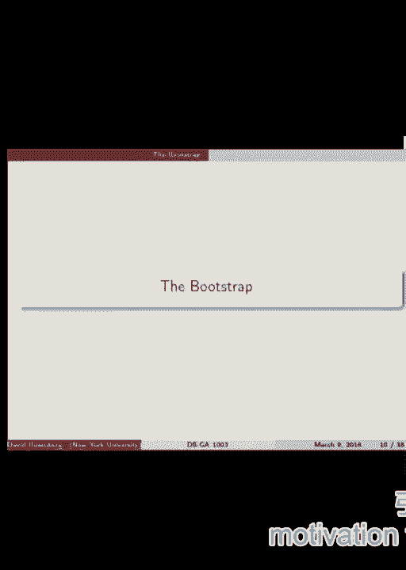
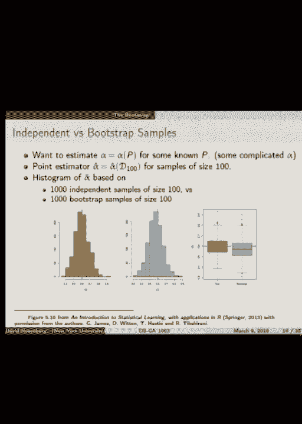
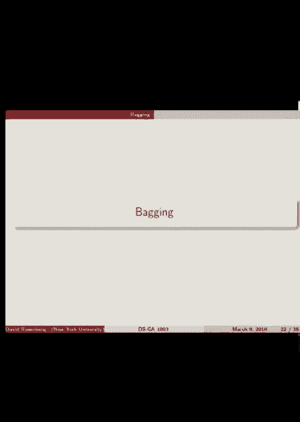
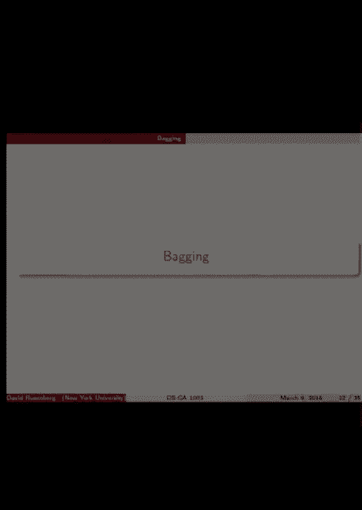
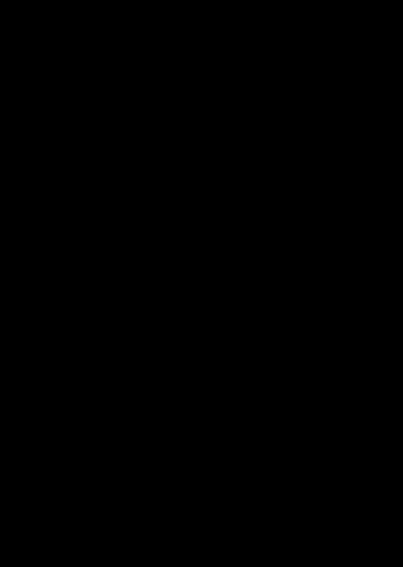
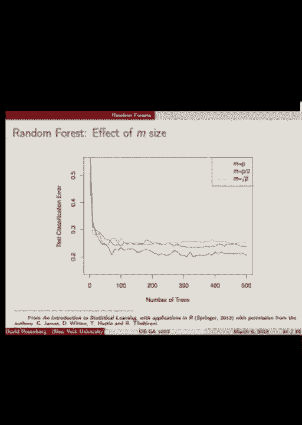
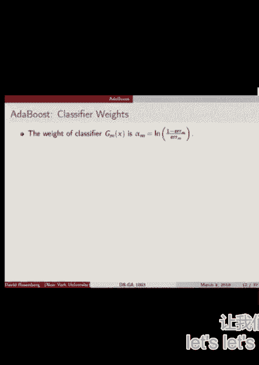

# P12：12.Mar_9_Lecture - Tesra-AI不错哟 - BV1aJ411y7p7

 Okay， so tomorrow is going to be the first meeting with project advisors。

 You guys should all know who your project advisors are now， either through a Piazza posting。 or an email。 Brian D'Ausandro， he's actually at a town。 so he's going to be making individual appointments， via Skype or video chat or something。 So hopefully there's some communication going on between those groups and Brian。 Of course。

 Chin is not in the country， so you'll be doing video chat with him。 But the other three advisors are here and you'll meet with him tomorrow。 It'll be like a five minute pitch of your idea。 You'll get immediate feedback。 If you have to leave at eight， kind of let people know in case there's any overage， so。

 you can go first。 Alright， so that's all to say about the projects tomorrow。 And so let's talk about what we're talking about today， which is ensemble methods。 The main highlights for today will be random forests and we might start in to some out， of boost。 a boosting technique。 But along the way we're going to talk about some statistical technique called the bootstrap。

 which motivates some of the motivates bagging and in fact random forests that we'll talk， about。 Okay， so we'll start with a review of bias and variance。 First of all， what's a parameter？

 We're at our statistics framework now， statistics vocabulary。 And a parameter is a function of a distribution。 So we have a probability distribution P。 We would like to estimate some characteristic of the distribution。 What are characteristics of distributions that we know？ Yeah， mean， variance， median， pertosis。

 quantiles。 The entire distribution itself could be a parameter。 It's still a function of the distribution。 Okay。 So these things we call parameters。 we can denote them as mu equals mu of P to show that。 mu is a function that operates on the distribution itself。

 And a lot of statistics is about estimating parameters。 All right， so what's the statistic？ Well。 as you expect in statistics， we always have this data set。 Write that D。 So we have a sample， say。 IID from the distribution P。 A statistic is just a function of the data。 So statistic S is any function of our data sample。 All right。

 A statistic gets a special name if its purpose is to estimate a parameter。 And we say statistics are point estimator， a statistic mu hat， say， which is a function。 of the data。 It is a point estimator of mu， which is a function of the distribution， generating the。 data。 Mu hat is approximately equal to mu。 But more or less。

 if we intend mu hat as an estimator of mu， then we say it's a point， estimator of mu。 Just a little bit of very general terminology for you guys。 Okay。 So suppose we have a real value parameter。 So most of the things we mentioned are real value。 The mean， standard deviation， these are all numbers， real values。 They don't have to be。

 a parameter could be more than just a real value。 It could be a function itself。 It could be a pair of numbers。 Anyway， but in this case， real value parameter。 a mu hat is a real value estimator of mu。 And when we have real value estimators and parameters。 we could do things like talk about， bias and variance。 So we define the bias of mu hat。

 this you guys should know， to be the difference between。 the expected value of the estimator and the true value of the parameter。 Does this make some sense？

 So the expectation of mu hat somehow depends on mu in some way， right？

 Mu is part of the probability distribution that we're using when we compute that expectation。 So these things， the expectation is where mu comes in and expectation of mu hat equals， mu。 then we're in a situation called unbiased。 So zero bias。 All right。 And the variance of mu hat is just the variance of the estimator， definition of variance。 Okay。

 Unbiased is if bias is zero。 So here's a point I wanted to make。 It's that neither the bias nor the variance depends on a specific data sample。 It's not like we sample end point ID from probability distribution and we say， "Oh， what's。 the bias on this data set？ What's the variance？"， No。

 The bias and the variance depend on what the function is， mu hat， the statistic， what's。 the actual function for the point estimator and what's the distribution， P。 So。 and that comes through because in the bias and the variance where there's no direct。 reference to DN， we're taking the expectation over the data set。 All right。

 So the expectation is random， rather than the data sets random， or we're taking the expectation。 over the data set， which is kind of as though we'll see what that's like in the next slide。 when we talk about how we estimate it。 All right。 So how do we estimate the variance of mu hat？

 You see it has this expectation of mu hat and expectation of mu hat squared in it。 So let's get estimates of those things and we just subtract them and then we get the variance。 All right。 Okay。 So what do we usually do？ What do we do back in risk when we want to estimate the empirical risk？

 It was the expected loss， right？ So we had this expectation and we need to compute it with respect to some probability。 distribution， but we didn't know the probability distribution。 So we had a trick， right？

 It's not a trick。 It's just what happens in statistics。 Yeah。 Okay。 So we'll have our numbers。 So we had a， we didn't have the distribution， but we have a sample from the distribution。 So we were calling it D。 So here DN sample size N。 Now let's just take the empirical average over a bunch of things and say that we'll estimate。

 the expectation。 Okay。 So let's see how to apply that reasoning here。 So instead of a single sample DN， let's suppose we actually have B independent samples， of size N。 So we have probably a generating distribution。 We draw sample of size N and call that D1 sub N。 Another one call that D2。 Let's grab B of them。 Okay。 And what we would want is。

 so to expectation of mu hat is the expectation of what would。 happen from mu hat for randomly chosen D， but we'll estimate it by taking B randomly chosen。 data sets and averaging。 All right。 So what's that look like？

 Exertation of mu hat is approximately equal to the average over B data sets of mu hat。 of mu hat on that data set。 Is that clear？ So what kind of。 how many elements are in D sub N superscript I？ What is that？ Yeah。 This DI sub N。 that itself is a sample of size N from the distribution。 And we have B of those samples。 All right。

 Okay。 Good。 So that's how we can estimate， in some hypothetical world where we got B repeated samples from。 this distribution that we can estimate expectation of mu hat。 And similarly。 we could do mu hat squared。 Fine。 And we get this formula to estimate the variance of mu hat。 So what good is estimating the variance of our estimator？ Why is this interesting？

 To statisticians or anybody？ So there's some mu that we want to estimate。 We have this point estimator， this formula for point estimator which says， you give me。 some data and I'll tell you how to come up with an estimate of mu。 And that's mu hat of the data。 So why are we interested in this variance of mu hat？ Yeah。

 If we want to just look like the confidence interval。 So it's not just， yes。 mu hat is a point estimator。 But sometimes we want what's called an interval estimator or confidence interval where we don't。 just say mu hat， we give some range like， yeah， it's mu hat plus or minus 5%， plus or。 minus whatever。 So it's the plus or minus that's giving the range to get some handle on that。

 That's why we're interested in the variance。 So what would the plus or minus be roughly in terms of variance of mu hat？

 So it should be mu hat plus or minus。 Okay。 So 1。96 or something times what？

 Standard deviation of mu hat which is what？ In terms of， there's a square root of the variance。 Okay。 So the variance of mu hat isn't quite the units that we're looking at。 We need the standard deviation of mu hat which is square root of variance。 Okay。 All right。 Like that。 All right。 Okay。 So we have this estimator mu hat and we talked a little bit about how we might be able to。

 come up with the variance of mu hat in some way。 What if we want to understand the whole distribution of some estimator mu hat？

 Okay。 So how might we do that？ All right。 So suppose we grabbed in this picture what's happening is we're grabbing 1000 data sets of。 size 100。 All right。 So you get a data set of size 100 that's one of them。 And we do that a thousand times。 And for every data set we estimate this point estimator now alpha hat。 Okay。 It's alpha hat now。 And alpha hat has a value for that particular data set。

 The data sets are all generated by the same probability distribution。 All right。 So alpha that we're trying to estimate alpha of P the parameter we're trying to estimate。 for the probability distribution。 That's the same every time。 And because the data set we sample is random alpha hat will be a little bit different every。

 time and we can plot a histogram of all the alpha hats we get from all the different samples。 So this is what this histogram is showing。 So pink that line in the middle purple is that's the true value of alpha。 And then we see that out that has some spread around the true value。 Okay。 So how could we if we had this can we estimate the standard deviation？ Yeah。 It's about that。

 But the point is that this has more information than just the standard deviation of the variance。 This is an estimate of the entire distribution of alpha hat。 Okay。 All right。 So this was all well and good。 We are going along this path of having repeated samples of size N。 But in real life we usually， get one sample of size M。

 So you know and if we if we want to get variance estimate we could for example take our sample。 of size N and divide it up into groups of into B groups。 And then kind of get an estimate on each of the groups and then get the variance。 But but the problem with that is what's the problem with that if we break this data set， and into。

 Well if we if we take the sample size and then we break it up into groups that they it。 should be independent that's fine。 The issue is that the individual groups are small and we would get a better estimate if。 we could use the whole thing of size N all at once。 So we use it all at once we don't have an obvious way to get variance。

 If we break it into small groups we can get the estimate of variance but the estimate is。 based on a very small group。 So that's that doesn't sound so great。 So the question is can we get the best of both worlds somehow。 You get an estimate from the entire data set of size N and have some estimate of its variance。 Yeah。

 Okay。 Okay。 So the bootstrap that's why that's the motivation for the bootstrap。 Sure。 Yeah。

 Okay。

 Your question。 So what happens so all these every point underline is histogram was the value of alpha。 hat based on a sample of size 100。 So question is what happens if that sample were of size of 10。000。 I like that question a lot。 What happens to this what does this histogram look like in that case？

 Okay。 So a lot of it gets narrower。 It gets select a variant the standard deviation of this distribution gets narrower。 Yes。 Right。 Why？ What's happening there？ Think the better estimate。 Yeah。 Estimates are getting better。 The estimates are converging to the value that you into their expectation。 Hopefully。 That's consistency。 Yeah。 Any other questions？ In this case。

 how can we say that what is the standard deviation for the bootstrap？

 So if you found the number of data， if everyone is different， they're not as fast as that。 Okay。 Yeah。 So this is every sample is of size 100。 If you want it， if you。 your original data set was of size 100， you have your estimate。 you have your point estimate for that data set， alpha hat of 100。

 And now you want to know what's the variance of this thing？ Okay。 Now， to do that。 you imagine that you take a lot more samples of size 100 and then you。 look at the variance of those。 Is that answer your question or？ I mean。 like if I have the most size， 10，000 and then I do use that， I have two terms that。

 is that data set is of size 100。 No。 Each， you said 10，000。 No， no， I think 10。000 random data sets of size。 Okay。 So bootstrap of size 10，000。 No。 Yeah。 10，000。 B equals 10，000。 Yes， B equals 10。 Okay。 So like， I use 10，000 and he used like 100，000。 Yeah。 Okay。 No。 What happens？ So what， this thing gets narrower when n gets larger。 So this 100 is replaced by 10。

000。 What happens when B gets larger？ We have more bootstrap， bootstrap， resamples。 What do you guys think happens then to this histogram？ Say again？ Yes。 Yes。 Same but more smooth。 So the distribution of alpha hat based on a sample of size 100， that has nothing to do。 that's just a distribution。 We're estimating that distribution by taking lots of data sets of the same size。

 The more data sets of the same size that we take， the better our estimate of that distribution。 becomes。 So yeah， if we had a lot larger B， we could probably make these bins a lot smaller and。 it would be nice and smooth。 That's what happens。 Okay。 Good question。 Okay。 So the bootstrap。 So first let me define a bootstrap sample。 A bootstrap sample from a dataset， DN。

 is a sample of the same size， size N， drawn from， DN with replacement。 So picture a bucket of all the samples that you got in your initial dataset， in your initial。 sample of size N。 And then you reach in and you grab one and you record it and then you put it back。 And you reach in again and you grab random one and record it and put it back。

 And you do that N times。 And that gives you what's called a bootstrap sample from the original sample。 So some interesting things are going to happen with a bootstrap sample because they're sampling。 with their placement。 So we're going to have repetitions， right？

 We're also going to have items in the original sample that never get pulled out in our resample。 We can calculate the probability of that。 So let's do that。 So every item in the original sample。 every time we reach in and grab it， there's a probability， that we don't get it。 One minus one over N。 Yeah， right。 And every time we reach in and grab it。

 it's an independent event。 So probably that we never grab it and N tries is one minus one over N raised to the nth power。 Okay。 And what is that？ Yeah， close。 Yeah， exactly。 That's right。 As N goes to infinity。 this converges to one over E， which is roughly a third。 Exactly。 So back at the end。 So the probability of rather the expected fraction of balls that are left behind is about。

 a third in every bootstrap sample。 So there's definitely some diversity in these bootstrap samples。 Every time we go for it， we're getting maybe about 70% overlap or something， but not complete。 overlap。 All right。 So that's a bootstrap。 This is a quick picture of it。 although I think it's pretty clear。 If the original dataset is on the left， dataset is size three。

 three observations of X and， Y。 The first bootstrap sample has the third observation repeated twice。 The second one's missing altogether。 The second bootstrap sample has all of them。 So that's exactly the same。 And the last one has two repeated threes missing。 So that's B equals three。 Three bootstrap samples， yes。

 So why are we choosing a sample size the same as the original data？ Well。 I think the motivation is pretty clear in the previous discussion because here we。 had a fixed dataset size。 It was a size of 100。 And we wanted to know what's the performance of alpha hat on a dataset of size 100。 And so what we did was we drew a bunch of datasets of size 100 for the original distribution。

 Basically the fact that they're the same size follows from this whole discussion。 Whereas now instead of here we are saying that we're drawing from the datasets from the。 original distribution。 Instead of that we're saying， well we can't actually do that。 So what we're going to do is take bootstrap samples from the sample distribution。

 Anybody else puzzled by this？ Why is it equivalent？

 Why make sense to be talking about bootstrap samples that are the same size as the original， sample？

 Yeah。 Are you basically maintaining the probability distribution by doing it with replacement but。 still taking a sample of size n？ We want to have back to that and still have the same probability of drawing back or something。 else。 Is that like the point of putting it back but still taking it in size n？ Okay。 So first why do we want it of size n？ First let's assume we wanted it to be of size n。

 You need to put it back or you're going to get the exact same thing every time。 If you don't replace it you're just going to get the whole， it's not a different sample。 it's the same as the original dataset。 No I get that。 Okay so then the question is why is it of size n？ I guess。

 Oh I'm saying it's like that's why you're kind of combining replacement and size n to。 try to get like the right distribution。 We want to size n but we want a little bit of diversity because we want to pretend that。 the bootstrap sample is kind of like taking a fresh sample from the probability distribution。 even though it's really a bootstrap sample from the sample。

 So yes it's kind of like simulating we would like to imagine that the bootstrap sample is。 in rough approximation to a fresh sample from the original distribution of size n。 That's the objective which seems not entirely convincing that that would work。 Maybe plausible yeah。 You're saying is it more efficient than to generate a sample from the original distribution？

 Oh okay that's interesting。 So that's actually I understand correctly you're saying you take your sample and then you。 have a model and you fit your model to the sample and then you draw data from the model。 Yeah that has a name that's called a parametric bootstrap。 That's interesting。 Okay but that's different that's something different。 Yeah but that's a real thing。 Okay all right。

 So bootstrap method I kind of alluded to it。 A bootstrap method is when you simulate having B independent samples from the distribution。 P by using B bootstrap samples from the sample Dn。 Okay so the entire first section of this lecture was if only we had B independent samples。 from the probability distribution we could do this cool stuff like estimate the variance。

 of our estimators。 And then we said but we don't really have B independent samples and a bootstrap method。 is saying that might be okay why don't you just take B bootstrap samples from your original。 distribution and treat them as though they were independent samples from the original， distribution。 All right so we have our original data Dn we have we make B bootstrap samples I've written。

 not script D here is regular D to kind of say bootstrap。 And so then for each bootstrap sample we compute some functions some it should be a statistic。 And we work as with those as though they were drawn IID from P。 So the amazing thing is that this usually comes this often comes pretty close to what。

 you would get with actual fresh samples of size P from the original data jetting distribution。 That this works is I find it surprising。 The justification is both empirical by running experiments and theoretical with some fairly。 heavy mathematics which we're not going to get into。 But it's as a practical tool it's quite effective。 So here's a illustration。

 So I'm going to repeat what we had before we had the histogram before the histogram。 So here's the histogram on the left is the histogram we had originally that's where we。 had we had 1000 independent samples of size 100 drawn from the original distribution that's。 this guy。 The middle histogram is instead of 1000 real independent samples we're taking 1000 boot。

 sample bootstrap samples from our original sample of size 100 and we histogram those estimators。 up and we get this histogram in blue which some eye looks pretty close pretty close。 On the right we have another view of the data。 The box is that called box stem and leaf stem anyway。 The box plot。 Alright so this is this is our illustration of the effectiveness of bootstrap。

 And you can take some statistics if you want to go deeper yes。 You can ask the question based on the real data set。 You can calculate the ask the measure based on the real data set。 Or based on the size of the real data set is n right？ Yes the size of the real data set is n。

 And you do the bootstrap nothing and you ask the base of the data set with size of n for， e-homes。 Yes we do we take the bootstrap samples of size n yes。 So why is it because they both calculate based on the size of the data set？

 Yes everything is calculated based on a data set of size n that's right。 And if you calculate only one state on the real data set and it calculates the e-homes。 of the real data set。 That's right we can calculate once on the original data set and we do the same thing。 B more times on each of the bootstrap。 That's right。

 So the question is you already got say mu hat on the original data set。 Why did I just calculate it B more times on the bootstrap data sets？ Anybody have an answer？

 That was a lot of answers。 Say again？ Yes so for example the first motivation was we have this estimator mu hat based on the。 data set but we want to put error bars on it。 We want to know how much variability there is。 Maybe we got another data set and it's a different number and we want to be able to。 say it's very common to when you give an estimate to say oh this is the temperature。

 today is 80 degrees plus or minus half a degree。 Not a great example but when you do a poll or sample or something you have an error。 range on your estimate。 But we don't have a way to get an error range。 We don't have an obvious way to get an error range if you just take mu hat of your， data set。 What else can you do？ You can look at the actual spread of those estimates to get an estimate of the standard。

 deviation of your original estimate。 So I'm not sure。 You said I trained B。 I got B separate estimates and so it's better。 What would make it better？

 Maybe if you average them together that might make it better。 The reason we're doing B separate ones is because we want to get an estimate for how much。 things vary from data set to data set。 That's why。 It's not about making it better yet。 It's about estimating how variable it is。 So we're going to have one half n。 One half n。

 Like if you want to have each sample generation one half n and the number n is same。 That's right。 The reason is that we're going to estimate variance and variance might change in the， other hand。 What's the one？ Yes。 Well， yes。 Okay。 All right。 Suppose we have a probability distribution of mean mu。 We draw a state has standard deviation one。 All right。

 So we draw a sample size n from normal mu one。 We want to estimate mu。 We don't know what it is。 Okay。 So what's a good estimator？ All right。 New hat over data。 Okay。 Okay。 What's the variance of mu hat？ All right。 All right。 All right。 All right。 You guys go one over n squared variance of a constant times a variable is the square of。

 the constant times the variance of the variable。 Great。 Now we get to the summation。 What happens with the variance with the sum？ We can move the variance inside the sum when？

 X i's are independent。 Great。 Uncorrelated is sufficient。 So we can write one over n squared sum variance of x i。 What's the variance of x i？ Great。 All right。 So this is one。 We're summing one to n of one。 What's that？ And the final thing is。 All right。 Good。 So the variance of mu hat is one over n。 So that's the dependence on n。 Great。

 So now --， [ Background Sounds ]， So by mathematics。 we just figured out that the variance of mu hat is one over n。 The problem is a lot of times you come across an estimator that we cannot do that， calculation。 We do not know how to figure out what the variance is。

 We don't know how to do the math to calculate it in closed form with the， variances。 So the boost trap is a way to figure out what that variance is。 But the reason I wrote that out here is because， yes。 So the distribution of mu hat --。 Now what do I mean by the distribution of mu hat now？ What I mean is every time you take a sample。

 you get a mu hat。 And then you take another random sample of size n and you get another mu hat。 And then you histogram those up。 Okay。 And then standard deviation would be what， roughly。 for this histogram？ One on squared of n， yeah。 Okay。 So if you figure this thing gets really small。 And so， yeah， for -- you know， this might be n equals 100。 And n equals 1，000 might look --， Okay。

 So as we change n， the shape of the distribution we're estimating changes。 So we want to get -- we want to -- we're estimating this distribution by getting， sample points。 And we have to be drawing the sample points from the same distribution。 which means they have to be estimators using data sets at the same size。 That's what's going on。

 Okay。 Does that help？ Yeah。 Oh， great。 So basically， if you're in a strat。 it's a method for calculating or， estimating the distribution of the statistic based on one sample。 I like that characterization。 So this strat is a method of estimating the distribution of a statistic based on a single sample。 Sounds good to me。 Okay。 Any question， or is -- I don't know much about it。

 but there's something called Jacknite。 Is that sort of the same problem？ And another question is。 is this the best method for this kind of estimation？ This is for this strat。 And the third question is， what if our samples are dependent somehow？

 Is there a variant of bootstrap which would solve that problem？ Okay。 In reverse order。

 Yeah， there are variants of bootstrapped， but I think they're very specific to the dependence。

 Next previous question， is this the best method for doing what we're describing？

 It's the best method that I know of。 It's the best method that -- yeah。 So -- it's the best method that I'm here to tell you about。 Yeah。 bootstrap was a big deal invention。 Prior to this。 Jacknite was indeed another technique to the same thing。 But -- I remember what that was about。

 Anyway， but the bootstrap is kind of basically supersede the Jacknite。 No one really uses Jacknite anymore。 It shows up on problem sets now and then just because you can。 But -- was there another question also？ No。 Okay。 [ Inaudible ]， Okay。 So。 what if you drew -- you're saying you drew a sample size to N？ And what would the idea be again？

 Well， so for just following this， then you could have a smaller -- a more narrow distribution。 But you're still just using the same data that you already have。 Okay。 All right。 So。 I think what you're getting at is -- well， for -- so， if we want to pretend that this。 is a big deal， we're trying to get a real good estimator。

 Why not just take a sample of size 2N or 10N and then -- well， we just have a better， estimate？

 In that case， you run a sigma by xi in seconds because --， Because？ Because？ Xi will be 40。 I mean --， Okay。 So， but we're -- the assumption -- the leap of faith here is that we are kind of treating。 a Buschap sample as though it's a real IID sample from the original distribution。 I'm using that -- I'm saying that acting in that way gives you results that make。

 sense for things like variance estimating。 But the same stuff doesn't go through for that kind of thing。 So -- which is good because that would be crazy。 All right。 Any more？ Yeah？ Sure。 [ Inaudible ]。 Okay。 So， the question is if you knew your data was noisy， which I'm going to take to mean。 high variance or --， Outlives or something。 Okay。 And then the idea is are you hoping to get some robustness by taking a smaller sample？

 [ Inaudible ]， Okay。 So， that's interesting。 So， first of all， that is on the same。 That is along the lines of let's just make a new estimator， whereas the motivation for。 the Buschap is let's figure out the variance of a given estimator。 So。 the estimator is I'm going to compute this function on a data set of size n。

 And now I want to use Buschap to figure out the variance of that estimator。 And now you're suggesting let me suggest a new way to estimate something by。 sub-sampling something smaller than n and computing my thing on smaller than n。 because maybe then I'll get luckier and avoid the outliers or something。 Okay。 So。

 I don't know the limit of that approach is like just take something of size really， small。 So。 there's obviously a trade-off right between using all your data， which might。 have some noisy things in there versus smaller subs of data， which is just。 giving you less to work with。 So， I don't know if that's -- I don't think that would help。

 but maybe there are some， strange distributions out there where it actually -- I mean， there are。 distributions which is crazy。 There are distributions where if you take a bunch of samples -- if you take a。 sample from the distribution and you average those points， your estimate of the mean。 of the expected value distribution is actually worse than if you took a single。

 point as your estimate of the expected value of the distribution。 So。 there is an -- this crazy distribution where what you're saying is actually the， correct solution。 Like， don't take n points。 The more you have， the more you're going to get messed up by outliers。 Just take one。 But that is a very unusual scenario。

 It has to do with the fact that the distribution has very， very heavy， tails。 So。 very likely to get a very large number。 Like， they -- they're distributions that don't have variances and they're。 distributions that don't have expectations。 So， the quotient distribution is -- so it has a lot of these strange properties。 Okay。 Yeah？ [ Inaudible ]， No。 No。 This is -- no distribution -- no assumptions on the distribution。

 Yeah。 [ Inaudible ]， That's a nice question。 Not that I'm aware of。 So。 I think the -- I can get back to you on that， though。 I could look into that。 Nothing enough that stands out。 So， maybe the theory will have some --， Okay。 All right。 So。 so far we've talked about bootstrap。 Now we're going to talk about why you might want to do something like。

 averaging your bootstrap samples。 Okay。 But let's -- let's size that into that。 All right。 So。 let's start with a scenario and do what we're calling a lousy or a bad， estimator。 Suppose we have -- we're starting over now。 Okay。 We're having -- we have z's one through n。 their iid， from some， distribution。 They have expected value mu and then our dvn is variance sigma。

 squared。 Okay。 We want to estimate mu。 So， one particularly poor estimator of mu would be z one。 What happens with z one？ What's the expectation of z one？ It is？ The expectation of z one is mu。 So。 it's an unbiased estimator of mu。 That's a good start。 What's the variance of z one？ Sigma squared。 The variance of z one is sigma squared。 Okay。 So， we could use z one to estimate mu。

 We're leaving a lot of data on the table。 But it's an estimator。 And so。 the variance is sigma squared。 But the point is we could do better than sigma squared by averaging。 So， the average -- if we take the average of z one through z n。 it actually is a characteristic we just did over there。 It has the same mean， mu， good。

 But now the variance has gone down by a factor of n。 So。 standard deviation has gone down by a factor of square root of n。 So。 this is in our nutshell why we take averages。 Because the variance goes down by one over square root of n。 So， the question is， can we use this phenomenon to help us with， you know， machine learning？ So。

 this is very simple parameter point estimator。 Can we use this to help us with machine learning where we have。 prediction functions， masseter of thing？ So， let's go back to our original idea。 Like， well。 suppose we had B independent training sets now， right， from the same distribution。 And we have a learning algorithm that gives us B decision functions。 So。

 now we have F one hat all with F B hat。 Is it clear？

 We have one decision function based on training our algorithm on each， of B different training sets。 sample from the same distribution。 Great。 So， then what would we want -- suppose this is regression。 What would you want to do with the F hats？ Yeah， I would want to average these F hats。 So。 the average prediction function in the regression setting。

 would be just take the average of the F hats that we got from each， of these individual sets。 And then you'd expect the variance of F hat to be less than the。 variance of a single prediction function。 All right， just as a concept check， what's random here？

 What's random in this description？ Training sets are random， exactly。 That X there。 this is just to indicate that we have functions。 It's not random。 It could be。 but in this setting we're not saying X is random。 All right。 So。 the average -- so we're going to fix some X。 The average prediction function is defined like that。

 And then because X is fixed and we can think of each of these F， average of X， that's a number。 right？ The function is not being the real。 So， this is a random variable， right？

 It's random because it's random。 It's a random training set。 So， if a random variable left。 then we have this average of， random variables on the right。 So。 this is pretty much exactly the scenario we were in in the。 first set of slides where we had these estimators， mu hat。

 and we calculated them on independent data sets。 We had independent random variables。 So。 now we have， again， independent random variables， which is the prediction of the decision functions on a fixed X。 We would expect that the variance of F hat average for particular， X to go down also， like what？

 1 over square root of B in this case。 Okay。 Good。 Okay。 Let's take a few more minutes before we break。 All right。 So， it seems great。 We have this。 we can take a bunch of data sets and average them， and we decrease the variance。 and the expected value is the same， just like before。 So， it seems like a win。

 but of course we don't actually， we're back to the same show off we discussed before。 or we have this really， you have one training set， and what do you do if you want the variance？

 Do you break it up in pieces and average them， but then each of your pieces is much smaller。 So。 we have a possible answer。 Yeah， exactly。 So， we can。 instead of hypothesizing that we have B independent， training sets。 let's give a try to take and B bootstrap training。

 sets and training on each of these and then averaging those。 Okay。 Let's take a break。 Let's see you in 10。

 What's going on？

 It's awesome。

 All right。 Roll it？ Okay。 So， the idea that we just talked about was， boy。 would it be nice if we had B independent training sets。 we computed our decision function on each of them， we combine them。 say by averaging in the regression case， you'd have lower variance， same expected value。

 That sounds great， but we don't have these replicated data sets。 What the heck？

 Let's try bootstrap replicates and train on each of those and then， average those。 So。 that method has a name。 It's called bagging。 So， let's break that down more precisely。 So。 let's start with B bootstrap replicates from the original， data set D。 All of the same size。 I left off the subscript and let F1 hat through F hat B be the。

 actual decision functions based on training on each of those， training sets。 And then。 we have something called the bag decision function。 which is basically take all these things and combine them， somehow into something we'll call the。 this should be bag not average。 It's something we'll call the bag estimator。

 But let's think about how we can combine these things。 So， here are some cases。 How would we plausibly combine them for regression？ Average。 Yes。 Great。 What about for binary class predictions？ So， say each F hat gives a zero or a one。 What might you do then？ Majority certainly makes sense to me。

 A certain type of average called the mode。 We'll do it。 Alright。 what if the predictions are probabilities？ Average seems plausible。 Somewhere numerically combined。 Have a multi-class hard predictions。 Yeah， plurality。 You know， whichever has the most votes。 Yeah。 Yeah。 What do you do able to average the weights that we check out from， there？ Okay。

 so the question is， do you want to， so I'm suggesting。 combine the predictions and you're suggesting， well， what about， combining the weights？

 The actual internals or the prediction functions themselves。 Should we combine those？

 That's interesting。 So， something like that sometimes happens when you do parallel， computations。 parallel learning。 But that would be a totally different approach。 Yeah。 Well。 at least conceptually it's a totally different approach。 In certain situations it might turn out to be the same。 Yeah， for linear methods。

 Seems like it for linear regression。 Alright， good。 So you have some ideas on how to combine。 all these things， sound good。 This is a method from a '96 Leo Brimann， a famous statistician。 who did a lot of machine learning。 Did a lot of the bridging the gap between statistics and machine。 learning。 This is Leo Brimann。 He also invented random forests。 Pretty much owns this lecture today。

 He didn't invent the bootstrap。 That was a guy's Stanford。 Yeah。 In this situation。 is there any way to distinguish between the， functions and do a weighted average based on how well they。 predict？ Well， that's a really interesting question。 What's that not really work here？ No。 so the question is， would it make sense to do some kind of。

 a weighted average based on some estimate of how well the F， hats did？ Right？

 So I like the intuition。 Do you have an idea on how you might estimate how the F hats are， doing？

 That's what I was like kind of wondering if I'm really like， is like more theoretical， so yeah。 I'm really able to move， that back。 Yeah， well， so you might， okay。 so one way that could work is if， you had a ton of data。 you could estimate each F hat's performance， on some holdout data。

 But you would never really have that much。 You would never use the training performance。 at least not， and obviously because， I mean， you might， it depends on the， situation。 but often F hats are going to be maybe over fit to， the training data。 So how they do on the training data may or may not be a very。

 good indication of how they do on new data。 Can you combine cross-validation with the bootstrapping technique？

 And the goal being to find out weights for the F hats？ Yeah。 That's interesting。 I think the closest that we're going to come to that is the， next topic， which is boosting。 out of boost， which does definitely， have a flavor of this combining by how good the prediction functions。 are。 Okay。 So let's just talk about regression， bagging for regression， for a minute。 So here。

 and I got the subscript right， so here the bagging is， yes。 the average of the predictions of the regression， functions。 And so if the bootstraps samples are actually independent draws， so not boost up。 but like the real thing， independent draws， in original distribution。

 then F hat bag would have the same， expectation of any individual decision function， great， and it。 would have smaller variance， which is very nice。 So empirically。 one often gets a similar effect for bagging， but， sometimes there's no effect and sometimes there's a huge benefit。 of bagging。 So， and why？ Well， bootstraps samples aren't independent samples from the。

 real distribution。 They are the bootstraps samples。 So there's no guarantee it's going to help。 but sometimes it， does help。 And we'll all give a little bit more intuition and a slide on。 when it might or when people say it might。 There's one cool thing you can do with bagging。 So remember every time we took a bag bootstraps sample， something。

 like 37% of the data set is not included in the bootstraps sample。 Right？ Okay。 So if we train on the 63% that we're left with， we could predict。 on the 37% and that would be an out-of-sample prediction for， that particular decision function。 So there's kind of a built-in test set for any given decision。

 function that we train on a bootstraps sample。 Is that clear？ Right。 whatever is still in the bucket after we draw our bootstraps， sample。 well we didn't train on that for this particular decision， function。 so we could use that to get an estimate on a performance。 But so let's extend that idea a bit。

 So let's now look at each of the end training points。 So we're going to let S of i be a set referring to the i'th， training point out of n。 And we're going to let b be the indices of all the bootstraps。 samples that do not contain the i'th training point。 All right。

 so we got capital B bootstrap training sets。 And roughly 37% of them are not going to have the i'th data。 point。 Let's collect those， let's collect the prediction functions。 F hat i。 Let's collect the prediction functions corresponding to the。 data sets that did not train on that data point。 And let's evaluate the prediction performance by how it does。

 Next slide。 All right， so we call it the out of bag error estimator or the。 out of bag prediction function。 Basically， we're going to predict on xi， the i'th training point。 to get an estimate of how well we would do an out of sample， sense on xi。 We look at all of the f hat b's that were not trained on the， i'th data point。

 And we average the predictions of those functions。 So f hat o would be we can look at how it predicts on xi。 And the performance on that data point is somehow legitimate， out of sample performance。 Any questions on that？ Is that clear at all？ Some people found it clear。 Say again。 Yeah。

 I guess I could。 That's interesting。 Let's think about that。 Yeah。 All right。 Does anyone have a question to ask on this？ All right。 All right。 So this is a pretty good way to estimate test error。 It's kind of a just a side benefit of using this type of， method。 In practice， it's -- you know。

 if you have the data， it's better to， use a validation set。 It's more accurate， typically。 Okay。 All right。 So here's an illustration of what happens when you bag trees。 How can we -- how are we going to bag classification trees？ So we discussed two methods already。 It's a classification so you can either do a majority or。

 plurality build of the classes or you could average the， probabilities that are predicted。 All right。 So here's five different trees based -- so we have a sample， of size 30。 And then we built a tree on that and we get this original tree on， the top left。 And now we took five new chap samples， also of size 30， and built decision trees on each of this。

 And we got five more decision trees。 And what's interesting is that the decision trees are often。 quite different。 So the structures are different。 Can you guys see these variables？

 The first variable here splits on x1， x2， x3， x4。 They're splitting on a different variable in the first -- in the。 root node。 The trees are quite different in how they're doing the。 classification based on the different bootstrap samples。 And this kind of instability to changes in the data set -- some。

 mild change in the data set -- that is often referred to as， kind of high variance。 It's a high variance method that a small change in the training。 set can lead to large changes in the final prediction function， or at least the structure of it。 And what we'll point out later is that people often say methods。

 like bagging work best when you have this kind of -- any given， tree has a lot of variance to it。 a lot of variability。 And bagging helps reduce that variability。 All right。 So here's a picture of bagging trees using two different methods。 So every tree， of course。 you have very easily either， probability prediction or a hard class prediction based on the。

 relative proportion of classes in your leaf nodes。 And so on the x-axis we have the number of bootstrap samples that。 we're using that we're averaging together to get our bagging， estimator。 So all the way on the left we have one。 So we have a single sample from the original。

 And then as we take more， the test error -- so this is the。 performance of the average of bead bootstrap samples -- it。 decreases very nicely initially and then it kind of levels off。 Which kind of makes sense。 There's only so much error that's due to the fact that the。

 data set -- there's some randomness in your data set。 More of the error is the fact that you have a small data set。 I would say。 All right。 So eventually you kind of max out how much benefit you can get， from this bootstrap resampling。 And kind of can see there's not too much difference between the。

 consensus method which is the yellow and the probability method， which is green。 Any questions on this or the previous slide？ [ Inaudible ]， Yeah。 this picture maybe seems that probably is a little bit， more robust。 It varies from situation to situation。 So it's probably best to try them both and do some cross。

 validation or something。 Yeah。 Sorry。 What is consensus？

 That's another word for like majority of plurality or -- whichever， has the highest number of votes。 Consensus really means everyone agrees so that's not really， consensus。 But -- because the rest of the story is the one who were the， plurality。 plurality that convinced the rest of the people， to agree with them and then it was consensus。

 All right。 So a lot of times people -- so bias and variance have a。 technical -- there's one definition that everyone agrees on。 which is the one I've given you which is the case of you're。 predicting a real value and you have your expectation and your。

 variance and that whole story that's not disputed。 But people would like to use the terms bias and variance in。 broader scenarios where you're talking about classification and。 not regression or -- so I want to give you a flavor of what。 people have in mind when they're saying bias and variance in， those scenarios。 And it's kind of related to estimation error and， approximation error but I'll treat them separately here。 So -- all right。 So we have a hypothesis space。 We always have a hypothesis space。 Let's call it F。 So just introducing the hypothesis space will use the。

 term it biases the fit which is to say it's a bias on the fit。 you end up with because what has to come from that hypothesis， space？ It's a restriction。 A bias in this scenario is like a restriction of this prediction， of functions you can come up with。 You know， someone comes in and says I want to use a different， hypothesis space。 Okay。

 You've just biased things differently。 When you have a big hypothesis space that's one level of bias and。 if you make it strictly smaller that would be maybe more biased。 Okay。 So you just want to get you comfortable with this usage of the， term bias。 You can say you bias towards a simple model。 Yeah。

 You can bias also in some sense is pulling you away from the best。 possible fit of the training data。 Right？ That's kind of the idea of preventing overfitting。 You could perhaps fit the data perfectly if an unbiased。 estimator but you're waiting overfitting so you pull that， estimate away。

 You bias it away towards something that you think are， pure is more likely to be good。 Like something with small weights or small L2， no， or small L1， or a tree that's not too deep。 These are different biases。 All right。 That's kind of clear。 All right。 So full unpruned decision trees where you build them all the way。

 out until every leaf node has like one element in it。 That would people generally would say that's pretty unbiased。 What would the bias left be in the prediction functions that come。 out of decision trees that are built as far as deeply as you， can build them？ Yeah。 Well。

 what an advanced is like memorize the data。 So it would be like not biased。 Trees certainly memorize the data in terms of the prediction， function that results。 It's going to go through every data data point unless there's， overlap。 Like two exactly the same inputs have different outputs， but let's， get rid of that case。

 So if every input has different output then it should hit， everything。 Yeah。 It's not from a continuous distribution。 So those are going to be like jagged。 Great。 Great。 So the bias that's left in decision tree is that the final。 prediction function is piecewise constant。 In every leaf node it's predicting a constant number and that's it。

 That's more or less the characterization of maybe exactly。 where the boundaries of these rectangles are based on the， algorithm。 That would have some amount of bias。 But that's the flavor of the bias。 We're biasing towards functions that are piecewise constant as。

 opposed to maybe if we did a kernel method we could fit things， exactly but it'd be smooth。 It'd be sums of gouging kernel functions or something。 Okay。 So when prune and decision tree were introducing bias the bias is。 you can't have too much complexity。 You can only go to a certain depth。

 You can only have a certain number of leaf nodes or something。 All right。 So now variance。 What do people mean when they're saying variance in this more， sense？

 So it could describe how much the fit changes as you take different， random training sets。 That would be one way to characterize variance。 So the trees we were looking at those have a lot of variance in。 this sense because a different bootstrap sample can change the。 tree quite a bit whereas linear regression doesn't change much， when you do a bootstrap sample。

 So bootstrapping linear regression。 So bagging linear regression doesn't really do too much。 Okay。 All right。 So conventional wisdom about when bagging helps。 And I've gone to conventional wisdom here because I cannot find， any hard theorems on this subject。 So if anyone comes across a theory I'd love to hear about it。

 But the general sentiment is that so bagging does nothing to， eliminate bias。 That's fine。 The whole point of bagging is to reduce the variance。 So bagging helps most when we have relatively unbiased base， predictions。 So something that could treat you to some bias linear regression， would be very biased。

 And high variance when things are high variance they have a lot of。 variability that stands to be helped the most by bagging which， reduces the variability。 So is this true or not？ I don't know but I think what people are getting this from is。 that bagging works well for trees。 So trees have high variance and low bias。

 So that would be at least one data point to support this general。 sentiment that you see printed a lot。 So try it out your mileage can vary。 Yeah。 So thinking that you want to choose B so that you're touching every。 data point like we can have bull tries and you have limited。

 amount of computation but is there other considerations like， choosing B？

 It's not clear to me that it's important to choose B so large。 that you are very likely to hit every data point。 I think there are rules of thumb on B。 B is 100 is a common rule of thumb。 Some people say 50 and then others say 100 is better。 There。 That's the rule of thumb。 It's very empirically based。 So any questions on bagging？

 Now we're going to talk about random forest which is actually a。 pretty minor variation but it's an important variation。 It has excellent performance and practice。 So let's recall the motivating principle of bagging。 It came from pretending we had these IID samples。 These IID training sets from the original data distribution。

 And of course bootstraps are not independent。 Bootstraps samples are not independent。 There may be some issue there。 So the -- it may limit the amount of reduction in variance。 that we get。 So for example suppose all the bootstraps samples were exactly， the same。 This won't happen in practice but imagine you just repeat the， exact same data set every time。

 So all the F hats are exactly the same。 So averaging them does nothing。 So that's the limiting case of identical bootstraps data sets。 Bagging gives you nothing。 Okay。 good。 So maybe there's something we could do to reduce the variance to。 rather to reduce the correlation， the correlation， the。

 dependence between the different bootstraps samples。 So that's kind of what we're trying to do with random forest。 Let's first reverse this math result to make it concrete。 So we have suppose you have NID random variables。 We've looked at this several times。

 The variance goes down like one over N。 Variance of the average。 What happens if we say the ZIs are correlated pair less？ Okay。 So you can actually have a similar result。 So what if the Zs are correlated？

 So suppose for all pairs of ZIs and Zj， their correlation is row。 Then the variance of the average is this expression。 Suppose row is one。 They're perfectly correlated。 What happens on the right？ Row is one。 This second thing goes to zero。 So the variance is sigma squared。 That's back where it were when you only had one example。

 What's the other extreme？ No correlation。 Row is zero。 Okay。 This thing drops and then we get one over N sigma squared， which。 is what we're hoping for for independence。 That's what we got from independence。 So as the correlation changes， you get this sliding between -- this。

 trade-off between sigma squared and sigma squared over N。 So this is our math motivation to try to de-correlate to try to get。 each of the FIs to be as uncorrelated as possible。 All right。 Okay。 So here's to the random varistice。 Random varist is you take this bagged decision trees。

 You're using decision trees and you're doing your bootstrap， replicates and you're bagging them。 So combining them in some way。 But you're going to modify the way we grow the trees。 All right。 So we're actually going inside this tree algorithm and we're， changing it a little bit。 So the key step in random varist is that when we're building。

 the tree and we are at a node and we need to choose a split， variable in the split point。 the choice of splitting variable is， restricted by first choosing a random subset of variables。 random subset of features of a certain fixed size， but not the， whole set。 So maybe a typical amount would be if you have D features at each。

 node we choose a random subset of square root D features。 So if there's like 100 features。 then at any given node we pick ten， of them randomly and then we choose the best variable from。 those ten。 And then when we go to left we do another different random subset。 of size ten from the hundred features and we split on one of， those。 And the idea。

 everything else is unchanged。 So the idea is that now we're introducing a fair bit of， you， know。 diversity in our trees because it's， you know， first of， all the， even the very first root node。 which is very important， in the eventual tree structure， it's pretty unlikely to overlap。 with the square root of D feature sample to choose from。 All right。 So that is。

 that's pretty much all there is to say about the， random forest algorithm。 We can talk about it a bit。 But that defines it。 So square root of P。 if P is number of features is typical， but it's worth trying other things like P over two。 You could be more aggressive， be less aggressive on this。

 And then you could choose what fraction you want to use based， on cross-vortition as usual。 something like that。 Yeah。 >> You would struggle some first。 >> So again。 >> You would struggle some first。 What are you only changing？ >> Yes。 You would struggle sample as well。 So let's act it out from the top。 Here's the full data set。 Okay。

 So we're going to call our first bootstrap sample。 Now we build a tree。 Choose square root of P features to decide on the root node。 And then， and so on。 And then we build this whole tree。 Another thing I didn't mention is in random forest you typically。 build the tree is very deep。 So until every node has maybe five data points in it or something。

 a deep tree。 What happens with a deep tree in terms of bias and variance？ Very low bias。 That's right。 Yeah。 We're getting even more variability than usual in our trees because。 we're doing this random feature selection。 So we've just bumped up the variance a lot。 And by building deep trees， we're doing low bias。 Okay。 So we build this whole tree out。

 A deep tree。 Done with that tree。 Now we take a new bootstrap sample and repeat the process。 Yeah。 And then we --， >> And then you bump。 >> And then you get a whole bunch of trees。 A thousand would not be unusual trees。 And then you combine them in some way。 Yeah。 >> You had said here it says to restrict the set of variables when， you're choosing a node。

 Does it make a difference in practice if you were to just restrict。 the set of variables for each bootstrap sample？ >> So the question --， >> All of those on the tree。 >> Yeah。 So can we use a variant of this algorithm where we --。 we fix at the beginning of each tree a subset， say of a certain size 10。

 And then we have to build a whole tree using just those 10， features and not the 400。 So that's a new variant。 So， okay。 You invent to the new algorithm。 So the question is does it work？

 Does it have intuition？ Do we have intuition that it would be better at worst？ I'm not sure。 You could try it。 What are the implications？ Any given tree will not be very powerful。 Any given tree only has access to 10 features in this case when， there's really 100。 So you're limiting -- so in terms of bias and variance， what happens with this method？

 >> Increase the bias。 >> Increase the bias because we're saying whatever function you。 come up with has to depend on only 10 features。 So in some sense that's biasing towards functions that have。 limited dependence on the feature set。 So I wouldn't put my money on it。 but it's -- I'm not saying it's --， >> It could be worth a try。 >> Yeah。

 >> How exactly do you combine the different trees？ >> Well。 trees are -- the trees are talking about are classifiers。 It's not a matter that the trees are not。 It's a matter of what they produce。 Because we combine what they produce as functions as prediction。 functions and not their internal structure。 So how would you combine classes？ >> A chart。

 >> Majority。 Yeah。 How would you combine probabilities？ >> Average。 >> Yeah。 What about SVMs？

 What do SVMs produce？ There's a hard decision， but there's also a score， a number。 Yeah。 Okay。 So that is the question。 You guys can think about that。 Yeah。 >> Okay。 So --， >> [inaudible]。 >> Okay。 It's hard to know。 And this is my question。 >> [inaudible]， >> Okay。 So --， >> [inaudible]。 >> Okay。 It's hard to know。 And this is mostly intuitive。 It's --。

 It's just asking because of all the argument we've done about trees。 being unstable and being variable， are in fact -- is there。 really any issue with correlation for trees？ Let's just say that it works well for trees。 So in some sense that it can't be such a big issue。 Yeah。

 I mean this -- there's no theorem here anywhere。 So in some sense this is all intuition and try and see how it。 works。 And the reason you're hearing about this today is because this， works。 Yeah。 >> [inaudible]。 >> Is there any situation where you would just do bag trees instead， of random forest？

 Is there any situation where you would just do bag trees instead， of random forest？

 I am in practice I would say no。 This is not a theorem， but this is a practical empirical。 observation that you should use random forest。 Yeah。 Yeah。 Maybe you don't -- yeah， okay。 So there may be practical reasons to do bag trees。 But as far as performance， I'm not sure。 Yeah。 >> Is there any other than just observation reason why， square root of p is the good choice？

 Is there any reason behind that？ >> I don't have an intuition。 I would say that it's -- now to me it's a category of a lot less， than a number of features。 So as opposed to like p over 2， which would be another category。 And it seems that square root of p works better。 I don't -- I'm not saying there isn't a better intuition。

 I don't have it。 It's a good question。 All right。 So here's some examples。 So empirical results。 right？ So we're looking at three different sub-sample rates。 We have p。 So with m equals p。 is this just bag trees？ If our sample size is the same， if the number of pieces we're。 considering at every node is the full set， is this just bag， trees？ Yes。 Okay。 It is。 So p。

 p over 2， and square root of p。 And then the performance curves based on the number of trees。 that we're averaging。 First of all， let's just look at the general trend。 Just like we saw with bagging， there's a big decrease initially。 and then it kind of levels off in terms of the number of trees。 What else？

 Square root of p wins in this picture。 See？ Proof。 [laughter]， Okay。 All right。 That's all I had to say about random fast。 Yeah， the movie。 But it's 500 megabytes and it never finished downloading。 Sorry。 [inaudible]。 That's a great question。 So are we saying that we're actually combining a lot of trees。

 that can't potentially be overfitting and we're still getting， the results？ Great observation。 So we're looking at number of trees。 When it goes really small。 it goes over half for at least some of these。 So first of all。 does this make any sense based on how I described random， fast？ [inaudible]。

 So you'll see that all the way on the left， we have errors that are over 50%。 which for binary classification seems crazy。 You should never have over 50% error。 And if you do。 you'll overfit your training。 This is test error。 So if you're getting more than 50%。 it sounds like you really overfit your， data。 So there's one piece that is not in the official spec of random。

 fast， but is how it's implemented generally， which is that you build， very deep trees。 which tend to overfit certainly。 So with very few trees。 you're going to be averaging things that are， overfit and you're still going to be overfitting。 But yes， when you average enough of them， these trees that。

 individually may be overfitting the data， the combination does quite well。 Yes。 So the next thing we're going to look at is boosting， where we're combining。 trees that are the opposite。 Very simple。 Very small， very few number of leaf nodes。 But in random fast， we're combining very deep trees， which may， well overfit。

 I guess I would probably do the same for bagging of trees。 Yeah？ [INAUDIBLE]。 A lot of people recommend 100 for bagging。 So random forest may have more fun going on as you do。 I usually do more than 100 trees for random forest。 But actually， it's not far off here， is it？

 Is that what you're pointing out that it agrees with 100？ Another proof。 Yeah？

 Is the net consistent across the trees？ There's different ways to terminate your tree building in random forest。 So sometimes you can do it with every leaf node has a certain。 number of elements at most different ways to do it。 You could do a certain depth。 But you may not have the same level of depth。 Yeah， you should。 I mean。

 you'll have the same termination condition for all trees。 Yeah。 which leads us to another great point out random forest is that， I don't know if you guys--， well。 for the computer scientists here， you should see one thing。 that's great about random forests from an implementation， perspective。 Yeah？ [INAUDIBLE]， All right。

 so there might be some speed up because you're looking， at fewer features each time。 OK， maybe。 but that's a very detailed level and there's actually a little bit， higher level。 a little bit higher level thing that can go on here。 [INAUDIBLE]， Yeah。 embarrassingly parallel in the sense that you can build all 500 trees。

 at the same time if you have 500 processors。 There's no dependence between the trees。 So it's very parallelizable。 All right。 So that's a-- yeah？ [INAUDIBLE]， Can I？ [INAUDIBLE]， OK。 great question。 How can we regularize the random forest？ [INAUDIBLE]， So again？ [INAUDIBLE]。 [INAUDIBLE]， [INAUDIBLE]， So one way would be to regularize your individual trees by trimming them or。

 you know， other ways to constrain the complexity of a tree。 Sure， that would be a way。 [INAUDIBLE]。 Yeah？ [INAUDIBLE]， If you're choosing from end of one particular feature。 one is in a set of m is never chosen， and you start grabbing those features。 [INAUDIBLE]。 So in the unlikely event that a feature is never randomly chosen， and then it kind of--。

 [INAUDIBLE]， No， that's never randomly chosen。 It's never from the-- after being randomly chosen。 it's never chosen。 Oh。 As to split on。 Yes。 OK， so what was the question？ Oh， no。 It was the same。 It would have the array of regular logs。 But you're not controlling that。 That's just the algorithm not doing it， right？ Well。

 speaking of if that's the way of not having features of a random， feature， it's a quick word。 Oh。 OK， sure， maybe saying-- OK。 You're saying as a byproduct of the way these things are built。 we may end up not including a feature in any tree。 and that in some sense the feature is out of there。

 and that's-- feature lamination is kind of a regularization。 OK。 Usually the regularization is something imposed on top of the method， though。 Yeah， so--， Yeah。 right-- no。 I mean， yes， there are methods， but I think--。 what's another-- the one parameter here is the m， right？ So the regularization for m is clear。

 The more-- the smaller m is， the more restricted in some sense you're--， well， there's a trade-off。 isn't there， between-- if you're willing， to wait long enough in terms of the number of trees。 no matter how small m is， you can always get any tree just as long as you're。 lucky at every single split net。 So there's some-- there's some trade-off between the number of trees you have and m。

 All right， I think we-- so you can still ask questions on random forest。

 but I think we're-- yeah， we're good。 Question？ Random forest？ Yeah。 Stretch。 No？ Sure。 OK。 Let's start with boosting， which is pretty neat， and then we'll finish it up next time。 [ Inaudible Remark ]， Yeah。 [ Inaudible Remark ]， Can you say it again？ [ Inaudible Remark ]， No。 There is some theory for random forest。 [ Inaudible Remark ]， Yeah。

 the theory is based on kind of a nearest neighbor type stuff。 This is the extent of my intuition on it。 There may be theory I'm boosting。 but it's not-- I'm rather unbagging， but it's not as-- it's not a flavor of like， oh。 bigger variance bias。 That sort of stuff。 OK。 It's a good question。

 Why do we have deep trees for random forest？ [ Inaudible Remark ]， OK， small bias。 So the intuition。 should you choose to believe it， is that， bagging， which random forest is an instance of。 works best when you have， individual prediction functions that have low bias。 which is you should think like， you know， fits the data really well and potentially high variance。

 It's a lot of everybody。 So the deep trees is the low bias。 Fitting the data really well is the low bias。 Deep trees， yeah。 [ Inaudible Remark ]， Yeah。 [ Inaudible Remark ]， Especially because of the sub-sampling。 Yes， especially。 [ Inaudible Remark ]。 Any more burning questions？ OK。 All right。 So let's get an intro to boosting。

 which is a distinct technique and pretty， interesting。 So it comes into-- so I mentioned at the beginning we're talking about ensemble， methods today。 And there's two broad classes。 There's parallel and there's sequential ensemble。 Now。 just the parallel ensemble methods， that's what we're talking about so far， today。

 It's where each model is built independently。 So bagging。 we built B models and we combine them somehow。 Random forest， same way。 All right。 The other one is sequential。 So in the sequential ensemble， the models are built sequentially。 We build the first model and then we see how it does。

 And then we try to build a new model that prepares the failures of the first， model。 All right。 So we build a model and then we see， well， this model didn't do so well over， here and over here。 Let's build a new model that tries to do well in exactly in those places。 And then we keep building more models to kind of tune things closer to the， ideal。

 And that's what boosting is an example of。 So boosting。 there's this classic question in statistical learning theory and machine， learning。 It's called the boosting question。 And the question was this。 Suppose you have something that's called a weak learner， which is a classifier。

 on classification case here， that does slightly better than random guessing。 So if it's binary。 we have a classifier that can beat 50% correct。 It's a pretty light requirement。 So there's kind of like rules of thumb。 So you could say， all right。 You know。 an email from a friend is probably not spam。 A linear decision boundary。

 It's a very simple prediction function。 It may not be very accurate， but it's a rule of thumb。 It may beat 50% guessing。 So these are examples of weak learners。 And the question is。 can we combine a set of weak learners to form a， single classifier that makes accurate predictions？

 All right。 And this is kind of， it's a formal statement。 It's precise。 Even a set of classifiers that perform better than 50% accurate。 can you combine them to have arbitrarily small error rate？

 So it's posed by Michael Curran's and Leslie Valiant in the late '80s。 And the problem was solved by Raupe's period in 1990。 And the algorithm that solves it。 it's called boosting。 The first solution wasn't quite so practical。 But a follow-on algorithm。 just a year or two later， is still used today and works great。 It's called Adebust。

 That's a question。 Okay。 So at Adebust setting， we're in the classification setting。 negative one and one。 And we suppose we have a weak learner， so now-- whoops。 Sorry。 Suppose we have an algorithm for taking some data and producing a classifier that's。 better than 50% performance。 So in practice， what we're typically using are things like decision stumps。

 A decision stump is a tree with only a root node。 All right。 So it's like a split of the data on one feature。 Or maybe a shallow tree would be another typical weak learner。 a linear decision boundary， another typical。 So it's a typical weak learner。 And so Adebust is based on an notion of re-weighting training examples。

 So remember I said you take your first classifier， you see where it did poorly。 and then you retrain on where the first one did badly？ So that's where this comes in。 Wherever the first prediction failed， it got incorrect results。 we up-weight those training examples to make it extra more important that in the second round the classifier tried to get that correctly。

 And so on。 So by re-weighting the examples， this is how we sequentially adapt to how our prediction function is doing。 So to actually get there， let's define what we mean by training with weights on the examples。 So here's a training set。 We have W1 through WN giving weights to the examples。 Let's say they're not negative。 So we have the weighted empirical risk。

 So we have the loss on each example， but we weight it by WI。 We read normalized by one over by the sum of the weights。 And what we need to have is a classification method that can handle weighted examples that can minimize this empirical risk。 And most methods we've discussed can do that。 But if you can't， it's okay。

 Can you think of any trick we could use to suppose I have a black box learning algorithm？

 It just takes data sets。 It does not take weighted examples。 I can only feed it in a data set D。 Can you think of any way to kind of rig the system to have it essentially fit a weighted training example？

 Say again？ Yes， replicate the records。 That's absolutely the right track。 So suppose a particular example has weight two and all the rest have weight one。 Repeat that example twice。 That's the intuition。 Great。 So that works just fine if your weights are integer。 What if they're like fractional？

 Still there's a way to do it。 Okay。 Some ideas？ Linear combination， right？ Yeah？ Yeah。 Sample each example with probability proportional to its weight。 Great。 So we take all the W's。 renormalize them so they sum to one。 Now we have a probability distribution on examples。 Draw up a sample according to that probability distribution of some size。 Two and or whatever。

 Anyway， this is a way to kind of back into the weighted， minimizing the weighted training error。 Great。 Okay。 All right。 So I'll give you a rough sketch of out of boost and then maybe call it a day。 All right。 So we have a training set of n examples。 We'll start with all the weights equal to one。 And we repeat in this way。 We have a weak classifier called G sub at the mth step。

 gm will be the class that we get。 We fit it to the weighted training points。 Start off with uniform weights。 And then we're going to increment the weights on points that gm x misclassifies。 as I said。 And you repeat m times。 And then at the end you have m different classifiers。 One from each round。 So how are we going to end up with a single classifier？ You could average。

 You could average。 Say again。 Yeah， combine them with some coefficients。 So the way we're going to combine them is not necessarily obvious。 It's part of the algorithm。 Okay。 So yes， we're going to take this alpha m linear combination of the gm。 Plus your gm's output。 They're not scores。 We're strictly dealing with classifiers that output negative one or one。 Okay。

 So we're taking linear combinations of negative ones and ones for each x。 And then we're taking the sign， the threshold， to get the prediction。 All right。 So what's missing is what are these weights？ So first of all， the alpha m's are not negative。 And here's a rough， rough， rough with speaking。 Alpha m's are larger when gm， so the mth classifier。

 fits its data， it's weighted data well in terms， of having small training errors。 So this is when you're asking about can we combine them using weights somehow related to how well they do。 This is as close as we're going to get today， which is let's see how they do on the training data on the way to training data。 So it seems a little risky to use training data to figure out how important how good this classifier is because you can over fit training data。

 But in boosting， we generally use very weak classifiers。 So overfitting in a single gm is not such a big issue。 Okay。 All right。 So let's stop there because it just gets more complicated from here and we only have a couple minutes left。

 Any questions on the boosting stuff？ Yeah。 Sure。 Good。 Is it all to me？

 Are we just meeting with the advisors？ Tomorrow is just meeting with the advisors。 So if we have a professor else on your own。 You don't have to come。 If you have an advisor who's not here tomorrow， you have to make a separate appointment。 You do not have to come tomorrow。 Okay。 Thank you for the lecture。

 [BLANK_AUDIO]。