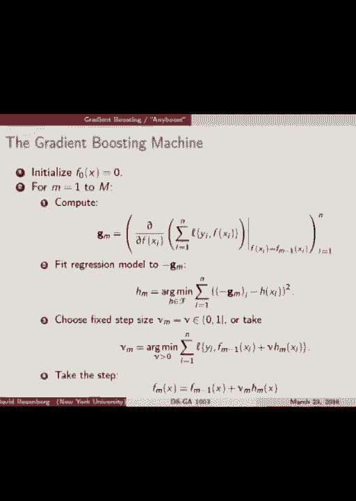
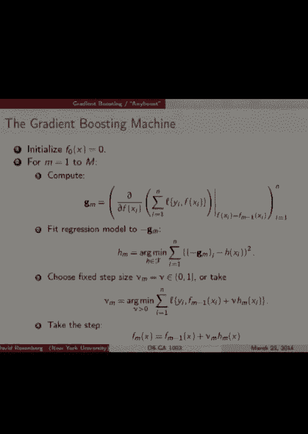
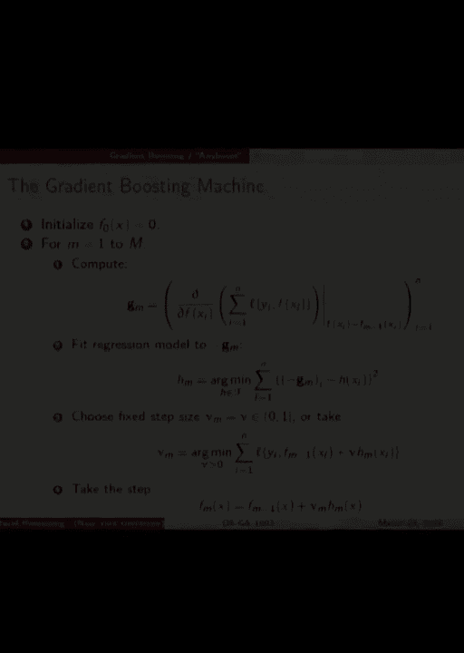

# P13：13.Mar_23_Lecture - Tesra-AI不错哟 - BV1aJ411y7p7

好吧，大家，我们开始吧。

不为你们提供保护。我希望你们度过了一个愉快的春假。今天的讲座将会是关于提升方法的全面介绍。我们将从两周前开始讲的“Ada Boost”讲起，但我们会回顾一下我们所讲的内容，因为已经有一段时间了。我们将首先把“Ada Boost”作为一种算法来介绍，这就是我们开始讲的方式。

感知机方法被提出时，是一种迭代方法，类似于如何计算这个预测函数的食谱。我们将以这种方式开始介绍“Ada Boost”，并且我们将逐步了解它，看看它是如何工作的，确保至少从直观上来说，我们能理解它。然后我们将介绍一种新的建模方法，叫做“Forward Stage”。

“Wise Additive Modeling”，我们会发现，“Ada Boost”正是这个新框架的一个实例，而这个新框架对我们来说更为熟悉，我们可以从损失函数的角度来理解它，谈论最小化，迭代最小化算法。因此，以这种更熟悉的方式重新框架“Ada Boost”将会很有意义。

然后我们将进一步推广到一种叫做“Greedian”的方法，它将允许我们从“Ada Boost”正在最小化的损失函数，转向更一般的损失函数。今天我们继续讲这个话题。所以我们先来做一个小回顾。我们在讲集成方法，其中我们有多个模型将它们组合在一起。

我们讲过并行集成方法，比如随机森林和袋装法，但今天我们讲的是顺序集成方法。其思路是你构建一个模型，查看它在哪些数据点上表现良好，在哪些地方表现不佳，然后增加那些表现不佳的点的重要性，再构建一个新模型，试图在前一个模型做得不好的地方做好。

然后你查看这两个模型的组合，看看它在哪些地方表现不佳，你尝试修正每一步中还做得不好的部分。好吧，我们会稍微澄清一下这个问题。好吧，我们从一个弱分类器的概念开始，这是一种分类器。

我们希望至少能做得比50%好，至少比随机猜测好，针对一个分类问题。好吧，我有一些例子，在Adaboost中，设定是严格的二分类。我们的弱假设空间或弱学习器会生成硬分类，-1 和 1。所以我们现在不处于基分类器预测得分的情境中。

困难的类别。好的。那么问题是，给定这个基本假设空间，我们有一个算法可以从这个假设空间中选择一个至少比随机选择更好的 F，来进行某些训练步骤。那么我们能否以某种方式将从这个假设空间中选择的 F 结合起来，使其在训练集上表现非常好，而不仅仅是比随机选择稍微好一点？

所以，adaboost 的典型弱学习器的基本假设空间通常是像决策树，甚至是深度为一的决策桩。有时也会是线性决策函数。传统上，我们使用相对简单的假设空间来做提升（boosting），虽然这不是必需的，但似乎这样做能带来最多的好处。好的。那么，我们需要的一个概念是加权训练集。

这里，每个训练集的项都与一个非负实值相关联，我们试图最小化加权经验风险，一个加权的，损失函数的总和。我们上次讲过这个内容。所以，我们不只是计算数据点的损失平均值，而是计算加权平均值。

我们需要一个，所以我们要么需要一个可以选择一个从我们假设空间中最小化加权经验风险的函数的算法，或者还有另一种可能性。你们还记得另外一种方法吗？

假设我们没有一个可以最小化加权经验风险的算法，但它是一个黑盒算法，我们知道它可以最小化经验风险。那么，我们上次讨论过这个，大家还记得我们可以怎么做吗？

我们再想想这个，因为上次有人想到了。好的，复制训练样本，按照什么比例？对，根据权重。所以权重是非负的。我们对每个训练样本都有一个权重。如果我们将权重归一化，使它们的总和为 1，那会变成什么？

这就像是对样本的概率分布。所以如果我们抽取我们的样本，那么我们就有了一个训练集，现在我们有了一个基于训练集的概率分布。现在想象按照这个分布抽取一个新的训练集。如果你把它做得非常大，足够大，以至于几乎每个数据点都出现。

多次出现。所以这些数据点出现的次数将与这个权重成正比，如果你抽取足够的样本。如果你把从该分布中抽取的样本加起来，基于该重新抽样分布的正常经验风险将非常接近这个加权经验风险，然后你可以将这些抽样的例子输入到你的黑盒经验风险最小化器中。

它对权重一无所知。明白了吗？好吧，春假后有些慢，但我看到了一些不错的反应。这是个好的开始。这是个好的开始。那么，现在我们有了从我们基本假设空间中拟合加权经验风险的方式，这是我们需要的东西。

这是Out-of-Boost的粗略框架。我们有我们的训练集，我们从给所有训练点赋予相等的权重开始，然后我们进入不同的回合。在每一轮中，我们使用我们的算法，拟合一个弱分类器，从假设空间中选择一些东西，应用于加权训练点。在第一轮中，它们的权重是相等的，所以没什么特别的。

所以我们得到一个弱分类器，然后我们看到这个分类器在什么地方错分了，并且增加那些被错分样本的权重，然后我们重复这个过程。发生的情况是，如果某个点被反复错分，它的权重就会不断增大。而每次我们选择一个新的分类器，它就会在那个点上做得更努力。

而且更难拟合那些曾经被错分过的点，因为它们的权重不断增大。是吧？是的。所以问题是，你在做这么多工作来纠正错误的地方，但你是不是没有搞砸之前做得对的那些地方呢？这就是。

是的，这就像是一个平衡的过程。所以你新增的分类器可能只比前一个做得稍微好一点，它在其他点上可能做得很差，确实是这样，但我们实际上会将它与之前所有的分类器结合起来。所以希望我们之前的分类器在其余数据点上的效果仍然足够强大。

这样新的东西就不会搞砸了。所以这是一个平衡的过程，我们将在进入细节时看到它发生。好的。好的，简单地说，我们从原始训练样本开始，按照通常的方式得到第一个分类器。然后，我们有一个基于错误情况重新加权的样本。

那些做错的样本的权重会更高。我们根据这些样本得到一个新的分类器。然后我们再对同样的样本进行加权，依此类推，最终我们得到M个分类器。记住，这些分类器输出的是负一或一，它们是硬分类器。并且它们都在不同的加权数据集上训练过。

那么，最后我们该怎么做呢？我们取它们的线性组合，至于我们如何具体做这件事，我们稍后会讨论。然后我们会评估这个线性组合的值。它会是负一还是一吗？不，它将是负一和一的线性组合，但不会是负一和一。它可能是一个实数，至今为止，它可以是任何实数。

然后我们取它的符号，将其转换回分类。好的。这就是大致的框架。好的。那么，这些权重是什么？这些权重是怎么回事？

我们将每个阶段的分类器结合起来。所以权重不会是负数。正如几周前有人问的那样，是否我们需要将做得好的分类器的权重加大，给它们比做得不好的分类器更高的权重？是的，在一定程度上，确实如此。所以我们会看到，当分类器适配得更好时，alpha M会更大。

加权数据好，接收到的加权数据比较小。好的。好吧。现在我们来谈谈 M 轮，一个任意的 M 轮。我们得到这个分类器 GM，它得到一个特定的加权误差。所以这里我们计算错误分类，这是一种0-1的误分类。

rate。我们不会仅仅计算错误的总和或百分比，而是根据每个例子在该轮中的权重来加权这些错误。所以如果我们在这一轮真的很努力地想要把例子 I 做对，那么它的权重就会很高。为什么会很高？因为我们在之前的轮次中一直做错了它。

所以如果我们真的很努力地想要把第 i 个例子做对，然而我们还是做错了，我们就会在我们的错误中计数更高。所以加权错误。好。所以 ERM，错误。我们称之为 M 轮的错误，错误子 M，这将会表征我们第 M 个分类器在这个加权训练集上的表现。好的。

你会注意到它在0和1之间。这清楚了吗？为什么它在0和1之间？

很明显。如果你看W I 除以大写 W，它就是所有 W I 的总和。所以 W I 除以 W，类似于一个概率。如果你把它们加起来，结果是1，它们都是非负的。所以这就像是从0和1之间做一个凸组合。所以它一定是在0和1之间。对。所以字段的实现将采用相同的错误。

对。我们把所有的 W 初始化为相同的。没错。是的。我怎么决定分类器的顺序？ [INAUDIBLE]，[INAUDIBLE]，[INAUDIBLE]，[INAUDIBLE]。[INAUDIBLE]，[INAUDIBLE]，[INAUDIBLE]，[INAUDIBLE]，[INAUDIBLE]。让我再想想，我会再回来回答你。好的？ [INAUDIBLE]，再说一遍？ [INAUDIBLE]，数据中的离群值，嗯。[INAUDIBLE]。

这可能是个问题。所以问题是数据中的离群值怎么办？我们会过拟合吗？嗯。Boosting 已知有一些过拟合问题。我们稍后会讨论这个问题。好问题。什么？

我不太把它叫做过拟合，而是说在离群值的情况下，性能不太好。过拟合我不确定。好吧，也许是过拟合，嗯。 [INAUDIBLE]，那太荒谬了。我没明白你的问题。我不打算说那句话。我不打算说那句话。我不打算说那句话。我不打算说那句话。现在我们有了一个加权训练集。

现在我们到了第二个权重集。现在我们拟合以最小化加权损失，加权经验风险。你明白了。我们只需要回顾一下。然后我们得到第二个分类器，G2。然后我们重复 G3。最后我们取一个线性组合。现在我们说的是这些分类器的非负组合。

那将是预测真实数值，得分。然后我们取符号来得到分类器。我们有一个加权训练集。只有两个权重，因为我们有两个。它是加一减一。只有两个权重，是否就是项的符号？

在第一轮，你是正确的。在第一轮中存在对称性。每个点要么被正确分类一次，要么被错误分类一次。如果我们根据是否正确分类来重新加权，那么你是对的。第二轮中的每个点会有两种权重，但在第三轮中就不一样了。

有些东西被正确分类了一次或两次。事实证明，这不仅仅是它被分类了多少次，还与分类器在该轮次中的表现有关。你是怎么做到的？

那完全取决于问题。问题是，你如何最小化零错误的比率？

我给出了——所以是第一版。我们通过对数据进行加权重新采样，将其简化为最小化常规零一错误的情况。我不知道你是否在那部分在场。通过按权重比例重新采样的方式，第一版将其简化为最小化零错误。

你可以说我们不知道如何最小化零错误，这个说法是对的。你不必最小化——你可以目标是最小化零错误或分类错误的权重。但你真的只需要做得比随机猜测更好。调整分类错误的权重吧？

只是一个弱分类器——是的。只是一个弱分类器，对吧？

我们将按每一轮的情况查看具体的加权量。我们会看到所有被错误分类的数据都会按相同的因子进行缩放，具体缩放的因子依赖于轮次。权重——也就是它被乘以相同的量。我们为什么不看一下接下来的幻灯片，看看我们是如何处理这个问题的？是的。没错，确实如此。

它会查看每一个数据点，除非——嗯，是的。你永远不会得到零权重，所以是的。它在每一轮中都会查看每个数据点。没错。当权重变得非常非常小的时候，它可能几乎忽略某些数据点，这种情况是会发生的。是吗？

是否有可能让数据点获得零权重，以加速这些点的错误修正能力？

好的，忽略它吧。这个问题很好。我没听说过有人这么做过，但我喜欢这个想法。所以，或许你可以设置一个阈值。如果权重变得非常小，你就把它设置为零，然后祈祷它以后再也不会停止正确分类。值得一试。我不知道。好的，这很有趣。但我认为这是个正确的思路。好的。

好的。所以，来吧——你们都渴望了解实际的细节，那我们就直接进入吧。好吧。好的。那这个问题就假设已解答。那么。我们想把弱学习器当作一个黑盒。我们可以使用任何我们想要的方法。但至少我们希望有一个加权的错误率小于一半。好的？

这就足够我们所需的。好的。现在，分类器的权重，我们怎么做加权调整？就是这样。我们通过这个因子 alpha 来重新加权。这里有一个公式。1 减去错误的对数。我不完全知道——对我来说直接的意义不大，但我绘制了它，这样我们可以直接看它。所以，x 轴上是错误率。

这是总体错误——分类器的总体加权错误，对吧？

加权错误。如果没有加权错误，alpha 会非常高。而当加权错误接近一半时，alpha m 会趋近于零。什么是 alpha m？对，alpha m 是分类器的权重，记住，到最后，我们会把所有这些分类器加在一起。

分类器进入非负组合的权重是 alpha m。所以，alpha m 大意味着它获得了很大的权重。Alpha m 小意味着它获得的权重非常小。所以，如果分类器的加权错误真的很差，它在最终结果中的权重就会非常小。好的，明白了。至少形状上是朝着正确的方向发展的。所以。

现在这是整个分类器的加权。现在我们需要知道的另一个问题是，如何重新加权单独的例子，对吧？

每一轮。好的，那么我们来看看。假设 alpha m 是 gm 的权重。所以，结果是我们还会使用 alpha m 来帮助我们重新加权每个单独的例子。所以，假设 w i 是训练前第 i 个例子的权重。如果 gm 正确分类了 xi，那么权重就不变。好的。那么，在每一轮中，任何被正确分类的例子。

我们不动它。否则，我们就调整它。通过一个因子增加它。所有被错误分类的例子的权重都会增加 e 的 alpha m 次方。这就是我们的因子。好的。那么，e 的 alpha m 次方是对数，但我们也可以看看这个。所以，这是对错误分类的例子权重的调整。

好的。那么，形状是这样，唯一的区别是现在它在 x 轴上是对数刻度。好的。那么，解释一下。或者我们做个小总结。所以，每个在某一轮中被错误分类的例子，其权重都会被重新调整。是增加还是减少？增加。很好。所有的权重都会按照相同的比例重新调整。

它们可能，最终仍然会达到不同的值，因为它们起始时的值不同。但你增加它们的因子是相同的。这个因子是，没错。我知道。我们从第一轮开始，所有的权重都是相同的。假设都是 1。所有错误分类的都会按照相同的比例重新加权。所以，如果是翻倍的话。

所有错误的都按相同的比例重新缩放。是的。只有那些错误的在每一轮都会重新缩放。没错。所以，如果我们一次性开始，有一个特定的例子在每一轮都被正确分类，它就保持在一。是的。所以，如果它是一个变量，我们不想考虑它有多大。

不，没错。没有，所以，问题是。假设我们有一个基础分类器，它不仅仅输出负一和一。这个问题高度限制于硬分类器。所以，假设空间中的函数没有给出分数。

它只是加一或减一。你可以问，假设我们的假设空间给出了具有置信度的分类器。我们可以利用这一点吗？

是这个问题。我认为我们可以，但不能仅仅从提升方法（boosting）中得出结论。它不是来自 boosting。是的。是的。[听不清]，我们的重缩放会增加误差。我不确定它是否能更清楚一点。所以，你是在重缩放数据点的权重。那么，是什么的误差呢？

我们的目标是提出一个函数，在这一点上，我们的目标是找到一个最小化整体训练误差的函数。没错。我使用数据重缩放作为过程的一部分来最小化训练数据的误差。没错。所以，我认为这个问题基本上是，这个方法到底有效吗？

[笑声]，礼貌地提问。我们稍后再回到这个问题。好吧。好。[听不清]。我说过高权重对应低误差吗？好吧。所以，如果——好吧。所以，低误差，高权重，给我解释一下是什么？所以，误差是指某个特定分类器在第 M 轮的加权误差。是吗？好吧。我以为你在重新审视训练数据。我们——是的。

我们通过 FEM 来加权分类器，这就是它在加到分类器的总和之前被乘上的权重。所以，存在对单个分类器的加权。这是其中的一部分。然后，在每一轮中，我们还会重新加权样本。而有趣的是，我们重新加权样本的系数与我们用来乘以分类器的系数相关。

我们使用 Alpha M。Alpha M 涉及到两种情况。是吗？[听不清]，好吧。我们能不能将 Alpha M 用作分类器的置信度分数？

Alpha M 与它在加权误差上的表现相关。所以，在——它是——某种性能度量。它可能只与最终分类器的帮助程度有些模糊关系。但是——，[听不清]，没错。[听不清]，这听起来像是“为什么这个方法有效”？

"问题。我们稍后再回到这个问题。让我再讲几个幻灯片，然后我们再回到这些问题。好吧。所以，这里是整体算法的概览。我们之前讨论的所有内容。所以，我认为我们不需要在这上面停留太久。这里有一个小插图。所以，我们从——我们的输入空间是——一个大小为一乘一的框。

我们有两个类别，红色和蓝色。我们有——这是我们的第一个分类器。经过一轮后，你认为我们的基本分类器——我们的基本假设是什么？什么？阈值函数。是的。好的。决策树桩。这看起来像是决策树桩。树桩是一个树，只在一个地方分裂。

在这里，我们在 x 轴上分割在任意点——负点一或其他什么地方。左边我们预测红色，右边我们预测蓝色。颜色的黑白代表了我们对每种颜色的分数有多大。好的，让我们再来一轮。会更清楚一些。好的。那么，这里发生了什么？

现在——所有的点大小都不一样。大小代表了什么？

这是这一轮的权重。好的。所以，经过三轮后，这个位于蓝色区域正中央的红色点权重大，因为它一直被错误分类。所以，经过三轮后，这个点的权重很大。好的，这些在红色区域的点且被正确分类的权重则相对较小。

它们就像小点。好的。我们一直说权重保持不变或变大。那么，这里重新缩放了它们，以免它们变得过于庞大。这些是最小的。在我们的版本中，这就像——它们仍然会保持在权重一。但在这里我们进行了重新缩放，以保持它们的比例。好的。那么，这是最自信的红色。

分数是最大的，然后喷射的是中等分数。然后这个白色是——另一端的分数。最终的阈值由这条黄色线给出。好的。关于这张图有什么问题吗？那么，让我们再看一轮，或者说在 120 轮后，你会看到——决策值变得相当复杂。

这比单一的决策要复杂得多——好的。所以，这是一个决策树桩，通过这些的线性组合，我们得到了一个更复杂的边界。在这里，我们得到了一个相当复杂的情况。好的。然后你会看到蓝色。现在蓝色的点非常大，因为它们已经——现在这些蓝色的点深入到了红色区域，并且它们一直被错误分类。

好的。怎么样，大家对这个图像的理解如何？好。让我们澄清一些事情。好的。[听不清]，哇，那个问题很好。那么，我猜它没有——我猜它已经有足够的次数没被正确分类了。但——那是个好问题。对。[听不清]，是的。[听不清]，是的。那么。

我觉得你说的没错——我觉得你说的对——假设你能准确匹配它。我不知道我是否有一条足够好的线来表示这一点。我没料到会有如此深入的检查。但假设确实如此，看看这个小黄色的东西，那就是在改变类别。所以，这是——我不知道。你会说我看起来像是过拟合吗？好的。好的。那么。

我有其他方法可以解决过拟合问题。但是你们现在有任何想法，如何用这种类型的算法防止过拟合吗？

限制——哦，限制迭代次数或轮次的步数。是的，我们可以在某个点停止运行这个过程。也许可以用验证误差来判断，行了，够了，我们变差了。好。好。好。那么，现在我们来到了你们的问题。所以——到目前为止，整个课堂的内容。

我们已经看到了——我们做的主要事情是将问题设置为凸优化问题。比如我们有 L1 正则化、L2 正则化、SVM 以及这些方法的核化版本。而且，你知道，这些都是凸优化问题。你只要用任何合理的优化算法，就会找到正确的答案。最终。这些方法都非常好。然后我们有了树。在树的领域。

我们知道我们想做什么，只是不知道在算法上到底如何实现。所以我们描述了这样一个启发式过程：先构建一棵树，再将其修剪回去，结果人们发现这样做效果很好。你在从树的假设空间中选择某个东西。没有证明。事实上，我们并不知道如何找到最好的树——最好的假设空间。

所以——不过无论如何，我们有一个优化树的算法。我在这一点上想表达的是其他内容，但没关系。所以，AdaBoost 是一种新的方法。就像我之前提到的那样。它有点像感知机算法。所以我们必须问一个问题，像这样，它会最小化训练误差吗？此时。

这是目标。最终，我们希望它在测试误差上表现得很好。但一开始，我们需要它在训练误差上做得合理。所以有一个定理。它并不难，但讲解起来太长了，可能会把它作为一个可选的作业问题。只要有一些指导，其实不难。所以它在相当小的假设下是成立的。好。

所以这是我们需要的。我们需要它成为一个真正的弱分类器。所以我们需要它的加权误差小于一半。于是我们定义了一个叫做边缘的术语。分类器的边缘描述了它比随机表现更好的程度。所以它就等于一半减去这个值。所以现在我们想要一个大边缘。大边缘是好的。大误差是坏的。

大边缘是好的。所以它衡量的是像 GM 这种比随机表现更好的程度。那么这里有一个定理，我们稍后会试着弄明白它的意思。这个定理是经验性的 0, 1 风险。这是原始的误差，而不是加权误差。这正是我们在训练中想要最小化的东西。

经验性的 0 风险，来自于哪个分类器 GX。GX 是什么？

这是个非负的单个分类器的组合。每轮的加权分类器。所以就像是 alpha 1 G1 加上 alpha 2 G2，直到我们运行的轮数为止。那么这里左边是什么？这是训练数据上的风险，基本上是错误百分比的平均值。它被这个积所限制。

那么它是什么？它是关于 gamma m 的。Gamma m 是单个分类器的优势。那么你认为大优势应该更好，对吧？大优势远离随机。所以这个值很大，但如果这个值很大，这个值会变小，而且我们在乘一堆小的值在一起，所以它很小。所以当 gamma 很大时，这个积会很小。

这很好，因为我们希望，那个是误差。它限制了左边的误差。我们来看一些例子。好的，假设加权误差在所有轮次中都小于 0.4。只是看看它长什么样子。那么优势是 0.1，因为我们比 0.5 好多少。然后我们得到误差率被限制为 0.98 的 m 次方，限制为 0.98 的 m 次方。所以很好。

所以如果 m，m 越大，我们运行的轮次越多，那个值会呈指数级下降，下降得非常快。0.98 很差。如果我们只运行一轮，那就不是一个好的界限。但如果我们将 0.98 自己乘很多次，那就会变成 0。所以如果我们运行 100 轮，界限是 0.133。200 轮，0.018。好的，所以上界呈指数级快速下降。我们继续。好，继续。

所以我做了一个大的假设来画出这个图，来得出这些数字。我做的假设是什么？我假设误差总是小于或等于 0.4。所以如果我能做到这一点，这是结果。那么你可能会问，嗯，你的问题是，这适用于所有的假设空间，对吧？好吧，好吧，不是。假设我们有一个假设空间，

对于这个假设空间，我们根本无法获得任何优势。我们做得比随机猜测还要差。嗯，那么我们就不能有这个误差从 0.5 远离的界限，也许我们也无法获得指数级下降。所以另一个问题是，好，假设，好的，测试问题。假设优势是，或者假设误差被 0.4 限制。

我们是否总是能够在训练集上得到 0 的误差？所以，是的。这是提议，我同意。只要如果优势总是，如果误差总是远离 0.5 的界限，那么我们总是会在上界上看到指数级下降。最终误差会降到 0。并且会准确地为 0，对吧？

因为在左侧，这个值将无限接近 0，最小的非零值，左边的值最小可以是多少？最小的数字是多少？

左边的东西可以是大于 0 的 1/n，对吧？所以在右边。最终会小于 1/n，这会把左边驱动到 0。所以如果我们总是能保证误差小于一半，严格小于一半，那么，右边的值会始终趋近于 0。所以这应该告诉你，如果你有一个没有骗子的训练集……

对于那些，无法通过某种线性组合来分隔的红色和蓝色的点，所以如果你的假设空间做不到，如果你在假设空间中进行的线性组合无法分开数据，那么你就不可能得到零训练误差，这意味着你不可能总是没有误差。

小于一半，给定回合的加权误差总是小于一半。对此有任何问题吗？是的。[听不清]，是的，所以问题是我们能使用什么分类器？是的。Boosting 基本上会使用一个黑箱分类器，最好是能够处理……

加权训练数据，但如果没有，你就需要使用采样技巧来利用它。但没错，从算法上讲，你可以使用任何你想要的分类器。要使这个定理起作用，没错。问题？[听不清]，所以问题是，为什么人们会使用这些简单的分类器，而不是一些更复杂的？好吧，我认为经验性的原因是它们通常能很好地工作。

人们做过实验，像 SVM 这样的分类器，你可以从增强 SVM 中获得一些好处，但没什么特别激动人心的。我们工具箱中有哪些分类器是我们可能想要使用的？对，我们有这些线性分类器。所以这就不是那么令人兴奋，只是线性组合的线性预测。

函数。决策树很不错，因为它们具有这些很好的非线性特性。[听不清]，是的。[听不清]，是的，重点是，如果存在泛化误差的概念，也就是你在测试数据上表现得如何，相较于你在训练数据上的表现，且你的基础类越复杂，那么，你更有可能面临较大的泛化误差。

所以，复杂性更大，你知道，过拟合本质上。所以是的，这是一个很好的观点，随着你增加假设空间的复杂性，那么，你有可能会过拟合，但实际上，不管怎样，我们会进行早停。或者其他方法，所以我们其实不会真的过拟合，对吧？这只是一个不同的权衡。

就是这样——，[听不清]，是的。是的。[听不清]，图片吗？当然。[听不清]，当然。[听不清]，[听不清]，[听不清]，我们减少错误的原因是因为我们有更多——。[听不清]，所以问题是，为什么——好吧，为什么我们在三轮之后做得比一轮之后更好？

这是其中一个问题。好吧。我们能在三轮之后比在一轮之后做得更好的原因之一是，因为通过取这些决策树、决策桩的线性组合，我们得到一个更复杂的边界，而这个边界是无法通过决策桩表示的。因此，三轮之后我们的有效假设空间比一轮之后要大。

所以这是——到了第三轮，它只是一个更具表现力的假设集合。是的。[听不清]。所以问题是，运行三次分裂的决策树时，我们会得到相同的边界吗？

[听不清]，不，不，不一定。因为你可能会问，是否是同一个——其中一个问题是，是否是你选择的假设空间相同？你可以说，三轮提升后，所有可能得到的决策边界，是否和所有拥有三次分裂或三节点的决策树集合相同？

[听不清]，也许吧。我不确定。但——[听不清]，嗯。但没有哪种最小化方法是精确的，对吧？对于树，我们有一种近似方法来找出正确的树。Adebust是另一种方式来得到这个集合中的假设。

即使假设空间相同，我们选择它们的方式也不同。所以，假设空间是否相同是一个有趣的问题。但无论如何，Adebust和直接选择一个那个大小的决策树是两棵完全不同的树。你最终会得到——是的。[听不清]，你肯定不会得到相同的树。

问题是，三轮提升之后的假设空间——使用决策桩的假设空间，是否与某种类型的决策树相同，而这个决策树是你可以轻松描述的？

也许吧。酷。好的。好吧。我会给你们展示一些快速的问题。好的。提升的一个奇特性质是，人们常常——大约十年前，这曾是一个谜。所以，当我们通过多轮运行Adebust时，你会期待的情况是，当轮数增加时。

你的训练误差会下降，下降，再下降，也许在这种情况下达到零。测试误差会达到最小值，然后再上升。所以人们在实践中经常发现，实际上情况并不是这样。他们发现，训练误差可能会下降，但测试误差继续下降。

这挺有趣的。所以他们有一些关于这个的解释，虽然它们超出了这门课程的范围，但这是像基础机器学习课程那样的主题。我不知道他们是否会涉及这个具体的主题，但这是机器学习中的一个有趣话题。提升——Adebust有这种不寻常的性质。但其中一件事告诉你的是——我们将会回顾这个——在Adebust算法中发生了一些特别的事情。

记住，Adebust就像一个配方。接下来在这节课的第二部分，我们将展示Adebust实际上是以某种方式最小化一个特定损失函数。我们知道的是，如果你只是最小化一个假设空间的损失函数。

这不是典型的行为。所以Adebust在最小化这个损失函数时有一些特殊之处，这也给我们带来了这种有趣的行为。好了，我们休息一下，十分钟后见。[叹气]，好。[叹气]，你能用些什么吗？

人们通常使用树。是的，你必须决定。[叹气]，不常见。[叹气]，[叹气]，[叹气]。[叹气]，[叹气]，[叹气]，[叹气]，[叹气]，[叹气]，[叹气]，[叹气]，[叹气]，[叹气]，[叹气]，[叹气]。 [叹气]，[叹气]，[叹气]，[叹气]，[叹气]，[叹气]，[叹气]，[叹气]，[叹气]，[叹气]，[叹气]，[叹气]。[叹气]，[叹气]，[叹气]，[叹气]，[叹气]，[叹气]，[叹气]，[叹气]，[叹气]，[叹气]，[叹气]，[叹气]。

[叹气]，[叹气]，[叹气]，[叹气]，[叹气]，[叹气]，[叹气]，[叹气]，[叹气]，[叹气]，[叹气]，[叹气]。[叹气]，[叹气]，[叹气]，[叹气]，[叹气]，[叹气]，[叹气]，[叹气]，[叹气]，[叹气]。[叹气]，[叹气]，[叹气]，[叹气]，[叹气]，[叹气]，[叹气]，[叹气]。[叹气]，[叹气]，[叹气]，[叹气]，[叹气]，[叹气]，[叹气]，[叹气]，[叹气]，[叹气]，[叹气]，[叹气]。

[叹气]，[叹气]，[叹气]，[叹气]，[叹气]，[叹气]，[叹气]，[叹气]，[叹气]，[叹气]，[叹气]，[叹气]。[叹气]，[叹气]，[叹气]，[叹气]，[叹气]，[叹气]，[叹气]，[叹气]，[叹气]，[叹气]，[叹气]，[叹气]。[叹气]，[叹气]，[叹气]，[叹气]，[叹气]，[叹气]，[叹气]，[叹气]，[叹气]，[叹气]，[叹气]，[叹气]。

[叹气]，[叹气]，[叹气]，[叹气]，[叹气]，[叹气]，[叹气]，[叹气]，[叹气]，[叹气]，[叹气]，[叹气]。[叹气]，[叹气]，[叹气]，[叹气]，[叹气]，[叹气]，[叹气]，[叹气]，[叹气]，[叹气]。[叹气]，[叹气]，[叹气]，[叹气]，[叹气]，[叹气]，[叹气]，[叹气]。[叹气]，[叹气]，[叹气]，[叹气]，[叹气]，[叹气]，[叹气]，[叹气]，[叹气]，[叹气]，[叹气]，[叹气]。

[叹气]，[叹气]，[叹气]，[叹气]，[叹气]，[叹气]，[叹气]，[叹气]，[叹气]，[叹气]，[叹气]，[叹气]。[叹气]，[叹气]，[叹气]，[叹气]，[叹气]，[叹气]，[叹气]，[叹气]，[叹气]，[叹气]。

[叹气]。

