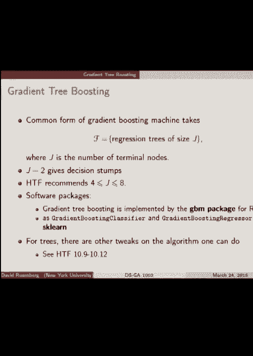
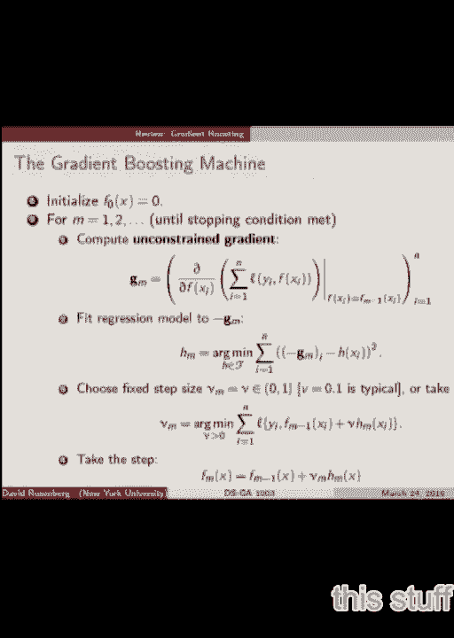
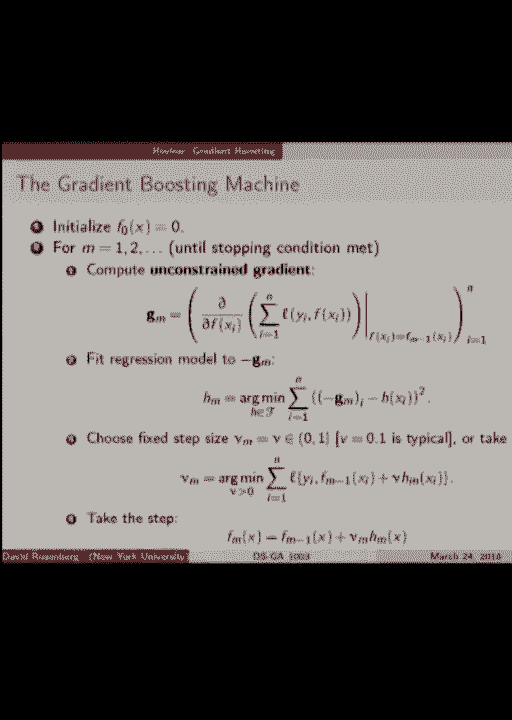
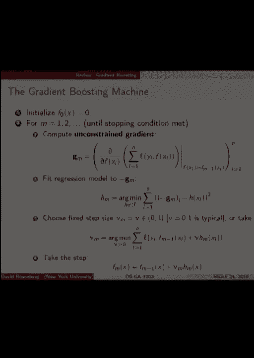

# P14：14.Mar_24_Lab - Tesra-AI不错哟 - BV1aJ411y7p7

今天的主要目标是再过一次坡度，助推，我想可能是，你知道的，可能会感激另一次通过，不管怎样，我们会有一些扩展来讨论，然后我们会提前结束，我们会把测试还给你，会被调整或弯曲，或者一些让成绩更好的东西。所有的权利，所以让我们来看看这个，这是，这是梯度增强算法，从上到下，让我们稍微过一下，我想我不必告诉你们用问题来阻止我，所以我们把一个函数初始化为零，然后我们分阶段进行。每次我们从空间后面的基础上添加一个函数，我们可能有一个步骤，就像函数空间中的一个步骤方向，我们把它乘以一个步长，所有的权利，所以这个，主要的第一步，是不是这个东西突然看起来比我们上次看到的要复杂一点。但这是一回事，我们就，让我们稍微研究一下，所以这将是，它是一个偏导数的向量，我们对函数的预测进行偏导数，f在训练示例上，我们通常会把它叫做y i hat什么的，我们要做的是。

我们想看看我们如何直接调整对输入的预测，减少损失，所以如果你想在当地看看，如何调整预测以最佳地减少损失，你求导，所以我们对TH上的预测进行偏导数，例子，这就是这个偏导数，清楚了吗，好的。损失的偏导数是多少，现在所有数据损失的总和，当然，当我们对和进行偏导数时，会发生什么，它是n项的和，它们中哪些与这个特定的偏导数有关，只有一个是对的，其中唯一一个以总和结束，这与关于x的f的偏导数有关。我是涉及第I个例子的那个，所以它只是损失函数的导数，这是第二个论点，好的，这是一个例子的偏导数，我们把它们叠成，好的，当你求导时，还有一件事，你在一个特定的位置求导，对呀，我们有一个功能。我们在一个地方，我们想知道那个位置的梯度或导数是多少，所以这不仅仅是说，哦，我们求偏导数，我需要告诉你我们在哪里求偏导数，我们在哪里评估，这就是我们在迭代迭代优化中的位置，也就是f乘m减1。

所以在每一步，我们在每一步的末尾，我们有一个，在m步的末尾，我们有一个预测函数，f减去m所以这里，在m减去第一步的末尾，我们有这个预测函数，f减去m减去1，这就是我们求导的结果，对呀。这是我们现在的预测，从输入x的f减去m减去1，我想知道如何调整头寸以最大限度地减少损失，这就是我把部分右移的地方，所以它是关于评估的部分，从m减去第一回归函数的预测是那么清楚，所有的权利。我们把偏导数堆叠成一个向量，即梯度，关于预测，所有输入示例上的矢量摩擦力，培训实例，我们称g，sub，m为第n步的梯度，所有的权利，所以如果我们做一个无约束的优化，我们的渐变，我们的步进方向是负的。g小于m，好的，所以g和m只是一个向量，我们真的在优化，我们在调整一个函数，所以我们在f减去m减去1，我们想采取一个步骤来改进功能，我们需要给它增加一个功能，好的，在此设置中，此函数必须位于何处。

我们需要什么函数空间这个新函数，我们加f减去1，是啊，是啊，它必须在基本假设空间，所以说，我们如何在基本假设空间中找到一个函数，这至少尽可能接近无约束梯度，我们想要的负梯度步长方向，是啊，是啊。我们可以写，这有点像我们想找到的投影，下面是我们要在假设空间中求函数h的步骤，基本假设空间f，这是我们能找到的最接近梯度向量的近似，这就是真正介入的方向，最小值在函数空间中，这是一个函数。它是我们可以添加到f subm的东西，当我们加一些h，subm到f，subm，减去1，我们还在基本假设空间的范围内，这是一个这是一个很好的，那是我们可以利用的方向，最后一块是步长，嗯，你知道一个典型的。你只是有一个固定的步长，零点一实际上是一个典型的乘数，你经常会发现，理论上，您可以进行行搜索，在那里您可以找到最佳的步长，好的，大问题，所以问题就在这里，我们在这个目标函数的函数空间上有一个最小化。

我们能说什么来确定这是独一无二的吗，你觉得什么是凸的，功能正常，所以目标函数是凸的，好的，所以好吧，大局观，别管这个了，有一个独特的最小化器，我们需要一个严格凸的优化问题，所以它必须有一个，严格凸目标。当然是凸出来的，有一个凸起的，多曼f必须凸函数空间，然后我们需要这个目标是严格的，所以可以保证，但是但是我们没有这样的限制，这个算法不知道是否有唯一的最小值，我不知道，很有趣，它没有。我看不出这有什么关系，你有什么想法吗，为什么这会是一个问题，好的，关于这个算法的更多问题，现在是问的好时机，我有几张照片，是呀，GM是一个向量，GM是一个向量，矢量有多大，向量有训练点就有多大。GM的每个条目都是对I的预测的偏导数，第1个例子，我们想看看如何调整i预测以最佳地减少损失，所有的权利，这里有一个，这可能对你有帮助，这就是我们所看到的，这里有一个r的曲面图，f的r是风险。

这是损失的总数，经验的，培训损失权，域是这两个轴，x 1的f和x 2的f，所以我们有一个预测函数，但我们只看了它对两个训练点的预测，x1和x2，假设训练集是2号的，当我们调整对每一个输入的预测时。x1和x2，所以这是这平面上的不同点，这里，我们有不同的相关风险，这就是我们看到的表面，所以我们从这个角落的一些功能开始，在x 1和x 2上的值预测，我不认为这是一个单位正方形，可能是一个一个。而且风险相当高，然后我们把它看作一个二维优化问题，最初，我们只需要找到这个空间中的梯度，这给了我们最陡峭的坡度，最陡的上升负梯度是最陡的下降方向，所以我们要往这个方向走然后这个然后这个，但当然。采取这些步骤与停留在我们的假设空间不一定兼容，基本假设空间的增量，所以我们所拥有的是，这将是第一个梯度步骤，我们投射它，我们离开屏幕了，我们把它投射到基本假设空间，所以这将是我们实际采取的步骤。

这将是假设空间中最接近这个无约束梯度向量的，所有的权利，所以回顾一下，你需要什么，你用渐变增强得到什么，我们有一个损失函数，我们需要能够取某种导数，的次梯度，我们需要选择一个基本路径到空间进行回归。我们还需要一个算法来解决回归问题，平方损失的假设空间，我们将有一个停止标准，我们采取了多少步的提升，我们需要一个步长方法，仅此而已，所以如果你有所有这些输入，你准备好出发了吗，对于这个算法来说。它是一种即插即用的，这几乎是我们最先进的，我们在，让我不要只说最先进的，让我说说人们在实践中实际使用的，如果您想要一个有效的非线性回归或分类器，在许多从业者的名单上，梯度提升肯定是很高的。所以这是一个很好的关于随机森林的知识，也是，嗯，好的是，它们可以有很好的梯度，增压可适应任何损耗功能，就像我们说的，在实践中，就假设空间而言，我觉得，认为绝大多数用例都是树，作为基本假设空间的回归树。

我们一会儿会更多地介绍这些树，所有的权利，如此伟大，所以树是主要的用例，它们是什么样的树，深树是浅树，他们在浅水区，嗯，大小为j的回归树的SO假设空间，其中j是终端节点数，这是衡量树复杂性的一种方法。终端节点数，测量二叉树的树的复杂性的另一种方法是什么，是呀，高度，深度，对呀，叶子的数量是这个终端节点是叶子，是啊，是啊，好的，如此不同，如果你有一个，你知道一个梯度树增强算法，其中一个参数可能是。您希望在基本假设空间的树中有多少叶节点，或者它可能会说，在基本假设空间中，您希望允许树的最大深度是多少，这些是树增强算法的调优参数，那么形式是什么，你们自己想一想，最终预测函数的形式是什么。如果我们用决策树桩作为我们的基本假设空间，所以说，任何一种梯度提升都将是我们基础的线性组合，假设函数，所以我们会有，你知道阿尔法的和，让我不要那样写，所以第一个可能是alpha，我想我们的特点是。

假设我们有d个特征x 1到x d，那么决策树会是什么，决策树桩，回归函数，看起来像，所以这将是，你可以把它写成你的指示器，在决策树桩中获取一个分裂变量，所以x小三，例如，小于或等于2。5。所以阿尔法一号，所以这将是决策树梯度提升的一步，决策树桩权，我们再加一个，所以让我们，让我们把，做一个实际的数字，好的，减去1等于，加6。8 x减去1小于等于5，所有的权利，所以这就是形式。我想让你注意的一件事是，你永远不会有任何互动，在具有决策树桩的特性之间，记住之间的相互作用，记住我们的特色，我们谈论过的讲座，有时您需要有输入功能，以某种方式相互作用，比如两个特性或布尔特性的乘积。你想说这不是，你不能只是添加功能，如果你想的话，就像我希望的那样，这个词以y结尾，它大写了一点，可能好吧，所以如果你想让两个二进制特征的交集，你不能用决定树桩来做到这一点，因为你只是在不断地添加。

你可以说服自己更像一个或不是一个，因此，如果您想在特性之间的交互中有连接，如果它们在基本分类器中还不存在，当你加速时，你不会得到它们，因为所有的助推，就是把基本分类器中的东西进行线性组合。所以只是为了重申你，不要在功能之间获得任何新的交互，通过增强相互作用必须已经存在于你的基本假设中，我们的书，我们的教科书推荐四到八个是，拜托了，你应该意识到的重要一点是的，有人想试着解释它吗。我需要让我的声音休息一下，你必须喜欢做那个，当然啦，而不是，我说的是连词，让我们把它变得更容易，记住我们做身高和体重的时候，就像大身高，我们得看看身高和体重之间的关系，看看这是否不正常。所以某种互动就像你的身高，乘以你的体重，你永远不会得到这种形式的表达式，如果你所有的条款都是关于，身高小于a，体重小于b，你永远无法得到捕捉的东西，关于H和W的乘积，所有的权利，是呀，你的方式为什么。

什么，为什么得到Boosting效果更好，因为你实际上包括了任何交互，这就是为什么，是啊，是啊，所以这只是决定的树桩，这是一个深度的，只有一个，我一定在想为什么这对，特征之间有相互作用，好的。所以让我换个说法，就像在任何情况下，你可能真的想使用决策树桩，而不是更深的树，它可以表达更多的交互，你认为哪个更好，有更多的叶节点，是啊，是啊，好的，是呀，当然，如果你。如果您的基本假设空间有四到八个终端节点的树，这当然是一个更有表现力的基本假设空间，所以你可以，是呀，你可以拟合更复杂的决策函数，这是正确的，为什么你不想，我不喜欢。为什么这种方法比仅仅创建一个单独的决策更可取，分开，因为在决策树中，特性之间有交互，但在本例中，您可以看到，好的，所以说，你的意思是，我为什么要做决策树桩的推动，与单个决策树相比，嗯，他们不一样。

所以有了决策树，你可以得到一些很好的交互，假设你有很多，假设您有一个特性空间，那是5000维的空间来触摸所有这些特征，你需要一个巨大的决策树，每个决策节点不能接触一个以上的功能。所以你必须有一个非常大的决策树，甚至看看所有这些功能，所以说，可能不是好事，要找到最好的大型决策树并不容易，因为我们贪婪的搜索程序，这个决策树如何在特性之间进行交互，是呀，因为一旦我们的数据是，是啊。是啊，这是我们在树树讲座上谈到的一个想法，你可以这样做，是呀，你可以，你可以建造你的树，然后查看终端节点，基本上是引入新的特性来捕捉交互并提供，例如，变成线性模型，不过没关系，那不是，这不是你的问题。你的问题是，如何从决策树中获得交互，好的，我就让它过去吧，所以你在做什么，你是否喜欢停下来。

你为什么要这样。

决定的反面就像，而不是想象，去那里，更像是，然后嗯，我是说，有时你想要和或，你知道这是，你知道吗，如果你是，你就很好，嗯，如果你是坏人，你就是坏人，就像你可以，任何一个都是积极标签的标志。而不是负面标签什么的，好的，所以首先，当我们谈论渐变时，促进个人，基分类器现在是回归函数而不是分类函数，所以我在这里的例子是，嗯，他们是连续的，不消极，一加一，他们是真实的。决策树桩给出了一个特定的数字，像两点三或者零什么的，尽管在实践中，这实际上可能不是一个很好的例子，因为一个决策树桩实际上会有两个，可能是非零值，比如往左2。3往右1。5之类的，会是一个更典型的。更有可能是一个决定的东西，所以我会想象它，我们能看看这张照片吗，所以让我们这里有一些数据，所以地面真值函数是SINC函数，设置输入空间是真实的，这是x轴输出空间，动作空间是y，这是我们生成数据的y轴。

就是这些圆圈，这是我们的训练数据，而真正的东西是SINC函数，大家可以看到，上面有嘈杂的数据，所以让我们用一个回归树桩来适应这个，好在左上角，这就是这里发生的事情，所以好吧，在这种情况下。它实际上是左边的零，但不一定是，这里是向右十二点，这是一个单一决定的契合，现在一切都好，我们现在做十个，如果你数一下有多少变化，你就可以看到，好像有十个，因为我们刚刚加了十个树桩。所以这就是为什么你想把决策树桩加在一起，这样你就可以更好地近似一个函数，这是五十，这是一百个，我们可能开始过度适应这里，很难说出这个答案，你的问题，所有的权利，嗯，我想让你们看看这些的形状，嗯。决策树桩的线性组合，所以你可以看到它仍然有分段不变的性质，所有权利，所以我们讨论的另一件事是我们有什么变量，我们有什么梯度增强的参数可以调整，没有很多，有台阶大小是其中之一对吧。

所以人们发现你总是用更小的做得更好，你几乎总是，你通常倾向于用更小的步长做得更好，你只需要按比例等待更长时间，所以这里有一张照片显示了这个，所以在左边我们看的是训练错误，在右边我们看到的是测试错误。x轴上是助推的轮数，我们正在运行的权利，所以每次我们添加一个新功能，我们向右移动，四条不同的曲线对应着四种不同的步长，阶跃乘数，所以λ等于1就像全梯度步长和零点，五是一个相当慢的步骤，当然。训练误差总是减少的，但在右边我们有一些有趣的东西可以看，所以首先lambda等于1，那是实线，它没有达到其他人的低水平，所有的权利，所以也许它走得太快了，以至于它通过了最佳空间，过快地开始过度适应。好吧，其他三种伸展基本上是相同的最小值，所以这很好，但你会注意到这是虚线，也就是五个，所以比较慢，但不像其他的那么慢，它很早就达到了最低限度，但之后很快就合身了，所以你必须在正确的位置抓住它。

而其他人在低位停留的时间更长，所以还有更多，你抓到最低限度的机会更大，使用验证集，您可以将步长设置为您愿意等待的最小步长，因为如果你把你的步数减半，你必须采取，你大概知道，您希望采取大约两倍的步骤。所有的权利，我只是想再提几个关于助推的变化，实际上用于梯度增强，让你对事物的范围有一个感觉，您可以根据最新的实现进行更改，所以有一些东西是在梯度增强后不久引入的，称为随机梯度增强。这个想法有点像梯度下降，而不是看你的完整数据集来计算你的渐变步长，你看一个随机的子样本，所以无论出于什么原因，人们倾向于使用更大比例的数据，比我们用于随机梯度，所以50%的数据集大小是典型的，嗯。它被称为袋分数，有点和装袋有关，那么你为什么要这么做有两个原因，一个是它更快，你看到的是一半的数据，如果50%是你的包分数，所以你在一半的数据上优化的任何东西都应该是大约两倍的速度，也是。

它是一个调优参数，转正，所以你可以想象，如果你有一个小得多的数据，你在每一步中都在看，你不太可能过度适应，所以在某种意义上，它是一个正则化参数，你可以调整，如果你不能低于百分之五十，尤其是在这种情况下。对我来说，直觉上有大量的数据集，不应该用百分比来指定，应该根据您使用的数据的某个绝对大小来指定，相对于问题有多复杂，如果有人想尝试小袋分数，我很有兴趣看看会发生什么，好的，人们在后面做的另一件事。分数基本上就像子采样行和子采样示例，培训实例，所以你也可以像我们在随机森林子样本列中做的那样，子样本特征，显然这很有效，有一个相当新的梯度增强实现或版本，叫做xgboost。它在这些Kaggle比赛中的许多顶级表现中都表现出来了，它是一个渐变增强的版本，我把报纸寄了，我想你们现在应该有背景才能理解，嗯，这真的是最先进的，似乎至少在这些比赛中，他们报告说。

从业者发现子采样列实际上是非常有效的，比对行进行子采样更有效，就防止过度装修而言，所以这可能是一个有趣的参数，对这些事情有什么问题吗，是啊，是啊，是啊，是啊，是啊，是啊，是啊，是啊。减少你的下降特征就是减少你假设空间的表现力，这是正确的，这是正确的，在随机的森林中，你也在对列进行子采样，在这种情况下，树的每个决策节点，所以它是相关的，不完全一样，但是是的，我还要谈一个概念，嗯。这有点超出了这门课的范围，但只是为了它的见鬼，你们中的一些人可能已经看到了，除了梯度下降法，一种叫做二阶方法的东西，就像牛顿的方法，然后是准牛顿方法，在某种意义上，就你必须采取的步骤数而言。它们要快得多，尤其是当你接近最小值时，或者主要是当你接近最小值时，问题是你必须计算一个黑森，也就是二阶导数矩阵，它很大，很难计算，不难计算，只是需要大量的内存，如果你想计算整件事。

所以我们可以考虑用牛顿步代替梯度，在这个梯度提升中的一步，事实上，XGBoost似乎做到了这一点，所以XGBoost有一点变化，不完全是渐变，更像是牛顿步，还有一种叫做逻辑增强的东西。你会发现这就像是逻辑回归的增强版本，但他们在做牛顿步，所以我就给你一个牛顿步的大致概念，它很漂亮，容易描述的，我想我们有了目标函数j，假设在目标函数上的某一点，所以思考它的方式是图片，二次函数。与目标函数相切的二阶函数，在你所处的位置，让我画一幅画，所以在一维，所以也许这就是你的目标函数，它几乎已经是二次方了，让我做得稍微不同一点，现在你在我们的优化中寻找假设，我们在改变x。假设我们在这里寻找，这是x次m，我们需要知道下一步该去哪里，对呀，所以如果这是梯度下降，我们会把这条线，我们说，哦，指向这个方向的渐变，我们要进入负梯度约束，所以我们只是朝着这个方向迈出一步。

然后我们用某种线搜索来计算要迈出多大的一步，我们正朝着正确的方向前进，好的，牛顿的风格是这样的，在这一点上我们拟合一个二次型，所以看起来可能是这样的不，我不希望它很像，所以在这一点上它接触到了曲线。二次曲线是这样的，所以用牛顿法，你一步到二次的最小值，与你所在的曲线相切，所以我们会走一整个牛顿步会把我们带到这里的最小值，那么这到底意味着什么，意思是我们先跳到这里来做m+，这只是一个维度。所以在一个维度中只有两个方向可以去，左或右，所以这不是那么有趣，但是如果我们在这个空间里用二维优化，我们可能有，例如，梯度是这个方向，但是如果你把二次函数的最小值放在，与我相切，也许在那个方向。所以梯度方向可能是这样的，但是这个方向叫做牛顿步，切二次曲线向最小值的方向有点不同，在那边，这就是牛顿步的方向，所以我们可以把这个，人们确实将此应用于渐变列表，事实证明，在这种环境下做牛顿步并不难。

因为黑森的所有非对角线项都是零，原来是因为，假设我们要对，黑森函数的二阶导数为，关于x j的f的票导数，所以j不等于i，所以只有x项的左项的一阶导数，现在你对xj求导，没有条款了，二阶导数为零。所以我们只有二阶导数项，如果我们对同一事物连续求导两次，所以这就是为什么二阶方法在这个目标函数中是合理的，关于牛顿法，我想说的就这些，是啊，是啊，他们论文中的两件完全不同的事情XD Boost。他们自豪地说，他们是第一个应用专栏子选择的人，到梯度提升法，它工作得很好，除此之外，另一个区别是他们使用牛顿的步进方向，除此之外，他们所做的一系列事情都与计算有关，做事很有效率。他们在如何建造树木方面非常聪明，XT Boost是一个基于回归树的梯度增强系统，我也应该说，对于任何损失函数，我认为这是极端的渐变，助推，它适用于非常大的数据，它是并行的，好好的，它被巧妙地实现了。

所有的权利，酷，所以任何彼得，这里的任何评分员都可以帮我把这些东西传递出去，考试结束了。

