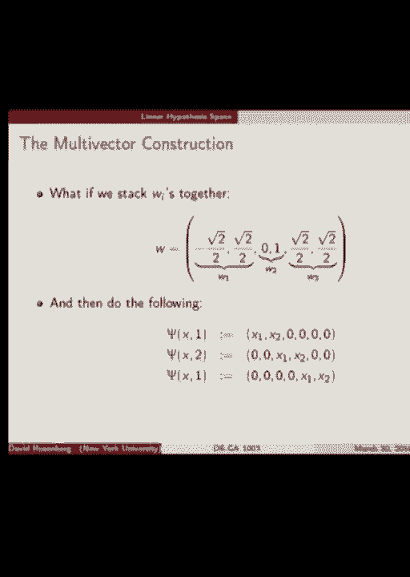
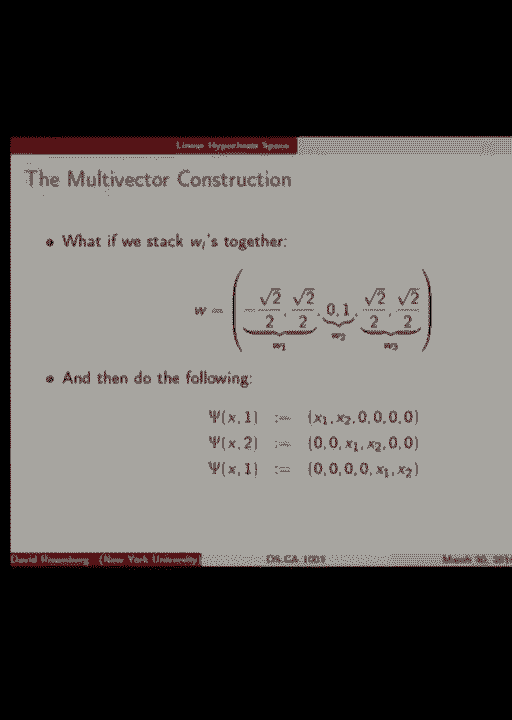
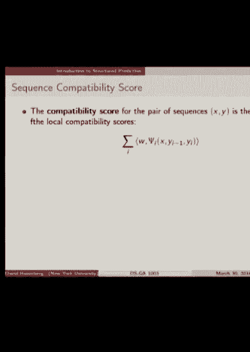
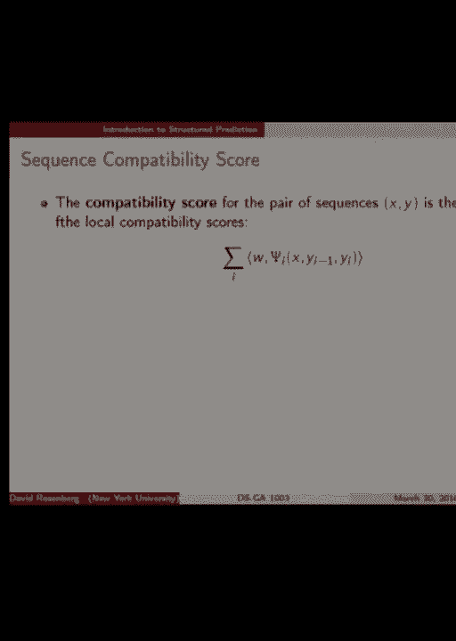
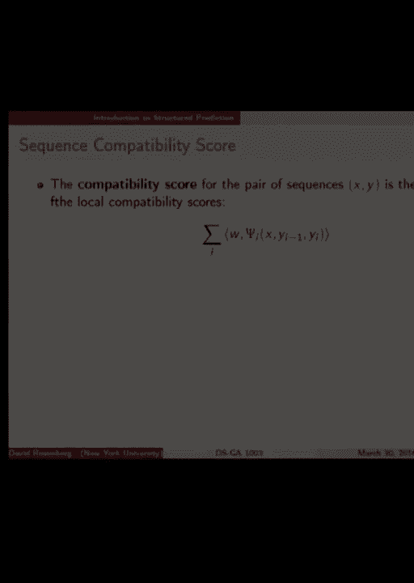

# P15：15.Mar_30_Lecture - Tesra-AI不错哟 - BV1aJ411y7p7

 All right， shall we get started？

 Okay。 So the topic， the main topic for today is multi-class classification。

 It sets the stage nicely for even more advanced topics such as structure， prediction， ranking。

 problems。 You can view them all as instances of multi-class classification。

 all the practical methods differ， a bit。 So multi-class setting， input space is arbitrary， X。

 Our output space is now a discrete set of， classes， one through K。 Initially。

 we don't make any assumptions about any relations， between the element to the output space。

 one through K。 Later， we may add some assumptions。 So far。

 our only method for attacking these problems that we've talked about are trees， decision trees。

 classification trees。 In those cases， it was very easy to make things multi-class。

 as opposed to just binary。 With trees by extension， we could do random forests。 So far。

 those are methods for multi-class。 But so today， we're going to talk about a linear method for multi-class that's really。

 designed from the ground up to be a multi-class method。 So first。

 let's talk about an easy way to get multi-class from a binary classification。

 It's called a reduction， where you take a problem of one sort and you manage to solve。

 it using a solution to another， usually simpler problem you already have。

 So suppose we have a binary classifier， how can we use that to solve multi-class？ So this。

 maybe you've seen this before， one verse all， one verse rest。 Yeah， it's a simple idea。

 So in this picture， we have three classes， plus， minus， and circle。

 And what we've done here is we've fit three different linear classifiers。

 Each one separates one class from the rest of them。 So this w0 classifier。

 w0 separates the o's from the plus of the minus。 The minus classifier separates the minus from the plus of the o's and so on。

 And then what would we do with these classifiers？ Suppose we get a new point。 Well。

 there are lots of ways to combine these classifiers。 One would be to， I mean hopefully。

 if you find a point in this space， only one of the， classifiers says that one belongs to me。

 So if you're in this area， then the only classifier that says that's part of my space is the minus。

 one。 So we predict minus。 The problem comes when you're in this area。

 So now two classifiers want to claim u， minus and o in that corner region。

 And there you have to find some way to resolve it。 Okay， that's the general idea。

 So let's write that down a little bit more mathematically。

 So we're going to take k binary classifiers， one for each class， each train to separate。

 one class from the rest。 And let's denote the k classifiers by h1 through hk。

 And they can output either hard classifications or scores and whatever they do， what we're。

 going to predict in our final prediction is， whichever classifier gives the largest score， for x。

 All right， so denote the class by i。 And we're going to look at the predictions of each of the i classifiers。

 one for each class。 And whichever gives the highest score。

 That's the one that we will use as a prediction。 If there's a tie， you can break ties arbitrarily。

 That would be a method。 Any questions on this general setting？ All right。 Okay。 All right。

 so we're going to see if this method is good。 But to get there。

 I want to refresh you guys on some intuition on how to understand linear， classifiers。 All right。

 So let's go back to binary classification case。 Suppose we have Rd， Euclidean input space。

 Our output space is negative one and one。 And our linear classifier score function is。

 today I'm using this notation a little bit， because that's what the book I referred you guys to uses is the inner part of W and x。

 Or W transpose x， same thing。 And this produces our score for the positive class and binary classification。

 Remember this？ So this is a score function and binary classification greater than zero is predicting one less than。

 zero is negative one。 All right。 Good。 And if we want to predict a hard classification。

 we can do this time。 All right。 So geometrically speaking。

 what do we know about the relationship between x and W when we're。

 predicting a plus one versus a minus one？ Say again？ So let's see。 X and W are vectors。

 So let's write idea。 Okay。 Their cosine similarity is positive。 I like it。 Let's dig into that。

 So I was thinking of buying an iPad with the pencil so I could sketch beautiful drawings， for you。

 But it。 All right。 So what do we have here？ We have W representing our classifier。

 And here's a vector x which is our input。 All right。 So what's the prediction for W and x？

 What's the score function？ The inner product of W and x。 So suppose that W is not zero。 All right。

 That's reasonable。 And let's all suppose that x is greater than zero。

 The norm of x is greater than zero。 So x is not zero。

 Then you'll remember this from some math class that the inner product of W and x is magnitude， of W。

 magnitude of x times cosine of theta。 Right？ Great。 So when is this thing greater than zero？ Well。

 magnitude of norm of W and norm of x are both greater than zero。

 So this whole thing is greater than zero。 If cosine of theta is greater than zero。

 which is what you are saying。 So when is cosine of theta greater than zero？

 For what theta is negative 90 degrees to 90 degrees。 All right。 And what exactly is theta？

 Theta is this angle between x and W between our two vectors。

 So if this angle is between negative 90 degrees and 90 degrees， then the score， the inner。

 product will be positive， the score is positive， the prediction is a one。

 So anywhere on this side of this line， what's this line？ This line is the normal to W， right？

 W is normal to this line。 This is the actual separating hyper plane represented by W。

 the separating line。 So we have our negative one class to the left of the line and the positive one to the right。

 All right。 Good refresher。 All right。 Now let's consider a three class example。

 I also could have used chalk。 So I have three classes。 I've drawn the points with little x's。

 And let's see what we can do with the one-versal classifier here。 So first。

 let's specify our base hypothesis space。 That's the space in this case that we're going to do our one-versal classifiers with。

 So we'll call， we'll use linear classifiers。 W transpose x。 Like we said， but importantly。

 know that there's no bias term。 And so this separating hyper plane will always， what？

 Go through the origin。 Always contain the origin， just like it did here。

 Zero is orthogonal to W always。 So， okay。 Good。 So what would the separating hyper plane be between one and the rest？

 You could see pretty clearly maybe look like this。

 There's our separating hyper plane between one and the rest。 And let's put the other ones in。

 All right。 So now I've drawn three boundaries。 Let's analyze the boundary for two。

 What's going on here？ So we've tried to separate two from the rest。 So W2 is pointing down。

 So which side of this blue line is classifying positive for two？ Is classifying for two？

 Below the line。 Yes。 Anything that's within 90 degrees of the W2 vector is going to be predicting two。

 So that's not great in this example because it gets every two incorrect。 On the other hand。

 it's getting all the not two is correct。 Why did it choose to put the bottom half of this plane for the class two and not the。

 other way around？ Yeah。 Because there are more examples that it's getting correct by saying the class of two。

 is below because that means the class of not two is above and it gets all these points。

 in one and three correct。 And it's not getting nearly as many points in two wrong。

 So that's how that separation occurs。 Any questions on this？ Okay。 All right。

 So let's use this as an opportunity to understand what the， what areas of this space are assigned。

 to each class， right？ So let's play our score game again。 So we need the score for a given class。

 Let's say score for class I， we have this inner product between WIX， fine。 And again。

 norm WI norm X cosine theta。 Or theta I is now the angle between X and this particular WI。

 All right。 Now we're going to predict the class that has the highest score。

 So let's make a slight simplifying assumption。 Note that the separate hyperplane doesn't change with the normal W。

 right？ So nothing will change if we assume that W is all have the same norm。 Let's do that。

 And then W is all have the same norm。 X is always the same。

 So the only thing differing among these scores is the cosine of the angle。 All right。

 So which class will we assign X to in terms of angles？ OK。 So X is class 5。

 but which ever has the smallest cosine of theta。 So we're going to have。

 we're going to have three scores， one for each class。 And if we write them out。

 the first two factors and all three scores are the same。 Because WI。

 we assume all have the same norm。 X is always the same。 So we're just left with cosine theta。

 1 cosine theta， 2 cosine theta， 3。 So the score is greatest for wherever the cosine of theta I is largest。

 When is cosine of theta maximized？ When？ Cosine theta is maximized at theta equals 0 at no angle。

 So if the angle between X and W is 0， that's a sure thing。

 And we will classify it by whichever angle between X。 Basically。

 whichever WI X is closest to in angle measure， cosine distance or something。 All right。

 So I've sketched that up。 So here's W。 Let's look at the separating values between W1 and W2。

 So it's a little bit off here， but anything that's closer to an angle to W1， you have to。

 sign to red。 And anything closer in angle to W2 is assigned to blue。

 So you can use that to break the plane up into the different classes that's going to， predict。

 Is that clear？ So I've just drawn this kind of angle bisection between each of the WIs。 Okay。

 So you could actually think of this as a--as an instance of a--it's a decision function。

 It's outputting three levels。 In this picture， it's outputting red， green， and blue。

 If we could code it up， it's outputting one， two， or three。 The input space is the plane X。

 And this is an instance of the hypothesis space of our， kind of--not our base hypothesis space。

 but our final multi-class hypothesis space。 This is an instance of a prediction function from that space。

 All right。 So this approach didn't seem to work very well for this example， right？

 It's completely getting too wrong。 Any ideas on how we can fix this？ Okay。 Add a bias term。

 So what would that allow you to do？ That would allow you， for instance--let me use the cursor here。

 To draw separation like here， right？ Or here。 How would a bias help you separate two out？

 I don't see that。 What else can we do？ Is there--but that's a good direction。

 You're suggesting change the hypothesis space， the base hypothesis space。

 Can we do something in that direction？ Okay。 So again， kernel--something else？ New features。

 Make a nonlinear hypothesis space。 Yeah。 Sure。 That's a possibility。

 We can make score functions or base hypothesis space， for instance， carve out a circle around， two。

 for instance。 That would be a way to do it。 We could do absolute value or something。 Yeah。

 That would be an approach。 So the question is whether we have to do that。

 So let's talk about this hypothesis space that I was mentioning here。

 So we have this base hypothesis space of linear score functions。

 And what we finally produce is this arg max over the different score functions。 We predict a--well。

 this is our final hypothesis space。 What is the action space for a prediction function in this hypothesis space？

 Remember what action spaces are？ Yes， one through K。

 And action spaces contains the set of things that you produce by your prediction function。 So yes。

 in this case， we're producing a number one through K， one of the K classes。 Great。

 So this defines the hypothesis space that we are just dealing with。 So here's a question。

 This method one versus all with this hypothesis space failed on the example I gave。

 Is this an issue with the hypothesis space or is this an issue with the method of using。

 one versus all or both？ That is our question。 Okay。 So again？ [ Inaudible ]， All right。

 So you're suggesting the hypothesis space is inherently not going to be a problem。

 It's going to be sufficient for this setup。 Not so sure。 Not so sure。 Any other thoughts？ Yeah。

 [ Inaudible ]， Okay。 So you're saying， what's so bad about this？ Well， I mean， just looking at it。

 it's pretty clear how you can separate two from one and， three。 It's not like there's no way。

 It's like just visually， it seems very obvious that， you know， two is this zone and one is。

 this zone and three is this zone。 So if I would say that we are underfitting here in some kind of very obvious sense that。

 So you're saying， well， it's maybe the best it could have done with this hypothesis space。

 and that's the question。 That's the question。 Okay。 So what about this？ No， not that。

 What about this？ What's going on here？ So I have three new W's。 None of them point down。

 They all point towards their respective classes。 I've drawn these class boundaries。 First of all。

 do we agree that I've drawn the class boundaries correctly？ So between one and two。

 I've looked at which the angle distance and everything in red is。

 closer in angle to the red W then to the blue。 And everything in green is closer to the green arrow than the blue arrow in angle。

 Okay。 So you agree with the boundaries， the decision areas that I've drawn。 All right。

 And this gets perfect classification。 Is it from the same hypothesis space？ Some yes or no？

 I claim yes because we have three linear score functions。 The score functions are all linear。

 They're all W transpose X。 And we're taking an R max of the score functions。 So yes。

 this is from the same hypothesis space。 The difference is that this is not the result of a one-versal training。

 All right。 So one-versal fails us in this example， but the hypothesis space is vindicated。

 It still does the trick。 So what we're going to talk about as we go on today is how can we get something like this？

 We need something that does more than just reducing to binary class。 Question？ >> Yeah。

 I wonder if what happens when you are taking center in a far-grouping proposition。

 So in a situation like that， two classes would be called the zero-vector。

 So if there's something that you would want to transform to a sugar rating or。 Okay。 So。

 I think the question is， if you were going to use this reduction one verse off。

 are there smarter ways to do it， such as shifting the data， just the flavor？

 I know my thought is that， I mean， this is a pretty， this might be a good example that if you。

 if you restricted hypotheses that have to go to the origin。

 then shifting to the origin doesn't let you， discriminate if the entire class is。

 censored at the origin。 That wouldn't work so well。 >> So， I'm not sure。 I'm not sure。

 It's an interesting question。 So， for ease of interpreting pictures。

 we made all the W's the same length。 What that， the W's don't have to be the same length。

 What do things change if we change， the W's in this hypothesis space？ My original argument was that。

 if you change the length of W's， nothing changes。 What I really was saying is that you change the length of W。

 the separating hyperplane does not change。 But that's separating hyperplane。

 This is a binary classification thing。 Right？ When we have， see。

 these are separating hyperplanes for binary class。 In this scenario。

 we don't have separating hyperplanes。 We have regions of different classes。 So now in this setting。

 does the norm of the， do the norm of the W's matter？ Okay。 What happens if we make W1 longer？

 What happens to its region of class 1？ Yeah， it expands。 Right。 That's right。 Okay。 So。

 our hypothesis space is even more general， than I'm kind of suggesting here in that。

 you can have W's in different light。 So for instance， one of the hypothesis can be W equals 0。

 Right。 So， okay。 Yes， please。 Okay。 So in this setting， we have three W's。

 And each gives rise to a score function。 And the idea of the score function is that this。

 this is W1。 So we have an X， and then we take the inner product between W1 and X。

 and that gives you a number。 And the bigger the number is， the more it's voting for a class 1。

 All right。 And same thing for 2 and same thing for 3。 And now at any point in space。

 we can get the three scores given by inner product with W1， inner product with W2。

 and inner product with W3。 Each of those give a score。

 And the red zone is the zone where all the X's have， the highest score coming from W1。

 And blue is the highest scores from W2， and green is the highest score from W3。 How did you get。

 thank you。 That's， well， that's the next section。 That's a good question。 Yeah。 I've only。

 I'm trying to justify the hypothesis space so far， but not telling you how to get it。 What。

 that's next。 >> And that's why you think the author， is shouting that the score was higher。

 >> Exactly。 When you make W longer， the score gets bigger。 And so the region of red gets larger。

 That's right。 >> And you had a 3， it's like a， this， there's no one factor expected by the other。

 >> Well， yeah。 These are， they're not rounded， they're angular。 Yeah。 That's right。 Yes。

 >> Are you saying my diagram is not accurate？ Wait， wait， wait， say it again。 Where is the issue？

 >> The region that we draw the blue， the direction that we draw the blue。 >> Yes。

 >> The blue transform that could be maximum。 >> W transpose X is maximized in the direction of that W vector。

 Yes。 >> We move away。 >> Yes。 >> It reduces。 >> The score decreases， correct。 >> So。

 when we move away towards the negative by axis。 >> Down， okay。 >> And we move away from the。

 from the other side also。 >> How do you get to do all this， this， this， this， yeah。

 >> You mean like right here？ You mean where I've drawn the hand？ >> Yeah。

 >> How do we resolve it you're asking？ >> I've read it a little bit something that we're seeing。

 >> Yeah， break ties arbitrarily。 >> [INAUDIBLE]， >> That is not in my hypothesis space。 Is it？ Well。

 certainly not without bias。 You can't， you're saying if three parallel lines would be like here and here。

 Yeah， that's not， that's not a not hypothesis space。 We cannot do that。

 Is that answer your question？ Okay。 Yes。 >> The question is like if you're wrong or vector here。

 why is the space， still here？ I mean， I'm not here。 I mean。

 what kind of video has to be written on the， [INAUDIBLE]， >> How did I know this region is red？

 >> Yeah。 >> Oh， because in angle it's closer to the red vector than the green vector。

 >> Do you agree？ That's， it's from the argument earlier that the you look at。

 >> So the points they are close to the new light。 >> These points， yes。 >> Yeah， so。

 when you're going to be， should that be being like， a triangle， not there any， no region？

 >> You mean no classification？ >> No。 >> But just to the left of the axis。

 it really is close to the red vector and， to the right it's closer to the green。

 >> It's true that all the score functions are negative， but the red one still has。

 the arg max by having the smallest magnitude of its negative value。 >> Oh， thank you。

 I didn't rise out of the issue。 >> So， is that an issue the question？ Okay， so to reiterate for。

 that was a pretty good voice， but just in case you， didn't hear。 >> [LAUGH]， >> So， down， down here。

 in this certain triangle down here， all the scores are， negative。 That's a good point。

 But that's okay。 Because we are predicting with the highest score and it doesn't matter if it's。

 positive or negative。 Yeah。 >> [INAUDIBLE]， >> Well， that's interesting。 >> Yeah。 >> [INAUDIBLE]。

 >> Good call。 All right。 Let's talk about that。 Good point。 So， the point was that if。

 when the score is negative， increasing the norm of w will， make it more negative。

 which will make it less likely to be selected。 But if it's positive。

 it'll make it more likely to be selected。 It's a very good point。 Think about that。 Good point。 Yes。

 Or questions。 The question is， can I give an example of when there's a problem with the。

 hypothesis space？ Maybe we'll talk about that later。 Yeah。 Okay。 All right。 So。

 let's talk about how we can actually -- more questions？ W transpose x， dot w。 Yeah。 >> [INAUDIBLE]。

 >> Yes。 No， no。 It's one。 There， it's negative when the angle between x and w is more than 90 degrees。

 So， for instance --， >> [INAUDIBLE]， >> Yeah。 So， this vector and this are more than 90 degrees apart。

 So， it's negative。 Right。 Yeah。 Cool。 Okay。 So， we're about to reframe things a little bit to prepare us for some more。

 advanced methods。 So， right now we have our base hypothesis space。 I made it general now。

 no linearity。 We'll bring linearity back in a minute。 So。

 we have a hypothesis space of h's and our multi-class hypothesis space。

 that's predicting an actual class。 It's going to be the argmax of these individual score functions。

 We have k of them。 k score functions。 Okay。 And to search for the right class。

 we evaluate h1 through hk。 See which is the biggest。 So。

 we're going to switch it a little bit to a framework that at least subsume， as the other framework。

 Let's now assume we have a general output space y。 All right。 So。

 one example would be a discrete set of k classes。 But， let's just call it a general space y。

 And our base hypothesis space now， instead of just mapping from x to r， it takes a y， to。 All right。

 So， this is going to be giving us a way to think about this new thing instead of。

 it being a score function for a particular class。 And now。

 this h we're going to think of as giving a compatibility score between。

 the provided x and the provided class y。 All right。 So， this is a new type of object。

 It takes an input x and an output y and predicts a score for the pair。 So。

 it's not that big a change really。 Before we had a separate function for each possible y that gave the score。

 Now， we have a single function that takes the next and a y。

 The difference is now we could have y be a much bigger space。

 Maybe we don't want to have a hundred billion different functions。

 We just want to have one and you could provide any y that's relevant to that function。 Okay。 So。

 now the final hypothesis space， rather than doing an arg max over your， classes。

 we have the arg max over， rather than being over i from once a k。 So。

 we have the arg max over an element of the output space and then we evaluate。

 the compatibility between x and y and whichever has the highest compatibility， that's our winner。

 That's the why we predict。 Is that clear？ It's not a massive change， but it's a subtle change。

 All right。 And this is the framework we're going to use today。 All right。 So， how do we do learning？

 Let's do the question。 How do we choose these base hypotheses or this hypothesis from this。

 multi-class space？ All right。 So， we have our base hypothesis space now taking x and y。

 We have some training data。 And so a learning process， I don't know if I ever defined a learning。

 algorithm。 A learning algorithm is something that takes a training set and produces a。

 hypothesis space and chooses the hypothesis from the hypothesis space。 And fine。 So。

 we're going to have a learning process that chooses h from the， hypothesis space。

 And the question is what type of h do we want to -- how do we know we， found a good h？

 That's my question for you。 How do we know we found a good h？

 Given this is the way we do our prediction。 Well， how about for a single training point， x and y？

 Suppose we have x and y。 How do we know if h is doing a good job on x， y， or not？ All right。 So。

 given the function h， when will we actually predict y for x？ Yeah。

 when the compatibility is score between x and y。 Is high。 Right。 If we want to predict y given x。

 the compatibility score between x， and y better be high。 And in fact。

 it should be higher than the compatibility score between， x and all the otherwise。 Right？

 Because that's how we're going to finally choose what we predict。

 Whichever has the highest compatibility score， that's the class that we， predict。 All right。 So。

 we want h of x， y to be large， and in fact larger than h of x， y， prime for y prime。

 not equal to y or something。 All right。 So， here's in math。 So， h of x。

 y classifies a particular training example， x， y， correctly， if and only if h， x， i， y。

 is bigger than h， x， i， y for all y， not equal to y， i。 Right？ Okay。 So， this， from here。

 we can almost start to see what a good， objective function would be。 So。

 an equivalent to this is simply h of x， y is bigger than the， score of the correct combination of x。

 y， i。 Should be bigger than the score of all the， the biggest of the， scores of all the other ones。

 It's just an equivalent way to write it。 All right。 So。

 if we want the thing on the left to be bigger than that thing on， the right。

 and we want to make an objective function out of it， well。

 we can bring the thing on the right over to the thing on the， left and take a difference。

 then we want that to be bigger than， zero。 Maybe we could have a loss function that penalizes things when。

 that's difference is small。 So， we're thinking about an objective function that looks like， this。

 Inside the brackets， this is a thing we want to be big， right？ Because hx， y， i。

 we want that compatibility to be a lot bigger， than the other one。 So， this thing should be big。

 We could put a loss function on that。 So， a loss function should penalize when it's， when this。

 difference is small and be small and this difference is big。 Does this remind you of anything？

 Like some other problem we've dealt with， like classification。 With margins。 Yeah。

 hinge loss has this property。 If you take hinge loss is small for when it's arguments big， so。

 when margin is big， and it's big when the arguments small and， margin is negative。 So。

 you might imagine taking something like a hinge loss or， some other margin loss。

 margin based loss and applying it to this， sort of object。

 And that seems like it be on the right track。 All right。 We're going to come back to this。

 A little more rigger later。 Okay。 Well， so what do we have so far？ We have a。

 we have the idea of a base hypothesis space of， compatibility functions。

 And then we know how to take these compatibility functions and， make a final prediction of a class。

 And what we're going to talk about now is a little bit more， practical。

 How do we make these compatibility functions？ How do we make these linear compatibility functions？

 Because we've never done this before。 All of our functions have been， score functions on just the。

 input。 So we make features of x。 But now we have a function of x and y。

 So do we make features of x and y or what's going on there？

 That's the question that we're posed with。 All right。

 So we define a linear class sensitive score function。 So not just a score function。

 Now we're putting a class in there too。 Class sensitive score function has hxy inner product of some。

 parameter vector w。 And this new entity psi of xy。 Psi of xy is a class sensitive feature map。

 It's the analog of a feature vector except packed into that。

 feature vector is also information about a class y。 So we have x and we have y。

 And we somehow come up with a feature vector that we're then。

 going to multiply by parameter vector w to come up with our。

 score function for the compatibility between x and y。 Is that confusing？ [INAUDIBLE]， OK。

 So we built a model。 What does that mean？ We built a model means-- well， two pieces。

 We had to define this class sensitive feature map。 And then we had to learn w。 OK。

 So we've done that。 And then we have a new data form and we don't know the， y and how to do it。

 Great question。 OK。 So we've determined-- we've figured out w and we've defined， psi。 All right。

 And we have a new x。 How do we figure out what y to predict？

 You try every y and plug it in to hxy and see which has the， highest compatibility score。

 And that's what you predict。 If it's hard to try every y， like I just said， like maybe。

 there's too many y's， we're going to need another shrek。

 And that's where this notion of structure prediction comes in。

 which I think we'll mention at the end。 Yeah。 [INAUDIBLE]。

 So what's interesting here is just the question is， I， wrote this as an RDE。

 So remember in that futures lecture， we-- up until the， futures lectures， we were saying， oh。

 x is an， element of RDE。 Then during the futures lecture， we said， you know what， let。

 x be arbitrary in arbitrary space x。 And that's introduced a feature map that maps x to RDE。

 Now what we're doing is we're letting the input space and， the output space both be arbitrary。

 x and y are， arbitrary spaces。 And we're asking that the feature map map into RDE。 Cool。 All right。

 All right。 So the question is， what should this class sensitive， feature map look like？

 What are some strategies？ What are R？ What are our options？

 And this is the final multi-class hypothesis space， what， we just described。 Great。 So somehow。

 the feature vector has to represent--， has to be a representation somehow of how well y matches x。

 And more precisely， we're going to have to take this。

 feature vector and through just a linear combination of the， features of psi。

 we're going to have to come up with the， score。 So the feature vector doesn't have to do all the work to。

 come up with how well y matches x。 But it has to get close enough that all we need to do is。

 take a linear combination of the elements of that feature。

 vector to come up with a good compatibility score。

 This is just an issue of just being a linear method。 All right。

 So this was the classification that worked well for the， three classes， right？

 So how can we code this up into our new framework？ Because we coded this up into w1， w2， w3。

 So how do we put this into our score function that takes x， and y？

 So let's write down some actual vectors for w1， w2， and w3。 Angles are a little off。

 but that's the right idea。 And we had the--， OK， so we've gone over this enough。

 So this was our final prediction function。 And the question is how do we map that？

 Is this something that looks like this？ Instead of the argmax over 1， 2， 3 with 3w's， we have a。

 single w and this new type of feature vector。 Any ideas？ It's actually not so difficult。

 It's a little funny。 So what if we stack all these w's together in one giant， vector？

 So that's what I've done here。 I've taken w and I've put w1 first and then I put w2 and。

 then I put w3 in。 So now w is in r246， r6。 All right， so that's w。

 And then what if we make our feature vectors like this？ So--， Second？ Second？ Yeah。

 there should be 3 in the third line， thanks。 Maybe you could send me an email with that correction。

 later。 That'd be helpful。 All right， so we have to make this class sensitive feature， vector。

 So if we have-- so x is in r2。 x is in r2。 It's represented by x1 and x2。

 So what's going on here is when we plug in psi of x with， class 1。

 we're going to put x1 and x2 in the first two， positions。 And we put psi of x2。

 we're going to put x1 and x2 in the， second two positions。 And psi of x3， that should be 3。

 and we put it in the third， position。 So does this work？ Is this nonsense or does this work？

 What happens if we take the inner product of w and psi x1？ Well。

 the last four entries of psi x1 are 0。 So the only thing that's relevant is basically w1。

 inner product with x1， x2， which is exactly what we need。 Et cetera。 So this definition of psi。

 which is a mapping from x and y， to r6， and this r6 parameter vector can reproduce the same。

 thing that we had in the other setting。 So this strategy， where we take our axes and we increase。

 our feature space--， if our original feature space was of size， in this case 2， and。

 we have three classes， we multiply 3 by 2 for our new， space。

 We just replicate as many times as we have classes。 Great。 Question， yeah？

 You said psi of x on y incorporates the class into， the feature band。

 Where is it in co-creature over here？ See this number here， 1， 2， 3。

 That's the psi of x comma space。 This space is where the feature is where the class goes。

 See psi xy。 So this is the slot for the class。 And how does that manifest itself？

 Depending on what class is here， we put the x1 and x2 in a， different position。 More questions？

 Yeah？ [INAUDIBLE]， OK。 Is this equivalent to--， sorry， I say it one more time？

 So this is great all the combinations of x and y。 All combinations of the features of x and y。

 And all the different categories of uy。 Yes。 Yes， OK。 So and then your--。

 you kind of got to just 1 and 0。 1， you say x then。 Category， so y is the right combination。 OK。

 And then the strong regression of interaction of uy， the top， of y， and the major， the aperture。 OK。

 So suggesting maybe we could do like logistic regression， or something？ Or linear regression。

 And what would the response that we're trying to predict， be 0 or 1， depending on--。

 I mean 1 or negative 1。 1 or negative 1。 OK。 So if I think what you're suggesting。

 correct me if I'm， wrong， is what if we took our problem， and we reformulated it as follows。

 Every xy pair gets recast as xy is the input。 And the output is plus 1 because that xy actually。

 happened， plus 1。 And maybe you would make up some artificial examples。

 of xy pairs where it's xy prime。 And the label would be negative 1。

 And then you try to separate the ones that happen， from the ones that didn't happen。 Yeah。

 [INAUDIBLE]， And the features are this very obvious interaction。

 between the original features and the classes。 So the feature space is certainly。

 the interaction between the original features on the class。 That's for sure。 Now。

 whether it's equivalent， I haven't actually， completely defined what we're--。

 we haven't defined the learning method yet， so I can say it's equivalent or not。

 I would say based on the idea that we're making， negative examples in this setting。

 it may not be equivalent。 [INAUDIBLE]， Yeah， yeah， I don't think--， I mean， maybe。

 I don't think-- I don't see that necessarily。 Maybe it is。 It's interesting。 OK。

 It would still depend on what your final thing is， logistic regression or linear regression。 Yes？

 [INAUDIBLE]， [INAUDIBLE]， What's that？ You said one for all？ Yeah。 Actually。

 you have a final solution， to write for the hyperplane because every constant。

 would apply by day that you dissolve， so you're up most of the correct。 It would apply W plus--。

 would apply by 3/4， it's also your best solution， right？ OK， so you're talking about finding this W。

 Yes。 OK， go on。 You can apply， for example， W1 for my 2， my 3， my 4。 It's also your best solution。

 right？ Yes。 Because you have a kind of type of solution。 Yes。 So imagine that you're running once。

 your algorithm， and your delay of W1 is 1 if 1。 And in another situation， it's true。

 It could change the W length。 And you can change the score according to your simulation。

 because you're with your brand SEM algorithm。 You have an old poem about what's， the lane cost W1。

 2， and 3。 You're saying W1， 2， and 3。 Oh， I see。 So you mean your SEM solves for W。

 and you're saying you don't have any control on W1， 2， and W3， and if it's-- OK， this is true。

 They're not going to all be 1 like they are here。 But if you change the-- you know， the first time。

 that you're rough， if the lane of W1 could be 10， and then another one could be 20。

 and it could be 30。 And how can you compare because through the simulations。

 could be different type of cost force？ So you're saying that--。

 so the question or claim is that we can run--， I haven't even specified the method yet。

 but suppose eventually we have an optimization problem。

 and we're going to find W by minimizing some objective， function as we usually do。

 And what you're saying is that you're saying--， OK。

 You said because the length of the individual W1， W2， and W3， vectors don't matter for the--， OK。

 this is already not quite true， right？ Because when we change the lengths of these。

 the regions change。 Yes， that's exactly what I'm saying， because I could look by， for example。

 dot dot dot 10 to 10， by 10， you know？ And you could have different solutions， but it's the same。

 Hyperplan that's separating--， but--， yeah， these are not-- well， that's the point。

 is that these are not going to be found based， on separating hyperplains。 That's-- yeah。

 that's kind of how things--， so it's kind of exactly what we talked about here。 Well。

 back on the separating hyperplane slide。 So-- anyway， I think we agree。 OK。

 It's not-- we're not going to be finding separating hyperplains， because that-- yeah。

 it doesn't work。 All right， let's take a break， unless there's， another question before。 OK， break。

 [INAUDIBLE]， [INAUDIBLE]。

 [INAUDIBLE]。

 [INAUDIBLE]。

 [INAUDIBLE]， [INAUDIBLE]， [INAUDIBLE]， [INAUDIBLE]， [INAUDIBLE]， [INAUDIBLE]， All right。

 So we have-- we've gone through one way， and each vector is fast enough to implement--。

 so we've called it--， they've called it in the book， and it's called， the multi-sector。

 and it's fine。 That's it。 From natural and processing。 So here， our input space is over--。

 set them all over， and then we'll put them over。 Any output is going to be part of the amount of--。

 now I'm going to add it to that， and the particle is going to--， [INAUDIBLE]， [INAUDIBLE]。

 [INAUDIBLE]， [INAUDIBLE]， All right。 So， input space all possible words， output space。

 these six parts of speech。 What kind of features would we make for x？

 You guys have done something like this before on homework， maybe。

 What features might use for words if this is your goal？

 Maybe native speakers should have some ideas， at least。 Okay， I have an idea。 What？

 Character engrams。 Character engrams。 All right。 Wow。 Better than what I was going to say。

 Just put all character engrams in there， so of how long？ Length one， two， three， four， five。 Great。

 That's the right approach。 I was going to say something really heuristic。 Like。

 how about word ends in LY， or word ends in NESS？ But your approach is better。 Okay。 So features。

 You could have the word itself as a feature of x。 How do you represent that？ You could use a。

 We're just talking about it。 What do these things call？ Tell me variable representation。

 But a particular dimension gets the value one if the word is hello。

 and it gets the value zero otherwise。 It gives you a high dimensional space。

 but it's a standard in natural， language processing。 All right。

 So we have some of a few ends in features。 We have the word itself。 Is it that word feature？

 So those are features of x。 And then， okay， we want to end up with features of x and y。

 So we'll use our multi vector approach and just take the interactions， between those。

 So we can write psi of x， y in terms of individual feature， functions， psi one through psi d。

 each one determining the value of a， particular feature。 So here are a few examples。 So psi one。

 the first entry， could be the word is apple and the class is， noun。 All right。

 Word is run and classes noun。 These are features depending on x and y。 Word is run and classes verb。

 All right。 So each of these gets a parameter， right？

 For every entry of the class dependent feature vector we have an， entry in the parameter vector。

 So when you think the w one， the first entry of w would be for， psi one。 Would it be large or small？

 This is， yeah。 Yeah， okay。 With lots of hand waving， we'll say that it's going to be large because。

 it's correct。 Maybe run and noun， run can be a noun， but maybe less frequently than， verb。

 So maybe this number is smaller than this one。 This is by no means precise because what happens is when you build a model there。

 might be other ways to derive the same information。

 And so just because this is correct doesn't necessarily mean it's going to。

 get a positive weight because it might be giving positive weight somewhere else。

 It's a little bit hard to predict， but at least intuitively we think that the。

 weight would be higher for the ones that are correct and smaller for the ones that， are wrong。 Okay。

 All right。 So I just want to make sure we're 100% clear。 I think we're clear。

 but I just want to make sure we're 100% clear on how we would， actually use this thing。

 So suppose we've done training， which we still haven't quite said how we're going， to do。

 and we've learned our parameter vector w， suppose it's like， you know。

 we have actual numbers of the parameter vector， and someone gives us an input， apple。

 X is equal to apple。 And then how do we actually figure out the final prediction？

 We're going to compute these， those compatibility scores by taking the inner。

 product between w and the class specific feature vector。 So we have psi of apple noun。

 psi of apple verb， psi of apple adverb。 Each of those gives us a vector。

 We take the inner product of each of those with w。 Those inner products give us scores。

 We see which score is the highest。 That's the class we use。 That's the method。 Okay。 All right。

 I just want to be sure。 All right。 So I'm going to talk about a different kind of feature。 I mean。

 one thing you notice here is that this feature space is the size of the。

 feature space is the size of your original feature space for x times the number of。

 classes you have。 So if your classes， size of， if the number of classes you have is very large。

 Your feature space really blows up。 So now we're going to talk about a feature that doesn't blow up that way。

 We had it on one of the homeworks。 That's an optional TFIDF features。 So here。

 a natural problem is we have a news article as an input。

 We want to figure out what class it is from a set of topics。 All right。

 So our approach is going to be to look at the individual words and certain words are。

 going to be indicative of certain topics and not of others。 So for instance。

 maybe White House is indicative of the politics topic。 And because it shows up mostly in politics。

 maybe not as much in the other ones。 Whereas the word "the" well。

 that shows up a lot in all these topics， so it's not very， predictive。 And how do we capture that？

 So TFIDF is an approach。 The TF stands for term frequency。

 which is nothing but the count of the number of times， a word shows up in a particular document x。

 So TF of Wx is how many times the word shows up。 And then we want to control the fact that certain words show up a lot everywhere。

 So we've got to normalize this thing。 So there's this thing called the document frequency。

 which is a function of the word， and the class。 Everything can be a function of x and y。 So here。

 this is a count of how many documents contain the word W that are not in class y。

 So this is how do we figure this out？ We have to look at our training set。 If we find the feature。

 we have to look at the training set， which is kind of interesting， but it's fair。

 You can do anything you want with the training set。 It's clear。

 so when we're testing out the document frequency for Wy， TF or Wy， we're going to look。

 in the training set for all the documents not in y。

 And see how many of those documents contain the word W。 So the final feature is almost the ratio。

 It's the term frequency。 So the more often the word appears in the document is a stronger vote for that word。

 And then we normalize it by how often how many other documents contained in that aren't the class。

 To kind of downweight the impact of that word。 All right。

 so this is used a lot for these types of text classification problems。 And this is just。

 this is actually， I've never actually seen this particular TF idea。 This is what the textbook had。

 It's usually， there's lots of different variations of it though。 You can go to Wikipedia。

 it gives you like 25 different TF idea variations。 Different normalizations and stuff。

 But this captures the idea。 So， so here's a question to see if we're getting it。

 Suppose we have D words in our vocabulary and we have K classes。

 And we have a TF idea feature for each word。 What's the dimension of psi？

 So how many TF idea features do we have？ What's the dimension of the vector？ Yeah。

 so we want to say D times K。 But actually， here's the definition of TF idea for a single word。

 And you'll see that it's just a number。 We don't have to have a separate dimension for every class。

 We plug the class Y into this function and we get a number。

 And this number changes depending on which class we're using。

 So a particular entry of the feature vector will change as we try out different classes。

 So it's kind of this entry measures the compatibility between a particular word and each of the classes。

 And the class that's representing the compatibility with changes as you feed in different Y's into the feature function。

 So I'm going to make an analogy here with the other type。

 So let's go back to our NLP style feature function。 So here for every class and every word。

 we have a different dimension that's either one or zero。

 So the indicator for X being run and Y being noun and X being run and Y being verb。

 We plugged in different Y's。 True。 But the feature vector here was turning on zero and one in different entries in different coordinates。

 So the analog， if we made a kind of TFIDF style， we would have -- that's a bug。

 So we have this -- we would have a feature function called like X's run and then we would say when we plug in different Y's。

 we would have -- there would be a score a number that changes depending on how compatible run is with the class Y。

 So this would be the closest analog of what TFIDF is doing to this type of feature。

 So why is it into the IDF part of the TFIDF？ Is this information of Y？

 It's on the IDF part of the TFIDF。 IDF depends on Y。 Yeah， IDF depends on the class part。

 That's right。 So yeah， the class -- the Y part only enters into the feature in the normalization and the DF。

 the document frequency part。 Good。 Okay。 All right。 Yes？ [ Inaudible ]。

 So the arguments are X and Y， a particular Y， and a particular X。 [ Inaudible ]。

 This subscript thing？ Yeah， sorry。 So it's -- this is confusing。 Apologies。

 So I'm creating a particular feature function and I'm naming it -- the name of that function is X equals run。

 So the word is run。 And then that's indicating -- like --。

 I'm going to have a single dimension in my feature vector that corresponds to X equals run。

 And this will -- it'll be a numeric score and that'll be what it is。 All right。 Okay。

 So here's another approach which is more intuitive。 So suppose we have a huge number of classes。 So。

 like， advertising。 Input is a user， maybe the context the user is in。

 And then we're going to show them a lot of ads and we want to see what they click on。 Okay。

 So maybe there's a huge space of ads and we don't even have time to learn a lot about every ad because we get new ads all the time。

 All of the ads disappear。 So rather than having to learn， like。

 parameters for every -- separately for every ad， another approach is to featureize -- make a feature-ized representation of an ad。

 So rather than just referring to an ad as， like， you know， ads number seven or ad number 28。

 which is kind of what we're doing for kind of the same way we're treating parts of speech。

 So we're just unrelated entities that we know nothing about except it's particular class number or class name。

 Here we're saying we can actually represent -- describe the label itself in a certain way。 So。

 for example， so the input for a feature one would be， okay， the user X and the ad Y。

 so the ad number or something。 And the feature could be a one if user is interested in sports from some metadata we have about the user and the ad Y is relevant to sports。

 Right？ So this feature we can learn about its importance from lots of ads。

 Any ads that are relevant to sports would potentially fire this feature。

 And any users that are interested in sports would be in this feature。

 So this is where we're able to leverage characteristics of the label itself in the feature vector representation。

 Okay。 Any questions about this？ If anybody asks you how to do ad targeting。

 this might be a good way to think about it。 Like， you have some information about an ad and you have some information about a person and you want to see if they're compatible。

 It helps to characterize the ad as well as the person。 [ Inaudible ]， Okay。

 if your categories are not -- so in this -- so our categories are mutually exclusive right now。

 If -- yeah。 So the question is what about non-mutually exclusive categories？

 That's -- usually you can reframe that into mutually exclusive categories like sets of categories。

 And then your Y is a set of sets or something。 And then the only question is how do you score how good one set is at approximate another set。

 And this is how you get to things like multi-label。

 You can see multi-label which I may be getting at as a complicated instance of multi-class except that the labels themselves are sets of things。

 Okay。 All right。 Okay， you guys ready for the multi-class SVM？ All right。

 So first we can -- so SVM has this notion of margin and we can generalize this idea of margin to the multi-class framework。

 So we're going to think about the margin between the correct class and every other class。 Right？

 So now because I have lots of classes。 So we'll say the margin of a prediction function H when predicting Y on the i'th example。

 xi， yi。 We're inputted xi。 We want to predict yi。 Yi is the correct thing。 That's the right thing。

 And then we're going to look at what's the margin between the score of the correct thing yi and the score of y which may be incorrect。

 Right？ This Hxiy we want that to be the biggest score and this xiy we want that to be smaller whenever y is not equal to yi。

 So the difference， that's what we're going to call the margin。

 And so we don't just have a margin on a particular example。

 We have a margin between for an example and an alternative y。 So you have y in the subscript。

 So m sub i is the example number to tell us which xiy pair to use。

 Y is the thing that we're comparing it to。 The super margin is and H is our prediction function。

 Should we sum over the y's as well？ Should we sum over the y's？ Yes。

 We could take a sum over the y's and then you're saying penalize that？ Is this a suggestion？ No。

 I mean this is all open field。 We can make up our own objective function。 Yeah。

 we can invent something so one proposal is let's penalize the sum of those differences。

 That's been proposed。 There's a paper on that。 What would another possibility be？ Yeah。

 so let's worry about the worst case difference。 What's the worst case difference？

 The smallest difference is the bad one。 Well， for y not equal to yi， right？ So y equal yi is zero。

 Let's look at the next worst one， the next one。 That's closest and let's try to make that as big as possible。

 Margin speed big。 So you can just max， you can use sum of any other possibility。 Okay。 All right。

 so we want this margin to be large and positive for all y not equal to yi。 All right。

 so in terms of our linear spaces， we can just rewrite the h's in terms of the inner products。

 The usual thing。 All right， so let's remember the binary SVM for inspiration。 We have W and R D。

 We have our L2 regularization term。 We have this average of this hinge loss on the margin。

 This is the binary。 Well， this is the margin and then we have the hinge loss on the margin。

 Remember this plus I introduced that momentarily。 This basically takes the positive part。 All right。

 so let's try to make an analog for a multi-class in the obvious way。 So multi-class SVM version one。

 Looks really similar。 We have this margin notion and then now we have a margin for every alternative y。

 So let's take the worst case hinge loss over all alternatives y。 Okay。

 And that's our average loss and then we compare that to。

 we regularize that and that would be SVM version one。 Yeah。 Multi-class SVM。 Is there a little more？

 All right， so let's move on。 Well， you'll get to think about this again because we have slightly different version now。

 So now one， another difference from binary classification is for binary classification。

 it seemed like the obvious ultimate goal was zero one loss， right？

 You either get it right or you get it wrong and that's the you'd want to score on your test set。

 But when you have multiple classes， it's not obvious if that's the case。

 Maybe certain errors are worse than others， right？ Maybe if you， yeah。

 you could just imagine certain classes have a larger penalty for confusing than other ones。

 And so we can introduce this delta。 So delta takes the actual label and your predicted label A for action space and it maps to a loss。

 which is your target loss。 So this could be zero one or it could be something more general。

 And then we can take this kind of target loss that we want to minimize and make that like our target margin。

 So binary hinge loss， we're trying to get our margin to be at least one because greater than one。

 there's no penalty。 Remember that？ All right， so we carry the same thing over to multi class。

 but now we can， we have a method to the madness of adjusting the target margin for each class pair。

 So we can look at， we can put instead of a one， we can put this target loss or target margin delta yi y。

 And this is a more standard form of the multi class SVM。

 People want to make it a little bit more general。 Yeah。 [ Inaudible ]， Yeah。

 so what's the use case of this？ I'll give a， a weak use case first and then I'll tell you a more important use case。

 So first is just you have six classes and two of them are like really similar and hard to distinguish and even if you mix them up。

 it's not that big a deal。 Okay， make delta small。 And then there's another class that's really different and it's a terrible mistake。

 You don't want that to happen。 Make delta large。 That's use case one。

 I don't know in most practical situations， I don't see that happening very often that people actually have strong opinions that make them want to tune delta。

 For that simple class classification。 But what we're going to maybe get to later is structure prediction。

 Where now your output space is huge， exponentially large。

 An example would be take the part of speech tagging problem。

 But let's do part of speech for an entire sentence at once。

 So if your sentence is ten words long and we have forty parts of speech which is actually more typical in part of speech problems。

 then what's the size of our output of our output space？ Forty to the tenth power。 Because in every。

 for every word we need to pick a part of speech out of forty parts of speech and then we have if the sentence is how long was it？

 The sentence is ten words long， then we have ten different parts of speech to stick together。

 So the possible set of outputs that we're producing are forty to the tenth power。

 Which is really big。 Okay。 Now， I will claim that in that case it's much more obvious。

 There are much more obviously good errors versus bad errors。 So for example。

 suppose you have your true part of speech labeling。

 a sequence of ten parts of speech and then you have the one you predicted which is exactly the same except in one position。

 I would claim that loss is much smaller than if you were wrong in every position。 Okay。

 So that's a much more obvious situation where you want delta to adjust based on what you predicted and what's actually true。

 Do you buy that？ Do that convince anybody？ Now I think it's， I think that's。

 talk about it after unless you have another question to follow up。 Okay。 Say again。 Yeah。

 so we're looking basically for every y that we might confuse with yi。 We。

 there's a certain badness to it and we want to make sure that the margin is suspecting that amount of badness。

 Okay。 So it's still a little bit of a geometric discussion。 So prediction。 Once again。

 we're predicting which has the largest inner product between W and our class sensitive feature vector。

 Great。 And this inner product， the prediction is not changed if we normalize W。 Right。

 Because all of the inner products are scaled by same amount。 If we replace W by W over norm W， fine。

 So let's assume W is norm one。 And the reason I like that is because then this inner product is just a projection。

 Right。 So norm of W is one set falls out and we get psi x y， length of psi x y cosine theta。

 So that's the projection of psi x y on W。 I drew a picture for you。 So here's W， length one。

 Here's psi x y。 Let's start this thing about this for a second。

 So psi x y basically takes an input and an output and embeds it in the same space as W。 Right。

 So this is R2。 So psi x y is embedded in R2。 And then psi x y cosine theta。

 That's the length of this thing here。 So I've written S。 All right。 So the score if W is norm one。

 which is reasonable to assume， is the length of the projection of psi x y onto W。 All right。

 So then look at this。 So here I've， now that took us from the book。

 it's quite a very professional looking。 So here we have three classes， y y prime and y double prime。

 And we evaluate psi x y for each of them。 And we end up at three different points in our feature space。

 Right。 So it's three different embedding points。 And now we have our W vector。

 And then the scores are the， are kind of how far away we are from the origin on。

 in the direction of the W vector， so the projection。

 And what they've drawn here is so psi x y that's the correct。 So why is the correct prediction？

 And then here is y prime， which is the first incorrect prediction。

 And we want the gap between these things to be at least delta y y prime。

 So delta y y prime is kind of the target margin， our target loss。

 And y double prime it should be bigger。 So， I don't know。

 intuitively what I think about is that you have this direction vector W。

 And when you project all of your embeddings of the x's and y's onto W。

 There's a natural ranking to the y's， right？ The one that's further out on W in the positive direction。

 That's the one you're going to predict。 You're going to predict the question？

 You're going to predict the one that's， here's the origin I guess。

 You're going to predict the one that's furthest this way along W。 So we'll predict y， it's good。

 And then there's a ranking kind of a hierarchy to the otherwise。

 And we want to make sure that that ordering is correct。

 And that the spacing is respective of the class density of loss functions we have。 Questions？ Yeah？

 [ Inaudible ]， Okay， hold on。 So normalizing the features。 The features。

 so make the feature vectors so that they are nicely contained。 So the more closer to the W。

 I mean that's how I see。 You size y points in a particular direction and W points in a particular direction。

 So generally we take the case and psi x y would be both closer to the W。

 But even the magnitude of psi， I mean the normal psi x y is making the vector so shouldn't they be non-related。

 You don't want it to be a factor。 You can design psi x y however you want but once you design it。

 you do not normalize the outputs。 Like you can build normalization into the definition of psi but then you fix psi and then you learn W and then you do not normalize psi after that。

 That's clear。 Okay。 Same thing when we're doing any kind of linear regression or just a regression。

 If you want to normalize your features you can but you do that before you train your model and you use it through the normalization base just on training data。

 Okay。 All right。 Any questions？ I think we have enough time to do an introduction to structure prediction which I think is pretty cool。

 Yes？ Yes？ It's not inspired by it。 It's in spite of it。 It's instead of it。 But like。

 were you trying to compare both sides versus all the others？

 We're trying to figure out which of many classes is the correct class。

 Because when you use the progress of the music， will you be better than the woman's soul or the other foot that uses the feature vector and extended feature vector in a way that compares all the souls。

 Yeah， okay。 So the question is basically I motivated the talk by saying that I set up a strong argument that this one verse all fails so let's find something better。

 What you're suggesting is that there are other ways to reduce multi-class classification to binary classification。

 I only gave one example。 Another example is called all verse all where you take all pairs of classes and you make a classifier to distinguish between any pair of classes。

 And then you vote or do something like that to combine the results into a single prediction。

 Another fancier way is you encode the classes with something called an error correcting code and you predict each bit of the error correcting code representing the class using a different binary classifier。

 And that's cool and works well sometimes but yeah all those are reductions and I don't know that any is。

 I'm not sure if they found if there is a reduction that's as good as multi-class。

 I'm not sure about that's a good question but certainly the one we showed isn't and all pairs isn't either。

 Okay。 Good question。 Does anyone know the answer？ Okay。

 Alright so start with an example which I said verbally。

 This is the actual part of speech tagging problem that you'll find in lecture two of an NLP class which I suggest you might want to take some time。

 It's interesting stuff。 So the input is a sentence。

 We've got a special token start at the beginning of the sentence。 He eats apples。 The input is X。

 We'll denote the individual words by X。 X1 to X3。 And we want the output we want to give is a。

 is also a sequence of labels this time。 And this is a sequence of parts of speech。

 So the output is Y and it too has， we can treat it as a sequence Y0 through Y3。 Okay。 Okay。

 And what you should note is that the output space is huge。

 So the number of parts of speech to the nth power or n is the length of the sentence。

 So I've only given a few parts of speech。 The classic part of speech problem is something like 40 parts of speech because they break things up into subcategories。

 Which I mean truly exclusive。 Okay。 So what's the structure prediction problem？

 The structure prediction problem loosely speaking is a multi-class problem where the output space is huge。

 And we also assume it has some structure。 So it's this structure that saves us from having to do an evaluation of the score function for 40 to the tenth power of different classes。

 We can get around that using dynamic program。 So it's the dynamic programming part that we won't have time to talk about today。

 But there's more to it than just that。 There's the problem。

 So the structure in the part speech study problem is basically that we believe most of the information we need to use is about some input。

 The first part of speech is either near the particular label of victim。

 Is this the other particular label of victim？ So we're trying to find a part speech for a word in a sentence。

 Most likely ignore what's going on five words that。 Okay。 Give me some information。

 But a structure assumption that is to make this data。 Definitely。

 So here's how we build a structure into the type of state。 We get everything。

 Those are called local pieces。 That's actually just my definition。 Maybe it's not there。

 And then the book calls the type of out-of-the-sky type one。 Type one local pieces function。

 So type one local pieces。 The only difference remember these things are now pieces of text and white。

 We moved on to the part that's here。 So type one depends on the label at a single dimension。

 We'll say white eye。 We'll type label。 And what produces a ten-unaccident。 That's a difference。

 So okay。 So here's how we build a set of words。 So here's how we build a set of words。

 So here's how we build a set of words。 So here's how we build a set of words。

 So here's how we build a set of words。 So here's how we build a set of words。

 And those are the only ones looking at some type words in the type of word。

 And to look at any words we usually want， the X-O-M-N-T-X-I-Z。

 And then these labels are the first ones。 These are type one。

 And then type two is where we look at two adjacent labels。 So for instance。

 we'll just use the theta one。 There'll be one if the 3DS label is turned out and it's turned out to be a little bit。

 And here's one of the 3DS labels where it's turned out。 So what do you think？ The， uh。

 how to the parameter for this verb verb combo in the swab。

 It's very unusual to have two verbs in the world。 Okay。

 So it leaves type two pieces that are encoding kind of the tenon between a adjacent label。

 The fact that verbs don't very rarely occur right next to each other is a signal。

 That if there's some word that seems like a， like for instance。

 that's a computer program and you could call it like， you know， a run of the program。

 And then I could say， oh， the run run。 Right？ So that actually is。

 that's not a verb or even if you just looked at the word， run and run。

 It's not just a few my quotes words but when I say the run runs。

 I know that actually the first one is now that is a verb。 And this fact is， second or verb。

 we'll probably have a parameter diet。 It's like， yeah， it is。 Voting against this ever happened。

 It's what lets me deduce that the run run is not for a verb。 Now。 [inaudible]， Right。

 So we define local pieces somewhat like one， so much like two。

 It's counter-mole with one long local piece of that just diet。

 So you can actually add some local pieces of diet。

 It does look at any action that it wants but it only looks at why I'm at one of the vitamins。

 It's a local piece of my choice。 And so our local compatibility works in the D。

 What's most plenty or is fine。 You just multiply it from the standard exercise that we're going to do in the world。

 And it's kind of locally how compatible the X and Y look。 So， some of it。

 Even the X and Y want to figure out how compatible the label is。 Why is it the input？

 And then with this is saying it， well I don't know about overall but it's like just look at the position Y。

 in that region X and Y look， and how do we get it to the lower side of the lower side of the lower side？

 So we add the lower side of the lower side。 So， how do we store it to the third sequence？

 Some of it will be higher on the lower side。 Some of it will be in the final。

 What can you do to some of it in the final？ And now we have these some of these local piece of X。

 All these piece of X are in our E。 With some in them you get a vector in our E。

 You get another down there。 And we can call that side。

 And that's the piece of vector in the entire sequence。

 The piece of vector in the entire sequence is the sum of the local piece of X。

 And that's the sum of X and Y。 Now we are exactly in the multi class scenario。

 There's nothing local left。 We have side Y which is our feature of the piece of notation that our comparison pairs into an output。

 And we can give it a regular， and then we can give it a regular and a regular and a class of。

 The issue is given an X， find the Y with one of six。

 We have to give it an R of X of all possible sequence。

 Which we can't do as many in a new course way。 But you ever do an interview with Google or Facebook or the actual movie？

 You'd be very， more or if you think problems are these dynamic programming publications。

 And if you ever prepare for this novel set， the way to solve this non-cidation is very。

 very straightforward。 So here I have some new science background。 Very simple。 Alright。

 so now we talk about the party sequence box。 So you think why do we want GELP to be different for different characters？

 We're able to do not think， oh， really good。 That's a still hand here。

 We have this Y in a sequence and Y in a solution to how bad is by time。

 One easy way to discuss it is how many conditionaries， how many different areas。

 We look at the point 10， we look at the two different kind of labels and how many of them are along。

 And that would be that。 That would be that。 And we set it up as a target as a part of the environment。

 To generalize that to have actual different penalties。

 So we see it says the hard part is sticking out of the target mask and why is it the right word。

 And we see it sitting in our setup that allows us to solve this。

 Side breaks down to the sum of local things and we depend on the second character。

 And that's what allows us to use the dynamic。 How many people here are something that's going to be？

 I don't know。 What happens？ Great。 So the place will really learn this。

 In front of the representation。 Maybe we'll do it。 We'll do it。 This is the answer。

 So any questions？ That's my last question。 Yeah。 You want you guys to be。 Thank you。 Thank you。

 [inaudible]， [inaudible]， The question is allowing us to all act and load something up inside the bloody rail。

 So we could have access to exponentially different subset of X， but we don't have to use them all。

 And in fact， typically use only a small window of X around the time。

 You can find sci-hats or something like that。

 Another question？

 [inaudible]。

