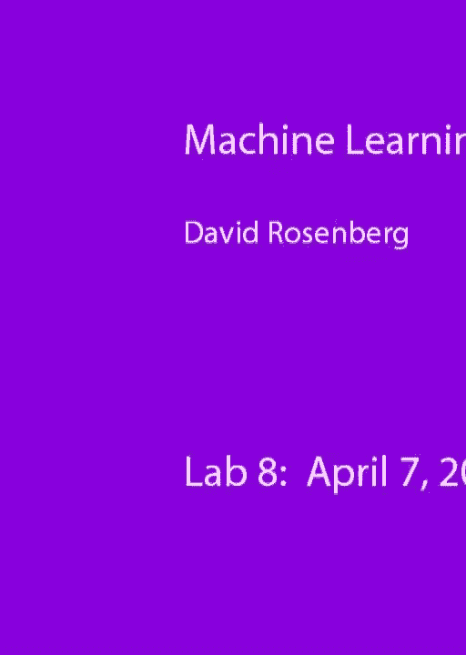
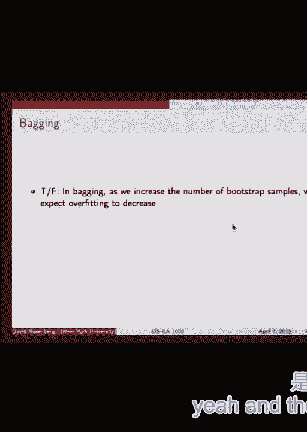
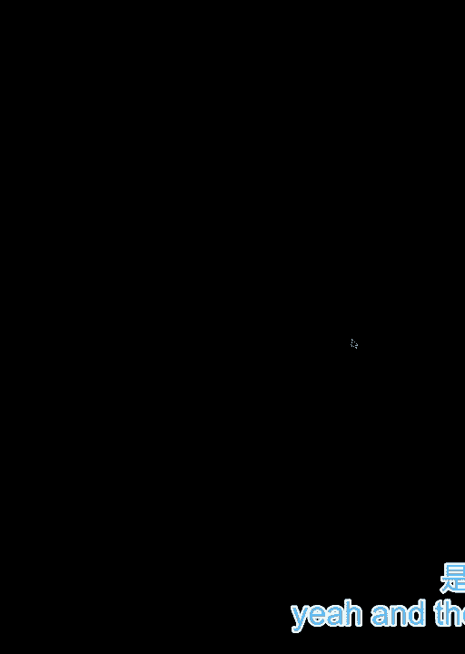
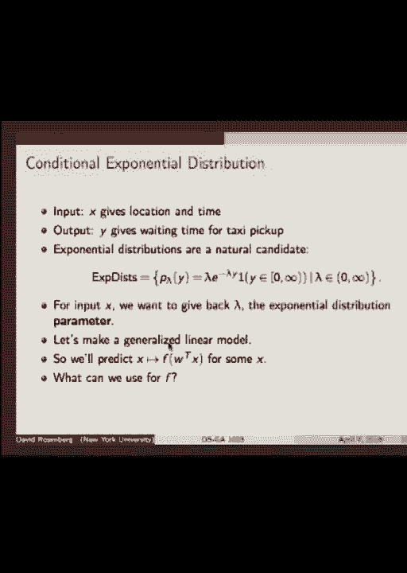
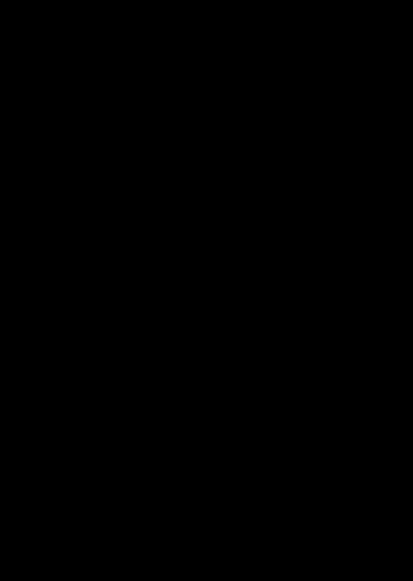

# P18：18.April_7_Lab - Tesra-AI不错哟 - BV1aJ411y7p7

 All right， so today we're reviewing for the test。

 I have a few slides prepared as discussion points， but we can take questions that you， have。 can mix it up。 If you ask me some questions， I could ask you some questions。 Off the bat any questions people have， I can follow it away and see if we can filter。 in our topics that are of some concern。 Someone on the Piazza asked for some random bars thing boosting。

 Let me discuss that a little bit。 Okay。 So if there's no questions， I put， okay。 first off what's on the exam？

 It's primarily focused on the materials that we've covered so far that weren't on the， first exam。 That's the focus。 Up to it， including yesterday's discussion。 Basically you should know likelihood and how to make an objective function where you。 have maximum likelihood on some data。 I think this is something that most of you already knew of coming in and anyway we talked。

 about yesterday。 So that'll be kind of fair game for the test。 Okay。 All right， so I think the last。 the first topic we did that wasn't on the last test was， kernels。 So I just jotted down。 When you think of kernels you should definitely understand what we mean by the kernel trick。 Can anyone paraphrase the idea of the kernel trick？ I want to try it out。

 So suppose you have a machine learning algorithm and you can write your objective function purely。 in terms of what？ Okay， very good。 Inner products of your inputs X or of some feature mapped input X into some feature space。 So whenever you have an X in your objective function it's in the form of Xi transpose。 Xj or inner product of Xi and Xj。 It's never just plain Xi sitting there。 Okay。 All right。

 So what happens when you've written your objective function in this form， in a kernelized form？

 That form would be kernelized。 And the kernel trick is that you can swap out that inner product。 So we have just， if you write Xi transpose Xj that's the standard Euclidean inner product。 You can swap that out and replace it with any other inner product you want。 Okay。 So we've basically spoken about two ways to come up with a new inner product。

 So suppose we have Xi transpose Xj。 So the first thing we can do。 and we can always do this is replace it by a new feature mapping。 So it can be like phi of Xi phi of Xj transpose。 Okay。 That's often convenient when we have it in this form to write this in terms of what we call。

 a kernel function。 You can write that this is equal to a。 What do I want to write here？

 It's two arguments。 Xi， right， and Xj。 So the kernel function takes arguments in the input space X。 So kernel maps from input space X to input space elements into reals。 So X may not be Rd at all。 X could be any kind of space we want。 But the output of the kernel is reals。 Similarly。 we feature map takes an arbitrary element of an input space that could be any。

 kind of input space and it maps it to something in Rd or R something。 Okay。 So， yeah。 so the two ways to make a kernel function one is to come up with a feature map， you like。 A new feature map and just use the standard Euclidean inner product。 And another way is to just write down a function and prove that it has the properties that。

 a kernel function needs to have。 That it that are basically derived from inner product properties。 Any questions on kernel stuff？ Trees。 So I just picked one random property that you should know about trees。 These don't care about the specific values in a particular feature。 They only care about the relative ordering of the values。 So if I ask question， you know。

 here's in the input space we have a feature that's temperature， degrees Celsius。 And someone suggests a log transform for some reason。 You should realize that has no impact whatsoever on what a tree does。 Because the tree doesn't care about that。 It doesn't change the relative value。

 So it doesn't matter。 Okay。 What else is nice about trees？

 What else is interesting about trees or questions about trees？ So trees partition your input space。 right？ Every little part of the input space corresponds to a leaf of the tree。 It has its own prediction。 What else？ What about the trick about taking the leaf nodes？

 The indicator function is to say which leaf node or which partition of the input space。 the input is in。 And using that as a feature in some other classifier。 Remember that idea？

 So we could have， we could run a tree on some data set。 And then we could take all of the regions of the space that the tree divides the input。 space into and code those up as features for the data and then run it through like Lasso。 or something。 Alright， I have a bag， a true false question。 What， you have a question？

 What does that mean？ Leaf nodes is features。 Probably half the classes like glad you asked。 Alright。 input space X。 Alright。 Three makes splits。 Let's suppose there's two features。 So the first split maybe it makes here。 And the next split to the left it puts here and the next split to the right it puts here。 And then we're bored so we stop building our tree。 Alright， and we have a prediction here。

 A1 and here A2。 Do you know what I mean by each of these regions corresponds to a leaf node of the tree？

 Okay， so this is the region and I claim that you can code up a function of X。 So X maps to something that's one if X is in this region and zero otherwise。 This is what the split is at W0 and this is W1。 Then we can map X to indicator function。 So this is the X1 axis and this is the X2 axis。 Now we can say X1 what would I say to get this region to be 1。

 Okay X1 is less than or equal to W0 and X2 is less than or equal to W1。 So this is a feature mapping。 This gives you one feature of X and it's 1 whenever X lives in this area and it's zero。 otherwise。 Okay， and we can make another such feature for each of these regions。 So this is a non-linear feature mapping of X。 It represents X in a way that we can now make prediction functions that you could never。

 produce with just linear regression。 Suppose you try to make a linear function of X1 and X2。 Well then we're only going to be able to do things like this。 But if we take these feature functions and do linear regression on them we could get。 these types of boundaries。 The benefit of this is so it's okay so why would you use this？

 Suppose you have a whole lot of data。 So much data that you need something that can run very fast over the data。 The algorithms that can run very fast are generally linear algorithms。 Ridge regression。 lots of regression， these things。 Trees are much slower。 Gradient boosting much slower。 So we could either go linear and use all of our data or go non-linear and just use a。

 subset or wait forever。 Okay， well how about this？

 What if we go non-linear on a subset of data then extract from that non-linear thing。 with some new features that are non-linear features like these things。 Now take the non-linear features as input to our linear model and now we can run on。 all the data but the final prediction function is non-linear。 That's a good question。

 So question is this， can we figure this as boosting in any way？

 Let me think about that for a second。 I don't know。 Boosting is really like you build one model and then you see where things didn't do well。 and you build another one。 It is two stage and boosting is multiple stages but I'm not sure it goes deeper than。 that。 Okay， what if maybe there is some connection in the sense of if our weak learners were。

 like single-position stumps and then we combine them with linear combinations and。 ada-boost then your decision regions maybe look a little bit similar but I don't think。 it's a very close connection。 Yeah。 It's a close。 We have a non-linear model from which we extract an idea for feature map for the new。 feature map and then the feature map is used in the linear model。 Yeah。 I'm also worried about。

 okay， so I don't worry too much about trees over fitting too badly。 because what I'm going to do is I'm going to take those features and then put it into。 a linear model that I know how to regularize well。 So I use L1 regularization and you know a whole lot of sets to make sure I'm not over fitting。

 So I'm not too worried about if the tree is going to over fit a bit but did you have。 a specific idea？ No， I mean I'm using a single tree to determine which features maybe a quarter or not so maybe。 that's the worst of the specific trees that I'm using。 You mean because it's a random subset？

 Yes trees are we have this thing。 Yeah I understand what you're saying。 You're saying that boy the leaf nodes in this tree they're based on a random subset of data。 and if I had a new random subset it would be very different and this is all true but it's。 the ones that are really important hopefully will show up for most of the trees or something。

 Does it have a relation with kernel because it seems that you're trying to build up new。 side of features。 That's interesting。 Is there a direct connection to kernels because in kernels we're kind of making something like。 a new feature map。 Well in a certain sense that for kernels I'm saying take your xi xi's transpose and swap。 in a new feature map but maybe just to that extent。 But it is about generating new features。

 Learning the structure of the data。 I don't know exactly what that means。 I don't know if that's what that means。 I don't know。 I mean it's not visualizing the data because I drew in two dimensions but generally it's。 going to be very high dimensional potentially。 It's not really something you can visualize but in the rough sense of I'm letting the tree。

 take a first cut at the data on a subset of data and then I'm kind of extracting something。 from that。 I guess yeah。 Good mileage out of that bullet。 I didn't even have to question it。 That was all trees。 Alright so bagging。 Neuro bagging is。 We have our data set。 It's a size N。 We take a sample with replacement。 Traditionally of size N although there's a really good discussion on Piaf if you saw。

 it on whether we really need to keep it at N or it can be smaller or bigger but standard。 bagging is you take a sample with replacement it's called a bootstrap sample and you train。 a model on that random sample with your placement and you take another sample of size N and。 you train another model and another one and you do that until you get bored and then。

 your predictions are the average of the predictions of each of those models and the idea is that。 it decreases the variance and kind of smooths out your prediction and generally helps in。 different situations。 So to the question on this slide。 True false in bagging as we increase the number of bootstrap samples we expect overfitting。

 to decrease。 So if you do that resampling thing and you keep adding more and more friction functions。 to your ensemble that you're just going to take the straight average of。 Would you expect adding more functions will that maybe lead to overfitting or make overfitting。 less likely。 Is true？ True false。 So true means we think that it's good to keep taking adding more functions to it。

 If you keep adding more functions to this average it's not going to overfit as much。 So you got it。 You think if we take it infinitely。 Are we？ I don't see that。 I'm not quite sure I thought either this thing。 But I'm not sure。 Why do you think it will start overfitting after a certain number of iterations？

 So the worry is that we may eventually be getting the same sample more than once。 Why is that an issue？ So we have the same friction function more than once。 So it enters into the average more than once but I don't see that as being an issue。 Yeah。 I was thinking that when you take a red one it's like you're taking the sample from the。

 population and the more time to do that the more of a representation it is。 Okay so we're taking a sample of the same size every time and then we're averaging the， results。 So it's not entirely clear to me that it's becoming more representative。 Oh you think because it's converging to the expected value or something。

 So here's the issue with this is that there's no， I don't have a precise theorem about this。 Not sure there is one or maybe is one but I couldn't track one down not in textbooks， on papers。 So it's more of a in practice it bears out and intuitively it makes a lot of sense。 Yeah。 No question。 Yes。 Yeah。 Okay let me can I refresh the question。

 Can I just change it from we expect overfitting to not get worse。 So you think you won't change anything。 I don't see how the number of these different things will influence when you're putting。 a Russian paint。 I would say that has no influence。 You don't like the whole argument of variance decreases when you take an average of friction。

 functions。 I found a very compelling。 So we have a bunch of prediction functions and the expected prediction is say the right。 thing but there's variability due to randomness in the sample and when we average those things。 together we expect the variability of the predictions to decrease but the bias should be the same。 because all the samples are I。D。 So the intuitive explanation for bagging is that the variance of the predictions decreases。

 but the bias stays the same。 So decreasing bias decreases。 In this case decreasing variance decreases overfitting。 What is decreasing variance？

 Decreasing variance。 Because if your particular country is actually just a orbit in the country you're trying to。 decrease in the virus out of the future and you're just getting a new or meeting prediction。 If all of your prediction for every sample side is overfitting then you're just trying。 to get the most of that we want。 Wait， hold on。 Alright let's consider the prediction on a single input X。

 We'll just focus on this。 So we draw some random data and we build our model on it and let's call that F1。 And then we'll evaluate it on X。 So that's equal to Y1。 Now this was based on a random sample of data and so we could also talk about the expected。 value of F1 of X。 Let's call that Y1。 Now let's call that Y*。 Y1*。 Okay， fine。

 So now we have another one。 Y2 which is first of all in this expectation what's random？

 Always a good question to ask。 What is？ The sample that we took the training data for F。 So in this what is random？ What should I underline to be the random thing？ What is it？

 Well universally incorrect。 Guess again。 F is random。 Why is F random？ That's good。 Alright keep thinking。 We need a reason。 Why would F be random？ Yes。 F is the prediction function that is built from the random sample of data。 X I fixed the beginning。 I chose an input X。 I said let's focus on X equals this picture。

 And then every time we draw a bootstrap sample of training data we get a new F。 So F is random in this way。 Okay fine。 So now we draw another thing and we get another F。 We got another F because F is random and every time we draw a new bootstrap sample we。 get a new F and I'm keeping X the same every time。 Okay what's the expected value of F2 of X？

 It's also why it's one star。 And the X。 Yeah。

 And the expected value of all the F's。

 Every F that we generate randomly is going to have an expected value。 Fine。 But what about when we average these all together？ The expected value of this thing？ Still the same。 But what about the variance of this thing？ This reduced by how much or how much of the variance went down by？

 We want to do this at the average。 So the variance at the average。 Yeah。 Okay you could work out variance of averages。 It's one over F。 Yeah。 The expected value is equal to F and it's far out of the pie。 No no wait。 The sample the training data that I drew for F came every sample is generated in the same， way。

 So I did sample of training data。 So you want to say if F is not。 I didn't say that F is getting the right value for Y。 I said it's getting a particular， value for Y。 This could still be biased。 So it doesn't reduce the bias but it doesn't change the bias but it changes the variance。 Yes。 I could see that the variance decrease but why？

 Well let's forget the word overfitting because as I've kind of said overfitting is not for。 all the fine。 Let's just say make better predictions。 Can we say that？ That's what I want to claim。 No but if all of your happiness overfitting you're just trying to get the average overfitting。 point。 I mean our opinion is more dependent on what your learner is but not this kind of thing。

 Because if you are learner is just an overfitting learner for example you have more iterations。 so that every F， F Y， F MX they are overfitting then you are just trying to get the average。 point of all your predictions which is also overfitting。 Why is the average of something that's overfitting overfitting？ I don't agree with that statement。

 I claim that it will fit better because。 That is my question why it's on my own。 Because it's together it will fit better on。 So we have an overfitting situation right we have a tree that fits too well but maybe。 but it's not biased one way or the other perhaps so the expected value is still the right thing。 but sometimes it gets confused and it focuses too much on the wrong thing whatever it has。

 any particular instance will have some error because of overfitting but if we average a。 bunch of those together it still has it's still unbiased but the variance has gone down， so。 Can I say I can see that the average of all these things can be better than some of the。 F X but maybe more some of them。 You cannot say that average is better than all of them。

 I can't say anything precisely this is a。 I mean this is precise but this is not even about。 This is the thing we would actually use for prediction and what I'm saying is I'm giving。 you something about the variance of this as a random variable as a random entity and we。 only get one of these。 So I'm saying the variance of this thing is reduced but in practice we only have one。

 instance of this average and so in general we expect it to be a lot of average is bad， or bad。 Why is average bad or bad？ I couldn't see it。 Alright how about this？

 So those the variance of F1 X is 100。 And the expected value is zero。 Alright。 Okay and I don't even know what the true value is。 Doesn't matter。 So I generate a random F and it predicts what would be a typical prediction F1 of X for。 a randomly drawn F1 of X。 That would be the expected prediction。 Zero is possible but unlikely。

 It may deviate from zero by some amount roughly how much？ Ten。 So a randomly drawn F will deviate from zero by about ten。 Alright so it may predict maybe this is six maybe the next one is negative five。 So if the true value of zero is zero if this is unbiased then this will be the typical。

 error of each of these predictions。 Now what if we took the average of two of them even？

 What if we took an average of ten of these？ Would you expect that the typical deviation from the expected value would decrease？

 That's the point。 So that deviation is the error。 But others， you're the steal。 Can I ask you a question about how we're going to have it？

 Okay let's continue on and let's talk about the sumpcata。 It's maybe too much on this one question。 I mean by overfitting so yeah I should have asked instead would you expect the fit to improve？

 Instead of overfitting overfitting is not a very low defined term。 Okay alright so with bagging how can we get an estimate of test performance while still。 using all our data for training？ So yeah it's out of bag method。 So in every round of bagging we take a bootstrap sample and some fraction roughly you remember。

 how much percent？ 30 something。 Yeah 30 something percent like one over E ish isn't sampled and so those things are。 out of sample for that particular prediction function。 So any type so you can use those points as test data for any ensemble involving this particular。 function that wasn't trained on those things。 So basically what you do is you take。

 so here's your original sample， your original data。 You take one point of it and you look at all the functions that were generated without。 using that point as training data。 And you average those together and you see how it does on this point and that's like。 an out of sample assessment of how your thing will do on this one point and you can do that。

 for each of the points。 So that's worth reviewing。 Okay true/false random forest is just bagging with trees。 Okay what's the extra piece？

 Each time you make this clear do you have to figure out the sample of the features？

 Okay each time you make your split you're choosing among a random subset of features。 Typical numbers， typical fraction for that number of features。 Sometimes you use square root of the number of features sometimes you have the number of。 features that's a tuning parameter。 Okay。 Skip。 Well I will say that so the inventor of the method claims very strenuously in his paper。

 without proof that random forest never overfits。 And what he has in mind is this thing that bagging doesn't overfit and anyway。 No this is false or undecided if you only want to believe what's proved because we haven't。 proved it but anyway。 Okay out of boost。 True/false we can use regression trees as the base classifier for out of boost。 No it cannot。 What do we need to use it？ What's the one crucial requirement for using out of boost in practice？

 Okay so there's two things。 So we need it to output。 it has to be a hard classifier negative one or one that's really， built into the algorithm。 Now there's also this theorem about converging to the optimal， to like the best possible。 on the training set but that's and to do that theorem required that it be a weak classifier。

 to do better than 50%。 I would say but in reality in practice you have no idea if you have a weak classifier。 This is not something that you can know you hope but you don't know。 So that's more on the theory side。 On the practical side we need the base classifier to give hard classifications negative one or。 one。 We can use SVM as a base classifier for out of boost。 True/false。 True/maybe。

 How do we use an SVM for base classifier？ Take the sign。 Right so the SVM kind of naturally returns a score， a real number and then take the sign。 Yeah if you want to be really careful so sign of zero is zero traditionally。 So if you want to be really careful you got to make sure you map the zero to something。

 But yeah this is good。 With the discussion we just had yes。 This wouldn't be a test question because it's too ambiguous but you have to。 If you take your SVM output and you convert it to negative one or one then yes。 We can use out of boost as a method for minimizing exponential loss using forward stage rise additive。

 modeling。 What？ Yeah it's true this is the homework problem and Ann mentioned in lecture certainly。 So and what are some issues with exponential loss？ No sparsity is true。 I don't know it's not necessarily an issue it's not an issue for me some people complain。 about that I don't mind that。 Yeah so one issue is that it penalizes incorrect answers very heavily and so it's going to。

 be very well affected but it's going to be heavily affected by outliers or noisy data。 Okay gradient boosting so we've had homework on gradient boosting。 So definitely rehearse gradient boosting why because it's it's easy to get problems in。 gradient boosting so I would prepare for that。 So what does that mean？

 It means here's a loss function。 Maybe I'll tell you what do you what ingredients you need to do gradient boosting。 If I say program up this gradient boosting algorithm you'll say okay I need to know X。 and Y what do I need to tell you to need a loss function for gradient boosting。 You need something else。 Yeah yes you need a base hypothesis base okay good and what kind of for a base learner。

 that chooses from the hypothesis base and what kind of hypothesis spaces need to be。 or what kind of learner is it need to be。 For the version of gradient boosting we discuss。 So the hypothesis space should be okay let's back up。 Hypothesis space contains decision functions and decision functions take an input and produce。

 some kind of output what kind of output should these decision functions produce for a real。 value that's right and real things that produce real values these are regression functions。 So our black box method needs to be a regression。 Good。 We love calls regression and these things in the last class of space。 Yes that's right。

 Any questions on this？ Okay。 Go on。 I really can't remember H anymore but so in gradient boosting we come up with a vector。 which would be the unconstrained gradient and we got to project it back into our weak hypothesis。 space and we do that and a projection is minimizing L2 distance so we do that by finding。 a function or hypothesis space that is predictions that are close in L2 that's just regression。

 Alright yeah those were those functions we called it。 Okay。 Alrighty good。 Multiclass classification you should know what the ingredients are and be comfortable。 with them so we have this class sensitive loss function。 If I predict 3 but it's actually 4 that could be loss of 2 if I predict 2 and it's actually。

 3 or whatever was the other way around it could be loss of 5。 There's this notion of class sensitive loss function。 I mean you would draw it as a table right？

 So A for action the prediction and Y for truth 0 1 2 0 1 2 we'd have a loss in each。 of these nine cells typically you'd expect the loss for the correct answer to be 0 so。 this would be typical 0 0 0。 You can have 5 here and this could be 3 here doesn't have to be symmetric so this is delta。 We have our feature map which in the multi class case takes an x and a y and you think。

 of it as like encoding the compatibility between x and y and then our linear score function。 which is a single number scoring how compatible x is with y。 This is linear we only talked about linear multi class and your final prediction function。 is you take the thing with the biggest score。 We talked about two loss functions actually only one on the day which is the multi class。

 hinge loss and you have this homework on it right now so you should be pretty familiar， with that。 So what's on that？ Alright well it's also the thing we talked about yesterday the multi-nomial logistic regression。 loss which is also a multi class loss function and this would be you could think about this。 as max you could either maximize the likelihood given by the multi class multi-nomial logistic。

 or minimize the negative log likelihood but this is another loss function we can use for。 multi class。 So I would recommend from yesterday to go through I had maybe four examples of conditional likelihood。 things we went over to we went over binomial multi-nomial and the same size there's an。 example for Poisson regression and Gaussian regression I think I talked about Poisson， too。

 And I think that will get you the hang of it。 I always think about it like this we have some parametric family with same parameter。 theta and our model takes an x for input first we map it down to a single number right with。 the linear with our linear methods it comes that and then finally we want to map it into。 theta and theta may have some restricted range right so we might have theta in 0 1 we might。

 have theta in 0 infinity so this gets mapped to f of w transpose x which we take to be， theta。 Yes。 You don't want them to be in the exam？ I said that yesterday。 Yeah I changed my mind。 Sorry yeah。 What is the option asked in one parameter？ Great question。 This is not covered in any textbook I've ever seen except in one example multi-nomial。

 logistic regression which I did on the slides but I would love to have a write up that talks。 about more than one parameter but I have not seen it。 Good question。 So it's not a problem I just never seen any given example of it so what would we do in， that case？

 We would map x to w transpose one way to do it would be to map x to w1 transpose x and。 w2 transpose x and then f returns two parameters or something like this。 Yeah you can do it I've just never worked out except in the one instance of multi-nomial。 I mean the main point of this is that I want to be able to refer to likelihoods so I don't。

 expect it'll be a very difficult but I don't think this stuff is actually very difficult。 I think if you review it it's nothing magical going on。 Okay。 Alright so we have two minutes left are there any more I'll post these slides are there any。 more questions you can ask answer for the test。 Yeah so in random parts we like to use really deep trees that's right。

 Well yeah and deep trees are low bias。 High variance。 Yeah so the idea is that when you do a bagging you're reducing the variance so if you start。 with low bias even if it's high variance it's okay because bagging is going to reduce the， variance。 Speaking of which this leads into why might we suspect that the random sub-setling of。

 features that we use in random parts might help things。 Well so you don't want the tree you want the trees to be as uncorrelated as possible。 So when we have this when I made that claim that averaging a bunch of things reduces the。 variance that's true exactly when the F's are uncorrelated but in bagging they're not。

 really uncorrelated that's why this is not really a proof。 Well I think we don't really care at the feature level we care about the final prediction。 level and what the predictions between the trees between the trees to be as uncorrelated。 as possible to be diverse and we hope that by randomly selecting features on the path。

 when we generate the random parts we're going to have a more diverse and less correlated。 set of trees that we're averaging together。 So I guess we'll end now at 8。 I'm here for questions for now if I know a lot of you guys have to go but there'll be。 one more example along lines of the condition probability models that will be on these。

 slides that I'll post。 So cool， yes？ [inaudible]。

 (laugh)。

