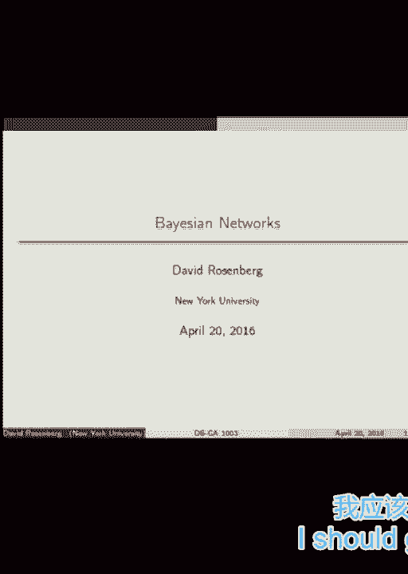
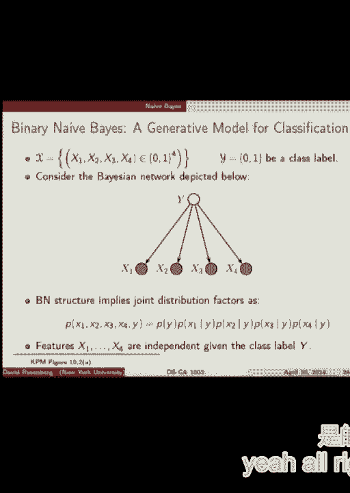
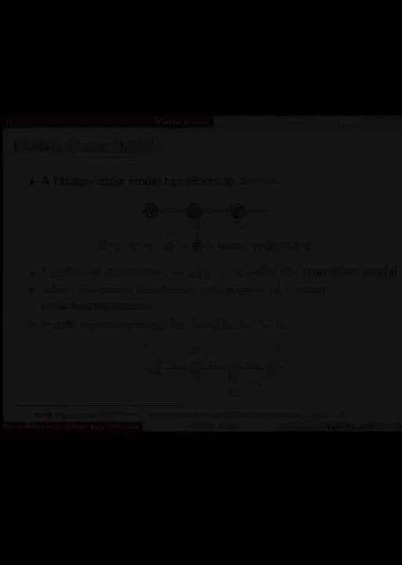
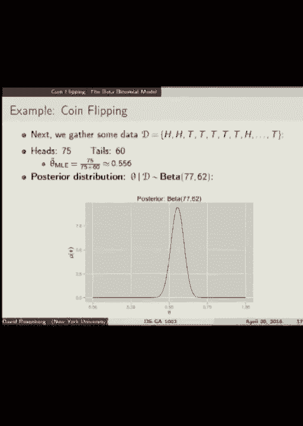
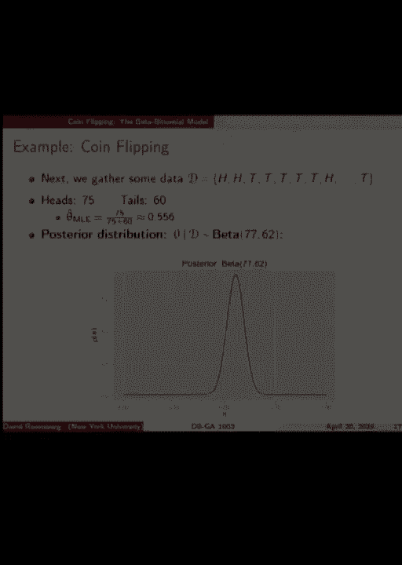

# P19：19.Lecture_April_20 - Tesra-AI不错哟 - BV1aJ411y7p7

我们该开始了吗。

所以我们今天有两个主要的话题，它们是机器学习中的贝叶斯网络和贝叶斯方法，和贝叶斯在每种情况下都不是特别相关的，只是一个巧合，罗伊的介绍，所以说，贝叶斯网络是，本课程的续集之一，教授的一零五课程。我不太确定，如果有一个统计贝叶斯统计类，但这也很可能是它自己的阶级，但希望你能尝到味道，至少贝叶斯网络的很大一部分，它几乎是一种描述概率分布的语言或符号，所以至少我希望你们熟悉这个符号。有条件独立的核心理念，大量涌入，所有的权利，所以贝叶斯网络属于概率推理的范畴，概率推理是我们用随机变量来表示我们感兴趣的系统，所以我们通常感兴趣的系统有特征和标签，所以如果我们。我们可以完全概率地表示这一点，其中的功能和标签，都是随机变量，我们把整个系统看作是一组随机变量，不知何故，假设我们有我们需要知道的关于随机变量的知识来完全理解，然后我们需要知道它们的联合分布。

所以假设是在实验室里进行实验还是进行机器学习，或者以某种方式，我们想出了这个联合分配，描述所有随机变量是如何相关的，然后我们就来到了，我们可以问我们可以做一些叫做推理和推理的事情，在一组随机变量上。在概率系统上基本上是对系统进行查询，例如，你可以问给定的d个元素d个随机变量，你可以说好，什么是，x 1最有可能的值是多少，其中一个元素将是一个非常简单的查询，另一个。也许更有趣的是x 1最有可能的值是多少，考虑到我对x2的观察是对的，x2等于该值，一个，我观察到给我一个最有可能的值x 1，给我x 1的分布，这些类型的问题都是推论，你可以要求其中两个的联合分发。考虑到其余的问题，你可以问联合发行，这些都是推理的问题和想出联合分布的问题，我们不会真的，那是，这就是学习的权利，这就是我们这学期谈了很多的事情，所以概率分布的上下文，弄清楚分布是什么，那是学习的部分。

然后问关于分布的问题，像部分的分布部分，一些随机变量被给予对其他随机变量的观察，这就是推论，所以学习和推理，所有的权利，所以一个快速的例子医学医学诊断，所以我们对你可能有的每一个症状都有一个随机变量。你可能会咳嗽，出汗，打喷嚏，晃动，我们可以对每种疾病都有一个随机变量，冷，支气管炎，肺炎，随便啦，然后我们可以说我们可以提出一个推理问题，观察其中的三种症状，咳嗽，发烧，但不呕吐，所有的权利，精细。这些观察的条件是什么，这个人得肺炎的可能性有多大？如果我们有完整的联合分配，我们可以计算出这种可能性，并将其作为帮助诊断的工具，所以人们，这是很流行的，现在做得不那么多，但回去，15年以上或15年以上。嗯，他们建立了一个这样的系统，有六百种疾病和四千种症状，在某些情况下，他们做了很多工作，这是那种类型的事情，我们将在今天的第一部分讨论，所以我们将使用一点符号，我们今天限制了两个离散随机变量，嗯。

这是非常传统的符号，虽然我们在这门课上没有用过，也就是说，我们将对随机变量使用大写字母，我们使用小写值，这些随机变量取的值的小写字母，你以前见过，对呀，这几乎是经典的，所以这种事情，大x一等于小x一。我们如何表示离散情况下的概率分布，从某种意义上说，这是微不足道的，我们可以写下每一个可能发生的随机变量组合，然后我们写下这种组合的概率，我们做了一张巨大的桌子，潜在的巨型桌子，在所有不同的可能性中。这里有两张桌子，一个是温度，一个是天气，我们会说温度可以是热的，也可以是冷的，可能是晴天也可能是雨天，我们用两个不同值的表来描述这两个发行版中的每一个，他们可以取每一个的概率，所以太阳的概率是第六点。下雨的概率是第四点，所以这些被称为边际分布，从某种意义上说，我们描述的是温度和天气的分布，彼此独立，对呀，只是，如果我们不观察天气，温度的分布情况如何？如果我们不观察温度，天气的分布是什么来做任何推断。

就像你观察天气一样，让我们来猜猜温度是多少，我们显然需要一些，关于这两件事如何相互联系的一些分布，所以边缘是不够的，这就是联合分销的用武之地，所以这是一个联合分配表，所以现在是二乘二。是两个变量结合在一起的四种不同的可能性，我们有这些组合的概率，当然，他们加起来是一个没问题，所以有了这张桌子，我们可以，这是两个变量的全联合分布，所以现在我们可以，这应该能够支持找到任何问题的答案。我们可能有涉及这些变量，所以如果外面很热，晴天的可能性有多大？如果不下雨的话，天气冷的可能性有多大，你知道的，我们可以通过以一些非常基本的方式操纵这些数字。我们可以从这个联合表格中回答我们想要的任何问题，让我们，让我们来谈谈这是否真的是一种现实的方式，假设我们有一些二元随机变量，我们有很多，然后问题是，我们需要多少参数。

表示d个二元随机变量的全条件概率分布，这是我对你们的问题再说一遍，两个圆周率，是呀，我同意权力D基本上任何轻微的修改，是啊，是啊，二乘二的d次方减去一，为什么，因为我们有两个到D，是呀。我们有D变量的两个到D的可能组合，如果它们是，每个可以取两个值很好，这就是D的两个，这些组合中的每一个都有一个概率，这些概率必须加起来为1，所以我们可以省略其中一个参数，并且仍然代表着伟大的分布。所以两个到D，所以这是指数级的，表示D变量上的全种无限制联合分布所需的许多参数，在许多情况下，这太多了，所以说，例如，在诊断病例中，有四千六百个，如果你把症状和疾病结合起来，疾病，有四千六百个随机变量。它们是二进制的，是呀，所以这就像10到1000行什么的，那是太多了，这显然是不可能的，也是可行的，但总的来说，有大量的参数，即使是储存也很难，但如果我们能储存它，这将很难计算，嗯，我们必须估计这些参数。

所以想象一下你需要估计多少数据，像一千亿个参数什么的，好吧，重点是我们要摆脱这个指数，需要指数多的参数来表示我们的分布，所以这种情况有点像，我很想把这个和假设空间联系起来，在那里你可以想象。我们从一组可能的分布中提取一个分布，你可以把它想象成一个假设空间，就像学习我们想去的地方一样，你知道吗，控制我们假设空间的大小，过拟合和过拟合之间的权衡，嗯，我们想在这里用概率分布做一个类似的事情。所以如果我们允许每一个可能的概率分布，这是指数级的许多参数，我们必须确定，那么这是一个巨大的假设空间，我们想弄清楚什么是限制它的自然方法，好的，那么我们如何限制概率分布的集合。标准的方法是做出独立性假设，所以如果我们有D个随机变量，我们要说好吧，这些随机变量中的某些变量是相互独立的，或者他们有条件地独立，我们一会儿就来，所以首先让我们来谈谈相互独立的极端情况。

所以你可以说好吧，我们有D个随机变量，我想假设它们都是独立的，相互独立，所以这是我们应该非常熟悉的定义，你拿联合分布、概率分布函数或密度，如果这是连续的，但我们是在离散的情况下，这些是概率质量函数。您对d变量进行任何可能的设置，您计算它们的联合概率，然后这应该等于这个边缘的概率，每个单独变量的边际概率的乘积，对呀，非常熟悉的定义，所以如果这是，允许的一组分布，随机变量独立的。那么需要多少参数来表示这样的概率分布，这些是二元随机变量，因为我们需要一个随机变量，D或D减去一，I'好，对呀，因为它们不等于一，这些是独立的概率，是呀，伟大，好的，所以在一个极端。我们有2的d减去1的参数，在另一个极端，我们有D，现在我们要寻找介于两者之间的东西，我们喜欢怎么样，在大小之间，跳过那个，所以现在来谈谈贝叶斯网络的关键思想，这就是有条件独立的概念。

所以首先有一个等效的独立概念，这实际上可能更直观，所以这说明x的条件分布，给定y正好等于x的边际分布，所以你可以在观察Y的时候理解这一点，但你对X的了解不会改变，就好像你从来没有观察到你，首先，那是。这是思考独立的一种非常直观的方式，所以在这辆车里你可以直接从独立的定义出发，非常简单，所以有条件的独立，让我们举一个例子，让它变得有点具体，假设有三个事件，三随机变量，草是湿的，路很滑，还在下雨。所以这些变量之间有明显的关系，对呀，如果下雨的话，草就湿了，好的，所以他们不是独立的，下雨意味着草是湿的，路是滑的，我们会假设这听起来是个合理的假设，但是如果我们观察到草是湿的呢。这给了我们任何关于道路湿滑的信息吗，是呀，否，我看到一些点头，是呀，你要和，是呀，为什么会这样呢，如果你观察到草是湿的，这会使你或多或少地觉得路很滑吗？更像是耶，因为如果草是湿的，嗯，是啊，是啊，好的。

那就有可能是在下雨，如果下雨，我们就知道路很滑，所以有一些信息传递，是啊，是啊，同意这样做，如果草是湿的，路很可能是滑的，所以说，另一方面，假设我们知道在下雨，然后有人告诉你草是湿的。这是否给了你更多关于道路是否湿滑的信息，好的，所以我不，我们都知道，那是现在常见的信息，我告诉你们中的一个草是湿的，这个人有没有关于道路湿滑的其他信息，并不是因为一个人从潮湿的草地上获得的所有信息。更有可能是在下雨，但大家都已经知道下雨了，所以知道草是湿的没有任何好处，所以没有关于这排很滑的新信息，在这个简单的模型中，所以在我们的世界里可能还有另一个随机变量，我没有介绍，就是有人在给草浇水。那样的话，我说好，我想在这种情况下可以，我想我同意你的看法，也许有解决这个问题的办法，这样，这个不会那个，他们不会有独立的，但是在这个设置中，是啊，是啊，这是一个非常受限制的世界，所有的权利。

所以如果你知道R，如果知道r意味着w和s突然独立，那就叫有条件独立，你写这个w正交符号，r上的s条件，所以考虑到我们的W和S是独立的，形式定义，这是相当直观的，就像你为独立而得到的因式分解一样。除了我们在每个片上都有一个关于r的条件，所以w和s上的条件是条件独立的，给定r，如果w的概率等于w的概率乘以s的概率，其中所有这些概率都以r为条件，所以就像独立人士一样，除了在每一件事上。我们都以这一事件为条件，所有的权利，所以假设我们有条件的独立性，这是否意味着我们有独立性，对呀，这就是例子，我们只是给了路上湿漉漉的草，因为它们不是独立的，但它们是有条件独立的，所有的权利。那另一条路呢？我忘记了独立的另一种方式是什么，意味着有条件的独立性，是呀，你觉得是的，所有的权利，让我们试着用概率分布写下这个世界，在数学方面，所以我们从三个事件W和R的联合分发开始。

我写的第一件事完全没有关于独立的假设，或条件独立性，这简直就是，所以我用r，然后乘以r的概率，这是不等式，没有假设，好吧，但现在让我们假设，正如我们所同意的，w和s是条件独立的是合理的，给定r。这样我就可以把这个学期分成两部分，像这样是这样清楚的不是，如果很清楚的话，好的，伟大伟大，谢谢好的，所以我声称，这是在多少参数之间指定联合分布与这些假设，在给定r的情况下指定w的概率是多少，我也听到了。所有的权利，所以R可以取两个不同的值，是的，不下雨或不下雨，如果下雨的话，我们需要计算出它是湿的概率，如果不下雨的话，我们需要计算出另一种可能性，它是湿的，所以我们有可能在下雨的情况下，如果不下雨。这是什么的可能性，这是两个不同的参数，我们可以设置好，我看到几个结很棒，同样的概率S是滑的，给定r，r的概率只是一个参数，那么总共有多少人呢？所以我们有，有多少人要求完全独立，争取完全独立，我们有三个。

我们对每个变量都有一个参数，用于，嗯，不受限制的任何可能，否，完全没有独立性，2到d减去1 7对了，在这之间，五件伟大的事情，所以这是我们调节我们可能分布的复杂性的一个例子，无假设，尽可能的关节。所有可能的联合分布到最严格的，对此有什么问题吗，当有四个，哦好吧，这就是W和R有多少种可能的组合，这是第一个问题，正好有八个，每一个都有自己的概率，所以是八个，除了这八个概率之和必须是1。所以你真的不需要那些，你只有七个，你可以自由设置，第八个是确定的，所以这样，七个参数，好的，所以这就像二的d减去一，是呀，是呀，好的，伟大，所有的权利，这就是我们对条件依赖的热身。以及我们如何控制概率分布的复杂性，现在我们要介绍一点，符号或语言，这是贝叶斯网络，所以说，贝叶斯网络用于指定联合概率分布，具有特定因式分解的，正如我们所看到的，因式分解一般对应于独立性。

有条件独立关系或独立关系，这里有一个贝叶斯网络的例子，这是一个贝叶斯网络，我们有四个随机变量，每个都被绘制成图C中的一个节点，h a和i，然后在节点和编码之间有这些定向边。我们会看到它们编码了一些条件独立性假设，但现在他们告诉我们的是，所以概率是这样的，c a和i四个变量的联合分布，它以一种你马上就会学会的方式分裂成碎片，如何从这个图中读取，所以任何没有父级的节点。节点的父节点是指有边指向它的东西，所以H的父母是C和一个伟大的，C没有父母，好的，所以c的概率是在没有a的任何条件概率的情况下写的，同样的方法，给定ca的h的概率是一个因子，因为h有父c a。同样i也有父a，所以这是有原因的，我没有提出索赔，我只告诉你这么多，有一种方法可以把这幅图转化为因式分解，现在我们给出正式的定义，所以首先，有向图，这就是我们要讨论的一幅画，有东西。

这些东西中的每一个都被称为节点，然后这些箭头中的每一个都被称为边或有向边，在我们的情况下，一些术语，您可以稍后查看，节点的后代都是子节点，小时候，儿童，等，非后裔，相当清楚。它是所有不是特定节点后代的节点，所以三个人的非后代会是什么，一二，是啊，是啊，三个，四个和五个是后代，所以一个和两个是非后代，是啊，是啊，是呀，我不知道，所以好吧，所以你是在问，这个图中有依赖循环吗。可以吗，这么好的问题，嗯，所以如果你忽略边缘的方向，那么这是一个正确的循环，这是正确的，如果你考虑到边缘的方向，那么就没有--这不是有向循环，有向循环要求，当你穿越循环时，所有的边缘都指向你前进的方向。大图或米色网络，需要是吗，好的，有向无环图，也称为DAG是一个没有有向循环的有向图，所以好吧，我们刚刚讨论过这个，哇喔，所以这里我们有，如果你沿着这些边的方向，我们在一个尊重边缘方向的循环中前进。

所以这是一个有向循环，这不是有向无环图，非循环手段，是啊，是啊，无循环，好的，所有的权利，所以是的，或者更确切地说，是或否，回答你的问题，我们不允许有向循环，这些图对应于贝叶斯网络，是达格斯。如果有一个有向循环会发生什么，那么它就不是贝叶斯网络，你是在问你是否写了，如果你试图写下这种类型的因式分解，会发生的事情是你会有一些东西在左边，你为什么不，这是个好问题，你为什么，你为什么玩那个。你可以回来报告，这是个好问题，这个图是关于，我们向我们走来，是啊，是啊，那么一个人如何写下，这个决定这个相交，这个无环图，图形结构，因为这编码了这些独立的东西，是的，是的，这是一个建模假设。这是你把你的想法强加给你想要如何建模随机变量，这是一种权衡，你认为正在发生的事情，什么，我们看到的就越多，你的图形越稀疏，图就越容易处理贝叶斯网络就越容易处理，参数就越少，例如。

所以也许你没有足够的数据，或者你没有计算能力来学习一个模型，太复杂了，依赖项太多，所以这是一种，这是一个模特的选择，会不会有两个变量它们是相互依赖的，会有两个相互独立的变量，当然可以，好的。所以你能有理货吗，图形中断开连接的组件，问题是，有两千个，你不能有两个边缘相接的节点，因为这将使一个循环成为一个有向循环，和，我们不允许有向循环，这样，这种被指向循环图的限制，什么时候适用，是啊，是啊。这就是我们所说的，是啊，是啊，好的，所以说，这是我向你描述的形式化，所以这描述了这些随机变量上的联合分布的因式分解，只有直系亲属，是啊，是啊，父母只是直系亲属，否则就不会像祖先什么的。这就是事情变得很简单的原因，这是正确的，是啊，是啊，好的，所有的权利，所以现在我们要谈谈标准，那种，我们看到的编码在图中的最基本的条件依赖类型，感受一下他们，我想这就到了你的一些例子的问题，所有的权利。

这是一个我们实际上描述过的网络，这是一个很好的，湿草的例子，所以我们有三个节点，a，b和c，有向边从c向下指向a到b，这对应于这种类型的因式分解，对呀，从贝叶斯网络的定义，所有的权利。所以现在让我们问一些问题，让我们问一下A和B是否独立，那么你认为A和B在这个图中是独立的吗，公平的回答，所有的权利，所以让我们分配一些直觉，对这些变量的一些解释，假设C是雨，A很滑，你知道路很滑。B是草是湿的，就像我们的第一个例子一样，所有的权利，所以让我们计算一下数学，所以概率a和b的联合设置这个变量和这个变量，如果这些是独立的，这应该如何分解p a逗号b等于p的一次，b的p就是独立性。所以这对a和b的所有值都是真的，嗯，我们可以试试，所以我们可以从联合ABC开始，可能是abc和边缘化超过c，这意味着可能性的总和，所以我拿了这个，那是接头，我把和写在c上，我卡住了。

因为这并不能简化这件事，你无法摆脱，在一般情况下，你不能摆脱这个，我们可以简化c的概率，它不会消失，我们不能把它降低到PA PB，所以我证明了它不完全，但这是你可以在作业或其他特定情况下做的事情。比如说，好的，所以a和b的p和p一般不是独立的，但是现在假设我们以C为条件，我们现在像这样观察C，让我们做同样的事情，所以现在a的p和b给定c，如果我们有条件的独立，现在应该发生什么，这等于什么，是的。给定c的p乘以给定c的b的p，这将是条件依赖极大，这是关节除以一等功，这只不过是条件概率的定义，所以到目前为止什么都没发生现在很好，让我们把这个因式分解代入，这是由贝叶斯网络假设所暗示的。你会看到当我们把这个插入p abc时会发生什么，看看会发生什么，是啊，是啊，这台计算机与这台计算机塞，剩下的是给定c的p乘以给定c的pb，它证明了给定c的a和b的条件独立性，我们证明了什么吗，是啊。

是啊，在这种情况下，我们做到了，所以我不会把这个写在作业上，也许会，我有一个好的习惯，案例二间接影响，所以这就叫做链状结构，a引出c引出b实际上是一个马尔可夫链，所以所暗示的因式分解是没有父系的p。给定a c的p和给定c的p b，这是贝叶斯网络隐含的因式分解，所以这将是这里的，这是我的例子，A在下雨，导致地面潮湿，导致鞋子上有泥，所有的权利，A和B也是独立的，这就是问题所在，你认为不独立。和b不是独立的，让我们检查给定B的p，那是接头，我们边缘化的A B和C，从我们的C中出来，这很好，让我们用这个表达式代替关节，你能看到会发生什么吗，嗯哼，如果他们是独立的，我们需要发生什么。这必须等于p乘以b的p，好的，所以当我们用c求和时，我们必须得到p的一个乘以p的b r，让我们看看会发生什么，所以PA是从C的和中出来的，因为它与C无关，我们只剩下这个，你能再来一次吗。

所以问题是这是否等于b的p，我们在附近看不到，所有的权利，所以现在我们被挡住了，不可能，所以A和B是不独立的，这是有道理的，这是我们的猜测，最初的猜测是对的，非常好，现在的问题是。下一个问题是如果我们观察到c，那么它们是独立的吗，你觉得呢，是啊，是啊，所以你可以通过，你可以严格地证明因式分解适用于，所以我们将有a和b的条件依赖性给定c，所有的权利，所以现在我们有a和b都指向c。那么有什么例子呢，所以可能是课程有多难，B可能是你对材料的了解程度，C可能就像期末成绩一样，很明显，你必须同时考虑这两件事，算出期末成绩，对呀，所以这就是为什么他们都领先，所有的权利。所以独立性是我们认为A和B是独立的吗，是啊，是啊，稍微，我会说他们是独立的，而且是的，我们可以直接从因式分解中显示出来，现在，如果我们观察C是独立的，那么C就是等级，所以我们都知道某人的成绩。

然后我们发现这门课有多难，这就是为什么有更多关于他们知识有多渊博的信息，比年级一开始告诉我们的还要多，这是个问题，所以解释是否有意义，嗯，在数学上，如果我们观察C，然后a和b，嗯，不错嘛，好的。所以这有点有趣，所以如果我们想知道关于B的信息，我们观察C，我们仍然可以通过观察一个也得到更多的信息，没关系，你看这个，因为B和A不是独立的，给定C，所以如果我不遵守C，有人告诉我一个，我什么都不知道。但如果有人告诉我，如果有人告诉我C，然后他们告诉我一个，然后我可以从一个，因为我知道C，所以是的，问题，所有的权利，所以这些是我们寻找的几种标准的独立性，看我们在贝叶斯网络中的图，嗯。这节课我们就不讨论这个问题了，但是有一些方法可以使用图形算法直接从图形中读取，来调节各个节点之间的所有条件独立关系，所有的权利，所以这叫做，有D分离的概念，你可以查一下，如果你喜欢有趣的。

下学期的推理课一定会讲到，如果你拿着那个，有一件事我们想问，不过，有一种概念，嗯，如果你想获得关于，我想用什么字母，假设我们对一个变量感兴趣，我们没有任何观察到，我们有一个巨大的贝叶斯网络，你知道吗。看到成千上万的变量，其中一些我们可以观察到，有些我们不能，问题是如果你想获得关于Do的最可能的信息，我们必须观察图中的所有变量，我们已经开始看到答案是不对的，因为有这些条件独立关系。在你观察到某些事情之后，其他事情变得无关紧要，你没有得到新的信息，所以问题是我们能观察到的最小节点数是多少，获取尽可能多的信息，这样我们就不用再观察任何东西了，这是一个明确的想法吗，所以那个概念。那个东西叫做马尔可夫毯子好吧，所以从数学上来说，所以给定的分布，图中的所有其他节点等于，给定一个，人们希望它要小得多，节点的小得多的子集，只给出节点的这个子集，观察到，你已经得到了所有的信息。

你可以从这些，从图中的所有节点，不，好的，这是一张马尔可夫毯子的照片，所以这里有一个，结果是好的，那么你如何描述我们需要连接到，我们当然需要一个权利的父母，因为这些提供了关于一个，一个的孩子怎么样。当然，A的孩子经常可以得到很多关于一个权利的信息，还有什么，所以再一次，一个孩子的父母，为什么是因为共同成本的问题，正是在这种情况下，你需要孩子的父母，所以我们想知道关于一个。我们知道孩子看到我们肯定需要那个，所以要得到，我们仍然可以从B中获得信息，因为A和B不是条件独立的，给定c，所以马尔科夫毯子，我想这是有一个定理的，但我们已经看到了很多，A的毯子的标记是A的父母。一个的孩子，和所谓的共同父母，他们正是一个孩子的父母，所以问题是祖父母有关系吗，问题和主张是否定的，嗯，是啊，是啊，嗯，好的，如果祖父母也是共同父母呢，有可能吗，有可能吗？所以在那种情况下。

我想不会是这样，哦耶，所以如果祖父母，是啊，是啊，是呀，如果祖父母不是父母，如果祖父母不是孩子，如果祖父母不是共同父母，是啊，是啊，在这条漂亮的蓝色毯子下，模拟科夫毯子是一切，所以这个这个父母。这两个好吧，这些不是，他们是祖父母，不是共同父母什么的，所以这个和这个在毯子上，这两个是毯子，因为他们是孩子，这些在毯子里，因为它是孩子的父母，和这个，这个，这个，这个是一样的，这不在马尔可夫毯子里。这就是，的第一个例子，嗯，人们在机器学习中实际使用的贝叶斯网络，这可能是最简单的模型，它叫天真贝叶斯，我想我们明天再详谈，不过，我还是画个草图给你看，如此天真的贝叶斯，这实际上是一个二进制。幼稚贝叶斯例子，所以网络结构，贝叶斯网的结构是这样的，为什么现在我们想在机器学习中，我正在设置，所以说，Y就像我们的标签，但它是一个随机变量，我们会说它是二进制的，从x 1到x 4，这些也是随机变量。

但我们会把这些看作是功能，我们会看到它们也是二进制的，一个可能会是一个可能吗，这一点的适用，假设我们想预测一篇文章是否，一篇新闻文章是关于体育的，好的，所以是或否，那是二进制的，那可能是一个标签，y。然后x1到x4，这些可能就像，我不知道文章标题的前四个字，不，对不起，这四个字，这些x 1到x 4可能是功能，就像这个词一样，在标题中的足球在标题中的足球，就是这个词，标题中的球，就是这个词，等。所以这四个随机变量中的每一个都代表了文章的一些二进制描述，然后我们可以做一个概率分布，就像井和井一样，我们需要为此指定什么，这个贝叶斯网络的朴素贝叶斯，我们需要多少参数来指定这个贝叶斯网络，好好想想。八四五，好的，让我们爆发吧，如此坦率，所以这些东西都是以y为条件的，所以首先考虑y等于零的情况，对于y等于零，我们需要x 1是1的概率，x2等于1，x3等于1，X探索一个，所以对于y等于1的情况。

我们有四个参数，y等于零的情况下有四个参数，所以我们有八个，我们需要指定这个，这个分布，所以再一次，我留了一个在上面，本身的概率，最后一个，那么真正正确的答案是什么呢？九大，所以我们需要Y的概率。然后x给定y特征的条件概率，x和y的每一个可能的赋值，干得好干得好，好的，这是联合分布，根据贝叶斯网分解，是的，那是我忘记的一个，然后是所有条件句中的这八个，非常好，好的，独立明智。这编码了这四个特征是条件独立的想法，给定类标签，y，对于像文本这样的东西来说，这是一个奇怪的假设，在你知道的地方，词不是独立的，某些词通常组合在一起，诸如此类的事情，但这是天真贝叶斯的假设。这实际上是一个非常常用的常用模型，嗯，你如何学习这个模型，假设我给了你一个完整的，嗯，一整堆带有我们所拥有的功能类型的文章，我告诉过你这些是运动项目这些不是运动项目，例如，我怎么能，估计p。

这是一个很好的起点，我有一个随机的文章样本，我把它们给你，它们都被贴上了运动的标签，而不是运动的标签，你如何估计什么的p，是啊，是啊，你可以数出有多少是关于运动的，有多少不是，你可以得到一个经验概率。为什么是运动，这很好，很好，在给定y的情况下，x 1的概率是多少，假设x 1是标题，里面有足球这个词，是啊，是啊，它只是计数，所以你可以说好吧，在Y=体育案例中，有多少篇文章有足球这个词。由此估算出这些参数中的一个对于非运动项目也是如此，所以这些模型很容易学，它们很容易估计，如果你有完整的数据，所有的权利，我又看到了几分钟，所以我要再给你看几个，你可以学习的塑料模型，是啊，是啊。你一直以来的这些例子，所以问题是我所说的一切都是离散的，我在偷偷摸摸吗，是可怕的还是有趣的，发生在连续的情况下，答案是所有这些有条件独立之类的概念，它们仍然适用于连续变量，嗯，有时更难和他们一起工作。

有时不是，所以我想到了一个非常经典的模型，它被称为公共过滤器，这些都是连续的观察，所有变量都是高斯随机变量，所以它们都是连续的，所以这当然是，我将在下一张幻灯片中指出这一点，是啊，是啊。为什么我们要看到施舍，依赖为什么在哪里，但不像，在一个共同的事实中，PU产生的共同因素或共同结果，从x x 1 x 2 x 3 x 4到1，好的，所以你是在问，你知道吗，如果我们有从x到y的箭头，是啊。是啊，是啊，是啊，所以这实际上是我们处理过的一个模型，事实上，是考试的第七题，这些是条件概率模型，在x上观察到x的条件，Y的预测分布是什么，准确地说，所以说，如果你翻转，所有带有x的箭头都指向wise。这正是我们谈到的情况，我想在上一节课中，在这里我们想预测y的分布或密度，观察到x，所以情况正是如此，是啊，是啊，在这种情况下慢慢变得困难得多，虽然，所以说，上一节课我们没有做的一件事是。

我们从来没有估计过X右侧的边际分布，我们从来没有发现x的分布是多少，这组特征对的概率是多少，但请注意，我们已经发现了概率，我们可以计算出只有X的概率，我们怎样才能算出x2的边际概率。我们只是去掉了为什么我们有x2的条件分布，我们可以去掉，我们可以让它找出边缘，通过引入Y的概率，如果我们像以前那样翻转箭头，我们只关心给定x的y的条件分布，我们也可以要求x和y的完整联合分布。随着箭头的翻转，但我们还没有合作过，是啊，是啊，我们用测试做的事情，我们要去，如果你把这个作为基础公式，基本上你从中间得到的右手边，是啊，是啊，所以我们假设模型，我们假设数据是这样生成的。联合分布是这样分解的，然后在应用中，我们将观察X，然后我们要说，给定x，y的条件分布是什么，但这和反向箭头是不一样的，因为颠倒箭头是在谈论条件独立关系，以及事情是如何分解的，你可以随时问。

不管这些箭头说什么，你知道我们可以把X和其他东西联系起来，我们还是可以问，给定x，y的分布是多少，以Y为条件，x是独立的，否则很好的问题是他们没有任何观察，x是独立的还是不独立的，好的，但那不是，是啊。是啊，我们没有证明，但是，是啊，是啊，否，所以在没有观察到为什么x有潜在的依赖性的情况下，是啊，是啊，为什么会这样，因为如果你观察，我们不知道是什么，为什么是，但第一个词是体育或足球。那么这使得第二个词或另一个词更有可能是得分，什么的，这就是x之间的依赖关系，是的，可以在x上，是条件独立的，或者只是独立的，大问题，它们是有条件独立的，但不是独立的，好，是啊，是啊。就像使用的变量数量增长一样，它长得非常，很快，你能再说一遍吗，作为，好的，可能的贝叶斯网络数，让我们说，或DAG对一定数量的变量的增长速度快于指数，是啊，是啊，所以这似乎是一个困难的学习问题，哦。

我们不试图很好，有些人确实试图学习DAG本身，但就目前而言，让我们假设我们写下DAG，我们写下条件独立结构，嗯，我们尝试了一些，我们尝试一个对我们有意义的，也许我们改变了一点，但是是的。如果你想尝试学习结构，学习问题是相当困难的，是啊，是啊，这比写下关节更难，比写完整的关节还难，你的意思是，因为他们更多，当然是，是啊，是啊，对呀，这当然不比允许完全联合分配更难，但是，嗯，是啊，是啊。我是说，通常如果你有很多变量，你，你不会梦想试图搜索所有可能的空间，或者如果你这样做了，你在以一种非常严格的方式做这件事，比如一次在一个边缘上做决定，无论你是否添加，找到全局最优结构似乎很难。我应该休息一下，然后呢。

所有的权利，你们中有多少人听说过马尔可夫链，谁没有听说过马尔可夫链，你不用举手，所有的权利，马尔可夫链，我们已经我们已经看到一个了，这是一个，它是一个简单的结构，它是一种，介绍随机过程类的收藏夹。所以我们有一个随机变量序列，它可以永远持续下去，x一x二x三，这是我们的贝叶斯网络结构，所以马尔可夫链是噬菌体网络，贝叶斯网，所以我们可以准确地读出条件，相反，联合分布因式分解。所以我们需要一个没有父母的X，所以我们需要x 1的边际分布，经常在一个模拟的链条上，你就会，您将修复一个特殊的状态，确定它总是开始到那个分布，它从有不同的方法来处理它，然后x 2的分布，给定x3。给定它的历史只是x2的条件，所以一切都只能用术语来写，整个关节可以用因子来写，其中当前变量仅依赖于其直接父变量，这就是马尔可夫链因式分解的方式，嗯，所以这些条件分布中的每一个，比如x 2给定x 1。

x3给定x2，在这方面，它被称为过渡模型，因为我们可以把它看作是一个时间序列，马尔可夫链常用于时间序列上下文中，指数随着时间的推移而增加，比如说，所以这可能是在时间一的观察，在时间二的观察，等等。所以条件分布被称为转移模型，然后你，就像我们在这里写的那样，每一个跃迁都可能有不同的概率分布权重，但是如果概率分布是相同的，当我们从x2到x3，当我们从x3和x4。这就是所谓的时间齐次性，意味着在任何时候都是一样的，这大大简化了模型，所以在底部，我举了一个例子，我们可以有一个状态转移分布，状态转移分布。所以在这种情况下，我们有四个州，这些随机变量可以取四个值。从1到4，然后我在这里画出了什么是状态转移矩阵，或者本质上是这样的，如果x 1是s 1，接下来的两个可以，It’概率为3，从概率点七可以是s 2，这就是第一部分，我们只能在第一或第二。

从第二步开始就清楚了，我们可以以第四点的概率在第三点结束，或s 4，概率点6，现在看，有一个向后的箭头，这是个问题吗，这是否违反了我们的贝叶斯网假设，是啊，是啊，好的，是和不是，如果这应该是贝叶斯网。那么是的，这将违反假设，这不应该是贝叶斯网，这只是表示转换概率，好的，所以这不是一个DAG，不过没关系，因为它还不是贝叶斯网，是啊，是啊，好的，所以如果x 1有值s 1。那么有可能x 2也有与1相同的值，概率是第三点，所以这描述了这个是如何，这张图描述了当我们从一个状态到下一个状态时，状态是如何变化的，排成一行，和概率，所有状态之间的跃迁概率，是啊，是啊。只是令人兴奋吗，i减去过渡，是呀，你有什么想法，所以这些都可以，这些不是历史，s one’s two’s three’s four，这是随机变量的四个可能值，所以这些s可以像，嗯。

我不知道有人送花给我们，一个接着一个，观察的是花的颜色，红绿黄蓝，也许有一些模式，他们正在向我们献花，所以如果有人给我们看一朵红花，有百分之五十的机会下一朵花也是红色的，所以从红色到红色的转变是50%。对于x的p到x的1正好是，所以x2等于s2的概率就像红色一样，如果x 1等于s，就像绿色是点7，这是马尔可夫链，所以这形成了所谓的隐马尔可夫模型的支柱，这是一个非常有趣的模型，嗯，在这种情况下。我们有这个贝叶斯x结构，这里通常发生的是观察到X，Z没有被观察到，这些是我们的隐变量，像潜在变量，所以我一会儿会试着想出一个例子，但首先让我们看看这是如何根据贝叶斯网结构进行因式分解的，所以它有两块。首先呢，任何时候有x 1出现，它只在x 1给定z 1的项中，因为贝叶斯网是这么说的，所以这里有所有这些术语，这些被称为，它被称为观察模型，因为它是所有涉及X的术语。

这些是我们在隐马尔可夫模型中观察到的变量，这些因式分解，我们可以把它们收集在一起，形成现在给定疾病的观察结果，剩下的是Z，当Z在左手边的时候根据这个模型，那么Z 2的父母是什么，Z 2的父母只有Z 1。x 2不是z 2的父元素，所以当我们写下涉及z 2的因子时，只有z 2的概率，给定z 1而没有x，同样地，x的父级只是它上面的z，所以每当左边出现一个X，它只以它上面的Z为条件，是啊，是啊，这是贝叶斯。是啊，是啊，这是一个贝叶斯网络，没错，是啊，是啊，所以我们可以把马尔可夫模型和隐马尔可夫模型理解为米色网络，当你画下这个图的时候，你很清楚联合分布是如何分解的。隐马尔可夫模型的一个特例来解决你的连续问题，称为公共过滤器，公共滤波器是隐马尔可夫模型，其中所有这些观察，所有关于x到z和z到z的分布都是，称它们为线性高斯，所以基本上x 1给定z 1是高斯分布。

它的平均值依赖于z的某个线性函数，好的，z 2给定z 1，2是z上的两个条件1是高斯的，其中它的值是一些有一个平均值，那是其父函数的线性函数，它的价值，这将是一个连续的贝叶斯网络，在实践中有很多用途。因此在实践中使用了一个更常见的过滤器，这里有一个例子，假设你是你有一些雷达系统，你试图跟踪飞机在太空中的运动，我们可以用，嗯，我认为六个变量是典型的，x y和z表示它的位置。和x y和z表示它的当前速度，所以如果我们知道位置和速度，我们想在一秒钟内看看它在哪里，我们可以用简单的物理学，假设，假设它是一个在外太空飞行的物体，所以没有加速简单，好的，所以我们可以把速度乘以时间。并将其添加到位置中，获得新的位置，速度是一样的，如果没有加速度，因此，利用物理学，我们描述了状态是如何从一次过渡到下一次的，清楚了吗，所以我所描述的一切，我要打电话给Z，这些是国家。

因为我们对那个位置和速度没有完美的观察，我们用我们的设备进行了嘈杂的观察，所以如果飞机在一个特定的位置以特定的速度，现在我们观察到那架飞机，也就是说位置和速度，加上一些噪音，所以也许是高斯噪声。所以在这种情况下，x 1就像z 1加上高斯噪声，这就是我们最终观察到的，所以我们观察到很多x的位置，飞机的噪声状态，我们想回去估计的是实际位置，有趣的是，在这个模型中，所有的噪音都是独立的。至少在这个模型中，我们实际上可以分享一些信息，在这些观测之间，这将帮助我们平滑我们对Z的预测，所以如果我们没有这些箭，在这些Z之间，在飞机的位置之间，然后呢，我们只能利用我们在时间一的观察。来帮助我们弄清楚第一时间的真实状态是什么，而是因为时间一和时间二之间有依赖性，我们也可以利用我们在时间二的观察，来帮助我们弄清楚它在第一时间的确切位置，让我们看看我们是否能相信从图形模型结构。

所以问题是，我们的Z是什么问题，我们观察到x 1，然后我们观察x2，问题是x 2，给我们更多关于Z one的信息，一旦我们已经观察到x 1，好的，所以我们的x 1等等，你会怎么说，什么是独立性，好吧。首先，有什么问题，那么答案是什么，那么我们在问什么，什么和什么之间有独立性吗，是啊，是啊，在给定x 1的情况下，z 1和x 2是独立的，所以如果我们观察x1，然后我们观察x2。我们有关于Z1的其他信息吗，不是，他们不是独立的，如果我们观察x1得到x2，观察二，我们得到了更多关于Zone的信息，对呀，这就是所谓的平滑，在那里我们可以利用所有的信息来更好地估计疾病，是啊，是啊。啊，那么Z1的马尔可夫毯子是什么，所以没有父母，所以z1的子元素是x1和z2，没错，他们有，没有共同的父母，好的，所以z 1的马尔可夫层是x 1和z 2，那是真的同意了，如果我们观察模拟毯子里的一切。

那么它就独立于其他一切，如果我们观察马尔可夫毯，那么z 1确实与x 2无关，但我们没有观察到马尔可夫毯子，因为我们不观察Z 2，所以我们这里没有马尔可夫毯子的情况，是啊，是啊，好的，当然，问题是等一下。x 2不在z 1的马尔可夫层，那么为什么我们要观察x2，我说好，是啊，是啊，你说的对，z 1的马尔可夫层就是x 1和z 2，这个，我同意，所以说，事实上，如果我们观察x1和z2。那么x2就不会给出关于z 1的额外信息，但我们没有观察到Z 2，所以马尔可夫毯子不会，并不妨碍x 2提供更多的信息，是啊，是啊，所以我想你的一般问题是，嗯，还有其他随机变量集吗，这样如果我观察到那些。我独立于其他一切，是的，是的，你当然可以，你可以，你可以制定其他规则，就像嗯，但我们不是在马尔可夫，但是，是呀，所以说，如果你，我们仍然必须在Z中观察到一些东西，没有办法独立于这里所有的x。

即使我们只值得x 1和x t，中间的所有X，x t加1仍然会给我们更多关于z 1的信息，没有什么能阻挡它，从你的好，所以我不知道模型的定义是什么，就像你在前进一样，所有的权利。所以这是击中一个马尔可夫模型，这是肯定的，拜托了，左脸，你看到一个，我应该把那些应该在那里的抱歉包括在内，谢谢。是呀，关节会有他们两个，这是千真万确的，好的捕捉是那么清楚。我应该在左边的病号和X上写上的。因为我们想要所有随机变量的联合分布，下面是一个例子，我们翻转箭头的地方，所以这里的多余点指向疾病，对呀，这是一个想法，所以我在这里画的叫做最大熵。马尔可夫模型也可以是条件随机否，我就说马克西姆马尔科夫模型，所以说，注意箭头是反的，这里的因式分解是，这里我没有画，把左边的接缝，我没那么勇敢，我只画了y的条件分布，X是好的，所以y是x的。

给定x的因式分解，Y只是一个马尔可夫链，所以它们像马尔可夫链一样分解，以x为条件，如果我们想做联合发行，我们要加什么，所以如果我去掉x上的条件，那么他们在哪里告诉我关于x的p，这怎么适合，是啊，是啊。这很简单，所以我们有这些，所以我们有y2的p给y1的项，是呀，现在我们也有了项p，我们有y2的项，给定x2，给定x 3，y 3的p，所以我们只是添加了很多附加项，直接以x为条件，然后我们需要。另外我们已经道歉了，那我们还需要一块，是呀，我们需要x的边际分布，这就是我们需要添加的权利，x 1的p，2的p，3的p，是啊，是啊，所有的权利，所以关于贝叶斯网络的更多问题。我只是想在这里给你一些模型的味道，但是是的，我不确定我是否喜欢观察到的数据，我们想要数据或潜在变量，所以问题是，我们是否对潜在变量进行建模，或者我们观察到的，我们一直称之为功能，这么好的问题。

所以在这两页中，我给出了两个版本，所以在隐马尔可夫模型中，我们为一切建模，所以我们会观察X，我们不知道这些，但我们想学这些，所以这些就像标签，X就像我们的特征，它们几乎是我们观察到的，我们为一切建模。我们在x和z上模拟一个联合分布，这是第一次，我们讨论过的X建模的这门课，一点都没有，通常我们只取X作为输入，我们没有任何关于X是如何产生的描述，我们只想知道发生了什么，给x的y基本上是什么。这就是发生的事情，也在这个最大熵模型中，哪里是的，我们可以试着写下x和y的联合，但是我们在最大入口马尔可夫模型中所做的是，我们只是模拟了给定x的y的条件分布，所以说，我们实际上没有任何模型。x的边际分布是，比如说，所以在这里我们为一切建模，这里我们只是模拟给定x的y的条件分布，是啊，是啊，我是说，一般来说你会发现，如果你想拥有非常复杂的功能，引起你的Y，不要试图模仿你的特征。

你只要在x上做一个条件分布条件，然后你可以有非常复杂的，嗯，给X给你很多，取决于x的不同变化，你可以在Y上有很多不同的分布，嗯，从x到y的函数映射，如果你对x和y之间的联合分布进行建模。在x和y的值之间很难有一种非常复杂的函数关系，它是它是很难看到它从这个设置，但在实践中，这就是你会发现的，你的耶，X不藏在这里，为什么我们的隐藏是对的，观察到X，好的，所有权利，所以我们还有半个小时。我想给你们介绍一下贝叶斯统计学，所以你有多少人在后脑之前学过贝叶斯统计学，前科，是啊，是啊，大概一半多一点，所以不应该太，应该有很多课堂参与，应该是很棒的，所有的权利，你们准备好换档了吗，好吧。那么贝叶斯方法，所以要介绍贝叶斯方法，首先，让我回顾一下贝叶斯的对立面，贝叶斯是频率主义经典统计学，在频率学家或经典统计学中，你可能在统计学入门课上学过，我们从概率模型开始，通常是参数模型。

用一个参数θ和一个参数空间大写θ，这就决定了一组概率密度函数或质量函数，我们假设这个集合的特定分布支配，产生我们观察或管理我们世界的数据，所以在频繁的统计中，决定概率分布的θ参数为。我们认为它是固定的和未知的，我们作为统计学家的工作是弄清楚θ是什么，一旦我们知道θ是什么，我们已经回答了所有我们必须回答的问题，所以统计的重点是我们不知道θ是什么，但我们从分布中取样了一些数据。从数据返回到对θ的估计，这就是统计学的意义所在，所有的权利，所以有一个点估计和统计的概念，首先是统计量的定义，我忘了，如果我以前提到过这一点，统计是我们数据的任何函数，所以我们总是用脚本d表示数据。统计量是数据的任何函数，那么参数估计器是什么，所以我们说一个统计量，现在我写了θ，hat仍然是d的函数，所以这仍然是一个统计数据，但现在我打算让它成为θ的估计量，未知参数，所以如果我们有一个统计数据。

其意图是估计θ，这叫做点估计器，它在估计参数，我们会给我指什么，它是一个单一的值，这与置信区间相反，其中估计，它给出了参数的间隔，我们不知道，这给出了一个点，单个值，这就是为什么它被称为点估计器。所有的权利，所以我们有点估计和统计，所以一堆变量的平均值，是期望值的点估计，这将是经典的例子，好的，所以点估计量有你希望他们有的某些品质，所以其中之一是一致性，基本上是说，如果你从这个分布中提取数据。数据量是无穷大的，那么您的点估计器应该收敛，所以试图估计的参数似乎是合理的，点估计器的愿望，所以一致性是一个，如果你上了更高级的统计学课，你会谈论效率，这是非常粗略地说。你的点估计器是否尽可能快地得到真正的参数值，对于n的任意给定值，所以在某种意义上，平均值是比中位数更有效的期望值估计器，即使对于某些发行版，中位数和平均值是一样的，最大似然估计。

为什么我们总是使用最大似然估计，嗯，首先，计算起来通常很简单，但其次，你可以证明它有这些特点，在某种意义上是一致的和高效的，这就是为什么像MLA这样的统计学家，所以调查这类事情将是媒体中介的主题。到更高级的统计类，但我只是想让你知道概念，所以在频繁的统计中，这很大程度上是关于发明估计量的，然后证明它们具有某些性质，就像我们刚才说的这些，从某种意义上说，没有关于如何想出估计量的处方，你得发明一个。任何东西都可以是估计量，但没人会用它，除非你能证明它有某些很好的特性，因此点估计器可以是任何，这只是一个统计数字，它可以是数据的任何函数，但这一点也不有趣，除非你能证明一些关于它的事情。这就是游戏的名字，在频繁的统计中，你在证明关于产生估计的拟议算法的事情，这些事情是很清楚的，这与我们在贝叶斯统计中看到的形成鲜明对比，所以贝叶斯统计，类似框架，但它有一个新的部分，首先。

贝叶斯统计中的观点发生了一点变化，而不是有一个只是固定值的参数，但未知，我们认为所有未知参数本身都是随机变量，我们为系统声明的模型包括了其中的随机变量，所以让我们看看那是什么样子。所以新的成分被称为先验分布，这基本上是我们强加的边际分布，我们从脑海中想出了θ的未知参数，所以它是参数空间上的分布，我们喜欢它以某种方式反映我们对θ的信仰，嗯，当我们遇到问题时，所以说，例如。如果有人给你一个硬币，他们说我们会算出人头的概率，嗯，我们事先有一个很好的信念，人头的概率接近一半，对呀，我们会很惊讶的，如果是，你知道，九点什么的，所以我们的先驱者可能会像，好的，头部的概率是。你知道，很可能在一半的某个小范围内，但也许很小的可能性，它真的远远不是一半，这是一枚奇怪的硬币，无论如何，可以在θ上编码类似于这个发行版的东西，描述了你对θ是什么的信念，当然，在你看到任何数据之前。

你必须写下来，它应该不受数据的影响，那么贝叶斯方法是如何工作的呢，我们从θ上的先验分布开始，然后我们有另一块，我们在经常的统计数据中也有，这是数据的似然模型，所以让我们仔细看看这个。所以我们有一些关于给定θ的数据集d的可能性的描述，所以我们不知道θ是什么，但对于任何给定的θ，如果我告诉你一切都好，嗯，四θ等于四点五，这一系列掷硬币的概率有多大，我们知道怎么写下来。我们知道我们会做什么，这是一个非常简单的可能性模型，所以除了贝叶斯设置的似然模型，我们有关于θ的先验分布，非常好，贝叶斯统计中的新事物是在观察数据之后，我们得到了所谓的后验分布θ。所以我们从我们最初对θ是什么的信念开始，你知道的，为了一枚硬币，就像，我们不能完全肯定，但它紧紧地围绕着一半，然后我们观察一千个硬币翻转，我们将有一个新的信念，θ上的后验分布，如果硬币真的是公平的。

在θ周围会更紧，收紧大约一半，所以后部分布，我们会发现贝叶斯统计的核心元素，所以让我们想想我们能做什么，我们怎样才能解决这个问题，所以θ给了d好的，我们就用贝叶斯规则，让我们翻转条件。把它写为d给定θ次数，D概率的边际θ，那么我们在这里知道什么，θ的p，那只是，那是我们的先驱者，我们相遇，给定θ的d的概率，这就是模型，它给出了一个特定的θ，我们可以计算我们看到的数据的可能性。这是什么会在这里，这个东西这个很好，我们可以通过对θ求和得到这个，但事实证明，我们实际上不需要计算这个，一般来说，我想得很好，如果你读了比例讲义，这就解释了，但我想我们马上就会讨论到的。所以d的p被称为数据的边际似然，所以记住它的好方法是，后验与发生这种情况的可能性乘以前验成正比，这是你在贝叶斯统计中不断出现的重复，后验是似然时间先验，所有的权利，我们希望后验代表贝叶斯统计数据，嗯。

很多人都写过关于感官的哲学论文，应该代表了关于你信仰状态的完全理性的推理，系统或参数的，或者不管是什么，只要你能在看到任何数据之前准确地编码你最初的信念，你相信你的模型是真的，你的可能性模型。那么观察数据后的理性信念正是，后验由θ上的后验分布表示，然后一旦你对θ有了更新的信念，你想采取的任何行动，你知道的，把硬币扔出去，用硬币，下注一定数量的钱，下一个翻转将是人头。所有这些决定都应该基于你的后验分布，关于θ的点估计量的最初问题是什么，对呀，所以这是经常出现的问题，我们有这个θ，不知道我们想出了一个θ帽来估计θ是什么，我们想出了我们想要的不同属性。这是贝叶斯统计中常见的统计，我们最终会得到什么，我们有一个先验我们观察我们的数据，我们最终得到θ上的后验分布，那是另一种物体，现在我们有一个关于θ的分布，它代表了我们对θ的最新信念。

如果我们想实际产生一个数字，我们得介绍一下，我们可以选择一个损失函数来描述，你知道的，最好是这样做吗，我们希望惩罚大错误而不是小错误，也许我们想用平方损失，你可以，你可以试着找到一个最优的单值预测。优化一些损失函数，相对于后部，让我们举一个具体的例子，所以抛硬币模型，所以参数是θ，那是人头的概率，让我们把它写成θ，它在零或一，参数空间是区间，零一伟大，我们观察数据，这是一系列正面和反面的硬币翻转。我们假设掷硬币是ID，所以，或者至少，假设他们是独立的，是啊，是啊，Iid，我们可以用头的数量和尾的数量来总结它们，对呀，所以我们在N潜艇H和N潜艇，给出一个θ的似然模型，给定头部的概率。看到我们看到的数据的可能性或概率是多少，所以研究一下这个，所以如果h的n subh是头数，θ是头一的概率，减去尾巴的概率，子T是尾巴的数量，这给了我们观察到的概率，我们看到的头尾翻转的确切顺序。

所以这是给定θ的数据的可能性，好的，那么下一步是什么，我们在贝叶斯模型中需要的另一个部分是什么，似然模型，我们需要先驱者，对呀，先验对象是什么类型的对象，在这个设置中，这是一个，是啊，是啊。这是一个可能的出生分布，集合零一，间隔是零一，这是正确的，那么什么类型的概率分布存在于0-1区间，均匀分布寿命在集合零一，是呀，这将是一个很好的先验，不再，任何更大的分布族再说一遍。贝塔分布支持0-1区间，很好，有限区间是贝塔分布，它非常灵活，让我们看看那是什么样子，所以每一个，行，这些图中的每一个都是一个特定的概率密度，来自不同参数设置的分布的beta族，所以这里有一个对称的。中心在一半，所以对了一半，这样就会，如果我们用它作为先验，这就意味着，你知道的，我不认为正面或反面更有可能，但我不太相信，是半个，但我是，我想更有可能是一半，这就是这个先驱者，这个分布将代表这个橙色的。

所以好吧，我认为这是一个不公平的硬币，头像的概率是第二点，不太可能是，你知道的，八在头上的概率，这个U型的，这是说这是一个非常不公平的硬币，我很肯定不是正面就是反面，这是另一个贝塔分布。所以这是一个非常灵活的分布族，你可以从这个家庭中选择一个作为你的前任，向前跳一点，我们会发现，theta上的后验分布也将被证明是属于beta家族的，这是非常好的，属性中，前面的和后面的在同一个家族。情况并非总是如此，但当它是这样的时候，我们说家庭的优先级是一个共轭，我们有的似然模型的先验，所有的权利，这样我们就可以选择一个先驱者，这就是贝塔的密度函数，它与，那看起来很像伯努利。这看起来很像似然函数，似然模型，掌握这些参数的含义，贝塔分布的平均值，分布有两个参数是h除以h加t，例如，我调用T的参数h，故意为了像头尾一样，所以如果我们想说，哦，我想人头的概率是十分之三。

我可以说好，h是三，T是7，这就得到了十分之三的平均值，嗯，方差是多少，所以你知道，如果我做了，如果我把h和t翻倍，平均值会发生什么，是啊，是啊，如果我，如果我用相同的常数对h和t进行缩放。如果有人知道贝塔分布，平均值就不会改变，方差会发生什么，有人知道贝塔分布是如何参数化的吗，嗯，当你增加H和T的规模时，方差减小，所以如果我们把h和t都乘以十，平均值保持不变，但方差变小了。所以这就像说我们对这个特定的意思更有信心，是θ的实际值或接近实际值，所以这就是你如何，我们可以我忘了如果我在这里工作，所以很容易算出来，但如果你有前科，那是贝塔赫特。我们观察到一些有n个次H头和n个次T尾的数据，我们怎么把后面的井，后验与似然乘以先验权成正比，所以我们有可能性，我们有先验，后部与这两件事的乘积成正比，你可以在脑子里这么做，你能看到产品是什么样子的吗。

是啊，是啊，θ等于nh加h减1，一个，减去θ到n t加t减去1，这就是后部密度，可以收集，这你可以立即看到，这又是一个beta发行版，因为贝塔是这种形式的任何密度，那么对于这个密度，h是多少？是啊。是啊，后面的h是h加nh，t是t加n t，所以这有点有趣，所有的权利，所以我在这里总结了一下，这很容易解释，其实，如果我们想到H和T呢，你可以把他们想象成，嗯，杀了他们就像以前的计数一样。就像你在代表你的信仰，根据一些假设的数据集，你可能事先观察到了，所以如果你观察到，如果你能说，哦，我的信念是，就好像我观察到了五个一，一百次总翻转中的头，所以你的优先顺序是50小时是5小时1分。你的尾巴是四十九，所以这将是H和T，应该是五个，一和四，九，然后n次，h和n subt是你所做的新的实际观察，然后你的测试版会更新，你的分布通过添加你得到的头和尾的数量来更新，至，参数值，好的。

所以让我们看看一些，是啊，是啊，在所有的人中，是啊，是啊，所以如果你以前的家庭，如果您选择了优先发行版，这样当你得到后面的时候，这不是，在这种情况下，假设它不再是测试版，这不是问题，只是更难合作。所以当你有共轭前科时，你通常可以用封闭的形式准确地解出后验分布是什么，就你的数据和你以前的，但如果不是，如果不是共轭先验，它可能，你通常无法以封闭的形式弄清楚后部是什么，你得用其他方法，例如，嗯。通常你可以找到一种方法从后验分布中取样，然后你可以举直方图之类的例子，或者计算后验分布的平均值，如果你，如果那是你的目标，我们用数据来估计对，我是说，只是当时的例子，你不能，因为先验的想法是。在看到数据之前，你相信，所以如果你作弊，只是写下你的，你看了数据来找出你的前科，那么后部就不再代表你对信仰的理性更新，根据数据，好的，所以是的，当您看到数据时，您更新您的。

希望方差会随着您获得更多数据而减小，是啊，是啊，所以说，贝叶斯统计的一个典型收敛定理是，后验分布集中在参数的真值上，方差为零，这是正确的，这里有一个快速的例子，假设我们把一个beta，所有的权利。所以这就好像我们有两个头对尾，没那么紧，这是一个先验分布，我们观察到一系列的头尾，假设有七十五头六尾，所有的权利，所以滑壶，所以毫升是五五六很好，后验分布是贝塔七十七六十二。在那里我们将实际的观察结果添加到两个，先前的两个，所以我在头部和尾部加了两个，你可以画出密度，你可以看到它现在比最初集中得多，所以当我们得到数据时，方差会减少，所以是的，在任何情况下，数据都将在。无论发生什么，哦耶，MLI与前任无关，这是正确的，在这种情况下，ml是什么，我们要看什么才能弄清楚MTO，是啊，是啊，我们需要似然模型，它告诉我们给定θ的数据的概率，然后我们找到给出数据最高概率的θ。

那是mla，所有的权利，所以我们还有几分钟，所以我会告诉你得到θ点估计值的标准方法，在贝叶斯设置中，所以现在我们知道如何得到θ的后验分布，你对如何提出一个单一的观点有什么想法。一个尽可能好地估计θ的单一数字，你指的是MLA，山顶啊太棒了，山峰的位置，好的，所以如果你有一个密度，山峰的位置用什么术语来称呼，不哇，我想我听到了，模式，是呀，分布的模式是最高似然的术语，是啊，是啊。所以分布的方式就在这里，这是正确的，但还有一些其他有趣的想法，你还能用什么，的，最大值是，但我们刚刚做了这个模式，最大发生在模式，另一个是期望值，说肯定这个后验分布的期望值是一个很好的估计，嗯。贝叶斯的人倾向于在许多情况下更喜欢期望值，来嗯这个模式，后验模态在贝叶斯统计中有一个特殊的名称，你知道这是什么吗，你确切地听说过这张地图吗？它被称为地图估计器，地图代表最大后验，对呀。

它是后部分布的最大值，后验映射p最大值，那是，这通常是最容易想出其他想法的一个，你能做的，你怎么想出一个点，后验分布的估计，我们已经列出了常见的看看你是否有其他想法，如果有人根据我们的估计来评判我们。所以有人知道θ的真正价值，我们接受这场帽子的比赛好吧，我们想提交一个有，假设预期的性能尽可能好，我所说的性能是什么意思，所以我们必须知道他们会给人排名，关于Theta的其余部分有多好，给人排名。你必须有一个损失函数，我们必须有一种方法来测量帽子离帽子有多远，那么有哪些损失函数可以用来测量，你可以用θ和θ之间的平方差，如果是平方差，你认为最佳的数据帽会是什么，是啊，是啊，所以它是期望值。使用与你们在家庭作业1中所做的相同类型的计算，你可以证明Theta帽子，最小化θ帽和真θ之间的预期平方距离，后大的期望值是多少，好的，那么你还能用什么来测量θ和θ帽子之间的差异呢，绝对差，是啊，是啊。

在这种情况下，你想从这个后部分布中得到什么，否，什么媒体和是的，这将是一个伟大的，这种模式是最优的，但不是在这种情况下，模式就像，嗯，假设θ是离散的，不连续，是红色，绿色，蓝色，你需要预测颜色。只有当你得到正确的颜色时，你才会得到荣誉，所以这就像是零一种损失，你想最大化你的概率，嗯，西塔帽是正确的，所以这是模式最优的情况，好的，也就是说，人们在许多其他情况下也使用这种模式，好的。今天就到这里吧，还有最后的问题吗？是啊，是啊，所有的权利，问我，等你们自由了，你上来。

