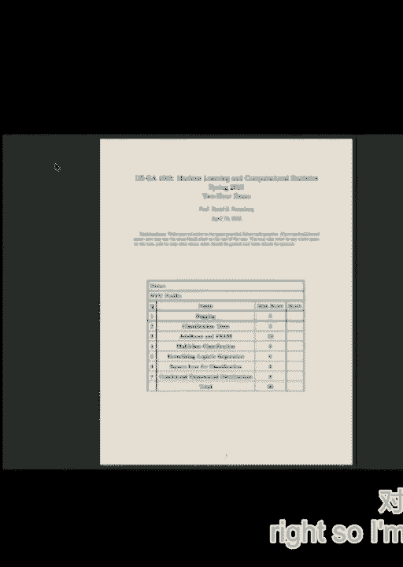
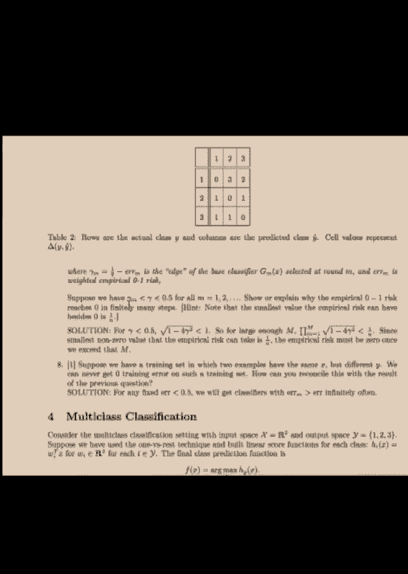
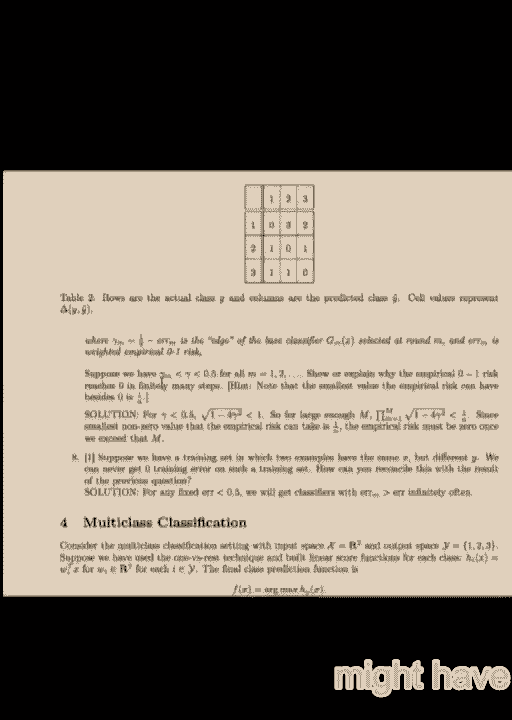
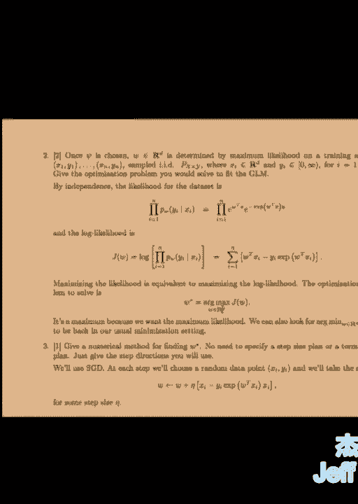
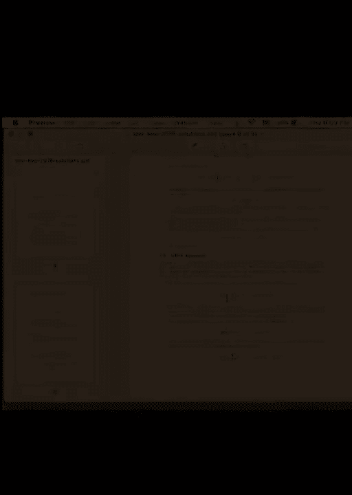

# P20：20.Lab_April_21 - Tesra-AI不错哟 - BV1aJ411y7p7

 Okay， so how would they exam？ How did it go？ Too easy， too short too long。 But it wasn't hard。

 right？

 Okay。 Can you read this？ It's not quite readable， right？ So I'm gonna try to。

 Okay， so most of the problems were very self-descriptive， so if you were attentive to the text。

 you would get a hang on to the solution。 That the text would guide you to the solution。

 It's also a problem。 The first problem tells you that we sampled from the data we have。

 then look at the averages of our predictions。 Then we compare what does the averages of predictions do compared to the。

 rather than having just one prediction。 So on one hand we have F。

 On the other hand we have N different samples from D and we'll get the averages of N different predictions。

 So these are identical samples and they also have the same size。

 So they have the same statistical properties。 All FIs in this question have the same statistical properties。

 Then clearly， but expectation of the average of something is just the expectation of the individual thing。

 In this case the average is F-hat and the individual thing is just one of the Fs。

 And we get by this equality here， the expected value of Z-bar is expected value of Z。 Why？

 Because expectation is linear。 In question？ Part two。 What about bias？

 By us it's just the difference between the expected value of our predictions to the true value。

 So it seems like it's a linear quantity。 Looking at the bias of Z and bias of Z-bar。

 you see that they're really cool because of part one。

 They're expected values are really cool and mu is the true value which doesn't change depending on the side of the equation you are。

 So you get the same value。 Just most questions have simple one-liner answers。

 The third part asks about the variance。 Now in this case it's variance is not a linear operator。

 That part can be a little tricky。 But all the information that's needed is given in the question。

 What breaks the narrative is the first equation here in the hint that if you multiply around the variable with a constant then it's variance case with that constant square。

 Then using that， taking that 1 over m out gives you 1 over m squared times the variance of the sum。

 Now you can break the sum apart using the second equation given in the hint which gives you m times variance of 1 of the random variables。

 I remember in the denominator we had 1 over m squared so 1 of the m's cancel gives you variance of Z divided by m。

 The fourth part which one would you choose？ The one that has a lower variance is a better candidate to choose。

 If you are the one who gets to choose。 The one part 6 is just the description of random force。

 So in part 5， since the general reason is the common sense reasoning is that you choose the one that has the lower variance in part 5。

 What this equation tells you is that if you have correlations you tend to have higher variance so you want to use the one that has less correlations。

 Because you want to use the one that has less variance， smaller variance。 That's enough。

 And just because you would use the one that has less variance is enough of an answer。

 Classification trees remember we had this simple tree。

 And the thing we want so I saw some papers that got confused in this question on what to look at。

 The first part I saw some answers that somehow separated the data that has four items into past distance and open space。

 But what is asked is really the main thing is whether the place is desired or not。

 So it's like a coin toast that you have four coins and the outcome is either heads or tails。

 In this case outcome is whether the place is desirable or not。

 And then you have certain other properties like the coin is biased or the coin is like a dime or a quarter。

 You look at other properties。 The main thing is whether it's desired or not。

 So each PI here it should actually refer to the probability that the place is desired or not。

 So given the sample you have four elements in the sample。

 What's the probability that a given place is desired？ It's one half。

 There are two possible outcomes。 Yes or no？ It's like a binary problem。

 So what you would have is the sum of two things。 First term is the yes term。

 The second term is no term。 Then each PI is one half because judging by the data you extract that probability information then you get one。

 Because log one half in base two is one also。 What do you mean when you use the formula entropy to say that it's not set for size？

 Yeah， it is great。 So it's like in the same case， probability of a coin。 A coin is heads or tails。

 So it's your omega is H or T。 That's what it refers to。 The size of omega here is two。

 If I was looking at two coin tosses。 Yes。 So it's like your event is the coin toss event。

 You can flip as many coins as you like。 The outcome will be heads or tails。 Your sample space。

 right？ Because you are tossing it once。 You don't do it twice。

 So tossing two coins in your row would mean buying two apartments。 You don't do that。

 And your sample space is this and then you draw samples from that。

 I think that many of us go from here to the analysis period。 You've got size of size。 Sorry。

 It's back。 Okay。 I thought that you was coming to the calculations。 Yeah。

 but in a sense that's testing a basic probability knowledge。

 So what if I've given you results of five coin tosses？ How would you do？ Your N is five？ No。

 it's not because your sample space is given。 The size of the sample space is known if you have it at hand。

 So you're not coming up with the probability model of the problem。 No， I understand that。

 But it's just a little confusing how it's written。 Well。

 I think the description of the problem is pretty clear because it emphasizes that you should focus on the desired column。

 And the desired column has two elements。 Either yes or no。 There's nothing else in it。 Yes？

 I used to do this because on the homework they define it like N as a number of elements that you have in the node。

 Yeah， here it's the same thing。 There's the yes node and there's no node。 Right？ So yes。

 there are two。 So how do you do this number of yes？ Number of elements which are yes。

 A form of total number of elements which are the end of the node。

 So you will be doing so according to number of two by two， or two by two。

 And on that side you could be longer and longer。 But it doesn't， it gives you the wrong answer。

 Not according to the solution。 It doesn't give you the correct interpretation。 Right？

 Then you have the each version of what this has to be given yet of one by two， one by two。

 one by two， one by two。 Yeah， but that's confusing two things。 The first part actually in this。

 you know， I read that there's no separation between leaves， right？

 You only have a set and you have four samples。 So in this problem before even starting to separate the data。

 you start your parent node。 In the parent node there's no separation。

 Then you focus on the parent node and you need to come up with the entropy of the parent node。

 Now you don't even， you didn't even split the data。

 And in the parent node you have four samples and from the four samples you gather probabilities because you don't know the actual distribution because those four are the only ones that you see。

 That's why the first part wants you to focus on the desiredness because that's your main thing。

 And then looking at the features you'll separate。 Then comes the leaves。

 So there will be three different ways of separating the data。

 Each one looking at the different features， right？ The features， so， you know。

 the text of the question somehow forces you to understand that， you know。

 desired is not the feature。 The desired is what we are looking at at the end， right？

 The features that we are going to use to separate are pet's distance and open space。

 So that's why the two parts， you know， it should be a hint that the first part is like introduction and the second part is three sub parts within itself that。

 you know， forces you to deal with the problem itself。

 Because even if you did the first part the way some of you did。

 then how would you continue in the second part？ The second part asks you to calculate the parent entropy minus weighted average of the children entropy。

 How are you going to come up with the weights？ What's the weight then？

 If you start the separation by looking at the desired ability。

 how are you going to calculate the w1 and the w2？ Right， it makes everything unclear。

 But it's not unclear。 So you could somehow reverse engineer the problem to fix the first one。

 And don't get me wrong， more than half of you got the problem correct。

 But the ones who didn't get it right， it's。 The focusing on the individual example gives you like probability is like 1/4 times log 1/4 and there are four terms。

 But many people also got partial credits for that too， so it's not the big loss。

 But I want you to understand the main issue here。 The third part for part C， in two。

 you didn't have to do any calculations。 It would be enough。

 So some of you also got credits if you did a wrong calculation in the first one。

 but if the same carries out in the other parts， you get full credit for that because you don't want to be punished multiple times for the single mistake。

 So even if you did part A and B wrong in part C， you said it's somewhere between A and B。

 you get full credit for that part。 Because the point is that it's going to be。

 it's going to carry less information than one feature and more information than the other feature。

 So it's information gauge should be somewhere between the two。

 You didn't have to go through the calculation。 And part three is just an obvious result from the looking at the three numbers。

 Again， you could get the numbers wrong but the interpretation correct and you get full credit。

 The third problem， the part one is just obvious。 Actually。

 then when you got here waiting and you see that it is possible that the prediction is a 0。

 the right way。 No， here it's given you that it's from Rd cross minus 1 to 1。 Which one？

 In the three。 G of X， use a zero value with no reference。 Here。 [inaudible]。

 But G is the return of the average one。 In part one it asks you to。

 it asks you what the base classifier returns。 Base classifier is just GM， right？ So it's a little。

 once it's not a presentation， it's a little hard to navigate。 So look。

 the base classifier is this one。 There's a typo here。 So this GM is not GM。 Of course。

 it's indicator function of GM Xi is not equal to Y i。 So it's the zero one。

 it's in the slides of the same of the corresponding section。

 The other was just the linear combination of the predictions。 Now。

 alphas are calculated on the way with the algorithm。 Then at the end you just take the sign of it。

 Also just the。 the usual thing。 If you did the homework or if you read the slides you probably would have remembered it。

 I think most of you got it right。 The part four。 of course you did it but it's hard to remember。

 So the description is given in the text。 And the key there is the optimization part。

 H and V are chosen to minimize the empirical risk。 So you just choose H and V。

 You just write the loss function and find the argument of the two of them together。

 That was also part of the homework。 One part of the homework， the optional part of the homework。

 even if you didn't solve it， the text of the homework was telling you that the title of the homework was that if you use the exponential function in FSAM。

 it gives you the other boost。 They correspond to each other。

 So you just write the exponential loss and you're good to go。 Part six is a true or false。

 What did you think？ Huh？ Yep， I mean now you see it but what do you think in the exam？

 It's false because the hypothesis space is different。

 Right one is the hypothesis space parameterized by V then it's V times X， V transpose times X。

 Then the other is just it's combinations of this that gives you that's the larger space。

 So it's not easy to recover。 The seventh part is just an estimation problem。

 There is a typo that we fixed during the exam。 I hope it wasn't frustrating。

 So the typo carries over here。 It's not fixed here。

 The point is not the fact that gamma m is less than 0。5。

 The whole point is that gamma m is away from zero。

 and strictly away from zero so gamma m has to be strictly away from zero。

 So there's a gap and why do we need the gap？ First of all， if I have a product。

 how can I have that product go to zero？ I have to have its terms to be less than 1。

 But I have to have its terms to be strictly less than 1。

 Because if I have this product of am from mountain infinity， then if I know that am converges to 1。

 I can't guarantee convergence of this product to zero。

 That's why I need gamma to be strictly away from zero。

 The first point you needed to write was the fact that this square root is less than 1。

 but it's strictly less than 1， because it's strictly less than 1 minus 4 times gamma squared。

 So that it doesn't come first to 1。 The second point is to notice that the range of values。

 that the function can take is discrete。 It can be zero， 1 over n， 2 over n。

 So as soon as it's less than 1 over n， which will happen because it converges。

 you just establish the fact that it converges to zero， then it will be zero。 It will reach zero。

 and it will reach zero in finite time。 Yes。 I have to hold out if gamma is zero for example。 Yes。

 It's less than a half。 Yes。 And you have a multiplication of a lot of ones。 Yes。

 And never will I be reached zero。 Yes， true。 And then it doesn't work。

 That's why gamma has to be away from zero。 This is a fixed number。 That's away from zero。

 Make maybe your confidence is difficult。 This is fixed。 So this first line。

 suppose we have gamma m less than gamma less than 0。5 is no longer the case。 The correct version is。

 suppose we have zero less than gamma less than gamma m。 And that less than one half actually。 Yes。

 Could you explain why you can improve on the test performance after you have zero or one on the train？

 It's not a problem， but we want to know if I can get it。 It doesn't guarantee， right？

 It doesn't guarantee anything about the test。 Does it？ Typically， yes。

 That's a generalization problem。 Like generalization problem in machine learning in general refers to whether finding a minimum in training set gives you a minimum in the test set。

 Sometimes it doesn't。 We know it doesn't because there's a phenomena called overfitting。

 Sometimes you find lower， lower points。 It gives you a higher error。

 You maybe shouldn't have done that。 Maybe you should have controlled your test set or validation set before it starts to increase。

 You remember the typical bottom of training curve going like this and the test curve going on like that somewhere。

 That's the generalization problem。 Like generalization problem has different effects on different problems。

 At that， I don't want to take any reason。 It just increases。 And it's right here。 But it doesn't。

 This can go to zero。

 This is the。 So I don't understand the mechanism that allowed you once you got zero error。

 But once you get zero error in the train set， you memorize data。 I remember。

 maybe I'm remembering incorrectly， but you thought I remembered that there were cases where you could continue improving even though perfectly labeled your training。

 Oh yeah， you can。 You can separate the data perfectly， but depending on the loss。

 your loss can still decrease。 So that's different because I think you're asking。

 "Suppose you have this data， this separates the data perfectly。"， But depending on your loss。

 this function will have a lower loss value。 So the fact that you separated the data doesn't mean that you found the lowest possible training cost。

 Your training cost is still parameterized and depends on where you put the exact line。

 And it probably has some sort of landscape like this in the parameter domain。

 And its values will be the loss values。 Maybe this separates your data。

 but maybe finding another local minimum here will give you a lower loss。

 And that might have better generalization or that might have worse generalization depending on your data。

 Does that clarify your previous question？ So part eight of it is that of course if you have the situation in which you have the same mix but different wise。

 then what's going to happen is that you won't have this non-convergence to one。 You had。

 you guaranteed that the factor didn't converge to one， but now it's not the case anymore。

 So the assumption of the previous part fails， hence the result also holds true。 Yeah？

 Sorry to ask you， Matt。 And you said in the entire site that you would have the u reach zero in finite。

 which means that。 Yes。 But。 And has the only thing if you're equal to zero， right？ True， right。

 So it's infinite， not finite。 Yes。 Why does it converge？ So many people didn't get it。

 It's good to emphasize。 So why does it go in finite？

 Even if we need M to vote infinity in order for that function to vote zero。

 What's the possible values of that function？ We are looking at the empirical risk， right？ Yes。

 The risk is discrete。 It can be zero， one over one， two over one， all the way up to one。

 So I know that since it goes to zero as M goes to infinity， I know that there is a finite M。

 let's say capital M， that's large enough。 I don't know how large。

 but it's large enough so that at some point it's going to be some positive number between zero and one over M。

 Okay。 Right。 Yeah。 Once I prove that the empirical loss is less than some number that's between zero and one over M。

 what can it be？ It has to be zero。 It has to be exactly zero because it doesn't take any other values。

 This range is limited。 But the range of values that that function can take。

 the function M tried to bound。 If I show that it's less than this。

 then there are three possible values。 This is zero， this is one over M。

 I'm telling you that there's some M， some capital M less high enough that that function will be less than some point here。

 If it's less than some point here， it can be anything in between。 It can be that as well。

 It can be that point。 It has to be zero。 And that capital M is the finite number that you are looking for。

 In the multi-class classification， we have to form the function C， C is x cross y， x is in R2。

 Our samples are drawn in R2。 And y is the set that has only three elements， one， two， three。

 And of course， the D is going to be six in this case。 It's just a simple representation of C。

 And this F is just rewriting of what's here， so did this part would be enough？ In the second part。

 the delta function is given in the table。 I mean， just have to put things in place and do the calculation。

 So you can take the i to be one here or one to be i。 It doesn't matter。

 It's just the outputs of h is for the sample x we have in hand。 So if you call it x1。

 then we can calculate this core function because we know delta， we know h's， right？

 We can calculate them。 So once we calculate， it's going to be zero， two， and so before we calculate。

 will it predict the correct class？ Yes， because the arg max of h， maximum of h is two。

 which is obtained at the prediction y， prediction one。

 And it was actually coming from the first class， so it's going to give us the correct answer。

 And then looking at the table and looking at the values given here， just write the function。 Oh。

 And the function， the loss function， your loss value will be two。

 Part three is using the same thing parameterized involved c than average over n samples。

 And the last part is the sub gradient of this。 So in finding the sub gradient。

 one issue that we have here is the maximum。 Got to somehow manage around the maximum and that is given in the hint。

 So how do you get rid of the maximum？ Since you know that g in gradient fk implies g in gradient f。

 so it's enough if you find a sub gradient of fk， right？

 And you do that by just plugging one specific y value， which is given which line。 Here， this line。

 So just clog this y-head i to get rid of max。 Once you get rid of max。

 you're able to write the sub gradient。 Since the first part doesn't depend on v。

 only this part depends on v and gradient of this is just simple linear algebra。

 Turnalized logistic regression。 Just putting everything together again in the same way。

 given in the text that you know your functions， your hypothesis space is the linear hypothesis space。

 the inner product of v and cx。 You need to have the square loss。

 so you write the norm squared of v of the parameters。 And there's a regularization parameter。

 Just put it in front of it。 Then the rest is of course the un-agularized loss。

 which is the average of the， data of the loss function and loss function is given a loss function above。

 Just replace n with the， again with what's given here y times f of x and f of x f comes from the hypothesis space。

 So f of x is just v times cx。 Put everything together and write the term。

 So we're calling for a mid-1。 Here c by m， we'll see。 If c is constant， that's fine。

 but if c is a parameter then we don't have it， right？ We don't have that parameter here。

 But if it's constant， then that's fine。 And now， so we want to use the representers theorem in the next part。

 We want to have the two forms look similar， so what we do is we take r as the square function。

 It takes the number x， gives x squared times some longer。

 And the point is that x squared satisfies the assumptions of the representers theorem。

 which is the fact that it has to be strictly increasing。 Now what do we do？

 If we know that the assumptions of the theorem satisfy， we can find a solution that's given。

 that's described in the body of the theorem。 So we just write the candidate solution as linear combinations of c's and then plug it in the inner product。

 Once we plug it in the inner product， we can take the sum out because inner product is a bilinear function in each variable。

 so we can take the constants out and the sum out in the same manner。

 And that gives us the inner product of c's only inside， so we get rid of the， you know。

 take the coefficients out。 And what's that inner product？ That inner product is the kernel。

 It's again given in the body of the problem。 So we just。

 so the law of line is just a notation difference。 This is the kernel of xi x and we kernelize that part。

 And we continue in the third part of the question。 So now we want to write all the。

 remember the J of V was this。 Now we want to write everything we see here in terms of the new notation。

 Now that， you know， we just reformulate everything in terms of x is what's V squared。

 norm V squared。 It's， we have norm of x is just inner product of x for my x squared root。

 You can write the norm in terms of inner product。 That gives you the first term of J。

 And for the second term of J， what do we need？ We need to write this inner product， V times c。

 So we plug V in that part， again taking the coefficients out， kernelizing is in the second part。

 We just get the representation of the loss we want in terms of alpha， in terms of the coefficients。

 It should be straight forward。 Any questions？ [silence]， [silence]， Okay， so the sixth problem。

 square loss for classification。 We have the， we have the square loss by minus prediction squared。

 obviously， but in this probability of accepting， we'll look at it given the data so it's given x and we take expectation after that。

 So one thing you should know in this problem is that， [silence]。

 So what is the thing that minimizes the square loss？

 Do you remember some of you taking the class loss and this and so on？

 You might remember the fact that the expected value， expected。

 so the conditional expectation minimizes the square loss。 But。

 I mean you didn't need to know that for the exam but it's， it's， it's important to remind yourself。

 So here， what do we have， we have with， so the problem again describes itself。

 We have to form expected value of the square loss given x， write it out。

 take the derivative with respect to y-head and solve for the parameter you want to solve。

 And why is it script random variable？ So given x， there are two values for y。

 it's either 1 or minus 1。 So given x， I can write it， oops。 Given x， if there are two cases。

 y is either 1 or minus 1。 If it's 1， it's 1 with probability p。

 Then it's p times 1 minus y-head squared， which is the function inside。 Plus。

 the other option is that y is minus 1， so here is y minus 1 in the second term。

 And that happens with probability 1 minus p。 And this is the function here。

 So the expected value of functions of random variables is taken in the same way。 So here。

 maybe probabilistic fact which， no， was how to calculate expected value of this。

 expected value of f of x in terms of the distribution of x。 Once you find this expression。

 the rest is more straightforward。 You want to find the argument， so you just take the derivative。

 just take the y-head， then set it to 0， solve for y-head。 Y is 2p minus 1。 And p here。

 in the solution for simplicity， was representing pi of x。

 So the actual solution you should have written should be f star of x is equal to 2 pi x minus 1。

 Then， of course， the last part is just solve pi for f。 So just a simple algebra。 Second part。 So。

 I showed that the square loss is a margin-based loss。 A margin is y-y-head。

 l-fam is 1 minus m squared， then how do you move forward？

 The loss that you had was y minus y-head squared。 If you write it out。

 you get the terms y times y-head。 So you can group them in terms of y times y-head。

 Maybe the tricky thing is。 I mean， the hint here tells you that this y squared is always 1 because it's either 1 or minus 1。

 This part is fine。 We don't have to deal with this because this is m already。

 I can write it in terms of m。 And this y-head squared， again， I can write it。 You know why？

 Since y squared is 1， I can multiply y-head squared with whatever I want。

 So y squared times y-head squared is。 I can add that factor to write it in terms of m。

 The whole point is just finding a way to extract m in the equation。 Then I get 1 minus m squared。

 Conditioned expectations。 You're given the family of functions we have。

 And you're given a map from W。 Any questions？ From W。 T。 X to lambda。 So given X。

 my parameter lambda can be characterized using the parameter V as V transpose times X。

 Then I can just replace the function here， lambda times e to the minus lambda y。

 by what I have lambda to be when I'm given X， which is again rewriting this function here。

 replacing lambda with exponential W transpose times X。 Second part。 Given data。

 given many variable samples like this， they're independent。

 so I can write the joint distribution as the product of their individual distribution。

 That's the independent sampling assumption。 Normally you just have to write。

 Parameterized by V of y given X。 They're vectors。 But if you know that they're in the family。

 you can just factor the map and multiply them。 And in the multiplication you replace it with the expression you found in the first part。

 And again， load likelihood is just taking the load。

 but in the load likelihood what's important is that you can always get rid of the terms that doesn't involve your parameters。

 You remember in the Gaussian case， if you look at the load likelihood you have all this product of factors of 1 over square root 2 pi's。

 All that doesn't matter in your load likelihood because you are not interested in the values of the load likelihood。

 You are interested in the location in the domain that maximizes the load likelihood。

 That's the whole point of doing maximum likelihood estimation。

 Taking log just makes things easier to do the differentiation。

 And as another sign that the values of that logged function is not important。

 The location of the point in the domain is important。 That's what matters for you。

 And that's represented in the fact that you are interested in is argmax of JFW in RD。

 What numerical methods did you use？ The minimum optimization would be good。

 This describes the Schrasse gradient as a sample because we just take one sample from the whole sum。

 And we write the derivative of that sample and then we take a step in the negative of the gradient of that particular example。

 multiplied by some positive step size。 Just the description of a Schrasse gradient descent。

 I could have used the sum that would be an ingredient descent。

 And you don't have to find the whole algorithm。 It's just the step。 Again， in the same way。

 it's the function approach。 Now it's some function in the exponential。 Just write the J。 Again。

 take the derivative with respect to F。 It's pretty much the same way of taking the derivative with respect to a variable。

 If you parameterize your function， then you could use chain rule to use this formula and apply it to chain rule to find the original expression with all the parameters you have for the purpose of coding。

 Then in the same way， it's just the argument over the hypothesis space of your loss function。

 the gradient of the loss function。 I guess that's the end of the exam。 There are no more pages。

 Any other questions regarding the exam？ I think there are a few typos。 Once they are fixed。

 David might post it online。 He might not post it online， but if he doesn't， he'll put it on PESA。

 So he'll have access to it， but I think it's better if exams are somehow not like public access to the classroom。

 But I don't know if the video is accessible， so maybe we already broke that part。

 What do you expect from the back？ I mean， if you think， let me think。 Hopefully next week in class。

 or maybe some other time， then， you know， if you don't bother。 Sometimes next week， I believe。

 [Loud laughter]， you。

