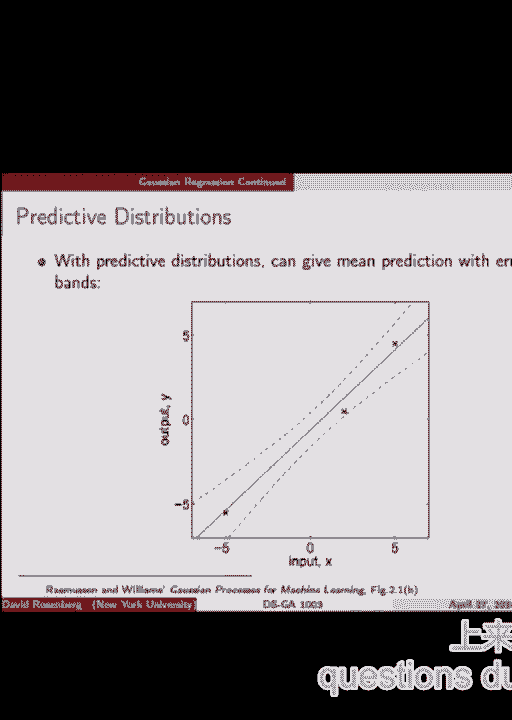
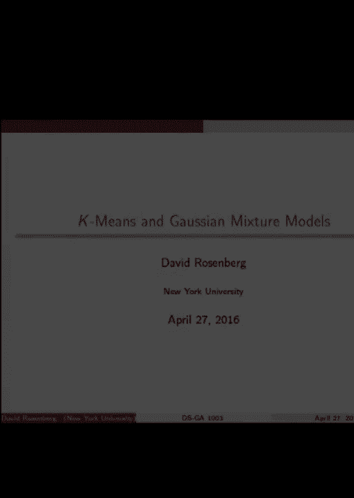
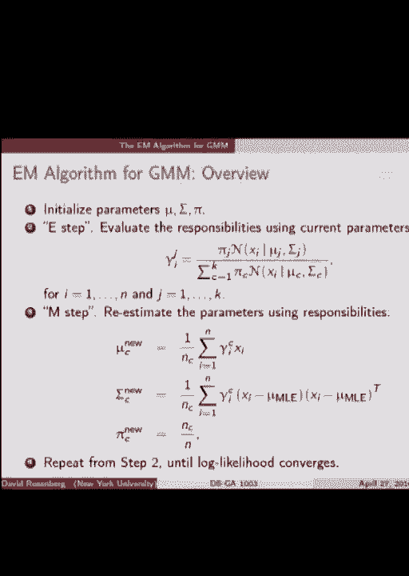
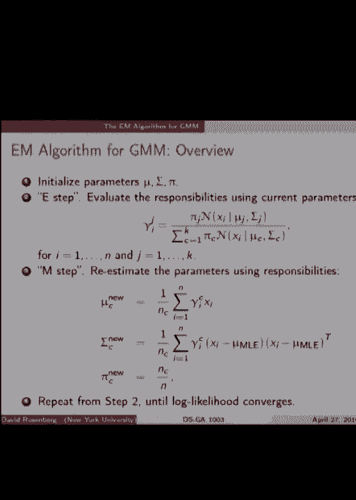
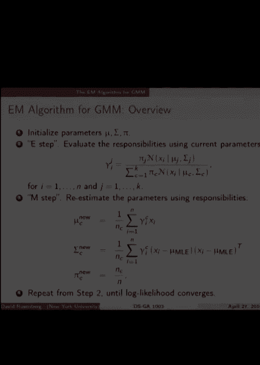
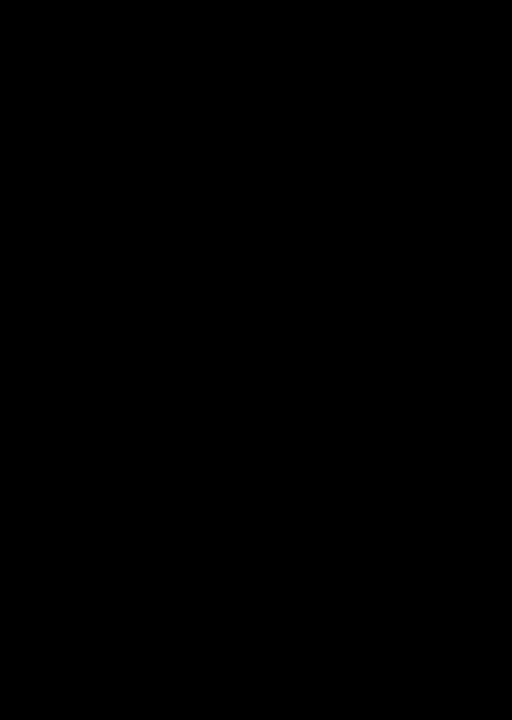

# P21：21.Lecture_April_27 - Tesra-AI不错哟 - BV1aJ411y7p7

伙计们，我们开始吧很大声。

所以今天我们继续讨论贝叶斯方法，嗯，最后一个家庭作业是贝叶斯方法，一个特别的，回声很吵，你们这些家伙，烦不烦，是啊，是啊，声音有点太大了，我把声音关小一点，这最好得到专家所做的，所有的权利。所以我就继续说，所以接下来的作业，最后一个家庭作业将下降最低的家庭作业率，所以如果你做得很好，到目前为止在你的家庭作业上，那你就可以跳过最后的作业了，我认为这是好东西，如果你真的不想做，在夏天做。对你有好处，一切都会好起来的，嗯，贝叶斯统计的贝塔二项式模型，这是尽可能简单的，但话说回来，我们深入到不同的方法来处理它，所以一些关于经验基础和等级贝叶斯的东西，所以我觉得值得一看，好的，好的好的。好的，所以我们继续用贝叶斯方法，我们将在今天的第一部分讨论贝叶斯回归，稍后我们将进行一些内部聚类，我们来谈谈K的意思，我想你们大多数人都听说过，然后混合模型开始高斯混合模型。

明天我们希望能完成高斯混合模型，并对EM算法进行了一般处理，那个，我们将值得准备，我会在广场上给你一些提示，这可能是一些很好的数学复习，好的，让我们先开始吧，建立的贝叶斯统计的简要回顾，嗯。在贝叶斯统计中，数据科学家从两件事开始，一个是似然模型，会是这样的，如果d是我们的数据，这给了我们观察到的数据集的概率或可能性，d以某个参数θ为条件，我们不知道某个参数空间中的θ，到目前为止是什么。这与频率统计相同，贝叶斯统计的特别之处，不同的是，我们也认为θ是一个随机变量，而且我们在θ上给出了概率分布，也是数据科学家的工作，甚至在查看任何数据之前，这叫做先验分布，在任何观察之前的先验意义。所以我们有这个似然模型，这给了我们给定未知θ的数据的可能性，然后我们有θ的先验分布p，你把它们放在一起，你就有了一个关于什么的联合分发，你喜欢这个关于数据和参数θ的系列，对呀，好的，所以在这种情况下。

有什么未知的吗，我们到底是什么意思，有没有什么未知的参数，什么，我们在θ上有一个完整的联合分布，数据d没有参数可以调整，没有，在某种意义上，没有什么是未知的，不像在一个频繁的设置中，我们离开θ。作为我们必须适应的东西，这是一个微妙的区别，好的，所以我们建立了我们的先验，我们设定了我们的可能性，然后要做的是计算θ上的后验分布，给定数据d，它将写θ的p给定d，最后我们可能想采取某种行动。也许它在预测你对θ的最佳猜测，不管是什么，你可以根据θ的后部分布来做这个动作，给定数据，它总结了我们能够从数据中提取的所有信息，关于参数θ，好的，所以您可能想要采取的行动示例，你可以看看所以θ。在我们观察数据D之后，我们可以得到θ上的分布，后部分布，然后我们可能会产生一个动作，后验分布的期望值，即单个数字或单个值，你可以产生一个间隔AB，我们认为包含概率点9。5的随机变量θ。

这是置信区间的贝叶斯模拟，你可以作为行动产生不同的东西，所有的权利，所以后验分布只是叙述了贝叶斯规则的简单应用，这里有几个物体的名字，我们要谈很多，这是左边的后面，在给定θ的情况下，θ的p是先验的。d的p是边际可能性，注意后验分布是θ上的分布，这是θ的函数，你插入一个θ，它告诉你概率的可能性，对呀，所以d的分母p与θ无关，所以它就像一个缩放常数，所以我们真的可以只写θ上的分布。θ的密度与分子成正比，我们可以把d的p，它只是一个缩放参数，如果我们想把它找回来，我们如何找到D的P是什么，首先是什么样的物体，这是一个数字，d的p是一个数。我们知道这个分布在θ上的积分必须是这个函数中的1，θ上，这样你就可以积分分子，你知道它必须等于d的p，好的，所以这就是你恢复它的方法，所有的权利，关于贝叶斯方法的总结，我们想出了代表我们信仰的私人。

在我们看数据d之前，然后我们看到数据d，后验分布给了我们某种合理的，我们对θ的信念的最合理的更新，这是对这种贝叶斯方法的一种解释，然后我们把所有的动作都建立在theta上的后验分布上，好的，好。上周我们讨论了抛硬币，记住贝塔先验和二项分布，我们试图估计头部的概率，今天我们要讨论一些可能更实际的东西，或者至少也很有用，它是贝叶斯设置下的线性回归，好的，所以贝叶斯条件模型。现在我们又回到了一个预测的环境中，其中我们有一个输入空间和一个输出空间或输入空间，像往常一样，输出空间为卷轴，现在当我们写下我们的可能性模型，或者我们可以称之为条件概率模型，在给出θ之前，它只是y的p。现在我们把x放在条件右边，因为我们要预测给定输入x的y的分布，一种回归设置，输入输出好的，当我们说条件概率模型时，我们是说我们在限制输入x，这里的数据，那是，那不是，在那个术语中条件指的是什么。

在这些条件模型中，你会看到每一步，在每一个方程中，我们总是以X为条件，基本上等价于假设x都是已知的，他们不是，那个，它们甚至不是随机的，当你假设你知道它是什么时，所以就好像它不是随机的。只是一个固定的数字，所以在整个过程中，可以安全地假设每个人都知道X，每个人都知道X是什么，你不必真的把它们当作随机变量，有时我们会把它们放在调理中，有时我们不会好，所以我们当然有条件概率模型。然后我们仍然有θ上的先验分布，作为一般的条件模型，现在，让我们具体一点，让我们来谈谈高斯回归模型，我们以前见过这种情况，事件在实验室里呈现了这一点，这是当我们预测给定x产生y的条件分布时。我们假设y是高斯的，我们现在重复一遍，给定输入x的y的分布，给定这个未知的参数向量w，y的分布是平均w的高斯分布，转置x方差sigma平方，好的，所以这对你来说应该很熟悉，我们以前也经历过同样的事情。

嗯，唯一不同的是，现在我们要在W上先验，而不是试图用最大似然估计它，所以以前当我们有这组模型时，我们可以计算，鉴于我们的数据，我们有所有这些X和Y，我们可以计算数据的可能性。我们通过将大量高斯密度相乘来观察到，然后我们可以找到使可能性最大化的W，这将是W的最大似然估计，我们想预测给定x的y的分布，我们预测高斯w转置x，对此有什么问题吗？熟悉的，所有的权利。那么什么是一个快速的概念，检查，这里的参数空间是多少，到目前为止，很棘手，我真的没说，如果我们在先驱者，在贝叶斯设置中，或者不在标准设置中，我们在哪里，我们说的是有参数，参数为w，如果这是经常设置。参数为w，参数空间将为rd，好的，所以我们有一些数据，我们将使用一些方便的符号，这里，我们要用，不带下标的y作为所有y的向量，和x没有下标到所有x的向量，D将是对的集合，好的，是啊，是啊，非常感谢，a。

所以西格玛平方，我假设我们知道西格玛平方，这只是我们定义的模型，w是未知的吗，但是西格玛平方被称为遗憾，使西格玛更小，那更好，就像我们保持一个更精确的预测，是呀，所以你可以说什么。如果我们不假设sigma平方是节点，我们试图拟合西格玛平方和W，使用最大似然，你绝对可以这么做，然后你也会问这会有问题吗，西格玛平方的最大似然估计会归零吗，1。你又问这个问题了，是呀。所以最大的可能性是零，但实际上只有这样，如果所有的数据点都在一条线上，所以如果，例如，你只有两个数据点，那么确实没有最大似然估计量，因为你会让可能性变得越来越大，如果你把西格玛分数变小，但与点不共线。那你就找不到了，那就不是这样了，好问题，好的，我们假设y i是条件独立的，如您所料，给出了W，y的给定x，让我们来解决那些细节，所以现在y是我们所有观测值的向量，所以通过有条件的独立性。

我们可以把它写成单个概率的乘积，个别观察的可能性，我为什么要纠正，好的很好，现在我们只需插入我们的模型，看一下这个，好的，关于这是从哪里来的任何问题，所有的权利，所以现在我声称你应该能在你的脑海中看到。对此的最大似然估计是非常熟悉的，那么我们如何在这种情况下找到W的最大似然估计，我们写下了什么，我们把接头写下来了，比如我们数据的可能性，这是我们数据的可能性的表达式，最大似然估计为。让我们最大化这个表达式，什么什么参数w，我们会找到一个使它最大化的w，好的，是啊，是啊，这里的意思是平方，为什么让我把这个日志，这就变成了常数之和，日志和X取消，就像平方的负和。所以我们试图使负平方和最大化，这就像最小化y之间的平方和，这只是最小二乘，回归，所有的权利，只是复习一下好吗，所以现在我们进入贝叶斯方法，到目前为止，这个高斯似然，我们讨论过的最大可能性，这不是贝叶斯。

然而现在我们通过引入W上的先验来使其成为贝叶斯，所以w现在从一个参数变成了类似于，在我们的设置中是一个随机变量，所以我们在W上选择一个先验分布，让我们保持简单，让我们在W上有一个高斯先验。均值零和协方差矩阵相同，西格玛零，就目前而言，这可能是武断的，希望它是积极的，确定，所有的权利，我选择了零和西格玛零，这些不是，这些都不是未知的，他们是众所周知的，我把它们修好了，它看起来像一个变量。但那是一个特定的矩阵，所有的权利，所以这是一个，这是W上的固定分布，后向分布，那么p y等于d，让我们打破它所有的权利，所以w给定x y，我们可以用贝叶斯规则翻转y和w，所以我们在那里做了，我们可以把。对于比例，我们可以减多少？所以这里的第一行是这一块的可能性，然后我需要添加什么来获得相等，W的前p，也就是W上的高斯密度，就像那样对吧，所以这是一个表达式，W后验分布的显式表达式，给定数据d。

问题是这是简单的还是复杂的，它现在看起来像是两个高斯的乘积，有一堆像高斯一样的东西简化了还是不好，我们会回来的，好的，所以我们在W上有一个后部，我们能用它做什么，这个有趣的地方是什么？它给了我们什么。所以说，假设我们知道W好吧，我看看我们的可能性模型，你认为最好的预测函数是什么，我可以为你付出，所以给定x是最好的预测，我可以为你付出，我告诉你，而且，你知道数据是如何生成的。因为我们假设我也给你可能性模型，那么给定x，y的最佳摩擦力是多少，所以再一次，是啊，是啊，给定x的y的期望值实际上通常称为回归函数，在某些情况下是最佳的在什么情况下，特别是，好的。如果我们试图最小化预期的平方误差，在我们的预测和实际值之间，那么给定x的y的条件期望确实使这个权利最小化，它还最小化了其他一些损失函数，但是损失，平方损失是我们在这里关注的，很好，所以如果我告诉你W。

我们正在努力对平方损失进行最佳选择，然后是的，你应该把y的期望值给定x优，给定x，y的期望值是多少，第二天马车的第一个位置，太好了，是的，所以给定x和w，y的分布是高斯分布，带平均w转置x。给定x的y的期望值，你知道w是w转置x的平均值，所以你能做的最好的就是预测w转置x，如果你知道W好吧，我们不知道，我们在W上有什么，我们有W上的概率分布，称为后验分布，这是我们对W的分布的最佳猜测。它代表了我们观察数据后对W的信念，好的，所以赶上幻灯片，所以W上的分布有效地给出了每个W的预测函数的分布，我们有我们最好的预测功能，我们可以使用，所以我们有一个W上的分布，它给出了预测函数上的分布。事实上，我们从预测函数的分布开始，我也是，我们从W右边的分布开始，那是先验的，因此W上的先验分布对应于预测函数上的先验分布，W上的后验分布与预测函数上的后验分布不同，到目前为止。

我们有一个关于预测函数的分布，我们一会儿看看能做些什么，但让我们举一个快速的例子，看看我们目前所拥有的一些可视化好的，最简单的例子，输入空间只是间隔-负-1-右，输出空间是卷轴，让我们取一个线性模型。这是一个一维输入空间对吧，但我们会有一个偏见项，所以输出y是真正的数据生成模型，y等于w零加w一x，加上一些噪声项，ε具有高斯分布，均值为零，不变性已知，好的，那么Y的可能性模型是什么，y给定x和w是。非常好，所以给定x和w，y的分布，这就是为什么我给x和all，而w 0，w 1是高斯的，以此为平均值，这是方差，因为w零加w一x，这只是一个数字，你加上一个随机变量是正态分布的，均值为零。这将使高斯分布的均值变为w零，加w 1 x，所以这就是数据最初生成的方式，这是另一个，这本质上是，这完全是一回事，只是另一种写模型y的方法，给定x和w，我一直在玩参数空间是什么，但我不是这个意思。

为什么我还不能做贝叶斯，所以如果这仍然是一种频繁的方法，w可以是参数，在这种情况下是两个，我想我会改变这一点，在幻灯片上进行预先分发，我们将一个简单的高斯均值为零，i是单位矩阵。所以两个独立的高斯分布在w 0和w 1上，是呀，拜托了，无估计数，没有估计数，我的优先级集中在零，我为什么选择那个，如果你知道你的想法，w将围绕，用那个，如果你这样做了，你通常可以中心或数据。在某种程度上，你对W的最佳猜测是归零什么的，什么，那一半是怎么回事？我必须你必须，你必须选择一些东西来生成，你必须开始，你得挑一些东西，那么一半i代表什么呢，所以，在某种意义上是一半。那么这个标准差是多少，大概就是，看情况，如果这是标准差的方差，但我们只能说这是标准，标准差，所以我说，我想W是，你知道的，居中，所以我要说平均值为零，我认为合理的期望值范围大约是，正负一半。

所以它是一种布景，W的刻度，我不是，我非常，我觉得，最优的w 0和w 1不太可能是100对的，所以方差设置了我期望w的尺度，这是个好问题，W零W一上的均匀分布，您可以选择任何发行版。它应该代表一些你认为合理的价值，选择特定类型分布的另一个原因是因为它使某些计算变得容易得多，所以这里选择高斯不是巧合，它会使所有的计算变得非常简单，并以封闭形式，在这种情况下，高斯被称为共轭先验。因为我们会发现后验分布也是高斯分布，我们可以明确地写下所有的后部，如果你使用制服，肯定不会是这样，你还可以用它，但一切都必须用数字来完成通过数字计算和集成或模拟，或者类似的东西，一般来说。可以互相联合分配，在这种情况下，它是高斯的，有一个对角协方差矩阵，所以他们是独立的，这回答了你的问题吗？是什么分布，首先，w是两个随机变量上的两个数w零和w的向量，w 0和w 1，哦，我明白了。

我想我看到了有趣的，所以这是一个数对上的高斯分布，这是一个二维高斯分布，你可以看出，因为它有一个协方差矩阵，因为我一直在说这是一个二乘二的单位矩阵，还有一些问题，问几个问题是有道理的，我们要看一些照片。好的，所有的权利，如果你知道预言，你能有的最好的预测，是啊，是啊，拜托了，对，这么好的问题，问题是你的参数，你以前的分配有关系吗，如果样本量无穷大，让我这样捕捉它，答案是如果你做了先验，对不对。你一定要小心，先验给出了每个可能的参数值的某种可能性，这些参数值实际上可能是真的，所以如果你在负1上使用均匀分布，负一一，这个盒子，你永远不能有一个有任何重量的后部，一些不在同一个盒子里的东西，好的。你可以有不同的重量，但是如果你的先验给出了空间中某个特定点的零概率，那么后验概率也为零，你可以摆脱零概率或零可能性，所以，但除此之外，是呀，只要在我们的情况下，高斯分布完全支持，换句话说，到处都大于零。

那么当样本量无穷大时，后验将与先验无关，是啊，是啊，它收敛到你想要的东西，那是单独的课程，所以让我们先想想左边的先驱者，我们有一张W0和W1上的先验分布的图，x轴为w零，蜡是W一。记住我们这里有两个未知数，它们对w0和w1感兴趣，你看它在零点被审查了，好吧，这是高斯分布的热图，你觉得右边是怎么回事，轴是x和y，我们有所有这些线条，对应于不同W的预测函数。这些w是我如何生成这些w的，我不是从一本书上得到的，他们是如何在书中生成的，好的，在这种情况下，这些W来自先验分布，好的，我们实际上已经用Python重新实现了这一点，这个原始代码是，我不知道。然后你们知道凯文·墨菲，我们去年用了这本书，所以他在MATLAB中重新实现了，制作这些图片的代码，去年夏天，我们用Python再次实现了它，但我没有复制这里的新图片，原来这还是贝肖普书上的老照片。

如果你有兴趣，是呀，在右边，这是给定x和w的y的期望值，这是我们在给定x的情况下对y的最佳预测，对于从先验分布中随机选择的许多不同的W，所以在看到任何数据之前，记住我们有W的先验。每个W都给我们一个预测函数，y的期望值给定x，这就是这里所画的，许多不同的预测函数，赖特，伟大，现在，让我们看看一些数据，所以这是在一次观察之后，经过一次观察，我们可以更新我们的先验并得到W的后验分布。w上的后验分布就是我们在这里看到的，所以它不再是球形的了，它变成了椭圆形，对呀，嗯好吧，右边是现在我们从后验分布中提取的w，在一次观察之后，W是从这个分布中取样的，你会看到预测函数有更多的一致性。现在比以前，这是先验和后验，经过一次观察，哦耶，谢谢。是呀，蓝色圆圈是我们观察到的单个数据点，所以说，在贝叶斯统计中，这是偷偷的，因为事先没有任何数据，我们已经有了预测函数，从先前的，我们有预测函数。

我们也有从一个点的预测函数，他们已经好一点了，这真的没有意义，在频繁设置中对单个数据点进行线性回归，最大似然，那就一点也不有趣了，没有最大可能性，有无限多条线穿过一个点。我们如何通过观察一个点从先验分布得到后验分布，就这么做吧，你写下让我们，让我们，让我们快速看一下，好吧，在这里，这是后验分布，在这里只有一个数据点可能会有问题，当您有一个数据点时会发生什么。这是任意数据集的后验分布，d如果您有一个数据点，这个n是一，所以你有一个高斯和另一个高斯的乘积，所以没关系，就是这样，关于这件商品有什么问题吗？所有的权利，让我们再做一些点，因为这里有两个观察。然后二十次观察，你可以看到这是两个数据点，这是二十块钱，你可以看到后验分布集中在一个特定的向量上，预测函数变得更加均匀，是呀，好的，有趣的问题，为什么，为什么我们如此。

为什么我们要费心绘制预测样本的整个分布，从预测函数上的分布，为什么不选一个看起来最好的，你是说最好的办法是，我要说，也许你是说这个分布的最高点，我们以前讨论过的东西有个名字，你们还记得上周。后部的模式称为地图，地图后验最大值，所以是的，你可以把地图插进去，你可以拿着地图W，想出一个单一的预测函数，绝对没问题，贝叶斯给出了初学者的分布，这就是我们现在看到的好问题，所有的权利，所以让我们。让我们更深入地研究一下一般的高斯回归，看看有什么，让我们看看这些后部到底是什么样子，所以在这种情况下我们可以得到后部的闭合形式，这是非常好的，所以再一次，如果我们的模型，如果我们的先驱者有一个高斯。让我们把X写成我们的设计矩阵，记住设计矩阵具有观察特性，x行到xn行中的向量，有N行D列，有很多特点，那是一个设计矩阵，y是响应向量，所以给定d的w的后验分布，如果世界对我们好，这应该是高斯的。

它是我已经写出来的碎片，所以给定d的w的后部是高斯的，具有特定均值和特定协方差，我在下面写，所以看一下这个mu p，P代表后部，不完全是，如果你清楚的话，因为p也可以表示先前的，但在这种情况下。它是用于后部的，这东西看起来眼熟吗，所以在我们谈论那个熟悉的事情之前，有一件事，这里有一件事很有趣，这个sigma p给了我们一些不确定性，在我们和我们所知道的，所以如果后验方差sigma子p是，哦。什么是，这是一个协方差矩阵，所以如果它有特征值，或者是对角线，不会是，但如果它是对角线，入口很小，那么这将是一个小的，方差很小，这意味着我们非常确定W好的，所以后部是高斯的，是呀，地图估计器是什么。W的地图估计，大声喊出来，是啊，是啊，映射估计是高斯分布后验分布的最高点，最高点是平均值，模式也是平均值，所有的权利，所以意思是u p，这是我们的U P是我们的地图估计，这是正确的，伟大。

让我们把这种联系与你发现的如此熟悉的东西联系起来，显式，所以如果先验方差是lambda上的信号平方II是对角线，是单位矩阵，那么后验平均值正是这个表达式，这正是我们从富回归中得到的。就在lambda是正则化参数的地方，所以这是一个有趣的联系，你觉得怎么样，好的，那么让我们如何得到最大的可能性，当M意味着什么，我们不是在给定d的情况下最大化mu，也不是在给定w的情况下最大化d。记住当你在给定w的情况下最大化d时，这只是可能性模型，没有先验的可能性，给定w，只是让我回到这个，这是w给定d的概率，对了，这是这两者的乘积，给定w，这一块是d的概率，这是最大似然的w右概率。我们只有这个可能性片段，所以当我们最大化这个，没有，没有，甚至，在这种情况下会有，嗯，后面出现的lambda甚至不在这个可能性项中，让我马上有一套更好的方程，再看看这个后部分布。

所以我们可以根据先验分布来写这个，右后的可能性是先前的时间，与先前时间成正比的似然，所以先验在W上先验的可能性为零，平均高斯，可能性是高斯的，好的，现在我们已经插上了，我们已经插入了西格玛零的特殊值。好的，所以说，如果我们把这个最大化，这就给了我们地图，这是最大的后部，如果我们把这个可能性最大化，这是最大的可能性，所以他们不一样，是啊，是啊，当然，所以我们在w上最大化整个表达式，那是地图。这是后部分布的最大值，如果我们在没有先验的情况下最大化可能性，那是最大的可能性，我们如何通过调整来获得最大似然，我们如何从调整先前的，我们可以改变我们的前任什么，也许这个方差，是啊，是啊，当λ归零时。这整个，括号里的这个东西归零，X骨它去，1。这事从头至尾，所以当λ接近零时，这个后验接近可能性，是呀，在这里我们必须是的，那倒是真的，有趣的一点是，让我们一会儿回到这个问题，提醒我好吧，是呀。

西格玛零是先验的方差，这不可能出现在，在所有这些小西格玛平方，这是似然模型中的方差，我们假设我们知道西格玛是对的，好的，所以当lambda为零时，后部就会向最大似然，或者更确切地说。发生在先前的事情上的可能性，当λ为零时，先驱者得到的很大，方差变平，为什么因为当λ归零时，西格玛零会变得很大，这使得方差很大，对呀，所以一个非常分散的先驱者，随着先驱者变得越来越分散，方差越来越大。是呀，它变得越来越像是在做最大可能性，好的，如此伟大，所以要找到地图，我们也可以做负对数似然的最小值，精细，它分解成这两块，这正是现在的岭回归目标函数，所以有一个很好的问题，在脊回归设置中。我们不假装我们知道我们应该使用什么lambda，我们有一个验证集，我们两个lambda对验证集进行优化，在这个贝叶斯设置中，前提是你只要写下你的前科，这就是本质上与选择正则化参数lambda相对应的。

甚至不看验证数据，这很有趣，事实就是这样，那么贝叶斯是做什么的，当她不知道方差应该是什么样子的时候，不知道，你可以猜到一些事情，但正如我们从岭回归实验中所知道的，调优参数很重要。所以你实际上可以做的是把另一个分布，嗯真的，你能做的另一件事是你能，这不再是贝叶斯方法，你可以做所谓的经验贝叶斯，这是你从数据中估计lambda的地方，这种感觉是你找到了lambda。它给你的数据提供了最高的可能性，无论如何，我们不再，是啊，是啊，这是正确的，如果您使用您的数据来帮助您选择不再是此优先项的lambda，在我们的意思是，所以这是一点点，素描。这当然不是一个标准的可接受的贝叶斯实践，然而，在实践中，它做了很多，嗯，所以我们将在家庭作业中探讨这一点，不适合这个型号，但是对于贝塔二项式模型，好的，伟大的伟大的问题，有一件事，这很好，不过。

在这种情况下，lambda有一个非常自然的解释，它代表了，我们先前的差异，所以你知道我们有一个非常自然的，我们可能对W的尺度有一个非常合理的想法，所以从这个来看，这让我们了解了如何设置正则化参数，好的。所有的权利，所以这里再来几张幻灯片，我们已经讨论过后部，我们已经讨论过对每个W提出我们的预测函数，我们得到了预测函数上的分布，好的，所以假设，我们现在希望将贝叶斯设置应用于新的数据点。我们有我们的训练数据，现在我们正在部署我们的模型，我们得到一个新的输入点，x次新，我们想对Y潜艇做一个预测，做什么好吗，所以首先，我们有一个预测分布，y新给定x新和数据d的概率分布，在后面的设置中。因为我们在根据数据进行调节，训练数据D好吧，很简单，现在只是一个集成问题，让我们加上我们的θ，我已经用通用的θ代替了w，很抱歉造成了混乱，所以把条件θ，然后乘以θ在θ上积分的概率。

这就是我们如何得出预测的分布，好的，所以说，对于高斯回归，这出来有一个封闭的形式，这是非常好的，让我们把它写下来，所以给定一个新的数据点，的，Y的后验分布，Y的预测分布，给定x又是yaum。平均值是你所期望的，w参数的后验平均值，这个mu p是从w右的后验分布一直回来的，w的后验分布有me和mu p及协方差，西格玛p所以新p转置x新，这是我们最好的预测，有趣的是，这就是我们要预测的方差。与那个预测有关，这就像用特定的均值和方差挖洞，所以现在它有两块，首先，它有这个西格玛U X新，西格玛PX新，这来自θ的方差，这应该是W对不起错别字，这来自我们未知参数w的方差，我们的未知系数向量。因为我们对W有不确定性，预测会有不确定性，对吧，这就是这一块来自第二块西格玛平方，西格玛的平方，似然模型中的单平方，当y生成时，我们加入方差西格玛平方的高斯噪声，没有办法预测你的出路。

总是会有这个基线西格玛平方，数据中的噪声水平，即使我们确定，我们有一个无限的数据集大小，本学期，这个方差我们为零，因为我们对W有绝对的确定性，但这个西格玛方块永远不会消失，所以当你有预测分布时很好。你现在可以用错误条绘制你的预测函数，因为我们有每一个x，我们有Y的完整分布，所以一种写法是，画这种素描的一种方法，分配是，为每个x画y的平均值，就是这条线，然后在预测周围绘制标准误差条或标准差条。所以这很好，我们现在有了错误条，在误差范围内或对我们的预测有信心，好的，对此有什么问题吗，对贝叶斯来说就这样了，2。如果你们有任何问题的话，就请大家暂停一下，十分钟后见。

就像波浪，各位，快速看一下设置一下，所以我们要讨论混合模型，高斯混合模型，但是让我们用K来热身，所以这里有一些数据，老忠实间歇泉数据，我们有很多点，通常它们似乎分成两簇，算法上。我们怎样才能找到这些集群，好的，那是，这就是问题所在，祝福你，所以K表示这是算法，我们先把数据标准化，稍后我们将讨论为什么随机选择两个集群中心，嗯，提醒我回到这个问题上来，这本身就是一个有趣的问题。随机选择两个集群中心后的下一步是什么，这对你看到的每一个点都是正确的，哪个集群中心离你最近，并将其分配给该群集，所以哎呀，我们开始了，这是更接近蓝色和红色集群中心的分界线，这些是分配给这个集群的所有点。这些是分配给这个集群的所有点，这是我们的算法之一，好的，第二步，现在我们取每个集群中的所有点，找到它们的平均值，并将集群中心移动到平均值，这就是这里发生的事情，所以我们有了新的集群中心手段。

现在我们对每一个点迭代，我们把它分配到最接近，所以所有这些点现在都将连接到这个集群中心，像这样，好的，迭代直到收敛，那是K的意思，聚类，为什么我说这实际上是一个有趣的问题，选择集群中心，好的。如果你在他们应该在的地方打了一口井，它减少了你的工作很多，是啊，是啊，好吧，我想说，在这种情况下，这可能并不重要，嗯，可能有一点点，但是在非常高的维度上发生的事情，和非常高的维度，很难找到。很难找到自然集群中心的点，所以通常最安全的做法是选择随机的数据点，成为集群中心，而不是费心在空间中的随机点，以确保您的集群中心，或者至少接近某些点，在另一个宇宙里没有出路，好的，好，所以说。为什么要把数据标准化好，这里是，下面是k均值聚类结果的说明，当我们不标准化数据时，这是怎么回事，视觉上，为什么这些是蓝色的，为什么这些点，蓝色的在这里，这一点似乎不应该在黑色星系团中的这个星系团中。

这是怎么回事，看看这个刻度是什么，Y维，它正在以百分之十的速度前进，所以我们在x维，它正在以一个和更大的，所以任何微小的差异，从视觉上看，在广阔的方向上对距离做出了巨大的贡献。所以本质上这个y距离真的很重要，它或多或少只是沿着y轴分离，所以这是个好主意，如果你没有任何事先的意见，关于每个维度重新调整为相同的单元有多重要，然后在视觉上修复了修复，考虑数据的规模总是很重要的问题。是呀，所以有意见有意义吗，当然，更普遍地说，现在我们用欧几里得距离表示距离，你可以使用任何你想要的距离度量，你可以定义距离度量来表示你的想法，是衡量两件事有多不同的一个很好的尺度。所以也许有一个特殊的特征自然具有巨大的规模，它是以千为单位，其他的都是以十为单位，但你不认为这个功能真的很重要，并且不应该对整个距离有很大的贡献，然后把它往下缩，但如果你认为你知道。

如果你认为它比保持它大相对更重要，只要你控制距离度量，聚类在很大程度上是你，你设置它的方式决定了你从中得到什么，好的，你如何评估集群有多好是个很好的问题嗯，所以只有这种类型的算法，人们有办法想出这一点。对这些人来说听起来像是，评价喜欢的好方法，例如，如何嗯，我不知道怎么做，球形是可能是，你可能希望你的集群更球形，而不是像，散开散乱，是啊，是啊，呃，转一圈，我不知道，你想详细说明还是。假设你做了最后一个，好的，所以这个，所以你是说如果你有一些辅助变量，这就像一个阶级标签，然后您可以看看这个辅助变量是如何在集群中分布的，好的，但在那之后你失去了我，不过没关系，我们可以在那里谈这个。听起来很有趣，也许我们可以下周展示，嗯，好的，所以K的意思是可以，哦，嗯，下一个，下一个我们要处理聚类的方法是建立一个概率模型，生成观测值，然后有一个自然的方法来评估它，它保存着一些数据。

看看如何用似然性来评估，在您的群集模型下，一些保留数据的可能性有多大，我们可以稍后再来讨论那个，你只是说，你认为初始化你的算法是个好主意，有遥远的中心，我不知道那是不是，我不知道这是不是正确的直觉。我不太确定，我不知道我不会刺，那可能，我最好的猜测是从你的分布中随机选择点，然后去运行几次，看看，你最喜欢哪个集群，是啊，是啊，严重聚集是非常，是啊，是啊，去吧，所以问题是，你能知道集群的数量吗，好的。所以你知道集群的数量，你能学会你的距离度量吗，所有这些都是可以学会的，如果您有一种方法来评估您的群集有多好是正确的，所以没有一个非常具体的方法来评估您的群集，你没事做，你只是看着它，抱着最好的希望。所以这和我在第一节课上讲的不太一致，机器学习的核心是评估，嗯，所以它自己聚集在一起，我不太喜欢，但是如果您使用集群来提供一个新特性呢，你会怎么做，假设您有一个实际的预测问题，您对输入进行集群。

然后您可以将集群标签作为线性回归的特性，这很有趣，因为聚类是一个高度非线性的特征，这可能是在数据中发现了一些结构，也可能是在发现垃圾，但现在你至少有办法评估它。您可以看到这些特性对您的预测问题有多大帮助，好的，现在聚类似乎又很有趣了，因为你有办法评估它，好的，是呀，好的，所以问题是，算法是否总是给你相同的集群，如果你选择不同的起点，否，它没有，绝对没有。这不收敛于任何类型的聚类最优，嗯，聚类的结果是，当然啦，基于集群的数据集，是啊，是啊，是啊，是啊，所以这取决于你所说的聚类是什么意思，让我们过一会儿再回到这个问题上来，是呀，我们得把问题写在。不同的训练集，我有我想说的话，损失函数，现在有很多方法来评估聚类，但不一定有一个最自然的方法来评估它，没有像，当我们做回归的时候，似乎很自然地说，让我们用平方损失，或者我们可以用中间值。

或者我们可以用一些其他的东西，但有一些自然的东西可以分类，零一损失，聚类权，有很多关于评估聚类的不同方法的论文，我不打算谈那些，我个人觉得它们很有吸引力，但也许值得一看，如果你找到他们，找到他们。他们喜欢那样，你怎么，你实际上如何看待高维的集群，是啊，是啊，是啊，是啊，你可以，有不同的方法来查看数据的低维投影，所以你可以做PCA，把前两个组件，或者有很多不同的方法来做低维度的观察，但我知道这是。但这不是微不足道的，就是那个，这是一个，评估高维星系团是一件奇怪的事情，当你不能看他们的时候，是啊，是啊，好的，是啊，是啊，有道理吗，有很多数据，所以你能聚集在，说，假设你有特征。可能自然有两个组或什么的，或者没有，您希望将特性随机分成两组，所以如果你有这样，例如，您有一组功能，他们自然地分成两组，你能分别集中在每组功能上吗，当然现在给你两个不同的群集，所以这一切都归结为。

而不是考虑您包含的特性，你为什么不把它看作是不同的距离度量，测量两点距离的不同方法，所以在某种程度上，在一个距离公制中，您只包含来自一个组的功能，而另一个组包含来自另一个组的功能。所以问题基本上是不同的距离度量，我们只是在做，你的意思是，做两个簇，否，对不起，运行一组，好的，然后你，所以你是说，使用两个不同的距离度量或两组不同的特征运行聚类，你会得到两个不同的标签集。两种不同的聚类，然后我想知道这是不是，有没有一种方法可以得到相同的一组相同的集群，比如如果你把所有这些星系团的交叉点，只是想知道，你假装不一样，而只是运行一次与所有的保险，好的。第一个聚类算法是这个和这个，好的，我想我想得更多，不要让那个，好的，2。我那样做只是例行公事，除了用两个而不是四个，对呀，所以这仅基于此特性进行集群，还有这个，它只基于其他特性进行集群。

所以我在你面前是二维的，好的，现在，所以我们有两个不同的杂弦，每个给出两个簇，听起来你在问我们是否再次用四个集群进行聚类，也许还有一个不同的距离度量，我们能不能结束你想做十字路口。你想做什么你想做所有集群的组合，所有的权利，所以我想你基本上是在问，我们能以这个结束吗，我不知道，我不太确定，好的，评价，那也是你的问题，所以当我说话的时候，我想到了另一个方法。尽管K均值是作为迭代算法提出的，人们也可以在我把幻灯片拿出来的时候看它，不幸的是，用迭代优化方法最小化目标函数，好的，所以你可以把k的意思看作是最小化一个目标函数，在这种情况下。您可以比较不同的聚类方法，这是一个更好的方法，但是一旦你定义了你的损失函数，那就有点，然后您可以通过新数据的损失来比较集群的数量，例如，好的，问题来了，这里有个问题，所以在你的训练集上。

假设我有一个损失函数，我们最小化以得到，损失函数是什么，很明显，是啊，是啊，损失函数意味着试图最小化，的和是每个点与其簇中心之间距离的平方和，那很自然，好了，现在。如果我们增加k的数量意味着损失会发生什么，它只能往下走，它永远不会增加，好的，所以说，如果我们只是看训练损失，那么你当然总是试图制造更多的集群，是啊，是啊，如果我们拆分数据呢，我们受过一些训练。一些我们没有用于聚类的保留数据，好的，现在，我们能评估同样的，测试数据上的相同目标，好好想想，你能做到吗，首先你们和我一起，那是什么，有什么问题吗？你聚集在训练集上，你得到你的集群中心。那就是那些是集群，这就是您在集群中学到的，中学习群集中心，k表示，是啊，是啊，好的，现在我们有了新的考点，我们有一个集群中心，从训练中学习，你能得到它们吗？你知道如何为集群分配测试点，是啊，是啊。

找到最接近容易的集群中心，好的，而现在，我们可以计算集群中心所有测试点之间的平方距离，对呀，更多的k总是更少的错误吗，是啊，是啊，是啊，是啊，这种即兴的方法在选择K时并不成功，所以不再努力了，不。我们没有回答你关于不同训练集的问题，好的，我们已经回答了吗，那么你能在群集上做套袋吗，那么你必须做的一个操作是什么来装袋，就像我，是啊，是啊，因此，每当您对数据的子集进行聚类时。你会得到一组不同的集群中心，用于装袋，您需要能够将这些集群中心组合成最终的集群中心集，所以我不知道你是怎么做到的，是啊，是啊，我不知道是什么，掌握或提供去集群，集群中心，好的，这是一个有趣的算法。你们应该写一篇论文，两位作者干得好，所有的权利，所以k的失败情况意味着这里，这里有一个失败，好的，所以这个，这不是两张不同的照片，这都是一张照片，这些是在空间中展开的点，我们的算法就会卡在这里。

所以这里有两个集群中心，这里有一个，嗯，如果您完成了重新进入群集中心的步骤，并将点重新分配到中心，你会看到它会卡在这里，但这显然不是最好的，我们应该在这里有一个集群，在这里有两个集群。所以k表示可能会陷入次优位置，对不起，你只需要在不同的初始化点重新启动，啊，好的，但现在损失函数有所帮助，因为，好的，我们不知道它是否次优，但我们至少可以检测到我们做得是好是坏。在相同的数据上有相同数量的群集，因为我们有一个性能的衡量标准，从不同的随机初始化开始，看看你最终的损失是什么，所有的权利，我不喜欢聚类，因为我不知道如何以任何方式评估它，所以我更喜欢概率方法。在那里评估更自然，所以小工具混合模型很受欢迎，概率方法，让我们谈谈那个，所以这是聚类的一般概率方法，我们有，我们为数据建立了一个生成模型，这意味着我们描述了数据是如何生成的，假设我们有k个星系团。

这是每个集群的关键步骤，我们有那个特定星系团的概率密度，所有的权利，所以生成一个新的点，所以我们要讨论，我们如何实际产生我们观察到的数据，这就是所谓的概率建模。我们首先从我们所说的k个星系团中选择一个随机星系团，然后我们取与特定集群相关联的分布，我们从中取样一个点，这里有一张照片，这里有三个集群，我们假设每个星系团都有高斯分布。现在让我们假设我们知道均值和方差，对呀，所以生成一个点，我们首先以相等的概率从三个集群中选择一个，然后我们会从这三个集群的每个分布中选择一个点，所以要到达这个蓝点，我们首先会在这个集群中选择。然后从这个高斯分布中画一个点，最后在那里，所以这就是数据的生成方式，这被称为高斯混合模型，所以我已经描述了数据是如何产生的，我还没说集群的事呢，所以如果你看不出其中的联系，也不要担心，让我们。

让我们把一些参数记下来，这些是参数，现在我们又回到了频繁设置的小工具混合模型，你可以做一个贝叶斯来祝福你，所以群集概率我们有k个群集，我们叫他们π1到k，我们有每个簇的k个均值和协方差矩阵。现在让我们假设我们知道所有这些参数，所以我们知道生成模型，让我们看看我们能用它做些什么，我们是如何学习的，稍后会回到你身边，所以我声称，一旦你知道这些参数，我们有，我们可以回到一个集群，因为从这个模型。所以让我们首先记住这些家伙，这是一个贝叶斯网络，这只是表明我们想写出给定z的x的条件分布，然后Z的边际分布，所以x的联合分布和这里的x和z是什么，让我们回顾一下，所以Z是我们的集群中心。x是空间中的实际点，好的，那么如果我们在，就像如果我们在观察数据，我们观察到X，我们不知道它来自Z的哪个星系团，所以x被观察到，没有观察到z，让我们写下x和z的联合分布。

只是为了确保我们知道我们在做什么，所以x和z我们可以像这样分解，总是这不是独立，现在我们写下，那是先验，而是在标签Z中的概率，并且是x的条件分布，考虑到，所以z z基本上是我们想要计算的集群赋值。所以当我们在生成过程中，我们正在计算给定点在什么群集中，然后我们想出了一点，所以我们想弄清楚的是，z对应于特定的x，那是，这就是游戏的名字，好的，所以这被称为潜在变量模型，所以我们观察X，我们不观察Z。这是群集分配，未被观察到的东西称为隐变量或潜在变量，潜在变量模型是一种概率模型，其中某些变量从未被观察到，嗯，如果你听说过LDA和分配，这是另一个例子，所以小工具混合模型是一个潜在的变量模型。然后是高斯混合模型推理问题，推理问题是什么，推理问题是，我们观察X，我们想知道Z，我们假设我们知道模型的所有参数，这就是推理，所以让我们看看我们怎么做，所以我们知道x和z的全联合分布。

我们想要Z的星系团，当然只要取z的条件分布，给定观察x，它给出了给定点x在簇上的分布，这可能是我们的结局，这给了我们所谓的软集群分配，对任意给定点x，它将在每个集群上有一个概率分布，它可能在，那很好。这叫做软任务，我们怎么能得到心脏任务，特定X的单个群集分配，是啊，是啊，只要取概率最高的Z，那是一项艰巨的任务，这应该是一个最大值，所以如果我们有模型聚类很容易，推理问题很容易，剩下要做的就是学习模型。学习什么，所有这些参数都没问题，所以让我们倒回去一秒钟，所以我可以告诉你们什么是混合模型，是呀，好的，所以x x的边际分布是我们观察到的，所以如果我们想谈谈数据的可能性，这是x的可能性，不是z。没有观察到z，那不是，那不是我们数据的一部分，x是我们的数据，所以我们想算出x的可能性，那么为了学习，我们可以在我们的参数上最大化可能性，所以要得到x的可能性，这是一个单一的观察，我们可以取关节。

忽略z，你以前做过的，所以在Z上被边缘化，我们就可以，就变成了Z的圆周率，这是星系团上的分布，所以Z的圆周率之和是所有这些，那是一个，每一个都是x上的高斯分布，所以这是分布的凸组合，这就是混合模型。当你可以写下你的可能性，函数、密度或概率作为其他似然函数的凸组合，或，正式定义，所以在小工具混合模型中，每个数据点x都有一个混合分布，它是三者的混合体，在我们的情况下，它可能是从三个高斯中提取的。所有的权利，所以高斯混合模型的学习问题，所以现在又回到了，让我们不仅仅展开一个x，但是现在我们有一个训练集x 1到xn，这是我们从高斯混合模型中获得的数据，这些都是我们要估计的小工具混合模型的参数。很多所以，但是一旦我们设置好参数，那太好了，所以说，有很多方法可以进行小工具模型拟合，在很长一段时间里，最大可能性是最受欢迎的，但就在最近，这种更古老的统计估计方法，所谓矩量法。

作为高斯混合模型的一个很好的方法，所以继续查找时刻的方法，或用于小工具模型的谱算法，这是非常非常有趣的东西，但我们将采用久经考验的最大似然方法，所以写下我们数据的似然函数，我们可以试试。所以似然函数当然是参数的函数，我们要在参数上最大化这个，现在我们有了端点，它们是独立生成的，所以它只是这些概率的乘积，或X的可能性，这个和的乘积，我们能做的是把这是可能性，我们可以取对数似然。也要考虑到这一点，所以日志像往常一样把这个乘积变成一个和，然后我们有这个和，然后我们有一个和的日志，这是一个问题，因为和的对数根本没有很好地简化，从某种意义上说，在某种映射意义上。这就是学习高斯混合模型的问题，这就是为什么我们必须使用一些新的方法，一些或至少使用一些新的方法是可取的，这个EM算法，我们明天主要讨论这个问题，所有的权利，这是日志，让我们再看一遍。

这是高斯混合模型的对数似然，让我们把它比作试图获得一种感觉，为什么估计，为什么对高斯人来说很容易，但对于高斯混合来说真的很难，让我们看看单个高斯的对数似然，所以我们有一堆数据点，x 1到xn。每个都是高斯分布的，对数似然是对数之和，每个单独点的可能性，伟大，很好地展开，这里发生了什么，那么是什么，第一个有趣的是什么，那么高斯密度是什么呢，看起来它前面有一些恒定项，然后是正确的事情。所以这个高斯的日志，该日志将与该指数相消，这就是为什么我们只剩下这个非常简单的二次型和，这个表情没有轻松，这是一件很容易处理的事情，我们对高斯混合模型没有同样的简化，因为我们喜欢这个日志。以列出所有的指数，在这里的高斯，但是求和阻止日志进行取消，这就是为什么Gaa混合模型，可能性比单一的高斯要难得多，清楚了吗，比以往任何时候都点头，伟大。

尤其是mla for gadget模型没有封闭的表单，所有的权利，所以在我们开始学习之前，或者统计学家可能称之为估计，估计未知参数，我只想指出高斯混合模型的几个问题，只是你应该意识到。我想我们已经学到了一些东西，我们发现了一些聚类参数，假设我们发现我们的可能性的最小值，我们选择了这些参数值，你觉得，这个最小值是唯一的，没有人认为这不是唯一的，为什么这些群集参数中的最小值不是唯一的。好的，所以只是含糊地说，可能不止一件事能最大限度地提高可能性，我认为有一个非常明显的特殊方式，会有多个，我一直在说最低限度，倍数，最大似然，好的，所以对于某些数据分布，就像你说的。你把喜欢放在哪里可能一点也不重要，如果是制服什么的，所以假设你有一个，这是我们的第一个集群中心在页面的这一边，你也在这一页的这一边，如果我给你换一个呢，2。万一有什么情况呢？没有权利，所以至少有这个。

存在着非唯一性，因为你可以，你知道吗，将集群的分配排列到mu 1到mu，什么都不会改变，所以这被称为可识别性问题，它不是一个可识别的参数化，因为，嗯，好的，所以这是一个简单的问题，你们应该注意，嗯。在实践中不是一个主要问题，但是，这是我们以前讨论过的事情，但是，考虑这个数据集和两个高斯函数的混合，我声称你总是可以得到一个无限的可能性，这有点可悲，你看到了吗，是呀，我们不想说，哦耶，对呀。这里的高斯，我已经暗示过了，把这个高斯函数放在一个点上，当方差为零时，可能性是无穷大的，那么最大可能是什么意思呢，这个数据集没有什么特别之处，所以小工具混合模型的实际最大似然总是无穷大，没有最大可能性。没关系，在实践中不是问题，在实践中，这通常不是一个问题，当它发生时，你会看到的，所以说，嗯，然后如果你想非常小心，你可以调整你的差异，这样你就惩罚了，如果太小的话，简单的方法是使用贝叶斯设置。

在那里你对你的差异有先验，诸如此类的事情，但我，至少意识到这个问题也很重要，高斯混合模型的最大似然，在实践中，你不会在这种地方结束，我说的是EM算法，我们需要应用高斯混合模型，问题是我们真的需要它吗。我们已经知道的技术呢，我们知道什么，我们知道梯度下降，我们知道随机梯度下降，这里有一个函数，我们能不能把梯度，并遵循梯度，以最大限度地提高可能性，是呀，你可以试试这个，你可以，有几件事你必须小心，首先。参数空间中的一个是矩阵，西格玛z右，西格玛C必须有，不仅仅是如果我们的维度是D，这不仅仅是一组任意的d平方数，对呀，我们需要矩阵的条目有什么作为矩阵的某些性质，是啊，是啊，他们必须是协方差矩阵。不是每个矩阵都是协方差矩阵，所以你不能任意最大化，矩阵的所有元素，所以我们需要一些方法来保持我们在参数空间中的位置，所以我们所有的矩阵实际上都是对称的，正定，所以它们实际上是高斯分布，而不是，好的。

所以有一个聪明的方法可以做到这一点，结果很好，这至少让你得到了积极的半确定，这是作业四的，也许还记得，每个对称正定矩阵都可以写成矩阵乘以这个转置，反过来，这个转置的矩阵总是正半定的，好的。如果我们用另一个矩阵M参数化每个协方差矩阵呢，有点像平方根，相应的西格玛将是正半确定的，那很好，嗯，如果你真的想要肯定的，你可以对它进行更多的因式分解，并确保对角线元素严格远离，从零开始有界。有办法做到这一点，还剩一点点时间，让我们开始研究GAA混合模型的算法，我们明天会完成它，更有趣的是，明天我们将讨论通用的EM算法，那个，如果你想更深入地研究，这是对所有这些东西的一个很好的介绍。算法也是，这是一种非常简单的变分法，这是对模型进行推理的流行方法，或者学习和推理，和难以解决的模型，所有的权利，首先这是高斯，高斯模型不是混合模型，简单的高斯模型，你们有没有在某个时候自己计算过。

每个人都应该，在他们生命中的某个时候，向自己证明最大值就像平均值的好估计量，和高斯模型的协方差矩阵，嗯，看起来是这样的，这只是经验协方差矩阵和经验平均值，这是单个高斯模型的mla，用于小工具混合物模型。如果我们知道每个点的聚类分配，那么计算出每个集群的分布是微不足道的，我们只要找到高斯的最大似然估计，该特定群集中每个点的组件，所以如果我们知道集群分配，那很容易，好的，记住。这几乎已经让我们想起了K均值方法，在你知道的地方，我们最初随机分配集群，然后我们找到我们的集群中心，然后我们来回交替，这是因为一旦我们知道了我们的集群分配，很容易找到所有集群的方法，所以这里打个比方。一旦我们完成群集分配，很容易找到最适合，这里我们是概率，所以让我们引入一个新的符号，这是我们之前讨论过的，这是，点x在簇上的概率分布，所以对于x i，这是集群的概率，所以为了方便起见，我们写吧。

γ次i上标j，所以i是j中的点是簇，因为我们假设我们知道模型的参数是什么，那是γi，j，所以这个叫，我们可以称之为正义来建立我们的直觉，集群J对观察x i承担的责任，只是在计算我们的密度。我们可以得到γij的显式公式，这些可以很容易地计算出来，所以让我们写n次c，所以n次c是伽马的和，我看到总结了我的观点，所以这就像是，分配给集群C的所有点的每一个点，嗯，有另一种解释，对呀。事件概率之和，与期望值相关的权利，所以这将是，在某种意义上，分配给集群C的预期点数，所以就像，我们对每个点都有一个分布，它被分配到哪个集群，如果我们根据这个分布随机抽取一个特定的赋值。然后我们把分配给特定集群的数量加起来，那是这些概率的总和，这是一个简单的计算，没有明天来的推导，所以我们有我们的参数，b级，期望步，评估责任，所有集群中的每个点，所以计算所有给出软赋值的伽马。

到我们可以直接计算的所有集群，好的，下一步是什么，所以现在我们对每个集群都有软分配，如果我们有心脏任务，那就微不足道了，如果我们有心脏任务，然后我们可以将集群与心脏分配拟合，你知道，金色，我们可以迭代。我们有一个软任务，所以说，得到一些有点不同的东西，这应该很眼熟，非常，它与高斯分布的MI非常相似，但现在我们有这种等待，那么这里发生了什么，我们把i从1求和到n，所以我们汇总了所有的数据点。我们在计算这些数据点的平均值，但这是一个加权平均数，它由每个点在簇C中的概率加权，所以要求簇C的平均值，求点数的加权平均值，其中权重与该点在簇C中的概率成正比，似乎直觉正确，n次c是，有趣。总结中有N件事是真的，但我们想要，我们想要，这些x的平均值是a，凸的组合，我们希望它是加权平均数，加权平均数a，加权平均数，我们现在必须确保我们的体重加起来是1，如果我们把NC带进来。

我们会看到权重实际上是γi，c，n c以上，这些总和为1，因为NC正是，并看到我看到的伽马和，是啊，是啊，所以在加权平均数中，我们的体重加起来必须是1，所以应该是数控，协方差矩阵估计的情况非常相似。好的，所以现在我们有了均值、均值和协方差估计，估计参数，每个簇的比例都是非常自然的，从分配给每个集群的预期点数除以总点数，这是一个迭代算法，所以我们有我们的参数估计，然后我们根据这些新的参数估计。我们得到集群责任分配，然后我们迭代，对数似然收敛，对数可能性是多少，我们可以计算给定数据的对数似然，考虑到这个设置，给定参数值，是呀，E代表期望，m代表最大化，真的没有办法看到。为什么期望和这个E步骤有关系，M步也许你可以看到，因为有这种最大似然估计，我们明天将看到的是EM算法是，似然函数的一种优化方法，所以说，这是一种迭代方法，求气体混合物模型似然的至少局部最大值。

所有的权利，今天就到这里，我们明天再来讨论这个问题。

