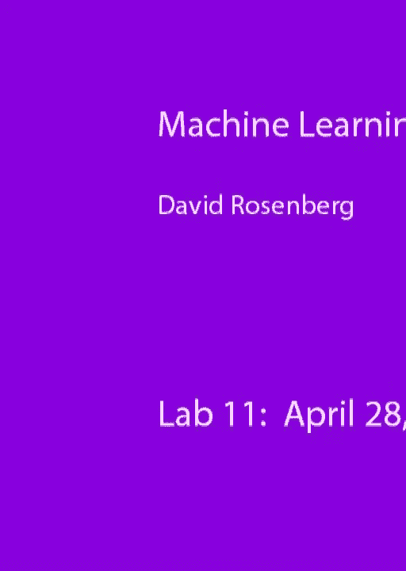
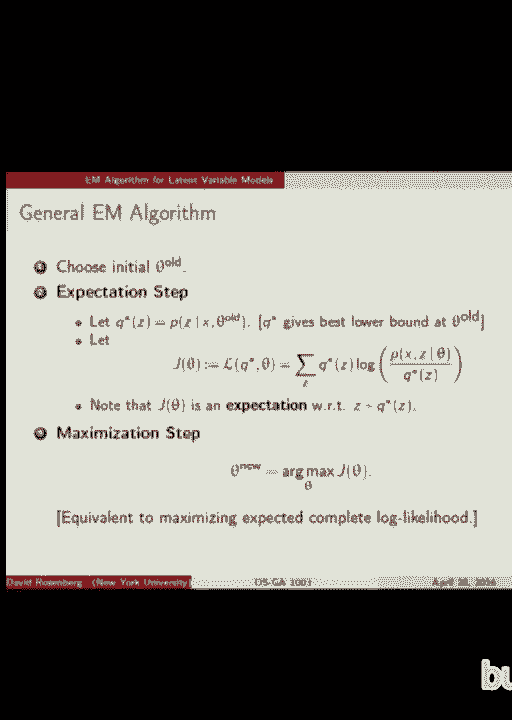
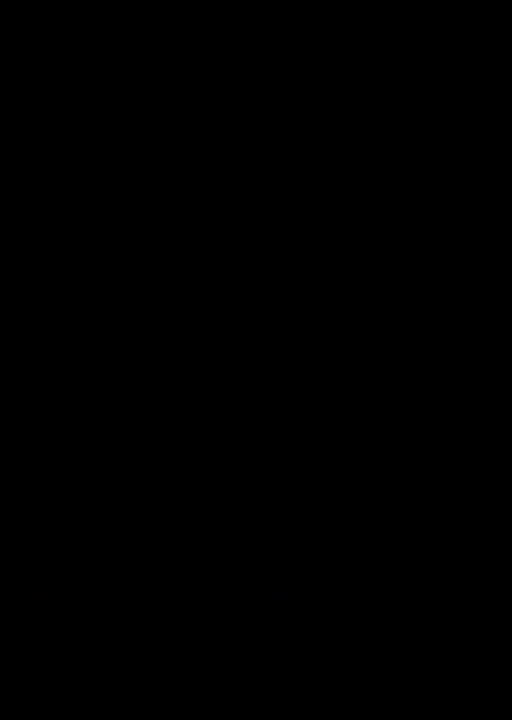

# P22：22.Lab_April_28 - Tesra-AI不错哟 - BV1aJ411y7p7

好的。今天我们将讨论e和算法的具体应用。

高斯混合模型。好的。记住，高斯混合模型我们有。数据点是从其中抽取的组件，每个组件都有一个概率。我们用π表示，然后每个组件都有一个与之关联的概率分布或密度，在这种情况下。我们有一个不同的高斯密度相关。

其中包含三个部分，每个部分都有生成一个点的概率。所以我们处理的高斯混合模型的生成模型描述是，首先我们从分类分布中绘制一个变量z，表示聚类分配或组件分配，大家听说过分类分布吗？就像是蓝色。

分布是零或一。分类分布是k个类别之一。就像从1到k之间选择一个数字。这与多项分布相关，但是多项分布是指从分类分布中选择n次抽样，并统计你得到的1到k之间每个类别的个数。好的，所以显然。

保持分类分布和多项分布相关。所以我们从分类分布中选择一个聚类分配z，然后从与聚类z相关的密度中绘制一个点x。好的，这就是我们生成数据点x的方式。明白了吗？有问题吗？好的，明白了。这是一个生成模型，我们可以将它们组合成一个联合分布。

对于一对x和z，当然x是观察到的，但z通常不会被观察到，这。只是条件概率的定义。但是现在让我们代入条件分布。给定z的x分布。那是高斯分布，然后是πz。这是我们聚类z的概率。好的。所以这是我们的联合分布，但我们真正需要处理的是边缘分布。

我们观察到的数据的边缘分布是x。我们只观察到x。我们。没有观察到z。所以我们可以得到x的密度，x的分布。我们该怎么做？

这很简单。是的，没错，我们对我们没有观察到的z进行求和。这就是边缘化。像这样。对吧，我们取联合分布，对z进行求和，得到x的概率，当然。我们可以像那样直接代入联合分布的表达式。所以这是我们单一x的边缘分布。太好了。这样一种估计高斯分布参数的方法。

混合模型使用最大似然法。我昨天提到过也有矩法方法，这个方法也非常好，你可以在第二门课程中学习到。Sontag的课程，我想。好的，但是我们这里用最大似然法。所以我们将写下我们观察到的数据的似然函数，并找出。

参数最大化似然函数。所以这里是似然函数的表达式。现在这对你们来说是对的，因为我们已经有了 p(x) 的似然函数，上一页我们做过了。我们有 n 个数据点，X1 到 Xn，独立同分布（iid）。所以要获得整个数据集的似然，十分简单，我们只需要将每个数据点的似然相乘就行了。好的，一切都好。

按照通常的方法，我们希望查看对数似然。我们通常认为这样做会更容易操作。所以我们对 p(d) 取对数。我称之为我们的目标函数，即对数似然目标函数。所以现在我将它写为 J，目标函数的参数就是我们想要的模型参数。

为了发现我们要最大化的就是最大似然。所以当我们对 p(d) 取对数时，对数会很好地进入公式。你们能看到我的手吗？这对你们有帮助吗？好的，太好了。所以我们对这个乘积取对数，变成了对数的和，我们得到了对数的和。然后我们希望能够让这个对数项与高斯分布相互作用。

因为高斯分布有这个主导的指数项和对数项，`x` 之间能够很好地相互抵消。但求和会阻碍对数项的作用。这就是为什么最大化这个稍微有些困难的原因。好的，我们要用 EM 算法来最大化 J。这就是我们使用 EM 的动机。好的，大家有问题吗？这只是复习。很好，好的。

再复习一下。记住我们昨天讨论过的那个东西，gamma IC。昨天我们称之为簇 C 对点 xi 的责任。我更愿意把它理解为，对于 xi，我们认为它属于簇 C 的概率是多少？

这就是 gamma IC。所有簇的 gamma 向量就像是数据点的软簇分配。然后 n 子 C 就是我们现在所说的，簇 C 中的期望点数。所以我记得我说过，概率和期望在某种程度上是可以互换的。我只是想给你们搞清楚这个概念。

上次我看到了一些不确定的目光。让我们定义 n 子 C 为我们看到的簇 C 中的期望点数。所以在这里，我们可以把 zi 设为 C。如果 xi 的簇（即 zi）等于 C，那么这个表达式就是 1，否则就是 0。我们将所有数据点相加，得到有多少个符合条件的点。

如果 zi 等于 C。所以如果我们知道这是什么，它将是实际属于簇 C 的点数。但我们无法观察到这个值，但我们可以在我们观察到的数据的条件下对它进行期望估计。而且，和的期望就是期望，对吧？然后期望一个指示函数。

函数是事件在指示器中发生的概率。很好。所以，按概率求和。是zi等于C，给定xi的概率。当然，这就是gamma i C。所以这就是我们得到n sub C的方式。好。大家都点头表示理解，因为什么，如果你们不理解，下次我就重新做一遍。好。那我们就来看看GMM的EM算法。

我昨天给你们展示过这个。这是一个交替算法，首先我们为每个数据点计算软聚类分配。然后我们进行参数估计步骤。这和常规高斯分布的最大似然估计非常相似。但现在，比如对于均值，我们不是直接取簇C中点的均值，而不是。

知道哪些点属于簇C。所以我们取一个加权平均值，其中权重是该点属于簇C的概率。好吧。这看起来是合理的，但你不一定会明白为什么这实际上是最大似然，或者为什么这能帮助我们得到最大似然，但至少它应该是不可或缺的。好的。

这是一个示意图。所以我们从随机选择的均值和方差开始。这个看起来并不随机，这些方差接近球形。这里是数据点。所以我们已经初始化了我们的参数。然后下一步是找到每个点到两个簇的软分配。对，每个点这里，我们找到其概率。

它属于这个簇的概率属于这个簇。这里我们根据这些概率进行颜色编码，蓝色是深蓝色是1，深红色是簇2，而介于其中的是某种混合概率。是的。所以这里的分配是基于概率的。没错，没错，基本上，我们有。

这两个，所以我们有这两个，首先让我们回到这个地方，这是我们计算概率的地方。假设我们正在查看第i个点xi，那么第i个点属于簇J的概率是我们查看每个簇的权重，并计算其高斯似然度，嗯，这是表达式。所以，它是，你可以。

显式计算概率。是的，是的，你初始化所有的参数，pi、mu和sigma。是的，你有其他方式来做软分配吗？好的。是的，你可以使用高斯之外的其他分布，你可以有其他分布的混合。好的。现在我们有了软分配。

现在我们有了我们的参数拟合，它使用的是均值的加权平均值。然后是协方差的加权估计，这给我们带来了这些调整后的均值和协方差矩阵，以及两个类别、两个簇的调整后的类别特定密度。好的，等等。这就是算法收敛的过程，那么这些圆圈代表什么呢？

我画的是什么？对。这些就像是每个高斯分布的协方差椭圆。你可以大致理解为高斯密度的一个标准差轮廓，大致是这样的。好的。对。是的。所以有一些点的颜色不太一样。那么那种颜色是什么呢？

每个点基本上代表的是它的平均概率。嗯，表示的是蓝色和红色的概率。所以非常蓝的点表示它属于蓝色的概率很高。非常红的点表示它属于红色的概率很高，而中间的紫色则是两者的概率较为平分。是的。问题是，嗯，什么是属于红色的？我的意思是它是在生成过程中生成的。

它是由分布生成的。那就是红色。是的，确实可能，但很少见，从这个分布中，我们生成的一个点完全在这里。所以我们不会将其分配到红色簇，因为那样的可能性比较小，但有可能出现。所以可能会有错误。是的。是的。是的。是的。

所以你对簇的分配有一个概率分布。所以没有相对的。概率始终总和为1。颜色你可以。是的。所以，如果你能想象这些颜色是由你知道的生成的，你取，如果蓝色的概率是30%，那么我们取30%的蓝色和70%的红色来生成这个颜色。是的。是的。

期望是什么？我的意思是，如果你说你有一个期望步骤，我不清楚。我还没有说明我的期望步骤。我是说，我确实提到过，但我没有打算在这里解释清楚。不是，我并不一定是这么说的。你知道，如果一个点落在这里，它可能没有明确的分配到某个簇。所以，不。为了让一个点有。

就像几乎所有的概率都集中在一个簇上，你必须看到。在其他簇下的点的可能性会非常非常小。这就是发生的情况。我们需要这些协方差矩阵非常非常小。所以如果协方差非常非常小，是的，你会看到更多的硬性分配。

每一个点，就像是其中的一个或另一个。实际上，这就是讲座的内容。接下来，幻灯片。你现在给出的例子其实是，自我市场。实际上，这个自我市场算法的结果与停车场是一样的。不了解。首先，这是一个有趣的点，关于小工具混合。

模型方法在第一次呈现时并没有给出硬性的分类。它给的是软分类。所以现在你可能建议通过阈值化来做硬分类，硬聚类。我明白你的问题。是否只是巧合？我们现在在这张幻灯片旁看到的图像两边颜色较少？

这是巧合吗？是怎么回事？哦，我明白你的问题了。是巧合吗？我不确定。簇是完全分开的。所以问题是，我猜你是在问，概率是否总是收敛到零或一？是的，好的。好吧。所以，EM算法在加盖混合模型中的应用似乎有点像K均值。看起来像你所建议的那样。

而且有一个精确的对应关系。所以，首先，在加盖混合模型中，我们允许簇的形状是非圆形的。所以我们可以有像这样的簇。例如。好吧，K均值从来不会给出这种聚类。所以如果我们在加盖混合模型中做出。

在混合模型设置中，然而，如果我们将协方差矩阵固定为球形的，不允许伸长的协方差，并且让方差趋向于零。这样会形成非常紧凑的加盖簇。那么，簇的分配概率会收敛到一个点，在欧几里得意义上，最接近的簇会是1，其他簇则为0。

在另外的情况下。然后我们几乎完全得到一个K均值算法。是的。好的。这与加盖分布的尾部衰减有关。所以，如果你远离加盖中心，或者等价地说，如果方差非常小，那么你更靠近的簇的似然会在某种意义上指数级地大于其他簇。

你越远，似然比率会变得非常大，当这些方差非常小的时候。这种情况在Python中很容易尝试。你可以看到，在两个加盖簇之间，你的似然值会如何变化，如果你稍微靠近其中一个簇。

你查看那些似然的比率。然后你将那些方差送到零。你会看到比率会变得非常大。有人检查一下并在Piazza上发个帖子吗？是的，是的。优化中没有魔法。所以会有所不同。不过，我的意思是，现在我们有了一个很好的对应关系，我们可以谈论它们之间的联系。所以，如果我们。

我们使用了一个加盖混合模型方法，并且用这种类型的协方差限制了我们的模型。我们仍然可能在尝试找到最大似然时陷入局部最小值。所以，好吧，我现在脑海中没有一个加盖混合建模的例子，能够展示我们是如何陷入局部最小值的。但这个问题很有趣。

所以，确实，加盖混合模型的似然函数不是凸的。因此，一般来说会有局部最大值。但是我以前没有这样想过。所以，让我们考虑一下，20秒钟。有人有例子吗？

我可以想一个最大似然法可能会遇到问题的例子吗？好的，这样就够了。好的，在我们进入一般的 EMR-able 之前，还有更多问题吗？如果我们没完成，下周可以继续。我觉得这很有趣。虽然有点数学化，但不算太难。我希望你们能跟得上。准备好了吗？好的。首先，我们有几个。我们有两个或者。

有三个小引理需要复习，首先，记得凸函数吗？好，詹森不等式。非常，非常有趣。数学中没有多少基本的不等式会如此频繁地出现。像三角不等式、科赫-舒尔茨不等式，还有汉斯不等式，它们是前三大。我很少见到比这更多的不等式。当然，还有。

但是詹森不等式是前三名之一。大卫的前三名。好的。所以，汉斯不等式。如果你有一个凸函数，x 是一个随机变量，那么 f(x) 的期望值大于或等于 x 的期望值的 f 值。好的。好。维基百科上有这个的几何证明。我记住它的方式是通过这个例子，我知道。

e x 的平方，x 的平方的期望值大于或等于 x 的期望值的平方。我怎么知道这个？我怎么总是记得这个？是的，非常好。所以，如果我从 e x 的平方中减去 x 的期望值的平方，我把这个移过来。那是 x 的方差。我知道方差总是大于或等于零的。这。

这是我记住詹森不等式方向的方法。好的。我看到答案在那里。好的。所以，这就是詹森不等式。现在，KL 散度。你们之前见过 KL 散度吗？

Kolbak Live Lord 散度。这很有趣。从某种意义上说，它是一种衡量两个概率分布差异的方法。好的。所以，它不完全是一个距离度量，但它给出了一个衡量事物差异的标准。这里是它的定义。在离散情况下，对于离散的概率分布，求每个。

分布的支持中的元素，所有可能的值。然后是 Px，log Px 除以 Qx。这是一个奇怪的东西。虽然有方法可以理解它，但理解它的最好方式就是从信息论入手。我今年没有讲这个，但如果你查去年的幻灯片，会看到大约 10 到 12 张幻灯片，里面有对这个领域的简短介绍。

这叫做信息论，其中像 Kolbak Live Lord 散度、熵和互信息之类的概念，在比特和编码方面都有非常自然的解释。比如数字和其他类似的东西。好的。好。然后，需要注意的一点是，KL 散度实际上是一个期望值。看看，我们是在求和。它是。

对数的 Px 与 Qx 之比的期望值，关于分布 P，其中 x 按 P 分布。看看你是如何写的，看看这只是期望的一个实例。好的。好的。所以我们有这个 Kolbak Live Lord 散度，并且有两个非常重要的属性我们将使用。这来自于所谓的 Gibbs 不等式。

它简单地说，任意两个分布之间的 Kolbak Live 散度首先是非负的。其次，只有当分布相同的时候，它才等于零。所以这至少是我们声称能够衡量分布之间差异的东西的一个非常好的属性。Kolbak Live 散度在。

如果且仅当两个分布相同时，两个分布的 KL 散度为零。这就是我们在接下来的几张幻灯片中需要的。好的。所以不要，不要计算，不要认为。它实际上是一个距离度量。它不是。事实上，它甚至不是对称的。所以 Kolbak 散度在 P 和 Q 之间通常不等于 Q 到 P 的差异。

好的。所以证明我想我们现在不做了，但值得走一遍。只有一个不等式来自于 Jens 不等式。好的。好的。是的。是的。你能再说一遍吗？你可以拿任意两个分布，如果它们在均值和方差或其他方面有差异，那么是的，KL 散度会更大。

大于零。好的。好的。那么 E.M. 算法，我们将从一般的潜变量模型来看。一个一般模型，在该模型中，你只观察 X 而不观察 Z。所以我们现在有 Z 和 X，它们不仅仅是随机变量。它们可以是随机变量的向量，但我们仍然把它们当作 X 和 Z。好的。我们。

我们将通过一些未知的参数 theta 来参数化模型。所以在他们的高斯运动模型中，theta 可能是 pi、mu 和 sigma，但我们将它简化为 theta，以便简化符号并使其更加通用。这里只是想说明，我并不是在进行贝叶斯设置，因为我们是基于 theta 条件化的。这就是。

只是 theta 只是一个参数，我们这样写是因为它比将 theta 作为 P 的下标或用分号书写更容易。这是写它的传统方式。好的。所以 X 被称为我们的不完整数据集，因为它是我们观察到的，但我们假设那里还有 Z。

这是未观察到的。所以 X 和 Z 一起被称为完整数据集。X 被称为不完整数据集。所以，当然，在最大化不完整数据集 X 的似然性之后，因为这是我们观察到的。好的。那么数据集的一个样本和，好的。我们想找到这个边际对数似然性。所以这是 X 的似然性，好的，因为。

我们对Z求和，这样我们就得到了X的概率，这适用于单个元素。对于数据集，这里应该有一个额外的乘积。好吧。所以，EM算法的关键思想是，即使直接最大化这一项很难，如果我们有完整数据，或者说如果我们只需要最大化完整数据X和Z的似然。

如果这很简单，那么EM算法就能很好地工作。好吧。所以如果我们能最大化完整的对数似然，那么即使边际对数似然很难，我们在EM算法中也能处于一个良好的状态。那么对于高斯混合模型，如果我们得到了X和Z，是否容易找到最大似然？再说一遍，问题是什么呢？好吧。

所以sigma是对Z进行边际化。但是如果我们观察到了Z，我们就不需要将其边际化。是的。所以我想我们昨天提到过。如果你知道每个点的簇分配，得到最大似然参数设置是非常容易的，对吧？我们取簇1中的所有点，找到它们的均值，我们。

找到它们的协方差。这是高斯分布的最大似然估计。其他簇也是如此。所以如果我们有高斯混合模型的完整数据，找到最大似然估计是非常容易的。是的。好吧。这就是高斯混合模型的情况。好吧。但当然我们并不能观察到Z。所以EM算法。

这是基于一个非常有趣的想法，那就是如果我们为Z构建一个概率分布。我们给Z构建了一个概率分布，然后我们尝试最大化期望的完整对数似然。好吧。所以我们提出，我们将稍后探讨如何做到，但我们以某种方式得出了这个未观察到的变量Z的分布，Q(Z)。

好吧。然后我们在寻找完整数据对数似然的期望。我们可以根据这个分布Q计算完整对数似然的期望。找到，好的，明白了吗？所以这就是这个表达式的意义，它是在找到完整对数似然的期望。这里是完整的对数似然。我们并不。

知道Z的值或所有可能的Z，然后我们按Q赋予Z的概率进行加权。这是关于Q的期望完整对数似然。关于这个，有问题吗？好吧，当然。我们怎么得出Q的？是的，有人猜测吗？

这应该是一个关于Z的分布，给定我们对X的观察，这个分布看起来是一个合理的Z分布。实际上有一个相当自然的选择。你可以考虑一下。好吧。你还有其他问题吗？这是在X上，对于一个Z。我只写了一个X和Z。为什么我只写了一个？因为我们在合并所有的X。

X进入X，Z从Z1到Zn进入Z。这就是这里发生的事情。这就是为什么它看起来只有一个，因为它确实是一个，但它是一个完整的向量。对吧。这就是简化。好的，还有别的吗？好的。那么，EM也假设这个最大化是可行的。好的。所以EM算法，我们并不完全知道如何最大化边际似然。

所以我们接下来要做的是最大化，我们将找到比似然更低的下界，并最大化它。让我们来看看这个边际似然。这是对数似然。展开它。这是对联合的边际化。找到那个不等式。让我们通过Q(Z)来乘以并除以。所以就写下来。Q(Z)。我们还没有。

甚至还没说它是什么。除了它是Z的分布。所以没有变化。对吧。它们取消掉了。但现在请注意，这是一个相对于Q(Z)的期望，因为我们对所有的S(Z)进行求和，带有这个Z的概率和某些随机表达式。所以我们有一个期望的对数。现在我们可以使用N的不等式并交换它。对吧。哪个。

不等式将如何变化？这很难。所以这个函数不是凸的。所以你必须切换一次，然后继续。好的。是的。大于或等于。所以我们将期望值交换到对数上，然后得到这个表达式，接着我们将这个最终的表达式定义为LQ，θ。接下来的几张幻灯片我们将会经常使用这个LQθ。这是。

一种叫做边际似然变分下界的方法。好的。所以，如果将来你学习变分方法时，心里想：我不确定这是什么。回到这一张幻灯片，因为这张幻灯片中的计算本质上是变分方法的核心。E算法是变分方法的最简单介绍。好的。

所以我们要去的方向是E算法。我们的目标是，我们要最大化LQθ。我们将搜索所有概率分布Q和所有可能的θ值，我们只是会用某种方法，但本质上我们只是在遍历这个分布Q和参数θ的整个空间，试图使LQθ最大化。

尽可能大。好的。这是M算法的目标。当我们把LQθ最大化到最大时，我们将取那个θ，然后说这是我们对θ的估计。这将是我们对θ的最大似然估计的最佳猜测。好的。所以我们所有的努力都在于找到一种方法来最大化L。

我们要展示的是，最大化L确实有助于最大化这个边际似然。好的。事实上，如果我们找到L的全局最大值，那也将是边际似然的全局最大值。所以这很好。我们可以证明这一点。是的。那么，你在最大化LQ吗？我意思是比你不做更容易。哦，好吧，你会看到的。

但我的意思是，核心问题在于我们这里有一个联合概率，我们有完整的似然函数，而我们知道它比边际似然更容易计算。所以我们没有在中间对Z求和。好了。像这里。好了。所以我们要尝试最大化LQ theta。我们可以做的是带入这个表达式。

我们通过将这个比率的对数分解为分子对数减去分母对数来将其分成两部分。你会注意到，你应该注意到的是。第二项没有theta。好了。第一项有Q和theta。好的。这是关键。所以另外需要注意的是，这个表达式是期望的完整数据对数，像这样。

那就是我们假设在m算法中容易最大化的东西。好了。所以如果我们对theta最大化这个表达式，我们只需要看这一部分。如果我们对Q最大化它，好吧，两部分都会出现。好了。所以现在我们将展示。我们将更仔细地看看L下界是如何对应边际似然的。所以首先。

我希望你思考这些问题。我希望你思考LQ关于theta的情况，对于固定的Q和固定的概率分布。将其视为theta的函数。好的。所以对于每个theta，这个界限都成立。事实上，对于任何Q和每个theta，这个界限都成立。所以无论我们为Q和theta插入什么，我们总是可以写下这个公式。这里有张图。

红线是我们的，好吧。横轴是theta。我们，它是一个卡通版，其中我们的参数空间仅仅是实数。所以横轴是我们的theta。红色的图是，这是。我们数据的对数边际似然，对于每个theta，对吧？对于每个theta，我们有不同的似然。所以如果我们知道红线的最大值，即最大似然的theta。

就在这里。你能说出它是因为它在边际似然的最高点下吗？

所以我们想找到这个点。好了。是的。不是的。好吧。现在。是的。红色是边际似然。是的。正如我刚才要说的，这条蓝色或紫色的线是L Q of theta，针对固定的Q。所以Q是固定的，现在它是theta的函数。这是我们下界的图像，作为theta的函数。是的，你说得对，绿色是针对不同的。

Q作为theta的函数。所以这些是两个不同概率分布Q下的下界。所以我们在这里追求的方法是，我们将对Q进行调整。对于每个Q，我们将找到该Q对应的最大theta。然后，我们将来回调整。好了。好了。所以我给了你这个大。

已经有了图像的概念。我们对于所有theta和Q都有这个不等式。我们将，嗯，我说了。我们将对theta进行搜索以最大化L，然后取相应的theta作为估计值。所以这很可能是一个局部最大值。这通常，我们希望它是似然的局部最大值。使用这种类型的算法，你可以得到更好的结果。

所以如果你想尝试找到全局最优值，你可能需要从不同的初始点重新开始。好了。那么剩下的问题是，好的，我们具体该如何去改变Q和theta，以尝试找到LQ theta的最大值？

好的。我们将使用坐标上升法，这是我们已知的。坐标上升法。记住，它是这样的：我们首先取一个参数，固定其他参数，并且最大化关于该参数的函数。然后我们固定这个参数，再对另一个参数进行最大化。到这个点我们就完成了吗？不，我们需要迭代。

这还不足以完成一个。它是一个迭代算法，你需要不断重复。好了。那就是所谓的坐标上升法。好的。这是EM算法的高级概述。我们从theta的一个初始随机点开始。我们对分布进行最大化，这是一个有趣的过程。但我们对所有概率分布LQ theta进行最大化。然后我们固定它。

Q星开始，并对theta进行最大化，然后重复。所以我们将展示theta会给我们单调递增的似然值。这很有趣。并不一定从这里就能显而易见。所以每一轮我们得到一个新的theta，显然下界会不断增加。LQ星theta会不断增加，因为我们所做的就是不断步进到新的点。

那是最大值。所以我们只能增加LQ theta。有趣的是，我们还会增加theta的似然函数。所以，给定theta的X的概率也在增加。好了，这里是我们算法的一个示意图。我们从theta旧值开始。嗯，让我们从Q开始。现在，好的，从theta旧值开始抱歉，从。

theta旧值。现在我们找一个Q，能在theta旧值处给出最佳下界。现在应该是这个。所以在某一点的最佳下界基本上就是任何等于该点的下界。如果我们能找到一个与该点的实际函数值相等的下界，那将是最佳的。我们可以得到一个在这一点最好的下界，甚至比接触点更好。

这个图。你可能会找到另一个与图相切并在其他地方更好的下界。但这里不是这种情况。好了。我们找到了theta旧值的下界。然后我们最大化这个下界。所以我们从这里出发，最大化下界。这将我们带到紫色曲线的峰值。然后得到新的theta，theta新值。好的。

现在我们找一个新的Q，给我们一个在这一点上最佳可能的下界。那就是这个绿色曲线，它与红线相切。好了。然后继续。好的。我们还有六分钟。所以我们还有一些时间可以继续进展。这是一个非常有趣的现象，如果我们检查这个下界的话。这里是一个。

下界的定义。现在我们将以稍微不同的方式拆分对数。与之前不同。好的。首先，我们将这个联合分布拆分为条件分布和边际分布。对吧。这就是标准的贝叶斯法则或条件概率的定义。现在我们将以这种方式拆分对数。所以我们将这两项保留在第一部分。

第一部分并将其余部分移到第二部分。好的。现在让我们看看第二部分。对于我们的第二项。你看到它是如何简化的吗？给定theta的Px与z独立。对吧。所以我们可以将它移到求和之外。现在你看到它是如何简化的吗？是的。对z的求和中Qz的和为1。所以这一项变成了log Px给定theta。那么，log Px给定theta是什么？

这就是我们要最大化的目标。它正是边际对数似然。x的边际对数似然。好吧。所以这很有趣。这就是我们得到的。下界。而现在它通过不等式与我们的下界有某种关系。让我们稍微调整一下。边际似然恰好等于下界加上这个。

Kullback-Leibler散度项。所以这是一个明确的表达式，告诉我们边际似然与其下界之间的差距。它正是由Q和边际似然之间的Kullback-Leibler散度给出的。这很有趣。我们看了一会儿。好吧。好的。那么我们可以利用这个来弄清楚如何找到最优的Q。记住，在我们的。

最大化的Q步骤？我们已经最大化了Q步骤和最大化的theta步骤。这将帮助我们完成最大化Q步骤。那么这是我们的下界，现在有了等式。我们。想要对Q进行最大化。第二个表达式中没有Q。所以为了最大化，我们可以忽略这一项。所以现在我们只需要最大化这个负的Q散度。好了。总的来说。

可能的分布是Q。好的。那么，这个最大化问题的答案是什么呢？嗯？

嗯？对吗？是的。没错。那么最大值，首先让我们记住，Kullback-Leibler散度大于等于零，并且只有当它的两个部分相等时，才等于零。两个分布是相等的。好吧。这是负的Q散度，这意味着它总是负数或零。所以如果我们能让它为零，那就。

最大值。我们如何选择Q使其为零？非常简单。取Q等于给定的Z的P。X和旧的theta。这是你本来可以猜到的。也挺自然的，对吧？

我们对Z的最佳猜测是什么？那么，如何看待给定我们观察到的X条件下的Z的条件分布？这很自然。这里是证明它是固定theta old情况下的最大化器。好的。所以现在我们有了这个等式。如果我们代入Q star，那么这个是一个不等式。那么这有什么奇怪的吗？这是一个下界。然后我说它是相等的。就像。

我们完成了吗？这里的差距是多少？那么这是否意味着，我们可以？

所以它在特定的θ_old处是等式。并不是在每个地方都是不等式。在θ_old处是等式。这个表达式是针对固定的θ。好的。这个等式是针对固定的θ。这个很重要。好的。好的。但是我们总是有一个不等式。对于所有θ。记住，L总是任何Q和θ的下界。所以我们有。

对所有θ都成立的不等式，以及对于特定的θ_old成立的等式。现在这个。解释了我们的图像。对吧？所以我们在θ_old处有等式，在其他地方有不等式。对吧？

或者在其他地方小于或等于。当下界正好触及它应该是下界的地方时，我们称之为紧下界。在这一点上是紧的。好的？酷。有任何问题吗？好了。那么现在我们有了，我们可以讨论我们的通用EM算法。我们在最大化Q和最大化θ之间交替进行。期望。

步骤是我们找到这个Q_star，我们只是将Q_star设为这个条件分布。然后我们将Q_star代入我们的下界L。所以L Q_star/θ。当我们代入时，这是一个期望。对吧？因为它是相对于Q_star的期望。这就是为什么叫做期望步骤。所以定义，找到这个函数对吧。

作为θ的函数，这是我们想要最大化的。它是一个期望，所以。计算这个函数，这个期望的过程就是期望步骤。好了。那么，下一步是什么？我们已经对Q进行了最大化。那就是选择Q_star。现在我们。对θ进行最大化。对吧？在固定Q_star的情况下。所以我们要在L Q_star θ上进行最大化。

固定的Q_star。我们把它叫做J(θ)。所以我们只需要在θ上找到J(θ)的最大值。这就是最大化步骤。好的。这样你就得到了EM算法。对，时间差不多了。但这是一个很好的问题。我想了想，我想是因为对数的原因。但我不想马上跳到这个结论。好的，大家。那么星期三见。

我星期三从某个地方飞回来。所以如果飞机发生了什么奇怪的事情，我会尝试在Piazza上发帖。但我应该会在这里。好的。

[BLANK_AUDIO]。

