# P23：23.Lecture_May_4 - Tesra-AI不错哟 - BV1aJ411y7p7

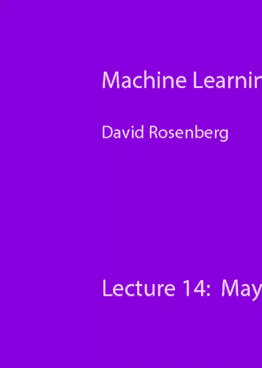

好的，这声音太大了还是可以的，所以今天的计划，首先，我们做了很好的调查，然后我们将直接完成EM算法，我们在EM算法上进行了几轮很好的热身，但现在我们要穿过它，谈谈EM的几个扩展。在那里的某个地方可能会有一个休息，然后有一个班级照片的请求，我认为这是个很酷的主意，所以休息后可以是一张班级照片，然后在E之后，M算法我们可以取一些随机的问题，如果你们有什么还在坚持的。或者我们可以简单地介绍一下神经网络，我有一些神经网络的幻灯片，然后我们会提前结束，你们可以拿起你们的测试，明天是和顾问们的会议，现在我要把它包起来，我们很好，好吧，让我们继续谈论好吧。所以我想你们会想复习一下EM算法，所以让我们记住设置，我们有潜在变量模型，其中我们有变量，观察到的一组变量，这些是X的，和一组未被观察到的变量，这些是Z，我们要写x和z，对于Z将是所有未观察到的变量。

被称为隐变量或潜在变量，x将是所有观察到的变量，我们要把它们放在一个向量里，我们有一个概率模型，所以给定θ的xz表示x和z上的联合概率分布，我们收到的是这个不完整的数据集x，不知何故。我们需要弄清楚给定θ的概率分布pxe是多少，只是来自X，所以换句话说，给定x，我们想求最大似然参数θ，这是这个问题的最大似然目标函数，D现在是我们观察到的数据，只有X，我们想找到给出观测数据的θ。最大似然，我们想做的另一件事是估计模型，让我们找到西塔，一旦我们有了模型，我们就开始了，我们观察到一些X，那是未被观察到的东西，我们要做的是弄清楚，Z是未被观察到的部分，所以在我们的高斯混合模型中。比如说，x是我们观察到的所有点，每个x对应一个z，这是潜在的变量，哪个是X来自的星系团，所以给了下一个，我们想知道Z上的分布，x来自的星系团上的分布，所以这就是这个分布，这很容易计算，嗯。

所以对于小工具混合模型，至少在给定x的情况下计算z i很容易，i与子溪的关节成正比，这很容易写下来，它是星系团的概率z i乘以可能性，与平均μi和协方差相关的簇子分布，西格玛·泽西，很好。回顾一下关于这东西的任何问题，好的，所以有一个高斯混合模型，问题是很难解决这个最大化问题，最大化这个边际可能性，所以我们上次讲的是找到一个下限，叫做L，它有两个参数，有一个分布q和θ。我们证明了这个L是我们想要最大化的下界，数据的可能性是多少，所以让我们看看，这是我们对这个下界的推导，这种不等式来自延森的不等式，所以左边的东西，这就是我们想要最大化的，很难和它一起工作。所以我们用这个表达式给它下界，如果你看着它，你可以看到这是一个期望，因为z的q，那是Z上的分布，这个表达式是z的函数，所以它是一个随机变量，这整件事是一个对数的期望，我们称之为qθ的l，在其他情况下。

也许你们已经采取了一些为什么不，也许你上过课，你已经做完了，l前的变分推理称为肘部elbo，经常出现的有趣术语，E代表证据，有时这种边际对数似然被称为证据，这是你观察到的数据，所以e和l和b是下界。所以证据下限，我想O是束缚的一部分，波，记住这里的策略是在所有分布上最大化l qθ，q和所有参数值θ，所以我们最大化下限，我们能得到的最大的LQθ，与最大化相对应的任何θ，这就是我们最终要提出的建议。我们认为这是最大的可能性，或者这是我们对最大可能性的最佳猜测，所有的权利，所以另一个有趣的事情是，我们可以为下界写出这个精确的表达式，因为这其中的区别也是一个期望，这是预期的完整数据日志可能性。我为什么说这个pxe，这是完整数据的可能性，所以x是未观察到的变量，z是潜在的变量，我们在Z上求和，我们不观察Z，所以我们对z的分布求和，所以就像我们不观察Z一样，所以我们对某个分布的z的期望值，q。

第二学期没有θ，所以如果我们想在θ上最大化，我们只需要专注于第一学期，好的，所有的权利，这是我们将要看的照片，今天有一堆，红线是我们的你们还记得这一切吗，还是这是一个很好的评论，好的，好评，好的。这是边际可能性的对数，x轴是θ，参数空间，我们想找到θ，使我们观察到的数据的可能性最大化，所以就像这里一样，这很难直接最大化，所以我们从某个随机点θ开始，一些初始化点θ，我们在那一点上找到一个下界。这里首先要注意的是，到目前为止，我们只需要注意下界lqθ，有很多，在这里我们画了两个如此不同的q不同的概率分布，对不起，不同概率分布，q产生不同的下限，所以这里有一个提示给出蓝线，另一个提示给果岭。上次有一个问题是这些下限是否需要，都是凹进去的，对呀，我就像，我不想说那么多，所以实际上答案很简单，因为EM算法中没有任何东西，我们如何知道一个函数是否是凹的，有一个要求是，甚至在我们开始谈论函数之前。

谈论一个函数是否凹，这个函数必须定义在一个凸集上，在我们讨论一个函数是凸还是凹之前，因此，如果在集合上定义了一个函数，看起来像，假设，我们有一个函数，它只定义在这些不相交的区间上，也许在它被定义的地方。它看起来是凸起的，我们甚至不能应用凸性的概念，因为如果你拿这两个点，你看看它们之间的线，我的意思是函数甚至没有定义在那里无论如何，部分，在凸函数的定义中，函数需要定义在凸集上，所以在参数空间θ。它甚至不必是凸的，而且，它甚至不必是连续的，它可能是一个离散参数空间θ，所以凸性或凹性的概念甚至不一定适用，这是这个问题最简单的答案，好的，所有的权利，到目前为止还有什么问题吗？好的，好，所有的权利。所以我们要试着达到最大值，通过迭代方法确定该边际对数似然的最大值，所以lqθ是我们试图最大化的，作为两个参数q和θ，我们将通过坐标上升来做到这一点，在那里我们交替，我们先固定一个θ，然后我们允许q变化。

找到使lqθ最大化的q，我们称之为Q星，然后我们要保持Q星固定，让第二个参数改变theta并在theta上最大化，我们交替，这就是我们的大图像算法，所以这是我们开始一个θ，这里有一个下界。我们跳到下界的最大值，然后我们在这一点上找到一个新的下限，那就是绿线，然后我们跳到这个下界的最大值，我们继续，看起来就是这样，我们稍后再看这张照片，再仔细一点，所以这是一个惊人的等式。我们有边际对数可能性，我们可以把它写为等于下界，加上这个kl，分布Q之间的分歧，和我们未观察到的变量的条件分布，给定观察到的变量，对吗，所以是的，我们已经证明了对于任何Q和θ，lq，θ是px上的下界。给了西塔我们想要的，而且，在这里我们得到了两者之间的精确差距，下界之间的间隙，我们的下界，正是这个分布Q之间的关键分歧，和给定x的z的条件分布，这是我们将在下一张幻灯片中使用的关键等式，所有的权利。

So let’s focus on the stage where θ is fixed, let’s optimize Q, this is our lower bound, we are at θ old, and we want to find the q that maximizes lqθ, this is our exact expression for lqθ, you’ll notice that the second term has no Q and A, so to maximize Q. This is definitely irrelevant, it’s a negative divergence, so Q will maximize this expression, yeah, so remember, KL divergence has this property, first, it is always greater than or equal to zero, secondly, it equals zero only when KL is minimized, which means it needs two identical distributions. So KL divergence has two parameters, it requires two distributions, it’s kind of like measuring a distance, how different the two distributions are, that is, if the two distributions are identical, only when they are identical do we get zero divergence, yeah, all right, so this is a negative divergence. So what’s the maximum value, the negative divergence can be zero because it’s always positive, yeah, so the bottom case is valid, so how do we make it zero, by setting q equal to z, p given x and θ, okay, so for fixed θ, maximizing q.

So you think this is a hard problem because you know we’re maximizing the overall probability distribution, in this case it happens, due to this property of KL divergence, it’s easy, okay, so we found the queue that maximizes l for fixed θ, okay, let’s plug it into Q-star. Then the first term is zero, and the remaining part is this log px given θ, which is exactly what we’re trying to maximize, yeah, so at θ old, what we’re trying to maximize is equal to this lower bound, so when the lower bound exactly equals its bound, it’s called a tight lower bound, right there. It is tangent to the curve we are trying to bound, so let’s see it as a picture, so equality is why we have it, so at θ old, the lower bound lq, this is the lower bound for all θ, but especially at θ old, this is equality, right, this is equality, it’s touching. This is the equality, where did it come from, okay, so in the picture, the tangent is not a coincidence, it should be right there, all right, otherwise it’s the lower bound, is there a problem? Okay, all right, so in general, the first thing in the EM algorithm is called the Expectation step y.

The first thing is where we find the optimized Q-star, the fixed θ old lower bound, we plug it in, so now LQθ-star, the next step is to maximize our θ, so when we write out lq star θ, expand it, we have this log expression summed over Q-star. Now this is also an expectation, because we sum this log expression as a function of z, we’ve seen the same thing before, z's q star is the probability for each z, we are calculating over all possible outcomes, c’s, this is about the expectation of the log expression in Q-star, we need to compute this expectation. It ends as a function of Q-star θ, we call it Jθ, emphasizing the fact that Q is no longer involved, we’ve already taken the expectation, I mean, at this point, we’re only interested in this data, that’s J theta, so the computation is, it’s calculating an expectation, that’s why in the EM algorithm, this is called the Expectation step, so the next thing is, for fixed Q-star, we maximize over θ, just here, what do we need for the algorithm to work, as it says, maximizing needs to be feasible, not just that the expectation needs to be feasible.

Each of these calculations is relatively simple when you apply it to Gaussian Mixture Models, for example, it’s very simple, you can easily do this, let’s talk about our understanding of how this thing actually works, so far, we’ve discussed LQ. We are maximizing lqθ, how tightly we can relate this to maximizing the marginal possibility, that’s what we want, right, so first, let’s at least see that every time we move to a new θ, we monotonically increase the possibility, so I think this is clear, every step we take. We’re moving to a higher point of our lower bound, the lower bound is always good, let’s track it, so we start from θ old, the key is to push upward, our possibility is, our lower bound is tight, so we start old, and when we maximize the blue line. We’re still not completely clear, yeah, so the red line is always above the blue line, yeah, so when we move from θ to θ nu, we already know at this point, at θ nu, the likelihood value is definitely higher than where we just came from, then we find a new lower bound, which is tangent to the red line.

When we jump to the maximum, this new lower bound, we again know the possibility must also be greater than where we came from, if you don’t believe my photo, here’s some math, okay, so for Q-star, we know at theta old. We have exact quality between the lower bound and marginal possibility, all right, now we choose θ nu that maximizes the lower bound given q star, so Q-star and θ nu's lower bound must be greater than or equal to Q-star and θ old right side, because qθ nu chooses to maximize this expression relative to θ slot. So by the definition of θ nu, this is of course correct, okay, what’s next, now let’s start with the marginal possibility, so px given θ nu, so this is our final place, let’s see what the marginal possibility of θ nu is, um, we know I’m a lower bound. So it’s definitely greater than or equal to l, at q star, θ nu, okay, now we apply the inequality above, greater than or equal to Q-star θ old, and we also have equality, okay, so here we see, when we move from theta to theta nu, the likelihood profit is definitely at least as large, all right.

That’s one thing, so this is good, at least when we take steps to increase the lower bound, we know the marginal possibility increases, which is really comforting, that’s good, let’s say a bit more, suppose we can find the global maximum of the lower bound, so we have lqθ, we’re doing well, we find the global maximum. The result will be that this is also the global maximum of the marginal possibility, which is amazing because that’s what we want, so what should we do? Suppose Q-star θ-star is the global maximum of the lower bound, so it must be greater than any lqθ anywhere, okay, we also know that for the given θ-star, the conditional probability is maximized. This is what we’ve shown, so we know what Q-star is, so claiming θ-star participates in the maximum of the lower bound and is the maximizer of this marginal log, very interesting, let’s see what it looks like, all right, so let’s take any θ prime, all right. So there might be other possible θ primes that could be better than our θ-star, we will prove it’s actually not, but let θ be an arbitrary θ prime, any other point, we know q prime z is, the best distribution corresponds to θ prime, the marginal likelihood log at θ prime is equal to this lower bound.

Add the KL divergence, which has always been correct because we are using q prime, which equals the best distribution of LQ prime, θ prime, now we know Q-star, θ-star, suppose the maximum of the lower bound, so it is certainly less than or equal to this, all right, now we finally have tightness. So l^3θ-star equals px given θ-star, all right, so if you put it together, we see that for any other θ prime, the marginal log likelihood will be less than or equal to the marginal log likelihood at θ-star, okay, so now it’s four lines, so now, we’ve given ourselves good momentum. Trying to maximize this lower bound, and if we can really maximize the lower bound, we also find the maximum of the marginal log likelihood, so this is a global maximum, in fact, generally speaking, we don’t know how to find the global maximum, okay, that’s too bad, well, with a little effort, you can generalize this theorem to local maxima, which is good, you might need some continuity of the function or some small technical conditions, but it can be extended to local maxima, well, but at least this gives a good motivation, so in fact, there is a theorem, not so old.

实际上在m和i左的收敛性上，它有一些技术条件，会有点超出水平，这学期到目前为止我们一直讨厌的，但我有一个推荐人给你，但只是为了给你一个定理所说的味道，所以让我们把它设置一下，Theta n。设θn为θ的当前位置，在EM算法的最后一步，在第n步之后，让我们定义一个转移函数m，所以在，如果一开始我们在零点，在第一回合后，我们在第一回合，然后总的来说，让这个函数m从θ1到θ2。或者从Theta n到Theta n，加一个，所以θ加1等于θ的m，这将帮助我们把事情写下来，这清楚吗，所有的权利，所以我们假设这个对数似然函数是可微的，这里有个话题，我想我们还没有完全提到。让我们是静止点的集合，所以函数的驻点就是点的集合，其中梯度零，所以当你寻找最小或最大或鞍点时，你要找的，其中梯度零，所以这些都被称为驻点，事实证明，这将是最好的，我们可以向它展示到一个固定点的收敛。

好的，所以定理是这样的，所以在一定的规律性条件下，你可以在这篇论文中寻找，不管有什么好笑的，这将是另一个规律性条件的幻灯片，嗯，对于任何起点，θ0，我们θ序列的极限，从m算法收敛到θ星，对于某个固定点。那很好，你知道的，到目前为止，我们还没有证明这一点，直到定理，我们不知道我们可能会失去动力，我们总是知道每次我们去一个新的Theta，活的可能性在增加，我们证明了这一点，所以这很好。但我们没有证明它实际上会到达一个固定点，你知道如果它总是在增加，但是越走越慢停了下来，它仍然可以上坡，但它就像它没有完全停止，但它下降得很慢，它实际上并没有在山上取得进展，所以定理说不，那是不会发生的。我们实际上会聚到一个固定点，所以这是一个很好的定理，这是其他几件事，但没那么有趣，好的，所以有一个EM定理的收敛性，关于这个EM算法有什么问题吗，所有的权利，如果你们上一零五课，概率推理或图形模型类。

当然了这样到时候你就可以复习了，让我们谈谈这个算法的几种变体，可能会固化一些概念，所以算法基本上给了我们两个问题，我们要解期望步和最大化步，这是期望步和最大化步，这只是在参数空间上最大化吗。问题是这两个步骤中的任何一个都可能很难，对呀，计算，这个期望可能很难，计算最大值可能很难，所以每种情况下都有不同的扩展，所以有一种叫做广义EM的东西，这真的没什么大不了的，听起来很花哨。但它只是减轻了M算法的假设，所以不是在每一步中找到θ的实际最大值，我们满足于发现一些严格比旧的更好的新的，好的，例如，如果你可以取一个渐变，渐变不为零，事物是可微的，你总是可以迈出一步，也许很小。但你总是可以采取一个步骤，我们有严格的功能增加，所有的权利，所以这将是广义的dm，只要朝着正确的方向前进，即使你不能做到完全最大化，所有的权利，没事的，还有什么困难的，这是这是嗯，当人们谈论变分方法时。

这是很常见的，他们通常会在E步很难的情况下，他们所做的是用Q星代替Q星等于PZ，给定x，这是你能得到的最好的暗示，这就是你的下限和下限之间相等的地方，就在你拿Q星的时候，问题是，然而，对于特定的Q星。这种期望可能很难接受，但这个想法是，可能还有其他Q星，其中期望更容易计算，所以我们引入了概率分布的限制，q um，我马上给你举个例子，然后你找到Q星，这使得这两个东西之间的KL偏差最小化。服从q在此约束中的约束，易于使用的发行版集，所以说，我们知道我们至少得到了最好的分配，在那些我们喜欢计算的东西中，例如，嗯，这有时可以用于图形学习，还记得我们在几节课前讨论过贝叶斯网络吗。记住贝叶斯网络有这些条件独立关系，但也有依赖性，这就是箭头，它们表示随机变量之间的依赖关系，所以在这种情况下，我们考虑的一组标准分布Q被称为，所谓均场近似是我们考虑分布集q的地方。

其中每个随机变量都是独立的，所以即使他们不是独立的，我们将通过选择分布Q来找到一个下界，从一组分布中，每个变量都是独立的，平均场近似非常常见，好的，所以这是两种放松，另一个应用程序，我想我会给你。因为这很容易，我们谈到了地图估计，至少有些家庭作业，所以在这种情况下，我们有一个关于θ的先验，我们想在那里找到，我们仍然要估计θ，但我们要通过找到θ上后验分布的峰值来估计它，对呀。所以我们有标准的贝叶斯设置，我们在参数θ上有一些先验分布，我们观察到一些数据x，现在我们更新我们在θ上的分布，我们得到了θ上的后验分布，所以这是给定x的pθ，给定观测x的θ分布。现在我们可以在θ上最大化，这叫做地图估计最大值，后验估计，所以我们可以在这里做同样的下边界，让我们拿同样的Q星，所以l q星θ取l有相同的定义，它仍然是这个边际对数可能性的下界，所以让我从这里开始。

所以pθ给定x，这就是我们现在试图最大化的后验分布，让我们把它的日志，现在它碎成了一些碎片，第一块是边际对数似然，我们刚刚讨论了如何用m算法最大化这一点，然后我们有这个额外的p theta原木。然后如果我们最大化θ，最后一块没关系，因为它是PX的对数，不涉及θ，所以我们要用我们的下界来处理这一块，所以我们仍然有lq星θ，这就是我们如何选择我们的CU，但是最大化步骤现在有这个部分加上pθ的对数。因为当涉及到θ时，我们需要用这两块来做后部，因此，EM算法非常适合于地图估计，可能值得研究这些细节，作为一个小暑假作业给你，关于EM算法我要说的就这些，实际上这些幻灯片的其余部分你可以看看，是嗯。所以如果我们有另一个家庭作业，家庭作业是什么，将导出高斯混合模型的EM算法，根据这一一般提法，在第十三讲，我想我们谈过，高斯混合模型M算法的特殊形式，看起来很直观，但我们没有派生出来。

下面是EM算法的一般推导，特殊情况将是，如果你解决了，正是我们在上一节课中谈到的，所以这里有一些幻灯片给你一些提示，通常伴随着家庭作业，看一看，所有的权利。

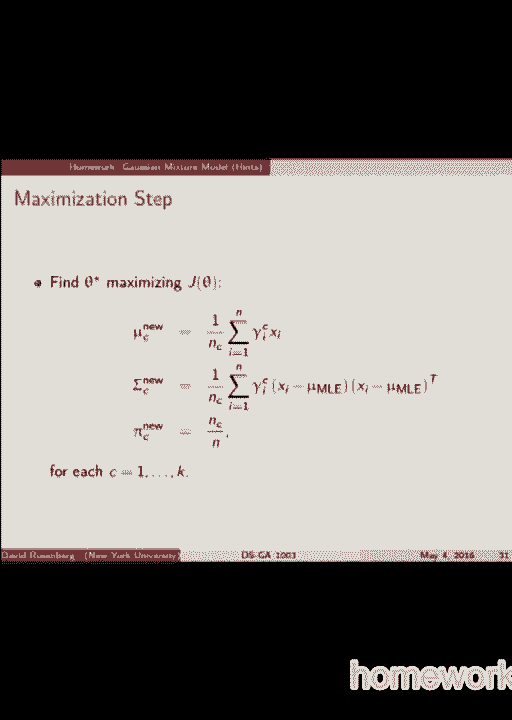

你们想启动神经网络，还是你现在想问几个问题，休息一下，然后启动神经网络，想现在或最后把你的胸部拿回来，在最后，所有的权利，最后想要的请举手，如果你现在想要，她要我寄给你，好的，所有的权利。我们现在就做吧，为什么不呢？嗯，所以现在就做，然后我们让它跑到刹车上，然后我们大约八点十分开始，好的。

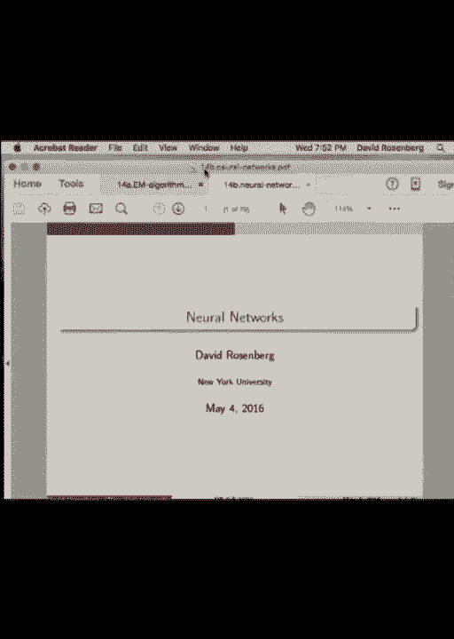

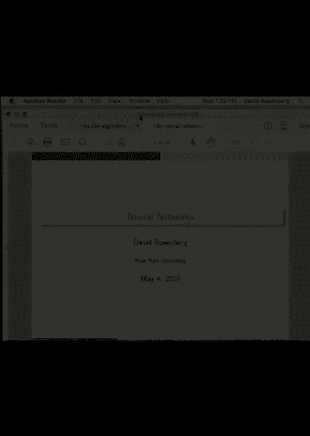

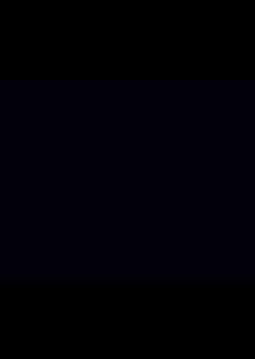

你想拍张照片吗，只是为了拿一个，是啊，是啊，是一样的，好的好的，一二三，我要再做一次，哈哈哈哈，这位年轻女士的每一个人，事实上，超过五个人完全失踪了。

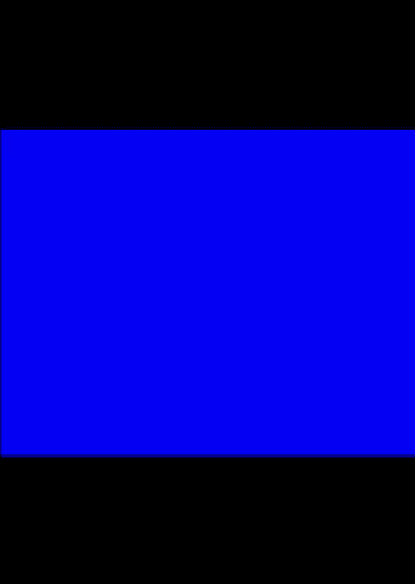

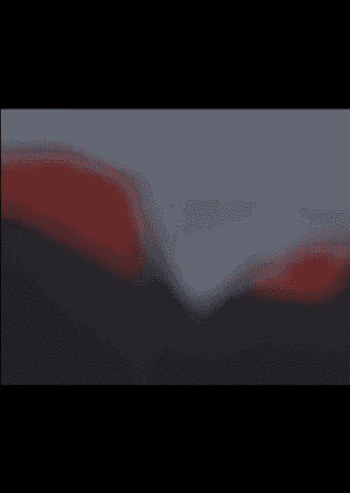

你们中有多少人对神经网络有所了解。

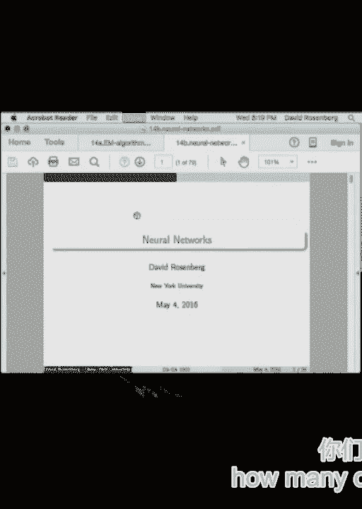

让我问一下，首先是这学期同时上神经网络课的人，所以我会给你我最喜欢的幻灯片，这里人太多了，现在不能做了，我将翻阅高光部分，所以说，我假设你们根本不知道什么是神经网络，但我想你们中的一些人可能知道。所以简单的目标是什么是神经网络，至少是最简单的神经网络，它如何适合我们的工具箱，我们什么时候应该考虑使用它们，实际上，到目前为止，我们已经做了线性方法和非线性方法。线性的或支持向量机和岭回归，套索是线性的，就像任何基于树的随机森林增强一样，因此，神经网络具有很强的非线性，事物的非线性的一面，从高层次来说，神经网络给你的，基于树的算法在非线性方面给你的是。神经网络的输出是平滑的，最近，它们并不总是可微的，传统上它们是可微的，但是现在它们可以跳跃，但至少它们是连续的，好的，所以这里有一个神经网络，到目前为止我们所做的所有线性方法的版本，θ1 到 θ1 到 3。

这些就像我们现在表示的特征向量，像这样，这个图不是，贝叶斯网络是另一种图，更像是一个计算图，但是 θ1，θx1 到 θx3，这些是作为输入的三个特征，代表这些特征中的每一个都乘以一些权重 w。每支箭上都有一个权重，它们都聚集在一起形成一个最终节点，在这张图中，这意味着它们被加在一起，所以分数等于线性代数符号中的分数，x 的 w 转置 phi 和 x 的 phi 是这三个节点的向量，w 表示所有这些权重。所以这将是用神经网络表示线性分类器的方法。所以说，当然，只有当我们添加另一层和非线性变换时，它才会变得令人兴奋。所以我们在这里加了一层，称为输入层和分数之间的隐藏层。最终输出和每个节点的输入来自整个未来向量。所以这个特征向量，在本例中，这些条目中的每一个都乘以一个权重 v，然后把它们加在一起，这就成为这个节点的输入，然后特征的线性组合的总和通过一些非线性变换，西格玛。

这就是这些神经网络非线性的原因，同样的事情发生在另一个节点，这两个节点的区别在于权重，对于这两个节点中的每一个节点，输入的线性组合都是不同的，最后，这两个节点的输出线性组合成最终的分数。这是一个基本的前馈神经网络模板，任何关于这一点的问题都很清楚，所以这里是这里，让我写下这张图片的数学含义。一个隐藏节点，让我们称之为 h one 或 h i，它是隐藏节点的输出。沿着这个箭头向下的等式是 sigma 的 sigma，这是一个函数，它被称为激活函数，它通常是非线性的，我们稍后会看一些例子，这就是非线性的来源，你传递给非线性函数的是一个数字，单个标量，它是输入的线性组合。所以总结一下，你得到一个 X，你把 X 的特征表示，那是 x 的 phi，你取 v 转置的特征向量的线性组合，i，e，那是标量，数字，你把它通过一个非线性函数，这给了你另一个数字，这是 Hone 的输出。

在H 2上做同样的事情，你得到两个数字，然后把这两个数字做线性组合，h 1 和 h 2，如果你把它，嗯，是的，功能对每个都是一样的，你可以做你想做的事，但确实，对于所有音符，激活函数通常是相同的，是的，是的，嗯，是的，你可以有任意数量的隐藏节点，也可以有任意数量的层，这就是这个基本模板。所以我会看看，这些是回答你问题的要点，所以是的，可能会有，你知道，五万个节点，可能会有。嗯，是的，传统上你知道，如果你回到十多年前，通常会有一个隐藏层，但最近他们，你知道，现在你回到十年前，他们做了八层，最近他们有了一千层，所以有这个，他们不做更多层的原因是因为他们发现很难做到。在深度网络中，学习部分的训练很难，但近年来有了很大的进步，关于如何有效地学习所有参数，所以所有的 w 和 v 都是从数据中学习的，没什么特别的，基本上是随机梯度下降，可能会有一些小的变化和改进，但嗯。

但他们很难训练它们适应较小的网络，但现在，通过不同的发展来训练它们，即使是网络也像一千层，同样的不，我是说，第一输入层不隐藏，最后一个没有隐藏，其余的是因为你没有直接观察到这些节点。这些不在潜在变量模型中的原因之间的区别，就像我们所说的 EM 算法，我们实际上想知道这里隐藏节点的值，我们不一定真的关心他们，它们只是让我们得到这个非线性函数的一种方法，所以我想这是。 这是一个参数化的非线性函数，参数是所有的 W 和 V，我们必须学会它们，但从高层来看，什么都不跨越，这里没有什么是我们不熟悉的，这是一组从 r3 映射到 r 的函数，在本例中，由 w 向量和 v 向量参数化，就这样了。好的，那么这与带有非线性核的线性回归相比如何呢，所以我们就叫它非线性特征图吧，好的，所以这只是回到这个案子，所以我们把非线性特征作为输入，然后这是线性回归，所以这是很新的东西，对吧。

即使我们有输入是非线性的，也是用非线性特征来表示的，即使函数是一个非线性函数，这真的不一样，是的，是的，哦，耶，为什么非线性，嗯，我想最简单的动机是，很难发明所有的非线性，如果你想没有这个。那么你就必须发明你的非线性特征，人们已经做了很长时间了，但如果你能自动学会，那不是更好吗，事实上，最近，在某些领域性能要好得多，就像谁决定西格玛一样预测，选择西格玛，西格玛不是学过的，在这种情况下。西格玛是由数据科学家选择的，只有几个通常使用的，我一会儿就给你看，是的，是的，是的，是的，H 在这种新功能上，我们能把 H 作为新功能吗，当然，我希望你把 H 作为新功能来考虑，事实上，我想让你考虑 H 作为特征。通过神经网络学习，而不是自己设计，这是我们越能有更多的年龄，更多数据，我们也可以，你说你可以有更多，你可以有更多，是的，而不是从 H1 到 H2，可能是 H一三额外，一千个是，你也可以有更多的层，这是正确的。

我不做你想做的事，嗯，增加，这是个好问题，那么在什么条件下，你有，网有多宽、网有多深，人们最近发现，更深的网络似乎更有效，如果你能训练它们。所以，如果有了所有的交易技巧，能够成功地最小化目标函数，实际上得到很好的训练误差，似乎更深的网络通常在以下方面工作得更好，就是说，比更宽的网络更少过拟合，即使对于相同数量的节点，虽然有点不同，但仍然非常艺术，发现为了有效地表现，人们发现深度网络通常提供更好的性能，至少在某些领域，如视觉，嗯，譬如说，我不想给出规则，我只是大概说一下，人们最近通过让它们的关系网更深而取得了成功，所以这是个很好的方向。所以神经网络的挑战之一是你可以改变很多东西，网络结构，你的激活函数，你有所有常见的问题，比如优化、步长，类似的事情，所以在神经网络中有很多事情在进行，看起来一切都很顺利。

你去参加神经网络会议，我刚从一个，所有这些很酷的东西都很有效，你会感觉到他们就像，哦，我就试试看，会成功的，问题是所有这些微小的变化，什么有效根本不起作用，这样你就会和人们说话，他们会说，是啊，是啊。这太棒了，但是当我把我的激活函数换成另一个东西时，它实际上很穷，所以我想如果你要进入神经网络，一个好主意是从你知道有效的东西开始，然后逐渐调整到你想去的方向，除非你有很多时间做很多实验，让它工作。但最近神经网络社区最酷的地方是那个男孩，他们把所有的代码都放在GitHub上，他们真的很喜欢分享，让一切都可以复制，所以从某种意义上说，参与进来再容易不过了，就像，你知道的，最先进的东西就在那里。你可以复制结果，然后你想玩它，你知道你总是可以回到他们工作的设置，所以这是一个很好的，对于喜欢玩东西的人来说，这是一种很好的感觉，然后嗯，这不是一个很好的领域，如果你喜欢有非常严格的理由。

为神经网络设置某些参数设置，因为据我所知，这仍然不存在，所以有很多游戏、调整和实验，结果在很多领域也往往是最先进的，所以说，这是修补匠的好时代，数学家们也许已经有了他们的一天，好的，所有的权利。关于这个基本设置还有什么问题吗，所有的权利，所以激活功能，这是多年来最常见的，叫做乙状结肠，饱和在零和一，有一些弧线切线，基本上是一模一样的形状，刚刚转移了，所以介于负数和有时也用的负数之间。关键是它是B非线性的，这就是神经网络的力量，这是魔法，如果它是线性的，那就一点也不有趣了，这只是一个所有，这些线性变换层将崩溃为单个线性变换，那不是什么新鲜事，作为乙状结肠，这是最近很流行的一种。效果很好，它被称为整流线性函数，现在人们只是把它称为relu给你，就是这个形状，所以说，你们看到这种功能的利弊了吗，你知道的，想象你正在处理它，你写下你的目标，它有这个功能，嗯，你要做新元。

你要采取渐变，你得用它计算，所以这一块在零不变，这一块正好是y=x，是啊，是啊，所以一个问题是，它是不可微的，但是好吧，我们对此没意见，我们做次梯度，没什么大不了的，反正你也没踢过，好的，我们没事。所以另一件事是两件事，计算速度超快，和这里相比，我们有一个指数，是啊，是啊，计算机很快，但指数仍然是，你知道吗，你必须做一堆运算来计算，数的a的指数，但这很容易，就我所知，如果没有更快的计算机计算的话。如果是这样，你分支，如果小于零，你知道，要么返回与输入相同，或者是零，所以这是非常快的计算速度，它的衍生物已经死了，太容易了，不是零就是一，好吧，另一个if语句，所以你一个。你在这里得到的主要是计算速度，那个，为什么这很重要，因为如果你调整你的模型，你想让事情跑得快的很多方式，您可以调整更多常见的主题，你想使用快速的计算机和快速的算法，主要是给自己更多的时间来调整超参数。

因为你的很多表演，不仅仅是神经网络，但对于所有型号，将来自于仔细尝试新事物，您尝试新功能，你尝试新的超参数，你尝试新的型号，所以速度很重要，所以我觉得这很整洁，对神经网络内部的一点观察。所以这里我们要看的是拟合一个函数，y等于，f是x的平方，x的f是x的平方，所以这代表了我们拟合的函数，蓝点是我们的训练步骤，三个隐藏节点的输出，所以想象一下我们有这个网络，除了代替H1和H2，是他一个。氢二和氢三，我们看到的是，跨输入维度的三个隐藏节点的输出为一个，所以我们有一个输入节点，输入维度只是一个实值，我们正在查看这三个隐藏节点的输出，对于输入的各种值，这些是我们作为隐藏节点输出得到的曲线。所以我们看到非线性存在于隐藏层的输出中，然后红线是最后的线性组合正好把这个x平方，因此，如何将这些功能组合起来以适应，我们要找的东西很清楚，这是什么，所以我有同样的图片为其他几个功能，正弦x。

这三个输出加起来是线性的，组合正弦x，那很酷，这里有一个V函数，所以它不是很精确，因为你知道这些，这是为了乙状结肠逻辑激活，非常光滑，所以为了得到一个扭结，你得努力工作。这就是乙状结肠必须迅速改变的原因，好的，这里有一个步骤函数，是啊，是啊，我也觉得很酷，有一个伟大的告诉你们，有一个很棒的JavaScript，一种实验室模拟器。在那里你可以让像点击这样的网络变得非常容易，我会发一个到广场的链接，它是，这是一个很好的方式来了解发生在你身上的事情，得到这样的图片，保持它们在OK输出中的功能相同。所以这里发生的是我们用随机梯度下降训练模型，我还没有谈到损失函数，或者怎么，但它是，没什么好奇怪的，所有的重量都设定好了，然后我们输入不同的x值作为输入，我们查看每个隐变量的输出，所以现在再来一次。

你的问题，我只想玩这些东西，然后就像，当你能写的时候，我们利用了这个功能，我们的意思是我们看起来，它是在，就像我们做的那样，因为这就是，哦是的，所以你使用的激活函数的选择是一个建模选择。所以你试试乙状结肠，好像我不喜欢那个，让我们试试雷卢，让我们试试，人们使用的选择并不多，所以你尝一个，你试试另一个，就是这样，或多或少有一些，最近，有不同的修改，动机，使用一个函数，那是。是什么给了你一个强大的动力，已经计算速度和容易性，但你在问，我觉得，从建模的角度来看，关于relu，你会注意到一件事，那就是它是无界的，而乙状结肠在零到一之间有界，所以发生的事情是。如果你看看你有训练数据的区域之外的预测，行为是可以预测的，这就是Relus倾向于爆炸，像这样，而乙状结肠就不是这样了，所有的权利，所以好吧，还有什么问题吗，我想再给你看几样东西，是啊，是啊。

我派人去找红色的，不知何故，是啊，是啊，就像，这是一个很好的，所以我看到了，不是神经网络，我在SVM环境中见过，嗯，我几乎可以肯定这是在神经网络中完成的，我只是不知道这是怎么回事，我没听到很多人谈论它。所以不知何故，这并不令人惊讶，它成为主流，但是是的，我敢肯定做这件事是可行的，如果你很好，出了点问题，所以如果我没理解错的话，你想把它装进后备箱吗，所以问题是，如果你在树干上经过截断。所以你在水平平坦的部分，那么你就不会得到渐变更新，所以当你做渐变下降，当你在平坦的地方时，你没有变化信号，所以这是一个和是的一样的问题，如此正确，所以如果你太消极了，你有麻烦了，但如果你太积极。这也会让它陷入困境，所以你有点。

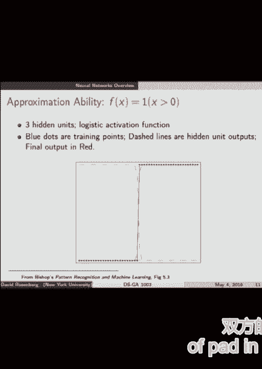

这是一张卡通图，展示了你现在得到的东西，当你为视觉做神经网络时，或者你希望得到什么，你真的做得很好，如果原始输入是像素，好的，那是你的意见，你会发现在网络的不同层，您会得到隐藏的节点。这些节点倾向于响应输入中不同类型的模式，所以说，比如说，这里发生了什么，这个特别可爱的块对应于我们的第一层的一个隐藏节点，我们的神经网络，和，解释这一点的一种方法是，如果图像中的像素。这种过滤器在特定区域有很高的内积，那么这个隐藏节点就会有很高的输出，否则我们的产量会很低，所以，这些是输入中每个隐藏节点响应的模式类型，所以你可以看到他们在最低层的反应，这些会像边缘一样。在更高的层次上，很多层，如果这是人脸识别问题，它倾向于学会对面部的某些部位做出反应，所以鼻子和眼睛什么的，或者在顶层，它甚至会像整张脸一样，所以更一般地说，你希望你所学到的特征成为一种。

从非常低级的简单功能转移到高端的更复杂的功能，例如，嗯，在神经科学或假说中有一种理论，你的大脑里会有一个神经元，当你看着你的祖母时，它会有反应，它被称为祖母神经元，当你看到你的祖母时。就会有一个神经元开始放电，所以事实上他们是这样训练神经网络的，他们经常能找到祖母神经元的类似物，所以嗯，对特定的神经元做出反应的神经元，你知道的，这只对猫有反应，这只对狗有反应。这是对你最好的朋友的回应，所以他们发现这种情况有时很有趣，是啊，是啊，的，很好的问题那么我们的神经网络有多复杂，我们为什么要关心这个，因为它和过度装修有关，估计误差与近似误差的权衡。

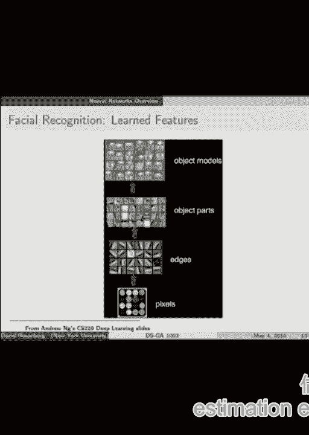

所以说，让我跳到那个，神经网络，让我们把它看作是一个假设空间，对呀，那么超参数是什么，是呀，是你说的，层数，每个隐藏在层中的节点数，我们选择的激活函数，所以是的。我们的一组函数或一组神经网络是由这些东西参数化的，和那种，假设空间的复杂性会增加或缩小，取决于这些参数，嗯，有一件事让故事变得有点复杂，虽然，就是你知道，当我们谈论，当我们在学期开始的时候谈到。就像1和2，正规化，我们先有了这个，我们谈到了功能空间中的球，对呀，就像一个L 2，特征空间中的球，我们将把自己限制在所有的预测函数上，l比alpha少两个范数，这显然没有那么复杂。比所有具有L 2的函数更不可能过度拟合，参数的范数小于两个alpha右，所以我很干净，然后，但实际上我们是在做另一种形式，我们以阿尔法乘以惩罚，规范权，我们争辩说，实际上你仍然可以想象球的事情。

因为有家庭作业，其中我们证明了这两种正则化形式的等价物，所以如果你有这个惩罚函数形式，它等价于有界范数形式，所以如果你想象像，你的球变大或变小，改变了复杂性，当我们去最小化我们的目标函数时。我们倾向于找到实际的最小值，因为我们几乎总是在谈论凸函数，所以我们要么非常接近或实际的最小化，好的，所以说，神经网络假说，空间，所以我把它放在一边，但我现在会给你小费，那个神经网络，客观，目标函数不凸。这就是为什么人们很长一段时间都避开它们，因为它们很难最小化，从数学方面来看，如果你想证明定理，你不知道要证明什么，因为你想证明，你知道吗，你也许可以证明一些关于全局极小化的东西，但你永远找不到。所以你要证明的是你的算法最终会在哪里，这是一件很难处理的事情，无论如何，所以因为这个东西不是凸的，可能是一个非常复杂的模型，有各种各样的技巧或技巧，人们用来不过度适应，早停。

我们知道当验证错误开始时您将停止，向上，我们知道，但还有一些其他的东西，我会翻阅一下，嗯，所以是的，我们可以做l 2和正则化，现在有一条规定，神经网络的正则化，但人们会想出其他奇怪的事情，比如辍学。这是当你学习你的网络时，您随机选择一些节点归零，不允许它们参与，似乎是一件有趣的事情，但它似乎有助于防止过度适应，嗯，所以其他关于哪里的事情，因为它不是凸的，我们。我们的终点在很大程度上取决于我们的起点，所以你选择一个起点，你可能会在当地的最低限度，但如果你从别的地方开始，你最终会在另一个当地最低限度，好的，所以说，关键是对于神经网络来说，很难得到一个，嗯。一个大网络之间的权衡并不清楚，导致过拟合，这就是我想说的，所以对于大多数其他事情，小是之间有很明显的联系，你知道，我们想要越小越好的东西，它仍然符合数据，但不太清楚，神经网络就是这样，事实上。

人们发现有时更大的网络，In-out-of-sample性能，即使您可以在较小的网络中得到相同的训练错误，这与你通常得到的完全相反，我的建议是，原因是因为训练中有各种各样的技巧，神经网络，嗯。这样你就不会太合身了，因为它不是凸的，这使得它的联系不太清楚，你知道的。

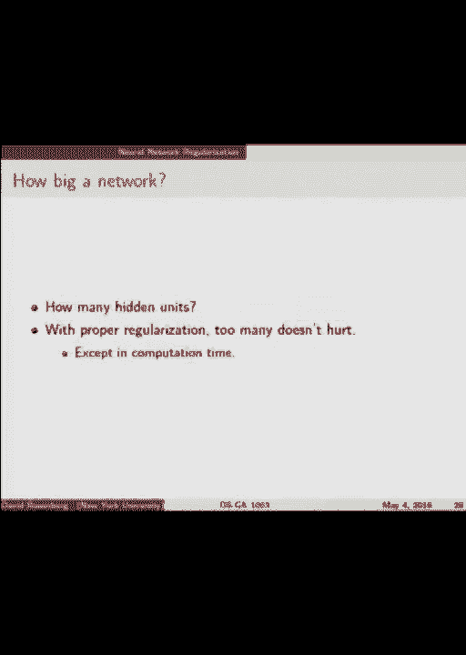

所以这里有一件很酷的事情你可以用神经网络做，也就是说，您可以有多个输出节点，你可以有多个输出，这是一种非常简单的方法来获得所谓的多任务学习。

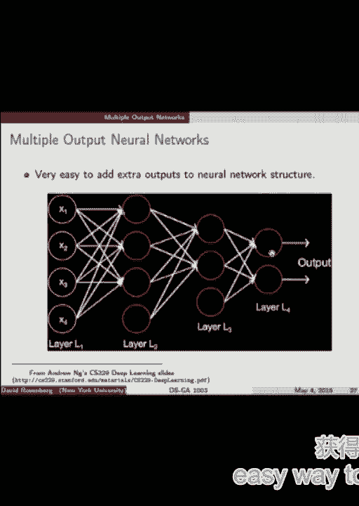

这是你有一个输入的地方，你想预测多种事情，这里有一个简单的例子，我有两个二进制分类问题，我想应用于相同的输入图像，我想知道，画中有一只猫吗？是或否，我也想知道。

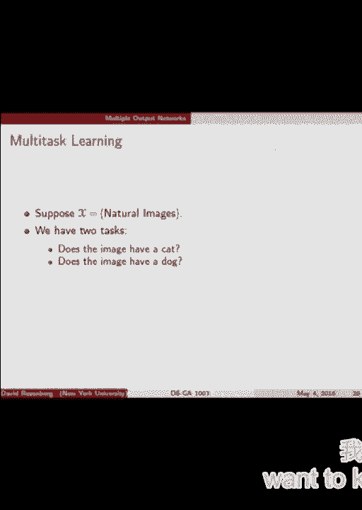

画里有狗吗？是或否，好的，我们可以用两个独立的输出来表示，我是说，我们怎么训练，我们仍然需要一个单一的目标函数，好的，我们就，我们就看看这个输出的损失，将它或其他东西添加到其他输出的损失中。

然后进行相应的训练，所以另一个术语，我想让你们听听，所以目标函数正是你所期望的，你有你的预测功能，给你一个分数，然后你可以写下一个损失函数，在这种情况下，我写下了平方损失和你。最小化这个目标函数的第一种方法是随机梯度下降，或小批量梯度下降，这是当今神经网络中使用的方法，还有一种叫做反向传播的东西，你们听说过反向传播吗，所以反向传播实际上只是，一种非常有效和聪明的梯度下降算法。实际上是为了计算函数的梯度，以及计算你的神经网络的分数，所以这是神经网络的向前传递，其中计算输出，给定输入，和一个向后的传递，在那里你计算关于那个例子的梯度，在那个例子中相对于参数的梯度。所以我想让你把反向传播划分开来，对自己说，好的，反向传播只是梯度下降的一个聪明的算法，对于神经网络，从建模数学的角度，一点都不新鲜，这是一个很酷的算法，值得一看，关于神经网络，我要说的最后一点是。

所以我们已经提到过你可以，你可以把隐藏的层想象成神经网络发现的特征，有一种东西叫过脚，你们中的一些人可能正在使用，你们中的一些人可能正在使用它，所以他们在大量数据上训练了这个神经网络，图像分类数据，嗯。他们有一个非常成功的神经网络，拿走了，你知道吗，大量的计算能力和资金来训练网络，他们所做的是，隐藏节点，您可以将其视为网络学习的特性，您可以下载这些功能给您，这样它们就已经学会了。所以你可以下载程序来计算新图像上的特征，然后将这些特性输入到一个更简单的模型中，就像任何SPM，比如说，那是一种很好的能力，重用某人已经投入的所有计算能力来生成这个网络，也许他们在预测。你知道他们可能在预测，嗯，一组固定的类，所以你不会真的想让他们的整个网络，如果您想预测另一组类，你知道吗，也许他们在预测动物，但你想预测车型，原来这个特征，许多对一种图像问题有用的特性。

经验上倾向于对其他图像问题有用，即使是不同的类或不同的领域，所以这有点，你知道的迁移学习，在那里你把在一个领域完成的一些学习转移到另一个领域，你只要把这些特征，你可以立即在你的新数据集中插入这些功能。训练得很好，你听说过VEC的消息吗，单词到VEC对单词来说是完全相同的想法，所以Word to VEC有一个训练集，在另一堂课上谈论这个，我推荐给大家，他们想出一个非常有用的每个单词的表示。在您可以使用的新域上，而不是一袋文字。

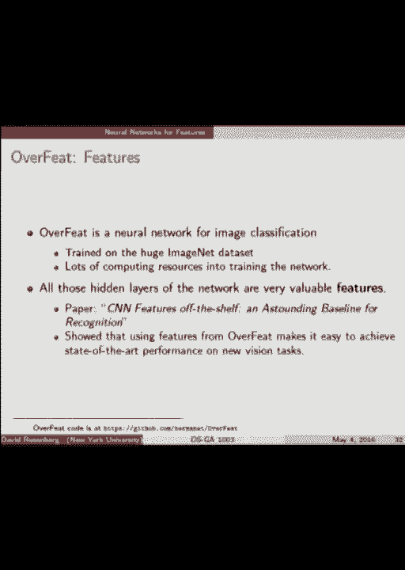

好的，所以这里有一点，嗯，图片，这给了我们一个很好的视角来理解神经网络对我们的意义，似乎，随着我们拥有的数据量急剧增加，我们所说的大多数算法算法的性能，所以神经网络，人们声称他们把性能水平提高了。最终用一定量的数据，而深度学习有如此大的能力，因为你总是可以让这个网络越来越大，它的性能往往会越来越好，当你给它提供更多的数据时，当然，这样做需要大量的计算时间，这就是我对神经网络要说的。我想问任何关于神经网络的问题，因为我只是想在最后给你几个建议。

喜欢其他课程，你们可以拿着，是啊，是啊，深度学习是关于神经网络的，深海更喜欢很多层，没错。

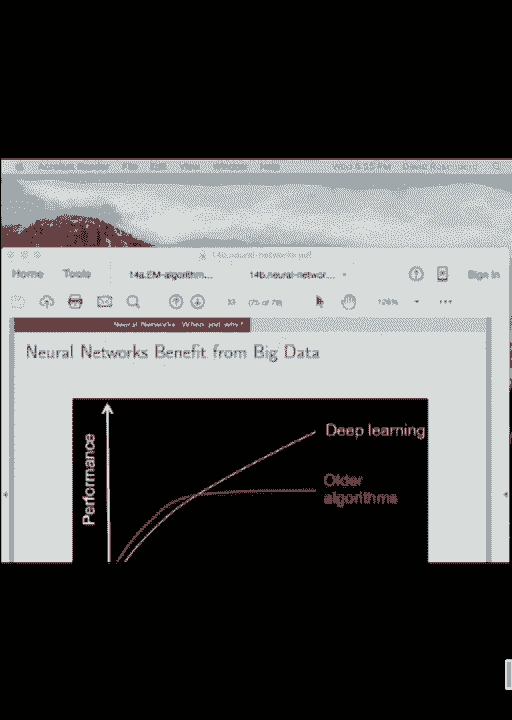

就这么简单，是啊，是啊，是啊，是啊，关于我们所看到的领域，我们的形象，现在接近，是啊，是啊，用于图像，用于机器视觉和语音识别的图像，神经网络绝对是最先进的，所有这些都是最先进的方法，利用神经网络。自然英语处理是非常有趣的，接下来是你的问题不在那里，就像不同的问题，我们应该尝试用神经网络来接近，哦，谢谢，好问题，是呀，这没关系，所以如果你想在视觉上做一个严肃的工作，神经网络，卷积网络。如果你想进入语音识别，神经网络，当然，如果你想，做一些文档分类什么的，去吧，试着用一个词来表示VEC或其他东西，一般来说，如果你想使用神经网络，你你在想什么，你有大量的数据。你有非常强大的计算机来处理这些数据，主要意味着GPU，所以图形处理单元是你现在在神经网络训练方面取得进展所需要的，看起来，当你有更少的数据时，你没有使用它们，我是的，我觉得，是啊，是啊，我会。

我会说是的，但是他们的一个训练，或者任何预测，如果没有，如果没有，预测还是比较慢，因为你有更多的层要计算，但是是的，它不是，嗯，以帮助您在一年后或更典型的，是呀，这个来了，所有的权利，好问题。所以有一个定理说你所需要的只是一个隐藏的层，你可以任意紧密地表示任何函数，所以就近似误差而言，我们可以用一个单独的隐藏层做得有多好是没有限制的，问题是需要指数级的比隐藏层多得多，所以当你有更多的深度。你可能得到的是更有效的函数表示，通过高效，我是说，更少的参数，我是说更少的节点，所以这就是你从深度中获得的，mlp，多层感知器，是呀，那是，我们就谈了这么多，是啊，是啊，所以这些的另一个术语。这种神经网络结构是多层感知器，即使它与感知器无关，是啊，是啊，在这项工作中，我们知道这个很酷，所以说，无人监督的问题，我们不知道，我们不知道，为什么我们可以应用这个，我提问。

我们能否将神经网络应用于无监督学习，所以我们只有x没有is，好的，所以有一个很酷的方法，它被称为自动编码器，自动编码器，喜欢汽车，但是自动编码器，在这里，你所做的是你接受你的输入，你有一个网络。你有一堆层，你有一个薄层叫做瓶颈，然后你的层又变大了，你试着把输入预测为输出，所以你得到一个输入，并通过你的网络提供它，你的损失是，你的输出分数输出分数离你的输入有多远，从您的输入。所以如果你能很好地从输入中重现输出，但你把所有的知识都塞进去了，并通过了一个只有很少节点的瓶颈，这个想法是你做了一些很好的知识压缩，不知何故，网络发现了输入空间的一些良好表示。这是在无人监督的情况下学习的一种方式，还有其他方法可以在无人监督的情况下训练它们，但这和我们以前做的完全不同，是啊，是啊，最后一个问题，因为我们没时间了，教这门课我最喜欢的部分，哦，我喜欢写家庭作业。

否，我最喜欢的部分是你们问问题并参与，有一些互让，这就是有趣的地方，所以在那个音符上，这是一个非常有趣的学期，我想感谢你们是一个很棒的班级。

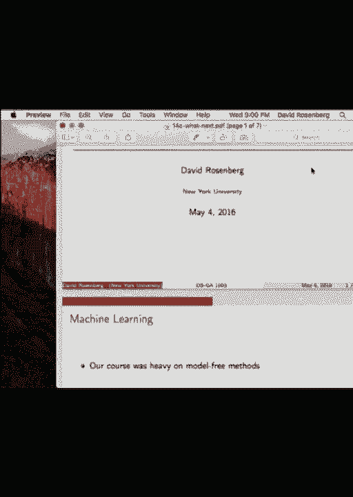

