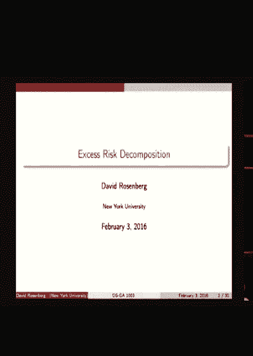
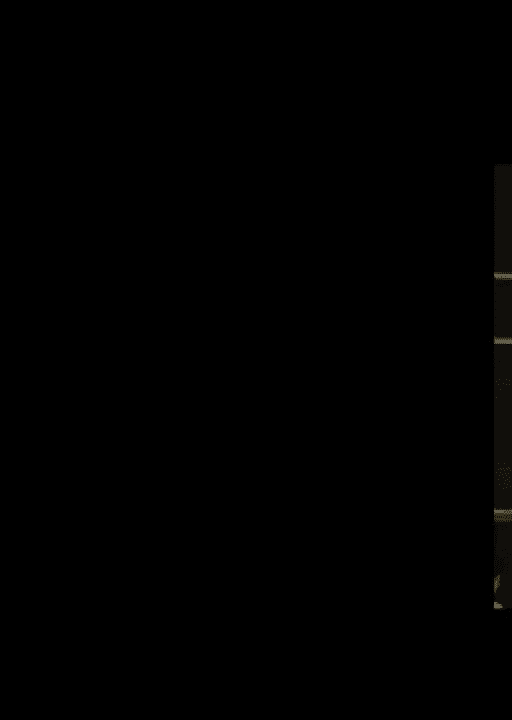
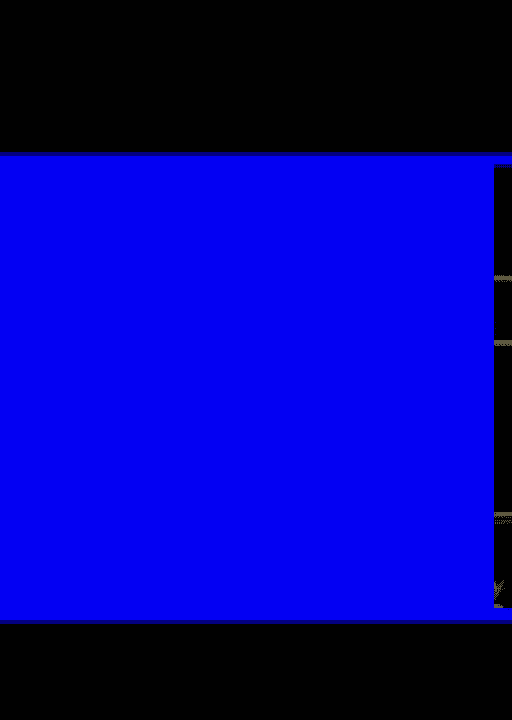
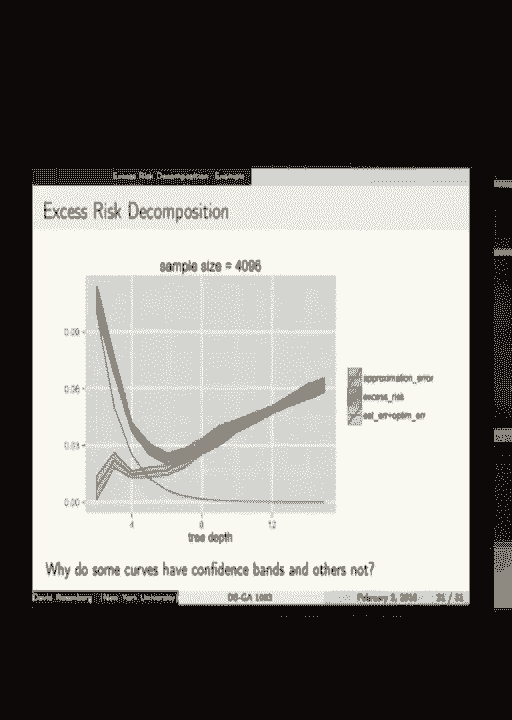
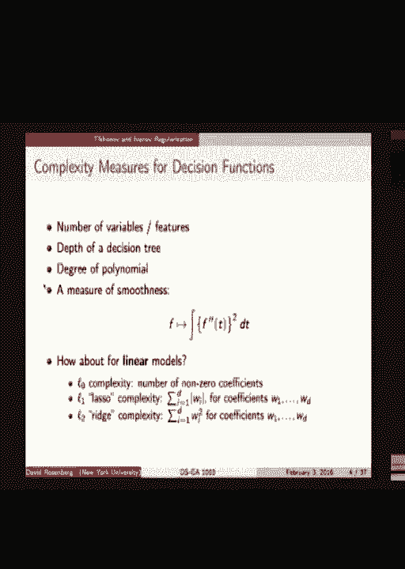
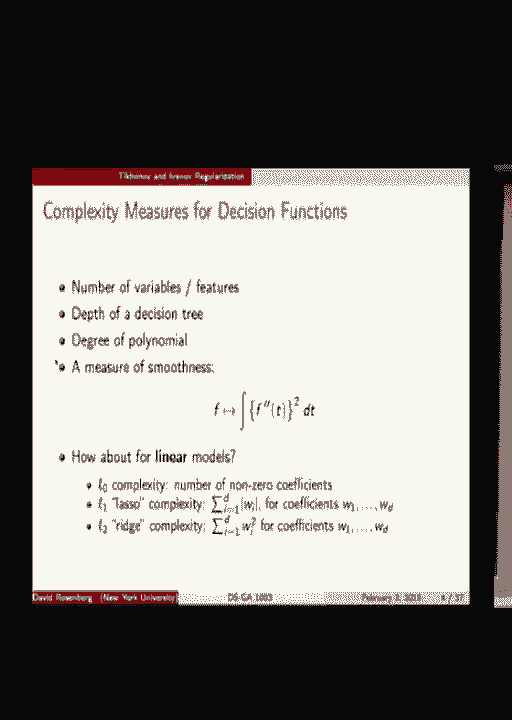
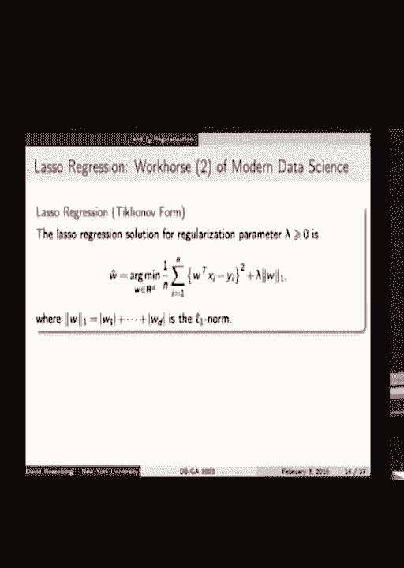
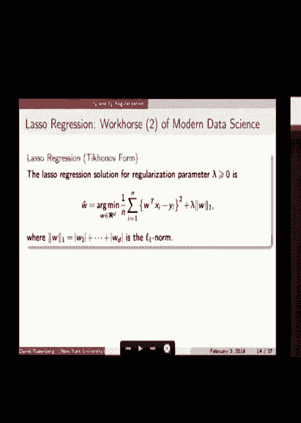

# P3：3.Feb_3_Lec - Tesra-AI不错哟 - BV1aJ411y7p7

所以有一些后勤上的小评论。

注册了课程的同学都加入 Piazza 吗？是的，讨论已经非常活跃了。我觉得已经有大约 50 条帖子。所以很多事情在进行中。我唯一的请求是，希望你们同学能帮助回答问题并先阅读问题，在提问之前，避免重复问题。所以这是我唯一的请求。

通过帮助他人来参与。

这会让讲师的工作更轻松。不过有很多不错且有趣的问题，我觉得你们从阅读中能受益。

其实。好吧，给你们一秒钟。

好的，今天我们将更深入地探讨一些抽象方面的内容。风险最小化假设空间的概念。然后我们将进入一些算法：L1 和 L2 正则化。所以回归问题，你们已经在作业中见过。

Lasso 可能对你们中的一些人来说是新东西。我们将看到它们如何融入假设空间和正则化中。接着，我们会讨论一些优化你们所得到的目标函数的方法。今天大致就到这里。明天会稍微延续一下，我们会更加仔细地思考 Lasso 和 Ridge 的一些有趣特性，这些特性在实际应用中实际上非常重要。

我们可能明天开始讨论分类损失。下周预告一下，下周可能是我们数学上最难的一节课，或者是最密集的一节。内容很多。我只是想让你们知道，以防你们有额外时间准备。我上传了去年我们使用过的一些笔记和幻灯片，提前查看它们会有所帮助。

好的。那么，开始吧。今天上半部分的主题是过度风险分解。好的，我们先做一个小复习，行吗？复习一下上次的统计学习理论。所以记得我们有输入空间、输出空间或行动空间，其中决策函数接收输入并产生一个行动。我们有损失函数，一旦你做出行动并看到实际输出是什么。

它给你一个分数，一个损失值。小的好，大的坏。然后我们有了评估特定决策函数的黄金标准：风险或期望损失，这基于假设我们的输入和输出对来自于一个数据生成分布。

期望值是相对于此进行计算的。最后，当我们有这个风险时，我们可以问，哪个函数最小化这个风险，最小化期望损失。现在它被称为贝叶斯最优决策函数。这个函数所达到的风险被称为贝叶斯风险。

然后当然，我们指出的是，我们不知道生成分布，除非在我们设定的某些人为情况中。而我们能做什么呢？当然，我们假设我们有一个来自数据生成分布的样本，记作D，D子M。然后我们引入了经验风险，它不是一个期望值，而是一个经验平均值，一个样本平均值。

关于从分布中抽取的数据集。因此，我们有这个数据集上的平均损失作为经验风险。我们看到上次的小示范，如果你尝试最小化经验风险，整体函数可能会导致过拟合，可能会导致过拟合。

那么我们上次给出的答案是什么？我们建议将我们的优化限制在假设空间内，即所有函数的子集，而不是所有函数，并在假设空间内优化。我们在讨论如何构建假设空间，如何将那些函数放入你希望最终得到的假设空间，它们应该具备看似合理的属性。

从一开始就给你们讲解。所以那些是线性函数、多项式函数、决策树。所有这些都是可能的假设空间，都是所有可能决策函数的子集。好了，一旦我们将假设空间限制为F，我们再次得到经验风险最小化器约束和风险最小化器约束，都限制在假设空间F内。

记住，F̂ N，每当出现“帽子”符号时，意味着某些东西是从数据中得出的。这是一个打字错误。这里不应该有帽子。风险最小化器与数据无关。所以这里应该只是一个F子集，属于假设空间。所以在下一张幻灯片中会修正。好，接下来有一个重要概念，我将在板上画出来。

我将大致重复幻灯片上的内容。所以如果你看不清我画的东西，你可以参考这张幻灯片。但我更喜欢在板上画。所以我要画一个大框。这个太大了。这代表了所有可能的函数，将输入空间映射到动作空间。所以好吧，F将X映射到动作空间，所有可能的。现在假设我们有一个损失函数。

我们有一个数据生成分布，然后我们可以谈论贝叶斯决策函数。它是一个函数，决策函数，因此它位于这个空间的某个地方。让我们在这里写下它。稍等。F*。你们看得清楚吗，角度可以吗？

好吧，不然它就在那里。好了，现在我已经选择了假设空间。假设空间是整个空间的一个子集。所以我画一下。只是个示意图。意思是要显示这不是整个空间，它是空间的一个子集。好了。在这个假设空间的函数中，我们称之为F，必定会有一个最佳函数。

从最小化风险的角度来看。所以要证明它尽可能接近最优。我将画出它，这里。像是几乎将这个贝叶斯最优函数投影到假设空间F上的感觉，但这不正式。我们将写下这个F子假设空间F。好了。让我们写下贝叶斯最优的风险。所以我们写下它为R（F*）。好的。

那么我们能说些什么关于贝叶斯最优风险和这个受约束最优函数风险之间的比较呢？当然。太好了。所以这个小于或等于这个。太好了。好了。那么接下来我们需要什么函数？有什么问题吗？好了。那么接下来我们需要引入哪个函数到这个图中？经验风险最小化器，对吧？

让我们写下来，给自己留点空间。让我们写在这里。所以它仍然是一个假设空间F。通常它不同于这个类中的最佳函数。好吧。这个是经验风险最小化器。它是基于最小化经验风险的。它是基于数据的。那么这个呢？F子F。是基于数据的吗？不是，它是基于。

这是一个无法实现的理想。它是这个集合中最小的风险。但我们并不知道风险是什么。风险依赖于数据生成分布。它是关于数据生成分布的期望。因此，我们可以有非常精细的划分，但我们可以通过分解它来讨论它的存在。好吧。

所以我们引入了这个东西，这个假设空间来控制过拟合。但是这会带来惩罚。是吗？不是吗？好吧。它会带来惩罚。所以问题是，最佳函数不在假设空间中。因此，通过限制这个F，我们失去了一些东西。这就是根据风险我们在表现上所失去的差距。

这叫做逼近误差。逼近误差，我们可以写出来。我就说，APP代表逼近误差。这个在幻灯片上。我要去它那里。好吧。所以逼近误差是这个函数的风险减去这个函数的风险。好吧。当我们增大假设空间时，逼近误差会发生什么？

它更小了。因为如果新的假设空间严格更大，类中的最佳函数在风险上只能更好。太好了，非常清楚。让我们谈谈经验风险最小化器，这个家伙。这次可能不那么明显。当我们增大假设空间时，你认为会发生什么？经验风险最小化器？

让我先加一件事。你是否期望经验风险最小化器的风险比类中的最佳要好，还是更差？几乎显而易见，对吧？根据定义。所以我们可以讨论这两者之间的差异。经验风险最小化器的风险减去类中最佳的风险。

这叫做估计误差。那么，估计误差的来源是什么？估计误差的主要原因是我们不知道数据生成的分布。我们基于数据使用经验风险来逼近风险。所以经验风险最小化器和类中最佳之间的差距纯粹是由于我们。

我们不知道分布，我们只有一个样本。这种最佳类和总体最佳之间的差距与样本无关。这里的问题是该假设空间的约束。所以有两种不同的误差来源。现在，当我们扩大假设空间时，是的，近似误差会减少。

但估计误差可能会增加。为什么会这样？这个想法，有人有想法吗？好吧。所以如果我们，假设空间的大小变小，而我们有相同数量的数据，那么找到接近最佳的东西就比在非常大的空间中容易。大空间对应着可以过拟合的许多函数。总体空间的约束性更强。

更不容易过拟合。好吧？所以过拟合是经验风险最小化器和类中最佳之间的巨大差距。因此，大的估计误差就像是过拟合。如果这个假设空间太小，且空间中的每个函数都过于简单，无法做出预测。那就是欠拟合。我们的假设空间没有足够的能力来拟合，去找到我们需要的决策函数。好的，再问一个问题。

所以修正假设空间的大小。我们增加样本的大小。更多的数据。会有什么变化？是的，随着数据的增加，经验风险最小化器可能会发生变化，因为我们有一个不同的数据集。我们期望估计误差会减少。通常来说，随着数据量的增加或假设空间大小的固定，我们期望估计误差会减少。

这个近似误差没有变化。好的，明白了。好吧，有问题吗？

很直接。很好。有一个叫做过剩风险的概念。决策函数的过剩风险是该函数与基础风险之间的风险差异，基础风险是最佳可能的风险。所以如果那个基础风险是上限，你可以说F的过剩风险就是我们做得比最佳可能结果差多少？

我想把它推向零。那么，特别是，经验风险最小化器的过剩风险是什么样的？事实证明，这可以非常漂亮地分解成近似误差和估计误差。所以这是F-head M的过剩风险。让我们加上并减去一个项。假设空间中最佳的风险，就是它得出来的风险。所以我们加上并减去了它。

这仍然是相等的。现在你可以看到第一对项，最后是估计误差。这是ERM的风险减去类F中最佳模型的风险。下一对项是类F中最佳模型的风险减去基准风险。这就是近似误差。所以我们已经将过度风险、总失望以及ERM之间的总差距分解开来了。

并且将基准分解为近似误差和估计误差部分。好吧，让我们深入一点。近似误差。首先，它是类F的一个属性。它是我们限制假设空间的惩罚。很好。更大的F，较小的近似误差。明白了。好吧，这是近似误差，是随机的还是非随机的？非随机的。

它涉及到期望值，是的，但是一旦你--但期望值并不是随机的。它涉及到概率论，但它并不是随机的。估计误差。就是基于有限样本选择F而不是使用完整分布的性能损失。更小的F，较小的估计误差，粗略来说，也减少了过拟合。

那么估计误差是随机的还是非随机的？是随机的。因为经验风险最小化器依赖于你采样的数据集。它是随机的。是的，太好了。那么，稍微回顾一下。我们得到一个损失函数。我们选择一个我们认为能够解决问题的假设空间。然后我们进行经验风险最小化。

这将需要一些优化。而数据科学家的工作基本上是选择F，在近似误差和估计误差之间做出权衡，以尽可能地最小化过度风险。这就是工作。如果你能得到更多的训练数据，你该怎么办？是的，如果你得到更多的训练数据，那么扩大假设空间是合理的，或者说是有意义的。

这会减少近似误差。希望样本量的增加能够让你保持估计误差在合理范围内。所以你会注意到我们写ERM时，实际上是在写这个假设空间上的参数，这样写是没问题的。但实际上，你必须找到这个参数。

这就是我们使用优化算法的原因。所以我们来思考一下，因为这里面有一些东西在发生。所以，确实，对于一些良好的损失函数选择和合理的假设空间，我们可以计算出最优解，精确到我们想要的程度。如果我们愿意等待的话。所以，举个例子，你在做作业时涉及到的红色回归。

如果你要等的话，你可以将经验风险最小化器找到任意精度。这需要很多时间，值得这么做。第一个问题，第一个点。第二个点，有些情况，比如神经网络，事实上我们并不知道如何找到经验风险最小化器。现在。

它不是一个凸函数，我们不知道如何找到目标函数的真实最小值。举个例子，对于神经网络。是一个问题吗？是的，问题。没关系。我们可能会在学期后期再回到这个问题，但实际上，我只是指出，有些假设空间我们不知道如何找到经验风险。

对于最小化器。这就是关键点。是吗？我们如何计算基础风险？哦。我们如何计算基础风险？是的。我们无法。我们可以计算经验风险最小化器。对的。是的。除非我们知道数据生成分布，否则我们永远无法计算风险或基础风险或风险最小化器。在实践中，我们通常并不知道它。

我们只是从那个分布中获得了一个样本。为什么不呢？它等于零。再说一遍。基础风险可能不等于零。没错。系统中可能存在一些随机性，它始终存在，你永远无法预测。比某个特定水平更好。比如说，如果你掷一个公平的硬币，想预测它是否

抛硬币，无论如何，你做得不比50/50更好。没有哪个预测函数能有较低的风险。好问题。还有其他问题吗？是的。[听不清]，好。问题是，我们已经运行了优化算法。找到了F hat U R M。有没有办法 -- 好吧。我们从未说过我们能找到它，但如果有人给了我们一个，我们能否检查它是否是。

实际风险最小化器？我不知道，除非你知道数据生成分布。我不知道现在是否有任何方法可以检查这一点。是的。[听不清]。更大的F是否一定意味着更小的逼近误差？Roger F。好吧，逼近误差随着F的增大永远不会增加。对。当我说增大时。

我在这种情况下具体指的是一种嵌套的。场景，其中下一个假设空间完全包含前一个，并且加上更多。这就是我所说的更大。是的。[听不清]，好。所以问题是。如果你 -- 我们不知道数据生成分布。

如果我们首先直接估计数据生成分布，然后计算相对于该分布的基础风险呢？是的。好吧。这是一种方法。我认为在某些场景下，这与插件方法相对应。问题是，在非常高的维度下，估计这些分布非常困难。

在机器学习中我们处理的是没有数据。如果你想看看去年的一些幻灯片，第一讲关于曲线维度。某个时刻。是的。[听不清]，是的。[听不清]，是的。[听不清]，是的。[听不清]。是的。[听不清]，是的。[听不清]，是的。[听不清]，是的。[听不清]，是的。

[听不清]，是的。[听不清]，是的。[听不清]，是的。[听不清]，是的。[听不清]。是的。[听不清]，是的。[听不清]，问题是我们如何选择一个假设空间？

很多人使用线性回归。我们为什么要做不同的事情，或者我们怎么做不同的事情？

从某种意义上来说，这就是我们在这门课程中要解决的主要问题。我们将讨论许多不同的假设空间以及它们何时可能比线性回归更有利。因此没有简单的答案。我是说，这个问题通常叫做模型选择问题。

这是一个没有直接答案的问题。机器学习课程是模型选择问题的答案。对。[听不清]。F*可能不唯一，但没关系。那是真的。谢谢你提这个问题。今年我首先改变了所有幻灯片，改成说“论点”而不是用一些更精心写的方式。

但是可能没有一个最小化器。它可能不是唯一的。如果你看到我们做的任何事，或者你认为那会引发问题，请告诉我。我不认为会有大问题。但对，确实有一些情况，我们明天会谈到，在这些情况下，经验风险最小化器不是唯一的，这有点麻烦。

我们会讨论如何修复这个问题。但对于近似部分，我觉得这就这样。我觉得没问题。好的。那是什么？更多数据的影响是什么？好的。没有。更多数据对我们的近似误差没有影响。更多数据通常会减小估计误差。是的，对。好的。

那么数据的影响是什么？数据科学家的工作是选择假设空间，并且希望能够减少误差。但我猜有些使用媒介可以表示误差。是的，我当时说减少的时候，实际上我是指最小化总误差，无论你怎么做。因此，我们期望在估计误差成为模型的工作时，误差会增加。

当你改变时，我们来讨论接下来要举的一个例子。我们可以在那之后再讨论。还有其他问题吗？是吗？

你不想覆盖这两个控制项，所以我们可以讨论如何修复。对。那么什么是欠拟合？我的意思是，如果我把欠拟合放入这个图像中，我会说欠拟合是当假设空间太小，以至于估计误差没有问题。

所以这个差距非常小，但这个近似误差很大，我们的拟合不准确是因为假设空间太小或者不合适。我们可能是，嗯，算了，不说这个了。所以给定一个像这样的案例，在给定的情况下，它是我们没有拟合的，或者我们不能取某个点，因为它是空白的。但它并不是由任何特定的点给定的。所以我想让这些话稍微简单一些。

好的，首先让我说这个。问题是我怎么知道在上次讲座中的例子里我们是过拟合而不是欠拟合的？

我们只是说我还没有找到一个令人信服的、精确的过拟合和欠拟合的定义。好吧。那么我们就这样吧，为什么我们不回到这个问题？也许是的。好吧。我们继续。好问题。我们在哪里？优化误差。对了。所以。我刚才说的是，在某些情况下，我们可以将精度优化到我们喜欢的程度。

在某些场景下，比如神经网络等，我们甚至不知道如何找到全局最小值。尽管如此，我们还是尝试了。我们写了一个算法，希望能找到类似最小值的东西，或者至少有一些小的经验风险。我们称之为F tilde sub n。这就是我们在运行算法后最终得到的函数。好吧。这不一定是经验风险最小化的结果。

这实际上是我们算法的一个输出。它也在那个空间框架中。我们希望它足够好。让我们来描述它有多好。现在有一个优化误差的概念。它是我们从算法得到的函数与经验风险最小化器之间的风险差距。因为我们正在试图找到经验风险最小化器，所以我们可能不会完全找到它。

不太确定我们离得有多远。风险之间的差距被称为优化误差。有问题吗？

好吧。优化误差大于或等于零吗？是吗？

这可能会稍微大一点吗？因为你可能找不到实际的最小值。如果你运行我的梯度下降之类的，可能会找到。就像它们非常接近时。好吧。我们可能找不到经验风险最小化器。我承认这一点。我们不会完全找到它。总是存在某种精度，我们可能永远无法达到。

是的，确实如此。但这意味着一些与此稍有不同的事情。你知道这意味着什么吗？我们正在最小化的是经验风险。所以你提到的我们没有找到经验风险最小化器，这意味着我们的F tilde的估计值减去我们的F hat的估计值是大于或等于零的。明白了吗？因为我们不仅仅是在找。它是在这个点上继续发展的。

其实是的，因为。是的。F hat n是根据定义我们估计的最小值。所以是的。如果这算出来是F tilde减去我们的F hat，那一定总是大于或等于零。好吧。[听不清]，我们无法估计这个。我想说的是，正因为如此，我们才有F tilde，它是我们通过算法尽可能得到F hat的方法。所以我们不一定知道如何精确地找到F hat。我们可以很接近。

非常接近，或者说我们只是希望它接近。不管怎样，这就是我们称之为F tilde的东西。好吧。所以，尽管F tilde的经验风险确实比F hat，即ERM差，但实际上不一定风险更大，因为，呃，出于种种原因。

F hat 在任何情况下都不是风险最小化器。它只是经验风险最小化器。所以，可能你会很幸运，F tilde 实际上在实际风险上比 F hat 更好。[听不清]，好吧，估计误差。在每一步我们都有一个目标。对吧？

所以我们第一个最大的目标是 F star。我们无法得到它。这是因为过拟合的原因。然后我们说，好吧，我们来加以限制。那么我们能做到的最好情况是 F f，这是类别中最好的。我们之所以能做到这一点，是因为我们没有我们需要的无限数据集。我们没有真实的风险。我们能做什么？我们可以最小化经验风险。这就是 F hat。

那很好。那很好。但实际上，要做到这一点，我们必须能够解决一个优化问题，而我们可能没有足够的计算能力来完成。我们可能没有相关的算法。我们甚至可能无法找到经验风险的最小化器。

即使我们知道什么是经验风险，计算上找到最小化器 F hat 对我们来说也可能太困难。所以当我们再退一步，假设 F tilde 时，F tilde 是我们执行的算法的结果，这个算法的目的是找到 F hat。但它可能并不完全等于 F hat。这可能是负面的。

但我们通常认为它可能会是正的。很好。接下来是这个完整的超额风险分解，我们从算法输出一直推导到基础风险优化误差加估计误差加近似误差。这个是超额风险吗？好的。在休息之前，我们还有一些时间来通过一个例子，帮助解答一些问题，使这些概念更加具体。接下来，我将给出一个玩具例子，其中我们完全控制数据生成分布。

我们在定义数据生成分布，类似于实验室设置下，我们可以看到如果我们确实知道数据生成分布，我们可以找到基础风险等东西。那么这是一个分类问题。类标签是蓝色和橙色。

我们的输入空间是单位正方形。而输入分布将是正方形上的均匀分布。你可以看到类标签 Y 的分布。所有在这条对角线下方的点是橙色的，而在上方的则是蓝色的。好吧。还有基础误差率。哦，实际上，我之前说得不太准确。

所以，在对角线下方是橙色的概率是 0.9，在线上方是橙色的概率是 0.1。所以我之前说错了。分布中确实有一些误差。分布中有一些东西是我们永远无法消除的。

所以基本错误率将是0.1。即使我们预测出完美的分离，也就是对角线，我们总是会有一些错误，0.1，即10%的错误率。这是这个问题的基本风险。请注意，我仍然没有讨论假设空间或样本数据。所以我们已经算出了基本风险。好的。那么，假设空间展示的内容是，我将在一张幻灯片中介绍一种新的假设空间。

其实我希望你们很多人之前已经看过这个了。树。二叉决策树。如果现在你不理解每个细节，这没关系。只是，嗯，希望我们能理解它。决策树就是这样工作的。输入进来。在这种情况下，是一个对(X1, X2)。我们从顶部开始。这是一棵树。

从树的顶部开始，这里有一个谓词，就像一个问题。它问：“X1是否小于或等于T1？”如果是，我们走左支。如果不是，我们走右支，然后继续沿着树向下走。接下来，我们来到这里。假设它小于或等于T1，X2是否小于或等于T2？如果是，我们走左边。

我们最终到达R1。否则我们走右边，最终到达R2。底部的每一个节点叫做叶节点。你会注意到，它们对应于输入空间的区域。所以，R1中的每个元素必须满足X1小于或等于T1，且X2小于或等于T2。

所以我们来到这里，这是输入空间的区域，对应于那个终端节点R1。每个终端节点，每条树上的路径，最终都对应于这个空间的一个特定区域。这个区域划分了空间。我们可以在每个区域采取不同的动作，对吧？

那么这如何变成一个决策函数呢？我们为每个终端节点分配一个动作。在分类问题中，我们可以将这设为类零，将这设为类一。每个区域得到一个类别。在回归问题中，每个区域得到一个数值。在广义回归问题中，我们预测分布，每个区域得到一个。

分布。每个区域都会得到一个我们可以采取的动作的预测。关于二叉树有任何问题吗？只是大致的。最重要的结论是，它将你的空间划分为这些块，因为我们，唯一要补充的是，在这种类型的树中，我们提问的问题一次只涉及一个坐标。这一点很重要。

这样就形成了这个块状结构，其中所有的线条都是垂直或水平的。树的深度，树的深度是三，因为从根节点到叶节点的最长路径就是做了多少次决策。那就是树的深度。你可以想象，树越深，你得到的划分就会越复杂。

你可以有更多的划分。我们将考虑树的假设空间。所以，固体的F，表示单位正方形上的所有决策树。然后考虑该空间的子集，F子D，F子D将是一个集合，包含所有深度为D或更小的决策树。所以更小的空间。F子D比F还要小，我们将考虑其中的一些。F2，F3，F4，F。

好的。这些被称为嵌套的假设空间，因为一个空间包含在另一个空间中。目前对于这个设置，有什么问题吗？所以我们将要做的是，观察几个不同的F，几个不同的树假设空间。因为我们知道数据生成分布，所以我们将处于这种独特的情况。

我们实际上无法确定这个类中的最佳答案。所以我们实际上能够找到近似误差，准确地说，这是一个*不寻常的事情*。但在这里我们掌握数据生成的分布，因此我们可以做到这一点。然后我们将运行一个算法，一个树算法，来尽最大努力。

找到经验风险最小化器。是吗？好的，当然。所以我认为从直觉上你会同意，最佳的预测函数是那种在每个位置上都需要预测橙色或蓝色的函数。也就是说，你应该在这个对角线以下的地方预测橙色，而在对角线以上的地方预测蓝色。

你同意这是最基本的最优决策函数吗？换句话说，它是最小化错误概率的函数。是的，问题是即使在这个区域，橙色的概率也只有90%，而10%的区域是蓝色。这就是我写下0.9并且在这里写下的原因。对于x1大于x2，橙色的概率是0.9。所以这会是90%的橙色。

所以如果我们预测橙色，我们将有10%的错误概率。所以基本的错误率是10%。[听不清]，你几乎可以做到。你需要说的是，基本的错误率等于你预测错误的概率。所以你还需要考虑这个概率，因此有两种情况。一种情况是正确答案是蓝色，而你预测的是橙色。

但是你还需要加上正确答案是橙色的概率，而你预测的是蓝色。所以如果你写出这个公式，它将等于0.1。[听不清]，好的。那么我们从F2开始。深度为二的决策树，MOS2。我们已经写下了理论上的最佳答案。这仅仅是通过数学计算得出的。基本上，这里没有涉及计算机。

我们只看到这是我们能够做到的最佳情况。然后我们计算。你会看到，在空间的不同区域里，知道吗？它并不完全是橙色或者完全是蓝色。如果你预测，我们将会预测橙色。例如，在这个块中。但是你将只有83%的机会预测正确。好的，是的。

这是使用离线数学。所以我们只需测量和计算，因为一切都是完全未知的。我们可以计算这个。是的。好的。所以这就像是假设你有一个无限大的训练集和一个能够找到最佳树的最优算法。

但实际上，我们刚刚搞明白了。你可以看到有一定的对称性。这是这个情况下最优的分隔决策边界。在我们使用深度为二的树的约束下。好了。那么当我们进入深度三时会发生什么？哦。那么这个边界的风险是 0.2。

20%的误差率。所以最佳可能的结果是对角线，得到了 10%的误差。当我们做这个方形线时，它是一个输出。所以如果我们得到一个深度为二的决策树的输出，我们得到 20%的误差。所以是两倍的风险。所以近似误差就是这个函数的风险与最佳可能的风险之间的差距。

所以是 0.1。我们进入深度为三的树。再次，我们可以计算出最佳可能的结果。我们看到风险是 15%，0.15。所以稍微好一些。F4 变得有些复杂，风险是 0.125。你可以看到近似误差持续下降，直到 0.1，0.05，0.025。

所以这些都是理论上的最佳情况。现在让我们看看当我们实际从数据中估算这些值时会发生什么。现在我拿到数据，将它输入到我的树算法中。我使用 R。看看它得出什么结果，我只要求它给我深度最多为三的树。给我你能找到的最佳树。因此对于 F3，你不能等待这个分隔边界。

不是很好。我们看一下误差。需要注意的一点是，我们总是能算出 F 反的真实风险。我是说，我们可以通过计算得出。是的。或者我们可以不断地抽取更多的样本，做一个大的测试，像是有一百万个样本，然后从经验上估算风险。所以这个数字应该是我们想要的任何精度。

但是为什么我在写 F 反的风险时写了加减 0.04？[听不清楚]，好的。是的。它就像标准差。那么为什么这个数字会附带标准差？

[听不清楚]，是的，完全正确。所以为了计算，我们每次都在取不同的样本。为了计算 F 反， 我们抽取一个训练集。然后我们在训练集上运行我们的算法。训练集是随机的。所以 F 反是随机的，它的风险是一个随机数。如果我们每次使用不同的训练集重复多次的话。

我们会在 F 反的风险中看到一些波动。这就是那个标准误差所捕捉的内容。是的，完全正确。好的。[听不清楚]。我如何计算优化？我做不到。我们能做的是——好的，问题是我们如何计算优化误差？我们做不到。

我们能计算的是F tilde的误差。因为我们得到了F tilde的误差，F tilde的风险。但是我们也知道近似误差。所以我们能做的是，我们知道估计误差加上优化误差加上近似误差，等于过度风险。因此我们可以解决估计误差加上优化误差的问题。

不知道如何区分这两者。我们做不到。我们需要什么来区分估计误差和近似误差？或者说，估计误差和优化误差？我想 —— 再说一遍？是的。如果我们有一个算法，可以保证得到任意接近 —— 任意接近的树。

经验风险最小化器，那么我们就知道我们有一个 -- 然后我们会知道实际的估计误差是什么，剩下的就是优化误差。没错。对。[听不清]。对。我们无法计算估计误差，因为我不知道如何找到类中最好的树。我不知道如何找到经验风险最小化器。

这是一个计算上困难的问题。好的。所以随着我们获得更多 —— 好的。这个是对于F三，样本大小为一千，二十四。这个是F四。所以这是一个更复杂的空间。你可以看到 —— 边界变得有点更有趣了。误差在下降。这里是F六，它变得更复杂了。

F八现在变得更加疯狂。好的。所以继续使用深度为八的决策树。现在让我们看看当我们增加样本量时会发生什么。是的。现在是1,024个样本。没有 —— 有多少个？

我们定义数据生成分布，因此我们可以生成无限多个样本。我们可以生成任意多个。所以，十、二十四给出了这个，现在你希望的是，随着样本量的增加，估计误差加上近似误差会下降。所以我们在看这个数字，并且看这些，应该看起来更好。

所以我们在看数据的数量。我们在看数据的数量。我们在看数据的数量。我们在看数据的数量。我们在看数据的数量。我们在看数据的数量。我们在看数据的数量。

我们在看数据的数量。这些是相当典型的。我们稍微分解一下。横轴是树的深度。随着树的深度增加，事情变得更复杂。所以我们从左到右，贝叶斯风险是一个常数，点数是0.1，即10%。

绿色线是给定深度的树能够实现的最小风险。你可以看到，随着深度的增加，我们可以越来越接近贝叶斯风险。另一条线是经验风险最小化器。这有一个非常 —— 这是一种经典的形状。你会经常看到这种U形，经验风险最小化器使用非常简单的树深度。

非常非常简单的假设空间并不好。最初，随着假设空间变得更复杂，能够预测更多含有微妙差异的函数，风险会减少。但在某个时刻，随着树变得过于复杂，它开始变得更糟，因为我们开始过拟合。这就是这里展示的内容。那么这里在增加的是什么？

估计误差加上近似误差的增长速度比近似误差的缩小速度要快。所以这是关于两者之间平衡的一些问题。让我们从误差部分来看看这个。现在我画了--过剩风险是绿色的。红色是近似误差，它一直在减少。

然后这个蓝色的是估计误差加上优化误差，这个误差会不断增大。我们已经讨论过为什么一些F置信区间有效，而一些则无效。嗯，问题？

>> 如果你的自变量是离散的，那么你能定义--。你能通过在树上写下优化误差找到最优解吗？

>> 当然。如果你有时间等待，你可以找到优化误差。你可以精确地找到经验风险最小化器，只要决策函数的集合是有限的，进行搜索就可以。>> 是的。>> 休息前的另一个问题？嗯？[听不清]。所以问题是如果我们无法区分估计误差和优化误差。

我为什么提到它们？并不是说我们永远不能做到。那是一个权衡。所以对于线性回归或刚性回归，你可以将优化误差降到零。所以，你知道的。在这种情况下，我们做不到，但那个热空间很有趣，我们可以找出确切的最小化器。有什么问题吗？嗯？[听不清]，在这种情况下，我们可以找出过剩风险。

我们可以找出近似误差，因为我们知道数据获取分布。好的。一般来说，嗯？[听不清]，好的。那么问题是我们可以如何使用验证集？

那么这是否会影响到这里，对吧？[听不清]，好的。那么另一个新的数据集，不是验证集。那对我们有什么帮助？假设它是一个巨大的数据集。那么一个新的、大的数据集让我们做的事情是得到风险的非常好的近似。因为如果记得我们上次所说的，大数法则。

当我们的样本量增大到无限时，特定函数的可估计风险会收敛于真实风险。所以有了足够大的额外数据集，足够大的测试集，或者你想怎么称呼它，我们可以对我们想要的任何单一函数的风险进行非常精确的估计。然而，这并不是我们找到近似误差所需要的。要找到近似误差。

我们需要做的是找到风险的最小化器。这是一个更难的问题。所以我们可以得到某个特定函数的风险的良好近似。但是要得到近似误差，你必须知道最小化器的真实风险。这是另一个话题。还有问题吗？好了，我们休息一下。然后我们再回来。

我说是五分钟后，因为我们有点晚了。所以大约是七点十分，七点十三分。

>> 上一轮有一组问题。让我们看看第二轮我们能得到什么结果。我们将讨论L1和L2正则化。

这些真的是数据科学的核心课程，Lasso和Ridge回归。这可能是——如果我们只需学习一套算法，那就是Ridge和Lasso。所以，接下来的伊凡诺夫正则化就是这一节的主题。假设空间。我们之前曾模糊地谈到过更大和更小的假设空间。

实际上，处理像树这种某种深度的嵌套假设空间是很方便的，就像我们之前做过的那样。所以我们将讨论一种特定的方式来得到嵌套序列。它涉及在决策函数上定义一个复杂度度量。所以对于树来说，我们有一个度量，对吧？树的深度。这就是一个复杂度度量。

上次我们讨论了线性函数。你可以想象一下，特征越多，预测函数就越复杂。这可以作为复杂性的一个度量。多项式。多项式的次数也可以作为复杂性的一个度量。

上次我提到了平滑性。所以这里有一种精确的方式来定义平滑性。如果一个函数是二阶可微的，你可以积分它的二阶导数的平方。这是衡量它变化速度的一种方式。所以所有这些都是用来描述一个单一函数更复杂或更简单的方式。

没有像什么是更复杂或更简单的真实标准。我们有不同的方法来定义它。所以这些是一些选项。好的。那么对于线性模型，我们正朝着用L1趋向稀疏性。我们也可以定义L0复杂度，它是一个更直接的度量。

这是非零系数的数量。所以，直接来说，允许多少个非零系数就是复杂度的一个度量。稍后我们要讨论的最后一个复杂度是，如果你有一个线性预测函数，系数绝对值之和。它越大，越复杂。在某种意义上，你可以产生更不规则的函数。还有另一个度量。

岭回归复杂度。这是你查看系数的平方和时得到的度量。

你线性函数的平方和越大，你就能产生越多、更具波动性或不稳定的类型的函数。这就是你现在在作业中使用的岭回归方法。这就是惩罚项，就是 L2 惩罚项。好的。那么，给定一个复杂度度量。

我们可以以一种非常简单的方式定义一个嵌套的假设空间序列。所以我们从一个特定的假设空间 F 和一个将 F 中的函数映射到某个分数的复杂度度量开始，分数表示它们有多复杂。然后我们可以定义类似球形的东西。我将其称为 FR，F 子 R。它是 F 的一个子集，包含所有复杂度为 R 或更小的决策函数。

这就是我们要找到的 FR。如果这个 omega，复杂度度量 omega 是这个函数空间上的一个范数，那么这将字面上是一个半径为 R 的球体。在我想象这些东西时，我会把它们想象成函数空间中的一个球和一个更大的球与更小的球。

不管怎样，是的？[听不清]，哦，抱歉。对了，我还没用过这个。所以 omega 从 F 映射到大于零的 R。那是我表示大于或等于零的实数的符号。这样我们可以定义一些复杂度水平。对于每个水平，都有一个对应的假设空间。而随着复杂度水平的增加，假设空间以嵌套的方式增长。

这就是我们如何从一个复杂度度量和一系列点中得到一个嵌套的假设空间序列。好的。那么，让我们把这个带入到有约束的经验风险最小化中。所以现在，我们有了一个复杂度度量，并且我们可以谈论在假设空间 F 中对函数 F 进行经验风险最小化。然后我们在此基础上说，进一步限制并表示我们正在考虑的 F。

这个 F 的团队意味着这样的约束，额外的约束。在此基础上，F 的复杂度应该被限制在 R 以内。所以我们从一个大的空间 F 开始。首先，整个所有函数的空间。然后是一个空间 F，我大致描述了这个空间。接着我们将假设空间限制到一个更小的假设空间 F 子 R，包含复杂度在大多数情况下为 R 的函数。

很酷。然后我们可以通过验证数据或交叉验证来变化 R，选择你喜欢的方式来确定 R，并找到合适大小的假设空间。好的，这是其中的一种形式。这个形式有个名字，叫做 Ivanov 正则化。还有另一种形式，叫做 TIKANov 正则化。

这里有一点不同，但基本思路是一样的。在这里，我们再次对整个空间 F 进行最小化。但这一次，复杂度没有硬性约束。没有要求复杂度必须小于 R。相反，我们做的是将复杂度的惩罚项直接加入目标函数中。

这就是你们在作业中实际做的事情。这是作业中的实际形式。所以我们有经验风险加上 lambda，某个系数，乘以 F 的复杂度。当我们将 lambda 调得非常大时，这将强制实施一个非常激进的复杂度约束，并且它会驱使我们选择的函数具有非常低的复杂度。

当 lambda 趋近于零时，这个复杂度惩罚对我们的经验风险最小化没有任何影响。明白吗？所以，对于非常大的 lambda，我们正在严重惩罚复杂度，这会使得整个目标函数的最小化器具有相对较低的复杂度。明白吗？是吗？为什么我们还需要进一步约束假设空间 F？

我们已经将其约束到 F。为什么我们要更多地约束它？这是问题吗？不，我对这个术语感到有些困惑。这是你们仅仅作为一个例子提出来的问题吗？

所以在之前的树的例子中，你在问，我们有不同大小的假设空间，它们变得更大。这只是一个方法。它有点像一种快速描述和尝试并权衡多个不同假设空间的方式，且以有组织的方式进行。所以至少在这个例子中，更加清楚了。当我们改变 R 时。

我们本质上得到了不同的假设空间。它们恰好都是空间 F 的子集。所以，这是一种尝试多个不同假设空间的方法。记住，数据科学家的工作之一是选择假设空间。好，明白吗？

[听不清的问题]，所以问题是，如果我们固定 lambda，是否，我们现在的情况有些粗糙。如果我们在这种情况下，你知道，我们有一个假设空间 F 并且我们有这个复杂度路径。如果我们有这个复杂度惩罚，它是否真正对应于假设空间 F 的一个子集？

我们稍后将要声明，并且你们可以在第三次作业中证明，在某些条件下，这两者是完全等价的。是吗？[听不清的问题]，是的。没错。好，让我在一会儿解释。好，明白吗？[听不清的问题]，我不知道问题是什么。为什么什么？[听不清的问题]。哦，为什么要更多约束它？哦。我是说，这更像是一种方式，让我们能够轻松访问多个假设空间。

并且尝试多个恰好以方便的方式嵌套在一起的假设空间。所以，比如，一个具有非常大特征空间的线性函数可能仍然过于复杂，可能仍然会过拟合，即使它对所有函数来说是一个很好的限制。因此，我们以各种方式进一步约束它。我们可以约束系数的 L1 范数或 L2 范数。

我们可以非常强烈地约束它，或者我们可以轻微地约束它。每一个这样的操作都对应着一个不同的假设空间，这些假设空间可能在过拟合与欠拟合，或者近似误差与估计误差之间有更好的权衡。

所以，一切都在于寻找正确的假设空间。这不像你选择一个就完事了。你必须尝试多个假设空间。这是一种非常明确的方法来尝试多个假设空间。每一个 R 对应一个不同的空间。这是一个不太明确的方法。是吗？

[听不清的问题]，问题是，插入更多约束会让我们更好地推广吗？

[听不清的问题]，所以，的确，最终目标是推广。推广基本上意味着风险。比如，你在新样本上表现如何？

如果你从数据生成分布中随机抽取一个样本，你预期的表现如何？

那就是风险。这就是我们所说的良好推广。它意味着低风险。而最终的目标是找到一个函数空间，确保当我们运行优化算法并从该空间中提取一个函数时，它具有低风险，能够良好推广。[听不清的问题]，继续。[听不清的问题]，好的。

所以，你的意思是，如果你改变 R，最终你只是把 R 增大到像整个空间 F 那样大吗？

[听不清的问题]，是的，没错。但如果我们没有这个约束，它会变得更... [听不清的问题]，我认为你说的是写“小于等于”而不是“等于”没什么区别。你是这个意思吗？[听不清的问题]，嗯，之后我不确定。[听不清的问题]，好的。所以，我想回答这里的问题。

这两种正则化形式之间有区别吗？Ivanov 正则化和 Tikunov 正则化？它们在形式上不同，但在许多常见的设置下，它们实际上是等效的。这意味着什么呢？

这意味着你可以从这里某个 R 设置中得到的任何 F，也可以从这里某个 lambda 设置中得到。如果你有相同的损失和相同的复杂度惩罚，反之亦然。如果有一个特定的 lambda 设置给你一个特定的 F。

然后在这个框架中，还有另一个相应的 R 设置，它会给你相同的 F。其他设置保持不变。因此，我想现在我能说的就这些。但从概念上讲，你是自由的，正确的——如果你看到这个，你可以想象一个某种大小的球体，尽管我已经习惯了。

这不像 Ivanov 形式那样限制于一个球体。那么我们为什么可能更倾向于这种形式呢？

这是因为它不是约束的最小化。我们是在对 F 进行约束，但 F 可能是一个非常适合工作的空间，比如所有线性函数。例如，这是一个在 F 内部的无约束优化。好的。那么这两者等效的证明实际上是下周我们将讨论的拉格朗日对偶理论的一个结果。

好的。那么现在我们来看看岭回归中的最后一行。所以我们有线性最小二乘模型。我们的函数空间是由W参数化的线性函数，即系数W向量。我们从经验风险最小化开始，在这里我们只是最小化数据上预测的平均平方损失。为什么这还不够？因为即使是线性模型有时也可能会发生过拟合。例如。

如果你的特征空间远大于样本数。例如在自然语言处理领域，就可能发生这种情况。你可能会有数百万个特征，即使是线性预测函数，也可能会发生过拟合。所以我们需要做一些事情来约束优化过程。

所以岭回归，我会说它是数据科学中的头号工具，通常是面对大多数问题时可以尝试的第一个方法。让我先分解一下这些部分。这里有一个经验风险部分。这个新部分是复杂度度量乘以lambda。这里的复杂度度量是系数的L2范数。

那么就是系数的平方和，这正是你从作业中看到的内容。然后是相应的伊万诺夫形式，这是描述这类问题的另一种方式。就是说，我们最小化经验风险，同时加上一个额外的约束条件：系数的平方和小于或等于r。

所以这是一个关于平方和的硬约束，而不是一种软惩罚类型的条件。我们可以证明，在那里存在相等的值。所以这是一个有趣的图，通常在这类问题中都会看到。这个叫做正则化路径。让我先回到这里，谈谈这个底部表达式，伊万诺夫形式。现在，当r非常小的时候。

当我们选择一个接近0的小值时，你最终会得到一个参数向量w，其中所有的系数都非常接近0，因为平方和必须等于一个非常小的值。所以在这种情况下，系数会非常小。然后是另一个极端。

如果r是无穷大，那么你的w最终会是什么样子？对吗？如果r是无穷大，对吧。这就是最小二乘解。没错。这就是我们在这里看到的。在图表的左侧，我稍后会告诉你x轴代表什么。在图表的左侧是我们有正则化时发生的情况。

非常强的正则化，就像r非常接近0的情况一样。每一条线代表在不同正则化强度下求解出的系数值。左边是非常激进的正则化，实际上强到所有系数都为0。随着我们减小正则化强度。

系数增大至0并且一直到图表的右侧。我们得到的是普通最小二乘解，这时我们没有正则化，也没有惩罚。那么，x轴是什么？x轴表示系数的L2范数与正则化解的L2范数和非正则化解的L2范数之间的比率。所以，最大值可能是1，也就是当我们没有正则化时。

系数的范数与最小二乘解的范数相同，因为它们是相同的解。而在左侧，系数的范数，也就是系数的平方和为0，因为通过强正则化，所有的系数都必须为0以满足约束。是吗？[听不清]，问题是，这与主成分分析有什么关系吗？

其实这与主成分分析（PCA）有微妙的联系。我们稍后可以讨论这个，但在主成分回归中，首先运行主成分分析，保留一定数量的主成分，并将输入表示在一个降维后的空间中，然后再进行回归，这其实是另一种与之相关的正则化方法。但你可以看到，这种方法要平滑得多。

我们可以进行任意量的正则化，而在PCA回归中，我们选择保留一个特定数量的维度。所以你可以看到，两者之间也有差异。好了，关于这些正则化路径有任何问题吗？[听不清]，我不确定。那么问题是，作为科学家，我们必须选择我们的假设基础。

我们必须选择这些系数集中的一个作为决策函数。这个观点很有道理。那么我们如何选择每个x值对应不同的决策函数，系数值也不同，正确吗？我们如何决定选择哪个，并且不选择那个？为此，我们可以使用一个保留验证集或其他方法。

我不知道在这种情况下，哪种方法是最好的。是的。[听不清]，[听不清]，[听不清]。所以，我展示的方法有两个步骤。首先选择你的F。在这种情况下，F是线性函数，所有线性函数。那是一个特定大小的空间。然后，此外，我说我们来约束一下。

我们固定了我们的函数形式，是的，没错。然后我说我们另外约束系数的和。所以，这里有额外的约束。是的，虽然形式相同，但它是另一种限制。

但这是一种将子集缩小的方式，较小的空间。好了，这就是岭回归。太棒了。现在我们要稍微展示一下幻灯片。

好的。那么现在我们来谈谈最后一步。你有问题吗？[听不清]。直观来说，问题是，系数的大小和函数的复杂性有什么关系？

好的。我的简短回答是：是的，在某些情况下，视觉上它们确实会有什么不同？这取决于， let me just say this。关键部分是假设空间的大小会增大或缩小。无论你是否同意每个函数本身的复杂性更多或更少。

复杂性实际上是函数的背后。在这里有不同的方式来定义复杂性。它只是一个给每个函数打分的函数，但它也是一种定义复杂性的方式。我可以把它定义为空间。更大的假设空间比小的假设空间具有更多复杂性，因为它包含了更多的函数。

好的，最后一个回归。只是用绝对值之和替代平方之和。好的，这就是Lasso或L1正则化回归。我们有两种形式。就像之前一样，它有带惩罚的形式和带硬约束的形式。这些是我们为Lasso得到的正则化路径。

你可以看到它们是相当不同的。明天我们将深入探讨它们为何不同。但我想今天我们会稍微讨论一下。你们可以看到，在左边，我们非常积极地进行正则化。是的，它们都是零。但不同之处在于，许多系数在正则化减轻之前都保持为零。

这里，我们并排比较它们。相比之下，岭回归一旦离开了全为零的情况，所有系数都会变为非零，并且其值平滑增长。而Lasso回归，正则化路径则完全不同。许多系数在更长时间内保持为零，之后才远离零。这就是。

这与我们上次所说的内容相关，稀疏性是L1正则化的一个结果。这里展示了稀疏性，在某些正则化量的选择下，例如这里，只有一个系数是非零的。当我们走到这里时，只有两个系数是非零的。在虚线处。

在这个例子中，他们最终选择了用于预测样本外的方式，那里有一个、两个、三个非零系数。所以，正则化的两种不同方式会产生两种不同类型的系数，这是我们最终得到的结果。那么我们来聊聊为什么会这样。为什么我们关心稀疏性？

我上次有点挑战你们。那当一个系数为零时，我们有一个稀疏的解。我们不需要那些特征。我们不需要与那些系数对应的特征。好吧，那又怎么样？也许……这有什么优势？在某些情况下，它确实有优势。

一方面，特征往往很昂贵。你必须计算特征。有时你甚至购买特征。例如，有些公司会生产特征，它们收集数据并为你生成特征。这是有成本的。如果你发现你不需要那个特征就能做好预测。

你不一定非得使用这些特征。节省开支，节省计算。所以，相关的一个优势是。有时你可能会有成千上万个特征。如果你想运行一个实时给出预测的系统，你可能需要将这些成千上万的特征存储在内存中。

5000万用户，每个用户有一千个特征，存储这些特征需要很大的内存。好吧，如果你能有一个稀疏的预测函数，只需要 15 个特征就能几乎达到相同的效果，那就是一个很大的优势，因为你可以将特征集存储在内存中。从更科学的角度来看，也许你只关心哪些特征才是最重要的。

所以这是特征选择问题。它能做出更好的预测吗？

有时它的预测效果可能比范围回归还要好。不过我不会认为这应该是你使用它的主要理由。最后，它作为特征选择步骤相当有效。如今运行 Lasso 的算法非常高效。你可以用它来选择出 1000 个特征中的 50 个最有前景的特征。

例如。然后你可以将这 50 个特征用于另一个更复杂的非线性假设空间，这需要更多的计算来寻找经验风险最小化器。所以你可以将其作为一种两步法。首先找到你喜欢的特征。

然后在一个更复杂的机器学习算法中使用这些特征。关于识别重要特征，Lasso 和 ACI 会给我们类似的结果吗？PCA 有。那么，PCA 回归，哦，重要特征。好的，挺有意思的问题。PCA 并不能很自然地找出重要特征。

它会找到重要的特征线性组合。然后你可以查看这些线性组合并说，哦，这个线性组合中的某个特征系数非常高，那一定是重要的，但这对于主成分来说并不是很自然的做法。

是的，好的问题。哦，耶。[听不清]，这是否意味着你的特征是非线性的，或者你的趋势不是线性的？

第一个问题是，我不能说是的，请。[听不清]。这里的想法是，你购买一组特征样本，得到所有特征。然后你看看你喜欢哪些，哪些有效，Lasso 选择了哪些。从那时起，你只使用那些特征。大致就是这个意思。

并不是说你必须在某个时刻才能评估它们。[听不清]，好的。问题来了。我们如何解决这个问题，这是一个模型选择问题。我们如何确定正则化的程度？也就是说，哪个正则化系数或半径，才是我们用来得到我们在预测中要使用的决策函数的那个值？

那么你认为这个问题的答案是什么？有人吗？第二个答案。是的，使用验证集。对于你尝试的每一个 lambda，都会得到一个决策函数。你可以用验证集估算它的风险，并查看哪个具有最佳的验证性能，然后就使用那个。

这是标准的做法，是吗？[听不清]，哦，弹性网有很大的优势，不过我们明天会讨论这个。太棒了。这将是一个令人兴奋的话题。是的。[听不清]。我们可以选择假设空间吗？[听不清]，是的。所以问题是，也许你最开始并不知道该如何确定你的假设空间的大小。那就设定一个超大的空间吧。

所以我们基本可以确定它比实际需要的要大。然后我们返回去调整正则化，使用 lambda 来确定完美的大小。[听不清]，是的，我们使用正则化作为一种方便的方式来调整假设空间的大小，基本上就是这样。对吗？[听不清]，明白了吗？好？好的。太棒了。很棒。

所以我们讨论了为什么我们需要稀疏性。这些是我能想到的所有原因。如果你们有更多的理由，我很想听听并加到幻灯片上。这是你们的简单面试问题幻灯片。我们为什么需要稀疏性？这就是我能提供的全部。[听不清]，是的。所以如果底层模型实际上是稀疏的。

我猜在这种情况下，使用 L1 可能会得到更好的预测。[听不清]。所以也许从科学的角度来看，你希望找到那些特征到底是什么。于是，识别出重要的特征。[听不清]，好吧。剩下的时间不多了。让我们开始吧。好的。这是我希望在接下来的时间里做的事情。

我希望让我们理解我在第一讲中展示的那张带有圆圈、线条和椭圆的图。我要尝试总结它。让我们看看是否能做到。为了图形化的目的，我们来考虑一个非常受限的 iPod 空间。我们设定输入空间为 R2。所以我们可以在 xy 平面上作图。然后我们的函数空间仅仅是基于两个参数。

W1和W2。好吧。所以我们可以通过平面中的一个点来表示空间中的一个函数。对吗？这两个坐标，W1和W2。所以我们左边看到的是L2的等高线。所以这些。我用这个平面来表示假设空间F中的函数。所以这个平面上的每个点都对应于一个函数。怎么理解？这个轴是W1，这个轴是W2。

好吧。例如，这里这个点，W1等于1，W2等于0。清楚了吗？

对应于一个函数。就是F(x) = x1。好的？明白了吗？好。我已经说服你们，这个平面代表了我们假设空间F中的所有函数。现在让我们来看Ivanov约束版本。在这个空间内。我们来看所有L2范数小于或等于R的函数。好吧？

我画的是这个圆，我声称它代表了L2范数恰好等于R的函数集合。为什么我画了一个圆？

这是圆的方程式。W1的平方加上W2的平方。这是W的L2范数。当它等于R时，就是半径为R的圆。好，非常好。现在，左边，哪些点对应于具有某种稀疏性的函数？在轴上。很好。那么稀疏性是什么意思呢？稀疏性意味着。

现在就暂时说，至少其中一个系数是0。对，系数在轴上是0。所以轴上的任何一点都对应于一个系数为0的函数。太棒了。那么右边发生了什么呢？我们有L1正则化。同样，现在这个方框是所有L1范数等于R的函数集合。再次。

轴上的点将是稀疏的点。那么我们要问的问题是，L1正则化有什么特性能导致稀疏性呢？

那么这意味着什么呢？据说，这意味着它会找到在坐标线上具有某些坐标的函数。在这种约束条件下，范数恰好等于R时，我们实际上会期望选中这些四个角中的一个。如果我们要得到稀疏性。那么我们来深入研究一下。

看看为什么会发生这种情况。那么这是著名的L1正则化的图示。我们讨论过这些方框。这是所有L1范数小于或等于R的函数集合。在这种情况下。然后我们有这个黑点w hat。w hat是没有约束的平方误差的经验风险最小化器。除了是F之外，没有范数约束。因此，如果我们最小化所有w在R2中的经验风险。

这是我们发现的情况。现在，w hat就在这里，这意味着它的L1范数大于R。对于我们的约束来说，它太大了。所以它不是约束下的经验风险最小化器。我们需要找到一个在这个蓝色框中具有最小经验风险的点。所以我们这样做，我们说，好吧，这个风险，我不知道，它叫C。

让我们稍微大一点，假设是$C$加上$\epsilon$。然后所有具有$C$加上$\epsilon$风险的函数都在这个红色椭圆上。这个第一个。好的，我们在范数上还是太大了。我们仍然没有L1范数小于等于$R$。所以它变得稍微大一点。然后我们到下一个椭圆。然后我们继续这样做。

好的，让我们允许一些更大的风险，一些更多的经验风险。最后，我们得到了一个经验风险水平，并且在这个红色外部椭圆上的每个点都有相同的经验风险。它刚好触及到范数的约束。这将是最小化这个经验风险的解，受到L1范数约束。但是，这个过程清楚吗？好的，嗯。

绝对有理由将其表示为椭圆。问题一。问题二。只是因为在这张图中它碰到了角落。为什么它通常会碰到角落？有什么问题吗？不，我同意。这是我中间的问题。这是我的中间角落。是的，为什么会碰到角落？

很棒。好吧。首先是椭圆。那么它的答案是数学。我会涉及到一些数学，剩下的数学内容在第二次作业里。所以你将有机会真正地处理这些方程。我先从这里开始。这些是——这些椭圆是具有恒定经验风险的事物。

那么经验风险的表达式是什么？这是另一种写法。这是一个向量化形式。如果我们说——好吧，我想要不同的。那么这个经验风险是由普通最小二乘法（OLS）最小化的，对吗？

当没有约束时。你知道这个表达式。问题是我们的$\hat{W}$在接近$\hat{W}$时看起来是什么样子的，但又不完全是它。所以我们可以对我们的$\hat{N}(W)$做一个很酷的变换。这个表达式。然后我们可以将它用$\hat{W}$来重新写。$\hat{W}$是最好的解。那就是OLS。

普通最小二乘法的解。我们可以将$W$的经验风险写成某个其他点，某个函数在空间中的风险，表示为最优$\hat{W}$的风险，即普通最小二乘法解，加上一个使得它变得稍微差一点的部分，因为我们不在OLS解上。所以这是一个你可以通过这项技术“完成平方”在作业中推导出的表达式。

你可能还记得中学代数中的某些内容。但这是它的矩阵向量版本。所以它稍微复杂一些。我在网站上放了一个文档，解释了这个“完成平方”在向量和矩阵中的样子。我以前称其为“完成二次形式”，作为一个更好的描述，但没有人这样称呼它。

所以完成平方。好的。那么你认出这个表达式了吗？

这对你来说是椭圆吗？还是它的椭圆？好吧。好了，让我们再往前走一点。那么现在让我们考虑W的集合，即在那个平面中的点的集合。它们——超过——其经验风险比最小可能的经验风险多了C。按某些C的量，右吗？所以这是一个所有W的集合，在这些W中，经验风险等于C加——这就是我们所拥有的。

这是一个错误，抱歉——加上风险最小化器。它具有这种形式。你们中的一些人会认出这是椭球体的方程。好了，如果这不熟悉，那是另一个问题，你可以单独复习一下。但这是——这是在Rd中的椭球体方程。

所以，这就是我们知道它是椭圆的方式。你可以查阅椭球体，看到这就是它的样子。好了。所以这是一些矩阵代数，展示这一点。好了。所以第二个问题是，为什么它应该碰到角呢？这是一个很好的问题。我将给你一个图像回答，也就是——它就是这样。

这并不是任何东西的证明。我并不是很——我的意思是，确实有方法可以证明某些东西收敛到稀疏解。例如，真正的模型是稀疏的，这称为稀疏距离。但这是不同的。这里说的是——这与收敛无关。这里的意思是我们有一个固定的数据集，并且最终得到的是稀疏解。

为什么呢？我会画一个我认为有帮助的图。所以——好的。这是我们的L1球，对吧？

好的。让我把它做得更聪明一点。那么这是我的声明，你可以自己验证它。让我在这里画一些线。然后我们做一些着色。好了。这是我的声明。为了简化它，我们假设不是椭圆，而是圆形。仅仅为了让事情变得稍微简单一点。记住，我们有一个W hat。

这是普通最小二乘解。我要声明的是，如果W hat，即OLS解，位于黄色区域内，而椭圆——如果我们把椭圆换成圆形，它将会碰到一个角。如果它位于非黄色区域，它就不会碰到角。

所以，如果你在这个点周围画一个圆，它会碰到边缘。但在这个整个扇区内，它都会碰到角。所以，这能让任何人相信在某种不精确的意义上，我们更有可能碰到角而不是边缘吗？

好的。所以我可能会在我们讨论贝叶斯统计时尝试形式化这个问题。也许我们可以说，如果真正的W被以某种对称的方式选择，并且通常是对称的。那么我们在这个扇区和另一个扇区中获得某个东西的可能性是一样的，并且我们在每个扇区中获得某个东西的可能性与该扇区的面积成正比，那么或许这可以被精确化。对吗？[听不清]，会减少吗？我们回到这个话题。

我们做两分钟。让我再做一张幻灯片。我们回到这张图。这是第一讲中的核心图。那这张图有解释什么关于套索的内容吗？

所以当我最近看到这个时，我想，我不明白。这些是直线。我们需要的是椭圆，对吧？我的意思是，我理解这条线接触角落的意思，但我们讨论的不是直线，我们讨论的是椭圆。那么，这到底是怎么回事呢？有没有人能想出什么办法，在我们的套索（lasso）背景下理解这张图？

假设有人告诉你，写这张图的人可能——也许是写核心答案的人并没有完全理解，但也许画这张原始图的人是一个真正的机器学习专家。有没有办法我们能把这张图扭转过来，实际上代表一些有意义的东西，跟套索（lasso）相关？对吧？

[听不清]，也许。[听不清]，所以它可能是——不确定。它可能是一个切线，但切线和实际的水平集是不同的。对吧？[听不清]，好的。所以我认为另一种说法是，如果你想象我们的W hat，我们的最优解，真的很远。

然后，当那个椭圆边界完全回到这里时，它就会看起来像一条直线。对吧？所以，好的，这样就能解释得通了。那么，假设我们处于那个情境中，W hat真的很远，那么它看起来就像一条直线。而当我看到一条直线时，我会觉得它比圆滑的线更可能碰到角落。

对吧？所以这其实是有道理的，因为当W hat真的很远时，当我们有这种硬约束，正则化对W hat的变化影响很大，它把W hat拉得很近。所以，来把它们联系起来，如果正则化非常激进，它对W hat变化的影响就非常大。

这些方框W hat的变化，那么我们最终会得到更多的稀疏性，或者更有可能得到稀疏性。所以这是我最好的方式来解释这张图，关于套索（lasso）。好的。现在已经九点了，我不想再让你们待得太久。

你们可以说出来，但我们也可以结束今天的课，明天见。
