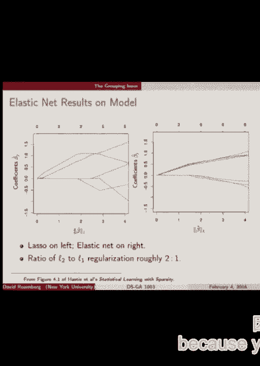

# P4：4.Feb_4_Lab - Tesra-AI不错哟 - BV1aJ411y7p7

好的，我开始了。

很棒。那么今天我们继续讨论Lasso，首先我们要讨论一些方法，实际上优化Lasso，就像我们有梯度下降、随机梯度下降直接应用到目标函数做岭回归一样。现在我们要看看如何处理Lasso。好吧，大家能听到我说话吗？好，后面的同学能听到吗？

好的，太棒了。那么回想一下，这是前两个的目标函数。我们有平均平方损失加上L1正则化项，它是线性模型系数的平方和。我们可以从这里开始讨论，好吧，梯度下降怎么样？我们马上就遇到问题了，因为这个L1范数不可微分。

如果你把它分开，它里面就有绝对值。**它在折点和绝对值处不可微分**。那么我们该怎么做呢？

所以在这种情况下，我们有一个常用的技巧。一开始它是一个技巧，最终你会习惯它，它会变成你常用的工具。这个技巧叫做把数字分解成正负部分。让我给你展示一些符号。考虑任意一个数A，只是一个实数。

我们定义A的正部分。我们写作A加和一个上标。所以基本上，A如果是正的，就是A，如果是负的，就是零。所以10的正部分是10。负10的正部分是零。它有一个正部分。同样地，对于负部分也是如此。

A减去负的负10是10。负10的负部分是零。所以负数的负部分是该数的绝对值。而正数的负部分是零。所以这样会很方便。我们得到的一件事是，你可以写出A。你怎么用A加和A减来表示A呢？

一个通用的A。它可以是正的，也可以是负的。对，好吧。所以你可以把A分解成A加减A减。因为如果A是正的，A减就是零，A加就是正确的。如果是负的，你就得到零减去A减，这就是A的正确值。很好。接下来会在下一页展示出来。类似地。

我们怎么处理A的绝对值？这可能更简单。我们怎么用A加和A减来表示A的绝对值呢？对，A加加上A减。因为A加和A减已经不是负数。所以我们只需要把它们加在一起，就得到了绝对值。好，太棒了。

所以我们可以以某种方式将这个技巧应用到lasso上。这里又是最后一个问题。那么如果我们把W的每个组成部分写成A加、W加和W减的形式呢？

所以我们说W i等于W i加减W i减。我们基本上将W的向量分成两个新向量。W的正部分和负部分。然后我们说W等于这两者之间的差。好的。这个有意思。

我们来试试吧。我们来尝试将那个分解代入这个目标函数。那这里怎么样？我们有W的L1范数。所以这很容易写出来。W的L1范数就像是绝对值的和。所以你将会有W加和W减的和。让我们看看效果如何。

我少了一个转置。无论如何。所以W部分变成了W加减W减。然后是绝对值部分。你能看到我做错了什么吗？

这是一个向量还是一个数字？还是标量？这仍然是一个向量。那么我该怎么做呢？

再说一遍？那样会得到平方和。是的。我们基本上需要对它的条目求和。所以先对其进行转置，因为这是一个常见的操作。所以现在的好处是，我们已经将其写成了没有绝对值的形式。好的。现在这个函数是可微的。我们去掉了那个复杂的绝对值。

绝对值的折点。但是我们必须对W加和W减施加非负约束。所以我们得到了一个平滑且可微的目标函数。但现在我们对W加和W减施加了约束。我们现在不再只有一个D维的向量，而是有两个向量。

所以我们一共有2D个变量。好的。这就是权衡。我们有2D个约束和2D个变量。但它是可微的。而之前它是不可微的，我们没有约束，变量数量只有一半。好的。但我们知道怎么解决这个问题。比如，我们可以在下一张幻灯片上看到。

所以有一种叫做投影随机梯度下降的方法。在投影随机梯度下降中，它和随机梯度下降类似。你先找到你的点，计算这个点关于目标函数的梯度。然后沿着相反的方向走，一定的步长。那就是随机梯度下降的部分。

那投影部分会是什么样子的呢？

我刚才采取的步骤可能有什么问题？我可能违反了约束条件。我可能走出了满足约束的集合。在这个特定的问题中，这意味着我可能沿着某个方向走，使得W加或W减变为负值。这违反了约束。所以投影部分意味着我们将最终的点重新投影回满足约束的区域。

在这个设置中非常简单。我们怎么做那个投影？是吗？

我将拨打另一个部分。好的。这有点棘手。其实有一种更简单的方法可以确保我们回到正轨。是吗？

我得到的两个项？是的，我们可以简单地。如果我们迈出一步，W 加上突然变成负五分之一，我们只需把它恢复到零。所以我们超调了，然后说，好吧，退回去。这就是投影。因此，对于最后一种随机投影随机梯度下降，它和随机梯度下降一样简单。

当穿越零时加上截断。好吧，非常好。好吧，这是其中一种方法，易于理解，易于解释。让我们尝试另一种方法。坐标下降。因此，坐标下降是一种非常通用的方法。它适用于许多不同的目标函数。所以我将稍微概述一下它，并看看它如何应用于 Lasso。

假设我们现在有这个函数，一般来说，不仅仅是 Lasso。它是一个 D 维向量 W1 到 WD 的函数。回想一下，当你进行梯度步进或随机梯度步进时，我们可能会更新参数向量中的每一个条目。所以我们沿着梯度方向走，如果该梯度在其所有维度中都有非负条目。

当我们迈出一步时，我们将改变 W 的每一个条目，对吧？好吧。那么坐标下降做了不同的事情。在坐标下降中，每一步，我们只更新一个条目，即我们正在优化的这些 W 中的一个。那么这看起来怎么样呢？我们首先从尝试优化 W1 开始。

这意味着我们看——这是 W1 方向，坐标方向。我们说，好吧，我需要在这条线上最小化这个函数。在这条线上的某个地方，我想找到最小值，同时固定其他所有东西。所以我找到 W1 方向的最小值，这就是坐标下降的第一步。

现在我转到下一个方向，即 W2，也就是这个方向。然后我最小化我们最长的线。所以也许我一直走到这里。好吧？然后我们进行另一个坐标。所以这可能是 W3 方向。可能是这个方向。好吧。所以我们遍历坐标方向，每次都将其他已看到的东西冻结。

仅对其中一个方向进行优化。好吧。那么在数学中，我们写作——所以第 i 个坐标，我们走到的新的第 i 个坐标，是目标函数在该 i 个坐标上的最小值，其中除了 W_i 之外的所有变量都保持不变，我们对 W_i 进行优化。

这是坐标下降的数学，明白吗？[听不清]，好的。问题。当它实际上何时有效？很好的问题。我们稍后再回来。好吧。所以在这里，虽然如此，但我有点忽略了一些细节。当我说沿这个方向最小化时，我们是怎么做的呢？好的，也许这是另一轮迭代。

也许我们也必须采取一些步骤来实现这一点。这就——把它看作是这个优化方法的一个子程序。结果证明这是一个好方法。这种坐标下降法很好。尤其是在每次只需要找到一个坐标的最小值时，当这个子问题很容易解决时，坐标下降法就很有用。如果这个问题简单，坐标下降法是个好主意。对于lasso问题来说，事实证明它非常简单。

这就是我提到它的原因。好了。所以，嗯，我在这里写了。坐标下降法非常有效，尤其是当相对于某个坐标逐一最小化变得容易或更容易时，而不是做完全梯度下降或加速梯度法之类的。所以你问的是如何计算这个`arg min`？

有很多不同的方式可以做到这一点。所以——但是我——不行。你具体的问题是，我们是只是沿着那条线朝着最小值方向迈出一小步，还是要走到最小值？我想这就是你的问题。不是。等等，让我来回答这个问题。这本来是个好问题。

经典的坐标下降法是做完全的最小化。所以你选择一个方向，然后进行完整的搜索。也许你需要来回走动，找到那个方向上的最小值。然后就完成了。这就是该坐标方向上的最小值。然后你继续进行最小化——这就是经典版本。

还有一种版本，你只是在某个坐标方向上迈出一步。所以我可能在这个方向上做一步梯度下降。不是梯度下降，是在这个方向上迈出一步——那么在一维中梯度下降会是什么样子呢？

我该往哪个方向移动？在一个方向上，梯度下降的选项是什么？对。要么朝那边走，要么朝这边走。其他的方向是给我们提供的。所以——是的。这与梯度下降法一致吗？我不知道“安静”是什么意思。如果只有一个全局最小值，它们都能找到，那它们会找到相同的最小值。好的。

好的。好的。好了。有很多问题。是吗？[听不清]。这是不是一种批量梯度下降的版本？[听不清]。我所展示的方法中没有任何随机性。所以这是通用的。这适用于任何你优化的目标函数。如果我们将它应用于LASSO。

它将是完整的目标经验风险加上正则化。对吗？[听不清]，对。我是说，但我们不会只走一条路径。我们会进行循环。好了。那么，为什么我们提到LASSO的坐标下降法？

令人惊讶的是，对于LASSO目标函数，坐标方向上的最小化器有一个闭式解，即你可以直接求解的明确表达式。从数学角度来看，找到那个最小值并不需要迭代方法。沿着某个坐标方向的最小值非常简单，实在是令人惊讶。我会展示这个表达式的样子。

然后作为一个可选的家庭作业问题，你可以推导出这个结果。我们可以——我们会带你一步步分析。所以这是整个表达式。这是——请注意，这是单个坐标 WJ 对应的套索目标函数的最小值。好吧。它有这个有趣的形式。我将简要指出——嗯，我将简要讲解一下这个 CJ。

然后你可以自己进一步研究它。所以 CJ，如果你看这里，有 W 减去 J 的转置乘以 xi 减去 J。这是什么？这就是说，我们取我们的参数向量 W，省略第 j 个条目。我们取 x 坐标并省略第 j 个条目。然后计算它们的内积。

这就像使用所有特征进行预测，除了第 j 个特征。所以这个小项是，省略第 j 个特征时的预测是什么？我们正在对第 i 个数据点进行预测。我们在对第 i 个数据点进行预测时，查看未使用第 j 个特征时的残差。好吧。

然后我们看一下残差，我们——看，我们在计算它与我们在预测时遗漏的第 j 个特征的内积。所以这大致上是说，预测时未使用第 j 个特征，残差与第 j 个特征的相关性如何。大概是这样的。好。

但这是我看到这个时的想法。好吧。无论如何，所以如果这个 cj，我将大致认为它是第 j 个特征与残差的相关性，不使用它时，如果它很小，那么它在修正残差时就没有什么帮助。那么这个系数就会被映射到零。否则它会被映射到其他值。

这就是我要说的全部内容。但你将有机会更仔细地看它。所以要点是，套索回归似乎对四分之一下降法非常有前景，因为我们在每个四分之一方向上进行的最小化有明确的形式。我们可以直接编写代码实现。所以它具有非常快速的潜力。

好的。那么问题——一个问题是，这个方法到底有效吗？这是一个很好的问题。所以这里是第一个简单的充分条件。结果发现对于套索回归来说，这还不够。所以如果你在从 R^d 到 R 的函数 f 上进行最小化，确保这个方法有效的充分条件是 f 是连续的。

它是可微的，并且在每个坐标上是严格凸的。所以如果你固定其他坐标，只看——仅仅作为 wj 的函数来看，它一定是严格凸的。我们会讨论——我们稍后或下周会复习什么是凸性。

那么，套索目标函数在这里出了什么问题，未能满足这些标准呢？

我已经提到过了。它很明显，是可微性。是的，它是不可微的。所以第一个标准被违反了。所以在它成立的子情况中，这个方法很好用，但对于套索回归不适用。所以有一个更复杂的定理适用。这是一个有趣的定理。

所以结果是，如果我们要最小化的目标函数f可以分解成某种方式，或者说它有好的形式，基本上就是它分解成两部分，其中一部分是可微且凸的函数。所以g就是那部分，既可微又凸。所以一个例子就是经验风险， right？它是一个和。

使用平方损失。平方损失的和是可微的并且是凸的。然后这一部分，作用于每个坐标一次的hj的和，好吗？

这些hj每个只需要是凸的。它不需要是，凸的。它不需要是可微的。那么这怎么适用于我们的套索回归呢？是吗？

[ 听不清楚的备注 ]， 是的。这个东西正是l1惩罚项的形式。l1惩罚项是各个坐标的绝对值之和，好吗？

所以hj是绝对值函数，适用于套索回归的情况。是的。它只作用于一个坐标。所以这几乎是为套索回归场景量身定做的。所以这就为使用套索坐标下降法提供了合理性。好的。对此有任何问题吗？

为什么这能证明使用套索回归是合理的？简单来说，如果你回忆一下套索回归，我们有这一部分，它是可微的，并且是凸的。还有这一部分，如果你写出来，它是各个wi的绝对值的和。它的形式是这样的，其中hj是绝对值函数。好的。好吧。只是一个附带说明。是吗？你能重复一遍吗？你能重复一遍吗？

[ 听不清楚的备注 ]， 所以是脊回归。我不知道。这是个好问题。如果有优势，我不确定。可能值得尝试。那会很有意思。我觉得这可能取决于具体情况。例如，你的空间维度是多少？

所以如果你的空间是非常高维的，你必须做很多——你必须遍历很多坐标才能完成一次遍历。我不知道。是的。这个问题很好。好的。那么当我们没有这个漂亮的东西，且没有明确的闭式解时，坐标下降法怎么办？

坐标方向上的最小化器？那我们该怎么做呢？所以我们真的需要在坐标方向上走到最小值才能停下来吗？我们能不能在那个方向上稍微走一点，然后再去下一个坐标呢？

所以结果是，对于套索回归，答案是肯定的，并且有一些论文证明了这一点。很有意思。我们可以结合我们所讨论的这两个问题。所以我们记得，这是我们套索目标函数的可微版本。由于它是可微的，我们可以继续在其上执行梯度下降或随机梯度下降。

这个约束。或者我们可以尝试对其进行坐标下降，但我们可以使用一种修改版的方法，在这种方法中，我们选择一个坐标，只针对一个坐标计算梯度，沿该方向执行一步，然后再转到下一个坐标。我只是想提一下这个，不想深入讨论。

不需要太多细节，因为我们还有其他内容要覆盖，但我只是想把这个内容放在一旁。你可以稍后查看，如果有问题可以问。好了，这就是我想要讲的关于Lasso优化的内容。接下来你将在第二次作业中做一些实现。

所以你将有机会深入了解这一点。好了，好的。现在，正如我们所承诺的，我们将更深入地理解Lasso和Ridge，以及它们如何比较，理解它们的性质。让我们从一个非常简单的模型开始。又是一个类似于思想实验的例子。假设我们有一个单一特征x1，好吧。然后我们有一个。

响应变量和输出变量y，都是实数。假设我们得到一些数据，你知道，xy对，只是两列。非常简单。然后我们运行最小二乘回归，发现经验风险最小化器是——因为我们限制了线性函数——就是f hat x等于四倍的x1。

这是我们根据x预测y的经验最佳线性预测器。好了，非常简单。好了，这很好。现在这是我提出的问题。如果我们引入一个新的特征，一个第二列x2，但x2总是等于x1。好了，我声明我们没有新的信息。x2就是x1。

所以我们之前的经验风险最小化器，依然是最好的。我们依然无法在预测中击败四倍的x1，因为x2对我们没有任何帮助。没错，当然。但不同之处在于，现在我们有了更多的选择。现在我们有两个项。你知道，2x1加2x2。

给出相同的预测，对吧？因为2x1和x2是相等的，所以它们加起来就是4x1，结果是一样的。所以有很多方法可以得出——得出一个经验风险最小化器，预测结果完全相同。好了，这对于直接的经验风险最小化来说是成立的。但如果我们引入L1呢？

正则化或L2正则化？这又是怎么发挥作用的呢？好了，首先，任何——这很明显——W1和W2，x1和x2的系数和为4的地方，都是相同的函数，完全相同的函数，当x1和x2相等时。好了，接下来我们来看一下可以为W1和W2使用的不同系数值。

让我们看看这些系数对应的L1范数和L2范数，以便更好地理解发生了什么。所以这些数值的和为4。再看一下L1范数，这只是一些绝对值的和。所以你只需加上4加2或2加2就等于4。我的就是1加——好了，这里有一个有趣的例子。

所以L1范数是绝对值之和。所以这是1加5等于6。所以请注意，当这些解的符号相同且开始以不同符号增长时，L1范数在所有这些解中是相同的。好的。所以这是——这是L1范数的特性，适用于那些系数和相同的解。

好的。那么用文字来表达，我画的——从这得出的结论是，如果我们在最小二乘回归中使用L1惩罚——并且我们有两个完全相同的特征——L1时，我们不在乎选择哪个，只要它们的大小相同。它会惩罚。它们不同的情况。当符号相同的时候，它会惩罚它们不同符号的情况。好的。那就是L1。

现在我们来看看L2。所以L2，你会发现当它们相等时，最小化，例如，2和2。所以这是——这个为什么是这样的，有没有显而易见的原因？

所以你实际上可以再次用数学证明这一点。如果你有一堆数，它们的和是一个固定的总数，而你想要最小化它们的平方和，也就是L2范数，那么当它们都相等时就会发生这种情况。你可以通过Leung-Rin乘子来证明这一点。如果你们想看的话，我们也可以用图像来展示。好的。那么我们来有两个系数。我们称它们为W1和W2。

我们想要找出所有W1和W2的集合，使得W1加上W2等于4。这些就是所有的ERM。所以ERM的集合等于所有W1和W2的集合，满足它们的和为4。这个集合在这个平面上是什么样子的？是的，我看到有人做了这个。这是正确的。所以这是这个集合。好的。那么L2范数的水平集是什么样子的？它是一个圆。

对吗？我们讨论了S2。好的。那么这里的关键点是经验风险最小化器。正如我们所说——这是最小损失。这就是ERM。记住——就像我们上次讨论L1正则化和L2正则化时所说的那样，我们说过，ERM在这里，但它不满足这个L2约束。

我们需要逐步允许自己有更差的损失。这意味着要远离这个经验风险。但它将与这条线平行。所以最终它会正好落在那个45度点上，也就是W1和W2相等的地方。好的。有人理解了吗？有问题吗？是的。[听不清的发言]，好的。

那么问题来了。L2在W1和W2之间进行均等分配。第一个条目将所有权重集中在W1上。问题是，我们更倾向于哪个？

你是因为稀疏性之类的原因建议第一个的吗？

然后——所以昨天我给了一个关于为什么有人可能更倾向于稀疏性的幻灯片。如果这些理由都不适用我呢？我不喜欢稀疏性。我对稀疏性不感兴趣。宝贝。但实际上，我们可能更倾向于第二种方法的一个严肃理由。稍后我们会讨论这个问题。好的。

所以这里总结的要点是，当你添加L2惩罚并且有很多特征完全相等时，L2惩罚会导致权重在这些相等的特征之间平均分配。现在，单一的惩罚并不关心它们如何分配，只要它们的和相同且符号相同就可以。明白了吗？好。实际中，特征通常不完全相等，但它们是相关的。

它们可能高度相关。这是可能发生的。关键是，这些完全相等时肯定成立的规律，在特征高度相关且不完全相等时大体也成立。好的。那么在实际情况下，假设你有五个特征，它们之间有很强的相关性。

并不完全相同。当你做L1正则化时，它可能会倾向于选择其中一个或几个变量。它可能会将某些变量的权重设为零。它可能会看似随机地将不同的权重分配给每个特征，只要它们的和相同。而对于一组非常相关的特征（例如五个特征），L2正则化则会非常明确地将权重均匀地分配给这五个特征。

这是一个很重要的点。我认为这是关于L1和L2正则化需要记住的一个非常重要的特性。这就是这一特性。好的。接下来我要展示一些实验数据，这些模拟数据展示了这一点在实际中的应用。所以我会为你设置这个模型。这里，真实模型是Y是Z1和Z2的线性组合。

但是我们并不直接观察Z1和Z2。相反，我们得到了Z1的三次噪声观察和Z2的三次噪声观察。好的。所以，Z1的噪声观察值是高度相关的，并且接近某个值。Z2的噪声观察值也是相关的，并且接近另一个值Z2。明白了吗？

我们将观察到的不是Z，而是Z的噪声观察值。我们需要回到预测Y。这个设置清楚了吗？好。我们来看一下数学表达。假设Z1和Z2是从独立的高斯分布中抽取的。然后一旦我们...

然后我们有六个噪声变量，六个独立的高斯噪声变量可以使用。然后我们说Y是这些Z的线性组合加上一些噪声。我们不能直接观察到Z，但如果我们能观察到，它就是Y的确切表达式。

然后这些X要么是每个X，我们说X从1到6。每个X要么是Z1加上一些噪声，或者是Z2加上一些噪声。理解了吗？好。那我们做了什么呢？我们从这个分布中生成了100个X和Y的样本。我们也生成了Z，但我们并不直接观察它们。然后给你一个概念。

这两个组中的X之间的相关性相当高，0.97。这是一个典型的相关性。好的。那么我们要看的是，在我们使用不同程度的正则化拟合这些数据时的正则化路径。

好的，看看我们有什么。我们从最右边开始，这是我们没有任何正则化的地方。所以我们有，应该有。我们仍然有一些常规的。那很有意思。好的，我们有六个变量。好了，它们在经过大量回归后，且没有正则化时的值，我说，没有。

这大致是这样。所以我从书中看到这个，我觉得可能实际上有个错误。我发了邮件给作者，我认为它差不多，但现在我开始质疑了。不过基本上，这是大致正确的。所以这两个组分别是黄色和蓝色。它们是完全相关的。所以你可能会这样做。

你可能希望它们具有相等的权重，或者，在这种情况下，LASO根本没有做到这一点。所以，它显示了LASO对于在相关变量组中分配权重的漠不关心。好了，我声称这是一个不好的结果。我声称，在许多情况下，我们更倾向于在相关的事物之间平均分配权重。所以，特别是。

我认为这里发生的情况是，第三个变量并不完全是。我们没有看到两个蓝色变量，对吧？所以第三个变量完全为零。好的。我之所以怀疑这是不正确的，是因为没有正则化的情况下，任何一个变量的权重实际上都不太可能是完全零的。

这就是我认为这里有点问题的原因。所以我不太确定发生了什么，但它足够接近，可以阐明问题。好了，谁能给点意见，为什么我担心这个变量，比如说，权重为零，尽管它在信息表示上与另外两个没有区别。

它们都有与原始变量相同量的噪声。为什么我们要忽略其中一个而保持另外两个的权重呢？为什么这可能是个问题？

是的，有人吗？作为初学者，避免过拟合实际上就是你在这里尝试做的事，把所有的权重都放在一个变量上，而不是更均匀地分配它。这可能会导致很多方差和噪声，而这正是我们要避免的。

所以，把所有的权重都放在一个变量上，这可能会导致你说方差和噪声，甚至过拟合。所以也许我认为这就是正确的方向。是的。[听不清]，是的。我们对Z的最佳估计应该是平均每组中的所有元素。没错。这就是我在说我喜欢均匀分配权重时的主要观点。

那么我们来考虑一下这个问题。我们真正想知道的是Z，也就是每个这些黄色变量的无噪声版本。这将是Z1，而这些蓝色的变量则是Z2。当你有三个都是同一事物噪声观测值时，去除噪声的最佳方式是对它们进行平均。[听不清]，如果有三个人独立测量同一事物，你更愿意只取其中一个，还是更愿意取三个并进行平均？

当然，你希望对它们进行平均。这是一种估计，且方差更低。因此，在回归设置中，将权重均匀分配到所有本质上具有相同信息的变量上，可以提高鲁棒性。

比如说，假设你认为它们都有相同的信息。那么我们就可以保持稀疏性，只把所有权重放在X1上。那会发生什么呢？如果某一天X1因为某些原因有很多噪声，而你的预测就会完全偏离。相反，如果你对X1、X2和X3三个变量赋予相等的权重。

这将通常会做出相同的预测，平均来看，如果X1出现错误，特别大的噪声，它就会和其他两个观测值一起被平均掉，噪声也会被平滑掉。对吧？[听不清]，嗯，基本上问题是，这样做是否会让找到重要特征变得困难？

这取决于你对“重要特征”的定义，因为从根本上说，这个方法的作用是这样的。我所提议的，理想情况下是，假如有一组特征都展示了相同的信息，那么这组特征就是重要的。没有哪个比其他更重要。所以我希望选择整个组，或者排除整个组。

如果你有其他原因需要稀疏性，比如，你想减少内存消耗，或者减少时间开销，或者你不想携带所有这些特征，那么这是另一种动机。那时，你可能只想保留一批特征。

但是，如果你的目标是做出最好的预测，保持对噪声的鲁棒性，并通过对多个噪声版本的平均来获得优势。那么你应该保留同一组中的所有变量。对吧？[听不清]，法院集没有被使用吗？

我看不出这之间的联系。也许我们可以私下再聊聊。好的。是吗？[听不清]，好的。那么问题是，我认为你在说的是，是否有可能其中一个变量比其他变量的噪声小？

是的。当你将其与噪声更多的特征结合时，你实际上是在为此付出代价。是的，我听懂了你的意思。是的，在某种程度上，这确实是一个问题。在这个纯粹的设置中，所有变量的噪声量是相同的，因此这不是问题。但在实际中，确实会有这样的情况。

有可能某些预测变量比其他变量更嘈杂，即使它们的均值差不多。例如，在这种情况下，这是一个权衡。而且这没关系。我们正在寻找具有不同特性的不同方法。然后在实践中，你可以尝试它们，并通过验证误差、验证数据来测试它们。

然后你可以选择哪种方法表现得最好。对。好问题。好的。那么问题是，我们如何让权重分布得更均匀呢？这里，这是最后的结果。所以它没有均匀分布权重。我们能做什么来让它分布得更均匀呢？

对此有什么想法吗？嗯。好的。那么如果我们在 L1 正则化的基础上再加入 L2 正则化会怎样呢？

所以 L1 完全不关心我们如何划分权重，对吧？但 L2 是关心的。所以如果你在 L1 正则化上再加一点 L2 正则化的话，如果在特征完全相等的情况下，这就会打破平衡。它只会在这种设置中加入一点 L2 正则化，立刻使用 2/2。

它会选择权重分布均匀的方法。所以这就是弹性网的理念，结合了 L1 和 L2 惩罚。这里的想法是，你希望变量的组能一起进入，并且权重大致相等。接着，可能是下一个组，它是第二个最有用的，将会进入并变成非零值，并且基本上同时以大致相等的权重进入。

那么让我们看看在相同数据集上使用一些 LASSO 会发生什么。这里有一个定理我会再回来讨论。所以右边是弹性网曲线，左边是纯 LASSO。右边是 LASSO 加上少量的 L2 正则化。你会看到，确实如此，像这些不同组中的三个系数值之间是紧密排列的。

所以它确实设法保持了相关变量之间的权重相似。这也正是我们追求的目标。所以意思是，这种弹性网方法会给你更加稳健的预测函数，因为在某个特定的组中，至少你在使用 L1 正则化。

