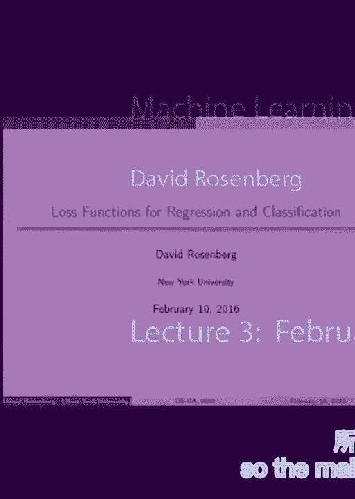
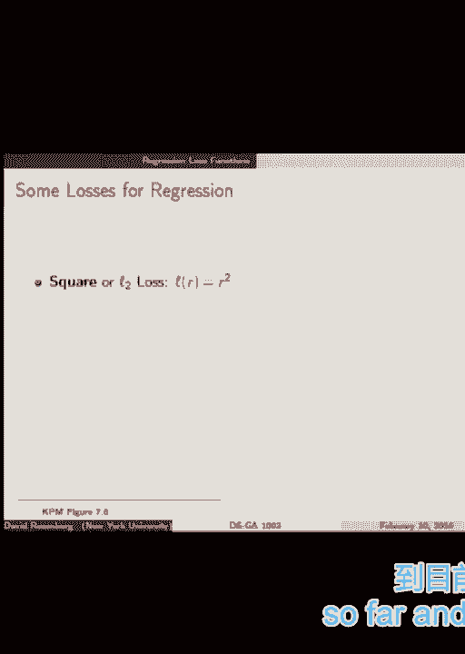

# P5：5.Feb_10_Lec__YouTube - Tesra-AI不错哟 - BV1aJ411y7p7

 So the main topic for today is support vector machines。

 But along the way， we're going to talk about some other things we're going to talk about。 loss functions。 Today， for the first time， we'll discuss loss functions that are not square loss。 right？ Things besides regression。 And we'll do kind of a almost self-contained unit on， well。 very introductory unit on， convex optimization and Lagrangian duality。

 which are very useful tools in their own right。 They'll kind of make accessible a lot of more advanced literature and methods in machine。 learning。 And for our purpose， they'll help us gain a lot of insight into the support vector machine。 itself and what its properties are。 So it'll be kind of a little mini lecture in the middle on optimization。 and then we'll， go to support vector machines at the end。

 And we're going to start with the discussion of loss functions。 All right。 so let's start with regression。 So far， we've only really spoken about regression concretely。 And a regression of loss function， yes， it takes a prediction y hat and the actual value， y。 These are real numbers， as we've dealt with so far。

 And most of these regression loss functions can be written in terms of the residual。 So the residual is defined as the difference between the true value of y and your prediction。 of y hat。 So yes， generically， the loss depends on y hat and y。 but we can write it as just a function， of the residual。 The residual would be the difference。

 So just to get you guys thinking， when might you not want to have a loss， a regression loss。 dependent on the residual？ Or might that not be capturing the type of thing you want to capture？

 All right， to keep things moving along， suppose that error is kind of an initial percentage， error。 So if you predict 100， but the actual value is 50， in some sense you're off by a factor， of 2。 And if you predict 10， but the actual value is 5， you're getting off by a factor of 2。 And in some scenarios， it's the factor that you're off by， kind of the ratio that's more。

 important than the absolute value。 So these are things that keep in mind。 So often in those situations you can transform your y variable， like maybe with a log transform。 or something， to try to reduce it back to a form where the loss， again， depends just。 on the difference。 But I just wanted you guys to think about that a bit。 But generally speaking。

 the regression loss is dependent on the residual。 The square loss is the one we've dealt with so far。

 And it's certainly what people usually use。 But there's some issues with square loss。 And it has to do with how robust it is to outliers。 So an alternative loss-- and we'll kind of think about both of these-- is called the。 absolute loss or the Laplace loss or the L1 loss。 So yes。

 the same L1 as we saw for in Lasso as a regularizer。 But here we're using it as a loss。 So here's a little table。 For instance， on the far left we have a column of y hat。 These are our predictions。 So in these examples I'm saying we're always going to predict a 0。 And the second column is y。 And that's the true value of y。

 And then third column is what's the loss that we incur under absolute loss。 And the fourth last column is the square loss。 And what I want to note is that as the gap between y hat and y grows little by little。 the absolute loss grows-- well， it's exactly the same for difference， right？

 But the square loss grows much more dramatically， like the square。 And so what's the point？

 The point is that if a single point that differs dramatically from our prediction can--。 so suppose the true value is 50 when we predict 0。 Whereas most of our other errors are around the range of 5。 So most of our errors are around 5。 But one particular point we're incurring kind of an absolute error of 50。 It's 10 times bigger。

 But if we have square loss， we get penalized 100 times as much， 25 to 100。 So square loss gives kind of a lot of attention to severe errors and kind of magnifies them。 And when you have your empirical risk， the average loss， it's going to be weighted very。 heavily to try to fix those extreme errors。 So you may say。

 that's good because you don't want extreme errors。 But on the other hand， once in a while。 you have an outline of your data， you have an error， in your data。 And this can-- the square loss can really affect your final prediction。 So let's look at some example。 So here we have data points on these black circles。 All right。

 And we have two fits。 So there's， I don't know， 10 or 15 of these data points。 And we're doing linear regression。 The red line is the square loss using square loss。 This is the regression you guys are running at homework that we've been talking about。 And the blue line is using kind of an L1 loss。 And you'll see that the red line， the square loss。

 is pulled down quite a bit by these three， outlier points down below。 Whereas the L1 loss is not affected nearly as much。 The L1 loss。 it's almost going through the middle of these top points。 But let's pull down a little bit by the outliers， but nowhere near as much as the square loss。

 So this is-- if you're in a situation where you have a lot of noise in your data or you。 worry about outliers， you might want to use something a little bit more robust than L2。 So robustness is the term we use to describe how effected a decision-- the algorithm is。 the learning algorithm is by outlier points， extreme outliers。 There are more formal definitions。

 That's good enough for our purposes。 All right。 So we have the L2 loss。 It's not robust in the way we just described。 The L1 loss is robust， but it's not differentiable。 That's a little bit annoying， as we've seen before。 Side bar。 the L1 loss is something called median regression。

 Then there's a nice compromise between a 1L2 called the Huber loss。 And I just want to mention it。 Excuse me， near zero loss， we have a quadratic loss。 It's kind of a blend between quadratic and linear。 And as your residual gets large。 the penalty is linear。 So we're not penalizing big errors with a quadratic loss。

 Whereas close to zero with small residual， we do have a quadratic penalty。 And all in all。 it's smooth because it's a nice blend。 So it's differentiable。 So Huber loss seems like a win-win。 It's not used very often， I think， unless you're， in this scenario where you're very attentive to issues。 of robustness。 That's pretty much all that I have， to say about regression losses。

 I don't know very many others that are used in practice。 There's something called the Epsilon。 Sensitive Loss for Regression Loss。 But I don't think in most situations。 people need to go beyond these handful of losses for regression。 So let's move on to classification。 This is kind of the original thing， that one would think of as a learning problem。

 Does this picture have an animal in it or not？ Yes or no？ Classification。 So let's set it up in our usual way。 Our action space-- initially， we'll。 set our action space as negative 1 at 1 for the two classes。 The output space is， again。 negative 1 at 1。 And the most natural loss is the 0-1 loss。

 Did we get the prediction correct or not？ Is our prediction f of x equal to y or not？ If it's not。 we get a loss of 1， and otherwise a loss of 0。 All right。 So a concept here that's nice。 Let's loosen it up a bit。 Let's allow ourselves to predict a real number instead。 of just negative 1 at 1。 Why-- you know， this is a combination of things。

 like logistic regression or vector machines。 In general， we can use this a real number。 to encode a class simply by looking， if it's positive or negative。 So if we're predicting a number that's bigger than 0， that's equal to predicting 1 less than 0。 negative 1。 So that's a little relaxation we're going to give ourselves。 Now。

 so now our action space is reals， and we can introduce some situation。 So in the classification situation， where we predict real values-- so f of x。 is the value we're predicting。 f of x， the value is called a score。 So f of x would also be known as a score function， in addition to being a decision function。

 And the idea is that the larger the score--， I mean， intuitively， we want a big score。 to indicate more confidence in our prediction， and a score close to 0 as being less confident。 Kind of be intuitive understanding of the score。 All right， so the score gives us the prediction。 and some confidence， hopefully。 And then there's something else， which， is very important today。

 called the margin。 And the margin is-- well， formally， it's， the class y times f of x。 Y， remember。 now is plus 1 or minus 1。 And f of x is our score。 And the product is the margin。 So what happens here？ So suppose the true class is 1， and we predict 10。 Margin is 10。 And if we predict 100 in the class， is 1， the margin is 100。 Now， what if we predict incorrectly？

 Both of those were correct predictions， because our prediction was the same sign as the true class。 So if we predict negative 10， but the true class is 1， our margin is negative 10。 We predicted negative 100， and it's really 1。 Our margin is negative 100。 So you can see that margin， on the one hand， margin gives us whether we are right or wrong。

 Because if we're wrong， the margin is negative。 If we're right， the margin is positive。 It also tells us how badly or how well we predicted。 So really， big negative number。 like negative 10， is-- well， negative 100 is a much worse error， than negative 10， potentially。 because it's， even more confidently wrong。 100 is a better prediction than 10。

 and that it's more confidently right。 So we want to have big positive margin。 That's what we're going for。 Is that clear？ Yeah？ [INAUDIBLE]。 When we make a prediction between 0 and 1， yeah， so that's when we make a prediction between 0。 or negative 1 and 1， it's not a very confident prediction。 It's a small margin。

 and it could either-- the prediction， itself can either be right or wrong， depending on， yeah。 if it's wrong， the right side of 0 or not。 OK。 All right， so we want to think in terms。 of maximizing the margin。 Margin's good， I think margin。 And just like regression losses， mostly。 can be written in terms of the residual， turns out most classification losses we use。

 can be written in terms of this margin， which， comes out to be pretty convenient。 So let's look at some。 So first， we have this 0， 1 loss， which I think I mentioned。 before is a very scenario is proven， to be like computationally intractable NP-hard。 So we don't know how to solve--， we don't know how to minimize the empirical risk， with the 0。

 1 loss over even simple hypothesis spaces。 So-- and why， well， one reason， it's not convex。 Not differentiable。 It's difficult to work with。 It's pretty much a combinatorial optimization problem。 All right。 Nevertheless， we can look at the classification loss， in terms of the margin。 So we're looking at it once these plots today， so I'll take some time to explain it here。

 On the x-axis is the margin。 And remember， positive margin is good。 That means we correctly classify it。 Negative margin is bad， incorrectly， class， but。 So the 0。 1 loss gives 0 penalty whenever， we have positive margin。 And a penalty 1 will make a negative margin。 Yeah。 All right。 So that's our 0。

 1 loss in terms of the margin。 So now we're going to introduce our first loss。 that for classification that we might actually use， which is called the hinge loss or the SVM loss。 And this will be the focus of today's work later on。 So the hinge loss is--。 let's look at the picture first。 To the right of 1， when margin is 1 or larger。

 so it's good to correctly classify， and it's with some confidence， it's over 1。 we don't penalize it all。 Makes sense。 We got it correct。 So no penalty。 But as the margin decreases from 1， we get penalty and the penalty increases linearly。 as the margin gets worse and worse， as the margin gets more and more negative。

 So what is good to see here is that this hinge loss， is convex， it's convex function， which。 is going to help us with optimization。 And there's one little issue， which is not differentiable 1。 which is a bit of a nuisance， but we'll， have ways around that。 All right。 So that's the hinge loss。 Let's look at a few more losses。 OK。 So another loss you might have heard of is。

 logistic loss from logistic regression。 So if we write that in terms of margin， it looks like this。 And the takeaways here are that this is also convex。 It never stops penalizing you for margin。 So no matter how confidently and correctly you pricked it。 it's still a little bit non-zero in a loss， whereas the hinge loss hits zero and stays at zero。

 as the margin gets very large。 All right。 And it's also differentiable everywhere。 which is convenient for optimization。 So what about the square loss for classification？

 Have you guys heard about people trying， to use the square loss for classification？

 Sometimes people hear that and they're like， oh， it's terrible。 It's like the worst thing ever。 So let's dig in a little bit and see how bad it really is。 So what does it mean to use the square loss， for classification？

 So we're still predicting real values， still predicting scores。 And the output space is negative 1 and 1 as before。 But the loss is literally the square loss。 So y will always be negative 1 or 1。 And f of x will be a real value score。 And we look at the square difference。 So it turns out that this loss， which。

 is the standard regression loss， you can re-write it， as a margin loss。 You can work this out。 It's not too difficult。 So it turns out it's 1 minus-- it's the square of 1 minus， the margin。 Let's look at what that looks like。 So square loss， drawn as a function of the margin。 So that's interesting。 As we go far to the right， that means， we're doing really well。

 correcting correctly， confidently。 Square loss is penalizing us。 The square loss penalizes us even when we're doing very well。 It also penalizes us pretty aggressively when we're doing badly。 So I'm a little bit more concerned。 with what's happening to the left， the penalizing in our mistakes extremely aggressively。

 Because this is similarly to square loss for regression。 This leads to a lack of robustness。 If there's an error in a class label in your training， data， for instance--。 and it's really a really obvious case。 And the classifier correctly predicts。 a positive class with great confidence， but the example is mislabeled。

 So it's getting it wrong with large margin。 So that example occurs a huge penalty under square loss。 And that's going to affect the minimization。 It's going to have a large effect， not in a good way。 on the decision function we end up with。 So there may indeed be issues with the square loss。 for classification in the case of label noise， or these sorts of things。

 There's a paper reference here which discusses it in more detail。 And they find that in general you require more samples。 when you use square loss for a classification。 Then you do， for instance， with logistic or the SVM。 So there might be some justification for people， to be horrified at using square loss for classification。

 But I've seen worse。 It works。 It's not that crazy an idea。 All right。 any questions on loss functions？ Yeah。 [INAUDIBLE]， Well， the question is， why does this。 cause non-robusteness？ By robustness， what we mean is the extent。 to which a single example can really， have changed the outcome。 So there's a single example that's。

 an outlier， it's mislabeled， or something。 It can have a big effect because if it's particularly。 far out， that error is magnified by the square。 Yes？ Yes？ OK。 So it's a good question。 So one thing is， maybe you have a lot of data。 You have a hope to actually predict not just the class。 correctly， but the probability of the class correctly。 So when you use the logistic loss。

 there's a way--， I don't have it on one of these slides--， there's a way to transform the score。 f of x， into a probability that actually will converge， to the probability of a particular class。 So that's a nice。 SVM does not have that property。 So that would be a trade-off between SVM and logistic。 And really， I've only given you two。

 that I endorse it off。 0， 1 can't be used， square， I don't suggest。 So far。 it's just between hinge and logistic。 The hinge loss has some nice properties。 that will come to a the end in terms of sparsity， in the final representation。 But that will be clear later。 Yeah？ [INAUDIBLE]， [INAUDIBLE]， So the question was-- so it's noted。

 that the hinge loss is a strict upper bound to the 0， 1， loss。 And does that suggest we should be more inclined to use the hinge。 loss if we're only interested in whether classification is， correct or not， as opposed to logistic？

 OK。 It's not obvious to me。 I'm not sure if there's theory playing in that direction。 That's a good question。 Yeah？ [INAUDIBLE]， [INAUDIBLE]， Oh， yeah。 I am。 It's--， [INAUDIBLE]。 [INAUDIBLE]， [INAUDIBLE]， [INAUDIBLE]， [INAUDIBLE]， [INAUDIBLE]。 The last left-hand side was more concerning for the outlier piece。 It's， I guess。

 I think I had it more。 But the right-hand side？ [INAUDIBLE]， [INAUDIBLE]， [INAUDIBLE]， [INAUDIBLE]。 Yeah。 That was just my understanding， is， that when-- that the penalty on the right。 would just engend on this courage， aggressive， confident scores。 One thing about the square loss。 though， is that the square loss， although it takes more samples。

 perhaps it does also give you a score function that， can be transformed into a probability。 All right。 Good questions。 So now let's jump into some optimization theory。 Danny。 do you guys do some prereading， prethinking？ Nice。 Nice。 All right。 So some of these slides are--。 there's some interesting nuggets in there， that you'll be able to follow to put your mind to it。

 And some of them are very algebra-heavy， and they require kind of solving little equations。 And it's not that hard， but it's hard to see on the slide。 It's the type of thing that you need to take pen to paper， and work it out yourself。 So I'll try to alert you to--， this is a thing that you're just going to have to trust me。

 or work really quickly in your head or work it out later。 And then some things you should be able to follow along with， and I'll try to tell you what's what。 So take a swig of your coffee， and let's go。 All right。 So convex optimization。 Why convex optimization？ Well， first， historically， the distinction。

 was more about linear programming， where we have an optimization problem that。 has a linear objective and linear constraints。 And those are the things we knew how， to solve， well。 like simplex algorithm， you might have heard of。 We can solve nicely。 And then the harder things were the nonlinear programs。

 And some of those were easy and some were hard。 And so it wasn't a very good split。 And more recently， the split that seems more sensible。 is between convex problems and non-convex problems。 And it's the convex problems that we have algorithms that。 we can solve to arbitrary precision and accuracy。 Whereas the non-convex problems are。 the ones that we don't really know how to solve。 And so that's the division that is more instructive these days。 So in any case， a lot of the theory， for solving convex optimization leads。 to nice algorithms that work in the convex setting。 And then they're transferred and applied anyway。

 to the non-convex setting and often with good results。 So stochastic gradient descent， for example。 is applied-- it really works for convex problems， provably。 In the same sense。 it doesn't work for non-convex problems。 But in practice， it works well enough in the sense。 that it may not find the absolute global minimum。 And it almost certainly wouldn't in many situations。

 But it finds a local minimum that's， kind of good enough for a lot of problems。 So a reference I'm going to recommend， to you if you continue your study of convex optimization。 or even for this class is sport， abandoned burger， book， convex optimization。 It's got a lot of detail。 It's a little-- it's very well written。 The problem is it's thick。

 It's got a lot to go through to get to the tools that we need。 So I made a little cheat sheet。 It's like about 10 or 12 pages where， I extracted kind of the definitions and the theorems。 from the book that you need for kind of to get， to Lagrangian duality and the concepts that we need。 So you might look through that。 And you can cross-reference the book as needed。

 These are posted on the website。 They use a little bit of a weird notation in the book。 I'll just alert you to it。 So they'll write a function F mapping from Rp to Rq。 And what they mean is F maps from potentially a subset， of Rp。 And they call that subset the domain of F， which， is correct terminology。

 But just to alert you that they may have--， F may not be defined on all of Rp。 even if they write it in that way。 All right， so convex sets and convex functions。 I've mentioned convex many times， but we haven't actually defined it。 So let's do that。 So first。 a convex function has to live on a convex set。 So we start with convex sets。 In formly。

 a convex set is if you look at any two points， in the set， you connect the two points by a line。 The line lies by a line segment。 Those segment lies entirely inside the set。 So on the left。 it's convex。 On the right， it's not because here's， our segment that exits the set。 Let me connect that。 All right， convex function。 First of all。

 convex function must be defined on a convex set。 Then， kind of graphically， the definition。 would be if you draw a graph of a function， F， and you take two points on its graph。 you connect them by a line segment。 The graph lies on or below that line segment。 So this on the right would not be convex， because the graph goes above and below and the left。

 It is convex because for any two points you choose， the positive function is below the segment。 between those two points。 Yeah？ Yes？ Theta between 0 and 1 is that this is the mathematical way。 to express the line segment connecting this point to this point。 So if you work this out。 you'll see， that the set of all theta x plus 1 minus theta y， as theta ranges between 0 and 1 is。

 the set of points connecting them by a line segment。 Two and a half。 Roughly speaking。 it's a bowl shaped facing up。 That's a convex function。 So a few quick examples of convex functions。 This is called an affine function， ax plus b。 It's like a linear transform of variable plus some offset。 That's convex and concave。 By the way， what's concave？ We've defined convex。 Concave。

 function is concave is the negative of the function， is convex。 So it's a bowl upside down。 it's in down。 How I know exponents are convex， absolute value， of x to the p。 exponential functions are convex。 Linear combinations of convex functions are convex。 Is that true？

 That make a true or false statement。 Linear combinations of convex functions are convex false。 because minus， negative of a convex function is concave。 So that's not right。 Not negative combinations of convex functions are convex。 There you go。 And you can see the notes if you want it for more rules。

 for combining convex functions and generating new convex， functions from old convex functions。 All right， strict convex， this is useful as well。 Function is strictly convex if that line segment lies。 strictly above the function itself。 So what's not strictly convex would be a line， for instance。 or-- yeah， basically if there's a linear part to the function。

 So what does convex do for us in terms of optimization？ So here's the key thing。 In a convex function， if there is a local minimum， that local minimum is also a global minimum。 So you can't get into a local minimum。 And then over here， there's a further down local minimum。 for a convex function。 So that's key that lets us use things like these， to pass a gradient descent。

 or gradient descent algorithms， because we're guaranteed that if we get stuck。 in a little local minimum， that's also a global minimum。 That's what gives us the power， yeah？ Yeah。 OK， the question is， what if we have a function that， looks like this。 a line decreasing and a flat and then， decreasing？ Like that？ OK， so it--， Oh， key。 Not convex。

 right？ OK。 All right， so with yeah？ How does one have a non-unique global minimum？ Yeah。 OK。 Well。 the value of the function， the value of the global minimum， is the same。 but it's not attained at a unique point。 That's the-- that's that。 All right。 so we're going to present， kind of the general optimization problem in a certain sense。

 Here's the general optimization problem。 We're going to write as a minimization problem。 So minimize f0 of x， subject to--， we have some inequality constraints。 So f of x is less than or equal to 0， for how many of those we'd like。 And some equality constraints， h i of x is equal to 0。 And as many of those as we like。

 This is pretty much the most general optimization， formulation I've seen。 The x's are called optimization variables。 f0 is the objective function。 It's just the terminology here。 And then this is the domain issue that in their book。 we have to be alert to the fact that each of these functions。

 may be defined on some subset of Rd or whatever。 And we need to keep track of where these functions are defined。 In our case， they're always defined everywhere。 So it's not really an issue for us。 It's not learning to-- learning to it， for when you read the book。 OK。 So some more terminology。 The set of points satisfying the constraints， that's called the feasible set。

 So any x that satisfies all of these inequalities， and equalities as the feasible set。 A particular point that satisfies it， is called a feasible point。 There's a notion of an active constraint， and an inactive constraint。 Now this is interesting。 For these inequality constraints， we could have an x where f of x is strictly less than 0。

 And we could have it when it's actually equal to 0。 It's right on the border。 So if it's f of i of x is equal to 0， that's called an active constraint。 We're like right at the edge of the constraint set， for that constraint。 And that does actually have some relevance for us later on。 All right。

 The optimal value of the optimization problem， is the smallest value of the function。 The objective function attains on the feasible set， instead of x set are in the feasible set。 And x star is an optimal point。 If the objective function of q is its minimum。 it's optimal value at x star。 All right。 So I want to make things a little bit simpler。

 So I claim we can really get rid of the equality constraint， for our purposes。 So we have h of x equals 0。 That could be inequality constraint。 Now really you can write that as two inequality constraints。 h of x greater than equal to 0。 and h of x less than or equal， to 0。 So we can drop the equality constraints。

 Just by rewriting it as two inequality constraints。 All right。 OK。 All right。 So far so good？ Yeah。 [INAUDIBLE]， Well， that's a good question。 Yeah。 That's a good point。 This-- it's awkward to have strict inequalities， but it doesn't lead to kind of compact stats on what。 you're guaranteed to actually attain an optimum。 So there you really need to rely on your instant soups。

 Good。 I don't know。 Yeah。 Good question。 OK。 How many of you guys have heard of Lagrangians？

 And Lagrangian multipliers then？ OK。 Good。 So this is part of that theory。 All right。 So here we now have the general， but now just， the inequality piece of the optimization problem。 And we find the Lagrangian of the optimization problem like this。 You have your objective f0x。 And then we have this linear combination， of the f by x functions， f constraint functions。

 where these variables in the linear combination， are introduced， lambda i's。 And they're called Lagrangian multipliers。 So we introduce a new Lagrangian multiplier， lambda i。 for every function that's giving us a constraint。 So it's a pairing between the constraint function。 and a new variable called Lagrangian multiplier。 Later they'll be called dual variables。 Awesome。

 All right。 So here's something pretty--， I find amazing about the Lagrangian-- is that it。 encodes the full problem in this function。 So how does that work？ All right。 So I claim that if you take the supremum of the Lagrangian。 over these Lagrangian variables of the Lagrangian function。

 we're going to get back something that pretty much tells us。 everything we had in the original optimization problem。 So let's take a quick look。 Suppose there's two cases。 X is either going to be in the feasible set。 or it's going to not be in the feasible set。 Let's first see what happens when x is in the feasible set。

 So what happens with f of i of x when x is in the feasible set， with that set up？ Right。 With that set up， all of our constraints， are of the form f of i of x is less than or equal to 0。 less than or equal to 0。 So if x is feasible， then f of x is less than or equal to 0。 Now we're taking the supremum over landos。 So if f of x is negative and landos--， oh。

 this notation is that we're taking， this supremum over landos of vector。 Landos of vector L1 through Lm。 And this means that each entry of the vector lambda。 has to be greater than or equal to 0。 That's the notation。 So if f of x is negative。 we can drive this whole expression。 It's only going to get smaller when lambda i's are bigger。

 because if f of negative。 And we want to make the whole thing as big as possible。 So the best thing we can do if f of x is negative， is send lambda i equal to 0。 My best thing we can do， what I mean， is we're trying to figure out what the supremum is。 over lambda。 So we can make this function bigger， by sending lambda i to 0 in the case that f of x is negative。

 All right。 So if x satisfies all of the constraints。 then we're going to set all these lambda i's to 0。 And then this entire summation is going to be 0。 And we're going to be left with f of 0， of x for the supremum over lambda greater than or equal to 0。 All right。 So to summarize， if x is feasible， then the supremum is just giving us back。

 the objective function f of x。 What's cool is on the other hand， if x is not feasible。 then for at least one f of x is positive， if f of x is positive。 we can take the corresponding lambda， as big as we want going towards infinity。 And that makes this expression go to infinity。 And the supremum is indeed infinity。

 if x is not in a feasible set。 All right。 So in some sense， we're encoding x not being feasible。 by having this supremum return in infinity。 That's kind of neat。 And we can use this to rewrite our objective function。 So it's called a primal form of the object of the optimization， problem。

 We have this supremum over lambda。 So this function， and now we take the infimum over x。 So of course， infinity will never， be the infimum over x。 So we're always going to choose x that's feasible。 because otherwise we get something that's infinity。 And if x is feasible， then the supremum。

 is just giving us f0 of x。 So this is kind of equal to the infimum over x。 being feasible of the objective。 So the Lagrangian gives us another way。 to write the same optimization problem。 In this infimum of a super form or minimum of a max。 it's kind of an interesting rewrite。 And in this form， it's very easy to introduce。

 this notion of the dual optimization problem。 So the Lagrangian dual problem is where。 we take the same Lagrangian function， and we just swap the infimum and the supremum。 and the infimum for the super。 And what's amazing is that under certain circumstances。 these two solutions are equal。 What's also cool-- and we're going to prove it here--。

 it's very easy。 So this is something you should follow along with--， is that in all circumstances。 p* is greater than or equal to d*。 So the Lagrangian dual problem， the solution。 to the dual problem， when we swap the infinist 2， is always smaller or equal to the original problem。 the primal problem。 And this has some uses when you're doing optimization。

 to see maybe the dual problem is easier to solve， than the primal problem。 So it gives you your target because you， know your primal minimum will never。 be less than your dual maximum。 This the dual problem is actually， a maximization problem out front。 the supreme number。 So it's all right。 So let's work through this proof。

 It's called the weak max min inequality。 It's very easy， but kind of neat。 So the soup of a function of w and z， is always less than or equal to the infinist 2。 Prove it。 All right。 Let's choose any w0 and w and z0 and z。 And let's start in the middle here。 So if f of w0 is a0， let's go to the right。 Certainly fw0， z0 is less than or equal to fw0， z。

 where z is allowed to range over the entire set z。 Certainly the supremum overall z。 going put into that function， is going， to be bigger than a particular z0 in that same place。 So this right inequality is clear。 And the left one is the same way。 In the f of overall w。 it's certainly， going to be less than f of a particular w and z0。 All right。 So we sandwich fw0。

 z0 between an infinist 2。 Now this whole claim holds for every w and every z。 So in particular。 it's going to hold， for the supremum overall the z's on the left。 and the infimum overall w is on the right。 And now we've got our proof。 [SIDE CONVERSATION]。 So we've just proved what's called weak duality。 So this applies to Lagrangian。

 And we've proved that the dual， say， Lagrangian dual， which is just 2n， is less than or equal to n。 And what remains to be attained， what we want later。 is that it meant we want to find cases where they're equal。 And there's theorem that have very light conditions， for this equality to hold。

 And we'll improve that theorem， but we're going to be using it。 So weak duality。 we've proved ourselves。 Great。 So far， we haven't used convexity at all。 All this is for a generic optimization problem。 So for convex problems。 we often have strong duality。 We just need a little bit some small conditions。

 to get that strong duality。 So we'll come to that in a few slides。 Let's introduce this-- let's dig into this Lagrangian dual， problem a bit more。 So here's， again。 your soup and your inf of the Lagrangian。 And we're going to introduce some more terminology。 This function in the middle， this infimum of the Lagrangian。

 it's called the Lagrangian dual function。 And we often write it with a G， or we'll。 be writing it today with a G。 And what's it a function of？ So L is a function of x and lambda。 but we have the infimum over x。 So what's left is lambda。 So the Lagrangian dual function is a function of lambda， which is our Lagrangian multiplier。

 Or now we're going to start calling it also a dual variable， as the argument of the dual function。 And it's the infimum of the Lagrangian， like that。 So we have to find our Lagrangian dual problem。 We have our Lagrangian dual function。 And just as a reminder， this dual function。 can take on the value negative infinity。 When would the dual take on negative infinity？ OK。

 I have an example here。 So as we move on， for the SVM， we're。 going to keep an eye out for when this dual function attains， negative infinity。 We're going to make sure we are careful in that case， and account for it。 So here's another way to write this weak duality， in terms of the Lagrangian dual。

 I mentioned that the dual gives the lower， balance on the optimal solution because by weak duality。 again， OK。 All right， so let's do this slide and then take a break。 So Lagrange dual problem。 We have-- the problem is to maximize-- we can now write it， as the dual function--。 constraint to these Lagrange multipliers， lambda being greater than or equal to 0。

 We say lambda is dual feasible if lambda satisfies。 these constraints and that g is not negative infinity。 We have the dual optimal value or dual optimal Lagrange， multipliers for this dual problem。 And why do we introduce it？ Well， in our case， for SVM， there's two main reasons。

 One is that the dual problem has a nice efficient solution。 It's not used as much anymore。 but in the early days of SVM， that was kind of the way to solve the SVM was using the method。 that applied to the dual formulation。 So something along these lines， it was a maximization problem。 It's supposed to a minimization problem。 And also in our case， what we'll talk about today is that。

 through the dual， we can also reveal some interesting。 structure about the solution to the primal problem。 especially when we have strong duality when the two solutions， are the same。 And that's what we're going to be exposing， hopefully today。 Yeah， question？ Sure。 So。

 two questions。 Is this problem exactly the original problem？

 Is this problem equivalent to the original problem？ No， this problem is exactly the dual problem。 The dual problem is equivalent to the dual problem。 The solution to the dual problem is a lower bound， and the solution to the primal problem。 That's the weak duality。 When we have strong duality， the solutions are the same。

 The second question is the equation of the problem。 So there's no obvious reason。 Well。 one thing is that notice the constraints are of a simple form。 Originally。 constraints were arbitrary functions less than or equal to zero。 Now constraints are kind of these。 That's the same。 No， these are simple。 There's no function here。

 Just a value of being greater than or equal to zero。 So that's a simpler form， potentially。 But also， this is not the track we need to go， but whether or not the primal problem is convex。 the dual problem is concave。 So we can maximize it and it has a unique maximum。 Or it has any local maximum is a global maximum。 So that's helpful。 Okay。 Yeah。

 so if you have an optimization problem that may or may not be convex， the dual will be concave。 You can optimize that and that gives you a lower bound。 All right。 let's take a 10 minute break and we'll start writing it in 10。 So far。 what we've spoken about was the general optimization problem。

 No discussion of convexity in the problem。 Now it comes in。 And the reason it comes in is because it gives us this strong duality with very few conditions。 So the convex optimization problem looks just like the general except now the functions f0 and the constraint functions。 fi are convex functions。 Okay。 So I just， you can look at this later。

 Not every convex function has strong duality。 Here's an example I pulled from someone's notes。 but there's these additional conditions that are needed to have strong duality for convex problems。 They're called constraint qualifications for whatever reason。 And so now we'll give these very nice sufficient conditions for strong duality in a convex problem。

 It's called Slater's condition。 And it's more general than what I'm presenting here。 Roughly speaking， we need the problem to be strictly feasible。 What do you think strictly feasible means？ So， okay。 It means that there's a point that satisfies all of those inequality constraints with strict inequality。

 So it's strictly less than zero for all of those things。 So that's just roughly。 So the supplies and the domain of all our functions are open sets。 So in our case。 that's going to be like R_e or something。 So that's our case。 Just to remind you that the domain that we refer to is not the feasible set。

 The domain is the set that the functions are defined on。 So this bold face line is the first thing to look at。 Strict feasibility is sufficient。 So if there's an x such that every inequality constraint is satisfied with strict inequality。 so f_i of x is less than zero， not equal。 If there's a single x that way in the domain in the feasible set。

 then we have strong duality assuming that our problem is common。 So that's the Slater's constraint qualification。 It actually gets even easier if this function f_i。 if any of those functions f_i are affine functions。 Remember。 it's like a linear function plus some bias term。 So for any affine inequality constraints like a_xi plus b。

 we don't even need strict feasibility just being feasible is sufficient。 So that's actually the case we'll come into with the SVM。 So all of our constraints are going to be the affine inequality constraints。 And so all we're going to need to show strong duality is that there's a single point that's feasible。

 that satisfies all this constraint。 So it's almost trivial。 All right。 So this is our strong duality theorem。 One more piece of theory we're going to need from this general comment。 optimization。 It's called complementary slackness。 This is cool。 This is a little mini proof that you should follow along with。 It's pretty cute。

 And it gives us a lot of insight。 Applying this， we give us a lot of insight into the SVM predictor。 All right。 So we're back now to general optimization problem。 We don't need convexity for this。 We do need strong duality。 So supposedly a strong duality。 Okay。 So let's let -- I should have had a star here。 Let's let lambda i star and x star be corresponding -- like a look -- optimal of grand multiplier。

 and the primal optimal variable。 And what we're going to show is that the product of -- so lambda i star and the i。 of constraints so that the grand multiplier corresponds to the i of constraint。 The product of these things at the primal optimal solution x star is equal to zero。 So in practice。 what that means is that if you know one of them is not zero， that means the other one is zero。

 And that's mostly how we use it。 So let's prove that。 Is it clear？

 Remember we have a lot of inequality constraints。 In F_i for each of these inequality constraints。 And when we made the Lagrangian， we assigned each inequality constraint a Lagrange variable。 Look at the Lagrange multiplier。 So these are the Lagrange multiplier。 lambda i corresponding to the F_i constraint function。 All right。 Okay。

 So here's another interpretation in words。 So if lambda i star is non-zero， for example。 this complement just， like this tells us that F_i and x star must be zero。 And remember when the constraint is equal to zero， that's called an active constraint。 All right。 So either if lambda i star is non-zero， then our constraint is active。 Yeah？

 Is it a k star is the solution to the prime？ The prime of prime。 Yeah。 x star is the solution to prime of prime。 So remember， lambda is a solution to the dual problem。 So here's our Lagrange dual problem。 And we'll write the optimum of that as lambda star。 Yeah。 All right。 Okay。 So let's prove this complement of your slackness。

 So we start F_0 of x star as the prime objective function。 With strong duality。 we have that that equals g of lambda star。 That's the definition of strong duality。 The primal optimal objective function equals the dual optimal objective。 Great。 That's strong duality。 Now let's expand this g of lambda star out of it。 It's just by definition。

 the infimum over x over this Lagrange， Lagrangian。 So we're now plugged in lambda star。 the optimal lambda star。 Okay。 Well， what next？ The infimum over x， what's going on here？

 Notice this is not inequality yet。 It's a less than or equal to。 Very easy。 We have the infimum over all x， so this expression must be less than or equal to the value of this expression out of a particular x。 Let's choose x star。 That's what's happening here。 The infimum over x is certainly less than or equal to the same expression evaluated at a particular point。

 Let's choose x star， the primal optimal。 Great。 Okay。 So if F_0 of x star plus this stuff， now。 x star being the primal optimal must be feasible。 Optimum must be feasible。 If it's feasible。 each of these inequality， each of these F_i x stars must be less than or equal to zero。 just by feasibility。 Lambda i's recall are greater than or equal to zero。 So this whole。

 each of these individual terms is less than or equal to zero。 No problem yet。 All right。 Well。 then this whole expression must be less than or equal to F_0 of x star。 If each of these pieces is negative and we're adding it to F_0 of x。 then it's certainly less than F_0 of x star。 All right。

 So if F_0 of x star is less than or equal to F_0 of x star。 we have this kind of sandwich of inequalities。 Which means they must all be equal。 All right。 So each of these expressions must be equal because it's been。 they've been bounded between the same thing。 Neat。

 So from that we can conclude that each of these things must be zero。 Great。 So lambda i star F_i x star is equal to zero for each i。 That's our complementary slackness。 That's simple proof， right？ Very nice。 Any questions？

 Because that's all we have to say about combat optimization。 And now we're going to apply it to the SVM。 It's going to get a little bit complicated。 But I think we'll get through it。 You guys ready？ All right。 Did anyone do that？

 Those exercises I sent up？ I know you did。 You still want to admit it。 So first。 what is the support vector machine？ We know what the support， the SVM loss is。 I talked about that at the beginning。 So first of all， the support vector machine。 And it's vanilla flavor。 It uses a hypothesis space of linear functions or app-line functions that we。

 transpose to x plus b。 Just what we've been using for ridge and for lasso， same hypothesis space。 Excuse me。 Again， here's our loss。 This time I'll draw your attention to a way to write it with this plus。 Do you remember the subscript plus or the， maybe had a super script plus before？ The positive part。 If 1 minus x is greater than or equal to 0 or 1 minus m， it's just 1 minus m。 If it's less than。

 if 1 minus m is less than 0， this expression is going to be 0。 That's that interpretation。 So this is the loss that we're going to be looking at。 So here's the SVM objective function or the SVM optimization problem。 First。 let's look at the right piece。 This is the， this is like the empirical risk for the hinge loss。

 So we have this right in the middle， w transpose x， x， x plus b。 What's that？ That's our， again？

 Exactly。 W transpose x plus b， that's f of x， all right。 Now I'm multiplying it by y。 and what's that？ Margin， great。 Good job。 And now we have this 1 minus margin positive part。 What's that？ The hinge loss of the prediction。 Great。 And now we have this c over n sum of these hinge losses on the predictions。

 This is c times the average hinge loss of our decision function。 All right。 Great。 What's the first term that you've seen before？ It's L2 regularization。 Right。 So the only thing a little bit different than what we've seen before is usually put a lambda。 in front of the L2 regularization， and we just have a 1 over n on this average。

 You could see there's no real difference。 It's just traditional in SVM to write a c with the empirical risk part and nothing on the L2。 regularization piece。 No big change。 It's just how it's traditionally written。 So this is our objective function。 Is the bias term regularized？ No。 We have a B it's on regularized just like we had in Ridge。 Okay。 So that's our objective function。

 It's an unconstrained optimization， which is nice。 It's not differentiable。 It's not so nice。 We're going to transform it in a few steps to some of it's more amenable to these techniques。 we've been developing。 So let's see what we can do。 So here's a common technique。 So we introduce a new variable。 So what we've done is introduce a new variable。

 You guys know this letter？ This Greek letter？ Zai。 All right。 You want to say sai？

 I'm going to say zai。 Okay。 All right， I'll say sai。 All right。 So we introduce a sai。 And we're going to say sai must be greater or equal to this hinge loss of our prediction。 And when we have something written in this form， what it means is we're minimizing over。 every variable that we don't know。 So we don't know w and now we don't know the sai。

 This minimization problem is over w which we started with and a new thing sai。 So I claim that this is equivalent to the previous problem。 Do you guys see this？ Why would that be？

 Well， I claim that at an optimum sai is really going to be equal to this thing。 Why？

 If sai are greater than it， greater than this minimum possible。 So we'd be increasing the sum and we're trying to minimize it。 So this minimum sends the sai is all the way down to the lowest allowed by the inequality。 Okay。 Yes。 Great。 So this is an equivalent formulation and now we do one step further。 It's no big deal。

 We split this thing into two inequalities。 We say， so this is a positive part。 So it's always greater than or equal to zero。 So it turns out this inequality is equal to that sai is greater than or equal to zero。 and it's greater than or equal to this piece without the positive part。 See， decent number of nods。 So I'm going to take that as good enough。 So these are equivalent。 And if you take your time。

 I think you'll be able to convince yourself it's pretty straightforward。 because these are equivalent。 All right。 So this is a reformulation。 I'm sorry。 I don't look like these kind of optimization problems that we're looking at， before。 It's a little bit different because we had everything less than or equal to zero。

 So that can be rearranged easily enough。 So now we have these inequality is less than or equal to zero。 That's our standard form。 And sai bar， this is called a quadratic program。 I mentioned this before。 A quadratic program is something that has a quadratic objective， convex quadratic objective。 and linear constraints。 And a lot of software is written to solve quadratic programs。

 So from this point， we could plug this into the software and get a solution using it。 Generic quadratic program solver。 That's not always the best case。 And what I claim is that by taking the dual， if we consider this the prime， we'll take the。 dual optimization problem。 We examine its solutions and we're going to get a lot of insight into the solution to this。

 original primal problem。 All right。 So now objective for the next 10 slides or so is to drive this dual formulation。 Yeah。 Okay。 So the question is， I've been making a little bit of a deal of the fact that it's not a。 differentiable function。 And the point is， yeah， there are even generic ways to optimize non-differentiable functions。 as long as they're nice。 There's sub-gradient methods。 This is true。 This is true。 In fact。

 in the homework， we're going to have one， Pegasos， which is kind of like the most。 of years ago is kind of the best way to solve an SVM。 All right。 So here's our SVM。 Yes。 Oh。 there's a question。 [ Inaudible ]， No。 I mean， it's just the primal is the problem you start with。 Any problem can be a primal。 And then you take the dual and that's the dual。

 So there's nothing else to find。 It's just our first problem is the primal。 Yeah。 There a question。 Okay。 So here it is again。 And what's the first thing we do anyway to write down our Lagrangian？

 So let's just make this little table for each of the constraints。 This is the Lagrangian multiplier。 It's going to go with it。 I also wrote it on the board for quick reference when this slide is gone。 All right。 So this more complicated constraint goes with the alpha i and the negative psi i。 Let's say it goes with the lambda i。 All right。 All right。

 So these are -- and how do we get our Lagrangian？ We just take our objective and then we add the product of the Lagrangian multiplier and。 the constraint functions。 Right。 So here's our objective and here's this sum of Lagrangian multiplier constraint function。

 Lagrangian multiplier constraint function。 That's our Lagrangian。 All right。 Okay。 So let's rearrange a bit。 We have these psi i spread out in three places。 Do a little factorization and collect them out of size and nicely grouped。 And let's rehearse。 What's this primal in the dual？ The primal can be written as the infimum over all of our primal variables。

 The w and d， which you started with， the psi i， which we introduced， was the new primal。 And then an inside with a supremum over these new Lagrange multipliers。 All right。 So that's our infotestup。 And the dual is going to be -- super the end of Lagrangian。 Okay。 And we're going to start with a weak duality。 So it's an inequality。

 But what we want to show is they're equal。 So what do we need to show to have strong duality？ Yeah。 So if we have strong duality， then the equal each other。 Sure。 So first of all。 is this a convex-fra objective function？ Is this convex in w and psi i？ Sure。 Where this sum of w i squares， that's certainly convex。 And this linear term in psi i。

 this is convex。 It's quadratic。 Very simple。 Okay。 And these are affine constraints。 so certainly convex。 It's certainly a convex optimization problem。 All right。 Good。 So it's convex。 And how about our constraints？ They're affine。 Right？

 And the slaters condition for affine constraints were almost nothing。 You just have to find one point that's feasible。 All right。 All right。 So there's our challenge。 Can we find one point that's feasible？ All right。 Here are our constraints。 We need to find the next best satisfies those constraints。

 And that's enough for strong duality in this case。 What do you say？ Make it as simple as possible。 So start plugging in values， or we need to find values for w， for b， and for psi i。 And respect the constraints。 Set the psi i to zero。 Okay。 Well， I don't know。 That might work out。 But another direction， since we're short on time， that I know it， will work out。

 is if you take w and b to be zero。 What？ Oh， with the size， maybe？ Second。 Okay。 So if psi is one。 it's only the first thing that's satisfied。 W and b are zero。 This is the question of zero。 We have one minus psi。 Let's take zero to zero。 So if psi is one， W and b are zero。 It's feasible。 We don't need strict visibility。 That's all we need。

 So you convince yourself later that that's indeed a feasible point。 And that implies strong dualities。 So the in for the soup of the Lagrangian is equal to the soup of the in。 And for later on， we're also going to have， we can use the complementary slackness。 because of the strong duality。 So that will come back in later。 All right。 Good。

 So the strong duality， which means if we formulate this， the dual problem。 it's going to have the same solution and solving that is， in some sense。 as good as solving the primal problem。 All right。 So let's find the dual。 So the dual function。 that inner minimization， this infimum piece， is like that。 Just expanding out。

 Nothing new happening。 Just plugging in what we've already written down for the Lagrangian。 All right。 So this expression that we're taking the infimum of， this is also convex。 We need to be convex in w， v， and psi。 It's， again， essentially， it's quadratic。 And linear term。 so it is convex。 It's differentiable。 So now we're back to basic calculus。

 which is if you want to take the infimum， the minimum of a differentiable function。 you differentiate it and set it equal to zero。 And then we're going to take all the partial derivatives with respect to all the w's。 the v， and all the psi i's。 We set them all to zero。 and this will give us the necessary and sufficient conditions， for this minimum to exist。 Okay。

 Remember I said that this thing could be negative infinity。 The dual function can be negative infinity。 So when might this go to negative infinity？

 Then the fimum go to negative infinity。 So suppose this term is not equal to zero。 The c o m minus alpha i minus lambda i。 If this is not equal to zero。 then when we take the fimum over psi i， we could send psi to negative infinity。 If this is positive。 and if this expression is negative， we could send psi i to positive infinity， and in both cases。

 the infimum of this expression goes to negative infinity。 Similar case for， well， we'll see later。 Okay。 Yes？ -Sai i can't move before getting into the case。 -Sai i。 -Constraint， uh。 psi i is not equal to the thing。 That's a constraint， but it wasn't。 Sai i was constrained in the original problem to be greater than equal to zero。

 but this is an unconstrained minimization。 Remember。 those constraints were already represented in the Lagrangian。 That's， so these are unconstrained。 The only thing that's constrained right now is lambda and alpha。 The dual variables are constrained to be non-negative。

 but the primal variables are unconstrained now。 That's actually one of the nice points of going to the dual form collision。 The constraints get absorbed into the Lagrangian。 Okay。 Okay。 So what's going on here is we're taking these partial derivatives。 and this is the type of thing you'll want to do， work through on your own。

 and rather than my talking， really。 But for each partial derivative equal to zero， we get this。 we get a different expression， which are conditions we require to have a minimum。 So one thing。 the first thing we get is an expression for w， which is our primal variable we're trying to optimize over。 is this linear combination of alpha i's， which are dual variables， and some data。

 This will come back to be very useful later。 So look ahead。 This is what's going to give us the form of our SVM solution。 This is one of the interesting things we're deriving from the dual， but we'll come back to this。 And then these constraints， that the sum of the alpha i's is zero。

 and that alpha i plus lambda is c over m。 Okay。 Great。 So what do you do once you find your conditions for optimality？ Remember from calculus？

 You like plug them back in and see what happens。 You're simply by。 So when we plug these conditions back into this expression， so I'll point out a few on this slide。 Take the bottom one。 Alpha i plus lambda i plus c over n。 Well， in this middle term。 the second term， if alpha i and lambda i is equal to c over n， this whole middle term is zero。

 All right。 So I don't have to， when this middle term vanishes。 Okay。 Let's see what else。 When we plug into the first term， this expression for w。 it expands out to this finding looking thing， which we'll break down later on。 And the third term expands out and reduces somewhat and putting it， all together。

 We get this expression for the dual function， which is under certain constraints。 which were the two， constraints we had to have a minimum。 So when those two constraints are satisfied， we get this actual minimum value and the value we。 obtain by plugging in the conditions to the grandeum。 And otherwise， we don't have a minimum。

 and we can see by inspection， for instance， that it's going to negative infinity。 [ Inaudible ]， No。 the c comes in to the constraint。 Let's see。 Then it's applied because I'm last。 Let me see over。 Yeah。 Okay。 All right。 So now we have our dual function， and we can start writing out。 Let's write it back out。 So what's the dual problem？

 The dual problem is the supremum over our Lagrange multipliers。 over our dual variables of the dual function。 So supremum over alpha。 What's the condition we done in alpha and lambda？ [ Inaudible ]， All right。 I wrote those down here this time on the bottom right， instead of over there。 Okay。 All right。

 So here's our dual function。 Here's our constraints。 I've left out the otherwise piece when these constraints， are not satisfied because in that case。 the dual objective is negative infinity， and that's certainly not going to be the supremum。 So I've constrained to these conditions because otherwise， it's not going to be the supremum anyway。

 So that's how these supremums got there。 These conditions got there。 So this is the dual problem。 So this is like round one of the SVM dual problem。 We're going to massage it a bit。 but this is -- we've gotten it。 This is the dual SVM problem。 We can eliminate a variable。 Notice this lambda I doesn't appear in the objective at all。

 It just kind of appears in the constraints。 And it turns out you have this alpha i plus lambda i。 plus c over n。 Alpha i and lambda i are not negative。 Turns out you can eliminate the lambda i and still have the same， set of alpha i's。 And alpha i is only -- you only think it appears in the objective， anyway。

 So you can commit yourself that this is equivalent to this。 reformulation where there's no more lambda。 And alpha i is now constrained to be between zero and c over n。 Much simpler。 So each alpha i has to be -- this is called a box constraint。 Each alpha i is in an interval。 Zero to c over n。 So what's special about this dual problem？

 All right。 It's quadratic。 We have more unknowns。 So we potentially more unknowns。 We started with the dimension of our primal variables。 So d -- say it's d dimensional feature space。 So our primal variables were w was rd。 And then we had v in intercept。 So it's like d plus one。 It's what we started with。 Then we introduced the psi i's。 But originally it was d plus one。

 And now the dual has n unknowns。 One for each data point。 Each data point gave rise to a constraint。 All right。 So the dual problem has a nice way to minimize it， which we're。 not going to talk about now。 It might be a homework problem。 It's called SML sequential minimal optimization。 And so what's left to do is to see what reward we can get from。

 deriving this dual。 What can we learn about our solution to the SVM problem。 using this dual formulation？ All right。 So first， what's the form of the primal solution？

 We saw this along the way。 Right？ So from this particular derivative we found that w is equal to。 the sum of ri of alpha i， the dual variable yi and xi。 So in particular。 if alpha star is a solution to the dual problem， then the primal solution is w star equals alpha i star yi and xi。 So what have we learned from this？ Well， for one thing， the form of w star， the form of our primal。

 solution to the SVM problem， it's a linear combination of our， input points of our xi。 That's kind of interesting。 I'm not sure we've seen something like that before。 So for example。 just from this we can reformulate our primal， problem and instead of finding the minimum overall w。 we could， if we wanted to write the minimum overall linear combinations of。

 xi because we know just from this that that is the form that， our w star must take。 Okay。 What else？

 So let's look at these alpha i's。 Alpha i's remember are bounded between 0 and c over n in the。 dual problem。 Right？ This then。 So now we see what you see is c， in some sense controls the。 weighting， the maximum weighting of any individual data point， xi。 That's interesting。 That relates some out of robustness。 Right？ No single point can enter into the solution for w star with weight。

 more than c over n。 So that can be adjusted。 Okay。 And what's b star？

 So remember we need w star and b star。 Finding b star is a whole other procedure which we might have time。 for at the end or maybe not， we'll say。 Okay。 But let's move on。 So we have this form of w star。 So let's talk about this notion called support vectors which is。 perhaps the name where the name support vector machine comes， from。

 So w star is this linear combination。 The alpha i's are between 0 and c over n。 And what's interesting is that not only can it be 0 is that， alpha i star alpha is 0。 So when alpha i star is 0， the corresponding xi doesn't really。 show up in this expression for w star at all。 And what you can end up with is a kind of sparse representation of。

 w star。 Well now we're now by sparsity。 We don't mean sparsity in the features but sparsity in the。 fact that you only needed to take a linear combination of a few， different types of things。 So what are support vectors？ Support vectors are what's left after you drop everything that。 has coefficient 0 that has a pi star 0。 So support vectors are the xi's for which that actually show up in。

 this linear expansion that have a pi star not equal to 0。 Those are the support vectors。 Tomorrow there will be a presentation of support vector。 machine by the TI event that's more geometrically inspired and， geometrically based。 And there a support vector will have kind of a geometric， interpretation of the hell shape。 Okay。

 All right。 So now it's kind of the last part。 We're going to talk about bringing it back together。 bring back， together the margin and the support vectors。 And this is where we're going to use this complementary slackness。 to get all sorts of insight into what how these things fit， together。 All right。

 So let's bring back the F， right？ F star， let's like F star be our decision function。 So it has w star and b star in it。 And let's rehearse this picture。 So remember anything to the right of zero， if our margin is， the right of zero。 that's -- first of all， what's the margin？ Margin is， recall it's y。

 It's the actual classification y times F star， right？ y times the prediction。 So any margin is greater than zero is correct。 Less than zero is incorrect。 Anything greater than one has no penalty。 But less than one can have a penalty。 So we say we have a margin error if the margin is less than one， because we're penalizing it。

 We have a loss。 It's not an actual error unless it's less than zero。 But we say it's a margin error if it's less than one。 Then we say we're on the margin if our prediction is exactly one， so no loss， but right at the edge。 And on the good side of the margin， if our margin is greater than， one， no loss。

 So margin error on the margin， good side of the margin， and whether， or not we're correct。 All right， now let's remember the psi i star。 So that we convinced ourselves it's going to be equal to the loss。 on our prediction for psi i。 Okay。 So it's the hinge loss on the ith example。 All right。 so let's work through a few cases。 Suppose psi i star is zero。 Zero hinge loss。 All right。 Well。

 that means the margin has to be at least one。 Remember， anything one or bigger was no margin loss。 So if our loss is zero， we know why xi is greater than equal to one。 And that's either on the margin or on the good side of the margin。 Okay， that's a terminology。 So now we bring in our tools that are going to let us derive some， insight。

 So these are the complementary slackness conditions。 Remember。 we have our Lagrange multiplier times the， corresponding constraint。 The original Lagrange multiplier was lambda i。 But along the way。 remember we found an expression for lambda i， being c o m minus alpha i star。

 So these are just the complementary slackness conditions。 And what we're going to do is we're going to read off different， results from them。 So。 for instance， suppose y star x is greater than one。 So what's that？

 The margin is strictly greater than one。 If we're on the good side of the margin。 then what can we say？ All right， certainly the margin loss is zero。 We have no loss。 And now go up here。 So if psi i， where are we？ The first one？ Yeah。 So if psi i star is zero。 one minus y f star x i is less than， zero。 The whole product has to be zero。

 which means alpha i star has to， be equal to zero。 Okay。 Thanks for that。 All right。 so alpha i star is zero。 How about another one？ y i f star x i is less than one。 Okay。 so that means we do incur margin loss。 And so psi i star is greater than zero。 And so I guess we're on the second slackness condition。 So this psi i star is greater than zero。

 which means c o m minus， alpha i star must equal zero。 So alpha i star is equal to c over m。 You guys see how I'm reading myself？ Okay。 All right， well let's interpret this for a second。 So if we have a margin loss， if we're getting any loss in the， example。 then the coefficient in that expansion， alpha i star， is， c over m。 And if you remember。

 c over m is the maximum allowed coefficient， in this expansion。 So if we have a data point that we never quite figured out， if， we're not classifying correctly。 then we know that in expression， for w star， that data point's getting the maximum weight， possible。 All right， let's go for alpha i star。 So suppose the coefficient of a particular xi is zero。

 What does that tell us？ I won't labor through it， but the conclusion is that that means。 why i f star x is greater than equal to one。 So we're on the margin on the good side of the margin。 All right。 So there's all these different things you can read off。 Here I've summarized them。 And they're just relating-- are we on the good or the bad side， of the margin？

 And for a particular data point， and does that correspond to a--。 what kind of coefficient does that correspond to my xi？

 So what happens to alpha i for each of those cases？ OK。 So one thing that's interesting is that if alpha i is-- so if， alpha is not zero。 so it's zero when we're classifying well， on the good side of the margin， right？ If it's not zero。 it's not c oren。 c oren is when we're classifying incorrectly。 So strictly between zero and c oren。

 But a pretty broad range， it's the whole interval except for the， endpoints。 If alpha i star is anything that interval， then the data point is， exactly on the margin。 So that's why I have star f-size one。 Kind of interesting。 So most of the coefficients。 when you look at your expansion for， w star， three through zero， so you don't see them， or their。

 c oren， which means those are points you got incorrect， or， they're something in between。 which means you're getting it， correct， but with just enough margin of one。 All right。 Do you have any questions？ We have enough time to cover b star， so we'll do that， but I'll。 just pause if you have any questions。 Okay。 Happy day。 Sure。 [ Inaudible ]， Question is。

 do I know the historical reason that how the， SVM was invented， basically？ I don't know。 And even the real way it was invented may not be the story that， quickly got formulated around it。 So the thing about the SVM was that it was a machine learning。 method that they could actually prove theorems about， and everyone， got very excited about it。

 and you could justify the performance， in different ways， generalization balance and stuff。 So I don't know if that upper bound was kind of before after the， invention。 So to get b star。 we're going to use a complementary slack， SVM。 So we have strong duality。 so we get the complementary slackness。 So here's our constraints again。

 So what we need to do is assume that there's some i for which。 alpha i stars is strictly in that interval， zero lc over m。 Turns out if there's not a single i that has this property， then， you can show that the problem。 your data set is degenerate in a， certain sense， and the optimal w star is identically zero， and。

 it's kind of not an interesting case。 I get a reference later on。 So pick an i for which alpha i stars between zero and c over m。 Then kind of using the same tricks and pushing around things， in the complementary slackness。 we can find that if alpha i， stars in this range， then our margin is exactly one。

 We talked about that earlier。 All right。 And all right， that was interesting。 Remember。 yi is either negative one or one。 So if we multiply both sides by a yi， yi squared is just one， and。 over here we get yi。 See how we went from this to this？ This is worth a look。 If you multiply both sides of this top thing by yi， you get the。

 yi squared becomes one and we get the second thing。 And then we rearrange and you get b stars equal to yi minus xi， transpose w star。 Does this seem funny to anybody？ This expression for b star？ I thought it was funny。 I thought it was kind of weird。 What I thought was weird about it was that we're driving b--。

 first we picked any i for which alpha i star had this property。 and we had this expression for b star in terms of a single， sample point xi yi。 But that's the way it is。 This is the math。 And you can't express b star in this way。 It's not necessarily the way people do it in practice because。

 what they'll prefer to do is take all the i's for which alpha i， star is in that range。 And yes。 that should give the same value for b star each time。 And it will be roughly the same。 And you average them and it will get you a more robust estimate， of b star。 At least that's what people tend to prefer to do。 So you can just take the mean of all the expressions for b star。

 for each i in that range。 All right。 So that's it for what's called the linear SVM。 We'll expand on things like how to optimize it in homework and get， some experience with it there。 There's one other cute thing that we see in the dual SVM。 formulation which I'll point out to you now。 So here's the SVM dual problem。

 And what I want you to notice is that look where x is appear--。 look how x is appear in this formulation。 x is only show up right here。 And it only shows up in terms of this inner product between pairs of， x's。 So xj transpose xi。 x never shows up alone， raw as a vector except when it's right next。

 to another vector in the form of an inner product。 And this is kind of the entry point to what's called， kernelization。 And kernelization is where you take an expression of an algorithm such as this， one。 where you've written every access to xi to an x in terms of inner product， between pairs of x's。

 And what you do is you take the Euclidean inner product and you replace it with。 another inner product， any new inner product that you like。 And what we'll find is this will implicitly transform x to a new feature space。 And what's interesting is that the new feature space。

 corresponding to this new inner product that you made。 could be in a certain way much more complex than the original one。 It could actually be like infinite dimensional as a feature space。 But we never access those vectors directly because we only have to access them。

 to create their inner product。 So this is what we'll talk about next week in kernelization。 All right。 That's all I'll say about this today。 Any questions？ All right。 In a few minutes。 all right。 Thanks。 [MUSIC]， [BLANK_AUDIO]。