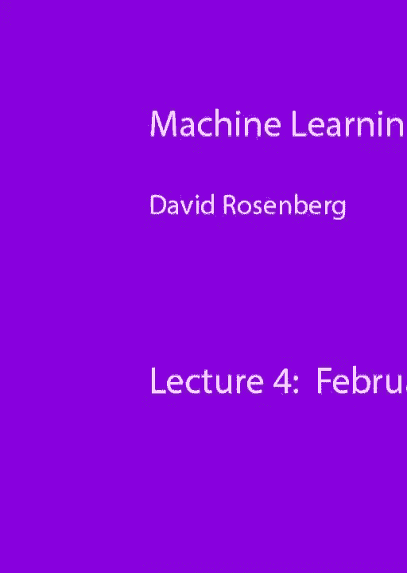
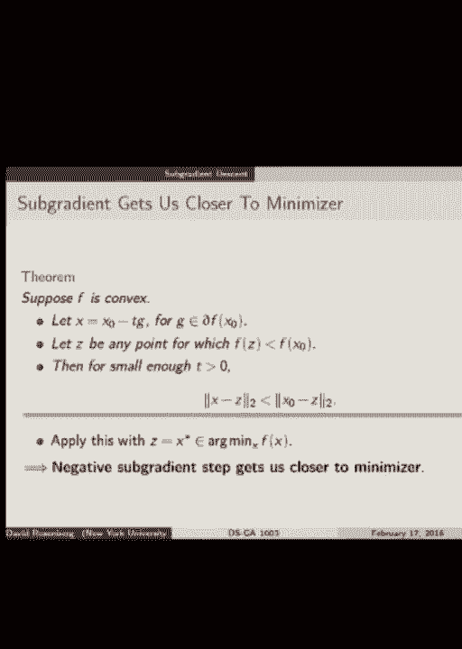
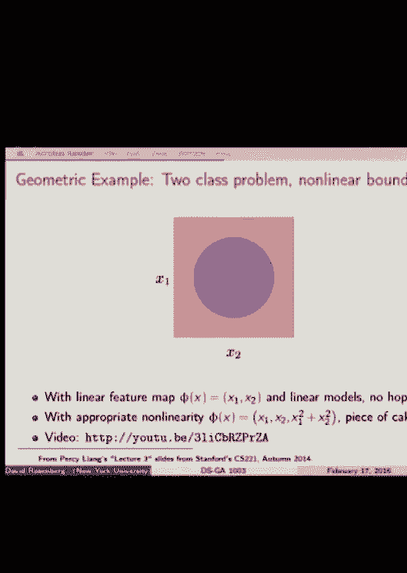
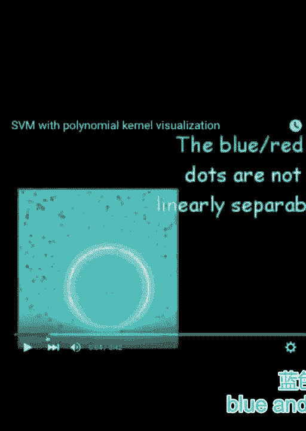
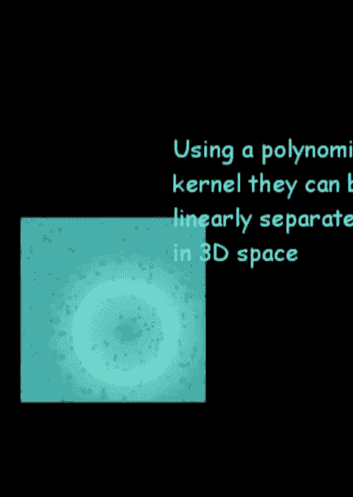
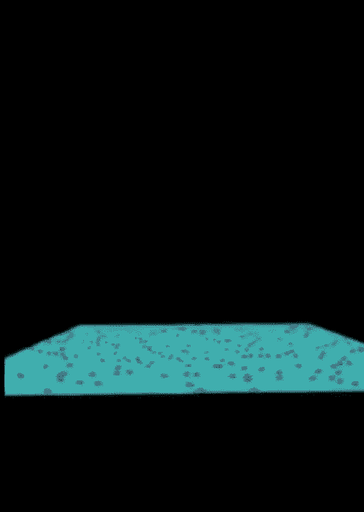
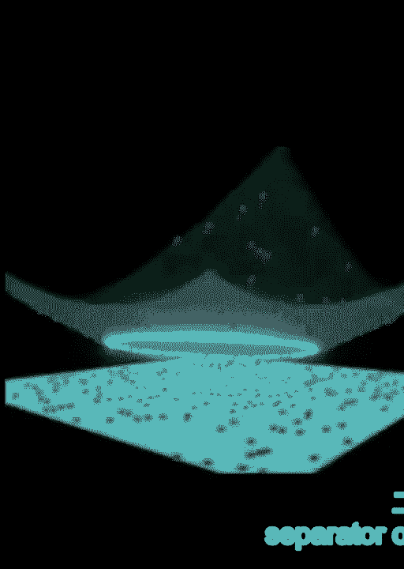
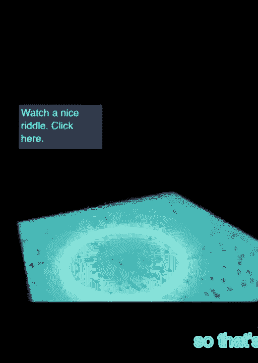
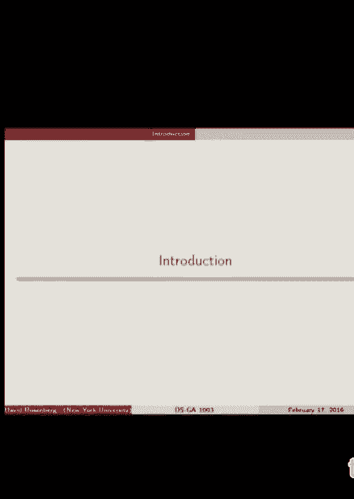
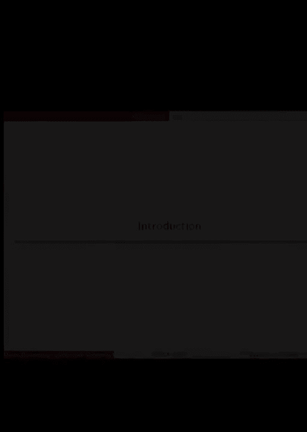

# P7：7.Feb_17_Lec - Tesra-AI不错哟 - BV1aJ411y7p7

所以我在网上发布了一些关于项目的信息，你们都看到了，如果你在广场上注册了这个班，网站上也有，如果你想看一看，嗯，是时候开始寻找团体了，我们一般要找三人一组，我忘了最后期限，但它被发布在网上。当您需要设置您的组时，你可以提交，你可以在纽约大学的课程上提交，一旦我们把它设置好，然后在接下来的几周里我们会给你分配一个项目顾问，然后我们将举行第一次会议，我从更多的细节开始，当我们走的时候。今天我们将从一个随机的小重温开始，梯度下降和梯度下降，嗯，部分原因是我想给你更多的细节，但是作业上出现了很多问题，我想澄清几件事，所以我们从这个开始，首先是一些术语，嗯。所以让我们在这里讨论不同的优化方法，让我们来谈谈非常通用的版本，我们在我们的空间中找到了起点x零，我们正在搜索，我们每次迭代都迭代，我们选择一个步骤或搜索方向称为V BK将是K源方向。

然后我们选择一个步长T，然后我们从现在的位置迈出一步，xk加上步长t，乘以步骤或搜索方向，V好的，所以已经有几件事了，我想迷惑了一些人，所以说，尽管名字是v k，但它不是单位向量，我们称之为搜索方向。但它不是单位向量，所以不要指望它有规范一，至少以我们在这门课上讨论的方式，第二件事是TK，步长实际上不是步长，以你可能认为的方式祝福你，TK的一个更好的词可能是阶梯式乘数或阶梯式因子，但有时不是名字。只是人们把事物称为某种事物，某些方式，只是因为那是一种方式，一直都是这样TK不是距离，在x k加y和负x k之间，它仍然被称为步长，它是TK，但不管出于什么原因，事实并非如此，当然，除非VK是单位向量。所以我听到一群人在谈论将渐变正常化，你可以这样做，但那不是，我们在这里不是这样呈现的，当我们说步长，我们打算它表示V上的乘数，哪个是步骤或搜索方向，我们不打算k是单位向量，我们不打算。

TK是步骤的实际大小，但这就是为一些人澄清一些事情的方式，好的，所以特别是，当我们谈论步长需要衰减的速率时，假设你没有正常化，v，好吧，这是第一个，好吧，现在，我们要回忆一下方向导数的定义。或者有时这是关键，这里的关键点是h降到零的极限，是什么让这个，呃，有时称为单向导数和方向导数，嗯，我不会走过去的，因为我想至少做作业的人现在已经看到了很多，其他在网站上。有一张关于方向导数和一阶近似的笔记，如果你只是旁听课程，你可能想看看，这是f在x点的方向导数的定义，在v方向，所以有一个新的术语，我想我以前没有提到过，也许我有V叫做下降方向，如果f在x点。如果方向v的方向导数小于零，那么这意味着什么呢，如果我们在X点，如果这是V，V是下降方向，如果我们朝那个方向迈出一小步，我们函数的值就会减少，那是下降的方向，所以说，比如说，我们主要用的那个很好。

我们主要使用的是下降方向，再次，负梯度，是啊，是啊，那是我们唯一的下降方向，到目前为止我们使用的主要方向，就是负梯度，所以好吧，现在，如果f可微，这实际上也许是可微的定义，如果f可微。然后我们可以在方向上写方向导数，v作为梯度和方向的内积，所以这应该是家庭作业的复习，所以特别是，任意方向v是下降方向，如果梯度和v的内积小于零，只是稍微整理一下定义，是啊，是啊，好吧嗯。只是为了满足你的胃口，你可能在其他课程中学到什么，梯度方向，负梯度不是人们可能想要使用的唯一方向，有一种叫做牛顿步的东西，牛顿台阶方向，这涉及到f的黑森的二阶导数，所以f的逆黑森乘以f的梯度。你可以做一些计算，看到是的，这其实是一个下降的方向，它只是假设这个梯度，这个黑森人是，那么为什么你想用这个作为一个步骤方向，什么会聚得更快，我想当你们忙着写作业的时候，一个，您的优化算法。

你看到事情汇聚在一起，你知道一些很慢的，一些更快，你知道这让你希望事情更快地收敛，这样你就不用等那么久了，所以中午会聚得很快，至少当你接近最佳值时，问题是这个黑森矩阵，我们有这个，黑森矩阵的维数是多少。如果我们的特征空间是D维，是啊，是啊，所以如果我们有一个巨大的功能空间，在自然语言处理环境中并不罕见的一百万个特征，这是一个黑森矩阵，它有一百万平方的条目，那是那是相当大的，然后我们需要把它倒置。或者做一些大致相当于倒置的事情，所以这在我们的高中就不多了，在我们的大范围内，巨大的特征空间，问题类型，但我只想让你意识到这一点，有一些方法可以近似牛顿步，而不是真正做黑森语，这些被称为准牛顿方法。留意这些，最重要的，我想这些天叫做LBFGS，bfg和s是发明者姓氏的首字母，就像是四个人同时独立发明的，L是有限的记忆，所以这是BFGS可能使用更多内存的一种方式，LBFGS无论如何都会限制您的内存。

所以这些方法比全牛顿法更有效，仍然是，但例如，你可以跑，你当然可以在岭回归上运行LBFGS，没问题，而且会很快，所以像我们在第一张幻灯片中展示的迭代优化方法，这叫做下降法。如果我们每走一步都是在下降的方向，简单，因为设置方法意味着你的台阶方向是下降方向，如此等价，你基本上是说每次你迈出一步，你的目标函数的值就会减少，你从来没有迈出一步，它又往上走了。除非你已经处于最佳状态，所以观众的问题是随机梯度下降，下降法，好的，我听到是的，也没有，所有的权利，嗯，否，我只是在想，所以随机梯度下降，你对一个点取一个渐变，x y右，但是这个方向可能不会改善坡度。关于所有的数据，所有的所有的点，所以它不是它可能是一个固定的方向，但不一定，希望它更有可能是一个下降方向，否则你会有麻烦的，但它肯定不是一般的下降方向，所有的权利，所以说。

现在让我们回顾一下随机梯度下降，因为也有一点困惑关于到底发生了什么，我只想澄清几点，所以让我们从梯度下降开始，所以我们初始化，我们在负梯度下降中迈出一步，当然好的，让我们介绍一些新的东西。称为噪声梯度下降，这不是一个标准术语，我只是用它来解释一些事情，所以这里不只是沿着渐变方向，我们将沿着某个方向v或负v，我们希望它是梯度方向的一个很好的近似，到负梯度方向，所以v是f梯度的估计，所以。比如说，一小批，sgd，我们在第一节课中展示了这个方向的期望是梯度，这不完全是渐变好吧，我们在SGD中使用的批次越大，梯度的估计越好，所以说，在你想要的渐变有多精确之间有一点权衡，好的。这些都是我们讨论过的事情，让我们，让我们将SGD应用于我们非常常用的目标函数类型，也就是这种规则化的经验风险，所以我们有我们的，这是我们的正规化术语，w的omega将是我们的通用正则化术语。

这是我们在例子中的平均损失，我们的目标是J FW，让我们试着重写它，让我们重写它，作为这些新功能的直线平均值，我的H好吧，所以h i w将是正规化术语，加上第I个例子上的损失，如果你盯着它看一秒钟。你就会相信我这两个是等价的，λωw独立于i，这样它就可以出来了，他们一个也没有，但我们在前面除以n，所以这两个表达式是等价的，我是这样写的，因为现在它看起来更像一个普通的权利。所以我们不应该被前面的正规化吓跑，我们可以把它拉到和里面，它看起来仍然是一些函数的平均值，如果我们想在J FW上sgd呢，好的，所以我们要随机均匀地挑一只眼睛，所以我们要从这些函数中选择一个。我们要近似w的j的梯度，按其中一项的梯度，所以h i w的梯度，好的，所以在每一步，这是我们对j梯度的近似值，我声称，所以台阶对梯度是无偏的，这就是h梯度的期望值，i是j的全梯度。

那么这个期望结束了什么，这个期望中的随机性是什么，我确实写下来了，但不管怎样，你可以这么说，随机的是点的选择，你是，你在取右边的渐变，好的，所以这就是，是啊，是啊，问题，拜托了，呃，和i函数。为什么我们没有1/n，呃，在右边的前面，好的，我将在这两个功能上借给我们同样的钱，是呀，他们是一样的没错，嗯，应该是吗？乘以lambda，乘以右边的no，事情是这样发展的，我相信是的，所以你可以检查。因为没有，别忘了和里面有lambda，他们一个也没有，然后我们在前面有一个1比N，所以它抵消了，你为什么不检查一下呢？精细，如果你仍然认为有一个错误，让我知道，这就是你在作业中应用的场景。关于岭回归的sgd，比如说，现在我想把它与我在第一节课上介绍的内容联系起来，记住风险本身的随机梯度下降，论真正的风险，所以我想把它带回来，因为我想这可能会让一些人困惑，那么新币对风险意味着什么呢？

所以假设我们的目标是对损失的实际预期，在随机选择的例子上，所以如果我们要在这个物体上做随机梯度，我们会从数据生成分布中随机选择一个点，我们用损失的梯度近似j的梯度，在随机选择的一点上。所以假设我们在一个场景中，只要有一组固定的训练数据，我们有一个训练数据的生产者，我们按下按钮，它给我们一个xy对，我们想吃多少就吃多少，所以说，我们按下按钮，我们得到一个xy对，我们看着损失。然后我们取损失相对于参数w的梯度，这给了我们一步的方向，等，因为该点是从数据生成分布中选择的，对这次损失的期望就是对那一点的期望，在从分布中提取的xy点上，和，现在我们可以，然后通过数学。我们可以交换期望和梯度，所以这个梯度在一点上的期望，是期望的梯度，所以这正是我们要寻找的真正风险的梯度，这一次我包括了一个引文，如果你们想抬头看看，交换期望和梯度的条件，关于这个有什么问题吗。

那么我们怎样才能真正实现这个，是什么阻止了我们实施这一点，是啊，是啊，你在摇晃埃迪，有什么东西阻止我们实施这一点吗，我们不知道井，我们不知道潜在的分布是真的，但是假设我们在某个环境中。我们根本不必知道潜在的分布，但我们必须有一个来自该分布的样本来源，这是种没有结束，所以真的，我们可以实现这个，粗略地说，如果我们能保持，如果我们不断从相同的分布中获得新的数据点，这听起来并不那么遥远。在现实中，嗯，我们基本上可以做到这一点，它就像一个在线学习算法，所有的权利，所有的权利，所以这里有一个问题，所以如果不是从Pxy的新分布中提取xy呢，如果我们继续从经验中重新采样呢，训练数据。所以我们一直从训练数据中采样x y，好了现在，我们又回到了随机梯度下降，所以从经验分布中绘制x y，我们又回到了随机梯度下降，再说一遍，上一张幻灯片上的这张，好的，所以在所以在这个。

当我们对这个正则化的经验风险进行随机梯度下降时，我们有一套训练设备，一组训练数据和数据点，和我们试图最小化的目标函数，是训练数据的平均损失，再加上一些正规化，好的，在这种情况下。我们采样的点来自训练数据，我们从训练数据中随机取一个点，我们迈出一步，从训练数据中再取一个随机点，在这种情况下迈出一步，而不是从训练数据中随机取一个点，我们从数据生成分布中取一个随机点，真实分布。所以我想说这有点，下一个话题，有点超出了课程的范围，但我想说一些关于收敛率的话，因为这是在家庭作业中出现的问题，嗯，对它了解一点是很好的，就像我之前提到的，这是一个非常流行的研究领域。所以现在发生了很多事情，每时每刻都有新的结果，这是家庭作业中的图表，一个，我们基本上有五种不同的岭回归优化方法，底部的那个，这个紫色的是渐变下降，其他的都是随机梯度下降，不同的步长时间表。

一些固定的步长，一些减小的步长确实，你们买了这样的东西吗，好的，很多是和一些窒息，好的，所以那是另一回事，所以问题是差距是什么，所以我确实声称，有一个随机梯度下降收敛的定理，只要你有一个减小的步长。你知道吗，就像我们的一个T，或者T的平方根过一，对呀，所以它看起来不像是聚集在一起的，你们觉得这是怎么回事，慢慢地做，是啊，是啊，它做得很慢，我想说这些算法还没有融合，好的，所以这运行了500次迭代。只是出于好奇，最长的东西是什么？一个运行了多少次迭代，花了多长时间，好的，所以有时候如果你好奇，你应该大胆一点，跑得更久一点，让电脑为你工作，运行一个小时，运行十个小时，好的，所以这是意料之中的。问题是随机的绿色下降，一般来说比梯度下降要低得多，让我们做一点，让我们看得更深一点，所有的权利，所以让我们给一些，这有点数学，因为我想说真话，这意味着我需要更多的条件，嗯。

所以这在某种意义上超出了课程的范围，但我给这个是为了利息，假设我们有一个凸且可微的函数f，而且f的梯度有一些，它不会变化得太快，这是而且以一种特殊的方式，称为利普希茨连续。所以两点x和y之间的梯度变化是由这个因子控制的，l，就相距多远而言，x和y是，基本上梯度变化不会太快，所有的权利，所以如果我们有一个利普希茨连续函数f，我们试图最小化它到茎的梯度，我们有这种类型的边界。当我们使用固定步长T时，小于1/l的大小，所以让我们看看这个，函数在k处的值，第1步超过函数在最小值处的值一定数量，所以我们当然希望它很小，对，因为这意味着当它归零时，它就会收敛，分子是多少。它是初始点，减去最佳点，它们在欧几里得距离上相距多远，所以马上，如果您在很远的地方开始优化，正如你所料，它会伤害你的，至少就你的收敛而言，让我们看看分母，发生什么事了？我们有k是步数，T是固定的步长。

所以这不会改变，但是K K随着时间的推移而增长，当我们迈出越来越多的步伐，这个分子是常数，分母整体增长如此之大，我们可以说这个梯度下降是以1/k的速率收敛的，那是，这就是正在改变的事情。所以收敛于k的1，当k趋于无穷大时，所以这被认为是一个非常慢的速度，我们稍后会看一张照片，这称为次线性率，嗯，梯度下降在实践中可以做得更好，在一个特定的例子中，它做得更好，因为f有额外的性质。我再多说一句，所以有一种方法，写这个比率的另一种方法是从误差的角度来思考，所以如果，x k的f减去x星的f，这有点像我们是多么的次优，我们离f的最佳值有多远，f的最小值，所以如果我们想让它小于或等于ε。对于这种类型的方法，我们将不得不采取大约一个以上的Epsilon步骤，那是什么意思，假设我们希望Epsilon是一百多个中的一个，我们需要采取与一百步成正比的东西，希望它是一千个中的一个。

我们需要成正比的东西一千步，所以换句话说，对于这种类型的，如果我没做错，如果我们想在精度上增加一个额外的小数点，所以我们想把损失从1。5降到1。4，我们得多跑十倍，顺便说一句，这是一个固定的步长。但同样的速率基本上适用于回溯线搜索，所以即使感觉快得多，费率是，相同的，不同的是这个定理中的步长，我们需要知道L Lipschitz常数，而回溯线搜索，我们没有好吧，所以这是梯度下降，一种弱版本。从某种意义上说，我们没有对f假设太多，让我们更多地假设f，接下来是强凸性，你知道的，在岭回归中，我们有这种经验风险，然后我们把这个，w平方的范数是二次项，所以当你拿一个凸起的东西。你加上一个严格的二次项，它就会变得非常的凸起，所以这里有一个条件，但强凸的定义条件，嗯，哦，让我们，我们以后再谈这个，当我们定义凸性时，这将更有意义，f是见右手边的前两项，忘记第三项f是凸的。

当且仅当这个不等式完全成立x和y，强凸要求不等式成立，即使我们在右手边加上一个额外的平方项，所以当我们离开它时，它把f推得更快，当y远离x时，f必须比f或只是凸强凸的情况下增加得更快，我看到一些点头。这是令人鼓舞的，我不知道，我不知道这会不会，是啊，是啊，我不认为这是如此强烈，它，具有最小二阶导数，也许让我回到那个，我想我想实际上是的，我想还有一秒钟，是呀，你说的对，有一个二阶导数的表征，是啊。是啊，所以我相信D会是的，是呀，可能黑森的最小特征值，我来告诉你是的，那里有东西，好的，所以如果f是强凸的，我们有一个更强大的定理，所以我们有以前的利普希茨条件，我们加入了强凸性。然后用固定步长或回溯线搜索进行梯度下降，满足这个新的界限，我们会看看的，我们会看到它好多了，所以这里有一个常数c，在0和1之间，步数为c的指数，所以如果你有一个在零到一之间的数字，我们把它提高到指数。

k和k不断变大，c发生了什么衰变，迅速减少，指数快速，所以这将以指数级的速度迅速归零，本学期剩余时间，其余的因素只是随着k的增加而恒定，所以这是一个更快的速度，所以如果我们在强烈凸起的物体上做梯度下降。在其他条件下，利率要快得多，这就是岭回归的情况，这就是为什么我们看到嗯，梯度下降明显优于随机梯度下降，我现在就来描述一下，好的，所以另一种方式，另一种方式，写这个指数衰减是得到，具有很强的凸性。以达到Epsilon精度，我们只需要1在Epsilon迭代上的日志，所以在我们需要一个超过Epsilon迭代之前，在强凸性的Epsilon内，我们需要在Epsilon上记录一个，这是一个巨大的。所有的权利，所以这里有一个更像是教科书情节的情节，从嗯，黑线是全梯度下降，其他三条线是随机下降的，小批量为110和100，所以他们基本上都很相似，全梯度下降要快得多，y轴是对数刻度。

所以你会看到这是一个线性衰减，在对数尺度上线性下降，这就是为什么这种类型的减少通常被称为线性收敛，所以如果你从线性收敛中听到这个，这意味着当您在对数刻度上绘制此错误时，这是一条线，嗯，其他这些家伙。这些被称为亚线性，亚线性性能，是啊，是啊，在对数尺度上看起来比线性衰减慢得多，所以我把它关掉了，我刚意识到，所以我不得不说随机梯度下降的收敛率，它也是如此随机下降也是亚线性的。我相信价格甚至比我们的一个，我相信这是我们Epsilon的平方根之一，但我会帮你检查的，好的，所以最后一张幻灯片基本上是一个问题，我们关心这些截然不同的收敛率吗，你知道的，如果新元这么差。我们为什么要用它，答案是，对于我们的大多数目的来说，这真的无关紧要，这里有一张幻灯片说明，所以这里有两种方法，SGD和这个叫做创的东西，我们只是认为这是好的，tron是一种二阶方法，所以速度很快，嗯。

x轴上是优化精度，所以这是在你的训练集上，你有你的损失，你的训练损失离理想的训练损失有多远，所以你在运行你的优化算法，你从左边开始，你的训练损失了第一点，他做了更多的工作，使他做得很好，它在零点。一次精度，x轴，y轴是训练时间，所以要达到小数点后五位的精确度，随机梯度下降比创快得多，但最终当我们需要小数点后八位的准确性时，或者九个随机梯度下降变得很慢，它就是不能得到最后几个数字的准确性。在接近最佳值的时候很慢，所以好吧，所以如果我们想要大量的精确度来投射屏幕，然后不适合我们，但在这上面是预期风险的图表，所以你可以想象他们有一个巨大的测试集，他们在这个大测试集上训练预测算法的性能。它接近预期风险，他们看到预期的风险很快就会下降，然后它就稳定下来了，就是没有好转，当我们把这个优化错误改进为，比如小数点后的第六位、第七位、第八位和第九位，所以这里的论点是你所有的额外时间。

您正在运行您的算法，对你的，这又回到了交易上，我想我们在第二课讲过，优化误差与估计误差和逼近误差之间的关系，所以当我们运行这个时间越来越长，我们的优化误差在减少，不清楚我们的估计误差是否相应地改善。所以这是对这种事情的一个很好的描述，有点高级，但你可以给它一个叫做大规模学习的权衡的外观，但我们在地面上看到的是一个体面的迭代，需要更多的时间，它们应该正常化，这样它就像一个时代，你服用了随机GRA。所以也许就像，你会在什么方面，所以我假设这已经是在PAC方面了，在那里做比较没有多大意义，但你觉得它会是什么样子，你看这是，这只是一个，即使这是最糟糕的情况，这实际上是每一步都被算作一次迭代，嗯。它会挤压会发生的事情，它会通过恒定因子将新币挤进去，这是训练集的大小，是啊，是啊，你觉得这样会更好吗，我不知道，我不知道，我不认为这会好到哪里去，因为你在用一个不变的因素改变事情。

而且差异更像是指数级的，我会仔细检查迭代号上的任何情况，那这是个好问题，虽然，所有的权利，所以我们的下一个主题是次梯度下降，所以这是我们一直在围绕这个问题跳舞，我们有这些不可微的目标函数。所以我们不能把渐变，所以我们介绍了一些工具，那一个正在折断套索，我们用正负两个部分，对于SVM，我们拿了对偶，得到了约束，而不是一个不可微的目标，我们可以做点别的，这就是所谓的次梯度下降。我们现在要谈谈这个，这将是下一次家庭作业的主题，我们将次梯度下降应用于我们上周讨论过的svm，和凸函数，我希望你还记得这些是什么，所以我们有一个，首先让我们谈谈一阶近似，这是另一篇评论。所以如果f是可微的，我们想预测f y，给定x的f和x的f处的梯度，我们可以用一阶近似来做到这一点，它来自导数的定义，所以我们看f在点x处的梯度，我们从图形上看切线，如果我们要预测这里的f值，在y点。

我们在这里预测f，y，我们将是这个缺口，这个夹子，好的，所以Fx转置y减去x的梯度，这是我们需要做的预测改变，从x的f到y的f，所有的权利，所以说，如果f是凸可微的，原来我们有这个额外的属性，有趣的是。那个，右边的一阶近似，其实是低估了实际价值，换句话说，它不只是近似相等，大致相等，是呀，但它也严格大于或等于，所以函数的值总是在切线以上，所以这也是凸和可微的定义性，所以线性近似是f的全局下估计。所以这实际上是一个非常有趣的属性，所以分化完全是局部的事情，你知道有多可微吗，或者函数在某一点上的导数与，对遥远的功能发生了什么只字不提，但是如果函数是凸的，因为如果函数是凸的，我们从这一点的导数知道。我们可以每隔一点就给出函数值的下界，但是根据这条切线，有趣的是，对于凸函数，局部的一些局部信息，给我们关于该函数的全局信息，所以特别是，假设x的f的梯度在某一点为零，那么最后一项是零，对于所有的y。

y的f大于x的f，这意味着x是f的全局最小值，好的，所以有，有一个证明f的梯度等于零，对于凸函数的全局最小值就足够了，所有的权利，所以现在让我们来讨论一个次梯度，次梯度的概念是。让我们受到凸f梯度的这个刻画的启发，让我们这样，对于不可微函数，f的梯度不存在，不可微的地方，但让我们问问，让我们定义一个向量g为f的次梯度，它提供了一个下界，就像梯度对可微函数所做的那样。所以这里有一些照片，所以蓝线是我们的不可微函数，在这一点上是不可微的，这里和这里我们有两条红线，这是两个到低的切线，蓝线有两个全局下界，蓝色的曲线，所以每一个，g对应于。这些线中的每一条都是蓝色函数的次渐变，清楚了吗，那么到底是什么，所以我们在这个点周围画函数，x零，这就是我们要找的次梯度点，我们看的是x零加g的转置，x减x零，这就是我们在这些红线上画的函数。

所有的权利，所以你还可以看到，当出现扭结或其他情况时，会有很多切线点对吧，这不是一个独特的次梯度，所以有一个亚微分的概念，次微分，它是所有子梯度的集合，所以f是次微分，如果在x处至少有一个次梯度。至少一条全局下限线，所有梯度的集合称为次微分，这是我们对次微分的表示法，它是一个集合，让我们在这里做一些基本的事实，所以首先它还原到一个渐变，然而，所以如果f是凸且可微的，那么次微分就是梯度。没有其他好问题了，我很高兴我有答案，所以在这里任何时候，可以有零个，也可以有无限多个子梯度，所以我们知道的一个情况是可微的，我们也看到了无限多的情况，当它不可微的时候，这是我画的两个。但在这两条红线之间可能有无限多个次梯度，最后一个案例是零案例，嗯，这意味着f不是凸的，所以如果没有次梯度，这意味着没有切线，这是一个全局下限，这意味着这个函数不是凸的，这是次梯度的定义。

我们有和梯度情况一样的，我们有全局最小化条件，如果零向量是部分，则是次梯度，所以如果零向量次梯度，那么就是x在x处，那么x是一个全局极小值，这就是我们的次梯度条件，是啊，是啊，不好意思这么说。对于凹函数，不会是下界，就像一个上限，所以我是，我说的一切都在凸起的情况下，我相信，所有的权利，我这里有一个肾脏的简单例子，让我们看看绝对值函数，所以左边是绝对值函数，右边是，嗯，在x的每个值。我们已经绘制了作为次梯度的值集，那么首先对于一维函数来说，渐变是什么样的物体，只是斜坡，这是一个标量，只是一个数字，所以在零的左边，是负一，当然是右边，这是一个，就是这些线条，在零点处。次梯度是所有斜率的线，在任何一个斜坡之间，在负一和一之间，所以次梯度是一组数字，在负一和一之间，嗯所以，如果你想，如果你们，呃，记住，从作业套索问题，有一些问题，我们做了一些徒手求导，左右导数。

所以你也可以使用次渐变技术，在那里你计算次梯度，所以我们引入了这个次梯度的想法，因为我们想有一种方法，我们可以用来优化非，可微函数，所以我们想说的是，我们为什么不沿着次梯度方向走一步呢？也许管用，嗯。所以我们对可微函数所做的，我们在设定的方向上发现了，就是负梯度，我们往那边走，那么我们可以对不可微的f做同样的事情吗，如果我们把负G作为一个步骤，其中g在次微分次微分中，就是这个意思。第一个问题是负g是下降方向吗，大家一致认为棒极了，所以它实际上不是一个下降方向，这很有趣，好的，但是呃，但我有一个很好的例子，那么是怎么回事，这是左边的函数，x一加二的绝对值，2的绝对值。在右边我们有这个函数的水平集，对呀，所以域是x 1 x 2，所以它们是等高线映射，所以这个东西在零点最小化，你可以看到这一点，所以最小值在原点，当我们远离原点时，功能在增加，这就是看待这件事的方式。

好了，现在，让我们到这里来，我的指针在哪里，从这里开始的一个次梯度方向是，嗯，所以说，如果我们沿着负g方向移动，往这边走，你可以看到这并没有越过这些等高线走向原点，它实际上正在远离最外层的等高线。大家看到没有，所以当我们往负g方向走时，函数值就会增加，不是下降方向，但如果你仔细看，我声称我们也在向原点前进，无论如何，你看到了吗，如果我们直接向下移动，我们会稍微远离，如果我们搬家，在哪里。至少向原点迈出一小步，嗯，其实现在，必须是什么角度，是啊，是啊，所以我们得搬家，如果角度向左移动比向下移动多一点，然后我们向原点移动，好的，就是这样，所以说，原来，我们可以证明。我们总是会向带有次梯度的最小值移动，即使功能没有减少，这是相当惊人的，我觉得，我们可以用一张幻灯片来证明这一点，所以定理是这样的，虽然，所以如果f是凸的，我们开始很好地优化，方法是这样的。

在x零开始优化，我们选择一个负的次梯度方向，设g为次梯度，在那个方向上做负T步长，然后重复，所以问题是，这还能用吗，所以定理是假设我们在点x零，我们走到X，所以在次梯度中x 0减去tg，那是那是。那是次梯度，从x零到x的负次梯度步，现在设z是函数值小于x零的任意点，我们开始，所以这是这张图中的三个点，有x零，我们要开始了，有X，我们要去的地方，然后那边的另一个点Z。它比函数值小于我们开始的地方要小，所以转到z会比我们在x 0的地方要好，我们将展示的是，当我们沿着负的次梯度方向前进时，从x零到x，我们也越来越接近Z，所以足够小的步长，x和z之间的距离。x是我们在次梯度步小于，严格小于从我们的起点到Z的距离，相当整洁，当然我们仍然可以让x的f比x的f大，现在想休息一下，之后再做这件事，我想我会快速休息大约七到十分钟，然后我们继续。

所有的权利，让我们研究一下这个证明，我想这是个很可爱的定理，所以它实际上很容易表现出来，嗯，我们说到哪了，所以我们有，我们从x0点开始，我们走到一个点x是x零减去tg，是某个次微分，次梯度，好了现在。设z为z的f严格小于x的f的任意点，所以特别是，其中x零不是全局最小值，还有一个函数值较小的点，那很重要，让我们看看x和z之间的间隙，Z是我们想要去的地方，对，x是一步后从x的定义展开的，现在没问题。我们要做的是，我们要把这个x0和负z分组，我们要用毕达哥拉斯，我们要解决这件事，所以x 0减去c量的平方，我们有一个这样的交叉项，这可能已经很眼熟了，然后T的平方，g的平方的大小好的，所以在这一点上。我们想插入，所以这应该会提醒你次梯度的定义，对呀，所以我们可以用这个来使它不平等，你可以从定义中算出来，很直接，只是一点点操纵，但基本上x零的f和z的f之间的差距是，我想小于g和x的内积减去，换句话说。

你得到了那个项的上界，这个表达式让我们研究一下，我们想要的，就是x和z之间的距离小于，或者等于x0和z之间的距离x是我们开始的地方，所以说，但我们有所有其他的，这里的另一块，我们可以自由地确定什么。是不是，我们需要弄清楚T应该是什么，所以作为T的函数，最后两个术语是什么功能，再次，它是t的二次型，是呀，嗯，它是朝上还是朝下？你怎么知道它起来了，是啊，是啊，t的平方系数为正，所以它是朝上的。它是一个二次方，所以它的形状是这样的，好的，你能看到它的零在哪里吗，那个东西在哪里相交，零，t等于零是零，因为如果t为零，那么这些项都是零，所以t等于零是零，零，嗯，这不是我画的，今天一笔勾销，是啊。是啊，准确地说，你怎么知道零不是最小值，因为它要归零了，好的，那么你能解出另一个零吗，是啊，是啊，你可以排除T，然后有另一个表达式，它将是这个函数的另一个零，我做到了，所以两个零在零。

另一个表达式是比率，让我们仔细看看，x零的f减去z的f应该是正的，因为x零的f比z的f大，假设是对的，因为z的f较小，f的值，所以这个分子块，f x 0和z的f之差是正的，这一规范是积极的。这整个表情都是正面的，所以另一个零大于零，另一个零，函数在右边，所以这是另一个，所以我会把它纠正过来，t Prime，这是零，所以我们有很多选择，这个步长可以在零到这个t素数之间的任何地方。最后两项是负的，事实上好吧，所以我们会得到f和f之间的严格不等式，在x减去z和x零减去c之间，所有的权利，你能用这些信息，选择您最喜欢的步长，你会选择什么，什么事？它是零和t素数中间的点，它是对称的。所以你可以选择去那里，这将给最大的，呃，所以这实际上是有人写了一篇论文，它有一个名字，多聚一步尺寸三犹大在实践中的应用，在实践中你需要知道什么，你，可能你可能没有，看到了是的，确切地说。

或者如果我们在实践中这样做，你真正想要的是耶，z是z可以是非常泛型的任意点，但这是很好的早期，你想取x星，全局最小值是对的，我们正朝着全局最小化的方向前进，以使用步长。我们必须知道函数的实际最小值是多少，如果你能近似它，你仍然可以做得很好，但不管怎样，我想让你知道我们实际上很接近，更多的理解不仅仅是，那越来越近了，我只提这个，所以假设我们又有一个。刚才我们有f是利普希茨连续的，我们在谈论绿色事件，但那不是虚拟的，我们现在讨论的任何地方都是凸的，我们想说，我们能说什么呢，f凸否，这与可微性无关，这就是为什么我们首先使用次梯度法。现在f是利普希茨连续的，嗯，这也是一个不要变化太快的版本，嗯，如果你把x-y移到分母中，你会看到左边只是斜坡，嗯，有点像初中版的计算坡度，也就是两点之间的斜率，就像大海的斜坡，函数f在两点上。

然后它以g为界，所以，即使它是不可微的，到目前为止，这些扭结，它不能很快地跳起来，如果利普希茨常数是斜率，这是最大的角度，你不能，所有的权利，所以如果我们有这个条件，我们有一个台阶大小。根据罗宾斯·门罗的条件而减小，记住一个关于光学平方稳定性和稳定性的东西，例如：We don’我们的机器运转得很好，1/t的平方根很好，所以如果我们的步长以这种方式减小。那么一个人可以证明不比我们在这里用太多的功，所以我们没有时间，但我们离实际的收敛证明并不太远，这有点酷，你可以证明这种次梯度方法确实出现了，不会改变SI，有很多翻转，你担心这个吗，不应该是否定的。我是说这个人是积极的，是呀，对于合适的T大小，是阴性的，是啊，是啊，是呀，所以说，我想我一直走到最后一行，我想说的是下一个，的形成，不一定是右手边，我们一定找不到，右手边应该总是比左手边大。

不管右手边是大还是小，这一项都是零，不是全部，整个不平等是真的，不管这是积极的还是消极的，我们的目标是尽量减少上面的人，不是煤气，我的右手，在我的岁月里，我们试图成为我的，损失，你离矿工越来越近了。不代表什么，如果我们要收敛到点，这是最小值，函数的值也会减小到函数的最小值，但实际上在那之后，有一个例子，我们得到了可能是由Wal，好吧，好吧，最终一切都会好起来的，所以这里有两个问题，所以是的，的确。仅仅因为你离最小值越来越近，并不意味着你要去那里，接近和转换为绝对正确是有区别的，我们没有证明它会聚，所以，事实上，在第七步中，它确实收敛于他们的条件，当它汇聚的时候，你也得到了函数的最小值。还有一些问题，是啊，是啊，我明白，你可以选择任何你想要的次渐变，我们刚才展示的，利用次梯度的表征，对任何一个都没有偏好，你看到的T的值，是啊，是啊，所以次梯度法的t值，有不同的食谱。

我在这里与之联系在一起的是，基本上是一个T O R平方，是啊，是啊，第一个，我不知道，是啊，是啊，那也是如此，我不认为这是个好主意，因为切线可以是垂直的，但是g对它来说是正常的，所以向下的点。如果你往右边走一个，g是垂直于，我在画，一直都有这个亚微分，这个讲座比上一个轻松一点，对呀，所以我们会保持轻盈，这是一个下一组幻灯片是有趣和放松的，损失函数，我们已经讨论了我们可以使用的不同规则化。我们所有的模型都是线性的，我们没有说太多关于功能的东西，可以说是整个画面中最重要的部分之一，所以当我们制定学习你的设置时，你有空格输入空格x对，我们实际上从来没有在空间X上放置任何结构，所以这只是一套。另一方面，当我们运行算法时，我们有很多结构，输入是实值向量，对呀，管道里有射线和双倍，但你知道什么，我们如何弥合这个任意输入之间的差距，空间x和实际实值向量，这是基于许多新特性的过程，所以说，比如说。

我们可能想要使用的输入是什么，它没有明显的编码，都是真实的，所以你知道，文本文件，图像，图像文件，看看你是否看像素值，这就像，数向量，不同大小的图像，例如，这与我们心目中的特征矢量不一致，录音记录。那些是不同的灯，所以是的，一旦你能在电脑上得到它，这是真的，我们已经把它编码为1，0编码为数字，那有点，那是便宜的版本，我们真正需要的是这些数字，就像序列中的第四个总是有相同的含义，所以在你的模型上。您可以有一个有意义的参数对应于输入的第四个坐标，所以当我们说特化时，这就是我们要做的，所以从图解上来说，特征化过程我们有这个原始输入空间x，可以是任何字面上的东西，这个特征提取过程将x映射到某个实值。特征提取，所以通常我们只写x，我们已经在这个第3个空格中了，至少在家庭作业上，但现在我会写X的费用映射是明确的，可能是从某个空间映射的，我们将讨论一些实现的实际问题，所以为了改变，所以没有显示功能模板。

我们来谈谈，让我们举一个例子，假设我们想算出我们得到的字符串，是电子邮件地址，所以输入，字符的字符串序列，那么我们如何从中制作功能，所以我们可以思考这个问题然后手工制作一些功能，例如，说，你知道的。绳子的长度大于十吗，是或否，是的会是一个，一个不就是零，这将是一个功能，嗯，字符串中的alpha betical字符的分数是多少，85个特征只是编造的，它是否包含应用程序标志，是或不是一个或零。它这样做是一个，它以coit结束吗，对于风暴特性这样做，这是未来工具的一种方法，一个，嗯，但这有点临时的，我想有一个，解决机器学习问题的一种策略，试图让你的电脑为你做很多工作，尽量减少自己的。我们能用更系统的东西来取代这种类型的东西吗，这就进入了特性模板的概念，所以吸引的是一组功能，它们都是以类似的方式计算的，通常你有一段代码来计算所有功能的值，同时，特征模板的长度可以大于空白。

然后你对一大堆数字有一个不同的特征，所以长度大于一，长度大于二和三，这些都可能是不同的特征，你可以有一段代码，输出所有这些特征值，而不是去想，例如，电子邮件地址中的三个字母字符是重要的，就像，哦。我们有CO和RGB，好像，你知道，我只是喜欢，而不是去想那个，只是为了把他们都包括在内，所以这里，我们映射abc，hgmail，www。icj-cij。com，以AA结束吗，没有结尾，现在和你一起做。是呀，但是计算机可以自动地很容易地生成所有这些，为什么我想这么做，就会，它更健壮一点，对呀，如果你没有想到什么，或者你知道这是改变，当他们重新训练模型时，他们为新的流行领域增加了新的功能，对呀。所以更通用，引入了一些鲁棒性，让东西不那么脆弱，所以我，但问题呢，现在我们有像像，指数多，我们有很多功能，所以这会把我们的模型搞砸吗，我们会过度适应吗，在现代方法中，这不是一个很大的问题。

因为我们做了这个正规化，我们做两个正则化，或者l一个或者一个组合，这保护我们不过度适应，当我们有这种丰富的特征，所以一种特殊的特征编码，你经常称之为热编码，这是当你有一整套功能时的术语。对于任何给定的情况，正好一个是一，其余的是零，所以这是一个热门的编码，对呀，因为字符串只能以一组三个字母结尾，它可以结束两套不同的三层，所以只有一个会是一个，所以一个热编码，好的。所以让我们来谈谈现在的表示，我们有潜在的大量功能，比如所有三个字母的结尾，几乎都是零，这表明了另一种选择，我们如何表现，所以到目前为止我们使用的传统方法是密集的特征表示。在那里你想象特征有一个特殊的顺序，每个特性都有一个值，然后您可以表示值，它就像一个值数组，所以这个数组中的第三个条目是特征值，查看我们功能列表中的第三个功能，所以第二个，例如，将是零，它包含一个。

这是一个非常，呃，使用的非常高效的数据结构，你可以在Gpus上运行，嗯，但是如果您的大多数特性值都为零，它浪费了很多空间，所以有一种叫做稀疏表示的替代表示，在这里，您只存储功能名称和值对。但你漏掉了所有的零，因此，如果特征值为零，你只要把它放在你的存储空间里，所以如果你在Python中，你有字典或哈希地图，在Java什么的，所以它是一个，它是从特性的名称到值的查找。所以我们可以使用数组进行密集和映射，Python中的dicts表示稀疏，所以说，当然啦，当你使用字典时，你有一些开销，因为你必须查找条目，你不能直接访问它们，你不能抹去，但是在很多情况下。尤其是像自然图像处理，我们有稀疏的特征，它是，值得交换，到目前为止，对这些事情有什么问题吗？很容易走对了，所以现在，我们讨论的是如何制作功能的几个问题，这解释了我们到目前为止至少局限于模型的事实。

线性模型，你想在现实世界中使用的许多函数都不是线性的，但是如果你被限制使用线性摩擦函数，你能做什么，你要做的就是把非线性区域放入特征中，所以我们将讨论非线性编码的各种方法，它是捕捉某些类型非线性的特征。所以我们想做一个预测，你想如何给某人的健康评分，所以这里的一般哲学是你想提取每一个可能花费你开发的特性，另一件事是你要尽可能少去想它，并且非常通用，所以你可以用很多不同的东西来进行医学诊断，不同的测量。高度，重量，温度，嗯，所以有三种类型的非线性，我们将讨论非单调性，饱和度与特征间的相互作用，我们将打破，所以让我们从一个非常简单的特征地图开始，所以我们要把一个人，这是一个非常抽象的空间，输入空间人。所以我们取一个x，我们把这个人x映射到两个数字，一个偏见，我想有一个偏差和x的温度，所以人的体温，所以我想预测一个分数，其中很大的数字是健康的，在少数人中算不了什么，我们的假设空间。

我们在这里做线性模型，作为温度的仿射函数，那么你认为试图预测的问题是什么，如果某人健康与否，使用我们到目前为止指定的特性空间，是啊，是啊，所以很高的体温是不好的，很低的体温是不好的。但介于两者之间是好的，所以作为温度的函数，它会看起来像那样，中间很好，太高了，很糟糕，太低不好，这绝对不是线性的，所以我们需要做点什么，好的，所以好吧，这里有一个，有一种可能，如果我们用标准温度。摄氏三十七度，我们看看37度的实际温度之间的平方差，所有的权利，这是一种自然的想法，这不符合非常通用的精神，也不需要，我们真的需要这么做吗，否，我们不，我们可能想得更多，我们比我们需要的更聪明。我们可能会让事情变得更糟，如果我们输入x和a平方的温度，x的温度，为什么就足够了，因为你可以得到这个表达式，作为这三个项的线性组合，和线性模型，我们有表达的需要得到线性组合，以解决监管问题。

这应该足够了，这个是，我会声称，是更好的选择，因为我们不建立任何预设，至少它是等效的，更容易更干净，也是的，在一号溶液中更有表现力，事实上是对的，所以一般规则是我的一般建议，我想是试着找到简单的功能。可以组合在一起制造你想要的东西的积木，足够通用，可以用于其他方面，如果你没有在想正确的事情，所以说，通用构件，简单的通用构建块是我们想从特性中得到的，好的，饱和下一期，所以如果有人进行搜索查询。想给出与，所以我们想预测一个更大的分数，如果一个特定的项目与查询更相关，那将是我们的行动，所以一个特征地图的想法，采取可能的结果，搜索引擎结果页，它叫毒蛇，如果你在行业搜索引擎结果页面，嗯。所以x的phi，有一种可能，一个是偏见，n的x n的x是叫它x on的人数，不是你申请好吧，那么这里的问题是什么，如果我们只有线性模型，我们希望输出是，查询的适合度有多好，是啊，是啊，好的。

所以也许如果如果没有，如果n为零，如果x为零，我们有一个线性函数，它有两个，太消极了，例如，对它的质量持悲观态度，所以方向可能是线性的，从某种意义上说，购买某种商品的人越多，我会说增加。它似乎对一般人更感兴趣，但这个问题现在是一个规模，也就是，嗯，买东西的人的数量可能会有数量级的差异，您希望相关性评分按顺序更改吗，所以说，x的n是一百的一千，我们希望我们的分数真的大十倍，所以说，例如。可以使用日志转换，所以没有这个你可能会遇到麻烦线性模型可以转换它，如果你想减轻影响，对于x，你必须把这个变换放在那里，所以在这里我们只放入x的一加对数，我们可以在x的n中离开，为什么不呢？

也许它在一个小的方面是有用的，嗯，不管我们用什么基础来获得运气，为什么不呢？是啊，是啊，所以只是为了得到一个不同的原木底座，这只是一个真实的，这是一个线性，线性可以处理如此线性。线性模型可以把任何系数放在任何值前面，这里有另一种方法来处理它，那么什么是具有您选择的固定函数的转换，另一个有用的方法是将范围再次划分为间隔，你选择的，嗯，我把它分成n，介于0和10之间，是或否。在十到一百之间，是或否，十万，等，你可以做出很好的间隔，你可以做一个大的间隔，你，它们的大小呈指数级增长，你可以做不同的，嗯，祝福你，这里的优点是它更灵活，可能在您可以生成的函数类型中，所以说。会是这样的，对，但如果我们每隔一段时间就把它分开，我们可以让函数输出任何我们想要的常数，在这些间隔上，所以这是一个权衡，我们有，我们就失去了平顺性，嗯，但你有更多的决定来决定多少间隔，应该有多大。

所以这可能是一个烦人的，也是，但这是一个很好的技术，看起来不是产品的例子，为什么它比十个人跑更相关，也许也许如果你说它总体上有用，所以你担心它是它是，在这两者之间有一个跳跃，在桶之间，是啊，是啊。所以你是这么说的，男孩，我们真的，感觉不应该是光滑的，当你用这种颠簸的方式时，你就失去了平稳性，嗯不，我没有，这就是权衡，你可能会失去当你桶的平滑，嗯，你有，在某些方面你更灵活，但如果平滑是个问题。是的，是的，现在实际上有一个有趣的高级版本，所以价值的特征，所以这些间隔中的每一个都是一个特性的名称，并且特征的值为零或一，数是在十还是一百之间，零右或一右，你能做的就是让这些特性的值在零到一之间。你让实际值表示它在这个积分范围内的位置，如果你在10和0，你可以使特征值为1，如果你在零，在两者之间插值，有些人发现它工作得很好，很顺利，我们把饱和度叫做什么，哦，我猜，这个想法是。

我们可能希望x的值在某一点饱和，可以这么说，如果它的mx是一千，这已经是我们将从它的流行中得到的最大好处了，如果是一百万一千，3。我们不希望事态进一步恶化，所以安诺克斯侦探饱和了，另一个桶。那么我们应该有一个系统，嗯，我的意思是x的n是一个值，它是固定值，所以它要么在桶里，或者不是桶可以重叠，是啊，是啊，你可以这么做，你可以这样做，是呀，有时候你可以把水桶，而不是拥有而不是分手。这有助于单调性，ity，而不是把间隔分成一个分区，你可以有重叠的间隔，所以你有n在0到10之间，然后不是N在一百分之十之间，只是n小于一百，不到一千，以一万结束，所以它们是嵌套的，那是另一种方法。在这些桶中的一些价值很少的情况下，这是很好的，这样也许你几乎没有一千到一万之间的东西，但不是让这个参数被非常估计，因为你有足够的数据，在任何情况下，这都有助于，也在不到一百个的小桶里，不到十个。

所以所有这些参数，你有点，那个效果，嗯，桶越小就越有价值，凸性是模型的性质，所以是的，这不仅仅是模型的属性，财产，它是损失函数、模型和正则化，所有的权利，所以又来了一个，所以我们做了，我们所做的饱和度。姓互动，所以说，身高和体重，一种经典的例子，嗯，所以它是，重要的是重量相对于身高，那么你怎么得到，得到线性模型，嗯，所以再一次，所以我们做了一些身高和体重之间的相互作用，这样你就可以谷歌了，这是老派的。你谷歌就像理想的，远离高度，知道，有一个家伙作为公式，所以它是两公斤英寸，这只是一个奇怪的，不是吗？我们可以看看预测和实际之间的平方dv问题，我们能做什么呢，所以如果你真的擅长数学。可以把这个表达式展开，嗯，像这样，你看到了你需要的所有条款，你得到平方项和交叉项，有一个完整的表情，所以好吧，我们为什么不把单个术语放在它的特征中呢，让线性模型知道这个系数应该是多少，所以这里。

所以与其做一个公式，你可以把高度，重量，的正方形，广场，重量的，和交叉项，这可以适应这个决策边界，这种功能，或者其他可能更好的东西，这更符合我们的目标，是啊，是啊，所以x的h除以w x。所以这是一个很好的问题，所以说，好的，我会怎么做，是啊，是啊，我喜欢那样，是啊，是啊，那就会，那就会，就会，增加模型的x，他们做的是原木做的单生理学，然后日志之间的差值是比率的日志，作为比率的变换。可能不是这样，所以如果你想要实际的比例，你得把它分开放进去，但夺走生命是一个很好的技巧来获得比例，至少在那里的比例变换，是啊，是啊，你知道的，因为你看到了方程，我想问题，嗯，我想我在争论什么。就是你不必，我是说，你不必知道这就是你想要的，你只是说我想做一个更有表现力的模型，我怎样才能让这个模型更有表现力，你可以集思广益，比如，哦，也许我可以表达这一点，然后这个怎么样。

那么我需要什么基本的构建块，为什么你为什么得到那个，然后你就可以把这个写下来了，但你不必这么做，就像有一种想法，哦，我不把比例，可能没有受到我们试图做的特定事情的启发，但它只是让模型更有表现力。所以把它放进去，你知道鞋子怎么样吗，我不知道为什么不平方根，一定要试试，嗯是的，这是这是部分是你们应该知道的谓词，他们在某些区域使用它，所以输入空间上的谓词，这有点像一个真假的陈述，所以呃，关于输入。所以特征通常有睡眠的形式，是或不是真的，记住这个意味着要么是一，要么是零，受试者正在驾驶一个，或者你的主语在睡觉作为谓语，主语作为谓语驱动，关于真或假的输入的谓词，我们的许多功能都是以这种形式出现的。呃，所以如果我们想有一个睡觉的主题，而这个主题是开车的，看起来都像，所以我们可以把它写成单个谓词的乘积，所以x的s乘以x的d是，是谓词，它相当于，他们都是真的，好的，所以说，如果这个人在睡觉。

他们在开车，这又回到了自动驾驶汽车的例子，那就是为什么，去年很有趣，我写了这些幻灯片，这是一个简单的快速回顾，那么线性是什么，这是，现在应该很容易，所有的权利，它在w中是线性的吗，是的。它在x的特征phi中是线性的吗，是的，它是x的线性吗？不是，这就是费用的意义，费用可能会使x发生非线性变换，对吗，那么谈论线性和x有意义吗，这是一个很好的观点。所以线性是唯一有意义的东西它已经有了一些我们可以谈论的结构，你知道的，乘以比例，加在一起，这是一个线性，它是关于，所以你甚至不能谈论x中的线性，除非x有x在向量空间中，所以你不能谈论这个函数。线性在人是没有意义的，如果你的输入图片，如果你有线性的图片，这意味着什么，这里有一个几何例子，我们有两节课，你写两个呼叫者像紫色和锚，那么这个空间上的线性未来地图，那只是空间中任何一点的坐标。

所以这是一个或下一个，所以没有线性模型可以区分这两种颜色，没有线性函数，当然啦，所以我们想要一张空间的特征图，以便产生的特征表示，这两类是线性可分的，对这个有什么想法吗，1平方加2平方听起来不错。所以x 1的平方加上x 2的平方在圆上是常数，因为圆的公式，所以对于某个恒定值，说c x 1的平方是x 2的平方，就是在圆上保持相同的值，那么功能是什么，x 1平方加x 2平方实际上是，成为数字特征。所以这里的任何东西都很小，我听到的任何事情都比，嗯对，所以我们可以输入是，我们可以把x 1的平方，平方x2，我们需要x1和x2吗，什么，原产地权，所以说，如果是这样的话，我所说的整个论点是中心为零。但如果原点在这里，我们还需要一些其他的东西，也许甚至一个来转移它，不确定，一个很酷的视频，大家可以看一下。

蓝点和红点是不可线性分离的，这是你送的。

好的，所以诱导了一个新的第三维度，也就是x加y的平方，可能居中，这是一个线性超平面，把阶级分开，一旦他们被第三维度举起，他们就分开得很好，但是在二维平面上没有线性分离器。

这就是我们正在做的事情。

当我们引入一个新的，嗯，我会看着他，那么下一步是什么，还剩几分钟，对这个内核的一个想法做一个非常简短的介绍，努力适应明天的这个部分，会有更多关于内核的想法的轻松指导，下周我们会买更多的核仁。我想我们要对他们轻点，今年比去年，随着时间的推移，它们变得不那么重要了，所有的权利，所以这是卡尔的高水平，你可以，这是本周的事，所有的权利，就像我们提到的。在我们的通用学习框架特征提取中没有关于X的假设，好的，这里有一个二次特征图的例子，所以最初的特性是x 1到xd，现在我们介绍平方项，我们选择这些交叉项，我们加了一个x，2的平方根，这并不重要。我们一会儿就会明白为什么，嗯，但这是一个二次特征图，所有的二次项，我们希望这些额外的功能来创造一个更有表现力的功能空间，从而建立一个更有表现力的线性模型，你可以适合更多的模型，所以我们想要高维特征空间。

问题是当您添加这些特性时，它在内存和计算方面变得更加昂贵，这个交易是在有很多功能之间进行的，有利于表现力，但是使运行模型变得更加困难，所以有时他有诡计，所以有一个机器学习算法的内核化的概念。所以我们说一个方法是角化的，如果轴x y x i x j上的输入点，它们只在算法中显示为对之间的内积，所以只要有X，所以现在我们有了这个特征眼，只要有X，x和y都是在线输入。他们只在风格和内在产品上表现出来，然后我们对特性的内积有一个特殊的名称，两个输入的特征版本，所以x和y在，它是一种抽象的输入空间，x和y上的核函数是内积，在x和y的特征之间是欧几里得内积。所以如果我们有，例如，我们想储存所有这些，我们所有这些内在产品，到我们的算法，我们谈了多少，n平方，有一个n的平方内积，因为有些是一样的，因为它是对称的，但是n平方内积。

它们通常存储在一个称为核矩阵的矩阵中，电流矩阵为n乘n，其中n是示例数，然后当我们做回归的时候，矩阵的大小是多少，不是回归或回归的邮政解决方案，D是D的D是特征，所以用回归之类的东西，我们有这些矩阵。有D和D，我们角化矩阵的关键部分，如果我们有大量的例子，那就是n乘n，n要大得多，但是如果我们有大量的功能与例子的数量相比，d d要大得多，所以化是个好主意，当你有一个非常大的特性空间时。内核函数是最棒的，你可以有效地拥有一个无限维的特征空间，这将澄清，我觉得，在家庭作业上，所以我要说的最后一件事是，嗯，有时计算内积要快得多，有一种更快的方法来计算两个特征向量之间的内积。比显而易见的方式，这是二次特征图，所以我们可以取一个X和一个X，1和X，计算每个点的所有二次特征集，然后把它们和它们之间的内积和明显的发挥，但这大约需要多长时间，如果原始空格是d，有多少。

二次特征表示的二次表示的维数是多少，大致d平方，所以它大致是d的平方，所以这两个之间的内积需要时间，就像d的平方，但结果是内积，有一个聪明的方法可以写它，结果你只需要取原来d值的内积wx，然后把它平方。把它们加在一起，这相当于四个二次特征的正则乘积，这有点像数学技巧，好的是，然后你可以在大小为d的特征向量上计算这个内积，与d成正比的时间平方，而不是d，所以核加法的一般流程是，我最后一张幻灯片。所以我们有一个经过角化的机器学习算法，所以所有的x都只以内积的形式出现，我们能做的，我上次提到过，我们可以把这个欧几里得内积，换上新的内饰，比如说，表示二次特征内积的。现在我们在这个新的特征空间中有效地运行算法，所以它可以像二次特征表示一样，然后在这种情况下，算法依赖于这个铬矩阵，现在是n乘n而不是d乘d。

