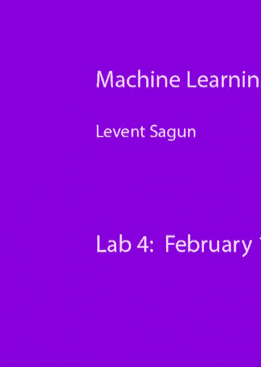
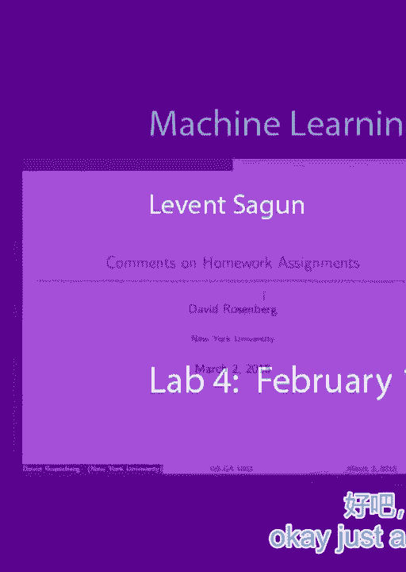
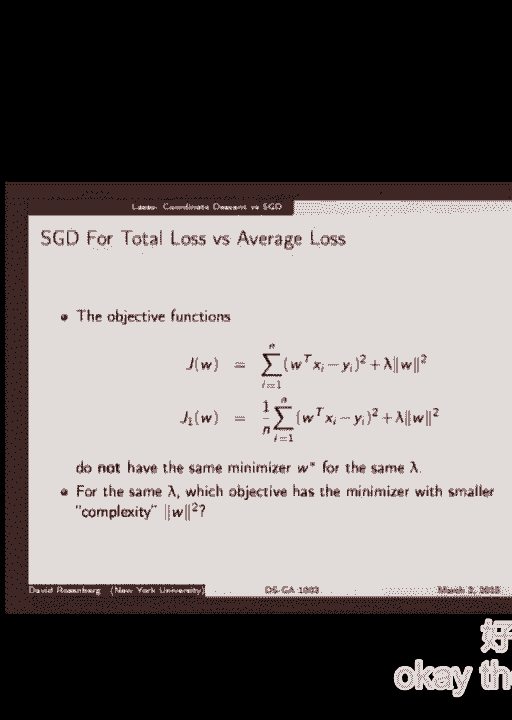
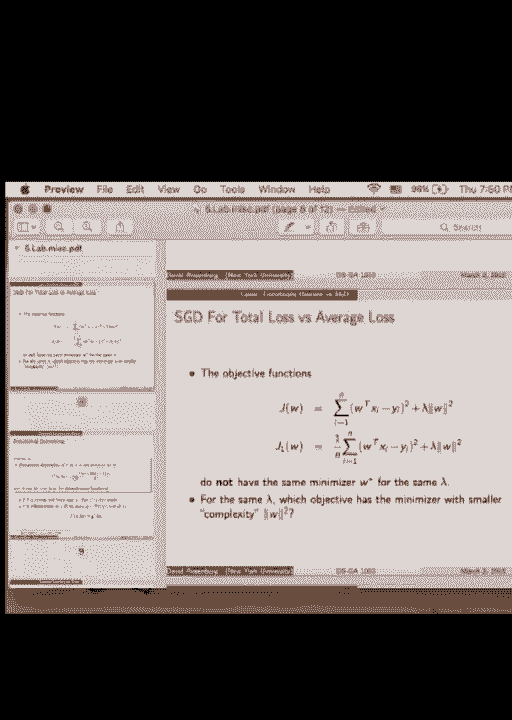
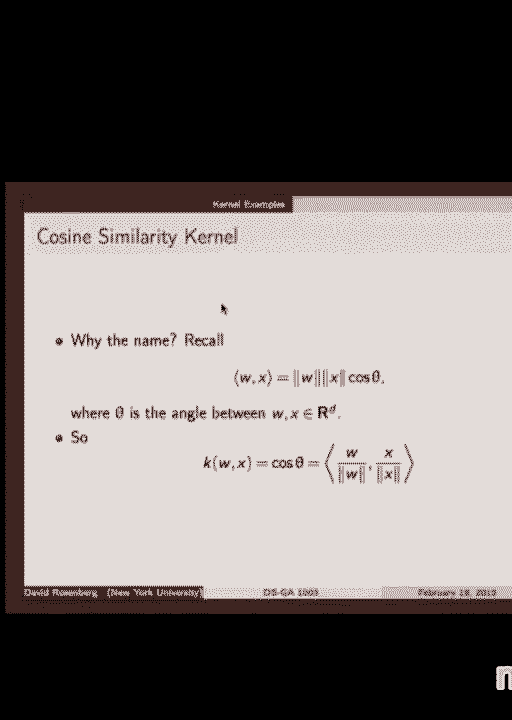

# P8：8.Feb_18_Lab - Tesra-AI不错哟 - BV1aJ411y7p7

好的。

只是几个提醒。今天不是2015年3月2日，我也不是David。所以不要采信这些信息。Zachary。David不在城里，所以今天由我代班。我们会回顾一下我们学过的内容，可能还有一些新话题，以及问题和答案。请随时提问，像往常一样。

我收到一个请求，要将我的办公时间改到更晚。你们有多少人支持这个想法？

有多少人反对将办公时间调整到更晚的时间？我想要调整。好的。没见过你。我的办公时间是周一到下午2点。提醒一下。那么，把它调到更晚的时间怎么样？比如4点或者5点。问题在于可用性，教室的可用性。如果我找不到这栋楼的教室。

我可能得去数据科学中心做。可以做周三晚些时候4点或5点，或者可以做周四晚些时候。有什么偏好吗？是的，先生。哪一天？周三？周三还是周四？周三5点你有其他课吗？好的。让我记下来。那么必须在周三之前。周三3点半怎么样？

周三4点或其他选择。那周四呢？你有课吗？在这个时间之后3点之前？什么？

嗯。其实是这个时间之后。是晚上8点。评分员的办公时间是周二。所以，周五有点儿棘手。是的，上学期我试过周五的时间，似乎没有人参加。周三4点可以，没问题。好吧，也许我应该做个投票。好的。哎呀。那么你在做作业的时候是如何调整你的系统的？通常是通过检查来调整。

你试几个方法。通常你最先尝试的东西不会奏效，所以你得再次调整，对吧？要么太小，要么太大。如果太大，它会震荡，给你随机的数字。如果太小，它就不动，不会改进。然后你找到一个转换点，再放大。一旦找到转换点。

我会在那个区域稍微试一下，找到最佳位置。你怎么确认某个设置是最优的呢？超参数调整是最优的。你可以通过验证集中的改进来检查。因为我们不关心训练集。我们总是可以让训练集的能量非常低，成本非常低。

但是如果它没有对应于验证集的改进，那就没有意义。验证集可以看作是泛化的表现。任务泛化得怎么样？

如果它不能很好地泛化，那就是记忆化。记忆化意味着它是过拟合或者拟合不当，这是我们不希望看到的。因此我们监控验证集，或者如果我们有测试集可以使用，我们也可以这样做。专业术语是，你要监控验证集。

可能在调优你的系统或做作业时会遇到麻烦。需要时间。还有什么问题吗？是的，这是个问题。但如果你确实需要低于双精度浮点数，那可能是出了问题。是的，这是可能的。我实际上没有检查作业的情况，那是另外的事情。

如果你有定义，具体情况是什么，我可以查找。从一般的理论角度来看，实际上我会从一个小的步长开始，逐步增加它，直到它发散。通常，在发散之前的那个时刻是你的最佳点。

这取决于你如何设置正则化。我们会在接下来的几张幻灯片中讲解。如果你设置一个非常小的lambda，那么正则化就没有任何效果。这就是为什么你需要从一个较大的lambda值开始。但它仍然取决于你的具体设置。所以大多数情况下你应该也要小心，因为如果你设置得太大。

如果你将lambda增加得太多，那么你优化的对象就变成了右侧的部分。第二项是正则化项，它会阻止你处理原始任务。原始任务是实际的损失。所以额外的项不应该太大，应该是一个有意义的值。例如，如果你有一些成本加上一些正则化，假设它是参数化的。

对于w。假设你有这样的情况。如果你选择一个非常大的lambda会发生什么？

会发生什么？它变成了零。为什么它变成零？

因为这个项意味着过了一段时间。唯一的贡献，优化。你的寓言将是这样的，且这个小的成本可能只是围绕它的微小噪声。所以一旦你优化了，咚咚咚，几步之后你会到达零点。但这是你的任务。你需要专注于这个。如果这个项太小会发生什么？

你只是优化这个，而没有进行正则化，因此你没有惩罚参数的非常爆炸性的值。所以对于步长，我会从一个较小的数字开始，然后逐渐增加。对于正则化参数，如果我知道解决方案是什么，我会从一个较大的数字开始，然后减少它，以找到两者之间的平衡。你还有其他问题吗？是的。

是的，这听起来像是符合直觉的东西。这也是你所熟悉的寓言之一。有时候你想比较两种不同的方法，结果看起来它们都在下降。然后似乎它们都做出这个形状，因此它不再是新鲜的。

我们并不完全知道发生了什么。但一旦你采用对数刻度，你会意识到这里实际上发生的事情类似于这样，用我们说的随机梯度下降，可能是这样的情况。梯度下降也是如此。所以在这个图中以前存在的这个小间隙，在实际图中变得可见，而在对数图中则不可见。好的，一些损失函数。

所以假设我们有总损失，我们没有取平均。我们不把J omega的表达式除以n样本数，那么会发生什么。计算很简单，因为微分是线性运算符，我们可以将微分运算符带入和式中，这是一个有限和式，所以我们可以这么做，对吧，我们可以交换微分的顺序。

和和式。如果它是无限和式，那么我得检查它是否在从旧到新的过程中收敛。但它是有限和式，所以我可以这么做，我将微分的顺序与求和的顺序交换，然后我得到第二个方程，这个方程给了我梯度。然后我可以简单地跟随梯度的路径。

所以从这个梯度J omega的表达式中，随机梯度下降的步伐是什么。那就是最后的方程，实际上最后一行没有回顾符号。所以最后一行告诉我，如果我想用随机的方式做事情，那么我必须朝着减去2倍W参数乘以输入的方向迈步，减去。

输出乘以输入，再一次。这将是一个向量。它的点积是一个数字，减去一个数字乘以一个数字再乘以一个向量。但如果你没有取平均值，如何比较这里的导数和那里导数呢？它们之间有什么区别？它们之间有什么不同？

对，但如果我有`1/n`，那仍然成立。所以我想要区分这两者之间的差异，这仅仅是选择`1/n`因子的不同。方向。嗯，这只是一个缩放因子，所以我可以加上`1/n`，然后得到相同的方向，对吧。想想它的大小。JFW的梯度之间有什么区别？

那么梯度步和随机梯度步有什么区别呢？分母。是的，它会更大，对吧。第一个会大得多，因为我取了梯度并将它们加起来。我加了n个不同的向量。所以这是n个不同向量的加法。也许它们会旋转然后回来。我不知道，但最终在平均值的期望值上。

事情之所以变大，是因为最终我在加上n个不同的向量，这将是总和，然后这些是小步骤。但我如果看梯度，我会取平均值。所以如果我在这个表达式前面有一个`1/n`的因子，减去梯度J omega的表达式，那么我将得到这个向量，这是总梯度，再除以n，对吧。

它们没有，所以大致就在这里。那就是平均值。所以在你在那座山区地形中迈步的大小上，两个的尺度非常不同，这取决于你是否对它们取平均。如果你对它们取平均，那么SGD和GD的尺度是可比的。

但是如果你不对它们进行平均化，那么它们是不可比较的。梯度步长通常要大得多，粗略估计是单个示例的步长的N倍大。所以这实际上是下一个幻灯片要讲的内容。那么，这个技术计算就是求期望值。我们为什么要取期望值呢？期望值是对随机变量进行的一些操作。

有某种潜在的分布。那么这里的随机变量是什么？

我原以为我们只有一些示例。我以为我只有一些固定的点。我以为我只有那些x1和xn。但显然我不能把它们当作来自某个未知分布的随机变量。这个叫做关键。所以x是按DP分布的，或者我们可以简单地说P。所以那些示例的确有某种潜在的分布，我正是从这些分布中选择样本。

一旦我对它们进行抽样，得到的样本结果就是这N个样本。因此，尽管我不知道P是什么，尽管我不知道潜在的分布是什么，我可以查看它们的期望值并进行比较。因为在GD和SGD中，分布是相同的。

因此，取期望值可以让我大致了解随机步长与梯度步长的大小。接下来我们继续做这个计算。现在我只是从上一张幻灯片中代入梯度的表达式。取期望值。同样，期望值是一个线性操作。并且我有一个有限和的求和，所以我可以交换求和和期望的顺序。然后我将期望值放到内部。

但我得到的是负N乘以这个表达式的期望值。也就是随机下降的步长。所以结果证明我们在板上做的直觉确实是正确的。期望值中，梯度步长的平均大小是随机梯度步长的N倍大。对吧？

只是一个简单的观察，你可以通过一些基本的计算来验证。那这意味着什么呢？

如果你不进行平均化，并且如果你想采取一次SGD步长，我们可以选择一个示例，然后将其放大N倍。也许它原本是这个，我们可以把它放大N倍，然后采取这个步长。对吧。这是一个可能性。我不确定这是否是最聪明的做法，但这是一个可能性。是的？[听不清]，你需要这一步与这一步相比。

你通常不会这么做。只是因为随机步骤，如你所见，它们有点嘈杂。如果你将它们放大N倍，它们可能会把你带到你其实不想去的地方。对吧？那样的话，它就不会给你正确的结果。那么，最终，为什么我们要使用随机梯度下降法？

这样做是为了节省时间。因为时间是一个重要的限制因素。我不能用梯度下降法训练巨大的网络。那样当然很好，但我们没有足够的计算能力。那将需要很长时间。你会朝着奇怪的方向偏离。所以每一次，想象一下，假如他们这样做。这将是这样的。采取这一步。它将是这样的。采取这一步。

它会像这样进行。所以在N步中，你想达到这个位置，但你不知道它会到哪里。[听不清]，是的。是的。[听不清]，[听不清]，是的。[听不清]，是的。[听不清]，是的。[听不清]，是的。[听不清]，是的。[听不清]，是的。[听不清]，是的。[听不清]，是的。[听不清]，是的。[听不清]，是的。[听不清]，是的。[听不清]，是的。[听不清]，是的。

[听不清]，是的。[听不清]，是的。[听不清]，根据我的经验，我认为你离原始位置有多远并不重要——如果梯度下降计算代价很高，你通常不会使用它。如果你负担不起使用梯度下降，而且你知道你的问题通常是很好的，在漫画中是那样。

这就是我们目前所拥有的，那么尽管如此，还是继续使用梯度下降。它在所有情况下都更加稳定，一致性更强。所以，好吧。让我们再看一下幻灯片。所以这只是重新写这个表达式，减号和乘号梯度。它告诉你会发生什么——你知道的，比较各种步骤。所以，你知道。

这次绕道的主要目的是让我们回到平均损失。所以，如果我想用相同的步长优化相同的东西，我可以使用平均损失。如果我有平均损失，那么我的梯度步长就会是这样，而随机步长则会是这样。所以它们会是那些小向量。

他们的向量大小将是相似的。SGD会有一些噪音，但它们的大小会相似。大多数时候，我想不出具体的例子，说明总损失会成为更好的损失函数，但大多数时候你会想使用平均损失。你会想使用平均损失。

所以除非有特定的原因迫使你使用总损失，否则我建议使用平均损失。而且平均损失还有其他各种优势，我们稍后会讲到，对吧？[听不清]，你可以。所以你是在说我可以通过N来缩放步长，这样我就能得到相同的结果。

然后如果你添加正则化，正则化的规模也会有所不同。但这是个好问题。你可以，存在同构性。所以这两个问题是相同的。我可以缩放步长，或者你知道，调整超参数。看起来这就是相同的事情，所以看起来是总损失。

为什么我会使用总损失和平均损失呢？对吧？

使用平均损失的主要思想如下。假设你有大量数据，成千上万的数据。而且它们实际上是重复的。那么会发生什么呢？

[听不清]，你在重复计算相同的错误。如果你使用总损失，会发生什么呢？

或者对比平均损失呢？是的，对吧？假设你有相同的东西。没有，x减去，假设。假设它只是x的平方，或者参数是w。假设你有w的平方。然后你有，好的，w x减去y的平方。你有两个样本。你将这个加上，w x2减去y2的平方。这就是你的损失。这是你的总损失。然后平均损失是相同东西的一半加上相同东西的一半，因为。

你有两个样本。如果你假设x1等于x2，y1等于y2，会发生什么呢？

在这个例子中，你的梯度步长将是这个的两倍，对吧？

这没问题。你的随机步长是多少？在这种情况下，你的随机步长，实际上平均值的随机步长等于平均值的梯度步长。在上述例子中，情况就不一样了。在上述例子中，随机步长将是梯度步长的一半。

所以这就像是你有一个抛物线，而在它上面还有另一个抛物线。你不是将它们加起来，而是对它们取平均，所以这不是一样的吗？

这会给你相同的结果。那么为什么这很重要呢？因为如果我有一些数据，它们之间有相似性，那么取平均，接着进行随机的梯度下降步长会给我与梯度下降完全相同的步长。因此，我可以节省时间，并且它们的下降方向是相同的。在这个例子中，还是这样。

你可以争辩说，如果我在第一个例子中将所有内容缩放为一半，我会得到相同的结果。但是如果你有来自两个不同来源的数据会怎样呢？

所以所有的抛物线要么在这里，要么在那儿，你将它们加在一起，就会有一些小的变化，介于两者之间。假设这是零的数据，这是你想要分类的一个的数据。它并不完美，假设是手写的零和一月。所以一些零有这个成本，而另一些零有那个成本。在一的情况下。

手写数字中的某些数字有这个成本，某些有那个成本。所以它们并不完全相同。而且你有30,000个这样的样本，且你有一个庞大的网络要训练。计算这30,000个样本的梯度将会非常痛苦。如果你取平均成本来看这个问题，实际上。

平均30,000个样本的这个问题，将几乎完全等同于只取一个来自这个的样本和一个来自那个的样本，再对这两个取平均。它将给你完全相同的下降方向。所以，通过仅仅进行一些计算，你就能节省时间和计算能力，而且你会得到一个几乎和梯度下降一样强大的方法。

这就是为什么在实际操作中，为什么呢？因为计算30,000个相同项目的和的梯度，速度是计算一个项的梯度的30,000倍慢。看，在这一步，由于你并不知道xi和yi到底是什么，计算这个就等于要计算这个的n倍。

如果你只需要计算一个项，那将节省你n倍的时间。它们很大。权重矩阵非常大，所以你可能甚至没有足够的内存来收集所有的梯度。是吗？[听不清]。拿你的梯度。[听不清]，[听不清]，在平均的那个，好的？

那么为什么要归一化梯度？[听不清]，所以如果你在一个总体上是不同的景观中，那么平均一个。如果你使梯度的范数相同，那么你将采取不同的步伐。就像在一个例子中。你有一个放大世界，普通人就像你知道的那样。

就像是格卢弗的巨大世界。你必须采取巨大的步伐才能到达你想去的地方。在另一个世界里，你是在一个微小的人类世界，所以你必须采取微小的步伐。所以你想跟随梯度的路径。那么重要的不是这个梯度是否与这个梯度相当，而是这个梯度是否与相同景观的随机梯度相当。

或者这个梯度与相同景观的随机梯度相比。所以固定一个函数，损失函数固定了你的景观，而那本身有自己的尺度。你要么在巨大的世界里，要么在微小的世界里。当你是一个八岁的小孩时，我们接近那个目标。

或者随机梯度倾向于是正常梯度，倾向于是梯度。是的。在随机情况下，它也会减小，但它是有噪声的。为什么会有噪声？

因为这里两个抛物线的和是另一个抛物线。你想在这里接近最小值。如果你碰巧从第一个例子中采样一个函数，第一个梯度会很大，它会把你推到另一边。这就是为什么在大规模问题中，人们通常使用带有小批量的随机梯度下降。

不是用大小为一的小批量，而是用大小为十、百，或者甚至更多，取决于问题。所以在这个例子中，如果我随机选择十个输入。假设我有三万个训练样本，我随机选择其中十个。然后查看它们的平均值。平均值将是对潜在函数的一个非常好的估计。

因为我知道通过选择大小为十的小批量，我几乎有很好的机会从两个类别中选择差不多的样本。而且它们都非常接近，几乎是一样的。这两个的平均值会给我一个非常接近这个景观的东西。所以通过平均，那个景观将只是它的一个微小偏移版本。

而随机步长将通过平移后的梯度来计算。实际的梯度将给我这个景观。所以这将是一个梯度步长。这将是一个随机梯度步长。但好的一点是它们非常相似，几乎是一样的。所以在这个例子中。

使用迷你批次大小为十时，随机步骤几乎会跟随梯度下降的步骤。这是一个巨大的优势。这就是它在实践中有效的原因。这就是为什么平均损失看起来更好。好的，如果你选两个，可能有更高的机会仅从第一类中选择。你也可以选两个，因为从长远来看，如果你一直选择两个。

其中一些将是平均值。例如，在数字分类问题中，这是一个经典例子，其中SGD比GD更有效，速度快得多。在这种情况下，你可以采用随机梯度下降，由于有十个样本，你可以采用随机梯度下降。迷你批次大小为100或128。标准值是128。好吧。

这之间的权衡是计算时间和你能够承担的成本。因为你想增加迷你批次的大小，但你不想增加得太多以免减慢计算速度。是吗？在这种情况下，当我们使用例如十个样本的迷你批次时，我们必须对超过十个样本的梯度进行平均。是的。然后再进行梯度计算。

取十个提交的梯度比取三万个提交的梯度要容易。这就是整个思路。其实非常简单。所以SGD背后的思想是数据中存在冗余。数据通常是以小块的形式出现的，我们选择其中很多，因此我们拥有大量的样本来训练数据。

训练系统，训练机器。如果存在冗余，SGD将表现良好，因为它可以很好地近似梯度。如果没有冗余，我认为在作业中，你遇到的情况是，大家大多数人发现梯度下降法找到的解决方案比随机梯度下降法更好。这是因为你使用的迷你批次大小为1。所以这个梯度会把你拉向某个方向。

这个梯度会将你拉向另一个方向，所以你无法在这里稳定下来。它实际上在这里来回反弹。你必须等很长时间，直到步长减小到一个非常小的值，才能看到这里的点。所以看起来它似乎花了更长时间。因为这个问题不是SGD的最佳展示例子，所以它不应该误导你。是吗？[听不清]，是的。[听不清]，你总是需要这么做。

因为如果你。[听不清]，不。你可以采取常数步长。那没有太大影响。[听不清]，[听不清]，所以如果你什么都不做，实际上就是步长为1，对吧？在这种情况下，你的步长是1。所以可能1是一个太大的步长，可能会发散。或者1可能是一个太小的步长，这真的非常依赖于问题。

如何对v进行约束？你的x和y分别是什么？如果你对数据进行归一化处理，预处理并使所有的x的期望值为0，标准差为1，这与将它们放大10倍是不同的。所以你仍然需要进行超参数调优，因为你不知道数据的规模。

所以它并不能帮助你免除超参数调整。显然，由于这两个函数的差异仅仅是1/n的因子，一旦最小化，它们的最小值点会在同一个位置。所以在域上，它们会位于同一个点。只是值会有所不同。

高度将会有所不同。但是点是相同的。如果你是正则化器，会发生什么？在这种情况下，会发生什么？在这种情况下，它们不在同一个地方。在这两种情况下，我只是加了一个正则化项，惩罚较大的权重值。现在，位置会稍微不同。

为什么会这样？好吧，我们来问另一个问题。我该如何改变lambda，以便两个损失函数的最小值点在同一个位置？

最小值是零？什么？大lambda？我可以把lambda设为零，但那样就失去了正则化。我想保持正则化。lambda乘以n。所以我可以修改其中一个lambda。现在损失函数依赖于lambda。对于第一个，让我们显式地写出依赖关系。lambda加总和加上。另一个则是总和除以n加上lambda的平方。

所以，如果我在这里，不是直接使用lambda，而是使用lambda除以n。这里我也有lambda除以n。那么最小值点会在同一个位置。但让我们退一步思考。在我指定这些函数之前，假设lambda是固定的。那么我有这两个函数。最后一行问题是什么？

这两个函数最小化后，哪个函数具有更小的复杂度？

哪个在lambda中的范数和w的参数范数较小？哪个？第二个？第一个？第二个，为什么？

因为我们有更高的组织性。是的，因为它具有更高的组织性。因为我们在正则化b的范数时投入了更多的权重，而不是在我们想要最小化的实际内容上。

这是复习部分的结束。

我们还有10分钟来讲解一些小的核方法。

同样的评论，这不是2015年2月18日。我不会回答之前主题的问题。是的。一般来说，假设你有一个函数乘以某个因子，那么我们只看第一个函数。如果我取lambda为零，会发生什么？那么就没有正则化了。无论w是什么，我都会找到它。我为什么加正则化？我加了，因为也许是碰巧的。

这里有一个不好的函数，它没有惩罚w的较大值。所以它会爆炸，并且会记住所有东西。我不希望它记住这些过拟合的内容，我想要防止这种情况。所以为了防止这种情况，防止这个函数爆炸，我加了这个项。但是，如果我最小化整个函数，我也希望最小化这一项。

所以它阻止了w的增长，阻止了参数的增长。所以在lambda为零的极端情况下，这个值可能非常大，可能会爆炸。那当lambda趋近于无穷大时会怎样呢？或者非常非常大时，lambda非常大时。Omega星将几乎为零，对吧？是的，几乎会变成零，非常接近零。

所以发生的情况是非常接近零时，根据之前的定义，它的复杂度很低，意味着它的范数很低。这意味着lambda越大，复杂度越低。这就是我们从两个不同函数中得出这个结论的方式。

因为第二个文本有更大的lambda。我们快速进行。当前的x将是文本空间，x将是一个文本示例。你昨天没有看幻灯片，对吧？没有。那么x将是一个文本示例。我们将提取特征，特征可以是从文本中提取的关键词。

比如Android出现了两次，Google出现了两次，IO出现了一次，等等等等。我们会回到这个文本。所以如果我们有两个不同的文本，文本示例，怎么比较这两者呢？我们希望找到一个距离的概念，想要找到两个文本之间的相似性对偶概念。

这可以是从负面评论中识别正面评论。因此，如果我找到了亚马逊上正面评论的好关键词，我实际上可以找到这两者之间的相似性概念。通过计算一个数值，我可以说这个非常接近正面评论。所以这是可以的。

另一个没有标签的文本将会是正面评论。如果它们之间的距离太大，那么我可以假设它是负面评论，对吧？你可以做类似的事情。所以你需要设计一个函数，它接受两个文本作为输入，并输出一个实数，来判断它们的相似程度。

这样做有多种方式。假设我们有以下两段文本，它们似乎来自类似的语境，我可以查看各种关键词的出现次数。现在我有了一些特征向量。我提取了这边七维的向量，另一边也有相同的文本。现在我将要比较它们。看起来它们的相似性在前两个元素上最为突出。

但是我怎么才能创建一个严格的比较概念呢？假设我规范化了我的向量。我做的是将所有元素平方后取平方根，然后将每个元素除以该值，这样就得到一个新的向量，下面是它的表现形式，这实际上就是规范化。这样它们的大小相同，所以现在它们变得可以比较了。

现在我能做的是，我有两个向量，它们已经被规范化。我可以取它们的点积，可以计算它们的内积。内积，记住，它给出的是两个向量在给定空间中的夹角，内积空间中。检查内积后，结果是0.85。

这在某种程度上表示了高相关性。最初开始的这两段文本有一些超出随机的相似性。这是一个很好的指示。看起来像是特征的内积。记得它们是通过某些关键词的出现次数提取的。在这种情况下，内积似乎是一个很好的核函数。所以，核函数是将两个输入转化为一个数字，大致比较并衡量两个对象之间的距离。

好的，这是一个小小的提醒，一些线性代数的知识和内积。所以在我们继续之前，你知道内积空间、范数空间和度量空间之间的关系吗？

所以我们想要创建一个角度和距离的概念。根据这个方程式，这里第一个方程，我们有角度的概念，因为这里有这个余弦 θ，对吧？

我们知道它与它相关，因为它只是衡量 θ，它必须是两个向量之间的角度。但它也有范数。它有 v 和 x 的范数。那么，是否意味着每个内积空间都有范数？就这点而言，它确实诱导了一个范数。所以，如果我在空间中有一个 x，并且定义了一个内积，

然后我可以定义一个由内积诱导的范数，表示为 x·x。这意味着每个内积空间实际上都是一个范数空间。反过来，我可以利用范数定义一个度量空间。这意味着每个范数空间都是度量空间。所以，如果我看所有内积空间的集合，

它们会是最小的，因为内积意味着范数。所以这些将是范数空间。而这又意味着度量空间，度量空间更大。反过来关系也成立。并不是每个度量空间都是范数空间，并且不是每个范数空间都是内积空间。那么，为什么这很重要？是的。

度量空间是你可以定义距离的空间。你手上唯一拥有的就是距离的概念。它们都有各自的假设，我们不需要深入探讨。我们需要理解的唯一一件事是，度量可以是一个非常模糊的概念。只要你能描述一种距离，它就可以是一个度量空间。

但是它不会像范数那样刚性。范数更特殊。范数给你一些特定的缩放性质，例如。如果你拿一个向量，乘以二，那么它的范数应该是原来的两倍。在度量空间中不一定要求这样。所以范数空间更刚性。在内积空间中有什么额外的东西？

让我们来解答这个问题，然后就完成了。范数空间有点刚性。它有与常数成比例的距离缩放。正如你所说，内积空间有额外的角度概念。所以现在每个范数空间都必须具备角度的概念。

但作为度量空间的内积空间，除了具有距离外，还有范数的刚性。最重要的是，它具有距离的概念，和角度的概念。这就是为什么我们有第一条公式的原因。也正因如此，我们可以将两个文本进行比较，查看它们的相似性。这也是为什么内积空间将成为处理核的合适空间。

接下来会讲解更多关于核的内容。谢谢。

[BLANK_AUDIO]。
