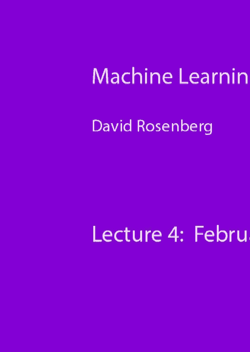
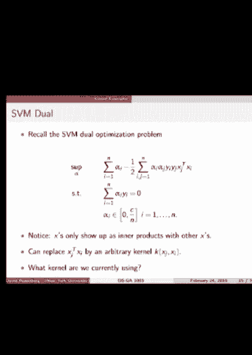
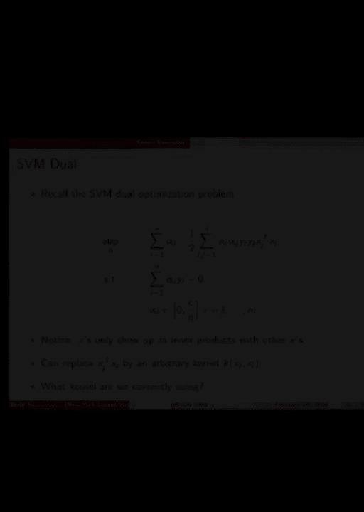

# P9：9.Feb_24_Lecture - Tesra-AI不错哟 - BV1aJ411y7p7

所有的权利，让我们开始吧，让我们开始吧，谈到了核仁，周三有一点，周四有一点，今天我们真的要把核仁吃完，我们可能有一些时间开始在一些树上，明天我们再把树修整好，明天我们还将公布考试题目，第一次一小时测试。

离明天还有一周，我想公告到此结束，所以项目组是那些来的人，好的，把你的小组放在一起，所以截止日期是星期一，我知道那是作业到期的同一天，所以我想，我打算把项目组的最后期限改到星期二。

我不知道这实际上有多大帮助，但只是为了把它在我们的脑海中分离出来，就这样好了，让我们开始吧，所以我们要回顾一下内积和希尔伯特空间，只是挑挑拣拣，我们需要潜入内核，事实上，你可能遇到过的是一些条件。

当你可以得到，所以如果你为一个规范写下一个特定的表达式，一些应该给你的东西，向量的量度，这学期到目前为止，我们在规范方面做了什么，基本上有两件事，l 1和l 2正好l 1和l 2正常，所以你可能会说。

好的，我们能把L1范数写成内积的平方根吗，在向量和自身之间，所以这是更普遍的，问题被给出了一个规范，它可以用内积来写吗，答案是由平行四边形定理给出的，也就是说，如果规范遵守这一点。

你可以用几行字证明的表达式，但我们不会，是呀，事实上，它可以用内积来写，内积的表达式是由偏振恒等式给出的，你不必记住这一点，尽管您可能需要在某个时候应用它，嗯，所以说，我们看到这个的主要原因是因为。

这就是如何证明l one范数不能写成um，向量与自身内积的平方根，所以说，我强调这一点，因为我们今天讨论的整个理论都是关于内积空间的，这告诉我们，这并不适用于涉及1范数的事情，这就是为什么这是相关的。

但它绝对涉及L 2范数，众所周知，L 2范数是我们内积空间的典型例子，来自规范的内积空间，可以这样写，好的，所以现在有一个关于正交性的词，所以我们有这个，你知道的，两个向量是正交的，如果它们的内积为零。

我们可以这样写x垂直于y，我们有我们概括一下，我们说x正交于一个集合，s，如果x与集合中的每个元素正交，非常标准的东西，然后给出正交性，我们有一个简单的定理，你们在高中或初中都知道。

也就是毕达哥拉斯定理，所以如果x和y正交，那么x加y的范数平方，等于x平方的范数加上y平方的范数，证明是微不足道的，我们采取这种规范，我们使用我们用于规范的定义重写它，它是向量与自身的内积。

然后我们用线性来扩展这些版本，所以我们用自己得到x，x带y，y与x和y与自身，当然我们假设x和y是正交的，所以x和y的内积都为零，所以他们退学了，我们只剩下，所以我们有毕达哥拉斯定理，现在很好。

我们将从内部产品空间中使用的主要内容，他们给我们的主要东西之一是预测，所以粗略地说，投影假设我们有一些，我们有一个向量空间中的向量x，内积空间，让我们假设我们有一个子空间，m，子空间是什么，几何上。

你应该想象一个穿过原点的飞机，除了它可能在更高的维度，这就是画面，所以我们说，如果这个子空间中的m为零，那么m是投影，那是一个点在平面上投影的表征，它是平面上离那个点最近的点，所以在数学中。

我们说m零是投影，如果规范或这是，你可以想到两个向量之间差的范数，就像这两个向量之间的距离，所以x减去m的范数，有点像x和m之间的距离，如果少于，或者等于此子空间中任何其他m的x与m之间的距离。

那么在m中的所有东西中，m 0是最接近x的，好的，这有点粗糙，我马上画一幅画，现在我们要讨论希尔伯特空间，我为什么要提到希尔伯特空间，所以我们从基本线性代数中知道，我们所说的x在m上的投影，它确实存在。

换句话说，其实有一个最近的点，不是每个最小化问题都有解决方案，但当我们在有限维的时候，这个投影就存在了，当我们扩展到无限维空间时，不附加任何条件，预测不一定存在，可能没有最近的点。

但是如果我们在这些空间上加上一个额外的条件，一种叫做完备性的东西，那么预测确实存在，那么什么是完整性呢？我们说一个空间是完整的，如果所有的koshi序列收敛，也许你还记得分析中的这一点，如果你不这样做。

这很好，这是技术细节，那不会是核心，所以定义，希尔伯特空间是一个完整的内积空间，所以如果我们有一个有内积的东西，它是一个内部产品空间，它也是完整的，那就是希尔伯特空间，那让我们先等一下，我应该说。

我们已经有了乘积空间中的任何有限维，也是一个希尔伯特空间，所以我们所知道的关于内积空间的一切都延续了下来，当我们谈论希尔伯特空间时，所以我们要在希尔伯特空间中使用的主要内容，和内部产品空间。

有限维内积空间，这就是所谓的投影定理，这就把我之前说的话正式化了，所以让H成为希尔伯特空间，设m为h的闭子空间，那么对于任何点x和h，我们想取，子空间中存在唯一的m零。

它至少与子空间中的任何其他空间一样接近，那个点叫做投影，或者它们的或x到m的正交投影，此外，这是一个非常重要的刻画，那种残留，所以如果m零是x在m上的投影，剩下的是，那和m是正交的，让我画一幅画。

让我们画我们的子空间m它就像一个平面，我们投影的点在这里是x，让我们把这个做成原点，这可能是向量x投影，我们称之为零，让我们把m写在这里，x减去m0是这个矢量，这个定理说的是x减去m为零。

我们会再回到那张照片上几次，我们得把这些字母擦掉，换成其他字母，所有的权利，所以在图片中，这意味着这个向量的长度，x在数学上大于投影的向量m零，如果m零是投影，那么是的，m零的范数小于或等于x。

这是任何人看到如何证明这一点，你当然这么容易，这是毕达哥拉斯定理，所以让我们从X开始，让我们把它重写为m零加x减m零，什么都没发生，但对，我们现在采取的标准是完全一样的，m零是x的投影，也就是x减去m。

这家伙与空间M中的一切都正交，所以x-m0与m0正交，零在空间中，现在我们可以应用毕达哥拉斯定理，所以我们有m的平方，加x减m 0的平方，那就是平等，让我们稍微重新安排一下，把左边的m 0。

我们得到这个等式，现在我们可以去掉x-m的平方项，然后我们得到这样的不等式，所有的权利，所以这是一个非常简短而甜蜜的证明，证明预测减少了规范，它使用毕达哥拉斯定理，正交投影定理，所有的权利。

这就是我们从希尔伯特空间理论中所需要的，其实，对此有什么问题吗？好的小M大M的定义是什么F是什么，闭子空间是什么意思，或者这是什么发生了什么，如果它不是线性的，它不是超平面，别的东西。

所以这特别适用于扁平的情况，子空间是平坦的，仿射函数就像一个潜在地远离原点的子空间，所以一条穿过井的线是那么清晰，如果你取一个子空间中几个向量的跨度，几个向量的跨度总是包含原点，跨度有多大。

跨度是一组固定向量的所有线性组合的集合，正确的好，一个线性组合全是零，所有的零都给你零向量，因此，每个子空间都包含零向量，每个子空间都经过原点，所有的权利，这是一个很好的评论，我明白了，好的。

所有的权利，所以子空间又是，我把它们想象成穿过原点的平面或超平面，它们是向量的跨度，仿射空间或仿射集，潜艇，子空间中的点集，加上一些偏移矢量，假设你有一个子空间调用f，对于该子空间中的每一个向量。

你加上一个固定的向量，比如三个逗号五，如果我们在二维，我们将子空间中的每个向量平移一个固定的量，而结果集不，一般要经过原点，但是结果集叫做仿射空间，仿射空间也是不弯曲的，当你翻译时。

它的形状没有什么变化，所以子空间是平坦的，仿射空间是子空间的平移，所以这不是仿射空间的问题，我们不是投射到仿射空间，一般仿射空间，我们专门投射到子空间上，它们是通过原点的仿射空间。

所有有限维内积空间都是完备的，因此都是希尔伯特空间，是呀，所有的权利，所有的权利，所以让我们通过内核方法，所有的权利，所以我要再试一次，激励内核方法，所以让我把它放在一些上下文中，到目前为止。

我们已经讨论了很多学习的方法，我们做了线性回归，岭回归，套索回归，支持向量机，感知器，感知器，我想到目前为止这些是主要的，好的，那么所有这些东西有什么共同点呢，他们的假设空间都是一样的，所以输入空间x。

我在这里加了一块，它是从X到RD的特征图，所以直到现在，我们总是直接研究x，假设x等于dm，rd，让我们在这里放一层间接，现在输入空间是抽象的，但是我们从x中提取元素并将它们映射到rd，使用此特性图。

PSI这种是齐头并进的，最后一课，我们刚才说的功能，所以现在我们把功能直接放在这里，所以在这个提法中，到目前为止，我们谈到的所有假设空间都是由映射的函数组成的，x的线性函数的输入x。

所以w转置x的psi，在这种情况下，所以不再是x的线性函数了，现在，我们在做x的PSI的x的特征性的线性函数，清楚了吗，我们的一些方法说岭回归，如果我们如果我们在做惩罚方法，那么是的，假设空间h。

但有时如果我们做一个硬约束，就像L2常量不能大于1，那么假设空间本质上是这个h的子集，但所有这些，所有这些方法都从h中提取函数，线性函数外，有一个概括，我省略了，任何人都可以看到。

我们实际上已经谈到了假设空间，比这个更一般一点，你看到我改变了什么吗，再说一遍，是啊，是啊，没有偏见，我把这里的偏差去掉了，所以这是一个假设空间，函数没有偏差，但我们已经讨论过解释这一点的方法。

我们如何通过使其等价来包含函数，假设的，等价假设空间，使用这种配方，那在调整，为什么这么只是在功能上，当然你可以添加一个功能，所以x的PSI，我们可以控制这个特征图，添加一个额外的功能，它总是一个。

然后实际上这个广告偏见是对家庭作业的讨论，所以你应该很熟悉这个，好的，伟大，我们上周讨论过的一个表达线性模型，我们想有很多功能，我们需要一个高维特征空间，把所有不同的非线性相互作用和饱和度，和非单调性。

我们在实际中观察到，我们希望在预测函数中编码，但在线性模型中并不存在，所以我们需要把所有这些转换放入特征空间，所以这最终会得到一个高维特征空间，所以我说的是得到一个表达假设的空间，使用线性模型。

我们需要高维特征空间，我在这里说的表现力是什么意思，好的，详尽无遗，穷尽的手段包含一切，所以我不想走那么远，所以当人们说一个表达性的假设空间，他们在谈论大的假设空间，一个假设空间。

可以包含许多不同类型的函数，你希望其中一个非常接近你试图实现的功能，所以我们希望有非常大的功能空间，他们有两个问题，第一个问题是潜在的过拟合，第二个问题是，它可能需要大量的内存，计算成本可能会非常高。

那么我们如何处理这里的第一个问题，正规化极大极大，所以我们已经谈了很多关于如何处理第一件事，所以我认为这不是一个实际的问题，我们知道如何处理这个问题，两个内存和计算成本，你知道的，如果您有一个功能空间。

那是一亿个功能，它越来越大了，所以我们不小心，我们会遇到内存或计算问题，所以我们今天要讲的，核方法，核方法，在某些情况下帮助二号，我们会发现在实践中是什么样的。

它们实际上有帮助的地方主要是我们使用L二正则化的地方，他们在一个正规化方面没有帮助，不清楚如何在一个正规化的情况下使这些帮助，我们的方法之一是L二正则化，快速复习考试，脊和SVM很棒。

这就是我们到目前为止所说的使用l 2，对设置有什么问题吗，在我们说方法可以是Kerli之前，我们已经有了这个定义，所有对输入点x眼的引用都发生在内积内部，所以在我们的特色版本中，对x的任何引用。

对输入空间x元素的任何引用都嵌套在内积中，X或X的FIE特色版本，或输入元素的，这个这个这个物体，x的PSI内积，Y或Y大小的圆周率，是特征函数，它经常发生，我们称之为，我们重写它。

因为这个叫做内核函数的东西，所以说，而核函数从输入空间接受两个输入，记住现在的输入空间是抽象的，它没有，这不是RD，它只是任何东西，可能是两首歌，可能是，嗯，两张不同的照片和，它会给你一个号码，所以说。

考虑核函数的一种方法是将两个对象之间的相似性分数，所以这个想法是，如果两个物体更相似，对这两件事的内核评估会更大，我不想说比这更正式的话，因为这真的是一种心理工具，但这是考虑内核的一个相当安全的方法。

给你一个分数，说明事情有多相似，是啊，是啊，我们要分析什么，为什么是的，所以我写了Y，那可能是个糟糕的选择，所以我写x和y在输入空间中，所以这个真的应该，写x 1和x 2或者x和w会更好，很抱歉，是啊。

是啊，清楚了吗，这个y不是输出，那样写是个错误，它们都是输入空间的一部分，其他因素就像走得更多，就是这个意思，就是这个意思，所以你的直觉来自RD，是啊，是啊，所以如果。

如果所有向量都归一化为具有相同的长度，然后是的，它与向量之间夹角的余弦有关，所以如果我站出来说，让我们定义一个相似度分数，叫它K，让我们只编程一个或设计一个，让我们集思广益，如何测量相似性。

你可以想出很多办法，所以内核很特别，因为捕捉相似性的不仅仅是任何旧乐谱，以一种方式捕捉它，那实际上是一个内积，所以我们可以，我们用相似度评分，可以写成内积的东西在数学上有很多好处，这就是我们要利用的。

你不能只拿任何你想描绘相似之处的旧分数，并将其用于我们将要开发的机械设备中，所以好吧之间的关系，所以psi是x的psi是x的特性版本，x在某个空间中，可以在任何空间，X的PSI特别在井中，就目前而言。

比方说当你在电脑上编程时，您实际使用的是您输入的特性版本，在研发中，这就是你应该认为的X的PSI，直到上周我们只是，我们在处理原始的X，但我们也假设x在rd中，所以我们在这里，我们增加了一个额外的步骤。

我们现在说好，让我们想象x不一定是rd，它在别的地方，一些抽象的空间，现在我们要把一个新的函数，它把它从抽象空间带到我们的特征空间，就像RD一样，好的，角化有什么好处呢，计算。

我们要做的一件事是访问无限维的特征空间，这是你通过角化得到的一个有趣的东西，最后一件事是，它允许你重新构建你思考事情的方式，更多地从两个向量之间的相似性来思考事物，而不是仅仅以单个向量为特征。

从某种意义上说，它们可能是等价的，但也许在某些情况下，编写内核比编写特性更容易，你还记得两节课前在支持向量机里，嗯，我们写了双重SVM问题，我指出，X只出现在内积方面，与其他X，所以这将是。

所以它实际上是SVM的内核化，因为它只取决于x的内积，所以两周前我们已经做了第一次角化，今天我们要看看一些工具，让我们更广泛地这样做，所有的权利，所以这里是，下面是SVM目标函数，对呀。

我们有一个正规化术语，然后这种平均损失期限，我们发现极小化有这样的形式，你记得从对偶W星是输入的线性组合，我想你在作业中也看到了这一点，所以说，事实证明，这种实际形式的解决方案发生得更广泛。

不仅仅是为了SVM，有一个叫做代表定理的东西，这是一个很好的小定理，我们要证明，事实上，这将使我们能够在更广泛的背景下得到同样的结果，是一个有趣的结果对吧，有点好笑，好像很好笑。

你的解w星只是输入的线性组合，也许令人惊讶，所以我们所说的功能图PSI，所以我们有一个输入空间x，它没有结构，没有关于x和我们称之为h的特征空间的假设，我们假设这是一个希尔伯特空间，通常银色空间是RD。

但我想让它像H一样一般，给我们更多的灵活性，我们可以把它放在那里，例如，我们可以有r无穷大，从x到h的SI映射，所以让我们用这个特性映射来编写SVM，什么改变了，现在另一件事改变了。

而不是w转置si x，我现在用尖括号写这个内积，我这么做的原因是，是因为我不再假设x或w的psi，欧几里得空间中的欧几里得向量，它们只需要是希尔伯特空间或内积空间中的向量。

所以我们可能要写一个新函数来学习如何取内积，在这些东西之间，它可能不仅仅是标准的点积，所以一点点抽象，有一个问题，小小的改变，我还有什么W的范数，那么W住在哪里，W是什么样的物体，w是h中的向量，它是。

它不再是，所以说，我们如何定义，现在我们在元素与自身的乘积中使用通常的常态定义，好的，所以好吧，所以作为一个回顾，预测是什么样子的好吧，我们解决了这个最小化问题，我们得到w星。

我们想对一个新的X做一个预测，我们应该用什么数学表达式，好的，星星的PSI再多一点，x的w星psi，我们就说x，因为我们想预测一个新的输入，X又来了，好吧，我们就用分数吧，非实际类。

我们需要一个内部产品，对呀，w星和x的psi都是向量空间中的向量，不能只是把它们相乘，这是我们在内部产品空间中没有的操作，乘法运算，所以拿着他们的内产，所以这是x的f，所有的权利。

所以如果我们知道内积是什么，我们就知道如何进行预测，所有的权利，所以现在我们要概括一点，这是我们的SVM目标，让我们把这个说得更笼统一点，然后我们会试着证明我们能做什么，用更通用的版本，所以说。

索赔是这样的，这里先有一个广义的目标函数，左边，第一项是我们正则化的一种推广，所以这里我们有一个w平方的半范数，用w范数的函数r代替它，所以当然SVM是正则化的部分是一个特例，好的，第二块呢。

损失的那块，所以这个函数l包含许多项，每个数据点需要一个条目，我们喂的是什么，现在让我们看看SVM的顶部，在求和里面，对于每个i的1到n，所以你看到这个铰链的SEO品牌总结了吗，内积损失。

etc是这些内积中每一个的一般函数l的特例，它清楚地表明，可能是一半或者点头，什么，是啊，是啊，我停止了，为什么，为什么在哪里，我有个很好的问题，为什么我被编码，可以在l里面编码，没错。

为什么要代表组织，还有其他功能，所以耶，那么为什么我把归一化项表示为正规w的r，还有什么选择，所以我可以写平方r，在乘积中w的根和它自己当然可以，但我们已经定义了规范，所以它是等价的，这就是答案，好的。

好，是啊，是啊，确切地说，这个范数是由内积诱导的范数，这是正确的，这是正确的，因为这就是我们在内积空间中所能使用的，除了规范，我们什么也做不了，这可以通过空间中的有限损伤来使用，是啊，是啊，保持。

暗示着，内积总是取两个向量并返回一个数，是啊，是啊，如此正确，所以问题是，无限怎么做，我们怎么可能有无限维度的东西，这是因为只要它们都在一个内部产品中，一切都将以单身告终，任何内积最终都是一个数字。

输入是有限维还是无限维，这是正确的，我们不假设我在求和，我们不假设我在求和，以下是假设，所以这里有两个假设，我们的需要，所以r定义在大于零的数字上，y，规范是非负的，所以r是从非负实数到实数的映射。

它必须是不减少的，让这里的一切都滴答作响，所以这一半的平方肯定不会减少，关于非负实数，我们要用它，这意味着什么直觉直觉，对于范数更大的w，我们希望正则化更大，这么小的标准，就像我们一直做的小标准一样。

你知道的，更简单或不太复杂，不太可能过度适应更大的规范，更有可能过度适应，我们想惩罚这一点，所以我们想确保惩罚随着w在规范中的增长而变得更大，这就是我的动力，另一方面，完全武断，所以是的。

我们在问你什么时候换你的lambda而不是穿上它，穿上它，是啊，是啊，另一部分，为什么你还吃W喜欢的标准，那不是真的，嗯，它是等价的，我是说，所以问题有时在SVM公式中，就像这里，事实上。

我们把右边的常数C，失去的期限，但它是，它是等价的，我是说，对于W上的lambda，有一个等价的公式，基本上不管是C还是lambda，不管是在第二学期的第一学期。

它所做的就是控制这些术语在目标中的相对权重，所以你知道，如果我们按相同的数量缩放两个项，最小值一点也没变，如果我们把正则化和这个损失项各乘以一百，最小值的位置，最小值变化，是呀，但最小值的位置不变。

所以绝对规模并不重要，只是它们之间的相对比例，在这种情况下，你可以把乘数放在第一项或第二项上，好的，是啊，是啊，是啊，是啊，它擅长什么，我可以做任何我们想做的事，因为它是武断的，我把它放在那儿了。

我们把它放在那里是为了捕捉损失的概念，所以它是它拿着，这是泛化，铰链损失的经验风险，在这种情况下，所以一般来说，这将是一个看起来很像数据平均损失的东西，是啊，是啊，计算无限维内积会引起一点计算问题吗。

当然，除非有诀窍，否则我们不能做到这一点，会有一个把戏，如果没有诀窍，我们就做不到，在某些情况下，有一个诀窍，这就是为什么我，这就是为什么我，这是一个L，清楚了吗，所以l是一个任意函数。

所以我们可以在Y眼睛中明确地构建L，这正是我们必须做的，这是正确的，你不能改变改变的东西，因为我们只做这个优化，一旦我们观察了我们的数据，最小化是超过W，所有的x和y都是固定的。

他们就像他们可以内置到L，再说一遍，拜托了，是呀，所以这个东西绝对适用于岭回归，对了，你可以找到一个L，使这个损失脊，你可以找到一个R，使L 2损失，是啊，是啊，这是个好问题，什么类型的对象。

l的定义域是什么，l的定义域是rn，所以你不能把一个w粘到rn中，w生活在另一个叫做h的空间里，好问题，我是说如果我们，如果它是一个固定的W，我们可以对W的范数进行编码，就像它只是一个数字。

但它的W不是固定的，我们在W上最小化，所以w需要，我需要依靠W，在这种情况下，所以是的，所以来自r定义域的is是r，是呀，为什么不从R到R W右的范数，w是w的范数总是非负范数是非负的，所有的权利。

这种形式的倒退也是如此，已经有人指出是的，这就是这个案子的原因，是啊，是啊，这样的一半，如果x的r是x的平方的一半再说一遍，乘以，如果有一个lambda，在那里，是呀，伟大，你明白了吗。

如果我们如此记得，我们总是用实际的声音来惩罚，说我两个，我们真正的意思是L2范数的平方，对呀，对我来说，但如果我们真的想用Just DL 2范数来惩罚呢，这是否符合这个框架，当然只是不平方。

所以在计算上是合适的，这有点挑战性，这就是为什么我们通常不这样做，好的，套索回归呢，这是否符合这个框架，否，因为这就是我之前警告过的，也就是，我们没有办法写出一个l-one范数，作为内积，如此正确。

没有，没有内积，没有特征图，或者没有内部产品空间，可以为我们提供作为，作为诱导范数，这不适用于套索，让我们看看现在几点了，所以我们将陈述代表性定理，休息一下再证明给你看，好的，那么代表性定理是怎么回事。

这里我们有，我们取了广义目标函数，我们称它为w的j，这正是我们在上一张幻灯片中讨论的事情，和以前一样的条件，所以这里是，代表定理的实质，这个目标函数有一个最小值，它有这样的形式。

它是输入的特征版本的线性组合，与SVMS的结果完全相同，但现在它适用于这个更普遍的目标函数，其中包括岭回归，疯狂，正则平方根，l，两个规范正则化，您想要的任何损失函数，结果将在下一张幻灯片上证明。

让我们休息十分钟，所以八点零七见，现在我们可以用y i x i，我知道你必须坚持，所以我想这就是它的多少，只是，什么什么，好的，伟大，谢谢，所以随机很棒，呃，所以它是铸造梯度下降，所以当你有，所以说。

你在重复内右，所以在循环中你有，你把每个样本点作为一个步骤，然后你就这样，但是你如何比较，我是说，你如何比较呃的损失，随机梯度下降和呃梯度的损失，呃快速梯度，因为看起来，所以如果你做一千次迭代。

那么你有一千个成本值，但梯度也是如此，似乎如果你做了一千次迭代，然后你有一千次，您拥有的实例数，所以你说的最后一句话叫纪元，史诗，你有一千个史诗通过整个数据集，是呀，那倒是真的。

那么你认为什么是比较公平的方式，那是什么，或者你可以看看，你可以看看损失，在每一损失结束时，或者每一个的结束，在每一部史诗的结尾，你可以你可以，或者你可以，有些人做得一般，好的，所以就有了。

没有像标准的温暖，我是说，我我不知道，我比较它们的标准方法，我不知道有什么标准的方法，他们都没什么不同，我想我明白了，但是，但重要的是要认识到，你不能比较SGD的两个步骤，到GD的两步，那就太疯狂了。

只要你看到那没有意义，那你的身材就很好了，是啊，是啊，嘿嘿，最近怎么样？好，是啊，是啊，一些家庭作业，但对于第一个错误来说是第一次，或者为什么连这个，和，是啊，是啊，所以你是怎么写的很有趣，你想去吗。

这不是我们试图最小化的，但你们很多人都有，为地段而去的国家，好的百分比错误是当你有分类问题时，百分比误差很明显，你做错的事情有多少，那是百分之一的误差，没有百分比错误应该与这里无关，你只关心，呃。

我是说你，你只需要拿走，你只是想要的方式，这里你想要错误，我不知道，我不明白你在说什么，所以首先有，没有散步是非常是的，好的，是啊，是啊，所以我不想喜欢这里迷路的人，答案是很多，我不想开始任何。

它看起来有点，我只想要我不同的方式，一人一个，是啊，是啊，它的输出是权重，这是正确的，是啊，是啊，你可能有兴趣看看随着时间的推移而损失，但那是一个不好，你们两个都很有趣，一个是训练，所以这里，我是什么。

这就是我的生活，嗯，那很好，也因为如果你想看看，你的功能是第一步是，我们想最小化这个函数，这就是为什么我想，是啊，是啊，所以你看起来，这真的是耶，正是这样跟踪，这是有道理的，但在一天结束的时候。

你想知道你的，是啊，是啊，我们就会，是啊，是啊，因为我们对零损失很感兴趣，对呀，我们真的想知道我们做得怎么样，我们做对了多少，我们错了多少，所以是的，百分比误差是评估它的正确方法，关于一个新的数据集。

非训练数据，关于验证数据或测试数据，是啊，是啊，测试是的，只是一个大问题，只是别的东西，我的茶从零开始，我曾经在这里，是啊，是啊，是啊，是啊，是啊，是啊，遍历每一行，是啊，是啊，我将在每行添加一个团队。

但当我开始另一个时代，是啊，是啊，他应该又从零开始了，应该是，是啊，是啊，因为它计算你走了多少步，所以在这里，当我泡茶的时候，还有这个茶，和我们说的一样，我是说，通过所有的迭代，包括所有最。

以及一种方式来描绘它，我帮我记住了，在某些情况下，你没有一组固定的数据，你有无限的数据，是啊，是啊，这是在线设置，您可以不断获得新的数据点，在这种情况下，你会不断增加牙齿，事实上，您只有有限的数据。

你一直绕着一个，你可以想到这只是一个小问题，你是在骑车，而不是直接浏览一长串清单，所以T，是啊，是啊，不断增加，在这里，我们随着规模的增加而增加重量，我们正在缩放，所以，然后我们就进去了，我不想移动W。

然后我会这样对Y，x，是的，我会做的，但是是的，但在这种情况下，我不必，我是说，说你在做这件事意味着你是自由的，所以你不必自己重订这个，如果您将此新更新用于，您正在通过隐式重新缩放。

这并不是说它是含蓄的，它的缩放是在S T，再加上一个ST是这样做的，是啊，是啊，所以我不需要做，嗯和W，我是说这个W是一样的，这个不行，所以这是这个表情，这是一个大W，这是一个小W，这是重要的区别。

好的，所以我会，我的新更新将与这些W，但这会变成，它是，所以说，有什么意义，如果我需要走到最后，而且那个，坚持住，什么是，让我们分开，你应该做什么有什么意义，我不想移动W，因为那需要，让我们精炼一下。

那有点，让我们精炼一下，它的W有很多很多条目的，这是一本大字典，你不想做的事，必须改变每一个条目，当你缩放w时，你必须改变，如果你有一点W，当你重新缩放时，你必须改变每一个条目，所以说，你想避免这样。

但你在这里加了，你在改变什么，但不是一切，你为什么不改变一切，如果您正在更改此W，因为你和不，否，否，别担心那个，我只是在这个方程上，这里，你不是在做，嗯，我们我们是，我们正在添加一些东西。

但不是对着W，因为你不在W，我们在改变一些英寸，否，是啊，是啊，我们正在增加一些计数，关键是xj是稀疏的，所以我们只是增加了在xj中出现的wt元素，所以它是，没有那么多，这个不行。

这这我必须做点什么来看看，你得到这些并理解这一点了吗，是啊，是啊，所以你知道这是怎么回事，就像冷的部分，我不知道我是否应该做这个代码，因为我想如果我用这个是因为它是，不是那样的，除了我。

我必须像这样转换我的W，你没有，你永远不会在这里计算小W，是啊，是啊，你从来没有计算过，你只要计算W，I don’我不喜欢，这是一个新版本的井，不仅仅是W，不仅仅是大写W，但也是，你会找到W。

大的那是你想要的，你会发现小s和大w，你如何从中得到小W，我只是觉得，我有一个星期的狗喜欢，你确定你不是在抄袭，你确定你没有复制向量，不不，我尽量不复制任何像，我只是想喜欢，一部史诗需要多长时间。

试着只做150，因为它喜欢在很多，就像五分钟，听起来太慢了，听起来好像有什么不对劲，您使用的是增量函数吗，你是不是每次都在洗牌数据，不要每次都把数据洗牌，只需在第一次中洗牌一次数据，就像在，是啊，是啊。

就在开始的时候，它有帮助，好像还是太慢了，但也许我们明天能见到你，如果你现在还想不通，我不这么认为，我们以后再谈好吗？是关于项目的吗，有没有可能，只是根据这个数字，我不太确定，我不太确定，让我们开始吧。

就像这门课的所有证明一样，这个活在一页上，感觉那是极限，对于这门课的证明长度是一张幻灯片，我尽量把一切都控制在一张幻灯片上，这是我认为你应该努力遵循的原则之一，因为它有点整洁，没那么难。

这是一个很酷的定理，所以让我们看看我们能做些什么，所以只是为了回顾一下，我们有这个目标函数，我们想证明W星有这种形式，还有什么别的说法，只是为了帮助把想法集中在这里，描述W星的方法是什么。

喜欢它可以这样写的事实，是啊，是啊，好的，良好的跨度，如此正确，思考的好方法，这是w星，在psi的范围内，这就像一个输入点的一个数据的特征化，它出现了很多，在这种情况下，它被称为数据的跨度。

所以W星在数据范围内，从这个意义上说，所有的权利，所以w星是一个最小值，还有什么问题吗？让我从最小化开始，让我们介绍M，所以它是一个平坦的子空间，称为数据的跨度，好的很好，让我们考虑一下W星的投影。

那么已经发生了什么，你很困惑，所以这个东西有一个最小化器，我们对此还一无所知，我们就叫它W星吧，然后稍微玩一下，所以我们要做的是，我们要把W星投射到数据的范围上，因为最终我们想找到W星。

或者一些最小值实际上在数据的范围内，所以让w等于对垃圾邮件的投影，那么这是什么意思呢，因为它在子空间，m，当然，它可以表示为x的psi的线性组合，我只是根据在M中的定义。

m中的一切都可以写成x的π的线性组合，所以这个表达式存在于W，为什么跨度，向量的跨度是一个集合，它是所有向量的集合，这些向量是，你所取的向量的跨度，它是集合的所有可能线性组合的集合，你在用，比如说。

圆周率x的跨度，i是所有向量的集合，你可以从这个求和中得到，其中alpha在所有可能的数字上的范围，好的，所以我们在M上有一个投影，现在让我们介绍我们的正交片，这是我们的照片，对呀。

所以现在我们用x代替，我们有W星，我们的投影是W，所以这是w星减去w，我们称它为w垂直，罪犯看到那东西了，所以从我们之前的定理，那和m是正交的，接下来我要用的是预测减少范数。

所以w的范数小于或等于w星的范数，因为W是W星的投影，我们已经进行了一半，记住，r是不减的，那是我们的正规化报道，所以w的范数r肯定小于w星的r，这就是不递减的意思，到目前为止，现在很好。

我们需要看看这个丢失的部分，所以请记住，在损失的内部是W和一个数据点的所有这些小内积，让我们把w星分成它的投影部分和另一部分，所以w星等于w佩尔普加w，那么这个会发生什么，我们能做对什么。

我们有双线性或可加性，更不用说我们可以把这个加法一分为二，两个内积之和，那个零分的人会怎么样，因为w垂直于m中的所有元素，所以那一块是零，所以我们只剩下，哇哦，所以我们从W星开始，与psi的内积等于w。

其中w是对数据跨度的投影，那很重要，所以现在我们可以把这个插入我们的损失表达式，所以我刚把最后一件事写了两遍，唯一的区别是我有W星和左边，我右边有W，这两个表达式是相等的。

如果我们把一切都重新组合起来呢，总目标，w的j小于或等于w星的j，好的，我们到了吗，是啊，是啊，所以这个，是啊，是啊，所以说，不等式是正则化术语小于或等于，损失等于，所以当你把它们加在一起的时候。

然后你得到这个不等式，是呀，现在w星是j的最小值，所以w也必须是j的最小值，因为w的j{\displaystyle j}小于等于w{\displaystyle w}是一个最小值，也有两种可能性。

w是另一个最小值，或者w星和w星是一样的，可以是，怎么可能是，W星和W会不一样吗，但它们都是最小化，是啊，是啊，如果有一些不严格，所以说，是呀，所以这可能会发生，是啊，是啊，我不知道，我不太确定。

所以w星一开始可能是也可能不是m，我们对此没有做任何假设，所有的权利，所以w也是极小的，w是假设的，因为它是对m的投影必须有这种形式，这证明了一个最小值，有一个最小值，具有这种形式。

现在所有的最小化都有这种形式吗，这就是问题所在，我们需要什么来让所有的最小化都有这样的形式，如果这种不平等是严格的，如果w的r严格小于w星的r，是啊，是啊，是啊，是啊，所以如果这个不等式是严格的。

JS之间的不平等也是严格的，这将给，严苛撑不住，这意味着他们是平等的，我把线弄丢了，我们回到这个，这其实不是，反正这不是DII证明的一部分，如果最小值是，我们不能有最低限度。

我们可以有一个不是这种形式的最小化器，它要求r不严格，我们的文件，比W星小，按措辞，所以如果它是相等的，因为r不减，如果他们不在一起，如果他们不是，如果W星不在，成为一种力量，不然就会有。

否则w星应该是全部，在我是的，我想你的想法是对的，让我们继续前进，然后我们可以以后再解决细节问题，这很好，我想这是对的，所有的权利，所以我们证明了这个代表性定理，它告诉了我们很多关于极小化的形式。

这个非常普遍的目标函数，那很好，我们能做的是现在我们可以，我们可以利用这个定理，将所有这些目标函数重写为角化的形式，那个，这将给我们带来潜在的计算优势，在场景中。

我们的特征空间比我们拥有的数据点的数量大得多，所以让我们做一些内核化，所以我们现在正在考虑这种形式的w，因为我们有这个定理，说这就是最小化的样子，那么我们如何对特定的X做出预测，我们之前谈过这个。

x的w与psi之间的内积，所以如果w星是实际的最小值，这将是我们的预测，让我们插上电源，这个应该是w，让我们插入w的表达式，看看会发生什么，所以我们只有这个总数，现在我们能做的，我们能做什么。

让我们用线性，让我们把它分开，是呀，正好这样和就出来了，常数alpha出来了，现在我们有了这个，这些内积在尺寸之间的线性组合，我们有记号，那是内核函数，阿尔菲k x i之和，x，所有的权利，所以我们有。

所以我们已经把我们的预测，我们的x的f，其中X眼是训练数据，这就是实际目标函数中所显示的，那么正规化的那篇怎么样，像这样用w重新开始，W的范数看起来像什么相同的力学，w平方是w与自身的内积。

我们这样写出来，我们用线性还原到这个，这应该有点眼熟，从这种类型的形式来看，这看起来很眼熟，是啊，是啊，是啊，是啊，这确实表现出对偶性，这是正确的，这是正确的，这种类型的东西，嗯。

这是alpha中的二次形式，它是一个矢量，好的，所以说，让我们看看我们能不能用矩阵来写这个，这是内核方法的标准方法，所以让我们介绍这个内核的东西，叫做内核矩阵，它是对所有训练点之间的核函数的评估。

所以k大写k我们通常先写，左上角位置是x 1和自身之间的上校内积，所以这个捕捉它的核矩阵，捕获这个表达式中出现的所有K，例如，对于w平方的范数，从1到n，没有每一个i和j的k，所有这些都显示在核矩阵中。

所以问题是我们能重写这个吗，就像用核矩阵的向量和矩阵一样，当然我们可以取α一个向量，从α1到αn，我们可以把它写成二次形式，所以边栏核矩阵有时被称为克矩阵，所以你应该留意一下，嗯，这里我们可以用。

像那样的核矩阵，这就是我想让你认识到的，这种形式就像阿尔法的一些，是一个非常标准的形式，这是二次型的求和形式，从矩阵和向量的角度来看，它是这样的，如果你觉得不舒服，我建议你从向量矩阵开始。

从矩阵乘法的定义中写出，那看起来像什么，并说服自己这，这些都是平等的，对此有什么问题吗，所有的权利，所以我们有，我们已经规则化了我们的预测和规则化，我们已经把我们的预测和正则化了，看看这些中的每一个。

每一个w和psi的内积，也就是预测函数，我们的预测功能，澄清这种联系，所有权利，我们的预测怎么样，我们能重写所有这些预测的向量吗，这是x1上的预测一直到xn上的预测。

大写L将每个训练点上对应于W的预测作为输入，这就是那些内在产品，所以我们想把它转换成矩阵向量形式，所以我们可以这样写，所以我们可以把这些相乘，我们在每个条目的每一行中都有，我们有核函数的线性组合，正是。

这正是fα的求值，哦，这是，这很令人困惑，好的，所以这又是我们的，从我们对表示的假设我们的定理w在i的跨度内，我们可以用这个表达式代替w到广义目标中，并得到一个重新制定的目标，完全是现在。

而不是我们参数化的W，我们根据alpha参数化它，我们知道W有这种形式，我们又回到二次型了吗，所以问题是，我们怎么知道我们的服装，好的，嗯，一种说法是它等于规范的平方，否，我是说，好的。

另一个版本是内积矩阵，真正的内饰，这些矩阵是正半定的，所以你可以从两个方面看，谢谢，好的，到目前为止，我们已经展示了，我们用核矩阵写出了正则化项，还有预测，所以我们可以把整个目标函数写得非常简洁。

如下所示，主要区别是什么，这个提法和第一个提法的主要区别是什么，我们除了用矩阵重写东西之外，这里发生的一个重要的主要变化是优化的领域，所以说，让我们一路回到，当我们优化这个目标函数时，一切都结束了。

因为代表定理，我们知道W最小化目标有一种特殊的形式，它是x iok的PSI的线性组合，所以系数alpha，线性组合的i也参数化解，相当于，而不是优化，在所有W上最小化，我们在最小化阿尔法，那是哪里。

那么我们得到了什么，所以与其，那么我们住在什么空间里呢，在这个发展中非常抽象的特征空间，它是H，它是通用的，我是说这是一个一般的希尔伯特空间，所以甚至不清楚如何在实践中优化这个空间，它也真的很像RD。

在实践中通常，除非我们用一些花哨的无限维度技巧，所以这里我们在rn上优化，这是一些训练点，好的，所以这是一个很大的变化，如果n小于d，我们的情况很好，这里，我们在这里还能看到什么。

这就是我们在这种非常普遍的形式下所能说的一切，对于r和k，这些一般函数，所以让我们来看一些具体的例子，所以有一件事我想，你们有谁看过这本书吗？我参考了，他们指出这是犯罪，这意味着什么。

对X的所有访问都是通过内核函数，或者在这种情况下，K核矩阵，对呀，所以这是真的，我们只需要确保里面没有隐藏的对x的引用，这些L和我们的函数，是核化目标函数吗，那么SVM怎么样。

所以如果我们从这个有特色的目标函数开始，我们只要把这个形式代入p的w线性组合，是啊，是啊，阿尔法，我们有一个超过alpha的等价优化问题，我们如何从alpha中得到w，是啊，是啊，只要把这些线性组合。

如果我们的功能空间是我们有处理的东西，比如RD，然后我们可以用alpha的线性组合，那么岭回归是如何，所以我们从旧版本的桥回归开始，我们可以把它的特点，这意味着放入圆周率映射。

现在我们可以从代表定理中插入w的形式，我们得到了角化脊回归，看起来像这样，你可以晚点再看这个，这很简单，所以这给了我们脊回归的角化版本，关于这个流程有什么问题吗，关于这里代表的保护，所以现在。

如果你按照逻辑，投影的长度小于或等于原始向量的长度，是啊，是啊，我们选择输入空间的方式是投影非常好，仍然是逻辑，但是我们得到的系数，这种不适合，嗯，那是很多假设，所以你是说如果我们向下投射到，嗯。

将不拟合数据的子空间m，嗯，我们有，清楚了吗，这是一个有趣的问题，所以解决方案总是在于数据的跨度，所以这是一个比全希尔伯特空间小得多的子空间，h绝对正确，我认为这很重要，否则我们肯定会穿得太合适。

如果我们用完整的希尔伯特空间，但不管怎样，所以我们现在被代表定理限制在这一点上，到这个空间m，也就是数据的跨度，好的，这个空间有多少自由度，其中n是数据点数，所以我们有N个自由度。

和N个听起来不一定是不合适的情况的数据点，只是从高处看，你同意吗？投影是把我们带到那个有n个参数的空间的东西，我认为这不是特别小，它是，它是，事实上，在线性回归设置中，我们说这是相当大的。

就像你可以拟合任何点，如果你在n维空间中有n个参数，我的意思是类似的例子，我们有什么用，如果我把希尔伯特空间，大概40度左右，那么投影就会更小，W星的预测，这意味着NOR，好的。

你是说你可能会以非常小的范数结束投影，从而不合适，我们所有人都完全限制了我们的输入空间，以确保，好的，所以你是在假设投射可能会导致不适应，我不同意，在那种情况下，我们如何防止这种情况发生，所以我不认为。

目前，我是说，一般来说，我们不仅有这个，我会离开那里，我们可以以后再谈，是啊，是啊，大量数据的后果是什么，好的，所以问题是如果空间小得多会发生什么，因为很多，嗯，所以不是数据，现在是数据的特色版本。

如果这是线性相关的，所以空间的有效尺寸更小，说你的，在拟合下拟合在拟合下如果有，图像共线，或者它们是线性相关的，我们实际上有一个较低的维度，空间，但我们实际上也有更少的，实际上不是更少的数据点。

但数据点的多样性较小，因为他们依赖，所以这个这个感觉还可以，我是说，在线性回归中，你有完全相同的事情，对如果你有，让我们看看你是否有D维，但是它们中的两个是线性相关的，你不能，没有唯一的解决办法。

就像在D维空间里，你要缩小尺寸，没有，如果你把，如果您减小特性的维度，那是吗，所以我误解了，我以为，所以让我们来谈谈内核的一些例子，你们上次听说过线性核，就在周四，不管怎样，我会重复的。

这是我们几周前导出的STM对偶问题，我当时向你指出的，我们只在这个内积中出现x，x j转置x大小右，所以这是一个内部产品，我们最标准的内饰，对呀，嗯，这对应于一种叫做线性核的东西，所以我之前说的是。

您可以用任何内核替换这些内积，好吧真的，但这本身就是一个内核，它被称为线性核，所以线性核几乎是标准的内积核，点积核，因此输入空间将是rd，特征空间是RD，特征映射是身份，核只是一种标准向量转置向量。

对呀，那是线性核，这是我们的基线，现在我们可以谈论更有趣的事情，我们添加了更多的功能，上周我们讨论了二次核，所以这里，我们可以把x 1和x 2映射到所有的二阶单项式，用x1和x2，这就像五个维度。

所以我们可以把它作为一个特征图，然后内核将是与此特性映射相对应的内核，你会很好地，我们只要取R5而不是R2中这些向量的内积，所以说，我们说的是把戏，这是我们的第一种计算技巧，所以在某种意义上。

用一种简单的方式计算这个内积所需的时间，会有点，五个时间单位，如果我们取x 1和x 2的内积，事情长度二，那就像两个时间单位，所以它变得更大了，但这将是天真的计算方法，R5中两个向量的内积。

但你可以证明一些代数，等于w和x的内积之和，w和x在r 2中，加上内积的平方，所以与其在R5中做内积，我们用r 2做内积，然后把它加到它的平方上，那么这是什么，这是一个，这是一种计算内核的棘手方法。

比天真的方式更快，当我们把东西角化时，经常会发生这种情况，所以特别是当我们有无限维的特征空间时，我们将有一个棘手的计算方法，它不涉及无限的接触无限的数字，这就是你从内核中获得杠杆的地方。

所以如果你的特征图是婴儿维度，然后是的，这将很好地捕捉线性内积，当我们谈论PSI的时候，那就是，是啊，是啊，那是无限维特征向量，是呀，我们很好，无限维向量的内积是什么，这是个好问题，我是说。

这是什么有标准吗，所以现在我们讨论的是序列和内积序列，这些序列空间有不同的内积，就像小我两个，小我一个，一点点那个只是一点点出来两个，所以类似地，也有一种叫做多项式核的东西，这很酷。

所以多项式核对应于具有所有单项式的特征向量，资本M，所以这里有一种方法来计算这个核函数kw x，我们取原始空间中w和x的内积，那是第一，加上那个数字的n次方，那也是一个数字，这很容易计算。

我们在RD中做一个内积，但内核相当于一个具有，到m次的多项式项，所以如果m是4，这意味着它会有嗯，x 1 x 1平方，x 1的平方，乘以x 2 x 1，x2 x3，x 1 x 2的平方，x3平方。

就像每一个可能的单项式，所以那是很多，那是一个非常大的功能空间，我们可以很容易地计算内核，所以如果你想在变量之间有所有可能的交互项，在一定程度上，你可以角化你的算法，并用这个内核有效地得到它。

那倒是真的，这是我第一次写下K，没有先写下地形图费，但我声称有特征图，我是说，我声称有特征图，使这些相等的i，说得好，所以现在我们来看看最常用的内核，那不是线性核，高斯核，或RBF内核，无线电基函数核。

所以这个我肯定只是写下来，因为这没有一个容易描述的特征图，它首先是无限维的，嗯，让我们快速看看这个内核函数的属性是什么，它是怎么，感觉如此，嗯好吧，应该很熟悉吧，是高斯，就像，很像高斯密度。

在某种意义上，这个RBF内核会发生什么，那个数字的值是多少，当它们靠得更近时，它们变大了，是呀，嗯，在这个特殊的情况下，当他们是的时候，它聚集在一起，它是，这是一个当他们完全平等的权利。

当他们相距甚远时，它变得更小，你能得到的最小值，会是，这就是内核作为相似性度量的感觉，嗯，为什么叫径向，这应该很清楚，因为它是，球对称的，没问题，而且是的，现在，这是我们第一次没有明确的特征向量。

我们正在写下，所以人们必须想办法证明这种东西的存在，也许在无限维度，所以一会儿我会给你一些，做那种演示的机器，来证明这实际上是一个对应于实际特征向量的内核，尽管是无限的维度，但在此之前，让我们。

让我们再看一点，并对用这个角化意味着什么有一些直觉，RBF内核，因为这是很好的想象首先，其次，它是非常常用的，假设我们有一个输入空间只是为了可视化的目的，让我们假设我们在一个问题设置中。

其中输入空间为实数，我们的输出空间也是如此，假设我们在做回归，或者即使我们在做分类，我们预测得分，真正有价值的分数，所以实际的预测函数接受一个实数并输出一个实数，所有的权利，所以我们有这个RBF内核。

假设我们有六个训练示例，我为什么要说我们有多少训练例子，他们在哪里，是啊，是啊，所以说，因为，我们从代表性定理中展示的是，我们可以写出解，就这几点而言，因此，代表性定理表明。

基于最小化该目标的x预测函数f，我们看起来是这样的，嗯，所有的权利，让我们，让我们把它看作是x k x i的函数，是一个函数，那是什么领域，所以我们把一切都看作是x的函数，所以kx i x是x的函数。

从实数到实数的映射，所以我们可以我们可以绘制这些东西，我们可以把这些k看作基函数，或者肯定是我们取线性组合的集合，这是RBF内核，看起来像以每个X为中心，所以看起来就像内核凸起的移动，这个高斯凸起。

那么x的f是多少，是啊，是啊，这是这些东西的线性组合，所以你可以得到各种不同的光滑形状，这是你从，嗯，您可以将其作为svm的输出，如果我们使用RBF内核，我们可以得到这个作为岭回归的输出。

如果我们使用RBF内核，这就是当您使用RBF内核进行内核化时的情况，你用这种形式的客观函数，这种广义形式的客观函数，我们正在处理任何问题，所以现在让我们来谈谈这个机器，我们需要，你知道的。

证明像高斯核这样的东西实际上是核的说法是合理的，我所说的内核是什么意思，它实际上对应于某个空间中特征向量之间的内积，那么你怎么得到内核呢，一种方法是显式地构造x的特征向量psi。

定义k为向量之间的标准内积，只要特征空间是rd，否则我们将定义k，然后我们必须证明存在一些i，即使我们没有明确地构造它，所以我们需要回顾一下一些矩阵矩阵代数矩阵的事实，你记得一个正半定矩阵。

所以实对称矩阵对任意向量x都是正半定的，我们选择x转置mx大于等于零，这就是正半定的定义特征，好的，我们可以跳过这些，好的，所以定义，对称核函数，所以一个核函数，一个函数，它从输入空间x中提取两个东西。

并给你一个实数，让我们现在把它称为内核函数，如果它是对称的，意思是你可以把它们按任何顺序排列，所以这样的函数是正半定的，对于输入空间中任何有限的x集，这个集合上的核矩阵，这个集合上的核矩阵是正半定的。

所以我们只是在定义一种新的东西，我们定义了正的半定矩阵，那是标准的，现在我们说好，现在我们有一个函数，接受两个输入，输出一个实数，我们正在定义这个函数是正半定的意味着什么。

这对你们大多数人来说可能是一件新鲜事，我们要定义它的方式是，这个函数是正半定的，如果你看看它的价值，在任何元素的选择上，或者这也应该是任何n，我得把它写成虫子，所以这是对任何有限集的，它应该是任何n。

好的，所以应该是一个大的布景，它可以是任何有限集的小集，这些点上的核矩阵是正半定的，这就是我们如何定义，所以现在的定理是，所以对称函数k可以表示为一些特征映射之间的内积。

si当且仅当核函数作为函数为正半定，换句话说，你能从这个核函数中得到的所有核矩阵，在输入空间中的任意一组点上，它们都是正的半确定的，这就是我们运行这些算法所需要的，好的，所以这是我们的。

这是我们证明事情是，所以我们基本上有两个工具，我们有这个定理来证明某物是核或正半定核，我们有特征向量的显式构造，然后有这么多，还有其他一些很容易证明的定理，嗯，校样写在另一组幻灯片上，你以前见过的，嗯。

这样你就可以，可以加两个核，您得到一个有效的内核，你可以用一个常数来缩放它，你可以，这些都是制作新的有效内核的方法，所以特别是，通过各种方式组合规则，您可以证明高斯RBF内核本身是有效的内核。

我想我留了一些不该在这里的额外短信，没有问题，看起来像高斯核，看起来像运动中的布朗尼，我不懂你的意思，我是说我知道什么是布朗尼情感，但我不知道布朗尼情绪是一个随机的过程，我没有听到一个问题或一个声明。

这是瘦骨嶙峋的城市，所以我不，我看得很清楚，所有这些核理论都与高斯过程密切相关，布朗尼情绪是一个高斯过程，所以在这个意义上肯定有联系，嗯，我不认为我们会进入高斯过程，这学期，但你们绝对可以接触到。

我只是不认为我们有时间，嗯，但很有趣，这可能是一些侧面阅读，如果你是，如果你想进一步研究像内核这样的东西，用一个，那么我们能解释我们得到的系数吗，所以我们在定罪后得到的系数。

这些实际上是与每个数据点相关联的系数，所以我们角化之后，我们的系数是alpha，和alpha是对应于数据点的系数，所以说，现在如果你想解释原作，原来的W你可以做到这一点，你可以很容易地计算出W是什么。

但是嗯，嗯，我是说，对于SVM，我们对阿尔法有了一个解释，从预测的角度来看，是否正确分类，除此之外我就不确定了，我们提早离开，或者我们在树上做几分钟，好问题，所有的权利，从作业到这里有什么问题吗。

我可能不会回答他们，好的，所以我们今天为什么不早点结束呢？是啊，是啊，我们有个问题，先别走，我们有个问题，你想要家庭作业的答案，两个，你是家庭作业的解决方案，三个，是啊，是啊，家庭作业二解。

lambda max无法计算。

