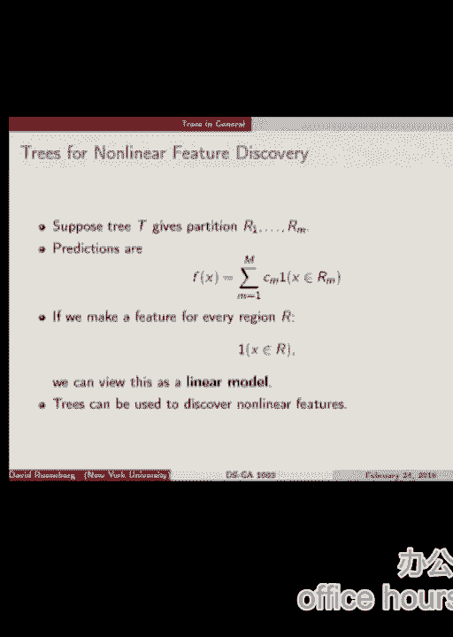
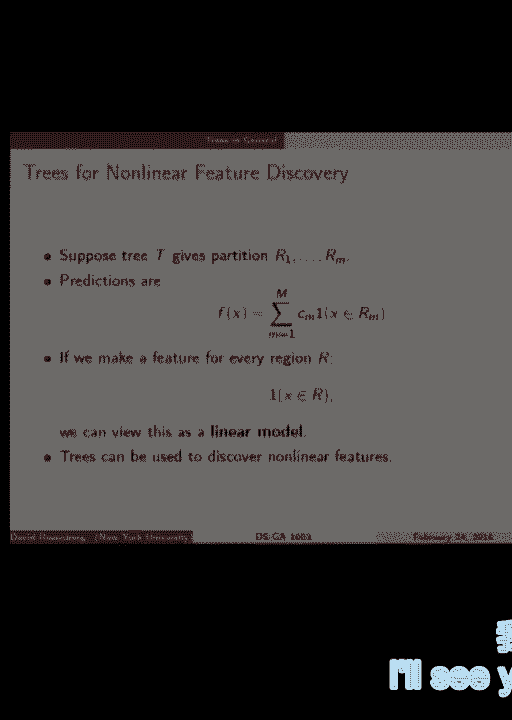

# 知乎推荐-纽约大学机器学习公开课 DS1003 Machine Learning - P10：10.Feb_25_Lab - Tesra-AI不错哟 - BV1aJ411y7p7

 All right。

 So today we're going to cover regression trees， not classification trees yet。

 Have you guys have seen some trees？ Some of you？ Some， yes。 Some， no。 Okay。 So。

 even though this is lab day， this is actually a big day because this is the first。

 time we're going to do a method that's really fundamentally nonlinear。 Right？

 We've kind of done nonlinear in a tricky way by putting nonlinear features into our feature， set。

 But today is the first time we're going to do a model that's like intrinsically nonlinear。 Right？

 The prediction functions are not like W transpose X or W transpose psi of X。

 These are completely different。 So， just regression trees today。

 We'll do classification trees at the beginning of next week。 This is the plan。 All right。 So。

 we've walked through this a little bit before。 In a regression tree。

 you start with an input X and you generally look at one feature at， a time。 So。

 maybe our input is this vector representing a picture。

 And these aren't realistic decision questions， but intuitively， like the first note is， is。

 the top part blue if yes go right is the bottom part blue if no go left。 So， this is。

 you worked your way down the tree by answering a question at every node。

 Each of these circles is a node of the tree。 And if it's true， you go right。 If it's false。

 you go left。 And when you get to the bottom， you have these things called leaf nodes or terminal nodes。

 And in each terminal node or leaf node， there's a single prediction。 So。

 any input that ends up in the same terminal node or leaf node gets the same prediction。

 No matter what， if it's regression， it's going to be the same number。 If it's classification。

 it's going to be the same class。 All right。 Okay。 So。

 already this is very different from regression because in any kind of linear classification。

 you only get this， well， you never have this kind of constant predictions in certain regions。

 It's always changing with some linear functions。 So it's， this is。

 these predictions are piecewise constant because in each node， you're predicting， the same thing。

 a constant thing。 And when you jump to a neighboring node or region。

 it's going to jump to another value。 So it's discontinuous and constant on parts。 All right。 So。

 the trees we're considering today are binary trees between the splits are always， into two parts。

 And moreover， the splits are based on a single feature at a time。

 So we're not going to have any complicated questions。 It's always going to be。

 is a particular feature value， at least for continuous things， continuous。

 feature value less than or greater than some threshold。 That's what we'll start with。 All right。

 And as we mentioned， I think in the second lecture， this type of decision tree partitions。

 use the space into regions， every leaf node corresponds to a different region of the space。

 Is it clear why the， the individual regions are all rectangular with the axis aligned sides？ Yeah。

 clear。 Great。 All right。 So once we have our regions， so the splits。

 the decisions that each node give us our regions。 And then with each region。

 we need to assign a value。 So in regression， we'll assign a numeric value to each of these regions。

 And in classification， we'll assign a class。 Fine。 So here's a picture of regression。

 where in each of the regions， we have a different value， that we're predicting。

 Notice that it's constant on the regions。 Okay。 So let's formalize it a bit。

 Decision tree partitions a input space into regions， which we'll call R1 through RM。

 So M regions that we are dealing with。 And to remind you， a partition is a disjoint union。

 which means each of these regions are， they have no intersection。

 but when you union them all together， it's the whole input space。 All right。

 And one way to model the prediction function， we want to write down this prediction function。

 f of x。 And one way to write it is the summation over all the regions。 And if we take a point x。

 we write these indicator functions， indicator for x being in region M。

 And this piece is one if it's in the region and a zero otherwise。 So of course。

 a point can only be in one region because the regions are disjoint。

 So when we sum over these functions， it will only be one for a single M and the rest will， be zero。

 And then the value of f of x will be just C of M， C sub M， where M is the corresponding。

 to the region that x was in。 Are you clear？ How would you describe a particular region RM？

 How would you write that down？ What's its shape？ Yeah。

 it's always rectangular or higher dimensions parallel piped with the side of the line to。

 the coordinate。 So you can write any of these regions as something like x1 is between 3 and 7。

 x2 is between negative 5 and 5。 Suppose we're given the regions how do we choose the C's to predict？

 What we need a loss function to know how we want to do the prediction， let's do square。

 loss because we're in the regression setting， it's the most standard。

 So I claim that if I tell you the region， the partition of the space into regions， it's。

 quite clear what C is to choose to minimize the square error overall。 So what you would do is。

 and I hope this is clear once you make the connection to some。

 homework problems that you guys have done， what you do is you look at all the training。

 points that are in a particular region， say RM， and you take the average of the y values。

 for all the points that land in that region and that will minimize the square error for。

 points in that region。 Is that clear？ Is that familiar？

 That the average of some points minimizes the average of the y's with minimize the square。

 error for predicting those y's？ It's the exact same calculation you would do for when you looked to find the。

 what？ The base， the minimum risk prediction with squared error was on the first assignment。

 and you found it was the conditional mean。 All right， well a mean is an average。

 So that's the same calculation。 Is that clear？ Sure， right？ Right。 Composed on Piazza。

 if you're unclear。 So if someone gave us the partition， we know how to get the CMs。

 That's the average of some points and in our model for building prediction functions， we。

 usually have this trade-off between complexity and fitting。

 So the issue with trees is that if we make a whole lot of regions， then we might be overfitting。

 Imagine you could have a region around every single point。 If you didn't have any duplicate points。

 you could put every single input training point， in its own cell and its own partition。

 And then you could of course get all those points exactly right。 You'd have zero training error。

 but that would likely overfit。 So how are we going to constrain trees。

 constrain the complexity of trees to not overfit in， that way？

 So one way is to find a measure of the complexity of a tree and restrict it or maybe penalize。

 the complexity of the tree。 So we'll measure the complexity of the tree by how many leaf nodes it has。

 It's pretty reasonable。 And so we'll write that as the norm of t。 If two of t is a tree。

 we could call this the size of t， say， it's a number of terminal， nodes。

 So one way is to say for a minimum complexity， so I want to have a tree with at most 20 terminal。

 nodes， then given that constraint， I want to find the tree that has the minimum error。

 on the training data in terms of minimizing loss。 So that's a great approach， I think。

 It's just that， computationally， we can't solve that problem。 It turns out。

 So what exactly do I mean？ We can't find the exact best tree of a certain size。 So， computationally。

 this is an algorithmically， people have not figured out how to do it。 People have proven， in fact。

 that you can't， almost proven that you can't do this efficiently。

 So what we're going to do is come up with an algorithm that is motivated by this idea。

 of finding the best we can with a certain， a tree of a certain size。

 But we're not going to be able to actually minimize the， we're not going to be able to。

 find the best tree of a certain size。 All right。 So we proceed with what's called a greedy algorithm。

 which is basically we're going to， build this tree out one kind of this， one new node at a time。

 one decision at a time。 And we're not going to do any looking ahead。

 That's what a greedy algorithm is。 All right。 So let's pose our input space as D dimensional。 Okay。

 So every time we split， we're choosing a coordinate or feature， so maybe， you know， X3 or something。

 So we pick a particular coordinate， X3， and we're going to find a threshold， threshold。

 or we call it a split point S。 And anything that's greater than S， we're going to sense。

 the left and everything is smaller than S， we're going to send to the right。 All right。

 So we need to find a variable to split on。 I'm using the same， several words for the same thing。

 variable， feature， coordinate。 I'm all， I'm talking about the entries in this D dimensional input vector。

 All right。 So for every split， we need to find the variable in the split point S。

 So let's do a little bit of notation here。 Let's write R1， for a given J and S。

 J would be the variable and S would be the split point。

 So let's let R1 be everything to the left of the split and R2 be everything to the right。

 So that's going to refer to the partition given by the particular splitting variable and split。

 point。 All right。 So given that split， that partition， well。

 we know how to find the optimal prediction on， each of those partitions， right？

 It's the average of the Y values that end up in each of these partitions。

 So I've written that down here。 So C1 hat， C2 hat。

 that's going to be our prediction for C1 will be the prediction for， things landing in R1。

 C2 will be the prediction for things landing in R2。 For a particular， for any given。

 I've written it all as a function of J and S so that we， can kind of reuse these as functions。

 Any questions？ Notation。 Okay。 All right。 All right。

 So this is the objective function that we need to minimize。

 Let's stare at this for a while and make sure we understand it。

 We have we're looking at the total error that we're going to make when we predict for a。

 given choice of splitting variable， split point and actual prediction value C1 hat and C2 hat。

 So we're summing over all the points that are in both regions。

 So on the left we're summing over the square errors on the points in region one and on。

 the right the square errors on the points in region two。

 And you see that on the first sum we're predicting C1 hat and in the second sum we're predicting。

 C2 hat because those are the two different regions。

 And then summing them together we get the total error for the prediction across the union。

 of these two regions。 All right。 Okay。 Any questions？ All right。 I'll draw a picture。 Okay。 So。

 suppose we've already chosen the splitting variable。 All right。

 So in that case the problem is one dimensional。 Once we've chosen the splitting variable suppose we chose the first coordinate X1。

 So that I can draw X1 like this。 All right。 And now we want to look at the Y values for all of our points in terms of X1。

 So suppose we have some points that look like this。 I'm drawing Y as a function of just X1。 So。

 Is it clear？ So maybe our original input vectors are 100 dimensional but we've chosen a splitting variable。

 The first one X1。 And so I only plot the first coordinate of each of these points and then on the YX that。

 I plotted the thing we're trying to predict。 Okay。

 So we need to find a splitting point and C1 hat and C2 hat。 So where should my splitting point be？

 Okay。 Okay。 And where should my prediction value be？ Yeah。 Okay。 So that's C1。 This is R1。

 This is R2。 This is C1 hat。 C2 hat。 Okay。 All right。 Cool。 So we did that by eye。

 Question for you guys。 How might you implement this？ Is there a way to implement this efficiently？

 How do we find the split point？ Let me phrase it differently。

 Do we have to check all possible points of X1 as the possible split point？ Why not？ Yes。

 because it doesn't change between the points。 If we make the split point here， here， here， here。

 nothing changes in the predictions or， the loss。 Right。 So the split points。

 the only possible split points that one is to check are when we split， right at a data point。

 All right。 So if there are end data points， we need to check and possible split points。

 But maybe that's not too bad。 Once we have the， when we choose a split point。

 how do we find the square loss？ That's pretty easy。 We have a split。 The prediction。

 we need the prediction value。 So that's just all the average of all the points to the left。

 Average of all the points to the right。 Now you can imagine。

 like from my computer science perspective， there might be efficient， ways to implement this。

 Like maybe you want to sort these and go from left to right and maybe it's easy to compute。

 their averages as you move from point to point。 Anyway， so if you're going to implement a treat。

 you might think a bit about， or Google， about efficient ways to implement this。

 But the key idea is that one only has to check the data points for possible splits。 Okay。

 So this whole procedure tells us how to find one split。 So we did it for X1。

 And then what you would do is you do it for X2 and you do it for X3 and you do it for all。

 the way up to X100 and you try them all and you see what gave the minimal square and that's。

 the one you would choose。 So that's solving this minimization problem。

 So we do that once and we get the first split and then what？

 Well now we've gotten all our data and we split it in half and part of it now is in R1。

 and part of it is now in R2。 What happens next is you repeat the same process recursively。

 So you say okay， let me take R1， all of these points and I'm going to do the exact same， thing。

 So just the subset of points that landed in R1 and find the split for these and proceed。

 recursively and then same for R2。 And then the only question is when do you stop？

 So there's a couple approaches。 One would be you stop at a certain point to keep your trees from getting too complex。

 If you go too deep then you'll have a very complex tree and you'll be overfitting。

 That's a viable approach and you could find ways to do that。

 We're going to do another approach which is you build a really deep tree that's way。

 too big and over fifth but then you trim it back and you throw out some splits and this。

 often is found to work better。 It takes longer because it's a two-step process but this is this method is called cart for。

 classification and regression tree and it works pretty well。 Okay。

 So this is the recursive procedure I acted out for you。

 So the approach we're going to use is build a really big tree and then prune it back。

 So for example， stopping criteria might be build the tree down until every region has。

 fewer than five points。 So keep splitting until we have something fewer than five points。

 So this is terminology that internal nodes are the splitting nodes。

 Terminal nodes are leaf nodes that correspond to the classification of prediction nodes we've。

 discussed。 But now subtree， what's a subtree？ So if t0 is our full tree growing all the way out until every node has at most five points。

 t would be a subtree of that。 So that just means we collapse regions and put them together。

 So if this is a full tree， you can see it gets very small and these splits at the bottom。

 So subtree would be， for instance， if we took all these regions and collapsed them and just。

 only had one decision going left。 So just collapsing the decisions and saying， no。

 I no longer want to split this last time。 I'm going to put anything in either of these regions together and I'm going to make the。

 same prediction for all those things。 That would be that's a subtree。

 So literally it's like a subset of these splitting internal nodes。 Here's a subtree。

 So I'm supposed to want to prune a big tree t0。 Let's bring back our old concept of empirical risk。

 So we have empirical risk is the average loss on your training data。

 And we can assess a tree in terms of empirical risk， which yes， please。 Can you say it again？

 A subtree takes these internal splitting nodes。 I mean， every tree always ends up in leaves。 I mean。

 the internal ones in the data is still a subtree。 We can also want the second node on the left。 Yes。

 If we keep this splitting node， then we'll still have these two leaves left into the right。

 You don't have the four leaves on the left。 That's right。 And it's okay。 That's a subtree。

 That is a subtree。 It's when we leave off the bottom parts。

 The subtree is always leaving off things from the bottom。 Can you say again？ You keep the roots。

 Yeah， you。 So a subtree will always have the root。 And sometimes it'll keep going further down。

 The idea is that the top part of the tree is the most important stuff。

 And then as you get further down， it's doing fine detail。

 So you want to throw out this fine detail because this lower stuff may be overfitting。 Yeah？

 So this subtree should still get covered in the entire input space。 Yes。 At any level。

 we're always covering the entire input space because any single point always。

 either goes left or right。 So it's always somewhere。 Yeah？ Why is this tree so imbalanced？

 Why did they draw it this way？ I was learning the same thing。 I don't know。

 I think it's because they didn't draw this specially for the book。

 They probably used some tree drawing software that wasn't very good。

 Or maybe it's great and there's some really excellent reason why they do it this way。

 But I'm not familiar with that reason。 That is a pretty random question。 Okay。 Any more questions？

 All right。 Okay。 So our head of t is the empirical risk of a tree t。

 Let's say we're doing square error。 Fine。 Now let t be a subtree of t not。

 So when we take a subtree， it's the empirical risk going to go up or down。

 The empirical risk will increase because we're throwing out the finer splits at the bottom。

 The more splits you have， you can only get better predictions。 So if we throw these out。

 the empirical risk will get a little worse。 So our hat t is a little bit worse than our hat t not if t is a subtree of t not。

 All right。 So size of t is our measure of complexity。 So we have our complexity measure。

 We have our empirical risk。 So we feel like we can just go kind of regularization。 Right？

 So that's this。 This cost complexity criterion。 We have our hat of t plus alpha。

 our regularization parameter， times the size of t。 So this is。

 we've called this form T-conoff regularization or penalized empirical risk， minimization。

 So there's a problem because what have we done before with things like this？

 What's our first step to try to minimize this gradient， right？ Grading descent。

 So usually there's a W vector of parameters and we differentiate with respect to here。

 There's this T to tree。 We can differentiate with respect to a tree。

 It's not the space of predictors is not something that's continuous。

 So that kind of approach isn't going to work。 All right。

 So the approach is basically to build a big tree and prune it back one node at a time。

 And every time we take off a node， it gets a little bit smaller， becomes a subtree。

 We see what-- so two things happen。 When we remove a leaf node。

 when we take away one split of a tree， the complexity goes-- when， we remove a split from a tree。

 the complexity increases or decreases。 Right。 And the empirical risk increases， exactly。 All right。

 So we can keep doing that until we've removed every single node up to the root。

 And that gives us kind of a hierarchy of trees。 All right。 So how's this work？

 Our first step is we're finding a subtree T1 that minimizes the empirical risk of T1 minus。

 and the empirical risk of T0。 What's that mean？ So we want to find the subtree that it's smaller than T0。

 but it has the best possible， empirical risk and still be smaller than T0。 So basically。

 this means you remove a single node， a single split， and the split you remove。

 does the least damage to your empirical risk。 So that would be T1。

 And then we go again and we find T2 and so on， all the way until we just have a single， node。

 And this is a hierarchy of trees。 And then you can look-- for instance。

 the performance on your validation set of each of。

 these trees and choose the one that has the best performance。 That would be an approach。 Yeah？

 [INAUDIBLE]， We use the greedy algorithm to build up the tree。 [INAUDIBLE]， So the question is。

 does the order that we put the nodes in， is it the same as the order， in which they print out？ No。

 First of all， there's no order to the way we put them in。 So we do a split。

 I can choose to split the right side or the left side next。 Yeah， so there's no order to the splits。

 Yeah。 OK。 All right。 So we come up with this set of trees and they're nested。

 And that one tree is always-- since we remove one node at a time， each tree that we end up。

 with is a subtree of the one we just came from。 So T sub n， this is the original-- no。

 T sub 0 is the original tree。 T sub 1 is-- we've removed one node。 T sub 2 is two nodes。

 And we get n of them if there's n nodes。 And there's this amazing thing。 So Leo Brimen。

 who is a statistician who is one of the inventors of trees， he also invented， random forest。

 which we'll come to later。 We proved this pretty amazing thing。

 which was that this objective I wrote here-- so， finding a tree that minimizes this objective for a particular alpha will always give you。

 a tree that's in this set。 So that's what I wrote here in math。

 The argument over all trees where T0 is the full tree-- all subtrees of T0 of this alpha。

 penalized empirical risk， no matter what alpha you set， you're always going to end up。

 with a tree that's in this pruned hierarchy of pruned trees。

 So this justifies the-- so if you believe in this approach of let's penalize with how。

 many nodes you have， let's just do alpha times the number of nodes。

 And we can try out different alphas。 Well， that's equivalent to doing this greedy-- yeah。

 this greedy pruning of nodes and choosing， the one that-- so choosing among these trees is the same-- that works best。

 is the same， as choosing alpha that gives the best performance on validation。 Any questions on that？

 Yeah。 [INAUDIBLE]， Oh， I see。 So this theorem is about the way we pruned the tree。

 So you start with the tree。 You could have built it however you wanted to。

 And then this method of pruning where you find-- you prune it a little bit at a time。

 doing as little damage to the empirical risk as possible that gives you a hierarchy of trees。 Yeah。

 so specifically about that method。 So here's just a little plot。

 kind of a regularization type curve we've seen before。 On the x-axis we have two labels actually。

 We have alpha， that penalty regularization term and the tree size that we end up with。

 for particular alpha。 And on the y-axis roughly speaking we have the misclassification rate。

 So in this case as the tree gets bigger， the misclassification rate gets smaller。

 So I'm a little puzzled by-- this is an-- for me this is an interesting curve and a little。

 surprised by it。 Does anyone know why I'm a little bit surprised by this curve？

 So this is supposed to plot test error。 Yeah， so I would expect that it would eventually overfit and go up。

 So that's interesting。 Perhaps it's some characteristic of the data set or-- I'm not sure。

 I'm probably going， to look into it and see what's going on there。 Kind of interesting。

 This was from the Hasty Tiptroni Friedman book。 What are the numbers on the top？ Yeah。

 so these are alphas。 So an alpha is how much we're penalizing the size of the tree。 So big penalty。

 176 for alpha corresponds to a very small tree。 And small alpha is the full tree。 Yes？

 How do they map back to alpha？ How do they--， So you know the number， you know the tree size。 OK。

 so good question。 So the question is-- so you pick alpha and then you find-- you can go through this set。

 of trees。 And for each one of these trees， you look at the cost complexity criteria。

 So we evaluate-- you could pick each of these out。 You set pick an alpha。

 And then you run each of those trees through this expression and evaluate its C alpha T。

 And that gives you a number。 You choose the tree that has the minimum。

 And that's the tree that's optimal for that alpha on the training set on the training data。 No。 OK。

 Cool。 All right， so we're going to skip classification trees。

 Any questions on regression-- on these trees， yeah？ [INAUDIBLE]， [INAUDIBLE]， Yes。

 the question is can splitting variables repeat？ Absolutely。 Yes。 Yes。 [INAUDIBLE]， Yes。

 The question is can splitting variables repeat？ Absolutely。 Yes。 Uh-huh。 Yes。 [inaudible]。

 That's true。 So the question was， if we're doing a greedy approach， which we are。

 the choice of the split in the first step， the one that looks best from the first step。

 may lead to a tree that's worse overall than if we had chosen， another split。

 which is not as good in the first step， but for whatever reason， the overall tree is better。 Yeah。

 that's absolutely true。 And yeah， that's kind of the point that we don't know how to。

 find the optimal， so we do this greedy approach instead。 Yeah。 [inaudible]， Well。

 this is a computational question。 Is there any kind of a shortcut for computing the new predictions in。

 each terminal node based on a split？ It's a good question。

 I don't know if there may be a way to do that more optimally。 I'm not sure。 [inaudible]， I mean。

 the truth is that once you， I don't know if there is a better way because you have a。

 when you look to split a particular set of points。

 this is the first time you've looked at just a set of points。

 So you have to still look at every point to figure out where to split it。

 And so as you do that search， you're going to be， you're going to have the average values anyway。

 So just to figure out how to split the data， you're already going to be computing the values you want to。

 predict on those two splits anyway。 Yeah。 No？ Okay。 Yes。 [inaudible]， No， I don't know。 Not really。

 So， um， now， I mean， this is， I call it say nested sequence of trees。 And， but I don't know if it's。

 I don't know if a higher or lower， I mean， I would say higher or lower complexity。 But yeah。

 More questions？ Yes。 [inaudible]， Oh， it's a great question。

 So you think this might be more expensive than the other methods we've used。 [inaudible]， Okay。

 It's a good question。 What do you， do you guys have any ideas on why you might want to use trees？

 [inaudible]， Okay。 So nonlinear。 So this is the first method we've come up with that's discovered nonlinearies for us。

 That's nice。 It's potentially interpretable interpretation。 Interpre。

 you can look at a tree and say， you can explain it to somebody， right？ We have this。

 if the years they've played is less than 4。5， we're going to predict 5。

11 and it hits is less than a hundred， 17。5 and you can look at a small tree and understand it。

 Now the tree has to actually be small to do that in any practical way。

 So a lot of people give interpretability as an argument for trees， but on the other hand。

 on a lot of data sets when you actually try a tree。

 the tree that's best is big and not really that interpretable。 So that's questionable。

 but at least a small tree is very interpretable。 Okay。

 Then maybe there's one or two other reasons we'll come to in a minute。 Any more questions？ Yes。

 [inaudible]， Yes。 [inaudible]， Well， okay。 So the question is。

 can we decide our splits using the test data？ Well， if you think about it。

 that's basically training using your test data。 [inaudible]， The best split。 So it's a compromise。

 So you're saying， I don't understand。 So for every variable， what do you mean by the best split？

 Every， the best splitting variable or their split， best split point or what do you have in mind？

 [inaudible]， Okay。 [inaudible]， Okay。 [inaudible]， Oh， you mean it？ Okay。 I think I understand。

 So you're saying build your tree until the test error starts decreasing？ [inaudible]， Okay。 That's。

 it's an interesting stopping condition。 That might be reasonable。

 Another thing is you can prune your tree based on the test data， perhaps。 Yeah。

 It's always a tricky trade-off between about how much you want to use your test data。

 to select your， the model。 Or you've， I've been saying test data。

 It really means kind of validation set， right？ So the more you use it。

 the more at risk you are of overfitting your validation set。 So it's a bit of。

 it's a bit of a trade-off。 Yeah。 Yes。 [inaudible]， Which one you're going to use？ [inaudible]， No。

 I mean， I don't decide am I going to repeat it。 In every point I look for the best one。

 If it happens to be one I've already used before， that doesn't matter。 [inaudible]， Yes。

 So what I was working through here was finding the split point for a particular split variable。

 So we find the best split point and predictions。 And then we try the next variable。 This was X1。

 Then we try X2。 And all the way to X100。 And so we've tried all hundred split variables。

 And then we find the one that gave the best loss。 That's quite expensive。 Right。 Okay。 All right。

 So one， one reason people like trees， one other reason people like trees。

 is that you have a fairly reasonable way to handle missing values。 Okay。 So。

 so far we've never discussed what to do when you're missing a value。

 Missing a particular feature value。 Okay。 So trees have one approach which was kind of built into the definition of when people describe trees。

 So， okay。 So what do you do with missing features in general？ One thing you can do is just say。

 all right， this input example is not usable。 It's missing a feature。 So throw it out。 All right。

 Another thing you can do， which arguably is maybe a good thing to do， is to impute the value。

 Impute the value means guess what it is and just put a value in there。

 So there's lots of ways you can do it。 The simplest way would be to replace the missing value。

 with the average of all the other values for that feature from the other points that have it。

 Trees have another approach。 You can do what's called make a surrogate split。

 So basically a surrogate split is for every splitting variable。 So for every split。

 suppose we've chosen x1 as our split。 Now we make a surrogate split which means find another variable to use in that same place。

 at the same place in the tree， that we use as a backup in case x1 is missing。

 So what does that mean？ We want to， so suppose we've searched and found our best split at a particular node of the tree。

 And after we do that we say， okay， now we need to make some backup plans for what to do with x1 is missing。

 So we search again through all the variables and then we'll start with like x2， say。

 and we'll see how can we use x2 to make a split in the points that's as similar to the split that we got from x1 as possible。

 Is that clear？ So basically we have a split of x1， so a certain set of points are on the right。

 and now we come to x2 and we say， all right， how good an approximation to that same split can we get with x2？

 Or can we get with x3？ And you see what kind of approximation you can get to that split with each of your variables。

 You sort them by how good those approximate splits are and that's the order of things you use when you have missing features。

 That's a sketch of the idea。 Do you try to replicate the split of the points？ Yeah。

 try to replicate the splits。 Yeah。 Is this going to check all the features？ Yeah。 Yeah。

 you check all the features to see which one can give the best approximation of the same split。 Yeah。

 So then it's almost more like a classification problem， right？

 We need to find a way to send all the particular set of points that went to the right previously to the right。

 with this other variable that we're splitting on。 Okay。 Okay。 So， sir， so this， so a lot of。

 in practice a lot， you probably won't build your own tree software very often。

 but most tree software use has built into it nice and smooth handling and missing data。

 So down the road we're going to build ensembles of trees with boosting a random forest。

 And since they use trees as their kind of fundamental unit。

 when you combine trees as long as you're using trees that can handle missing values。

 these ensemble methods will also be able to handle missing values in the same way， which is nice。

 All right。 Okay。 So， then you start with having constant multiple points。 I mean。

 the surrogate splitting， you have to do work to find the best surrogate splits。

 So some tree algorithms will do it in some one。 Yeah。 I'm going to skip this。 Yes。 [ Inaudible ]。

 I couldn't hear you。 Can you repeat that？ [ Inaudible ]， If we know the range of f of x， then we。

 then we could be using tree algorithms。 [ Inaudible ]， We decided that we have the y values。

 [ Inaudible ]， We always go through the entire data every time we make a split。 So yes。

 we certainly need to know not just the range， but the averages on each part of the split。 Yeah。

 We're touching all those y values all the time。 Certainly。 Yeah。 All right。 So。

 here's another important difference， kind of a key difference between trees and all the other things we've done so far。

 It's what types of prediction functions can they do easily？ What do I mean by easily？ By easily。

 I mean with low complexity。 So if we're measuring complexity of trees by how many leaf nodes there are。

 then we'll look at this picture。 So on the top， the top two pictures， we have two regions。

 It could still be a regression problem， so green could be one and yellow could be negative one。

 So with the linear model， it's easy to have a， you can imagine， a prediction function that --。

 We'll say it's SVM， so we're thresholding our prediction function。

 So a prediction function could easily match this line and perfectly separate these two regions。

 But to get this diagonal line with trees is very difficult。

 It has to have lots of splits to even approximate this diagonal separation between the classes。

 Whereas with， you know， these box shaped regions， linear has a very difficult time separating the region。

 It had errors， whereas with trees it can separate them exactly。 So， yes。 Right。

 so it's indeed possible to have regions that are hard for both trees and linear。 Yeah。 So --， Well。

 I mean this is -- so that's another type of nonlinearity。

 And you just have to -- you can approximate that with lots of splits with the trees。

 And with linear， you can only get nonlinearities if you build in more nonlinear features into your input space。

 So --， All right。 So wrap up on -- so when -- so we talked about interpretability as a region of people like trees。

 Here's another reason。 Trees can be a way to discover the nonlinear features that you want to use inside your linear models。

 That's interesting。 So suppose you take some data and you build your tree and it's slow。

 It takes a long time。 But at the end， you get this prediction function where it's divided our space into these regions。

 So what you can do is take these regions as features in your linear model。 Right？

 So each of these regions could be a -- can be used as a binary feature。

 Is this X in this region R M， which is described by the sequence of inequalities on the coordinates from the tree？

 That would be a feature。 And you can just take all these nonlinear features or take the ones that you think are most useful and throw them into lasso regression or something。

 So this is a way to automatically build some nonlinear features which may actually be very useful for your problem。

 But then put them into a linear classifier。 So why might we want to do this next time？

 We're almost over。 Why might you want to do this？ Maybe training on all your data is too expensive for trees because trees are slow。

 Okay。 So take a subset of your data perhaps and build your model and get some useful nonlinear features。

 And then plug those into lasso and train on all your data。 This would be a possible use case。 Okay。

 All right。 I think that's all I'll say about trees for today and times over anyway。

 So if you're sticking around for offs hours， I'll see you then。

 Otherwise， I'll see you guys on Wednesday。 [BLANK_AUDIO]。

