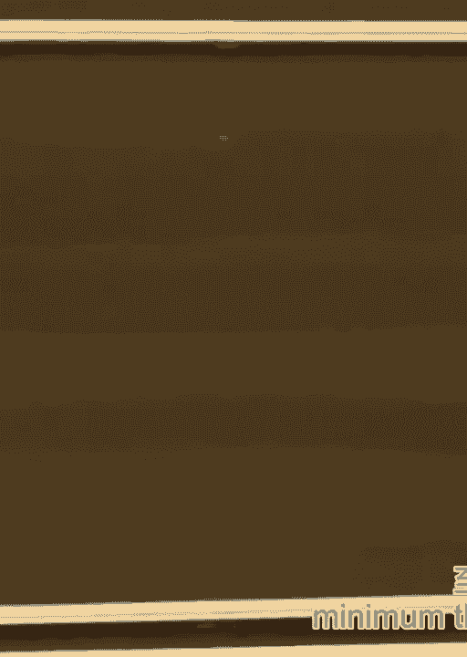
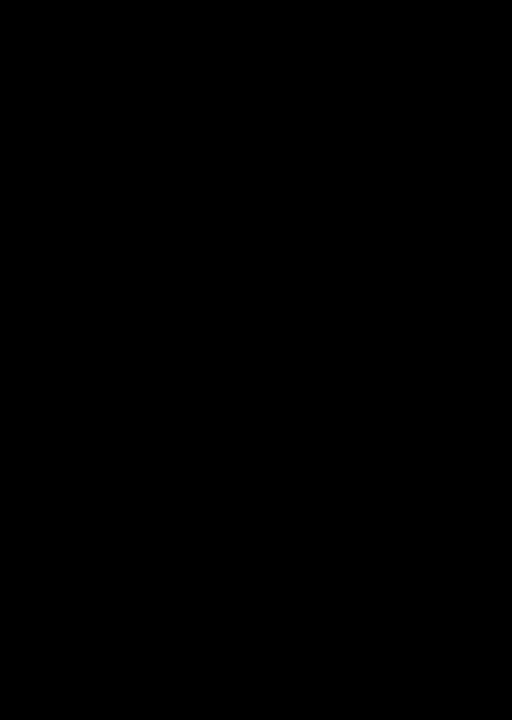

# 知乎推荐-纽约大学机器学习公开课 DS1003 Machine Learning - P16：16.Mar_31_Lab - Tesra-AI不错哟 - BV1aJ411y7p7

 So we have a little problem with the project。

 So I'm going to try to write a few lines from the slides， but the slides will be online。

 So don't worry about it。 You'll have access to all that we will do。

 So let's talk about generalized linear model。 It's just a little bit of probabilistic setup and we'll see one example and we'll see how。

 a generalized linear model relates to the minimizing the square norm and then we'll move。

 on to the test， reviewing the test。 So this time the hypothesis space of functions are the ones that takes the input to a Gaussian。

 with a parameterized mean and the parameterized variance。

 You can imagine a bunch of Gaussians and given input， identify which one will come out。

 So the goal is obviously to find parameters for each x， f of x is a Gaussian density。

 With the standard deviation， sigma squared。 So finding v determines the function。 So f depends on v。

 So f depends on v takes input as x。 We should be able to write our prediction function。 x is y。

 So we can write the density as the following。 Probability density that depends on the parameter v of y given x。

 where y is our prediction。 For x。 So normal density。

 conditional normal density of y given w transpose x， sigma squared。

 So we're interested in this object here， this conditional density of predictions given data。

 If you have a bunch of data， we can factor this out using independence。

 So the probability density that we want depends on parameters given a bunch of data， some。

 family of x， i， y， i's， say i from 1 to n， just the product of all individual Gaussians。

 We'll write the explicit formal distance。 Hopefully it will be clearer。

 The product goes from 1 to n。 So the product goes from all data。

 So I just introduced a new model and the new model is just a conditional probability。

 So we want to predict y。 We want to predict y given x in the probabilistic setting。

 And the assumption is that data is normal。 x is the input， y is the prediction。 Conditionally， yes。

 So given x， we want to find which conditional family x belongs to。

 Let's say for now we fixed the standard deviation of those Gaussians。

 We have a bunch of densities here and here with the fixed sigma。

 If I find the correct parameter family w here over there up there， then I can find given。

 x which ones I have。 Yes？ What's s， w of x of y of y？ It's the density of the prediction。

 conditional density of the prediction given data。 The whole problem is parameterized by v and it goes to find v。

 Of course， once we have a probabilistic setting， what we do is to maximize the probability。

 So we want to find， so of course we want to find the v that maximizes the probability， density。

 So we want to find the w star that's arg max or rho possible w's that maximizes this product。

 If we have independent observations， this line， I could have started with just writing， this line。

 The above is just a formal setup。 So what's this？ What's this with the given normality assumption？

 This is just the density of the Gaussian since it's now a single variable。

 Then over sigma times squared p exponential negative 1 over 2 sigma squared times y i minus。

 wt xi squared。 Given data， my parametric prediction density for the output is the Gaussian density with。

 the prescribed mean and standard deviation。 So if you're confused what's going on up there。

 you can just start with this part。 So this part says， well。

 I have some independent observations that are normal with some parameterized。

 mean and some fixed standard deviation。 Then how can I maximize this probability？

 That's all we are doing here。 This is going a little fast because it's actually a recap of the previous semester's class。

 Maximum likelihood estimation。 So what gives us this arg max？

 It's the answer is maximum likelihood estimation which can be found by， so instead of looking。

 at the maximum of this thing where you can take the log of it， it will be at the same， place。

 so we'll just start。 If I call this function， I already had an aim for it up there。

 It's log of the density。 Yes？ It's what？ It's continuous。 It's a continuous random variable。

 It's true。 But this is not probability。 This is the probability density。 Right？

 I'm going to maximize the density itself。 This is not maximizing good question。 This is not。

 because it's a common confusion。 This is not maximizing probability of a random variable taking a value。

 If I had a single example， the density would look like this。

 And what I would want to find would be this point here。 The point in the domain that maximizes this。

 Yes？ Yes， it's missing some， it's just this part。 Oh， okay。 Summation will come in the next line。

 So if I take log of this thing， let's make it clear that this box corresponds to this， box。

 not this expression below。 The log of this will just separate this part and that part。

 It will be again arg marks of log。 I take negative here sum sigma square root 2 pi plus sum of this expression。

 Now why can't we take the log because we are looking at the point in the domain that maximizes。

 this function。 Right？ We are not interested in the value of the maximum。

 We're interested in the point that maximizes it。 So for the case of the original function and for the case of the log。

 the point that maximizes， them will be the same。 Their values will be different but the point that maximizes them。

 namely the arg max， the， w star， the v star， will be the same。 So I can take log。

 And why taking log is useful because instead of having this whole exponential， I think I。

 get rid of the exponential and the first term I have here is independent of v。

 This part is independent of the parameters so I can just get rid of it。

 And now I have to maximize a negative function which is the same thing as minimizing when。

 I ignore this negative sign。 So this whole problem turns to minimizing。

 I can also ignore this constant here。 I don't care。

 It's minimizing the sum of yi minus w transpose xi squared。 Does this look familiar？ Yeah。 Right？

 So in the probabilistic setting， if you assume normal priors then with the maximum likelihood。

 method， the parameters you want to estimate corresponds to the minimization problem of。

 the square loss。 Yes？ Also to what？ What do you mean by its normal error？

 Y equals Wtx plus error term？ Probably because you are saying that W minus y。

 so prediction minus Wtx is going to be， I think it's a little different。

 So you are saying that I am assuming that this is normal something。 This is Gaussian。

 Probably means zero， some standard deviation。 It's a little different。

 You can make it seem close with this a little different。 If you take sigma fixed。

 that's how you get the equivalence with the least squares。

 Estimating sigma is one step more complicated。 So in this problem， it's sigma is fixed。

 What we assume that we know we are waiting on。 Yeah。

 Now this is another way to show that this generalized linear model with the Gaussian， assumption。

 you can solve that problem using your linear algebra methods for the least， square problem。

 Just this set up above in the first page。 Okay， let's talk about the exam。

 I was hoping to project the questions， but since project is not working now， I'm going， to ask you。

 do you have your copies of exams？ Do you remember the questions？ Okay。

 so I'm going to pull up the questions。 Okay， let's start with the multiple choice question。

 Because in the meantime， we have the projector back。

 We can probably talk about the pictorial stuff on the board。

 Do you remember the multiple choice question？ Well， briefly。 Okay。 We didn't type it。

 but I was played with it。 I can post my notes， but it's not typed， so it's handwritten。 Okay。

 let's start from the first problem。 The first problem was separable data。

 The part A of the first problem， you probably remember that there was a bunch of circles， here。

 a bunch of x is here。 And there was another dot mixed in between。 So this appeared as one group。

 and this appeared as another group。 And the question asked you to find the hyperplane that maximizes the margin。

 Half of you got this， and the other half probably got this。 And since it's a hard margin problem。

 we don't allow any slack variables。 So this answer is wrong。 This answer is right。

 So you have to consider all the problems。 It has to separate the data completely。

 Even if it means that you need to give up one point to lose a lot of margin or vice versa。

 to gain a lot of margin。 Questions？ Yes， in a hard margin。 It doesn't allow any slack。

 If it doesn't say soft margin， you don't allow it， right？ Sorry？ I don't hear。 I mean， that's clear。

 right？ It's the same thing。 You don't need to specify it extra。 You want the separating hyperplane。

 The separating hyperplane always means separating hyperplane。

 You don't need to specify the margin problem either。 Yeah， of course。 I mean， look。

 I don't tell you anything about SVM。 I don't tell you anything about the margin。

 I just give you this， and I tell you to find the separating hyperplane。 What would you do？

 Separating hyperplane。 By its definition， in English， it must separate all the points。

 Just the only virtue that the separating hyperplane has is separating the points。

 There's nothing else。 Okay， the second part of this problem was a bunch of points here and a bunch of points。

 on this line。 And note that it starts from zero here。

 so you can't really separate it by just trying， to put a parable in between。 How do you do that？

 If you tried hard， you could find a shifted parabola， but getting the parameter's right。

 would be hard。 You need to shift it a little up and scale it in a way that it's nice and separated。

 So what do I mean by， you know， find， add the feature that separates the data linearly？

 There are two ways to think about it。 You can either use your features and come up with a function that non-linearly separates。

 the data。 Or you can think of this as you obtain your data and you transform your data into a new。

 space。 On that space it's linearly separable。 So the example that most of you， you know。

 wrote in the exam was from the slides that， had this problem。 So how do you separate this？ You know。

 yx squared plus y squared works in this case。 It does what？ Mm-hmm。 If the origin is not centered。

 I could have shifted my function。 It would have been x1 minus the x-coordinate of the center and y1 minus y-coordinate of。

 the center。 So what it does， when I add this function， what it does is that it takes this。

 it embeds， this into a three-dimensional space。 It embeds it specifically on a three-dimensional parabola。

 And at the bottom of the parabola I have those values。

 And in the middle of the parabola I have those values so I can cut it where they are。

 separated in that three-dimensional plane， right？ I have x1 comma x2 comma something else。

 I could have done it in two-dimensions as well。 I could have considered only， you know。

 one part of it， one-dimension and then add the， x1 squared plus x2 squared。

 The whole point is to lift it up， lift those points up and while keeping those points low。

 so you could separate it。 You know， in a similar way， this can be separated by a reflection。

 Data starts from here。 If you could reflect the points onto the either side。

 then you would be able to separate this， with the cyber plane。 Does that make sense？

 How do you reflect it？ So if you get this data and you need to transform the data into a new plane in which it's separable。

 So one way， this v-shape is a hint of it， one way to do this is to reflect the data。

 You can look at the-- you know， this is the x1 axis and this is the x2 axis。

 What happens if I take x1， x2 here and map it to absolute value of x1 and x2？ What picture do I get？

 Yes？ Yes。 Right， it reflects them。 So all the negative x1 values become positive。

 So this overlaps with the right hand side。 So instead of this， I get a bunch of points here。

 Instead of this part， I get a bunch of points here。 And this becomes linearly separable。

 The point of adding new features is actually transforming your data into a new plane。 Right？ Yes？

 You can do that to x1， x2， comma--， You could do that too。 Yeah。

 The only point that-- the only thing you need to do is to show that the idea of reflection。

 will work and you can do reflection by either taking squares or absolute values or whatever。

 you can。 [INAUDIBLE]， So for-- look， what this does-- suppose you take a data point here。

 Whenever you're confused， just take a data point， sample data point。 Let's say this is 1。2。

 Then you need to find this representation in the new space， which is going to be what？

 Which is going-- well， this is trivial。 It's going to be the-- it's going to give the 1。2。1。

 So let's take this point。 Minus 1。2 will be mapped to 1。2。1 as well。 And if you map all the points。

 you'll really realize that in the third dimension， you can， actually cut them。

 Or not exactly in the third dimension， but if you project it from the last two dimensions。

 you'll be able to cut them。 [INAUDIBLE]， Yes， no， that won't work。

 Because what that does is that if you add a constant C， what does it do？

 It just lifts it in the three-dimensional space。 Everything is in the same place。

 but it just lifts it。 So if you use absolute value of x1， in the three-dimensional space。

 you just lift them--， so in the third dimension， there will be only positive values。

 So only positive values here。 And then if you look at it from the side。

 then you'll be able to cut it。 It just makes it geometrically a little bit more complicated。

 [INAUDIBLE]， Yes。 Yes。 Yes。 You can just work on absolute value of x1， yes。 [INAUDIBLE]， Yes。 Yes。

 You can just work on absolute value of x1。 Yes。 [INAUDIBLE]， You can use x1 squared。

 You need to convince me that you were aware of the reflection idea。 Just didn't write it。

 [INAUDIBLE]， x1 squared eventually doesn't put the parabola。 That's why it's wrong。

 x1 squared is just this。 How do you expect x1 squared to put a parabola between the two？ Right？

 Just try it out， and you will see it。 Take one point。 Take two points， and try that if it separates。

 It doesn't separate。 OK。 Next question。 Step directions in optimization。 Just remind you。

 the step directions in optimization， asks you the following。 If you have a function。

 j that depends on v。 There are three cases。 In each case， the question asks you。

 to identify whether the following is true。 [INAUDIBLE]， All these are strict。 So in the first case。

 the function j is convex and defrachable。 And we take a step in the negative gradient times some eta。

 and eta is small enough。 So in the first case， the function j is convex and defrachable。

 In that case， what will happen？ W* is the minimizer。 Which one of them will be true。

 or none of them， can be true too？ Any ideas？ When the function is convex and defrachable。

 if you take a step in the negative gradient， in the direction of the negative gradient。

 when the step sizes small enough， what will happen？ Will the value decrease？ Always。 Yes。

 Unless it's flat， and it's not flat， because it's given that the point we start is not a minimizer。

 So this is true。 Will it get us closer to the minimum？ Yes， it's also true。

 The second part of the question， what if we have a convex j， but it's not defrachable？

 Then we take a direction， we take a step， in the direction of the negative sub gradient。

 Will it necessarily reduce the value？ No。 There's a conterexample in the slides。

 Will it necessarily get us closer to the optimum？ Yes， there's a theorem。 Third part。

 We look at the sum this time。 J is a sum of convex functions， convex and defrachable functions。

 But we take a step in the direction of the derivative， of only one of them。

 which is just this stochastic step， just like the first stochastic step。

 Will it necessarily reduce the value？ No。 Will it get us closer to the optimum？ No， right？

 It can take a step in arbitrary direction。 Overall， though， we know that it takes us to the minimum。

 [SOUND]， [SOUND]。

 The third problem starts with the algebraized regression。

 Then it asks you to justify just the derivative。 So in that question， what you do is just you。

 take the derivative and you give an expression for the solution。 So derivative-- of course。

 you need to use the general， and take the derivative of this too。

 So it's x transpose times this times 2 lambda v。 And if you set this to 0 and expand this。

 you get the condition that the gradient is equal to 0， gives you x transpose x plus lambda v。

 is equal to x transpose y， which is what's， asked to justify in the first part。

 And if you take it into v parenthesis and immerse--， immerse this。

 you get x transpose x plus lambda i， inverse times x transpose y。 And how can you do this？

 You can do this because x transpose x， is positive semi-definite。

 So if eigenvalues are non-negative， it can be 0。 So maybe it's not invertible。

 But since I know that lambda is positive， then I know that I shift all the--。

 if there is a possible 0 eigenvalue， I shift it。 So there's no 0 eigenvalue。

 So that thing is invertible。 Unless lambda is 0， then you need。

 to have x transpose x being invertible。 That's the extra condition you need to put。

 So if you write all that， you're good。 Perceptron problem， is it emerginals？ [INAUDIBLE]， 。 。 。 。 。

 and the hypothesis space is that it is just the usual W transpose times x。 Is this， a margin loss？

 Yes， how？ Marginal loss and SVM just in this set up perceptron loss。

 and the hinged loss with perceptron。 They are the same thing。 They are the same， functions。

 It's just the margin loss and the SVM set up in the slides。 You know the one？

 So margin is y times f。 So what margin is label times the prediction， negative label。

 times the prediction。 And then if it's on one side， you give the loss， when you assign。

 the hinged loss， what happens？ If it's positive， you keep the value。 If it's negative， you assign。

 zero。 That's the same thing。 So it's almost the topologically it's the same thing。 Yes。

 and you just write this is the margin， this minimizes the margin， you know， online。 That could work。

 I don't know how exactly it's created， but I believe it could work。 The。

 second part of the question asks you to write the condition for the hyperplane that separates。

 the data。 So obviously the answer should involve data。 How do you do that？ Yes， so if I have x， y。

 i， data pairs， I just want to have y， i times the prediction to， be strictly positive。

 but it has to be 4 o i。 So it covers all data。 The third part asks。

 so the third part says the following。 If you can find the perfect separator， then the， loss is zero。

 But is the commerce true？ If you find something that gives us zero loss。

 does it imply that there is perfect separation？ No， how？ You just give it simple count， for。

 example。 It can be？ Yeah， it can be on the hyperplane or you can have just the zero predictor。

 You know， w zero gives you zero loss， but it doesn't separate anything。 Or yeah， data， on h。

 Regularized perceptron。 So regularized perceptron。

 the objective function is one-half norm squared plus， I have it here plus c divided by n。

 sum of roll data， again the same max of zero or negative， yi， w transpose xi。

 What's this upgrading for this？ So it's differentiable in two parts， right？ If this is positive。

 strictly positive is differentiable。 If this is strictly negative， it's differentiable too。

 So the only problematic part is zero and at that point， I can use the。

 derivative for either one or something in between would work。 So I'm just going to write one。

 of them is w， just derivative of this plus。 Well， in the problem， there is no， it's just， this。

 In two point one， it's just this function。 So the sub gradient is just going to be negative， c y x。

 when if this is positive， so the negative of it is negative and else this is just going。

 to give me zero。 So I end up with the derivative of the first part。

 which is just w if y w transpose， x is greater than or equal to zero， right？ That covers the H case。

 Second part is Lagrangian。 Yes。 What is the second part instead of solving？ This。 This。 Plus。

 You can do that too。 The second part asks you to write the Lagrangian once you're given the constraint。

 So minimize， it。 J w with subject to norm squared norm is greater than or equal to one。

 So if you remember， the standard form， in standard form， the inequality constraints。

 we like to write it as some function， less or equal to zero。 So it's just rewrite it that way。

 This is just one minus norm squared， is less than zero。 Then we can write the Lagrangian。

 So Lagrangian for this will depend on the， new parameter lambda。

 It's J of the parameters plus lambda times one minus norm e squared。

 Of course for the inequality constraints we have lambda positive。 The primal， they are。

 just in the slides。 If you want justifications I can briefly explain them too。 But the primary。

 form， P star will be just infimum。 So we want to eventually find infimum over parameters。

 so it's infimum or parameters， supremum over lambda positive of the Lagrangian。

 Next part asks you to find the dual problem。 That's the dual problem。 Just swap them。 When。

 you swap them for the dual， D star is supremum over lambda's。 Infimum of these， L V lambda。

 What's the dual function？ The dual function is the function that depends only on lambda。

 which is the inner part here。 You can call it some function G that depends on lambda。 Sorry。

 you had the dual function。 In the previous part it says， explain why this gives。

 the same optimal value as the original problem。 Let me go back to that and then， was it？

 You were going to ask that。 Okay。 Yeah， the second part of the third question is explain。

 why this gives the same optimal value。 So why this gives the same optimal value？

 So supremum of lambda positive over lambda positive of the Lagrangian function， what does this do？

 Let's rewrite the function。 It's supremum over positive lambda's of J。

 of W plus lambda times 1 minus norm V squared。 So now， you know， what does this supremum give， us？

 If I happen to have this part positive， what will happen to the supremum？ It will， be infinite。

 right？ So it will be infinite if 1 minus norm V squared is positive or if， I have this。

 So if the constraint is not satisfied， it's going to be infinite。 But if the constraint。

 is satisfied， what will happen？ It's going to give me， the supremum will give me just， this。

 So this if part captures the constraint and this part captures the original minimization， problem。

 Because after this soup， we take that， that's why you have this impsup problem， right？

 So you can think of this as the following。 We had one minimization problem and one constraint。

 We had two operations here and the two operations， the first operation is here， minimize over， V。

 And the second operation has to be engraved somehow in the supremum， right？ And it's actually。

 contained in the supremum in this following way。 That's the explanation for part three。

 Any questions？ Yes。 Which part？ Mm-hmm。 Yeah。 And then you can do it in that form。 Yeah。

 you could do it analytically。 But sometimes you can't take the derivative。 You don't know。

 what the derivative looks like。 So from the Lagrangian formalism， the way to justify is， this。

 Let's finish the class。 I'm running over time。 But I can continue answering some。

 of the questions related to the exam or other questions if you have。 I have a problem。

 I just went for， when you were going through this， I figured out in， this。

 you could watch it and do it in my brain。 Yeah。 Yeah。

 Yeah。 Yeah。 Yeah。 Yeah。