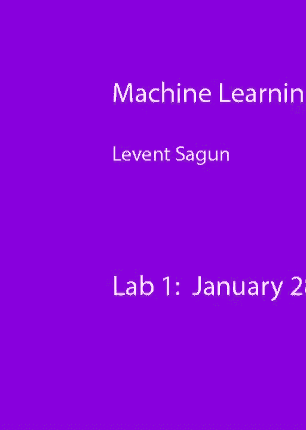
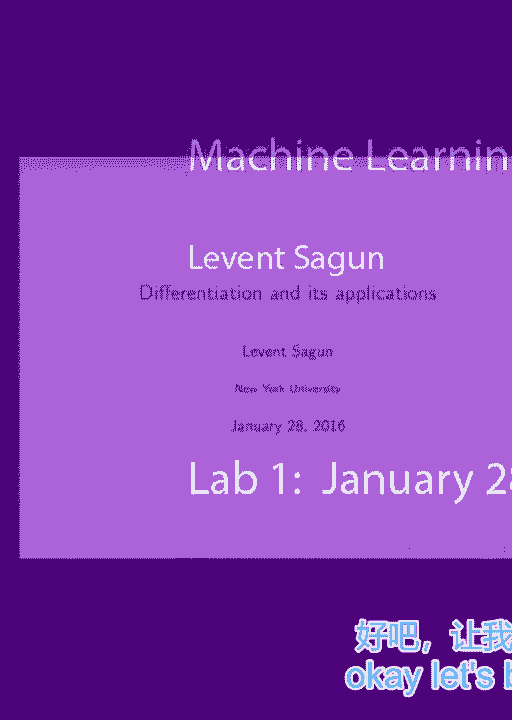
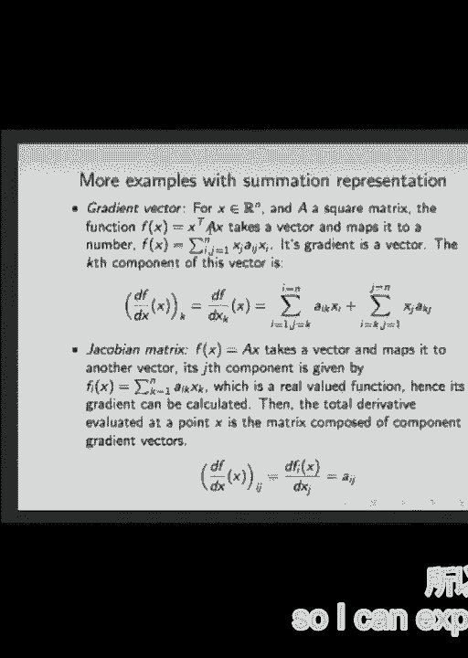
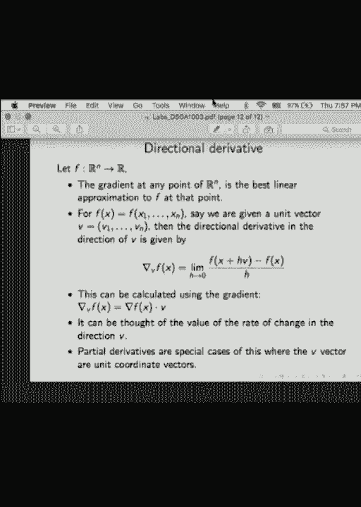

# 知乎推荐-纽约大学机器学习公开课 DS1003 Machine Learning - P2：2.Jan_28_Lab - Tesra-AI不错哟 - BV1aJ411y7p7

所以只是想了解一下你的背景，关于你的数学背景，尤其是你们中有多少人熟悉微积分，和高级微积分，特殊多元微积分，你们中的一些人和手的高度，我想这是一点知识，是一个小年龄，所以我们会试着把它们刷起来。

希望很快就能达到标准，所以是的，在我们深入研究函数的导数和求导之前，让我们从一个我们在生活中实际使用的例子开始，你也，我在一个典型的问题中见过，你有一个你观察到的输入，你想出一个过程，接受输入。

并将其转化为某种输出，你在边上有真正的标签，你把两者进行比较，如果你想出的过程真的被真实的观察所偏离，你想观察的真实事物，那你想给它一些惩罚，惩罚取决于你如何构建你的成本，可能会花更多的钱。

如果你在远方，可能是线性的，它可能是二次的，可能是，呃，可能是零一损失可能只是，你知道，你给零成本，如果它确实是，如果完全匹配，你给出一个成本值，如果它找不到正确的值，它可以是其他任何东西，所以在。

最简单有趣的例子至少我们有观察到，我们有一个矩阵的作用，我们已经出来了，损失函数为x的l，我们把平方损失乘以一半，矩阵的两个范数乘以输入观测减去，我们的目标是最大限度地减少这种情况，当然啦。

有各种各样的方法来最小化，某种专门的线性代数方法来解决这个问题，但为了争论，我们就按这个渐变，因为这只是因为我们今天的主题是差异化，所以如果我们尝试使用某种基于梯度的方法会发生什么，这个函数是什么。

x的l x只留下一个巨大的空间，在那个空间的每一点，x的l指定一个值，该值描述曲面，表面是你知道的表面，它就像一个多山的表面，域可以是地球，函数值可以是你停留的点的高度，给你一个表面，在这个表面上。

你在初始点周围选择，然后你计算梯度，梯度指向最陡峭的下降，你看那个方向的底片，它指向最陡峭的下降，然后你沿着那条路走，你沿着梯度的负值走几步，它是做什么的，它把你带到某种低级的价值。

所以最终的目标是找到x的函数l的一个低值，因此我们称这个过程为优化过程，或者特别是最小化，你可以看到更新值，看起来有点滑稽的箭头，那不是等式，你知道对数学家来说，一开始，好像你在这里做什么，这不是平等。

某种等式，一边有x，另一边有X，如果我把它们抵消掉会发生什么，那么什么，那些符号是什么意思，在记住风景上一个运动粒子的类比时，更新规则实际上是，描述你步骤的方式，每次左手边是你目前的位置。

右手边是你的下一个位置，所以你只需按照给定的规则再次将当前的位置替换为下一个位置，让我们专注于所有这些小项目意味着什么，现在看起来有点微不足道，但最终它会变得非常有用，了解您正在处理的对象是什么。

那么我们有什么，在箭头的一侧，在箭头的左手边，观察到的是什么，我们将观察表示为向量，所以它是一排写的一堆数字，箭头是什么？箭头是我们采取的步骤，因此箭头表示替换过程，把左手边换成右手边，你更新左手边。

但是负号，负号可能意味着一堆东西，其实你能知道你，你实际上不能减去一个向量，呃，从常数，对呀，那就有点毫无意义了，你不知道该怎么做，你可以试着从向量的每个分量中减去一个常数，那是一种方法。

但是你必须为此定义一个特殊的减法过程，这不是标准程序，所以每当你看到手术，你需要明白那个操作是做什么的，那个运算把两个数减去实数吗？到矩阵，组件方面，两个向量，组件方面，如果是这样的话。

它从另一个向量中减去两个向量，然后你需要确保，该操作两侧的两个对象确实都是向量，这是一个常见的错误，即使是研究人员，实际上我的一个合作者，是我即将展示的错误之一，呃，所以没有办法，呃。

为自己摆脱那些错误开脱，但记住他们是好的，在这个方程中，它是一个标量，告诉你你要迈出多大的一步，如果太大了，然后山上的徒步旅行者迈出巨大的步伐，或者从一座山跳到另一座山再跳到另一座山，它哪儿也去不了。

所以它分叉了，你不想把它拿得太大，如果你拿得太小，然后它只需要这些微小的步骤，它动了，它最终会收敛的，但这将需要永远，但最终，它的作用是它只是一个标量，所以它缩放你有的向量。

你用梯度得到的分数可能不止一个，可能不到一个，取决于你的风景，在某些情况下，这将决定，所以在这种情况下是一个数字，从设置中你还记得x的l是一个实数，它把一个矢量，L是一个取向量并吐出数字的函数。

所以这是一个数字，但是L的梯度是一个向量，因为x有n个分量，因为x是x存在于我们的n上，对于每一个梯度，都是由偏导数组成的向量，所以对于x的每个分量，你求导，并排写出所有这些导数，形成一个向量。

给出梯度向量，那么我们在这里的最后一个乘法中有什么，这没什么，那里没有写符号，但这是乘法，它是常数与向量的乘法，所以你基本上把向量的所有元素相乘，给你同样的常数，也证明减法运算符在这里是有效的。

因为你从另一个向量中减去一个向量，现在让我们假设我们有，我们在二维空间上工作，一切都很好，等于，等于2，我们进行了矩阵乘法AX减去B，这是一个简单的表达式，我们有x的L的开形式。

现在的目标是找到这个的导数，我们要怎么做，我们有两个组件，x1和x2，所以我们对x 1求导，首先把它写在渐变的第一个分量中，然后我们对x 2求导，我把它写在梯度的第二个分量中，在这个方程中表示。

如果你这么做了，那么你们中有多少人记得或者在内隐微分方面有困难，都清楚了吗，或者如果我们有问题，一个1是矩阵的条目，所以记住x在r2中，A是矩阵，尺寸m乘m，然后我们可以通过，按其成分计算。

我们可以表示x，按其成分计算，说可能是通过它的成分，然后很明显，当你做a和x减去b的乘法时，你得到了什么，你得到这一行乘以这一列乘以x，乘以x的第一个元素。

所以你得到一个1 1 x 1加一个1 2 x 2，减去b的第一分量，A的第二行乘以列向量x，也就是2 1 x 1加2 2 x 2，从这里减去b到，向量b是输出空间的一个元素，是呀，那么这必须是一个向量。

右轴减去b必须是一个向量，但x的l是标量，我们是怎么得到标量的，因为我们得到标量，因为我们只是把它的规范，平方范数，向量的平方范数是多少，它只是它的元素的平方和，所以如果我们有一个向量v，看看平方范数。

如果你知道V表示为V，一个，v，两个，那么我们知道这就是v1的平方加v2的平方，所以你得到了完美的是，我只是在这里把轮毂放在L的原始定义中，或者在L的原始定义中，有一个帮助，我是说，这是一种。

把一半放在那里好像是个诀窍，因为如果我求导，这两个就会出来抵消一半对吧，这是我求导的唯一一点，我不想那样，我不想处理常数，只是因为这个原因，所以我们通过取这个向量的范数得到第一个方程，ax减去b。

现在我们要区分，我们如何区分，我们首先对x 1分量求导，第一个方程，然后我们就第二个组件进行了区分，也就是x2，所以如果我大声读出来，如果我把x的l除以x 1，现在我在括号中有一个表达式，会发生什么。

让我们看看DX一个，这是部分PDX一个中的一个，一加一，二x二减去b一，平方，那么这两个是什么，我也有同样的表情，我把这个放在这里，一一一二二减去b一，然后我对内部求导，链式法则对吗。

所以如果我在里面求导，我唯一得到的是一个，因为其他一切都与x 1无关，所以我把这个乘以1，你在第二个学期重复同样的事情，给你第一个组件，你对x做同样的事情，得到第二个分量，这是平方范数的定义，所以说。

嗯，如果你有一个矢量，它的内核是什么，怎么样还好，你有标准的坐标系，你有一个矢量，这里是这里是四个，这里是三个，这里是四个，它有多长？五对，它的长度是五，1。你是怎样算的？3的平方根加4的平方根是5。

所以那是，这是平方规范，我只是找到了，这个一二，这两个，这两个意味着我们在看欧几里得距离，我本可以看看他们的总和，所以我可以定义另一个长度的概念，这个向量的长度是7，比如说，3的绝对值加上4的绝对值。

你可以定义曼哈顿距离，也就是把这个点的长度为7的网格求和，所以但是但是这里的问题是，如果你想把它写下来并用Python编码，除非你有一个很好的矩阵形式，这将是相当长的时间，你不会想这么做的。

你不想定义向量并取它的第一个分量，然后第二个组件，把它们都写下来，你，你不想把这个表达式写得完全正确，你想给你一个很好的简洁的形式来写东西的账户，所以有两个例子，第一个是A是二次型，这里的函数。

它被称为定量形式，尤其是对称的时候，是的是的，它有很好的特点，这个这个这个形式，这个功能是很好的功能，但我们对形状不感兴趣，现在我们感兴趣的是通过内隐微分来寻找一个精神，你怎么，你是怎么做到的。

我们有f的x x转置x，首先可以写，你们熟悉这个求和表达式吗，如果你用矩阵矩阵乘法，你能把它写在求和表里吗？这是一个非常有用的，所以这部分是a乘以x，那会是什么，x的维数x由，所以它是x缩放。

所以乘以x，首先呢，它是，它是一个矢量对吧，不是号码的问题，它不是矩阵，它是一个矢量，所以我们在这里有一个向量，这将是多少x转置乘以x，是数向量矩阵向量吗，所以它是一个数字吗，好的。

我们中大约四分之一的人为第二个工作，那些说矢量的人怎么了，好的，少一点，这将是一个数字对吧，没有x转置ax将是一个数字，给我，这是这种形式的东西，矩阵是这样的，x是这样的。

所以如果我把这样的物体和这个相乘，我要买什么，我得到，和另一个同类，所以我有这个，我有这个，我得到了什么，现在，数字，所以我可以用总和来表示这个数字。

所以我可以用那边的求和公式来表示这个数字，这个微分告诉我，我可以保持，其中一个术语不变，并相对于另一个术语有区别，不管我保持不变的是什么，如果我做了手术，我有一个总结令，所以让我们说。

我将只保持i项不变，并对j进行微分，如果我这么做，那就只能得到j等于k的条件，它是在第一次捕捉到的，所以我只修正j等于k的那些，其余的我都不碰，记住我在这里，当我从1跑到n时，也可以是k，但我不在乎。

因为我已经决定修好它了，把它固定好，我固定的那些，我必须在第二个中区分，第二届，所以现在我要保持j从1到n，可以是K2，然后固定i等于k，可能是解决这些问题的最简单的方法，有时会让人困惑。

因为当i和j等于k时，你就是你实际上在做的事情，两者相等，好的，你真的有这种东西，你有x k的平方，微分x k的平方，当然你可以把这个病例作为一个特殊的病例来治疗，然后你可以说，好的，那将是两个x k。

但是这里的隐式微分对你来说很有用，而不需要隔离该特殊情况，所以在这里你把这个当成一个产品，dx k乘以x k乘以x k，通过内隐微分，你可以保持这个固定，并对这个求导，它给你x k，保持这个不变。

对第一个求导，这给了我另一次逃避，所以你一路上恢复到x k，我只想举一个例子，您可以选择任何其他函数，所以为了有一个渐变，我需要有一个真正有价值的函数，这是最重要的实值函数之一，好的。

第二个一秒钟的例子，有什么效果？有什么影响，是数向量矩阵吗，在第二个里面，雅可比矩阵情况，它是一个矢量对吧，所以如果我微分一个位于n上的向量函数，我得到了什么，当我微分一个实值函数时。

我已经得到了一个向量，如果我微分一个向量值函数，你认为我会得到什么，矩阵，对不起，我听到一个关键词，是呀，我听到关键词了，好的，我们会得到一个矩阵，因为函数f，可以表示，一堆实值函数，他们每个人都是。

它们中的每一个都可以根据其组件而区分，每一个在一个简单的输入空间中有n个组件，所以它的导数是一个向量，梯度f 1是一个向量，同样梯度f n也是一个向量，所以我要得到n个向量，它们可以用矩阵形式表示。

这叫做雅可比矩阵，这种函数最简单的例子是矩阵乘法，正如我们所料，它表现得很好，乘以x的导数是，你得到同样的东西，如果你用标量函数来做，对呀，它是常数乘以x，如果x为真，导数就是常数本身。

但在这里不是那么自动，你得经过计算，但计算很容易，谢天谢地，任何问题，在上半部分，第一个数字是什么，第二个是什么？数字正确，我们几个月前做过，第三个是什么？第四个是什么？

让我们从内部开始转置是一个矩阵对吧，所以矩阵乘以x是一个向量，原始向量和行向量相乘，第一个圆括号中的列向量给出了数字，移位的数字仍然是一个数字，一个转置就是一个，数乘以向量就是向量，所以它是一个矢量。

第二部分，如果你有一个从周围到周围的函数，记住它是这种形式的东西，除了有一个空的，向右锚定一些矩阵，就像这里的雅各比矩阵，所以如果你忘记了一般形式下发生的事情，就像从A到M的泛型函数的生成器。

你总是可以回到例子中，如果你回到例子，这些例子是最有帮助的，它们不是微不足道的例子，但他们不是最难的例子，它们给了你一个基本的想法，就像x的f和ax的情况一样，这将是一个矩阵，第二个是什么？是向量。

但是它是行向量还是列向量，就是渐变，行向量，或者标量函数的梯度，好的，在这个类中有不同的转换，我假设它是一个行向量，标量函数的梯度，如果标量函数的梯度是行向量，那么第二个呢，是行向量还是列向量，列。

是啊，是啊，对呀，因为我不，所以说，第二个不是这些函数中任何一个的梯度，但相反，我选择了其中一个索引，对所有函数的x，k求导，所以在偏导数的雅可比矩阵中，而不是取J函数梯度给出的一行，我接受专栏，这里。

它是长指数，如此相似，第三个是行向量，第四个是数字，我选择一个函数，实值函数，我只挑了它的一个组件，我对其中一个求导，这给了我一个数字，这里还有几个例子，有一些有用的问题需要思考，他们不是，呃，强制性。

但如果你试着对付他们，我很高兴，他们会在网上，呃，他们已经开始了，keu，请随时来我的办公室问关于这些和其他事情的问题，小时，但这些问题是为了确保你理解导数的应用，也让你做这里常见的错误。

然后不要在你的项目中做它们，因为我第一次告诉你我的同事上周，我们花了大概五个小时试图理解为什么我的代码用一种语言编写，用另一种语言编写的代码，不会给出同样的东西，因为我们为同样的事情建模。

为什么我们不得到相同的渐变，会出什么问题，你检查一切，对我来说似乎很有效，对他来说似乎很有效，我也是，你找不到它，结果是在像这样的函数的导数中，你知道你会犯的常见错误，就是说，假设我有i j x。

i j w i j x，i j和，因为你要求导数，如果你说，好的，让我们来求导数，x的f的d i，因为我在看导数，我希望J是我，我保持不变，所以我说，好的，这个导数就是，我从1跑到N，j等于w的i。

i x i平方，一只不见了，所以我，那是个常见的错误，所以一旦你犯了那个错误，当然你会得到错误的渐变，因为你缺了一个完整的学期，那里的混乱，如果你小心的话，你知道吗，这里的束和i和j，所以除此之外。

你不能使用相同的索引，i的范围属于求和，你不能把i的作用域应用到这里，然后求导，关于i分量的导数，并且表现得好像i是外部函数的某种因变量，对呀，如果你还记得两张幻灯片之前，我写错了什么。

常见的错误只是实导数的一项，所以你重复它是一个有用的练习，为了，三重积，而且，如果你能找到简单易行的二阶导数，那就很有用了，有点长，但对你来说，跟踪指数是一个很好的做法，并习惯符号，它对编码有很大帮助。

第二只，你们中的一些人在上学期的课堂上，他们记得这是倍数的最大似然估计器，高斯率，在一个例子中，当然啦，我们这里没有多个例子，所以不会是他们的总和，不会是平均水平，但这是另一个有用的例子，会有很多。

那又是差异化销售，第三个，如果有域约束，如何解决优化问题，你的道路被限制在某一轨道上，就像如果它是一辆车，你不能把车开到任何地方，你必须坚持在路上，即使梯度指示你去田野，你可以开车穿过田野。

你必须坚持在路上，那是你的限制，所以在球体的最简单情况下，你会怎么做，这是一个简单的投影问题，这也是一个有用的练习，另一个是经典的，随机分布在计算机中的产生，计算机如何生成，比如说指数分布。

生成均匀分布相当简单，所以你可以使用均匀分布并转换它来获得你喜欢的其他分布，通过使用函数，所以让我们回到梯度下降，在我们这样做之前，有什么问题吗？关于如何区分，在其他事情上，类位置，办公时间。

你熟悉那些问题吗，他们来自不同的学科，不同的班级，你很少在一节课上看到所有这些问题，所以我希望你们中的一些人熟悉，他们中的一些人和你们中的一些人需要熟悉，也可能你们中的一些人根本不熟悉。

这就是这门课的重点，对呀，否，我不会，但你可以在办公时间来问，因为看到这些问题的解决方案对你没有帮助，你需要经历犯那些常见错误的痛苦，现在一旦你想把变量x转换成u，u转换成x，你必须区分他们的PDF。

但它们的密度函数，但是你要把一个和，你知道的，哪个是，哪一个有用，这将是一个常见的错误，如果我写解决方案，你读了，我会说好，好的，那很简单，我能做到，但你知道，如果你必须这么做，你写出方程。

然后不是y除以dx，你写X或Y，然后你得到一个不同的分布，你想知道为什么这些东西不匹配，我是这么说的，因为我犯了所有的错误，所以你唯一不做的方法就是，你知道吗，至少做一次。

你相信微分是一个很好的运算符吗，这是一件很好的事情，它很有用，那又怎样，所以让我们回到旅行的登山家，在陡峭最陡峭的下降方向，目标是什么，随机徒步旅行者想去哪里，我想走那条路，什么是什么是什么，什么是。

下一步是什么，教授的笔记中有四个停止标准，对但它们都把你引向同一个地方，差不多是什么地方，最低限度，最小，但它可以是最低限度，我也是，因为你不知道在这个表面上是否有一个唯一的最小值，又好又凸又可微。

所以它需要你，所以你跟随渐变渐变变得越来越小你就停了下来，那么梯度就不再转化为实际的进度，所以当你到达一个城镇或村庄时，你基本上会停下来，但你可能会停下来，因为你在山谷里，它是平的，梯度为零。

没有办法去别的地方，就像，就像这样一个平坦的表面，所以在同一水平上有无限多这样的点，梯度为零，因为无处可去，不再有什么意义了，你可以想象各种各样不同的风景，当你有一个凸函数时，好的地方是。

就是你有一个独特的这样的点，你知道你最终会在哪里，如果景观是凸起的，这很有用，但如果不是漫画，它就完全没用了，因为你可以想象，如果它是高维的，你可以想象很多，很多不同的东西。

但最终现在应该很清楚一些程序的梯度，它会把你带到某个临界点，临界点是梯度范数为零的地方，当梯度的范数为零时，你不能超越这一点，因为徒步旅行者唯一的动力是当地是否有下降，如果没有下降，即使你在山顶上。

没有下降，所以你哪儿也去不了，梯度为零，你停下来，如果表面是这样的，你从这里开始，梯度为零，你不要动，当然啦，如果你知道它来自物理，你知道这是一个不稳定的点，稍微的扰动会帮助你摔倒。

但这是为了告诉你临界点，梯度为零的点是至关重要的，它们可以以各种方式出现，你怎么能把这些点分类呢，你怎么能把一个最小值的点分类，从一个点，这是一个最大值，他们似乎在为梯度下降而工作，一旦你到了那里。

你最后动不了，一旦稳定的不稳定，所以为了分类，你看二阶导数，实值函数的二阶导数是矩阵，它是一个对称矩阵，因为如果函数是好的和可微的，关于x 1和x 2的偏导数等于，关于x 2和x 1交换的偏导数。

分化的顺序变化不大，所以我们得到一个对称的垫子，对称矩阵的性质是什么，不总是零是对称矩阵，取决于它可以是负半定二，只要取减号a，它们的特殊对称矩阵是特殊的，因为它们的特征值是真实的。

可能是他们有复杂的情况，但它们是实对称矩阵是实特征值，那是那可能是，线性代数中最重要的三个定理，柱子可能是的，真，是啊，是啊，但这意味着什么，那么为什么我们对二阶导数的特征值感兴趣呢，我们对此很感兴趣。

因为如果你知道所有的特征值都是正的，那么我们在这个政权是在第一张照片中，所以这是当地的最小值，对呀，我们知道，如果有指向负方向的特征值，我是说，如果有些特征值为负，然后我们就会有这样的形状，记住定理。

定理是如果你在那个点附近有一个凸函数，它要么是一个临界点，梯度为零的点，或者你可以往下走，你可以迈出一步，但如果你有一个凸函数，这是真的，如果您有更改的非凸函数，即使马鞍的中心在那里，顺便说一句。

有一张马鞍在马背上的真实照片，那里有真正的山谷，所以它们不仅仅是隐喻，它们在那里，你看，即使在马鞍的中心，梯度的梯度范数为零，它不是当地的最小值，不看照片，你可以通过观察黑森本身来理解。

通过观察黑森人的特征值，所以如果你，如果你看上面的这个函数，测试的特征值是一对一，对x 1求导，然后把一切都拿去尊重x2，你得零分，对x 1求二阶导数，你得到一二，你得到两个，好的。

所以特征值将被转换为，他们是积极的，他们面朝上在另一个，我们要吃一些，我们会得到2和-2，所以一个特征值是两个，另一个特征值是-2，所以这告诉我们有一个方向是弯曲的，还有一个向下弯曲的方向。

如果我绘制函数号，我会得到什么，减x 1平方，减去x 2的平方，那会是什么样子，就会像这样对吧，就像一只狗，它将与第一个完全相反，这也有一个临界点，梯度为零的点，梯度的范数为零，在它的顶部，就像这样。

但那是不稳定的，那是，那是一座山的顶峰，好的，有什么问题吗？我也可以有退化的景观，我该怎么办，如果我有一个退化的无界平坦的东西，我有梯度下降，我继续前进，没有束缚，对呀，我只是不停地移动，这就是为什么。

嗯，所以你可以从中吸取一个教训，除了徒步旅行者的直觉和梯度下降，每当你有一个定理告诉你一些事情，你应该停下来，对这些情况有点挑剔，所以这个定理成立，当函数是凸的，函数是有限的，然后你马上问自己，好的。

如果它不是凸的会发生什么，为什么会失败呢，为什么那个定理失败了，我怎么能想出例子，在非漫画的情况下，打破了这个定理，第二个假设是金融权利，如果它是unmo会发生什么，我怎样才能打破定理的条件。

任何其他问题，好的，我还剩一张幻灯片，但我们每次都要提前两三分钟完成，因为，我们的摄影师要跑另一堂课，幻灯片在线，你知道我的办公时间，请过来提问，如果你有时间。

