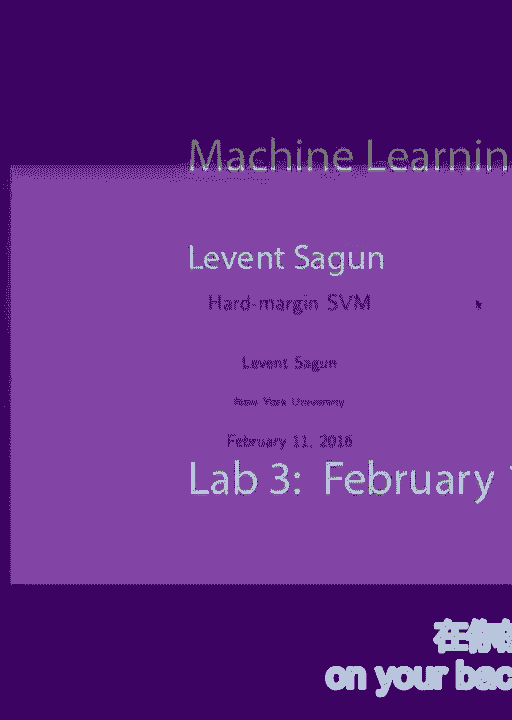
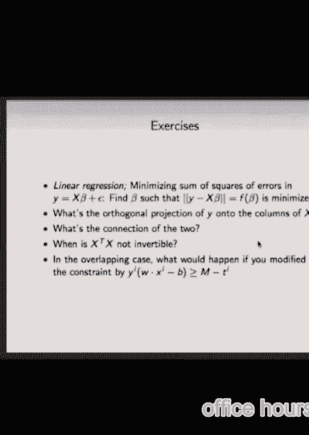
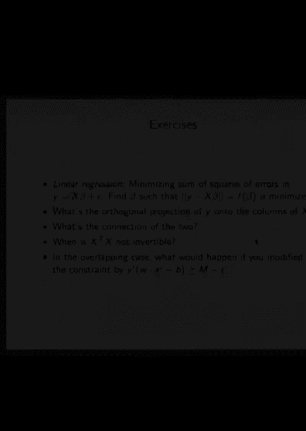

# 知乎推荐-纽约大学机器学习公开课 DS1003 Machine Learning - P6：6.Feb_11_Lab - Tesra-AI不错哟 - BV1aJ411y7p7

 What kind？

 Abstract stuff。 Where do that come from？ Yeah。 All those equations。 The objective function。 Yeah。

 but， you know， did you start？ So the goal of this class is going to be building up that support vector mission objective function from scratch。

 From the very beginning。 So that at the end of it， if you didn't， you know。

 if you don't remember in a loss function， you'll be able to just start devising the problem itself。

 And by that step， I think you'll be able to come up with the loss function by yourself。

 So what's the main problem？ Why do we need things like support vector mission？ Margin？ For what？

 Optimization。 Optimization for what purpose？ Classification。 Classification。

 When they classify things， we have a bunch of points in the cloud scattered。

 When they classify them。 So we want to find a separator。

 We find a separator that actually gives us a good result。 What do we actually want from a separator？

 What is a good separator？ Because you can have plenty of things that separate two different classes or multiple classes as well。

 What quantifies a good separator？ Loss function。 Loss function is just the measure of a cost。

 You want to decrease it because you want to pay a little cost。

 But you can come up with loss functions that give you low cost。 Nevertheless。

 it might be performing bad when it comes to clarifying points。 [inaudible]。

 So you could do statistical comparison if you have input to no。 Okay， that's an idea。 Another idea？

 Yes。 Yes， you can find a decision boundary。 If the data is separable。

 which means that their convex halls are not going to intersect。 What's a convex hall？

 The smallest convex body that contains all the data points that I have。 If those don't intersect。

 that means I can find a hyperplane that separates the two data points。 That separates the clusters。

 That's going to be my decision boundary。 Beyond that boundary。

 I'm going to assign class A and about the boundary， I'm going to assign class B。

 That will be the perfect separation。 If the data is linear separable， that's what I want。

 In most cases， it won't be linear separable。 But still， that seems like it's a good starting point。

 So if we have。 Okay， let's see an example。 That's a linear separable data。 The convex hall。

 do not intersect。 The convex hall of this goes from this boundary up here。

 And this one has a circle like this。 It seems like the blue cluster has a bunch of outliers。

 Nevertheless， it's convex hall is still not intersecting。

 so I can find the decision boundary that perfectly separates those points。

 There is plenty of such boundaries。 Which one am I going to choose？

 Which one seems like a better candidate？ That one doesn't look hard。 This one？

 That one doesn't look too margin。 So what's margin？ You defined it in previous class。

 Y times F of X。 So what's Y and what's F and what's X？ So margin is Y times F of X。 Y is what？

 The actual output。 What values does it take？ Minus one or one。 That's all assumptions。

 All of these things we just make up。 So margin is also something that we defined。

 Now of course we want to define margin as the distance between the two convex bodies。

 So if I have a cluster like this， the convex body is going to。

 the smallest convex body will have this shape。 And for another body。

 another set of data points is going to be like this。

 So we want to find the minimum distance between the two and call it the margin。

 Y is F of X is the outcome of our particular specific formulation。

 We designed the problem in such a way that the margin becomes Y times F of X。

 And here X is not an arbitrary point。 X is the point that's closest to the decision boundary that I pick。

 In the end， after the optimization that's what you will find。 And then the midpoint， why midpoint？

 Because if you move a little further， you're not going to be maximizing the boundary。

 You have smaller distance to class A than to class B。 And if you move into the other direction。

 you have smaller distance to class B than class A。

 So midpoint seems like the intuitively the one that maximizes the margin between two clusters。

 It doesn't have to be midpoint if you have more than two clusters。

 So how does it happen that margin becomes Y times F of X after our design？ Before going that。

 let's start with a hyperplane is how do you represent a hyperplane？ How do you represent a line？

 A line is just a simple precalculus equation。 Y is equal to M times X plus B。 M is the slope。

 And B is the intersection。 The Y-axis intersection。 In a little more linear algebraic terms。

 we can rewrite this in this matrix model。 In this vector dot product。

 And we want to generalize this。 So instead of working with M and minus one all the time。

 which seems to be the standard formula precalculus。

 we want to write vectors in terms of its components。 So those vectors seem to be in R2。

 So we'd say W1， W2 instead of M and minus one。 And their connection is pretty trivial to calculate。

 But we're writing it in this form。 It allows us to understand what a hyperplane is。

 So you can generalize it from this equation W1， W2 dot X1， X2。 Take it up to N。

 Let's say we have vectors in Rn。 Then the equation becomes W dot X plus B。

 And then the hyperplane becomes the level set of this function。

 This function is just a function that takes a point from a domain and assigns a value to it。

 Remember in the previous one， the rational case， the line was described by a little set of function。

 namely the function on the right hand side， when that's equal to zero。

 So all the set of all X's that makes the function on the left hand high zero， describes us a line。

 similarly the set of all X's that makes our dot product plus B zero， describes a hyperplane。

 There are pretty analogous concepts。 The equation is pretty simple to generalize。

 And then what other things do we have？ That V seems to have a special property。

 namely that V in this L of X equals to V dot X plus B is orthogonal to L。 What does that mean？

 What does orthogonal mean？ Perpendicular？ Perpendicular to what？ Yeah。 So in the usual case。

 if I have a line here， the V vector is going to be something like this。

 That's going to be perpendicular to it。 It's going to be perpendicular to any V vector I take from L。

 But it's a little special because this example passes through the origin。

 If it's shifted a little bit， if I have a line that doesn't pass through the origin。

 what am I going to do？ If I take a vector here， this vector， let's say。

 this is an orthogonal vector V。 And I take a vector on this V prime。

 Are they orthogonal to each other？ This vector on that vector？ No， they are not。

 Even though the point was chosen from the line， so it's not enough to choose a point from the line。

 the vector that I choose should be -- should live in the line。 So I have to choose two points。

 V and V prime， and subtract them so that I get a vector that's aligned with the line。

 And then this vector will be orthogonal to V。 In the computation。

 that seems to be one of the common trips。 In this picture， it seems clear。

 But when the computation is a little more attached to it， in higher dimensions。

 it can be a little more counterintuitive because you have -- you say you're in R3， you hit a plane。

 And you shift that plane by a little bit。 You mistakenly take a point on the plane thinking that that vector lies on it。

 It actually is a point in that， but it's not a vector that lives in it。

 It actually stands from zero and goes there。 So the whole vector。

 if you think of it as the line segment， it's outside of that plane。

 Then the dot product is not zero， so it has to live on there。 That's what orthogonal to me is。

 It's going to be a previous property。 Then since it's a linear function and it's described by the zero set。

 it's going to assign two different numbers to the cluster A here and to the cluster B here。

 Or in this notation to the cluster C1 and to the cluster C2。 And since it's a linear function。

 I can always rescale things。 I can always multiply and divide things by numbers as much as I like。

 So what values do I want L to assign in different clusters？ In this slide。

 the blue and red comes from this example。 So I just made the dot and said let's assign positive values to blue ones and negative values to red ones。

 And it's possible that this arbitrary I could have chosen the other way around。

 Is it possible for L to assign the zero value for enough of those points？

 When does L assign the value zero to the data points？ When it's on the line。

 when the data point is on the line。 So that says like a perfect separation that's possible。

 that's doable。 And typically I want invariant， the loss function is positive。

 So I want something that doesn't change with respect to the sign。

 So if I assign the value negative font to the red group and positive font to the blue group。

 then by looking at the product yi times L of xi will always give me a positive value。 Right？ Yes？

 [inaudible]， You can use vectors too。 That seems to be the， so for example in amnestic character。

 handwritten digit classification， you use vectors， ten vectors in Rn。

 But the numbers are restricted to zero and month outputs and they represent the probabilities of the guesses。

 So a simple output is like 98% 0。98 on zero if the input image is zero and it is trained out。

 And the rest of the nine entries sum up to 0。02% just making it up to one， sum up to one。 Yes？

 [inaudible]， Yes， I can move B as much as I want， right？ That's going to be part。

 that's going to be a great question。 It's going to be part of optimization process。

 So the arbitrary things that I'm going to fix now are going to be the things that are flexible。

 And the rest of the parameters will be tuned by the optimization method itself。

 Training will handle that。 So if I know that there's a perfectly linear separable data。

 then I can find a hyperplane that separates the two。

 That hyperplane can be described by the little set of a function of a linear function of the sort that's described。

 And once I have that， y times L of x， which is the same thing as L is F here， y times F of x。

 margin is going to be always positive。 And then I will maximize the margin。

 So the points that are closest to the line， they are going to matter， right？

 So when you speak about a point close to a line， then we need to talk about the distance of a point to a line。

 How do you find the distance of a point to a line？ Yes？ Yes。 Right， you take the projection。

 And you take the projection onto what？ Onto the。 Onto the。

 When you take the projection onto the line， not doing it。 What's this vvector here？ One thing。

 one everything crosses zero， it's easy to calculate。 But one there shifted。 Say this is zero。

 This is the line。 And this is any point given to you。 Let's say you know the equation of the line。

 which is L of x， which is the value that x plus b is zero。 How do you find the projection？

 Any guesses？ Let's say I took an arbitrary point on the line。 X prime。

 Taking x as a vector is not going to work out because that cues me this vector。

 This doesn't seem to be aligning with anything。 It's like it has not much value。

 So if I take a point on the line， what I can do is to construct this vector。

 But that was an arbitrary point。 Of course， I can pick any point I like。 So this。

 the length of this vector will not give me the distance。 How can I find the distance of x to L？

 Yeah。 So one that's orthogonal to it。 This v vector。

 So if I take this vector and project it onto the w vector， then I'll get the distance desired。

 Any other questions？ Yes？ Yeah， you could do that。 This way is the robust way to do it。

 It's in coolant。 Sandring things is if you sand through it。

 you'd pretty much pick your point zero and move everything here and pick your point zero。

 by taking the x vector。 So then they're just in coolant procedures。 Which one？

 The capital L or small L？ The small L is the function。 When that function is equal to zero。

 I get the hyperplane。 But this L is just a function， a linear function from R to R。

 The zero set of the function describes it with a hyperplane。

 But since it's defined on the whole of R^n， it assigns all sorts of values。

 But what I know is that since it's a linear function， beyond and above the hyperplane。

 it has different signs。 That's how I was able to separate the points here。

 The hyperplane was assigning zero values when there is， when the hyperplane。

 the values of the function are zero。 On the red cluster。

 the values of the function is negative numbers。 On the blue region。

 the values of the L function is positive numbers。 And since I appropriately chose to classify。

 the red one is negative。 Negative ones。 And the blue one is positive ones。 By design。

 by that particular choice， by times LI was always positive once I have a hyperplane that perfectly separates the data。

 Is it clear？ What's a hyperplane and what's the function？

 The function is just a linear function that's defined on the lower far end。

 And the zero set of which is the hyperplane。 Yes。 [ Inaudible ]， What can we prove？ Oh， yes。

 So far we started with the assumption that we have a separable data。

 And we'll go on to see how we can modify if we don't have a separable data。 Okay。

 With the projection， let's move on to the SBI。 So again。

 let's label our data that comes in two clusters。 Let's say one of them is C1， then we see two。

 And as usual， we have the hyperplane that separates the two clusters。

 Let's put a constraint on the norm of V， which we can do because it's linear。 We can scale things。

 And suppose， as mentioned here and previously， suppose I pick the points that are nearest to the given line。

 to the given hyperplane， and then I calculate the distance of those points to the hyperplane。

 So those points， of course the distance， it can also be calculated by YI， L times XI。

 For all points， when I calculate YI， L times L of AI。

 that's going to be always larger than the value of the minimum distance of the nearest two points。

 And this is one reason that when you find the hyperplane that maximizes the margin。

 it's going to be in the middle of the two points that are closest to each other。

 Let's call that this as M， once it's in the middle。 So this distance is M。

 and this distance will be M2。 The total distance is going to be 2M。

 Then we can rewrite the procedure of maximizing the margin。

 M is defined above with the only constraint that norm of V is going to be 1。

 So the W parameter is called strength-on-disphere。 That's subject to the following condition。

 YI times the value of the function L once evaluated on the data points is going to be larger than M。

 Why is it going to be larger than M？ Because it's going to be larger than margin at all times because margin is defined as the minimum such distance。

 So the thing I want to maximize， this distance， so this distance， so once I hit the hyperplane。

 this distance is going to be M。 And this is when I have YI times L of Xi， when Xi is this point。

 So if I take any other point， it's going to give me a larger number。

 That's the natural constraint that I counted。 For any other point in this cluster。

 YI times L of Xi is going to be larger。 So this will be lower bound。

 this will be my second constraint。 If this is clear。

 then the next steps will be just reformulations of this。 So far， we start with that assumption。

 If they are not separable， then we'll modify the procedure according to that assumption。 Yes？

 What if we have power-flighter observations in place？ Yes。

 that will change the lines that will change the cost。

 But we have no ones now in the days that we have。 Now even if we have outliers in the data。

 we assume that we start with the perfect separable data。 So very soon in two steps。

 if we have outliers that actually crosses the boundary， we will allow that。

 We will give some room for this。 For the outliers that actually cross the boundary。

 They are not here at this moment， but they will be very soon。 Yes？

 Is there a meaning to calculate the lower bound we want？ Because it's a linear function。

 I could scale it as much as I want。 So it's a natural assumption to restrict your class of functions。

 No， my key is the yi。 The root of the xi will be like half of the yi。

 Because this is what the L function assigns。 And the observation was that if I have a perfect separable data。

 yi times L of xi at the data point is going to always have the same sign。

 So if I drop this yi from here， then I don't have this sign definiteness。

 I might get negative points as negative values as well， which I don't want。

 That function is related with the distance of the time difference？ Yes。 So let's keep that in mind。

 this procedure， and let's modify it。 So if I have any payoff， then we can be。

 So I want to pass from putting a constraint on the。 So I want to pass from putting a。

 so I want to pass this problem with the constraint on v to maximizing n to an equivalent problem of minimum value。

 Of minimizing v， releasing that norm 1 constraint and minimizing v。 How can I make that shift？

 I'll use the same reason as I could put the constraint on norm of v， which is linear scalability。

 Then that will turn things around from a maximization。

 a large maximization problem to norm-inimization problem。

 A norm-inposition problem comes from this little tiny trick。 If I take any point w_b。

 then of course I can calculate n。 Then I rescale w_m_g by dividing both of them by n。

 What happens then， if I plug the new pair， w_prime and v_prime into the equation， instead of here。

 I divide everything by m， divide by m， this is divided by m。

 So this inequality will be greater than 1， instead of greater than m。 And since in this equation。

 the norm of w is constrained to 1， maximizing n in the sense translates into minimizing v_prime。

 Any questions so far？ By just scaling things， scaling the w_m_g variables。

 I was able to change the problem from this equation 1 and 2 to equations 3 and 4。

 This is a simple minus step。 Now here， if your observations are in order， norm of w_prime。

 which is going to be our new w， is 1/m。 That's why the maximization problem turns into an maximization problem。

 Your margin maximization problem turns into a norm-inization problem。 The problem is convex。

 in quadratic。 And now we'll go to the question of the clusters being overlapped。

 What happens if we have overlapping clusters？ So what will happen is that we will allow some room for each point to cross the margin。

 Previously we had the clusters， but we didn't allow。 it was a hard restriction。

 it was a hard constraint， that there were going to be at least an distance away from the hyperplane that separates them。

 So what we had was。 This wide border was clear of any points。

 Now we'll allow some of them to be sneak through。 So if something from the cluster one sneak through here。

 how much it will sneak through？ It will have sneak through this amount of。 You know， this much。

 And let's call this much。 If this is the point i， this distance will be ti。

 For each data point we will allow how much that point is allowed to sneak through。

 And that allowance， that little room for each point， will be called by ti。

 They're called slack variables。 We don't want it to be too much。

 Otherwise our prediction is going to be too off。 But we'll allow the little room for them to fall through。

 So how can we modify the first formulation using the slack variables？

 Remember the first formulation？ Let's keep equation five as it is。 The first one。

 you don't have to put any ti's in it now。 But the second one， equation six。

 we can represent it as eight by introducing the slack variables。 So instead of that function。

 that product being constrained from below by m， it's going to be constrained from below by m times one minus ti。

 So that from the original problem， ti in this case is not an additive distance。

 but it's a multiplicative room。 We could have done both。 So just like we did here in this setting。

 we modified the problem from， bonding things from below by m and having a maximization problem。

 Remember we changed the maximization problem to a minimization problem。

 Let's do the same thing here。 With the new equation， new equation of overlapping clusters。

 So once we do the same procedure of finding the equivalent formization in terms of norm minimization。

 and allugulcly to the previous case， we get the ones in the middle。

 the modified equivalent procedure。 As you can observe。

 the equations nine and eleven remain the same。 But in the rescaled one。

 equation ten and twelve are modified from equation ten to allow an additive ti。

 room for variables to sneak into the margin。 [inaudible]， Yes。 So here。

 the nearest point had the value m， y i times l of x i。 So for all other data points。

 I had this value to be larger than m。 But I want to shrink this value。

 I want to allow points to have some room。 So instead of them being larger than m。

 if I multiply with a constant that's less than one， then I actually shrink the margin。

 So the margin maximization problem is the first line。 That remains there。 That's the same。

 The constraint I put on the data points is in the second line。

 That's why I keep the margin maximization problem the same。

 So the margin is still at the same place。 The margin borders are still at the same place。

 But slightly modifying the second equation， I allow some variables to come through。 By how much。

 instead of being larger than m， I allow them to be as close to the line as m times one minus ti。

 Yes。 Yeah， in this case， no， because it's just a multiplicative factor。 So just a second。

 Good question。 So what happens if ti is larger than one？ If ti is larger than one。

 I allow this to be a little negative， but not too negative。

 So it can actually cross to the other side。 Yes， true。 Yeah。

 I think there's no optical ti to be less than one。 So it can be more than one。

 We can allow clusters to pass through the other side。 Yeah， great question。 Any other questions？

 Yes。 [ Inaudible ]， This allows them to be to lie within the margin。 [ Inaudible ]。

 Too far away from the region？ [ Inaudible ]， I'm not sure I'm perfect to understand the question。

 but if the data points are on the other extreme， then that's not an issue because they are already separate。

 So the outliers in the other part don't bother me because I'm worried about the boundary between the two。

 If that answers your question。 Okay。 So now， the overlapping clusters we modified procedure。

 So equations 11 and 12 are the final versions of the modified problem。

 That is what we obtain after rescaling。 So we modify from margin matzimization to norm minimization。

 And we change the second constraint so that we allow little room for points to sneak。 Okay。

 that's so far so good。 But note that since I rescale the W's to W' here in this equation 11 and 12。

 I don't have to keep using that W' and B' they are just like in other points。

 I can go back to the original notation of W's and B's。

 I can forget about M that's in the background。 One side and a subtle bit equations 11 and 12。

 And then I can， I don't want to allow too much of them to go through the other side or go B in the margin。

 Or the cross， the barrier that they are not supposed to cross。

 So the constraint I'll introduce is a constraint that bonds the sum of those slack variables。

 So some of TI is going to be less than C。 That seems like another reasonable constraint to put。

 And I could put the norm minimization problem in combination with the sum of slack variables is less than some constant problem。

 into one equation to one compact form that is introduced in equation 13。 So that optimization。

 so minimizing that problem one half norm W squared plus C times sum of slack variables will take care of。

 So I can minimize the norm that I want and it's going to bound the sum of the slack variables。

 And the equation 14 is the same as equation 12 except the W's and B's the primes are removed。

 And of course here in equation 13 we still have W in Rn and， TI's are real numbers。

 So let's see how this looks like a picture。 We started with the subrable case。

 This is the first picture on the left。 This picture is taken from this book and the notation is just slightly different。

 So there's a reference I wrote here that the beta is going to be the values that I've used all along。

 So beta not is the B's。 So beta not is the shift and W is the norm。

 the parameters that we want to minimize。 That whose norm we want to minimize。

 So if you start with the separable case。 Remember beta was the W's and norm of W was 1 over M which is represent the theory as well。

 So that seems like a correct transformation that we did。

 And the margin is the two lines that are equally distant from the hyperplane that we found that separates the data completely。

 In the first case we don't allow any points to be in the margin or to。

 But we want them to touch at the border of the margin。 That's because of the maximal principle。 Yes？

 [ Inaudible ]， Here？ So here in this example it wants to have this point， this green point。

 There are two green points that touching on the line。 So that kind of fixes one line。

 If you didn't have that point， how are we going to take one？

 So in what cases you can have multiple lines that are equally that give you equal margin。

 It doesn't seem super likely that you'll get equal margin。 You can have that。

 you can have scenarios in which you have equal margin with different lines。 So we need another case。

 So in this case the problem is convex so it has a unique minimize。 If it has a unique minimize it。

 that means you'll actually find a single hyperplane that separates the two parts。

 There is not much room for you to have multiple results of the same optimization problem。

 There will be cases in which the optimization process will be non-convex。

 And you'll find sort of equivalent results。 Maybe not exactly the same but the optimization procedure will give you two。

 three different hyperplains。 In this case it's going to be a convex but a decision boundary is the same。

 In this case you don't usually find all of them。 You find one of them and you say okay that's fine。

 In the non-convex case。 But in this case there is one solution actually。 Yes？ Number ten。

 Nine and ten。 Nine and ten is the same thing。 Nine and ten is just a copy of three and four。

 Three and four is just the rescaling of one and two。 Behind which one？ Three and four。

 So how are you going to construct the right to tell and start an optimization procedure？

 It seems a little easier and more convenient from a computational point of view to minimize the norm rather than maximize the margin。

 Or the point of all of the other points。 And then you can find the deviation of one and two and one and two。

 And just to quantify the deviation。 So that's a good question。

 Simple algebraic transformation that we did from one and two to three and four。

 And that simple algebraic modification pretty easily solves the problem。 I'll think about it。

 I think TI is presented only to negative learning that we either underline a lot of the。

 technical instances。 Yes？ So they should be dead。 We didn't say TI is negative。

 If you said can TI be larger than one？ Oh。 If TI is larger than one than the y times function that's going to have some negative value。

 So that means in this example， for example， look at C5。 C5 is like TI and that has more than。

 in this case， it's M。 In the scale version it's going to be more than one。 Yes？

 So how much should we see how less theoretical and not to be more than having a bigger margin？ Yeah。

 So you don't want to control all the margins one by one but you want to control some of them。

 And a lot of them， they are some to be too much。 Which is captured here in the second term of 30。

 So I'd like to call options between these two。 Yeah。 So if you constrain the sum of them。

 not a single of them can be too much。 Yes？ So we defined them as like a set based on the separability。

 So that I'm confused like the meaning of them once you get into a non-submarine equation。

 Good question。 Is it data separable？ So you set up the problem， you set up normalization problem。

 It's as if the data is separable。 But once you get in love some of them to have this T way。

 it works out the same。 So that's why the picture is the same here。

 It's as if the margin is there for the separable case， the wide band。

 But then the extra slack variables is introduced allow them to come in。

 So the equation 13 here is like margin maximization converted into a norm minimization。

 But it has the additional benefit of allowing some of the points to sync in。 Okay。

 I have a few further problems。 If you have some time， please try to think about them。

 Feel free to come to office hours from ask which discussions。 Thank you。 [BLANK_AUDIO]。

