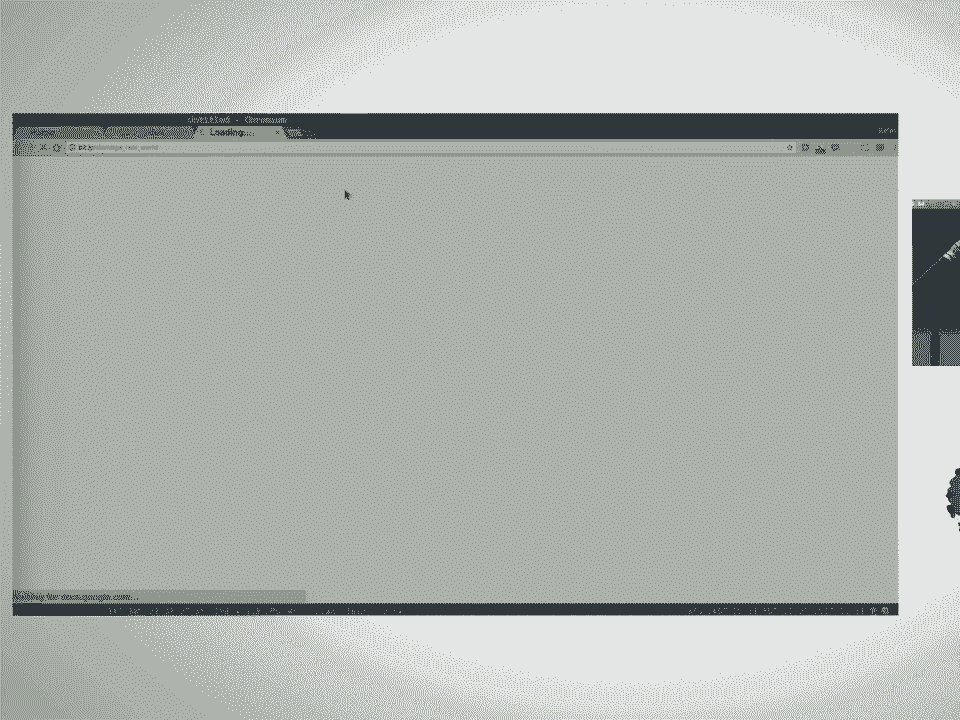
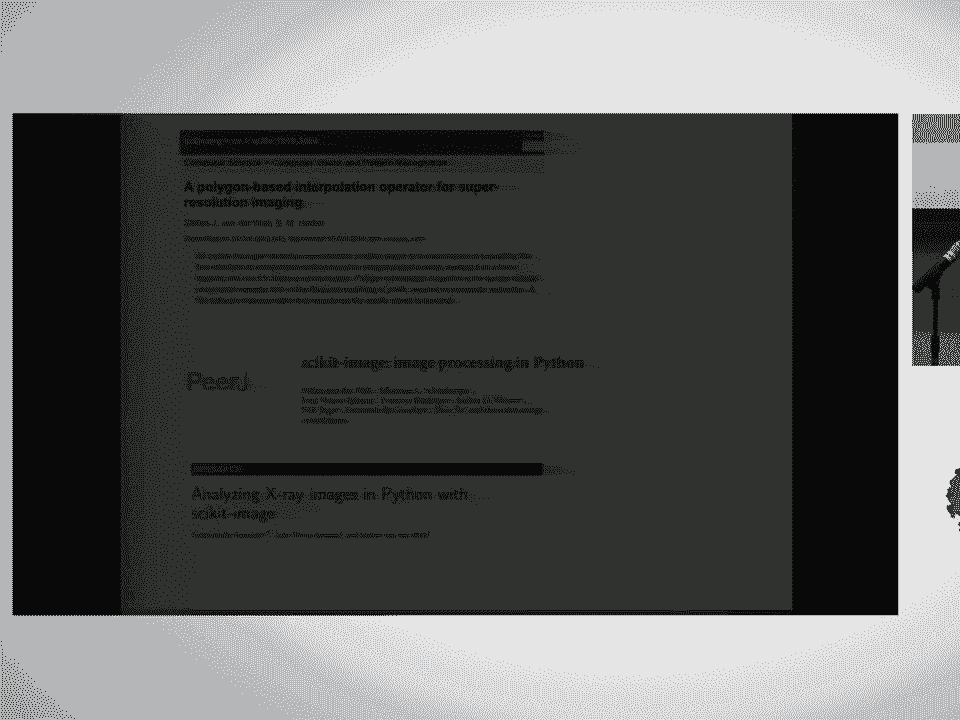
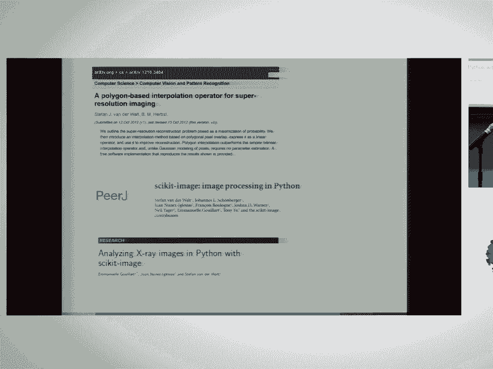
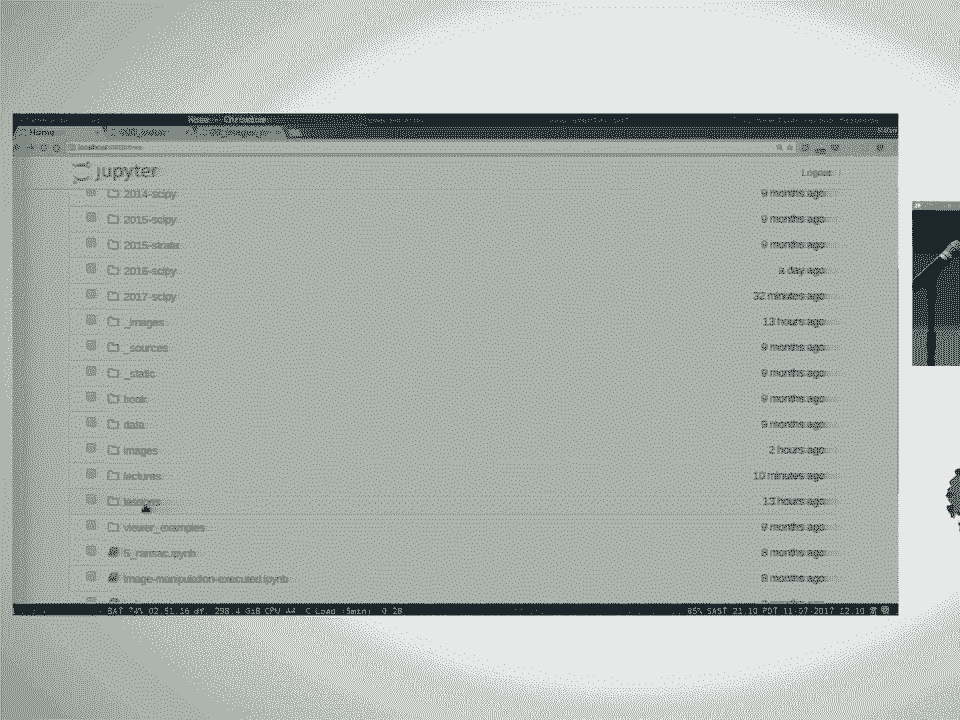
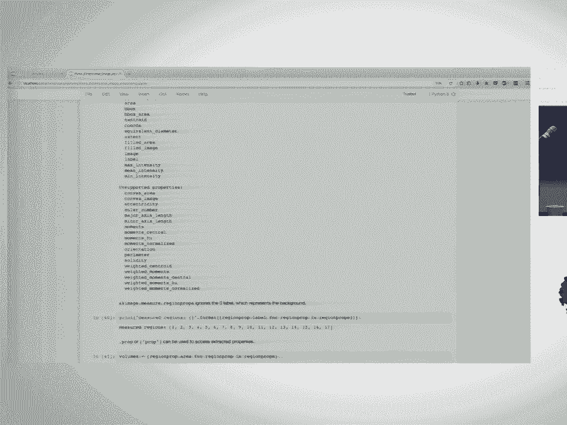

# P14：scikit image - Image Processing for Python  SciPy 2017 Tutorial  Stéfan van der - 哒哒哒儿尔 - BV1Cs411A76Y

 Good afternoon everyone。 Welcome to this afternoon's scikit image tutorial。 Thank you for being。

 here。 While I'm giving the introduction to the tutorial， I would like you to make sure。

 that you've got the lecture materials on hand。 You can find that at the URL indicated。

 So please clone that GitHub repository。 If you do not -- if you aren't familiar with， Git。

 you can also go to that page on GitHub and click the download button。 You should be。

 able to get a zip download that you can extract。 I updated the material fairly recently。 So。

 if you could just refresh your repositories， that would be great。 Thank you。

 The tutorial this afternoon will be presented by myself， by Claire McQuinn in the back， and。

 by Emmanuel Driller， who is a core contributor to scikit image。 Come on in。

 So scikit image was founded around 2009 as a collection of image processing scripts for。

 use inside of the scikit ecosystem。 scikit image itself built on top of existing tools like。

 NumPy and SciPy。 Specifically， we make use of SciPy's in the image submodule， which contains。

 a lot of the underlying low-level functionality that we employ for image transformations and。

 interpolation and that sort of thing。 So， whereas in the image is fairly low-level。

 image aims to provide a Pythonic high-level interface to provide the basic building blocks。

 for doing advanced science and to make it easy to use all of these components together。

 so that you can easily get started doing your experiments。

 And today we're going to cover somewhat different parts of the library than what we've covered。

 in previous tutorials。 How many of you have been one of these before？ Okay， great。

 We'll start with a short introduction because I know some of you just finished the。

 software carpentry lessons， so I want to make sure that you're all on board。 So I'm going。

 to discuss with you briefly how do we represent images in scikit image by using NumPy arrays。

 And I'll give you a few examples of that。 Then we're going to move on to a topic that's。

 now become very popular， which is the processing of three-dimensional data， which Claire will。

 talk about。 And then Emmanuel will discuss machine learning applications in image processing。

 And then to round off， I will give you a bit of an overview of some other libraries that。

 you can interact with with scikit image。 All right， so I think you all got the installation。

 instructions beforehand， so I hope you have working versions of scikit image installed。

 A quick check you can do is to do， well， you should make sure you've got NumPy。 So you。

 should have version 113。1。 113。0 might give you some problems because of a bug that they。

 fixed recently or a deprecation that they de-deprecated larger。 So if you're running， a pip。

 you can pip install any of the packages that you're missing。 If you're running Conda。

 use Conda install with a package name and you should get the latest package version。

 In regard to scikit image， you should have version 0。13。 That's the latest release。 All， right。

 can I just have an indication who does not have the correct version of scikit image。

 installed in their machine right now？ Okay， so you've got 12。 Okay， so Claire， we'll give。

 you a hand。 Right， so I've given you a brief overview of how this tutorial is going to be structured。

 That's a note for your own benefit。 The snacks outside are available until 4 o'clock and。

 coffee will be removed at 5。 So feel free to leave during the exercises to go and rehydrate。

 The lecture materials that you just cloned， there's a massive amount of material available， there。

 We're only going to be able to scratch the surface of that， but you should feel free。

 to explore the repository。 I've given you the link there to the lectures themselves。 They're。

 all in the lectures directory that we're going to be using today。 And then I also added some。

 stack overflow challenges in there in case you feel like testing yourself a little bit afterwards。

 So scikit image was born out of a real world need to do science。 And I'd like to give you。

 a few examples of places in which it's been used。 If you're interested in further reading。

 we've got a paper out on the library itself that's published in P。R。J。 and then recently。

 Emmanuelle and I and Juan also co-wrote a paper about the use of scikit image in X-ray imaging。

 Like I mentioned， scikit image is part of a much larger ecosystem of packages and one。

 of the wonderful things about the scientific Python ecosystem is that all these packages。

 speak to one another， mainly through the common exchange interface that's known as the NumPy， array。

 So you can use scikit image together with scikit learn。 You can use it with pandas， and Matplotlib。

 all the different libraries that you've heard of before。 We'll see various。

 examples of it used today。 Here's just a short excerpt of filtering feature extraction。

 segmentation， and making measurements on objects。 If you want to have a better overview of all the。

 functionality available， please go to the website。 We've got a gallery of examples that。

 highlights almost all of the functionality inside of scikit image。

 One of our recently joined core team members， Alex submitted this example。 He used scikit。

 image to work on radiometric dating of materials。 Emmanuelle works in material sciences。 She。

 sent me these beautiful pictures。 The GammaPy project uses scikit image to make their source。

 catalogs。 And in medical image processing， scikit image is used in various places。 This example。

 over here is a piece of work I did with a friend of mine where we calculated when cement。

 injection is done to refixide hips what， which amount of cement ended up in the cavities。

 they wanted to fill and how much was still needed。 This other example over there was。

 the first piece of scikit image that was built by a company contribution and they sponsored。

 the extraction of three-dimension skeletonization in scikit image。

 Here's an example from quantitative histology at Princeton。 And finally， Robin Wilson submitted。

 the satellite imaging example。 Just to give you a feel for the wide variety of fields in。

 which scikit image is applicable。 So， let's get into it。 Let's fire up the first notebook。

 If you go to the， I'm just going， to orientate you a little bit。 So。

 if you fire up your Jupyter notebook， you should please。

 do it inside the root of the lectures directory。 So， when you fire up Jupyter， you should see。

 something like this。 Then navigate to 27 scipy， 2017 scipy。 And that will bring you and then。

 there will be an index page。 And this is the page that I'm now viewing。 So， from there。

 you'll be able to navigate to these individual lectures。 Okay。 If you can't find this page。

 just raise your hand and one of the other instructors， will come and help you out。 Okay。 So。

 we're going to start most of the notebooks by calling Matplotlib inline。 That's。

 just to make sure that when you make plots inside of Matplotlib， they don't pop outside。

 of the notebook。 And then we import scikit image。 So， like I mentioned before， scikit。

 image uses standard NumPy arrays to represent images。 And let's start by building the simplest。

 image that we can， which is a grayscale image， 2D grayscale image。 So， well， import NumPy as， in P。

 that's a standard convention， import Matplotlib， the Pyplot submodule as PLT。 And。

 then we're going to generate an array。 The array is going to be 500 by 500。 So， it's a。

 square image。 And it's going to be random values between the value of 0 and 1。 And then， we -- oh。

 my font size again。 Sorry about that。 Is that better？ Yeah。 So we generate a random image。

 500 by 500， values between 0 and 1。 And we display that， using Matplotlib。

 And there's -- there's what you get exactly what you'd expect。 So， the。

 same holds for real world images。 That was an artificial one。 But if we import the data。

 submodule from scikit image， it contains a bunch of test images。 So， for example， we。

 can look at the coins dataset。 And I'm just going to display the type of the coins object。

 after I've loaded it。 It's data type and it's shape。 So， you can see that the coins image。

 is just a non-py array。 Its data type in this case is unsigned integers 8-bit wide。 So， that。

 would be numbers from 0 to 255。 And the shape of the array is 300 something by 300 something。

 We can now extend this concept further and think how would we represent color images。 And。

 what we typically do is we say color image consists of a red， green and a blue layer。

 So it's essentially just three gray scale images combined into one。 So you stack the。

 three layers on top of one another and you get an m by n by 3 array。 That's your color。

 representation。 So， at each row column position， you have three values red， green and blue。

 So again， we're going to use the test data set。 In this case， Chelsea， the cat。 And if。

 we look at that image， you see that the shape of that array is 300 by 451 by 3。 And its data。

 type is again， u into 8-side ranges from 0 to 255。 So， since these are just non-py arrays。

 that thing stops you from manipulating the array and thereby modifying the image。 So。

 if we were to take this array and modify say rows 10 to 110 and columns 10 to 110 and full。

 that block with the value 255 0 0， what do I expect to see？ A red block。 Yes， exactly。 So。

 let's see if that happens。 Yes， indeed。 So we modified the array， we displayed in， map。

lib and we see a red block come up。 If you include a fourth dimension， so you've， currently got red。

 green and blue， but if you also include an alpha dimension， then you。

 can encode transparency into the image。 So， like you know that B and G images often have。

 like regions that you can see through and you can do that with an alpha layer。 You'll see。

 this again later in the tutorials， but I wanted to highlight the different kinds of images。

 you can represent。 We've now seen a simple gray level image or gray scale image with rows。

 and columns。 We've seen a color image， rows， columns by 3 for R， G and B， but you can also。

 have a three dimensional volume that you can operate on。 So that would be several planes。

 each consisting of a rows by column image or you can have a 3D multi-channel image which。

 would have planes， rows， columns and then three different channels like red， green and blue。

 Future in future versions of scikit image， we might incorporate temporal data and then。

 those dimensions would be added in addition， but we won't go there from now。 So we've now。

 seen that。 Yes， go ahead。 So the question was， are the RGB channels always zero to 255？

 So that's an important point。 scikit image allows you to represent images using different data types。

 We've so far seen， that if I generated an array with NumPy random that had values zero to one。

 that somehow， worked。 But when I loaded images from disk。

 that value zero to 255 and that also seemed， fine。 And the reason why is because we've got， we've。

 we know what to expect from the， different data types。

 If your array has a data type of U into eight， we expect the values， to go from zero to 255。

 If your array has a floating point data type， then the values， must range between zero and one。 And。

 and scikit image always interprets it that way。 Internally， however。

 most of scikit image functions on floating point images。 So we typically， when， we ingest images。

 we convert them to floating point ranging between zero and one and then， operate on those images。

 So when you construct a pipeline of imaging functions， if you send。

 U into eight images into scikit image， you might get floating point images out。 But there。

 are utility functions for converting between these different representations。 So here's。

 an example speaking to your point。 I'm going to make， I'm going to use NumPy's Lin space。

 I'm going to take 2，500 values between zero and one。 And I'm going to reshape that into。

 a 50 by 50 block。 Then I'm going to do the same， but take values between zero and 255。

 reshape them into a 50 by 50 block and cause them to U into eight。 So let's see what happens。 Okay。

 So there you see that those are both valid representations of the image。 The first， image has got。

 is a float 64 image， double and it ranges from zero to one。 The second is， a U into eight image。

 zero to 255， both valid。 Is that clear？ Are there any questions about， this concept？

 So I mentioned that there are these conversion functions that you can use。

 to convert between the different representations。 So from SK image， you can import images float。

 and image as U byte， which stands for unsigned byte。 And if you call those functions on an， image。

 you'll see that it converts it between the different formats。 So if I call image as。

 float on an image， it again has a range between zero and one。 If I call image as U byte on。

 an image， it ranges between zero and 255。 The only reason I'm emphasizing this is because。

 it's very common to run into situations where you think you're setting a value between zero。

 and one， but you're actually working on an image that ranges between zero and 255 and。

 it can cause complications。 So I'd say the simplest workflows is convert to floating point。

 image first and then work on that。 Right， so we've now already seen how to display images。

 using matplotlib。 Those of you who've used matplotlib may be familiar with this syntax， already。

 It's if you want to create multiple plots next to one another， you can specify。

 the number of columns for subplots。 You could also do it like this， number of rows， number。

 of columns and matplotlib will give you a figure with two axes and you can draw on those， axes。

 So let's take a look at the camera man。 So I'm going to talk a little bit about。

 this color map just because it's used so often and often with such devastating effect， not。

 for the positive。 So let's take this image and just zoom in on the man's face a little， bit。

 So let's take a look at that。 So you see all the artificial contours introduced。

 on the left hand side。 Like that's not real。 But that's what we see when we use this specific。

 color map。 So matplotlib has now changed its default。 It's using veritas by default， which。

 looks a lot better。 But I still have this warning in place because I see a lot of papers。

 being published with a specific color map。 I'm going to show you one more example of that。

 I'm going to create a grid of numbers between minus five and five at intervals of point， one。

 I'm going to create -- do you know the NPO grid command？ So O grid stands for open。

 grid and it basically creates two vectors for you。 It creates a row vector and a column， vector。

 The row vector goes from minus five to five。 The column vector goes from minus。

 five to five and it allows you to set up a grid like I'm doing here。 So I've got my， x coordinates。

 I've got my y coordinates。 Now I'm going to calculate the radius from， the center。

 I do that by using broadcasting a NumPy。 So I say x squared plus y squared。

 and I just scale that by 15 to shrink it in a bit。 So the exponent of minus x squared plus。

 y squared over 15。 Let's plot that function。 So there it is with jet and you can see very。

 clear ringing on the side as well。 So in the notebook you'll see commands for changing。

 the default color map。 Like I said， that shouldn't be necessary in later versions of， matplotlib。

 But you can see that that ringing goes away completely when you use different， color maps。

 So I'm not going to talk about this any further but if you scroll down in。

 the notebook you'll see that there are examples where you can play around interactively with。

 the different color maps and see their effect。 So you'll see this widget where you can adjust。

 the color map and the interpolation and see how those two factors influence image display。 Right。

 so far we've generated arrays from scratch by using NumPy's random command and。

 we've loaded images from SKImage。data。 But it wouldn't be very useful if we couldn't。

 actually load data from disk。 So scikit image provides an IO module and while the underlying。

 implementation changes a little bit from time to time the IO interface is stable。 So you。

 can always do from SKImage import IO， IO。emread and the file name that you want to load。 So for。

 example in the current repository I've got an images directory with the balloon image in， it。

 So let's go ahead read that image and again we'll see that it returns a NumPy array。

 and we'd expect that array to have the same properties as we've seen before。 Indeed it's。

 a NumPy array， you int eight ranges from 0 to 255。 If you launch the notebook inside of。

 the lessons or the lectures directory this file path would be images for you。 Just in。

 case you can't find that image。 Who was able to load this image？ Okay， if you had any issues。

 at all just raise your hand and Claire will give you。

 Also has the notion of an image collection so that's when you want to load a whole bunch， of images。

 Image collection is very much like a list except that it's a bit smart about。

 how it loads images so it will only load one image at a time unless you tell it that you。

 want all of them in memory at the same time。 So it's quite safe to do something like tell。

 it to read all the PNGs or all the JPEGs in the directory。 It won't immediately do anything。

 You'll see it just gives you back an image collection and when you print that image collection you。

 just see a list of file names。 Only once you index into the image collection does it go and load。

 the images from disk。 So for example I can create subplots。 Here I make the number of columns。

 equal to the length of the image collection。 So the number of images I've got available。

 and then I just display them one by one by iterating over the image collection。 So for， i。

 image and who is familiar with enumerate？ Yeah to show you what that does。

 So when you enumerate the collection it gives you the index into the collection and the， item。

 So it will give you zero and the first item one the second item two the third item， etc。

 So in this case I say please enumerate my image collection and on axis number say zero。

 display image number one on axis number one display image number two etc。 So there we go。

 All the images get loaded from disk as necessary。 Okay so let's do a quick exercise just to practice。

 manipulating NumPy arrays。 So the first exercise here is just to take an image and to draw the。

 letter H on it。 So that requires taking the image and manipulating the underlying NumPy array or。

 manipulating the image NumPy array same thing。 The interface is draw an H on my image。 I give you。

 the coordinate at which you should draw it。 The color of the letter and whether it should be in place。

 or not。 In place means take the image modify the values if it's not in place take the image make a。

 copy first and then modify the values。 So here's a template that you can fill out。

 The second exercise， is to do an RGB intensity plot。

 So I'm going to give you a color image an m by n by 3 image。

 and your job is to add a specific row of that image take a slice of the image and display the red values。

 the green values and the blue values。 So image slice through the image and make a line plot of red。

 green and blue。 And third exercise there if you have time is it's a one-liner。

 just to convert an image from color to gray so from RGB to gray。 So commonly it is thought that。

 you can do that by just averaging your red green and blue channels but because luminance depends。

 differently on the different color components you actually need to weigh them。 So you need to take。

 0。2 of red 0。7 of green and 0。07 of blue to convert from RGB to gray。

 So I'm asking you to do one single， matrix multiplication to take color image and convert it to gray。

 Okay so we'll take 10 minutes， to do that and then I'll take five minutes to run through the solutions。

 All right let's take a look， at the solutions to those problems。

 So in your jibber notebook if you go to lectures and solutions。

 we're looking at 0 0 images are arrays。 So the first exercise was to draw an h on an existing image。

 There are many ways to do this。 I just chose one way which was to take the image and slice out the。

 area that I wanted to draw on。 I called that my canvas and then I filled in the pixels on there。

 You could also calculate the offsets and fill them in on the original array directly it doesn't matter。

 But what I did was I said the canvas is the first row coordinate and I slice from there。

 to that same coordinate plus 24。 So that gives me my 24 high and then the column coordinate to。

 the column coordinate plus 20。 That gives me the 24 by 20 block that I want to work on。 And then on。

 the canvas I say make the first make take all the rows and make the first three columns that certain。

 color and the same same at the end and then draw the middle bar。

 Okay so there's Chelsea with a little h on the side。 Who got to this one？ Good。

 So I want you to plot the red green and blue intensities of a specific， row of a color image。

 So I want to separate out the red values the green values and the blue values。

 So I slice the image the numpy array at that specific row。 So remember my dimensions are rows。

 columns and then depth or color layers。 So I'm slicing it at a specific row。 I'm keeping all the。

 columns and I'm grabbing zero for the red values one for the green values or two for the blue values。

 And then I just those are one-dimensional arrays。 So I plot those in the colors RGB。

 So there you go。 Here's another slice。 The final exercise was to convert the color image to black and white。

 Like I said before that's a， one-liner。 Because it's just a non-py array you can do any linear algebra operation on that array。

 So it's an m by n by 3。 We multiply it by this vector of weights and it's mainly to illustrate the。

 new multiplication matrix multiplication operator that appeared in Python 3。4， 3。5。

 So that one line gives us a gray level image。 There we display two gray level images。

 One was obtained， with our matrix multiplication。 One was obtained using a scikitimage。

colors built in function RGB， to gray。 And you see they look very similar。

 In fact when I rescale the images because my cat， image is zero to 255 so I scaled it back to zero one and I compare that image with the one calculated。

 by RGB to gray。 We'll see that the mean error is very small。 Okay is everybody able to find this。

 tutorial？ Cool。 I would love to but we're going to be looking at images that are fairly large and I。

 think it will end up cutting off some of the images。

 Do you have the tutorial running locally on your， laptop？ Okay great。

 So for the last year so I've been working on 3D image processing as it pertains， to biological data。

 largely neurons and cell membranes。 And fortunately for me at the same time。

 the scikitimage library was in the process of adapting their own algorithms to support 3D。

 So this is sort of an overview of the work that I've been doing for the last year for 3D image。

 processing and sort of the chick tricks and the tips that I've learned。 At the very top is an。

 introduction to what are 3D images in scikitimage which has already been covered so I'll just go。

 through it briefly。 And its simplest a gray scale volume is a three dimensional matrix。

 In practice 3D images aren't pure volumes and this is largely due to the way that they are captured。

 In the cellular data that we'll be looking at the cells are the microscope image the cells by。

 kind of changing the focal depth thus like generating that stack of 2D images where every image was。

 made one image was taken here another one was maybe taken here and so on throughout the stacks。

 There's quite a bit of a gap between the image planes。 Folks who are working on tissue might。

 thinly slice their tissues and so they'll have kind of a more finer depth between their slices。

 but that scaling is still much larger than what the actual camera sees in those rows and column。

 dimensions。 So this data here was provided by the Allen Institute for Cell Science。 They were our。

 collaborator or my collaborators in developing 3D support so I'm going to give them a shout-up。

 We'll see that the shape of this image is 60 pixels or 60 planes of 256 by 256 images。

 It's got a float 64 as its data type and naturally it's scaled to zero and one。

 One thing that I will mention is that for the purposes of this tutorial I've。

 down sampled the image by a factor 4 in the row and column dimensions so the original image size was。

 60 by 1024 by 1024。 Unfortunately while 3D image processing requires quite a bit of。

 memory and time to compute and so we don't think we'd be able to get through as much data in this。

 tutorial if we'd use the full image。 I chose not to rescale it in the plain dimension since the amount。

 of information we only have 60 slices so far if we were to quarter that we'd lose a lot of valuable。

 information。 So the distance between the pixels in our image are actually reported by the microscope。

 that's used to image the cells and I was able to get that data out by looking at the metadata in。

 another application known as ImageJ。 I've copied that to variable here we called original spacing。

 so the original image was 0。29 microns by 0。065 by 0。065。 To adapt for that rescaled image I've。

 multiplied the spacing in the row and column dimensions by 4 and then normalized it so that。

 the spacing in row and columns is 1。 So our final image spacing is 1。1 by 1 by 1。

 We talked earlier about visualizing volumes using I/O M-show so let's go ahead and give that a try。

 Surprise it doesn't work。 Volumes can't be displayed with M-show directly it's really only used for。

 2D grayscale and RGBA images but we can use it to visualize planes and there are kind of three。

 views that we can get on our volume we can get our top down view you can get sort of a。

 all-it-a-call left-to-right view and a front-to-back view if you think about our cube and you get this。

 by fixing one axis and letting it vary over the others。 So if we take a look at the data here this。

 is kind of the data as the camera captured it looking top-down and then the fixed row and column。

 views would be our left and right and our front and back views。 So to get a good idea of how this。

 volume looks like over the whole scale we can generate kind of all the planes that are available to us。

 by printing out all the slides so let's take a look。

 So this is our full volume kind of as the cameras use it with that top-down view。

 These are this is the nuclei channel the nucleus channel of the image。 I've chosen for this。

 tutorial to display the data kind of looking at those image planes because that gives us the most。

 information per slice and also was how the image was captured。 You could also iterate you know left。

 to right or back to front if you wanted to look at those side views。

 So our goal today is to segment， this image so we want to identify and assign a unique number to each nucleus in the image。

 We'll do that by following a series of steps which will enhance contrast in the image giving us a。

 better distinction between the foreground and the background。

 We will denoise the image to get rid of， sprease fragments bits that are wrongfully bright or wrongfully dark。

 We'll also binarize the image and then we'll apply our labeling and once we've got a good。

 segmentation I'll walk you through feature extraction for 3D images。

 So we'll notice that the contrast of this image is quite low。 The cells appear very dim。

 against a dark background and the first and what we want to do is try to make those cells really。

 pop， make them a lot brighter。 The psychic image exposure module contains a number of functions。

 for enhancing the image contrast。 These operate on pixel values and generally do not require any。

 sort of information or care about the shape or the spacing of the image。 So one such function for。

 correcting or for enhancing contrast is gamma correction。 It's also known as the power law。

 transform and you can use it to brighten or to darken an image。 A gamma less than one will brighten。

 the image and a gamma greater than one will darken it。 We see that we've applied a just gamma to。

 the entire volume while I've only displayed slices here in this visualization due to rather limited。

 screen real estate with a large image。 Underneath each image is the histogram of pixel intensities。

 across the entire volume。 The original image on the left kind of shows two spikes。 The first one。

 corresponds to the background pixels and the smaller one kind of centered around 0。2 corresponds。

 to the foreground pixels and in general we see that most of these pixels are kind of shoved towards。

 0 making it very dim。 When we apply a gamma correction of 0。

5 we sort of shifted that entire histogram， towards the center or towards 1 but the distribution has kind of been kept the same。

 We see that the， cells in the image appear brighter although there is some increased background noise where those pixels。

 were enhanced。 The gamma of 1。5 shoved everything towards 0 and we've darkened the overall image and。

 lost the whole structure of it。 In addition to gamma correction there's also a histogram。

 equalization which improves contrast of an image by redistributing the pixel intensities。 The most。

 common pixel intensity has become spread out which allows areas of local low contrast to gain a higher。

 overall contrast。 As you saw this operation is quite fast but it has the downside of it's。

 downside of enhancing background noise。 If we take a look at the image we see that the planes。

 near the top and bottom of the stack kind of look like your old TV when you turn it on and it couldn't。

 find a channel and it made that awful sound。 But the cells in the middle， the nuclei in the middle。

 appear quite bright but the background noise around them there's a lot of salt and pepper。

 noise there which is not particularly desirable。 I've highlighted the spreading out of this histogram。

 equalization result by plotting the original and rescaled histograms along with their cumulative。

 distribution functions and we see that linear line in the equalized function which sort of。

 indicates that the same amount of intensities are are banded each band in the histogram so。

 we've got a much better， much nicer spread than the original function。

 Probably the simplest way to enhance contrast is to kind of just over saturate the pixels at the。

 extremes of the endpoints。 A few really bright artifacts can kind of shove all the intensities down。

 and make the rest of it appear quite dim。 A lot of experimental data is kind of pestered by such noise。

 so here we've removed the brightest 5 and dimmest 5% of the pixels and rescaled the image to 011。

 and in fact we do see quite bright nuclei against a darker background and the noise has not been。

 as augmented as it was by some of the other operations。

 Any questions about histogram or contrast adjustment？ Cool， let's move on。

 So at the end of each of these sections I've got a little bit here that sets。

 an operation to a kind of more general name and we're going to use pass this on to。

 the next function or the next set of operations and kind of feed the result down through to get。

 to our segmentation。 For now please just leave these as is but when we're coming back to the。

 challenge problems you may find it useful to kind of see the effects of different operations。

 as they pass through the tutorial。 So this next section on edge detection is kind of meant to highlight some of the differences between。

 processing whole 3D or sorry I'm just meant to highlight the differences between。

 algorithms that work entirely in 3D and algorithms that are adapted for 3D or that we've kind of。

 faked to get a 3D result。 Edge detection highlights the regions and the interests in the image where。

 a sharp change in contrast is occurring so a bright edge corresponds to a sharp transition from a。

 bright region to dark region and a dim or non-existent edge indicates more gradual or no change in。

 intensity。 The soboo edge operator kind of approximates the gradient of the image but is。

 faster to compute。 It has not been adapted to 3D images but we can approximate it by applying。

 it planewise to get a 3D result and this is what you see here in this section。 We initialize kind。

 of a placeholder using MPMTY you could also use MP0s to initialize sort of an empty image and then。

 we compute the operation on each plane and save it back to that kind of placeholder to get the result。

 So let's take a look。 It might be difficult to see on the projector but it's easier on your screens。

 I would hope。 The edges of the nuclei appear to be very bright they've got very bright rings around。

 them。 The centers are a little bit splotchy and that's due to some natural variation within the。

 nuclei and the background appears quite dark。 In this next pane however we're comparing the。

 difference between 3D or the operation of planewise to approximate 3D result and what the actual。

 operation looks like applied to that particular plane。 On the left are the is a 3D image。

 operation and on the right is so we'll apply to that particular slice and you can kind of get。

 a sense of how in the 3D approximation we weren't able to fully detect all of the edges in the cells。

 in those views。 So this is just sort of a careful gotchute something to consider when you're processing。

 3D images。 So the sobal operation was a filter。 There are also filters are useful for other things。

 beyond detecting edges。 They're really good for smoothing images and for denoising so removing。

 salt and pepper noise。 The Gaussian filters apply as a Gaussian function to the image which。

 creates an overall smoothing effect。 It takes a simple a sigma which can be a scalar or a sequence。

 of scalars and this sigma corresponds to the standard deviation of the filter along each axis。

 When we deal with volumes that are have a dimension that is the resolution is greatly reduced。

 We want to adjust our filters such that the contributions of the pixels above and below。

 don't have as much as a role as the contributions in that same plane just because they're spaced。

 further apart。 So we can add for that by taking our base sigma of 3 and dividing that by the spacing。

 before applying our Gaussian filter。 So we can see that our cells are quite blurry， quite uniform。

 One kind of undesired effect here is that the edges of our cells have now started。

 to bleed into the background and when we're doing image segmentation we want to keep a nice kind。

 of crisp edge that we want to keep that definition between the foreground pixels and the background。

 pixels。 Otherwise we may detect nuclei or cells that are kind of bigger than they actually are。

 So there's other filters for doing that。 One such filter is the median filter。 It's。

 really great at removing salt and pepper noise and it can preserve the edges of the objects。

 It's not adapted to 3D images so we will apply it planewise。 Additionally it expects your data。

 to be UN8 and it's going to whine about that the conversion from float to UN8 a little bit but we。

 end up not losing so much data as you'll see here。 So we still have these nice crisp boundaries。

 between our foreground and our background。 It's hard to see in this full plane view but in just。

 two cells we'll see kind of a side-by-side comparison。

 You'll be able to observe the reduced noise that， occurs in the central planes between the cells。

 Similar to the median filter is the bilateral filter。

 It's actually in the restoration module of psychic image。

 It's an edge preserving and a denoising filter。 It works similarly to the median filter but it can also in determining like the value per pixel。

 it can also take into effect kind of space and color。 It's not yet adapted for 3D so we'll apply it。

 planewise but one interesting thing about the filter that I want to point out is this multi-channel。

 parameter。 We also saw this in the Gaussian filter here and this can let's the filter function。

 know whether or not the data is multi-channel and can actually be quite hopeful in determining。

 whether or not you've provided it a 3D-gase grayscale volume or a 2D multi-channel volume because。

 the dimensionality of those and their numpy arrays representation is both three。

 So if you take a look here we can kind of compare the three different results。 Gaussian filter。

 looks very blurry。 The median and bilateral filter is a pure very crisp and if you look closely。

 between the cells some of that salt and pepper noise has been reduced which is desirable。

 For fun we'll pick the bilateral filter as our denoised image as we move on to the next step。

 So we've now improved the contrast in the image and we have done some denoising。

 The next thing that we want to do is threshold the image and this creates a very simple segmentation。

 of the image where the true values or the white values of the image will be the foreground and。

 the false or the black background or the black values will be the background。

 In thresholding a value is used to determine the intensity value which separates those four。

 bound from background。 Within the filters module there are a handful of thresholding。

 algorithms probably two of the ones that I've found to be the most useful are OTSU's method。

 and leads minimum cross entropy thresholding。 These work on full volumes as well。

 So on the on the left I've plotted the the histogram of the denoised and reskilled images in red。

 is leaves threshold value and in blue is OTSU's and both of them have kind of picked a value that。

 is settled between those two kind of modes and those distributions where the the peak around point。

 one is sort of where all the background pixels lie and the peak around point four two is where all。

 the foreground pixels lie。 So our threshold we want a threshold value that's kind of right。

 in between those two peaks。 Lee chose point two six and OTSU's chose point three seven。

 and in comparing the two just comparing slices side by side of these two images we see that。

 Lee's done a pretty good job of picking out whole cells。 Notsu's looks a little more a little more。

 chunky there are more holes in those cells where the region of the nuclei were a bit darker。

 So if we look at Lee's if we look at the result for Lee's thresholding we still see a fair number。

 of cells which have kind of missing interiors in the kind of upper and lower planes of our image。

 there's some speckle noise and our goal is to or what we would like to do next is to remove some。

 of that speckle noise and also fill those holes in。 We find that morphological。

 operations are quite useful for doing this。 The morphology package within scikit image defines。

 a number of structuring elements which are just kind of shapes over which the filter will be applied。

 The response to that filter indicates how well a neighborhood corresponds to the structuring。

 element shape。 So there are two and three dimensional structuring elements in the morphology module。

 The ones I almost commonly use are the disk whose three counterpart is the ball or the square whose。

 three counterpart is the cube。 I haven't visualized these but if we initialize them and check their。

 shape we could observe that these really are three dimensions。

 So morphology is essentially combinations of applying an erosion or a dilation to an image。

 Dilation will enlarge bright regions while erosion shrinks them。 All the other morphology。

 operations are sort of built upon these two。 For example， the closing of an image。

 is a dilation followed by erosion。 It's really useful for removing dark spots。 Its counterpart is。

 the opening which is an erosion followed by a dilation and that is good for removing kind of。

 the salt noise in an image。 All of these are compatible with 3D images and 3D structuring elements。

 You cannot however apply a 2D structuring element to a 3D image and vice versa。

 So here are kind of those four operations。 Applied to the image by using a ball of radius 3。

 We can see that erosion does make the dark region striker dilation makes the bright regions brighter。

 Closing and opening as well。 Closing kind of closes up those cracks and that's。

 pretty apparent if you look at kind of the chains of cells they're now kind of touching and group。

 together whereas in opening they've separated out a bit。 Each of those four operations have a。

 binary counterpart which is meant to work on binary images and can be faster to compute than the。

 grayscale operations and so I've displayed their results below as well。

 So I mentioned that the morphology operations can be chained together to do noise and image。

 and we wanted to get rid of some of that speckle noise and we wanted to fill in some of that。

 some of the holes in the nuclei。 So to kind of show you a dramatic example of that I've。

 binarized the histogram equals equalized image which was quite quite noisy quite littered with。

 salt and pebronoids and then applied the closing to the opening of each image one using a ball of。

 radius one and the other using a ball of radius three。 I'm only showing this to you again per plane。

 although the results were computed per volume kind of just due to the screen real estate and we。

 can see that even a ball of radius one removed most of that speckle noise but each each one kind。

 of distorted the shape of the original of the original image。 The distortion is kind of worse。

 we're more visible when using a ball of radius three as compared to a ball of radius one。

 So there are operations that we can use to kind of clean up our binary image without changing the。

 overall structure and these operations operate on the connected components so regions that。

 are all connected to each other and it has the results of kind of preserving the larger shapes。

 So there are two functions within morphology for doing this。 Remove small holes， fills holes。

 and remove small objects， removes the small bright regions。 Both of these functions kind of take a。

 mid-sized parameter and at first this was a little bit confusing to me because I would set the。

 minute size to be 10 and nothing would happen and I'd set it to a million and all of a sudden it would。

 work。 So it's the minimum size and total pixels of the accepted holes or objects and my trick for。

 this is to approximate a cube that kind of fills the region so I look at the plane and I think okay。

 this is the width of the hole that I want to fill and then I multiply and then I raise that to the。

 power of three to get the total area as a cube。 So first we'll remove the holes。

 and we see that each cell is now appears to be filled in。 There aren't any kind of little gaps。

 You will see gaps near the top and bottom as they disappear kind of into their murky abyss of whatever。

 they were sitting in but these aren't exactly holes。 They're kind of more craters or cups。 The。

 holes were the regions inside the cell that were fully surrounded by pixels。

 Likewise with remove small objects in those kind of top and bottom planes we've now removed。

 those little speckles that were falsely detected foreground pixels that belong to that kind of murky。

 sort of region at the top and bottom。 When you start to see the cells appear or disappear we do get。

 speckles and the same reason why those holes at the top and bottoms of the nuclei didn't disappear。

 Same with those speckles because they are connected to larger regions in the planes above or below them。

 Cool so now that we've got our pretty sweet looking binary image we're ready to assign each region。

 labels and kind of learn more about the cells that we have。 So image segmentation partitions。

 images into regions of interest。 In order labels are assigned to each region to kind of distinguish them。

 We can go ahead as I mentioned， thresholding is a very simple form of image segmentation。 It's a。

 separation of the foreground pixels from the background pixels and so if we apply the measure label。

 function to our binary image we can get a sense of like what's being detected and what's getting。

 labeled。 Each color in this image corresponds to a different label。

 Let's look closely at that upper， region。 We see in the rescaled image which is very close to our original data there are three fairly。

 distinct cells in our thresholded image。 Those regions were connected because they were very。

 tightly coupled and closely connected so perhaps in the threshold value that we chose we didn't choose。

 one such that that very tiny little dark crack between the cells was preserved and now we've。

 ended up with three cells that have been assigned one label。 This isn't great a better segmentation。

 would assign different labels to the different cells。 So we have a trick for doing that and it's。

 the watershed algorithm。 It's really great for distinguishing touching objects。 What you do is。

 you place markers and kind of expand them outwards until they touch and you say okay this is。

 where we've got two distinct cells。 It works by starting at the minima and filling those basins up。

 and kind of a really great example that somebody told me once was that you can think of it like。

 filling an ice cube tray。 You want to fill it up until you've got 12 little neat ice cubes and not。

 one giant ice cube pool。 So in order to figure in order to place our markers we're going to take。

 the distance map of the image so that the points furthest from the edge should be kind of the。

 centers of cells and this will help us distinguish two cells from one because in the case where you。

 have sort of like a pinch point it's going to identify two maxima instead of in the case where。

 you don't have any pinch points it should identify a single maxima and we'll place our markers at。

 those maxima and kind of fill them out using the intensity image or the rescaled image that we。

 started with。 So this time take a moment hang on we'll get through it。 Boom。

 So we've labeled the image again。 We see a lot more colors。 Let's go ahead and take a closer look。

 at those regions that we identified touching cells before。 So in the top we see those same。

 three distinct cells that were all assigned the same label in the thresholded image and we can't。

 observe that they were assigned different labels。 In the bottom was another region that was a little。

 bit questionable so I decided to zoom in on it and take a look。 We see that the two cells。

 the two cells that were assigned the same label， sorry I'm going to zoom up， are kind of in the。

 center right of our image and they are indeed touching the image boundary。 And we're going to。

 forgive ourselves for assigning these two cells the same labels because when we go on to measure。

 features we tend to discard the cells that are assigned the same label because we don't have the。

 full picture there。 We only have half of the cell and doesn't really make sense to make measurements。

 on half of a cell。 It's also just generally really hard to get a good segmentation of。

 these two cells when we're looking for those peaks， those maxima in that distance map。

 But we were able to distinguish it from that cell that's sort of in the center of the image。

 That's got its own label and that's great。 So the watershed algorithm falsely detected sub regions in a few cells。

 We see here in these three， especially they were assigned one or more labels when they really should have just been given one。

 Oops。 Why did that happen？ We can take a look at the that distance map and where the markers were。

 placed to kind of get a sense of what was going on。 So the tiny red dots in this image are where。

 the markers were placed。 The background of this is the distance image。 So the points for this for。

 the edge are the brightest and the points closest to the edges of the cells are the dimmest。

 We kind， of observed that the cells with one marker， the cells that were properly segmented。

 appear very uniform in their distance map。 Where the cells that were assigned multiple markers。

 kind of don't have that same level of uniformity。 And to me that indicated that。

 well maybe instead of the pinch point being on the plane this way， the pinch point was happening in。

 another view。 So I zoomed in on those cells in different planes and indeed we do kind of see。

 an irregularity to them， a sort of lumpiness。 Below are their distance maps and you can kind of。

 see how it might find two peaks。 There are ways for dealing with this。 Kind of one of the problems。

 that we'll work through at the end of this lecture are how to deal with that。 When we searched for。

 peaks we gave it a we gave it a distance， reach a kind of an indication of how far part peaks were。

 This is something that you might want to adjust in order to kind of say we don't want to detect。

 peaks that are any closer than this amount。 So that's something that's fun to play around with。

 and you can see the effects as you like increase or decrease this image on the resulting segmentation。

 But for now we'll march forward， we'll say this is good enough and move on to feature extraction。

 So feature extraction reduces the data required to describe an image or objects by measuring。

 informative features。 These can include things like area or volume， bounding boxes， intensity。

 statistics and these can be computed per object or they can be aggregated across all the objects in。

 an image to kind of get an idea of what the image is like overall。 As I mentioned before we tend to。

 discard the images that are discard the objects that are touching the borders of the image because。

 we don't have the full information about what's going on there。

 It doesn't make sense to measure them。 And it within the segmentation module is a clear border function which will only return the interior。

 labels。 So above the image I have listed out all the B labels that are that are kept that are the。

 interior labels。 And we'll see that they aren't sequential。 We've got objects 1， 3， 5， 6， 7， 9， etc。

 One thing that you can do if this doesn't sit well with you or if you want to be able to better。

 like very easily index your objects you can relabel the numbers sequentially。

 So now we've got all of， our cells are assigned a label between 1 and 17。

 So we've gotten the segmentation we've cleared the， border。

 We're only looking at the at the cells that we're interested in。 How do we learn about them？

 Within the measure module is something called region props or a function called region props which。

 automatically measures many of the labeled image features。

 You can also provide it an intensity image， so it can collect those per object intensity statistics such as mean max and min。

 It's good practice to make those measurements on the original image which is why we've passed in data。

 and not rescaled or de-noised one of those other kind of object images that we've manipulated。

 Not disclaimer not all of the properties are supported for 3D but a lot of them sure are。 So。

 below is a list of kind of what is available out of the box for you without having to do a lot of work。

 And our supported properties include area which is total pixels so it's kind of our。

 volume in total pixels。 We've got B box which is our bounding box。 There's also things such as。

 those instances statistics that min max and min。 One of the nice things about region properties is that。

 it automatically ignores that zero label so if we look at the region properties is a list there's。

 one per object and if we call the label property on it we'll see that we only have measurements for。

 labels one through seventeen。 We didn't collect any information on the background which is just fine。

 To kind of get the properties out you can call dot prop or access it using kind of the dictionary。

 or hash notation to access those extracted properties so you could call dot area or area。

 And let's take a look at that。 So I've printed out the total pixels or the volumes for each of。

 those labels and those are just those are just saved as a list。

 You can synthesize this data further， by computing per image statistics such as like totals minimums maximums means standard deviations。

 kind of anything you could think of。 A lot of this is available in NumPy your more kind of complicated。

 ones are available in SciPy statistics or SciPy dot stats。 So here are sort of kind of the。

 aggregated statistics per volume。 One thing that was kind of a little bit noticeably lacking。

 up here was the parameter statistics。 But we can compute the perimeter using by generating kind of。

 a mesh and then computing the surface area of that mesh。

 There are two functions for doing this within， the measure module one is marching cubes which generates the vertices and the faces of our mesh。

 and the area and the second one is the mesh surface area which uses those those those。

 vertices and faces to compute the surface area。 Marching cube takes into account the spacing。

 to correctly compute that spacing。 If we just go to spacing one which is its default that will give us。

 kind of the total number of pixels whereas if we give it the spacing of our image the true。

 spacing we computed earlier is going to take into effect that a greater plane dimension and adjust。

 the vertices accordingly。 So we do see that the total pixel surface area is 88，000 whereas when we。

 incorporate the spacing it's 94，000。 And this didn't make it into the tutorial but I'll push it up after。

 this。 I wanted to highlight the bounding boxes that you can extract per object as well。 This is。

 incredibly useful for machine learning and for deep learning because you can quickly export per。

 image kind of per object crops of your images。 And here's an example of what that looks like so。

 this is one of the nuclei that we were able to detect in our image segmentation。 Cool。

 Can I answer any questions from anybody？ Awesome。 So I've got two challenge problems for you to work through in the next few minutes。

 The first one is to try to improve the segmentation to get rid of that the over segmentation of the。

 pixels that we saw。 I've got a couple of hints here that you can read through that might help you。

 If you're like feeling like you want a really harder problem to solve then I would suggest。

 trying to submit segment the accompanying membrane channel。 So we looked at the nuclei channel。

 but there it's also a membrane channel for these images。 The membrane。

