# P2：Computational Statistics  SciPy 2017 Tutorial  Allen Downey - 哒哒哒儿尔 - BV1Cs411A76Y

 Okay， if you are coming in now， I just talked to a couple of people who sound like they。

 made a last minute switch on tutorials， in which case you probably didn't get the instructions。

 for setup。 So， if that's you， take a look at the slide。

 The first link up there is the instructions for this tutorial that will walk you through。

 all the setup。 But basically， if you've got Git and you can clone a repository， or if you can unzip。

 my repository， and I'll show you how to do that in just a second。

 And then the third thing that you'll need is Jupyter。 And basically。

 if you've got Jupyter with SciPy and all that stuff， chances are you've。

 got all the packages that you need。 Let me just， if you haven't already seen this。

 if you go to GitHub， you will find this repository。 And this is the second link up there。 GitHub。

 alundani， comp stats。 This repository， if you are a Git user。

 you should be able to just git clone this using， whatever client you like。

 If you are not a Git user， the simplest thing to do is to press the big green button。

 The big green button will pop up a link to download zip。

 And if you download that zip file and unpack it， that will give you all the files you need。

 for this tutorial。 And then people who have been here， you've already seen this。

 but I'm going to walk through， it just one more time。 I'm going to open up a new tab。 And now this。

 just shutting down what I did last time。 Oh， no。 Good。 Okay。 After you unpack my repository。

 you should be able to navigate into that folder that just。

 got created or start up Jupyter and then navigate into that folder。 Either way， fire up Jupyter。

 Jupyter notebook。 Normally it will grab whatever the browser was that you were just using and it will open。

 up a window there。 If that doesn't work for some reason。

 you can go back to that window where you just started。

 up Jupyter。 And among all this mess of stuff， you will find a URL like this。

 That is the URL where you can connect to the Jupyter server that you just started up。

 You shouldn't have to do this， but if you do， then just copy and paste that URL into， a browser。

 But one way or the other， that should get you to a page that looks like this。

 This is your Jupyter home page and if you have navigated to my folder， you will see。

 the notebooks for this tutorial。 The first one is effect size。ipi and b。 If you click on that。

 it will open。 And if you run the first couple of cells， we will see whether you have everything you。

 need。 And the way you run cells in Jupyter is shift return。

 So if you hold down shift and press return， you run the first cell， it doesn't really。

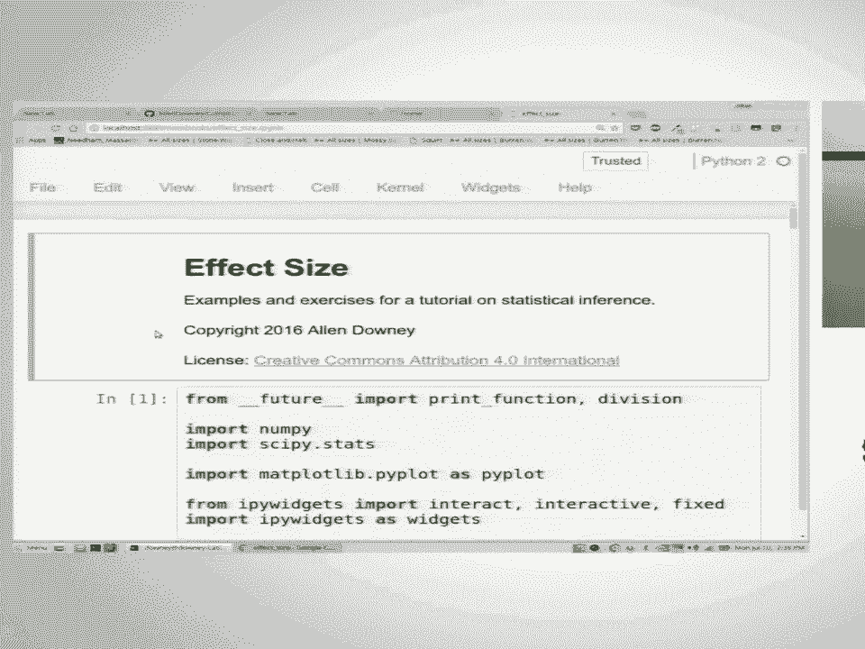

 do much， run the second cell。 This is the one that's going to import all the packages we're using。

 And if that doesn't complain， then it worked and you have everything you need。 And if it does。

 you'll get error messages that say things like no such package as dot。

 dot dot and that'll tell us which package you need。

 So we will get started in just a couple of minutes。 I'm going to take one more walk around the room。

 Michael is also here to help out。 So if you are just settling in and getting things installed。

 let us know and we'll help。 And as I said， we'll start in just a couple of minutes。 Okay。

 people just coming in。 I think there are a couple more seats。 So try to grab one。

 I see one in the second to last row there。 Anybody if there's a seat next to you。

 there's one here in the second row。 And I'm going to suggest if you're just coming in now。

 if you have not already done the setup， don't do the setup yet。 Let me talk for a couple minutes。

 get us started。 And then when we get to the first notebook exercise。

 you'll have a chance to do a little， bit of setup and we'll come around the room and help out。

 But if you can， grab that last URL on the slide， which is tinyurl。com。 Comp， stats， 17。

 That will get you my slides。 And from there， you can get to everything else。

 So I propose that we start。 Welcome to Computational Statistics。 I'm Alan Downey。

 I teach at Olin College， which is just outside of Boston。 It's a new engineering school。

 We just started up about 15 or 20 years ago。 I've lost track now。

 Our mission is to fix engineering education。 And I'm working on some parts of that related to data science。

 So I teach Bayesian statistics。 And I also teach an approach to conventional statistics that is a little bit different。

 And that is what I'm going to inflict on you all today。

 So I'm giving you a warning that I'm going to say some things that are nonstandard。

 That kind of contradicts conventional wisdom in statistics。

 But in a way that I think is better than conventional statistics。 So bear with me。

 If you have any questions， maybe toward the end， I can talk a little bit about。

 What I'm doing and why it's different from the norm。

 But the primary topic today is statistical inference， which is working from a sample of。

 a population and trying to estimate something about the world。

 We're going to talk about three big pieces of that which are estimating the size of an， effect。

 quantifying the precision of your estimate， and then doing hypothesis testing。

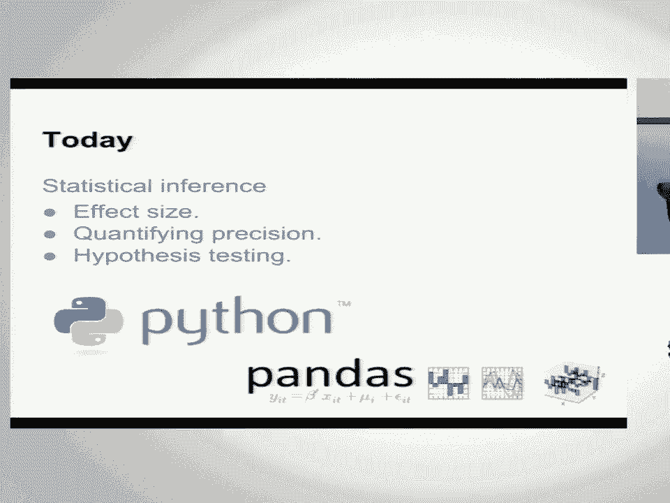

 And we'll talk about what all three of those things are。 We are living in interesting times。

 Conventional statistics is collapsing around us like a house of cards。

 That might be a slight exaggeration。 But there are definitely problems at the foundation of how we do statistical inference。

 And they've started to surface in the sciences where we're finding that many of the results。

 that we thought were reliable are turning out not to be replicable。 If you do the same experiment。

 again， it's often not producing the same results。 And one of the problems with that is hypothesis testing。

 So that's a big part of the tutorial today is what is that problem and how do we fix it？

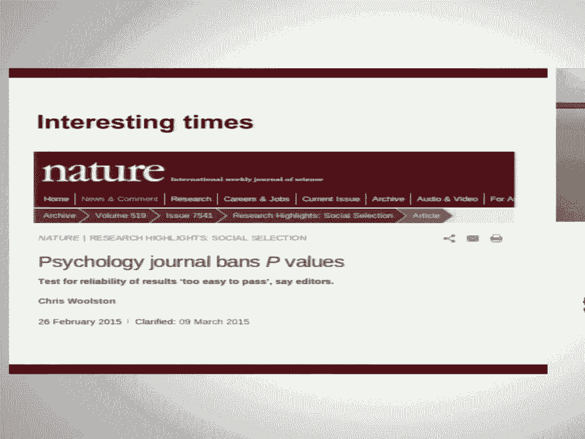

 So that's the introduction。 Statistical inference， as I said。

 is fundamentally the idea of working with a small sample from。

 a large population and trying to use what you can measure from the sample to make inferences。

 about how the population is。 And this is kind of like what all science is。

 We are always trying to generalize from the thing that we measured to how we think the， world is。

 And in statistics in particular， it's， let's say it's people， I can't measure everybody。

 in the United States， but I can get a sample of a few hundred or a few thousand and then。

 try to make a claim about people in the United States based on just the people that I saw。

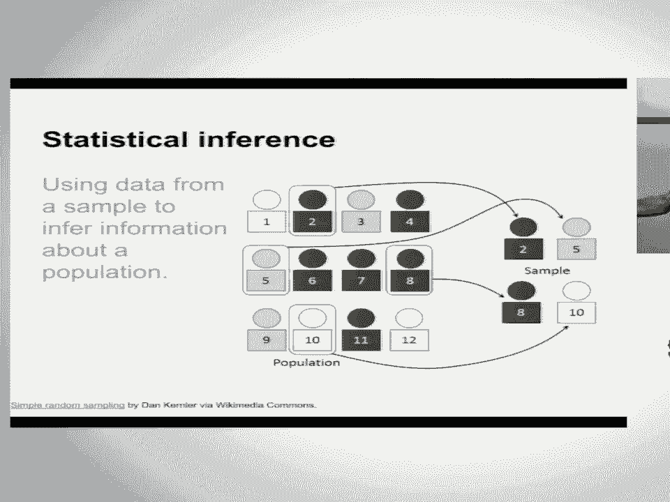

 So classic example of this from medicine is things like evaluating new drugs。

 So let's say you've got a painkiller， you want to see whether the new painkiller is。

 better than the old one。 You get a hundred subjects。

 you divide them at random into two groups and one of them is， going to get the old drug。

 One of them gets the new drug。 You ask them， for example。

 maybe self-reports for some kind of pain level and you see a， difference in the average。

 The new group is at 4。1， the old group is at 4。5， I'm assuming that lower is better and。

 you want to know a couple of things。 First of all， we want to make a measurement。

 We want to quantify how big is that difference between the two groups。

 Fundamentally that's the important thing that we care about， but we also want to know。

 how accurate is that measurement that we made， can we quantify precision and is it possible。

 that there is actually no difference between the two drugs and that the apparent difference。

 that we saw is just due to random chance。 Those are the three parts of statistical inference。

 They go by the names effect size， confidence interval and p-values to get a sense of the， room。

 How many of you already know what a confidence interval is？ Good。

 How many of you know what a p-value is？ Good。 That's fine。 Most of you have， I think。

 had a conventional exposure to statistics where you probably。

 spent a lot of time learning how to compute these things in various mathematical or analytic， ways。

 The primary difference of what I'm going to talk about today is how to compute them。

 doing it computationally rather than mathematically and also a little bit about how to interpret。

 what they mean。 Probably the most important idea that I want to convey is that this is the right order of。

 importance。 If you measure something， the primary thing that I care about is the measurement that。

 you made， the size of the effect。 If that's all you tell me。

 that would probably be okay most of the time。 Just tell me how big it is。

 My second question is going to be how accurate is your measurement。 Again。

 we're going to quantify the precision of the measurement， but I'm going to claim。

 that this is a somewhat less important thing。 And now a distant third important thing is to tell me whether the thing that you measured。

 might actually be zero。 I'd like to have some notion of whether that might be true by chance or not。

 The problem that I see is that a lot of papers flip this around。 So instead of effect size。

 most important thing and p-value， distant third， what I often。

 see is papers that have p-values in the abstract as if it was the most important number and。

 no effect size in the whole paper。 I want to give you one example of this that drove me crazy a few years ago。

 but this is， not the only example I see this all the time。

 You see things covered in newspapers and they say， "Look， there's this effect size。

 This was an example of math anxiety in elementary school。 If your teacher has more math anxiety。

 it turns out that the students perform less well， on exams。"， So that's interesting。

 That's a surprising result。 It might be important， but from reading this article in the newspaper。

 I had no idea how， big the effect was。 It said in particular it affected girls。 It said。

 "For the boys， it didn't seem to matter whether the teacher was math anxious， or not。

 but for the girls it did， at least according to the study。

 The girls were more likely to do worse on the achievement exam if their teacher had more。

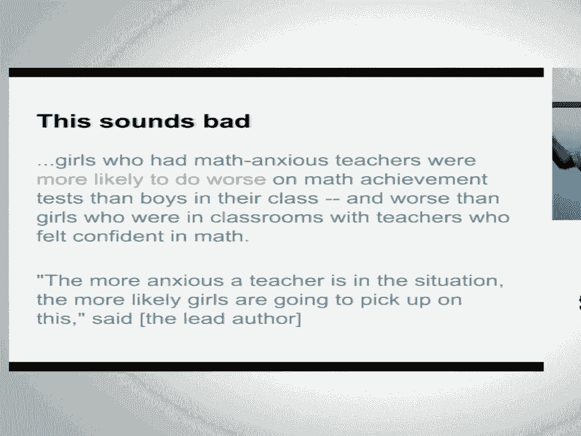

 math anxiety。"， But no indication of how bad it actually is。

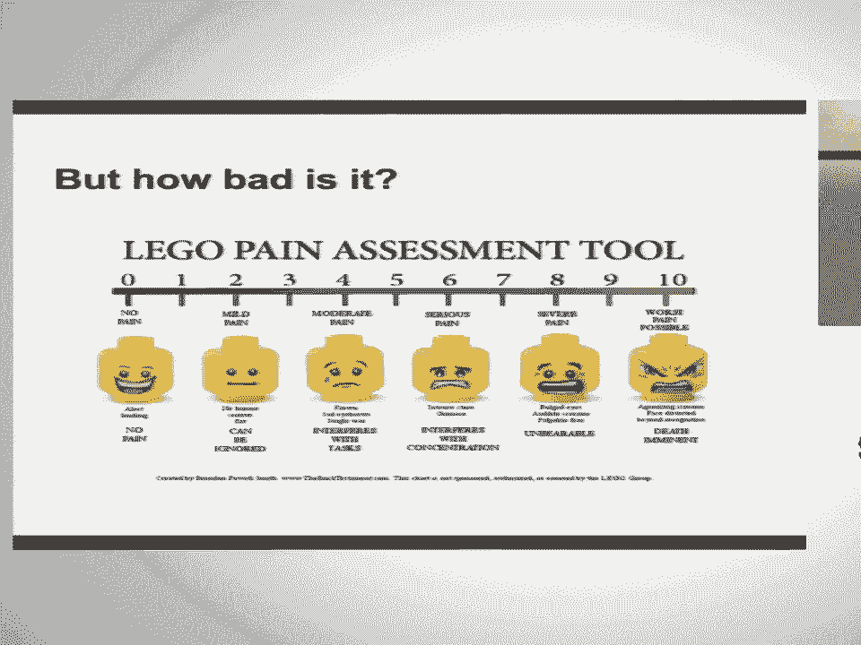

 So all right， I went from the newspaper， I tracked down the actual article。

 This was in the Proceedings of the National Academy of Sciences， which is not a terrible， venue。

 I assume it's been through peer review。 I assume that one of those peer reviewers asked how big is the effect。

 but I could not， answer that question by reading the paper。 I had to go on to the webpage。

 get the supplementary material， go crawling through the tables， and， I finally found out， okay。

 they had done regression analysis， they gave me the slope， they gave。

 me the range of math anxiety for the teachers， and they gave me the summary statistics for。

 the scores。 So after I interpreted all the Greek letters and did a little bit arithmetic on paper。

 what， I finally figured out is that the difference between having the most anxious teacher or。

 having the least anxious teacher worked out to be about half a point on a scale of 100。

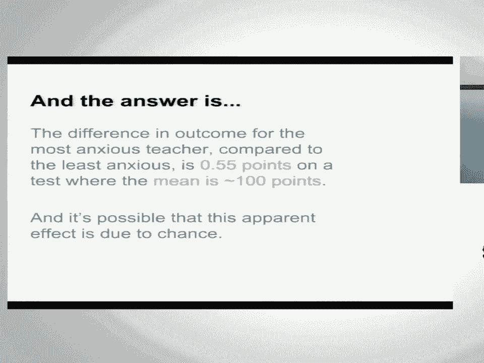

 So I'm not very impressed by that， and I'm particularly annoyed that they made me do。

 all that work to find out that the effect size here was statistically significant， but。

 probably not actually important in practice。 And that is a hugely important point。

 which is that statistical significance is just about， p-values， it doesn't mean very much。

 What I really care about is whether the effect size matters。

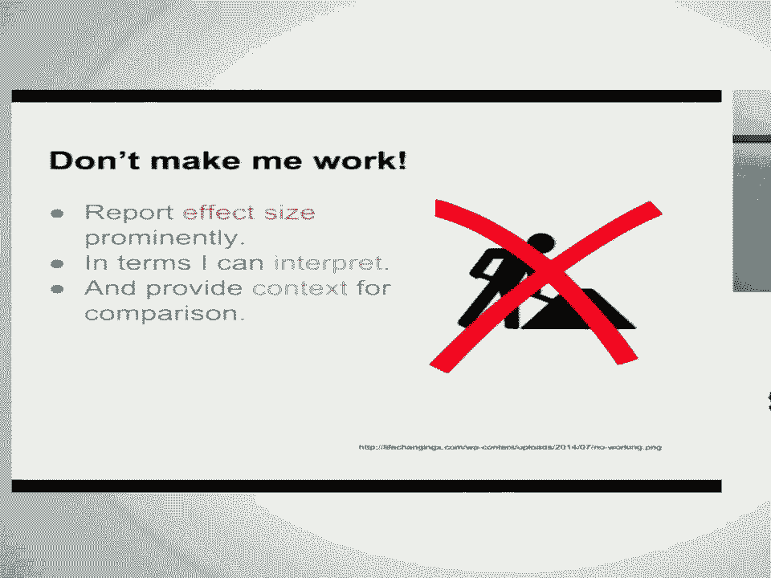

 All right， that is the end of my rant， let us get into the first notebook。 So part one。

 as I mentioned， you should have the files that are in my repository。 Part two。

 I'd like you to fire up Jupiter， load up the first notebook， which is effect， size dot ipin B。

 Read through that， execute the code， see what it does， and when you get， to the first exercise。

 do some work on that。 When you get to the part that says stop here， stop there。

 I want to make one other suggestion， which is consider working with a friend。

 So if you haven't done pair programming before， this is an excellent chance to try it out。

 Introduce yourself to a neighbor。 Couple of reasons that this I think will help。 One。

 you will have twice as much screen area。 So one of you can have the slides or documentation up。

 and the other one can have the notebook， and execute the code。

 The other is you've got two people to think at two different levels。

 So one of you can be thinking about understanding what's going on and thinking about what you。

 should be doing， and the other one can be thinking about the details of Python and Jupiter and。

 how to do what you should be doing。 So take a minute。

 I dare you to introduce yourself to your neighbor。 Say hello and consider working together。

 I won't require it， but I will require you to talk to each other。 And I will come around and help。

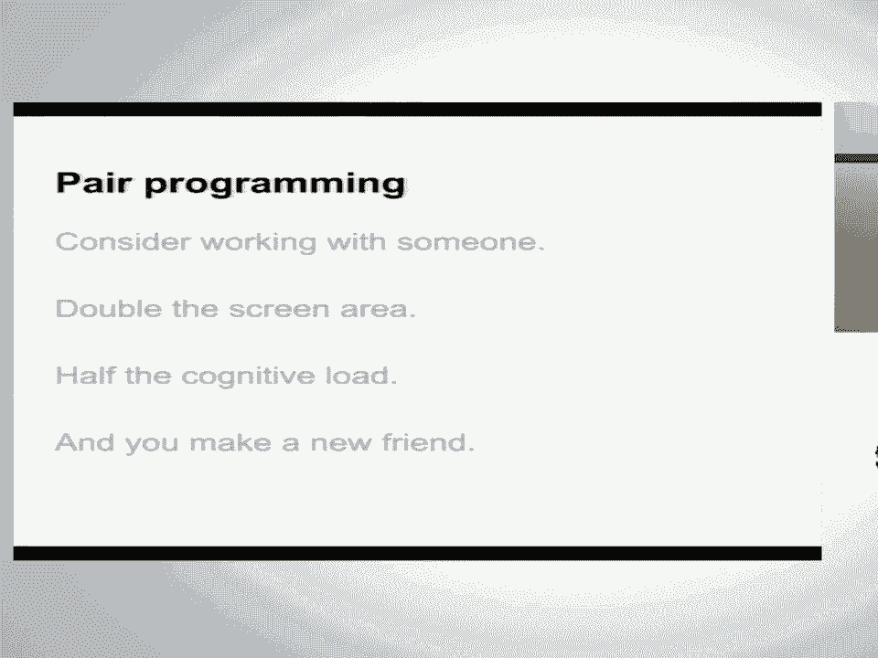

 Okay， let me make a suggestion about how to work on all the exercises， which is you can。

 decide how much you want to challenge yourself to do all these things without any help。

 If you want to do it without cheating and no looking， I will tip you off that almost。

 everything can be done by copying and pasting from the examples above。

 So the intent of the exercises is really just to engage your brain into digesting some of。

 the details and then putting them into use。 If you find yourself stuck on something in an unproductive way。

 if you're working on it， and just not making progress。

 one of the ways that you can cheat is for each notebook like， effect size。

 there's another notebook called effect size solution dot ipin B。 And if you， open that up。

 you will discover that it has solutions to the exercise。

 So do whatever works best for you cognitively decide whether you want to engage with the。

 exercises or you could just run the solutions or copy from the solutions into the other notebook。

 and play around with it。 Have people raise your hand if you are close or nearly done， sorry。

 done or nearly done with， the first exercise？ Okay。

 so let me take a minute to just debrief on what we've seen so far。

 So one of the things here in passing is the random variables from scipy。stats。

 Have people seen random variables before from scipy。stats？ Okay。

 so this is a newish thing to many of you。 It's a pretty useful tool， so keep that in mind。

 We're not going to do a ton with it。 I'm not going to get into details now， but you've seen it。

 Remember it， it'll come in handy later。 Anytime you want to generate random values from a given distribution。

 this is very useful。 In this case， we've created this object which is a normal or a Gaussian distribution and。

 that object knows what its parameters are。 It has the mean and the standard deviation of male and female heights。

 so we can use that， to generate random values like these samples that we're working with。

 And the other thing that is there is evaluating the PDF which is useful for making plots that。

 look like that。 So here we're just evaluating the PDF。

 the probability density function of the Gaussian， distribution。

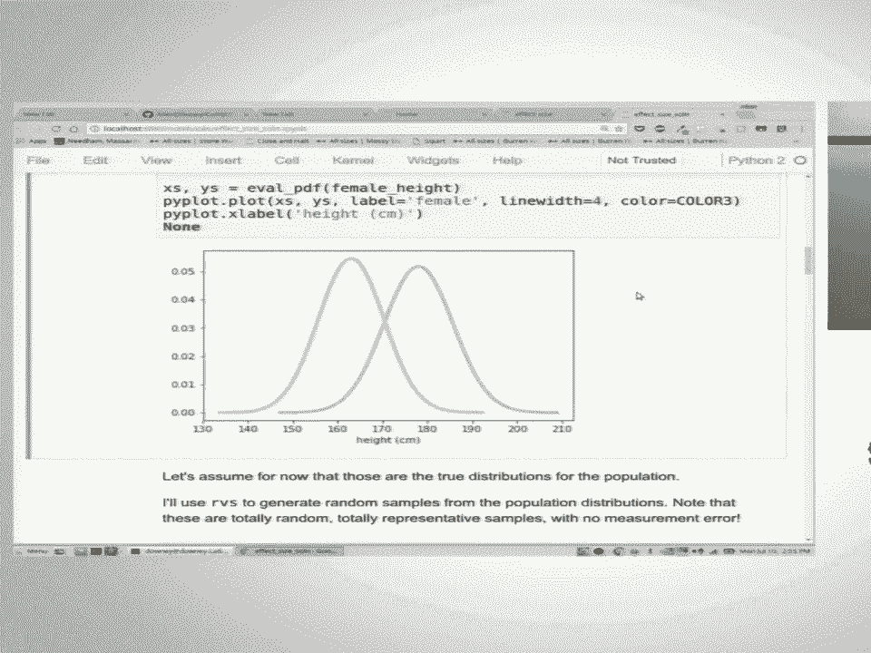

 So two things in passing that we get to see。 And then the point of the exercise here is to take an absolute difference which is measured。

 in centimeters and express that as a relative difference which is expressed in percentage， points。

 So that was part of the exercise here。 And normally you just do that by taking the difference。

 so in this case a difference in， means and standardizing it by dividing through by the means themselves or possibly the midpoint。

 of the two means。 And there are a couple of options here。

 Part of the reason I gave you this exercise is that you could have put the male mean in。

 the denominator there so that's one way to say it。

 The other possibility is to put the female mean there。

 And depending on the context those will have slightly different senses。

 If you have two categories and one of them is sort of like a control group and one of。

 them is a treatment group then you might express the magnitude of the treatment relative to。

 the mean of the control。 That might be the natural thing to measure relative to。

 In this case it's symmetric so there's no obvious right way to put into the denominator， there。

 So it's kind of an arbitrary choice or you could just put the global mean for both groups。

 So that one's basically a warm up。 Hopefully that's making sense if you have questions about it。

 This would be a good time for them。 Anything？ Okay。

 So that's just getting from an absolute difference to a relative difference。

 So go back into the notebook now。 Again feel free to work with a neighbor。

 Work through the next section and again when you get to the part that says stop here， stop， there。

 Okay。

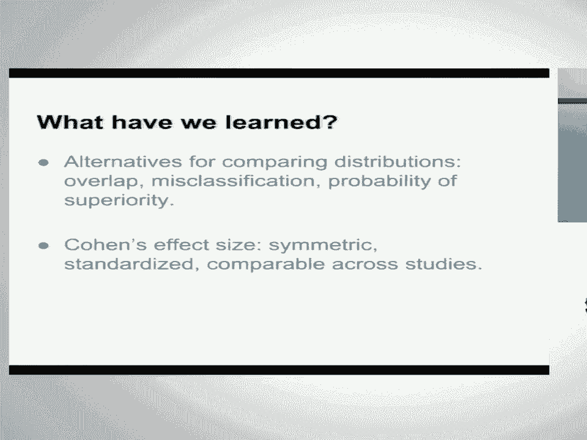

 I want to walk through a couple of things that are in this part of the notebook。

 If you are working and making progress you can feel free to ignore me but I just want。

 to point out a couple of things。 So one of them I want to put a threshold between these two means。

 There are a couple of ways to do that。 One of them is to just pick the average of the two means。

 a mean of means。 In this case the two sample sizes are the same so the mean of means is not terrible。

 In alternative if they were different sizes I could do a weighted mean of means。

 The other possibility is if you look at the two PDFs there you might choose this point。

 where the two PDFs cross over and choose that as the natural threshold between the two of。

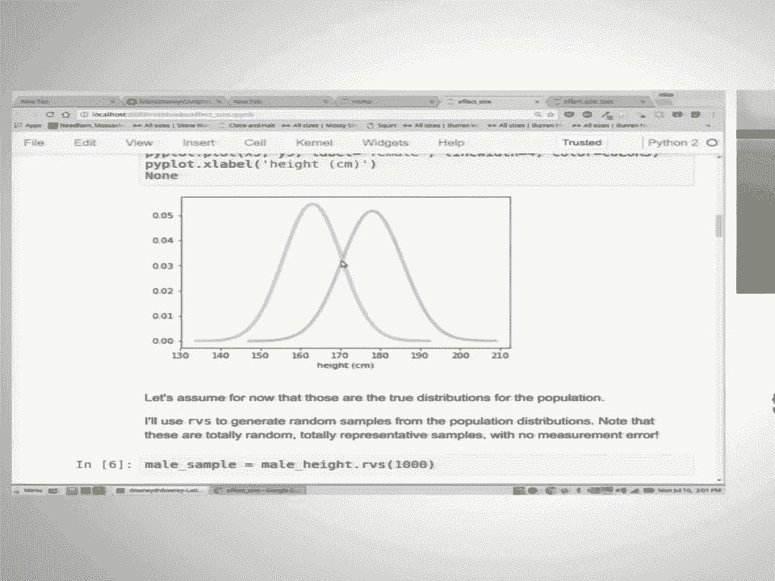

 them and that's fine too。 What I've given you in the notebook is a way of computing that thing。

 Turns out that that algebraic expression works out to be the point where those two PDFs are， equal。

 I didn't do that analysis here but if you have a question about it I can show that to。

 In this case I've got two distributions that have roughly the same standard deviations。

 so however I choose the threshold it's roughly going to be the midpoint between them。

 For this example it doesn't matter very much。 Now since I have that threshold we can start talking about ways to express a difference。

 in means in practical terms。 If I tell you that it's 14 centimeters or I tell you that it's 8% that doesn't really。

 mean very much but if you know that you're going to be trying to classify things that。

 are in these two groups。 In this example it's kind of silly。

 If I tell you someone's height could you guess whether they're male or female it's not。

 probably a practical problem but sometimes the misclassification rate would be useful。

 Because if you've got two distributions that are wildly different and practically nobody。

 in between then you could tell me which group you're in。

 You could tell me that you're height and I would know instantly what category you're， in。

 If there's a lot of overlap then the misclassification rate would be high and here's a simple way to。

 just compute the misclassification rate and it is the number of samples that are above。

 or below that threshold。 If you haven't used NumPy before this particular way of computing things might be new to you。

 so remember that male sample in this notebook is a NumPy array that has a thousand heights， in it。

 If I compare it to a threshold it's going to take each of the values from the array compare。

 it to the threshold and it'll either be true or false。

 So the result of the less than is a logical array that contains a thousand true or false。

 Boolean values。 And now if I take the sum that seems kind of weird but it's going to treat all the。

 trues as ones and all the falses as zeros so the sum is going to be the number of people。

 who are on the wrong side of the threshold。 So this says that of a thousand men 164 of them would be misclassified if we tried to。

 label them by height because they fall below the height threshold。

 If you replace that sum with a mean try that again。

 If you make a NumPy call to the method mean it'll get you the average value of all those。

 trues and falses which is now in terms of a fraction rather than a number。

 So either of those is fine but I'm going to switch back to the way it was before。

 By the way control Z is a useful thing for undoing changes that you make in a NumPy cell。

 The misclassification rate is one way to quantify what the difference in means in practical terms。

 if you want to communicate it in a way that makes sense to people。

 Another way is the so-called probability of superiority which in this example is a little。

 bit of an awkward term but it just means that if we draw a random pair of people I think。

 of this as the junior high school dance problem if we choose a random boy and a random girl。

 what's the probability that the boy is taller than the girl。

 There are a couple of ways to compute this in Python world。 This down the size fits。

 So one way to do this is by lining people up and just pairing them up and computing the。

 fraction of pairs where the female is taller than the male and you can do that using zip。

 So if you are more comfortable with Python stuff and you like zip then you can zip together。

 the male and the female samples so that's going to pair them up one by one and for each pair。

 it will count the number of times that X is greater than Y。

 Turns out to be about 91 percent so if in the US adult population if you randomly choose。

 a man and a woman the man will be taller about 91 percent of the time and then if you want。

 to get all numpy with it you can do the same thing using the logical arrays that I mentioned。

 Questions？ Okay。 How many people have you had tell me whether you have got to the end of the notebook or。

 whether you would like a minute to read about Cohen's effect size before I go on？ Got to the end？

 Would like a minute to read about Cohen's effect size？

 We will take a minute to finish up the notebook and then I will debrief。

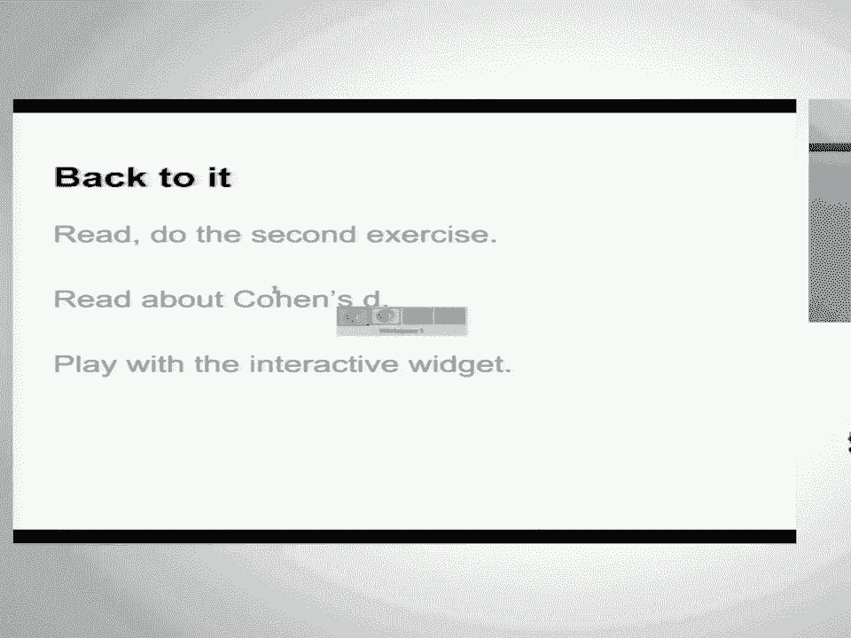

 Okay。 Two things I wanted you to see here。 One of them is Cohen's effect size which is a way of quantifying the difference in means。

 between two groups。 Taking the means and standardizing them by dividing through by standard deviations。

 So it's a way of saying the difference between these two groups is some number of standard。

 deviations。 The slightly tricky thing is that it's not clear which standard deviation to use whether。

 it's one group or the other and you wouldn't want to compute the standard deviation for。

 the whole population put together because if it really is two groups with different means。

 then the global standard deviation would be quite big compared to the standard deviation。

 within the groups。 So that's why the denominator there is the pooled standard deviation which is basically。

 a weighted sum of the two or weighted mean of the two standard deviations。

 So the details of that are not super important except that the denominator is meant to be。

 a measure of the variability within the groups and this is saying that the difference in means。

 is a certain number of standard deviations。 The nice thing about that is that the mean is in units of centimeters in this case。

 The standard deviation is in units of centimeters。

 Those two things will always be in the same unit so when you divide them that ratio the。

 centimeters cross out and the result is dimensionless。

 So Cohen's effect size one of the things that it's useful for is making a comparison between。

 different studies。 So if I tell you that this study found Cohen's effect size of two and that one found that。

 Cohen's effect size of one you can compare those two studies without knowing anything。

 about the domain without knowing anything about the units that they were measured in。

 Those things mean the same thing no matter what。 The other reason it's useful is that if I give you Cohen's effect size you can compute。

 those other two things that I mentioned the misclassification rate and the probability。

 of superiority。 So it's one number that's comparable across different studies and if I give it to you。

 you can compute the other kind of important practical things that matter。

 There's only one drawback to Cohen's effect size which is that most people don't really。

 know what it is。 If you're in a field where it's widely used you're familiar with it。

 If not it takes a little while to get calibrated so if I tell you that it's two for example。

 that might not mean anything to you until you look at a picture like this。

 So that's what it looks like when there's a difference in means of two standard deviations。

 You can see from that overlap area you can get a visual representation of the misclassification。

 rate。 And if you get interactions working for you in your notebook which is not a given but。

 this is the other kind of cool tool that I wanted to show you if you have not used Jupiter。

 before and you have not seen this you might like having this slider where you can adjust。

 Cohen's effect size so when it's two that's what it looks like and let's see when it's， like three。

 Ah interesting。 I'm having the same problem that someone else had which is so the way that this is supposed。

 to work is that it updates that figure but what's happening for me and what might be。

 happening for other people is that instead it's making lots and lots of figures。 That's too bad。

 And I'll tell you what instead of interacting you might find that it's easier to just use。

 this previous cell cell number 26 and just plug in different values here。 So let's do that。

 So with Cohen's effect size of one that's what it looks like。 So that's not a super strong effect。

 There's a lot of overlap。 So the misclassification rate here is half of that overlap。

 The overlap there is the area and half of that is misclassification。

 The probability of superiority is now down to 74%。

 If you are into psychology differences like differences between men and women in psychology。

 tend to be like 0。5 or less and that's what that looks like。

 So when you see newspaper headlines that talk about all these differences between men and。

 women in various cognitive ways try to find the effect size and if it's 0。5 or less you。

 probably don't care。 On the other hand if you see something like 3 you should be somewhat impressed。

 So 3 tells you that basically if you tell me your score on this scale I can classify。

 you with pretty high accuracy。 So 3 is 4 is 5's meaningful 0。

5 and below maybe not in practical terms。 Questions？ Yes sir。 How do we get？ That's a great question。

 So let's say I tell you it's 2。 Yeah， so I'm telling you effect size and I tell you okay I estimated that Cohen's effect。

 size is 2 your natural question。 Well how precise is that estimate？

 How much might you be off by and we're going to answer that in the next notebook。 Yes sir。 Yes。 Yes。

 So I'm treating everything here as normally distributed。

 Most of what I'm doing you could replace the distributions with empirical distributions。

 so just draw random values from an actual sample rather than from a continuous or analytic。

 distribution and the whole process would be the same。

 And in fact we're going to do some of that in the third notebook。 Other questions？ Yes sir。

 Yes good question。 So I think you're talking about this cell here where I'm computing Cohen effect size。

 Since I have a laser pointer I have to use it。 So right here I'm computing a pooled variance and then a square root and you're asking why。

 did I compute the variance and then square root it。

 It's because I wanted to take the weighted sum of the variances and I have to do that。

 in variance land and yes I might have done some unpacking when I translated this。

 So here if you look at the math I've got S1 squared and S2 squared。 Yep and those are the variances。

 Beautiful。 I put it in the five point font。 Sorry I didn't crank that up。 There we go。 How's that？

 Okay so to summarize what we've got so far we have a bunch of different ways to quantify。

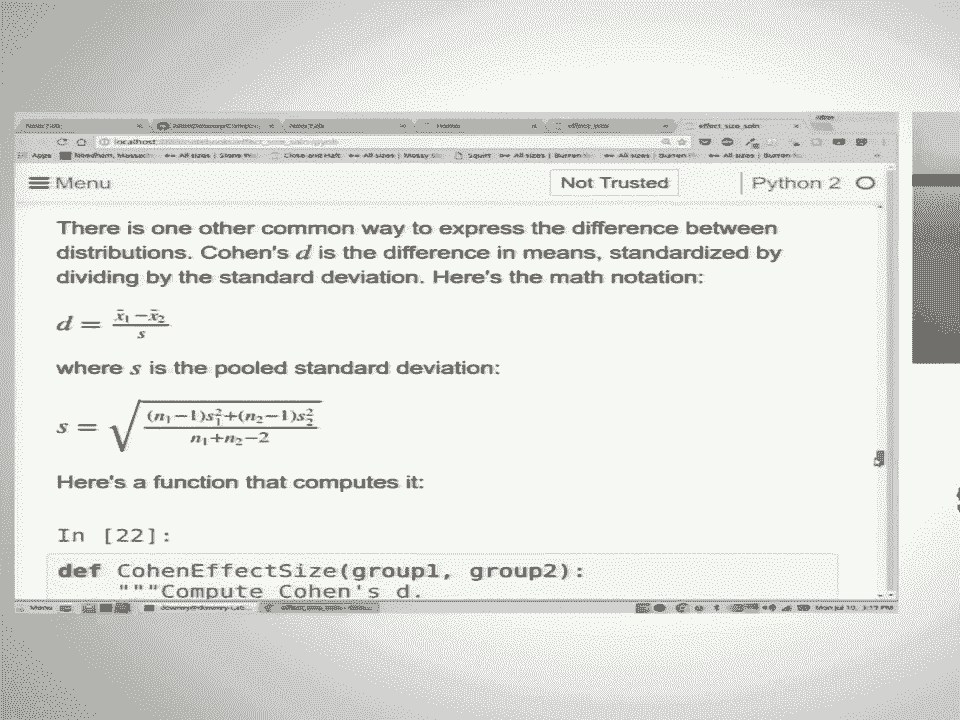

 a difference in means。 Many of them are useful because they are comparable across different studies。

 So if I tell you probability of superiority that is expressed in practical terms and it。

 is comparable across studies， Cohen's effect size also has this nice property and is commonly。

 used in a lot of fields。 So that was part one which is telling me about effect sizes that are like differences in means。

 Part two we're going to talk about differences in proportions and I'm going to use some real。

 data that came out a few years ago。 This is a study of peanut allergies in young people and in particular it was children。

 I， think they were about five years old who had tested for a certain inclination toward allergies。

 So it was a little bit about a unique sub population and they actually did a control randomized。

 controlled study where some of them were told to avoid peanuts and some of them were told。

 yes you should go ahead and eat peanuts and then they checked to see who was more likely。

 to have a peanut allergy some number of years later。 I think it was a few years。

 And it turned out to be a pretty substantial difference if you avoided peanuts when you。

 were like five years old the chances that you would develop a peanut allergy was about。

 17% for this particular group again。 If you went ahead and ate peanuts you had only a 3% chance of developing allergies。

 So this was this is the actual text that was in the report and it's giving you all these。

 numbers so they were randomized。 I forget some of the details of the study but you can look at it more。

 But here's my question for you which is if you had to summarize that result with a single。

 number to tell me how big that effect was so that I can compare it。

 Let's say I want you know there are other treatments or other allergies I might be interested， in。

 I want to make comparisons between studies in a meaningful way。

 That's the single number that I could use to communicate the magnitude of that effect。

 I would like you to chat with your neighbor for a couple of minutes。

 Think about it and then I'll ask for suggestions。 Alright let me hear some suggestions。

 How am I going to communicate the magnitude of this effect？

 And think about this like you're talking to a parent who's trying to decide whether to。

 give peanuts to their children。 What would you tell them？ Come on somebody be brave。 Yes sir。

 5 times more likely。 5 times more likely。 Okay that's one way to do it。 Other possibilities。

 14% as the effect percentage points。 Yep so you're just taking the difference between 2% in percentage points。

 Yep so one of those is like an absolute difference in percentage points。

 That's I think a relative probability or ratio of probabilities。 Yep all good yes。

 Who am I representing here？ Yes。 Who is it？ Could we bono who benefits？ Yes。

 Who funded the study right？ Okay so one possibility is the 14 percentage points。

 One of the challenges is that you have to figure out which one is the control group and。

 which one is the treatment group。 And in this experiment it's not clear whether withholding peanuts is a treatment or whether。

 administering peanuts is a treatment。 And so you could express it in either direction。

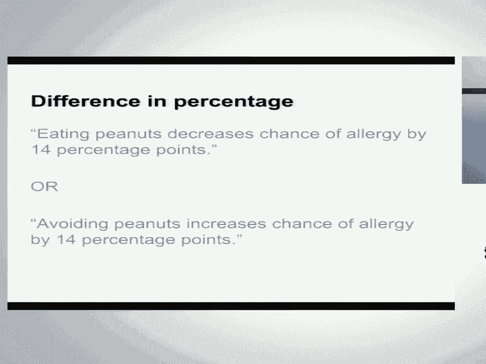

 Either plus 14 or minus 14。 One difficulty if you express things in terms of percentage points。

 Percentage points are not a good way to compare different studies because if I tell you that。

 something went from 3% to 17 that might be a really big deal but if you're like right。

 in the middle of the percentage range from 43 to 57 that might not actually be such a， big deal。

 But if I take some infinitesimally small risk like 0。01 and I turn it into 14。01 or whatever。

 I've done you some serious harm。 So percentage points are a problem if you are comparing things that are at different。

 range of probability。 The other possibilities you could talk about the percentage decrease。

 So you could say you will cut your probability of getting allergies by 83% by going from。

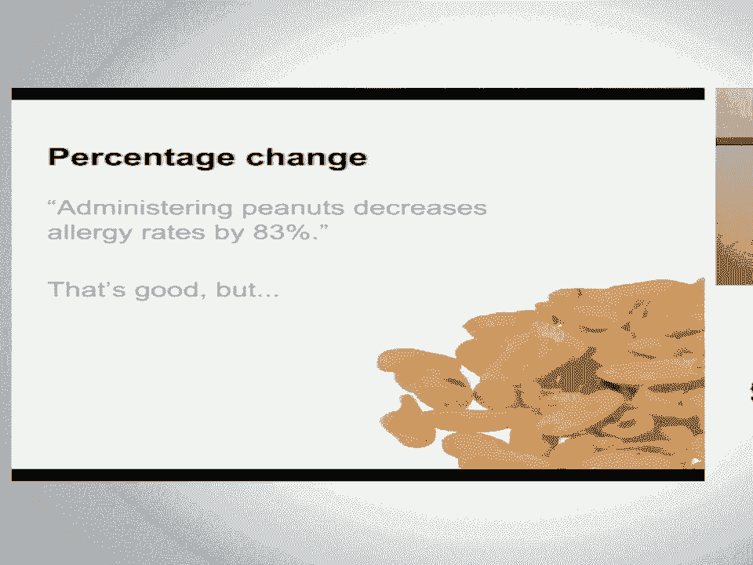

 17 to 4 or 17 to 3。 The only problem with that is that now that asymmetry problem becomes much worse。

 So now going from 17 to 3 is a reduction of 83%。 Going from 3 to 17 is an increase of 467%。

 So that's kind of awkward。 The other thing that's kind of bad is that people get confused when you start talking。

 about percentage differences in percentages。 You will lose your audience。

 So those are a couple of challenges there。 In medicine the odds ratio is very popular。

 And this we now have to take our probabilities and express them in terms of odds and then。

 take a ratio of two pairs of odds。 If you are not familiar with odds it is just another way of expressing a probability。

 It is equivalent in the sense that if I give you probability you can compute odds using。

 that formula。 If I give you odds you can compute probability。 So it's equivalent in that sense。

 So here I've got probabilities 0。03 and 0。17。 I can convert them to odds being those values that you see there。

 And then the odds ratio is 0。151。 Which may not mean a lot to you but sort of like Cohen's effect size people who work with。

 odds ratios learn to get calibrated。 They have a sense of what that means。

 And so now you could express this either way。 Again we've got the problem with which direction to go in。

 I could either say that if you eat the peanuts you decrease your allergy rate and the odds。

 ratio is 0。15。 Put it the other way around。 Avoiding peanuts will increase the allergy rate with an odds ratio of 6。

6。 That's how you're going to see it in medicine most of the time。

 I'm going to suggest one other possibility which is the log odds ratio。

 So take those same numbers that we just had a minute ago。 And it's a ratio。

 If you take the log of a ratio that's going to be the difference between the logs。

 And one nice thing about it is that it is symmetric。 The log odds ratio is 0。82 in this case。

 Either way and it's just the sign that changes depending on which direction you work in。

 Now if I had my magic wand and I could make everybody in the world use log odds ratios。

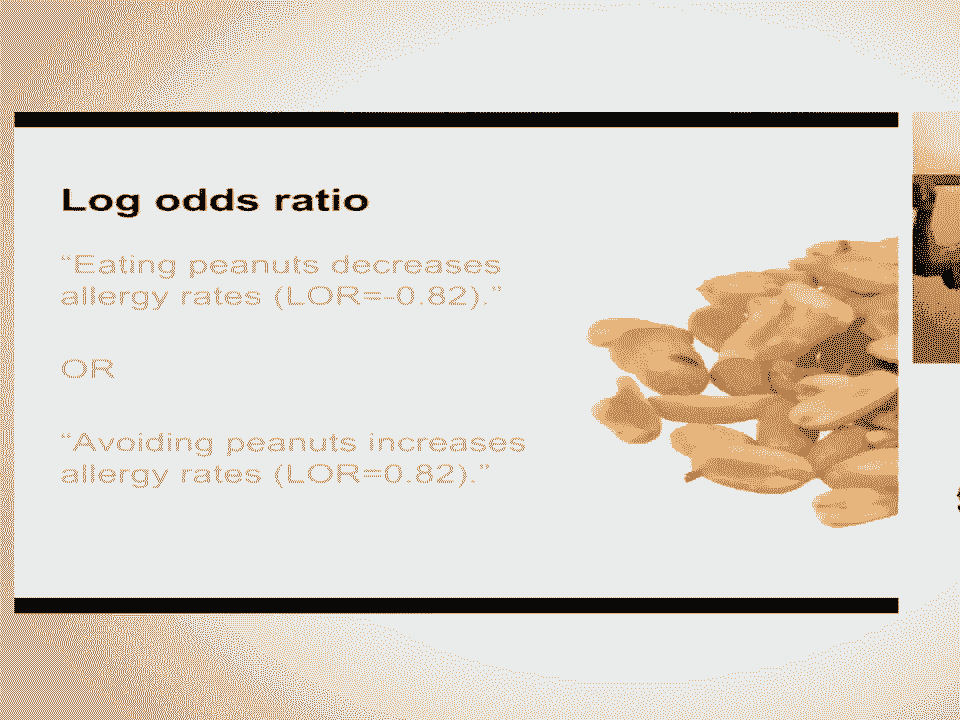

 I would。 Log odds ratios have a lot of really nice properties。

 When you are talking about probabilities they work across the entire range of probabilities。

 Doesn't matter whether it's tiny， medium， high probabilities。 It's the same information content。

 And actually if you want to get into information theory the log odds ratio is a measure of the。

 information content。 If you tell me what the treatment was that will tell me how to do a Bayesian update about。

 how much I should believe you're going to get a peanut allergy。

 And they add up if you apply several different treatments that have log odds ratios of 1， 2。

 and 3 the total of all of those treatments is 6。 At least if I assume that they are independent。

 Yes。 [ Inaudible ]， Shoot。 [ Inaudible ]， The problem with log odds ratios is that nobody knows what they are cute but nobody knows what。

 they are。 You have two axelot。 How many other people knew what an axolotl was？

 All right they're not quite as obscure。 How many people knew about log odds ratios？

 They're exactly the same。 So my analogy is apt。 They are。 They're very cute。

 Although I always get confused with an atolatl which I guess is not good。

 That's the spear throwing thing。 [ Inaudible ]， Oh interesting。 [ Inaudible ]， Interesting。

 This is great。 We might be off topic but this is really good。 [ Inaudible ]。

 I have only myself to blame。 To summarize there are a lot of different ways to express this。

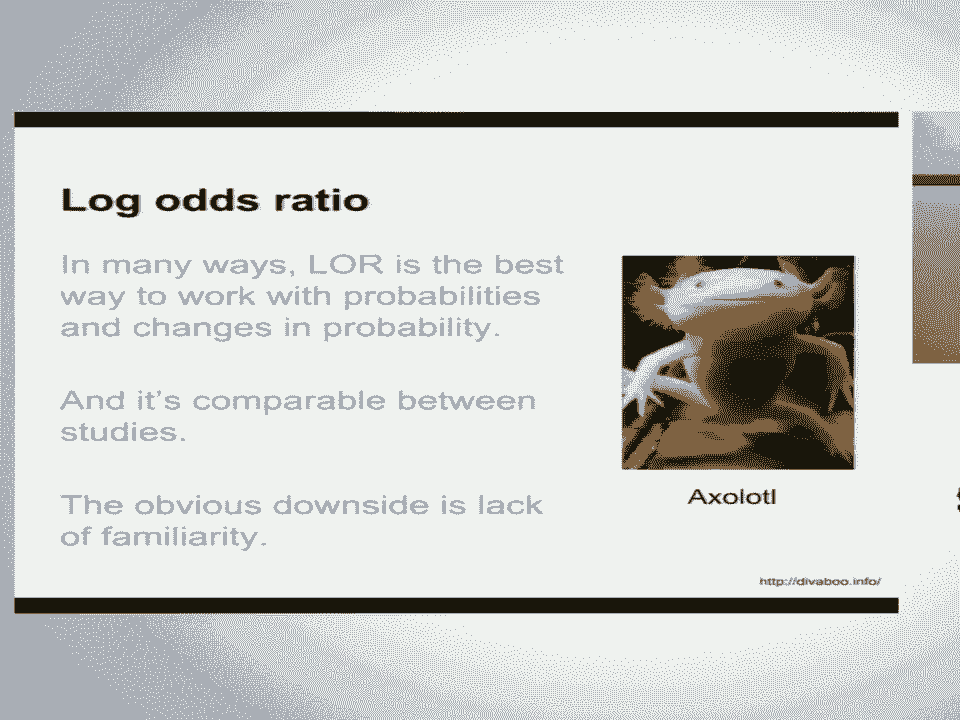

 None of them are perfect。 There's a little bit of a trade-off here from left to right。

 The things on the left are problematic from a mathematical point of view but people understand。

 them。 The things on the right are in some sense elegant and mathematical and all that。

 And so I think that's a lot of different ways to express this。

 Things on the right are in some sense elegant and mathematical and all that but for a popular。

 audience you're not going to get people to understand that。

 And that's the trade-off that I'm suggesting is to express effect size。

 There's probably not one ideal way to do it。 You want to choose something that is meaningful in context。

 You want to choose something that makes sense to your audience but there's a conflict there。

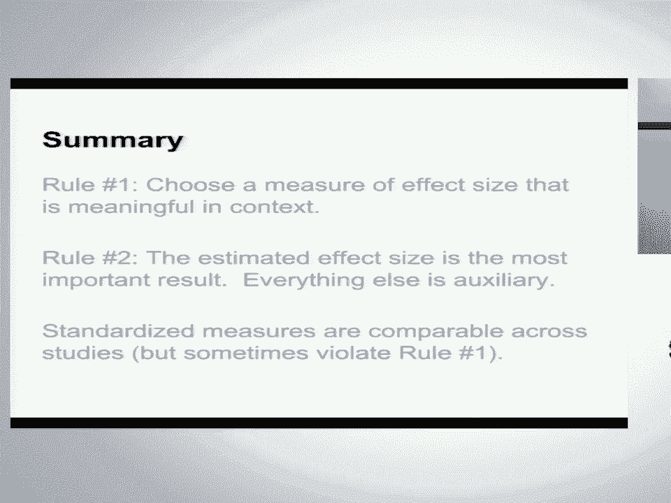

 I suggest we take a break。 Let's resume in ten minutes which will be 240。

 If you have questions for me I'm happy to talk during the break。 Okay we should reconvene。

 If everyone's back from the break。 I got one question。

 Actually several people during the break were asking about this odds ratio and log odds ratio。

 I was singing their praises about how wonderful they are mathematically and people were asking。

 how do I make sense of them。 What is my intuition for those things？

 I will point out I won't get into this in any depth but the log odds ratio is the base factor。

 So if you are familiar with Bayesian statistics or a Bayesian update using Bayes rule the Bayes。

 factor is a measure of the information content。 And if you look up the Wikipedia page for Bayes factor it actually has a table here that。

 was suggested by Jeffries。 Now you don't have to take this as gospel but it's a general notion of a mapping from a。

 log odds ratio to how strong that effect is。 This particular mapping is going to depend on the domain so I wouldn't take it too seriously。

 but it's at least a step toward getting calibrated。 But that's enough of that for now。

 Onward to part two。 Okay so we are going to start talking about quantifying precision。

 This is the question I got a minute ago。 I've measured effect size and I'm going to tell you that the Cohen effect size is 2 or。

 I'm going to tell you that the log odds ratio is 0。8 and you want to know how good is my， estimate。

 How much might I be off by and that is a perfectly good question to ask。

 So let me start with a different problem which is that suppose you want to know how heavy。

 people in the United States are and you decide to do a telephone survey。

 So you choose random numbers from the phone book。 You dial the numbers at random and whoever answers the phone you ask them how much do。

 you weigh。 And you write it down and now we want to try to say something about the US population as。

 a whole based on that way of doing sampling and my question for all of you is what could。

 go wrong with that methodology。 So talk with a neighbor for a minute and see if you can enumerate all the things that could。

 possibly go wrong。 I don't want to interrupt your fun but I'm going to interrupt your fun。

 Alright talk to me what are some things that might be wrong with my methodology。

 Why is my answer going to be wrong？ I hear liars so people might not tell me the truth。

 That's one possibility。 So people who are answering the phone in the middle of the day might not be representative。

 in what can you think of some ways that they might be different。

 So the numbers are random I don't necessarily know whether they're at home or at home。

 If I text first why do you think I might get different results if I text or call？

 Because some people might be in the phone book or not and that might tell you something。

 about them whether they're in the phone book or not。 Do they still make phone books？

 Is it not the adults？ Yes so this is good because you're all telling me two things that are important。

 One of them is that the people that I get might not be representative and you're telling。

 me why that might change the answers that I get。 Because sometimes you can have a non-representative sample but it's still okay as long as there's。

 no relationship between the ways that you are unrepresentative and the thing you're trying。

 to measure。 So people might not be very accurate maybe because they're lying or maybe just because。

 they don't know exactly。 Yep yes。 People might not be calibrated and it might be related to income and many of the factors。

 that we listed are related to income and this is kind of one of the informal rules of social。

 science is that everything is correlated with income。 Some might lie。

 So one of them many of you mentioned examples of sampling bias where the sample is not representative。

 What that means if the sample is representative then every person in the population in this。

 case it's US adults should have an equal probability of being in the sample。

 If they have different probabilities depending on what groups they belong to then that's。

 not a representative sample anymore and if the thing that you're trying to measure is。

 correlated with that group membership then the results that you get will be biased。

 So that's sampling bias。 But remember that there are two parts of that。

 People you can there's a right level of skepticism。 No skepticism is bad。

 Going crazy with skepticism is bad。 It's almost impossible to get perfectly representative sampling。

 It's okay to be approximately representative as long as there's no relationship between。

 group membership and the thing you're trying to measure。

 Sampling bias some more examples people mentioned that people who answer the phone in the middle。

 of the day might be more likely to be unemployed。 Whole lot of things that are probably related to income。

 So you guys mentioned several examples of that。 You also mentioned examples of measurement error。

 uncalibrated scale。 Your question is ambiguous about whether you're asking for their weight clothed or unclothed。

 They might not remember their weight。 They might misreport the sort of the value neutral way to talk about lying is that they。

 misreport。 You might write it down wrong or one of the things that I run into in survey data all the。

 time when I grab survey data is things get miscoded。

 So I did a study looking at actually the height data that we looked at came from a very large。

 study 300，000 respondents。 One of the problems with large sample sizes is that that gives you more chances to make。

 a mistake。 They had a surprising number of people in that data set who were between 60 and 62 centimeters。

 tall。 I think there's only one person in the room right now who might have stepped out who is。

 60 centimeters。 What do you think went wrong？ Why were there so many？

 They were talking feet and inches。 I bet there are a lot of people who are six feet zero。

 six feet one， not so many people， not so many adults。 Oh， it could have been 62 inches。

 which is five two。 Good point。 The other thing that you see a lot is that missing data will sometimes be encoded as。

 99 or 999。 So I did one study where I looked at birth weights for babies and the mean came out to。

 about 13 pounds。 That can't be right。 It's because I had accidentally included a whole bunch of 98 and 99 pound babies。

 which， were respectively don't know and weren't asked or something like that。 So measurement error。

 lots of examples of that。 Third thing， so we're talking about sampling bias。 That's number one。

 Measurement error， that's number two。 Number three， random error。

 which is just the fact that you collected a sample rather than， the whole population。 And so one。

 if you only call three people， then it's pretty clear that you might just。

 by chance get three heavy people or three light people and your estimate might be off just。

 because of random sampling from the population。 So those are the three big sources of error sampling bias。

 measurement error and random， error。 Usually sampling bias is hard to quantify。

 often because if you knew what was happening， you would fix it。 So you might not know it。

 And even if you know it， you might not be able to measure it。

 Measurement error is sometimes quantifiable。 There are some ways to do that。 For example。

 if you have two different processes and one of them is more accurate than the other。

 you can use the difference between them to estimate how imprecise the two estimates are。

 The two measurements are。 So the second one can be quantified。 Third one， random error。

 turns out to be the easiest one by far to quantify。 And therefore。

 it is the one that we spend all of our time in statistics focusing on。

 and completely ignoring the first two。 Despite the fact that in practice。

 it is almost always the case that those first two， are much more important than the third one。

 But the third one is easy， so we do it。 That is my warning about everything I'm about to tell you。

 I'm not the only one。 Edward Tufti agrees with me and managed to express it in 140 characters。

 Random error is but one of 20 threats to learning from data。

 It gets disproportionate attention because it is the only threat that can be mathematically。

 modeled。 So let's mathematically model it。 Let's get back into the notebooks。

 If you will open up sampling。py， read through it， run the code， work on the first exercise。

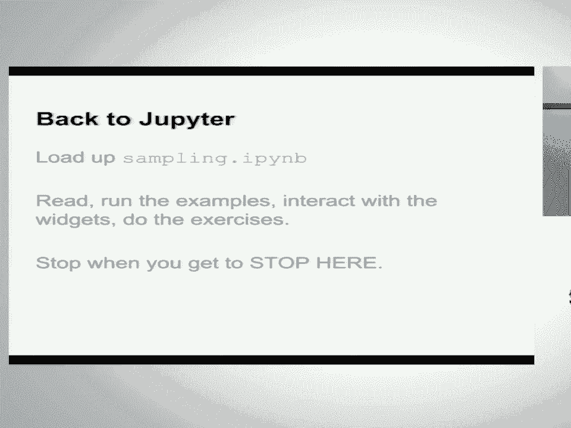

 and stop when you get to stop here。 Okay， we have a fix for the problem that we were having with the interaction。

 If you find this function called plot sample stats， search for that function plot sample。

 stats and add this line at the end， piplot。show。 If you make the show explicit。

 that should allow you to do the interaction。 And now if you move the slider back and forth。

 it will update in place。 So if you had that problem with interaction， give that a try。

 Hopefully that solves it。 This is in the function that is called plot sample stats。 Add this line。

 I want to go over a couple of things in the notebook。

 One of them is the distribution of weights for adults in the US is approximately a log。

 normal distribution， which is kind of a funny shape。

 We're used to things like physical measurements on people and animals。 Many。

 many things have a Gaussian distribution， which is this nice symmetric bell curve。

 The log normal distribution is not symmetric。 It looks like this。 It has a long tail on it。

 So there's sort of a central tendency around 60， 65 kilograms。

 But then there are heavy people who are up into the 120， 160 kilogram range。

 Turns out there's a reason for this distribution at birth。

 The distribution is pretty close to Gaussian。 And then as we become adults， it becomes log normal。

 If you are curious， I have a footnote in my book， which explains why this is true， but。

 it's outside the scope of our current activity。 So I'm going to assume temporarily that we know what this distribution is。

 And I'm going to come back later and undo that assumption。 For now。

 assuming that we know what the distribution is， we can run simulated experiments that says。

 what if I took a sample of 100 people and I computed their average weight？

 And then I took another sample of 100 people and computed their average weight。

 And I did that experiment over and over。 How much would the results differ from one experiment to the next？

 So that's how we're going to quantify the precision of the estimate。

 which is by pretending that we did the experiment many times and seeing how different it is from。

 one experiment to the next。 Now， the thing about this example that is going to become confusing in a couple of minutes。

 is the difference between N and itters。 So N is the sample size。 And that's really important。

 That's the number of people that I'm going to go out and measure。

 And what we're going to see very soon is that as the sample size gets big， my precision。

 gets better and better when my sample size is small， no surprise， my precision is not， so good。

 So N is the thing that really matters。 Now， to estimate how precise my estimates are。

 I'm going to run lots and lots of simulated， experiments。

 And I'm calling itters is the number of times I run the experiment。 That doesn't matter very much。

 It just needs to be reasonably big。 As long as itters is big enough。

 I'm going to get a good description of my uncertainty。 So itters， I arbitrarily choose 1。

000 just because computationally it doesn't take very。

 long and it's big enough that I'm going to get answers that are close enough。 Okay。

 So N is important。 That's the sample size。 Itters is just the number of simulated experiments that I'm going to do。

 So there's just taking one sample and computing one sample statistic。

 And now here compute sample statistics is the function that runs lots of iterations。

 And I'm using a Python list comprehension there just as a syntactic way of kind of like。

 a faster for loop in this example。 Now this distribution is the important part of the whole thing。

 This is I ran 100 experiments。 I ran a thousand experiments。 And for each experiment。

 I computed the estimated mean of the adult population and I plotted it。

 So one time when I ran the experiment， I got 72。 And one time when I ran the experiment， I got 74。

 And then there was that crazy time that I got 68。 And that other crazy time that I got 77。

 And I just plotted them all。 And this is showing me how much variability there was from one experiment to the next。

 This thing is called the sampling distribution of the mean。

 It's telling me how much my estimated mean will vary each time I run a sample。

 The question is whether it is a normal distribution and the answer is it is going to asymptotically。

 become a whole lot like a normal distribution。 Even though I'm drawing from a log normal distribution。

 it is nevertheless the case that， as my sample size increases。

 this thing is going to look more and more like a Gaussian。 Because anyone？

 That is the central limit theorem that I just invoked。

 Now remember what the question is that we're asking， which is I've estimated the population。

 mean and I've said that it's 72 and change， 72。5 let's say。

 Now you ask me how certain are you about that？ One way for me to answer that question is to show you that distribution。

 I could show you the whole thing and just say it's like that。

 I think it's probably about 72 but it might be as high as 76。

 It could be as low as 68 but I'm pretty sure it's somewhere in that neighborhood。

 That would be fine。 But if you want me to boil it down to a number。

 there are two ways I can do that。 One of them is I can compute an interval and what I might do is like chop off the lowest。

 5% and the highest 5% and show you the 90% in the middle。 That would be a 90% confidence interval。

 That's a way of taking this whole big blue distribution and boiling it down to， in that。

 case just two numbers and I think I computed them here。

 The confidence interval is the interval that is between the fifth and the 95th percentile。

 That'll be the 90% confidence interval。 It is between 70 and 75 kilograms。

 If you want me to give you a measure of my precision， I could instead， instead of computing。

 an interval， I could take the standard deviation of that thing。

 The standard deviation of that thing is called the standard error and it is loosely speaking。

 It's about how much I expect to be off by。 I could put this into a plus or minus。

 I could say I'm going to be off by about 1。6 kilograms。

 One way I could report this result is I could say pretty sure it's about 72 plus or minus， 1。6。

 That would be the standard error。 Standard error and confidence interval are just two ways to summarize the sampling distribution。

 and that is why the name of this function is summarize sampling distribution。

 Standard computes is the standard error in the 90% confidence interval。

 The other thing that I wanted to do with these results is show what the sampling distribution。

 looks like。 So when the sampling size is 100， the standard error is about 1。

6 and the confidence interval， is that。 If I go back out instead of asking 100 people。

 I ask 1000 people， I expect the width of this， distribution to get narrower and it does accept that it got scaled。

 The standard error got smaller and the difference between the confidence interval， the width。

 of the confidence interval got smaller。 To see that graphically， we can interact with it。

 So here's n equals 100。 As I crank up the sample size， the sampling distribution gets narrow。

 The standard error gets small and the width of the confidence interval gets small。

 As the sample size goes down， it's the opposite of all of those。 Good questions。 Yes。

 What does the confidence interval actually mean？ Let me come back to that one in a minute。

 It's a great question。 It's the question of the 21st century。 Okay。 Now。

 one nice thing about this framework is that we now have a way to compute sampling。

 distributions for anything that we want to measure。 So far。

 I've been talking about the mean adult weight， but we could use this to compute the。

 sampling distribution of anything like the min or the max or the median or the standard， deviation。

 So let me do that one。 I'm going to copy this cell。

 So I can take all those functions that I just used， the ones that do all of this random sampling。

 The only thing I'm going to replace is this function called sample_stat。 That just says。

 if you give me a sample， I'm going to compute its standard deviation。

 So this is like I'm going to run a bunch of experiments。 For each experiment。

 I'm going to compute one estimate of the standard deviation and then。

 I'm going to plot the distribution of those estimates。

 What this says is that I think that the standard deviation of adult height is about 16 kilograms。

 but my standard error is about 1。4 and I have a confidence interval from about 14 to about， 19。

 And if you did the exercise， did you try this out with a couple of different statistics。

 we can compute a confidence interval for anything that you want to measure using this。

 framework without making any changes。 And I point this out partly because if you try to do the same thing mathematically。

 it， gets really hard really fast。 Computing the sampling distribution of the mean， easy。

 Standard deviation， harder， median， quite hard。 Interquartile range， very hard。

 Whereas computationally， we don't care。 If you can compute it。

 I can tell you the confidence interval。

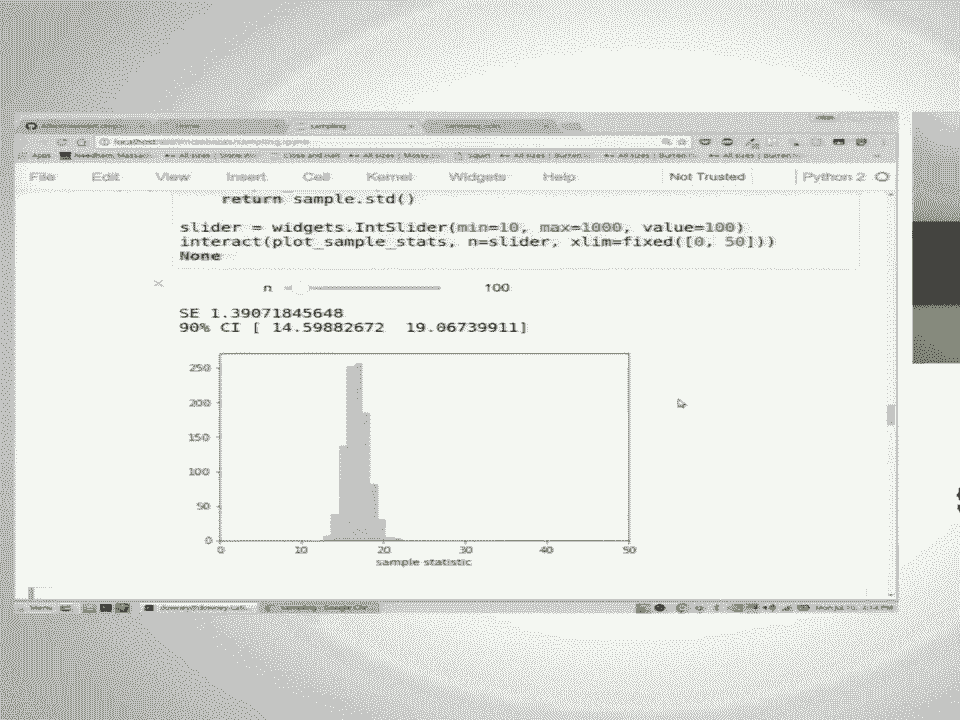

 Questions。 Okay， let me just summarize a couple of things there and then we'll get back into the notebook。

 So one of them is we are trying to quantify the precision of our measurements by running。

 lots of simulated experiments。 What we get is a sampling distribution and we summarize the sampling distribution using。

 either SE， which is standard error， or CI， which is confidence interval。 I mentioned that。 Okay。

 but here's where I now have to undo the assumption。 Over at the beginning， I said。

 "I'm going to assume that we know the actual distribution。

 of adult heights and now we're going to go through this elaborate process to try to compute。

 the mean。"， Well， if we knew the actual distribution， we wouldn't need a process。

 we would just compute， the mean。 So we have to do something else。

 which is if we don't actually know about the population， yet， all I have is a sample。

 How do I run simulated experiments just based on my sample？

 The answer is I'm going to take the actual sample that I measured and I'm going to use。

 it to build a model of the population。 It won't be perfect， but it's a model。

 And I'm going to use the model to simulate more experiments。

 There are a lot of different ways to do that。 One of them is resampling。 And in particular。

 resampling refers to a lot of different techniques。

 The one particularly that we're going to do is called a bootstrap， which is that we're。

 going to pretend that the sample that we collected is the entire population。

 It's kind of a funny move to make， but it almost makes sense。

 And then I'm going to draw new samples from the actual sample with replacement。

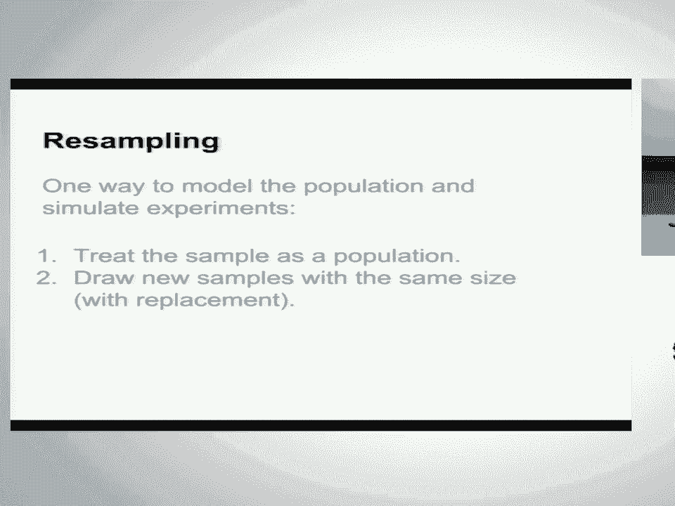

 So let's see what that looks like in code。 Let's go back to sampling。

ipi and be and move on to the next section。 Read about it， run the code， and we'll debrief。

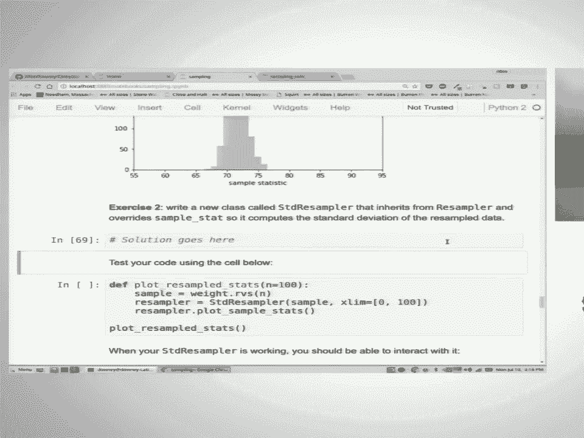

 So we're getting into object-oriented programming here in Python。 If you're familiar with that。

 writing a new class that extends an existing class that， might be familiar to you， if it is， fine。

 If it's not， this might be a good chance to switch over to using the sampling solution， notebook。

 which has a solution in it。 Or you can take a look up there where I've conveniently provided a solution。

 Okay。 I want to debrief a little bit about what's going on here， and then we'll get into the。

 code just a little bit。 The fundamental idea of this， this way of doing resampling。

 is that we're going to take， the actual data that we collected and build a model of the population。

 use the model to， generate fake data， and then compute whatever the statistic is that we're trying to measure。

 And then we're going to report either a standard error or a confidence interval。

 This framework is my attempt to explain resampling in one slide。

 So this is across the top row there is the actual data and the actual estimate。 So in this case。

 I've collected a bunch of adult weights and I've computed their mean。

 So sample statistic in this example is the mean。 And the estimate that I get is 72 kilograms。

 So if you ask me what's your best guess， what's your best estimate， that's my answer。 The top row。

 Now if you ask me how sure are you， that's where the bottom row comes in， which is that。

 I'm going to use the data to make a model， and that's where this resampling from the。

 data comes from。 Generate lots and lots of simulated data。 In this case it's just three。

 In the code it's a thousand but I didn't want to draw a thousand of them。 So again。

 whatever the sampling statistic is， you compute that for each fake data set and。

 collect the distribution of them。 And what you get down there in the lower right hand side。

 that is called the sampling， distribution of the sample statistic。 In the example that we're doing。

 it's the sampling distribution of the mean。 And whatever that distribution is。

 that's one way to describe how confident you are， about what you measured。

 But if somebody wants a summary， you can give them either the standard error， which is the。

 standard deviation of that thing， or a confidence interval， which is usually the gap between some。

 low percentile and some high percentile。 Yes？ [ Inaudible ]， That's a great question。

 And let me paraphrase it in case people didn't hear you， which is the arrow there。

 When you go from the data to the model of the population， it seems crazy that these data。

 sets have the same size as your original data set， because it seems like you're using。

 your data over and over， it seems like you should divide it up into small pieces。

 And if you're coming from machine learning and you're thinking in terms of making a。

 training set and a test set， I understand that intuition。 Nevertheless。

 it is the correct thing to do that these fake data sets have the same size， as the original。

 And part of it is again because sample size is going to tell us how uncertain we should， be。

 [ Inaudible ]， Yes， if you sampled without replacement。

 then you would get the same data set over and over。 But when you sample with replacement。

 what's going to happen is let's say you've got 100， people， in any given resample。

 some of them will appear more than once and some of them。

 might be left out altogether and that's how you're going to get some variability。 Good。

 But your intuition is exactly right。 That's what people find funny about this。 It is actually okay。

 Not to a point。 If your original sample size is kind of small。

 you're not going to have a lot of variation， in it。

 You're not going to see the full range of possible values and no amount of resampling is going。

 to magically make new values appear。 And that's why I'm emphasizing that this is a model when you go from the data to the。

 resampling process。 You are making modeling decisions。

 One of the things that you could do is smooth things out。

 So if you measure 10 people and you find that somebody is 6'0 and somebody else is 6'2。

 does that mean that there's nobody in the world who's 6'1？ No。

 You could reasonably guess that there are probably people smoothly in between the people that。

 you actually measured。 So you could instead of just resampling， you could take your actual data。

 smooth it， like， fit a statistical model to it and then draw samples from that model。

 And that would be a totally reasonable alternative to what I'm doing。

 Would that get sketchy if you're on the far ends？ You're going to have to make modeling decisions and you're going to use your domain knowledge。

 to guide those decisions。 So if you know， look， there are no people in the world who are 11' tall。

 So if my model says that there are， that's a problem。 But yeah。

 when you are making modeling decisions， there is a certain amount of arbitrariness。

 to it that you can either pretend it's not there or embrace it。 And I'm in the embracing school。

 Not so much with people， but with data。 So is this a weakness in this strategy which is that you have to develop a model？

 There's no alternative。 The analytic results are also based on models。

 It's just that they don't make the models explicit。

 So I think it's actually a virtue of this that it forces you to think about your modeling。

 decisions。 Yeah。 When you talk about making models explicit， where is the model？

 It makes that strange question。 I don't see the model。 It's in the model。 Yeah， you're right。

 And maybe I didn't make it as explicit as I just promised。

 But it is implicit in saying that I'm taking my sample and I'm pretending that the entire。

 population is represented in my sample。 So now when I want to simulate an experiment and generate a new sample。

 I'm generating it， from this hypothetical population。

 And it was that move when I went from my sample to pretending that it's in the entire population。

 That was the modeling move。 If instead I took my sample and I replaced it with a smooth analytic distribution。

 that， would be a different modeling move。 And provided that I have a reasonable sample size and that I don't make crazy modeling。

 decisions， it will all turn out OK。 All the different methods will give results that are pretty close to each other。

 Yes。 I would say that your initial sample plus your resampling process， I would draw a dotted。

 line around those two things and say that's the model。 It might be helpful to get a diagram。

 So what I'm calling model one there is conventional bootstrap resampling。

 I'm just taking my original data and I'm doing sampling with replacement from my data， directly。

 An alternative is you could take your data， build a smooth analytic distribution that。

 fits your data and then draw random samples from the smooth analytic distribution。

 Both valid methodologies， again probably consistent with each other for reasonable assumptions。

 Yeah。 The quality of your random number generator is not going to be a big factor here but the。

 random generators that come with Python are good enough。 Yes。

 So the question is how many simulated experiments do I have to run before that distribution is。

 about right and the answer is a thousand。 That's the magic number。

 It's small enough that it doesn't take very long to compute。

 It's big enough that it's going to be as accurate as we care about。

 Question is does this all depend on everything being normally distributed？ No。

 That's where the central limit theorem is going to come and help us。

 And actually for this kind of computational approach we don't even need the central limit。

 theorem which is if the distribution of human weight was a parato distribution which is。

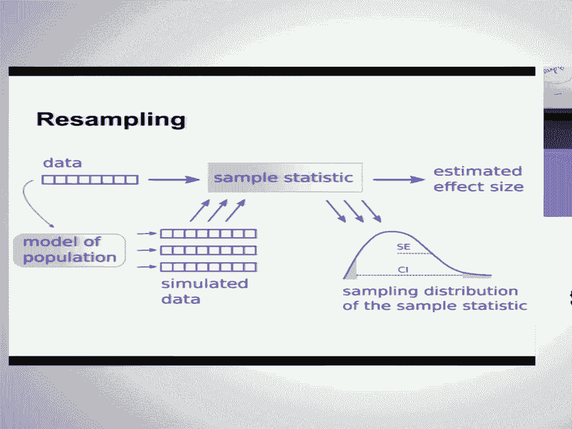

 one of these crazy distributions that does not have a finite mean or variance and therefore。

 the central limit theorem does not apply。 It would nevertheless be the case that if we run this methodology what we would get here。

 for our sampling distribution would be probably good enough for practical purposes。

 We might have to crank up itters。 Getting back to the previous question a thousand might not be big enough if I'm working with。

 an underlying distribution that has huge variance I might need to run lots and lots of iterations。

 before I really see everything that might happen。 So the observation is if I'm working with a long tail distribution and I have a relatively。

 small sample there's probably crazy stuff out there that I've never seen。

 And you're absolutely right so now I need some kind of methodology that gets me from。

 a sample to a long tail model。 That's actually probably a case where I would switch over to using model number two and put。

 here a long tail distribution。 So the question is if it is Pareto or some other crazy distribution and I crank up itters is。

 that going to be good enough？ Am I really going to show another distribution based on the model？

 The sampling distribution in that case will not be Pareto but it will still probably have。

 quite heavy tails。 And now it's going to become a practical question of is it good enough how big those。

 itters need to be？ By modal distributions are mostly going to be okay。

 Resampling is going to handle that just fine。 The central limit theorem probably will apply so the sampling distribution will be unimodal。

 even if the population distribution is not。 Although that does mean you need to think about what your sampling statistic is。

 If you have a bimold distribution and you are blindly computing means you might be misleading。

 yourself。 But that's a problem with you chose the wrong sampling statistic not that's not a problem。

 with resampling。

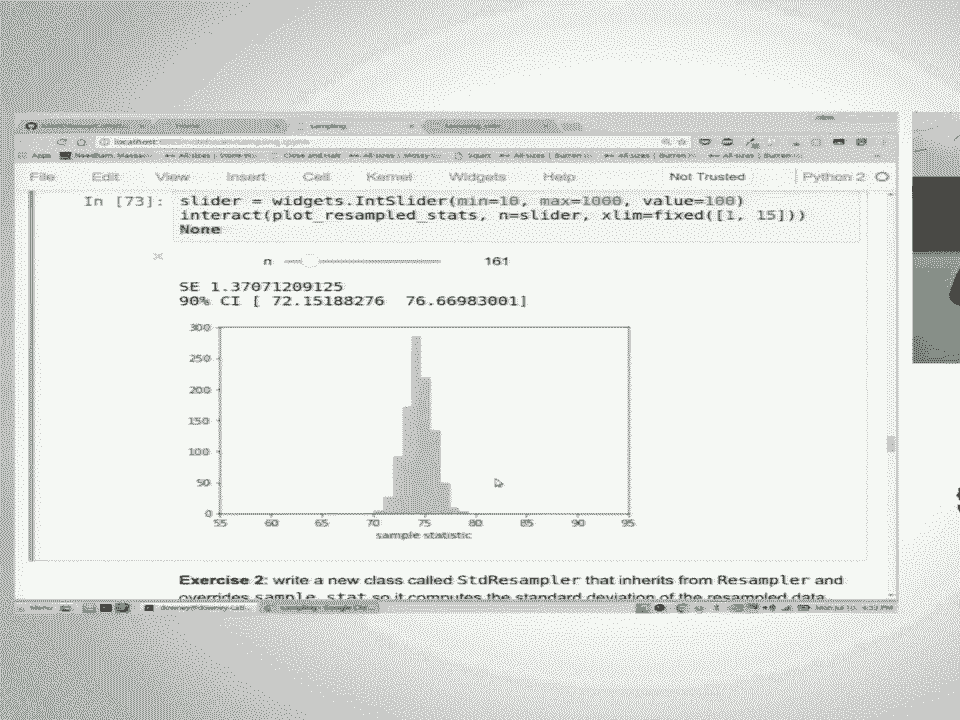

 I highly recommend that you take this diagram and have it tattooed somewhere convenient。

 on your body。 Because if you understand this you understand resampling。

 The other thing that's in the notebook if you are a fan of design patterns what I've。

 done in the notebook is I've used a class called resampler to represent this framework。

 Basically this diagram is represented in code by the resampler class and then your job is。

 just to provide the little methods like sample stat and run model and it does the whole thing。

 I'm not going to get into that again I don't want to get too far into object oriented programming。

 other than to point that out。 We should take a break I'm going to make the last part of the notebook optional if you want。

 to work through it during the break I'm happy to answer questions and when we come back。

 we will get into a couple of review topics。 It is 335 let's come back at 345。

 A little bit of trivia for people who are old what's the picture on the right。

 Anybody know what that is？ Bill Buckner mishandling a ground ball to first base during the 1985 world series causing。

 the red socks to not win for another 19 years but that's not my bitterness about the Boston。

 red socks is not the point of this class。 So a couple of review questions。

 Number one what is the difference between a standard deviation and a standard error。

 These are two things that people often get confused。

 Let me suggest a way of thinking about this which is a standard deviation is about the。

 population a standard error is about your estimate。

 So if you're telling me a standard deviation you're telling me about people in this case。

 So my example here is that the standard deviation of adult male height is 7。7 centimeters。

 That's telling me how much people differ from each other。

 If I make an estimate and I tell you that I've estimated the adult mean height and I think。

 it is 178 centimeters you ask me how precise is that estimate and I say my standard error。

 is very small it is 0。00034 centimeters that number is telling you about my estimate it。

 is not about people。 And notice in this example I've deliberately chosen this sample size is about 300。

000 people。 And as a result my standard error is extremely small which is to say that my uncertainty。

 due to random sampling is very very small which is great up to a point。

 Yes I could but I'm not going to say that just because it's confusing。

 So for now I'm just going to talk about I'm estimating a mean and if you ask me how good。

 my estimate is I will give you a standard error to tell you how good my estimate is。

 But the estimate could be the standard deviation but I'm not going to say it。

 But you're absolutely right we're good。 So because my standard error is so small my confidence interval is also quite small。

 So notice that I actually have five significant digits in my measurement here which almost。

 never happens in reality。 Now I'm going to answer the question that I was asked a while ago which is what is the。

 probability that the actual adult mean height in the US population is in that confidence。

 interval remembering again that the width of that confidence interval is 0。003 centimeters。

 What's the probability that the true value actually falls in the confidence interval？

 There are two answers to this question。 One of them is a philosophical black hole。

 If you studied mathematical statistics if you've read about 20th century statistical。

 battles you probably heard people say that there is a confidence interval and the true。

 value either falls in that interval or it doesn't but it's meaningless to talk about。

 probability because the true value is not a random quantity。

 It is unknown but not random and therefore it is meaningless to talk about the probability。

 that it falls in an interval。 If you like endless pointless philosophical debates you can spend the next 10 years on。

 this question and it will boil you in the whole frequentist versus Bayesian interpretations。

 of probability and it whole thing is a colossal waste of time in part because the probability。

 that the true value actually falls in that range is virtually zero because the only thing。

 that we've quantified is uncertainty due to random sampling。

 Meanwhile we've totally ignored sampling bias， measurement error and the other 20 things that。

 Edward Tufti warned us about。 Now when you have a really gigantic sample size your standard error is tiny and what that。

 tells you is that it is very likely that it's those other sources of error that dominate。

 So if you get a nice small standard error or a nice small confidence interval you are。

 entitled to check off your list one of the 20 things that you should be worried about。

 you should now turn your attention to the other 19。 Got it？

 Alright so in this case as I said measurement error is likely to be a problem。

 You remember I mentioned those people who are 62 centimeters tall that's hard to work with。

 because now let's say that I've got someone who is 100 centimeters tall is that an error。

 or is someone actually that height？ Don't know。 There were a bunch of people who were like 220 centimeters tall。

 Error？ Don't know。 So again nice big sample size probably means that the true value does not fall in your。

 confidence interval which is weirdly counterintuitive but I believe true。

 Don't forget about your other sources of error。 I think that is now it for part two of the workshop which is about estimating standard。

 error confidence interval questions so far。 Okay good。

 You don't get another break because we already took it。

 We will move on to hypothesis testing which is my least favorite topic in the world but。

 it's out there so we have to fix it。 Again least important thing if you tell me the effect size I got it that's what I wanted。

 to know。 If you quantify uncertainty that's nice that is useful additional information。

 If you tell me a p value you have possibly ruled out one source of error that probably。

 wasn't my problem in the first place。 So most of the time I don't care。

 However I will now explain it。 Having told you why I don't care I will now explain this because it is out there it is。

 not completely useless and therefore we will learn it。

 So what I'm going to talk about is null hypothesis significance testing which is a logical framework。

 for doing hypothesis testing。 It is very similar to a proof by contradiction so if you are coming from a math background the。

 way that works proof by contradiction says I'm going to assume temporarily something。

 that I think is probably false。 I'm going to follow that assumption through to its logical consequences and if it leads。

 me to a contradiction then that means it must have been wrong。

 That's proof by contradiction in the context of mathematics。

 In the context of statistics we don't have rigorous if then else kinds of logic but we。

 do have correlations and so on。 Here's how it works with null hypothesis significance testing。

 I'm going to see something in the world and let's take again like the difference in means。

 between two groups。 So I did a pretest and a post test and the average went up after the intervention。

 So that's the apparent effect。 Seems like things got better but maybe that was just due to random variation。

 So I'm going to assume temporarily that there is actually no effect in which case the two。

 groups are identical and I'm going to ask how likely would it be if the two groups were。

 actually identical that I would see an effect as big as what I actually saw。

 And if that's unlikely again there's this sort of convoluted logic。

 If it would be unlikely to happen by chance then I'm going to assume that it is more likely。

 that didn't happen by chance。 Did that intercept your question？ It's backwards logic。

 It takes a little while to get used to it。

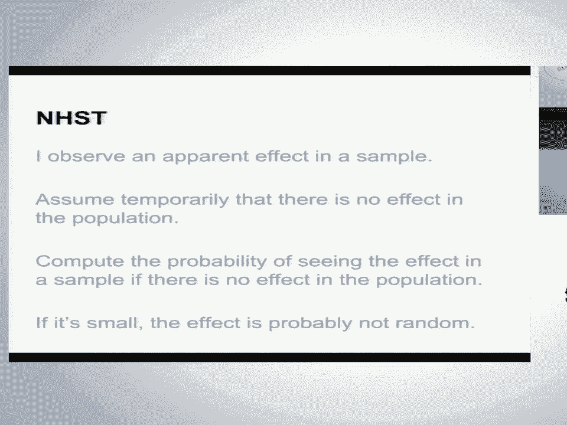

 You will get used to it。 Alright， third notebook is called hypothesis。ipinb。 Fire it up。

 Work through the first part。 Ask me questions and we'll stop when we get to stop here。 Okay。

 let me walk through a couple of things that are in the notebook and then we'll get。

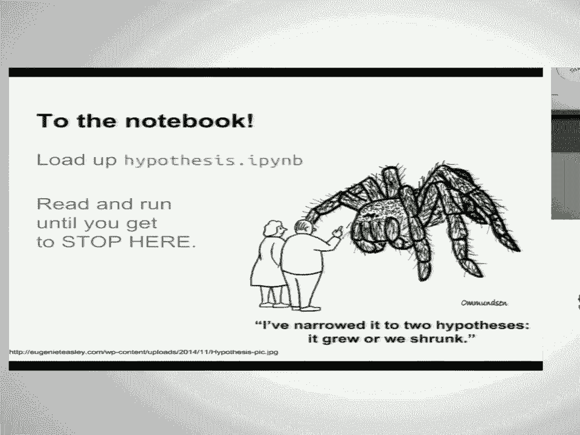

 back to the details of the code。 So the first thing is I want to define a couple of terms。

 So the test statistic is the thing that you are measuring。 It is generally an effect size。

 So the thing we were calling effect size before is now going to become the test statistic。

 In the example that's in the notebook it is the difference in pregnancy length between。

 first babies and others。 And this came up when my wife and I were expecting our first baby。

 We heard that first babies are more likely to be late。

 We also heard that first babies are more likely to be early。 And we also heard it's a big myth。

 There's no difference。 So I had data。 I went to the National Survey of Family Growth。

 They have data for about 50，000 pregnancies and started doing statistics。

 And the example that you're going to look at is from that study。

 If you Google our first babies more likely to be late you will quickly come to this article。

 And this figure is the answer。 And I won't interpret that figure right now other than to point out one thing which is。

 the little gray zone there around the blue line is a confidence interval that I estimated。

 by resampling。 And one of the nice things about that is that I was able to generate a kind of a complicated。

 statistic that is the tail of a survival curve。 And I estimated the confidence interval for the tail of a survival curve which would have。

 been pretty much impossible mathematically but really， really easy by resampling。

 Back to the original。 Okay， so test statistic in this case is the difference between two groups。

 The null hypothesis is the assumption。 The thing that I'm assuming for purposes of contradiction is I'm assuming that there's。

 no difference between the groups。 If there's actually no difference between the two groups then I can just take those two。

 groups and lump them together into one big sample and draw new samples from that sample。

 The way I'm going to do that is by shuffling them。

 So I'm going to take my two groups first babies and others， not first babies。 Take the two groups。

 lump them together into one big sample， shuffle it， and then divide。

 it back up into two samples at random。 Keeping the sample size is the same。

 And one nice thing is that if the sample size has happened to be unequal， not a problem。

 As long as the fake data has the same structure as the real data， it will give me the right。

 measurements of uncertainty and it will give me the right measurement of my p-value。

 What the p-value is is the probability that the test statistic under the null hypothesis。

 would exceed the actual value that I saw。 So the actual value is about 0。

07 weeks which boils down to about 13 hours。 So the observed effect is a 13 hour difference。

 And now what I want to know is how likely would it be that I would see something that。

 big 13 hours or more if in fact there's no difference between the two groups。

 So that's the logic of the whole thing。 If you understood what I just said， you've got it。 If not。

 this would be a good time to ask a question。 Okay。 All right。

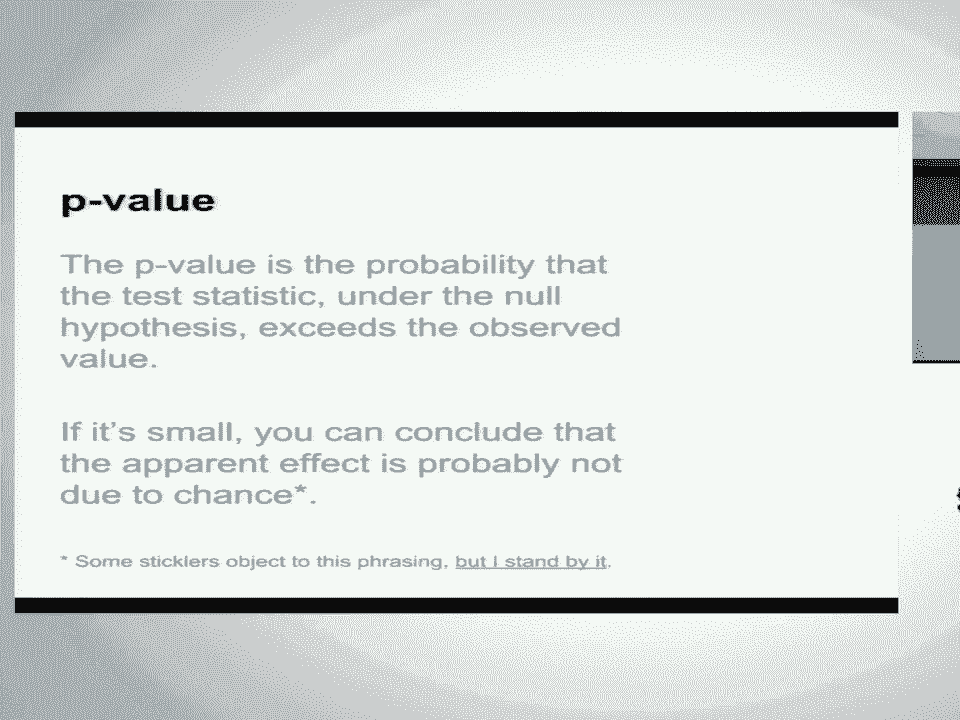

 So I'm going to compute the p-values。 Getting back to the notebook。

 This function is what's doing the generating the fake data。

 So I'm given this pool which consists of both the first group and the second group。

 That's what this one does。 So hstack is the NumPy command that's just going to take two arrays and lump them together。

 horizontally into one big array。 So that's the encoding of my assumption that the two groups are actually the same。

 Under the null hypothesis and if they're the same and when I put them together， shuffle， them。

 That's this line。 And then split them up into the first n and everything from n on。

 Questions about how I did that in NumPy。 And what that looks like if I run the model once。

 it's going to give me back two arrays， with sizes n and m。 Questions。 Okay。

 Now I've got fake data that looks exactly like my real data。

 So I'm going to use the same test statistic function on the fake data that I used on the， real data。

 And if I do it a thousand times， what I get is this distribution。 That is how much difference。

 I would expect to see between the two groups if in fact there's no difference between them。

 Most of the time it's pretty close to zero， which makes sense。

 If they're actually the same and I draw one random sample and then another random sample。

 I'm probably going to get the same mean over and over。 It'll just differ by a little bit。

 Sometimes it differs by about 。075。 Sometimes it's really big and it's 。175。

 And then I put that gray line there。 What is that gray line？ Somebody feeling smart？

 That is the actual observed test statistic。 That is the actual difference that I saw in the data。

 which was 。078。 And now I can compute the area in the tail。 The area of that blue part。

 everything that's to the right of the gray line。 Those are all the cases where just by chance。

 just by randomness， even though the two groups， were the same。

 it turned out that I saw a difference that was as big as 。078。

 And I computed that using a very complicated computational method called counting， which。

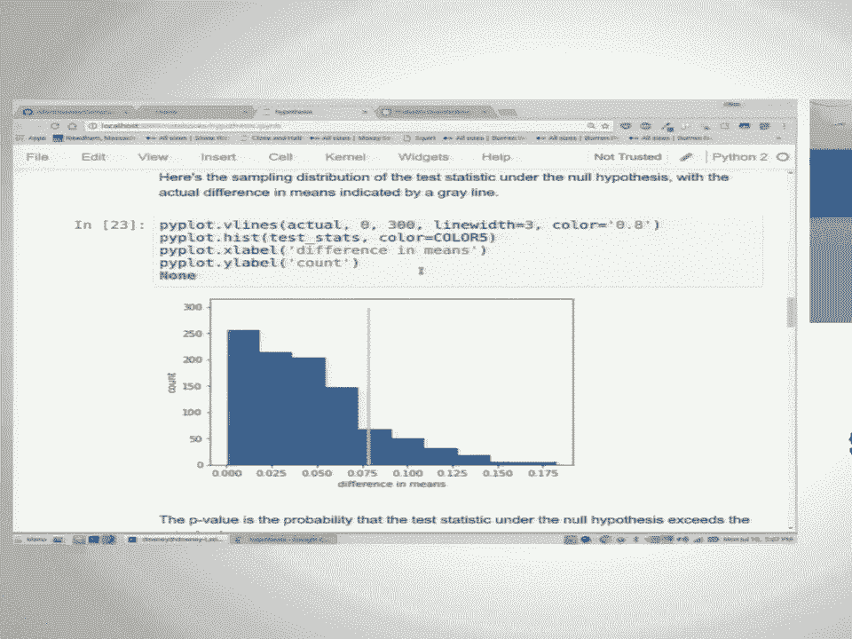

 is I ran the experiment a thousand times and I counted how many times the difference under。

 the null hypothesis exceeded the observed value。 It happened 150 roughly times out of a thousand。

 So I would say that the probability is 15 percent。

 That if in fact there's no difference between the groups， then I might have seen， in effect。

 as big as what I saw。 And that's the p-value。 [ Inaudible ]， Probably not。 Right。

 Now let me talk a little bit about the interpretation of this。

 which is when that value is very small， when the p-value is small。

 that means that it is unlikely that you would have seen what， you saw under the null hypothesis。

 That makes you think that the null hypothesis is probably wrong， which is useful。

 What that's saying is that there probably is a difference between the two groups。

 That the variation that you saw is unlikely to have occurred by chance。 Now。

 I'm being a little bit fast and loose with the probabilities here。 People will argue about this。

 Again， you can get into the weeds。 But by and large。

 people will say that if the p-value is 5 percent or less， that is unlikely。

 to occur purely by chance。 And this is XKCD being a little bit funny about this because now that 5 percent has become。

 this magic threshold， people will play all kinds of games with it's like really close， like 。04。

 Well， that's almost significant。 And when if it's really small， it's definitely significant。

 That is probably not philosophically well-grounded。

 I recommend what I call the order of magnitude interpretation of p-values， which is anything。

 that's more than 10 percent， what that's telling you is that it is entirely plausible。

 that what you saw could happen by chance。 You probably shouldn't take it very seriously。

 Anything that's less than about 1 percent， you can credibly say if this were totally random。

 if the null hypothesis were true， this probably would not have happened。 And therefore。

 I'm going to come away with this with some confidence that this effect， is probably real。

 And I think anything between 1 and 10， you just need to do more experiments or get more， data。

 You probably shouldn't say anything at all。 Yeah？ [ Inaudible ]， Yes。 Yes。

 That's a really good point。 And it's related to the idea of running multiple tests。 And let me。

 I forget whether I've got the jelly bean slide here or not。 I don't。

 But let me take an aside because that is a good one， which is if you will join me in。

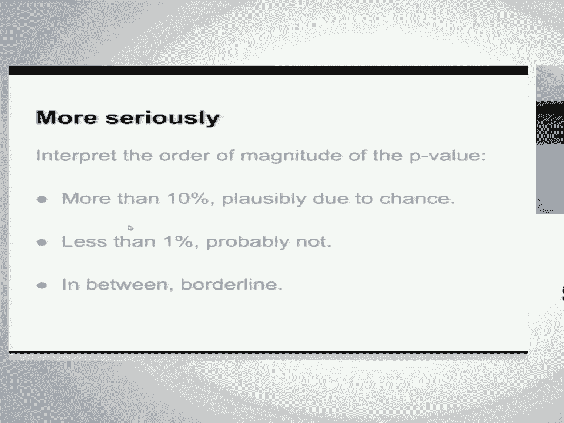

 Googling， XKCD jelly bean， this is one of the best explanations I've seen of what can。

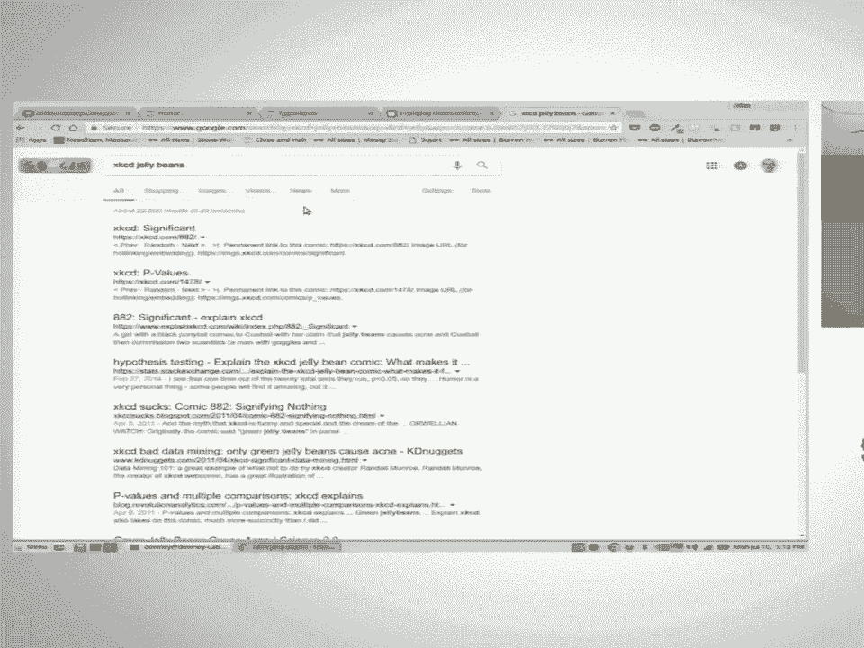

 go wrong if you run lots and lots of statistics of significance tests。

 Let me give you a minute to read that and then we'll talk about it。

 Question is whether any of this analysis is going to make a pregnant woman feel any。

 better at the end of her pregnancy？ No。 In fact， it's worse。 [ Inaudible ]。

 Question was whether it was annoying to her that while she was in pain， I was being all。

 statistical and analytic about it。 Pretty much the foundation of our marriage。

 So this graph is the expected number of remaining weeks in a pregnancy as a function of how many。

 weeks along you are。 Notice that it goes down linearly for a while。 So at 36 weeks。

 you should expect on average 3 to 3 and a half more weeks。 When a week has gone by。

 that mean has now gone down by a week。 Which makes total sense。

 If you are driving to something that is 39 miles away and you go a mile， you expect to。

 be one mile closer to your destination。 However， when you get to week 39。

 this process becomes memoryless。 Which means that the remaining lifetime does not depend anymore on how long this has been。

 going on。 So at 39 weeks， the expected remaining time is a week and a half。

 If a week goes by and that baby has not been born， the expected remaining time is a week。

 and a half。 If a week goes by and that baby has not been born。

 the expected remaining time is a week， and a half。 And that continues for four weeks。

 Which is just brutal。 It is literally the goalpost receding from you at exactly the rate that you are approaching。

 it。 This is the cruelest graph I have ever seen in statistics。 Okay。

 we are now two levels deep into detours。 So we need to start popping things off the stack。

 So we talked about multiple hypothesis tests。 And what this says is if you run a hypothesis test and the p-value comes in at about 5%。

 you， might conclude that that effect was probably not due to chance。

 But there is still a 1 in 20 chance that you would be fooled because 5% is 1 in 20。

 What that means is that if you run 20 tests， there is an excellent chance that you will。

 be fooled on average about once。 Okay。 Now there is a trade-off there between how low you make that threshold and how often you。

 are going to get fooled by randomness。 And in many domains 5% is a reasonable choice。

 In other domains you might want to hold out for a much smaller p-value because the cost。

 of being wrong might be very high。 So don't take 5% as a magic number that is applicable in all domains but also be careful。

 about running multiple tests because the probability of getting false positives goes up every time。

 you do a test。 Okay。 So that is number two that was on the stack。 Let me pop back to this framework。

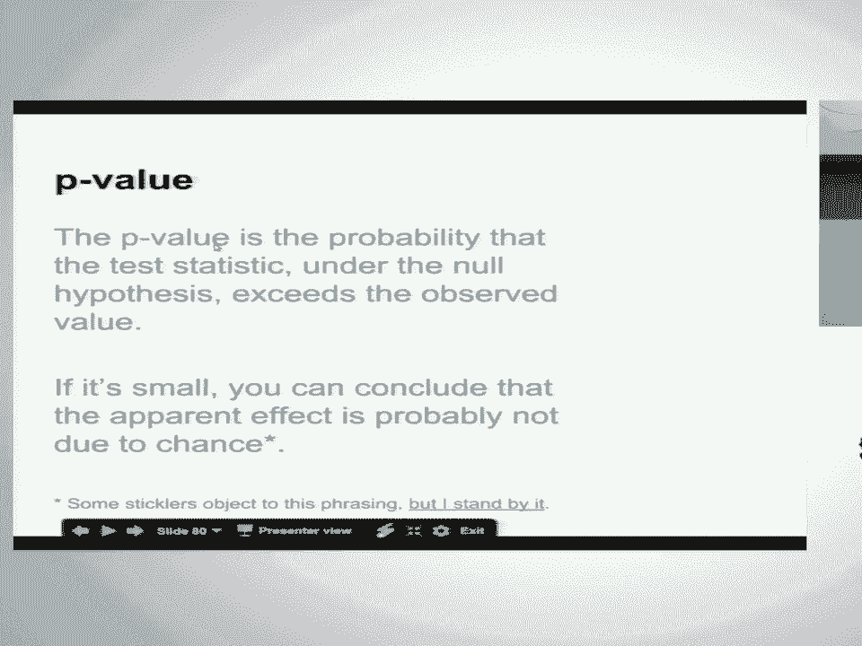

 If you have available space， maybe the other side of wherever you had the other tattoo。

 that this tattoo which is the framework for running hypothesis tests。 This is， I hope。

 the antidote for many statistical classes。 How many people took a stats class and learned about t-tests？

 Okay。 Will coxant tests？ Z tests？ Anderson darling？ Kolmogarov Smirnov。 Okay。

 There are in a typical stats class 5， 10， 100 statistical tests and many people come away。

 from that experience thinking that what statistics is is knowing which test to use for which occasion。

 And occasionally I hang around on the Reddit Statistics subforum。

 And that's probably half of the questions that we get。

 Someone will come up and say I ran an experiment。 Here's what my data look like。

 Which test should I use？ And invariably I reply and say there's only one test。

 The framework of hypothesis testing is always this。

 All that other stuff is just analytic ways of estimating this without doing computation。

 But if you're willing to throw computation at the problem， it's just this。 Again。

 you take your data， compute whatever the test statistic is that you want。

 In our example it's a difference in the means。 Call that thing delta star。

 That's the observed effect。 Now， build a model of the null hypothesis。

 This is that thing that we are assuming for purpose of contradiction。

 Assume in this case there is no difference between the group and use that model to generate。

 simulated data。 Take your simulated data and compute exactly the same test statistic。

 Do that a thousand times because a thousand is the magic number。 And make that distribution。

 That is the distribution of delta under h0。 That is how big an effect you would see by chance if the null hypothesis is true。

 And now draw that gray line at delta star。 Everything to the right of that is the probability of seeing an effect as big as what you saw。

 by chance。 That's the p-value。 Good？ Yeah？ So does this mean the p-value would make sense in that set of things that always make to。

 the null hypothesis？ Yes， the p-value only makes sense given the null hypothesis。

 And for a given scenario， often there are different choices that you might make。

 This is another one of those cases where there's some modeling going on。

 And the other choices will yield different results。 I'll give you an example。

 One of the things that people often talk about is the difference between a one-sided test。

 and a two-sided test。 And it depends on， to some degree， what you were expecting。

 So if I'm testing the hypothesis that there is a difference between two groups but I don't。

 know which way it goes， then really all I care about is the magnitude or absolute value。

 of the difference。 That would be a two-sided test because I care about both tails。

 Either one of them is way bigger than the other or the other way around。

 But if I have a specific hypothesis that I want to test， which is I think that first。

 babies are more likely to be late， now I only care about the right end of that tail。

 So that would be a one-sided test。 And I would say that that decision is part of the model of H0。

 Well， actually I take it back。 That decision is determined by the test statistic。

 whether the test stat contains an absolute value， or not。 So I'm going to go you one better。

 You asked me if there are some modeling decisions here and I'm saying yes， you are making a。

 modeling decision when you choose H0。 You are also making a modeling decision when you choose the test statistic。

 Okay。

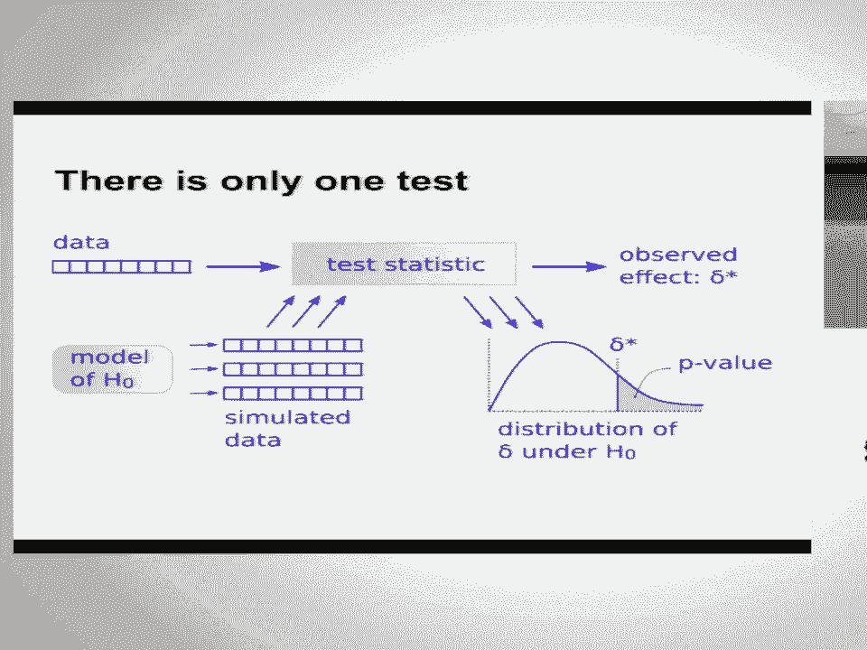

 This framework again is encoded in the notebook as a class。 And let me show that to you。

 That is the hypothesis test class。 So let's go back to notebooks one more time， read through this。

 run the code， and then do， exercise one。 And we'll debrief in a few minutes。

 If you are running out of steam and your brain is full， feel free to load up the solution。

 How many of you are on your second tutorial of the day？ That might be some fatigue。

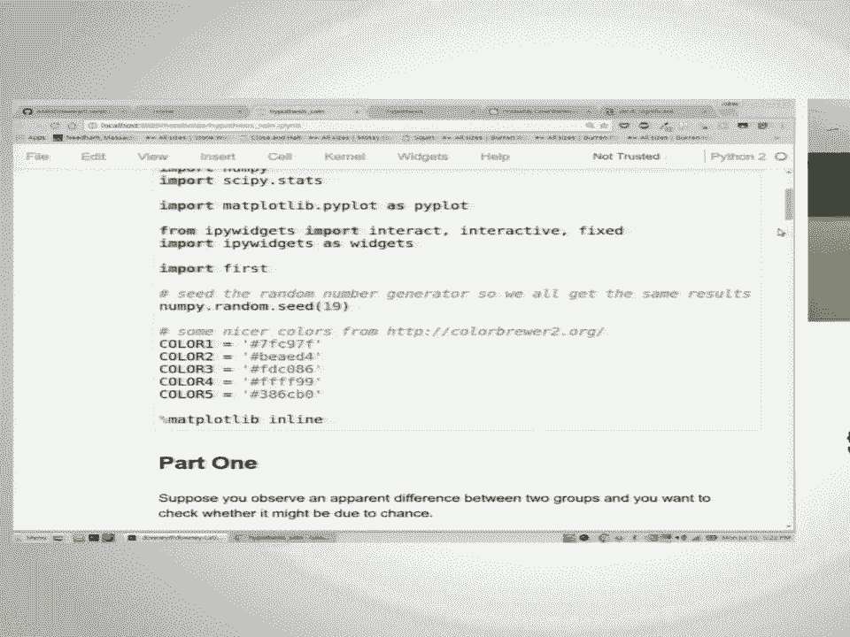

 So if you are working productively and you don't need my help， feel free to ignore me。

 If you are tired or stuck， you can look up here at a solution。

 So what I'm doing here is I'm taking advantage of the fact that I've solved most of this。

 problem by inheriting from diff means permute and I'm creating a new thing called diff standard。

 deviation permute。 The only difference between them is that I'm changing the test statistic。

 And the nice thing about this is that I could put absolutely any function there and it would， work。

 And in this case it's just taking the two groups。 So I take my data， split it into two groups。

 compute the standard deviation of each group， and then it's the absolute difference between them。

 So this is asking the question， well， maybe there's no difference in the means， but maybe。

 there's a difference in the standard deviations and the answer turns out to be that the p-value。

 is still about 16%。 So not much help there。 But I did want to make sure that we have at least one test that turns out to be statistically。

 significant。 So the last one is we're going to look at whether the difference in weights might be。

 that maybe， first babies are more likely to be light rather than late。 Question。

 [ Inaudible question ]， So the question is， let's say I run those two tests between the means and the standard。

 deviations and one of them turns out to be significant and the other isn't。

 First thing is if they're both kind of close to the magic 5%， again I wouldn't exactly。

 run to the press， I would take it under advisement。

 But the other possibility is either of those results could be true。

 That two groups could have the same mean but different variance。 That's totally possible。

 [ Inaudible question ]， Yeah， I would say yeah， the groups are different。

 The means turn out to be the same but the variance is different。 Yeah。 Yeah， question in the back。

 [ Inaudible question ]， So one way to do that is if you can boil down the difference to a single test statistic。

 then， you can ask the question， how likely would it be if the difference between these distributions。

 was that much if in fact they were sampled from the same distribution。

 So the framework still works nicely， the only challenge is how do I design a test statistic。

 to measure the difference between two distributions。

 And one answer to that is the area between the curves that you could plot the cumulative。

 distribution functions and compute the area between them。

 Another possibility is actually the Kolmogorov's smear knob statistic which is that you compute。

 the vertical distance between the distributions for all x and then compute the maximum。

 And that's one way of quantifying the difference between two distributions。 But again。

 there's not a unique choice that is dictated to you， it's a decision you have， to make。

 And then you have to make sure that there are questions。 Correct， there's not a single p-value。

 For a given scenario， for a given set of hypotheses that you might want to test， there's no single。

 p-value。 You have to specify the hypothesis， you have to choose a test statistic。

 you have to design， H0。 And the p-value that you get will depend on all of those choices。 Yeah？

 >> [INAUDIBLE]， >> Correct。 >> [INAUDIBLE]， >> Good question。 So for this case。

 I chose a permutation test which is I just lumped the groups together。

 and split them in half with the right number in each group。 I could have also done resampling。

 I could have drawn random samples from the pooled distribution。

 Or I could have gone with what I called model two up here， which is that I could fit a smooth。

 distribution to the data and then draw samples from that smoothed analytic distribution。

 All of those would be reasonable choices。 I will run the last test。 Differences in birth weights。

 Now notice that I've already got diff means permute。

 So I've got this object that knows how to test this hypothesis。

 All I need to do is put different data into it and the whole thing just works。

 Turns out that in this case the p value is sort of zero。 But that means I tried a thousand times。

 I ran a thousand iterations。 And in zero cases did I see a difference by chance that was as big as the actual difference。

 that I saw。 So I would conclude that the p value is probably less than one in a thousand。

 I shouldn't say that it's actually zero because it's not logically impossible。 It's just unlikely。

 And if you wanted to， this is maybe one of the reasons for using an analytic result。

 If you really cared about how small that p value was， you could do it analytically and。

 you would find out it's 10 to the minus 17。 But it doesn't really matter because again when the p value is very small。

 that means， that under the null hypothesis you're probably not going to see what you saw。

 So it's probably real except for measurement error and sampling bias and all the other。

 things that you should be worried about。 So again， I'm trying not to be too flippant about this。

 I want to warn you about the limitations but also say it's not useless。 It is telling you something。

 It's letting you check off one of the things you should be worried about。

 Which is when you see an apparent effect， one of the things to worry about is maybe I'm。

 being fooled by randomness。 What a small p value lets you do is say no， that's probably not it。

 The apparent effect is probably not just randomness。

 Now I should turn my attention to the other things I should worry about。 There's only one test。

 And again I just want to mention that the hypothesis framework I'm doing the same thing。

 again of taking this template， turning it into a Python class。

 And what that allows you to do is just plug in different methods。

 If you provide a test statistic and a function called runModel that does whatever H0 is， then。

 the framework now does all the machinery for you。 Okay。 And I said this again。 The null hypothesis。

 significance testing， rules out one possible problem but don't forget， the others。

 Now to pop up one level to wrap up the whole workshop we talked about three things。 Effect size。

 quantifying uncertainty and p values。 And again I wanted to hammer home the point。

 Effect size is the thing we really care about。 Whether you're doing science or engineering。

 we care about effect size。 Everything else is kind of checking to make sure that we're not making mistakes。

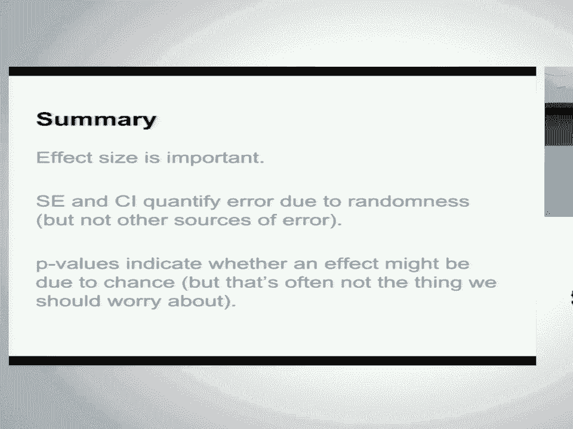

 Which is useful but less important。 This is all from my book which is called Think Stats。

 It's chapters eight and nine。 The rest of the book is about doing exploratory data analysis。

 visualization。 Also some of the later chapters are about survival analysis which is where those curves。

 came from that I showed you。 It's published by O'Reilly but also a free version that's at thinkstatstoo。

com too for， the second edition。

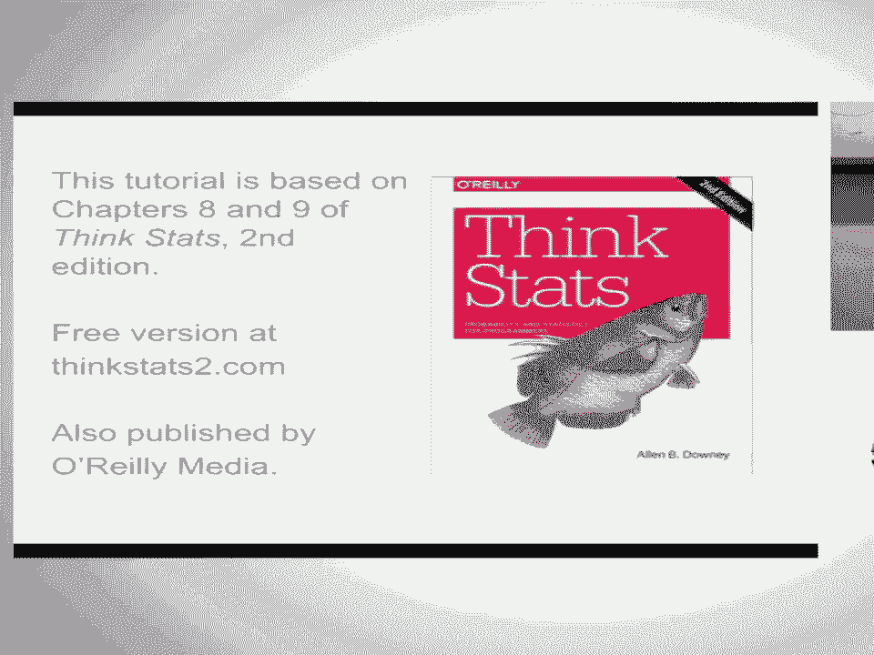

 So if you would like to follow up on anything we did today， that's a good place to go。

 The other thing I should acknowledge is that I'm not the only crazy person talking about。

 some of the issues that I talked about today。 So what you heard is a little bit of a different approach to stats but it's coming partly from。

 a movement that's called the new statistics and it is focused on exactly what we've been。

 talking about。 Tell me about effect size， quantify uncertainty。

 check to make sure we're not being fooled by。

 randomness。 And then last thing there are four ways to get in touch with me if you want to follow。

 up。 We've got a couple minutes。 If you have questions that we should talk about as a group。

 we can talk and then we can， break up and I'm happy to stick around and answer questions that you are too embarrassed。

 to ask as a whole。 Final thoughts or questions？ Yes sir。

 Question is what about statistical power and that's now asking let's say that you get。

 a negative result。 So you conclude that it's not statistically significant。

 The follow-up question might be well what if the effect was real， what's the probability。

 that you would wrongly get a negative result and that's related to power。

 You can do that computationally as well。 I talked about that in the book。

 It ends up being two loops where the inner loop is running a hypothesis test and the。

 outer loop is running the alternative hypothesis and counting how many times you correctly。

 get a statistical result if in fact there's a difference。

 It ends up being computationally expensive but doable。 Other questions？ Yeah。 Great question。

 So question is I did lots of examples with two groups。 What if you have more than two groups？

 When you're related to what we were talking about with test statistics you have to somehow。

 boil that down to a single number that measures how big the differences are that you saw。

 And there are a bunch of ways to do that but you could compute all the pairwise differences。

 and then take the mean or maximum of those。 Some way of quantifying how different is what you saw from what you would expect by。

 chance。 Again you've got some choices there but any reasonable choice should get you a p-value。

 and again we really only care about the order of magnitude of the p-value。

 If it's really small that tells us something。 If it's really big that tells us something。

 If it's between one and ten percent it's borderline and we probably need to do more， work。

 If you're off by a factor of two when you compute a p-value it almost never matters。

 A p-value of two percent or four percent who cares？ Four percent or eight percent don't care。

 Ten or twenty don't care。 Other questions？ Yeah。 [inaudible]。

 Yes great question this extends very naturally to that which is let's say you're not going。

 to see whether the difference got bigger or smaller。

 So again you just need to pick a test statistic that quantifies what you care about and in。

 that case it would probably be the difference in the differences。

 I'm not sure if you're going to get a test。 I'm not sure if you're going to get a test。

 I'm not sure if you're going to get a test。 I'm not sure if you're going to get a test。

 I'm not sure if you're going to get a test。 I'm not sure if you're going to get a test。

 I'm not sure if you're going to get a test。 I'm not sure if you're going to get a test。

 I'm not sure if you're going to get a test。 I'm not sure if you're going to get a test。

 I'm not sure if you're going to get a test。 What are the differences？ Yeah， I'll throw it back。

 Is there a good practice for seeing whether your sample data is representative of the population？

 It's hard。 I think the only methods that I'm familiar with and this is getting outside of my expertise。

 which there are people who design large-scale representative surveys and they're really。

 good at it and they have a lot of good practice。 I don't know a ton about it。

 One of the methods though is to do two different methodologies and look for the differences。

 between them。 Often it's doing a relatively small but very expensive careful study and then a larger but。

 less expensive study and that will give you a sense of how much you're losing by doing。

 a less expensive methodology。 Are there statistical software packages that are built around this framework？

 I don't really know。 I haven't used them partly for teaching purposes。

 I wanted to show it so I haven't used packages。 Resampling methods and bootstrap methods have been around a long time。

 They've definitely been coded up。 I'm sure they're out there but I just don't know them。

 They're often so simple to implement that people just implement them。 Yes？ No。

 it's a great question。 Everything that I just told you is 20th century statistical inference and that's just。

 how it was done。 It was historical。 It came about in part because of a small number of people who were very influential in 20th。

 century statistics。 Actually， there's a great book that's called The Theory That Would Not Die that talks about。

 this history and it talks about it from the point of view of Bayesian statistics。

 That is the alternative。 You asked is there only one framework and the answer is no。

 there are at least two and the， other one is Bayesian。

 For that I recommend Think Bays which is my book。 That's also me。 Yes？ Yes。

 So the question is what if it's too expensive for the resample to be the same size as the， original？

 One possibility would be to choose the biggest size that's practical and if you're doing。

 that you are being more pessimistic than necessary。 In other words。

 that's going to give you an upper bound on your uncertainty。

 Because your sample size is actually bigger than that， your actual confidence interval。

 will be smaller than what you estimate。 That is probably good enough because what you find out。

 so you're going to make a pessimistic， assumption。

 You're going to get a confidence interval that is bigger than it really should be。

 And if it's still small enough that you don't care， then you should definitely turn your。

 attention to other sources of error。 Anything else？ Okay。

 again I'm happy to stick around and answer questions if you have more but other。

 than that we are done。 Thank you all very much。

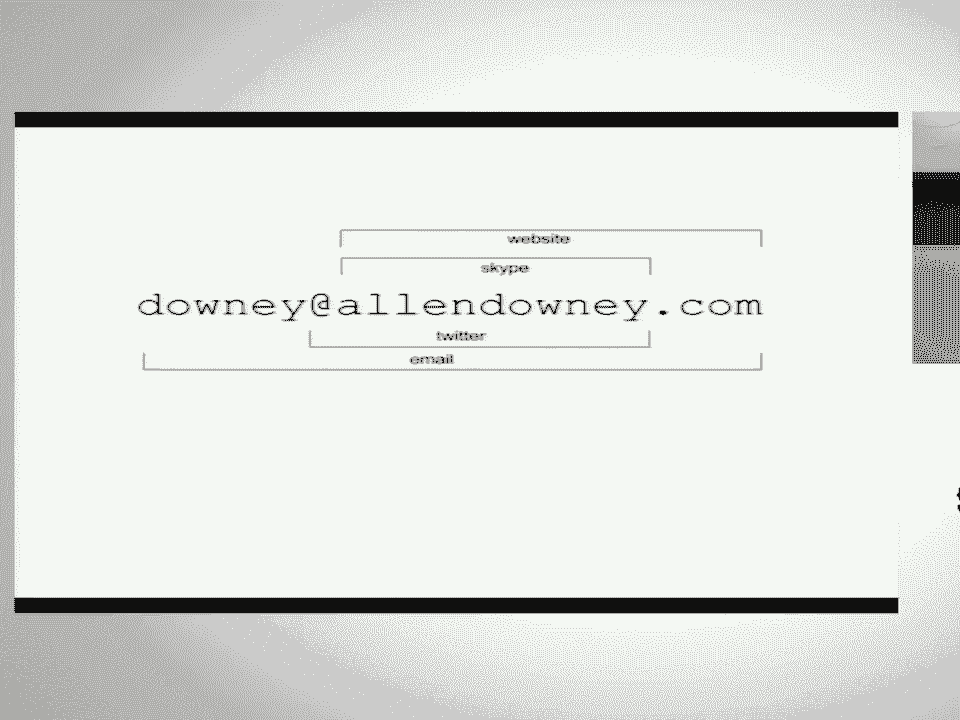

 [APPLAUSE]， [BLANK_AUDIO]。