# P28：SciSheets   Providing the Power of Programming with the Simplicity of Spreadshee - 哒哒哒儿尔 - BV1Cs411A76Y

 Hi， oh。 I usually think that plos is premature， so we'll see how things go。 First of all。

 I'm impressed this many people are interested in spreadsheets。 That is absolutely awesome。

 This is something that， you know， as we go forward， you'll see through the talk。

 I think it's one of those areas that's just been sadly overlooked in both computer science and a lot of computer engineering。

 So， you'll say， "I'm Joe Holish， I'm not Alicia Clark。 She looks much better than me。

 She will join us later on。 The two of us have been collaborating on a project -- on this size sheets project。

 And I want to share with you today where we are。 I'll tell you。

 we're certainly at the point right now where we're looking for a lot of feedback。

 and also collaboration。 You'll get more of the feeling for as we go along。 So， first of all。

 just a quick run through。 So we're on the same page with spreadsheets。 This is pretty common stuff。

 You see， typically column headers with rows of data。 If you want to put in a formula。

 usually this is an Excel kind of thing。 You put it in and you do it in terms of the coordinate system。

 So， A2 would be the column A with the row two。 And so， picking up that number。

 I'm going to do a division on it。 That's my formula there。

 And the cool thing about this is you get to see the result right away。 Now。

 if I want to do some iteration， I want to do the same formula all the way down。

 You use copy and paste。 You end up with the numbers over here。 Of course。

 if you look under the covers of what the actual code looks like。

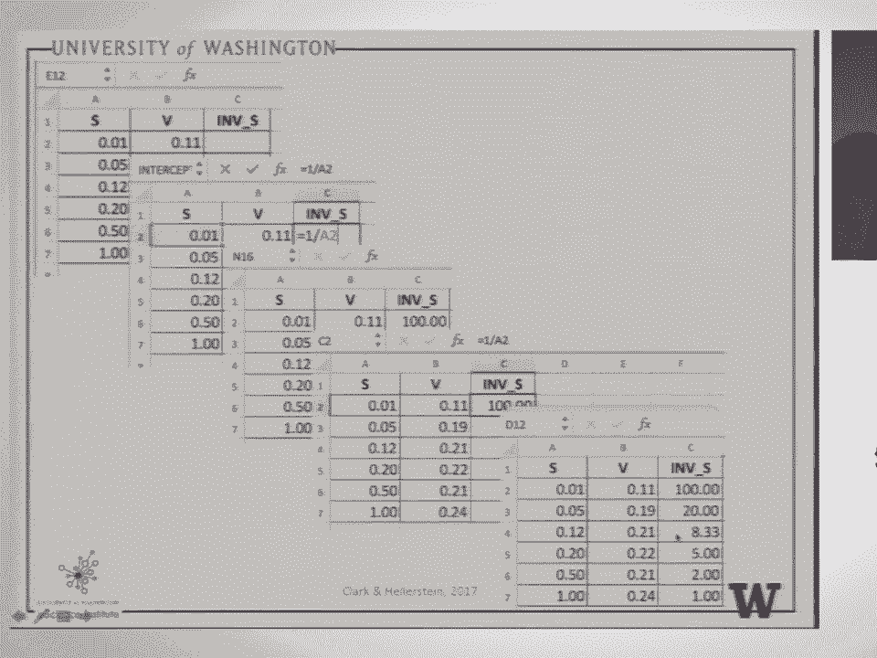

 it looks sort of like something where， you know， sort of like assembly language code。

 But generally people don't look at that too much， especially with these kinds of simple formulas。

 So， why is this so compelling？ Why is this something that is so widely used？

 I think there are a few things。 One of them is that you're focused on calculation， not programming。

 By that， I mean you don't have to worry about data dependencies。

 The fact that this column here depends on that column there。 They don't really care it。

 Figure it out underneath。 Whereas， of course， in programming， we've got to order our calculations。

 in the matters we care about data dependencies。 You don't have to worry about flow control。

 I did iteration without a for loop。 I did copy paste。 And last part is those data structures。

 Probably one of the more complicated parts of programming dealing with data structures。

 That's sort of the background here。 You know， programming has been around for a very long time。

 I guess dates back to 8 of Lovelace 150 years ago。 Real programming where you're， you know。

 actually using machines， you could argue it comes from the second world war talking about 70 years ago。

 Spreadsheets are relatively new。 Electronic spreadsheets。 We're probably talking about the 70s。

 But if you look at the difference， you know， depending on the stats you look at。

 around 20 million or so programmers today， professional programmers。

 about a billion spreadsheet users， people who use formulas。

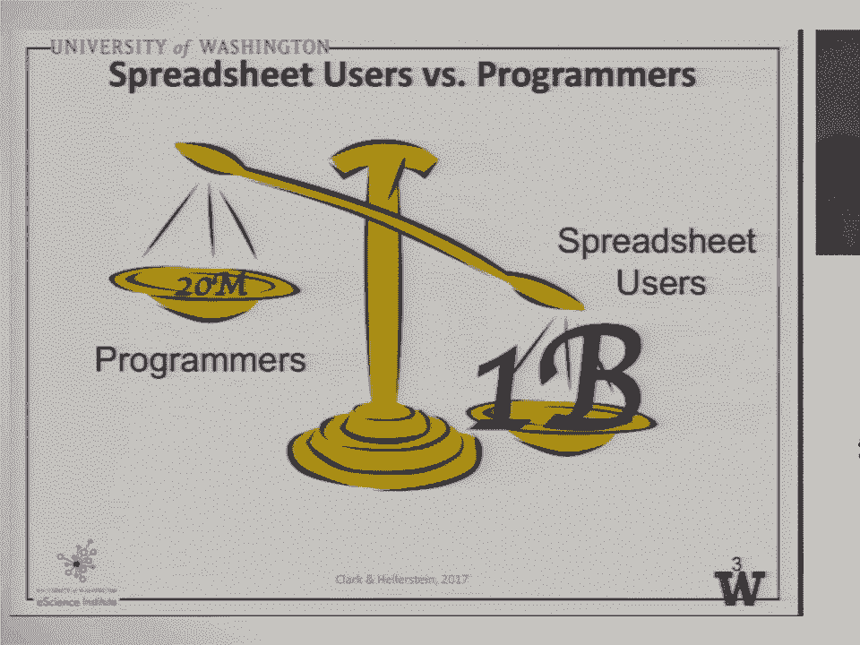

 So， clearly， there's a lot going out there。

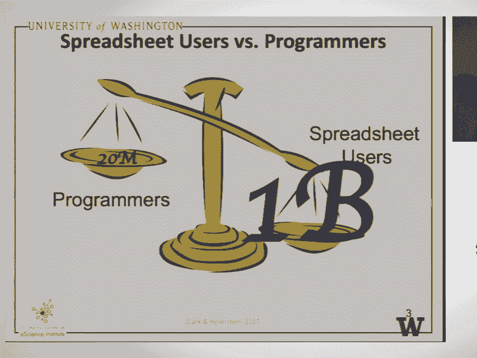

 Probably， I think， you know， my claim is， although it's mostly unsubstantiated， I guess。

 is that it's a more popular environment for calculations on the planet。 We calculate。

 when we were thinking about what we wanted to do developing instead of features。

 we sort of classified our users into three categories。

 The first of what we're calling novice in terms of calculations。

 those are people who basically want to evaluate a formula。 They would use a calculator。

 but a spreadsheet is so much better。 And they're going to construct sort of linear recipes of the things they do。

 Then there are people we call scriptors。 They certainly can， you know。

 they would work interactively in like a MATLAB console or an R console。 They know about four and if。

 but it may not save anything to a file。 If they save it to a file， it's like one big thing。

 If they want to get reuse， it's copy， paste， blocks of code。 And they generally。

 and then we'll worry algorithms， but they don't use functions。 So。

 functions not part of their repertoire。 And the last one are programmers。

 These are people who could use， like， you know， a macro language。

 like Visual Basic or App Script in Google Sheets。 So， we're primarily focused on the top two。

 And sort of our data is that what we do should be as easy with traditional spread sheets。

 as it is with side sheets， provides so much more， address a lot of issues。 And secondly。

 we'd like to be able to make it so that people can move from being a novice。

 to a script or a script or a programmer to advance their skill set。

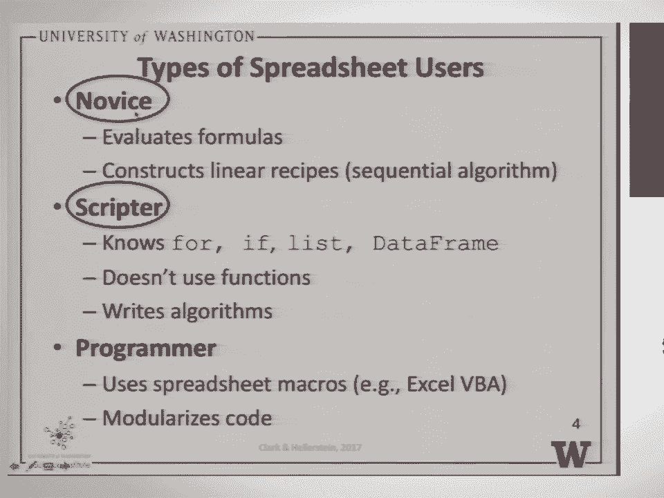

 So， now I'm going to talk about some of the issues with spread sheets today。

 And there are a lot of things that are very public。 I mean。

 one of the things you'll see common are the errors in spread sheets。

 That hasn't been our main focus。 Our main focus has been sort of like the engineering consideration。

 So， this notion of what we call expressivity， you know， how much of an algorithm or an。

 calculation can you write and how can you read it。 So， for example， this is a calculation here。

 a simple sequence of steps， that's commonly done if you are a biochemist， and you look at an M sign。

 You get information about what's called the substrate， that's S， reaction rates。

 And then you do a series of steps here with doing a regression， and then you're looking for a final。

 computation over here of these two parameters， here are the Vmax and the KM。

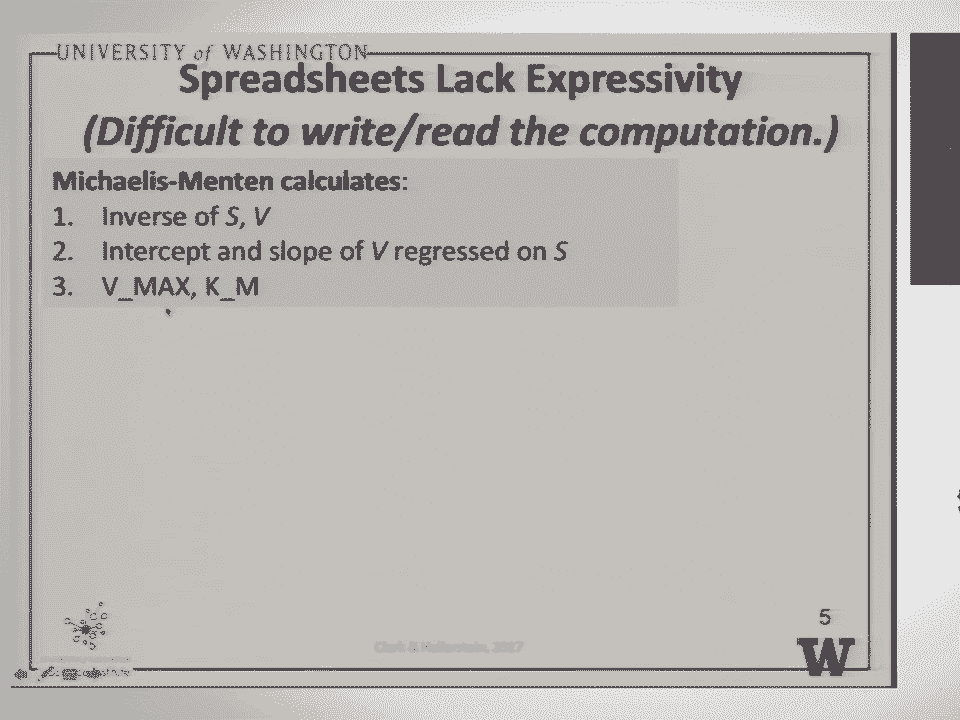

 So， this is a common thing。 You can do this in a spreadsheet in Excel， for example。

 And you would see the columns here underneath the covers like the one over S here or the one。

 over V over here。 But if you look under the covers of what's there， it's pretty hard to interpret。

 it's very hard to read。 And in particular， if someone is trying to describe a recipe， a。

 sequence of steps， all you can do is sort of infer it， maybe from the columns， and that may be。

 dangerous because in spreadsheets data dependencies are not done implicitly by position。 So。

 that's one issue。 A second issue we're trying to address is reuse， and this is。

 pretty fundamental in software。 You know， if I spend time investing in a spreadsheet， calculation。

 I would like to be able to reuse that calculation in others。 I mean， for example。

 that last calculation I did， I did it for a single set of data。 I want to do for many sets of。

 data over and over again。 So， how do I do that？ Well， typical way of doing that in a spreadsheet。

 is I would add values into these columns， maybe insert rows or delete rows or change values。

 But that's really awkward to do。 A second thing that I would really like to do is I would like to。

 use this calculation in another calculation like I have a set of files， each of which should。

 be calculated in the same way。 Can I use this spreadsheet here to do that calculation？ The。

 answer is pretty much no。 I mean， that's a really， really hard thing to do。 And the third one is。

 suppose the person who is the domain expert is a spreadsheet user and you have a bunch of。

 software engineers who are writing in Python， you know， can they use that spreadsheet calculation。

 in their Python codes？ And the answer is no。 I mean， they can rewrite it， but they can't， reuse it。

 So this reuse issue is another one that's been front and center for us to attack。

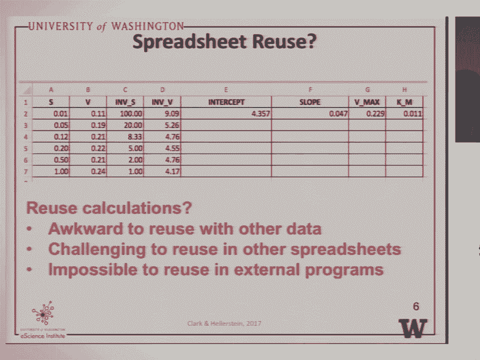

 So there are other issues as well。 We do have a paper in the proceedings。 You can check this。

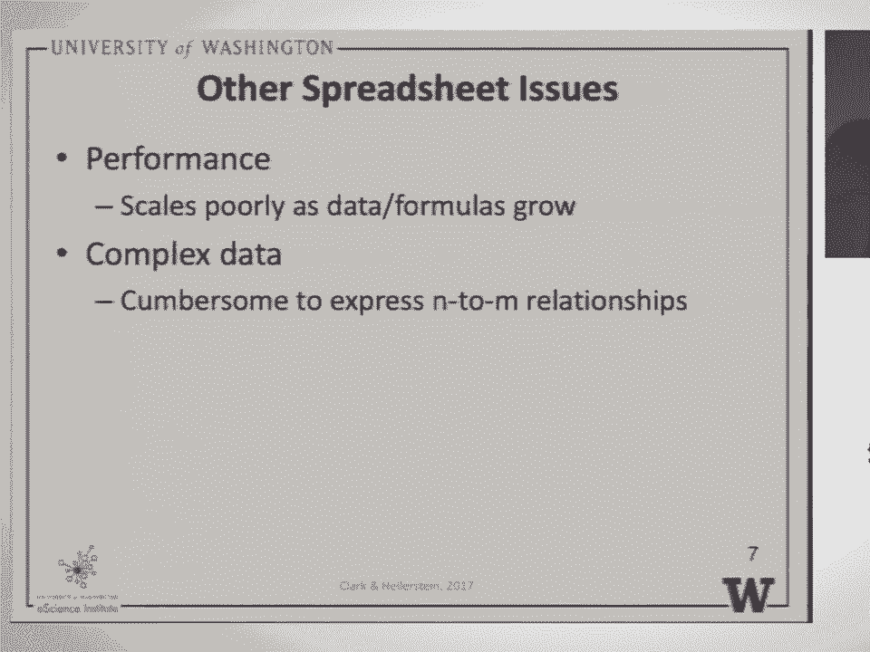

 out， what we're doing in this area of performance and complex data。 But right now I'll get to sort。

 of my main rant， which is computer science really done nothing for the vast majority of people。

 who do calculations。 Computer engineering has done a lot。 I think Microsoft is selling to。

 its advanced a lot and certainly Google sheets and open office。 But in terms of thinking about。

 things like designs of， you know， innovations in user interface or feature innovations or。

 algorithmic innovations， it is to say that you're a spreadsheet user， it's like saying you're。

 gay in the 1980s。 People stay away from you。 I mean， it's really obscene。 So anyway， we're。

 trying to， you know， have all the spreadsheet users come out of the closet and see what it。

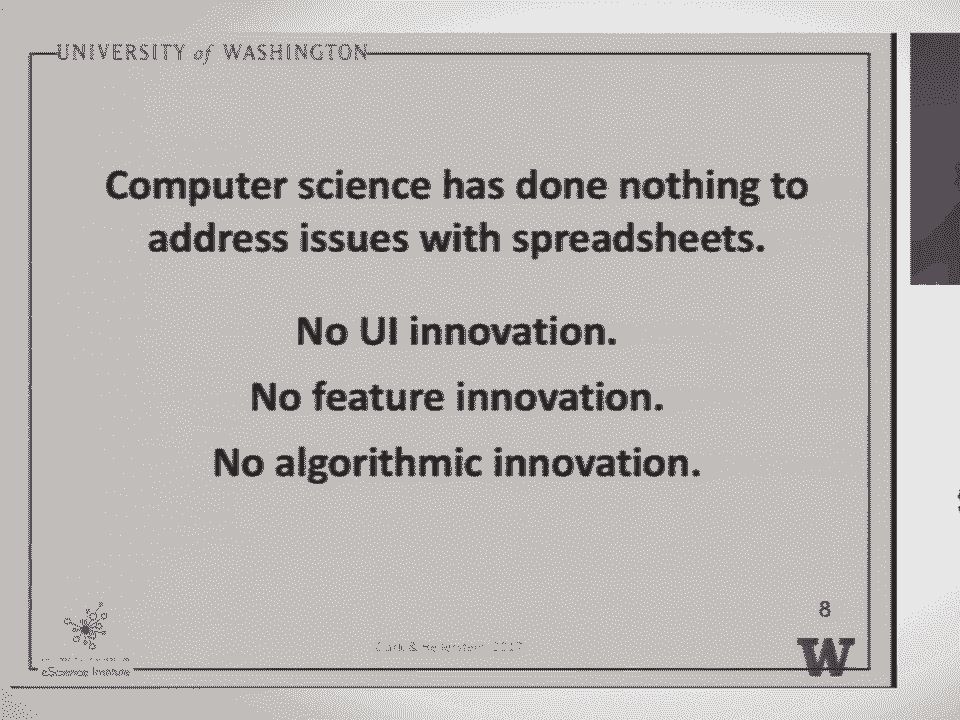

 is we can provide them for inventor tooling。 So I'm going to talk about this， you know， what。

 we're doing in this project， SciSheets。 Like， you know， you saw our tagline， Power of Programming。

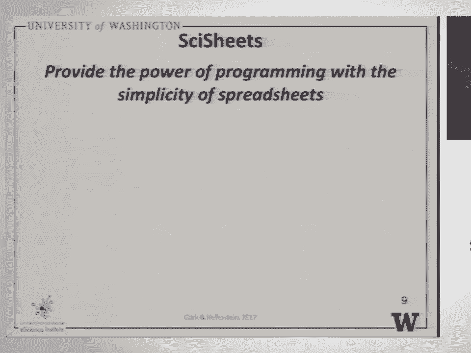

 with a Simplicity of Spreadsheet。 And what we've done is focus on a few set of features。

 So here are， the issues I left before， the expressively reuse performance and complex data。

 And what we're， going to do is talk about several features we have。 So one of them is not， you know。

 very， appropriate for this conference。 Instead of having these， the formulas be sort of the sort of。

 cryptic spreadsheet-ish kinds of calculations， you're going to use Python。 And actually it's。

 going to be， we've made it so that any Python expression or statement is available to you。

 including imports， including eval。 And the second thing is， and this is sort of an interesting。

 idea， take your spreadsheet and export it as a function， as a Python function in a module。

 So now you get， two benefits。 First of all， you get the benefit that a programmer can use it because it's Python。

 And secondly， you get the benefit that in my calculations I can reuse it because I'm writing。

 Python as my formula language。 That it's clearly a benefit in terms of performance as well because。

 now I can execute standalone。 And I'm not going to talk a lot about the， at all， really about the。

 complex data。 But data structures， providing richer data structures for spreadsheet users， is also。

 a challenge。 Our technical approach has been to allow sub-tables。

 so tables where the columns themselves， could be tables。

 And this provides some richness in terms of， for example， expressing end-to-end， relationship。

 The paper has more detail on that。 Okay， so let me go through briefly these， couple of features。

 I'm going to focus on the express-as-with-depart with Python formulas， and then。

 the formula being the formula language， and then also the export capability。 Okay， so here's what。

 site sort of a simulation。 By the way， there's also a， there is a video， you know。

 a demo of this as well， so you can see this in a richer form。

 But I'll give you sort of a simulated interaction。 So it looks pretty much like a spreadsheet。

 Anywhere where there's an asterisk， by the way， means， that there's a formula behind it。

 Formulas are only allowed in columns in size sheets。 And I admit。

 that does restrict somewhat what you write because spreadsheets can sort of have arbitrary structures。

 in terms of formulas。 However， it has a huge advantage when someone looks at a spreadsheet。

 you know where the heck the code is。 That's a huge problem。 Where's the code？ Anywhere。 So。

 any kind of size sheets we tried to restrict that a bit。 But I also will， you know， go on and say。

 we're not the only ones who do that。 There are other implementations of that same concept。

 So what you do， is， for example， this column right here， we're converting the inverse of S。

 you click on that， you get it yellow， means it's highlighted， you see a pop-up。

 you go over here and say， "Oh gee， I want to do a formula for this。"。

 And you get to see the formula。 And the formula looks just like a Python expression。

 Where the column names are。

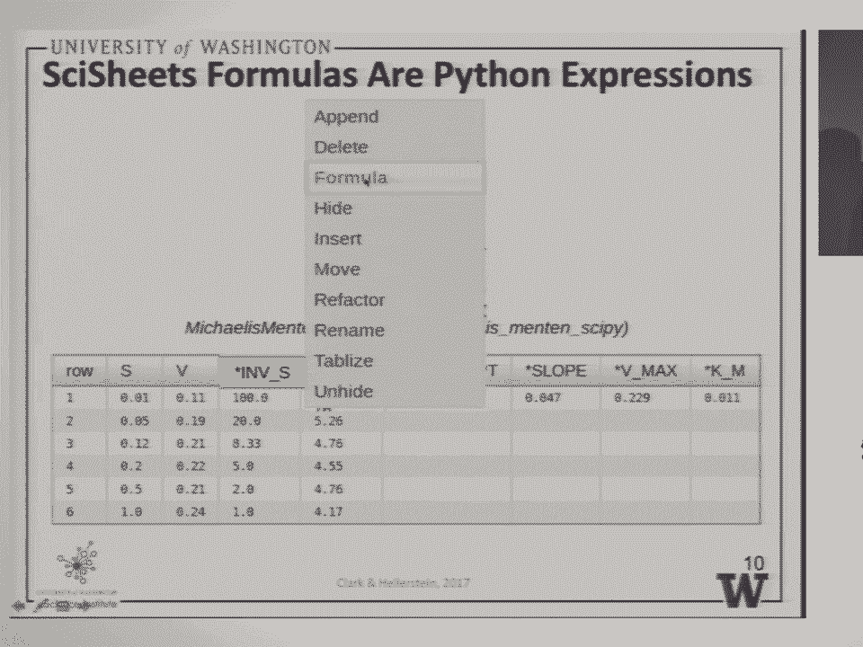

 actually Python variables available to you in the namespace in which you write your formulas。

 They actually what they are is their Python arrays， their NumPy arrays is actually what they are。

 And this has all sorts of interesting benefits to us because now you can do essentially vector operations in a natural way。

 You have all of the NumPy capabilities available to you。

 And it looks very natural to someone who's a novice or even a， scriptor。

 So this is obviously a little bit more readable than looking at， you know。

 the sort of grid-like column， formulations。 And also you have all of these Python packages available to you。

 which is very rich。

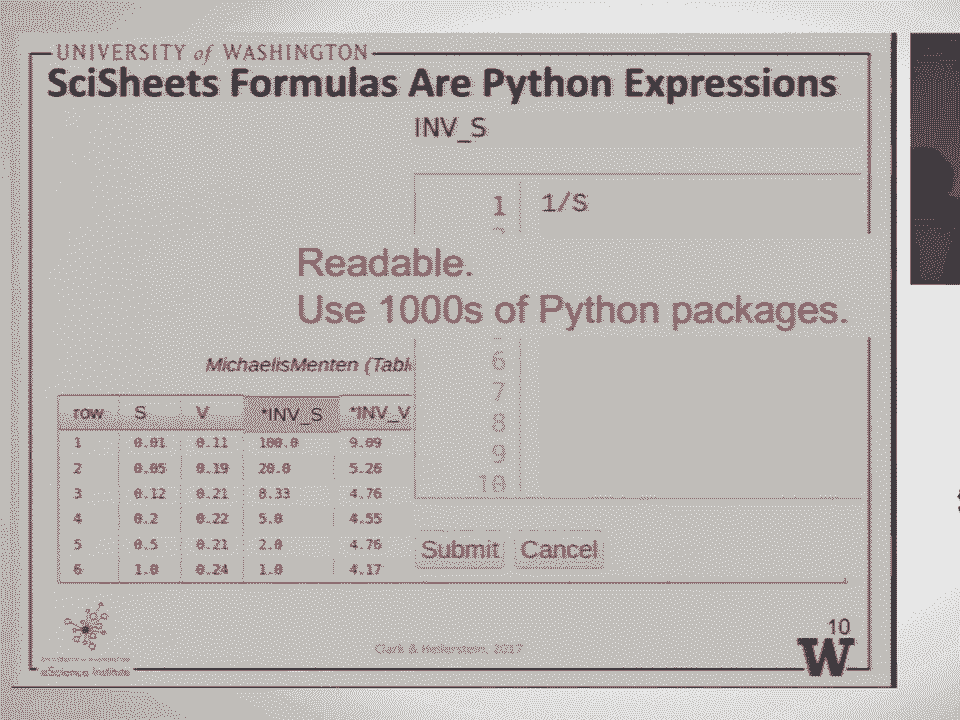

 Okay， you can also have a formula， a formula first held like this， I-N-D-V over here。

 the inverse of V， that is entire script。 So what's going on here？

 It's not just computing the inverse of the column over here。 Although it does that right over here。

 It does a few other things as well。 It's actually able to assign values to other columns。

 So it computes the value for here， for example， for slope and intercept。

 And it uses the SciPy stats package， which it imports up here。 So all that is available to you。

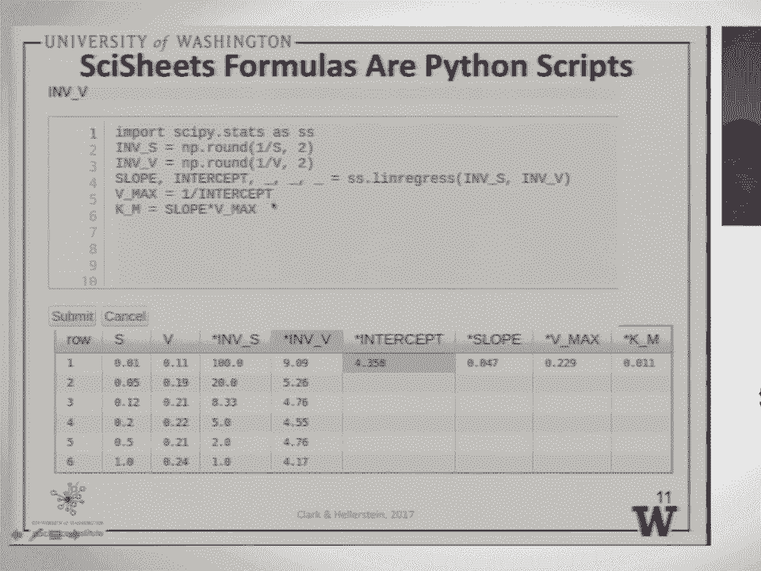

 Now， not only is this rich in terms of what you can express as an algorithm。

 it also puts in one place the code， which is essentially the， recipe。

 the computational recipe for what's going on。 So there you have it。 It's a lot more readable too。

 You know， novices can write scripts。 And then it can， in a simple recipe。

 and a script or could actually write an algorithm。

 Be very expressive in terms of what it is that they would like to calculate。

 So let me move on to the next one here。 This is actually one that I know is interest to many who I talk to。

 And that is to say， how can I take the spreadsheet and create a Python function out of it？

 So when you look at the spreadsheet， for example， this one here， it has inputs S and V。

 And the outputs of this are actually this Vmax and Km。 And so， I mean。

 I could define other functions here or subfunctions。

 But basically what happens is when I click on this header over here on that for the table。

 it brings up something here to export a function。 And when I export the function。

 I get this pop up here， which lets me specify the name of the function， the inputs and the outputs。

 And when I press submit， it creates that function。 Now， I don't have time to go through all that。

 There's code generation behind the scenes。 Not only does it generate the module that contains this function。

 Michaelis， is what I named it there。 It also generates a module that is a test for that function。

 Because we actually have all the information here needed to test because we know what the output is in one case。

 So that's very convenient for us。 What I will do is give you a feeling for the kind of code that gets generated in some of the subtleties here。

 Because remember， the way the spreadsheet is structured。

 we don't know what the data dependencies are， a priori。

 And we can't compute it really by looking at the parse tree because you can be using the vowels。

 And so we can't really determine data dependencies。 So how do we go about that？

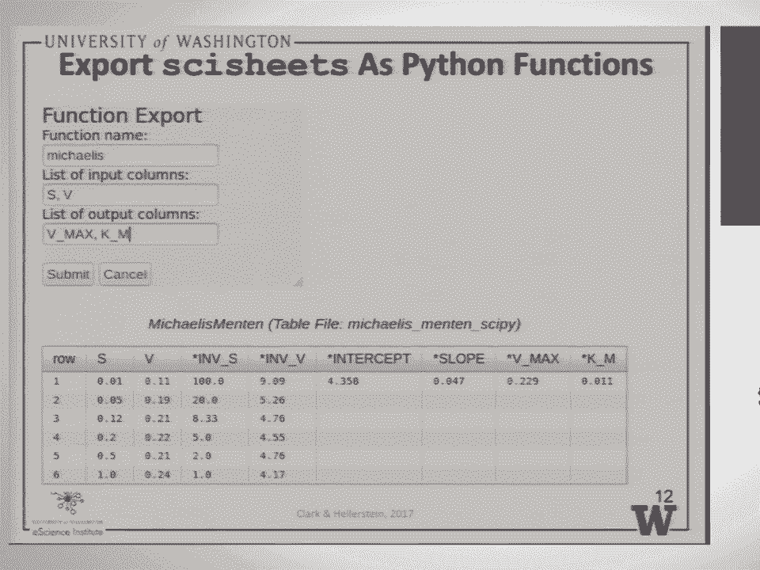

 So here's sort of the overall structure。 There's the def statement for the function。

 There's some prologue information about it for imports。 This is sort of the guts of it。

 We'll go through and take the formulas that were entered in each column。 And you see them evaluated。

 Then there's some wrap up there。 And then the results are returned at the bottom of the function。

 And let me just break out this a lot more detail on the paper。 It goes through a specific example。

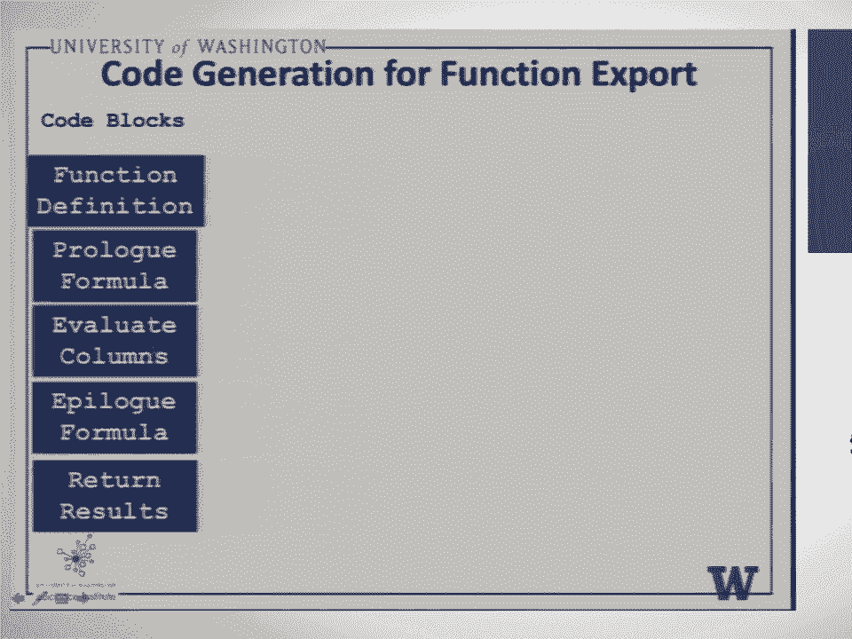

 But if I break out this evaluation part here， what's going on is for each column。

 it takes that code， which should be a valid Python expression or script。

 And it tries to do it doesn't eval on it。 And if that is successful。

 then it just -- essentially what happens is values are assigned， like you saw in the slides。

 If it's not successful， it could be not successful for many reasons。

 It could be not successful because they wrote code that's buggy or syntactically incorrect。

 Or it could be -- it could not evaluate and could generate an exception because a dependent variable is not assigned。

 Because we don't know the order in which the columns need to be evaluated。 So either way。

 the exception is recorded。 If you go through this loop。

 as many times as there are columns with formulas in it。

 you're guaranteed to at least be able to evaluate all the columns。 Because execution continues down。

 So the worst case， you evaluate one at a time。 It might be the last column that might be the last e-value。

 But then that means the next time you could get whatever was dependent on that and so on。

 So that's the way it works。 You can potentially speed this up a little bit because it may be if you're in the right order。

 You get the same values for columns and successive iterations。

 So that is another way of telling that you've completed the iteration。 Of course。

 if you generate an exception， then that has to be returned。 Okay。

 so let me switch over to Alicia and she'll tell you our directions。 Okay， hello。

 So we're kind of kind of switch gears now and I'm going to talk about some features that are currently under develop or we'd like to add to size sheets。

 So one of the first things is sub table name scoping。

 So if you guys think back to when you were first learning how to use Excel。

 if you changed a formula and you use that same formula for like multiple columns。

 you had to go and copy and paste each time。 Sometimes you would forget and you'd have all these bugs。

 So with this， we would pretty much hopefully eliminate the copy and paste。

 So if you updated a formula in one column， if there were columns with the same name in different sub tables。

 then the formula would update， which is pretty useful。

 The next thing we would like to do is develop an intuitive way to do version control with spreadsheets。

 I'll talk more about this in the next couple of slides。

 And then we'd also like to add visualization to size sheets。

 So right now you can have columns with numbers， but you can't actually visualize the data。

 So there are a lot of tool boxes available in Python that we would like to maybe be able to incorporate into size sheets。

 So that's something that could be really useful too。

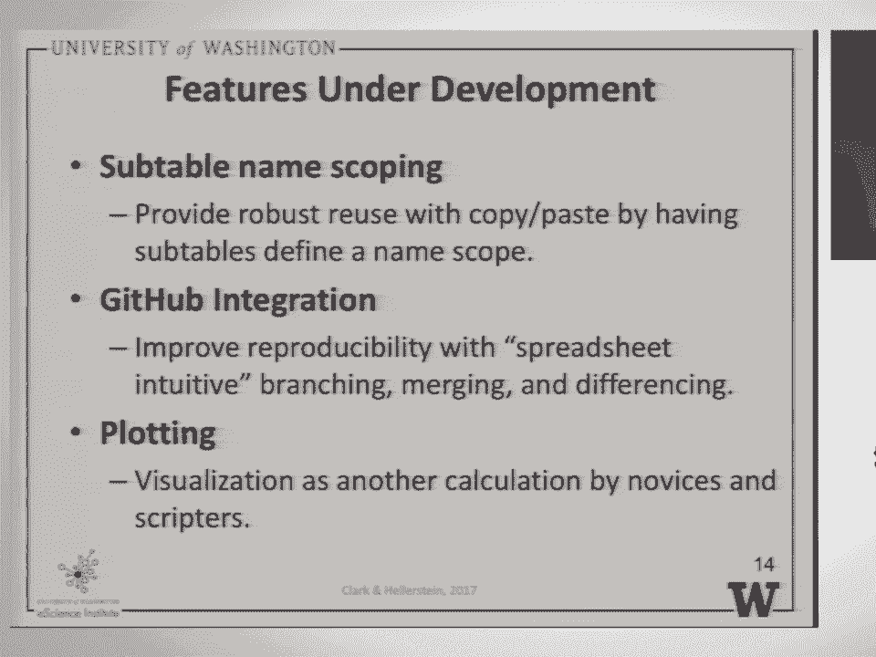

 So for this talk， I'm going to talk about some of the ideas that we have for integrating GitHub into size sheets。

 So you can imagine there's three basic things that you'd like to do with version control， branching。

 merging， and differencing。 But since we're primarily focused on novice users or people that aren't that familiar with programming and writing scripts。

 we kind of would like to develop a system that's very intuitive so that people could do version control without necessarily knowing that they're doing version control。

 And there's a bunch of systems that kind of have this idea but not necessarily with spreadsheets。

 So the innovation here would be that we would provide an intuitive approach to version control for spreadsheet users。

 Okay。 So the first thing we kind of wanted to think about is would be how branching would work in a spreadsheet type environment。

 And this could be really important because if you have the initial data and you had multiple users that kind of wanted to work with that data。

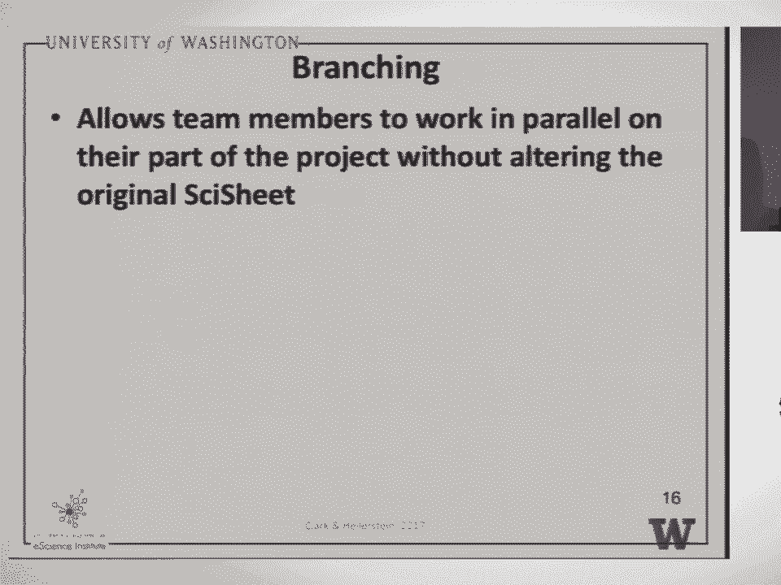

 you could then create branches so that users could do things kind of in parallel。

 And you could also kind of explore in a branch so you wouldn't necessarily mess up the columns and formulas that you already have in the initial spreadsheet。

 So in this simple example， if we have two users， one creates average column one and then the other one just adds 10 to column one。

 So you can see this is a pretty basic example but it's kind of intuitive。

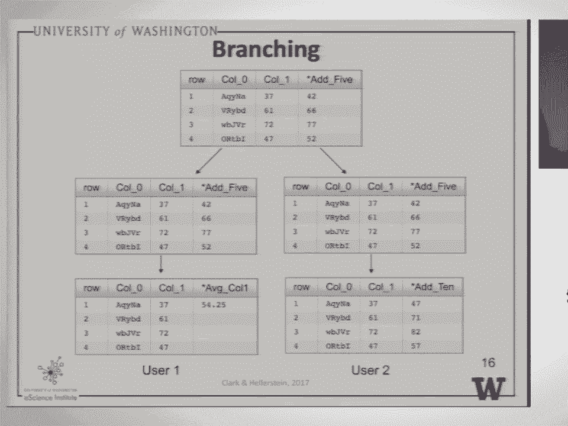

 You can tell that there's two different workflows going on。 Okay。

 The next thing we want to look at is once you have these branches。

 how would you merge them back together？ Which could be potentially problematic especially if you have the same types of column names but maybe what you call it is different。

 say someone had means， someone had average， you could kind of have merged conflicts。

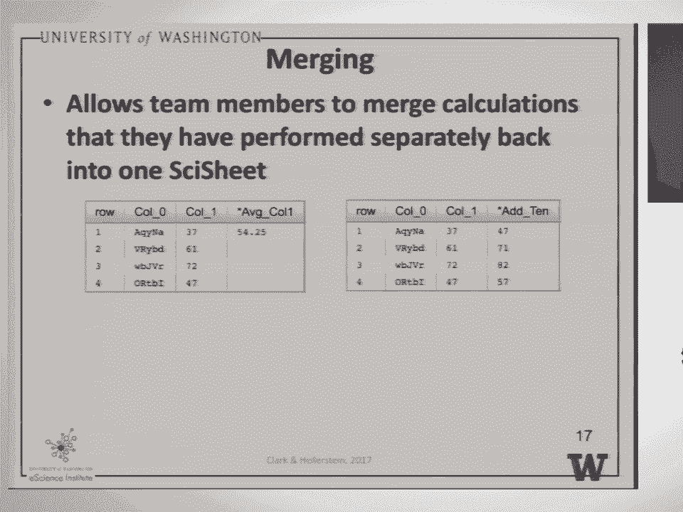

 So in this very simple case， you could， since there's no conflicts。

 everything would just combine to make a nice table。 But like I said。

 if you do have merged conflicts， then you'd need to do more complicated things。

 So one of the things we thought about trying to use was to actually have the user interact with the merging process。

 So the user， if there were two columns that potentially conflicted。

 then the user could go in and select which column they wanted or which name they wanted for a particular column。

 And then the final thing we wanted to look at is the。

 if you wanted to look at a history of git commits and actually check out one of those commits。

 how this would kind of look in this spreadsheet environment。 So for example。

 if we just start with a very basic size sheet， if you were to add a column to that。

 you can see it would just turn the size sheet green。

 Maybe potentially in the future it could just change the column that was changed to green。 Again。

 if you add another column， the same thing would happen。

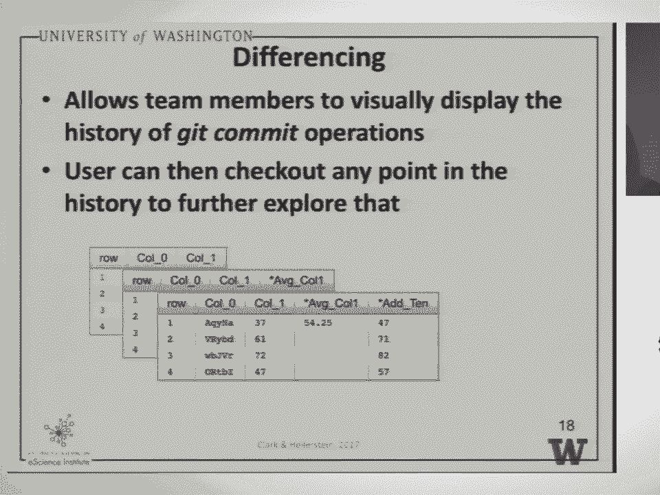

 And then if you removed a column， it would turn to red。

 So these are the colors that are used on GitHub right now。 So it's a good idea。 Okay。 So with that。

 I'll just leave up the summary since that's about 25 minutes。

 But I would like to say the project is available on GitHub， so feel free to check that out。

 And right now， as Joe kind of alluded to， we can do reliable demos。

 but we're not yet in beta level code。

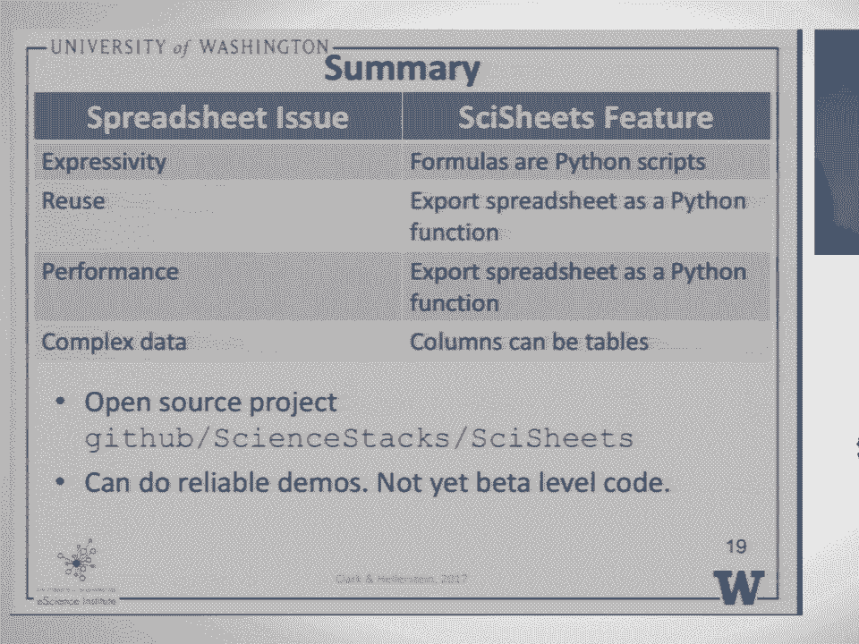

 And finally， we're evaluating deployment options。 So if anyone has any ideas。

 feel free to come talk to us。 And we're also would love to have more people involved in the project。

 So if anyone's interested， feel free to talk to us as well。 With that， I guess we'll take questions。

 Thank you。 [ Applause ]， Any questions？ Yes。 [ Inaudible ]， I'm not sure I've all together followed。

 I think you're talking about automatically creating summaries from data。 [ Inaudible ]， Yeah。

 So that's essentially one of the future directions we want to have with this project。

 So we want it to look pretty much similar to Excel that once you have the data or summary of it。

 you can just visualize it right next to the data。 Okay。 Thank you。 Yes？ [ Inaudible ]， Okay。

 So I'll just repeat the question。 So there's a question about use of NumPy versus pandas for。

 at least for the example of Gape。 So actually， you can import anything。

 You can import pandas as well。 And actually we have a capability where you can transform a Sci-Chit to and from a pandas data frame。

 So you have that complete， and that's actually part of the API， part of the runtime。

 It provides that。 We didn't illustrate it here。 Other questions？ Yes？ [ Inaudible ]。

 So the question is， do we have abilities to read an existing Excel spreadsheet to interpret formulas？

 You know， we take advantage of like the pandas capability certainly to read in data。

 We haven't done anything with interpreting the formulas yet。

 but that's an interesting thought in terms of， you know。

 being able to adapt someone from one environment to another。 I think the challenge is that。

 you know， Excel uses cell formulas， and we're doing columns。

 And so there's a bit more of a challenge there。 You know， the data is easy， but I'm not， you know。

 the formula is potentially more of a challenge。 Other questions？ Yes？ [ Inaudible ]， Okay。

 so what are the deployment options？ This allows me to fill in a gap that I left here。

 I didn't tell you anything about the underlying technologies。 So this is a web-based system。

 It uses the Django and then Python the background and the front end is a browser。 And we use。

 you know， various JavaScript packages。 So one very likely one is Jupiter。 And that's， I would say。

 the main one we're considering。 There are some other projects that are sort of nibbling in various ways at the spreadsheet area。

 but we're looking， actually to some degree， what we're looking for is a reason why we shouldn't just do Jupiter。

 So other questions？ Yes。 Oh， I'm sorry。 Do you have your hand？ Okay。 Other？ Okay。 [ Inaudible ]。

 Okay， so， okay， so two questions。 The first one is how do we handle standard output？

 Right now it's suppressed。 We don't have a good example of that。 If you want to see something。

 it has to be part of the spreadsheet environment。 And so， I mean， that's a good question about。

 you know， how you adapt that。 If someone just had a script where they were doing， you know。

 standard output， and that's a good question about how to deal with that use case。

 And the second one is in terms of， you know， outputting complex data structures。 I mean， typically。

 everything gets interpreted as a NumPy array， but the NumPy array。

 the underlying element can be an object。 So you could have a NumPy array that is an array of lists or a array of something else。

 And it just comes out， and then you'll see actually a list in itself。 Okay。 Other questions？ Yes。

 [ Inaudible ]， Okay。 So what is success with those two billion users？ That's an excellent question。

 I would say that， you know， and this is， we haven't formulated this。

 but I would say in my rough statement， I would like to see any one of those users， that could。

 you know， do their calculation visualization excel， they could do it just as easily in。

 in side sheets。 And that if someone， you know， going beyond this a little bit。

 to someone is maybe more of a MATLAB console user or， or console user。

 but then split between that and then let's say a spreadsheet for other things。

 that they could do everything inside of side sheets。 Can I add？ I just want to add one other thing。

 I think this also enables people that don't have any programming experience。

 to have a really easy entry point for their data， so they can just have it in the spreadsheet and start。

 like， working with Python then。 So you kind of force them to start using Python。

 And I think if it's very intuitive and approachable that， you know。

 there's no scary kind of learning curve for that。 So， yeah。 I could answer。 Go ahead。 One chance。

 There are ways to save the side sheet and reopen it later。

 And in the technical spreadsheet program you can create ideas， that have been there。

 but when done by it， do you also save them along？ Like。

 do you open something that's in part of the computer？ Do you want some of this？ Yeah。

 The answer is yes。 Everything is on the back end。 And so。

 right now we have a serialization format that's a JSON format。

 And ultimately there'll be a database back end。 Can I just intercede for a second to write this second speaker to set up？

 Yeah， yeah， absolutely。 Let's move out of the way。 Yes。 [ Inaudible ]， Oh， pivot tables。

 If we handle pivot tables right now， we don't directly handle pivot tables。 [BLANK_AUDIO]。

