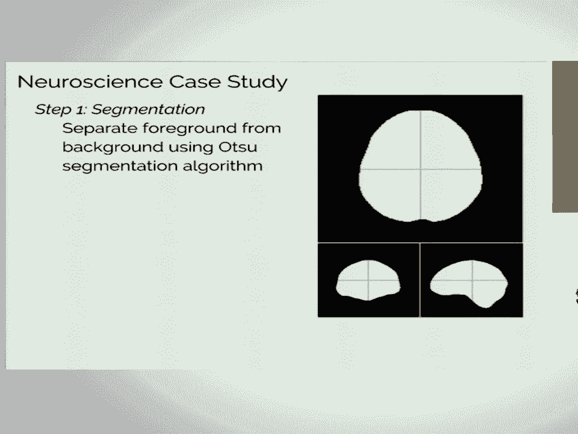
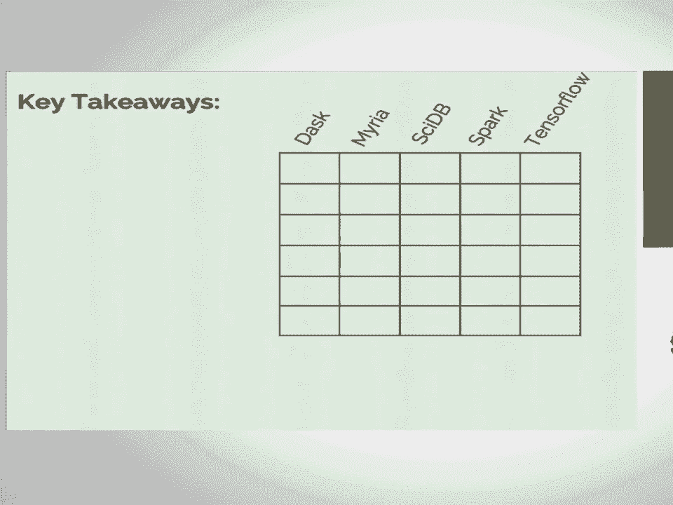

# P30：Scientific Analysis at Scale - a Comparison of Five Systems  SciPy 2017  Jake Va - 哒哒哒儿尔 - BV1Cs411A76Y

 So thanks everyone。 It's great to be here。 Great to be talking on this topic。

 following up some people speaking about these specific systems。 So this is a。

 project that's been quite interesting。 It's been a collaboration between where I。

 work at the E-Science Institute with folks in the astronomy department at。

 UW at the Dirac Institute， at the Paul G。 Allen School， the UW database school。

 and our group in the Paul G。 Allen School。 And it's kind of this interdisciplinary。

 thing where we decide to explore what we can actually do with various。

 distributed systems in a scientific context。 And I should point out that if。

 you want the real technical details of this， there's this paper that's pre-print。

 is available right now。 It's going to be presented next month at the VLDB， the。

 very large database conference in， I think in Germany。 And so if you want more of。

 the kind of research side details， you can look at that paper。 I'm going to give。

 more of the kind of， kind of， scipy community aim of this。 So I want to start。

 out and tell you one thing that's been interesting。 I had my training in， astronomy。

 so I had my academic upbringing writing astronomy papers， and。

 then I started working with CS people。 And CS papers are a little bit different than。

 domain science papers。 And so I just wanted to give you a little guide of how to write， a CS paper。

 So the first thing you need to do is find a well-defined computing， problem。

 So you come up with a statement like， efficient generation of Fibonacci。

 numbers is a perennial problem in computer science and no agreed upon， standard solution yet exists。

 right？ So you frame it well with something that， everybody can understand。

 And then you write a system that solves that problem， and you write something like。

 we present fibDB， the first ever relational database。

 specifically designed for the generation and storage of Fibonacci numbers， right？

 And so that's the start of your paper。 And then of course you have to compare it。

 to Hadoop and show that you're a thousand times faster， right？ That's vital。 And the。

 most important thing is to have a bar chart with log scales that shows how， much faster you are。

 right？ And this is how computer science papers are generated， generally。

 And then of course you know you repeat until you're tenured。 It's the， best thing。

 And I apologize to my CS colleagues。 But that's a little bit tongue。

 in cheek but this is kind of an observation that happens。 This is sort of。

 computer science's corollary of the open science and reproducibility problems that。

 we have in the domain sciences。 And CS it's pretty well known that the lowest。

 barrier to entry type of paper you can do is just do something generate the paper。

 and move on and the tool you've talked about doesn't really get developed。 The same。

 way when we generate a science paper maybe the tools and the results we've。

 developed don't carry on in a way that other people can use。 So to the credit of。

 my colleagues at UW and the computer science department we've been。 we got。

 together to write this paper to try to actually address these scalable systems。

 in a way that would be useful to scientists。 So the goals of my talk are。

 to distill these sorts of lessons from this paper that's a little bit dense for。

 the the SciPy community who's a community of users rather than builders of these。

 systems for the most part。 And I want to give you a general idea of the strengths。

 and weaknesses of each of these systems that we looked at。 And so we decided to。

 focus specifically on scaling of image based analysis because that's a big， thing in many fields。

 And the two case studies that we looked at were a。

 neural imaging case study and an astronomy case study。 So basically think。

 you have dense arrays of data and you're trying to do some sort of computation， at scale with them。

 And the problems that you face here are pretty well known。 You know， image。 images。

 individual images are big so they don't fit into， relational databases very well， right？

 Relational databases don't work with， 80 megabyte chunks of data。 They work with tables of values。

 And their images， are generally stored in these proprietary formats that don't interact。

 well with tools。 They require kind of specialized operations that know about， the image format。

 They know about the arrays of pixels。 And you need some sort。

 of specialized analytics that often is developed in these domain， specific tools。

 So it ends up being a really difficult problem to take an。

 image analytics workflow from some sort of domain science and stick it into one。

 of these databases that is available out there。 One of these scalable， architectures out there。

 So as an example of what one of the case studies for the。

 neuroscience case study we had this three-step process。 Number one we have， these images。

 these D MRI images of the brain。 Kind of thinking of them as like。

 3D， 3D scans of a brain。 And first we wanted to separate foreground from， background。

 So this is kind of a segmentation problem。 Then there's a。

 denoising problem that kind of looks at local patches and does some sort of。

 mean to filter it and remove noise。 And then there's a model fitting problem。

 where you're looking at each individual voxel in that volume and doing some sort。

 of tensor model to learn about the brain that you're looking at。 And so。

 that's the case study that we used。 Neuroscience， we also looked at an astronomy， case study。

 And these are the five systems that we decided to evaluate and， try out these case studies。

 So number one， you may have heard of some of these， side DB。

 We chose this because this is actually one of the few database。

 architectures that's specifically built to work with dense array based data。

 and dimensional array arrays。 We decided to look at Spark because it's this， it's a。

 very popular system that's very well supported and has a nice Python， interface。

 We worked with Miria mainly because it's developed by our group for。

 this sort of purpose for working in domain sciences。 It's a shared nothing。

 database management system。 We worked with Dask because Dask is kind of the Python。

 community's answer right now to scalable scientific computing。 And also。

 TensorFlow because everybody seemed to be talking about it。 So TensorFlow I。

 should say is not specifically designed for this sort of thing， but we thought。

 it would be interesting to see if we could force fit our problems on to the。

 primitives that TensorFlow provides。 So just as an interesting point of comparison。

 So what we did is we got our group together， we got a few domain experts to。

 give Python reference implementations of the pipelines， and then we had folks。

 from the computer science groups go out and try to reproduce each of those two。

 case studies in each of these five systems。 So it was a long process and very， painful in some ways。

 I want to go through and kind of give you an idea of， what our results were。 So number one。

 this is side-e-b。 This is kind of what， side-e-b looks like。 And if you're using side-e-b。

 the language that you use for， it is this， you can either use this array query language or array functional。

 language that they built in。 We， a few years ago in my post doc， I wrote a Python。

 wrapper that gives you kind of a NumPy syntax on top of side-e-b。 So we ended up， using that。

 And you can see here it's basically you connect to a database， you。

 create some array object that's distributed on that database， and then you。

 can do NumPy-like operations on it。 So here we're taking at the bottom line， we're。

 taking the mean and the third dimension of the array。 It supports user-defined， functions。

 UDFs via the stream interface。 So if you have custom code that you want， to apply to that data。

 you can stick that in there and it'll parallelize it。 And。

 the data has to be ingested as a CSV file。 Now the nice thing about side-e-b is it。

 has this built-in understanding of dense arrays。 So in theory it would be able to。

 do things very efficiently on image-based data。 The challenges though are that it's， it。

 side-e-b doesn't really have the primitives that you need to do all the， little things。

 all the things that we'd like to do to our arrays。 Like for， example you can't。

 you can't do a convolution in side-e-b。 So a convolution。

 ends up being this user-defined function that's then passed to the data。 Side-e-b， distributes that。

 but it can't reason about the contents of the convolution and， speed things up within the database。

 So you're basically just sending a Python， function around。

 Other challenges with side-e-b is all the data is passed around， between workers in TSV format。

 So you're constantly convert， serializing your data， to TSV。

 then deserializing it to compute and then serializing again。 That ends up， being a huge overhead。

 So that side-e-b。 Spark is， is an interesting one。 It has a。

 nice Python functional API where you can plug in Python UDFs directly into this。

 API and it distributes them， it takes that code and runs it on the， on the data。

 that's distributed in the cluster。 And the data is this， in this resilient RDD。

 resilient distributed data set format that's actually quite convenient to work， with。

 It's really nice because you can use our， arbitrary Python objects as keys。

 You can do straightforward Python UDFs for these sort of implementations。 The， program。

 functional programming style is really nice to work with。 It has a large， user community。

 So whenever we ran into problems， we could go and there's like。

 answers on stack overflow that tell you how to solve your problems。 A few。

 challenges is that it makes some decisions about caching data and。

 intermediate results that you sort of have to tweak manually depending on your。

 pipeline to make it efficient。 And in general to tune the， tune the， the。

 resulting pipeline beyond the initial implementation was pretty difficult。 There。

 there wasn't any sense of automatically tuning to speed up your workflow。 Okay， so， Miria。

 this is a database that's kind of， it's based on， it's based on SQL。 It。

 provides a hybrid declarative imperative database language。 This was a database。

 designed by the UW database group to work with scientists and has had some。

 really interesting applications in oceanography in particular。 It has built in。

 support for Python UDFs。 You can see that the way that you interact with it is not。

 some sort of Python wrapper。 You're just basically passing strings of this， Miria L language around。

 Which is not so convenient if you're， if you're not， familiar with Miria L but。

 but if you have people sitting around who wrote， Miria L， it's， it's better。 And in general the。

 the data is passed around with this， flexible blob format。 So， so data。

 basically the blob can contain a NumPy， array。 So there's no data serialization or deserialization that's happening as you。

 pass data around。 It's really seamless that way。 And the， the nice thing about， Miria is。

 it's designed so that we can directly leverage these existing reference。

 implementations of the various scientific workflows we're doing。 And this， the。

 declarative imperative syntax is interesting because you can do things like。

 you can write explicit loops in your query code。 If you've ever tried to do a loop。

 type thing in SQL， it's， it's pretty painful。 And the Miria language is， is， interesting that way。

 The， the challenges though are that the， in order to attain。

 efficiency you really have to re implement your pipeline in Miria L。 So it's， it's。

 kind of this difficult translation process。 So we ended up not doing a whole。

 lot of stuff in the native Miria language but we use these， again， Python user defined。

 functions that were passed around similar to the way we did it with Spark。 And again， the。

 the tuning for Miria is a little bit difficult。 It's not automated。 You have to。

 you have to understand a lot about the guts of the system in order to figure out。

 how to make your code go faster。 Okay， another system， Dask。 We just heard about。

 this a little bit earlier if you were in this session for， for Matt's talk。 Dask is。

 nice because it's a pure Python system。 You， you write Python code。 It's created by。

 people in the Python universe。 So， so they know how we like to think about our code。 It。

 you can put arbitrary UDFs in there via this delayed， inter， or this delayed syntax。

 And the data is any， literally anything Python can handle。 So Dask is nice in that。 And then。

 it's very seamless to get up and running on your own， your own scientific pipelines。 The。

 the deployment and installation is a breeze for Dask。 This is not true of some of， the other ones。

 The built-in UDFs， but some of the challenges are， you have to， it's， it's， sometimes you need to。

 you need to choose when to insert evaluation barriers in。

 your graphs so that you'll get kind of intermediate results。 You have to choose how to manually。

 partition your data。 You know， Dask isn't a relational database like some of these other， systems。

 So you're， you're in charge of， for the most part， taking care of， of your data。

 and distributing it to different nodes。 Are， are， the person who was implementing the Dask。

 interface found that there were， there were few choices between like futures and delayed。

 that were tough to make。 It was， it was hard to know when to use one versus the other。 So。

 there was a lot of kind of， a lot of tuning。 And sometimes when Dask fails， it fails in。

 a way that's difficult to debug and， and requires kind of restarting the whole job。 So we， we。

 were working on that a little bit。 Now finally， the last one， I've been like rattling off。

 all these， all these features。 The last one is TensorFlow。 TensorFlow is interesting because。

 especially for this task， because it's not really designed for the task that we were doing。

 Like I mentioned before， but you basically use， you can use Python to set up the TensorFlow。

 workers。 User defined functions in TensorFlow are just not supported。 TensorFlow has this。

 model that everything you do is going to be a TensorFlow operation that's built into the TensorFlow。

 system。 And the data is this， this TensorFlow specific structure and the real challenge with。

 with the data， the data on TensorFlow is everything needs to be loaded via the master node。

 And then， it's distributed from there to the workers。

 So it causes this real network overhead because you can't， you know。

 if you have hundreds of gigabytes of data， you can't tell the workers to load that data。

 individually。 It all has to be instantiated on the master node and sent out。 Advantages。

 we didn't really find any for this， for this application。 I should say that I want to make clear。

 that we were pushing TensorFlow way beyond what it was designed for。 So it's kind of unsurprising。

 that， that we didn't find it to be a good system for， for this task。 But TensorFlow is an amazing。

 system for what it was designed for。 But， but we thought just for completeness， it would be。

 interesting to explore it。 The challenge is like it has limited support for distributed。

 computation。 So you have to do all the sort of mapping of data and， and code on your own。 It has。

 this graph limit of two gigabytes that meant we， we ran into places where we had to chunk our。

 our operations kind of by hand。 It has no Python UDF。 So everything needs to be reimplemented in。

 the TensorFlow language which has not complete。 So we weren't even able to finish the astronomy。

 pipeline in TensorFlow， for example。 And it has this limited set of built-in operations。 Like。

 you can't do element-wise data assignment in the Tensor arrays or in the tensors。 Which。

 for things like masking and filtering just， you know， didn't work。 So， so it was an interesting。

 experiment。 But TensorFlow is not made for scaling arbitrary scientific pipelines。

 So we did this nice， all of these， and we， we ended up with some benchmarks。

 And the benchmarks kind of， I'll give you the broad end-to-end one for the neuroscience use case。

 Basically， what we found， are that dask and Miria and Spark were all comparable。

 And the reason for this is， is that， essentially they were all doing the same thing， right？ Because。

 because we weren't able to translate， our pipelines into the native languages of each of these systems。

 all they were doing were passing， around Python functions and applying those to data in the various ways that they store their data。

 So it's not surprising if they're all similar。 TensorFlow and SideeB were quite a bit slower than。

 the other three systems。 And the main reason for this in both cases was issues with passing data。

 around between nodes。 With SideeB， it has to be serialized to Tsv and deserialized every time。

 over and over and over again。 With TensorFlow， it all has to be loaded in the master node and。

 broadcast it out。 So a lesson for this is if you're developing a distributed system， make sure the。

 nodes themselves can ingest the data rather than having to send the data over the network。

 We have a whole bunch more benchmarks。 I don't want to dive into these because it goes into a lot。

 of the details of the different steps and things like that。 So if you go check out the paper， you。

 can read about that if you're a little bit curious。 But I just want to kind of。

 as broad takeaways for， this audience， who I assume is mostly scientific practitioners working on domain science。

 interested in scaling your scientific analysis。 I want to give these kind of key takeaways。 So。

 the first thing is that none of these scientific pipelines provide a complete enough set of。

 primitives that you can expect to put your scientific pipeline into the native language。 For Dask。

 it's not designed to have its own primitives。 It's designed to just pass around Python functions。

 essentially。 But for the other ones， none of them， we were hoping that we would be able to。

 completely implement one of these use cases in， say， MIRIRA language or in the side-e-b array。

 query language。 But it just couldn't happen because they're not flexible enough。 So this means is。

 that if you want to do science at scale， user-defined function support is essential。 And so all of。

 these except TensorFlow have some form of Python UDF support where you can pass your Python functions。

 whether it's from scikit-learn or scikit-image or the LST stack or from die-pie。 You can take。

 these functions that are well tested and you can distribute them out to your data that's sitting on。

 these various compute nodes。 So that's essential。 One thing that's incredibly important is flexible。

 data formats。 We saw that side-e-b and TensorFlow had these bottlenecks mainly because they handle data。

 in a strange way。 And Dask and Mira and Spark all do this well and we're able to kind of work with。

 data efficiently。 Automatic tuning， this is something that especially for the scientific user is a real。

 issue， right？ Because if I'm designing a database system， I shouldn't require that all my users。

 have an encyclopedic knowledge of all the little decisions that are being made inside that database。

 The kind of holy grail is to just， you know， you start it up and it should work on your task。

 And none of these right now are doing well as far as automatic tuning of these sorts of workflows。

 There's still a lot of little nitty gritty details you have to choose yourself。

 Streamline installation I think is really， really important because， you know， I don't know about。

 you but when I'm trying a new tool， if it takes me over an hour to install， I give up。

 And as someone who's worked on side DB， I spent a year working on various things of side DB。

 I still at the end of that year， I couldn't install it in less than half a day。 And so， since then。

 I've just not used side DB mainly because of that。 So installation is important。

 And then the large user community I think is key too because you're always going to run into issues。

 with these database systems as you're scaling workflows。 And if you can find those answers on。

 stack overflow than or other communities， it's really， really important。

 So this doesn't paint a very good picture for scalable computation or scalable scientific。

 workflows regarding involving images。 There's no one tool that kind of shines above all the rest。

 But I think the interesting thing about this is that this study is being presented in this。

 this database community conference。 It's one of their top couple conferences in that community。

 And what we're really hoping we'll be able to do with this is take this paper and kind of point。

 to database researchers the types of problems that real life users are having。

 Someone beyond the grad students that's running the benchmark for their latest paper in a CS conference。

 So our hope is with this paper that we'll kind of by outlining all these tough parts。

 these issues and outlining the problems that we had in applying these to real life situations。

 that it'll pave the way for improvements in the future。 And in particular， the UW database group。

 who I'm working with has some plans to kind of build off this study and start thinking about how。

 we might create a scalable computation system that really is geared towards the types of data。

 that we as scientists are using。 So keep up with that and hopefully I'll have a little better story。

 about scalable science in a year。 So thanks very much。 This is my contact info and I have the。

 paper preprint there， the slides and if you're wondering about the code behind all of these benchmarks。

 it's all in a private Git repo but we'll be releasing that later this summer I hope。

 Thanks very much。 So any questions？ Hi， thank you very much for this work。

 I have a data set of a billion images and I'm sorry， I know， right？

 They've been coming in for 10 years and they come in at a rate of about 5 per second。

 I have a batch workflow and I have some code and celery wrapped around it and I'm wondering if you。

 can comment on the difference between the systems you looked at and a traditional batch workflow。

 By batch workflow you mean just passing batch of data and then saving the results or。

 I mean not automating the process of distributing workers so using a system that manages communication。

 between them and scheduling。 Yeah， that's kind of a base case， right？ Yeah。

 I guess we could have done that。 I don't really have many thoughts on that but。

 because the question is， is that a viable solution compared to these？ I guess I think， yeah。

 at this point I would say because we're not really in all of these。

 we were not able to leverage the kind of efficiencies that these systems build in， except with Dask。

 We're able Dask is sort of designed for this kind of stuff。

 But with the other systems we weren't really taking advantage of the efficiencies they。

 have built in。 So I think it would probably be comparable to kind of a cron job for your batches。

 Hey Jake， thanks for the talk and thanks for the work。 I guess my question is almost related to。

 the previous one。 I find it interesting that you're looking at it from a database point of view。

 When I think database， I think inadvertently this is， I think information retrieval problems。

 may be data partitioning。 That's where maybe you overlap。 So is this a database problem？ Well。

 it is in the sense that you have these databases like side E。B。 and there's another one。

 that starts with R that I can never remember that are actually built for dense array data。

 So the hope with side E。B。 has been that side E。B。 could shine in this sort of situation。

 But what we found is that it's built in database operations just aren't comprehensive enough。

 to cover our workflows。 So that's why we didn't call this a survey of database tools。 We call it。

 a survey of what we call big data systems。 We have some little footnote where we talk about what we。

 mean by that。 Which is basically systems that try to do computing at scale in some way。 Yeah。

 it was a nice talk。 I learned about some new tools I probably won't end up using。 But yeah。

 I was wondering one of your kind of bottlenecks was a flexible data format。 And for example。

 when I work with collaborators， what I found is for image data， simple HDF5 would work very well。

 And you can read it with DAS。 There's parallel HDF5。 You can read it into TensorFlow， distribute。

 the stuff。 And I was wondering what your take on such a more common format would be that you。

 could share among researchers with maybe different tools even across languages。 Yeah。

 it's a great question。 So I love HDF5。 I think it's having that sort of standard。

 cross-domain tool is awesome。 The problem is that you have so much inertia in these various fields。

 You know， astronomy is using has used fits for 20 years。 And you're going to pry fits out of。

 people's cold， dead hands。 That's just what they use and what they're familiar with。

 And it's similar in neuroimaging。 They have these formats that work。 And it's hard to convince。

 a field to move over to something new just because， you know， the folks on the other side of campus。

 are also using it。 So I think there's two approaches to that。

 You can try to change the community to， make it more amenable to the tools that are available。

 Or you can try to build tools， that work with the standards used in each community。

 And I think computer science has been trying to， do the first one for too long and needs to spend more time on the second one adapting the tools so that。

 it can work with people's current workflows。 Yeah， thank you。 Yeah。 Hey， really great talk。

 I'm very beginning of your talk。 You mentioned that this is very challenging。

 because all domains of science have very specialized and you need domain specific knowledge。

 It seems， like a lot of these tools to use efficiently。

 You also need user domain specific knowledge。 Like， for example。

 I know TensorFlow allows you to do custom functions， but you have to write them in， C++。

 Do you have any， I know the first problem is really hard trying to remove science， domain specific。

 Do you have any thoughts on how we could maybe try and reduce the burden of these， tools？ Yeah。

 so I think it comes back to that auto tuning thing。 You know， you can。

 there's actually people who are spending a lot of time researching this in the database world。

 because auto tuning of databases is like a hot topic。 And so， I think if people on the database。

 side can gear their research towards the types of problems that we have towards these kind of case。

 studies， which are pretty representative of the things we face in science， I think that will。

 lead to better tools in the long run。 And so that's why I'm encouraged to have this group at UW。

 it's a really well known database group starting to think about this and starting to。

 encourage their field to think about it。 So， I'm optimistic， but like I said， we're not there yet。

 Are there any other questions？ Nope， so let's thank Jake again。 [Applause]， [BLANK_AUDIO]。

