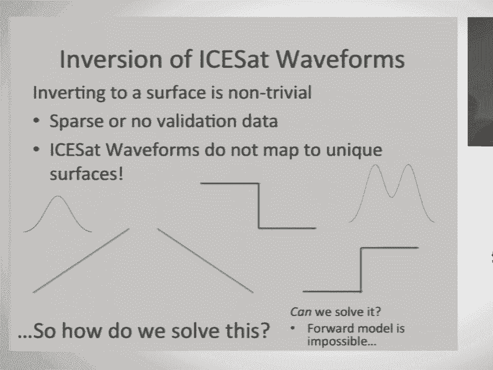
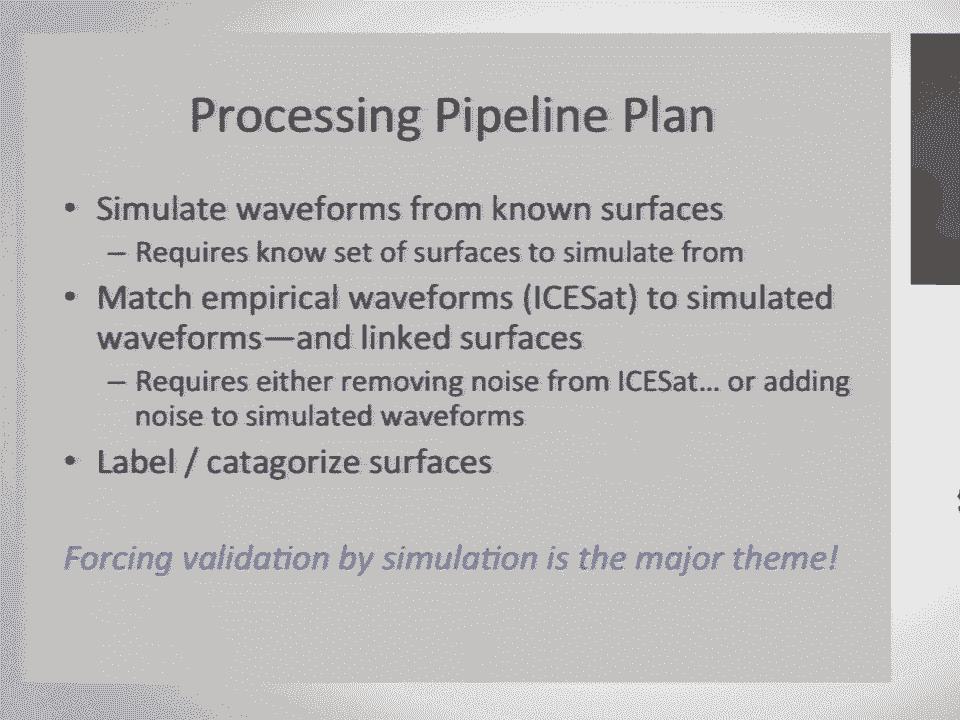
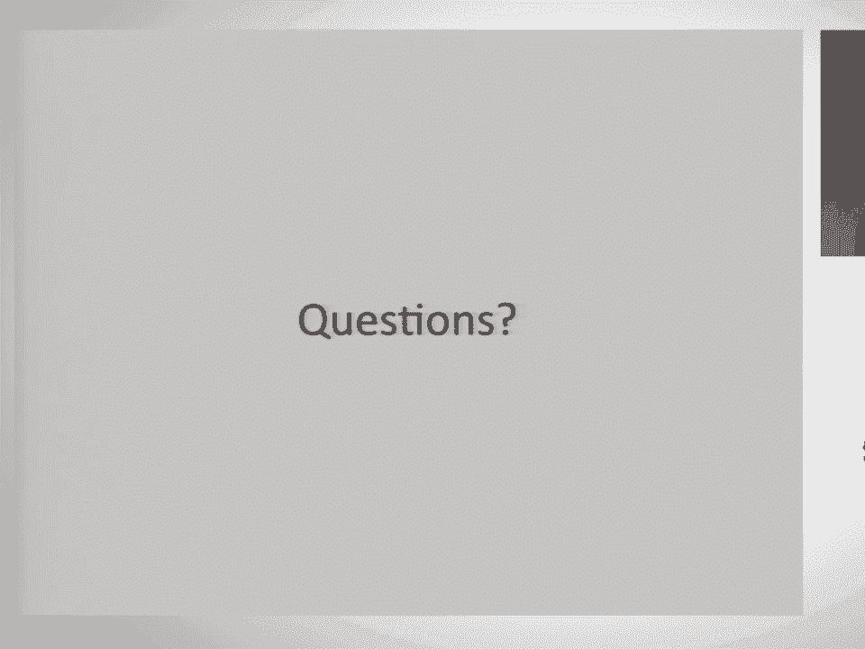

# P31：Deep Learning with Geospatial Data  SciPy 2017  Shane Grigsby - 哒哒哒儿尔 - BV1Cs411A76Y

 So thank you。 As Jonathan mentioned， my name is Shane Grigsby。

 As you might be able to tell from my title slide， I am a glaciologist。

 I mostly watch ice melt from space。 So I do a lot of stuff for remote sensing。

 Just to set some expectations about the first third of this talk is going to be explaining some of the science that I'm doing。

 just so you have some context for what it is that I'm doing and why。

 But we'll get to lots of machine learning geekery as time goes on。 So just to start off。

 what's my problem？ That's my scientific problem。 Basically。

 I'm funded on a grant from NASA that is titled "Assessing Greenland， Caravos。

 Extent and Characteristics Using Historical Ice Set and Airborne Laser Altimetry Data。

" A baseline for assessing changes with ice set too。 A little bit of a mouthful。

 but basically what I'm looking at is where are the Caravos's and are they changing or moving？

 So this is a picture of some Caravos's that you might see in a Caravos field and then a artist's conception of ice set too。

 which is set to launch in 2018。 The reason that we care about Caravos's is that this is how we actually get water off of the Greenland ice sheet and into the ocean。

 So basically if you have a crack in the ice and if you have melt water on the ice sheet and that water runs into the Caravos。

 it will propagate down through as much ice as there is water that is available to fill。

 And it will go all the way through a kilometer or two kilometers of ice down to the base。

 And then once it's at the base， it's just like the ice near water glass。

 It'll float the ice sheet up and then that ice will move out faster into the ocean and it'll flush out the bottom part of the glacier。

 Also， there's some debate as to whether or not Caravos's are also going to creep up slow with runoff。

 So you might have this case where you accelerate the front of the ice sheet and then the lack of stress will back propagate。

 making new Caravos's further up the ice shelf and then just kind of continuing to have a positive reinforcement feedback。

 And the reason that that is interesting is because it's getting warmer。 So this is。

 there's a lot of concern in the glacial in the science community in around 2012 because there was a couple days where all of the Greenland ice sheet was melting。

 Normally you just have melt at the edges， but we had a day where there was melt happening at the top of the ice sheet all the way down to the bottom。

 And the question is kind of， okay， if we've got Caravos's that are propagating further upwards。

 we have the opportunity to drain more of the ice sheet than we originally were able to。

 If you have things that melt really， really far up， you can't really get a sense of scale for this。

 but Greenland is a pretty big place。 If you have melt that happens at the top of the ice sheet。

 normally it'll either just percolate into the snow and refreeze or pool and then refreeze。

 You have to actually have a way to get it off the ice sheet and into the ocean in order for it to affect sea level rise。

 So in order to actually track whether Caravos's are going up。

 we need to have some sort of baseline to assess if they're changing historically。

 So we need to have a before in order to calculate a change。

 So practically my problem is I'm trying to figure out what areas were Caravos starting from 2004。

 so the ICESAT one mission launched in 2003 came down in 2009。

 And I'm looking to map Caravos's from historical， I'll see much more data。

 To head off some questions at the end， if I was doing this using today's data。

 I would not be doing what I'm doing at all。 I'd be using Raster imagery and I'd be doing sort of patch matching and feature detection in a much more simplified way。

 but I'm working with data from 2004。 So 2004 was a while ago。 In 2004， Facebook had just launched。

 It was invite only。 Google had just had their IPO， iPhones， worn out yet。

 Things were a little different。 So what we had in 2004 was we had this altimeter。

 And this altimeter basically was imaging with a laser spot that was about 70 meters in diameter coming down。

 and then it was recording the time spectrum energy return from that。 So it basically。

 there's an illustration here of a tree where you get the top of the tree first。

 and then you get the trunk and then eventually the ground。

 And so you get this distribution of reflected energy over time。

 And so if you image onto a flat surface， you get a Gaussian。 If you image onto a slanted surface。

 you get a bigger Gaussian。 If you image onto a discontinuous surface。

 then you get a bi-modal distribution。 And my biggest problem working with this data is that we just don't have any validation data at all。

 We don't have any optical imagery coincident with any of these laser spots。

 So this is an optical image that is not from when the satellite was in orbit， but it's from an area。

 And this is making the assumption that the crevasse areas would still be crevasse。

 You can see that your blue spot kind of gives you a more complicated return waveform in your green spot gives you a much simpler waveform because it's from a highly sloped area。

 So just to recap， my task is to take one of these squiggly lines。

 figure out what the surface type was from the squiggly line。 So is it a crevasse？ Is it a ridge？

 Is it a bowl？ This is a pretty easy problem， right？ This is not too difficult。

 I spent a couple months when I first started working on this training to decide if it was possible to actually do this。

 The big problem is that when you're trying to invert these waveforms。

 since you're going from a two-dimensional surface to a one-dimensional time series。

 it's a many-to-one relationship， so it's mathematically impossible to invert from first principles。

 And you have no idea if these isomers。 So if you have a slope surface that's sloped one way versus a slope surface that's sloped the other way。

 you get the exact same waveform。 There are many different types of surfaces that can go to the exact same type of signal that you get。

 And again， this is just kind of showing you might get a bimodal if you had a cropped one way in the exact same bimodal if it was cropped a different way。

 So this is what I would call an "ontrivial problem。"。

 Not trivial is what scientists like to say when they have something that's really freaking hard。

 And again， there's no validation data。

 So the first thing that I kind of started looking at was， okay。

 does uniqueness actually matter for my application？

 So here's an example where I have a forward model that's taken two different elevation tiles。

 and I've convolved what the signal would look like。

 And so you've got kind of the tile on the left and its derived waveform。

 the tile on the right and its derived waveform。 And the tiles are similar and the waveforms are kind of similar。

 so I might not actually need to get to an exact surface if I could just kind of get an idea of what types of surfaces or what the surface was。

 And the thought is， okay， if I can forward model what a surface would produce in terms of waveforms。

 can I then match those waveforms to the empirical ones that I have？ And if I can match those。

 then I can start to actually get a sense of， okay。

 this is what the possible types of surfaces that there could be on the ground form。

 I've got a little bit of a sense of the ground for my given sensor。 So yeah。

 so how do we solve this？ Forward modeling is out， backward modeling could be possible as long as we use lots of training data。

 And there's kind of two different levers that we can play with。

 So I'm going to do a lot of machine learning， a lot of deep learning。

 And normally what you can do is you can either kind of tweak the models in terms of the models that you choose and the model parameters。

 or you can tweak the input data。 So I really like this XKCD comic about how this kind of the current state of machine learning。

 you just， oh yeah， just stir your linear algebra pile until you get the right answers and rinse。

 lather， and repeat。 I'm going to be talking about kind of the other portion of this。

 which is you can either stir your pile or you can change what you put in on the data side。

 And sometimes you get a lot more descriptive power and a lot better results from you change your input rather than trying to change your model parameters。

 So I touched on this a little bit earlier， but this is basically the processing pipeline plan that I outlined。

 So simulate waveforms from known surfaces。 This requires， of course。

 a set of known surfaces to simulate from match the empirical waveforms from the I-SAT to the simulated waveforms。

 and then link them through a database look up so that you have the link surfaces。 Doing this。

 of course， requires either removing noise from the I-SAT signals or adding noise to the simulated waveforms and then label and categorize the surfaces。

 So I'm basically trying to force my own validation data by sort of going through simulation。

 So for my source data for this， I took these two flights from something called Operation IceBridge。

 So we， I think I mentioned that the satellite went down in 2009。

 and the next satellite is launching in 2018。 So to kind of bridge this gap。

 they decided that it would be really nice to have some data over the interleaving period。

 So NASA has been flying yearly flights that go for about 20 or 30 days at a time to image both Antarctica and Greenland to try and get an estimate of how things are changing。

 So the flights generate about 30 gigabytes of imagery data per day。 They have these really cool。

 nice products that are these level three photogrammetric DMs。

 where basically they have a LIDAR system and they also have an imager that is taking orthofotos that they're then running through a photographic pipeline。

 And then they're merging the LIDAR point cloud with the photogrammetric point cloud and rasterizing it。

 So you get sort of this aligned double really high quality data set。

 So I'm using that as my base data because it's the highest quality imagery that I can find。

 and it's also very close to what I'm trying to solve for。

 It's over the area of interest that I'd like to actually simulate for。 And so I'm looking at South。

 Southwest Greenland， and then on the other end I have。

 I think that the ICESAT mission acquires something like 3 billion waveforms。

 but I'm only looking at the ones that are over Greenland so that subsets my stuff down to about 3 million waveforms from my set one。

 And the way that sensor was set up was it was basically just shooting a laser spot every 40 times a second at 40 hertz for。

 I guess， five years。 And that's our data stream。 So for tiling， this is。

 I don't know if anyone else has these kind of pain points， but you get these tiles。

 You can kind of see that these are three different DMs。

 And you can notice that they're overlapping because you're imaging and then you're having your next image。

 which is overlapping part of your previous image。 Because they're doing it through photogrammetry。

 you're not getting a constant cell size。 So you end up with this first one has 44。

86 centimeter pixels。 The next one has 45。24 centimeter pixels。

 And so you have slightly different pixel sizes。 You have slightly different overlap。

 And so when you go to actually try and create your own little reference data set。

 you have some decisions to make in terms of what do we normalize？ What do we keep？

 What's our resolution？ So for me， I immediately mean normalized all this so that everything。

 all my tiles would be zero elevation。 And then I also tiled these into smaller geotiffs。

 So I use gdoll to basically go through and do bilinear interpolation。

 They have really nice fast libraries for doing this。

 And then there's a smaller library called G-arassers that'll let you do slicing on existing geotiff。

 And then the output will be a geotiff。 So you can say， "Hey。

 give me lines 200 to give me from zero to 200 in both the x and the y。"。

 And then write that out to a geotiff。 And it'll write it out。

 That'll have the latin-long information for the center of the image encoded as part of the metadata for the geotiff。

 So I tried to get rid of everything that I could do that I could look up with a database look up for what the actual metadata was。

 So I put everything to half meter。 I did 100 by 100 meter tiles。

 So 200 by 200 rasters in terms of pixel space。 If I was a computer scientist。

 I probably would have done like 128 or something。 But since I'm a scientist。

 I chose 100 because it's nice and round。 And my spot sizes are 70 meters and I wanted to have padding so they would actually be a little bit larger than what the final output was。

 And then I'm looking for data。 I'm looking for overlap in terms of these。

 So I actually think this is a feature and not a bug because when you're trying to get different features。

 you want to get different views of say a crevasse or a hole in the ice where you have it centered and where you don't have it centered。

 So for me， the fact that these are overlapping， it's great。 I tile one。 I tell the next one。

 And I get slightly different offsets in terms of how my tile bounds line up。

 In order to do duplicates， there probably wouldn't be any duplicates。

 but I just hash the arrays and that hashing basically， I write the output file name as the hash。

 which will overwrite any duplicates so that you don't end up with multiple titles that say the same thing。

 And the benefit to that is that you also end up with free data set shuffling so you don't have to go through and actually randomize your data set。

 It's already been shuffled for you。 And then after that。

 then I go through and I simulate the waveforms。 So I ended up with about a quarter million tiles from the previous slide from doing that decomposition of the operation ice bridge data。

 And then for these， I take them to， I take the 100 by 100 meter tiles。

 I convert them from elevation to time of flight， so just the inverse of that。

 how long it takes light to pass。 I can involve it with a Gaussian function。

 which is roughly what the ice set sensor was seeing。 And then after that。

 I can involve it again so that it can involve it in the time domain for how the sensor looks at it。

 So now I've got these waveforms with a couple caveats。 These waveforms are perfect。

 I don't lose any photons when I simulate because there's no atmosphere。

 This is not how actual waveforms come out。 There's differences in terms of clouds。

 There's differences in terms of atmospheric effects。 There's optical electrical noise。

 So up on the right hand corner， you can see some real waveforms。

 You'll notice that some of them start at different points。

 I start all of my simulated ones at exactly 10 nanoseconds。

 so that way they all start at different points。 So that way they all line up perfectly。 Real ones。

 you're kind of guessing at when you need to start recording， so you have different alignments。

 you have different amounts of noise， you have different magnitudes。 So yeah。

 The first thing I did once I had this was I decided， okay， let's actually see if we can't。

 Let's see if this will work in principle。 So I took 200，000 of my simulated waveforms。

 which are these blue guys， and then I took a holdout data set of 50，000， which are these red guys。

 And I said， if I can take a waveform that has never been seen by the other database。

 can I match an approximate waveform to it and get a similar type of surface？

 So here you can kind of see， okay。 The red one is the input one。

 The blue one is the closest matches from the 200，000。 And basically you can say， okay。

 if we get something that starts off as a ridge， we kind of get a ridge back。

 If we start off with something that looks like a bowl， we kind of get a bowl back。

 And the way that I was doing this was basically using locality sensitive hashing。

 There's a really good implementation of this in SK Learn。

 And basically you treat your vector of 540 length waveforms as a 540 dimensional point。

 And you do a nearest neighbor lookups in high dimensional space。 So yeah。

 so it seems like this is at least in principle sort of possible to do。

 And then to actually see how this would work in the real world。

 I took noise from the ISAT waveforms and then added in it to my simulated waveforms。

 So basically I have a distribution of scales from my empirical waveforms。

 a distribution of shifts in terms of how much they're shifted and a distribution of noise。

 So I've got 1。9 million noise vectors that I can add。 And each time that I would go through。

 I would pop this up in Keras。 And so I would work with a one dimensional convolutional neural network。

 So kind of an inception network that looks at multiple scales。 And then on each batch。

 I would assign for each waveform from the distributions of the scale， the shift， and the noise。

 And then on the next batch， it would be a different pick for those。

 So this is a way to basically take the 250，000 waveforms and turn them into billions of waveforms where they have different shifts。

 different magnitudes。 And the goal of the autoencutter is basically to go through and then D-shift。

 D noise， and then get your waveforms back。 So I guess I'll skip ahead a little bit。

 And does this actually work？ Can we do anything with this？ It looks like it works not terribly。

 So there's a lot going on in this figure， but the red waveform is the actual ice-set waveform。

 The black one is the best attempt to remove the noise and shift it。 And then these blue， green。

 and I guess teal waveforms are the closest matches that are plotted with the original ones over it。

 So you can see how well the matches。 And then the surfaces are to the right。

 And so on this left-hand side， you can see kind of a recent image， recent image。

 And then there's the pins which actually show you the locations of the waveforms where they were plotted。

 And so what you get is you get sort of a family。 Say， okay。

 it looks like we think it could be crevasse。 It could not be crevasse。 But basically。

 if you looked at your 30 closest matches， maybe 17 of them would be crevasse。

 And maybe 10 would not。 Or you have some sort of distribution。

 so you have a probability of how likely it is that you're getting this。 And when I do this。

 I'm matching the waveforms at different offsets so that I'm assuming that my auto encoder might actually fail。

 So I'm looking at -- you can see that some of these waveforms are actually perturbed off the sides。

 so I'm doing a look up that way。 So this was great。

 I was pretty excited that we actually got surfaces。 It doesn't actually solve my problem， though。

 So at this point， I just have these tiles， and I can look at any given waveform and then look by eye to see whether or not it's complex or crevasse。

 But I don't actually have just an answer that says， oh， yeah， 17 out of 30 are crevasse。

 I just have 17 tiles that I can look at as opposed to actually having them labeled。

 So how to fix this， there's a couple options。 You could do crowdsourcing or internsourcing。

 which is not general at all。 You could try and label a subset， which is super boring。

 and then try and use supervised methods to extract the rest of the data set。

 I also don't like this particular method because you tend to impose your own conception of how many categories are supposed to do。

 Or you could use unsupervised methods。 So I chose unsupervised methods。

 I use a different type of neural network called a SAM or a self-organizing map。

 These are also called conan maps。 They're competitive single layer neural networks。

 and they group like inputs together。 So you basically are trying to put tiles that seem similar together in similar locations。

 And then you post-process the output。 This little quote at the bottom is just a reminder from the inventors not do this with images。

 which is what I'm doing。 So this is the first attempt at doing this。 It doesn't really work。

 It works great where it works and doesn't work great where it doesn't work。

 So there's these kind of tiles over here。 This one， it's closest to neighbors or this and this。

 These look great。 But if you look at this， it's kind of matching on a bunch of things that you would like it to not match on。

 It's matching on things like orientation， on things like slope。

 And so the solution for that is to go back and try and do tile normalization。

 So here I've got an original tile。 I go through， I create rasters of the actual coordinates。

 And then I do a circular mask。 I pass it through to detrend it via a principal component analysis。

 So I'm not actually reducing the dimensionality。 I'm just doing a principal component rotation to rotate it into the appropriate plane。

 The next little bit is actually a scatter plot because at this point things are kind of floating in space。

 So I rasterize that down。 Then I crop it and then I crop it again with a circular mask to get it to an actual circular aligned representation of what I'm looking for。

 And the other thing that I do is I do this reco-sign transform to reduce the size of my input space。

 So this is just basically showing on the left and original and then on the right a forward transformed tile where I've gone through and I've removed 75% of the data via the reco-sign transform。

 If you do the subtraction between the two you find out that you're actually， you know。

 I'm working in physical units。 So my sensor can only detect 15 centimeter changes。

 So I don't care if I have errors that are on millimeter scale。

 So if you're willing to kind of figure out how much degradation you can take。

 you can actually reduce things by a fair bit。 So to make a long story short。

 because I know I'm running a short on time， the results are that I basically took this tile here。

 The red box is what I got before I did any of this normalization。

 It took about 10 days of runtime to not do a great job。

 And then this blue box is what happened after I did the rotation and dimensionality reduction。

 So I reduced my input space from 40，000 length vectors to about 5，000 length vectors。

 And then I went from doing that， reduced my runtime from 10 days to 4 hours。

 Because it's an n squared algorithm that's actually going through and doing this。

 And on top of that， because I'm doing this alignment， I end up with much， much more robust results。

 These are the four closest matches。 You can see that three of them look like exactly what I want。

 Like， oh， cool。 Cravasses， crevasses， crevasses match to a crevasse。

 The fourth one is actually technically still a crevasse。 I looked up where it's from。

 It's just at a different spatial scale。 And there's still a little bit of work to go through。

 Anyways， next steps。 I need to ramp up for the full data set。

 I think that this bit here was with 10，000 tiles for the self-organizing map。

 I need to do it on the full quarter million。 I need to cluster the output。

 I'll probably do that using the optics algorithm。 Not because it's the best choice。

 but because I wrote it and because I really want to use it。 And then after that。

 I use the label of clusters， which will be boring。

 but it'll be better to label a couple hundred clusters。

 as opposed to a couple hundred thousand tiles。 Other things that are kind of interesting that I'd like to look at is you can actually have all this empty space in these tiles in the corners。

 So you could actually add non-spatial metadata if you want to cluster on additional things。

 but you have to be careful about the waitings。 And then also trying to out to a different output space to more dimensions。

 Just a super quick review。 I'm just going to talk about the blue items here。

 Make sure that you make your tiles bigger than you think that you need them to be because you will inevitably end up cropping them a little bit。

 And then detrimmed as much as possible。 The more that you can normalize。

 the better results you'll get out of your machine learning outputs。 So with that， any questions？

 [applause]， So we have a break after this， so we have a few minutes for questions。

 Just raise your hand so I can bring you the mic for the recording。 Thanks for the talk。

 That was really good。 Why did you need to add and hash to the file names to make them random？

 I guess you could have randomized them other ways。

 I think that I did it mostly so that I would get the same hash of a identical。

 and then I would overwrite the file so it wouldn't end up with duplicates。

 So the randomness was kind of a positive added benefit， but not the actual reason for doing it。

 So the machine learning doesn't need randomly ordered input。 If you haven't shuffled your tiles。

 then you might end up taking your first 10，000 which might be from a really flat part of the flight as opposed to a more complex section later。

 So you do want to randomize them before you put them in。 Another question？

 Excuse me if I have kind of not really understood it yet， but could you maybe repeat it for me？

 I mean， you show us a lot about how you recognize the crevasses。

 but what would actually be the tracking step？ How would you recognize if a crevasse has moved？

 Basically， what you end up with is you end up with on each point， each laser spot。

 you would end up with a probability of crevast。 So， like 82% likelihood of being crevast。

 The satellite went for multiple years， so you would rasterize those percentages into a probability raster of how likely it was crevast in 2004。

 And you do the same thing for 2005， and you could do a subtraction， or you could do it seasonally。

 Other questions？ I have one， actually。 Yeah。 So， I think you're doing。

 in your future work you said that you would like to do some clustering， I think， on the images。

 Have you thought about clustering the waveforms， actually？ So。

 it would be clustering the coordinate locations within the self-organizing map of where the tiles are。

 and you were saying where would be a good place to go？ So， clustering the waveforms。

 I just would be curious what that would look like。 So。

 I kind of cluster them a little bit in the matching stuff。

 so basically for that you're kind of looking at， and there was some debate about whether it would be worthwhile to -- there was debate about whether it would be worthwhile to just look at the waveforms themselves。

 But the problem is that in the one slide I had that had the empirical matches。

 you could see that it was over crevast。 And two of them were crevast。

 but one of them was pretty smooth。 And if you look at the match on that。

 the match between the waveforms was actually pretty good。 So， like the matching was working。

 it's just that because you're losing so much solution space。

 when you go from a 2D surface to a one-dimensional， you know， vector that you can actually have。

 you know， perfect matches that aren't representative。 All right， thank you。

 Let's thank the speaker again。 [BLANK_AUDIO]。