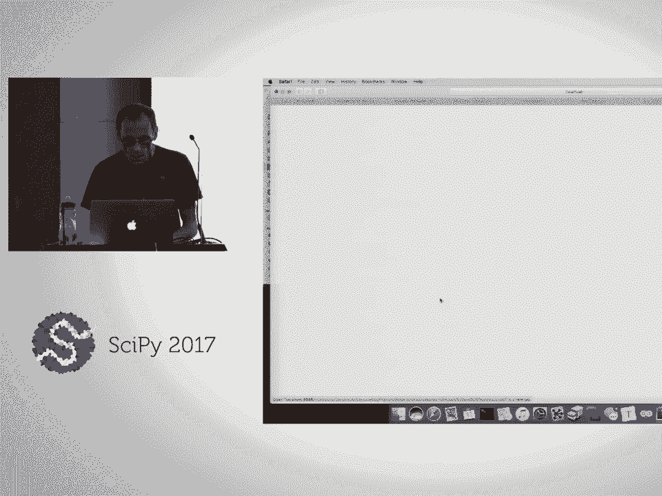
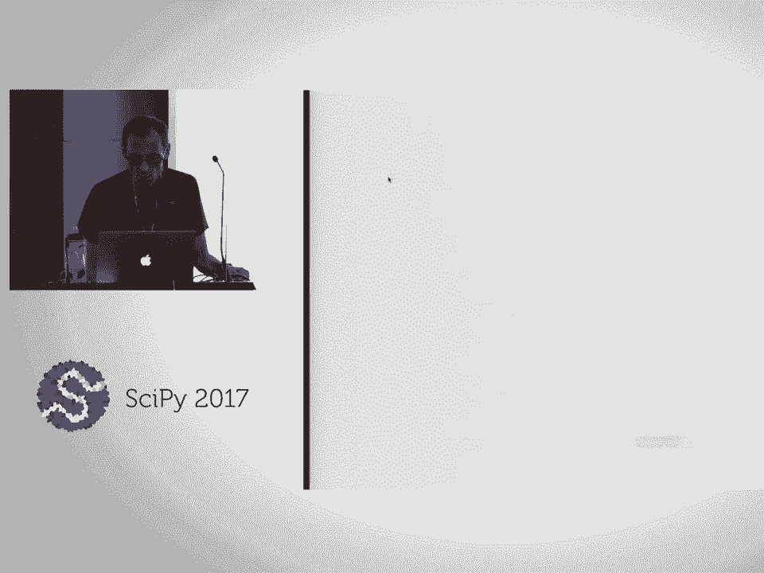
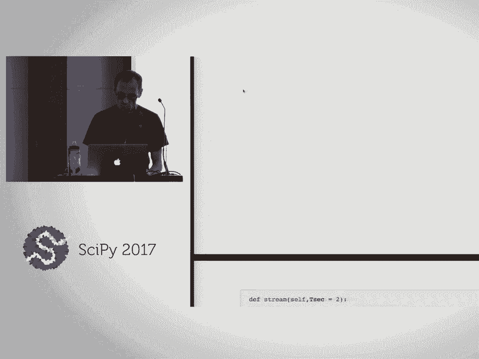
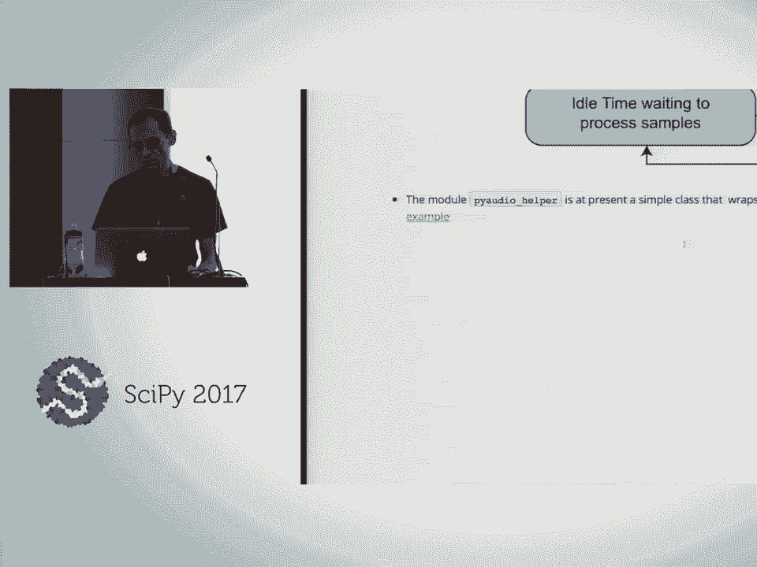
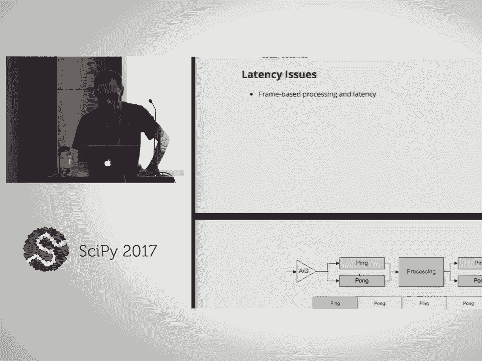
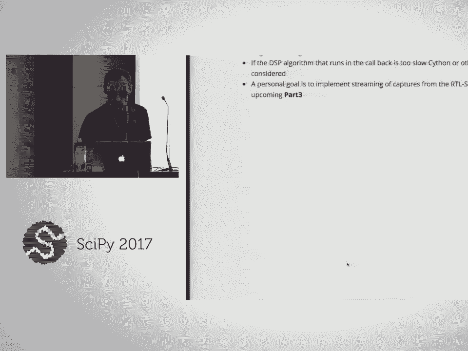
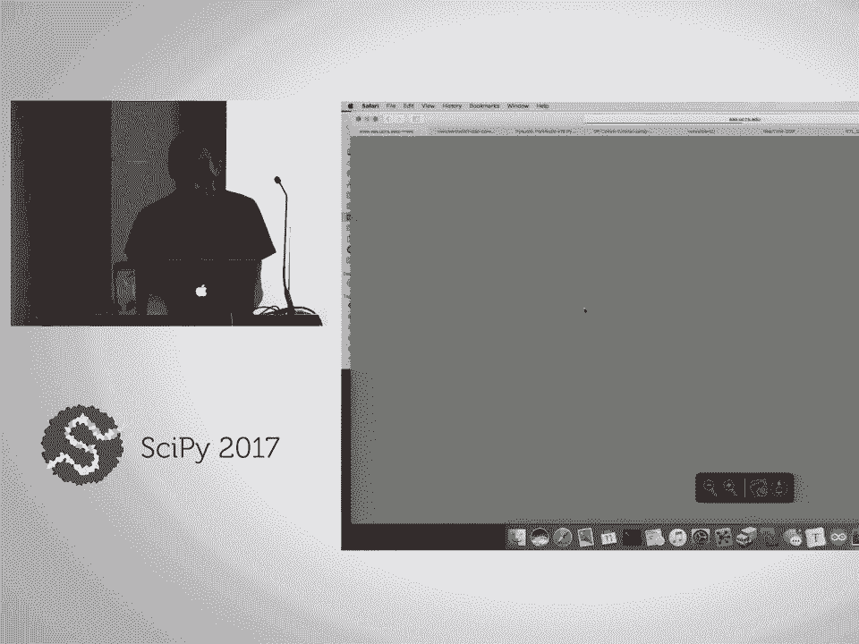
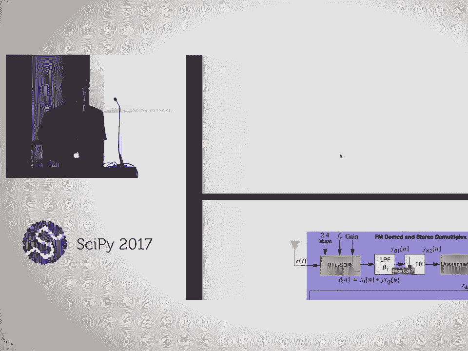

# P33：Signal Processing and Communications Hands On Using scikit dsp comm  SciPy 2017 - 哒哒哒儿尔 - BV1Cs411A76Y

 I'm about ready to get started with just some general discussion。

 And I'm also going to ask for some inputs from you guys as to what your backgrounds。

 are and so I can kind of adjust my style to serve everybody the best。

 Because I'm an electrical engineer that does a lot of software， I kind of work the whole， spectrum。

 But people that come to SciPy are from a much even wider spectrum of software development。

 and backgrounds。 But from an electrical engineering standpoint。

 my tradition is signal processing and communications。

 And here that's called my domain or domain specific area just like we might have a mechanical。

 engineer or we might have a bio engineer or I could have everybody introduce themselves。

 and tell me what their discipline is but I don't think I'll do that。

 But I want to try to give the right perspective to make everybody feel comfortable because。

 I know if I was talking to my students in my discipline I would just blow them away with。

 lots of intimate mathematical modeling details and that's not going to fly here but I want。

 to give you enough of it and I want to try to morph my wording around to connect well。

 because data science I take is being kind of the central theme of the SciPy conference。

 So I can make this seem like data science if I want to but in an abstract way。

 So it's 131 according to my watch。 Welcome to this session on a signal processing and communication hands-on using this new package。

 Scikit DSP com which is not new but it's newly pushed up as a spring break this past semester。

 My first came to SciPy two years ago and it was right after my book signal processing。

 for dummies had come out and when I was writing that book I developed the beginnings of this。

 package using Python because of my philosophy being that I wanted to be able to I guess I。

 should stand closer to the microphone if that helps but the electronics they put down here。

 that I said I should not kick is right here as well。

 I wanted to provide software for engineers and signal processing people around the world。

 to use for free and I didn't want to have them say use MATLAB because that would force。

 them into bootlegging software and I don't believe in that so I worked with a lot of different。

 people from around the world and people always find their software whether they find it legally。

 or not so I didn't want to be leading people into doing things like that。

 So that got me started in it。 That's kind of part of the who am I and where have I come from。

 So my tradition though like I've said earlier as an electrical engineering professor I teach。

 in the sub discipline called communications and signal processing。

 Originally I developed hardware and was a board level designer a long time ago but as time。

 goes on you instantiate a circuit board of electronics just like you'd instantiate an。

 object in software right most of you understand that really well but to me as I now look back。

 through time I say a piece of hardware that's on a you know PCB is an instantiation right。

 it's sitting there and now it's a resource that I use and today's way of doing things。

 with the software defined radio is I've instantiated that hardware plug it in and now I have the。

 flexibility of using that one piece of hardware in many different ways by writing software to。

 accomplish different means and in the government sector it's very big in the commercial sector。

 it's also very big because what our cell phones do they're multi mode so they have to have。

 to work in a lot of different networks and different cell towers or different technologies。

 on the cell site。 So that's a little bit more about who am I and I've already said a little bit about。

 the psychic DSP calm history that's the second bullet point there and I think we'll。

 now start over viewing the topics that I'm planning on covering so that comes up here。

 in just a second but this is the overview of the overview in a sense we're also going。

 to have in this very first portion of the tutorial which I'm calling part zero and maybe。

 that's just seems like why would you start at zero I don't know but you do that in software。

 right in Python you start in an index of an array at zero so that's like this is the。

 beginning and their first real thing is one so I called it part zero a few textbooks I。

 like that that I teach out of does anybody ever use the textbook that has chapter zero。

 okay it's the exact same idea so that's my reasoning behind that the first lab those。

 going to involve some basic speech processing it's pretty exciting but it doesn't require。

 any anything from the package it's just basic Python but it is going to involve get us up。

 and running with pie audio and if you want necessarily need to use this little dongle。

 that I have and I have several copies to hand out and loan out of some people want to try。

 out a dongle is another interface to the audio it will involve using that as well to get us。

 introduced and get over a few bumps in the road with regards to drivers and such so I。

 already mentioned what is scikit dsp come it started when I have wrote the book my publisher。

 was kind enough to send me 15 copies of the book so not one for everybody not like everybody。

 wants to read this cover to cover but Chiron my assistant and graduate student is going。

 to take your name and you're going to well send it by the microphone maybe just make sure。

 everybody gets it clear how this is going to work because again I don't want to take。

 these back either they were shipped here from the publisher so I'm going to raffle them。

 off just give me a name and a number between zero ten thousand and I will write a Python。

 script to take the closest numbers and we'll hand them out sound fair if you don't want。

 it don't sign up okay but I'll tell you it's not a book that sells a lot it was a book。

 that was commissioned I didn't say I wanted to write one they came to me and they said。

 will you write this so I got paid in advance but so far I've made no money beyond my advance。

 it's negative at this point but it's just not a real hot seller because not everybody。

 in the world wants to learn about this stuff it's designed for a junior level software junior。

 level introductory class and signals and systems so it's fairly mathematical but I do use Python。

 and we'll probably look at the website support I have for that so so this is kind of an outline。

 of what's in the book this is a flow chart and the red areas are the special interest。

 areas so we will start the process of the tutorial by developing a little background on continuous。

 time signals and systems and discrete time signals and systems because that is what underlies。

 signal processing and communications we'll look a little bit at the next red box down。

 there is LTI system difference equation modeling now you're saying oh that sounds pretty mathematical。

 but difference equations are something that all of us use in our lives whether we know it or not。

 so anybody think of an example of a difference equation in your life not like when I walked。

 down the street is something going on but anybody got an idea do you put money in the bank or。

 in some savings vehicle so what's the algorithm that's running when you put a deposit into。

 a bank compound interest is running right and that's a difference equation if you thought。

 about that it says present value is the previous value times some factor plus an initial amount。

 that you put in or amount that you add to your account and in banking you want that scaling。

 factor to multiply by something that's what greater than one so that you're getting appreciating。

 some interest in signal processing mostly we don't want that to happen because that would。

 be an unstable system that would go on bounded and kind of blow things up but it's the basis。

 of digital filters though which is something that we need in the digital radio algorithms。

 couple of things that come down is a little bit on the spectrum of a signal and I'm going。

 to start there very basically but for signals and systems engineer just reading the book。

 it comes down to the 48 transform of a signal and you don't have to know 48 transform theory。

 in detail because scipy。signal can do that for us and underneath that is the fast 48 transform。

 which I'm willing to bet even if you're not an electrical engineering slanted person you。

 know how many of you have heard of the fast how many of you have never heard of the fast。

 48 transform or FFT the cameraman okay so it's not it's it's something everybody's heard。

 okay sampling theory why do we need sampling theory because we're on a computer right we're。

 not working with an analog circuit we're taking everything into the computer so a continuum。

 of signal values becomes a a stream of values or a sequence of numbers which is pervasive。

 on and everything we do on computers today so that's needed and then another part of the。

 book which is on the dummy's website is some case studies there's two case studies on signal。

 processing I'm kind of going to use it's in pieces of those later in the lecture for the。

 tutorial and then while this communications there's a couple of examples that are on the。

 website that's the free part of the book that they they put up for me and not really going。

 to use those specifically because I've got other things that we'll be looking at and。

 then there's a couple of control system examples because control systems is another part of。

 the signals and systems stool as I think of it it's a stool that's composed of three legs。

 so it's got control systems pure signal processing and then communications type signal processing。

 is the three stool legs and that is the signals and systems and then you build on top of that。

 I guess I should use my previewer in this continuous flow mode。

 I don't do this very often does anybody know what many it's under？

 I can do continuous right continuous scroll。 Okay I'm going to just briefly mention the modules that are currently in the package。

 This is just the alphabetical listing coefficient to header that is just an interface that I。

 wrote I've written for when I teach real time digital signal processing and we'll touch。

 upon that a little bit later。 It's a means of taking filter designs and other types of data that I would like to put。

 into a header file and then import or include in C code so that I have access and can implement。

 or instantiate a filter in real time DSP on a microcontroller or DSP microprocessor。

 C pops up your frequently so don't be worried I'm not going to have you program and see。

 you or anything but it's just part of the way things get done。

 Digital COM has a lot of algorithms and receiver implementation ideas or in transmitter and。

 some receiver things for digital communications waveforms。

 More stuff to be added there's an LTE type of waveform when I say LTE so everybody know。

 what I'm talking about why do you know that because when you turn on yourself on you see。

 LTE does everybody know what LTE stands for？ Long term evolution。

 Yeah that's right does that make sense？ There's 5G coming out too which is going to increase the data throughput but LTE is long。

 term evolution。 And that uses a particular type of digital modulation called orthogonal frequency division。

 multiplexing which relies upon fast Fourier transform。 So that's in another class that I teach。

 The next module FEC， CONV or convolve this is forward error correction using convolutional。

 coding theory。 That's kind of the core of coding theory that's used in a lot of devices。

 Codes protect information from errors during transmission over the airways so that's a module。

 that implements encoders and decoders and implements rate one half codes with soft decision decoding。

 and puncturing and other things that show up in SATCOM and other standards。

 Does anybody know what convolutional codes are？ Okay I'm just asking that question so I don't ever go there。

 It's not in the tutorial so I just mentioned what that is。

 Next two are we are definitely going to be using the FIR design helper and the IIR filter。

 design helper。 These two packages design two different types of digital filters of which will be used at。

 the very end when we're working with the software defined radio。

 They come up with coefficient sets which define a particular filter that might be used to。

 pass or reject signals of interest。 Their core is primarily back in SciPy。

signal but I've just put wrappers on them and kind。

 of put an interface on them to be more consistent and user friendly for my purposes。

 So that's what they are。 Multi-rate helper is to do multi-rate signal processing along with the filters。

 It's not fully developed but it's partially there。 We're not going to be using it though。

 FIR-PY is just something that I've taken from the new radio module which is a software defined。

 radio toolkit that has Python along with C++ so it has Python scripting that helps call。

 in C++ modules and this is a module that should be a function that should be in SciPy。signal。

 but it's not。 It's not there。 So I put it in my package so I could design certain types of filters which we'll look。

 at but it's the power of it is harnessed by the package above FIR design helper。

 My audio helper is to allow us to do real-time signal processing with Python。

 It's not going to be fast and slick like you might expect but it is。

 It's got some nice attributes and it allows you to do all your programming in Python so。

 you can prototype things and you can play around with speech and music。

 RTL-SDR helper harnesses and adds functions to work with the radio dongle。

 It has one function in that module that does interface with the package pi RTL-SDR and that's。

 how we're going to capture signals off the radio dongle。

 SigCIS Python is the main collection that was written for the book originally。

 It's got a large variety of specialized functions keyed off of examples in the book but just。

 core functions that I use and you'll be doing some exercises out of it。 Synchronization。

py is synchronization for digital communications waveforms and that。

 gets touched upon briefly if we get time to do that。

 I have a bit of a passion over synchronization in digital communications because it's something。

 that a lot of people think when they read textbooks is just automatic but synchronization。

 what do you think？ I'm just going to give you a kind of a layman's view on it。

 If you have a clock running over here I transmit a signal and I have a receiver over。

 here that has its local clock are those two clocks ever going to be synchronous。 What do you think？

 Assuming that there's no other side information like connecting to GPS or something they're， not。

 They're going to drift relative to one another。 So synchronization is an essential ingredient for digital comm。

 If you cannot synchronize you do not get your bits and if you don't get your bits what， are you？

 Not happy。 No bits， not happy。 No information， no whatever。

 So it's under the covers in communications theory to be able to synchronize。

 In the beginning when we did communications just with speech our brains did all that synchronizing。

 because when we hear audio sounds we automatically interpret it right whether it's a little bit。

 distorted or not our brains are extremely powerful。

 Dumb digital communications doesn't know what to do if the bits aren't scrambled because。

 of not being synchronized properly。 So I think about things like that and you probably said wow somebody worries about that。

 and I guess most of us know with technology in different domains right。

 We just are thankful some people worry about each。

 There's somebody there to worry about something in each domain and things get done because。

 you can't specialize in everything。 So this is an example from the book or just a figure that I made to say where is signal。

 processing or what is it and where is it used。 So I took a black diagram of a cell phone and I guess I was kind of thinking of an iPhone。

 Have a camera that has two dimensional signal processing in it。

 Temperature and light sensors and three axis accelerometers that signal processing。

 We have an audio codec that gets inputs from a preamp and a microphone。

 We have the audio codec sending things out to the headphone。

 Audio out or speaker out on our cell phones and that particular area。

 This area kind of right in here exactly what we also have on our laptop computers and what's。

 inside the little dongle that you can get for 650 on Amazon。

 This is just a replacement for your what's built into your computer but over the years。

 what's built into your computer has been morphing。

 It started off in the early days that you always had a line in and a headphone out and。

 then a microphone or something but nowadays you don't get all those interfaces。

 So if we want to be able to send things in beyond the microphone like from a wire and。

 I'm going to be doing that on my cell phone here because I've got my cell phone function。

 generator on here that I'll be using as a test signal。

 We've got some extra cables up here and some extra dongles if you want to play with that。

 So that's just an example of what that is and then these lower blocks down here this is。

 where all the radio stuff is。 All the orange blocks involve radio communications， Wi-Fi， Bluetooth。

 GPS， received and then the， guts of the cell phone from the original cell phone that just did voice communications。

 but now it's digital communications but transmit， receive filters， power amplifier and kind of。

 switch and other such things。 That's all signal processing and communications。

 So it's just filled up with all kinds of signals， signal processing。

 Anybody have any comments on how， if you've never， most of you thought about these things。

 but you don't lose sleep over it， right？ What's another signal processing application？

 I drove from Colorado Springs to Denver International on Sunday and I used my cruise control。

 so this is another control system。 This is a control system and it has to take care of controlling the vehicle's velocity。

 based on our set point。 It has to be able to manage disturbances like wind and hills。

 When I was writing my book I looked at the study of how wind impacts vehicle velocity。

 That's more of a mechanical engineering thing but and then something else that you can add。

 to this block diagram because I have a new car it has a radar sensor on it that engages。

 automatically Toyota vehicle。 That's what I have and what does that do？ That's another。

 what does that do though？ It's designed to make sure if I'm falling too closely it disengages or adjusts my velocity。

 so I don't re-wrench somebody。 That's another signal processing aspect of cruise controls。

 It's amazing， right？ I got this new car because unfortunately it was in a bad accident with my family。

 A block from my house when somebody ran it far away stops so it totaled the car。

 I didn't hurt any of us really badly but so I bought a new car and I wanted to get safety。

 features and it does make my insurance rates lower actually to have all that standard， stuff。 Okay。

 now getting into topics and some highlights we're going to start off with an overview of。

 continuous and discrete signals and systems modeling and that's not an essential ingredient。

 to get to the fun stuff at the end but because it's part of the package and I said it would。

 be hands-on with the package I want to at least show you a few bits and pieces of that。

 Then when we go into the system side of things things will be emphasizing filter design and。

 then we'll get into some audio applications。 We'll do some static processing but we'll also we'll be using Pi Audio to place some。

 things back。 We'll also use the audio widget that's part of the Jupyter Notebook so you can just。

 play a wave file back and we'll do quite a bit of that。

 I was having a problem with that yesterday and I had to switch to using Pi Audio to screen。

 things and then we'll move into communications theory a little bit of that and signal processing。

 implementation of communications ideas so we can do analog modulation theory。

 It turns out I didn't put any of that in but I have links to things of that sort。

 Digital modulation theory and simulation will play around with that a bit in a notebook。

 and that will introduce some of the tools from the Digital Com package and then at the。

 very end we're going to play with the dongle and just a little comment on the dongle why。

 is it so cheap？ Well it's a repurposed digital TV tuner for areas of the world where TV is distributed。

 by a distribution network that you just get where you have to have a dongle so it allowed。

 people I think it's in Europe mostly。 Does anybody use a TV dongle here in the US？ I don't。

 But they were designed to be inexpensive and because they're mass produced so somebody。

 came along with a hack that basically said we can use this as a radio that we can receive。

 a lot of different signals and if you get excited about this and go cruising around you'll。

 find there's a lot of apps pre-built out there。 I had a graduate student that did his master's project with me who kind of introduced me。

 to the dongle and he wanted to track the tail numbers on aircraft because every aircraft。

 transmit at about 1 gigahertz status information in flight and there's apps out there that。

 you can play with and you can see all the aircraft flying around the country。 That's on good or bad？

 It's scary actually to me but have you ever searched for a flight？

 Like you got some friends or family coming from say Washington DC let's say and they're。

 coming to Denver。 You can just put in UA United Airlines flight number on Google and then eventually you can。

 find a link that says I want to track that flight and you will see on a map the location。

 of that flight and that's this system。 It's just open。

 Anybody can do that so these dongles can pick up those signals and you can track that。 I don't know。

 Actually when I see that I think who is running this network。 I don't know。 And they've put them。

 they've streamed them up there and then these services that could， be。 Has anybody done that though？

 Or wondered how you can get that？ Okay。 I mean you're here for a reason I presume unless you just said I want to just sit in here and。

 you know use some time， have some time fly by but there is just you know I guess something。

 you need to understand about me。 I'm kind of a maker type person。

 does everybody know when I say the maker community what I'm， talking about？

 I go to the maker fair in Colorado Springs and I bring gadgets and some of these things。

 are some of the toys that I've bought to play with to go to the maker fair because I started。

 off doing this when I was young with electronics and radio so I just I never got entirely of。

 doing it。 And it's strange but some of us are like that。 Some of us do our hobby is our work。

 My wife says that's sick。 It's kind of like why would you want to do that？ I'm still working。

 I'm not retired yet。 She left her job at FedEx。 She's a software person。

 She didn't like her job and she just had a buyout and had to leave。

 I have too much fun doing what I'm doing and I tell my students that if you can be an。

 engineer it's so much work to get there you ought to have fun doing what you're doing。

 and if you don't have fun part of the day at least there's something not right about， your job。

 You can think about that。 If you're bagging groceries maybe that's just you're not having too much fun at that。

 but you're getting paid to do it。 I think engineers because we work so hard， engineers， programmers。

 developers， you want， to have some fun in what you're doing at least part of the day。

 Our first lab that we're going to do is going to be audio speech based。

 We'll be slowing down and speeding up an audio record without changing the pitch。

 You'll see how that works in Python momentarily。 We're going to look at some basic waveform and signal synthesis using some of the functions。

 that are in SIG-CIS。 We'll also look at the spectrum that those signals occupy and I'm going to describe what。

 the spectrum is of a signal。 In simple terms I'm a musician as well。

 I play bass trombone and a jazz band and in my church's brass ensemble so signal processing。

 and music are pretty tightly linked。 I actually like working with speech and audio signal processing besides radio stuff。

 We'll get into the system side of things with filter design and the core of the filter。

 is going to be looking at are these linear constant coefficient difference equations， or LCCDE。

 I wrote the Dummies book because linear constant coefficient differential equation has the exact。

 same letters。 They made me put an additional appendage on to that but we're only going to be looking。

 at the difference equation version， no differential equation version。

 This is the general form of the difference equation that has both feed forward as they're。

 called and feedback。 I'm going to walk through this in a little bit more detail when we get to it in the lecture。

 but that right there is the algorithm for doing filtering。

 So if you're not thinking as an electrical engineer which I can't not do basically， you。

 can say I want to know what an algorithm is to do something。 This is the algorithm。

 That math right there describes the algorithm。 If I was to try to make a non-electrical engineer build a circuit and get it to do the same。

 thing in the electronic circuit world， it would be very foreign to you but I think you can。

 pick up an algorithm idea very quickly。 I work in my consulting work with people that are just programmers and I have them learn。

 about doing very signal processing things。 They're always highly intimidated at the beginning and I just say look it's just this。

 Write some code that looks like this or instantiate your code on a floating field programmable。

 gate array and once they get going it's fine but initially they're intimidated。

 I have to do signal processing。 I don't have an EE background and I've worked with a lot of people that come through that。

 and they're not experts but they can get pretty good at what they're doing just by practicing。

 at it。 We'll consider the frequency response of these filters once we take them into their system。

 function or frequency response form and we'll be working then with complex variables or。

 complex arithmetic。 And then likewise the key to working with different equations in scipy is the package。

 signal within scipy and then the function is L filter and L filter takes in an array， an， ND array。

 B and an ND array A and then it takes in an array of signal samples X and it returns。

 an array of signal samples Y。 This is the most utilized function in my modeling and simulating with Python would be signal。

 dot L filter and the A and B arrays are exactly the coefficients that you see in the difference。

 equation。 There's a set of them， the A coefficients and the B coefficients。

 And then we're going to drill down a bit on a few， a couple of types of filters and then。

 the filters that the package helpers design， FIR and IR design helper。

 Just a quick example of how easy it is to design a filter though。

 Import the package say FIR design helper and then suppose I want to do an equal ripple。

 band pass filter that uses the Ramese exchange algorithm and this is all built into the package。

 You just specify the cutoff frequencies and the pass band gain and the stop band gain。

 or stop band attenuation and then there's a supporting function that can plot an overlay。

 filter response is now I'm going to have to explain what a filter is but does anybody。

 want to tell me what their vision view of a filter is。

 Non-electrical or not systems wise but what is a filter just in a very simple way maybe。

 if you drink coffee what is a filter relative to making coffee。 There's things that you don't want。

 Okay and okay。 So everybody hear that？ The news that you don't want and leaves passing through what you do want which is water that's。

 I'll just say brown colored。 I mean I don't drink coffee so I can teach one of you that means something different though。

 So that's exactly right and so filters come in different forms but when you look at the。

 frequency spectrum and that's what everything you do besides the waveform which is what's。

 really traveling through space on the wires view the content of the waveform from another。

 point of view called the frequency domain and that tells us spectrally what signals at。

 what frequencies will pass。 In this case it's a band pass filter so it can pass signals that have a gain of zero。

 VV which is like multiplying the signal by one and zero VV and then it has 60 VV of attenuation。

 everywhere house。 So hear that we'll process that with Thai audio and it's called an equal ripple because。

 there's an equal amount of ripple across the pass band which is a good band we want to have。

 in them there's an equal amount of ripple across the stop band and those are set by the。

 afterdeeds up there。 The path of DB and the pass band of ripple and 60 DB down or 60 DB of attenuation in the。

 stop band。 To me it looks beautiful to you it might be like what is that。

 And this is how Pi Audio will do it when we get to it talking about in more detail later。

 in today's session。 We'll use an object that I've created in the Pi Audio Helper module and it wraps up some。

 of the details of using Pi Audio and what it brings outside of Pi Audio then it's interface。

 into your Jupyter Notebook。 It's just the need to write a callback function which then processes the signal samples that。

 are captured from the input to the audio device whichever one you're going to talk to on your。

 computer and then sends the samples back out to the playback or audio output device on， your PC。

 And I've got some other instrumentation that I'm setting up in here you see callback tick。

 and callback talk。 Those are emulations of what an electrical engineer would do with a lot something called。

 the logic analyzer which allows you to get the timing and see how much time you're spending。

 in the callback。 I'm just going to come back to this later but I'm just going to see if anybody's thinking。

 what you're thinking when I say time spent in the callback。

 What does time spent in the callback mean to anybody who wants to just venture a guess？

 What's the significance of time spent in the callback？

 Callbacks show up all over the place in Python。 I never talked about it。

 Sessions yesterday for sure but in the context of signal processing what do you think time。

 spent in a callback means to you as a developer？ Anybody want to venture a guess right now？

 I could spend a lot of time or I could spend a little time。 What do I want to do？

 Spend as little time as possible。 Latency is an issue and if I spend too much time in the callback I'm going to miss the。

 next batch of samples that are going to be thrown at me by the processor and if I do。

 that then I can't maintain real time and then my audio stream is going to be all broken。

 and chopped up。 Does that make sense？ How many of you listen to audio streams on the internet while you're working but everybody。

 does right？ What happens when your connection's not good？ Your stream gets choppy sounding right？

 Same idea here。 Along with this part of the discussion I'll also at least sideline how I use Python and。

 connect it over to doing real time processing in C and embedded systems。

 So I use Python on both sides of that to kind of be my platform for bringing things。

 together and some of the data sets that are on the repository are some examples of captures。

 that I've made。 I actually brought a piece of instrumentation with me。

 This is a oscilloscope and spectrum analyzer and signal generator in a box through USB。

 interface and everything that I'll be showing you in the repository。

 I could set this up and if we have time I may set up my analog discovery too。

 To me this is great because I need to do a lot of things and I don't want to stay in the， lab。

 I want to go home and work so I can just carry this thing home with me and it replaces a。

 lot of instrumentation in the lab。 It's kind of a maker's gadget but it's also engineering student's gadget too。

 Some universities require students to buy one of those and they cost， if you're a student。

 at a university they cost $180。 If you're not at a university they cost about $250。

 But if you're interested you can ask me at the break or whenever it's appropriate。

 We'll build some notch filters so we can excise interfering signals and we'll play。

 with that a little bit in another lab experience。 I wanted to do something with adaptive filters。

 I have that in success but I just dropped down on that one。

 We will look at flanging as an audio special effect and we'll have that come through pie， audio。

 I could have done echo or reverb。 Flanging is kind of an exciting one and we'll use something that I have in the digital。

 comp package or module which implements a time varying time delay。 So time varying time delay。

 Does that strike a chord in anybody's mind like this sounds very strange？

 I'm talking to you and there's a time delay between me and your ears picking it up。

 What happens if I make that delay time actually vary with time like getting closer or further， away？

 What does that make you think of？ Anybody in here？ Doppler right。

 Because everybody in here has probably had some physics in your life or you stand on。

 the corner when an ambulance comes by and you experience the doppler。

 So that's exactly what it is but you can make that anything and I developed it originally。

 for work I was doing on some consulting where I need to model things in Satcom or satellites。

 flying overhead on a non-geostationary orbit and you want to model effects like that。

 Actually some of the work I did here ended up in a product at a company that sells channel。

 simulators for Satcom but it's very similar to what you do in audio special effects too。

 So we'll play with that。 We'll also get exposed to something called complex frequency translation which actually。

 is what the dongle does for us。 We can take the spectrum of the signal and move it to a new location and that's just。

 what this bullet says。 Multiply a signal by a complex sinusoid and now I'm assuming that you've had some familiarity。

 with Euler's formulas but I'm not sure where you would have learned that calculus I think。

 J is an electrical engineering version of I， square root of minus 1。

 Talk about modulation and then when we get into the dongle one of the things we're going。

 to do is we're going to play with receiver algorithms that will implement stereo FM to。

 modulate from a captured waveform。 And I have the captured waveforms in the repository or the idea will be to actually receive them。

 and process them from a live capture。 I don't have live streaming in the package yet because that requires more intense coding。

 You have to learn how to write real time code and make this call back stuff work so you have。

 to do asynchronous capture from the dongle and then the asynchronous playback through the。

 callbacks and that's mating two different streaming processes。

 And I assigned this to a graduate student to work on about two years ago and he hasn't。

 been working on his thesis at all or his project。 He just kind of disappeared。

 Some of you have graduate degree， some of you don't but I have a fair number of students。

 that started degree and just they get going to work and then they never finish it。

 And this student left Colorado Springs and went to Washington。

 He works for Fluke Networks which is a company that builds instruments and things。 It was Fluke。

 It changed its name because it was bought by somebody but and then people get married。

 People start a family。 A lot of you know what I'm talking about。

 Things just change and the degree maybe doesn't mean what it once meant。

 At any rate this is the dongle with the antenna。 I've got it set up right here and then the block diagram。

 That will be after that a for the stereo will take the output of the dongle and do some filtering。

 Down sample of signal， run it into a FM detection algorithm called the discriminator。

 Do some more filtering。 We'll look at how we get back left and right channels。

 We have a phase life loop in here in order to do some modulation。

 I'm going to walk you through a lot of these things。

 There's a lot of nitty gritty stuff and depending upon your interest you can just say oh it's。

 just something that does this。 I'll take it for granted or I'm really interested in it but it's all in Python so you can dissect。

 it as you see fit。 Another thing that we'll do is frequency shift keying。

 Some of you were here early and you heard me。 Heard some strange sounds over the speakers。

 I've actually got an FM stereo transmitter right here in hardware。

 Now it'll make up for the fact that down below this lower level the FM radio stations are。

 fairly weak but I have my own radio station right here and this is a little maker thing， too。

 This is on a breadboard with a module from a company called Adafruit and this breadboard。

 as in our we know microcontroller sitting inside of it。

 A lot of you know I'm talking about that so that's the basis for that and that's just。

 I'm putting FSK out on that frequency shift keying and originally I wanted to have you。

 demodulate and parse out a message and I wasn't going to tell you what it was but I wasn't。

 able to store a long enough record on the Arduino and I kind of backed down on that。

 due to the memory size and some programming issues and that's programmed in a C++ kind。

 of environment but at least it's running。 This is something I just bought a couple of weeks ago for this because it's replacing。

 things I do in my lab and that's a lot less expensive and a lot easier for me to carry。

 than what I would have had to do otherwise。 So maybe that's intriguing to some of you because I built bootleg transmitters and things a。

 long time ago and I was in college。 I'm amazed you know it's really easy to buy one of those now。

 It's a chip on there made by silicon labs and a lot of these things are just part of。

 what the industry is now demanded。 You know you can buy an FM wireless microphone and other such things so those are chips that。

 were developed for industry and products that are out there and once they become an ASIC。

 the price can come way down due to volume。 So now we're ready to enter the first lab。

 I'm supposed to be wary of the fact that 215 to 4 is snack time so I'll introduce this。

 lab and then we can decide either to take the break before we start on it or take a。

 break and come back and start on it but the first lab is slow down playback and speed up。

 the playback。 And this is in a Jupyter notebook that I'm going to point you at but let me just talk。

 about what the basic idea is。 You have a speech factor that has samples in it and optionally I'm going to play with。

 Pi audio so you can record your own using the microphone on your PC。

 It's more fun to do this with your own voice because you get to hear yourself talking fast。

 or talking slow with a pitch not changing。 Just keep stopping on me and maybe the interfaces have a problem but I've got a sample so you。

 can do it either way but if you take the Pi audio right you'll get a chance to start playing。

 with Pi audio earlier。 So the stream comes in samples in a vector。

 I originally developed this for MATLAB so sorry the index there at the top is 1 and not 0。

 I just realized that on my figure it's a flaw but samples come in and what I want to do is。

 use the reset shape function which is part of NumPy and reshape this array and what I'm。

 going to do and I reshape it is I'm going to reshape it into segments maybe I've got。

 this thing I think yeah these figures get mixed up。 The figures are flip-flop。

 This is the first figure this is the figure for the speed up and then the slow down is。

 the other one。 So what does this say？ Speed up。 Never mind。

 Speed up is what I'm going to have you do first on the lab so the pictures are in the。

 wrong order but speed up is to say the vector gets reorganized into sub-sigments and then。

 what I'm going to do is I'm going to only keep every other sub-sigment so I'm going to。

 start skipping segments of the speech file so I can play it that faster。 Does that make sense？

 I'll just say little snippets in between I'm going to be cutting them out and this method。

 is called butt splicing。 I'm not trying to sound crude or anything it's it harkens back to working with digital。

 audio tape or people were actually cutting magnetic recording tape and then splicing， it together。

 Does anybody relate to that unless you're really old？

 Nobody's ever played with tape before right but that's why it's called butt splicing。

 It's in cutting and butting the two ends together and taping them。

 So you'll put out every other one but then you have to reshape it and I'm proposing that。

 you use the ordering scheme from reshape called F as opposed to C。 What does that mean？

 F is for Fortran， C is for C。 So C is which organization in an array？ It's an array of data。

 a 2D array。 There's row major and column major right in organization of data and how it's stored。

 So C is row major and Fortran is column major I believe。 Does that still use that all？

 Anybody ever heard that before？ Or you don't care about it probably because you just say it's an array。

 I don't care how it's stored but electrical engineers when they're working with devices。

 think about how is it stored in memory and if you have a 2D array you can just make it。

 a 1D array and properly index it using striding and things like that。

 Striding is probably something you've heard of before though right？

 And then the slowed down idea is to take the same array and reshape it and then we'll use。

 B stack is my preference from Python NumPy which is vertical stacking。

 So I'll take the array and then on the stack another one right on top of it and then I'll。

 reshape it back out again。 So what I'll be doing is playing each little sub-site meant twice。

 I'm just going to have you speed up by factor of 2 and slow down by factor 2。

 These are some functions that are in that are taken as wrappers to the scipy。io。way file。

 read and write in。 Seg says they're just two wave and from wave。

 So what you want to open up now is somewhere in my ad。 Yeah it's called speech processing。

 Yeah that's the name of it。 Speech processing。ipython。book which should be。

 Yeah we're going to be taking the break now but it's in the wrong play。

 Yeah it's tutorial part zero。 So it's that guy right there and if you want to use a built-in file you can use this one。

 which is me or these are some audio speech files that eight kilosamples。

 They're all at eight kilosamples per second or like I said we'll come back and I'll talk。

 about using Pi audio。 So maybe I'm deciding for us。

 You want to take the break now or do you want to just keep pushing？ Say yes or no？ Take a break？ No？

 Keep pushing？ Okay we'll do it。 Okay there's a lot of you are already back in here。

 Let me just explain。 If you want to try to get Pi audio going right now what you want to do is just you know。

 well first let me explain my philosophy in using my notebooks。

 I just do cell by cell running so I bring this guy up and I will run cell one and I'm。

 importing Pi lab which to me I know a lot of you don't like doing but it just pollutes。

 my name space up with everything so I don't have to put prefixes on things。

 It's just for me it's more convenient。 Then I'm importing some packages that I use。

 Then I have this second cell just configures me to use SVG graphics which are a lot sharper。

 so I like to use that by default but I have it toggle a bowl so you can use PNG or PDF。

 Words here but then the first thing you can do when you are set to go is you can run this。

 available devices and this is telling you that Pi audio is working and it's also telling。

 you what devices are on your system and how you're going to patch to them using the index。

 01 and because I have my radio dongle plugged in or there's an HDMI cable on my computer。

 I'm getting this this is the index for the HDMI cable for the display and then this is。

 an audio device that I have plugged in which is my little 650 sound power plugged in there。

 So if you're a developer and you want to talk to something what you need you need to have。

 your roadmap and how you're going to connect to the right devices on your system so this。

 is the first thing that I did when I wrote this module。

 I wanted to know what was out there because I wanted to know how to get the right connections。

 Does it make sense？ If not Pi audio has a part of the interface which I didn't utilize which automatically。

 detects the default devices but my experience working with audio on any computer is that。

 the default devices are frequently not what I want so I wanted to be able to have control， of it。

 I'm kind of a fanatic about control which I think a lot of you probably are too because。

 when you write software control is kind of the whole deal I got to be able to know what， I'm doing。

 So for this first thing though you probably want to use the built in microphone and then。

 you can select index 01 in my case for the output so down below here I've got a very。

 simple callback which you won't have to change but then down here I'm creating an instance。

 of this DSPIO stream object and it's this parameter right here is the in index and the。

 next parameter is the out index so I'm making that first one in this case I had it set to。

 two but if I wanted to record off of my built in microphone I would set that to zero and。

 if I want to let it play back through the speakers I would set it to one just because。

 my interface requires something so I'll set it to one but you're probably going to say。

 wait a minute if I do that my speakers are going to play back while I'm talking into my。

 microphone and that's going to be what feedback but notice what I'm doing down here in my。

 code I'm multiplying the return audio by zero to make sure that nothing comes out of the。

 speakers and that's just done because of the way I wrote the interface this pie audio helper。

 thing I wrote I have to admit I wrote it last week I had I've been playing with it but I。

 hadn't really written it at all I've been it's been on my mind and this graduate student。

 never got into it and I just said I don't know I'm a crazy person like you probably are。

 sometimes you don't actually do something until you're backed into a corner so I signed。

 up the way I looked at it I signed myself up to do this so so if I wanted to make a quick。

 recording at this point I would just first of all make sure this callback has been created。

 and then I will create the object and I will record for five seconds hello I'm here at。

 scipy doing a test recording and I'm going to see what this turns out okay I did five。

 seconds worth and now I've got a capture piece let me see yeah I'm taking DSPIO the object。

 that I just created and the data capture is just an array that gets filled up as it's。

 bringing samples on in those samples are as 16 bit signed integers so in order to work。

 with the wave format and my two wave converter I have to scale them back down again so I'm。

 just dividing by the maximum to get it within a range of plus minus one and then I'm going。

 to set up the speech control so let's see if I got it。 Ten-， I ran out。

 There's latency involved here so when it says it was done it was actually just passing out。

 the last few empty buffers so I should have talked faster and I guess I should be talking。

 faster because I'm going to slow but you can do it that way or if you'd rather do it this。

 way to do this exercise speech that wave。 If you want if you like that one go for that one that was going to be what was going to。

 come out over that transmitter down here but I failed to get that up and running so if。

 you like that that's what I'm going to be demoing in at the end of the exercise that。

 my solution will be that little slogan so no pressure you don't have to get priority。

 working right now and if it's too frustrating just work with what I've already got in the。

 repository because I want you to have fun right and if you were getting frustrated that's， not good。

 Yesterday at the thing I went to on the widgets I didn't follow the directions and I totally。

 corrupted my Anaconda group install and I had to reinstall everything yesterday。

 I was not happy because I had to read my pythons install so I learned my lesson don't be in。

 a hurry don't get frustrated but once once I blew it away I had to get it built back up。

 so I could get it to run。 So I've also got it set up to loop that's another part of the interface here so I can。

 loop it。 So if I run this call back I'm bringing in an object called loop which just brings in。

 my samples and creates this loop object and now when it gets called back it will automatically。

 cycle it around in a loop。 You could do that forever and forever and you'd get really sick of hearing that same thing。

 again but that's just something so I could have it play a longer period of time。

 And it's not relevant to the exercise but just playing games。

 So now what I'd like what you should be doing is trying to work this code through and I。

 put some hints in here to get you started。 So you want to look at this and then you want to think about this picture。

 So you look at the picture you look at this sometimes when I'm trying to develop an algorithm。

 I will just create an array that has a sequence of numbers in it and I'll try to see especially。

 if I'm reshaping how I can organize it by just visualizing it。 Is anybody else programmed that way？

 I want to visualize what's happening so and then I'm going to put the real data in after。

 I mess with it。 So I put in a sequence of numbers 0 to 15 that it did a reshape。

 I did it with the C ordering and I said this picture doesn't look like this visual over。

 here doesn't look like this stack。 I want to be able to have one， two， three， four， five。

 six and so on so that I can use， slicing to take every other column there。

 So then I switched it to the Fortran ordering and then then I see what I want to see。 I see 0， 1， 2。

 3 and then I can just take this one， this one， this one and this one by， slicing。

 Does that make sense？ Does anybody have it working？

 I haven't heard it yet but it's just a few lines of code。 That's what it's going to be。 Okay。

 There's one little glitchy thing that you're going to have to go through and that is you。

 want to make sure the number of rows you stick in up here times the number of columns is going。

 to be the length of the original array but you've got to have things work out into， integers。

 So if you want to have that work out properly you're going to have to pick some integer， length。

 This is going to be the length of your speech sub-sagment and mine is around a hundred to。

 four hundred and that's the area that I'm working in。

 But then you're going to have so many columns and the product of those two numbers has to。

 be the size of the input array。 So if your input array is not divisible by those two。

 the product of those two integers， then you're going to have to be some trimming so I would trim off the end so you're going。

 to be using some int types of things you know where you're going to make sure that it multiplies。

 out to an integer。 I don't know how else to say that except you just have to tackle the problem to actually。

 see what the issues are。 This is a lab that students work on and when I talk to talk them through it you know you。

 just got to kind of confront it head on and say oh that's what it's talking about or。

 that's what the issue is。 And then after you decimate it by taking every other column you have to make sure when you。

 reshape it back into a linear array into your pen it will take that into account。

 And then my very very last step is you have to think that when you reshape it's very again。

 back to a linear array it's going to be a two-dimensional ND array but you want to actually flatten。

 it back down to a 1D array。 So that's a method called dot flatten parentheses。

 Does anybody ever use flatten before？ Because that's the way the wave playback tool wants to see it as a 1D array。

 I'm testing you right now and this will help me decide what to do next。

 But you know I only spend a few more minutes and then I'll show you my solution because。

 the fun part is listening to it and for me it's listening to my voice fast and slow。

 It's like I don't sound like that。 So。 Okay here's what I'm going to paste into the notebook。

 So the upper code block is the speed up and the lower one is the slow down。

 So that's not necessarily any more of the delay in the laser pad。

 Okay I'll just briefly walk through what I put in here。

 I've got the first one at the length of the speed tracker because I don't know if it's。

 an odd or even number if it's divisible by some integers right I've got to make sure。

 that that works out properly or divisible by an integer to get another integer。

 So and then I set the length of the sub。 So I'm setting the length here and a number of rows I'm going to use。

 And I did that by experimentation what sounded the best。

 I know I'm at eight kilosamples per second and a speech phonem is that's the way we speak。

 as humans is around ten milliseconds or less。 That's an utterance or a syllable and speech。

 Does anybody been a speech processing person ever because it's definitely big right now。

 Speech processing is。 So I set that at four hundred for the speed up and then I find out what the trim length。

 needs to be on this by dividing nx by n sub and then I take the integer part of that and。

 then I want the trim length of nx so that I can divide it by the integer n sub is going。

 to be this guy right here and that's spurious I don't know why that's sitting in there。

 And then I go ahead and do the reshape。 So I have rows n sub and then nx t divided by n sub and this could be done in different。

 ways if it's Python three or Python two seven。 I just used int instead take care of both cases。

 And this shapes it like the picture showed and then I'm going to take all the rows and。

 I'm going to take all the columns but I'm going to strive by a factor of two so I'll。

 take every other column。 And now I have to reshape it and when I reshape it I want to have a one by something and that。

 one by something is going to be from the shape command the number of columns times the number。

 of rows that I have after I've done the striding across the columns and then put it back together。

 with the same for trend ordering and then I flatten it when I run it to the two wave function。

 take it back to a one D array so let's run that。 That's not me I don't talk that fast but the pitch is not changed right。

 I mean because when I set up here that we could without changing the pitch if I wanted。

 to play that game I could have gone back up here and what could I do up here I could bring。

 this in as the vector and then I could write it back out again with the sampling rate doubled。

 up to 16 kilosamples per second and then my pitch is going to double and that was a。

 constraint I said it wouldn't work I heard a few people playing that right you played。

 it back faster and then the pitch goes up。 That's what you did right yeah a Mickey Mouse Donald Duck Sound or something chipmunks I。

 guess from my generation。 Taking it the other way and stacking it doing the V stack which is what I did here I start。

 off the same way but then I put the V stack in and just stack one on top of the other。

 and then I reshaped the whole thing again it's like before。

 So this will lengthen it by a factor of two。 Okay not impressed probably。

 My understanding is for people to have speech impediments or hearing disorders that slowing。

 speech down could be useful for their understanding。

 Likewise if people are talking too slow they want to speed them up so I got an email when。

 I was flying over here on Sunday from Texas Instruments voice as the new user interface。

 a new era in speech processing。 So this is just TI saying look we're going to do a lot more speech processing and software。

 and things and some of you maybe are dealing with that already。

 They're looking at from the DSP processing standpoint but I'm not going to dwell on that。

 I'm amazed at things I get in my email it's like this kind of relates to something that， I'm doing。

 Okay I'm going to move on now to part one。 Is everybody good to go on？ So I'm going to have to。

 well I'm not going to lie in this。 What I have to do is not be in there。

 Take this over to notes part one。 I'm going to need this notebook。

 Okay now we're going to do a little bit of signals and systems modeling and some simulation。

 and I'm going to， it's already 3 o'clock。 I'm going to have to go a lot faster。

 I'm going to skip some stuff。 But the first thing is basic signals， what are signals。

 I think we kind of have an idea。 Can be a physically created signal。

 I mean a naturally created signal like a beating heart， wind， velocity being measured。

 and any other biosignal or naturally created thing can be a signal。

 But a lot of things that signal processing people deal with are also man-made signals。

 because we're doing communications with them。 We might purposefully be sending a ranging code off to a satellite so that we can receive。

 it as it turns around and we receive it we can measure the doppler off of it to get the。

 velocity of that object and we can also get the round trip delay time to get the range。

 of that object。 So that's a non-communications objective but a lot of applications are just all oriented。

 around communications processing。 So the device that receives natural and man-made signals and gets it to the digital domain would。

 be the digital to analog converter。 Guess I got to go up here and change this back to scroll。

 So what's a basic signal？ It's a cosine wave。 Cosine is a function of time is in electrical engineering terms is the starting point for。

 a signal and a signal like a cosine wave has a defined period。

 It has an amplitude and then it has a phase or time shift relative to the time axis which。

 would be the phase of that cosine wave。 Equation one is the continuous time and equation two is the discrete time which is what we see。

 in the computer。 As we increase the frequency of a continuous time wave the oscillation rate goes faster。

 and faster but if we create the discrete time cosine wave as this picture here is showing。

 if I increase the frequency which is 2 pi times its frequency and the analog domain what。

 we would hear divided by the sampling rate the number of samples we would take per second。

 You notice this interesting behavior that we start off at zero we get a constant sequence。

 we increase that frequency and we get a sinusoid we increase it still higher and we start seeing。

 get to a critical frequency where we are getting a sample at time a sample at slow alternating。

 and then as we increase still higher we will see that the output frequency again starts。

 getting smaller and finally when it gets up to the sampling frequency as the frequency。

 we are putting in F not as the same as F it asks we are back to the constant again。

 So I just got this picture up here just to demonstrate what is known as aliasing and。

 one of the artifacts associated with sampling theory that if you sample too fast you will。

 lose information about the signal and this is just demonstrating it was a convenient figure。

 to grab that is in the book to talk about aliasing and so this thing just states it in words in。

 order to manage aliasing we need to sample our sampling rate to be greater than it should。

 say greater than twice the highest frequency I don't know why I didn't put that in there。

 it was in my head greater than 2 times the highest frequency。

 This is a depiction on a folded sheet of paper that tells us how aliasing can be viewed as。

 frequencies of the sinusoids。 So the principal aliasing range is 0 up to half the sampling rate as I go from the sampling。

 rate it is like 8000 samples per second that is what we were just playing with in the audio。

 clips as I go from the full in frequency or half the sampling rate 4000 up to 8000 all。

 of these frequencies aliasing across on this red line in our autoball down at this principal。

 aliasing range from 0 to Fs over 2。 Likewise you fold the sheet back again and you will aliasing all these other zones as。

 they are called in sampling theory。 Most of the time we don't think about that but when we are doing signal processing like。

 in the radio at the end we have to be cognizant of that to a certain extent。

 Actually we have to be very cognizant but I'm going to try to protect you and actually。

 aliasing is like to avoid aliasing you just put filters in accordingly and the filters。

 protect your system from allowing signals in that would be confused。

 I guess you have to go back to the dictionary is what I always think about is what is the。

 definition of alias。 I'll let you think about that but it's you know it's your it's somebody who is not who。

 you think it is it's an alias and of course in programming aliases are used a lot。

 An app that does convert discrete time sign use so it's to continuous time through the。

 digital analog converter is now what I've talked about and I have it myself on we'll。

 be using that a little bit later actually I just turned it on。

 We're using a noise signal as our test factor later on with pi audio。

 So a very simple type of signal that's used to understand how to formulate waveforms and。

 signal processing are pulse type signals we have the sign use side we just looked at。

 which runs for all time or for a long period time and then we have pulse signals that are。

 used in communications digital communications radar and other things I mean digital communications。

 waveform is just a continuous stream of pulses is the way to think of it and these are primitives。

 which are available inside of success so I have this traditional rectangle pulse which。

 is I don't have a listed here but we're going to see it in a second and then I have the。

 triangle pulse and then some other pulses that are used in digital comms are raised cosine。

 and a square root raised cosine。 Before we go on any further we're going to jump over and just ponder the frequency domain。

 for a second I'm going to keep this really simple but when I've talked about the spectral。

 domain it's just turning things 90 degrees kind of like if we look at a single sinusoid。

 we will have a period and one over the period is the frequency of that sinusoid so the blue。

 and the green are two different sinusoids I add them together and I get the red I can't。

 really tell what I've got there anymore I know I've got two signals but it's all squiggly。

 I can't see it distinctly as that's one signal and that's another but if I go to the spectral。

 domain and I look at the attributes of the red signal I know that it's composed of two。

 different amplitudes originally A1 and A2 and along the horizontal axis is the frequency。

 now so I'm just portraying the information differently and this is what the Fourier transform。

 obtains by looking at that composite signal or the fast-48 transform gets that information。

 with some nuances but just keeping it simple that's what goes on so does that make sense。

 that's why I was talking about music earlier if you play music and you think about harmonic。

 structure and an ensemble playing in tune you're thinking about all of these harmonics from。

 our instruments having to blend together harmonically if you want to create nice sounding music。

 Formally you know the 48 transform is this equation 4 which involves this integral but。

 I have a function in this next notebook called 48 transform approximation which uses the F(t)。

 Before we get to the notebook a little bit on systems now so what is a system because。

 the name of my book is signals and systems for dummies we have signals we create signals。

 or we have our natural signals a system operates on a signal and do we need to have systems。

 operating on signals yes because that's how we're going to manipulate things to get information。

 from point a to point b so a good example of why we need a system is the signal that's。

 arriving is noisy and a lot of the noise it's on that signal on the left is not really。

 in a frequency band now that's interest to us so we put a filter in this system so it。

 cleans up that signal。 We want to build filters that are called causal or non anticipatory and the definition of causality。

 is right up here the signal that depends only on present and past inputs and I say we want。

 that because can we do anything but that can we predict the future some of you that are。

 in the money markets and things say I'm going to build an algorithm that's going to try。

 to predict the future but we really can't we only can estimate it question。 The future。

 But I mean like practically like like how would you build a filter like what would you。

 be digging into a comfort way if you did that？ The future。

 Mathematically if you think about mathematics and you probably try not to think too deeply。

 about mathematics except when you're in college it's very deep right you can put anything。

 on paper with mathematics can you build those things？ No。

 Mathematics would allow for a non-causal filter so I'm just stating that fact that we're only。

 going to be talking about causal filters or ones that can be built but the mathematics。

 allows for anything。 I probably should have left that odd。

 I'm a person that likes to poke people's brains so you asked a very fair question no。

 I'm not picking on you at all。 Are you okay？ Yeah。 Okay。

 Does it bring back memories or something because I don't know what your background is。

 You've bumped into causality。 I mean physicists talk about causality as well and I think Albert Einstein talked about causality。

 and relativity theory if I'm thinking back right。 I'm not really going to debate that though。

 Somebody here will probably love to talk。 Stand up and talk。

 So here's the difference equation back again。 We can build causal systems with this difference equation set up and the difference equation。

 set up if we think about the signal flow and the signal flow actually works together with。

 that equation 5 and allows us to visualize how the signal from the input gets to the output。

 So the equation is the mathematics but this flow diagram is how I visualize what the algorithm。

 is doing the signal enters here as a sample one copy shows up as the output another copy。

 goes through this path and that z to the minus one means I delay by one sample。

 I'm just manipulating data in the array whether you're a signal processing or not you can。

 get the idea that the value of this index I can just grab have a value that was stored。

 away previously。 So I've got a history there。 That's what the z to the minus one is。

 So that flow diagram is implementing what's up above but if you're just thinking in terms。

 of programming terms the diagram up above is the most sensible it just says the present。

 output y is equal to the present input weighted by b zero one input in the past weighted by。

 b one and so on and then minus a scaled weighting of the past outputs。

 So these would be called feed forward repeating forward copies of the present and past input。

 and we're feeding back copies of the past output totally caused so we have all of that。

 data available to us at the present time to do that filtering operation。

 Sound reasonable and if you're a statistician you're also thinking when I do that what。

 am I doing from a statistical standpoint there's a word that starts with c I'm creating correlation。

 between the signal and itself at different time legs because I'm now putting that dependency。

 in but filtering needs that you need to do things like moving average or something to。

 smooth the data。 This is just another structure this is more along the lines of what numpies L filter I。

 mean scipy dot signal dot L filter uses an algorithm that looks more like this it's called。

 a drug form to and then you transpose it but how we view the design of filters is by taking。

 the difference equation and taking an operation called the Z transform on both sides of the。

 difference equation and then that allows us to abstract into the Z domain and it's a joke。

 amongst electrical engineers that you enter the Z domain you do what sleep you know people。

 might in cartoons Z's coming out of somebody's mouth means that they're sleeping so I don't。

 want you to fall asleep though so we go into the Z domain and we have this ratio of polynomials。

 in the Z domain and this ratio of polynomials is just simply rearrange things the same coefficients。

 are present but now we have polynomials and those polynomials are useful in understanding。

 how the filter works as well and there's functions for displaying that information and。

 siggs this as well this is the definition of the Z transform down here with Z being a。

 complex variable when we go to higher order filters say got a misspelling up here that's。

 supposed to say sci-fi fingers typed in wrong order spicy came out somehow another sometimes。

 you don't want to do it as one big polynomial and numerator denominator you want to go to。

 a ratio of second order polynomials and then products of those and sci-fi dot signal supports。

 that it's called cascade of bicoidratic sections quadratic numerator and denominator and then。

 a product of those so that's something that sci-fi dot signal added I think about six。

 months ago and I've now integrated that into my package and I use that for higher precision。

 filtering and then you implement a filter as a cascade because the mathematics in the。

 Z domain says that I can just cascade these second order filters and I can get the effect。

 of the big filter and that's done in sci-fi dot signal and like I said it's harnessed。

 here and I run that in pie audio as well it doesn't run faster but it gives you more。

 robustness to coefficient quantization issues and numerical precision is always something。

 that can be a concern with signal processing you're probably thinking but I have double。

 precision available isn't that good enough and but believe it or not that's not always， good enough。

 So simple filter example it's a very popular in signal processing is what's called a one。

 pole averaging filter and the difference equation for that is this bank interest example that。

 I talked about in part zero where the present output is the present input weighted by one。

 minus alpha and alpha times the past value of the output and alpha is called the forgetting。

 factor in the use of this filter it's very popular in implementations because it's a very。

 simple piece of code you write。 The forgetting factor idea is that I'm going to forget the past by that factor alpha and。

 I'm going to remember the present by the factor of one minus alpha so I keep things in proportion。

 but I can set that alpha to different values and that elf is directly related to a circuit。

 called an RC low pass filter which a few of you might know what I'm talking about when。

 I say an RC low pass filter and it's the relationship is alpha is even the minus T the。

 sample spacing which is one over the sampling rate or just even the minus one over half。

 past times RC and then this can be related to a bandwidth of the filter and I just brought。

 that up as a little example to bring some physical reality to things。

 If we want to design more sophisticated filters what I have in the toolbox of a filter design。

 that's built upon scipy。signal is FIR filters this pretty much I wrote from scratch because。

 it wasn't as much of this supported in scipy but there's other things out there that other。

 people have written but I just did something on my own because I wanted to know what I was。

 doing so we have a filter that can be a low pass filter， be utilized， a band pass filter。

 an occasions you want to stop band filter where you have a band of frequencies you reject。

 or you want a high pass filter and those are in there。

 And these are the interfaces to those functions。 Right now the package doesn't have documentation put together。

 I had a graduate or a senior student in computer science that was supposed to get this Fynx。

 documentation done for me and he dropped a ball on me but I let him hang out there because。

 I had plenty to do but we're going to get that done eventually。

 Some of the documentation is available but it's not housed on the repository right now。

 Then the IIR filters which have the feed forward and feedbacks running together。

 This is just the four amplitude response prototypes that can be built for those and these are。

 the interfaces and then some supporting functions。 This cascade idea is sits on top of what scipy。

signal added。 So that's like I said that's pretty new thing that they've just added to that package so。

 I'm utilizing that as well。 And then there's the C headers function。

 So now it's time to go look at the next notebook。

 This notebook is called signals and systems and it's under part one。

 So I'm going to just start working my way down into it。

 And this function called 48 transform approximation is in this notebook。

 It's not in any module right now so you have to run that one。

 And so this is just a picture of some waveforms。 And the idea with this is I'm going to have you try to synthesize a couple of these waveforms。

 and you're going to follow my example。 One of the things you have to do to synthesize a simple pulse waveform is go back to mathematics。

 and function theory and suppose you have a function of time capital lambda of t and I。

 want to move it to the right I will change the argument t to be t minus t naught and if。

 t naught is greater than zero I shift the function to the right if t naught is less than。

 zero I shift the function to the left。 Remember that for math you can move functions around the axes。

 So as an example I'm going to take this waveform waveform number five and I'm going to synthesize。

 that one。 So I'm going to set up a time axis using the A range command and then I'm going to tap。

 into SS try and these are all the functions that are inside of success and I'm going to。

 use try to create a triangle pulse。 And it has the independent variable t and then it has tau as its second argument。

 So it's synthesizing， well it's not here it's over here， I got myself confused。 Where was that？

 I remember it was in the notebook I thought it was right here。 By quads， pulses。

 now it was before systems so it's way up here。 This is the tri function then the rectangle pulse shape functions here。

 So if I want to synthesize something like this I use dot try。

 If I want to synthesize the rectangle I use dot rect and it takes t and tau both of them。

 So those are the definitions。 So over in here I'm going to synthesize this waveform number five。

 the one right in here。 So I need to generate two triangles。

 I'm going to have a triangle that is offset to be centered on one and then another triangle。

 that's going to be offset in the opposite direction centered on minus one and the full。

 base width of each of those triangles is two。 So if I go back and look at the definition the full base width on the triangle is defined。

 to be minus tau to plus tau so in other words it's twice what its argument is。

 And these are textbook definitions so that's why I've written the function that way。

 So down here in the code I create a tau that has parameter。

 I use a try that has a parameter one so I get a full base width of two shifted off to the。

 right by one and then I subtract from it a try that shifted to the left。

 This interface is not working very well。 I'm doing nothing and it's immediately going quiet。

 So those two things synthesize it and there it is right there and I could do further analysis。

 on it。 I might want to look at its spectral approximation。

 So I'll just feed that into my Fourier transform approximation and I'll look at the spectral。

 information or content of that waveform and see it centered around zero。

 So what I want you to do is try synthesizing this pulse right here in the notebook or pick。

 something else that's in that table。 So just pick this one。

 This one shows up in my transmitter over here I'm using a by phase pulse shape to transmit。

 FSK out of my Arduino transmitter here。 And if you generate the spectrum of this after you generate the pulse shape then I can explain。

 a little bit about what the significance of by phase is。 Yeah， this should be pretty quick。

 You're just going to mimic what I've done up above here with the rect or with the tries。

 and you're going to want to either put up two rects but here you have to interpret the。

 math definition of this or if you don't want to do that just pick another one of these。

 This one is very similar to the one I did or this one is also very similar。

 It uses the rectangle pulse rather than the triangle pulse。

 And if I was you I'd just make a copy of my cell and just put in a single pulse and get。

 your feet on the ground with a single pulse and see if you can mimic say this one right， here。

 This thing is very flaky。 I probably have touched all this junk on the floor a few times in the right place I shouldn't。

 have but I'd create a single rect and then just show that you can move it back and forth。

 and then superimpose a second one and then go on to compute the spectrum of it just to。

 see what this part of me。 What do I have coming up after this sample wise？

 There's a lot of things in here that I can skip over。 Yeah there's not really a whole lot。

 This notebook actually ended up going to the next notebook which is in part two。

 So this is the end of part one when I get done here。

 I'd like to get this through before we take a break。

 I want to do the notch filters though for sure before I leave this。

 So just do one of these and then I don't have the stickies to say when you're done but I。

 don't want to get all wrapped up。 This is more of an academic problem but I put it in here because it's just showing you that。

 Sig Siss has got some fundamental things in it for building up waveforms and even though。

 none of you are probably in college studying core basics anymore。

 If I'm doing modeling and simulation in my consulting work a lot of times I'll use these。

 primitives to build up a little test case before I put something up into a bigger system because。

 I'm just trying to build a quick little prototype of something and then I build upon this and。

 these primitives are useful。 I think we all understand the concept of primitives are part of our building blocks that we use。

 to build bigger things。 So these are what I call primitives。

 When I was in school I had to draw this out on paper and I had to visualize things moving。

 around and what I like about computer tools is you can just let the computer do all that。

 lifting for you and see the picture very quickly and then the spectrum tool lets you get the。

 spectrum without having to wade through the pages of math through the Fourier transform。

 Which if you were students of mine you'd be doing the math but then you'd be doing it。

 numerically in Python and then you'd say oh if I plot my theoretical expression against。

 my numerically calculated expression they do compare and I know I'm confident that I。

 know something about pencil and paper analysis。 I don't have the answers to this one typed out。

 I can probably just hack away at something but I'm mostly interested in some of the just。

 saying they've synthesized one of them。 And maybe you've got second why did I write these things anyway because when I wrote my。

 book all the figures were drawn using matplotlib。 So I decided to just create a function in my editors for the books。

 When I said I was writing software for the book which they didn't really care about。

 They were like what is that？ I said well I spent the whole weekend writing learning about Sphinx and creating documentation。

 What was that？ My editor didn't know anything about software but I said well now I have documentation for。

 my functions。 And then they didn't even care about any of that at all。

 In the end I mean they said okay you want to host your own software it's your job so that's。

 why I'm able to create this package and put it out there because it was written for the。

 book but it's mine。 All the figures were written for the book and their mine。

 I didn't sell the rights to them to the publisher which I didn't realize at the time but I'm。

 glad because that way I don't have to worry about anything。 It's my stuff so。 So let's move on。

 So again I have the points here on the by phase pulse and this has been around for a。

 long time when I first worked in industry for an aerospace company down in Scottsdale， Arizona。

 they were doing by phase on satellite communications and for the reasons some of the reasons that。

 I have identified here。 If you have a long string of zeros or ones you will always get a transition at every bit。

 and you can synchronize to that properly because you don't have a problem with synchronization。

 Squirvert raised cosine this is just a pulse that's popular in communications like LTE。

 for example use the squirvert raised cosine and then you put another squirvert raised cosine。

 at the end of the system and together it becomes a raised cosine but the idea of the。

 raised cosine is you can see in the blue pulse it's going to pass zero and multiples of the。

 bit and that means one bit doesn't interfere with an adjacent bit but I'm going to use the。

 side kit DSP come I am design helper in order to get this overlay function called frequency。

 response list and I'm going to contort the use of this to get the spectrum of a discrete。

 time pulse。 So here I'm just computing the spectrum of the raised cosine and square root raised cosine。

 and what I'm after here is to just see that the specter is very compact and it cuts off。

 and just drops very rapidly whereas the pulses we were looking at earlier like some of you。

 showed me have a lot of bumps that are at a fairly high level that don't disappear fast。

 enough and in modern digital communications we don't that's not the right thing to do you。

 want to be able to put signals close to each other and not have them interfere with each。

 other so raised cosine square root raised cosine drop off fairly rapidly and allow you。

 to pack more signals on a given band of frequencies and you know spectral efficiency is something。

 that we're striving for in the United States and everywhere in the world for that matter。

 because something about spectral occupancy is what we have only so much coal we have only。

 so much gas we have only so much bandwidth spectrum right so it's a natural resource。

 and we have to use it wisely。 We scroll that back up to the coder map because I've got an error raised cosine square root。

 The end is defined in order to know how the artist is missing that line that says that。

 equals a ring。 I'd have added that later。 Now this is my first time doing a tutorial like this where I had to build push or commit。

 push I'm never quite done it like this before and I got into cycles where I had to you know。

 fix something and then commit and re-push and something slipped through the crack。

 Some of you are really good at this stuff I'm not a get fanatic I like it a lot now but。

 I haven't been using it for that many years。 Okay let's skip over this aliasing I'll just mention that there is a neat little function。

 that gets us the principal alias so you can put in the sampling rate and you can put in。

 the frequency and it will return the signal as it aliases down remember that diagram of。

 the folded sheet on it so I'll return the principal alias and in software defined radio。

 we purposefully under sample a signal in order to translate it down in frequency and then。

 bring it into a receiver so this is a special use case of sampling theory where you can。

 under sample a signal purposefully introduce aliasing but it's controlled aliasing which。

 is a pretty neat thing。 Now for those of you in data science would you purposefully decimate your data knowing。

 that you are going to cause harm to your results I would say no right because that could be。

 dangerous but in signal processing if you do it carefully we can get away with it so。

 so not filtered to remove interference。 In this example here I'm using an audio test factor and I'm putting up a couple of sinusoids。

 one at a thousand hertz and one at fifteen hundred hertz and I'm combining that with。

 the speech factor so I'm calling this SNOI SNOI is the spelling of that signal not of。

 interest it's kind of a military term and signal of interest is soy S O I I saw some。

 of those two together and that's the spectrum of the signal so the speech has got kind of。

 a white band spectrum it's a guy talking and then these two spikes here are the sinusoidal。

 spectral spikes that we saw earlier in that drawing that I had at one thousand and fifteen。

 hundred so let's see I might not have this back in the right order。

 Yeah I didn't finish this so this we can finish together how would that be so I've got。

 to do an SSD to wave and I've got to put in a proposed file name so this is going to be。

 my input so the are in that wave and my function call says I have to put in the rate that's。

 going to be eight thousand or actually I have it up above but I'm going to put in the signal。

 I generated here is are and so I'm I'm really just using Python I could be using Pi Audio。

 but this is too much too convenient I'm just going to use the audio tool in the Jeep here。

 notebook I'm going to play it back immediately so I'm going to store it away and then I'm going。

 to call it back in。 So I haven't created it yet so I can't use tab completion。

 I've got to do a little bit scaling on that it's overloading so I'm going to divide that。

 by four and you see if that's a little bit better。 I'm overloading the interface to the audio。

 Okay the tones are just kind of omnipresent right there's two of them one thousand and。

 fifteen hundred so I've got a little tool for designing kind of precision notch filters。

 and this tool right here is in success and it lets me put in the frequency where I'm going。

 to try to reject something this is that coffee filter idea right at that frequency and then。

 the sampling rate and then I get to control the sharpness of the notch in terms of the。

 location of a pole and I'll talk about that in just a second here at point nine five so。

 I'm putting up two of those notches one out a thousand and my other interfering tone。

 was at fifteen hundred I'll make that notch a little bit tighter and then I have a function。

 that will allow me to cascade those two filters together so I'll have one filter notching。

 out a thousand another one at fifteen hundred and what I'm going to do here is look at the。

 plot of that composite so there's my two notch filters and this is kind of a bad looking plot。

 because I shouldn't be going down to minus two hundred fifty DB that's just not practical。

 so it'd be a smarter thing in the code here to just put in a wide limb to limit and maybe。

 go minus one hundred to ten or something like that there so that's like a nail going。

 into a coffin or something I'm not going to let that signal pass through if I was to put。

 in a parameter like point eight and for example now you see that the notch is getting broader。

 and it's still going down to zero it's just I'm not sampling at a high enough rate what's。

 that oh yeah that's why I didn't change enough there we go that looks more like what I was。

 thinking so let me call up in another function to visualize remember I talked about poles。

 and zero so I can go SS Z plane and I can go ahead and take my filter coefficients in。

 the difference equation the A N and the B N so this guy just says put in the B N coefficients。

 and the A N coefficients and some other optional arguments for scaling and rooting polynomials。

 and so on this should be in scipy。signal but I made my own four years ago because for。

 me seeing the poles and the zeros poles tell me where well I haven't really talked about。

 pole and zero plots but if you like camping what's something that you have when you put。

 up your tent you have poles and you also have stakes so a pole is where a function in the。

 complex Z plane think of the Z plane as a rubbery surface and the complex plane real。

 and imaginary part I put a pole in and that's where the surface goes to infinity I put a。

 stake in or attack in and I'm packing that surface to zero so when we're looking at the。

 frequency response we're scanning around here on the unit circle and when I get at an angle。

 that corresponds to a frequency now in the complex plane it's the angle it makes in the。

 real axis I'm going to be packed down to zero and that is the null in my notch filter and。

 then this pole is sitting up here on a radial it's trying to go off to infinity and what。

 the pole does by going up to infinity at this point it's trying to fight against this zero。

 and those two things in combination are creating that very sharp spike so it comes over and。

 then it drives down if I have a pole further back this doesn't have as much influence but。

 when I have it really tight then it makes that really sharp notch。

 Now the downside is that the pole comes up and touches the unit circle then my system。

 is not stable it'd be like making a lot of money in the difference equation model where。

 you'd get a hundred percent return on your investment we can't build a system like that。

 because it'll be unstable so that's kind of the story behind the pole zero plot and that。

 tool is in here it's kind of a support function because it's an added help so let's just demo。

 all that put this back to point nine rerun this if I rerun this cell you see the pole。

 moves in closer and now what I have to do is I can plot the waveform in the time domain。

 but I'm just skip that I'm going to do process this through the filter and then what I have。

 to do now is go snag this move it down here drop it underneath here so let's the output。

 of that filter was Z so let's call it Z over four and I'm going to call it R out or I should。

 call it Z out and I could play a longer segment of that but that's what I chose I think after。

 I did that it's probably better to put that back up to a gain of two because the tone was。

 so powerful it was drowning out the speech。 Now that's nice and cleaned up I knew exactly。

 where the interferes were and you can see in the spectrum right here these notches here。

 and here are where it's no here and here where it's generating it let me just run this again。

 but the idea of having the very sharp notches I'm not taking much other information out。

 of my speech I'm just getting to the to remove the interfering tone now picture yourself in。

 a military scenario where you've got a jammer out there if you can excise this jammer then。

 you can still communicate it's not far fetched it's reality so I mean we we do things to。

 mitigate jammers and that's one technique but you have to have an adaptive not because the。

 jammer can move around but what's in another example of adaptivity Bluetooth uses adaptive。

 frequency hopping so Bluetooth devices can be side by side that they hop around and they。

 don't land at the same frequency that often that they cause a lot of data throughput issues。

 well so ends this ready to move on anybody have any questions or did you have some success。

 in following along or you want me to leave something up for a second before we take the。

 next little break。 I will take this which is in my reference file and then I'll move it to the GitHub repo。

 local repo and then I'll push that back up when I get done I also owe one more document。

 it's called the advanced part and what I was going to do there was just going to throw。

 a bunch of links into a markdown page that link to various things on my website you haven't。

 we haven't been over here yet but if we if we if you were to get into my info center as。

 I call it there's tons of stuff on here there's video lectures and lecture notes and assignments。

 jepyter notebooks and everything the stuff I'm doing right now came out of well it came。

 out of this class but this class I haven't got to teach it with Python because I just don't。

 teach it anymore I teach other classes so it was taught with MATLAB originally it's still。

 taught with MATLAB I'm trying to arm wrestle some professors into switching to Python but。

 I'm not having much success this is why this package is here though to try to promote it。

 that way I have this mindset but I'm taking on the world right MATLAB is very pervasive。

 amongst my peers it's like it's got a strong hold on it but I think it's eventually going。

 to back off take a break though and I'm going to reconfigure my stuff and then we'll be able。

 to go on and to the next part so we're going to be a lot more pie audio and then we'll move。

 to the receivers and I may even cut part of the pie audio short but mostly it's demoing。

 pie audio in a few experiments only part of it if we'll just go into here and I'll show。

 you what I've got up here if I go to the if I go into this page oh wait a minute I didn't。

 want to do that one one never mind that's the dummy so this is on my website if I go into。

 here the original module was called SSD signals and systems for dummies but it came becomes。

 now siggsis and if I go into here this is some of the documentation for that particular module。

 we don't have any other Sphinx documentation up for like if I go look in here I go under。

 we were looking at try right that was when we were playing with a minute ago so that one。

 is in here so there's the example for that but a lot of the examples are right there in。

 the function in the doc spring area which function I thought so you say you're asking。

 somebody to help you with the commitment yeah for the whole package it's more than one module。

 original it was originally it was only this one module but now it's all these modules so。

 how many minutes do that with the demo？ Well I talked about them in part zero I think there's eight yeah something like that oh I。

 see but this is the biggest one this one is pretty much done I just have to change the。

 name from SSD to 6。0 well it's probably going to end up on read the docs okay yeah but you'll。

 get to it from the github so if you're yeah if you're over here this is the package it's。

 eventually going to be on here so eventually it's actually so what I would suggest if you。

 could help with that option you want to sign up yeah I would look at that yeah I'd like。

 I do most of these documentation okay so you want to become a member is what you're saying。

 I mean I'm looking for people yeah sure I would look at this project okay credit for。

 you I mean there's only two of us contributing and that's us too number three is on here。

 I gave him permission but he hasn't done anything yet he's he's a computer science major in his。

 boss he's interning at a company that does software to find radio stuff for satellites。

 and he twisted his arm and he's not he's not as reliable I just said okay he can come and。

 help I need some documentation help he doesn't know signals and systems but he knows he knows。

 about documentation so yeah I'll help you out okay I'll put in a blue quest okay。

 but and you're you've done read the docs before yeah so I actually maintain this software so。

 I'm working for one of these labs and wait it's good I've got a we I have to do work on。

 the doc string to the doc strings have to be added some he wants help with the documentation。

 I'm staying I'm staying for the sprints but I wasn't sure I wanted that do I'd like to。

 work on this but I'm not sure I'm competent enough to run a team on this meeting this。

 software okay have a bunch of documentation it depends on which theme you want to follow。

 either the two point seven or the three point okay oh my the stuff I just showed you was written。

 with it to some post here it's basically it's basically the whole what you being important。

 okay I use NumPy doc is the doc yeah that's the sifting function I guess for doc springs。

 for NumPy oriented I think we used calls just like the terminal。

 yeah definitely I think we just use the basic kind of。

 issues but it doesn't matter as long as that the documentation is well screwed in the。

 industry it's cool we can talk are you gonna be leaving the conference or。

 you're gonna be the rest of the end up to the end of the call Saturday included。

 yeah Saturday and Sunday okay well maybe we should set up a sprint on it or something。

 I don't know I'm not I'm not new to this I would love to do that but then I also want。

 to do that let's taste the pandas okay okay I could get time and do that I just。

 need to get it to trigger so yeah you've read originally yeah you have it on rip。

 the books right yeah well my example was my editor was after me to get a chapter。

 done and I said I just did Sphinx documentation over the weekend I started。

 from ground zero I had never done it and had it done she wasn't impressed because。

 she wanted me to write chapters he's like wait wait wait you got to get it done。

 yeah that's fine okay thank you， oh yeah I'm thinking that's me yeah。

 just stroke and you should have to go back because I have this problem on this。

 machine you're touching this well you can try to probably drive everything yeah， yeah。

 yeah obviously it's a romantic but I don't know what it does obviously it's a romantic but I don't think what it。

 represents it is to me to me that's my good idea of the air TV okay， 94。

1 now it may have gotten unplugged and maybe needs to be reset again I don't。

 know I haven't listened to it for a while okay this thing's broadcast， 94。

1 we need to get that break away from spark on a sparker。

 just not really out the road it's at the Boulder， handles but I bet there's a place before this is the power thing for yeah I bought this。

 because I teach a maker like Ron has in the fall when these things were announced。

 in the spring I just thought wanted it sat there and I didn't know what to do then。

 I said oh I feel here it's not worth it， it has 2。35 that's all there's in the box。

 you can even repeat it well I'm doing that I'll show you。

 well I'm using a pin out I can look on the screen and I'll just show you what I've。

 got going on in my Arduino I don't know if our Arduino lets me do this。

 yeah yeah so this is the code that's running on the Arduino is right right in。

 here my data is being included from a header file that was written in Python。

 that header file is was written in Python and what that there's a notebook that。

 showing how all that's being done no but I have a book on it now because I did a。

 book review for a publisher and they let me pick from their catalog and one of。

 the cattle one of the books I spent my funny money with us on that so I'm kind。

 of interested in that I don't have the hardware though yeah I don't have the。

 hardware for you all I know is what I've read and it's not very fast so I like to。

 do audio processing like well I've got my younger brother who went to UW。

 Madison and chemical engineering and then got his masters at in Minnesota his。

 son went to MIT in geology and then went to Boulder for his PhD but he developed a。

 set of sensors around our Dweinos and using Sparkfun stuff for remote field。

 measurements of water flows and things on trails and things so he actually has a。

 startup company with stuff that he's put together and he's not luck one there。

 is just kind of a maker guy okay it's time to get started again I was just we'll。

 get to this later although this is what's running on the Arduino。

 okay part two this is using Pi audio for real-time DSP there's two labs under。

 this section and then the very last piece is RTL STR and what I'm gonna do is I'm。

 gonna keep my eye on the watch and I'm gonna ask my assistant to help me because。

 I want to pull back from this I can do this just as demos I want to get a chance。

 to do the series of experiments with the RTL STR and if you don't have the。

 hardware working fine I've got files for everything and you should be able to。

 process the file statically in the notebook I it's a lot more thrilling to do。

 a live capture but I've done this stuff before and I know that just processing a。

 file is also fun capturing your own file setting your frequency and that sort of。

 thing is is more exciting but you'll have the opportunity and it looks like very。

 likely every anybody that wants one of these donals will be able to have one is。

 what I'm thinking right now if you don't want one well I'll find something to do。

 with them okay let's get going so this will focus more on the real-time DSP。

 using Pi audio you've seen the application of the recording you've seen。

 the application of the playback but the big deal to me is to be able to stream。

 audio in and then do something with it like filter it and then send it back out。

 again all in real time so this is a block diagram that appears in the book just。

 because it's generic enough that I decided I could use it so this shows that。

 we have an anti-aliasing filter and an analog to digital converter think of this。

 is just a piece of your audio card we're gonna write our own code in here and this。

 can be split down the middle if all you want to do is receive and capture and。

 post-process or you just want to transmit or send samples out playback you。

 could do some processing before you play back but then the other side of this is。

 the playback which is the digital auto digital analog converter and a。

 reconstruction filter to make sure you filtered properly this is just part of。

 the mathematics of it blowing up those two converters that's just not really。

 relevant to this discussion but it's in there so the orange box is where I could。

 sworn I changed this and it didn't obey my command or continuous scroll the。

 orange box is where everything goes on we're gonna write in the callback so。

 that's with pi audio allows us to do and pi audio is a fairly large package it's。

 based on port audio which is a C++ based library so if you put this on did。

 anybody install for Linux you know exactly what you did then right you。

 have a lot better idea what happened with the Linux I mean you watched it fly。

 by in the command window but you were actually compiling and installing。

 library so you see it the most there for Windows it's transparent it just the。

 wheels puts the binary on your windows machine and it's there without even。

 knowing it for Mac Mac ports or brew does it the same thing so it's got to get the。

 the port audio put on here port audio is used in a number of different。

 applications if you ever play with audio there's another number of open source。

 applications that use port audio I think there's commercial applications that use。

 port audio because it's a cross-platform audio processing library and tries to。

 have the same interface supported across all three main platforms so that is what。

 we do here and this is just the Python take on it the purpose of the external。

 dongle that I've already said is just so that you can bring an input in of your。

 own desire and not rely simply on the microphone input this is my picture block。

 diagram to kind of stimulate your mind on what court audio or what pie audio is。

 doing it I'm it has a number of different modes but I'm using probably the most。

 sophisticated mode it's called the call the non-blocking callback mode and what。

 do you suppose non-blocking means people talk about this with Python for sure but。

 asynchronous and non-blocking would mean what your multitasking operating system。

 of your computer is doing a lot of different things so while audio is。

 streaming through it can still continue to do work it will not stop it but blocking。

 mode is available with pie audio where when it's doing it it gets the focus and。

 nothing else can really happen I decided I wanted to work in this mode because。

 that way I could run along something through and other things will continue to。

 happen does that sound reasonable I mean that's my mindset at least so what this。

 requires then is a streaming source which is what your A to D does a callback。

 function which is where the real-time D is P takes place and then a streaming。

 sync and then you've got a idle time in your code where you're just idling and。

 the multitasking operating system will go ahead and rob things out of that but you。

 still have to have this idle time which in most embedded systems would be called。

 the main where you have a while loop sitting in there in a while loop is where。

 it just spins around if it's a dedicated microcontroller in the case of our。

 processor here it's actually multitasking and doing things outside of the code that。

 you've written that has to exist as well and that's where it's just spinning it。

 seems like it's spinning and doing nothing but actually because of the way。

 this is set up Python I'm understanding is definitely yielding to other tasks that。

 are running on your machine the important thing is is when this gets set a。

 devotion you create a stream object in Pi Audio and that is what is going to set。

 the heartbeat for this whole thing the stream says that when a new set of samples。

 are needed in the form of a frame of samples so many samples on the callback。

 function gets called and the source is got an input array sitting there ready。

 for you to grab you're gonna do some work with it and then you're gonna hand。

 it back at the end of the end of the callback to the streaming sync function。

 and then it just goes into Pi Audio and you don't worry about it anymore because。

 it's gonna go send it out to your playback mechanism。

 this is kind of well this is a picture of what the method looks like called。

 stream and I'm gonna kind of buzz over this but this just was my encapsulation of。

 a sample file and you can link to this you'll go right into the documentation。

 for Pi Audio it's called the wire callback example so my code is based on that。

 example and inside if you can see the while loop while stream is active and then。

 I'll just explain a little bit here I count each time a frame comes in I have。

 a counter counting up or actually counting down it's counting up till I。

 reached the maximum amount of time that I wanted to play back or stream for and。

 when that finally trips then you go ahead and stop the stream if you were to。

 make this number really really large or in a sense not even have a mechanism in。

 the while loop for it to shut off you would find out that it's kind of hard。

 to stop it Pi Audio wants to just keep processing samples I got tired of having。

 to restart the kernel all the time and so I I said I'm just gonna put in a certain。

 amount of time so I don't have to do that all the time so the callback。

 function is is what I wanted to just isolate in this encapsulation with the。

 class one of the things about running the callback is that's critical is that you。

 have to maintain state from one frame to the next with most DSP applications if。

 you're doing a very benign thing like just simply taking what comes in sending it。

 to the output frame by frame there's no state that really has to be maintained。

 now that's not very exciting though that's not signal processing I'm not。

 filtering or doing some manipulation of the samples most signal processing that。

 we want to do we have to do something with maintenance of the state so we have to。

 worry about frame space processing as opposed to sample by sample based。

 processing and generally when you do filters remember our filters use the。

 present input and past inputs so when you finish processing a frame and you got。

 to get ready for the next frame to come along there's been some history created。

 by this first frame that you have to be able to move that forward as the history。

 as the initial conditions for the next frame if you don't things are not going。

 to be smooth and continuous so that's a requirement and that's something that I。

 really can't train you on in just a couple of minutes or two it requires。

 some thinking but so I'm not we can't get really sophisticated with that at this。

 point but the good news is that for doing filters scipy。signal。l filter has a。

 means of managing that so when you create a filter like this example here I'm。

 gonna create a band pass filter it's going to create the coefficients the B。

 vector comes out or B array I just set A equal to 1 for an FIR filter and then I。

 can create an array called ZI which is the initial conditions and not set this。

 equal to zero so I'll just assume my filter starts from rest and then that ZI。

 gets used in my callback and it gets used in the callback right down here when I。

 first call filter I will pass in ZI to the ZI that's part of how filter and then。

 when this thing gets done filtering it returns my filtered values but it also。

 allows me to pull out the final conditions and I called those CI I can do。

 that right I can use the same name and then what I have to do to make this all。

 work in the callback is I have to use some global variables and I want you to not。

 be fearful of the fact that global variables are okay but they are okay in。

 real-time processing we have to do something so we have to have some。

 globals and the callback has this signature I have to abide by this and the return。

 has a signature that is part of Pi audio so after returning bytes the。

 samples and I have to return this message Pi audio continues so it knows that it's。

 still processing I can't change that so the global is really my only way out of。

 this that I can see but if you've got another idea don't talk to me until after。

 this but I'd like to know so that's what that's all about I had never used。

 globals in Python before but when I write this in C for my real-time DSP class we。

 use globals all the time it's just part of the way it works so that that takes。

 care of it then I record a time tick when I enter the callback and then I record a。

 time-talk when I leave and this is emulating the idea of the logic analyzer。

 like I talked about in part zero I'm wanting to time my code to see how much。

 time it spends in this callback and if I was talking about an embedded system。

 this would be called an interrupt service routine how many people I've heard of。

 that idea so it's an ISR the callback to me is analogous to an ISR so if you'd。

 like embedded systems that's what that's what the callback is to me and if I。

 wanted to time the time in the ISR I would do that and to me it's just。

 instrumentation that I threw in remember I wrote this a little over a week ago。

 because I was just hadn't had time to work on it I'm pretty excited about it。

 and I just I'm scratching the surface of what I think it can do and I know it can。

 do great things but I'm a professor so I have to think how can I get students to。

 use something so I'm trying to make something that's that's got some nice。

 features but it's probably gonna have to be changed so once the callback is。

 written then right here in the notebook you can write you can create an object。

 just to package things up using this dspil stream and like this name is the。

 function name from a callback this is the input index the output index and then。

 this is an attribute that just tells what the capture buffer in the object should。

 be doing if t capture is zero it's just gonna record everything but if you're。

 gonna run for minutes on end you don't want to have this buffer just keep。

 filling up space so you can set this so many seconds and what it's gonna do it's。

 just gonna keep that many recent seconds like if you put in two seconds and you。

 play for 30 seconds it will attempt to just have the last two seconds in the buffer。

 that's the way I've written it so far and then when you actually run it here。

 just start the stream up start the capture the input filter whatever I'm gonna do。

 and then it comes to the output now there's latency associated with this。

 because the operating system is busy with other things it's amazingly busy because。

 people at write software have our computers doing lots of things that we。

 don't even know about so the very first frame is gonna take a while and the。

 frames are not short the frames that they show examples of are like 1024 samples。

 which is very long so what does latency mean well in terms of an embedded system。

 this is a picture from my real-time DSP notes which came from another book I。

 think that most real-time DSP systems think you think about using direct。

 memory access or DMA processing and you have a ping-in-upon buffer on the input。

 and a ping-in-upon buffer on the output so the idea is you're filling the。

 ping buffer while the pawn buffer is transferring in the processing frame and。

 then for us this is what goes on the pass into the callback and the callback is。

 done it sends out to say the ping buffer but the pawn buffer is streaming out to。

 the D2A I really don't know exactly how Py Audio or Port Audio does this but。

 this is just and this is how I'm trying to understand it I'm sure it's documented。

 somewhere but I haven't been to Port Audio site so the frame length is gonna be。

 fairly lengthy because this says that the frame length should be on the order。

 of twice the block size so two times 1024 and then the period is one over the。

 sampling rate so that's gonna be your latency so this is just some other。

 comments everything's up to the programmer and I'm not teaching you any。

 those details but I do know that eventually we're gonna run out of time so。

 scythe on might have to be considered or something else that can run faster and。

 an algorithm that works well in sample by sample processing saying adaptive。

 filter might have to still do sample by sample processing but then the callback。

 because doing an update of filter coefficients once per frame might be too。

 slow to keep up with a changing need for an adaptive filter I'd like to try that。

 but I haven't gotten there yet so I've got to get somebody to play around with。

 it and my goal is to make this work with the RTL-SDR for streaming end-to-end。

 and there is a GitHub project where somebody's done something like this but。

 the code is just a pile of stuff and you know what it's like you got to dissect。

 it so I haven't worked on that yet so that's all there is to this now we're。

 gonna go over and play with some stuff does anybody have any questions you see。

 I'm not answering all the questions but I'm just laying this out for something to。

 play with but I'm pretty excited about it it's not as good as what I do in my。

 class and I'll just show you this is my website what I'm doing right now in my。

 class this is from the Colorado Springs Maker Fair and I presented this arm。

 computing sponsored me to go to the ASW e-conference last year and talk about。

 doing real-time VSP with a board that's cypress based cypress semiconductor and this。

 is kind of my setup for that I've got the analog discovery that I showed you。

 earlier the board sitting on the right of it is a $50。

 on Cortex and for microcontroller and I'm interfacing to it with the UI so I can。

 talk to the board back and forth while things are running and then I have 3。5。

 millimeter adapters very similar to what we have here in our interfaces and in。

 this case everything is written in C but similar ideas apply I just have a gooey。

 slider control that I have written in another programming language that talks。

 to the board so you can change parameters and run in real time and I the code is。

 pretty straightforward in C I have you know a variety of examples this real-time。

 spectrum analyzer actually sends the data back to the PC and the FFT is done。

 and ARM has a freely available signal processing library for the Cortex M。

 series so that's just give you an idea that that option is out there but Python。

 is very nice for prototyping and that's where I think this whole idea still gives。

 me some hope or just speech processing but remember I said I like being a maker so。

 is it practical I don't know I really don't know but I know Pi audio is used for。

 audio processing because I've been reading blogs about it so it's not beyond。

 the realm for sure so we have real-time DSP which gets into that I have a。

 notebook ahead of that called static audio processing the static audio。

 processing is we did this already I think I moved this from the other。

 notebooks you already did the static but another one so we went through one that。

 was one that I was supposed to throw away so this notebook has got a better。

 version of the notch filter I forgot that I had moved this so I brought up。

 something that was old then we looked at this before the break I just made a。

 change when I was working on this yesterday so this notebook is under part。

 two this is the correct one for the notch filtering and we've been through。

 this already but then down below here I was gonna throw an adaptive interference。

 removal I didn't have I decided to back off from that but there's a function。

 LMS interference canceler that's on the website for the dummy's book but then。

 audio special effects is what I wanted at least run this is the idea of。

 flanging and flanging is does anybody know what flanging is have you heard that。

 term before it's old it's rock and roll old and flanging is comes from the ear。

 when things were recorded on tape and the tape was turning and he had more than。

 one recorder this is my understanding of it and flanging meant that you were。

 putting your hands on the tape reels to slow down the speed and then let it。

 speed up again it was actually my understanding it's actually mechanical。

 induced by putting your hands on the flanges of the tape reels so that's where。

 the term came from I believe same body now it creates this Doppler like a fact。

 where you mix the flange then the on flange signal so the direct signal to。

 the recording session will come across here and then you would have this time。

 varying delay come off and mix it in and it's like 70s you're a rock and roll is。

 where it was used but it's still used I mean it's it's digitally available now。

 and it's still used by some recording artists I don't know the details of it。

 but I have a function in here called time delay where you get to put the samples。

 in and then you get to define a time delay function so time delay takes in an。

 array that can be a function of time itself so the way to visualize that is。

 I've got a long buffer of samples and I feed them in at one end and they propagate。

 across over time from one end to the other and I tap off in the middle of that。

 delay line and I actually because they're all stored in here I can do this。

 causally now I can move ahead in that buffer or move back in that buffer so I。

 can actually take time and move it backwards and forwards within this。

 window does that sound mind boggling it's not really I'm just gonna expand or。

 compress the time axis so I can do that with this and this was kind of failing me。

 last night and I didn't start this notebook up I'm gonna be pretty quick on。

 this we can move forward I actually got a bonus of time because I did something。

 that I thought was in this notebook already and they made it the tone jamming。

 tone interference idea， am I doing wrong here no getting the wrong sell I got to clean that。

 sorry about that it's kind of loud this is a C major chord plate made out of three。

 sinusoids so I'm using that as a music test so it's recorded at 44。1 samples per。

 second and I'm now going to set this up for processing with a time delay so it's。

 competing right now I guess it's done so I put in a peak timeship 50 samples。

 I'm being plus and minus 50 samples of stretching and compression the time axis。

 by calling the time delay function here and I have to add a few extra samples into。

 the buffer so I don't bump into the ends of the buffer you just try to。

 visualize if this buffer is holding all these samples I don't want to try to go。

 beyond the right side or the left side because I've only got so many samples to。

 work with and then I've taken the output back and I'm going to play it back。

 through pi audio and yeah I figured this wasn't going to work。

 okay what I've got to do is just check to see what devices I've got on。

 I didn't put that block of code in here so， the reason why I'm not playing it back through the audio player because last。

 night I was having problems on my computer where it said it couldn't do it。

 I was getting upset with me which was not good but maybe I'll try that again。

 before I go work more with pi audio or maybe I won't I'm looking at my watch。

 here somebody really want to see this if not I'll move on to something else that。

 does have pi audio in it but what we what we would be hearing is you'd hear。

 the chord and you'd be hearing a wobbling sound and it like a doppler would make。

 the pitch go up and high so sort of like a vibrato effect is what I'd be hearing。

 and then I had another sound file that I was gonna play that does the same thing。

 and if you make this effect really slow you get this wishing sound of like。

 expanding sound it's hard to explain without actually hearing it which is。

 why I wanted to make you hear it but I want to really go on to do the the IO。

 flow on here the thing I'd like to do those just come back to this we get time。

 because the receiver is gonna be a lot there's a lot of parts to that so I'll。

 just jump over here to the real-time DSP guy， and I'm gonna be more careful about making sure my devices are here so I'm。

 going to because I don't remember whether I had this running or not what I'm。

 gonna do is I'm just gonna make sure I'm doing a restart of the kernel this is。

 for the sake of Pi audio run this top cell my graphics set up and then my first。

 line of attack is to do this okay the devices were renumbered that's why that。

 code didn't work because I forgot I've got this HDMI here I was trying to write。

 to port to and that's the HDMI which is turned off so something got HDMI has no。

 inputs on it so I was doing something I can't do that's why pi audio choked at。

 me I could go back and run that but just be wary you need if you use pi audio you。

 have to abide by what this tells you can't do something that you can't do so if a。

 device doesn't have an input or doesn't have an output and you're declaring it。

 pi audio is going to choke on it so I want to come in on my microphone which is。

 zero and I want to go out on now I want to come in on my device with a line in。

 that's gonna come off my cell phone so that's three help me now remember I want。

 to come in on three and I want to go out on my speakers which will come out。

 through the speakers and that's gonna be index one so what am I doing in on three。

 out on one sound right it's frustrating because it changes every time you plug。

 in or have different devices it might change on your system so yeah run the。

 callback this is gonna be just a loop through so the loop through here is why。

 is gonna be equal to X and I'm going to come in on three and out on one so what I。

 said I forget these things so now what I got to do is plug in my signal generator。

 with my cable so I've got this little dongle on here for the external and I'm。

 gonna put it into my cell phone and I'm gonna put some noise in it so I'm gonna。

 do a noise characterization for five seconds sorry about the volume I had。

 this turned up too loud white noise is that harmful to your ears probably okay。

 I'm just gonna record it at a lower level so it doesn't overload so I captured。

 five seconds these are pictures from last night so I'm gonna kind of first。

 thing I'm gonna do is I'm gonna look at the spectrum coming out of this so that。

 is the spectrum of mice of my output that was streamed to the speakers and。

 captured in the data capture buffer it's nice and flat and that's saying that my。

 flat white noise spectrum all frequencies represented is flat all the way out to。

 the edge it starts to roll off right at the folding frequency I that's what I。

 would expect I can go up my notebook where I do this capture buffer analysis。

 and I can say let's look at the stats so I have this little method called streaming。

 stats so this tells me theoretically a callback should occur on a good day。

 because I'm requesting at 44。1 kilosamples per second it should be 1024 divided by， 44 100 or 23。

2 milliseconds on average per callback so I do some stats on it I。

 find the mean and it's dead on maybe this is a dummy's thing to do but if the。

 system was laboring and starting to miss some callbacks I would expect this。

 number to deviate the average time spent in the callback is 0。97 milliseconds so。

 I feel pretty good about that I know I can't use up all of that 23 microseconds to。

 do DSP work before another callback comes because the PC PC has other tasks。

 to go off and do but now that I can do down here is I can do this plot which。

 just tells me when the callbacks are occurring so this is a timing diagram。

 that says one that you enter a callback it goes up to one leave a callback it goes。

 down to zero so there's an initial latency and getting the first buffer in。

 to the callback and then after that it just starts taking away here with making。

 callbacks that tells me that I'm keeping the frame going if I zoom in on a call。

 back I can the second plot window is just zooming in a little bit I've got one。

 around 55 or so so I can set this up go 50 to 60 or so so that's just showing。

 you that this width in here is how much time is being consumed for processing and。

 input and output and everything that's in the callback is that kind of making。

 sense it's just telling me how much burden my algorithm is is taking up so。

 kind of keep that in the back here head about one millisecond is being used so。

 now what I'm going to do is introduce a filter so I've got a couple filters that。

 I've designed here that we've seen before I've got this band pass filter。

 stuff to import that got this band pass filter and I also have a notch filter。

 which would you like me to do first or which would you like me to do the band。

 pass or the notch okay you're excited about that okay so that one's already。

 been instantiated I didn't run the notch so the band pass has got a B in it now。

 I could do this statically all in Python but I'm streaming it so it's it's actually。

 live so there's a significance to this I'm actually doing in real time and then。

 I'm capturing it and post analyzing it but when you hear it you'll be hearing it。

 live I'm bringing it in on my cell phone and it's coming right back out again so。

 let's dream that through so what I have to do here is I have to put in a is equal。

 to one because I I don't have that in my FIR filter I need to put in a one and。

 then I need to create this initial condition so I create that then I this is。

 my callback and then I've got to change these numbers otherwise I'll crash I。

 got to make that a three and a one and my noise is still turned on。

 what do you think does that sound right the noise has been filtered down to just。

 a high frequency band sitting between 3，000 and 5，000 or 4，500 so it's gonna have。

 kind of that more hollowy sound and if we go down here and look at the spectrum。

 coming out you're supposed to be excited about this it looks just like the filter。

 as a matter of fact the cool thing in Python is I can go ahead and uncomment。

 this and I will plot my theoretical filter and it's perfectly matched it's。

 just my model my theoretical response and the filter doesn't have that little。

 roll-off it's part of the audio system roll-off but I don't know to me that's。

 very nice it's working it's floating point math so it's got to work well。

 floating point math but it is properly doing its thing I'm going to now turn。

 that off so I don't get caught with an error with that going on so now let's just。

 look at the stats again and just see the question we'd have in our mind is we're。

 doing a fairly large filter we're doing a filter that has 193 taps in it it's。

 pretty big size filter so that's multiplies and adds but we have a fast。

 computer so let's just look at the stats and just see what's really gone on we。

 did that so see what happened it was 0。96 milliseconds and now it's 1。21 so we。

 have hardly put a dent into our processing time so what's a takeaway from。

 this we've got an allocation of processing time just to get the buffer in。

 and out and do some casting and recasting of it and then we have that filter that。

 sitting in the middle my takeaway is the filter is not really doing that much， it's taking 0。

2 milliseconds approximately over the straight through。

 anybody want to offer another thought on that so far why do I care I want to do。

 neat stuff and I want to make sure I'm not picking up too much time so I just。

 kind of want to diagnose what's going on there I could rerun this and events are。

 not following this little window but I could zoom in on it and I would see that。

 on average it's a little bit wider but something I didn't show you that if I。

 zoomed in on any one of these I actually see they're not all the same I could。

 actually do a histogram on this I wanted to just see a distribution it all has to。

 do with what your processors doing and what it's busy with it's it's doing a lot。

 of other things so it's it's just the way pie audio keeps track of things so。

 you're worried about this in the next frame yeah because it's audio。

 you don't care some such you don't care about latency what if you were able to。

 buffer it that's that's good and that's that's cool because right here。

 I can make that number bigger right there that would do it that frame frame size。

 that would give me more time that's I'm working within the framework of pie。

 audio so it's doing the buffering management for me I just get to tell it。

 what size buffer I want that's fair I've seen on the blog some people said。

 pie audio has so much blast of latency I can't live with that well I could take。

 the latent I could take the buffer size down and see what happens that was one。

 of the things I wanted to have you guys do but I want to go on to the radio。

 stuff but you can try that on your own and see how small you can make it before。

 it starts crapping out on you eventually it's gonna fail if you make it too tiny。

 but the latency would come down and then you could increase it to do more work。

 and tolerate more latency there's a company in town called Sure Audio and。

 Carl Ralph Springs it's got a few engineers and they've been talking to my。

 students I've been talking to them I said in soundstage equipment or you're doing。

 DMA and such for digital audio processing a lot of digital audio is done right in。

 the headset of performers and soundstage equipment does that make sense I'm。

 calling it soundstage what is done in audio I said how much in a DMA buffer。

 size what buffer size do you do in your commercial grade stuff he told me about。

 20 samples that's all they can tolerate it's a very few samples in a buffer for。

 the cut they don't want any more latency than that is what he said it's very。

 tiny but the performance improvement and throughput with even that many samples。

 I guess is significant you can quote me on it but I may remember it wrong because。

 I asked him because we do that in my class and I said how much can you tolerate。

 so and I assume that's might even be at 96 kilosamples per second I typically run。

 at 48 kilosamples in my class with that board I was showing you this is 44。1 we。

 could run this at 48 to if you wanted to 48 kilosamples so it's just something to。

 think about I'll be interested in any feedback or if you want to contribute to。

 this project I welcome it because I'm this this is module is in its infancy and I。

 don't know whether it's gonna go or whether I'm just gonna say I don't I'm。

 not excited anymore get what I'm saying you get excited about something and then。

 you kind of lose your interest but I'm kind of excited right now can I do one。

 more demo and then we're gonna go on and I'd like to do the notch filter so。

 I will instantiate the notch it's at 3000 hertz so now what I have to do is。

 comment this out so both the A and the B from the notch can get filtered properly。

 and then I'm gonna take this up to 10 seconds and I'm gonna switch my generator。

 from being a noise generator to being a sinusoidal generator and make sure I can。

 step the frequency accordingly okay so I'm at what frequency it's my notch at。

 3000 okay and what did I do wrong okay I've seen this happen before too I don't。

 quite understand everything about Pi audio but I find that after you run it。

 once you have to recreate the object because something gets set yeah I didn't。

 have it set to move fast enough sorry about that try that again 20 seconds。

 probably wasn't long enough so time is valuable wait a minute I'm in the wrong。

 walk a code I believe yeah playback sorry about that。

 27 28 3000 exactly it's gone stop but it's starting to come back up again I guess。

 20 seconds wasn't long enough right in the hole back out on the low side so is。

 that believing that it is doing it in real time I'm just dialing around that。

 notch okay it worked there's some things that I was worried that wouldn't work so。

 you got to be really careful about getting the right index so so it's you。

 know I've been getting comfortable with it any questions we're gonna move on to。

 the radio if you need it if you need a peak peak break we can do that but I'd。

 rather just keep going ready to go okay， sorry maybe I used bad when I said people you didn't like that though。

 so I'm gonna need our TLSTR one， and to jump over to part three I've got some lecture material in here so if you。

 really want to get into this and read a lot put this in the repository this is。

 lab six for my communications lab that really goes into a lot of detail this is。

 written for both MATLAB and Python so that's just something for your own reading， on。

 so I'm not gonna spend a lot of time on the theory I'm just gonna look at a few。

 block diagrams and then we're gonna jump over to that notebook so you can start。

 playing with some things so communication system block diagram for a。

 digital comm system would look like this we have a source that's analog we。

 might digitally to analog how to do what you're doing and code it with。

 error protection like convolutional encoding I talked about earlier modulated。

 send it over a channel and a channel in a free space wire optical pre-space optical。

 fiber optic be modulated take it off a carrier detective have synchronization。

 code it optimally and then if it's in the analog message take it back to the， user in analog form。

 what we're gonna be doing with the dongle will just be FM analog FM with the。

 exception of the FSK so we can skip over the analog the digital and the end。

 coder and then the receiver we skip over the code and the digital analog just put。

 analog modulation on the carrier analog modulation is still very popular it's。

 part of the legacy digital is more popular but you use what is appropriate。

 for your for the task at hand what I've done with what's in the Python digital。

 comm and other things as I've seen misspelling in there I've done complete。

 systems modeling for aerospace companies very detailed high-level modeling part。

 of hardware that's been built by company so it's just an example of things you can。

 do with what's in here so it didn't set something right so carrier modulation。

 that we're talking about is all based on a sinusoid at a high frequency and then。

 we have a choice of either amplitude modulating it by this factor or face。

 frequency modulating it by making this a function of the message so we're gonna。

 be looking at FM and FM means the derivative of a phase is made proportional。

 to the message and this didn't come out really well I've got some formatting。

 issues that will fight a cleanup but this is what we're doing the frequency。

 deviation is made proportional to the message when you're doing FM and this is。

 just a little bit about how you have to build the demodulator which is what we。

 focus on here how you build the demodulator is you want to get back to your。

 carrier and a discriminator is a device that goes back in and tries to form。

 something proportional to the original phase the derivative of the phase of the。

 received signal and once it can get its hands on that then you've got it so the。

 way that's done with the dongle is you look at the received signal in complex。

 form which is what we have in the dongle it'll have a real and imaginary。

 part and I'll explain that in just a second and you do something with that baseband。

 signal it's centered around zero frequency that's something that's。

 something I explained so you're taking the derivative of this and this is a complex。

 variable so you want to get at the phase of that so the phase is the。

 arctand of the imaginary over the real and if you take that derivative this is。

 something I'm guessing you don't have committed to memory when you took。

 calculus if you took calculus but that's what the derivative is of the arctandent。

 and this is very simple to implement in DSP as an approximation you have a signal。

 a real part times the derivative of the imaginary minus the derivative of the。

 imaginary or the real times the imaginary part divided by that ratio and you can。

 implement that as a simple digital filter and in Python that's it right there。

 that'll do it that's the disk rim function which is in RTLSTR helper so this is。

 what the dongle block diagram looks like it has a low noise amplifier it has a。

 complex multiply complex sign you saw in the frequency translation it has a low。

 pass gain that it has and it is a unique converter and that outputs real and。

 imaginary parts because there's dispatch to all the way along here means a few。

 signal flows you'll imagine right because of this complex multiply that an interface。

 to these osmocon drivers to PC and this was the stuff that you put on if you got。

 this on successfully so what is a complex multiply do you it takes the signal of。

 interest you multiply by this there's a Fourier transform theorem which says。

 it will take this you can move it anywhere on these axis more than move it so that。

 centered around zero frequency then there's a filter built into the dongle。

 that acts as a band pass but it's actually a low pass filter because we're。

 centering it on zero that's what you need to do by centering the frequency and。

 then this will be a complex signal that you can then process in a way that looks。

 somewhat like this this is the generic block diagram you put some additional。

 filtering in because the signal is coming in at a bandwidth it's wider than。

 what you need then you reduce the number of samples by down sampling and that's a。

 block it's signal six is and then you can process like a discriminator and then you。

 can go past filter and count sample again finally you get it down to 48 kilosamples。

 per second in the raw rate of the year is 2，400 kilosamples per second or 2。4。

 megasamples so broadcast FM model radio would look like this just a couple stages。

 of filtering and down sampling and stereo is more complicated and so on and。

 then another one is picking up the weather station here in Texas is anybody ever。

 listening to know whether so we can receive 162。4 I don't know if down here。

 but up in my room I could last night and then we have the FSK signal which is。

 coming off the Arduino over here so those are the three things that I'd like to。

 kind of go for so before we actually do that let me just verify something so I'm。

 gonna go over here to applications GQRX I mentioned in the wiki SDR sharp is an。

 excellent application on the PC it uses port audio for its audio directly。

 streaming and Pi audio is the Python version of port audio so if this thing。

 will launch up I can't really change the size of this a whole lot but this is， 94。

1 is where we're broadcasting at right now with our own station if I turn off。

 the FSK I can put my cell phone in and play some music movie stereo it's just a。

 verify that that's out there but what we have to do is see what we can tune in。

 upstairs I got a lot of signals down here we don't get a whole lot so I found。

 one earlier what was it though everything we cataloged last night it's。

 kind of not easy to get down here， okay is that strong down here？ let's talk radio though。

 that's national public radio right okay let's go with 89。5 I guess that is。

 when we cataloged last night yeah okay so I can't run this while I want to use my。

 device but I'll I just wanted to get get our bearings up 89。5 so you should be。

 in the notebook called RTL SDR 1 and we have options I have an archive without a。

 dongle or you can use the dongle so I'm gonna load up here， some graphics， and。

 so I've got a number of different captures in here this one is in the archive， capture 98。

9 is what this was in Colorado Springs like I said I have a。

 number of captures so I'm using the wave file format to save the real and。

 imaginary part so that's what these functions are complex to wave and wave。

 to complex it's just a reuse of the wave format where I can have real and。

 imaginary in place of left and right and then keep the high sampling rate so if。

 you wanted to do a capture right now what we would do is I would set it to a。

 known good station which was 90。5 89。3 89。3 okay why didn't we get that one last。

 night I hear my clean case EME with a trumpet player 89。3 right is that right。

 85 okay so it's capturing right now it's capturing five seconds and it's done and。

 if I go right down here to look at the spectrum of it that looks a little bit。

 like we saw in the application it's sitting there I wanted you to write。

 receiver code and I was gonna let you redesign my receiver code but because I。

 knew I might be in a bind at this point I have it encapsulated into the RTL。

 SDR helper function already from mono and stereo both I was just playing it safe。

 you can study that code but we could start writing it I'm just I know it's。

 getting late I haven't eaten my snacks yet haven't gone to the bathroom either。

 but I'm okay how would you like to proceed though pointers and things we've。

 got a number of different apps to do we've got about a half an hour left you want。

 just play with what I've got built and loaded and run it and try some different。

 things try some different stations I want to point some things out to you too。

 that I didn't really take a look at over here but there's some pictures in here。

 that where is that picture hmm there's a picture missing well I can get back to it。

 though does anybody have anything in particular you you see from what I'm。

 looking at we can do mono stereo we can do the FSK which is a digital scheme and。

 we can do weather radio the weather radio is in RTL is in the other notebook that。

 I have in here the one that's called RTL STR 2 is got the weather radio in it and。

 I'm not sure whether that one's completed or not but it's pretty straightforward， to design it。

 something I wanted to show you though that the picture I thought was in there I。

 don't know where it went to but it's in this PDF for sure。

 my lab notebook is when you demodulate using our discriminator an FM radio。

 station you find out that it's not as simple as you might think it would be。

 FM radio station is demodulated you find out that it's actually multiplexed by。

 multiplexed I mean there's multiple signals that come out when you unpack it。

 and demodulate that FM with this discrim function you will see left plus。

 right audio down at baseband where you can listen to it on a simple radio you。

 will get a pilot at 19 kilohertz and then you will have another form of。

 modulation called double sideband centered at 38 it's became the left minus。

 right information and the 19 kilohertz pilot can be doubled at 38 and then。

 coherently we talked about synchronization and so on that's an important part in。

 stereo to modulate this coherently and then you add and subtract left plus right。

 with left minus right you can then matrix out left and right now you're saying that。

 seems kind of cool guess what it's technology that's from the 50s it's very。

 old but it was the idea of engineers make something like a C and we made。

 things like a C I mean mono to stereo and then there's another service at 57。

 called RDS radio data service this is where you get the other information it's。

 a binary phase shift keying at that many bits per second which happens to be。

 exactly three times 19 kilohertz so this can be coherently。

 democulated on with that same pilot and you can get the bits back and you can。

 tear that down too and other things can be up there so it's kind of cool it's。

 unwrapping a package and seeing what's inside I don't know if this excites you。

 or not but it excites me it's like oh it's not that simple I can go open this。

 package up and discover so what what are people to use these dongles for what。

 else do they use them for not a not a it's a criminal activity by the way okay。

 what's another criminal activity that you may have heard about for these dongles。

 well how about sitting and listening to people approaching their car with their。

 key fob because that you can tune this in I don't have one in my pocket but people。

 use that for deciphering and breaking into cars I mean it's sad to say but it's。

 true that your cars not really as secure as you might think because you can。

 intercept and then you can mimic that this does not transmit but you can record。

 a record capture and then tear it down and figure out where it is in the sequence。

 of codes so I just thought I'd point that out this makeup of it on here so the cool。

 thing here on this station that we just captured let's see if it has RDS let's。

 see what else is going on so we can go through this to modulator for our capture。

 it's done I come out with the demodulated that I can play back but I also come up。

 with the baseband which has that spectrum picture that I was just showing you on。

 it so we'll look at that and we didn't capture much of anything in this case。

 it's not too exciting so if we go to play it back I overwrote my clean K CME you。

 might not even have captured anything， we didn't get a very good quality capture so let me just take one of my。

 recorded captures the one that I had over here originally loaded back in this。

 one was saved already so I just need to go in here and put in capture something。

 take a look at that spectrum， saving it now I was playing it back oops I just wiped it out I did the opposite of。

 what I wanted to do so I just lost it okay how do I get that back。

 fortunately I have another copy if you want to follow along and do what I just。

 did but don't make the same mistake I did I've got it in here in the repo， version。

 so I'm working with the non-repro version right now， so now I'll just do this。

 okay so this is a signal I captured in Colorado Springs at 98。9 now I'll send， that into my Dmod。

 I'll just play it fair capture save it off into that now I'll unpack this look。

 at at the CBB and this is kind of what we saw in the。

 idealized picture this is the left bus right down in here there's a 19 kilohertz。

 pilot this is the double-side band left minus right sitting among 38 and this。

 little thing in there that's the RBS radio data system on spectrum and if I。

 go down here to listen to it， oops can put the right one in there and that was the other one so。

 capture， okay that's mono version of it so if I want to do stereo I have to first lock。

 onto the carrier and I have something called a phase lock leap that does that。

 I do some pre-processing but this picture I'm not going to run this again but this。

 picture just shows you that I practice first pre-filtering around the neighborhood。

 with a bandpass filter the 19 kilohertz pilot tone and then I locked a phase lock。

 loop onto it which is built into the RTL module so it's the pilot phase lock。

 loop I give it a center frequency I give it some attributes which students of。

 phase lock loops and contrary would study again just part of the hands-on。

 with the two all tools that I've given you and then I look at the phase and the。

 loop goes through a transient when it's first acquiring from the capture record。

 and then it settles out around zero which is what a tracking loop should do and。

 then when I want to play it back and use it for demodulating I would want to take。

 the cosine of that phase and double it so that I'm actually making it instead of。

 being a 19 kilohertz signal that I'm tracking and following I want it to be。

 double that for demodulation up at 38 and this picture here just shows the bottom。

 plot of it locking onto the fact that it's centered on 38 and I've just looked。

 at two different variations I was trying to get the best recovery so then I went。

 on further and how I built my demodulator that's in the module and just explain。

 here how I designed some filters using the tools we were looking at earlier。

 fire window is not is actually built out of signals filters I was gonna have you。

 rebuild these filters using my package from my module FIR helper and in IIR。

 helper so I was gonna have you change the filter designs but this is how I built。

 it originally so the blue one is for capturing the left plus right and。

 post-processing this is gonna sit around the pilot and this one is gonna sit around。

 the left minus right to just kind of pre-filter it so I can eliminate some of。

 the extra spurious and that's built up inside of this we destroyed this earlier。

 so we'll just use the one we were using which was capture here。

 this will take longer to run because there's a phase lock loop and the other a。

 lot of other DSP going on here， and it's not very optimized at all it's done。

 now before I do this what I want to do is make sure you can get this in your。

 memory for a second let's play back the mono version。

 and actually I should have said it under the other name so I just we just heard。

 the stereo version that's so I need to do is quickly rebuild this I make the made。

 these mistakes a lot when I was doing this stuff so I'll just demodulate and。

 I'll call this one mono and I'll play back the mono version。

 in theory this is the stereo version but you know it might not sound any。

 different I don't know how the speakers are set up or maybe the speakers are not。

 really stereo in here， yeah you notice it best on your PC because if you stick your head right down。

 next to your speakers on the either side you'll hear it be a little bit noisier。

 but it'll happen more that spatial sound whereas the mono was kind of just you。

 know mono it doesn't sound like it has a spatial effect to it so you would be。

 able to hear that and yeah I hear the trumpet again so that's a better thing。

 to go off and do okay I'm gonna keep going and we'll go look at the last one， and the last one is。

 actually there's two more there's the SDR 2 and then there's the Arduino FSK。

 SDR 2 has got the weather in it which honestly speaking let's find out if we。

 can even get the weather well let's put ourselves up to a challenge if we were。

 really daring we would just try to demodulate it straight here in the notebook。

 and I know what frequency it's at if we wanted to be less daring we'd go to the。

 application that somebody else wrote not in Python and use that spectrum and just。

 see if we can get it right away what do you want to go for just try to capture。

 it right away in the blind like being blindfolded just think that it's there I。

 happen to know that it's at， 162。4 so what I would do in order to do that capture in Colorado Springs the one I。

 get is at 162。475 so I would do the capture here gotta launch this notebook， though， and。

 so we're pulling in five seconds and by the way if you've been wondering about。

 how big this data is if you look at one of these files at 2。4 mega samples per。

 second that 8 bits per sample times 2 to be real and imaginary or 16 bits per。

 sample it's pretty large it's like 80 makes or something for five seconds of。

 data what do you think about that I call that big data but I know not in the sense。

 of data science but there's a lot of data that gets cranked out from a DSP and。

 gets managed so okay just did that we just did the capture if you look at the。

 spectrum of it I don't see anything there there's nothing there there's a。

 little tiny blip I bet we won't be able to get it downstairs it was pretty strong。

 last night I do have a capture though is a sample but I got to make sure I don't。

 wipe it out so but let's just go on to demodulate it so we have a narrower。

 bandwidth the modulator because this information is not wide a wide spectrum。

 like stereo is FM stereo so I just put the function in here this one was built。

 right in the notebook and I'm gonna write this as TX Dmod and look at the。

 spectrum but I'm guessing there's nothing but noise there but we'll go look at it。

 or listen to it okay we'll have to take your dongle and try it up in your room。

 or something where you're up a little bit higher let's just validate that this is。

 indeed working now and bring in this capture from here。

 there it's pretty strong in Colorado Springs than when I was getting but I。

 wasn't else I was not in the basement of my house so you modulate that take a look。

 at the spectrum again it's a very narrow spectrum it's it's not even out of the。

 10 kilohertz it's only about four kilohertz because this type of signal is about。

 telephone grade quality only about four kilohertz wide it's so it's not really， great sounding。

 whoops oh I left Texas in here， I'm thinking something might not I might have wiped something out again so that's。

 that worked I mean that was just an archive but this worked last night you'll。

 just have to trust our honor yeah we did it it worked I mean I come into a new。

 area you got to scope out the spectrum and know what's available so okay one one。

 last thing Arduino， okay and this one started out with me needing to encode a message so I decided。

 when I did this I was gonna record my speech and I recorded that speech that we。

 heard earlier of SIPI 2017 digital radio that was what I was gonna transmit and。

 you were gonna parse that out so I did all that stuff in here but then I said okay。

 I need to add to that message a code so that you can synchronize to it because。

 you'll pick it up asynchronously and you'll need to be able to parse out using a。

 cross correlation between the transmitted known pattern and the received to find。

 out where in that stream of bits is the start of the message that's called。

 frame syncing and it's used all the time correlating is used all the time just。

 like correlation and statistics but correlating waveforms changes over time。

 but the waveforms align you'll get a strong correlation if it's skewed you won't。

 get a correlation so you can figure out the time of arrival and that's how GPS。

 works and satellite ranging and a lot of other things so so that was that's what。

 my SIPI 2017 digital radio looks like that's the record of that so I used a set。

 of functions that we haven't even touched where I can take an analog stream and。

 code it into bits and it's called PCM encode which stands for pulse code。

 modulation and there's a PCM decode and there's another notebook out here that。

 we haven't even looked at that has all that stuff in it so then I wrote a header。

 file and see and had that stuff go into the header file but then I turned things。

 in it around and I said let me just write a code so I just said let me I didn't。

 load digital calm I'll load that one in somewhere in here I think or what I should。

 look at the error message and see what it is， okay I created that earlier there it is。

 okay I just created from digital calm a pseudo random sequence that's six created。

 from a six element shift register which means it creates a two to the at two to。

 the six minus one or sixty three bit pattern so I then write a header file。

 right here and okay I didn't load its header is not defined its header was。

 maybe right here yeah okay now I write a header file in that header file it's not。

 quite displaying here properly but a size of it was as well as messed up so there。

 I just shrunk this down a little bit so we can see it better I wrote a header。

 file isn't as as in a see header file and it's just defines a variable and。

 the data bits and so on and so those 63 bits are these guys right here and then。

 I move that over to my Arduino code and in the Arduino I'm importing this。

 header file and then I have a timer set up in here that I interrupt at a rate that。

 allows me to down below here send those data bits out the pin on the Arduino and。

 I put on the Manchester wait woman coding so I have a timer fire at twice the。

 clock rate that I want to send that and then it it holds it for that half bit。

 period high and then it goes low and then for the opposite bit it flips it。

 around so I'm encoding it with that Manchester pulse shape we looked at earlier。

 and that's what's going on in the code right here so it's a by-phase plus one or。

 a zero and I'm just flipping it back and forth and that is coming out on the。

 Arduino on some pins that then are wired over to the analog input on the。

 modulator where I could actually pipe stereo music through instead I'm just。

 sending ones and zeros into it to modulate it and we were listening to that a bit。

 ago remember that churning sound that we heard when we do it again or just。

 remember we did that so this is what the FSK capture looks like then when I。

 demodulate it I did it here with a capture of eight seconds but I'm cheating。

 I'm using my archive because we are almost out of time so I I stored that away。

 from a capture but the signal was very strong we were hearing it you want to。

 hear it again because you're I don't think you're remembering what we heard I。

 don't have to use the SDR I can just go and run it again， is that 94。1。

 there so that's what it sounds like with that by-phase shift key I mean by phase。

 encoded and then FS Kade so I'm flipping the tone frequency back and forth and。

 that's what is being received by the RTL SDR what it did pick up and I could do。

 another recording of that because it's nice and strong because it's it's right。

 there my receivers right here but you can probably receive this too if you if。

 you go run this code right now except you have to change this from 106。9 to 94。1。

 but I rather than risk that glitching I'm just gonna work with what I loaded in。

 there's the spectrum zoomed in and then I have an FS Kade modulator running right。

 here and then I can go demodulated so the FS Kade modulator is in the notes but。

 it's a similar architecture of filter down sample I guess I didn't explain。

 down sampling but it's just throwing away samples just like we did when we did the。

 speech speed up there's the FS K signal and these are the humps on the spectrum。

 kind of like you saw those of you that did the Manchester pulse and that it。

 trails off into noise but these are the main humps on the Manchester and notice at。

 BC it's coming down remember the few of you that showed me that still here so now。

 I go through a bit synchronizer there's where the data looks like I have to。

 do something called a matched filter to match to that by phase pulse and that's。

 the second waveform and then the bits I make a decision on them using a。

 comparator or a sign function in Python so I'm running just the sign S I G N and。

 because of the clock local clock in that transmit clock not being the same I can't。

 really make a decision uniformly across this data the this is actually a。

 synchronous so I take that data and I re-time it through an algorithm in the。

 module called SCCS bit sync so it's finding the bit edges and then it's。

 re-timing the data and clocking it out as just ones and zeros so this is the。

 slippage over the time interval where it and a window from 0 to 63 or not 63 but。

 0 whatever the the resolution is of my sampling rate where the clock is。

 sliding over time where at times it's it's changing and then it wraps around so。

 this is ripped here is an indication of the clocks not being synchronous and this。

 is tracking that and then down below here I use a little utility called strips。

 to just plot the received bit pattern and this is 63 bits and then it starts over。

 again because I'm just sending the same pattern over and over again so this is。

 the capture and this is the correct P N code so it isn't being demotulated。

 correctly is what I'm telling you you have to believe me on that but a character。

 of a six-bit pseudo-rise code is that you're gonna have six ones at some point in。

 sequence and you're gonna have five ones and four ones and not none of these。

 things repeat more than one so it'll be 63 or should be one spot that's exactly。

 six and that's it right there so it does indeed work but it's a lot of work to。

 get it to this far I mean to send the message I wanted to send it becomes very。

 large my speech becomes quite long there's a number of things you haven't seen。

 that I wasn't able to show we're just out of time though and my brain is。

 losing a little bit if it's focus four hours is kind of wiping me out but I。

 actually don't feel as bad as I thought but guess what I'm running out of。

 adrenaline to that kind of kicks in after a while what questions any of you have。

 I'm gonna be here all the way through Sunday afternoon so I'd actually like to。

 get a lot more work done on this but I don't know when it will happen I'm I'm。

 this will be the first time I've been here for the coding sprint park as I。

 figure now that I'm a package developer I should understand how this part of the。

 process works because I'm I need to get more engaged in it where's this gonna go。

 from here I don't really know except I'm gonna continue to use it in my。

 teaching but I'm interested in having feedback of course and and support if。

 anybody wants to support do we have the book it's ready to announce。

 10 people and we have 15 bucks Wow so everybody can have book so okay well， just for fun。

 so in the fact that you didn't win something makes you feel cheated right I。

 can I can really do their I do have a number of my gifts so I hope it's pretty。

 close would you like me to pipe some music through my， transmitter， but I figure you know。

 is anybody been listening to this guy because I'll put some music on it if you。

 want your friends but it's not the dog goals now I do I do want my tables back。

 and these guys that this is a really nice one you can have。

 you can you don't want to do anything you can just use one of the apps that。

 time is using the book it's their fun to play with this isn't a cure。

 well thank you for coming you've been pretty gracious to me， You。

