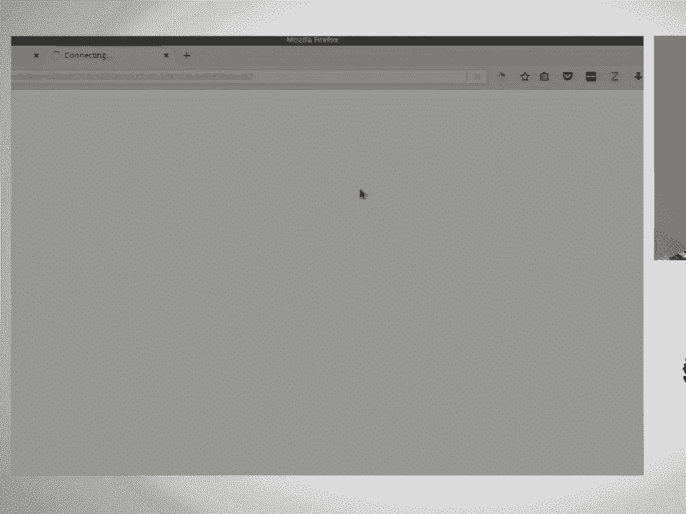
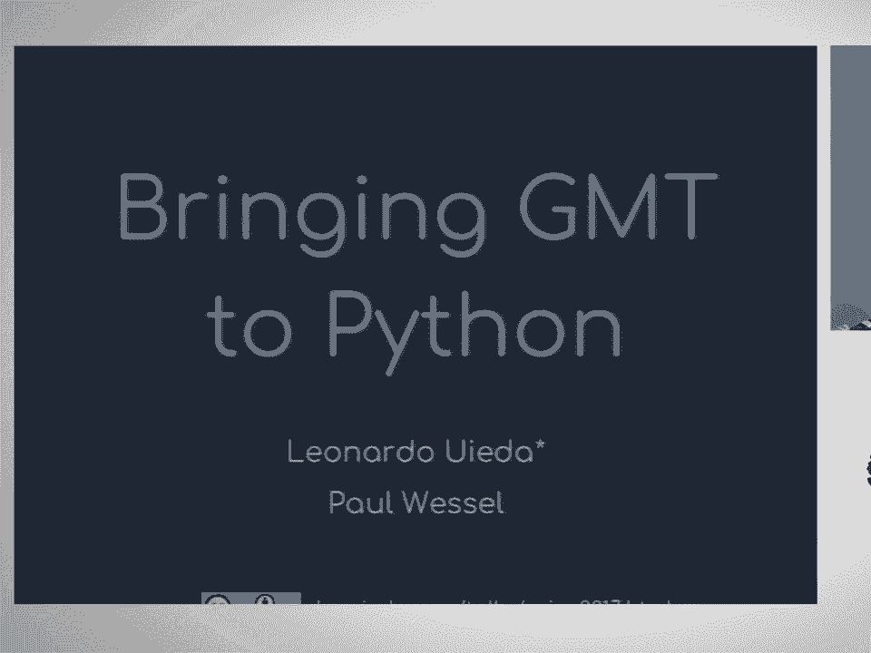
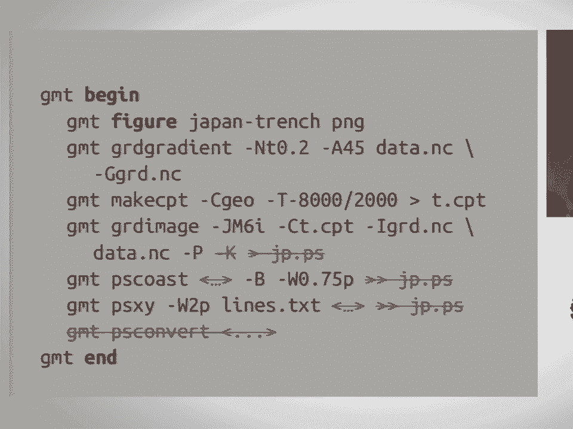
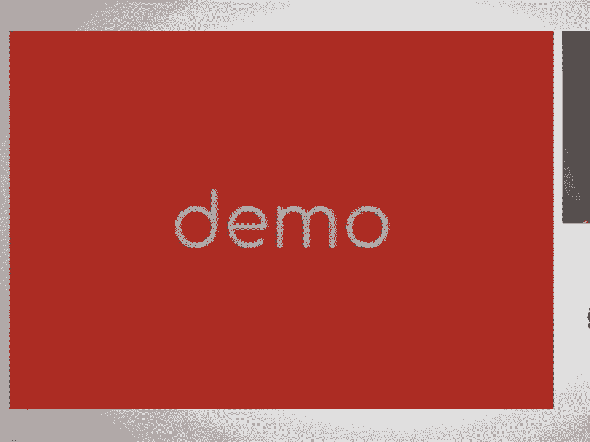
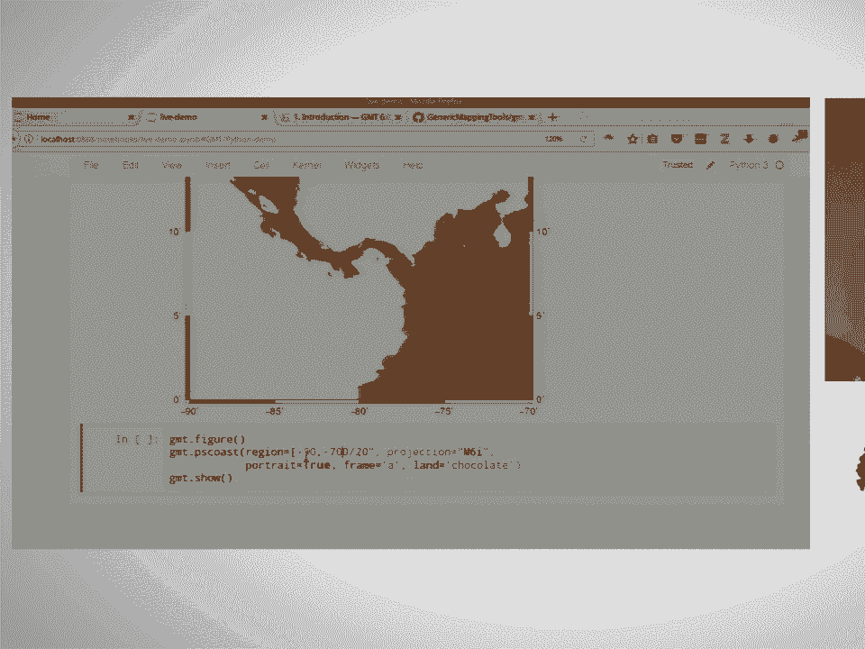
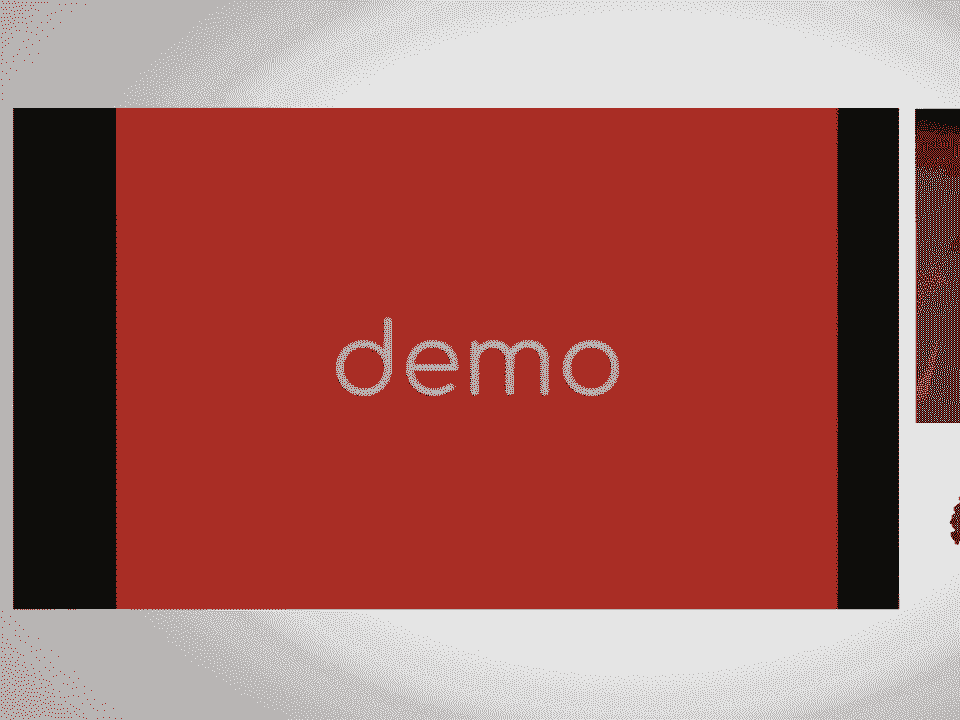
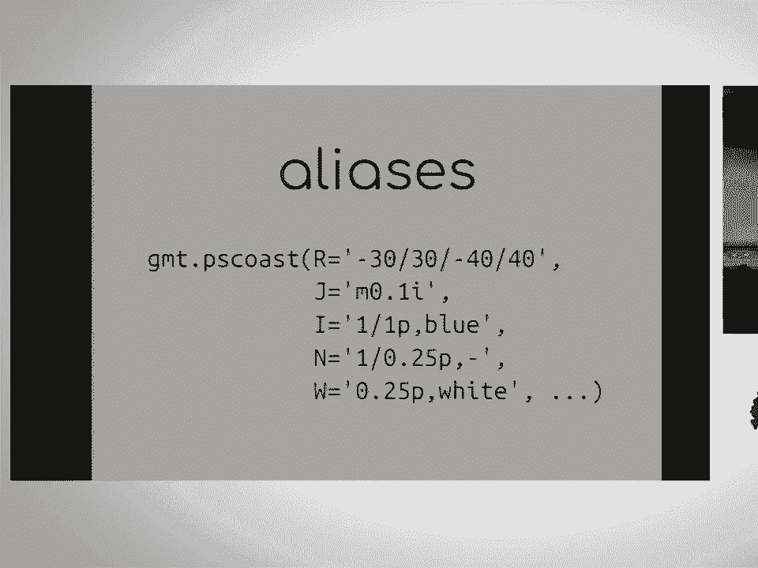

# P34：Bringing the Generic Mapping Tools to Python  SciPy 2017  Leonardo Uieda & Paul - 哒哒哒儿尔 - BV1Cs411A76Y

 >> Good morning， everyone。 Thank you for coming。 Today I'm going to be talking about a project。

 I've been working on with Professor Paul Vessel from the University of Hawaii。 And we're building。

 Python wrappers for the generic mapping tools or GMT。 The talk， all the slides and the code。

 that I'm going to be showing， sorry， is on the link below。 I don't know if you can see。

 I think it's cut out， but I tweeted a link and there's going to be another one at the。

 end of the talk。 First of all， I would like to say thank you to all the organizers and。

 the reviewers of the abstracts for doing a phenomenal job。 The reviews were very friendly。

 It was a very nice break from traditional academic review。 So first of all， just a show of hands。

 who here uses GMT or has used it once at least。 And how many people know what it is？ Okay， not。

 too bad。 So for those of you who don't know what it is or have never used it， GMT is a。

 collection of C command line programs。 They are used to process spatial data。 So things。

 like earthquake， epicenters， bathymetry and all sorts of stuff。 It does math on the sphere。

 so you can calculate things like great circle distances and oil rotations。 But it's mostly。

 known for making very nice maps and beautiful figures like these。 And a little bit of the。

 history of the project， GMT was released。 The first version is from 1988。 So they've been。

 doing it for a very long time。 It's very robust。 And they have an amazing attention to detail。

 So that's why the figures look so good。 A lot of work has been poured into making them， perfect。

 In GMT 5， they introduced a C API which their command line programs use。 And this。

 was done with the intention of building other APIs on top of it， building wrappers for GMT。

 and other languages。 And this was started with the MATLAB wrapper using the max MATLAB C， interface。

 And there's also a Julia wrapper done by Joaquin who is one of the main developers。

 His code is on GitHub。 If you're a Julia user， you might be interested in checking that out。

 And the fact that these two APIs were made before and makes my job so much easier now。

 because they smoothed out all the quirks and segmentation faults and incompatibilities。

 that happened in the C API。 So thank you to Paul and Joaquin for doing that and makes。

 my job so much easier now。 And before I start， I have a bit of a confession to make。 I was。

 not a GMT user。 I used it during my undergrad for a little bit。 But as soon as I started。

 doing Python， the cost of switching between doing something in Python and going back to。

 the command line and writing stuff out to files that are compatible with GMT and remembering。

 all the command line arguments。 That was all a very big shift and I ended up sticking with。

 base map even though it's not ideal。 But it's all in Python and it's simpler。 Right。 So。

 a couple of years ago， I was writing a paper for my PhD thesis and I was making a lot of。

 maps like this one。 So this is a map of the depth of the crust mental interface for South， America。

 And I had to plot a whole bunch of stuff like shape files with the main geologic， provinces。

 plate boundaries and placing everything， making these complex figures。 And I was doing。

 all this in base map。 And what always kept coming back to my mind was， man， I miss GMT。

 This figure would look a lot nicer if it was made in GMT。 So I briefly considered going。

 and doing my own GMT wrapper in Python。 I thought it might be possible。 I had heard that they。

 had introduced an API。 So I figured how hard could it be。 But then I decided to not do that。

 and just finish my PhD。 But apparently some people did not reach that conclusion and I。

 could find on GitHub at least three GMT Python wrappers。 There's GMT Pi。 There's lower case。

 Pi GMT and there's also upper case Pi GMT。 Of these， GMT Pi has a lot of， has had the most。

 development。 But it's been inactive since 2014， I think。 And all of them besides lower case， Pi GMT。

 they use system calls to run the command line programs and to get values in and out。

 of Python they are piping stuff through a process pipe。 So that's not ideal。 They're not using。

 the API that was developed for this purpose。 And Pi GMT is hooking into the C API but they're。

 doing it。 Ian Rose was doing it by writing a hand coded Python C extension。 And if anyone。

 has ever tried to do that， you know how painful it is。 And if you have ever tried to distribute。

 a Python package with compile dependencies to multiple platforms， you know the kind of。

 pain I'm talking about。 So I was very pleased when in July， I think of last year， I got an。

 email through a mailing list from Paul advertising a paid position and NSF funded postdoc position。

 to build official GMT Python wrappers。 And as a bonus， it's in Hawaii。 So， yeah， I figured， why not。

 you know， I'll finish my PhD， want to do something different。 So I applied and， thankfully。

 I think probably no one else applied because I got the position。 Even though I stated。

 on my application that I was not really a big GMT user but， okay， I prefer to think that。

 there were hundreds of people applying and they chose me but that's probably not the， case。

 So then a couple of months later in February this year， I went to Hawaii and now。

 I'm there working on this wrapper and what I'm going to show you today is what we have。

 done so far and what we have planned for the future。 And also how you guys can help because。

 we need a lot of help。 So first the goals for the project。 First of all， we want to use the。

 C API to do these wrappers。 No system calls， no processes and no redirection。 We want the。

 interface to be Pythonic。 So want to， the library should look and feel like it's Python。

 We don't want it to look like you're writing command line programs in Python。 We also wanted。

 to integrate with a side-py stack。 So getting values in and out of NumPy arrays or Net CDF。

 grids that you loaded through X array or through Net CDF， the Net CDF wrapper itself。 And also。

 we wanted to be modern。 So we're thinking of the future and building this new library。

 We don't really care that much about packer compatibility and we're going to show you。

 the reason why。 So we decided to make this Python 3 only。 So we support Python 3。5。 We。

 didn't even need to sign the Python 3 pledge because we don't have Python 2 code。 So it。

 works on Python 3。5 and 3。6。 And it will also depend on the upcoming GMT 6 release。 There's。

 still a lot of work being done in GMT 6。 And I'm going to show you some of what the changes。

 that are being made。 And the main change that's happening on the GMT side is something that's。

 called the modern execution mode。 And to show an example of what that looks like， let's say。

 that I have some bathymetry data and a few profiles that I need to plot。 So I have the。

 coordinates of these profiles。 And this is along the subduction zone outside of Japan， right？

 The piece of land there is Japan。 So if you want to make this plot in classical， GMT。

 you would write a bash script that looks like this。 So the main components here are。

 the GMT modules。 So you're using GRD gradient to compute an intensity grid that's going。

 to be used for the hill shading。 You're making a color palette table which is used for the。

 color bar and for assigning colors to the image， plotting the image， doing PS codes to。

 plot the coastlines。 And PSXY will plot the actual profiles that are shown on the figure。

 And you also need to call PS convert if you want something that's not postscript。 If you。

 want a PDF or a PNG or a JPEG， you need to end this with a PS convert call。 And another。

 thing you'll notice is that when GMT is building a figure， it's basically writing out postscript。

 code。 And each module writes a bit of postscript and we are pending that postscript into a。

 file that then gets converted by PS convert。 So this would be very painful to work like。

 this on the command or， sorry， from Python。 And this is something that trips new users。

 It's very difficult to explain to someone who doesn't know what postscript is or has。

 never used command line programs。 So you need to teach them about redirecting and you have。

 to redirect in the right order。 And there are these minus O and minus K arguments that。

 if you don't put them in the right order in the right programs， your postscript is going。

 to be corrupted。 It's not going to be finished properly。 It's not going to work。 So what。

 modern mode does is transforms this code into something that looks like this。 So first， of all。

 modern mode introduces three new commands。 The first one is begin and GMT end which begin。

 a modern mode session and then finalize it。 So if you don't put your commands inside a。

 beginning end， if you don't surround them by beginning end， it'll just be run like classical， GMT。

 So with this， we get backward compatibility。 People's scripts won't break when they upgrade， GMT。

 But if you want to use all the new features， you can put GMT beginning end。 And another new。

 command is GMT figure which starts a new postscript figure。 In this case， we're going to call。

 it Japan-tranch and we want the output to be a PNG。 And then you do the module calls which。

 are pretty much the same。 So geo-degradient， make the color pallet table， plot the image。

 plot the coastlines and plot the profiles。 One thing you'll also notice is that there's。

 no postscript redirection anymore。 So this is all done by GMT under the hood。 It works。

 in a temporary directory and it starts -- it builds a postscript in that temporary directory。

 for you。 You don't need to know what you're doing。 Well， you kind of need to know what。

 you're doing， right？ But you don't need to worry about redirecting and what order you're。

 redirecting it in。 If you're starting a new file or if you're appending， if some -- for。

 some reason you forget to append， the plot is going to be -- it's going to be missing。

 some features and it's hard to figure out what's going on。 And because we don't -- and。

 because GMT is building the postscript in the background for you， you don't need PS convert。

 anymore。 This is called by GMT and so when you end the session， GMT will get all the hidden。

 figures， will convert them to the output you want and they'll put them in the work in directory。

 for you。 And you also don't need those minus O minus K arguments， which always trips up， new users。

 So this is much easier to use and it's much easier to build a Python wrapper， around this， right？

 When you're writing maplib code， you're not thinking about the figure， file。

 You're just writing some code and you want to see it on the notebook。 If you want， a file。

 you explicitly say， I'll save this to a file。 But maplib builds the figure in。

 the background for you and this way GMT also does that for you now。 So before I tell you。

 about the wrapper， I wanted to show a demo of what we have implemented right now and then。

 I'll go into how we're doing this and what goes on in the background。 So hopefully fingers， crossed。

 everything works。 How is the font size？ Can everyone see？ >> The blue paper is better。 >> Yeah。

 Okay。 So for this demo， I'm going to try to reproduce， some of the examples in the GMT tutorial。

 So the few comments that already work。 So we're， going to start in the bottom。 Okay。

 The first map they show is a call to PS Coast。 So this。

 plots coastlines and it colors in the land masses or the oceans depending on what you， want。

 So if we get this command line and let's copy it over to my demo。 So the first code。

 that we're going to wrap is going to be this GMTPS Coast。 So the first thing I need to do。

 is import the GMT library which is the Python wrapper。 So I'm going to import GMT。 And what。

 this does is it calls begin for you。 So you don't need to call from Python， you don't。

 need to call begin and end every time。 So whenever you're working with the Python wrapper。

 you're working inside a modern mode session。 So we're working basically on modern mode where。

 might support classic GMT later on but that's not our goal right now。 So once you import， this。

 as I was saying， GMT will create in the temp folder， it will create a GMT temporary。

 directory where it's doing all its work。 And when you close your Python session or restart。

 the notebook or something， GMT will clean out that folder as well， ending your session。

 So if you call it twice or if you're running two different programs， they'll be working。

 in separate directories， your plots are not going to get mixed up。 So now that I have。

 my GMT library in a modern mode session， I can create a new figure with GMT figure。 And。

 what this does is just tells GMT to every command from now on， put this in the same figure。

 And you'll notice that we don't specify output types because we don't really want an output。

 right now。 For now， we just want to build a post script in the background and when I want。

 to see the plot， I'll tell GMT Python that I want to plot now and it'll get the figure， for me。

 Okay， so then the plotting command that we're using is GMTPS coast。 So GMT Python。

 exposes all GMT modules as functions in the GMT library。 So I can call GMTPS coast。 And we。

 can have a look at the documentation。 So a lot of this is copied from the GMT docs with。

 a few modifications。 So you have a link to the corresponding GMT doc page and all the arguments。

 that you can get。 And these functions accept arguments named after the command line arguments。

 So you can basically copy this and translate this shell command into what a Python function。

 would expect。 So instead of having minus R， we'll just have R equals a string。 And we。

 can have J which sets the projection equal to another string。 Whenever there's a standalone。

 argument， you can't give Python just a standalone option。 So we provide the true value。 And for。

 B which sets the borders around the map。 And G sets the colors of the continents and we're。

 going to use chocolate。 And these kinds of color names are a reason by themselves to use， GMT。

 They have very interesting color names。 So once you call this， you'll notice that nothing。

 happens in the notebook。 And that's because I didn't ask for a figure yet。 So if you want。

 to see the figure in the notebook， you can call GMT dot show。 And this will insert that。

 figure in the notebook。 Thank you。 So this is pretty much the same figure from the tutorial。

 But remember that I said that we want the interface to be Pythonic。 And having capital。

 letters and single letters for arguments， that's not very Pythonic。 Python we like to。

 write out very long variable names。 Long and explicit is best。 So we allow， we have implemented。

 aliases for these command line options。 So you can specify either the command line arguments。

 if you're just translating a script and you want to test something out。 But if you want。

 to write more readable code， you have that option。 So if you look at the help of GMTPS， first。

 you'll see that we list here all the available aliases。 So instead of giving it， R。

 I can say region。 Instead of giving it minus P， I can say I want this to be a portrait， plot。

 Instead of giving minus J， I can say projection。 So we can write the same code here。 I'll copy over。

 So I'll start a new figure now。 And I can translate these into more readable， things。

 So like I can say region equals this。 The projection。 I want this to be a portrait， plot。

 I want the frame to be chosen automatically。 And I want the land masses to be colored chocolate。

 So GMT show。 And this works the same way。 So I get the exact same plot。 And these aliases， can。

 we're still debating on the best names for each one of them。 Sometimes it's a bit。

 hard because the same option in GMT does slightly different things。

 So finding a name that describes， all of the possibilities is a bit difficult。

 And this also helps because if you're writing， a command line app and you're having single character arguments。

 there's only so many， characters before you have to go into Unicode and you don't want emoji command line arguments。

 So one of the problems is that there are so many GMT modules that it's very hard for them。

 to not reuse letters。 So for some plots， A refers to， for example， for PS convert， A refers。

 to cropping the plot。 And but here A refers to the minimum area threshold of the features。

 that you want to show。 So having the long form names makes it a lot easier to understand if。

 you don't remember all the command line arguments。 And another thing that's not very Pythonic。

 is specifying every single argument as a string。 So what we allow as well is to have standard。

 conversions for a few things。 So for example， if you want to specify the region for a plot。 Oh。

 sorry。 Okay。 So that was， okay。 So just to finish up， the region you can specify it。

 as a list and we'll automatically convert that。 And just a final message so that I can end。

 this。 Okay。 So you can look at all the details of the implementation later on。 So we need。

 your help。 Right。 There are over 60 modules in GMT。 So one thing you can do is wrap a module。

 Right。 Wrap your module is basically copying the docs from the GMT into a function doc， string。

 You need to define the aliases you want and copy over some of the tests。 Right。

 I have a hacked version of PyTest MPL。 So you can test all the GMT plots。 And we need。

 help with the conda package。 The GMT conda package。 Right now it only builds for Linux。

 So it's very hard to get somebody using and building GMT trunk by themselves。 It's not。

 very easy to do。 So if you know how to build conda packages in MacOS and windows， that。

 would be very， very much wanted。 And also what do you think？ We don't care about backward。

 compatibility anymore。 So what do you want to see in this library？ Now is the time to。

 make changes to GMT itself and also to the Python wrapper。 So we can make this however。

 the community wants。 And thank you。 The slides are up there。

 All right。 We can have a question or two maybe while we're transitioning to the next， talk。 No。

 it's all C types。 So there's no compiled code for this。 All right。 Question over here。 Yes。

 So I've got a question。 It's been years since I， used GMT。 But how do you specify projections？

 Do you use EPSG codes？ No。 They have their own projections format。 That's what I thought。

 So that would be a great， feature to actually do because so many people actually understand those。

 And congratulations。 Congratulations。 This is an incredible accomplishment。 Thank you。 Okay。

 [BLANK_AUDIO]。