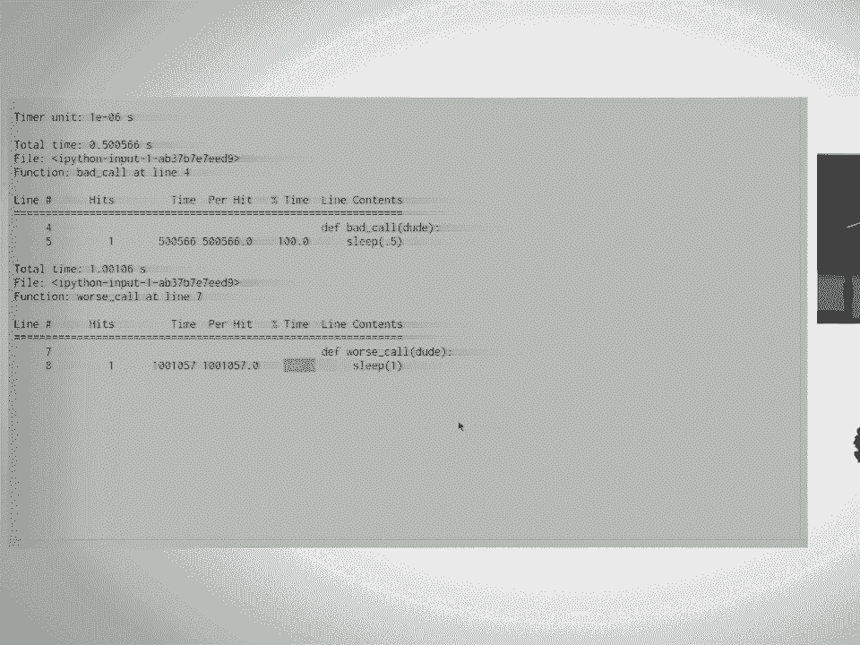
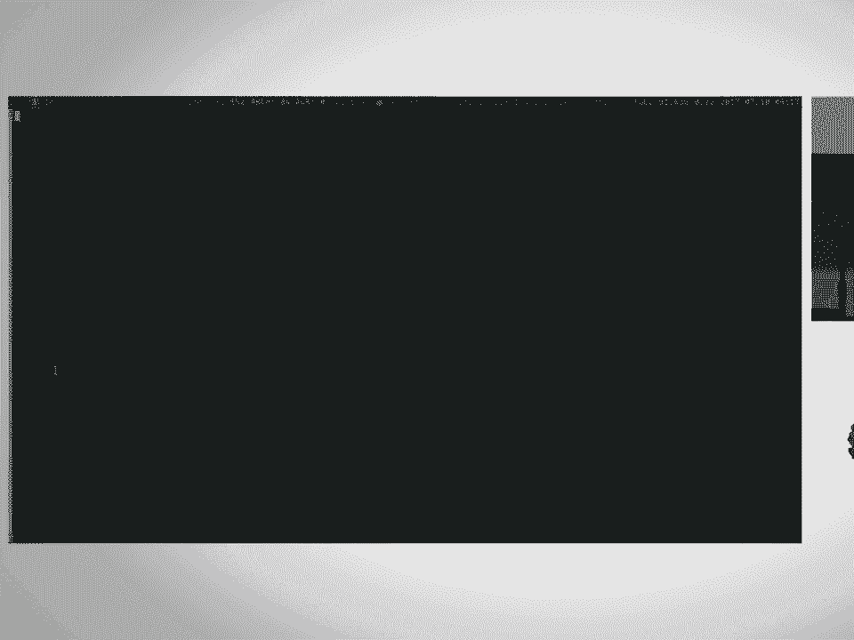
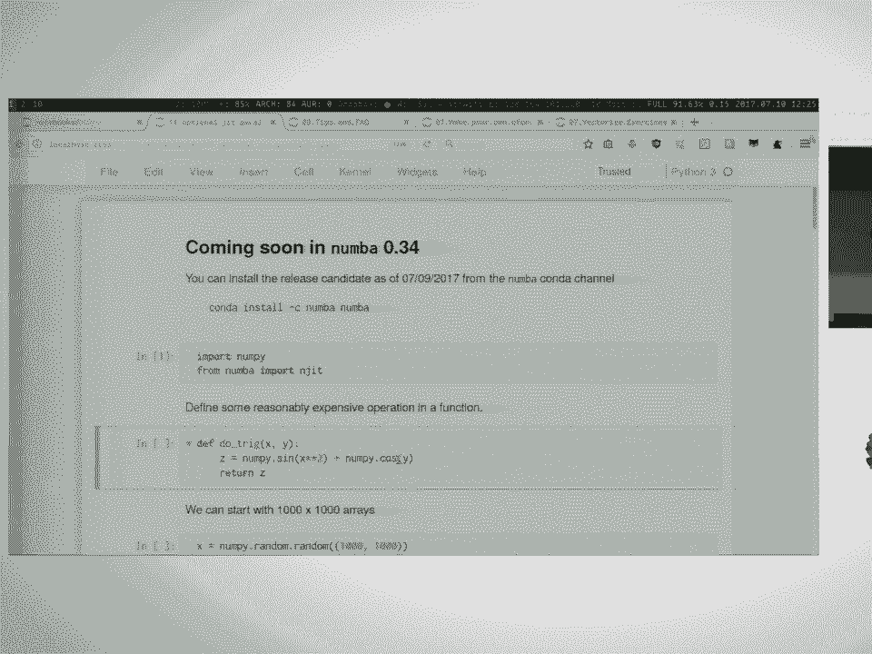

# P7：Numba - Tell Those C++ Bullies to Get Lost  SciPy 2017 Tutorial  Gil Forsyth & L - 哒哒哒儿尔 - BV1Cs411A76Y

 So， I'm Gil。 Hi。 That's Professor Barba。 I am a graduate student at George Washington University。

 sorry， the George Washington University， in Washington， D。C。

 They get angry at us if we don't use the V。 Welcome。 And we're here today to learn about number。

 Has anybody here ever used number before？ Show hands。 Okay。 A few people。 Awesome。

 But mostly new to it。 That's good because。 Yeah， please feel free to help out and that's never a problem。

 So if you haven't done this already， start right now。

 And you may catch the second half of the tutorial。

 It does take a little while to download all this stuff。 So to do that， for sure。

 When I write teaching notebooks， especially， I am very explicit in my imports。

 For anybody with as much muscle memory as we usually have， this can be confusing。 I'm kind of sorry。

 but I'm not。 I think that this is better for teaching。 So just be aware， if you type np。

 you're going to have to rewrite all the imports at the， top of the notebook， which is， you know。

 you're prerogative， but just warning you。 So what is number？ Number is a JIT compiler for Python。

 I can just read bullet points。 So it uses LLVM to compile down to something that's pretty fast。

 a nice optimized machine， code。 And it is well integrated with the rest of the sort of scientific Python stack and it's。

 really fast most of the time。 It's an incredibly useful tool。

 It's important to note that number is not all like PiPy， a full JIT replacement for everything。

 It doesn't JIT like your entire code unless you tell it to。

 It's more on a function by function basis。 So the idea here is that it's really targeted at really at math。

 right？ It's not just going to， you know， it's not going to make your dictionary look up faster。

 or anything。 It makes your math code faster。 On top of this， because of the way LLVM works。

 it will do better or worse depending on your， computer。

 So the number of cores you have will come into play a little bit later。 I mean。

 just be aware that timings and differences will be manifold。

 Also depending on sort of what instruction sets your CPU has available， it has SSE-3， SSE-4。

 all that stuff。 LLVM will take advantage of as many of those things as it can。

 If you didn't understand it， word I just said don't worry。 That's fine。

 You know that you'll see between you and your neighbor even on the same machine depending。

 on if you have the slack client eating three gigs of your RAM right now。

 You will see some slight differences in performance and that's normal。

 What you want to see is an improvement over your vanilla Python performance。 If you don't see that。

 raise your hand and we'll take a look at it。 Do as I say， not as I do。

 you really want to write tests， especially when you're going。

 to be using number or really any kind of high-performance tweaking code generation anything。

 especially with number as we'll see when you have errors in a function you've written。

 The traceback is going to be inside of number which is not going to help you at all。 I mean。

 they've gotten much better at trying to track down exactly what line of the code。

 you wrote is maybe causing a problem but it's not perfect。

 So I mean just generally always write tests。 That's a really good thing to do。 Yeah。

 This is going to be， we're going to do some very un-pythonic things。

 Especially after you've spent all these years learning how to write nice array operations。

 and non-pil we're going to undo a lot of that and it might feel really strange。 Yeah， that's all。

 Okay， so having said that， I will attempt to exit this。 Cool。 Oh， right。

 In read the title of this tutorial。 If you like C++， that's great。 You're more than welcome here。

 There's no problem with that。 C++ is incredibly powerful。 I suck at C++。 So， you know。

 just put that out there。 I think it's devilishly difficult and really easy to get things wrong。

 What I specifically mean about this is that a lot of us， well we're here， we write code， and Python。

 We write something， we prototype something， it's awesome but now that it's time to actually。

 make it run for real， now you have to go write expensive parts in C++ or in Fortran or whatever。

 And what I'm hoping to show you is that that is no longer the case。

 So my prototypical C++ bully is the person who turns their nose at Batchu and says， "Oh。

 you're never going to get much performance out of that。"， So forget that。 So those are the bullies。

 Everyone else， welcome。 We're happy to have you。 Okay。

 so if everyone would like to go to a notebooks folder and we're going to open this。

 first notebook here when we're to use number， people probably can't read that very well， can they？

 Okay， so to begin number， we're not going to look at number at all。

 We're going to start with profiling。 Who here has ever used a profiler in Python？ Okay， cool。

 So the idea here is that you need to actually know what's slow in your code to speed it， up。

 You want to waste your time trying to， like， tweak， you know， if you squeeze all this performance。

 out of something that ends up， it was only taking like a microsecond anyway， like you。

 just wasted a bunch of your time。 So the idea is you need to know what is running slow before you get started with trying to。

 optimize your code。 You need to know what to optimize。 And so that's where profiling comes in。

 All right， so we're going to look at three tools。 There are many others。

 This is just sort of a bare bones introduction。 So they are C-profile， line profiler， and time it。

 Time it is built into Python and also the notebooks and as a C-profile， line profiler。

 hopefully you've installed。 If not， you can do one of these two things。

 Can everybody read this okay？ Can anybody not read this？ And I guess you have it in front of you。

 but still。 All right。 All right。 So I'm going to hide this thing here。 Do you need some help？

 I'm happy to walk and over and help at this point if you--， Yeah。

 please raise your hands if you have questions。 Feel free to interrupt me as well。

 I've been looking around and kept my eye a little bit further over。 Okay。

 So here is some really horrible code that I wrote。 It's not the worst code ever written。

 but it's close。 So I have three functions。 The first function just sleeps for half a second。

 The second function sleeps for a full second。 It is not very performant。

 The third function is called "sumulate，" which isn't a word。

 It performs a thousand by thousand matrix multiply for no reason and just discards the。

 return value of that。 And then it iterates over a number for no reason and sums all the integers。

 And then it calls two functions that sleep and then it returns。

 So you can probably look at this and gather。 There are a couple of bottlenecks in this。

 This is a situation where you might not need to use profiling just because you can spot， it。

 but for the interest of demonstration。 So if we run this and I want to sum the first 150 integers。

 that should be faster than it， is。 I think we know why， but let's dig a little deeper。

 So if we're going to use C profile， that is the built-in Python profiler， it gives you。

 a sort of a function by function breakdown of how many times each function was called。

 and the amount of time it took each time it was called and then the cumulative additions。

 that it made to the total runtime of your program。

 So you just import C profile and then you pass it sort of like an eval string effectively。

 here of what you want to run。 And then thanks to the Jupyter folks。

 we get a nice inline response here。 And you can see there's a bunch of stuff happening here。

 This is also made slightly more confusing when in the notebook because some of the code。

 it's referring to are going to be IPython cells， which makes it a little junkier to look， at。

 But the thing you really want to notice is that there's sort of you have this end calls， column。

 so that's the number of times each function or method or whatever was called。

 And the total time that was taken by those number of calls on that function or method。

 and then it gives you a per-call breakdown and how it contributes to the cumulative time。

 So looking at this， we can actually see that， I mean， the culprit is right here， right？

 This is what's taking the vast majority of the time， which is， you know， to be expected。

 So I wanted to mention， yeah， if you have a bigger program， C-profile can be hard to。

 if you're going like a really large program， it can be hard just to like read through it， all。

 Snakeviz， which I'm not going to show you right now， is a really cool tool for visualizing。

 that in the browser。 So highly recommended if you want to profile larger things。

 So C-profile gives you this function by function breakdown， but sometimes you have a function。

 that is slow， but you don't know what parts of it are slow。 I mean。

 most of our functions aren't one line long like they are in this case。 So in that case。

 we want to look at line profiler。 So you can start in the notebook。

 You need to load the extension here to make it available to the notebook。

 So that's just run this line。 Cute。 One second。 Right。 Yeah， nice little live demo here。 All right。

 So everybody have any questions？ [inaudible]， No。 Not at all。 Hey， okay。 We're back。 Okay。

 So once you've actually installed line profiler and followed your own instructions to the T。

 then you can profile a function this way。 So the syntax is you have the LP run magic。

 which is made available when you load the extension。 And then each time you give a dash F call here。

 those are the functions you want to profile。 So I want to profile bad call and worst call。

 And then you give it something that will trigger those functions that will cause those functions。

 to be run。 You have to run it to actually profile it。

 So I'm not actually profiling some you late here。 I'm only profiling these two functions that are sort of called by some you late。

 So you run that and then you get this hard to read on this projector。

 I'll open it in a separate window。 It's too small。 And so this is the sort of thing you get。 I mean。

 this is a silly example because there's only one line in each of these functions。

 But the idea is that for each function， so for bad call here and for worst call here。

 it will go line by line through the function。 It will show you how many times each line was hit。

 how much time that took， the percentage， of time that took。 In this case。

 we're pretty sure we've narrowed down which lines in each of these functions。

 are causing us trouble。 Right。

 Yes。 Great question。 So some things you can do。 You can also instead of doing that。

 you can write it out to a text file。 We can also do that thing too。

 So if you give it a dash t and you run that， then， no， right， it will also open this up， annoyingly。

 But then you do have， so you can write it out to a text file if you want to save it。

 There's also a dash q flag which I think I have a little further down which will quiet。

 that screen output。 Right。 Okay。 And the other thing you can do， so this is in the notebook。

 But most of the times， especially if we're profiling， we're probably not in the notebook。

 Or it might be。 I mean， you work however you want to work。

 But in that instance， actually this is not the right way to do this。 Cool。 All right。 Okay。

 I'm going to come back to this at one of the breaks because I'm missing a file for some， reason。

 Not a huge deal。 Okay。 And then finally， we have time it。 Time it is not perfect at all。

 But it is helpful and it's a good way just to kind of get a rough feel for how your code。

 is performing。 Especially if you're making big changes like you might be with number。

 kind of see how， you're stepping through。 It， I think this is actually different now。

 But generally it only runs the benchmark three times， it's a garbage collection。

 So there are things that it might not be accurately representing sort of how your code is running。

 I don't have a huge problem with that。 Victor Stinner though has written the module perf。

 which you can use instead， which kind， of lays many of those concerns。

 So you can look at that as you see fit。 You can use time it as a line magic where everything has to be on the same line。

 And it will run this many， many， many times。 And then sort of give you the best results of that。

 So sorry， average with standard deviation。 You can run it as a cell magic。

 which means then everything in that cell will be profiled。 And again。

 you get the sort of the mean run and then the standard deviation from that。

 And there are also a number of flags。 You can pass to time it to quiet output and to shunt the output of it into a variable。

 which is handy if you want to compare performances without just like either copying and pasting。

 or typing in the numbers that you got。 This used to disagree with OS X。 So if it yells at you。

 you can just remove the Q flag。 But once that works。

 then you have this A variable and you can access these are sort of。

 the all the runs that were there。 And you can look at the best run and the worst run。

 And so this is sort of how you can compare results。 Anybody have any questions about that right now？

 Okay， cool。 Oh， question。 No philosophical comment。

 This step some of them come rush to try to optimize things， but actually understanding your code。

 This is the most important step because you don't want to waste your time。

 So many times you see people going to optimize something without really understanding what。

 needs to be optimized。 And so first， understand your code before trying to do anything。 First。

 know where the hotspots are and then you make a judgment where it's worth your。

 time to actually work to transform your code such a way that you can get some speed out， of it。

 So this is really the most important step。 You cannot skip it。 Yeah。 It's not the fun step。

 I'll point that out， but it's really important。 And now we've done it。

 So now we can go on to the fun stuff。 Okay。 So if there are no questions there。

 we can go and we'll open this intro to JIT notebook。 Okay。

 So now that we understand profiling a little bit， we know how to find hotspots and so now。

 we need to figure out how to improve their performance。 Yeah。 Also， sorry。

 I will continue to talk faster and faster unless someone stops me。

 So if it becomes completely unintelligible， just tell me。 That's fine。 Thanks。 Okay。

 So this is here。 This first function is sort of a naive function to sum all of the elements of the production。

 sum of all the elements in an array。 You would not do this if you know that NumPy exists。

 It's not the right way to do it， but we're doing it anyway。

 So we get the dimensions of the input array。 We initialize a variable to kind of hold the cumulative sum and then we iterate over every。

 element adding it onto that and then we return the total sum。 Makes sense。 Okay。

 Then we're going to import NumPy and just start with a 300 by 300 array and we'll try， it out。

 If you got the same sum as I did， I think that means that the world just ended。

 And then we can just use time it to see about how long that took for this 300 by 300 array。 Okay。

 So we got 13。7 milliseconds。 So not bad。 I mean， I was faster than I could do it。 And notice here。

 so I'm also saving the results in this variable plane here， but I don't use。

 the Q flag so I still get it printed to screen。 This is just so I can compare later。 It's happening。

 All right。 So now that we've got this code we want to see if we can speed up， we're going to import。

 JIT from NumPy。 So from NumPy import JIT。 And there are a few ways to use JIT just in terms of how you apply it to functions。

 Okay。 The sort of the less common way but good to know about or just sort of less natural way。

 is to use it as a function call。 So here I'm calling it on summary。

 There's this weird double parentheses thing which I'll get to in a second。

 So what I'm doing is I'm calling JIT on summary and I want the result of the JITing to be returned。

 into a function called summary number。 And the reason that generally you want to do this when you are experimenting is that -- sorry。

 I'll come back to that。 Let's just see how this performs now。 So we run summary number now。

 We get -- I'm pretty sure the same answer -- 2776。 Great。 So that's good。 First test passed。

 And then we can see what the performance is like。 Time it is sometimes a little counterintuitive in that it runs fast things so many more times。

 It seems like it takes longer and makes you nervous when you're presenting。

 But we can see that that actually took 74 microseconds。

 So if we take the sort of the difference of the best times from our sort of vanilla sum。

 and the JITed one， that's 180 times speed up。 That's for one line of code。 So this is -- I mean。

 again， this is a simple example but this is the sort of thing that， number is very， very good at。

 And so this is -- you're not always going to get a 180 times speed up but this is sort。

 of the kind of power that's accessible here。 And this is why we don't need C++ anymore。

 The more common way and certainly the prettier way when you're -- when you've decided to use。

 JIT on something is to use it as a decorator。 And it's -- since it's a decorator that takes arguments。

 it's why it's the extra parentheses， thing。 And we'll come back to it。

 So you can just add the @ decorator on top of your function definition。

 Is anyone familiar -- is anybody not familiar with decorators？ It's fine if you aren't。 Cool。

 So just really quickly， a decorator is a special Python function that has been written。

 Effectively what it does is it -- you pass the function as an argument to the decorator， function。

 It does something either before after calling that function and then saves it into the original。

 function name。 So really all it's doing is it's doing what I did up here， this summary number。

 JIT summary， but it's just saying summary equals something， something， something， summary。

 So it's not -- it's overriding the original -- or it's just renaming the original function。

 so you no longer have access to it。 It's just a way to tweak things in this case。

 It's a way to transform what functions do。 Yeah。 >> The first example you gave。

 you're running it as @ runtime。 This one you're running it up out。 >> I will come to that。

 Very shortly， too。 So as -- in the decorator form， you just add the @ JIT on top。 You run that。

 And again， we get the same answer and we should hopefully have very similar performance。 So again。

 about 74 microseconds， give or take。 You might be wondering how this compares to NumPy。

 which would have been the thing to， do。 NumPy is faster。 It shouldn't be a surprise。

 But I'll point out it's only two times faster， give or take， which is pretty good。 I mean。

 NumPy is -- NumPy is first up really well developed， highly optimized， calling， you know。

 Fortran and C and still like we're， you know， about half as fast。 That's really not bad。 Okay。

 When does NumPy compile things？ This is to that question。

 It actually compiles it the first time you run the function。 So here。

 when I define -- when I define it using the decorator and then I run that， the。

 NumPy hasn't done anything yet。 It's just primed to compile it the first time that function gets called。

 Similarly up here， the summary NumPy isn't actually going to do any compilation until。

 the first time you call that。 So for bigger and heftier bits of code。

 you might see -- you'll see like time it will， sometimes throw a warning or something similar that one of these runs was x times slower。

 than all the others。 And that's usually just due to the overhead of that initial compilation step。

 It tends to be pretty negligible。 And there are also other things which we'll look at in a little while that kind of remove。

 that from your execution pipeline。 But just be aware that， yeah。

 it's not actually compiled until you actually call the function， at least once。 Okay。

 Are there any questions about what I've shown you so far？ Okay。 So with that then。

 we will have our first exercise。 So you can click on the "Your Turn" link。

 So this is just to generate a Mandelbrot fractal because who doesn't like those？

 There are two functions here。 There is Mandel and create fractal。

 The code in this next block here -- this is what will actually run that。

 I left it commented because if you run this before you use number， it takes a really long， time。

 So that's just to kind of stop you from having to kill your kernel and start over。

 But so I'll give you guys about five minutes on this。

 So all you want to do is you want to use what you've learned about numbers so far to try。

 to accelerate either or both of the functions in this cell here， Mandel and create fractal。

 And then you can see how it runs and then hopefully get a pretty picture。 Okay。 Okay。

 So hopefully everyone's about finished。 >> Only half。 >> One more minute。

 >> How did you add the code collapse？ >> That's one of those NB extensions。

 I think it's called code collapse or something like that。 In the readme for the tutorial。

 there's a kind of -- it's got a name that I can never -- it's。

 like Jupiter underscore something NB extensions。 >> Yeah。 >> I'll get you to the channel。 Okay。

 >> All right。 So we got a third one to be finished。 And it gets time to give them yes。 >> All right。

 So hopefully you guys all have a pretty picture in front of you。 But yeah。 So to solve this。

 I'm going to do a live coding demo。 Ta-da。 Thank you。 Thank you。 Thank you。 Yeah。

 So it really is -- you know， you just jit both of those and you get a pretty picture。

 And in terms --， >> And how much faster is it if --， >> So on -- so yeah。

 So I'm running -- this is actually all happening on my lab machine in DC because my laptop is。

 older。 So this is on a six core， like a recent i7。 It takes about 15 seconds to do this。

 And without the jit and about 43 milliseconds。 So again， reasonable。 It's not too bad。 Okay。

 >> So how do you do that in other ways without the decorators？ >> Without the decorators。

 So if you -- oh， god。 Okay。 It's really creepy。 So if these aren't here。

 then what I would do is I would call here I would say like a。

 mandal jit equals jit of mandal and then create fractal -- oh， I got it。

 This is a little more involved than I was expecting actually because one of the functions is calling。

 the other， I need to also change it in here。 So -- but it would just -- I mean。

 if you were going to rewrite it like that， you would just。

 assign them into different names basically。 And then you can run those instead if you wanted to compare the performance of the two。

 >> Decorators are much easier to use。 >> Decorators are much easier to use。 Yeah。

 >> Decorators are definitely what you're going to want to be using most of the time。

 The only time really that you wouldn't use it is when you want to have like a direct comparison。

 between the before and after without doing a lot of copy and pasting。 What on earth is happening？

 So this is pretty cool。 And sometimes we just want to like， you know。

 trust that it's magic but that's usually not， a good idea。

 So just for the purposes of exploring what numba is doing， we're going to define a very。

 trivial function here where we're just going to add two numbers and return them。 We're sorry。

 add two variables， a and v。 And then we're just going to run it once because we actually need to run it to compile it。

 And then we've done that。 We get back to。 It's great。

 Once you have run the number -- the number compiled function once， then you will have。

 this method available called inspects types。 And you can run。

 And this is sort of the typing information。 What number -- one of the things that number does is it tries to infer the type of the inputs。

 and the outputs and by adding types。 It becomes faster and it's one of the things that has to feed into LLVM to actually get。

 it to compile。 And so you can see there's going to be a bunch of random stuff in here but the sort of the。

 important thing here is if we see that there is this type in 64， in 64， in 64。

 So I gave it two ints， right？ I gave it one and one and it figured that out。

 And that's sort of a sign that -- I mean， obviously adding two numbers together is never。

 going to take very long but that when you see proper variable types there， that's a sign。

 that things have gone well。 Now what if we call it again but instead of giving it integer ones。

 we give it float ones。 So we just add a dot after them。 We get a 2。0 out so that's a good sign。

 It means it knows that we're dealing with floats and we can call inspect types again。

 And you can see here that actually it says int64 and 64 here and this is actually the。

 same thing we saw before。 We keep going down。 Now there's another one， right？

 And this one says float64， float64。 So what Numba is doing is that it's not going to compile functions for every single variable。

 type preemptively because mostly you don't care。 I mean you don't need all of that right away。

 It will only compile things as it needs them。 There is a caveat here to be aware of if you really want things to be ints or for instance。

 like that。 If I run this first using floats， the first time I run I use floats and then I give it。

 something like an integer， it will not recompile。 It will just cast in the float。

 So if you want all these things to be available， you start with int32s and then you go to int64s。

 and then you go to float32s and you go to float64s and so on and so forth。

 So just be aware that if you give it something that's sort of less precise， I hesitate to。

 use that word。 That will kind of take precedence。 Once you have both of these compiled。

 if you give it to integers， it will give you an integer， back。 It's not going to change that。

 I don't think so。 I think because it was before the type hinting was there。 I think they do， okay。

 ah， things I forgot to say， I don't work for continuum， I have， no affiliation with Numba。

 I really love Numba， I'm a fan of it which is why I like to tell people about it which。

 is why I'm here。 I have looked at the code base， I fixed one error once。

 that sort of limit of my tendos， into it。 I'm pretty sure they do beautiful， horrible。

 introspection of the byte code to pull this， stuff out。 But yeah。

 that part is actually black magic but yeah， we can't。 Alright。

 So what does this actual kind of stuff look like？ I keep saying it's generating code。

 And if you want to check， you can actually call this inspectLVM method and then it's， a dictionary。

 it returns a dictionary so we can look at the keys and the values。

 And this is what the code looks like that it's generating。 And it just keeps on going。 Remember。

 we're adding two things together。 So this is mostly just to impress on you how cool this project is。

 I mean the fact that this is possible。 Yeah。 To be fair。

 that's a double definition right because we did it twice。 But， okay。

 So we've seen it works for ints， it works for floats。 We got those nice like int64。

 float64 markers and we did inspect types。 Everything's working well。 But there is a caveat。

 says the header。 If we do something that seems very natural in Python but doesn't really have kind of a。

 sound mathematical basis like adding strings together， I mean we know in Python we just。

 concatenate them。 But that's not strictly speaking of like a mathematical operation， right？

 So what happens if we do that？ Here I'm just going to keep it separate。

 I'm not using the decorator for reasons that I don't remember。 And what happens if we run this？

 That works。 Great。 Everything's fine。 It turns out that adding strings together is a pure mathematical operation。

 We're fine。 No。 If we now call inspect types on this， you'll see that it's a little bit different。

 So we don't have string or， you know， char or anything。 We have pi object。

 And what's happening here is that this function has been compiled in what's called object mode。

 And this is where things get a little confusing just in terms of terminology but we're going。

 to power through it and everyone's going to understand it or we're not leaving。 No。

 But there are basically two modes that number has to compile functions。

 One is called object mode and that is sort of where everything will work。

 It'll make it work by falling back on to basically the Python object system。

 And it'll work and Python will work with this。 Then there's a thing called--， That's low。

 But potentially very slow。 So like， yeah。 The other option is called no Python mode。 It's-- I mean。

 yeah， the naming is-- yeah。 And what that is is sort of a subset of Python that number knows how to deal with and knows。

 how to make very， very fast。 So specifically things like all mathematical operations。

 almost all of NumPy， there's some， parts of it that I think it still doesn't quite handle but I could be wrong about that。

 But there are things that can't do。 You can't jit a class， for instance。

 And have it in no Python mode。 So these are sort of some restrictions。

 And when you have something in object mode， that's when potentially you could not be getting。

 the sort of performance improvements that you're expecting。

 So especially if there's one thing in your function that is not compatible with no Python， mode。

 then those nested loops that you just relearned how to write because I told you to。

 are going to be nested loops in Python and they're going to be really slow。

 Can you explain it yet another way maybe？ You could look at the microphone。 No， no， no。

 Because it's--， The way I like to think about it is no Python mode。

 if number gets to a point where there's， some-- when it has to fall back to objects that it cannot deal with and optimize。

 it'll， throw an error and say， thank you。 So it gives you a hint when you use no Python mode。

 It simply you want to know when a number is going to fail until you tell it。

 If you fall into this situation where you're getting these pi objects that you're not going。

 to be able to speed up， please tell me。 That's all that--， We haven't gotten there。 Yeah。

 The Python mode I think is going to do。 It throws an error instead of just working but not optimizing。

 Yeah。 Is that--， Yes。 So， yeah。 If you want to--， Yes。 Yes， please。 [INDISTINCT]。

 Let me come back to that。 Actually， I'll come back to that right after I show you this bit because it'll be easier。

 to understand。 So in an effort to understand what is failing here。

 we're going to-- I've created this--， this is going to write a file called nopythonfailure。py。

 And I'm doing some mathematical operations here which are mathy and then I'm doing the。

 string add or I'm going to give it these， you know， a string A and B here。

 And the reason I'm creating this as a file is because then you can actually-- there is。

 a command line tool that number comes with。 So if you prepend an exclamation point on a nopython on a notebook cell。

 it will run， it as a shell command。 So that's all I'm doing。

 It's like I'm running this in the command line and I'm giving it this annotate HTML and。

 I give it a file name which I called fail。html and then the file I want it to run。

 So if you do that， it will generate this nice sort of--， >> Color code。 >> Yeah。

 the description of the code。 And you'll notice that there are kind of regular lines。

 there are green lines and there， are red lines。 In this case， again。

 because this is basically telling us that this red line-- this is where。

 the number is falling back to object mode。 It's saying this is what I didn't know how to speed up。

 But at the same time it says， oh， but hey， while I was doing that， I noticed you had this。

 loop here that was all numbers and I did speed that up。 So even if you fall back to object mode。

 depending on what's there， number can still help you， out。 It's not worth just totally abanding it。

 It may still be able to provide those speedups， but it's just good to check on this thing。

 So if we look at this number， intermediate representation thing， you can see that there。

 are some N64s in here， which is where it's-- and this is how where it's-- it's called， loop lifting。

 So it's lifting loop here and it's making that part fast。

 And then if we get down to where we're concatenating the strings， then they're pi objects。

 So back to the question about whether you can get a method， yes， but the self is never。

 going to be in no Python mode。 It's always going to be in pi object mode。

 So you usually aren't going to want to get a method unless you have a loop in there that。

 you want to lift。 So if there's something in there that you can speed up that's kind of a pure math operation。

 then possibly， but usually that doesn't work very well。

 So it's really only where some comic pipes and it's easier for a--， Yeah， basically。 I mean。

 they're extending it sort of all the time， but it's-- they've basically rewritten。

 a bunch of stuff to make it work。 So yes。 [INAUDIBLE]， [INAUDIBLE]， No。 [INAUDIBLE]， No。

 That's up to us。 I will show you how to avoid this happening when you're unaware of it very shortly。

 I think now， actually。 So as Lorena was speaking to a second ago。

 if this-- if no Python mode is what sort of， with exceptions is sort of the thing that allows us to get the speed ups we want。

 then， very often you want to be able to tell them， but like， no， no， I really want this to run。

 a no Python mode。 And if it can't， I don't want you just to pretend that everything is OK。

 Because that is the default behavior。 It will work。 It will not break your code， which is very nice。

 But it will revert back to this object mode and you're not going to get the speed ups。

 you're expecting。 So if you want that to not be the case， if you want it instead to say， no， no。

 I'm done。 Like I can't do this。 Then you can pass this no Python equals true keyword argument。

 So you can see here's where those kind of double parentheses things come in。

 And this works the same way in the decorator。 You just add JIT paren。

 no Python equals true with the decorator。 If you do this， then you get this error。

 I have toggled my tracebacks。 If you haven't， you might be seeing a much longer traceback right now。

 This is at the very bottom of it。 So at the bottom of the traceback。

 and you should ignore the traceback effectively because。

 it's not going to tell you anything except where in number， in terms of where in its。

 introspection of the code， it decided it should bail。

 But it does give us this reasonably helpful message。 So it failed at no Python front end。

 That means we can't make this whole function run in this fast no Python mode。

 And it tells us actually that it's an invalid usage of plus with the parameters string and， string。

 It's telling us it doesn't know how to quickly add two strings together。

 And it actually very helpful tells us here are all the different things I do know how。

 to add together。 If you want to use that， like just do these things。 It knows a lot of stuff。

 just not strings。 So this happens so frequently。 I mean like very often if you're trying to make stuff fast。

 you want it to be fast。 So they added a shortcut for this。

 So if you can also from number import engine， engine works exactly the same way as JIT。

 You can use it as a function or as a decorator。 But it always passes no Python equals true。

 It's just a shortcut to always do that。 So you can see if I run this with engine instead。

 I get the exact same error。 And again it tells me in the list of the signatures that it would have accepted。

 There are a few other compilation flags you can pass to both JIT and EndJIT that are more。

 or less useful depending on your use cases。 I guess that's true of everything in the world。

 So you can pass cache equals true。 Now before I said it runs。

 it compiles the first time you run a function。 And that's true。

 And then in this case in a notebook for the life of the kernel， it's compiled and it's， ready to go。

 But if you restart your kernel， it's going to go。 I mean it's being stored in memory and then it's going to decide it doesn't need it and。

 garbage collection is just going to take it and throw it away。

 So if you're actually running this in your code that you maybe run on more than one。

 day a year or not when you're restarting kernels or something and you don't want to pay that。

 compilation overhead every time， you can pass cache equals true and that will sort of write。

 something akin to like a PYC file into the Pi cache folder and it will save you the compilation。

 overhead the next time that you run it。 Yes。 >> So the engine is just a shortcut to get parentheses and then find that it was true。

 >> Yes。 >> That's why it's not the second set of parentheses。 >> There's all。

 you can also run it with the second set of parentheses and EndJIT。 >> What happened？ >> Right。 Yes。

 >> So if I have cache equals true， it could change the code。 >> Yes it is。 Yeah。

 number is very smart about that。 If you make， if you make any changes， I was just about to say this。

 great question。 If you are about， if you make changes to something and you have this cache equals true flag set。

 number will detect that the function is different and it will recompile it then。 So it's never。

 it's never going to let you run something you don't expect to run。 Yes。

 >> Unless you've just made a mistake。 The other one， I mean everyone talks about releasing the Gill。

 I really hate all the talks， about like， you know， Gilectomies and kill the Gill and all that。

 I mean part of that is that my name is Gill。 But， and like Larry Hastings has said some horrible things about me and I don't think it's。

 personal， it's fine。 If you want to release the Gill， you can。

 I mean like it's not going to save you from yourself at all。

 You now have to figure out what is a thread safe operation。 Use concurrent futures。

 don't like roll your own if you want to do that。 Having said that。

 there are better ways to make number work in parallel which I will show， you。 So you can。

 if you need it， it's there。 I'm telling you because it's there。 I've never used it。 Yeah。 Okay。

 It is 853。 Why don't we take a quick break？ I think there's coffee and stuff outside and we'll come back right at nine。

 All right。 Okay guys， let's get started again。 I had a question over the break that I wanted to address somebody asked if I could speak a。

 little more about how you might use number with classes。 You can't really。 But no。

 but what you do is if you have something that's in a method that's expensive that you。

 want to speed up， you just break it out of the class。

 You define it as a separate function and then the method that you call just calls the jitted。

 function。 That's funny， a method can call something that's been jitted just fine。

 It's the actual jitting of the method itself because of the self dictionary that's getting。

 passed and that's what messes it all up。 It makes code slightly less Pythonic and slightly less pretty。

 That's the price you pay for speed but we would be doing the same thing if we were using。

 Python or F to pi or whatever。 I don't know the answer to that。

 There'll be someone around this week who can definitely answer that。 It's just not me。 Okay。

 So now that we've， yeah， cool。 So now we're going to， let's go to this fourth notebook here。

 direct summation。 So this is going to be the first something closer to an actual application。

 All right。 All right。 So N body problems。 They're everywhere。

 So I mean they show up in molecular dynamics， astrodynamics， electromagnetics。

 You can usually like use like green functions to make all kinds of things look like N body。

 problems。 So it's a common enough thing。 And really， I mean I have an equation here。 This is just a。

 you know， a generic kernel， you know， something。 We have a set of pairwise interactions between every possible set of pairs in a system。

 So this is something where you're going to have to loop over a bunch of particles and。

 say for each one of these look at this other one and figure out something。 This is a sort of an。

 an order N squared operation， right？ You know， whatever。

 if you're having to loop over all the particles in a field， it's going， to cost you。

 So there are certainly like algorithmic approaches that can make this faster。

 We're not going to do those right now。 We're just going to brute force it。 Because we can。

 And also because the other stuff is much harder and would take longer than 30 minutes。 All right。

 So to start with， I have just as we have a comparison starting place， I have a class here。

 called point。 Point initializes with just three random coordinates， x， y and z。

 And then it has one method called distance where you pass it a another point and then。

 it returns its distance to that point。 It was a word I was looking for there that just left my head。

 Taxi cap。 The word was taxi cap。 I have another class which inherits from point and also just sets a mass and some phi。

 some， potential which defaults to zero here。 And so if you're going to do something like this。

 you might just want to kind of experiment， create like a thousand particles and then just play with it。

 So we can do that here where I'm just going to define a thousand and is a thousand， so。

 I'm going to create a thousand particles。 The mass of each of one will be one over n。

 So if I want to look at it， I'll have this long list of particles。

 And now I want to sum the potential at each particle。

 And so to do that I have to loop over every particle and then for every other particle。

 not including the one I'm currently examining， I'm going to calculate the distance from my。

 target particle to the source particle and then I'm going to add that to the potential。

 of that particle as a function of the mass over its distance。 So I can run that and actually run it。

 Okay， so it's reasonably quick but takes a little while。 You can see the star for a second。

 It is an instantaneous thing。 So let's see how long that takes and time it。 792 milliseconds。

 Your advantages will be different。 Probably slower unless a lot of times we've gotten really good。

 So we know it's load。 Now let's load the line profiler and let's see what is taking so long。

 like what the pain， point is here。 So again we want to， we're doing LPRun。

 the function we want to look at is direct sum， and then we're calling direct sum of particles in order to kind of trigger the run。

 Okay， let's take a look at what we got here。 Okay。

 so here's an example first of using line profiler with something that isn't just。

 a one line sleep function。 That's good to begin with。

 And you can see here the number of hits so the things in the inner loops are going to。

 have been hit more than things in the outer loops。 And all the time here， sorry。

 I forgot to mention the default unit， I'm sure there's。

 a way to change it but I don't know what it is， there's always microseconds。 So when it says time。

 which is just a number here， it's in microseconds is what it's giving， you。 But really the line。

 the column rather that is usually most informative in this is the。

 percentage time that's telling you of the run time of what I just did， like how much。

 time was spent at each of these lines。 And so we can see that there's definitely sort of a standout here that's costing us。

 Right， when we calculate the distance between the target and the source particle that's where。

 the hotspot is in this。 I mean， 20% is not great either but I mean eventually things just balance because time。

 exists。 You can't get away from that。 Okay， so we know that this is not as fast as we want it to be。

 We know that the distance function is what's hurting us so we want to make it faster。

 But I just spent like 10 minutes telling you you can't jit classes。 So what do we do？ So there is。

 I should say， there is a jit class structure in Numba。

 It is still in early development and it's a little bit tricky and doesn't work the way。

 I expect oftentimes。 I'm sure it will get better。 But I don't。

 I'm not showing it to you here because I think it would， Numba's development。

 cycle is so fast that like anything I'm telling you now is going to be old news in two months。

 if not sooner。 But， so how would I， and the way that I go about using this is it's nice to have attributes。

 for kind of， you know， literate programming。 You want to be able to use things like well this is my X。

 this is my Y instead of code， where you're calling into a specific。

 like well I know that my first column is going， to be the X is my second column is the Y。

 I mean it's easier to make mistakes that way。 So one of the things you can do to sort of get that literate programming back even when。

 you're not using classes are Numba custom D types。

 And so we're going to look at that a little bit here。 So this is an example of a。

 of a D type which I've named particle D type because I am not， creative。 And so I have。

 I'm giving it basically five， I'm going to call them attributes but they're， you know。

 they're just kind of slots effectively。 XYZ， M and Fye to match the attributes I had in the particle class。

 And then you have to specify a data type for all of them。 So that's what I've done here。

 And you can see then if we've done this， we can then like create an array in this case。

 just using ones and then pass the D type of that custom D type we've created。

 And then you'll see that actually each entry of the array is going to be five values。

 And those five correspond to the XYZ， M and Fye that we have there。

 Has anybody used custom D types before？ Just a curious。 Okay。

 So then that lets us do things like actually access things by their attribute names。 Right。

 So in this case， if I want to take the first particle in my array of particles， the zero。

 with and then I want to change the x value of it to two， I can do it this way。 Right。 I can。

 you know， I still type a lot of brackets but you know， my array is zero， x equals two。

 And then that zero with x value has been set。 So it's an easier way first off just to be able to know what you're referring to when。

 you're assigning things or calculating things。 I will show you my solution。

 I'm going to make sure this works first though。 Someone just ran it and it worked and made me kind of scared。

 Oh， thank goodness。 Okay。 So here is how I did this。 So I'm using engine。

 You don't have to raise your hands for this。 I know when I started with this。

 I kept forgetting to actually add the JIT decorator。 So if you're。

 you just want to do a quick double check， make sure you put that in there。

 It won't be super slow anyway， we're dealing with a relatively small problem but always。

 remember to actually JIT the function。 So what I did here is I。

 there's right the array initialization here and then I'm just， in a very non-pythonic way。

 I'm iterating over every element in the array and then assigning individually which depending。

 on the number of years you spent with NumPy is like your fingers will reject you if you。

 try to do this。 It's like why would you ever do this？ Why are you writing a for loop here？

 And this is part of the unlearning involved with Numba sort of。 You need to， and it's hard。

 It's hard for all of us。 But for just， you know， for the certain places you want to sort of take the naive approach。

 is easier for Numba to understand and so will make it faster as a rule of thumb。

 It's not always true but it's almost always true。 One other thing I'll point out and I just really like this。

 it's just a slick little， feature is that if you notice my assignments here are not， you know。

 P of X like that。 I mean it can be， that definitely works as I'm sure most of you just found out。

 In a jitted function though and only in a jitted function if you are using a NumPy custom。

 dtype you can actually access the attributes the way you would as if it were a class。

 So you can use the dot accesses here。 So if you want your code to look this way because you like using that because it's a。

 syntax raw use to it's available to you。 The caveat there is that if I take the decorator away this is invalid。

 So that's a balancing act， you know， you can choose how much you like the pretty syntax。

 If you're trying to debug it you're definitely going to want it just with them or with the。

 bracket quotes something to be aware of。 >> The Numba support NumPy's report arrays which do allow you to do that in the directory。

 I say or say not like both。 >> I don't know the answer to that。

 I don't know if Numba supports record arrays just so the video knows that I don't know， that。

 Otherwise I'm just saying I don't know to people randomly who are off camera。

 So we look at that we get just looking at three of the particles。

 We get the distances and the mass and they shouldn't have any potential yet because we。

 haven't done anything with them。 Okay。 So we've now created the particles。 That's awesome。

 And the next thing that are classed that we're replacing is that it calculated a distance。

 between two particles。 And so the next exercise， much like the first one。

 is to replace this class method with a， standalone function that does the same thing。

 So I've given you again just a little skeleton。 It should take two particles and just return the distance between them。

 And this， by the way， the link to this exercise， you'll see it's in the same notebook。

 So as long as you ran exercise one， you already have like a part array defined in here。

 So you don't need to worry about setting that up。 You should already be there。 Okay。

 And I'll give you guys like five or six minutes for that。 Okay。 Are you my solution now for this？

 So again， this is pretty straightforward。 Again， I'm using the sort of the record array style attribute access style here with the。

 elements， but we're just squaring the difference of each of the particles and then square root。

 in the whole thing and returning it。 We can try it out to make sure it works。

 Just always a good idea。 See how long that takes for two particles。 It should be pretty fast。

 And a second。 So that's always a nice number。 Okay。 Great。

 And so now if you guess it or haven't scroll down the notebook， kind of take it the last， step。

 right？ So we had a function above called direct sum。 I lost it somewhere here。

 Direct was operating on the list of particle objects。

 And now we want to change that so that instead it operates on our NumPy array of particles， instead。

 Okay。 So I will give you guys about seven minutes for that。 Where is it？ Right。

 So if you click on the exercise， I've copied the function again for reference so you don't。

 have to keep popping tabs back and forth。 Again， just to show you my solution。

 There are other solutions， of course。 Again， it's sort of approach it in a really naive way。

 A lot of， like， when I wrote the first version of this， I definitely am not， you know， you。

 don't put an if statement inside of a double， you know， a double four loop， right？

 That's usually not something you want to do if you can avoid it。

 So you get away with it by concatenating arrays or something instead。 But with NumPy。

 you sort of don't actually have to worry about that because it's still， going to be blazing fast。

 So I'm just looping over， like， the whole set of particles twice。

 And then as long as I'm not talking about the same particle， then I calculate the distance。

 using the distance function we wrote。 And then I just add that to the potential and then I return the list of particles。

 We can just check and see how this runs in comparison to the original version， which， remember。

 was using NumPy and was not written in a super naive way。

 It just happened to use objects and so we had a list of objects instead。 So that took 7。

6 milliseconds， which is a 100 times speed up。 So there are other ways to make this faster， right？

 Again， I was saying there are algorithmic improvements we can make， certainly， instead， of just。

 I mean， we are naively looping over a bunch of particles。

 But if you think about sort of just return on developer time， I mean， we just spent maybe， 15。

 20 minutes or so rewriting a collect。 I admittedly a simple class。

 but we did that and you get 100 times speed up。 This is nothing， nothing to sneer at。

 I'm sure it's in place already， really。 One thing I did want to mention。

 I meant to mention earlier and didn't， is that， and， you guys have already discovered this。

 I'm sure， but you can call jitted functions from， other jitted functions， right？ And similarly。

 you cannot always call non-jitted functions from jitted functions。 It needs to。

 number needs to be aware of these things。 So in the event that you have a function that you want to call from within a jitted function。

 it's always best just to @jitted。 Even if you're not expecting a speed up from it。

 that basically just makes it， makes number， aware of it。 Otherwise。

 it's going to come to a variable name， it may be， or， I mean， it's actually。

 a name that it doesn't really understand。 So something to be aware of。 If you get a weird error。

 like a name error， and you're like， "Why is this here？"， It's usually just adding a jit somewhere。

 Are they all in the same area？ I don't know the answer of that。 I think so。

 but I can't say it for certain。 I'm going to introduce you to Sue like later this week and you can ask him all these questions。

 Another question？ Yes。 >> So you said that a general random array is array parentheses in the name of the number。

 way that you do the dot？ >> Yes。 >> Is there an optimization for friends using number specified to generate their queries？

 >> I tested that a few months ago and what I think I remember is that there really is。

 no difference。 Because effectively， in a weird way， this is not the code that we're running。

 It's the representation of the code that we're feeding the number that then is writing code。

 And to number， using this just says look at this， you know， this， you know， nth element。

 of this array。 And if we do it the other way， it says the same thing。

 So I think when it gets optimized and compiled down， it's effectively running the same thing。

 So I don't think there's a difference beyond just jitter in your CPU clock or something。 Okay。

 It is 945。 The next two notebooks are kind of like face punchy in a good way， but they're dense。

 So why don't we take and also before when else gets to the coffee， we'll take about a。

 10 minute break be back here at， I forgot what time it was already， 955 and we'll start into。

 the next bunch so you guys can have a break before then。 Ready everyone。

 We're going to give you the fastest introduction to some of the tricks of Navier-Stokes equations。

 for computational fluid dynamics。 How many people in the room have some background in partial differential equations？

 All right。 We have perhaps more than half of the room。 And that's good for you， for the others。

 Bear with us and you'll get some ideas。 It's going to be just a real fast introduction with the purpose of giving you just some clue。

 of what the application is for the next part of the tutorial。

 The purpose was to move very fast in this tutorial from something that was a simple toy。

 function adding two numbers to something that looks like a real application where you would。

 get a feeling for how a number might be used in a real context where you have a complicated。

 piece of code that you want to explore， find the hotspots and then optimize using NumPy。

 So for that reason， we are going over this application and just trying to give you the， gist of it。

 This is the famous and loved by Sam Rivail by others， Navier-Stokes equation。

 It is a partial differential equation up there。 Nonlinear partial differential equation。

 which makes it special。 And in the old of the pictorial。

 So it's written as a one equation there but we have the vector u which is the velocity。

 of a fluid that will have in three dimensions three components。 So you have three equations there。

 Those three equations are for the three unknown variables， the components of the velocity u， v。

 w in 3d space。 But there's an additional unknown there which is the pressure， p there。

 the first term on， the right hand side。 So we have four really unknowns with three equations which makes it an enclosed system。

 If we are solving in the context of compressible fluid dynamics， we have an additional equation。

 from thermodynamics from the equations of state。 And that closes the system。

 But in incompressible fluid dynamics， we're kind of stuck。 We don't have an equation of state。

 So what we do in that context is to use the conservation of mass， the equation of conservation。

 of mass for a incompressible fluid that actually takes this very simple form。

 This partial differential equation here that expresses that the divergence of the velocity。

 is equal to zero， also called the dilatational of the velocity equal to zero。

 It simply expresses that a volume of fluid in an incompressible scenario cannot really。

 change its total。 If you compress it one way， it has to expand another way。

 That's the physics of it。 That's for an incompressible for something like water。

 You cannot really compress water， for example。 So that simple equation that represents incompressibility can be used with the original equation。

 the， Navier-Stokes equation， to close the system in the following way。

 We take the divergence operator， so not that dot， the divergence operator of the first， equation。

 Well， it's three equations really。 So we can write them out as three equations。

 but for the context of the tutorial and most， of the times for pedagogical purposes。

 you will start with just two dimensions to make， our lives easier。

 So let's write it down as only two equations there。

 So thinking that the fluid velocity only has two components， u and v， in two dimensions。

 we have two equations。 The pressure， of course， is still there。 Do I have a pressure？ The pressure。

 of course， is still there。 And we have the gradient of the pressure in these two terms。 Okay。

 So now we have these two equations for a two-dimensional fluid， and we're going to apply。

 the divergence operator on these two equations。 When we do that， we can write down。

 work out these combined differentials in pretty much， one and a half sheets of paper。

 You can work these out。 So this is a little bit of effort to simplify terms where you can reuse this equation。

 reuse， the fact that du dx plus dv dy equals zero if I expand that out in two dimensions。

 And combining terms that appear to u dx plus dv dy， they appear together， you combine them。

 and you cancel them out because they're zero。 Then the result is that you can simplify that into the equation that you see below。

 This equation that you see below， and you can recognize here， for example， that if I took。

 the derivative with respect to x of this whole equation on the top， I'm going to get a second。

 order derivative with respect to x of the pressure term， and that's what appears right。

 here at the bottom， right here。 If I take the derivative with respect to y of this whole equation。

 the second equation， you see that I'm going to get a second order derivative with repression。

 and that's how， this term comes about。 And so on， the simplifications then give us only these terms with respect to the velocities。

 So this is how the famous pressure Poisson equation comes about。 You take the momentum equation。

 now it's dokes， you apply the divergence operator and cancel， out terms like crazy。

 and after a sheet and a half of paper， depending on how big you're， right。

 you get to this beauty here。 Poisson equation is pretty cool。 It's called an elliptic equation。

 and it has several nice properties。 One of the properties of the Poisson equations or the elliptic pressure differential equations。

 in general is that physically you can imagine， for example， something that is typical of a。

 Poisson equation is a membrane， right？ A membrane， imagine a membrane on a drum kit。

 If you push the membrane somewhere in the middle， the whole shape of that membrane adapts。

 to that situation。 If you move the boundary of the， say instead of having just a round boundary。

 you change， something around it， then the whole membrane will adapt to that change in the boundary。

 That is a physical manifestation of the properties of an elliptic partial differential equation。

 So those properties allow us to solve a Poisson equation by starting with an initial guess。

 say the function P equals zero everywhere， and then utilizing either the boundary or any。

 internal sources in the physical system and just iterating with the Poisson equation over， time。

 over a pseudo time， to let the function adapt to the boundary conditions or the sources， inside。

 The typical property of elliptic equations that allows us to use an iterative solver to。

 get a solution， an iterative method to get a solution。

 Here below it's written out in a simpler form where all of the terms that include differentials。

 with the velocity are just bundled together in this letter B。 So this， all of this thing。

 on the right hand side here is just a new variable B and that's going to reflect on how we write。

 the code， how we write the solution for it。 But to explain the iterative method that we're going to use to get the pressure from the。

 pressure Poisson equation， you imagine a grid of points。 We're talking two-dimensional。

 so we have a set of points in a grid to solve the equation。

 And the way to write a partial differential， a second or partial differential of P with。

 respect to X， what is a partial differential？ It means the change of P in the direction of X， right？

 So P in the direction of X， to be able to represent the change of the function P in the。

 direction of X， I only need the points on a horizontal line， right？ That's the X direction。

 If it was a first order differential， I could represent the change with just the gradient， right？

 The difference in the two values of P divided by the difference in X。 So that is the first order。

 find a difference representation of the partial differential with， respect to X。

 But we have a second order partial differential。 And the second order partial differential。

 the formula for the second order， find a difference， formula is written here。

 It takes the square of the distance between two points in the X direction and it takes。

 not two points， but it needs three points。 Imagine， instead of taking just the slope。

 we're needing to take the curvature of a function。

 So we need three points to represent the curvature。 The point in the middle， Pij。

 will require the point before it， Pij minus 1j， and the， point afterwards， Pij plus 1j。

 to be able to write down a discrete form of the second。

 order partial differential in the X direction。 Similarly， in the Y direction， I only would need。

 you have the scroll the other way around， as my computer， and it just really， this driving me crazy。

 I can't do it。 I really can't。 Okay， so we have this center point and I'm saying I need three points to represent the。

 curvature of a function， but only in the Y direction， that would be the partial differential。

 with respect to Y。 I need Pij minus 1， Pij and Pij plus 1。 With those three points。

 I can write a formula that approximates， got it， approximates the。

 second order partial differential of P with respect to Y。 So this is where these formulas come from。

 This is a finite difference representation of the continuum partial differentials that。

 appear in the equation。 And with these discrete forms。

 we can now write some code to approximate this continuum problem。 So we have the subscripts。

 I and J， they denote spatial locations in X and Y in our two dimensional， grid。

 and they're also going to be our indices in the code， of course。 We're going to simplify this。

 now the way we talk about this formula right here is the， discrete Laplacian。

 The second order derivative with respect to X plus second order derivative with respect， to Y in 2D。

 If it was 3D， I would have to add a second order derivative with respect to Z。 That's it。

 That's the Laplacian， a very typical partial differential operator。

 So this is the discrete form where I've expressed the partial derivatives now as a formula on。

 a grid。 We're going to take that this separation between two points in the X direction is equal to。

 the separation in the Y direction， which is our choice to make just to simplify our lives。

 so that we can then make these two things equal and we can write the formula in an easier， way。

 So this is what we're saying right here that we assume that the mesh， computational mesh。

 is uniform in both directions。 And with this discretized form now。

 we're going to use a very neat trick which is an， iterative method called the Jacobi iteration。

 the simplest iterative way to solve an elliptic， equation。 Not very fast， not very efficient。

 but easy to understand and easy to code。 So we start with that。 And what we'll do is the following。

 We're going to isolate the term， the center point in this little piece of grid that we。

 have drawn here， Pij。 Okay？ So we're going to isolate that and put all of the other terms that have I minus one。

 that， have J minus one， that have I plus one and so on， all of those terms on the other side。

 So we isolate them。 I think this is the equation here。 In addition。

 so this is here only the Laplacian， what is written out here， so that is only。

 the finite difference representation of the part that includes pressure over here， so。

 only this part， but we have B。 We have all of those terms that have velocity derivatives。 And here。

 it is all written out with all of the velocity derivatives here with also their。

 finite difference representation。 So we've moved from a continuum world into a discrete world by writing out finite difference。

 representations for every single partial differential term that was in the equation。

 And then we've isolated Pij and moved everything else to the other side。

 So what we normally do is we start with an initial guess， okay， the initial guess corresponds。

 to the value of the function P at every point of that mesh and the value of the other functions。

 U and V on every point of that mesh。 We assume that to be the iteration zero and we use this formula on the right hand side。

 to compute the real value of P。 That was going to be Pij。

 I plus one represents now an iteration of K plus one， sorry， K plus one on the top here。

 represents an iteration。 So we use the values to calculate the values of our first guess to calculate the new values。

 of P in the next iteration， Pij。 And then that value now can be used again with all of these terms on the right hand side。

 to update P and so on and so forth。 We can iterate on the values of the pressure and velocity to solve the Poisson equation。

 solve the elliptic system as it relaxes to its steady state， we say。

 This is a very neat trick for elliptic equations and the good thing is that we can now write。

 explicitly a iterative way to obtain a solution for P。 And once we have P。

 we can obtain the velocity components again and the circle goes around。

 Until you have to stop at some point， this is really an iteration towards a steady state。

 and you have to write into your code some sort of criterion that says， well， when the。

 value at K compared to the value of K plus one is really close together and you have。

 to come up with a judgment about what close together means， then we're going to stop。

 We're simply going to say， you know， if the sum of all the differences for every point。

 perhaps not the sum， but perhaps the sum squared or the square root of the sum squared。

 sum form of norm to compute the distance between two solutions is smaller than say 10 to the。

 minus six or 10。 You have to have a sense for what a small difference between two iterates。

 is according to your solution， then you exit the iterations。

 And this is how we saw the Poisson equation in CFD。

 There are some tricks to this that come into the way that you， you know， when you apply。

 the diversions to the whole Navier-Stokes equations， there's a lot of terms that come。

 out and you have a choice of eliminating these terms using the continuity equation or leaving。

 some in。 Some people have developed some sense for some， for better or ways to get to a discrete。

 equation， but this is the most typical form， sorry， to get to a Poisson equation， but this。

 is the most typical form right here in 2D at least。 And the Jacobi method to solve for。

 the pressure as it is the slowest iterative method that we know， but it's simple to explain。

 and to code。 And a lot of people still use it in fact。

 And we are going to show you how to code for solving the Poisson equation and give you。

 some pre-written code for this part over here where the velocity is updated with the new。

 values of the pressure。 But the point of this is going to be to give you a code that。

 is more realistic where you can see the effect of Numba now on this real application。

 Still pedagogical application because it's two dimensional and so you have to imagine。

 that in a real application we'll have 3D。 But it is a real application。 People do solve。

 the Numba Stokes equations in this way。 What else？ This is notebook 5。 Do you have it， in the Numba？

 Then we have some optional notebooks that we're going to go straight to。

 Does it give you an idea of what we're using now as an application？ If you have any questions？ Okay。

 You never knew CFD was so simple guys。 That's actually， if you're going to get a。

 10 minute intro to CFD， that's a good way to do it， of course。 Okay。 Now that we all understand。

 deeply and intuitively how Poisson equations work。 This is one of the classic validation。

 cases in CFD。 You have a square cavity and the idea is that the three walls along the， bottom sides。

 those are still， still it's a wall。 They're walls。 I think that's the， where we use。

 And then the top is moving along at a steady velocity。 And so because sort of。

 of no slip condition between the wall and the fluid， that will induce sort of a circular。

 motion in the fluid。 And over time that will sort of reach a certain steady， it's always。

 going to be moving， but it'll reach sort of a steady position。 And you'll end up with。

 slightly higher pressure in the top right corner， slightly lower pressure in the top left corner。

 because of the way the fluid is flowing。 And there are lots of， I mean， it goes back to。

 I don't know， the early 80s or something， when sort of the definitive， well definitive。

 computational answers to this were first established。

 Now in terms of how we actually go about turning， this into code。

 we have here the pressure Poisson equation。 And I know that this looks， extremely nasty。

 because it is， like it's fine。 But one of the really nice things actually。

 and especially in terms of when we're iterating through the pressure is that if you look at， oh。

 you can't select late tech， anyway， if you look below the first line， right， so ignore。

 this top line for the moment and just look at the other three lines。 And everything in。

 there is either a delta X， which we know， a delta T， which we know， or a U or a V， right？

 And all of those values stay the same at a given instant， right？ So when we're calculating。

 the pressure iteratively， we actually only have to do these bottom three lines once。

 The only thing that's changing as we iterate in pseudo time is we're trying to find this。

 relaxed pressure solution for a given time step is the top line。 That's the only thing。

 we have to actually have to change。 The rest of it stays the same。 So we don't actually。

 have to rewrite any of this stuff， just the top one。 So it's not as bad as it looks。 In。

 the interest of doing that， we have provided it for you。 So the velocity term， which is。

 what I'm calling it， and remember it was B， like before， when we had the， you know， so。

 novelist squared， P equals B。 So this is B。 This entire function is just the bottom three。

 lines of this equation here。 It's just a， yeah， it's that's what it is。 Okay。 So I'm going。

 to run that。 So now we get to the pressure field。 And this is what's actually happening， right？

 So we give it an initial pressure field that's our guess。 Either it's， we say zeros。

 or randoms because it's the first time step or it's whatever we have in the previous time， step。

 In this case， I'm giving it B because again， we don't want to recalculate that every。

 time step so we can just do that once and hand it off。 We don't have to worry about it。

 And then this variable called L2 target。 And what Professor Barra mentioned towards the， end there。

 you just have to pick a time when close enough is good enough。 And what that。

 L2 target is that we take the L2 norm of the pressure field at one time step and the previous。

 time step。 And if the difference between those two norms， you're right， iterate。 >> That's one。

 This is kind of an iterate。 >> Between the iterates。 And if that。

 if the difference between those is smaller than the， L2 target， we say close enough， good。

 let's move on to the next thing。 Okay。 And so you， can see here we have a while loop and while this。

 I see， I even call it idder diff。 I knew， what I was doing。 So the。

 while the iterative difference is greater than L2 target。 And I've。

 added in here for the sake of not burning people's laptops， if there's a mistake， we just bail。

 after 500 iterations。 So， I mean， otherwise this can go for a long time。 It shouldn't for。

 this particular setup。 But if you misplace an I or a J or something， so this one will。

 just bail out after 500 iterations。 So we copy the existing pressure field， we make a copy， of it。

 so we have it to then update the new thing。 And then here you see this line。 And， this is really。

 you know。 >> The exact of the equation。 >> This is the， right。 So， so look， we've got 。25 times Pn。

 Pn， Pn， Pn， B， right？ >> So， show the equation again。 >> And then if we go here， we have 。

25 times Pn， Pn， Pn， Pn， B。 Like B。 We don't need to， worry about B。 I already took care of B。

 We're not making you do B。 B's over。 B's dead to， us。

 And then the only other thing you have to do after learning all of this in 15 minutes。

 is then apply some boundary conditions。 So after each， after each update to the pressure。

 we enforce at the boundaries some conditions that are specified by the problem set up。 And。

 in this case， what we said above when we looked at the cavity is that three walls are， just walls。

 They don't move。 And fluid can't flow through walls。 And the ceiling is moving。

 the top of the cavity is moving at a constant velocity。 And so that's represented here by。

 saying that the change， for instance， at y equals zero， so along the bottom of the cavity。

 the change in the y velocity at that point is zero。 It can't continue to change velocity。

 because there's a wall there。 It just stops。 Similarly， at the two sides， a change in the。

 x velocity is zero。 And then pressure， I apologize。 And then at the top， we set the pressure equal。

 to zero。 And then in the interest of also making this little speedier， rather than checking。

 that difference in iterates every single loop because it takes a couple to get there， I just。

 check every tenth time。 So it's very possible that we're， in fact， it's a guarantee that。

 at some point along the way we will over calculate three or four times， but it's better than doing。

 it every single time。 So that's what this last kind of if statement is。 Okay。 I hesitate to， ask。

 are there any questions？ Don't worry about like grokking everything that's happening， here。

 It's mostly about examining。 This is， first off， this is what we're starting with， right？

 This is just the how we are。 We have some arrays that we're updating by combining。

 other arrays in an iterative fashion。 And then we're going to see what we can do to speed， that up。

 And to give you an idea in a real C of D class， to get to this point， it'll probably。

 we would take about what four weeks of classes in a real C of D for it。 So what we wanted。

 is just to give you a hand-wavy presentation so that you know where the code is coming。

 from and it's not complete mystery。 But the patient that really this is a lot of background。

 that we're trying to give you a digital。 Okay。 Let's do it。 So we define the pressure Poisson。

 equation。 I wrote here in the interest of brevity， which is hilarious。 But we're only。

 dealing with the Poisson solver。 So there you are。 Welcome at your leisure。 If you spend。

 your free time like I do reading code for discretizing part of differential equations。

 to check out in the snippets folder is a thing called NS helper， which contains sort。

 of all of the boilerplate for how to run this， setting up the velocity fields。 So all of。

 the setup and stuff is being handled in the background。 And we're not really looking at， that。

 We're really focusing on the Poisson solver here。 So that's what this cavity function， does。

 I am also， there are， we import pickle here because I wanted everyone to start with。

 the same initial conditions。 So I created them and I pickled them for you so you can just。

 load them up。 And again， that's baked in here。 So and then we have this function called run， cavity。

 And this is how we're going to specify the actual problem。 So we're saying that our。

 discretization parameters is pretty coarse。 We're saying we have 41 points in the x direction。

 41 points in the y direction。 And we're going to go for 1000 time steps。 Basically in each。

 time step， we're saying a delta t is 0。005 arbitrary time units。 You could call them seconds。

 but they're probably not。 And then we're going to this r-tall argument here。 That is being。

 passed as that L2 iter diff target。 So we can make this stricter as we go and we normally， would。

 But again， for example， we're just going to go to 10 to the minus 4 because otherwise。

 we're all going to be sitting around waiting for a long time。 They're a little slow。 But。

 they're going to be faster soon。 Just wait。 Yes。 Okay。 So now that's all defined， we can。

 run this and we can say u v p or where it gets returned here。 That's going to be the。

 velocity in the x velocity and y in the pressure field。 We run cavity。 Nope。 You actually hit。

 enter。 Okay。 Doesn't take that long。 Okay。 And then I've got this quiver plot function。

 set up with kind of all of the various colors and things。 And you can see that we get it， worked。

 It's great news。 That's not flow。 Is cavity flow。 And so you can see the quivers。

 the arrows are showing the velocity at each point。 I've cut out some of them because otherwise。

 there's too many arrows to really understand what's happening。 And you can also see that。

 the color in the back is a contour map of the pressure in the cavity。 So you get a high point。

 in the top right and a low point in the top left which sort of maybe makes intuitive sense。

 as fluid is drawn away from somewhere。 The pressure kind of drops and is pushed towards。

 something the pressure rises。 So we see the expected behavior。 So that means our code， is working。

 which is great。 We did the first thing we got an answer and then we got hopefully。

 the right answer and now we're going to make it fast。 Those are the three steps。 All right。

 So now just we have this to compare to whatever we're going to do now。 I say as if I don't， know。

 We're just going to save that UV and P that we've calculated into just dump it。

 to a pickle file so we can load it up later。 Okay。 So what do we do if we have something。

 that we think is slow？ We want to make faster。 What's the first step？ Yeah， great。 Awesome。

 All right。 This whole tutorial has been a success。 If we just got that across。 That。

 was the only thing we needed。 All right。 So first we'll run time it。 This is the naive， profiling。

 We just want to see how long is this taking。 So remember this is a thousand。

 time steps at 47 grid points in X and Y or whatever number I said， 44 or something。 Okay。

 450 milliseconds， let's say。 We squint。 Okay。 That's fine。 This number will go up really。

 quickly if you make those grids larger。 And now we can profile it too。 So we're going。

 to use the line profile。 We're going to use the line profile there。 We're going to look。

 at cavity flow， which is here。 That's all right。 I lied。 Which is here。 Oh， I didn't。

 show you what it was。 That's fine。 And I will open this up。 Okay。 So here's one of those。

 functions that's hiding in the background。 But we're just defining the velocity as we're。

 studying and making them to zero as we define our B initially。 And then we just iterate through。

 time。 And at each actual time step， we're calling this pressure Poisson equation and。

 we're calculating that B velocity term。 And then we update the velocity here， which we're。

 not going to worry about。 So are there。 You see here a more realistic situation of a little bit more。

 only to the but it is an， important thing。 And you now see what your exercise profile might really be like。

 So this is， yeah， this is a better example of real profiling。

 And every incompressible CFD situation， most of the time is going into solving that。 If。

 you've seen incompressible flow before， you know that this is what always happens。 It's。

 always the pressure Poisson equation。 I mean， this is actually better than usual。 It's， you know。

 can be like 90% of your compute time is spent on this one thing。 So if we were。

 going to pick one hotspot to speed up in this code， it's probably there。 And by probably。

 I mean it's there。 So we're going to do that。 So you can click on this exercise， speed up， the PPE。

 And here's where we get into loop unrolling。 And not like in a code way that， numbered us for you。

 I mean we unroll the loops。 So what we have is this equation， right？ And。

 at each iteration in the first Poisson equation， we want to， we make a copy of P into PN。 And。

 now you want to update the value of P at every I and J and set it equal to a combination。

 of these four P's and the B which is given to us。 And update P everywhere。 And that's。

 what's going to go in the bit here。 We took care of the boundary conditions because they're。

 just hard to think about and like I got them wrong five times and so let's not like torture。

 you with this。 But so take let's say ten minutes to start with on this and just you know， feel。

 free to bob back between the notebooks and stuff。 But really what you're doing is remember。

 like we have before we have it as an array operation。 Now we want to make it not an array。

 operation which is again weird and counterintuitive。 We want to loop over the eyes， loop over the。

 J's and at each point update P as a combination of the previous P's。 Okay？ And definitely ask。

 questions。 One more thing I didn't mean to leave this out。 Please， please for the sake。

 of your computer。 Don't forget to do that before you test this。 It's going to take a。

 really long time otherwise。 Just add the decorator。 It's important。 So my solution for this is。

 I have that same skeleton that I gave you guys and what I added in was just this， right？ So。

 for in this case I'm skipping the zero width and the last element in each direction because。

 those are being handled by the boundary conditions， if I didn't do that it would be fine because。

 the boundary conditions would overwrite them with the correct value anyway。 It's not a big， deal。

 But iterate over all of I and all of J and then at each IJ point we recalculate P。

 as a combination of PN which was the previous， the previous time step and we add in the B。

 values which are the velocity calculations。 Okay。 So let's run this。 And always good to。

 make sure you get the same answer， right？ It's always a good thing。 So yes， good。 No errors。

 And if you get the same answer and you don't get the same plot something's really wrong。

 So just that's also good。 You know little spot checks is important。 I think I forgot what。

 the first time was。 Let's check。 So I had 447 milliseconds for the initial run and this， time。 Yes。

 yeah。 Counterintuitively takes longer because it's faster。 180 milliseconds。 Okay。

 Granted this is not a 100 times speed up。 But also the code we were starting from。

 in terms of if you're going to implement a Jacobi and Python there's nothing in there。

 that's kind of slow， right？ I mean that's sort of the fastest way to do it in Python with。

 NumPy right now to the best of my knowledge。 I'm skipping， I'm not checking L2s every。

 single iteration。 You know there's lots of little bits in there that could make it slower。

 and I could make this more impressive。 But also if anybody here would not like a 3 times。

 speed up on their code just raise your hand and you know you can go。 It's fine。 You don't。

 have to stay。 But and I always find it's especially useful after you've done this。 I mean you。

 get the it runs faster。 That's great。 Profile again， right？ Take another look at it and。

 see how the percentages have changed， right？ So we were at close to 70 percent。 And now。

 The whole application that faster three times。 Yeah。 By numbing by doing only one part of。

 it which used to be 70。 What was it？ 70 some odd percent。 So we only speed it up part of， it， right？

 And that part now instead of was a 70 something。 70 ish。 It's now 21 29 percent， of the total。

 So the other part of course not。 So this raises more of a philosophical question。

 about when do you stop， right？ So we dropped this down to 30 percent。 Okay。 Well what about。

 the what about the velocity term？ And I was taking up 20 percent。 We haven't done anything， to that。

 Like maybe we can speed that up。 I say this and I know it sounds silly。 Just。

 remember that it's always going to add up to 100 percent。 Like it just because you can。

 go crazy with this。 You really can。 I mean in a in some kind of weird perfect world， I。

 guess every line would be like the same percentage of time or something。 I don't know。 I stop at。

 a certain point。 You know， take a deep breath。 It's okay。 I mean， I find you you owe it。 If。

 you want to make sure you optimize one more thing than you had to， right？ Because you optimize。

 that last thing and there's like okay， there's no change。 And that's when you can stop。 If。

 you're really， you know， just grinding for performance。 Maybe this was plenty， right？

 In the interest of showing you guys this though， I'm going to tell you like I did， I did unroll。

 that whole B term。 I'm not going to make you guys do this。 And so now if we run this again。

 we go from 180 to 143。 We can eat out some more there。 We can take a look again at the percentages。

 And now that lost terms down to 4 percent。 But now because that went down the push pass。

 on went up again。 And you're。 So here's about what I would call it quits generally， what。

 I would offer here。 But it's good to check how all the parts of your program are adjusting。

 and behaving with respect to one another in terms of their execution time。 Because maybe。

 something shows up and maybe something doesn't。 But。

 And this is precisely the scenario why we wanted to show a real application。 Because in。

 the previous examples， you just have an isolated function and you see， oh 100 times speed up。

 to 100 times speed up。 But this is the reality of how it works。 You have a complex code where。

 there's a hotspot。 You speed that up。 But the code itself has so many other ways that you。

 only by speeding up that function even many times the whole application only has speed。

 up three times。 And you're like， oh， three， three， eight。 You just have to now realize that。

 that's the reality， right？ Speeding up one function a hundred times gives you an application。

 to speed up a whole new three-eight score。 That's real life。 Welcome to real life， sort of。

 Now the part where I lose the room if I haven't done already。 So this didn't used to be possible。

 but it is possible now。 I'm showing it to you in the， interest of full disclosure。

 The other way to do this is just to add the JIT decorator， to the original thing I gave you。

 Which does work。 But it's not as fast。 So if you're trying， to eke out the performance you can。

 you should take the time to unroll those loops。 I know。

 it's not always fun and it can be really painful if you're like， I mean， right， there's two。

 hard problems in computing and off by one errors and all that。 But the best performance you're。

 going to get out of this is if you unroll those loops and make it look like C effectively。

 or like a compiled language。 If you just want a little boost， like a one-off or a two-off。

 or something， you can try as a first step just adding an end-get decorator to something。

 and seeing if it works。 It won't always。 Sometimes it will break。 But it's worth taking a look， at。

 Okay。 It does not handle yields， I don't think。 Unless they've， unless that's， it's。

 probably on the， on the docket for them to add in。 They added recursive functions last。

 year because I begged them to because it broke one of my examples and then there was a whole， thing。

 And it was， it's， it's， you should see the bloke and what is about this because preparing。

 this tutorial for last year， the application example was actually moving from the end body。

 from it a little while ago to something that used a recursive function and it didn't work。 Oops。

 Yeah。 So it supports simple recursive functions。 So if you're passing it， I mean。

 as long as the function doesn't mutate itself or something， like as long as sort of the。

 basically the types need to be consistent that are getting passed recursively into it。

 if those change for some reason to boom。 I don't know。 Okay。 We're not， I have a， you'll， guys。

 I'm sure I've already seen there's a bunch of notebooks I've labeled optional， here。

 I'm going to just tell you what they are。 You can look at them on， you know， and， years by time。

 These are things that I think can potentially be very useful。 They're just。

 and it's more about like admin stuff and packaging and things like that that I'm not going to。

 like kind of just， you know， slog through with you right now because it's not， not that much， fun。

 But it's， you just， you have examples for how this stuff works。 The question that gets， asked a lot。

 you know， is number as fast or faster than or slower than Fortran or Syphon， or C。

 I have a comparison notebook of this same Poisson problem with all those。 My Syphon， is okay。 There。

 that people have made， made tweaks to it already。 So， so many people have。

 improved it to make it faster。 Fortran， I don't know， take， you know， take a shot at it。

 I can't make it any better。 It basically they're the same is what it comes down to。 You know。

 depending on any number of factors， one might be slightly faster than the other， but number。

 basically gets you roughly the same performance， if not sometimes better as Syphon or Fortran。

 being loaded through F2Py where there's some extra overhead managing， you know， the way。

 the memory is aligned and stuff like that。 But， so if you want to check it out and see。

 to know that it really is okay to never like write Fortran again， it's there。 You can look。

 at that anytime。 Also， just in terms of sharing code with other people， and this is I think。

 incredibly cool。 You can compile a like a number function into something that's， that's。

 distributable。 Like， I mean， like， you can like include in a package。 And I have the。

 code in here to do that and then how to， how you might install that and check it out。 There are。

 there's a caveat and then again， a really awesome upside。 The caveat is that， when you do this。

 first off， it's only platform to platform。 So， Linux to Linux OS X。 So， actually。

 maybe Linux and OS X can play together on that because they're both posixy enough。 Windows。

 needs to be compiled on Windows for this to work。 And any processor specific speedups。

 that like the LLVM would target， you lose because it has to be generic enough to work。

 on a range of processors。 The upside is that the people on the other end using your code。

 only need NumPy to run it。 They don't actually need to have Numba installed。 They will actually。

 be able to get that， you know， pretty good performance speed up without actually having， to install。

 you know， what is， you know， a 70 meg dependency。 Give or take with LLVM and。

 all the stuff that comes with it。 So， it's just going to be aware of if you want to bundle。

 this into a project you have and you don't want to like tack on a huge dependency， although。

 Conda made that easier for us。 Be aware that there are options there and you can use them。 Yeah。

 Okay， cool。 So now let's open up notebook number seven here。 This is where Numba gets， really cool。

 This is the part I really like。 Okay。 So， you funks are universal functions。

 They've been in NumPy for a long time。 I mean， a Ufunk is at any time that you operate on。

 an array and you add to， adding them as a Ufunk。 There's all sorts of Ufunks。 In the。

 NumPy documentation they actually have a， they'll walk you through how do you write， your own Ufunk。

 The example they have is this F of A is equal to a log of A over 1， minus A。

 That's the example they have。 And the code they have for that is this。 Okay。 This。

 is how you do that。 But it's not actually。 This is how you do that only for doubles。

 You have to do it each time for every variable type you want your Ufunk to accept。 And as。

 you guys have tried， I mean， you saw that list of supported like data types， right？ And。

 from the Numba message， I mean， they did this a lot for a lot of things。 So this is the。

 moment where I do like just to say like thank you to the NumPy devs for doing all of this。

 for years and years。 Like it's hard work。 We're also about to say thank you to the Numba。

 devs for making it so we never have to do it again。 Because it's terrible。 All right。 So。

 how do you make Ufunks without doing all of this？ We use vectorize。 So to start off with。

 I'm going to import。 I'm importing NumPy。 That's fine。 Importing math though。 And what I'm。

 going to do here is I'm defining a function called trig。 Again， I'm not clever with naming。

 That this only takes scalars， right？ The math library only operates on scalars。 So it takes。

 the sign of A squared multiplies it by the exponential of B and returns the product of， those。

 I mean， this is gibberish， right？ I mean， it doesn't mean anything。 We can run， that。 We get 2。287。

 Okay。 That's what that does。 If we want to operate on arrays though， and we try this。

 we're going to get an error because again， math only works on scalars。 The。

 math library should say the math itself works on work。 Right？ So what do we do？ Now this is。

 when we can use vectorize， right？ So we can import vectorize from number， from number， in practice。

 And again， you can see that I'm doing the same thing with the weird extra。

 parentheses and so you should be able to extrapolate from there that you can also use as a decorator。

 but for the moment we'll do it as the function call away。 And I'm naming it vectoring and now。

 A and B are still arrays and that works。 Ta-da， done。 That's it。 That's what vectorize does。

 It takes a function that you write a function that operates on scalars。 You add vectorize。

 and now it operates on arrays。 It is different。 And I don't remember how but yes。

 >> I'm using the number of I is going to be a little slower。 >> Yeah。 >> [inaudible]， >> Yeah。

 And it's not doing that。 It's not doing that。 It's not doing that。 It's not。

 doing the form of sin else。 >> Yeah。 >> Yeah。 >> Yeah。 So this without giving a signature。

 so I've just called vectorize by anything else。 It's called the dynamic u-func。

 Just so you know that。 So how does that compare？ Now obviously。

 if we were doing this and you didn't know about number， you wouldn't have written that function。

 using the math library。 You'd use NumPy。 That's not going to make sense。 So if instead we。

 write that same operation， write sine of A squared times the exponential of B， but using， NumPy。

 So again， for reference， our vectorized version takes on my computer 30。5 milliseconds。

 and the NumPy version takes 33 milliseconds。 So now we're actually are faster than NumPy。

 Not by a lot， but faster。 Yours might be a little bit slower。 They should be about even。

 It's roughly where it comes down for something like this。 Now it is possible though when using。

 vectorize to specify the type signature。 So you can tell NumPy， like actually you know。

 you should expect these types of variables。 Variable types。 So in that case， the way we， do it。

 we say vectorize and then in those inner parentheses， we give it a string。 And this。

 string here is basically saying the float 64 outside is the type of the return value and。

 then inside the parentheses are the types of A and B that we're passing in。 And then you。

 pass the function you want to vectorize。 If we run this， what kind of speed up do we get？ Nothing。

 Why do I tell you this？ There's a reason， I promise。 So because of the way that， Python works。

 that's the， there's a positional argument that you need to fill and that the。

 positional argument that it expects is a type signature。 So we give it to it because。

 that's important。 Once you have that， you can then add a keyword argument called target。

 One of those targets is called parallel。 Thoughts on what parallel does？ So again， same thing。

 and this is still the same initial trig function I was that was written using mat， like the。

 math library。 I have my signature and target equals parallel and I'm calling it the vector， trig。

 And now， now it takes longer。 I mean， 8。15 milliseconds。 So that's the ball game， right there。

 I mean automatic parallelization is supposed to be like a joke that doesn't， actually work。 Yeah。

 There is also， I'll tell you， there's a target equals GPU or target。

 equals CUDA or something that actually works a surprising amount of the time if you have。

 a capable GPU。 Yeah。 So this is to my knowledge the fastest and easiest way to parallelize。

 things in Python。 I'm just going to let that sink in just a moment。 But yeah。 Yeah。 It's， going to。

 it will automatically use as many cores as you have on your machine。 It's going， to。

 it'll take everything。 It's going to be aware of， but yeah， it works。 Again， too， there is overhead。

 I use this threading to do this in the background。 There's always。

 a little bit of overhead in setting that up。 I mean， if you， if your vectorized function。

 is adding two numbers together and you do this， it'll probably be slower just because， the。

 the overhead of setting it up in the first place might kind of cancel out unless。

 you get sufficiently large enough problems， right？ So it's good to check both。 Cool。 All， right。

 So also in terms of having the pass signatures， if you want multiple signatures。

 like multiple types that your vectorized functions can accept， they need to be listed， in order of。

 sort of most specific to least specific， right？ You need to， that's not the， right word to use。

 But anyway， like in 32 has to come before， in 64 has to come before， float 32， so on and so forth。

 And if you do that， then your function will actually return。

 the kind of the same type as you give it， you know， assuming that that's what the operation， is。

 So that， that forces in this case integers to be dealt with as integers。 So you just。

 get two back as opposed to， if you give it floats。 And then you can always check to see， what。

 how many types your vectorized function has by looking at n types and it'll tell you， you have four。

 Because I find four。 Okay。 Does anybody have any questions about that？ Okay。 Cool。

 So let's do an exercise now。 This is going to be clipping an array。 There is absolutely。

 already a NumPy clip。 We shouldn't have to do this， but it's an exercise。 And so what。

 you should do is write a function using vectorize that clips the values， you know， such that。

 there's no value less than amen or I guess。 Yeah。 No value less than amen， no value greater。

 than Amax。 All right。 If you give it an array or say if you give it a value and the bounds。 Okay。

 I'll give you guys like five minutes for that。 Everyone get there more or less？ Mostly。

 let's say yes。 Let's say no。 Or blank cases。 Well， I'm still going to show it。 Okay。

 So this is what I have for my， I call it truncate。 This clip is taken。 And so this， can。

 it's a little， you know， you have to think about things in a scalar way being expanded， to。

 you know， to a non scalar way sort of， but you really want to only operate on， you。

 write the functions， you only operate on one element at a time， right？ Because that's all， that you。

 that you are giving it， right？ I mean， vectorize is going to take care of the。

 broadcasting and making sure that each element of the array gets applied to it in turn。 But。

 what we are writing is a function that operates on scalars。 You know， we give it a scalar， array。

 a scalar min， a scalar max， and it gives us back something。 I think technically。

 speaking minds mathematically incorrect since I say greater than and then I said it equal。

 to that and it probably should be， but you know， what are you going to do？ And just in。

 the interest of showing you guys how performance might go if this is in parallel or not， I've。

 vectorized mine twice once using the parallel target and once not using it。 So let's see。

 what happens。 So I have an array of length 5000 and I'm going to clip random always goes。

 between 0 and 1， right？ So I'm just going to clip between 0。2 and 0。6 so it should be in， range。

 Okay。 So the serial one took six microseconds。 My bet is that the parallel is not going to。

 be too much faster than that because that's pretty fast。 Yeah， slower。 A lot slower。 I， mean。

 a lot slower。 I mean， okay。 It's like 20 microseconds slower。 It's not a lot slower。

 but just by the way of saying like， yeah， sometimes parallel is not the right choice。 I mean。

 if something is relatively small and you know， 5000 is pretty small as these things， go。

 especially for an operation that's just， you know， if， if return， like that's pretty， light。

 So be aware that yeah， parallel is not always the best choice。 Often it is， but， not always。

 So just， you know， test things out， you know， make sure you check after you do。

 something and don't just assume that it'll work well。 But we have comparison， always a。

 good idea to check what the NumPy built-ins do。 Oh， that was unexpected。 I think last time。

 NumPy was still faster。 Again， when you're talking about like 30 some odd microseconds。

 like CPU jitters coming into it。 So a figure on， you know， they're about equal。 And then， just to。

 I think this is where I found that the parallel performance started becoming， worth it。 You know。

 so again， sometimes it may just depend on the size of the data you're， passing in。 So in serial。

 if we have an array that's 100，000 elements long and I do that。

 in parallel and I actually get a pretty good speed up there。 That's pretty reasonable。

 So it just depends on， you know， how big the， you know， the array or the data that you're。

 operating on is and also on your computer and how many cores it has and probably a bunch。

 of other things that I'm not aware of。 What does NumPy do here？ That's impressive。 Oh， wait。

 NumPy is， eh， I can never tell when NumPy is doing things in parallel or not because。

 like MKL is weird and great but it's hard to track。 Okay。 So if you recall that we started。

 this little u-funk journey on the example that looks like this。 So now I want you to write。

 this but in a cleaner way。 So just the second exercise on that page， you can click here。

 It's just a vectorized function， a u-funk that returns the log of a over one minus a。

 And I'll just give you a few minutes for that and then I'll break it up。 So my log at u-funk。

 looks like this。 I don't know why I did that。 Yeah， so I'm just， I mean， that's a return math。

 of log of a over one minus a。 So it's sort of a， just you write this scalar operation that。

 you see and then let NumPy do the rest for you。 And it works。 Yeah。

 >> So I accidentally ran like this and then forth and then forth out the string and forth。 >> Okay。

 >> Is it doing anything？ >> No， no， I think that's because somewhere earlier in the notebook。

 I think I may have， imported that。 I hope I have。 Otherwise， oh no， oh， black magic。

 >> I did add the import。 I mean， I added the import and then it worked。 >> Okay， yeah。

 >> It worked on the objects but I've never seen it。 I've never used it except for the string。

 >> Yeah。 It doesn't work the obvious if they're imported。 >> Yeah。 >> I mean。

 I switched all these over to strings just so there wouldn't be like missing imports。

 or something but yeah， if they're imported， it will work that way。 And actually either。

 from NumPy or from NumPy as well。 You can pass whatever I think。 I think， check that。 I mean。

 whenever。 Okay。 The last thing I want to show， this is。

 stock being true and either in the most recent release of NumPy or in the upcoming release。

 of NumPy， so I'm about to find out because I forgot to check earlier。 So we'll see。

 But if I create a vectorized function that just takes like to calculate the discriminant， right？

 So B squared minus 4AC。 And I make my A， B， and C sufficiently large say like 10，000， elements each。

 Then， so this is calculating using the vectorized version。 The function I wrote， 11 microseconds。

 And then here I'm just， this is NumPy， right？ I mean， I'm just passing it B squared minus 4AC。

 So I know that there have been recent， improvements in the NumPy to alleviate some of this。

 One of the things that happens or， at least used to happen in NumPy was that each of these operations creates a temporary。

 array， right？ You get an array that's equal to A times C and then you multiply it by。

 4 and then you get an array that's equal to B squared minus 4AC。 And so those copies can， I mean。

 they're relatively cheap， but they do to track performance a little bit。 I think。

 that's mostly been eliminated at this point。 But if they're large enough to， if those。

 temporary are large enough to say like take up your cache， then you'll see this kind of。

 performance change。 So NumPy does not do that， right？ It just， because it's already。

 parsed it out in those bits doing it doesn't have to evaluate on the fly as it were。 So。

 you can get somewhat surprising results like this where you'd expect that， you know， just。

 like this simple operation should work the same in one or the other。 But actually you'll。

 get a little more speed out of NumPy a lot of the time。 A little weird。 I would also recommend。

 if you ran that， I would just run Dell A， B， C because otherwise you might run out of memory。 Okay。

 this is kind of big。 Okay， so 2015。 All right， so I have this thing on using generalized。

 ufunks that I'm going to skip for a reason that should hopefully become clear soon。 I。

 think that they're no longer useful and I'll explain that soon。 So next I want to just go。

 to this little tips and FAQ thing。 And this year， welcome to run through the cells。 I'm。

 going to kind of do this as sort of a demo mode explaining some stuff。 Just little helpers。

 and things to be aware of and potential pitfalls。 Yeah。 So can vectorized call a JIT function？

 If you wanted to do that， I forget the answer。 Yes， yes it can。 Good things to know， right？

 Can a JIT function call a vectorized function？ Right？ So I have to find vectorized add， add。

 back calls， add。 Yeah， okay， cool。 Right？ So those things both work。 So NumPy is usually。

 aware of itself， right？ There is no， we were having， it was a question before about error。

 checking or like raising errors。 I actually， when I was thinking about I don't think you。

 can raise errors in a JIT function。 I don't think that works。 I could well be。 Yeah。 Okay。

 NumPy is amazing。 So NumPy can raise errors in JIT functions。 That's incredible。 I learned。

 two things today。 Maybe three。 I know I would lost count。 That's preposterous， but great， news。

 So good on the number of devs for that。 You cannot， okay， I have to say say you used。

 to not be able to do like an instance check if you want to like see like is this thing。

 the type that I'm expecting or not。 So one of the ways around that is this thing called。

 generated JIT which is yet another decorator and it's a little bit confusing but like in。

 the instance I'm thinking of is if you wanted a JIT function that would like sum all the。

 elements of an array and you just wrote that it would， I mean if you wrote that in JIT you。

 would have to like loop over something and it would like or in this case if I'm just， doing m。sum。

 m。sum if m is an integer is not happy， right？ That doesn't exist。 It doesn't。

 understand that method because it's an integer。 So if you want to have a little more kind。

 of what we call that protective code and something， defensive code and there we go。

 You can do this generated JIT thing and in generated JIT you can use is instance。 So。

 in this case if m is of the type array return and then rather confusing you return a function。

 that does the thing you want it to do not the actual thing， right？ So I usually use lambdas。

 for this。 So what I'm doing is if it's an array I return a function that sums an array。

 and if it's not I'm just returning the thing itself。 This is still naive and there are。

 ways to break it six ways from yesterday but this will let you run this sum function on。

 an array or on an integer。 It's just sort of one of these little interbits that sometimes。

 you might find a need for。 I've used it like once I think in actual code but it does come。

 up so good to know about。 Oh right I was talking about this before。 If you have， we were adding。

 strings and things before。 One way to also handle this if you wanted to basically have。

 different functions called depending on the type of your inputs。 You can do that so long。

 as those functions are themselves JIT。 They can be JIT in object mode and be able to handle。

 things like adding strings or whatever but they need to be again known to number。 So。

 in this case I have this add function。 I JIT it with no Python for numbers and then I just。

 JIT it simply like regularly for strings and then depending on what I do here I can have。

 it return either the string concatenation or the number concatenation。 Right。 If you want。

 to disable JIT for testing or something， if something is broken you don't know where。

 if you set this environment variable with a notebook you need to set it and then restart。

 your notebook server or just one way it needs to be in the environment for it to work but。

 that will let everything still run but it will stop JIT from actually working。 So it'll。

 make things slower but if you need to find out where something broke it's a good way to。

 find where the bugs are。 I haven't had it less than I tried it didn't work that way but。

 things change。 We don't need to talk about yes。 Remember that we're not going to talk。

 about that we don't need to talk about。 Ah yes。 Remember that JIT functions are compiled。

 and so if you have global variables they aren't or they are but they're global up to。

 the point where you compile something and then they're not。 So if A is equal to 5 and。

 then you have a function that's impure and you're adding A to an input that will work。

 I mean it doesn't work you get 12 but if you then make a 12 it still doesn't work。 Actually。

 12 is a bad thing to do there because it gives the same number and it seems like if you make。

 8 in 2547 it doesn't work。 So the solution as I've written here is don't use global it's。

 like don't do that it's a terrible idea but in the event that you have to you can force。

 a recompile of a JIT function。 So I've updated A now to be 2547 I can recompile it and then， 2554。

 I know it doesn't。 Yeah。 Sorry good questions all but all right so we have about。

 30 minutes left I'm not going to take that long you guys get out a little bit early but。

 I want to show you this oh absolutely yes。 So it may have been just brought into my head。

 by the way you said of your first comparison but if there are a little thumb for when you。

 use vectorized versus just the decorator JIT。 Yeah so I like I mean if something is if you。

 I mean you couldn't write a JIT function that will do what vectorized does right and you。

 just loop over all the elements and apply what you know for for I in range when or for。

 I in enumerate thing and then CI equals AI plus BI。 It's a simpler usually for me to write。

 the vectorized calls if I know that that that function is going to be called on each。

 element of an array individually right if it's going to if it's if it's this if it's。

 element by element then I usually just use vectorize with the added benefit of that parallel。

 target being an option if it's sufficiently expensive that you can parallelize having just。

 said that about to contradict myself with this so yeah but I mean I use vectorize for。

 simpler things it can be really hard sometimes to take a complicated operation and turn it。

 into a vectorized friendly thing so I mean usually you know going to JIT is a good place。

 to be and sometimes vectorize will be a little bit faster。 So this part really is going to。

 be show and tell because this only works on the development version of number right now。

 but they in continuing continuing quest to make me look silly released a release candidate。

 of this like six days ago so it should be out and about in the near future you can install。

 the release candidate if you want later today don't do it now we'll kill the Wi-Fi from。

 the number Conda channel so if you do the dash C number number that will give you this。

 release candidate this is version 0。34 and they added something so here I have something。

 similar to what we did in vectorize right we have this do trig so sine of x square plus。

 numpy cosine of y and define two arrays each a thousand time it 31。4 milliseconds seems。

 reasonable we can JIT it and honestly we probably won't get much yeah so a little bit。

 slower but about the same I mean it's a I mean numpy is fast right that sort of will。

 be taken away from this but they just added this thing this is help from Intel and they've。

 got a project called parallel accelerator and they just added a parallel keyword to JIT。

 and it works really well so this is very silly I mean in the best way so so yeah so I mean。

 really all I did I mean I you know I wrote this in more lines than I had to but if you。

 just do at and JIT parallel equals true over a function it will automatically parallelize。

 with caveats which I'm about to go into but it does work very well I played with it like。

 a lot in like the last two weeks it's it's quite fast so I recommend it so we saw before。

 if you unroll operations right you unroll the things you get it you get more speed out of。

 it right nope sorry did I alright okay so this is unrolled so again not parallel this。

 is unrolled so 28。2 milliseconds compared to 31。4 very minor minor speed up there you。

 can parallelize the unrolled one and this is a little counterintuitive it's not faster。

 I know right like what's happening okay so here's the deal I've written here automatic。

 parallelization is a pretty hard problem yeah this this automatic JIT parallel thing。

 it knows how to hand it knows about NumPy right basically it actually it parallelizes。

 around NumPy array operations right so that's why it's able to make this first example。

 faster because I'm just doing with NumPy like sine of x square plus NumPy cosine y it。

 knows oh well assuming that x and y have kind of compatible shapes either that they're。

 the same or that you know y is a subset of x or some such in terms of shape then it。

 can break that down and be like oh well chunk it this way and I'll send that out and have。

 it be parallelized yeah so that's that's brand new like really brand new and it's very powerful。

 yes sometimes so I know so I have a little FAQ that I made up no one's actually asked。

 me these questions but I predicted some of them so let's see why didn't you tell us。

 about this before it really is brand new and yeah NumPy keeps releasing things like five。

 to ten days before I run a tutorial so I've got to just I've got to shun to my schedule。

 a little earlier maybe but his regular JIT just dead now maybe honestly I mean I haven't。

 seen a performance hit from using this yet it either doesn't do anything which is fine。

 because it's already fast or it makes it faster so it may just be I mean we may soon end up。

 with like a pngit decorator because everybody's just tired of typing parallel equals true I。

 mean we'll have to see this is again early days but could happen is all this about vectorized。

 useless now no no it's not actually and so this is otherwise you know you guys would。

 really really be angry at me right now so remember we did this before and I'm doing again。

 with math so 28。4 milliseconds what we saw from NumPy before if you run this in parallel。

 and again there's a little more work to do it in this in this fashion but that's 6。38。

 milliseconds versus what do I type here 12 so it's still you know a factor of two faster。

 than this so for the things that and again this is just from my experiments in the last。

 you know week or so things that you can vectorize you should still I mean we're talking about。

 speed being the issue here you should still use vectorize and use parallel so long as。

 the work is sufficiently large that you get that benefit otherwise just use like JIT I。

 mean all the time for everything because it's super fast GU funks that there's this extra。

 generalized you fun thing that I skipped also has like is for dealing with things that aren't。

 easily vectorizable like if you need to have something like a stencil like an I minus one。

 and I plus one but that is just basically been completely negated by this parallel operator。

 and so it's it's not worth the pain of trying to figure out how it works because it's slower。

 than this and then here again is that， discriminant that we did before so NumPy takes about 6。

9 milliseconds if we vectorize it it， takes two milliseconds this is for sorry what size is maybe a thousand by a thousand if。

 we parallelize that using vectorize it's probably a little slower it is on a another branch that's。

 going to be merged in shortly I didn't want to I didn't want to merge in changes like。

 the night before people are it's all available though we'll be able to show so it actually。

 is a little bit faster this is again vectorized parallel on this discriminant thing and then。

 if we just engine that 2。24 milliseconds that's pretty good and again that parallel thing is。

 not quite as fast as the vectorized but it's pretty close yeah so that's the that's the new。

 development in NumPy land which is pretty amazing so that's all that I have for you guys are。

 now I'm happy to take questions that you have and otherwise thanks for sitting through this。

 I'm glad you come。 (applause)， [BLANK_AUDIO]。