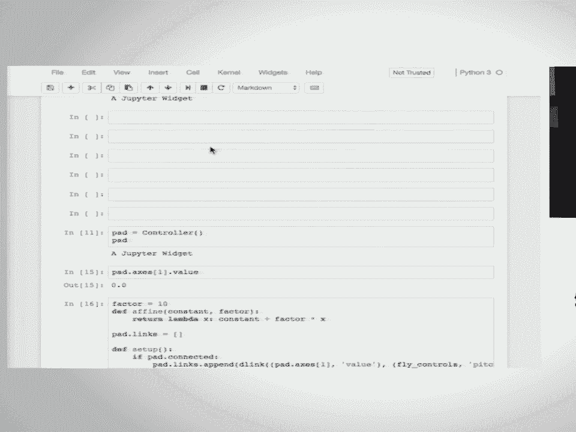

# SciPy 2017（合集） - P10：The Jupyter Interactive Widget Ecosystem  SciPy 2017 Tutorial  Matt Craig Sylvai - 哒哒哒儿尔 - BV1Cs411A76Y

 My name is Matt Craig， I teach at Minnesota State University。

 More head in the Department of Physics and Astronomy。 I'm up in far west Minnesota。

 If I go one mile to the west， I'm in North Dakota。 Also with me is Jason Grot。

 who works at Bloomberg， and Sylvan Corley。 Where do you work？

 I work in the company called Quantstack。 Quantstack。 Quantstack。

 We do have a couple of people helping us today。 Mark， could you raise your hand？ And Paul。

 So first up， if you could get the latest version， of the tutorial notebooks， that would be great。

 As of like 30 seconds ago？ You've got the latest version。 If when you open the index， it starts out。

 with zero introduction up at the top。 And with that， do you want to start on the introduction。

 Jason？ Yeah， so this should just be a get pool。 So the people on the camera。

 am I correct that the camera， and the video will only pick up what's on the mic？ OK。

 so Matt and Sylvan， if you want to be picked up on the video， you have to talk into the mic。 Yeah。

 OK。 All right， so we wanted to start out， with the big idea behind widgets。

 Let me adjust the screen here and turn off the header。 That's what will give us as much space。

 Can everyone read the screen？ Is it a good size？ OK。 So the idea behind the widgets is to make。

 the interactive computation part of the notebook， a lot more interactive。

 And to give you an example， we have many data problems， that we work with， many different problems。

 that we work with。 And as a very， very simple example， so that we don't have to explain the problem。

 but it can just concentrate on the workflow， suppose our problem is to calculate the square of a number。

 So what we might do originally is to just calculate， the square of a number by typing 9 times 9。

 Or you can imagine， again， substituting your own problem。

 where you're just doing something just by hand here。 And so 9 times 9， great。

 And you're exploring the data problem。 And so you try another parameter， 10 times 10。

 And you're trying to understand how the square function behaves。 So you do 11 times 11。

 And you notice that some patterns are emerging and things， like that。 But at the same time。

 you realize this， is getting pretty tedious to type these numbers over and over， and over again。

 So the next thing you do in your workflow， is you start automating things by writing functions often。

 So let's write a function here。 We can define a function that prints the square of the number。

 And then our workflow becomes a little bit easier， a little bit faster。

 Because now we can just do f of 9， 81， f of 10， 100， f of 11， 121。

 Our workflow is faster than it was before， but it's still kind of annoyingly slow。

 And the reason is when you execute code， typically， here's you。 You're thinking about the code。

 You're typing in the code。 You type the code into the Jupyter Notebook。

 And then you execute the code， the kernel sends the output back。

 And then the Notebook displays that output back to you。

 But you notice in this whole process right here， especially with the simple workflow。

 that we're dealing with， the entire bottleneck， is this box right here。 In particular。

 it's the typing things in that's， taking all the time in the world here。 And not only that。

 but typing things in， pulls you down from your meta level of analyzing your data。

 and thinking about your problem。 And pulling you down to the mechanics of typing something in。

 And then when you get the display back， you've got to go back up to， OK， wait。

 what does this answer mean？ Where was I in this problem， et cetera？ OK。

 let me try something different。 And then you've got to switch context again， to go to a low level。

 start typing stuff in， and then come back up to the higher level。 And this is frustrating。

 this friction， in working with the problem。 And it's just really slow。

 The Notebook and the kernel isn't slowing us down。 It's you that's slowing down。 In particular。

 the interface for entering your exploratory， parameters。 And that's where the widgets really shine。

 What we want to do is make this loop as fast as you can think， rather than as fast as you can type。

 And so IPite widgets， we have a simple function。 It says， I want to interact with this function。

 And I want that parameter to go from 0 to 100。 And we do this。

 And now a GUI control is automatically created for us。 As we change the GUI control。

 the functions automatically， run every time the parameter value changes。

 And I can very quickly explore this space。 There's 81， 100。

 And I very quickly can explore my problem。 And I can really work at this problem。

 stay at the high level cognition level。 And I can work at this problem as fast as I can think。

 And that's really the genius， the use case， for the IPite widgets。 We have many。

 many different widgets。 If it doesn't automatically guess what kind of control is good。

 you can create a specific control， like a float slider here。

 Here's a slider that does the floats between 5 to 10， with a step of 0。1 with initial value of 7。5。

 Little label description off to the left of input。

 And so we have a lot of control over the types of controls， that we're constructing。 And in fact。

 the controls that we're showing here， we have one model for the control。

 but we can display the control multiple times。 And they're linked。

 These are actually the same controls。 Just two different views of the same control。

 We can ask the value on the back end， the kernel side。 So here。

 I can take basically input from the user。 And I can， from the kernel， from the Python side。

 ask what that value was。 And I can also trigger changes based， on what that value is。

 So any time the slider changes， I can run whatever Python code， I want。

 And I can link two controls together。 So here， I'm linking the text box here with the slider。

 And as I move the slider， the text box automatically updates。

 We'll get a lot more into this as time goes on。 I just want to give a brief overview。

 of some of the capabilities and some of the big ideas， behind widgets。

 And the widgets is not just the set of controls， that we give you， like sliders， text boxes。

 et cetera。 It really is a framework for writing interactive controls， in the notebook。

 And so with this， there's a number of libraries--， BQ plot， IPYLEFLIT， PYTHUGS， IPY Volum。

 et cetera--， that use the same infrastructure for providing， and constructing interactive controls。

 But custom controls， BQ plot， works on 2D graphs。 IPYLEFLIT lets you construct maps。

 that then the user can interact with。 PYTHUGS lets you do 3D plots。

 IPY Volum also lets you do 3D plots。 And again， each of these things is something。

 a user can interact with。 And it sends messages back to the kernel。

 and lets any code on the kernel side， run in response to user interactions。 So again。

 big idea is we want to make your computation， stay at a high level and eliminate the tedious typing。

 that happens。 And we also want to provide a framework for people。

 to write advanced-- as advanced of GUI controls as you want， and hook those up to the Python side。

 so that you can interact with an advanced control， on the notebook side。

 And any interaction on the notebook side， is automatically sent over to the Python side。

 where functions can run。 You can investigate what the user is doing。

 You can trigger any sort of action， based on user interactions on the front end。

 Very powerful library。 So with that， let's go into an introduction， of the interact function。 Oh。

 yeah。 So what's a good zoom level？ That's 110%。 OK。 We want to keep as much screen space。

 Is that good as well？ Iffy？ OK。 So 110%。 Let's see if we can make that work。 Sure。 So in the index。

 we're going to move on now， to talking about interact。

 We'll talk a little bit more about some of the widget basics。 Run through a list of the widgets。

 talk about styling， and events。 Round 230 will take our first break。

 It should be just after they bring the snacks out。

 People just take a quick poll before we jump over。 And it's just carries。

 We're just trying to understand the audience better。 How many people have used a notebook before？

 OK， good。 It's about everybody。 How many people have used widgets before？ Oh， fantastic。

 How many people have written a widget before？ We even have some of those。

 We might even ask you to help some people around you， when we get to more complicated parts。

 How many people would say that you've， used the widgets extensively？ OK。

 How many people have used interact in the widgets mostly？ Interact。

 And how many people have actually used the widgets themselves？ So not interact。

 but constructing a float slider， and hooking it up and things like that。 OK。

 I think I guess that's a little better idea of the audience。 That's true。

 So the first question you want to ask yourself， when you want to work with widgets is whether you need。

 to actually write any widget code yourself。 So interact provides a way of generating widgets。

 without writing much in the way of widget code。 So let's jump to that notebook。 So number two。

 the overview has some references and links， to some of the packages that we mentioned in the introduction。

 So if we hop to interact， I think what I would like to do， is have you guys take a few minutes。

 work through the notebook until you get up， to fixing arguments using fixed。

 So look like almost everybody had used the Jupyter notebook。

 before but shift enter to execute the code in a cell。

 What these first few cells will do is define a function。

 and walk you through the different types of controls， you can generate with interact。

 So please go ahead and take a few minutes to do that。 And while you're doing that， we're。

 passing out Post-its when you get to this point， that you've reached fixing arguments using fixed。

 Please put a Post-it on your computer， so we have a sense of where people are at。 [INAUDIBLE]。

 [INAUDIBLE]， [ Background noise ]， [ Background noise ]， [ Background noise ]， [ Background noise ]。

 [ Background noise ]， So when you get up to this heading， fixing arguments using fix。

 please do go ahead and put the posted on your computer， so we know that you're there。

 [ Background noise ]， There's something coming up the front right now。 [ Background noise ]， Okay。

 we're all there。 Okay。 So as you've seen， the control that's generated is determined by the type of the argument。

 If you provide a default argument， if you have a function with a couple of variables and you want one of them to have a control generated。

 the other to be held fixed， use fixed。 I'm going to teach you cosmology class and one of the examples where I used Interact。

 they were fitting models of the cosmological models of the universe to supernova data。

 and at one stage would have been nice to have fixed the value of the Hubble constant， for example。

 What we've been doing so far is really a shorthand for generating the abbreviations。

 So when you typed x equals 10 as a keyword argument to a function。

 IPY widgets under the hood converted that to an integer slider with a minimum of minus the value。

 you entered maximum three times that value， and step of one。 You can， if you want。

 and we'll get to this in a moment， provide the slider explicitly。

 The next notebook we're going to be going -- this is the next one -- that might be a couple of head。

 A couple notebooks are going to be going through a list of all of the widgets。

 And for your reference table of several different ways that you can enter arguments and what type argument is turned into what type of control。

 So let's go back to working through the notebook through to the end。

 Let's go up to disabling continuous updates。 So again。

 go ahead and pull down your flag if you got it on there， work to that point。

 and bring the flag back up。 When we get up to that point， I'll see if you have any questions。

 [ Inaudible ]， Okay， so we will continue to work on the install problems over the next couple of notebooks that we have。

 So you've probably noticed as you're trying out the interact sliders that they tend to flicker。

 Let me jump up a couple here。 [ Inaudible ]， Oh， good question。 So let's scroll back up。

 The function I defined triples its input value。 And so when Apple becomes three。 I'm a teacher。

 I like it when people bring the apples。 [ Inaudible ]， I'm going to jump down here to the plot。

 So the flickering shows up quite a bit in -- depending on your laptop in here。

 or even if it doesn't flicker， it's lagging quite a bit。

 There are a couple of ways to disable continuous updates so that the two things you can do。

 One is to add a button so that interact isn't run until the user pushes the button。

 And you can do that either with interact manual or with interactive。

 The syntax for doing with interactive is a little bit funny。

 You have to give as a second argument to interactive。 A dictionary with that key and value。

 But has the same effect。 You can also on sliders set continuous update to false。 And if you do that。

 then nothing happens until you let go of the slider。

 The upside of that is it makes the animations in the browser look a little bit smoother。

 The downside is that if you're using something like this so that somebody can explore how a line changes as you change its slope。

 It's really nice to have the interactivity。 In this specific case， if I was trying to fix things up。

 I'd probably add a step in the slope so that it's not going through so many changes。

 As I drag the slider。 Okay， short exercise here。 So just one thing for you to add。

 One nice thing about working with interactive， which generates a widget object that you're storing in a variable rather than with interact is that you can modify the widget later in the notebook。

 And so the task here is to go ahead and modify this interactive plot so that the sliders only update when you let go of them。

 And I've done one of the sliders for you。 Fill in the second。 Give you about a minute for this。

 I don't think it can take super long。 Again， if you're still stuck with install problems。

 please raise a hand so we can get some help to you。 Okay。 Does anyone have a question？ So again。

 post it on your computer once you've updated the plot widget so that there we go。 Okay。

 so the second line is straightforward。 We just modify the second widget。

 which is the second slider and then the update works as we want。

 I've got a link here to an example of we're not going to go into the other examples。

 but there are several other examples of ways to use interactive in the IPY widgets source repo。

 So let's move on to widget basics。 And this one I'm going to go through together。

 So like many other things in the notebook， the widgets have a representation which allows them to be displayed directly in the notebook。

 So you can display that same widget more than once and if I drag one of the widgets。

 the other one changes。 That's because behind the scenes， in Python。

 you can display that same widget more than once。 And if I drag one of the widgets。

 the other one changes， that's because behind the scenes， in Python， in the kernel。

 I've got a widget。 In JavaScript， there's also a model of that widget and any time I display the widget。

 I'm generating another view of the same object。 So it's going to third one down here and you can close them with close。

 Almost all of the widgets have a value property， so if I drag the slider and then print the value again。

 the value is reflected in the variable， I can set the value programmatically also。

 For each of the widgets， there's a list of the keys。

 These are the properties that are synced so that if you set it， it affects the GUI。

 If you change the GUI， that changes reflected in a property of the widget。

 There are some differences between the widgets in terms of what properties there are。

 And we'll add to the repository later today a table I put together that's for each of the widget classes has a matrix of what properties are included。

 But almost all of them will have a value。 We'll get to an exception in a couple of notebooks。

 You can set the value of a widget when you initialize it， or you can set it afterwards。

 we did an example above。 There's a couple of different ways of linking widgets。

 You can either link them on the Python side using link or the JavaScript side using JS link。

 In this particular example， we're using JS link and we'll come back to the difference between those in a little bit。

 So I update the slider， the text box moves， if I type in the text box， slider moves。

 And if you've made a link that you then want to break， you can do that。

 Now they're separate controls again。 So this is sort of setting the stage for what we're going to be doing for the next couple of hours。

 I'm working through the widget list， learning how to take widgets， put them together。

 We're not going to use interact anymore。 And so let's move on to the list of widgets。

 Where we at time wise。 Okay。 Rather than reading this to you。

 what I'd like you to do is spend about ten minutes。 Run through the list of widgets。

 If you finish that quickly， there's a couple suggestions for exercises down below。

 In about five or ten minutes， I'm going to interrupt you。

 There's a couple things in the middle here that I want to talk about。

 But I think the quickest way for you to get a look at what the different objects are is to go ahead and try it out。

 So start running。 Sure。 So the question was about the radio buttons example up here。

 The description is getting cut off in the styling notebook that we're going to do next。

 We're going to talk about that。 So by default， the labels have a fixed width so that if you're using relatively short labels。

 everything will align nicely。 But if you want to have a longer label， you can。

 And there are a couple other questions up there in the back， I think。 All right。 Other questions？

 Yep。 [ Inaudible ]， Find question。 Jason or Sylvan， do you know the list of icons？ [ Inaudible ]。

 Yes。 [ Inaudible ]， I'll get it in later。 Other questions？ Okay。

 so I'd like to spend another minute or two on this。 It looks like not quite everybody's done yet。

 If you can do a quick execute through the rest of the cells。 [ Inaudible ]。

 Is it the blinking to the fact that the DOM is updating？ It looks like an empty space。

 There's no number， so it looks upward。 That means you can actually tell the DOM not to update。

 You can turn up things off the model。 Yeah， that's one of those MOPs in the background。

 [ Inaudible ]， [ Inaudible ]， [ Inaudible ]， All right。

 so a couple things I wanted to call your attention to in the widget list here。

 One is that there's several different ways of representing strings。

 So text and text area are both for input。 The only difference is how much space you have to type characters。

 A label was originally intended as a way of writing custom descriptions on controls。

 So if you have a control description is cut off， one way that you can deal with that is to put together a label widget and the control widget。

 The HTML widgets allow you to display formatted text in both HTML math and label widgets will take LaTeX and automatically convert it to types and equations。

 I think Jason is output new in version 7。 The output widget。 Okay。

 so a relatively new addition is the output widget that can take anything that you can display in a notebook and put it inside of a widget。

 We'll see an example towards the end of the tutorial where I use that to take an image viewer that somebody else had written and embedded into the notebook。

 But essentially anything that you used to be able to display in the notebook。

 it was a little bit of a hassle sometimes to get that stuff into widgets。

 The output widget does that for you。 And as we move forward。

 the container widgets are going to be important。 When you're writing your own widget。

 you're almost always sub-classing from box， HBox or VBox depending on what you want the layout to be and putting the pieces that you want inside of that box。

 Do anything else？ No。 Questions about anything else on the widget list？ Yep。 [ Inaudible ]。

 So I'm going to hand that off to either Jason or Sylvan who are two of the core developers on IPY widget。

 So the question was， why is there an in-widget in a float widget rather than just a numeric widget。

 whether it's for sliders or text box or whatever？ This is actually something that might change pretty soon so that would have a number widget。

 There was not a real reason for this， I would say， it's mostly a historical。

 They basically share the implementation and what differs is the default value for the formatting of the readout。

 which doesn't strip any digits for the in-widget。 Any other questions？ [ Inaudible ]。

 There's not much difference between box and HBox， I think they're actually identical。

 Historically and earlier versions of the package， HBox and VBox weren't actually classes。

 they were functions， they returned an instance， so there was a difference。 But， okay， next up。

 we've， oh， Ty， go ahead。 [ Inaudible ]， Yep， give me a second。

 So on the progress bars and on some of the other elements， you can set a bar style。

 So for the light blue one， the bar style is info， for the dark blue one。

 the bar style hasn't been set。 If you look at the in progress。

 it's got a list of the different styles you can use。 Whoops。 So if I change it from info to。

 [ Inaudible ]， Warning， I get yellow instead of light blue。 Other questions？ Yes？ [ Inaudible ]。

 Yeah， so， yes， Jason or so， the question is， is there a list of。

 is there a list of all of the different styles that are available。

 and for particular style like bar style， a list of what the options are？ Yeah。

 you can certainly inspect the widget。 For this one， that the widgets that flood progress。

 description， which is a trade type， and probably has， so， a pregrained life code。

 so that's a bit risky。 Which it's that flood progress。 That description， no， that's the bar style。

 [ Inaudible ]， There you go。 There is another way you can often get at it。 Oh， they used to， sorry。

 they used to work。 You just， if you said it to bad value， it told you what the odd values were。

 If you have a notebook that's not in the tutorial yet that has a list of what styles are available for which widgets。

 So， for example， for some of the slider widgets， there's a handle color that you can set。

 And there are several of the widgets that have style properties like that that you can in principle discover with the tab key。

 but it would。 I've got the table mostly put together， so I'll add that in the notebook later。

 [ Inaudible ]， Oh， so， I see， so let's make it a string。 Moving right along。 So。

 we've got a set of exercises here。 We're planning to take a break in 10 minutes or 230。

 so you may or may not have time to get through all of these exercises。 For each。

 let me show you one thing。 So， for each of the exercises， except I think the last one maybe。

 We do have sample solutions， so if you uncomment the line that has load in it。

 so it starts that percent load， shift enter， it'll replace whatever's already in the cell with our solution。

 So， if you prefer just to load the solutions and see how they work， go ahead and do that。

 If you're trying it for a while and you get stuck。

 you can load the solutions or if you don't have time to get to them and want to come back to it later。

 you can do that。 So， let's take about 10 minutes to work on these and we'll keep coming around and answering your questions。

 Actually， I am going to interrupt you one more time because it's tripped me up several times yesterday。

 After the code is loaded into the cell， you need to run the cell again to make it actually run the code。

 So。 [ Inaudible ]， Some people， multiple people in the room had issues with installation and what was happening is that they had a pre-existing installation of the widgets in their user environment and for which they made a user install。

 Actually， user installation is global to all the environments and takes precedence over any environment that you may have running and so you end up with a mismatch between the JavaScript that is required by your environment and the one that you're loading in the browser。

 So， please never ever install notebook extensions with --user or anything。 Yeah。

 user installation is evil。 Don't use it。 If ever you did and you're running Linux or any form of Unix。

 you can check your dot local， share Jupyter directory into your home directory。

 and delete everything。 And that solved a lot of headaches。

 A good advice whenever you install notebook extensions or Jupyter lab extensions in the future is to use the --seast prefix argument to install it into the currently running environment that would make it local to the environment。

 And I think that this should actually be the default and is probably going to become the default with the next version of Jupyter。

 [ Inaudible ]， Okay， so one thing you could do is do the --part。

 So the question was how do I do if I want to have the same set of notebook extensions and widgets extensions installed for multiple environments。

 So my answer to that would be don't in that install them separately in each environment。

 but you can enable them globally with user。 That would be less evil。

 Or another thing would be to define an environment that you're more --and use - make everyone use the same --the same manifest。

 I mean declaring or the dependencies of your environment。

 Any other questions before we take a quick break？ Yep。 I don't know。 Jason。

 have you --do you know --can you just say --to the question was can you disable continuous update with the decorator？

 Do you have to call the function？ [ Inaudible ]， Yeah。 [ Inaudible ]， Well。

 but that doesn't do the same thing as continuous update， right？

 So the answer was no --you can't use the decorator， I think was the answer。 Okay。

 let's take a break for 10 minutes。 So it's on my clock 233 right now， so we'll start back up at 243。

 There should be snacks down the hall。 Alright， a few notes before we start up just based on helping people around the room。

 Number one is highly， highly， highly encourage you to follow the installation - follow the current installation instructions。

 In particular， create a new environment before you install all these packages。

 A lot of the problems that we're seeing around the room have to do with widgets not being the right version。

 Or a package not being installed correctly， etc。 If there's a lot of issues that are coming from just not following the instructions or following an old set of the instructions。

 So highly encourage you to follow the instructions to create a new environment and install the pre-release versions of IPay widgets。

 etc。 Another note is you'll want to start your notebook server in the widgets 2017 environment。

 The reason for this is that the notebook server is serving up JavaScript。

 It's matched to the IPay widgets version in the back end。

 And you want that JavaScript to be the pre-release version of the JavaScript。

 So start up the notebook server in the widgets 2017 environment。 Question？ [ Inaudible ]。

 So the question was， suppose you're trying to create a notebook for wide distribution in essence。

 How do you make sure that we have the right versions of the packages and things？ Yeah。

 so this is a large， yeah， this is a very broad question。

 About how do you make sure that your intended audience has the right software installed and everything？

 You teach in an academic setting。 You could probably answer this。 When I was in an academic setting。

 you know， at the very start of the year， here's our environment and get everybody set up to a single environment。

 and then that's the environment we're sticking with the rest of the year。

 Kind of like what we're doing with this tutorial is， here's the set of installation instructions。

 Use this。 That's what we're testing against。 Do you have any other comments about distribution？

 So for me， the question comes on to whether I wanted to do it once or more than once。 If it's once。

 beta。mybinder。org or， yeah， I think it's 。org。 We'll let you set up a cloud-hosted environment。

 We set up a GitHub repository and with a list of the required packages and have some notebooks in there and then send users the URL。

 They go there。 They get an environment set up for them。

 In a class I did last fall where we used widgets quite a bit。 I created a content environment。

 uploaded the environment in a conduct。org and then just had them install the environment from there。

 And so today it was a little bit unusual and that we had a bunch of pre-releases that we needed to get installed。

 But ideally we would have told you， "Kondec create widgets 2017" and it would have just worked。 Yep。

 [ Inaudible ]， And actually that leads into the last thing I was going to mention。

 You'll notice that we have a pre-release version that we're using。 Widget 6。0 was released in March。

 February or March。 And Widget 7。0 is like this close to being released。

 This close to maybe beta and then we're going to run a bunch of tests with notebooks and catch whatever other issues that we have and then release 7。

0。 So we hope in the next few weeks to release 7。0。 That's why we're testing with 7。

0 here because there has been a lot of this change since 6。0。 Yeah。

 Widget is settling down quite a bit but we do have a major version change here so there's some breakage。

 We try to keep some things backwards compatible or deprecated。 But yeah。

 there's going to be some breakage when we change。 But we're happy to help people to update。

 The primary authors of IPay widgets also maintain several libraries based on IPay widgets so we see that pain。

 And we try to update those libraries like BQ plot， Python， JS。

 et cetera to give an example to others how to update your libraries。

 But we should definitely talk and we're happy to help people update their code。

 If I can add one more thing to that so the question was what if you're writing a library that's based on IPay widgets and IPay widgets changes breaks。

 I've got a library I'll show you a little bit later called reducer and I've had the version on the released version。

 The released version of reducer has had IPay widgets pegged at version 4 for about a year and a half。

 It still works。 So， we'll do。 So again， raise your hand if you need any help or have any questions or something while Matt's going through this stuff up here。

 So， quick run with a couple points about the exercises。

 You may already know this but the way you suppress this output from the notebook。

 put a semicolon at the end。 It goes away。 If I remember right， this was fairly straightforward。

 Yeah。 So， I got a couple questions about the linking a couple widgets。 So。

 a couple things point out。 One is that while many widgets have a value that you can link for the six or seven widgets listed here。

 it's the index that's linked instead。 So， in each of these you have a list of choices essentially and it's the index in that list that's synced back and forth。

 There was somebody who was trying an example where they had a multi-select down here and they wanted to update the choices in the drop-down widget。

 based on what the user selected in the multi-select。

 There's not a way to do that just using Link when we talk about widget events in a few minutes。

 We'll introduce the observed function so that you could set up a call back on the multi-select and then update the options that are in the drop-down using observe。

 And what we do for boxes。 Yeah。 Not a whole lot to say about the feedbacks。

 We're going to talk about alignment and stuff in quite a bit of detail in just a moment。

 Any questions about any of this stuff before I hand off to Sylvain？ Okay。 Here we go。 Okay。 So。

 this part of the tutorial will address questions of styling and layout of widgets。

 We have already seen some styling earlier when there was a question about the progress ball that had two different colors。

 And you could see that there were a number of preset styles that you could use for the progress bar。

 And that's also the case for a few others。 And I'll get to more sophisticated styling later。

 but I first wanted to talk a bit about layout。 So whenever you want to do anything more complicated than a couple of sliders and buttons in a V-box。

 you'll need to start thinking about how you want to present the things。

 So whether you want to have a set of nested boxes to arrange your widgets in a more sophisticated fashion。

 or if you want to have some reactive layouts that adjust to whether you resize the window。

 the browser window or things like this。 And early on。

 so if some of you were already using widgets when it was part of IPython。

 the widgets all had a few top-level attributes such as width， height， background color。

 and these were hard-coded to the base widget class。

 And you could modify these attributes for pretty much anything。

 And this caused a lot of pain for a lot of people。

 So we have progressively moved away from that model。

 And now every single layout-related attribute is bundled into a layout property。

 which actually itself is a widget in that it is an object that is synchronized between the front end and the back end。

 And what it exposes is a number of CSS properties of the top-level DOM element of the widgets that you are considering。

 So sizes such as height， width， max height， etc。 display， box model positioning。

 So every single CSS attribute that relates to layout is exposed to through the layout property of your widget。

 And that is only going to impact the top-level DOM element of your widget in the page and apply to all the views。

 So whenever you try to do anything in terms of layout and you have surprises or it doesn't work the way you think。

 the direction that we would point you to is CSS。 Basically， we are not doing layout。 It is very。

 very difficult。 We're inventing a layout mechanism。 So we did not do that。

 We just reused the CSS spec。 And there is one small gotcha regarding these attributes that we listed here is that some of them are actually short-hand CSS properties。

 For example， in the browser， you have margin top， left， right， and bottom。 And we don't expose this。

 The only one that is being exposed to the layout attribute is margin。

 And through which you can't expose， you can set everything from the top right bottom or left。

 So here's a simple example。 If you run， instantiate a button， display this button in the notebook。

 I just set the layout attribute to be an instant of layout with a given width and height。

 And one thing that is pretty handy with the layout attribute is that it can be shared among multiple widgets。

 Right？ So that's the first one。 Is there any question about the layout attribute before I move on？

 So you already -- yes。 >> Did you mention that it could be responsive？ Did I hear that？ >> Yes。

 >> [inaudible]， >> So you can do responsive layout。

 And the way you do that is using the flexbox spec of CSS。

 which is entirely exposed to all the attributes that I described earlier。 So for example。

 the flex flow， flex order， all of these are actually attributes that relate to the flexbox spec。

 Right？ I'm not -- we're not using bootstrap anymore。

 And the actual underlying DOM representation of a widget is not part of the API。

 So if you happen to know， you could maybe hack some things that are not easily done using that。

 You know by just injecting some CSS in the page， but we don't guarantee that this is going to work with an exversion of widgets。

 Okay？ So you may have noticed that many value widgets。

 so widgets that expose a value have a description attribute。

 that it can be used to give a quick description of what this widget is about， and the insider。

 for example， here that instant shading in the notebook has a true DOM description。

 And that's pretty annoying。 So you may want more flexibility to layout widgets in the description。

 So one way to do this is to not use description attribute and just use two widgets。

 one being a label， and another one being an insider without a description。

 And so this is a bit more flexible and then you can send the width and height。 So in a way。

 the description attribute of a slider is just a shorthand to do like quick things。

 but if you want more sophisticated layout， I would recommend using multiple widgets。 Actually。

 a spoiler alert， so this one's something that will be addressed later in this tutorial。

 You can actually do some styling of the description that is part of the slider， for example。

 using the slider attribute， but I'll get back to that later。 In this example。

 you see that the total width of the slider has not changed。

 compared to the top example where the description was truncated。 Instead。

 the two long description is taking the space from the slider。 Yes？ [ Inaudible ]， So actually。

 in the case of the slider， the total width of the slider is set through layout。

 but it's not going to change the width of the description。

 Since we don't expose an API to change the inner styling and layout of the slider itself。

 I recommend that you use two widgets， one being the label and the other one being the slider。

 We only expose properties of the topmost DOM element。

 And the inner structure of each widget implementation is implementation detail， I would say。

 [ Inaudible ]， So for that example here， so I'm just repeating what Jason said for the record。

 you could instantiate a new slider with layout being a layout。

 and with equal to whatever 500 pixels。 There you go。 There you have more space。

 more room for the layout。 Quick note on that， the natural width and heights of all the widgets are set。

 so that when you don't touch anything and place them in HBoxes and VBoxes。

 they will be nicely aligned。 So that， for example。

 there are long and short widgets and two buttons in a row。

 are going to take exactly the same space as a slider by default。

 So when you start changing things manually， you need to take care of that for your layout。

 So actually， this was the purpose of the next item。

 which is that most of the core widgets have a natural width。

 that's multiple of 148 pixels and natural height of 32 pixels。 And the default margin is two。 Yeah。

 so there you go。 So widgets that have a label description actually can also render math equations in their label。

 So， for example， this insider has an integral sign in the description。

 and you will see 200 with math jacks。 Same for the label value。 Any question？ Right。

 So there are also a number of widgets that have a readout。 So， for example。

 whenever you move a slider， you will see the current value displayed aside of it。

 And the readout format is an attribute of the slider。

 and it can be formatted using Python's format specification， meaning language， which is。

 for example， point 2F to display two decimals。 Actually。

 we are using a JavaScript implementation of that spec that is part of D3。

 to do this and handle these changes in the front end。

 So you don't even -- if you change it without doing a round trip to the back end。

 in pure JavaScript setting， you will see it reflected。

 So now I'm going to get back to the Flexbox layout。

 So if you want to do anything like sophisticated work。

 whenever you resize the window or when you want to place widgets with some inter-space。

 between them so that it takes up all the width of your screen or things like this。

 you will want to use the Flexbox CSS spec， which is entirely exposed， through the layout attributes。

 So what I invite you to do is actually go through the specification。

 that is exposing the few hundred lines of examples。

 about how you position things using the Flexbox property， the Flexbox spec。

 And I'm just going to go through a couple of a few examples of more sophisticated。

 layouts that you can put together using this。 So for example。

 the first one is just for buttons in the VBox， and I stretch the items to the maximum width and the total box is going to take 50%。

 of the screen -- of the available space in the notebook， whenever -- even if I resize the notebook。

 so I should probably do that。 Going to resize the notebook and again it's only 50%， or less 50%。

 So the second example is a use of the Flexweight for three buttons in a row。

 And here the rule is that the middle button is always going to be twice as。

 more as the two other ones and the box takes up 50% of the screen -- of the available， width。

 Now let's make a reactive form。 So yeah， this one is just an arrangement of sliders and drop-downs and input。

 widgets that make use of the Flex properties to be nicely aligned。

 And here's a more sophisticated example， another one， which is just a carousel so。

 that the widgets that are in that box are not being resized and you can scroll。

 or reasonably to display them all。 And all of this can be done just setting the right values into the layout to the。

 layout property。 So what I recommend to do whenever you're trying to do anything with complex。

 widgets layout is to read up how you would do this in pure CSS and apply this to your。

 widget using the layout property dot whatever CSS or support you wanted to set。

 And you just replace the dashes with underscores in the name of the property and， your set。

 And finally， regarding colors， you can set pretty fine styles for buttons， progress， balls。

 sliders and a number of widgets which are going to be styled accordingly to the。

 current environment。 But we're not using bootstrap anymore。 So for example。

 if you want to set the button style to be info， it's going to be --。

 is this like some sort of autocorite on your computer？ >> [Inaudible]， >> There you go。

 So if I set the button style to info， it's going to be displayed as blue。

 Whenever you're just editing basic style， I would recommend using that rather than。

 trying to set your own shade of blue because then you are more likely to have。

 consistent blue and feel across all the UIs that you are putting together。 Yeah。

 Before I get to the style attribute， I'd like to give you some time to go through the。

 the flakes box section and take questions。 Any question on the layout？ Things。

 So just a quick poll before I get to the next part。

 So I have -- has anyone who has already built a complex layout with Jupyter。

 widgets for their applications？ So were you aware of that feature or is it a feature that you had not seen before？

 Sorry。 So it exists since version six。 Before that， it didn't exist。 So it's not new in seven。

 So regarding the style attribute， so of course you have a few predefined styles。

 that you can set on button sliders， progress bars， but sometimes you really want to use。

 your own color either because yours is nicer or because you haven't created a。

 concrete use case for that。 For example， you are doing some visualization and you want the color of the。

 button to match the one that is used in some scatter plot for a dataset and that's。

 a toggle for that thing。 So in a lot of data visualization cases。

 being able to define a specific color for a， button or a slider can be very useful and improve the UI that you're building。

 So for that， we have -- just like we have a bundled or the layout-related CSS。

 attributes into a layout widget， we bundled a number of properties into a style attribute。

 that is available for all widgets。 Although unlike layout。

 style doesn't directly map to a CSS property。 It is a whitelist of properties that we enable and may be named arbitrarily。

 For example， in the case of the slider， we have a handle color property that obviously。

 is not a CSS property。 So there you go。 Here I have a B1 that's styled at button color。 Yeah。

 variable colors are HTML colors。 I could just do 4， 4， 4， 4， 4， 4。

 and here I have a gray or like one of the HTML named， colors。 And there you go。

 So if you really want to set colors manually， you can do this on buttons using the style， attribute。

 Obviously， you can get a list of the style attributes for widgets with the keys， properties。

 And these are going to differ among widgets that。 So we're not going to propose a handle color property for the style attribute of the button。

 only for the slider。 And so another feature of style and layout is that the layout and style attributes as a。

 whole can be assigned to the style attribute of another widget and shared。 So for example。

 here I defined another button with no text and I set the style of the second。

 button to be the same as the first button。 Now if I modify the value of that style to be red。

 it's going to impact both widgets。 So defining a number of widgets in a row。

 assigning a style or layout attribute in BARC is possible。

 just by sending the same layout property to all of them。 And as I said。

 widget styling attributes are specific to which widget type。

 Any question before we move on to the exercise？ Yeah。 [ Inaudible ]， No， we have not。 But as I said。

 it's a whitelist that we are enabling as we go。 So yeah， we should probably do that。 [ Inaudible ]。

 That's one of the tables I'll be adding later today。 [ Inaudible ]， Yes。

 Jason was saying that you can have type completions because these attributes are actually properties of the style object。

 Right。 Regarding what possible values are available for these， for most cases， the type of the。

 trait is just a string because it generally maps to a CSS property of some element in the DOM。

 And unless it's some very specific property that for which we have like initial， in a real， like。

 a few valid values， we don't expose to the Python what are the possible values。

 So you need to check what's possible with CSS。 Yeah。 [ Inaudible ]， No， you can't。 The question was。

 can you share styles between different classes？ So you cannot assign a button style to a style or style。

 But you can do this with layout。 So layout can be shared across any type of widget。 [ Inaudible ]。

 An easy way to do that would be to use a link widget。 Yeah。 So the question was。

 how would you share the same color for a number of widgets that are different types。

 if I reformulate correctly。 And the way to do that would be to use different style attributes and link them together with a link widget that we discussed earlier。

 [ Inaudible ]， So let's move on to the exercise。 [ Inaudible ]。

 So earlier we have listed the existing widgets， the available widgets， and how you can lay them out。

 So the goal of this notebook is to range， or maybe you want to describe that。 Yeah。 [ Inaudible ]。

 So at the end of the next， with time we're done discussing widget events。

 we'll have put together a really bad password generator。

 And we'll show that example because it's not domain specific。

 And we'll get us some practice with doing some layout and handling widget events in this。

 And it's just showing what it's going to look like at the end。 By the end of this notebook。

 you should have laid out some of the controls as shown here。

 The first exercise in here just has you take a widget， let me run it。

 That initially displays like this， change justify content and align items so that it looks like that instead。

 I deliberately chose these two because when I'm sitting down laying out widgets。

 I can never remember which one it is I'm supposed to change for the thing I want to accomplish。

 So head back to the styling notebook and figure it out。 So if you look at this example。

 I mean the objectives that we have， the widgets are vertically centered。

 And they are laid out in such a way that you have space around each side and in between。

 So horizontally。 So maybe we could use the sticker method to know who has finished the exercise。

 So a bunch of people have used it。 So if we set the align item to center。

 Now we have things centered vertically in the flex box。 And instead of doing a flex start。

 I'm going because here we want some margin on the side， going to do space around。

 So here there is no space available because of the zoom level。 So quick note。

 Most people don't know these CSS flex box spec by heart unless they're working on this all day long。

 So I must have just checked the documentation。 And so it's。

 I would recommend the definitive guide to the flex box。

 Which is linked to in the notebook but easily found in Google。

 And actually this documentation comes from ease and adaptation of this tutorial。

 Which is a completely guide to flex box by Chris Coyer。 So now we want to do the following things。

 Display the children in reverse order without changing the order of the children。

 We want to display them horizontally， vertically instead horizontally。

 And also change the order for the valid button text。 So this is a goal that we want to do。

 And so if you execute what you get is an empty box so you need to set the children and change the layout settings so that it looks like the screenshot。

 That's provided。 All right so if you are lazy what you can do is uncomment the first line of the console and hit shift center。

 And this is a magic that is going to replace the content of the cell with the solution of the exercise that was done by Matt。

 And there you go。 So the solution is not zooming in。

 So actually because of the size of the screen we zoomed in quite a bit。

 So what we ask for is that but here the default layout of the toggle button here is wrapping text and wrapping content。

 So as we zoom in you see the three buttons wrapping around which is not a bug but it could be modified actually using the layout attribute。

 If you really want them to still be displayed horizontally。

 So one way to solve this actually could be to move the description。

 So type of special character to include up to have more resource space for the toggle buttons。

 And this is actually the goal of the second exercise。

 So here the goal is to use a separate label widget for choose special character to include。

 And so the solution is here。 So Matt said that he actually provided the solution in the cell and I didn't pay attention but it seems that it is the case。

 So great。 One last exercise。 So another issue here is that there is unnecessary white space on the left of the box。

 And so what you can do is use the stat attribute。 And so for the box and use the modify the description with to be initial。

 And when we put everything together either you load the solution or try to assemble it from the different pieces that we have written already。

 And you should see this which is the final widget layout that we wanted。 Questions。

 The layout is really really fun。 All right。 Let's move on。

 So right after widget event we're going to move on to nice data visualization things。

 So it's not going to be a lot of layout and drop boxes anymore。 Yes。 Yeah。

 You can actually nest boxes。 So it's very easy。 Sorry。 So here I'm just importing vbox。

 hbox and button。 Right。 And then I'm going to do a hbox， a vertical box of two vboxes。

 And in each one of them I'm going to use place different things。 So let's say a button。

 You can import in stater。 There you go。 All right。 Yes。 Okay。

 So I think what we'll do is we'll take us about five minutes， five。

 ten minutes to go through the events notebook。 We'll take five。

 ten minute break because it's going to be a last call for snacks and then come back。

 We'll work through some event exercises and the data visualization notebooks。

 So up at the top here there's a couple of widget types that have special events associated with them that aren't associated with any other widgets。

 So button is one example of that。 There's a button method called on click that lets you register a callback function。

 It's activated when the button's clicked。 And so in here we're creating the button defining a button or sorry function that when it's called we'll just print button clicked and then registering that function with the on click method of button。

 And you can click your heart's content。 One other special event is the on submit event for text widget。

 So it's an event that fires when the user hits enter in the text field。 Again。

 the pattern is you define the function。 It's got the same signature as button clicked。

 So it takes a single argument and there we go。 For most widgets。

 the way to link up a function to the widget is to use the observe method or the observe function。

 And observe gets called with just the change。 Right， right。

 It shows you a bit in a while since I've actually read the docs。 Yeah。

 So in this example we've got a integer slider when the value of the slider is changed。

 On value change will get called and it just prints out whatever the new value is。 Okay。

 so for any of the widgets you can set it up so that you're observing changes in that widget and calling whatever function you want as a result of that。

 So back to the earlier question about a multi select widget where you select several things then you populate your drop down with that。

 See if I can code that up。 So let's make a drop down widget。 Right。 Sorry。

 the quest was a multi select。 Do I have that right？ Oh。 Tab or the rescue。

 So now we'll make the drop down and I'll start with the same three options。

 Rather than putting these into the box with demonstration purposes you can display to widgets at the same time like this。

 So we've got both widgets displayed and the desire was that if I've selected a couple of things in here that populate or the choices of the drop down get updated。

 So let's add the callback to do that。 So I'll define a function that takes the change as its argument。

 The change argument is dictionary。 So far if I run this nothing's going to change we need to link the two so let's do that。

 So I want to observe changes in the select multiple and call update drop down and I want to look for changes。

 I think I can observe value。 Let's take a look。 Really。 All right。

 let's try this is how live good and goes。 Uh oh。 It never happens when I'm by myself。

 I don't understand。 I think we want to update the options because we want to change what the user sees in the drop down。

 Or did you want to。 Do you want to come up and。 I see how it is Jason。 I see how it is。 Yeah。

 but it's spelled funny。 There's no a and it's J so and。 So which it looks good。

 Let's see what happens when we click it。 Yes。 Okay。 Yes。 Yeah。 Yep。 Yep。 Yep。

 I would have done the same。 So I should have maybe told you in advance there is another division of labor up here is that I don't know JavaScript and never want to know JavaScript。

 I can make widgets do a lot of things with Python but when it comes to JavaScript it's going to be them。

 Yes， you had a question。 Yeah。 Yeah。 So this was a question about trade let actually so the computer and tracking widgets rely on the data。

 So this was a question about trade let actually so the computer and tracking widgets rely on the trade let's library to do to implement these observer pattern that we're using here so observe among other things is a method of trade。

 And so whenever there is a change dictionary is sent across continue the following keys so the name of the attribute that changed the old and the new value。

 The owner is actually a pointer to the I mean refers to the widget that emitted the event and the type is the type of event and this is actually in this case the type is a string called change。

 That we actually support like arbitrary type of event that you can listen to and emit and this is something that we did in preparation for like more atomic transforms that you may do on an attribute that is actually a list。

 For example， you may say that we changed the second and the third attribute to the third value of a list。

 So things like this。 So why do we need to have the old value。

 The reason for that is that when you can actually hold all the changes with a context manager make a bunch of changes and then when you release the context manager all the new values are being validated with the context manager。

 If anything is invalid we roll back everything to the initial state。

 And so that rolling back and all is done through the compression of events and all that require knowing the old value。

 So that's the reason for the presence of each one of these keys。

 So in this document you can try this。 Yeah， here we go。 What do you say Jason？ I didn't hear。

 There's the docs。 Yeah。 The docs have been documentation。 But it's not the docs of widgets。

 It's in the docs of dependency of widgets called tradelets。 Okay。

 so we've talked about linking a little bit before we want to go through it in touch more detail。

 There's a couple of ways to link。 Either before we want to link。

 So two in the Python kernel two in the JavaScript。 The first one is to use tradelets。link。

 So this is created a caption and a couple of sliders。 We've linked the value of the two sliders。

 So slide either of them and they both change。 There's also a D link， a directional link。

 And for that one the source， the first of its arguments will update the second。

 But dragging the second doesn't affect the first。 As with the others you can unlink them but we'll skip that。

 Close the JavaScript one is going to be a round trip。

 The other one is the Python one is to a round trip。 That's the essential difference。

 There was a widget or a cup of a couple of years ago。

 They showed all of the different pieces of communication going on when you move a slider。

 You move a slider in the browser and JavaScript is talking through some communication system。

 I don't remember。 Back to Python kernel which makes an update。

 In the other slider then sends a message back out to the front end。

 The other way of linking is to link on the JavaScript side。 Oh， it's a question？ Go ahead。

 [ Inaudible ]， So there's -- is your question -- is your question whether we can switch which of these two is --。

 [ Inaudible ]， Yep。 Yep， let me call out the change a little bit more clearly。

 So the difference is that in this first case we used link。 Let's stop link。

 In the second case we used D link which is directional link。

 So it only links from the source to the target。 [ Inaudible ]， Right。

 but when I drag the source it does update the target。 [ Inaudible ]， Oh， you know what。

 let's talk through this。 [ Inaudible ]， Whoops。 This one we're demonstrating a -- using observe again。

 So here we have a slider whose changes we're going to observe。

 And when the slider is changed we're calling this function handle slider change。

 as checking to see whether the slider values are positive or negative。

 So it's covering similar territory of what we talked about in the drop-down example a couple minutes ago。

 And you can see as you slide back and forth the labels updated。

 The second way of linking is to link in the JavaScript side。

 Let me highlight the key line here is that when I'm making the sliders now instead of linking with link。

 I'm using JS link which builds the link in JavaScript。

 So right now this doesn't look any different than what we did before。

 In the browser what's different is that when I drag slider one the browser tells slider two to update。

 The kernel is completely cut out of that。 And like with the links in the kernel side you can link in only one direction。

 To illustrate the difference between the two let me -- come on。 Jump over to the documentation。

 And in the rendered -- so in the rendered documentation all of the sliders show up。

 These are the kernel linked sliders so they don't work because the server that's serving up this web page。

 doesn't have Python running in the background。 The JavaScript link sliders are still linked because the JavaScript is in the browser and when you drag slider one。

 the browser just has to tell slider two to move。 Okay， questions。

 That documentation was created I think with the Jupyter plugin for Sphinx。

 Can one of you talk about that？ And then with Sylvan's done we'll take a like ten minute break。

 This will be the last chance to grab snacks after new if you want them。

 So we can convert notebooks that have saved widget state with N。B。 convert and these will be the。

 study projects will be rendered on an N。B。 viewer as you would expect。

 Although in the case of the documentation we're not using N。B。

 convert we're using either one of the two following， options。 One is N。B。

 Sphinx that is going to convert a notebook into a valid RST with the right assets for random。

 widgets and also the renderer embedded in the form of JavaScript。

 And there is another option which is called the Jupyter Sphinx extension that is able to replace any snippet of code。

 with the right Sphinx directive with corresponding rendered widgets。

 So you can either use Jupyter Sphinx or N。B。 Sphinx and the two are actually used in the documentation of the widgets themselves。

 Alright， let's start back up。 Any questions before we start back up about the basics of widget events and observing and linking that we just talked through？

 Okay。 Then let's go to the first of several examples。

 We're going to work up a short version of this bad password generator that just has a length slider and shows a generated password。

 I'm just going to load the solutions actually。 So like you saw in the。

 when we're working with this in the layout， I've got a couple of text label， sorry HTML widgets。

 I'm using to display the text and setting the margins so that the generated passwords indent it a little bit。

 If I execute this， oh， there's a cell at the top。 There we go。 So at this point。

 nothing happens but the interface works。 To calculate the password。

 I've written the routine here that just generates a string of characters。

 This takes as an argument the change。 So in a moment， I'll hook this up to the widget using observe。

 There are a couple of different ways you can get at the keys。

 You can do a dictionary style if you want， but you can also use attributes of the change if you prefer。

 Let's see。 There's one line I left out here。 So why don't you take a moment。

 see if you can add that in。 What we want is a line that will set the value of the password text widget that was defined a couple cells up。

 [silence]， [silence]， And so if I -- it should be all I need to set the value of the password text。

 It's not going to update when I run this because we haven't registered the callback yet。

 Take a moment。 There should be a one liner here。 What we want to do is use observe -- or use the observe method of password length so that the password gets updated when the slider is dragged。

 [silence]， [silence]， So we are in 9A。 [silence]， So like I said to the single line to make this happen。

 we want to observe when the password length changes。 And when it changes。

 we want to call calculate password and only watch for changes of the value。

 Once you run that and then display the widget again in drag， we've got a password。 Questions？ Yep。

 I think you can observe any of the keys。 Is that --， [silence]， Right。

 The question is what are the things that can be observed？ Is it any of the traits？ Okay。 Yeah。

 so to get the full list --， Okay。 What did I say password length do？ Oh， oh， oh。

 two S's in password。 This will get you a list of the things that you can observe。

 There's also -- in the tables， I'll upload later with the list of style properties。

 There's also a list of what things you can observe for which widgets。

 are broken out by widget category。 Other questions？ Okay。 So in the next notebook。

 we're going to do the same thing， but I'm going to separate the code a little bit。

 I apologize to anybody in the room who's a computer scientist。

 I am probably not using the words model view and controller， as I strictly should be。

 But the idea is that as much as possible， you want to separate the pieces of your code that are doing the work from the widget pieces of the code。

 In terms of what we've just done， what I would call the view doesn't change。 Okay。

 This widget code I've copied from the previous notebook。 Now。

 instead of having a calculated password function where I have -- I've taken the change event and set a widget value。

 I've got a function which， given a length， gives you a password。 So seems to work。

 And then I've got a separate function that connects the two。

 So here's the callback like we had before， or similar to what we had before。

 Update password takes in the event and calculates new password and sets the value of the password text to the new password。

 Once I've done that， if I scroll back up， things are connected again。

 A couple of advantages of doing this。 I wrote a package called reducer for calibrating astronomical data that I've got some screenshots of later。

 When I first wrote reducer， I understood even less about MVC than I do now。 So in my widget code。

 I've got a method called action that does the actual calibration steps。

 There's no easy way for me to test that without running the widgets。

 One of the advantages of separating things out this way is that I can test my password generator as much as I want。

 I don't need any widgets。 When I'm doing this， I can test working。

 I can be fairly confident it's going to work when I plug it into the widgets。

 Neither of these ways that we've looked at so far of setting up the events in the password generator。

 Actually what I would do if I was writing widgets， I wanted to distribute to somebody else。

 So let's move on to the next notebook and show you how I would actually set it up。

 We're on our third pass with the password generator。

 And now this will be our first example of making our own widget class。

 We're going to go through it a few times。 The first couple of times I'll have a version dependent on the object until we're done putting all the pieces in place。

 To make my own widget， I'm subclassing from box because I'm going to want to put the slider and the password value inside the box。

 Not saying I've ever done this but don't forget to initialize the super class。 Yeah。

 So execute that。 But the rest of the code is very similar。 I'm generating the HTML pieces。

 I'm just taking them inside of a box that's inside of a class。

 And I get the same password generator we've been seeing。

 For this password generator widget it really seems like the， password generator should have a value。

 I should be able to get the password out of the widget。 I count。

 So in the next iteration here I've added a property to return the value。

 I've set it up as a property so that the user can't set the password in the password generator。

 And if we try that out we've got the same look as before but now I have a value which。

 and this error is on purpose， I can't set。 So now to connect things together instead of writing a function and then using observe to connect things what I'm going to do is write a model class to generate the password。

 And that model class is going to subclass from has traits in the trait let's package。

 So what I'm doing is where we're going with this is in the class that I'm creating it's going to have a length trait。

 If I set that length I've got things set up so the particular method in the class is run。

 So it behaves sort of like a widget and if you set the value of a widget the slider moves or the text updates in the text box。

 So to make your own widgets like class subclass from has traits you define whatever traits you want your class to have as class attributes。

 If you look at the trait let's documentation there's a full list of the available traits。

 Down here is the calculate password code that we had before it's essentially unchanged。

 Two things are different。 One is that I've added in observe on to calculate password what I'm observing is changes not in a widget somewhere I'm observing changes in the length attribute of this password model。

 And at the end here I'm printing out the password so we can see if anything's happening when we execute this so let's create the class。

 Make an instance and now if I change the length of the password I get a password out。

 It's a bad password generator so if you want a one letter password go for it。

 And the idea is that what I'm going to do is link the length trait of my model class to the value attribute of the length slider in the widget。

 So questions about what's happened so far before we connect things up。 Okay。

 So just a quick change in the next version here instead of two changes。

 Instead of printing out the password I've added another trait to the model to keep track of the password。

 And my calculate password method instead of printing a value to the screen sets the value of that trait。

 So if you make an instance of that and try it out。 Seems to work fine。 There is one issue with it。

 Apparently I can have a negative length which bothers me。

 So what we're about to do is a little tangential to the rest of the tutorial but it is useful to know in writing your own widgets。

 Traitlets includes a mechanism for validating widgets or validating properties rather。 Traits。

 So in this next iteration what I've added is a validator so you write a function to validate the property。

 So here I'm going to validate the length。 In earlier versions of Traitlets I think you had to use this name for the function。

 That's no longer true so you could call this anything you wanted to。

 Some names are better than others but you could call it anything you wanted to。

 It takes a proposal argument which is the value that the trait will be changed to。

 I extract that from the proposal dictionary kind of like pulling the change out。

 In the handlers we wrote earlier I check to see whether the length meets whatever criteria I have。

 My standards are low apparently as long as it's bigger than zero I'm okay。

 If the length is incorrect you raise the trait error otherwise you just come on scroll go away。

 Return the new value。 So if we run that。 Then try setting a negative pass or negative length doesn't work。

 Here's where I really start mangling the language I apologize。

 To connect all of this together I'm going to go back up to the widget that I defined before。

 So this is mostly the same code that we had above copied down here again。

 I've added three things to it。 One is that I create an instance of the model and store it in the view。

 I link the password in the model to the password text in the widget and I'm going to link the length in the model to the password length widget in the view。

 So what's nice about this is that you can put these two classes into a package。

 tell somebody from my bad password generator in Port pass gen GUI and they've got your widget。

 I can embed it just like any other widget。 Questions。 >> Is this a question？

 Whether this is the official way to do it。 Do you want to take that？

 >> From the user side it's worked so far。 >> Lots of people have been doing that but no way has been elected as official so far。

 But it seems like a reasonable one to me。 >> The only thing I'd caution against is try not to mix too much of the widget stuff in with your code that's doing the actual work。

 Any other questions？ >> I don't think there's anything except for some bug fixes。

 >> I would say you couldn't set the description with two of the initial。

 You had to make two widgets。 >> If I went up the latest anaconda， I'd wait two weeks。

 >> I've been maintaining -- so I took -- first time at SciPy was three years ago and one of the tutorials I took was the。

 one I took。 >> I've been maintaining the reducer package since then。

 It was painful to go from one point to one point something。

 It's a little bit irritating to go from one to two because there were some styling changes。

 >> Is it possible to take the framing or the output or out so it looks like an application？

 >> That's a problem。 >> We're going to dive into more complicated visualizations using widgets as a framework。

 You can also embed in static web pages so if you have something that you really like and。

 you can just save the state and deploy it almost as an application。

 Are you aware of the binder project？ >> Yes。 >> It's used for sharing notebooks but it can also be used as a means to provide a kernel for a headless -- I mean notebook-less application that was built and。

 out there with notebook and widgets and then exported and used in the static web page that。

 just happens to be talking to a kernel for the computation。 >> Yeah。

 >> This is definitely where we're going。 You just need to click on the link and you have everything running for you。

 We're going to get to that。 >> We're actually envisioning multiple workflows and one is one possible way of doing this。

 It's a site core workflow where you must work in a console and have one widget area displayed。

 that you can update。 We have a new version of the front end coming up called GPTELAB。

 This is a workflow that we will be enabling。 In the interest of time there are some really neat things you want to show you with more sophisticated widgets。

 I'm just going to load the solutions here that all I'm doing is I'm taking the model class we had before adding。

 multiple new traits。 One is to keep track of which of these three groups of special characters the user selected。

 include in their password。 I'm going to modify to observe so I'm watching for changes in all three of those traits。

 In the view let me load the solution to save you some cut and paste。

 The password length widget like we had before the check boxes and the toggles we styled are present。

 That makes me sad。 Cells don't work if you don't execute them。

 It's that whole thing we load and you have to run it again。

 You can change the length and change the special characters you have。

 It's an extension of the same thing。 For each one of these things I want to have affect the password。

 I add a trait for that in the model。 In the widget code I link that model trait to a GUI element。

 We won't talk through this now but I have links to folder in the get repository that you。

 clone that have the model and the widget code in two separate。py files and show an example。

 of importing that and running it in notebook to give you an idea of how you might structure。

 things if you want to distribute your own widget package。 With that I think we will do a questions。

 Let's see。 Double check that all of the cells have executed。

 We will do a quick notebook swap in Europe with the BQ plot。 I think。 [pause]。

 Before I move into BQ plot。 We have seen so far was mostly core computer widgets。

 We were manipulating and using the widgets events and layout properties to compose GUI。

 in the notebook using the widgets made available in the core package。

 Everything we have seen applies to a much larger collection of widgets that can be much more。

 sophisticated because more than a collection of widgets is a framework on both the Python。

 side or the JavaScript side。 From a programmer perspective what a widget is in the context of a computer is mostly a。

 Python object that is synchronized with a contour port JavaScript object in the front end that。

 may or may not have a visual representation。 Whenever you make a change to the Python model you see that change reflected in the JavaScript。

 object and whenever you make a change to the JavaScript object you will have an event fired。

 on the Python side and the Python object being updated。

 And whenever you actually have a visual component to it we are going to use a view object that。

 is the one responsible for handling the changes to the DOM。

 And a simple slider just like the widget just like the slider has all of these components。

 It has the float slider object in the back end and some model in the front end。

 Whenever you move the slider visually a view gets updated in the front end and the value。

 is reflected by the Python side。 Whenever you modify the value of the slider programmatically from the Python side you will。

 see this reflected in the visual representation and all the views of that model in the front， end。

 And we can use and reuse all of that architecture to build custom widgets that may have much。

 more sophisticated visual representations than just a slider。

 Even though most of the complexity is already there in the case of the slider。

 So actually the area where we have made the most changes from 5 to 6 and 6 to 7 that we。

 are governing the version that is coming up is how you extend things on the JavaScript。

 side but the changes are still manageable。 And the first custom widget library that I wanted to talk about is BQplot。

 So actually BQplot is a project that is dear to me because this is the one that brought。

 me to contribute to Jupyter。 We really wanted to have a 2D visualization library that would be well integrated with。

 Jupyter at a time when available options did not offer these sort of interactivities。

 And so that's why we got involved in Jupyter interactive widgets and the Jupyter project， at large。

 So BQplot started from the quantity at Bloomberg and we were just initially doing this for our。

 own usage。 Eventually got to open source it so it's a Jupyter， D3。js bridge， Apache license and。

 which provide high level protein procedures with relevant default for common trial types。

 as well as lower level discussions for the individualization that you can compose。

 So like most of the packages that we are going to show today BQplot can be installed from。

 Kanda with Kanda Forge but normally it should already be installed if you have followed the。

 installation instructions。