# SciPy 2017（合集） - P17：Automatic Code Generation with SymPy  SciPy 2017 Tutorial  Jason Aaron Björn & - 哒哒哒儿尔 - BV1Cs411A76Y

 Okay， so who are we？ My name is Aaron Muir。 I'm a researcher at the University of California。

 of South Carolina， and I'm also a lead developer of SMPI。 Jason Moore in the red shirt back。

 there is a faculty， mechanical and aerospace engineer at University of California， Davis。

 and he's also a SMPI developer and also developer of a library called PiDine。 Bjorn。

 Tolgren here in the green shirt is a PhD student at KTH Royal Institute of Technology。

 in Sweden and also a SMPI contributor and finally Kenny Lyons I don't know where he。

 I guess he's over back here in the red PhD student at University of California Davis。

 So this tutorial we're going to be learning about co-generation with SMPI。 Some basic。

 SMPI knowledge is going to be assumed although we are going to do a refresher SMPI if you。

 don't know it's a library for symbolic mathematics so we just did a big release a couple days。

 ago if you did the installation correctly and your test script passes that means you have， it。

 So just a quick what did we mean by code generation for this tutorial or just code。

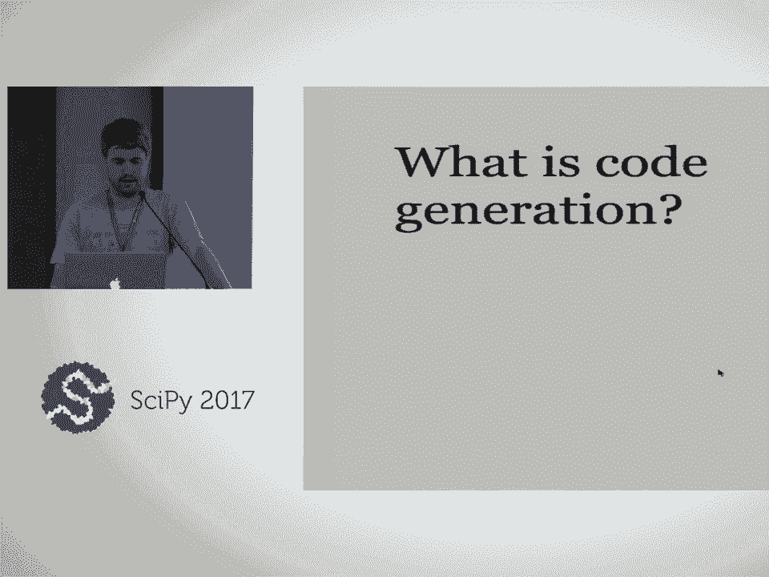

 gen and for our purposes this means taking a SMPI expression and converting it to some。

 other language and to code for similar language。 So for example here's a SMPI expression representing。

 some mathematical formula absolute value sine of pi x and this is the equivalent C code。

 So code generation basically you start with the left side and you want to get the right。

 side here you want to do that automatically。 So SMPI supports quite a few languages if。

 you're targeting or want to target any of these languages we have support C， C++ Fortran。

 MATLAB Optiv， Python via NumPy， SciPy， Julia， Mathematica， JavaScript， LVM， Rust， theano。

 and it's very easy to write extensions to these or to basically to extend it whatever。

 language you want。 So this is sort of how I think of code generation of the workflow。

 Basically you've got three steps and the first step is you're using SMPI to sort of help。

 you model your problem mathematically using symbolic capabilities。 So you're basically。

 using it to derive formulas that represent whatever it is you're trying to do。 And then。

 the code generation step is you want to take those formulas and convert them to something。

 that can be numerically evaluated。 And then at that point you use the thing that you。

 code generation to actually solve your problem。 And so code generation is this middle， this。

 translation step from sort of the modeling stage to the actual solving of the problem。

 And at the other layer here there's several different abstraction levels for SMPI code。

 generation depending on how much you want SMPI to do for you and how much you want to do， yourself。

 And this is actually upside down。 So at the bottom here basically SMPI is going。

 to create a Python callable。 So if everything's in Python you just take your SMPI expression。

 pass it to one of these functions。 I think autoreps should be in here too which is what。

 we're going to be showing you today。 And it's going to do some magic and then it's going。

 to spit out a function and that function is going to be a fascinating version of your， expression。

 On top of abstraction layer below that is you actually want to generate some， code。

 a larger block of code but maybe generate the whole function in some language， say in， C。

 And this is going to be like the code gen module。 And then the most basic level of。

 abstraction is you're just generating the expression。 And then this expression is going。

 to go somewhere else in some other code that you've already written。

 So here are a few reasons why code generation is something that you might want to consider。

 when you're doing。 First off SMPI is a symbolic library。 It's a very powerful library。 I can。

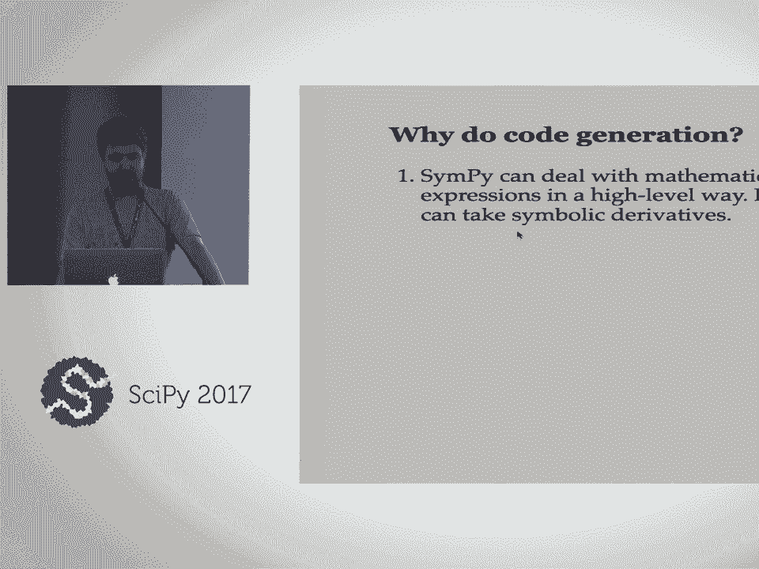

 deal with expressions in very high level way。 I can do things symbolically like take derivatives。

 or it can solve equations or take integrals or do all sorts of things。 You can， by doing。

 things automatically you can avoid mistakes。 So doing things naively if you're just writing。

 out your C code by hand， you're going to end up making a typo or sign error somewhere。 By。

 doing things in a higher level way you can avoid that because SMPI is basically driving。

 for most for me。 You can deal with insanely large expressions。 I don't know if we're going。

 to show that today but you can have expressions that are literally millions of lines of code。

 would be literally impossible to do by hand because it's very large but computers are。

 very good with doing bookkeeping。 And then the final is -- which I don't know if we're。

 going to be talking about today but just something to sort of think about。 SMPI is a。

 very smart library。 It can do sort of -- it can sort of simplify expressions in ways that。

 standard C compilers or Fortran compilers don't know how to do。 It can do things like trigonometric。

 simplification and inside a factor of polynomials and things like this。 So here's a quick outline。

 for today。 We're going to try to get through as much as we can。 We're going to start with。

 a -- just a refresher for SMPI。 We're going to go over some code printers。 We're going。

 to look at the easy way to do code generation which is sort of this higher level of abstraction。

 I was talking about。 Then we're going to go sort of lower abstractions and the harder。

 way basically and then we're going to look at doing some site denization and we have。

 bonus material if this time。 But don't be afraid to slow us down。 Raise your hand。 Jason， do。

 you want to go over the sticky notes maybe at this point？ So we just passed each of you。

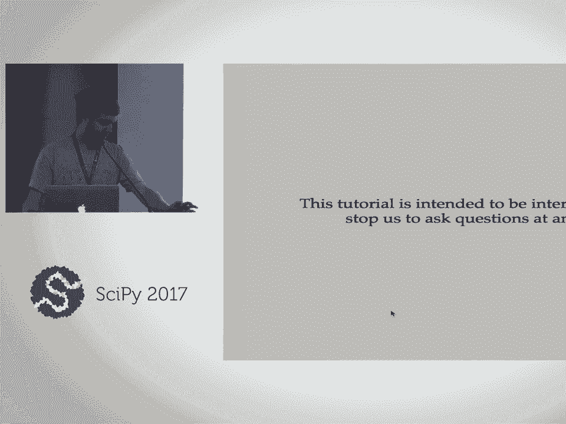

 a blue and a red sticky note and we're going to use those during the exercises you may。

 be familiar with this from sulfur carpentry or other workshops。 When we ask you to do an。

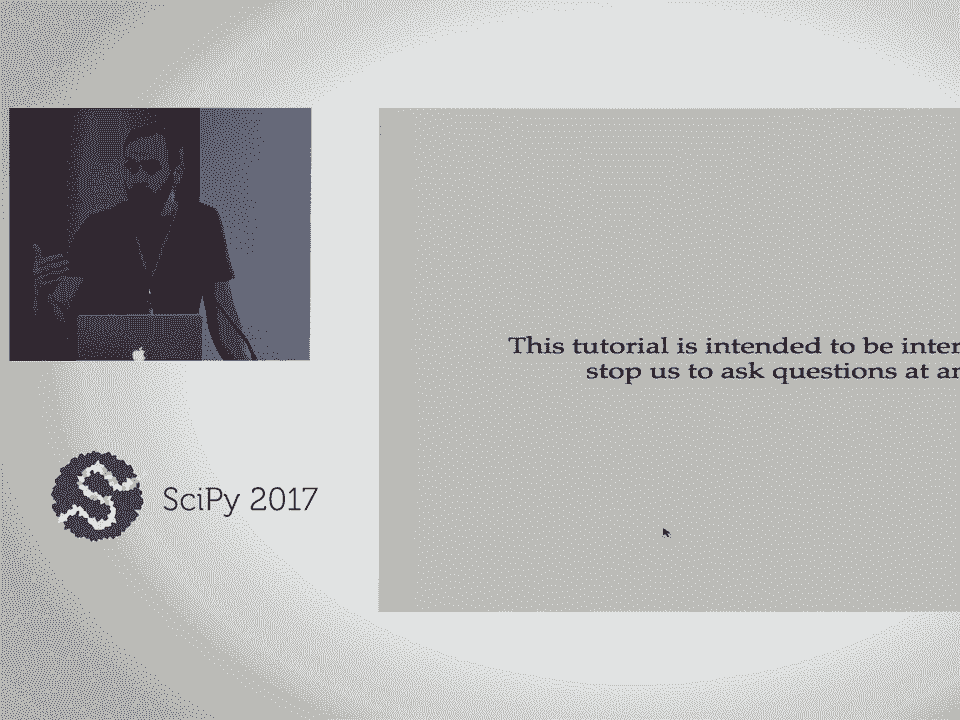

 exercise， when you're done you'll place a blue sticky note on your laptop so we know。

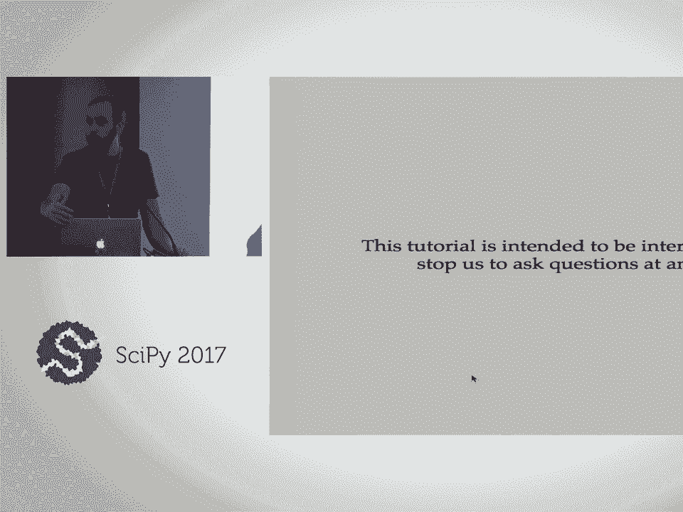

 how many people are done。 And then if you need help at any time just put a red sticky。

 note in one of the helpers。 Everybody raised their hand。 It's going to help today。 The。

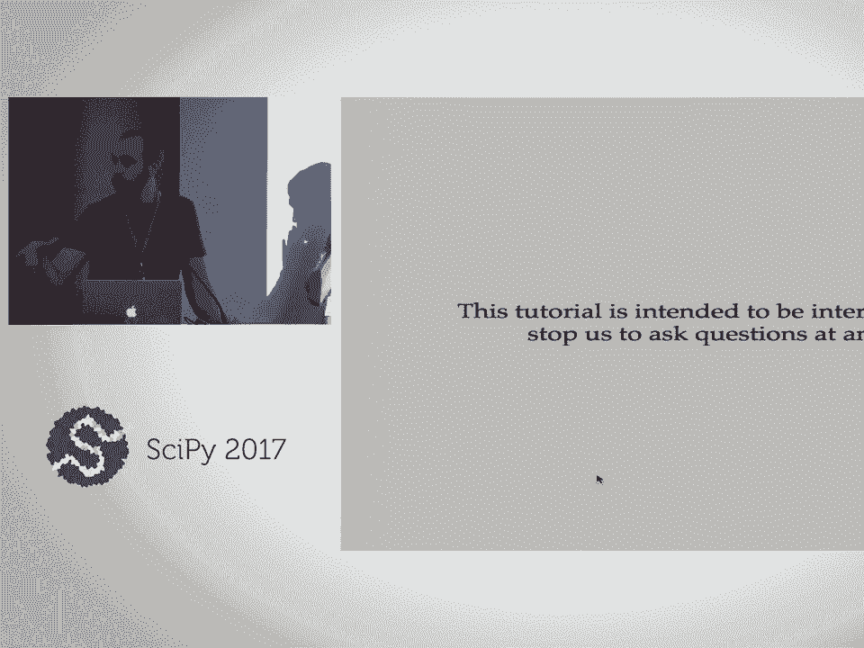

 four presenters we have Mark and the yellow shirt and Allen I think are you going to help。

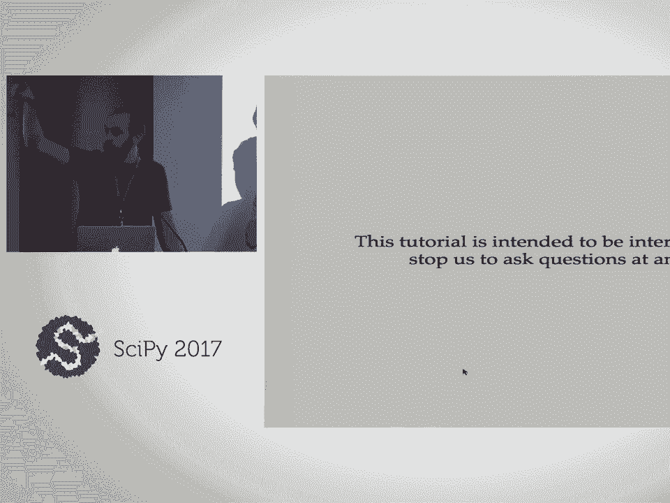

 too？ And Allen in the corner。 So all of us will be here to give everybody a hand。 Sartage， too。

 He's a simpie dev。 So we'll put those red sticky notes up and we'll come around。

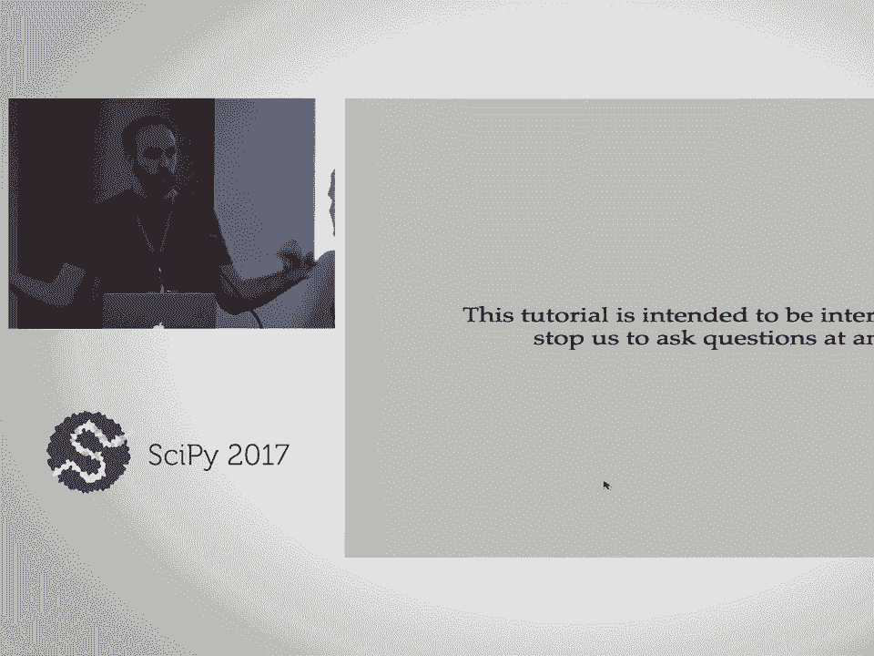

 and help you out。

 Alright， so let's jump in and find is this the live version？ Okay。 Okay， so let's start。

 with this intro to simpie expressions on notebook here。 And so this is going to be a refresher。

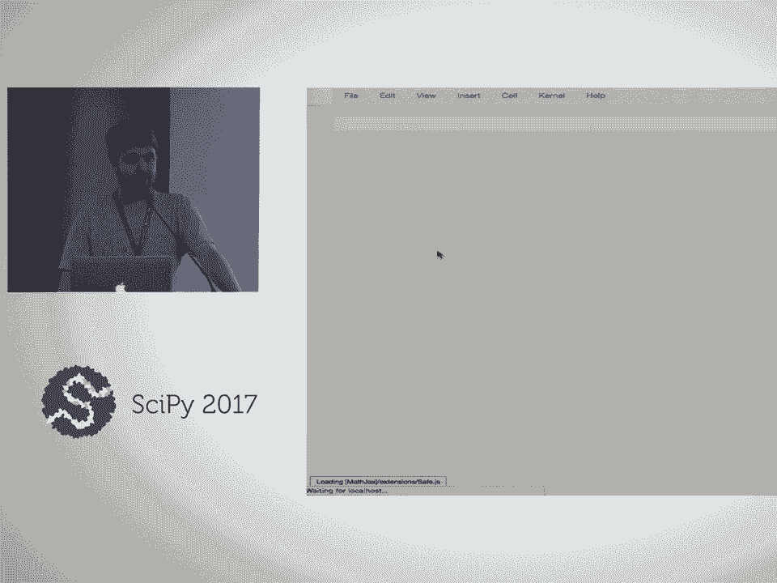

 If you need me to slow down， just tell me to slow down。 So quick introduction to simpie。 First step。

 if you're using simpie in the notebook， you generally want to use a synip。

 printing function that's going to print， that's going to make it so that things print as。

 latte instead of as strings。 It's going to be much easier to sort of see what's going。

 on with simpie expressions。 So the most basic simpie object are symbols。 You create them。

 with the symbols function and you assign them to the python variables。 So here I'm creating。

 symbols x， y， and z。 Also is the font size okay？ Do we need to go up， down？ I doubt we。

 need to go down。 But is that hopefully better？ Okay， good。 Okay， so this here I've created。

 three symbols x， y， and z。 And so， yes， so now I can use these to create expressions， for， example。

 And you know， symbols can， symbols is actually pretty smart as far as the latte， printing goes。

 So for example， here I've created a symbol， symbols alpha one omega underscore。

 two and it recognizes that these are Greek letters。 It recognizes that these numbers are。

 subscripts on the symbols。 And so here's， so here's an example expression with simpie。

 They just build it up naturally。 And so quick， so your first exercise now is here's a moderately。

 complicated， hopefully not too complicated expression。 This， you may recognize this， this， function。

 If you don't recognize it， it comes from the normal distribution。 And so your。

 exercise is simply to just create this expression in simpie。 Oh， and I don't have it here， but。

 the square root function is SQRT。 And go ahead and use this sticky notes when you're ready。

 All right， well， so I guess I'm just going to go over it now。 So the first thing is we。

 already defined x， y， z up here。 So we have x already defined， but there's two other symbols。

 in here that we don't have to find the sigma and this mu。 Pi is not going to be a symbol。

 here because pi is a number。 So pi is already defined by simpie as this number。 But we don't。

 have sigma， we don't have sigma defined yet。 So sigma and mu are symbols。 And then I'm just。

 going to basically just type it out as I see it。 So one over the square root of two times。

 pi times sigma squared times， and then exponential is just e to the exp， exp to the negative x。

 minus mu squared over， and then I need parentheses here to group this denominator， two times sigma。

 squared。 And you see simpie has done some automatic simplification， but it's the same。

 expression if you look closely。 So are there any questions on this？ Yes？

 >> So the question is it didn't simplify the sigma squared。 And the reason for that is。

 that the square root of x squared is not equal to x in general。 This is only true if x is。

 positive number。 And so we didn't tell simpie anything here about sigma。 So as far as simpie， knows。

 sigma is just some complex number。 And it's only going to do these simplifications。

 based on what it knows is true for all complex numbers。 So if I knew， for instance， that。

 these were positive， I can type positive equals true here in the symbols function。 These are。

 called assumptions。 I don't think we're going to be using assumptions a whole lot today。

 but this is one way to get simpie to do some of these simplifications， especially relating。

 to this square root of x squared deal。 And if I do that， now you can see it knows the。

 square root of sigma squared is just sigma。 So good question。 Thank you for bringing that， up。

 All right。 So now I want to go over just some important things that can trip you up， using simpie。

 These trip up everybody。 So I think one of them already tripped somebody， up。

 At least one person up in here， probably a few of you。 So if when simpie evaluates， an expression。

 basically， Python just evaluates it and simpie has an operator overloading。

 But when Python sees sort of this integer divided by integer here， this sort of this one over。

 two here gets evaluated before simpie ever gets kicked in。 And what Python is going to。

 do to this is going to create a floating point number。 So you can see here we have x plus， 0。5。

 which is sometimes that's fine for what you want。 But often， simpie works better if。

 you use exact rational numbers instead of floating point numbers。 And so the trick here。

 is you just use the， you can use either one of these forms。 You can use x plus this little。

 s function。 Basically， this is going to， this is going to convert this one into a simpie， number。

 And then it knows that simpie number divided by two gives a rational or I can do。

 x plus the rational number one half。 And so now we get an exact number。 And this is only。

 an issue if you're dividing basically integer literals because Python evaluation order basically。

 kicks in。 So if you have an issue where you're getting floats or you don't want them， you。

 can just wrap your integers with this s function。 Second gotcha， which hopefully you knew this。

 before this previous exercise。 But in Python， the carrot is not the power operator and simpie。

 follows Python conventions。 So carrot is actually XOR。 This is a logic expression right here。

 which is not what you want。 So you have to use this double star。 And then the final gotcha。

 all simpie expressions are immutable。 So if you just remember that， so no function anywhere。

 in simpie is going to change its in by expression in place。 It's going to always return a new。

 expression。 So right here， I've taken this thing x plus one， I've decided to the variable， expert。

 And now I'm using this function subs to evaluate that at x equals two。 And so that， gives me three。

 But this does not change the original expression expert。 I still have x， plus two on here。

 So this subs is return new thing here。 Okay， are there any questions， on what we've done so far？

 All right。 So the next thing is floating point numbers。 Simpie。

 in addition to doing symbolics has the ability to evaluate numeric expressions， symbolic， exact。

 numeric， symbolic expressions， it's a floating point number。 So here's the exact expression。

 for square root two。 And if I use the val f function， that's going to give me a float。 And。

 here if I just do a val f， I get a float。 If you put a number here， like seven， that's。

 going to give me a floating point number with seven digits。 So， and simpie has arbitrary， precision。

 So I can put any number here I want。 I can put 100。 Get 100 digits of this。 So now。

 your exercise is to compute 100 digits of pie。 Okay。 See a lot of blue sticky notes。

 There's not intended to be a difficult exercise。 So yeah， we just take pie and call it the。

 val f method on it with 100 as its argument。 And here are the first 100 digits of pie。 And。

 of course， if you want to play around with it， you can do 10，000 digits of pie。 Eventually。

 it's going to start taking a little longer to compute all those digits。 But there you go。

 What are you doing？ Actually， oh， okay。 So the next thing to go over to as a review is。

 the undefined functions。 So up here， the symbols， these create these variables。 But if you want。

 to have something that actually depends on another variable， then you need to create a， function。

 And this is important whenever you want something basically to have a derivative。

 that depends on a variable is typically where this ends up getting used in these terms of。

 code generation。 And so this is function you call function and then the name of the function。

 So that creates a function called f。 This is an undefined function。 And so now I can create。

 expressions with f of x。 And so now this gets used by the， we'll see here it gets used by。

 the derivative functionality。 So to take symbolic derivatives， we use the diff function。 And。

 then the syntax is you just do diff and then the variables that you want to differentiate。

 So here we have this expression sine x plus one times cosine y。 We're going to take the。

 derivative with respect to x and then the derivative with respect to y。 And so， you， know。

 if I do this stepwise， here's a derivative with respect to x。 Here's a derivative of this。

 now with respect to y。 And this also works with undefined functions。 So if you want to。

 build a node e， this is how you build a node e。 Basically you take the derivative of an。

 undefined function， which is going to be our next step actually。 So your exercise now is。

 to basically write an equation for this， this wave equation。 And remember here this is sort。

 of implicit in this， the way this is written。 But this u here is not going to be a symbol。

 because u depends on two variables。 It depends on t and x。 And then one final thing is if。

 you want to write something with an equal sign here， you can use this eq function。 So。

 go and do this in exercise。 Alright， well so I'm going to go over it。 So the first thing。

 is we need to define this u function。 So u is just function u。 And then u is going to。

 be a function of two variables。 And you sort of， I'm sort of free how to write that， but。

 I'm just going to write it like this。 Oh， and we can see already that t is not defined。

 We never defined t。 So， and we also noticed up here that we didn't define c either。 So。

 I'm going to just define those t and c are t and c。 And so now I have a function of t， and x。

 And so I'm going to create， I'm going to use this eq object。 And so the left hand。

 side is the derivative of this with respect to t twice。 And the right hand side is c squared。

 times the derivative of u of t x with respect to x twice。 And just to show you something， here。

 you can either write t comma t or you can write， you can just write the number after。

 the variable for the number of times to take the derivative。 Any questions？ I'm going to。

 leave that up there for just a little bit。 You have a question？

 You could have been a function of t on the left and a function of x on the right。 That's， right。

 But I'm assuming that we mess us up later。 Well， yeah。 So， I mean， I can also， I mean。

 you need to be consistent。 The sun defined， function doesn't。

 sim pi doesn't know anything about it at this point。 Doesn't know how many， variables it has。

 It doesn't know what variables are supposed to be with respect to。 So， yeah， I could have。

 I could have also written this whole thing as x comma t if that makes more， sense to you。 No。

 I was thinking even worse， like only a function of x on the left。 Only a function of， t on the left。

 Oh， okay。 Well， yeah。 So， that would be wrong。 That would actually， that's not what this。

 equation means。 And you can see here， it's， so let me， let me actually show this。 So， if。

 you notice the difference here， sim pi is even printing these differently。 This one， it's。

 printing to d。 This one's printing a partial。 So， this one is， this one here is a partial。

 differential equation。 This one is some weird ODE where we've used a different variable on。

 the left-hand side and the right-hand side。 But this is not the， this is not the same thing。

 as this。 So， you know， this is， this is what you get on Wikipedia。 And， you know， they。

 they tend to leave out the， the of t and comma x everywhere because it gets tedious when。

 you're writing it down。 But， sim pi needs to know that what variables it depends on。 And， yeah。

 we can write things that don't really make sense physically， but they make sense， mathematically。

 You know， I can write， you know， I can pretend like it's just one variable， here。

 I can get my variables backwards。 So， you need， you need to keep things straight。

 One thing that helps if you're writing differential equations， let me actually cut this。 Let me。

 delete this。 So， so one thing you can do instead of defining function u equals function u， I。

 can just write this。 So， that way u， the variable u is always just going to be this function at， tx。

 And so， if I'm never going to use u for anything other than calling it and tx， then。

 I can keep this like this。 It's a good idea。 If you never use it except in this context， yeah。

 The thing， the thing that， we're this can trip you up now is if you try to call， you。

 if you try to evaluate this， this， this isn't the function， this is the function evaluated。 So。

 you'd have to do， you know， you'd have to do subs， say at t， zero， x， one。 But， yeah， if you。

 if you are creating differential equations， it's this can save typing and mistakes and， stuff。

 Any other questions？ All right。 Matrices on matrix， this uppercase matrix function creates。

 matrices。 There are several different ways to create a matrix。 If you， if you look at， the help。

 you can see them。 But， the most simple one is just a list of lists。 And you， can see here that this。

 these are basically the rows of the matrix。 So， one comma two， three comma four here。

 And if I pass just a list with one level of nesting， this is going， to create a column vector。

 And so， matrices in SimPy can contain anything that can be， symbolic expressions inside of them。 So。

 here's a matrix with x， y， z。 And matrices， of course。

 they support all the matrix operations that you'd expect。 So， I can do times here。 I think。

 we're actually running Python three five here。 So， I can use this matrix multiplication。

 operator too， if I want。 But， may， SimPy does just use a time symbol in matrices for multiplication。

 And， you know， there's a whole bunch of other advanced things you can do， for example， I。

 can take Jacobians。 So， this， this， here's the Jacobian of this matrix with respect to x， y and z。

 And so， now your exercise is just create， your exercise is actually three parts。 So， first。

 create this matrix。 And you're probably going to want to save it to a variable。

 because you're going to use it for the next part。 And then， second， create this matrix。

 and multiply it with this one。 And that should give you this matrix。 And then， finally， take。

 the Jacobian of your， of this matrix。 And I'm going to， I'm just going to leave this up。

 so that you can see this part。 All right， well， we're， I see a lot of blue sticky， so， I'm going to。

 I'm going to jump ahead here， try to type out this answer as fast as I can。 So， 101， negative 123。

 123。 Oh， and I'm just going to call this m。 And then， my vector， is going to be x， y， z。 And。

 since it's a column vector， I just write a list， and I， write a list here。 And then。

 so now I want to do m times v。 And let's call that a。 And。

 so now I want to take the Jacobian with respect to this。 So I can just do Jacobian v here。

 or I could retype out x， y， z。 And you may notice this is， this is going to be familiar。

 This is the same thing as m。 So， if you take a constant matrix times a， a matrix of variables。

 and then you take the Jacobian， which is basically the matrix derivative。

 the derivative of constant， times a variable is just the constant again。 Okay。

 so one more thing in this notebook。 Question？ Oh， sorry。 Yes？ >> Just a question。 So you have the。

 the variable x， y， z， and the matrix。 >> That's right。

 >> But if you wanted like the horizontal matrix。 >> Okay， so if you want a row matrix here。

 so I can， I can type this as an nested list， x， y， z。 Just using the same syntax here。

 So if I have nested list， then each list here， is a row。 I can also type v。t。

 That'll give me the transpose of this column。 Either one， of those will give you what you want。

 All right， so final thing is these matrix symbols。 These are useful in code generation。

 for representing matrices in the code that you're generating。 And so now I'm here， I'm。

 creating some integer symbols and I have a matrix symbol M， matrix symbol B。 And this， here。

 this second and third argument is going to be the shape of these matrices。 So I have。

 M and B here I can take M times B。 And so I see here， for example， M。shape。 This is an， N by M。

 M is an N by M matrix。 And B is a M by one column vector。 And so I can multiply， these。

 The shapes align。 And yeah， if I take the shape of the product， it knows that the。

 shape is N by one。 And there's different functions you can use on matrix expressions。 The transpose。

 for example， a lot of functions don't actually evaluate unless you call this， do it method。

 So you can choose whether to have a transpose evaluated or not。 And what， do you think？

 Do we have time for this exercise？ Or should we skip it？ Well， I have 20 minutes。

 for my next notebook。 So if you want to do this exercise， by all means， do it。 But I'm。

 going to skip it。 And there is also some material down here if you want to learn some， more。

 I think our latest version of our tutorial is not actually going to use anything below。

 this matrix expression。 So it's not something that we need to know。 All right， so now we're。

 going to the code printers。 And this is just going to be basically kind of showing off。

 more than anything。 We're just going to show you all of these languages that we support， and SIMPAI。

 So here's a function。 I chose this function because it sort of has a good。

 demonstration of how different languages represent things mathematically。 So absolute value sign。

 of x squared here。 And we can see how is this function represented by different languages。

 And so we can just run through here。 All these functions are going to take an expression。

 and convert them to a language。 And， okay， yeah， so the first one is C code。 That can。

 reverse it to C。 So we can see absolute value is now FAB's power is this power function， which will。

 F code is for a tran， which looks remarkably like Python， which is not a coincidence。 In fact。

 it looks exactly like the Python code。 Here we have Julia。 And we have a little， way of Julia。

 Julia looks pretty similar to except they have this different power operator。 JavaScript。

 Everything is prefix with the math。 Mathematica。 The Matlab printer is called， Octave code。

 but the code generated by Octave code should work with Octave or Matlab。

 This is -- this rest code is new and the latest version is sent by。 So this is -- this is。

 what this function looks like in rest。 Here we have R。 And here we have C++。 And I forget。

 what the default standard is for C++。 Yes， Nathan？ >> So， what does part of the code。

 unless you include libraries or -- actually， I thought， it was a process。 So --。

 >> So I think -- I think， like， for example， the C1 is just going to assume you have math。h。

 for example。 We are going to go over later。 Yeah， like， you know， if -- so this is sort。

 of going back to here。 This is sort of this top level of abstraction。 We're just generating。

 expression。 So later we're going to look at， okay， what happens if we -- we would not -- not。

 just the expression， but we want some other code that goes with it， like a header and some。

 stuff to wrap around it。 And also， if you look， all of these functions have options to them。

 So C code， for example。 So C code， I can change the C standard that I'm targeting。 I can。

 decide to assign it to a variable， whether it's going to be T referenced， things like this。 And so。

 for example， F code。 Let's look at F code。 And I think -- I don't think this is， actually -- yeah。

 so these are the different for trans-standards。 I think this expression。

 is the same regardless of what standard we use。 Yeah。 So the default standard is -- is， it 95？ No。

 it's 77。 Yeah。 So -- oops。 So that's the default standard。 This expression doesn't， matter。

 but other things might -- so yeah， your exercise is just play around with this。

 Come up with some functions， see what works， see what doesn't work， what's different for。

 different languages。 A lot of these -- a lot of these printers， some of them support more。

 things and some by than others。 So you may run into errors。 And， you know， if you have any。

 questions or observations， feel free to raise your hand or use the red sticky note。 It's。

 how people doing。 Anybody discover anything interesting？ Which of these languages is the。

 most different from the others？ I personally think that Rust is the most unique language， here。

 at least in terms of its syntax。 Is anyone here considering themselves an expert。

 in any of these languages？ We're only Python experts here。 So the question was， do any languages。

 support derivatives？ Do you mean like taking a numeric derivative or --。

 >> I just made a derivative expression。 >> Oh， yeah。 Well， so probably not。 That's something。

 that you would get out of like a numeric library。 So like， for example， an umpire would。

 have a derivative function。 But derivative would be more like a sub-protein call。 For the most part。

 if you have an expression and you -- in some pie， you just take a symbolic。

 derivative and then generate that。 Okay。 Sorry with you here。 >> Is it true？

 >> Is it something like that as you usually， like abandoned hope while you enter here？ >> Well。

 I don't know JavaScript very well。 Does， JavaScript support hyperbolic tangent in the math library？

 If you have a JavaScript library， that supports it， you can extend the printer。

 I don't know if that's something we're going， to go over later about how to do that。

 Or if hyperbolic tangent， what is -- so， oh， my， gosh。 So that's tan h of x。

 So we can use sim pi to rewrite this using exponentials。 And it does not do this。 So， yeah。

 this is another powerful thing about sim pi。 It knows， these identities。

 We had a question over here。 >> What is it like for transform in each other， and these spaces？

 >> Okay。 So the question is why does for， transform put some spaces？ And that's a good question。

 It's because this for transform printer， is kind of a -- >> You can enter a form of equal to three。

 So if you were in the other， way， you could just go back to the other side。 >> Like that？

 >> [inaudible]， >> Oh。 No， it doesn't -- it doesn't know what format means。

 It's because it's one of these， things that we might actually end up changing。

 It's because it's sort of designed for inserting， into the function。 Oh。

 just the 90 standard doesn't do it。 No。 There's a way to do it。 Yeah。

 So this guy is standing in the back。 If you're in Dahlgren， is actually a Google。

 summer of code student this year。 He's working on improving our code generation。 So we have。

 a lot of sort of dusty corners like this that might end up being cleaned up。 >> Well。

 they're brand new。 The question is why are rust and C++ not in the name namespace？ Honestly。

 they probably could be。 Especially C++。 I don't know what you guys think about， that。 I mean。

 you know， given that the rest of these are， I think -- I don't think there's。

 any reason that they shouldn't be。 It was probably just an oversight when they were added。

 It's always easier to add something to namespace than to remove it。 Are there any other questions。

 on the ones that want to move on to this last exercise for the last few minutes of my section？

 And this is sort of going more in depth on this JavaScript printer。 So -- this is just。

 some poorly played if you execute。 And that doesn't work。 Interesting。 Why don't I have。

 the library installed？ Oh， I know why。 Okay。 So I'm actually a very bad person。 I didn't。

 actually activate the environment。 But all you guys did， so it's going to work。 That's right。 Okay。

 So let's make sure this stuff is imported again。 Okay。 So， yeah， and， if you run this boilerplate。

 we've got a little -- some JavaScript template here。 It's， not too important what this is doing。

 but we're basically using a library called chart。js， which is， you know。

 some fancy JavaScript thing。 And we've got a lot of boilerplate here， but， if you look at this。

 fill me in， basically we're saying here's two functions， f of x， and g of x， in JavaScript。

 And these are going to end up getting plotted with this library。 So let's create two functions here。

 So let's say the first one is sine x， the second one， is cosine x。 And there's also this chart ID。

 which is， again， JavaScript stuff。 You can， just put anything in there。

 And so I convert these -- wanted to convert these to JavaScript， code。 So， for example， JS code， f1。

 is going to convert sine of x to JavaScript。 And then， so I plug that into this JavaScript template。

 And， yeah， so our top function now is going， to be sine of x and our bottom function is cosine of x。

 You know， and so， you know， maybe， I can -- maybe I can try different things here。

 So here's cosine of x squared， for example。 And so your exercise now is here's two equations。

 I don't -- they're intentionally quite complicated， equations。

 But your exercise is now to just plot these as you're top and bottom。 Yes？

 >> So to recruit the code from matrix vector multiply， I just could say star D， okay， the。

 question is you print a code for matrix in JavaScript， you mean？ >> In C。 >> Oh， in C。

 So the question is， why does the matrix vector multiply not expand， out？

 So it doesn't -- we're basically assuming that if you're multiplying two vectors， you're。

 going to be using some library to do that。 So it's not really supported directly。 The。

 thing that we'll be using matrix symbols for is sort of accessing the different elements。

 of the matrix。 So doing something more complicated than multiplication。 But yeah。

 so that's something， if you wanted to support just multiplication。

 you would need to tell the printer， you know， what -- you're simply using some matrix library to multiply for you。

 So you need to tell it， what that function is。 And so the -- let me go back here and just show you。

 And we'll get， to this later。 But if you look at -- I wonder if this saved at all。 Yeah。

 so if you look at this， A here， let's wait for math jacks。 Here we go。 Oh， that's。

 not the one I want。 That's not even the one I want。 This one。 All right。 So if you look， at this。

 I sometimes mean this thing here is this matimal object。 So what you would be。

 doing is telling the printer how to print matimal objects and， you know， you tell it。

 whatever C function。 And that's what we're going to go over later。 The other questions。

 it looks -- I see a lot of blue sticky。 So I think I'm just going to go over this。 This。

 is -- we basically just copy/paste here。 And so this is going to be our top function。

 and so these crazy equations end up plotting something like looks like this。 These are。

 the Batman equations。 All right。 So are there any other questions on the last two notebooks。

 that I went over？ Yes。 There is a Python code printer， but it's something that needs。

 to be cleaned up actually， so we didn't include it in the tutorial。 Right now there isn't。

 actually like a very clear just Python versus sympie code printer。 It's something that we。

 were going to try to clean up， but I guess we didn't get to it。 But yes， you can definitely。

 co-generate to Python itself or to Python with NumPy or Python with SyPy。 Do you have， a question？

 >> Yeah。 So on the plotting on the one x-axis， all of the labels are -- these are really long。

 decimal numbers for like the sign-in code sign functions。 It would be really great if they。

 could be in terms of pi。 Is there any way to make the labels in terms of pi？ Is that， really long？

 >> Well， it's whatever's going on in this charting library。 I didn't write the establishment。

 template， so --， >> You just have to -- >> You would need to tell chart。

js whatever how to get the labels。 >> Yeah， the question was about these -- making these labels look like something nicer than。

 just long-flowing point numbers。 All right。 Well， if there's no more questions， that's。

 the conclusion of my section。 Who's next？ So the question now that we'll have to decide。

 on is are we going to -- do we feel like we need a break now or should we break after。

 Bjorn's section in an hour？ >> Raise your hand if you'd like a break now。 Or people --。

 >> All right。 So， yeah， quick， five-minute break。 And then Bjorn。 >> As Aaron said。

 I'm actually working this summer on a scholarship from Google， in Google's。

 summer code to work on the code generation capabilities of Simpy。 So we had a question。

 about the Python printer。 So there is a Python printer， but it prints code that assumes that。

 we already have Simpy in the namespace。 So that's quite sub-optimal。 We're working on。

 changing that。 So my name is Bjorn， and I'm a PhD student in Chemistry， Competition Chemistry。

 Stockholm， Sweden。 And my part here will actually be looking at the easy way。 So we're going to。

 try to use functions that generate Python functions。 And we're going to apply it to， a few examples。

 So I raised the hands。 How many people here are familiar and feel comfortable working with。

 ordinary differential equations？ All right。 So that's the vast majority。

 So we're going to skip the notebook on ordinary， differential equations。

 And those of you who need a refresher， you can have a look at， that notebook。

 So we're going to skip ahead then， straight to the notebook called Lambda-Fi。

 So Aaron showed us some examples where we could evaluate expressions numerically。 And。

 he did so using the EvelF method。 So if we import Simpy into our namespace and just take an arbitrary function。

 depending， on two variables， so mapping R2 to R1， we can run the sub-command and exchange our variables。

 Oh yeah， sure。 Is this better？ All right。 So running the sub-command， we can run the， sub-command。

 Is this better？ All right。 So running the sub-command and EvelF gives us a。

 numeric value for this expression。 The problem with doing this is that it is quite slow。 This。

 EvelF is a general arbitrary precision function。 So if we would time this one， we can use the。

 sub-command。 We see that it takes almost a millisecond for each call。 And if we compare。

 that to a pure Python function of the same representing the same equation， we see that。

 it runs in three microseconds。 So if we are doing this in a tight loop。

 doing some numerical computations， this becomes problematic。 So。

 and we don't want to write this Python function by hand。 So there's a function in。

 Simpy called Lambdify that generates Python code， executes the Evel function on it and gives。

 us back a working function。 So running Lambdify gives us G。 And if we time the G function。

 we see that it's just as fast as the Python version。 Another good thing about using。

 Lambdify is that you can change what back end it targets。 So we can have it generate functions。

 using NumPy functions which then broadcasts to arrays of arbitrarily shapes。 So if we run。

 Lambdify and as of the latest version of Simpy， which you all have， the default is that it's。

 going to use the NumPy back and when available。 We can see that we can give H an array here。

 And it will give you an answer which has the same shape。 So this is the NumPy broadcasting。

 that kicks in。 And this is just to show this once more。 If we have two arrays， one or two， vectors。

 a column vector and a row vector and give this function those vectors， it will。

 do the NumPy broadcasting for you。 So the out shape is the number of rows in the row vector。

 and the number of columns in the column vector。 Sometimes it is important that you have control。

 over the function signature of the function that's generated by Lambdify。 It can be because。

 of reducing a numeric solver from the SciPy library and it has certain requirements on。

 the signature。 To specify this， we just give an arbitrarily nesting of our arguments in。

 the first argument pass to Lambdify。 So in this case， we will have a， as of now， the first。

 argument。 We will have a symbol said which is actually a tuple of three symbols and it means。

 that the function generated by Lambdify here， function two， will expect to get a length free。

 tuple as its third argument。 So this works as expected。

 So now it's time for you to do an exercise and we have this。

 little exercise line magic in the Python notebooks。 So if you run the first few cells and evaluate。

 the exercise cell once， it will expand and you need to fill in the triple question marks here。

 If you want to take a sneak peek on the solution， you can rerun that same expansion but instead。

 of using that exercise magic， you can use the load magic。

 So this would give you the solution but I'm not going to run that one。 So give it a shot。

 and put up the blue stick in this one here。 So it was a good remark that we got。 We can。

 change this mathplotlib inline to be a mathplotlib notebook。 If you change that， you can actually。

 get an interactive widget which allows you to manipulate the data and look at it from different。

 angles。 Question？ >> What's the mathplotlib notebook you use？ >> Oh yeah。

 I think most people are getting done。 So let's take a look at the solution。

 So getting the partial derivative there， the mixed partial derivative， we need to write。

 x and y and the function which we're interested in is the Lambda Phi function。 And running。

 we can first run this with the inline。 It will give us a PNG image which is static。 So I can't。

 really rotate the axis。 I can't zoom。 I can't do anything with it。 If I rerun this with a。

 mathplotlib notebook magic。 Might have to rerun it。 Huh。 >> I have to rerun it。

 >> I have to rerun it。 >> Okay。 >> Huh。 >> I have to rerun the mathplotlib。 >> Okay。 All right。

 >> Yeah。 >> Oh yeah。 Yeah。 Here we go。 Thanks。 So now you can actually grab this and， so。

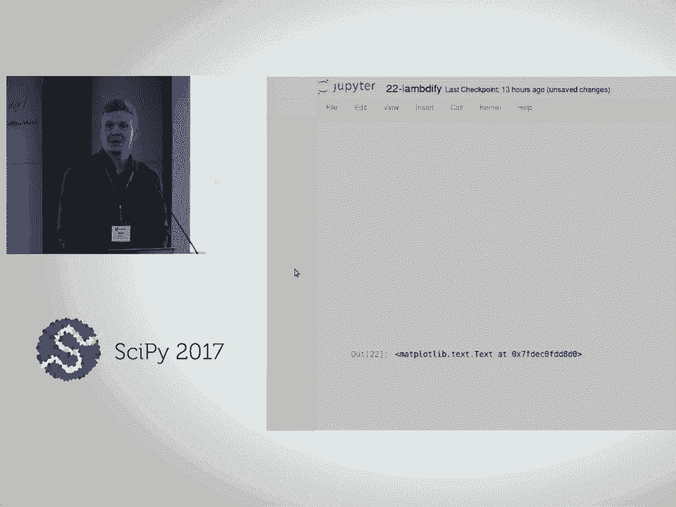

 yeah， you can actually rotate the graph and it rerun this as this three dimensional picture。

 And you get the sense of the depth。 All right。 So that was our exercise notebook on the Lambda Phi。

 function。 Let's now take a look at the next notebook and see how we can apply this to an example。

 from chemistry。 So let's move to the chemical kinetics introduction notebook。 >> Okay。

 >> Is this something that changed in the last three minutes？

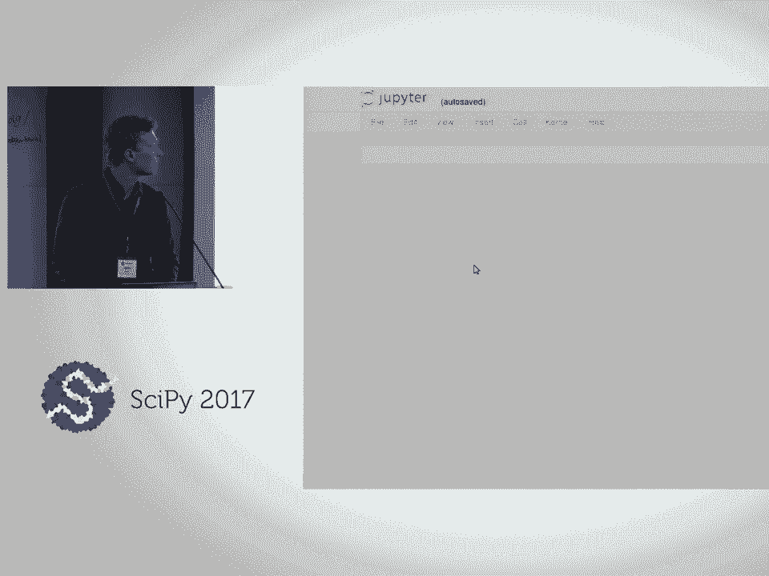

 >> Oh。 >> Okay。 Sorry。 >> All right。 So chemical kinetics is actually the study of the time evolutions of concentrations。

 in reactive systems where we have competing chemical reactions occurring。 So we will be。

 looking at a rather simple， yet interesting chemical reaction and it's the formation and。

 breakdown of this molecule， nitrous or bromide。 But before we look at that actual case， we。

 need to look at the governing equations。 So the most rates of chemical reactions follows。

 the law of mass action。 So that the rate of change is proportional to the concentration。

 of the reacting species raised to the power of the multiplicity， which they are appearing。

 on the reacting side。 And then we can formulate ordinary differential equations as a sum of。

 contributions from all the different directions。 And for a constant temperature and pressure。

 there's a coefficient which is the rate constant， which， as you heard， is constant。 But it's。

 often under the assumption at least constant temperature。 So the law of mass action looks。

 like this。 And studying this chemical reaction， we have two processes， a forward process。

 forming nitrous or bromide， and a backward process where decomposes into three constituents。

 two NO molecules and one BR2。 And we were just going to rename these to C1， C2 and C3。

 the concentrations。 So NO， BR2 and NO， BR are just one， two and three， those are the chemical。

 species。 And applying this law of mass action gives us then this system of ordinary differential。

 equations。 So it's a free state problem。 You can actually reduce this by applying such。

 a mass is preserved， for example， so that gives you a relation so you can reduce the number。

 of states here。 But we're not going to look into that。 And that above equation had two。

 matrices in it， this S and R matrix。 But details are not that important right now。 So we're。

 going to look first， how can we just write this using NumPy， SciPy， not using SimPy？ And then。

 we will look at what can actually SimPy do for us， which helps。 So doing this numerically。

 we will be using a numeric solver from the SciPy library called ODE int。 Raise the hand。

 how many people have used this or another solver for ODEs in SciPy？ All right， a few。 Okay， so。

 then what it needs is that we need to have the right hand side of our system of ordinary。

 differential equations。 That is these three expressions。 So we need to have a function。

 evaluating these three expressions。 So in this case， it's just hard-coded。 We say that we have。

 two reactions forward and backward。 They have those， this form from the low-omass action。 And。

 we just return a list of size three， which is the numeric value of the derivative of each。

 concentration with respect to time。 And if you look at the function RHS， the right-hand side here。

 we see that it has this signature that it takes Y， which is state vector， and then a scalar T。

 and then two scalars。 And it can be any number of parameters passed to the solver。 The important。

 thing with these trailing arguments is that there are parameters which stay constant during。

 the time of integration。 All right， so it's time for an exercise。 So you're supposed now to。

 give the arguments to ODE int。 So this has not anything to do with SIMPY in particular。 It's。

 just reading the documentation string for ODE int。 You can do so。 Maybe the easiest way to do it。

 is to insert the cell and write ODE int and then a question mark。 And then hit execute， and you。

 get the documentation。 All right， I think most people are getting there。 So in this case， the。

 arguments are named quite nicely。 The first argument is the function， which needs to be， called。

 and that's our right-hand side function。 And then it's the initial state vector， what we。

 start with。 And then we need to specify the time points for this。 Where are we interested in。

 getting this state vector？ At what times do we want to know the concentrations？ So that would。

 be our T out argument。 Then the tricky part might be how to specify these arguments。 So in this。

 case， it's just a tuple or k values。 So that k values。 All right， so the integration is done， so we。

 can plot the solution。 And yeah， looks good。 Nothing where it's happening。 This one can actually。

 be solved analytically。 And SIMPY can do it for us。 But we're not going to look at that here。 And。

 writing this right-hand side function by hand， well， it wasn't that bad for this system。 But the。

 number of terms increases rapidly as the number of species and as the number of reactant。

 interactions increase in your system。 So you usually want to do that by some system。 And if you。

 choose to represent it using SIMPY， you get additional benefits， as you will see。 So we're。

 going to construct it symbolically。 And then we're going to have SIMPY generate a function。

 using Lambda-Fi。 And then we'll look at what more can be done here。 So this is also a nice feature。

 of using SIMPY in your workflow。 That if you generate symbols and symbolic expressions， you。

 know that you can take the lot like output from these equations and put it in a paper or a， report。

 And you will know that the equations in the report are exactly those that you used。

 when you ran your simulations。 Because it's， at least to me， happens every now and then。 You。

 write one thing in the paper and in reality， it was a minus sign in the code or something。

 >> [inaudible]， >> So here we can look at the first element in this vector。

 We can just run the logic， command there。 Okay， so it's time for another exercise。

 Now we're just going to construct， a function from this symbolic expression。 All right。

 I think most people are getting there。 So what we need to remind ourselves of is that ODE int function from the side-py library。

 it， needed a special signature， right？ So if we look back at the right-hand side function， we see。

 that we have a state vector and then three scalars。 Where the two scalars are the arguments or。

 the integration parameters， which take constant during the time of integration。 We can construct。

 those by adding， making a tuple called arcs maybe and have it be the symbols y， t。 And then。

 we add the tuple of the k values and this will then look like this。 Oh yeah。

 the symbols t needs to be， defined。 All right， so that gives us the same solution。 So this。

 didn't add that much but for a large class of problems when dealing with initial value problems。

 with ordinary differential equations， these problems may become stiff。 And when they are stiff。

 you need to use an implicit solver。 And the implicit solver would need the Jacobian of the right-hand。

 side。 That is， we need to form the matrix where we take the partial derivatives of each of the。

 right equations with respect to each state。 And Simpy can generate this quite easily for us。

 We just write Jacobian and it's done。 And then we can use this together with Lambda Phi to give us an。

 analytic expression or a function evaluating the analytic Jacobian。 And this can be the。

 difference between a successful integration and a failed one。 Because what the solver usually does。

 or， what it does if it wants to use an implicit solver and it does not have an analytic Jacobian。

 is that， it's going to be using finite differences。

 And depending on the scaling of the variables of the， problem。

 these finite differences may or may not be accurate enough。 So it can really be a dramatic。

 difference to give this function。 All right。 So then we're going to take a look at the final notebook。

 for this part of the tutorial， the easy part。 And it's more of the same。 It's still chemical。

 kinetics。 And we will be looking at how to construct the expressions symbolically from the start。

 Because this time we had the right hand side function。 And it -- we had already done the work of。

 transforming or hard coding the right hand side of the ordinary differential equations into Python。

 And we don't want to do that。 We want to have some domain specific representation。 And just from。

 that， construct our equations symbolically。 So in this notebook， we will be looking at the。

 robot sense example。 So it's an example from the 60s， chemical kinetics。 And it's interesting。

 because it's a stiff problem。 So it's been a challenge。 Even though it's just a free state， problem。

 It's just -- only has free variables。 It's been a somewhat of a benchmark for numerical。

 ODE solvers。 So we have three chemical species， A， B， and C。 And there are three reactions。

 One is the decay of A into B。 One reaction is between B and C forming A and C。 So C acts。

 as what's known as a catalyst。 It is not consumed in this reaction。 And the final reaction。

 which is a biomolecular reaction， converting two B molecules into B and C。 And what you can say。

 by just looking at these three reactions， is that C is never consumed， right？ The only time。

 C is on the reacting side is in the second reaction。 And there it's reformed。 So this system。

 will have a solution at infinite time where all your molecules will be converted into C。 So again。

 applying the low mass action， we can write the ordinary differential equations。 But this time。

 we're going to be representing it as a tuple of a coefficient。 And two dictionaries。

 which specifies the stoichiometric coefficients of each species on the reacting and product。

 side for these three reactions。 So we will start with an exercise for you to complete the function。

 constructing the symbolic representation of this right-hand side function。 So this is the。

 vector which was known as Y dot in the previous notebook。 And depending on how familiar。

 with Python， this may or may not be a hard exercise。 You don't feel too bad if you get stuck。

 All right。 Okay， so I'll give you the first part of the solution。

 the first three question marks there。 So if you look at the equations below。

 this corresponds to the product。 So we need to raise the concentration。

 of the species to this number R。 And the concentration of the species is symbolically available in the C dictionary。

 And then we need to have the right key。 And that's given by the dictionary which we're looping over。

 So that's R k。 And the dictionary values are， that's stoichiometric coefficient。

 So what's left now is this part which corresponds to this summation here。

 The details here are not that important。 I see some more blue sticking out coming up。

 So I'm going to give you the final part here。 So it's just the net multiplicity multiplied by this variable R which we computed just before this loop。

 So， but this， the only thing that's important here is that this function in a general manner does what we hard coded in the last notebook that right hand side function。

 So now we can just give it this kinds of dictionaries and it will do the right thing。

 If we actually run all the cells。 All right。 So that looks familiar from the introduction text。

 So in the next step we will do the exact same steps as we did in the last notebook。

 We will create a function， a Python function， evaluating this expression using Lumbify。

 And you recognize the signature from the last notebook。

 And we will run the integration with some parameters from the literature。

 And what's interesting here is that the solver tells us that it has evaluated the Jacobian a number of times。

 But it's kind of weird because we haven't given it the Jacobian。

 So it did just what I said for the last notebook。 It approximated the elements of the Jacobian matrix by doing finite differences。

 So we'll see if we can provide this function manually or using SimPy to give it an analytic expression。

 So the next exercise is for you to do just this to make a function evaluating the analytic Jacobian。

 >> [INAUDIBLE]， >> Yeah， I can show you how to get the solution。

 So if you just delete the contents of this cell。 And uncomment that magic command。

 Change exercise to load and evaluate the cell。 You get the solution here。

 So it's just as exercise in the comment。 All right， I think most people are getting there。

 What we were looking for here was as you saw in our parents' introductory notebook。

 you can run the Jacobian method on a matrix to get it's Jacobian。

 And if you look at the documentation of the ODE int function， you see that this D fun argument。

 it requires the exact same signature as the fun argument。 So again， it's just the Y。

 T plus K signature again。 And running integration with this function given as D fun。

 we see that it did not need to evaluate the Jacobian quite as many times as when it was not available。

 The difference here is quite small， but it's made because this is a very small problem。

 It's only three variables。 And even on this small problem。

 you can actually see a small impact on the total running time of the integration。

 It's slightly faster giving the analytic Jacobian。 But as the problem grows bigger。

 this effect grows quite rapidly。 So are there any questions at this point？

 So we would appreciate if you just write some feedback on the sticky notes and some negative feedback on the red one and some positive on the blue one。

 Was that it？ Yeah。 And then we'll take it five minutes。 Okay。 Ten minute break。

 So we'll be back here five past。 Okay。 I think it's five after a quarter of my clock。

 so we could go ahead and get started。 So I'm Jason， as Aaron mentioned before。

 and we're going to move into the third section， the third hour。

 The title is the Hardaway Seaco Generation Custom Printers and CSE。

 which stands for Common Sub-Expression Elimination。

 So Bjorn just showed you a high level look use of the code generation facilities in SMPI。

 And now we're going to start to dig into that and sort of expose how some of that works under the hood。

 how you can manipulate and change how it behaves。 And that will lead into the final lesson to that Kenny will deliver。

 That'll show you how to further make use of these things。

 So if you open up the Hardaway Seaco Generation notebook。

 you can read through some of this intro here。 But the main learning objectives that we're going to tackle during this next hour。

 we're going to use a code printer class to convert a SMPI expression into Compilable C code。

 So we're going to start looking specifically font size up。 Oh， every notebook you got to do it。

 Is that good？ Thank you。 The first one is， okay， we're going to generate C code and we're going to generate more complex C code。

 Secondly， we're going to be working with arrays in C。

 so we're going to transform various SMPI expressions into array compatible code。

 We're going to learn how to subclass the different printers in SMPI to have them behave differently。

 We've had a few questions already about， well， what if you wanted to print something differently than what the defaults are？

 So we'll show you how to change that。 And then finally。

 we're going to introduce common sub-expression elimination。

 which is a pre-optimization that you can potentially use to speed up your computations。

 So those are the main things。 We'll go ahead and import SMPI and turn on the pre-printing。

 And which notebook？ This is， how do I get back to that？ Yes， seven the hard way。

 and you can link to it from the index right here。 And the title， yes， seven， oh， seven the hard way。

 Got it？ Anybody else？ Okay， so I've initialized some things。

 So Bjorn just introduced you all to these chemical kinetic problems。

 and he gave a couple of textbook examples。 He works on bigger problems， harder things to solve。

 more complex sets of chemical reactions。 And in particular， he is going to。

 I'm going to use one of his sort of research level sets of ordinary electrical equations that models how water is exposed to ionizing radiation。

 And you might find this in research about nuclear reactors and such。

 I don't know a bunch of details about that， so I'm going to not talk that， but if you want to ask。

 we'll get Bjorn to answer more detailed questions。

 But just of it is that we still have a set of ordinary differential equations。 In our case now。

 we're going to have 14 states。 And I'm already screwing things up。

 Okay， back here。 We have a function that just loads in these symbolic right-hand side of the ordinary differential equations。

 the f of yt， and then the value states， which is y of t。 So as a first exercise。

 have a look at these。 Investigate maybe what types they are， what the expressions look like。

 how complex are the mathematics。 Spend a couple of minutes doing that。

 And you can put up your blue sticky notes when you're done and your red if you need help。

 And one other note， so I have a little bit of different solution。 If you want to see the solution。

 you can double click this cell and it'll reveal an answer。 It may not be the only answer。

 but an answer to that。 But go ahead and give it a try first。 Okay， what did you all learn？

 What do we see？ Anybody like to volunteer？ What equations do we have？ Polynomials。

 So if I -- nonlinear polynomials。 So if I just print this to the screen。

 it'll actually render and I have a vector of expressions that are multivariate polynomials in these 14 different state variables。

 So these equations look a little nastier than before， being that it's more of a non-toy problem。

 But this is also stored in a matrix。

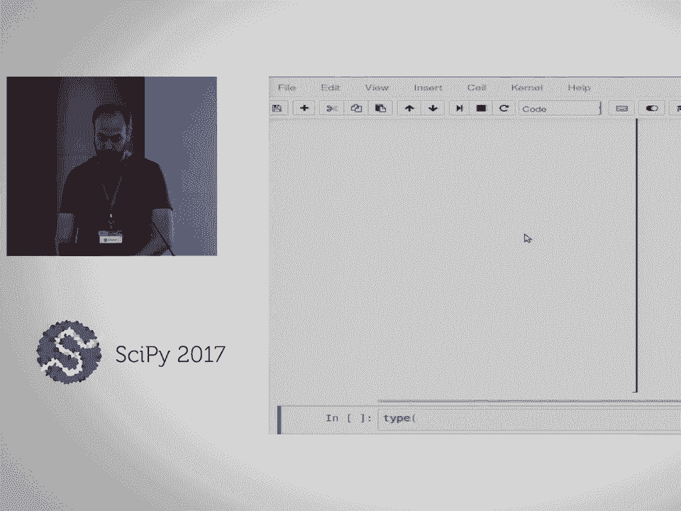

 And then you can check the type to -- I'm sorry， the shape 14 by 1。

 And then our state vector is also a 14 by 1。 Of the various symbols in there。 Okay。

 so you've learned about the Jacobian now in the two previous notebooks。

 So go ahead and compute the Jacobian of this function of the states。

 And take a look at that too and see what you get and if it's what's expected。

 And you can take down your blue sticky notes and then put them back up when you got it。 [ Pause ]。

 So it looks like about half of the people got something。 Put your blue note up if you've got it。

 [ Pause ]， So what do people find here？ So you can use the Jacobian method as we have before。

 What do we end up with？ You already answered。 An awful matrix。 An awful matrix。

 That's what I like to hear。 So we've got a now a large matrix。

 And if I look at the shape which Sartage informed us of。 14 by 14。

 And I'm seeing one column right now and I have a bunch of linear expressions in the states。

 And you can do this on your own screen too。 Scroll through and just sort of see -- we've got a bunch going on there。

 And you can use 196 entries。 Handful of them are zero。

 It seems but most of them have some small expressions in the linear expressions in the states。

 So I think hopefully these two examples here give you some idea that when you have a non-toy problem。

 you can use a little un-wheeled to handle by hand and try to type yourself。

 So this is particularly useful。 And we can work with these and start to generate code from them and then be able to evaluate them numerically。

 So let's talk a little bit about C code now。 So we're going to start printing C code。

 And I think we had some questions earlier。 How do I include libraries？

 How do I have more than just printing a single line of code？

 And we're going to sort of give some idea now of how you might make a compilable piece of C code that was generated by the expressions that we just saw。

 So here I have a template for a C program。 We include both the math library。

 which we're going to use a lot of the math functions in that -- in the C code printer automatically assumes that we'll be using those。

 And I've also included the standard input output library here too so that we can print out some results to the screen。

 If you recall how many people are comfortable writing C programs？ Raise your hand。 Okay， good。

 So at least half， maybe a little more。 I'll give a little refresher here。

 And in general we need a -- there always has to be a main function。

 And the function looks like this。 There's a return type on the left。

 And then within the curly braces is what that function does。 So our main function。

 when we run this program after it's compiled， it will execute the lines in this function。

 The first thing that I do is I introduce some variables， okay？

 And we're going to work with arrays sort of explicitly。

 And I'm going to avoid talking about pointers and things。

 but just sort of talk about this in the context of an array variable。 Everything in C has a type。

 right？ So these are double precision arrays。 This is the name of the variable。

 And then this value here tells me that it is a 14 entries long， 14 double precision values。

 And then I assign some default values to the states， right？ Just some example numbers here。

 one through 14。 With that command everything has to end with a semicolon。 And then here。

 I also have to introduce two arrays to hold the results of our computations。

 And these are essentially empty of sorts when I create them if I don't initialize them。

 But when I evaluate the right-hand side function， that's a 14 by one， so we want 14 entries。

 And then we're also going to map the 14 by 14 Jacobian to a 1D array where all the rows are stacked of 196 entries。

 Okay？ So we're going to just use two simple 1D arrays to store the results of that。

 We're then going to call a function that we're going to create。

 and that's evaluating the ordinary differential equations。

 It's going to take whatever the state values are， which we predefined。

 And then it's going to pass in to these two empty arrays that we're going to populate inside the function with the values that we compute。

 The bit down here is less interesting， but all we're doing is going to print the results after we've done that computation。

 So I'm not going to go over that。 It's just some basic printing code。 And then if we look up above。

 I have this function prototype sort of set up for evaluate ODEs。

 Notice that it's going to return nothing and that it's going to take these three things。

 First is the state value vector array。 I have a const declaration here because we're not going to manipulate that。

 We're going to leave it constant inside the function。

 And it's going to take in these two double precision arrays that we will manipulate inside the function。

 And our job is to do that manipulation。 So we need to fill in right here how to populate the values。

 Given the state values how to populate the values of the Jacobian and the right-hand side of the ODEs。

 So we're going to generate some code that's going to go in that bit there。

 So Aaron showed you the C code function。 There's a class that is operating behind the scenes any time you call those kind of functions。

 And we call these printer classes。 So we have a variety of printer classes from printing to Lateck。

 from printing to the different codes that you saw。 Pretty printing， etc。

 But we're going to load in explicitly the C99 code printer here。

 And all you have to do is initialize it with no arguments if you don't want to provide any。

 And then how do you use it？ Well， all the printers have a method called doPrint。

 And if I pass a simpy object， in our case this matrix to that doPrint method and print it。

 it's going to try to print it。 Interestingly enough here it says this is not supported in C。

 This immutable dense matrix that we have。 And it just gives us the sort of simpy representation of that。

 So why is that？ This next bit here explains that some。 Or hopefully Paul。

 In C we have to make assignments。 I can't just print necessarily the right hand side。

 which are just these arbitrary expressions without assigning them to a variable。

 It doesn't really mean anything useful unless you assign the results of those expressions to a variable。

 So already explained how you instantiate an array。 And then you can。

 I showed you how to populate it like double clicking is not a good idea on these。

 How to populate an array like so。 But you can also index into each item of the array and then pass in。

 in our case a double precision value。 Or a computation that would produce one of those。

 So we need to ensure that simpy code printing prints this left hand side of the equal sign。

 In addition to the right hand side。 So there's a， we introduced the matrix symbol。

 And the matrix symbol is how we sort of provide what the left hand side of all those assignments are going to be。

 So we're going to create a matrix symbol called RHS result which is the variable name that I want of the correct shape。

 Which matches what our right hand side is going to be。 So I can create that matrix symbol。

 have a look at it。 Notice that it indexes into a 2D array by default when you print it。

 But if I pass in that matrix symbol now to a keyword argument to the do print method called assign to。

 It's going to do the right thing。 And notice that I get the first index and I assign that first expression to it。

 So I have the left hand and right hand side of this assignment in the printer。

 And we can scroll through and see all 14 of those array assignments。

 So this is a valid C code now that has these expressions assigned to the entries of that array。

 Okay， so with that new knowledge print out some valid C code for the Jacobian matrix。

 You can take about 5 minutes for that。 And take down your sticky notes which I think they're all down and give us your blue when you're ready。

 When you're done。 Okay， I think that's most everybody。

 So you can do the same thing that we did above。 You basically want to print the Jacobian now。

 And then differently， slightly differently we want a matrix symbol。 I think I've got S-Y-M。

 that matrix symbol。 And I called that I think Jack result。

 Maybe I should put this on a separate line so it all fits。

 And we can pass in the shape one quick way to do that is。

 you can do that with Python to sort of expand that tuple。 And then we'll call that Jack result。

 So if I create that matrix symbol and then pass in this。

 And I have enough parentheses and then I print。 We will get a 196 and notice that it takes care of this indexing already。

 The default is that two D matrices get mapped to one D arrays in the code generator and we get all of those values there。

 So you can print the Jacobian quite easily。 Any questions at this point？ Okay， let's move on。

 So what if you want to change the behavior of the printer？ It's often useful。

 Maybe you want to change variable names。 Maybe you want to have a user special function that you need or use a library function and you want to change how the default printing happens in these printers。

 All of the code printers have these methods that start with underscore print。

 Now if I do underscore print underscore and I hit tab。

 Notice that I get all kinds of different things。 All of these things are all the different objects in SMPI that you might want to print。

 So in general all the printers have a method defined on them that tells the printer how to print that particular object。

 Here's some matrices。 How to print the infinity symbol。 How to print an integer。

 How to print a list。 How to print matrix elements。 Matrix symbols。 Etcetera。

 So if I sort of use those or look at those。 Let's just look at matrix symbols since we were using those。

 And I double question mark。 I could look at the source code。 And for some reason that。 I printed。

 I would just print the name。 I guess it calls。 Is it called symbol。

 Let's look at symbol because I'm going to use the example I already had。

 Some of these may or may not be。 So if I open a print symbol。 Which is just a basic SMPI symbol。

 We notice that that method takes the instance of the object。

 And then some kind of expression comes in。 In this case it would be a symbol object that would be coming in。

 And then inside that function you basically need to look at that symbol or expression that comes in。

 And do what you want to do。 And return ultimately a string that gives a representation of the printing。

 So if I were to return like a late tech printer。 I might have dollar signs wrapped around whatever my late tech expression would be。

 Et cetera。 Question。 Was it using the super C89？ What if we return on the super C99？

 In this case the C。 I'm probably going to get this wrong but the C89 is a subset of C99。

 So when C99 came along there's new things that were added to the language。

 So a lot of times we can just use the C89 printer。 So we have a hierarchy of classes that cascade。

 There's a code printer。 A C code printer。 I'm sorry a code printer that subclasses from a printer。

 And then a C89 printer that subclasses from the code printer。

 And a C99 that subclasses from the C89 probably。 This function is actually defined in C89。

 It's a subclasses of C89。 So they're not， you know， they may not be always as super clear。

 Maybe I should have picked one that was simpler。 But the gist is that inside of that you get the expression。

 You do something。 You look at that expression and then you return a string from there。

 So let's just play with that。 I think it'll be easier once we play with it a bit。

 Say I want to make a custom symbol printer。 So here I have my code printer which is a new class name。

 And I'm going to subclass the C99 code printer。 And I just want to change how the symbol prints。

 And in this case I will define a new method。 Just like we saw the print symbol method。

 And then any time it finds a symbol it's going to do what I say here。

 And in this case I am going to return self。 underscore print no matter what symbol you pass in I'll always print knee。

 So I just give it a string。 A return a string。 And another key point here is that I didn't just return a string。

 I passed it to this defined underscore print which is a very general print method that will dispatch。

 Whatever you pass it to the correct printer。 So if I were to put a symbol in there it would call print symbol。

 If I would put a list in there it would call print list。

 In this case I'm passing a string and it's going to call print string ultimately。

 So it's good practice to always call self print instead of just sending out the string so that if you have a complex expression that it will recursively。

 go through and make sure it gets all those pieces。

 I don't know if that's probably losing everybody there but we can talk about it more。

 But in this case I'm essentially just returning a string。 So I'll define that class。 Instantiate it。

 Create a symbol。 And now if I call the do print method of my class instead of printing the symbol I expected it does it just prints this string that I created。

 So you can manipulate any object in SMPI and calls it to print in a different way。 Any questions？

 How about questions right there？ I guess is I probably lost people。 Everybody got that？

 Raise your hand if you did not understand that。 Nobody's going to admit。 Alright。 Fantastic。

 So now you get to try printing， sub-classing a printer， changing how it prints。

 In this case in our ODEs we have Y0， Y1 through Y13。

 And we'd rather it say state valves zero through 13。

 We want to replace those normal symbol prints with the array notation in this case。

 So there's two solutions here if you want to check but let's take ten minutes and try to create a printer that will print all the Y symbols like I have above there。

 And if you're fast you can move on to this bonus exercise and try to make another type of printer。

 Alright。 So let's take ten minutes and do that。 Okay。 I've got a solution here that I tried。

 I basically said if you find the symbol that gets passed into print symbol in my state matrix。

 get its index value and then print the string state values where I replace the curly braces with index。

 We can see if that works。 So I can create my printer and then print my printer do print。

 In this case we'll try the right hand side of ODEs and we'll also need to assign it to our， result。

 Close the parentheses。 And it looks like that works。

 So now I have all of the symbols that were the Y's replaced with the index to rate values there automatically。

 So now this would more properly work with my function that I showed earlier in the C template。

 Anybody get the bonus exercise？ Few people。 So in this case I'll just briefly say in this case you had to do a PAL object。

 right？ Or taking something to an exponent。 And that particular expression has two attributes。

 a base and an exponent。 And you can replace those。 Here was my solution。

 I basically said if the expression is an integer， if the exponent is an integer and it's between。

 zero and four， just do a expanded multiplication and otherwise return the power printer from。

 the superclass。 Yeah， so I could paste that in and run it。

 And then it prints as X times X instead of PAL， X comma two。

 So you can have a look at that a little more。 Okay， so we've got a little less than ten minutes。

 I'll probably have to fly through this last bit。 But another useful thing is something called common sub-expression elimination。

 A lot of compilers， we will do this for you if you set the proper optimization flags。

 But the gist is if I have an expression， two expressions like A and B。

 both of them have X times Y in it。 And a computer doesn't really need to do X times Y twice。

 We could do X times Y once and just replace the result of that in these expressions。

 So this is called the sub-expression and it's common to these other expressions。

 But Simpye can do this pre-compilation for you。 And it becomes useful in particular when you're not using optimization settings and with different。

 particular compilers and things。 And also find that it increases the compile time。

 And our CSE is reasonably fast even for large expressions and you can save time sort of further down the road。

 So we have a function called CSE and oh yeah。 And it takes some expressions as its argument and then it spits out。

 If you look at the returns， the replacement which are a list of symbols and expressions， tuples。

 And then the reduced or simplified expressions。 So let's see what that looks like。

 If I call CSE on the right hand side of the ODEs and then I have a little loop that just prints those。

 we see that it finds all of these sub-expressions in our ODEs。 Right。

 87 common sub-expressions that were found that were common to those larger expressions。

 And then it always returns a list of the simplified expressions because you can pass in multiple。

 So we're going to grab the first one and then you'll see how our longer multivariate polynomials have。

 been replaced with all these sub-expressions here。 All these X's that were defined above。

 You can also pass in multiple items so I can get the common sub-expressions that are in both the right hand sides and the Jacobian。

 And then we see there's some odd， I don't know， 200 and some， sorry， my scrolling is not that great。

 200 and some sub-expressions。 And then you can look at the simplified right hand side and then the Jacobian。

 which looks a little simpler。 So this is particularly useful。

 So the last exercise and we've only got five minutes for that。

 sorry that it didn't quite get through a little faster。

 But the goal would be is to create a bunch of sub-expressions for both that are common to the right hand side and the Jacobian。

 And then output the valid C sub-expression， I mean。

 simplified expressions for the right hand side result and the Jacobian result。

 And I've given you some clues here。 One is that there's this assignment object that is useful。

 So if I print an assignment object， I can print a left hand side and a right hand side by passing in a symbol and value in this case。

 So that's useful。 And then here I show you how I can override the immutable dense matrix method。

 And when it gets our matrix， call CSC。 And then it sort of builds out the correct printing for us。

 So that is a printer that can take a single matrix。

 print valid C code here that we want for all the sub-expressions and then an array of the other expressions。

 Okay。 So the exercise has been look into how you might be able to use print list so you can pass in two expressions。

 both the right hand side and the Jacobian expression and generate all the sub-expressions and then populate the two arrays in C with the simplified expressions。

 As I described in the top of that。 So you can write your answer there and four minutes。

 it might be a little hard to get that one done。 But you can also look at the solution and if you're really fast。

 you can try to compile your C program and see if it actually functions。 Okay。 So， yeah。

 should I just go through it since we're out of time？ Alright。 Okay。

 So let me just copy my solution here。 Good idea。 So what I did is I over-road。

 I guess any state of the mic。 I over-road both print list and print immutable dense matrix。

 So in the immutable dense matrix， I said， well， if that matrix has a certain shape。

 print it differently。 I said that the Jacobian was a 2D matrix and that the right hand side result was a column vector。

 And so I sort of just check here which one it is and make sure that I assign the right variable to them。

 And then I over-road the print list so I could pass in a list of SMPI matrices。 And in this case。

 I basically just CSC， the list of expressions right here。 And then collect all the sub-expressions。

 make my assignments right here。 So I assigned the sub-expression。

 the new variable to the expression。 And then I also print the simplified matrices。

 And I did a quick hack here to just replace all the Y's with state underscore vowels also。

 So you can look at this after the fact。 But if I run that， I get a name error。

 And that is because I haven't defined state array map somewhere。 Oh， I think that's in my solution。

 my second solution to the above problem is where we'll find that。 Right。

 We got a lot of code generated here。 So right here， I have these two lines which I'll bring down。

 So you can examine， take a look at this in the break to try to get a better idea of what I'm doing。

 Okay， so I have this map that maps the state vowels and then I print and I get all of my sub-expressions and notice that state vowels has been replaced。

 I get all the sub-expressions and then I have the right-hand side result。

 the 14 elements of that and then the 196 elements of the Jacobian result there。

 So that is quite a few lines of generated code that Simpy helps us do fairly easily。

 And just for fun here， I'll show you the last bit。

 I have a little template of the code that I had before and you can use our new printer to generate a file。

 So here I use my T-C template， I use my new printer right there to print out what I want and I plug it in to the function in this spot right here where we need to fill in the code。

 And then I write it to a file， a C file。 And that's what the C file now looks like。

 We see our prototype， we see all the computations it has to do。

 And then this is different on every operating system depending on what compiler you have。

 but I'll run GCC here to compile that new file。 It looks like it compiled with no error and then run it and it does my calculation。

 Right-hand side just calculates the values in the Jacobian evaluates to。

 So you'll have to dig through that last bit a little more probably to see some of the details。

 but just here is that we learned how to subclass printers right and change how they print so that we can do custom things with them。

 And then we've printed a fully functioning C program now that also use common sub expression elimination to give us maybe some faster compile times and potentially more efficient computation。

 Okay， so let's take a five minute break。 So come back at six after and if you have any questions come up and then Kenny's going to lead us on the next round。

 So we just saw how to use code printers to generate code that evaluates expressions。

 So we're going to take that one step further with code generation。 And so go ahead and get started。

 This is the right after the hard way。 This is the harder way。 This is the easy hard way。

 I'm not sure if that's accurate or not。 And everyone else finished on time。

 I'm not sure that I'm going to be able to finish on time。

 I'm just going to go through it at a nice pace。 And if we don't get to the end。

 hopefully you can just take a look at the rest of it later。

 I hope it's written clearly enough that you can work through it on your own。

 But if you run into issues you can go to the GitHub page for this tutorial and file issue。

 So the point of this tutorial or this part of the tutorial is to write a。

 we're going to see how to write a Python function。

 Just as kind of a demonstration of what Python is if you're not familiar with it。

 And then we'll use Simpye's code gen function to take code printing one step further。

 Not only does it print the C code that corresponds to an expression but it'll actually put it into a function and then put that into a file that you can then compile。

 And then we're going to wrap that code using Python。

 So that's one use case for Python is to wrap existing C code。

 And then we will use Simpye's autorap function which can do all this for us rather than us doing it manually。

 And then last if we can get to it you can actually now pass a custom code printer to autorap and some preprocessor statements to get you be able to use a external C library with your autorapped code。

 So we'll go ahead and get started。 Just a few imports we'll be using throughout。

 So every Simpye thing is going to be under the S。Y。M。 name space。

 So as a little quick introduction to what Sython is。

 Sython is a compiler and a programming language。 And it is used both。

 well it's used to generate extension modules for Python。

 So Python allows you to write C code and compile it into a binary that you can import just like a normal Python module。

 And so the functions that are declared or defined in that module can be imported and used just like normal Python functions。

 And so the Sython language is sort of a creole of Python and C but it's primarily Python with some keywords added that allow you to specify data types。

 So you can see this is very Python looking but it has these keywords like int， cdef。

 float that tell it what the type of these things is。 And what this does is it basically allows。

 it takes the dynamicism of Python away and so it knows now that this is an integer and this is a float。

 And so it doesn't have to look up the types of every object before it can do things like add and multiply and everything。

 So the compiler is going to take this Sython source code and turn it into C code。

 And it's kind of a specific flavor of C code。 The imports includes Python。

h so it uses Pi objects and things。 And this is what allows it to be compiled into a Python extension module。

 And then so aside from writing Sython for computations like this function up here。

 you can use Sython to wrap existing C code。 And that's primarily what we'll be focusing on for this part of the tutorial。

 But just as a quick example of the Sython language and what it can do。

 we'll go through a little demonstration of generating Fibonacci sequence numbers。

 So if you're not familiar with what the Fibonacci sequence is。

 it's just a sequence that's initialized with zero and one as the first two elements。

 And then every element after that is defined recursively as the sum of the previous two elements。

 And so our objective is to write a function that computes the nth Fibonacci number。

 And so this is a simple， pretty simple function。 It's just an iterative solution。

 And so it generates numbers。 And if you run that and then run the next cell。

 you can see that it generates a list of the numbers。 So zero， one， one， two， three， five， et cetera。

 So we can see how long it took to， or how long it takes to generate the 100th Fibonacci sequence number。

 And it takes about 4。9 microseconds on this machine。

 So now let's go ahead and implement the exact same thing with Sython。

 And so since Sython is basically Python with types， it can be a little more complicated than that。

 but in some cases it's pretty simple。 We just， we can pretty much literally copy and paste the code and then add in types and see what it does。

 So there are a few， so anyway， that's the benefit， is that it's so easy to do that。

 But it comes with the cost of having to compile the code before you can run it and import it。

 So there are a few ways to go about the compilation process。

 I'll use a couple different ones in this part of the tutorial。 So the first one。

 since we're just writing Sython code， there's no really complicated stuff going on。

 You can use this Sython Magic command in Jupyter Notebooks。

 And to do that you can load the Sython extension。 And this will take the contents of the cell。

 compile it into the C code， the kind of extension module flavor of C。

 And then compile it and then import its contents into your namespace so you can use it just like a normal Python cell。

 So go ahead and run this and you can see that it's really just exactly the same thing。

 but with Cdef float， or Cdef， sorry， Cdef double A， double B。

 declaring the types of all these things。 You can still use for I and range N， that kind of stuff。

 And so if you run this， it should compile。 And then you can time how long it takes to do that。

 And you can see 217 nanoseconds。 So it's several orders of magnitude faster than the pure Python implementation。

 And all we had to do was add these types and then use a Magic command to compile it。

 Does anyone have any issues with getting it to run？ It should be pretty easily cross-platform。

 but yeah， okay， good。 [ Inaudible ]， It gets more complicated， so we'll see how it goes as we go。

 So if you want to know a little bit more about writing Python for computation。

 there's an extra notebook。 I was going to have in this。

 but I just kind of cut it out because it's just extra material。

 So that's contained in the notebooks folder of the repository。 And even better。

 there's a tutorial going on right now on Python。 And it goes way more in depth into writing Python code。

 And this is just a link to the GitHub page for that tutorial。

 So you can check that out later if you're interested。 Okay。

 so we're going to switch gears a little bit and go back to the main point。

 which is we want to generate C code。 And then we want to be able to compile it and then call it from Python。

 The reason we want to be able to call it from Python is we're going to use SciPy's ODE int to integrate the equations。

 And plot the results and everything。 So SciPy's code gen function is what's going to take the code printing and then wrap that into a C function。

 And a C file and write them to the file system so we can use them and compile them into an extension module。

 So just a really quick overview of the system we're looking at。

 This is the water radio assist system that Jason talked about。

 So it's a system of ordinary differential equations。 We have these 14 state variables。

 Y0 through Y13。 That's the left-hand side and on the right-hand side we have these functions of all the state variables in possibly time。

 Although none of these functions actually have time in them， but in general， ODEs can。

 So we're going to represent these state variables in a state vector that's a matrix of 14 by 1 matrix。

 And the right-hand side is going to be a 14 by 1 matrix of these expressions。

 So we called RHS of ODEs， right-hand side of ODEs。 So we can start by importing the ODEs。

 This is exactly the same stuff that Jason showed earlier。

 And we just print the first row of the right-hand side matrix just to refresh on what it looks like。

 So it's these polynomial expressions in the state variables。

 So now we can use Simpy's CodeGen function， which is under the Simpy Utilities CodeGen namespace。

 to output C source and header files that compute the right-hand side of the ODEs numerically。

 given the current value of all the state variables。

 So we'll import that and I'll just go ahead and uncomment this so you can see the docstring。 So。

 yeah， you can see it takes a， what's called a named expression。

 This is just a tuple or a list of tuples， giving a name and an expression for each thing you want to evaluate。

 It can take multiple expressions where we're just going to use one。 It takes a language。

 You can pass some other stuff to it。 I don't think we use much else right now。

 So we just have the one expression we're interested in computing。

 That's the right-hand side of the ODEs。 It's actually a matrix of expressions。

 but that's equivalent to just being one expression or one。 It's kind of a simple object， I guess。

 What we want CodeGen to do is generate a C function that takes the current values of the state variables。

 and computes the derivatives。 And so， I guess， zooming in means you can't really see everything。

 but so you have what CodeGen will return。 A list of tuples， it's the C file name。

 the C source code as a string， the header file name， and the header source as a string。

 If you run that， we can go ahead and print the C source code。 I'm going to zoom out a bit。

 That's okay。 All right， so the comments get a little messed up。

 So it prints this little banner comment up at the top。

 It prints out the include statements that you're going to need。

 So it includes the header file that it generated and math。h so it can make use of pow and sign。

 and things like that。 And then it generates this function and the formatting is a little bit hard to tell what's going on。

 but this is the function signature right here。 So it's void， it doesn't return anything。

 It's called CODEs because that's the name that we gave right here。

 And then it takes the state variables， Y0 through Y13。 And it takes in the output as a pointer。

 So a lot of you said that you knew C。 So those of you who know C。

 this is not a super complicated use of pointers， but those of you that don't。

 the only thing I'm going to mention is that in C it's idiomatic to pass in to preallocate。

 some memory as an array and then pass in the location of that memory and the number of elements it holds。

 instead of passing the array itself。 And so when you do that， it just takes the memory location。

 fills in the values because it knows the type of thing， that it's holding。

 and then you don't actually return anything。 The memory is now modified and so the output of the function。

 it doesn't need to be returned。 So that's all you need to know about pointers for right now。

 And so you can see that it generated all the code。 There's a couple of things to note here though。

 It takes in each of the state variables independently or individually， which is an ideal。

 and it also takes in the state variables in the wrong order。

 So when we called the code gen function， we didn't tell it that we have this matrix of state variables。

 and what order they're in。 It just took the right hand side of the ODEs and so it alphabetized the state variables。

 In that case， y1， y10 rather than y2 comes next。 So that's not ideal。

 It also gave us this kind of automatically generated name for the output。

 and so we'll deal with that too。 So starting with just the taking in the state variables individually。

 and this will actually end up taking care of the ordering problem as well。

 We can use this matrix symbol thing we saw before so we can。

 instead of using the state's matrix of individual symbols。

 we have a matrix symbol where we can index into it the individual elements。

 So what we need to do then is make use of this matrix symbol inside of our ODEs expressions。

 And Jason kind of glossed over， I don't think he actually showed this how to do this。

 In the previous notebook he did it by subclassing the printer。 There's another way to do it。

 All we want to do is take a map of these symbols， y0， y1， etc。

 and map those to these things right here， y00， y10， etc。

 So this corresponds to the symbols that are in our states variable。

 This corresponds to the zeroth element of our y matrix symbol。

 So you want to map those and so you can create this state array map。

 And it does this so it's just a dictionary that maps y0 to y00。

 And then we need to replace the occurrence of y0 in our right hand side expressions with these。

 So you can use this extra place function and it takes a map just like what we just generated。

 What you can see is when we run that or the first row of our ODE matrix it has now y00 squared instead of y0 squared。

 So the pretty printing actually kind of gets rid of what's actually happening。

 But now this is an indexed variable， a matrix symbol that takes an index rather than a symbol y0。

 So you can now use this RHS of ODEs in instead of RHS of ODEs to generate code。

 And you can see what happens。 So you can just take this little template and figure out what arguments it needs to take in order to generate the code。

 And you can look up at the above example to see an idea。 And you had another solution。

 I just put some white space above the solution。 So if you don't want to cheat you can avoid scrolling down。

 So go ahead and take a couple minutes to see if you can generate the code and print it out and see what it looks like。

 Those people got to figure it out。 So if you didn't you can just scroll down and see the solution。

 We just pass in this RHS of ODEs instead of RHS of ODEs and then see what it prints out。

 So now the signature of our function is much shorter and quite a bit cleaner。

 Instead of having individual state variables we have this pointer to double。

 which is representing an array of our state variables。 And that's what we want。

 We can pass in an array of our state variables rather than the individual ones。

 which will be nicer when we talk about ODE and later。

 So it still has this issue of this ugly variable name。

 We can actually change this and I'll show you how to do that。 So you can make another matrix symbol。

 dy。 And this is going to represent the left hand side of our equations。

 And so it's basically the same thing。 We just generate a matrix symbol that's the same shape as y。

 And what we're going to do now is we're going to form an equality object that equates the left hand side。

 this dy with the right hand side。 And you can use the indexed version of the right hand side of the ODEs。

 You form an equation and then you can use that equation rather than just the right hand side expressions and generate code and see what comes out of that。

 So take a couple minutes to see what happens there。 Most people are getting there。 So in this case。

 you form the equality。 You just put the left hand side and then the right hand side is the second argument of the EQ function。

 And then just pass this ODEQ instead of the right hand side and it will print out。 In this case。

 we're just going to print the header。 I forgot to mention that。

 But this will just print out just the header source so you can just see the signature rather than all the generated code。

 And now we get a nice clean function signature。 It's called CEODEs。

 It takes a pointer which represents an array of our state variables。

 And it takes a pointer to an array that represents the values we want to fill in which represents the derivatives of our state variables。

 So I kind of already explained some of that。 Okay。

 so now just so we can actually compile this code and use it later on in the tutorial。

 I'm actually going to use the two files keyword argument of code gen and just run the exact same thing。

 In this case， it doesn't return the source code as a string。

 It just writes it to the file system to just write that。 And you should be able to see in your。

 if you navigate to the notebooks folder， you should be able to see the CEODEs， C and H files。 Okay。

 so now we've got some actual source code written to the file system。

 The question is how do we get this into a Python extension module so we can call it from ODE int。

 So now we're going to work on wrapping generated code with Python。 So you basically write a script。

 a scython script that does two things。 It just reiterates the function signature that's found in the C source code。

 And then it implements a Python interface to that C function。

 And so we'll see an example of wrapping this code's function in order to be able to call it from Python。

 The build system of scython is able to take the wrapper source code and the C library source code。

 compile and link them， and then generate an extension module that has functions in it that you can call。

 This process is a little different depending on how exactly you want to use things。 In this case。

 we're going to use this scython pyx import to do everything for us。 And in that case。

 it's going to write the contents of the cell to a file that has the name that we specify。

 with the pyx extension that indicates that it's scython source code。 It looks for a mod name。

 just the name of the thing we generated。px dld， pyrex build file。

 for instructions on how to build everything。 If we don't tell it where the C files are。

 we want to link with our extension module， it will not know how to find them。

 so we just basically need to tell it where that is。

 And then it will build everything into extension module。

 and then it's going to import everything that we declare。

 into our namespace so we can just call it like normal Python functions。

 So it does a lot of stuff in the background， but it does need to be coached on how to actually do the compilation process。

 But this file that we're going to have to write is pretty similar to what you would put into a setup。

py file。 If you're going to write scython code that wraps C code， you would do a similar thing there。

 and I'll kind of show you how that works。 So in the end。

 this scython pyrex import works similarly to the scython magic。

 but everything's a little more complicated now because we need to tell it where the C library is。

 So in either case， we need to tell setup tools/scython。

 The name of the extension module we want to make， the location of the scython and the C source code。

 and the location of the headers needed during compilation。

 And so this will include the header of the generated code that we made。 And numpy's headers。

 we're going to use numpy within our scython source。

 And that's one of the cool things about scython actually is it uses numpy fairly well。

 And so we'll tell it where numpy's headers are so we can use numpy's C API。

 And so we're going to call our extension module scy-o-d-e's。

 And so here we'll write our build file to tell it how to build everything。 So it'll break this down。

 It's not super complicated。 And again， it looks a lot like what you would put into a setup。

py file if you're packaging this stuff， and you want to ship it to someone。

 So you can import setup tools。extension。 There's an extension class。 That means extension module。

 That's what we want to make。 So we're going to tell it the module name。

 We're going to tell it the sources。 And so the sources are just going to be the scython source that we have。

 And then the C-o-d-e's file that we had。 So this is just telling it what are the things we need to actually build to get this extension module to work。

 And then the include directories are going to be the current directory because that's where we wrote the c-o-d-e's。

h file。 And then numpy's headers you can get with this get include function。 Okay。

 so when you run this cell it will write the contents。

 It's got this write file magic that will just write the contents to a file that's called scy-o-d-e's。

pyrex build。 And so you can look at that in the directory if you want。

 So finally we can write our wrapper code。 And the first thing we do is specify the -- we just replicate the function signature from the header。

 So this is literally just copied and pasted from the header file we generated。

 And this just says that this is where this function is located。 And then here's our wrapper。

 And this is just our Python interface to the c function。

 And this is -- by the way this is all scy-thon source code basically， right？

 So it's going to write this file scy-o-d-e's。pyx。 And then the scy-o-d-e's。

pyx build file will tell it how to build everything。 So the wrapper。

 we're going to make this wrapper conform to the ODE int interface。 And if you remember from。

 I think， Jorn talked about it， it takes the array of the state variables at the current time and a scalar time。

 And so this syntax looks a little ugly， but I'll break it down。

 So we get the -- the y is going to be a NumPy array。 Its type is double。

 So that matches with the c -- the c code it takes an array double。

 And then it has -- it's a one-dimensional array。 And it's called y。 And then it takes a double t。

 Okay。 And then like I said， the pointer thing is you just pre-allocate memory。

 And then you pass the c function where that memory is located rather than passing in the thing itself。

 And so we pre-allocate our dy。 This is going to hold our result。

 And it's the same shape and everything as y。 So we can declare it as an empty array of the same size as y。

 And also we can give it the dtype。 So now the final thing is we call the c function。

 And then we return its result。 So we call c-o-d-e's。

 We -- this is a little bit -- this might be a little confusing。

 but basically we grab a pointer to our array by getting the data attribute。

 So NumPy arrays all have the data attribute。 That is basically a pointer to the raw memory of the array rather than all the array itself。

 And then we just cast it。 This is how you cast in Sython。

 Cast it to a double pointer rather than -- by default this is a pointer to character。

 So we do that for both of these。 And I guess it's not super important exactly what's going on here。

 If you are not familiar with C you can treat this as a recipe and it should work。

 So if you run that this should hopefully build in the background and give you a Sy-o-d-e's function that you can now call。

 So your next exercise is just to use NumPy's random。randn。

 Generate some random numbers that you can put into your Sy-o-d-e's function and see if it returns something reasonable。

 Let's go ahead and try that。 I think we'll try to move on。

 This is towards the end of this section and we'll start a new thing so this won't cascade to problems later。

 If you run it you should now have this Sy-o-d-e's function。 So you can generate some random values。

 The shape of this should just be 14 by nothing。 So it's a one-dimensional array of size 14。

 And then you can call the Sy-o-d-e's function with the random values。

 You need to add in the time value。 You can use any time value because the equations don't actually make use of it。

 If you run that you should get some numbers。 It would also probably be different than mine。

 So now our goal was basically to now be able to use this Sy-thonized function within ODE and so now we have this function that takes the interface that ODE and expects。

 And so we can use it like we've already seen how to use ODE and so we'll just go ahead and run it。

 I've added a couple of just utility functions in our package that comes with the tutorial。

 There's a function that just generates some initial conditions that are reasonable for this system and then just plots it in a kind of reasonable way。

 So we can make some initial conditions and then just run ODE and calling the Sy-o-d-e's function。

 Give it the initial values and the time values we want and then plot it and we should get something like that。

 Okay。 So just to kind of recap what just happened we took a symbolic expression which is a matrix of ODE's。

 We use the code gen function to generate C code that evaluates the right hand side of those ODE's。

 We played around a little bit with matrix symbols and stuff like that just to get the kind of function signature to look nice。

 But otherwise it's just running code gen to generate C code and then we wrote a Sy-thon wrapper around that C code。

 And so everything that we just did is sort of just a recipe。

 You can use that for lots of different problems that you might want to use it for with ODE and or really anything any kind of numerical solver or whatever。

 The Sy-thon wrapper won't change too much but yeah question。

 So if I understood correctly what you've done is a process you have the output of it。

 You could use it on another system that maybe doesn't have a SINPAI or whatever because it's all already happened and created the Sy-thon output but would you still need SINPAI？

 You would have to redo it for whatever system you want because it took the symbolic expressions and generated C code。

 It's like hard coded C code that evaluates that specific system。 So you'd rerun that。

 The Sy-thon wrapper could basically be reused but you'd have to recompile with the new C code that you generate。

 Yeah， set it and answer the question。 Any other questions about what we just did？ Okay， cool。

 So now we'll see how to avoid doing all that and use AutoRAP。

 So AutoRAP as the name implies automatically generates a Sy-thon wrapper for us and there are some advantages and some disadvantages to this。

 But this is basically another layer of abstraction on top of everything。

 So we started out with just taking a Sy-SPY expression generating a little snippet of code using the code printers。

 We added on top of that the code gen stuff which takes that little snippet puts it into a function in a file。

 And now we're going to add a little layer on top of that that takes the file。

 writes a Sy-thon wrapper， compiles it all and gives you back a function that you can call。 Okay。

 so we can take an import AutoRAP。 It's under Sy-SPY utility used to AutoRAP。

 You can look at the doc string here。 Its interface is sort of similar to code gen but slightly different。

 In this case it just takes the one expression。 It also has this extra back end keyword。 Okay。

 in this case by default it uses F2PY so we're going to actually use the Sy-thon back end instead to have to specify that。

 The language argument is similar but it can actually be inferred if we're using the Sy-thon back end where it's implied that we're going to be using C code as the language。

 So we won't actually be using the language keyword argument。

 It takes a few other arguments that we will hopefully get to see toward the end。 But anyway。

 we can use AutoRAP and what AutoRAP is going to do is going to take， like I said。

 it's going to take the expressions， generate C code， generate Sy-thon wrapper around that C code。

 compile it all into a Python extension module， and then give us back a function。

 a binary function that is just a Python callable。 We can call it with arguments and it comes back with results。

 So it's pretty cool。 It does everything we just did for us。 And so you can call it like this。

 We're going to give it the ODEQ so that the function interface is the same as the one we just used with code gen。

 Give it the back end with Sy-thon。 And then it also takes a temporary directory and I'm just going to put everything in this AutoRAP temp。

 I'm actually going to， I think I have some leftover stuff。

 so I'm just going to get rid of my old ones。 There， okay。 So if you run that so， what is it doing？

 Okay。 Run that cell。 It will do everything in the background for us。 You can go。

 actually this is an exercise。 So now you can use this notebook tab， the main notebooks tab。

 Go into the directory we just created， which is called AutoRAP temp。

 And look at some of the files that are in there and see if you can kind of map the files that it generated to what we just did with code gen manually。

 So it's take a couple minutes and kind of look through what it did。

 You might also be interested in seeing how it did the Sy-thon compilation stuff。

 It's slightly different than how we did it with the Pyrex build file。

 So you can take a look at that too。 We got about 10 minutes。

 So I'm going to run through a couple of the extra things rather than making them like full exercises so we can get to the last part which is pretty neat too。

 So if you go into the notebook cell， you can see this AutoRAP temp directory。

 And it created a bunch of files。 So the first one we can look at is the wrapper module。

 This is the Sy-thon wrapper that we wrote manually。 It's a bit different than the one we wrote。

 One thing you'll notice is that it creates two-dimensional arrays。

 This is because we're passing in matrix symbols that is a 14 by one matrix symbol Y and a 14 by one matrix symbol DY。

 So that will be sort of an issue when we want to use ODE int because it expects to be able to pass in a one-dimensional array of state variables and it expects to get back a one-dimensional array of derivatives。

 So we'll have to deal with that。 It also generated the wrapped code。

 This looks basically identical to the code gen generated code except it uses an automatic name rather than the one we gave it when we used code gen。

 It also generated the header file。 And then it has this。

 I guess I don't really need to look at this， but this is the Sy-thonized code。

 This is what Sy-thon generates when it takes the Sy-thon source code and generates the extension module code。

 You can take a look at it if you want。 There's quite a lot of code there。 And then the setup。

py file， I mentioned this earlier。 It uses this setup tool's extension or alternatively dis-utils extension class to generate an extension module and tell Sy-thon or the build tools where to find the source code that is generated and the Sy-thon source code。

 And it also uses the include numpy include or the numpy header files。

 So it works pretty similarly to the manual pyrex build file that we generated or recreated。

 But this would be useful if you're actually going to package your Sy-thon or your wrapped Sy-thon code into a module that you can install with Python setup。

py。 Install。 Things like that。 Okay。 So I just explained a bit of that here。

 The next thing I'll do is， I kind of already pointed this out。

 but we can't pass in a one-dimensional array of state variables。 So in this case。

 I had to make the shape 14 by one so we can get outputs and then the output is two-dimensional array。

 So that's not ideal for using with ODE int。 So our solution for that is going to me to just write a little Python wrapper around our auto-wrapped。

 wrapped Sy-code。 And all it's going to do is just take in the one-dimensional array of state variables。

 add an extra dimension so we can pass it into our auto-ods function and then squeeze the result so that it's one-dimensional again when it comes out。

 So you can run that and then we can now put in a one-dimensional vector and get out a one-dimensional vector。

 Also notice our wrapper， we included this time value or time variable in the signature because the auto-wrapped didn't add that。

 We could actually add that without a wrap。 I didn't show that。

 but you can actually specify additional arguments if you want to。

 It's just a keyword argument to the auto-gen function。

 And then finally we can use auto-wrapped to generate a function that evaluates the Jacobian like we have been doing。

 And I'll kind of skip this also。 Got about five， seven minutes。

 So all we're going to do is compute the Jacobian analytically。

 call auto-wrap with the Jacobian as our expression。

 Everything else is the same and then write a wrapper around it again because it's going to take in。

 It expects a two-dimensional array input， so it is going to add an extra dimension to that。

 The Jacobian is actually a two-dimensional entity so you don't need to change the output at all。

 And then we can just call it with some random values and make sure that the shape is correct。

 It should be 14 by 14。 And finally we can use our auto-ODES wrapper， the function we made。

 the wrapped， the auto-wrapped ODE evaluator， and the Jacobian as the Dfun。

 And then generate our plot。 It should look similar to what we had before。 Okay。

 any questions about this before I kind of just get to the last part and touch on another cool thing about auto-wrap？

 No？ Okay。 So the last thing we can do is -- this is actually a very recent feature of SimPy。

 Auto-wrap accepts a custom code gen object。 And a code gen object is one layer on top of the code printer。

 So the code gen object is responsible for taking the code printer that generates the snippets of expression evaluation code。

 and wrapping it into a function and a file。 And so the code gen object actually takes a custom printer。

 And we already saw we can implement some custom printing by sub-classing -- or， yeah。

 sub-classing a printer， and overriding some of its methods to do something。

 And so we're going to use this to actually use a external library。

 So say we have some library in this case。 I'm going to look at the fast-aprox library。

 This is just a headers library。 You can go on GitHub and download it。

 It's already downloaded into the package that we provided。

 But it's just some header files that basically approximate things like power and exponentials。

 I think it's got sign-insoids to logarithms。 And it just does that with limited precision with respect to like math。

h。 And so I forgot to evaluate this。 So this library provides a fast-pal function。

 And so the point of this is just to see how we can take an external library and use its functions in place of what Auto-wrap does by default。

 So Auto-wrap， if you noticed， in the generated code， any of these should be fine。 Wrapped code。

 You see that it's -- us for the Jacobian。 The other one。 Wrapped code。 Zero。

 You see that it has this pal。 We're going to replace that with fast-pal。 Okay？

 And so in order to do that， we're going to have to replace how the printer generates the string pal of the printer。

 And we're also going to have to include the header file that specifies where the fast-pal function。

 So we can -- I guess we can try to do this as an exercise。 It's the last thing。

 So you can take the last few minutes and try to generate a custom printer that will use fast-pal instead of pal。

 And then instantiate it and then try to print out X cubed and see if it uses fast-pal and see if it works。

 basically。 And then after that， if you get it to work or you don't。

 you can run it and see how it generates the code。 So go ahead and spend the last couple minutes trying to do that。

 Okay。 Never mind。 We'll just go ahead and run it。 Just so you can see how it works。

 So it's not too bad。 All you do is the expression that gets passed into the pal function has a base and an XP attribute。

 And then we can replace instead of pal or just going to return fast-pal with these two things。

 Instantiate the custom printer， generate an expression X cubed。

 And you can see it just prints out as fast-pal X3 instead of pal X3。 Okay。

 And so now we're going to create a code gen。 This corresponds basically directly to the code printer。

 C99 code gen。 We'll take a code printer and wrap what it generates into a function。

 And then the last thing is we need to add the preprocessor statement that says we need to include fast-pal。

h。 If you're not super familiar with C， this is just equivalent to include math。

h to give the pal function。 We're going to use fast-pal instead of pal。

 And so we append a preprocessor statement to our code gen object。

 And then the last thing I promise is specifying where this faster-prox library is。

 And so we've put this into a subfolder of our scipy 2017 code gen package。

 So we can find that by just looking for the code gen， bend or init。

 and then looking for the fast-prox directory under that。 So you can run that。 And finally， use ODEQ。

 This is the equation that has our dy is equal to our right-hand side of the ODEs。

 We use passing our custom code gen。 And then we just need to tell it that there's an additional include directory。

 And that should run， I hope。 And now you can look at the code that it generated。

 It should have fast-pal instead of pal。 And now you can run it。

 It turns out that the limited precision of the fast-pal function makes our integration below up。

 So you can check that out if you want。 You can see that if we use our fast-pal implementation in the normal math。

h-pal， you can see it's pretty different， actually。

 So when you just evaluate it with some random values。

 you get pretty big differences between the outputs。 So that's why I blew up。 But anyway。

 the point was you can use an external library subclass， your printer， and pass that into AutoRAP。

 So you can use external libraries in AutoRAP code， and it should all just work。 All right。

 I think that's it for me。 So we can conclude， I guess。 If you want to write some feedback。

 good feedback on the blue， negative feedback on the red， and just pass them up to the top。

 we'd appreciate that。 And I don't know if we have anything else to say。 Thanks everybody for coming。

 we appreciate the good audience and hope you all have something to take away today。

 Come talk to us at Copper to do。 We'd love to hear what you're doing。 [Applause]， (applause)， you。

