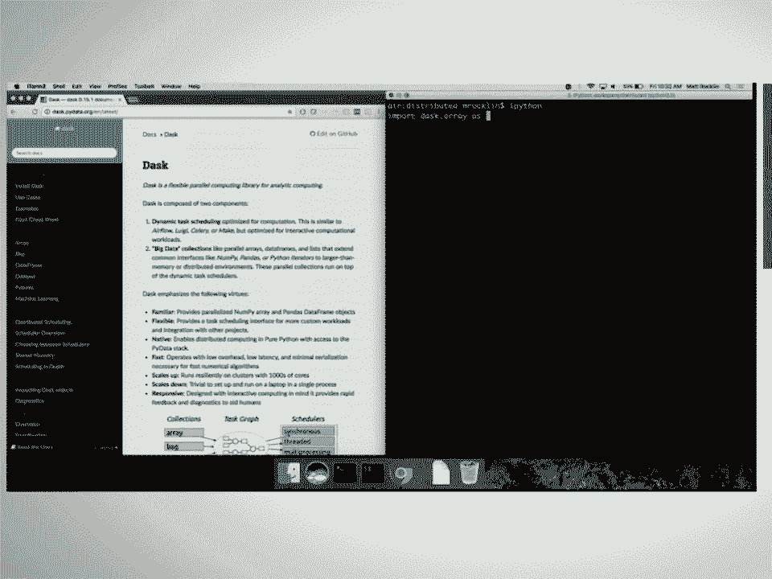
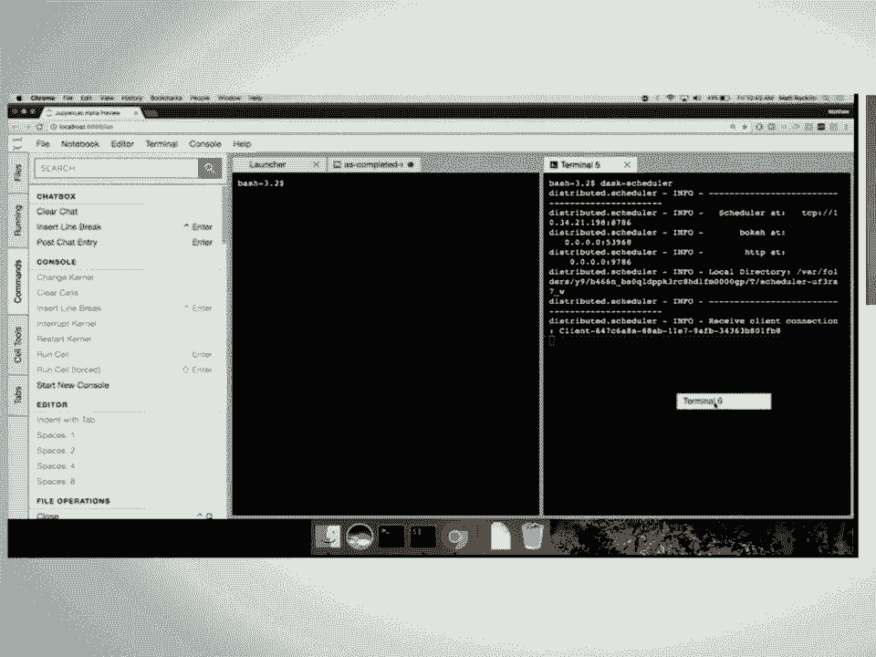

# SciPy 2017（合集） - P19：Dask - Advanced Techniques  SciPy 2017  Matthew Rocklin - 哒哒哒儿尔 - BV1Cs411A76Y

 >> Good morning， everyone。 Morning， Tom。 Morning， everyone。 So my name is Matt Rockman。

 I'm talking about desk。 I've been in many talks about desk previously， and I'm going。

 to assume you've seen one of them。 I usually get a generic talk。 I have five or ten minutes。

 at the end and do something cool and fun。 This talk is going to be all cool and fun， things。

 So that may not be what you're expecting。 If so， a couple of resources you could go， to。

 You can go to a PyCon 2017 talk this year。 Just a pretty good overview。 Jim Chris and。

 Martin Drent also did a great desk tutorial earlier today。 The videos are already up， on YouTube。

 So if you want to step outside， watch a YouTube video， it'll be just fine， too。

 Today we're going to talk about a couple of things。 First， I'm going to try to motivate。

 you to try out some of the new task schedulers we've been using。 So a desk had a task scheduler。

 that we announced a couple years ago that was good for single machine parallel programming。

 We've expanded it out to distributed computing。 But that's also quite useful on a single machine。

 too。 We're going to start to see some new features that allows even to sign your laptop。

 We're talking about some more advanced asynchronous task scheduling features that desk has。 And。

 we're going to try to point people towards some development opportunities。 So my goal。

 is to get people to work on desk either on the code base itself or hopefully within your。

 own code bases。 So desk is really here as a service library for other side-by stack libraries。

 So let's see it percolate out。 But again， I'm not going to explain desk at a high level。

 I'm going to assume that you have some exposure to desk。 Actually， briefly， who here has heard。

 of desk？ That was really different two years ago。 That's awesome。 Who here has used desk。

 at least once？ That's also really awesome。 Who here has used a distributed scheduler？ Oh。

 that's more than I was expecting。 Hopefully we get more hands though at the end of the， screen。

 So that screen has a little bit of scattering。 Okay。 So the desk to do the scheduler。

 has a centralized scheduler which coordinates many workers。 These workers could be on different。

 machines。 They can also be in the same machine。 They can be in the same process for the same。

 thread。 So even though we call it the distributed scheduler， it can be used effectively in a。

 single machine setting。 I'm going to use it very briefly to try to motivate you guys to。

 also use it。 So how's that in the back？ I think for thumbs up thumbs down。 Well， that's。

 what we're going to -- so if I have a desk array， I can compute some computation。 I can。

 add it to its transpose。 This is a communication heavy computation。 You can compute it with， some。

 And that happens around a second。 We all like those things。 So you could also import。

 the client object from the desk distributed library。 And I usually want to hit client。

 We point to some of the address of some distributed cluster somewhere。 If we don't do that， it。

 will create for us these workers and schedulers in our own machine。 So if you just call client。

 with no arguments， it will set up everything up for you。 Then all of your computations will。

 automatically use that scheduler by default。 In this case， it's actually going to be slower。

 I've intentionally chosen this example。 It's a bit slower。 Adding an array to its transpose。

 is communication heavy。 And here we're actually communicating a lot between different processes。

 When we're using the thread of the scheduler， we didn't have that extra cost。 So why would。

 you use this？ One reason why is because you have all these flashy diagnostics。 This is。

 a bouquet server application。 It's a streaming application。 I'm shoving diagnostic information。

 into the Python side and showing up on JavaScript。 So I'm going to run that again。 One of the。

 nice things about the Dastro scheduler is it exposes a lot more information about what's。

 happening internally。 So we can zoom in a little bit here。 We can see what every core， every。

 row is one of my cores。 It was doing over time。 In this particular instance， it was transferring。

 some data。 That transfer took around 500 milliseconds。 It was also creating some data。

 at the same time。 It was overlapping communication computation。 So diagnostics is one reason。

 Another， reason is you have more new fun tools。 For example， the distributed scheduler can maintain。

 state。 So previously with the single machine scheduler， you would give it a graph and it。

 would compute that graph and give you back a result。 And here we're saying compute this。

 thing and hold on to it for a while。 I'm going to do other things with it in the future。 So。

 now if I do something like compute a sum， the random arrays have already been computed。

 and they're sticking around。 So there is some overhead using the scheduler。 You can。

 generally be much more intelligent with it。 So you get diagnostics。 You get new features。

 We'll talk about those features about the rest of the talk。 I actually have or had a。

 terabyte cluster sitting around。 It was right here。 Unfortunately， I think it was gotten。

 a lot better about cleaning up $100 per hour clusters when I leave them idle。 So I'm starting。

 up one on this laptop and maybe by then the talk it will be running。 But in the meantime。

 it will make me a little less pressured for time。 The last stream scheduler is also very。

 lightweight。 So does it need to run many processes？ It's one of the same process。 Doesn't。

 have to use sockets。 It can transfer data around。 I just use queues。 And so here's an。

 example where we are starting a new cluster。 We're connecting to that cluster with a client。

 We're submitting a new task to that cluster。 We're then tearing down the cluster and closing。

 the client and that finishes in 38 milliseconds。 39 milliseconds。 So you should think of the。

 dash to the scheduler as being a very lightweight thing。 It takes much longer to import pandas。

 than it does to do all these things。 So again， you know， you should not -- the task is lightweight。

 We're now depending on tornado or depending on cloud pickle。 But that's all。 So if you。

 write a library， you might consider it depending on it。 The single machine scheduler is still。

 more lightweight。 It's just end of live only。 But you have to come more dependencies。 You。

 get some of these nice new features。 By the way， in case the contrast here is a bit poor。

 I apologize。 I've tweeted the slides with both the SciPy 2017 hashtag and the Dask hashtag。

 And you can look at all the examples there。 It should be much more clear。 Thanks to Antoine， Petrou。

 I'm going to try to call out people who have done good things that prompted recently。

 Antoine Petrou totally refactor the network comms and the setup and the process handling。

 So he's -- who's to thank for that 39 milliseconds and many other things。 Okay。 So I should do an。

 example where the Dask is actually slower than the single machine scheduler。 That's why， I tried to。

 you know， show the worst case。 Here's a better example。 So in Oswald tweeted。

 out this picture showing Dask data frame and how he's speeding up his data frame -- his。

 pandas computations。 So this line is taking around 19 seconds to run a computation。 And。

 with the Dask multi-processing scheduler， he's able to get around a 2 or 3x speed up。 And。

 he's playing here with a number of partitions on the x-axis。 But， you know， the best case。

 gets sort of a 2ish x speed up。 You know， 12 hours later， I said， "Hey， this is really， great。

 You want to show you some different schedulers。" For anything that's sort of pure。

 Python-y and he was doing some string processing， you want to try the Dask to ship it to the scheduler。

 So immediately afterwards， he and retweeted this plot， which shows the difference between。

 multi-processing and green and distributed in blue。 And actually， don't know what the computation。

 is， but this might be representative of a typical computation。 So lesson， if you're。

 using Dask data frame or Dask bag， if you're doing anything that's not definitely guilt， free。

 the Dask to be just schedulers is probably higher performance。 It also gives you fancy， plots。

 Array users may still want to stick with a threaded system， so you can start that。

 with classes equals false or just continue using the original schedulers。 You may also。

 have a cluster。 And many people doing array competitions do。 That community seems to usually。

 have access to some academic cluster resources。 Lesson number two， if you tweet benchmarks。

 you can get really great priority support。 I will write features and fix bugs for blog， posts。 So。

 okay， so that was about Dask。 Great little bit。 I don't actually want to talk。

 about collections anymore。 I want to talk about new things。 So let's talk about a motivating。

 science example。 Science。 So， this is my rendition of a synchrotron。 It is a big circle in which。

 X-rays fly around very fast。 At various parts in that circle， those X-rays can sort of be。

 -- port can be opened up and the X-rays can zoom out and hit things that we want them， to hit。

 After they hit things， those photons tend to hit detectors。 So if you look at one。

 of those exit ports on that big synchrotron， it looks kind of like this。 This is a bit。

 of a photo credit to Dan Allen， who took this photograph from a book of national labs a couple。

 days ago。 He unfortunately couldn't come to sci-fi。 You'll notice the date up there。

 And this is clearly science， right？ Here's some user interfaces that are definitely not， web-based。

 Over here， we're going to zoom in。 And here's a big spiky thing that's encrusted， in aluminum foil。

 So you know that it's science。 There's even some caution tape flying down， here。 And so， you know。

 photons are zooming through。 And notice also these two computers， that are sitting here。

 So as those photons hit some detectors， they get counted。 And we。

 eventually get those counts as numpy arrays。 And it comes our problem。 And so now， you know。

 those images are not the images that we actually want to see。 We need lots of processing on， them。

 That processing can be complex。 Fortunately， we have scikit image。 We have numpy， and we can。

 make lots of custom computations。 Eventually， we want to store some of those results， both。

 the raw images， some of the evaluated in the computer images， into a database。 This isn't， big data。

 So， DAS does not necessarily just elaborate for big data computations。 You're， not big arrays。

 But there are lots of arrays that bring complex things with them in a real， time fashion。

 Additionally， we have scientists who are sitting there looking at their screen。

 who would like to twiddle knobs， have that affect the computation， and have that affect。

 their screen again。 So this needs to be real time and fairly fast。 We're talking about。

 some real time applications here。 To handle all those computation， we have some resources。 One。

 we have two computers that are physically at the station。 Notice these two screens。 And。

 they can do some work for us。 However， as we sort of tweak some of those knobs and some， of that。

 we get more and more images， we might have to overflow to a nearby cluster nearby， data center。

 Okay。 So we're going to build this pipeline system using DASK。 And to be， clear。

 DASK is not a system for building image pipelines。 DASK is a system that you can wrap。

 around your own problem。 And that's really the intent that I want to convey here generally。

 using this as an example。 But you might want to think about your own problem while we're。

 going through this example。 We're talking about the concurrent futures interface。 This。

 is a standard Python interface that we have implemented and extended。 It has to be a little。

 better for real time things。 It'll be just as flexible as DASK delayed。 If you're familiar。

 with that， you can， I'm assuming that you are。 We're talking about changing computational。

 graphs on the fly。 We're talking about some multi-client workloads。 We'll see what that， means。

 And we'll also talk about worker coordination primitives like queues and globally shared， variables。

 Okay。 So the concurrent futures interface。 So we're going to make a client。

 Let's see if we can get that a little bit bigger。 Ruby Hill's not doing this thing。 We're going。

 to make a client client。 And then we can submit a task to run on that cluster somewhere。 Here。

 the clusters are laptop。 And we do that by submitting the function and then a sequence。

 of arguments and keyword arguments。 That gives us back immediately a future， which is a pointer。

 to computation that will eventually be done and a pointer to that address whenever it finishes。

 it will point to that address in an indestributive memory somewhere。 That computation happens in。

 the background。 And in the background， we learn about its status。 We just wait for the while。

 in print that future again。 We'll learn that it is finished， the type is int， et cetera。

 If we want to， we can then gather that result back。 So the result will block on the computation。

 and gather result back to us。 Or we usually don't want to gather results back to you。 By， default。

 they stay on the worker where they were computed。 And so here， you might want。

 to submit more tasks on those computations。 In DAS distributed with a computer interface。

 if you submit a task on top of other futures， it will cause a dependency。 Like here。 This， is very。

 very similar to how DAS delayed works， except that now we can control it on the fly。 It's real time。

 So out of these tasks are happening。 We can watch what's going on。 We can update， them。

 We can cancel them。 We can add more tasks based on maybe good areas。 So again， as these。

 futures are happening， we're getting back status updates。 The first future here is still running。

 It's still pending。 The second future is finished。 And we can base on these status updates， we。

 can do whatever we want。 We're on Python。 We can collect all the bad ones and see what the。

 exceptions were。 Find all the good ones， gather the results。 Submit more tasks that are maybe。

 around good results。 As an example of that， so there's as completed， which is also part。

 of the standard concurrent futures interface。 We try very hard to follow the standards where。

 they exist。 And then sometimes extend them。 So as completed gives you， we're going to use。

 some of these things。 So I'm going to go through a list of features。 I apologize for。

 speaking quickly。 So as completed， you get a bunch of futures that are running。 And it。

 gives you those features as they complete。 So maybe that your first future doesn't finish， first。

 Maybe your fifth future finishes make them out of order。 In this example， we are。

 gathering these features。 And as they come in， we're trying to find the best one。 Maybe。

 if we find the best one and say， hey， well， this is good enough， I'm just going to cancel。

 out of here and cancel the rest of my work。 I found something nice enough。 This is a good。

 example where being able to operate on the fly can give you some efficiency。 This is a。

 very simple example you might think of other ones。 Another fun example here is maybe， again。

 I've submitted all these futures。 I'm getting results back as they come。 Whenever I find a。

 particularly good result， I want to submit a couple of other tasks right around that result。

 Maybe I'm searching。 So this in this way， I can sort of guide my computation as I get。

 partial results。 Again， you can think about some optimization machine learning algorithm。

 that sort of look like this。 As an example， let's get one look at this is from Jim Christ。 So okay。

 So I'm going to try to optimize this function。 This is the Rosenbach。 Rosenbach， function。

 So I'm going to connect to a client。 Oh， no， I don't have a cluster set up。 I need。

 to set up some schedulers and workers because I wasn't cool enough to not include this address。

 But it's okay。 I can start a command line terminal from within my Jupyter lab experience。

 Isn't Jupyter lab the coolest？ I started a scheduler。 As a scheduler pops up， you'll see。

 the client connects。 Let's make a new terminal as well for a worker。 The Jupyter lab guys。

 are buying their beer tonight， by the way。 They don't know they yet， but they agree。 This。

 is how you set up a task on a cluster experience。 You might as a satent to them。 You might use。

 this with some other cluster system。 But that's， you know， you start a scheduler， start many。

 workers。 And as those workers connect， we'll see that we've connected up to one worker with。

 four cores and a few gigabytes of RAM。 So I've got this function， which is， you know。

 encode here and visually here。 I apologize for the poor color map。 This is what's on Wikipedia。

 And I want to find the minimum value of that function。 So what I'm going to do is this。

 anywhere near visible in the back。 Great。 Thank you。 Okay。 So I'm going to submit that function。

 to one on many points， maybe like ten points。 And then as they come in， I'm going to get。

 their score in the point。 And if it's better than the best score that I've seen， I'm going。

 to print out some results。 We'll sort of see some scores coming in， which will be pleasant， to see。

 And then every time as a new point comes in， I'm going to submit a new candidate。

 to test that's somewhere around the best point that I've seen so far。 And as we continue。

 I'm going to sort of reduce the scale that we look at it。 So we're going to sort of zoom。

 in on the best point that we've seen。 Okay。 As I do that， I'm also going to want to show。

 actually I think I have this already up。 I also want to see the diagnostic page。 And。

 that's concerning because that's the last diagnostic page from this client， which means。

 we'll restart these。 Everyone reconnects。 Now the book AOP is in place。 Excellent。 Okay。

 So let's go ahead and start that running。 And we will see that we're getting results， that come in。

 And we only have about 20 tasks running。 Look at this progress bar down here。

 We only have around 20 tasks running at even point。 But as tasks complete， we launch new。

 tasks again around that good area。 And so we're getting closer and closer。 It seems。

 like we're zooming in pretty far on this value of one， come along。 It seems to be the。

 optimum point of this function。 So we wrote， you know， relatively naive， but we could have。

 made some choices。 We wrote a naive algorithm to do optimization search。 And we did it relatively。

 easily。 We did that with these primitives。 So these are sort of nice things to use to。

 build out some more complex algorithms。 Okay。 What's my time？ Great。 Okay。 So， other feature。

 we're going to need， we're going to need to submit tasks from other tasks。 So we run some。

 function on some worker。 And we're going to want that worker to itself submit more tasks。

 to other workers。 How we handle this in DASK。 So usually you have a single centralized， scheduler。

 You have many workers。 You have a single client which controls that scheduler。

 You can actually work with your friends on the same cluster。 This is really helpful if。

 you have a terabyte dataset。 You're working on you want to share that dataset。 Maybe share。

 results back and forth。 We're not going to talk about that today。 But that's also possible。

 What we are going to talk about is you have all of those workers themselves start clients。

 that can then control the rest of the cluster。 So this is like if you're flying a plane。

 you gave every passenger like they control。 But it works out pretty well。 We need to coordinate。

 but it works out pretty well。 And it looks like in code， there's a few functions we're。

 going to care about。 Inside of a task， you can call these functions， get client。 Which。

 means give me a new client that I can use back to my scheduler。 Get worker。 I want to。

 affect the data locally on my machine。 To see it in Fire， forget， you should look at docs。

 We'll get into them。 And so we can submit a task。 This function that itself gets a client。

 that submits more tasks。 This is cheap to do。 It's fine。 There's no sort of performance。

 penalty here。 And this small API change allows some very complex workloads。 So here's the。

 Tibonacci。 Here's computing Tibonacci。 This runs fine。 There are also things like multi-client。

 coordination。 It asks things like just a shivity queue and a shivity global variables that clients。

 can use to coordinate metadata。 You can create futures。 I'm going to move on a little bit。

 So here's an example of a multi-producer， multi-consumer system built with DAS with this， interface。

 This is a classic kind of parallel programming system you might want to build， for data processing。

 And here we've built it in around 15 or 20 lines of code。 Using。

 systems that Python programmers already tend to know。 People tend to have worked with queues。

 before。 They've worked with concurrent futures。 Using APIs that are relatively familiar。

 but again scaling out to that cluster。 Okay。 So let's think about this beamline example。

 So if you are looking at the slides， there's a gist of the code that's been handed to us。

 So we have been handed some loving code by some of our scientific colleagues that has。

 a function to return to us some data from a detector。 The detector is counting photons。 And for us。

 we're just going to simulate this by creating a random array。 But once we。

 sort of have a synchrotron， we might use that。 We have some silly small functions which are。

 going to simulate some work。 And we also have this function that's going to save that data。

 to a database somewhere。 Is it just doing a side effect？ It's not returning anything for， us。

 And you have a list of loving message from our collaborators asking us to please。

 compute this sort of computation on each of our arrays and save it to a database。 I am。

 low-ish on time。 So I'm just going to switch to the solution which looks a bit like this。

 So while we're looking at that， I'm going to set up our beamline system。 So on some， machine。

 I'm going to have a scheduler。 So this isn't running a laptop， right？ We're。

 actually running on different machines。 So we're going to simulate setting up a cluster。

 in that setting。 On one of the-- that's right。 I have another scheduler running over here。

 On one of our beamline machines， we're going to connect up to that scheduler。 And we're going。

 to give that a name。 This is going to be machine beam one。 So Dask has the ability to localize。

 computations to certain machines or machines with certain resources like GPUs or big memory。

 There's another one。 And we're also going to make just sort of a pool of workers somewhere。

 else that is on our-- will make maybe five of these。 There's like an online laptop but。

 this is actually on a data center somewhere in theory。 So great。 We've got all those machines。

 Our sort of beamline is set up。 And what we're going to do is we're going to keep in a while。

 loop calling get data from image to protector。 We're going to send it out to the cluster。

 We're actually on the clusters。 It's going to be free operation。 We're going to submit， some tasks。

 That's the code of the computations or you just want。 We're then going to submit。

 these sort of saving operations。 We actually don't care about those results。 We want them。

 to definitely happen sometime。 So we're going to call this fire and forget method function。

 We're not going to get into it but there's good documentation on that。 Then we're going。

 to connect it up to our cluster。 We're going to set sort of a sleep time。 We want to wait。

 two seconds between detection intervals。 Then we're going to target this function。 This function。

 is going to handle each beam to each of our individual workers。 So we are submitting the。

 collect from beam function to beam one and to beam two。 So Dask is usually-- it sort of。

 runs functions wherever is best。 But you also direct it。 I want this thing to run this machine。

 or these kinds of machines。 And that can be your useful in certain situations。 So let's。

 go ahead and run this。 We started these two tasks here， collect from beam。 There's two， of them。

 They're never really going to finish。 There's always going to be running。 You said。

 every couple of seconds a bunch of tasks start showing up on my worst station。 So these are。

 beam firing off some tasks and things start running。 Now we have this knob， this sleep。

 time knob which we can set。 So it's currently set at two。 And we can now set-- let's crank。

 things up a little bit。 Instead of getting an image every two seconds， let's get an image。

 every 100 milliseconds。 So what this is going to do is now those tasks are now firing off。

 numpier rays way， way faster。 And as you see， they start to saturate。 But that's okay。 Our。

 other workers have sort of kicked in and they're starting to handle some of that excess。 So。

 that's an example of using Dask in a non-trivial example。 This is almost certainly not what。

 you guys do。 But Dask can be used in lots of interesting situations。 So to wrap up， you。

 should try out the Dask in a scheduled scheduler。 As a variety of good features， we've seen a。

 particular set of features around real-time operation。 But there's many more that you probably。

 haven't seen。 Now would be a good time to look at documentation again。 Some things people。

 should work on。 So there's a lot of good projects to work on。 These are not easy projects。 These。

 are hard。 But they're the kind of thing that might generate a talk in the future。 So I'm。

 being kicked off the stage soon。 So we could thank Matt for that talk。

 Sam Penrose can start getting the computer set up。 Will Matt take some questions on the slide？

 If you have questions， I think there are microphones there。

 Or wave your hand and I'll bring you one。 Or wave your hand a while， Dave。

 What are some projects I can work on？ You work for continuing with me。

 What are some projects that people in the community can help out with？ There are tons of projects。

 First， you can use your own projects。 We're doing a sprint， tomorrow and the next day。

 This is not about contributing to Dask。 It's about using Dask， in your own code base。

 You don't have anything。 There's some nice things。 We're working on， some geo-panda stuff。

 some streaming data frames。 But ideally we'd love to see you show。

 up with your own problems that you want to use Dask for。 Hi， over here。 I love that dashboard。

 by the way。 Is that just part？ Does it automatically。

 get instantiated when you bring up the workers or how does it work or what do you need to。

 set up for？ That is a bouquet server application， which is a fantastic project。 I really enjoy it。

 It's， about 800 lines of Python code to get that running。 That's for us to build it。

 When you start up a Dask scheduler， it runs automatically。 There's。

 also another one running on all the individual workers。 So it's just running automatically， for you。

 Awesome。 Thank you。 Are there any other questions？ All right， let's thank Matt again。 [Applause]。

 [BLANK_AUDIO]。